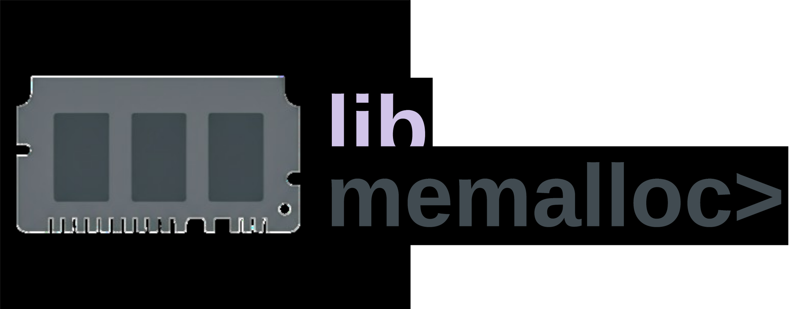

<a id="readme-top"></a>

<div align="center">

  [![Contributors][contributors-shield]][contributors-url]
  [![Forks][forks-shield]][forks-url]
  [![Stargazers][stars-shield]][stars-url]
  [![Issues][issues-shield]][issues-url]
  [![ULicense][license-shield]][license-url]
  [![LinkedIn][linkedin-shield]][linkedin-url]
  
</div>

##

<p align="center">
  
</p>

##

<div align="center">
  by: Rafael V. Volkmer - @RafaelVVolkmer - rafael.v.volkmer@gmail.com
</div>

##
# - Project Description

- *Library documentation available at: [libmemalloc](https://rafaelvvolkmer.github.io/libmemalloc/)*

`libmemalloc` is a lightweight C library that replaces the standard allocator with a fully introspectable, high-performance heap manager. It features multiple allocation strategies (First-Fit, Next-Fit, Best-Fit), segregated free lists for O(1) operations, large-block optimization via `mmap`, and dynamic heap growth/shrinkage using `sbrk`. Advanced capabilities include background mark-and-sweep garbage collection, custom `MEM_memset`/`MEM_memcpy` accelerated by prefetch hints, thread safety with internal locking, Valgrind integration for detailed leak reports, and configurable logging levels. Simply link against the provided `.a` or `.so`, include `libmemalloc.h`, and swap your `malloc`/`free` calls for `MEM_*` APIs to transform memory management into a robust, self-healing subsystem.

<p align="right">(<a href="#readme-top">back to top</a>)</p>

---

# - Repository tree

```python
/libmemalloc
├── /inc
│   ├── logs.h
│   └── libmemalloc.h
├── /src
│   ├── CMakeLists.txt
│   └── libmemalloc.c
├── /test
│   ├── CMakeLists.txt
│   └── tests.c
├── / Doxygen
│   ├── CMakeLists.txt
│   ├── Doxyfile.in
│   └── doxygen.md
├── /readme
│    └── libmemalloc.svg
├── Dockerfile
├── .dockerignore
├── CMakeLists.txt
├── .clang-format
├── .clang-tidy
├── build.sh
├── .gitattributes
├── .gitignore
├── LICENSE
└── README.md
```

---

# - Build and Use

### Clone the repository

```bash
# Clone the project and enter the folder
git clone https://github.com/RafaelVVolkmer/libmemalloc.git libmemalloc
cd libmemalloc
```

### Local build

```bash
# Make the build script executable
chmod +x build.sh

# Build in Release mode (default)
./build.sh release

# Or build in Debug mode
./build.sh debug
```
### Docker build

```bash
# Make the build script executable
chmod +x build.sh

# Build in Release mode (default)
./build.sh --docker release

# Or build in Debug mode
./build.sh --docker debug
```

<p align="right">(<a href="#readme-top">Back to Top</a>)</p>

---

# - Tech Stack and Environment Settings

| **Category**               | **Technologies and Tools**                                                                                                                                                                                                                                  |
| -------------------------- | -------------------------------------------------------------------------------------------------------------------------------------------------------------------------------------------------------------------------------------------------------------- |
| **Programming Languages**  |                                                                                                                                                                 |
| **Build System**           |                                                                                                                                                       |
| **Version Control**        |                                              |
| **Documentation**          |                                         |
| **Support Tools**          |                                                                                                                                                     |
| **Operating System**       |                                                                                                                                                            |
| **IDE**                    |                                                                                                                                                      |

<p align="right">(<a href="#readme-top">Back to Top</a>)</p>

---

# - References

| Title                                                                   | Author / Year                  |
| ------------------------------------------------------------------------ | ---------------------------- |
| **Understanding and Using C Pointers: Core Techniques for Memory Management** | by: Richard M. Reese, 2013  |
| **The Garbage Collection Handbook: The art of automatic memory management**    | by: Anthony Hosking, 2011   |
| **C++ pointers and dynamic memory management**                           | by: Michael C. Daconta, 1993 |
| **Efficient memory programming**                                        | by: David Loshin, 1999       |
| **Memory Management**                                                   | by: Bill Blunden, 2002       |

<p align="right">(<a href="#readme-top">back to top</a>)</p>

[maintainability-shield]: https://qlty.sh/gh/RafaelVVolkmer/projects/libmemalloc/badges/maintainability.svg?style=flat-square
[maintainability-url]:   https://qlty.sh/gh/RafaelVVolkmer/projects/libmemalloc
[stars-shield]: https://img.shields.io/github/stars/RafaelVVolkmer/libmemalloc.svg?style=flat-square
[stars-url]: https://github.com/RafaelVVolkmer/libmemalloc/stargazers
[contributors-shield]: https://img.shields.io/github/contributors/RafaelVVolkmer/libmemalloc.svg?style=flat-square
[contributors-url]: https://github.com/RafaelVVolkmer/libmemalloc/graphs/contributors
[forks-shield]: https://img.shields.io/github/forks/RafaelVVolkmer/libmemalloc.svg?style=flat-square
[forks-url]: https://github.com/RafaelVVolkmer/libmemalloc/network/members
[issues-shield]: https://img.shields.io/github/issues/RafaelVVolkmer/libmemalloc.svg?style=flat-square
[issues-url]: https://github.com/RafaelVVolkmer/libmemalloc/issues
[linkedin-shield]: https://img.shields.io/badge/-LinkedIn-black.svg?style=flat-square&logo=linkedin&colorB=555
[linkedin-url]: https://www.linkedin.com/in/rafaelvvolkmer
[license-shield]: https://img.shields.io/github/license/RafaelVVolkmer/libmemalloc.svg?style=flat-square
[license-url]: https://github.com/RafaelVVolkmer/libmemalloc/blob/main/LICENSE.txt
