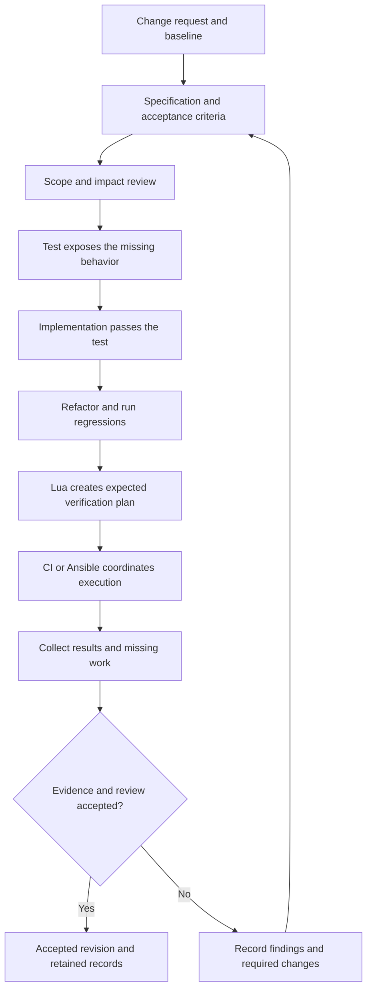

<!--
SPDX-FileCopyrightText: 2026 Rafael V. Volkmer <rafael.v.volkmer@gmail.com>
SPDX-License-Identifier: GPL-3.0-only
-->

# Change and review procedure

**Status:** proposed wider operating model with an implemented local automation pilot. See the
[engineering playbook](../runbooks/process-pilot.md) for executable commands, schemas, tests and Ansible entry points.
The illustrative checker playbook below remains a design example. This document does not configure hosted
runner permissions or qualify a product release.

Use this model to connect product specifications, development, review and release evidence. Specification-led
development is the local practice; **Software Design Description (SDD)** denotes a design artifact. Preserve
existing [product SDD documents](../specs/README.md) and review their specification and design content.
TDD supplies the test-first development loop. The [CI reference](../reference/automation.md#ci-control-map)
remains the authority for implemented checks, and the [OpenSSF plan](../assurance/openssf.md) defines badge policy.

<details>
<summary><strong>On this page</strong></summary>

- [Responsibilities of each layer](#responsibilities-of-each-layer)
- [External frameworks and adoption boundaries](#external-frameworks-and-adoption-boundaries)
- [Documentation structure](#documentation-structure)
- [Procedure catalog](#procedure-catalog)
- [LMA-PROC-001: Specification to accepted change](#lma-proc-001)
- [Ansible execution model](#ansible-execution-model)
- [Example local validation playbook](#example-local-validation-playbook)
- [Lua interfaces and existing reuse](#lua-interfaces-and-existing-reuse)
- [Evidence and assessment records](#evidence-and-assessment-records)
- [Implementation order and acceptance](#implementation-order-and-acceptance)
- [Sources and verification scope](#sources-and-verification-scope)

</details>

---

## Responsibilities of each layer

| Layer | Responsibility | Authoritative material |
| --- | --- | --- |
| Product specification | Define behavior, constraints, failure modes and acceptance conditions. | Existing IDs and contracts in `docs/specs/`. |
| Engineering policy | Define coding, review, verification and release requirements. | Language guides, CI standard, governance and security policy. |
| Procedure | Assign triggers, inputs, steps, owners, acceptance and records. | Proposed `LMA-PROC-*` catalog below. |
| Ansible orchestration | Prepare execution hosts and coordinate selected Lua entry points. | Proposed versioned inventories, roles and playbooks. |
| Lua implementation | Select work, enforce project rules, invoke tools and validate evidence. | Domain commands and libraries in `scripts/`, backed by `tools/` policies. |
| CI service | Supply events, runner isolation, required results, protected environments and retention. | Existing `.github/workflows/` and effective hosting settings. |
| Assessment | Judge whether a control's evidence is sufficient for its scope. | Versioned mappings and accountable reviewer decisions. |

Keep acceptance logic in Lua so contributors and CI invoke the same checks. Ansible YAML should describe
execution state and delegation rather than duplicate arithmetic, schemas, framework criteria or tool matrices
inside Jinja expressions. Use the existing build system for compilation.

For one ephemeral CI runner, direct Lua execution may remain the simplest entry point. Ansible adds value
when maintainers need consistent host preparation, several laboratory machines, local reproduction or remote
hardware coordination. Introduce it first for those needs. Keep an Ansible-free route to ordinary local checks.
Ansible's controller/runtime dependencies remain external tools; project-owned automation stays in Lua.

---

## External frameworks and adoption boundaries

Select editions and applicability through the [framework mappings](../assurance/framework-mappings.md).
Use [workflow assurance](../assurance/workflow.md) to connect each stage to its owner, required records and
acceptance decision. SPICE assessment examines the selected processes and their capability; TISAX
preparation addresses the organizational security scope and its ISA criteria. Neither conclusion follows
from a successful local playbook run.

---

## Documentation structure

Start with the [documentation index](../README.md) and [engineering playbook](../playbook.md).
Specifications define product behavior; standards define repository rules; procedures define responsibilities
and acceptance; runbooks contain executable steps. Reference pages describe automation contracts, while
assurance pages record framework mappings and gaps. Record architectural rationale and acceptance in the issue or pull request.

Keep executable code in `scripts/`, host orchestration in `infra/ansible/`, and catalogs and schemas in `tools/`.
Use links to canonical rules instead of copying them into each runbook or framework mapping.

---

## Procedure catalog

These IDs reserve a proposed catalog. Assign actual role holders through [governance](../../GOVERNANCE.md)
before treating a procedure as operational. Combining related procedures in one document is acceptable.

| ID | Trigger and responsible role | Required output |
| --- | --- | --- |
| LMA-PROC-001 | Behavior change; author and specification owner. | Reviewed requirement, acceptance cases and SDD/TDD record. |
| LMA-PROC-002 | Proposed integration; reviewer and maintainer. | Review tied to the exact accepted revision and unresolved findings. |
| LMA-PROC-003 | Verification campaign; verification owner. | Expected plan, executed results, missing-work report and acceptance. |
| LMA-PROC-004 | Baseline or tool change; configuration owner. | Versioned inputs, dependency/tool identity and impact assessment. |
| LMA-PROC-005 | Release candidate; release owner. | Qualified artifact inventory, verification instructions and promotion record. |
| LMA-PROC-006 | Vulnerability report; security contact. | Restricted triage, remediation, disclosure and response-time records. |
| LMA-PROC-007 | Dependency update or advisory; dependency owner. | Applicability, update/test decision and unresolved-risk record. |
| LMA-PROC-008 | Access grant, revocation or owner absence; maintainer. | Authorized privilege change and tested continuity arrangements. |
| LMA-PROC-009 | Incident or recovery exercise; incident owner. | Timeline, containment/recovery evidence and follow-up work. |
| LMA-PROC-010 | Assessment interval or release; assurance owner. | Versioned mappings, evidence review, gaps and accepted deviations. |

Each procedure needs status/version, scope, trigger, input revision, responsible role and substitute,
ordered steps, acceptance conditions, required records, evidence classification/retention and allowed
exceptions. Identify the authority that may accept a deviation and its expiry. Record actual assignments;
multiple role labels do not establish independent reviewers or organizational continuity.

---

<a id="lma-proc-001"></a>

## LMA-PROC-001: Specification to accepted change

**Status:** proposed procedure. **Owner role:** specification owner.
**Scope:** behavioral changes to the product or its automation. Documentation-only changes use applicable
document checks; they do not require an artificial failing runtime test.

**Inputs:** change request, exact baseline revision, affected SDD identifiers, observable acceptance
conditions, target/configuration scope and initial risk/compatibility assessment.

Use the [specification issue procedure](specifications.md) for SDD approval, reserved area labels and
PR closure. The implementation loop below operates within that approved issue scope.

1. The author identifies the requested behavior, affected interfaces, invariants and failure paths. Update
   the relevant SDD with acceptance conditions that a reviewer can evaluate. Keep the change linked to its
   requirement and design decisions in both directions.
2. The specification owner reviews the change's meaning and impact. Record authorization to implement under
   the selected change policy. The existing reviewed issue or PR may hold this decision.
3. The author adds an acceptance or regression test and records its failure against the appropriate baseline.
   Check the failure reason: a missing compiler, unavailable host or unrelated crash does not demonstrate the
   missing behavior. Where the feature is new, identify how the test detects the absent implementation.
4. The author implements the smallest coherent behavior, then runs the same test to demonstrate success.
   Record both source revisions and the test content digest. If the test changes, retain that change and
   explain how its observation remains comparable.
5. The author refactors and runs the selected regressions. Add boundary, failure and property tests according
   to the affected contract. For allocator changes, consider overflow, alignment, ownership, exhaustion,
   concurrency, undefined behavior and supported profiles. TDD does not replace those verification measures.
6. Lua planners select the applicable campaign from the final revision. Ansible or CI executes the plan on
   declared hosts and collects reports. The aggregator compares returned results with expected work.
7. A reviewer evaluates specification consistency, implementation, tests, findings and evidence. A maintainer
   accepts or returns the change under the review policy. Automation records the decision; it does not invent it.
8. The maintainer binds acceptance to the final revision. A later edit invalidates affected evidence and
   approvals according to policy. Preserve the released artifact's connection to this accepted source.



**Acceptance:** the requirement and design agree; selected tests observe the contract; applicable required
checks pass on the final revision; unresolved findings have permitted dispositions; a qualified reviewer
records the required decision. A missing check cannot satisfy a required check.

**Records:** requirement/design links, change request, baseline and final revisions, test identity,
red/green/refactor observations, full verification plan/results, review identity and decision. Red observations
are local engineering evidence and need not become failing commits on the integration branch.

**Exceptions:** legacy characterization, emergency corrections and changes without meaningful runtime behavior
need a recorded alternative verification rationale. An exception to test-first order does not remove the
requirement to verify the resulting behavior. Do not claim historical TDD execution retrospectively from a
passing suite.

---

## Ansible execution model

Use separate playbooks for host preparation and verification. Preparation declares pinned tools and host
configuration; repeated preparation should converge without reinstalling unchanged inputs. Verification
executes the requested campaign and creates a fresh evidence record for each attempt. Ansible's `changed`
flag describes task state changes, not correctness. A verifier that writes results can legitimately change
state on each run. [Ansible's playbook introduction][ansible] explains the execution and idempotence model.

| Stage | Ansible responsibility | Lua or human responsibility |
| --- | --- | --- |
| Prepare | Select authorized inventory, provision prerequisites and isolate the workspace. | Resolve project tool pins from the existing lock/catalog. |
| Identify | Check declared host, source checkout and requested campaign. | Validate source/configuration digests and define expected work. |
| Execute | Invoke Lua with argument lists, timeouts and the required working directory. | Run build/test/analysis tools and retain their outcomes. |
| Collect | Transfer named evidence artifacts even after ordinary task failure. | Validate schemas, hashes, identity and plan completeness. |
| Assess | Present machine results and unresolved prerequisites. | Review applicability, findings, exceptions and human evidence. |
| Promote | Use a separate protected workflow for authorized publication. | Validate accepted artifact identity, sign/publish and record receipts. |

Pin Ansible, its collections and controller dependencies in a reviewed tool policy before rollout. Reuse the
existing toolchain catalog rather than maintaining a second compiler-version table in YAML. Use fully
qualified modules and `ansible.builtin.command` with `argv`, a fixed Lua entry point and explicit `chdir`.
Validate campaign and path inputs. Disable argument-variable expansion when supported by the selected
Ansible version. The [command module][command] documents these arguments.

Give verification jobs an unprivileged account. Confine `become` to the host-preparation tasks that require
it. Run untrusted contributions on isolated disposable hosts without release credentials or access to
privileged caches. A PR must not control the inventory that selects trusted internal hosts. Pin the checkout
and identify dirty input explicitly; for release evidence, require the accepted clean source snapshot.

The local example targets POSIX. Native Windows execution needs a separately qualified connection, command
adapter and compatible Lua/tool entry points. Cross-compiling on Linux does not demonstrate native Windows
execution. Controller support and target support are separate qualification decisions.

Treat `--syntax-check`, `--check` and actual verification as distinct operations. A command task may be skipped
in check mode. Neither a clean syntax check nor a simulation proves that the tests ran. Do not use `creates`
on a stale report to suppress a mandatory verification run. Source:
[Ansible check-mode documentation][check-mode].

Use `block`/`always` to preserve logs for ordinary task failures; retain the failure outcome. A successful
`rescue` can change how Ansible treats the original failure, so the final acceptance step must still inspect
the report. Unreachable hosts and invalid task definitions do not trigger the same block recovery behavior.
CI/controller finalization must report missing host records as infrastructure errors.
Source: [Ansible blocks and error handling][blocks].

---

## Example local validation playbook

This example invokes the existing local checker. It assumes an already prepared, trusted checkout
and the required tool versions. Shared source discovery includes tracked and untracked working files;
record pending changes with the tested revision. Use a fresh `run_id` per attempt. Do not execute simultaneous campaigns
in the same checkout because some existing adapters still use fixed cache paths.

The example is a proposed file such as `infra/ansible/playbooks/verify-local.yml`. It does not implement
TDD recording, a framework assessor, remote collection, release qualification or an immutable evidence store.

```yaml
---
- name: Validate a prepared libmemalloc checkout
  hosts: localhost
  connection: local
  gather_facts: false
  become: false

  tasks:
    - name: Require a real verification attempt and explicit inputs
      ansible.builtin.assert:
        that:
          - not ansible_check_mode
          - project_root is defined
          - run_id is defined
          - project_root is match('^/')
          - run_id is match('^[A-Za-z0-9][A-Za-z0-9_-]{0,63}$')

    - name: Locate any previous record for this attempt
      ansible.builtin.stat:
        path: "{{ project_root }}/.cache/logs/process-{{ run_id }}"
      register: previous_run

    - name: Preserve earlier evidence
      ansible.builtin.assert:
        that:
          - not previous_run.stat.exists

    - name: Create a private attempt directory
      ansible.builtin.file:
        path: "{{ project_root }}/.cache/logs/process-{{ run_id }}"
        state: directory
        mode: "0700"

    - name: Execute checks and retain the command result
      block:
        - name: Invoke the existing Lua checker
          ansible.builtin.command:
            argv:
              - lua
              - scripts/workspace/cache.lua
              - lua
              - scripts/check/all.lua
              - "--output=.cache/logs/process-{{ run_id }}/checks"
            chdir: "{{ project_root }}"
            expand_argument_vars: false
          register: check_result
          changed_when: true
      always:
        - name: Keep the result without changing its failure status
          ansible.builtin.copy:
            content: "{{ check_result | default({}) | to_nice_json }}\n"
            dest: "{{ project_root }}/.cache/logs/process-{{ run_id }}/command.json"
            mode: "0600"
          when: check_result is defined
```

`scripts/check/all.lua` rejects an existing output directory, records per-check results and returns failure for an
unsatisfied required local check. The playbook leaves that exit status intact while keeping the command
result. Its `changed_when: true` reflects a fresh attempt's files; it is not a passing verdict. Individual
checks have their own bounded execution; the rollout must also impose a campaign deadline in CI/Ansible.

No `--offline` flag appears here because the complete local checker includes checks that may access the
network. Its existing `--offline` option narrows some checks; it is not a network sandbox. An offline profile
must qualify all invoked tools and enforce egress restrictions separately.

After implementing and pinning the proposed Ansible entry point, a local invocation would be:

```sh
ansible-playbook -i localhost, infra/ansible/playbooks/verify-local.yml \
  -e '{"project_root":"/absolute/path/to/libmemalloc","run_id":"review-001"}'
```

Logs may contain input data. Export only selected, reviewed artifacts under the project's classification
policy. Restrictive file modes do not establish redaction or an approved retention policy.

---

## Lua interfaces and existing reuse

| Existing entry point or catalog | Reuse in the proposed workflow | Present limitation |
| --- | --- | --- |
| [`scripts/check/all.lua`](../../scripts/check/all.lua) | Local checks with `--output` and per-check logs/results. | Working-tree inputs; not a framework assessment or a production allocator qualification. |
| [`cache.lua`](../../scripts/workspace/cache.lua) | Keep disposable state under the repository `.cache/`. | It inherits credentials and provides no sandbox. |
| [`scripts/qualification/plan.lua`](../../scripts/qualification/plan.lua) | Define expected work using `--campaign` and `--output`. | Current campaigns qualify the implemented mock contract. |
| [`scripts/qualification/report.lua`](../../scripts/qualification/report.lua) | Aggregate `--plan`, `--input` and `--output` against expected work. | It reports pending product work and keeps `product_qualified = false`. |
| [`scripts/security/plan.lua`](../../scripts/security/plan.lua) | Expand the existing adapter catalog. | A selected integration is not an executed tool. |
| [`scripts/security/run.lua`](../../scripts/security/run.lua) | Execute `--project` with the adapter's prerequisites. | Outputs currently use a fixed per-project cache path; isolate workspaces or extend the interface. |
| [`scripts/security/report.lua`](../../scripts/security/report.lua) | Aggregate `--input`/`--output` and expose blocked/missing integrations. | Integration coverage cannot grant a badge or organizational assessment. |
| [`controls.yml`](../../tools/security/openssf/controls.yml) | Reuse the draft Gemara control-catalog approach. | Current catalog describes mock-release controls only. |

Add Lua adapters only for missing responsibilities: requirement-to-case traceability, TDD phase records,
assessment mappings and evidence indexing. Keep proposed names such as `scripts/process/check_traceability.lua`
out of executable playbooks until those implementations and tests exist. Do not replace the existing planners
and reporters with a single large `compliance.lua` program.

The current Lua option parser accepts `--key=value` for valued options; preserve that form in Ansible `argv`.
Define a machine-readable interface for each new adapter: schema version, validated input arguments, input
identity, output destination, bounded execution, result status and exit semantics. Keep JSON results separate
from human diagnostics. Require fresh output destinations or an explicitly verified resume protocol.

A common evidence envelope can reference existing report schemas without rewriting them. Preserve the
original statuses and their definitions. Current check, qualification and integration reports have different
contracts; normalize them through an explicit adapter when building the assessment index.

---

## Evidence and assessment records

See [evidence and assessment records](../reference/evidence.md).

---

## Implementation order and acceptance

1. **Adopt the process vocabulary and scope.** Review this proposed model, assign actual owners, and link the
   authoritative specifications and policies. Set each procedure's status without claiming execution.
2. **Implement a small Lua traceability/evidence adapter.** Validate real requirement IDs, test links and
   result identity. Reuse the existing draft Gemara catalog where its schema fits, and link its controls to
   procedure/evidence metadata. Do not force run logs into a control-definition schema.
3. **Pilot Ansible locally on a prepared checkout.** Pin the controller and collections. Qualify the example
   invocation, log retention and failure semantics before provisioning remote hosts.
4. **Add host preparation and laboratory execution.** Reuse existing tool pins and planners; isolate runs,
   validate inventory authority and bind each returned report to its producer and expected task.
5. **Adopt the reviewed procedures.** Add workflow entry points and templates, then gather records from actual
   changes. Expand mappings to the selected framework versions and leave unsupported claims pending.
6. **Connect release acceptance.** Reuse existing signing and release checks. A separately authorized promotion
   must consume the exact reviewed evidence/artifact set, never rebuild unreviewed content during publication.

Before making the Ansible path a required gate, demonstrate these behaviors:

| Scenario | Required observation |
| --- | --- |
| Passing and deliberately failing Lua checks | Ansible preserves the original outcome and collects the expected records. |
| Missing tool, unreachable host or interrupted worker | Final report identifies incomplete work and blocks acceptance. |
| Reused or foreign report | Identity and digest checks reject evidence from another revision, plan or attempt. |
| Tampered or missing artifact | Inventory/hash verification rejects the evidence package. |
| Repeated host preparation | Managed state converges; required verification still executes for a fresh attempt. |
| Check mode or a tag-selected subset | Report cannot masquerade as a completed mandatory verification campaign. |
| Concurrent campaigns | Distinct workspaces and output roots prevent overwriting or mixing records. |
| Untrusted contribution | No privileged inventory, credentials, signing keys or trusted writable cache is reachable. |
| Missing human approval or expired applicability decision | Assessment remains pending even when machine checks pass. |

Keep the existing CI path operational while piloting orchestration. A documentation move needs a separate
inventory of links, script-discovery paths and CI selections. The documentation migration updates those consumers
together; see the
[documentation validation guide](../getting-started/documentation.md).

---

## Sources and verification scope

Sources consulted on 2026-09-22. The external model versions named here identify the proposed mapping baseline;
archive their adopted revision or content digest when creating an assessment. Ansible's `latest` URL is
reference material, not an executable toolchain pin.

This guide describes the wider process design. Its illustrative YAML is separate from the tracked pilot
playbooks under `infra/ansible/`. Consult the [engineering playbook](../runbooks/process-pilot.md) for implemented scope
and validation boundaries. Remote provisioning, product campaigns and external framework assessment remain
unqualified; local automation evidence cannot satisfy those obligations.

[ansible]: https://docs.ansible.com/projects/ansible/latest/playbook_guide/playbooks_intro.html
[command]: https://docs.ansible.com/projects/ansible/latest/collections/ansible/builtin/command_module.html
[check-mode]: https://docs.ansible.com/projects/ansible/latest/playbook_guide/playbooks_checkmode.html
[blocks]: https://docs.ansible.com/projects/ansible/latest/playbook_guide/playbooks_blocks.html

<!-- EOF -->

