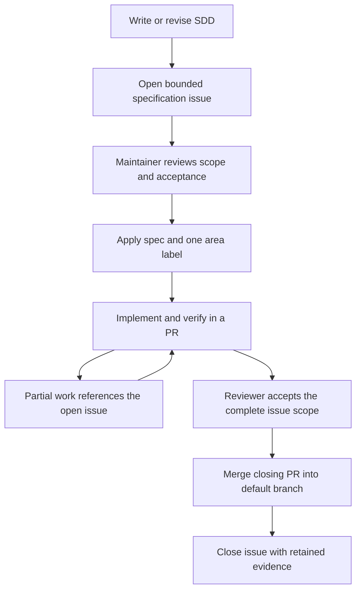

<!--
SPDX-FileCopyrightText: 2026 Rafael V. Volkmer <rafael.v.volkmer@gmail.com>
SPDX-License-Identifier: GPL-3.0-only
-->

# Specification issues and implementation PRs

Define the Software Design Description (SDD) before implementation. Open a bounded issue with the
[specification form](../../.github/ISSUE_TEMPLATE/specification.yml), then ask a maintainer to review its
scope. The [catalog](../../.github/specifications.lua) defines the reserved issue labels and maintainer roster.
Use `gc-implementation` for the existing garbage-collector SDD.

<details>
<summary><strong>On this page</strong></summary>

- [Areas and authority](#areas-and-authority)
- [From SDD to accepted work](#from-sdd-to-accepted-work)
- [Label enforcement](#label-enforcement)
- [Activation and recovery](#activation-and-recovery)

</details>

---

## Areas and authority

Only a listed maintainer with repository write, maintain or admin permission may apply or remove `spec`
and the area labels below. Keep the catalog roster consistent with [MAINTAINERS.md](../../MAINTAINERS.md).
CODEOWNERS assigns review of the catalog, workflow and adapter to the maintainer. Branch protection must
require that review; a CODEOWNERS entry alone does not configure the hosting rule.

| Area label | Canonical SDD |
| --- | --- |
| `compilation` | [Compilation](../specs/libmemalloc-compilation-SDD.md) |
| `core-implementation` | [Manual core](../specs/libmemalloc-core-implementation-SDD.md) |
| `distribution` | [Distribution](../specs/libmemalloc-distribution-SDD.md) |
| `gc-implementation` | [Garbage collector](../specs/libmemalloc-gc-implementation-SDD.md) |
| `security` | [Security](../specs/libmemalloc-security-SDD.md) |
| `tests` | [Tests](../specs/libmemalloc-tests-SDD.md) |

The maintainer applies `spec` and one area label after reviewing the issue. Split work across areas into
linked issues so each issue has a clear acceptance boundary. Keep vulnerability reports private under
[the security policy](../../SECURITY.md); the public security area tracks reviewed requirements.

---

## From SDD to accepted work

1. Write or update the SDD. Identify requirements, interfaces, failure cases and observable acceptance conditions.
2. Open a specification issue linking the SDD revision or its review PR, control IDs, scope, verification methods
   and required evidence. Link the rationale and evidence required by the [review procedure](decision-making.md).
3. A maintainer reviews the proposal, records scope acceptance and applies `spec` plus the area label.
   The author may propose work through the public form; the form grants no reserved label.
4. Implement the approved scope through reviewed PRs. Use `Refs #NUMBER` for partial work. Link tests and
   retained results to the exact implementation and SDD revisions.
5. Use `Closes #NUMBER` only when the PR satisfies the issue's complete acceptance conditions. GitHub closes
   the issue after the PR merges into the default branch. Opening a PR does not complete the issue.
6. For a large SDD, maintain a parent issue and bounded implementation issues. Each accepted PR closes its own
   issue. The maintainer closes the parent after reviewing coverage of its remaining requirements.



---

## Label enforcement

GitHub's [repository roles][roles] allow triage users to manage issue labels. Its
[label permissions][labels] do not expose a per-label maintainer restriction. This repository therefore
uses asynchronous reconciliation through [the specification workflow](../../.github/workflows/specifications.yml).
A reserved label can appear briefly after an unauthorized change; a failing or disabled workflow cannot
prevent that change. Maintainers must inspect failed runs and rerun reconciliation.

The adapter reads complete paginated label history and current repository permissions. For each reserved
label, it preserves the latest decision from an authorized maintainer and ignores other actors, including
its own repair events. It restores unauthorized removals as well as reverting unauthorized additions.
Unrelated labels remain untouched. Revoking authority from a maintainer can remove labels whose only supporting
events came from that maintainer; a current maintainer must reaffirm the affected decisions.

The write-enabled job checks out the trusted default branch. It reads issue metadata through `gh api` and
never executes issue text or PR code. It has `contents: read` and `issues: write`; it cannot publish releases
or documentation. Concurrent events for one issue use the same concurrency group and fresh API state.

---

## Activation and recovery

After merging the workflow and catalog into the default branch, a maintainer runs **Specification labels**
with an empty issue input to create or update the official label definitions. Supply an issue number to
reconcile an existing issue. Local equivalents require Lua, GitHub CLI authentication and repository access:

```sh
lua scripts/github/specifications.lua --operation=sync
lua scripts/github/specifications.lua --operation=enforce --issue=123
```

Catalog synchronization changes label definitions; it neither approves issues nor creates SDD issues.
Do not pass credentials through command arguments. Follow the [playbook](../playbook.md) for Ansible entry points.
Repository files provide the mechanism; hosted activation and protected-branch settings need separate verification.

[roles]: https://docs.github.com/en/organizations/managing-user-access-to-your-organizations-repositories/managing-repository-roles/repository-roles-for-an-organization
[labels]: https://docs.github.com/en/issues/using-labels-and-milestones-to-track-work/managing-labels

<!-- EOF -->

