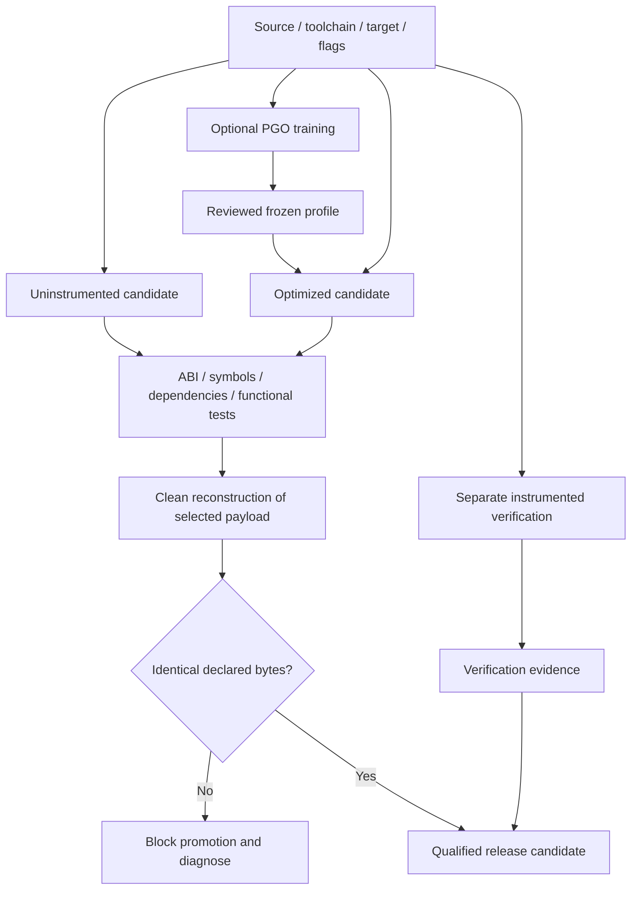

<!--
SPDX-FileCopyrightText: 2026 Rafael V. Volkmer <rafael.v.volkmer@gmail.com>
SPDX-License-Identifier: GPL-3.0-only
-->

# libmemalloc: Compilation, modules, ABI, PGO and delivery

Use this document to implement isolated builds, optimization profiles, and distribution gates. Start with the
boundaries, find the control in the index, and follow its requirements to the test catalog.

The contract defines the dialect/compiler/OS/ISA matrix and its constraints: no libc, CRT, or thread runtime; project-owned
atomic lowering; and PGO training separate from the release artifact. Publish support only after qualifying
the configuration.

**Evidence boundary:** This is a proposed product specification. Allocator correctness, portability, Rust
integration, fuzzing and stress campaigns remain unqualified. Repository checks cover documents and
automation fixtures; they do not establish product acceptance or evidence for another specification.

<strong>On this page</strong>

- [Authority and requirements](#governance)
- [Boundaries, authority and initial cut](#boundaries)
- [Build qualification overview](#build-qualification-overview)
- [Controls by responsibility](#inherited-controls)
- [LMA-BUILD-001: C dialect, portability and platform profiles](#lma-build-001)
- [LMA-BUILD-002: Modular build, code organization and ABI stability](#lma-build-002)
- [LMA-BUILD-003: Roadmap, acceptance gates and decisions still open](#lma-build-003)
- [LMA-BUILD-004: LMA_ namespace, product profiles, and complexity budget](#lma-build-004)
- [LMA-BUILD-005: Libc, loader, ABI adapters and process boundaries](#lma-build-005)
- [LMA-BUILD-006: Related work, differentiation and delivery cuts](#lma-build-006)
- [Detailed implementation contracts](#implementation-contracts)
- [LMA-BUILD-007: dialect, platform and product configuration](#lma-build-007)
- [LMA-BUILD-008: Isolated targets, native objects and LTO artifacts](#lma-build-008)
- [LMA-BUILD-009: Public API, opaque construction and export](#lma-build-009)
- [LMA-BUILD-010: Conventional PGO: collection, merge, use and provenance](#lma-build-010)
- [LMA-BUILD-011: ThinLTO, specialization and optimization boundaries](#lma-build-011)
- [LMA-BUILD-012: MemProf, allocation-site specialization, and auditable presets](#lma-build-012)
- [LMA-BUILD-013: Warning, hardening, and instrumentation profiles](#lma-build-013)
- [LMA-BUILD-014: Reproduction, frozen profiles and auditable release](#lma-build-014)
- [Additional product contracts](#additional-contracts)
- [LMA-BUILD-015: Contract of dependencies: strict core, platform and tools](#lma-build-015)
- [LMA-BUILD-016: Matrix of language and meaning of conformity](#lma-build-016)
- [LMA-BUILD-017: Matrix of compilers, assembler, linker and feature probes](#lma-build-017)
- [LMA-BUILD-018: System matrix and syscall-only border](#lma-build-018)
- [LMA-BUILD-019: ISA, Endian, Atomics and Dispatch Matrix](#lma-build-019)
- [LMA-BUILD-020: Link without CRT, own helpers and post-optimization inspection](#lma-build-020)
- [LMA-BUILD-021: WebAssembly, WASI and linear memory limits](#lma-build-021)
- [LMA-BUILD-022: Rust in the same repository and stable test ABI](#lma-build-022)
- [LMA-BUILD-023: PGO and coverage in product without standard library](#lma-build-023)
- [LMA-BUILD-024: Single qualification and publication support matrix](#lma-build-024)
- [Compilation and qualification matrices](#qualification-matrices)
- [Examples and compilation context](#examples)
- [Pending qualification](#pending-qualification)
- [References](#references)
- [Additional references and limitations](#additional-references)

---

## Authority and requirements

Apply the [source-attribution rule](README.md#source-attribution) to every external technique or result.
The [research review](#research-basis-and-adoption) separates original sources, LMA adaptations and deferred work.

**Product:** libmemalloc. **Status:** proposed implementation, not an implemented library or evidence of
better performance than another allocator.

The [local C standard](../standards/c/c-code-standard.md),
[module architecture](../standards/c/c-module-architecture.md), and
[pitfall guide](../standards/c/c-common-pitfalls.md) govern C development. Product constraints in these
specifications refine the permitted implementation. Apply C and platform semantics first, then approved
product constraints and local policy. Conflicts require an explicit decision; a policy exception cannot make
undefined behavior defined.

MUST and MUST NOT express requirements; MAY grants conditional permission. A control's classification does not
by itself measure failure severity. Keep stable control, requirement, invariant, and test identifiers when
editing. References explain a technique; they do not prove this composition or its results. BASE does not mean
implemented, and EXPERIMENTAL does not establish novelty. The H-01 through H-14 hypotheses remain experiments,
not results.

Public names use `LMA_lowerCamelCase`, private names use `lma_lowerCamelCase`, owned types use `lma_*_t`, and
structure tags use the `Lma` prefix and UpperCamelCase. Use Allman compound statements, eight-column
indentation, and 80-column C lines. The result variable is `ret`, declarations occur at the permitted scope
entry, and normal return follows `function_output`. Explicit null pointers follow the local typed-null rule.
Public C headers do not add explicit `extern` or embedded C++ bridges. API descriptions abbreviate local
`LMA_E*` error codes; adapters translate foreign codes without depending on foreign errno numbers.

The local simple-branch rule in CSTYLE-022 and the grouping rules in CSTYLE-279 and CSTYLE-280 apply to these
examples. One-line simple `if` bodies omit braces; loops and compound branch bodies retain them.

The companion schemas, migration records, and validation reports mentioned by the original package are not
present here. They are not current execution evidence. The [CI
reference](../reference/automation.md#ci-control-map) states
the actual check coverage. Product capabilities remain unqualified until their required evidence exists;
missing or conflicting evidence blocks the capability.

---

## Boundaries, authority and initial cut

This document defines targets, profiles, pipelines and release. It does not deliver a CMake from an existing
LMA implementation. The appendix commands are executable for the auxiliary examples of this package; product
options/targets are proposed contract for implementation.

| Track                        | Decide                                                  | It doesn't decide.                                    |
| ---------------------------- | ------------------------------------------------------- | ----------------------------------------------------- |
| PGO compiler                 | Frequency-based code generation observed                | Life of objects, roots, quota or class automatically. |
| ThinLTO                      | Optimization between units participating in the IR link | Memory isolation or peer contracts.                   |
| Profile/preset offline       | Policy data for new fora/regions                        | Reinterpret live objects or authorize collection.     |
| Online adaptation            | Propose limited and reversible changes                  | Change recovery authority.                            |
| Compiler/runtime integration | Roots/layout/barriers/plan according to contract        | Transparent GC for arbitrary C without cooperation.   |

Manual targets do not connect GC; even modules use ports/adapters. The cost of callbacks is at the
region/refill limit when possible. Optimized static composition does not change who owns the API or state.

### Related documents

[Implementation of the manual core and arenas](libmemalloc-core-implementation-SDD.md) ·
[Optional collector implementation and integration with runtimes](libmemalloc-gc-implementation-SDD.md) ·
[Security, threats and protection mechanisms](libmemalloc-security-SDD.md) ·
[Tests, verification, experiments and evidence](libmemalloc-tests-SDD.md)

---

## Build qualification overview

This proposed qualification flow separates training and instrumentation from the production payload.
Reconstruction uses the frozen profile, not a new training run. See the
[build guide](../assurance/reproducible-builds.md).

---

## Controls by responsibility

The controls below define proposed mechanisms. The example appendix provides implementation context without
establishing a stable ABI or product qualification.

---

## LMA-BUILD-001: C dialect, portability and platform profiles

**M0:** REQUIRED. **G0:** REQUIRED.

**Phase:** P0. **Nature:** BASE. **Status:** PROPOSED.

The baseline of new targets passes to C23 explicitly selected. C17 is a declared compatibility profile for the
subset used in the examples and in the first models. No C2x flag, version macro or isolated compilation equals
full C23 support. Previous ABI/platform assumptions remain qualifying targets, not platforms already
delivered.

### Theoretical reference and application

[Programming languages: C, Committee Draft N1570](https://www.open-std.org/jtc1/sc22/wg14/www/docs/n1570.pdf):
Memory model, alignment, types and duration of objects.

### Decision and operation

the core has primary profile C23 to qualify and compatibility subset C99/C11/C17 per target; local examples
are checked only in the modes registered in the report. Atomic resources depend on the target capabilities.
The first hosted profile will have 64-bit ABI, Linux, x86-64 and AArch64. This is the subject of validation,
not compatibility already demonstrated. Windows, macOS and freestanding backends will be implemented and
released separately.

A freestanding backend will receive a buffer and primitives provided by the integrator. It will not assume
operating system, virtual memory, lock-free atomics, TLS or huge pages. Initial implementation will not make
rigid real-time claims. Architecture-dependent features need explicit capability flags and fallback.

C17 remains a line of compatibility, and not the only dialect allowed. Public reference C11 is not presented
as the final text C17. Backend qualification includes effective type, provenance, alignment and the nature of
the received storage, according to [LMA-CORE-024](libmemalloc-core-implementation-SDD.md#lma-core-024). The
buffer backend does not gain strict portability for arbitrary C objects only by aligning an array of bytes.

### Verifiable requirements

 **LMA-BUILD-001-R01.** MUST consult page/capacity sizes and register the C23
profile or compatibility explicitly selected, without assuming page of 4 KiB or 64 bytes line cache.

 **LMA-BUILD-001-R02.** MUST check overflow, alignment and availability of the
integer types used in each profile.

 **LMA-BUILD-001-R03.** MUST NOT use 128-bit or intrinsic non-portable atomics
without specific backend and test.

### Invariants

 **LMA-BUILD-001-I01.** The origin and boundaries of each region remain known by
the backend.

 **LMA-BUILD-001-I02.** A path announced lock-free only exists in configurations
in which its atomic operations sustain this contract.

### Risks, limits and fallback

Address arithmetic to locate descriptors depends on ABI's contract. It is not stated that every abstract C
implementation admits the same mapping address→intense.

### Checking and linking to the catalogue

[LMA-TEST-CASE-0004](libmemalloc-tests-SDD.md#lma-test-case-0004),
[LMA-TEST-CASE-0005](libmemalloc-tests-SDD.md#lma-test-case-0005),
[LMA-TEST-CASE-0006](libmemalloc-tests-SDD.md#lma-test-case-0006). All cases remain planned for the product.

---

## LMA-BUILD-002: Modular build, code organization and ABI stability

**M0:** REQUIRED. **G0:** REQUIRED.

**Phase:** P0. **Nature:** BASE. **Status:** PROPOSED.

The core, arena and GC modules compile separately against their approved ports/sheets. Adapters implement the
ports using public APIs; only the final composition connects providers and consumers. The LTO artifact mode
preserves IR and does not assume that any `ld -r` is equivalent to the flow of native objects.

### Theoretical reference and application

[Programming languages: C, Committee Draft N1570](https://www.open-std.org/jtc1/sc22/wg14/www/docs/n1570.pdf):
Compilation and contracts of interface C.

[Garbage Collection with LLVM](https://llvm.org/docs/GarbageCollection.html): Explicit boundary between
runtime and compiler.

[ANSI/ISO C Specification Language (ACSL)](https://www.frama-c.com/html/acsl.html): separation of units with
verifiable contracts.

### Decision and operation

Organize the product in core, arenas, optional collector and adapters. The collector depends semantically on a
region provider, connected by port/adapter. No pair module includes or directly connects the provider; the
core does not depend on the collector. Malloc interposition will be a separate artifact, so as not to create
accidental replacement in programs that use explicit instances.

The build options below and repository paths are proposed, not commands already implemented in an existing
repository. Evolutionary ABI objects use opaque construction; DTOs/fixed ports have their own versions and
entries. Internal types become private. Incompatible contract change requires ABI version. Windows
integration, macOS and freestanding has their own gateways before announcing support.

### Verifiable requirements

 **LMA-BUILD-002-R01.** MUST compile and link manual examples with GC off and
without transitive GC dependencies.

 **LMA-BUILD-002-R02.** MUST test headers in the selected C23 profile and in the
declared compatible profile; the optional bridge C++ is external to C headers and exports are minimal.

 **LMA-BUILD-002-R03.** MUST separate product license, dependency licenses and
algorithm assignment.

### Invariants

 **LMA-BUILD-002-I01.** Disable GC module does not change manual API semantics.

 **LMA-BUILD-002-I02.** The interposition adapter only enters the program by
explicit choice.

### Risks, limits and fallback

A configuration that builds is not automatically validated for concurrency, ABI or platform. Each published
capacity needs its own evidence.

### Checking and linking to the catalogue

[LMA-TEST-CASE-0115](libmemalloc-tests-SDD.md#lma-test-case-0115),
[LMA-TEST-CASE-0116](libmemalloc-tests-SDD.md#lma-test-case-0116),
[LMA-TEST-CASE-0117](libmemalloc-tests-SDD.md#lma-test-case-0117). All cases remain planned for the product.

---

## LMA-BUILD-003: Roadmap, acceptance gates and decisions still open

**M0:** REQUIRED. **G0:** REQUIRED.

**Phase:** P0. **Nature:** BASE. **Status:** PROPOSED.

### Theoretical reference and application

[ANSI/ISO C Specification Language (ACSL)](https://www.frama-c.com/html/acsl.html): Convert contracts into
implementation and verification obligations.

[StarMalloc: A Formally Verified, Concurrent, Performant, and Security-Oriented Memory
Allocator](https://arxiv.org/abs/2403.09435):
Evidence by component, not by design appearance.

[Google Benchmark user guide](https://google.github.io/benchmark/user_guide.html): Results reproducible as a
condition for performance claims.

### Decision and operation

P0 delivers a correct manual core and contract harness; P1 improves performance/observability; P2 introduces
accurate stable GC and identity/loan infrastructure; P3 adds mobility, generations and incrementality; P4
evaluates cooperative hypotheses; P5 covers compatibility extensions and platform. A cross-sectional SDD can
be written in P0 and verify components of later phases, without forcing its early implementation.

All SDDs in this file are in PROPOSAL state. Freeze specification is not completion implementation. The
definitive geometry, the atomic algorithm of inbox remain open, the early recovery of descriptors, the
partitioning of bits of the handle and the break/retention limits per profile. Simple and safe bases are set
where possible; optimizations only enter after your gates.

The review anticipates the mandatory OOM contract for P0 and the basic managed accessors for P2. The expanded
set includes [LMA-BUILD-004](libmemalloc-compilation-SDD.md#lma-build-004) ed
[LMA-BUILD-006](libmemalloc-compilation-SDD.md#lma-build-006), but each release selects a closed subset of
capabilities: writing more SDDs does not increase the minimum scope of implementation.
[LMA-BUILD-006](libmemalloc-compilation-SDD.md#lma-build-006) defines delivery cuts and criteria for
interruption of experiments.

### Verifiable requirements

 **LMA-BUILD-003-R01.** MUST maintain traceability between SDD, commit,
requirement, test, proof and benchmark.

 **LMA-BUILD-003-R02.** MUST prevent hypothesis promotion to pattern without
ablation and regression evaluation.

 **LMA-BUILD-003-R03.** MUST document divergent decisions in revision of SDD and
not only in code.

### Invariants

 **LMA-BUILD-003-I01.** No capabilities are announced ready while your evidence
is pending.

 **LMA-BUILD-003-I02.** A rejected hypothesis can remain documented and disabled
without compromising the core.

### Risks, limits and fallback

Do not include illustrative performance numbers or old claims without reproducible artifacts. This document
defines the project to be executed.

### Checking and linking to the catalogue

[LMA-TEST-CASE-0130](libmemalloc-tests-SDD.md#lma-test-case-0130),
[LMA-TEST-CASE-0131](libmemalloc-tests-SDD.md#lma-test-case-0131),
[LMA-TEST-CASE-0132](libmemalloc-tests-SDD.md#lma-test-case-0132). All cases remain planned for the product.

---

## LMA-BUILD-004: LMA_ namespace, product profiles, and complexity budget

**M0:** REQUIRED. **G0:** REQUIRED.

**Phase:** P0. **Nature:** BASE. **Status:** PROPOSED.

The public prefix and constants remain `LMA_`; Public functions use lowerCamelCase after prefix. Typedefs use
`lma_*_t`, tags `LmaUpperCamelCase` and private functions `lma_lowerCamelCase`, according to
CSTYLE-003/004/005. `LMA_*_t` and public names with multiple underscores are not the new C contract. This
change of an API proposal is registered, not a promise of binary compatibility.

### Theoretical reference and application

[Programming languages: C, Committee Draft N1570](https://www.open-std.org/jtc1/sc22/wg14/www/docs/n1570.pdf)
· [mimalloc documentation](https://github.com/microsoft/mimalloc)

The namespace review is a decision of the project, not a technique attributed to the literature. mimalloc
documentation is a comparison reference for the coexistence of different heap contracts; it does not define
the ABI of libmemalloc.

### Decision and operation

The name is **libmemalloc**, of **lib memory allocator**. Public functions use `LMA_`; typedefs use `lma_`:
`LMA_alloc`, `lma_allocator_t`, `lma_gc_ref_t`. Constants and options use `LMA_OK`, `LMA_ENABLE_GC`. Controls
use documental namespaces `LMA-CORE-*`, `LMA-GC-*`, `LMA-SEC-*`, `LMA-TEST-*` and `LMA-BUILD-*`; directories
and library names remain libmemalloc. Migration does not change semantics by itself and does not create binary
compatibility with old symbols.

Separate two dimensions: product capacity (manual, arena, GC, laboratory) and structural protection profile
(performance, harmonized, diagnosis). The first selects modules; the second can change geometry and metadata.
An application can use manual+hardened without GC. The minimum product does not pay for handles, barriers,
island summaries or policy learning.

For each published configuration, register static limits and costs: context bytes, descriptor, map, active
classes; hit operations; refill synchronization mechanisms. A configuration field does not imply its
availability in all builds. Incompatible configuration returns ENOTSUP or build failure, without silent
semantic exchange. The study maintains future possibilities without making all mandatory for the first
version.

### Verifiable requirements

 **LMA-BUILD-004-R01.** MUST export public design symbols with LMA\_ prefix,
except the standardized symbols of an explicitly selected adapter.

 **LMA-BUILD-004-R02.** MUST record the capabilities matrix effectively
delivered by build and the size of the relevant internal structures.

 **LMA-BUILD-004-R03.** MUST NOT include metadata of missing resources in the
fixed cost of manual objects.

 **LMA-BUILD-004-R04.** MUST maintain a minimum static reference configuration,
without adaptive control or GC.

### Invariants

 **LMA-BUILD-004-I01.** The presence of an optional module does not change the
recovery authority of existing objects.

 **LMA-BUILD-004-I02.** The name of a profile does not replace the verifiable
list of capabilities and costs.

### Risks, limits and fallback

The amount of options can make the matrix impossible to validate. Publish few closed presets; unqualified
combinations remain experimental. Do not promise ABI compatibility prior to the first version of stable
contract.

### Checking and linking to the catalogue

[LMA-TEST-CASE-0133](libmemalloc-tests-SDD.md#lma-test-case-0133),
[LMA-TEST-CASE-0134](libmemalloc-tests-SDD.md#lma-test-case-0134),
[LMA-TEST-CASE-0135](libmemalloc-tests-SDD.md#lma-test-case-0135). All cases remain planned for the product.

---

## LMA-BUILD-005: Libc, loader, ABI adapters and process boundaries

**M0:** DEFERRED. **G0:** DEFERRED.

**Phase:** P1. **Nature:** BASE. **Status:** PROPOSED.

Libc, C++ adapters, charger and externally prescribed symbols are separate boundaries. Behavior
`realloc(p, 0)` the LMA contract is not automatically propagated to the libc adapter of another dialect. C++
does not enter `extern "C"` In the C heads of the core.

### Theoretical reference and application

[Programming languages: C, Committee Draft N1570](https://www.open-std.org/jtc1/sc22/wg14/www/docs/n1570.pdf)
· [mimalloc documentation](https://github.com/microsoft/mimalloc) ·
[manual jemalloc](https://jemalloc.net/jemalloc.3.html)

Programming languages: C, Committee Draft N1570 defines the allocation base C; mimalloc documentation and
manual jemalloc exemplify replacement interfaces and existing implementation extensions. Each ABI/platform
needs its own qualification, without presumed equivalence to the LMA API.

### Decision and operation

Interposition is a separate artifact. The program that connects the core should not replace malloc by
accident. For the published target, exactly list malloc/calloc/realloc/free, aligned variants, size queries
and interfaces required by connected libraries. Compatibility with C++ new/delete, arrays, alignment and sized
deletion needs adapter and testing, not a macro that renames C calls.

Qualify the loader, static initializers, TLS and thread destructors. During bootstrap, the code that solves
symbols, records metrics or gets locks can itself allocate. The pre-published state needs non-recursive memory
and dispatch; in failure, do not deliver to the user a bootstrap pointer without a free path that recognizes
it.

Set policy to mix allocators: pointer received from another allocator is not released by LMA without a
deliberately implemented source dispatch. Do not “resolve” unknown free by randomly calling the next symbol
without guarantee of provenance. Settings with AddressSanitizer or other interposers are tested as distinct
products.

Initial API is not async-signal-safe. After multithread process fork, library usage before exec remains
unsupported until specific lock protocol, orphaned contexts and loader status be validated. Do not perform
invalid concurrent cleanup on child. Shared memory between processes and persistence require other protocols;
private pointers/locks are not automatically transformed.

### Verifiable requirements

 **LMA-BUILD-005-R01.** MUST deliver interposition only through explicit
selection and with list of symbols/semantics by ABI.

 **LMA-BUILD-005-R02.** MUST ensure bootstrap and teardown without recursion by
the interposition itself.

 **LMA-BUILD-005-R03.** MUST treat pointers origin as verifiable contract,
without speculative dispatch of free.

 **LMA-BUILD-005-R04.** MUST document supported combinations of C++, sanitizers,
signals, fork and dynamic loading.

### Invariants

 **LMA-BUILD-005-I01.** No pointer published by the adapter runs out of known
source release path.

 **LMA-BUILD-005-I02.** Using the core per instance does not change the global
allocator without explicit authorization.

### Risks, limits and fallback

Interposition multiplies the integration space and can hide the context cost in the first call. The first
functional release can keep this artifact away and work only by explicit instance.

### Checking and linking to the catalogue

[LMA-TEST-CASE-0172](libmemalloc-tests-SDD.md#lma-test-case-0172),
[LMA-TEST-CASE-0173](libmemalloc-tests-SDD.md#lma-test-case-0173),
[LMA-TEST-CASE-0174](libmemalloc-tests-SDD.md#lma-test-case-0174). All cases remain planned for the product.

---

## LMA-BUILD-006: Related work, differentiation and delivery cuts

**M0:** REQUIRED. **G0:** REQUIRED.

**Phase:** P0. **Nature:** BASE. **Status:** PROPOSED.

The six documents separate manual behavior, GC behavior, protection, evidence, build and distribution.
The volume of SDDs is not a promotion criterion. The PGO compilation baseline is measured before justifying
online adaptation; all hypotheses preserve comparator and removal path.

### Theoretical reference and application

[Mimalloc: Free List Sharding in
Action](https://www.microsoft.com/en-us/research/publication/mimalloc-free-list-sharding-in-action/)
· [snmalloc: Message passing based allocator](https://github.com/microsoft/snmalloc) ·
[TCMalloc design](https://google.github.io/tcmalloc/design.html) ·
[Beyond malloc efficiency to fleet efficiency: a hugepage-aware memory
allocator](https://www.usenix.org/conference/osdi21/presentation/hunter)
· [Mesh: Compacting Memory Management for C/C++ Applications](https://arxiv.org/abs/1902.04738v2) ·
[StarMalloc: A Formally Verified, Concurrent, Performant, and Security-Oriented Memory
Allocator](https://arxiv.org/abs/2403.09435)
· [mimalloc documentation](https://github.com/microsoft/mimalloc) ·
[Memory Allocation for Constant-Bounded Programs](https://arxiv.org/abs/2608.14471v1) ·
[STAlloc: Enhancing Memory Efficiency in Large-Scale Model Training with Spatio-Temporal
Planning](https://arxiv.org/abs/2507.16274v2)
·
[SpeedMalloc: Improving Multi-threaded Applications via a Lightweight Core for Memory
Allocation](https://arxiv.org/abs/2508.20253v1)
· [SeMalloc: Semantics-Informed Memory Allocator](https://arxiv.org/abs/2402.03373v2) ·
[Nofl: A Precise Immix](https://arxiv.org/abs/2503.16971v1) ·
[Low-Latency, High-Throughput Garbage Collection: LXR, Extended Version](https://arxiv.org/abs/2210.17175v1) ·
[Distilling the Real Cost of Production Garbage Collectors](https://arxiv.org/abs/2112.07880v2) ·
[Memory Management Toolkit: MMTk](https://www.mmtk.io/)

The references describe different families: manual allocation, protection, physical placement, hybrid GC,
temporal planning and research frameworks.The aim of this specification is to delimit comparisons and
hypotheses, not claim that their combination is new.

### Research basis and adoption decisions

This review covers classical foundations, established implementations and recent research through
2026-09-26. A source supports the mechanism attributed to it; every LMA adaptation below remains subject to
its own contract and tests. A repository default is not automatically the default of LMA. Record the exact
revision used for implementation comparisons, since repository branches and online documentation can change.

| Evidence family | Direct primary reference | Application in the SDDs | Limit or adoption decision |
| --- | --- | --- | --- |
| Classical survey, 1995 | [Wilson et al., Dynamic Storage Allocation: A Survey and Critical Review](https://www.cs.hmc.edu/~oneill/gc-library/Wilson-Alloc-Survey-1995.pdf) | [Fragmentation workloads](libmemalloc-tests-SDD.md#lma-test-023) preserve correlations between sizes and lifetimes | IID random traffic alone cannot qualify an allocation policy |
| Empirical foundation, 1998 | [Johnstone and Wilson, The Memory Fragmentation Problem: Solved?](https://doi.org/10.1145/286860.286864) | [Accounting](libmemalloc-core-implementation-SDD.md#lma-core-033) separates placement from alignment and metadata overhead | Results for the paper's programs do not establish a universal fragmentation bound |
| Scalable allocation, 2000 | [Hoard project and paper](https://emeryberger.github.io/Hoard/) | [Retention budgets](libmemalloc-core-implementation-SDD.md#lma-core-016) and [descriptor layout](libmemalloc-core-implementation-SDD.md#lma-core-050) | LMA needs its own ownership and memory-growth argument |
| Production design, 2001 | [Bonwick and Adams, Magazines and Vmem](https://www.usenix.org/legacy/event/usenix01/full_papers/bonwick/bonwick_html/) | [Depot experiment](libmemalloc-core-implementation-SDD.md#lma-core-011) tests paired caches against boundary thrashing | Adapt to owned contexts; no implicit per-CPU authority or magazine allocation on free |
| Bounded allocation, 2008 | [Masmano et al., TLSF implementation analysis](https://doi.org/10.1002/spe.858) and [reference code](https://github.com/mattconte/tlsf) | [Two-level extent index](libmemalloc-core-implementation-SDD.md#lma-core-051) | Index step bounds do not bound copying, synchronization or target WCET |
| Mark-region GC, 2008 | [Blackburn and McKinley, Immix](https://doi.org/10.1145/1375581.1375586) | [GC geometry comparison](libmemalloc-gc-implementation-SDD.md#lma-gc-023) | Opportunistic movement needs separate root/loan qualification; it is outside G0 |
| Established GC implementation | [Boehm, Conservative GC Algorithmic Overview](https://www.hboehm.info/gc/gcdescr.html) | [Bitmap and worklist representation](libmemalloc-gc-implementation-SDD.md#lma-gc-023) | Representation reference only; G0 remains precise and does not inherit conservative roots or lazy sweep |
| Established manual allocators | [mimalloc paper](https://www.microsoft.com/en-us/research/publication/mimalloc-free-list-sharding-in-action/) and [snmalloc](https://github.com/microsoft/snmalloc) | [Local paths](libmemalloc-core-implementation-SDD.md#lma-core-007) and [remote publication](libmemalloc-core-implementation-SDD.md#lma-core-036) | LMA retains its own mutex reference algorithm and failure contracts |
| Hugepage allocation, 2021 | [Temeraire paper](https://www.usenix.org/conference/osdi21/presentation/hunter) and [design](https://google.github.io/tcmalloc/temeraire.html) | [Pressure and refault experiments](libmemalloc-core-implementation-SDD.md#lma-core-049) | Evaluate application work, physical backing and retention together |
| Established hardening | [Scudo](https://llvm.org/docs/ScudoHardenedAllocator.html) and [hardened_malloc](https://github.com/GrapheneOS/hardened_malloc) | [Metadata integrity](libmemalloc-security-SDD.md#lma-sec-006) and [reuse checks](libmemalloc-security-SDD.md#lma-sec-018) | Integrity checks and quarantine have checkpoint gaps and measurable overhead |
| Established sampled diagnosis | [GWP-ASan](https://llvm.org/docs/GwpAsan.html) | [Guard sampling](libmemalloc-security-SDD.md#lma-sec-016) | Finite pools and page alignment limit coverage |
| Verified allocator, 2024 | [StarMalloc, published paper](https://doi.org/10.1145/3689773) | [Refinement and proof boundaries](libmemalloc-tests-SDD.md#lma-test-004) | Its verified artifact does not verify LMA's C or owned runtime |
| Statistical hardening, 2024 | [S2malloc v2](https://arxiv.org/abs/2402.01894v2) | [Repeated UAF attempt detection](libmemalloc-security-SDD.md#lma-sec-018) | Do not reuse published success probabilities under a different attacker model |
| Semantic allocation, 2024 | [SeMalloc v2](https://arxiv.org/abs/2402.03373v2) | [Bounded segregation](libmemalloc-security-SDD.md#lma-sec-018) | Extra semantic information and memory cost must be part of the comparison |
| Compiler cooperation, 2024 preprint | [CAMP](https://arxiv.org/abs/2406.02737v1) | [Compiler adapter boundary](#lma-build-012) | Requires instrumentation beyond allocator replacement; not a strict-core dependency |
| Precise mark-region research, 2025 | [Nofl v1](https://arxiv.org/abs/2503.16971v1) | [GC geometry comparison](libmemalloc-gc-implementation-SDD.md#lma-gc-023) | Compare granularity independently from changes in tracing or movement |
| MTE diagnostic research, 2026 revision | [NanoTag v3](https://arxiv.org/abs/2509.22027v3) and [artifact](https://github.com/ice-rlab/NanoTag) | [Short-granule tripwires](libmemalloc-security-SDD.md#lma-sec-019) | Diagnostic experiment with explicit sampling, replay and concurrency limitations |

First qualify the reference implementation, then bounded indexing and cache/retention alternatives, then
security variants and compiler-dependent experiments. An older technique is not rejected because of its age;
a recent publication is not adopted merely because it is recent. Preserve failed experiments and reasons for
deferral under the [promotion gate](libmemalloc-tests-SDD.md#lma-test-040).

### Decision and operation

Organize the program in three tracks. Manual: success is a correct, small core, with ownership and closed
failures; H-11 and H-12 enter only after baseline. GC/runtime: P2 needs roots, accessors, types and paused
collection usable before mobility. Cooperative research: H-05 to H-09 and H-14 require information that
common malloc does not receive and are compared in a separate group.

Add a GC geometry decision before deepening islands: compare the initial mark-and-sweep with mark-region
families and more precise reuse of spaces, preserving contracts of types and pins. Nofl is a reference to
study granularity; its initial limited assessment does not demonstrate general superiority. LXR is a reference
for the hybrid alternative of counting references with cycle treatment; this path is not added to the core for
mere publication. Measuring barriers, mutated references and total cost before selecting it.

MMTk is a reference for separation between memory mechanisms and integration to runtimes, not a mandatory
dependency nor a C library equivalent to libmemalloc. A comparable runtime evaluation can be useful; comparing
different languages/programs without controlling information and work does not serve as an allocator isolated
benchmark.

Do not simultaneously try to develop universal interposition, GPU, Mesh, GC concurrent, CPU backend, adaptive
learning and certified embedded profile. Each release lists capabilities, not only written SDDs. A decision
not to adopt now is valid result, accompanied by reason and condition to reopen. The defended differential is
the measurable combination of explicit contracts, modular cost and recovery coordination; it is still research
objective, not proven result.

### Verifiable requirements

 **LMA-BUILD-006-R01.** MUST compare each hypothesis with the simple alternative
and with the closest working family in contract.

 **LMA-BUILD-006-R02.** MUST freeze a minimum implementable cut before enabling
new adaptation dimensions.

 **LMA-BUILD-006-R03.** MUST record rejected hypotheses and alternatives kept
out of scope, without erasing unfavorable results.

 **LMA-BUILD-006-R04.** MUST separate own contribution, published adaptation and
just planned capacity.

### Invariants

 **LMA-BUILD-006-I01.** The growth of the study does not make experimental
resources mandatory dependencies of the minimum product.

 **LMA-BUILD-006-I02.** An affirmation of novelty or superiority requires
independent evidence of the organization of the document.

### Risks, limits and fallback

More mechanisms can worsen memory usage, maintenance and auditability. The program needs complexity limits and
a core that remains useful even when all hypotheses are rejected. No date of implementation is promised by
this roadmap.

### Checking and linking to the catalogue

[LMA-TEST-CASE-0190](libmemalloc-tests-SDD.md#lma-test-case-0190),
[LMA-TEST-CASE-0191](libmemalloc-tests-SDD.md#lma-test-case-0191),
[LMA-TEST-CASE-0192](libmemalloc-tests-SDD.md#lma-test-case-0192). All cases remain planned for the product.

---

## Detailed implementation contracts

The following contracts are normative for the proposed implementation. Product qualification remains pending.

---

## LMA-BUILD-007: dialect, platform and product configuration

**Status:** PROPOSED.

**M0:** REQUIRED. **G0:** REQUIRED.

**Classification:** CORRECTNESS / ARCHITECTURE / ANALYZABILITY. **Obligation:** design requirements.
**Nature:** BASE. **Phase:** P0.

**Related standards and scenarios:** [CSTYLE-049](../standards/c/c-code-standard.md#cstyle-049) ·
[CSTYLE-052](../standards/c/c-code-standard.md#cstyle-052) ·
[CSTYLE-100](../standards/c/c-code-standard.md#cstyle-100) ·
[CMOD-088](../standards/c/c-module-architecture.md#cmod-088) ·
[CMOD-099](../standards/c/c-module-architecture.md#cmod-099) ·
[CMOD-100](../standards/c/c-module-architecture.md#cmod-100).

### Grounds for and limit of evidence

Baseline C23 and the compatible profile are requirements of the
[C Code Standard Coil](../standards/c/c-code-standard.md#governance). Flags and support depend on
compiler; a [Clang documentation](https://clang.llvm.org/docs/UsersManual.html) does not equal evidence about
an untested version.

### Decision, protocol and failure scenario

New qualified targets explicitly select C23; `C_STANDARD=23`, required and disabled extensions are
configuration intention, complemented by compile probes of the resources used. Do not accept downgrade silent
to C17 or confuse the transient option C2x with full support to the final pattern.

Examples of this package use a C17-compatible subset and are checked in the host profile of examples. This
profile records compiler/linker, eight-bit byte, `size_t` and `uint64_t` available and does not promise to
compete, interpose libc, operate DMA or support all C implementations. Compile also in C23 dialect available
is an additional evidence, not a complete certification.

Each product defines system/ABI, widths, fundamental and maximum alignment, endianness, page size consulted,
atomics lock-free when required, TLS/threads, backend, matching, GC and interposition. Linux
x86-64/Aarch64 are initial qualifying targets; Windows, macOS and freestanding have separate gateways.
WSL/emulation do not replace native test of the advertised target.

Incompatible options fail early: GC without port of regions; secret profile without qualified deletion;
concurrent mode without proper slot representation; per-CPU strategy without migration protection; recursive
bootstrap interposition. Feature macros ABI-visible are part of the manifest. New variants are built/test
products, not only preprocessor paths never compiled.

Nomenclature C is standardized: public `LMA_lowerCamelCase`, private `lma_lowerCamelCase`, typedef
`lma_snake_case_t`, tag `LmaUpperCamelCase` and constant `LMA_SCREAMING_CASE`. Markdown files requests keep
hyphens; the C-`snake_case` rule applies to `.c`/`.h`, does not require renaming the requested SDDs.

### Verifiable requirements

 **LMA-BUILD-007-R01.** Every target MUST select dialect and resources
explicitly, rejecting mandatory capabilities not implemented.

 **LMA-BUILD-007-R02.** Compatibility profiles MUST declare limitations and not
be announced as full C23 support.

 **LMA-BUILD-007-R03.** Each distributed variant MUST register ABI, flags,
backend, features and evidence of build/test.

 **LMA-BUILD-007-R04.** The C API MUST use the project naming convention preserving
LMA\_ in public and constant symbols.

### Invariants

 **LMA-BUILD-007-I01.** Disabling one capacity does not silently change the
contract of another already published.

 **LMA-BUILD-007-I02.** A configuration that just compiles is not automatically
qualified in concurrency or ABI.

### Verification and residual risk

[LMA-TEST-CASE-0278](libmemalloc-tests-SDD.md#lma-test-case-0278),
[LMA-TEST-CASE-0279](libmemalloc-tests-SDD.md#lma-test-case-0279).

The results remain planned for the implementation of the product. Capacity is only promoted after checking
these requirements in the corresponding profile; bibliographic reference or auxiliary example does not replace
this evidence.

---

## LMA-BUILD-008: Isolated targets, native objects and LTO artifacts

**Status:** PROPOSED.

**M0:** REQUIRED. **G0:** REQUIRED.

**Classification:** CORRECTNESS / ARCHITECTURE / ANALYZABILITY. **Obligation:** design requirements.
**Nature:** BASE. **Phase:** P0.

**Related standards and scenarios:** [CMOD-027](../standards/c/c-module-architecture.md#cmod-027) ·
[CMOD-028](../standards/c/c-module-architecture.md#cmod-028) ·
[CMOD-029](../standards/c/c-module-architecture.md#cmod-029) ·
[CMOD-033](../standards/c/c-module-architecture.md#cmod-033) ·
[CMOD-049](../standards/c/c-module-architecture.md#cmod-049) ·
[CMOD-050](../standards/c/c-module-architecture.md#cmod-050) ·
[CMOD-051](../standards/c/c-module-architecture.md#cmod-051).

### Grounds for and limit of evidence

[ThinLTO](https://clang.llvm.org/docs/ThinLTO.html) uses intermediate representation and compatible tools.
Coil artifact flow remains mandatory, but IR objects and native objects are not interchangeable by appearance
of extension `.o`.

### Decision, protocol and failure scenario

Proposed targets: `lma_contracts` (stateless leaves), `lma_core`, `lma_arena`, `lma_gc`, `lma_backend_linux`,
port adapters and product composition. Each module compiles only its public/internal, sheets and foundations
explicitly approved. The adapter knows two public APIs, never internal. Tests/bench/fuzz/formal are targets
outside runtime dependencies.

For native objects, compile each TU, inspect dependencies, produce the module relocatable object and package
static/shared according to profile. The partial link cannot accidentally resolve a peer symbols and hide them
from the gate. Export map and link report map are distinct files: the first controls ABI; the second documents
composition.

For LTO, preserve bitcode/resumes to the optimized link at the appropriate stage. Use toolchain-compatible
filer/ranlib and test the flow. `ld -r` generic that materializes, discards or does not understand IR is not
approved shortcut. Pipeline can produce separately native relocatable object for auditing and IR archive for
the LTO product, with equivalent source/flags and this mode registered. None of these artifacts is called
identical to the other without comparison.

The final link uses the compiler driver to insert correct runtimes/builtins. Shared builds apply minimal
visibility and explicit list of exports; static are also inspected as `hidden` does not make an external
symbol impossible to solve in the archive. Do not use library order to disguise an undue architecture.

LTO can specialize in a well-known composition, but does not allow access to private representations. The
isolation test runs before the inter-procedural optimization and the functional tests run also later. A shared
library already materialized as native code is not re-optimized internally just because the application uses
LTO.

### Verifiable requirements

 **LMA-BUILD-008-R01.** Each module MUST compile and pass includes/symbols gates
without headers or link dependencies from peer providers.

 **LMA-BUILD-008-R02.** The native, relocatable, archive and LTO modes MUST have
qualified pipelines and identifiable artifacts.

 **LMA-BUILD-008-R03.** LTO MUST NOT delete the boundary gate prior to the final
link.

 **LMA-BUILD-008-R04.** Adapters and composition MUST be separate targets and
use only public contracts.

 **LMA-BUILD-008-R05.** Build MUST use archive/link tools compatible with object
format.

### Invariants

 **LMA-BUILD-008-I01.** No isolation property depends on the linker illegally
solving a peer symbol.

 **LMA-BUILD-008-I02.** IR of one mode is not silently treated as a native
object of another.

### Verification and residual risk

[LMA-TEST-CASE-0280](libmemalloc-tests-SDD.md#lma-test-case-0280),
[LMA-TEST-CASE-0281](libmemalloc-tests-SDD.md#lma-test-case-0281),
[LMA-TEST-CASE-0282](libmemalloc-tests-SDD.md#lma-test-case-0282).

The results remain planned for the implementation of the product. Capacity is only promoted after checking
these requirements in the corresponding profile; bibliographic reference or auxiliary example does not replace
this evidence.

---

## LMA-BUILD-009: Public API, opaque construction and export

**Status:** PROPOSED.

**M0:** REQUIRED. **G0:** REQUIRED.

**Classification:** CORRECTNESS / ARCHITECTURE / ANALYZABILITY. **Obligation:** design requirements.
**Nature:** BASE. **Phase:** P0.

**Related standards and scenarios:** [CMOD-017](../standards/c/c-module-architecture.md#cmod-017) ·
[CMOD-019](../standards/c/c-module-architecture.md#cmod-019) ·
[CMOD-042](../standards/c/c-module-architecture.md#cmod-042) ·
[CMOD-089](../standards/c/c-module-architecture.md#cmod-089) ·
[CMOD-109](../standards/c/c-module-architecture.md#cmod-109) ·
[CMOD-110](../standards/c/c-module-architecture.md#cmod-110).

### Grounds for and limit of evidence

The discipline of export and composition is of the coil architecture.
[GCC attribute documentation](https://gcc.gnu.org/onlinedocs/gcc/Common-Function-Attributes.html)
distinguishes contracts that the compiler can infer; attributes should represent the actual signature, not the
informal intention of the name.

### Decision, protocol and failure scenario

Evolution settings, roots, tickets, instances and changeable descriptors are opaque. Create/configure/finalize
API configuration; do not read smaller struct as if it were the largest after checking only `struct_size`. A
DTO/gate V1 can be a fixed contract with binding function V1, declared size and layout for the selected ABI.
Change requires V2 or new opaque construction.

Fallible functions return `int`, zero in success and LMA negative values of their own, without dependence on
`errno` Global. OS errno translations belong to the adapter. Error and its numbers are not network/file
protocol. Arrays have array and extent notation; scalar/opaque outputs have initialization contract and
ownership. Types do not hide owning pointers by typedef.

C headers do not contain `extern` explicit or `extern "C"`. The eventual bridge C++ stays in its own adapter.
Symbols required by libc/runtime preserve external names only in that adapter and receive name exception
record. Do not export an internal function only to facilitate testing; use internal tests belonging to the
module.

`alloc_size`, `alloc_align`, `malloc`/noalias and equivalent attributes apply only when their semantics match
the function and its actual aliases. The status API with `void **out` it is not a function that returns
pointer; it does not automatically receive return attributes allocated. A wrapper that returns pointer can be
created in an integration profile, with explicit error/zero/ownership and optimization tests.

Public compound names use lowerCamelCase, typedefs use a lowercase prefix, and fallible operations return
negative int status codes. No delivered binary establishes compatibility with a prior API proposal. Before
stabilizing the ABI, freeze symbols, signatures, exposed layouts, and deprecation rules.

### Verifiable requirements

 **LMA-BUILD-009-R01.** Evolutionary ABI objects MUST use opaque construction or
a fixed version of contract with its own input.

 **LMA-BUILD-009-R02.** Export MUST be explicit; internal and bridge C++ remain
within their limits.

 **LMA-BUILD-009-R03.** Compiler attributes MUST match the actual
signature/aliasing/semantic and be tested with optimization.

 **LMA-BUILD-009-R04.** Naming/status/layout changes MUST appear in the
migration log and ABI gate.

### Invariants

 **LMA-BUILD-009-I01.** A size check does not authorize reading beyond the
actual object of origin.

 **LMA-BUILD-009-I02.** An attribute does not give the optimizer a property that
the API does not guarantee.

### Verification and residual risk

[LMA-TEST-CASE-0283](libmemalloc-tests-SDD.md#lma-test-case-0283),
[LMA-TEST-CASE-0284](libmemalloc-tests-SDD.md#lma-test-case-0284),
[LMA-TEST-CASE-0285](libmemalloc-tests-SDD.md#lma-test-case-0285).

The results remain planned for the implementation of the product. Capacity is only promoted after checking
these requirements in the corresponding profile; bibliographic reference or auxiliary example does not replace
this evidence.

---

## LMA-BUILD-010: Conventional PGO: collection, merge, use and provenance

**Status:** PROPOSED.

**M0:** DEFERRED. **G0:** DEFERRED.

**Classification:** CORRECTNESS / ARCHITECTURE / ANALYZABILITY. **Obligation:** design requirements.
**Nature:** BASE. **Phase:** P1.

**Related standards and scenarios:** [CPERF-031](../standards/c/c-code-standard.md#cperf-031) ·
[CPERF-034](../standards/c/c-code-standard.md#cperf-034) ·
[CPERF-039](../standards/c/c-code-standard.md#cperf-039) ·
[CMOD-103](../standards/c/c-module-architecture.md#cmod-103) ·
[CMOD-106](../standards/c/c-module-architecture.md#cmod-106).

### Grounds for and limit of evidence

The [Clang manual](https://clang.llvm.org/docs/UsersManual.html#profile-guided-optimization) describes
instrumentation and use of profiles; [llvm-profdata](https://llvm.org/docs/CommandGuide/llvm-profdata.html)
consolidates the data. [GCC](https://gcc.gnu.org/onlinedocs/gcc/Instrumentation-Options.html) uses another
format, which is not interchangeable with profdata.

### Decision, protocol and failure scenario

Separate three artifacts: build without PGO, generation build and build of use. The generation has
instrumentation and runtime of collection; the use compiles the sources with consolidated profile. The final
measurement uses the latter. The manifest includes source and profile hash, toolchain identity, flags,
normalized paths, corpus, weights, CPU/target and profile consumption diagnosis.

Clang: the IR mode uses `-fprofile-generate` for training and `-fprofile-use=<file>` for use, with
`llvm-profdata merge` at the break. `LLVM_PROFILE_FILE` sets controlled location/name; using module/process
identifiers prevents overwriting between executions. `-fprofile-update=atomic` are a concurrent training
option to qualify: better counting can cost synchronization and change the observed scheduling.

GCC: generation and use require objects/sources/paths compatible with your profile; do not mix GCC and LLVM
profiles. Builds in different directories need prefix/name strategy and mismatch check. Do not enable
indiscriminate corrections/suppressions to pretend that the entire code has consumed a valid profile.

Relevant paths include local hit, refill, remote releases, adoption, large alignments, start/end threads and
real applications. OOM correction/corruption is checked regardless of frequency; training does not need to
distort the load to make the rare path dominant. Do not remove controls because they have not been observed.

Interposed allocators have an additional risk: instrumentation runtime can use allocation and cause bootstrap
recursion. The first PGO pipeline is per instance, without interposition. The interposed variant requires
Runtime qualification, bootstrap separation and dependencies, including profile file creation/flush. Do not
deliver as release a binary that still tries to write profiles.

PGO does not automatically change classes of size, quota, roots or duration of objects. It guides code
generation decisions. Acceptance uses the symmetric matrix of tests and ablations, and generic/specialized
profiles are different products.

### Verifiable requirements

 **LMA-BUILD-010-R01.** The pipeline MUST distinguish generation, consolidation
and use, keeping provenance of each step.

 **LMA-BUILD-010-R02.** The final binary MUST consume compatible profile or be
declared without PGO, never silently partially qualified.

 **LMA-BUILD-010-R03.** Unobserved profile MUST NOT justify removing validation,
synchronization or failure path.

 **LMA-BUILD-010-R04.** PGO of allocator brought in MUST qualify recursion and
dependencies of runtime before qualification.

 **LMA-BUILD-010-R05.** Comparators MUST have their own profile and equivalent
training conditions.

### Invariants

 **LMA-BUILD-010-I01.** Instrumentation is not included in the final performance
result without declaration.

 **LMA-BUILD-010-I02.** The profile influences code optimization, not memory
recovery authority.

### Verification and residual risk

[LMA-TEST-CASE-0286](libmemalloc-tests-SDD.md#lma-test-case-0286),
[LMA-TEST-CASE-0287](libmemalloc-tests-SDD.md#lma-test-case-0287),
[LMA-TEST-CASE-0288](libmemalloc-tests-SDD.md#lma-test-case-0288).

The results remain planned for the implementation of the product. Capacity is only promoted after checking
these requirements in the corresponding profile; bibliographic reference or auxiliary example does not replace
this evidence.

---

## LMA-BUILD-011: ThinLTO, specialization and optimization boundaries

**Status:** PROPOSED.

**M0:** DEFERRED. **G0:** DEFERRED.

**Classification:** CORRECTNESS / ARCHITECTURE / ANALYZABILITY. **Obligation:** design requirements.
**Nature:** BASE. **Phase:** P1.

**Related standards and scenarios:** [CMOD-094](../standards/c/c-module-architecture.md#cmod-094) ·
[CMOD-112](../standards/c/c-module-architecture.md#cmod-112) ·
[CPERF-033](../standards/c/c-code-standard.md#cperf-033) ·
[CPERF-034](../standards/c/c-code-standard.md#cperf-034).

### Grounds for and limit of evidence

[ThinLTO](https://clang.llvm.org/docs/ThinLTO.html) allows analysis between modules with abstracts/IR, and
[CMake's CheckIPOSsupported](https://cmake.org/cmake/help/latest/module/CheckIPOSupported.html) helps to
detect toolchain support. A successful probe does not prove the complete flow of the product.

### Decision, protocol and failure scenario

Choose ThinLTO as LLVM main candidate, not an obligation of all targets. ThinLTO cache belongs to build, with
key containing font, toolchain, flags, profile, hardening and target. Isolate caches between reliable and
unreliable sources and do not expose release secrets to jobs that can overwrite them.

The library mode optimizes only the modules that enter the same stage with IR. The application+allocator mode
also includes qualified consumers/adapters. A previously ready native DSO continues a different frontier; do
not promise that the flag in the application will reopen its implementation. Register these differences in the
benchmark.

Inlining, cloning and devirtualization of callback are opportunities, not absolute goals. Excess
specializations can increase code footprint and worsen instructions/cache/latency. Preserve cold functions and
maintenance limits as semantics, measuring layout, assembly and application cost. Manual branch hints need to
agree with profile or ablation; do not mask rare path error.

The instance core case may allow the optimizer to know the fixed port in a static composition, but this does
not change the context lifetime property. The manager does not become reentering because a callback has been
inlined. `restrict` They need real contracts.

LTO-free path remains compilable/tested and is the comparator. ASan/TSan builds, hardening and performance
have their own compatible options. Do not force all flags on all toolchains and treat ignored warning as
available feature.

### Verifiable requirements

 **LMA-BUILD-011-R01.** LTO MUST have explicit IR mode and boundary and cache
isolated by relevant build entries.

 **LMA-BUILD-011-R02.** The pipeline MUST maintain a mode without LTO as
reference and fallback qualified.

 **LMA-BUILD-011-R03.** Specializations MUST preserve lifetime/aliasing and be
measured including code size/effects.

 **LMA-BUILD-011-R04.** Probe IPO MUST be complemented by build/link and
execution of the product in that mode.

### Invariants

 **LMA-BUILD-011-I01.** Inlining does not change ownership contract or
reentrance.

 **LMA-BUILD-011-I02.** An unreliable source cache is not silent release entry.

### Verification and residual risk

[LMA-TEST-CASE-0289](libmemalloc-tests-SDD.md#lma-test-case-0289),
[LMA-TEST-CASE-0290](libmemalloc-tests-SDD.md#lma-test-case-0290),
[LMA-TEST-CASE-0291](libmemalloc-tests-SDD.md#lma-test-case-0291).

The results remain planned for the implementation of the product. Capacity is only promoted after checking
these requirements in the corresponding profile; bibliographic reference or auxiliary example does not replace
this evidence.

---

## LMA-BUILD-012: MemProf, allocation-site specialization, and auditable presets

**Status:** PROPOSED.

**M0:** DEFERRED. **G0:** DEFERRED.

**Classification:** CORRECTNESS / ARCHITECTURE / ANALYZABILITY. **Obligation:** design requirements.
**Nature:** EXPERIMENTAL. **Phase:** P3.

**Related standards and scenarios:** [CMOD-103](../standards/c/c-module-architecture.md#cmod-103) ·
[CMOD-120](../standards/c/c-module-architecture.md#cmod-120) ·
[CSTYLE-059](../standards/c/c-code-standard.md#cstyle-059) ·
[CSTYLE-113](../standards/c/c-code-standard.md#cstyle-113).

### Grounds for and limit of evidence

[MemProf](https://llvm.org/docs/MemProf.html) documents memory profile and use of contexts, including
integration with specific hot/cold interfaces. This is a reference for a future adapter; it does not
demonstrate automatic recognition of `LMA_alloc` or its output by parameter.

### Decision, protocol and failure scenario

The compiler can offer site identifier, type descriptor, known size/alignment or time plan. Each information
has distinct trust/origin and contract. The LMA API receives only hints that you can ignore without breaking
correction; a proof of life provided by compiler requires formally qualified integration, it is not a common
probabilistic hint.

Do not use code hotness as a synonym of access to the object, nor frequent access as short life. The profile
scheme keeps these separate dimensions. The offline pipeline validates/reduces samples in low cardinality
presets to new instances/regions. Preset generation is reproducible from tool, parameters, data and seed; the
result has has hash and limits.

The recognition/lowering integration may require wrapper returning pointer, intrinsic or specific pass.
Attributes not compatible with status/output are not installed only to force recognition. Compare wrappers
with the same zero semantics, error, and ownership. C++/Frost integrations stay in adapters, do not change
core silently.

Incompatible profiles and plans are rejected before any publication. Lifetime plan checks
intervals/alignment/overflow and reentry; the compiler/integrator still has to ensure that the end of
intervals includes aliases and external uses. The library does not prove arbitrary C lifetime by validating
only the numbers of a table.

Separate results: benefit of code PGO; benefit of additional information; benefit of preset; benefit of the
manager in front of the arena/plan on another backend that receives the same information. H-14 does not
inherit guarantees of optimality of an article with different premises.

[CAMP](https://arxiv.org/abs/2406.02737v1) combines compiler checks and an allocator; it motivates a separate
instrumented adapter investigation. Distinguish bounds/escape instrumentation from
[MemProf](https://llvm.org/docs/MemProf.html) placement hints: dropping the latter can affect performance,
while dropping a required safety check invalidates the former's protection contract. List instrumented code,
uninstrumented libraries, FFI, inline assembly, optimized checks and the runtime dependency closure explicitly.
Do not advertise CAMP-like protection after replacing only allocation calls. The planned
[LMA-TEST-CASE-0689](libmemalloc-tests-SDD.md#lma-test-case-0689) rejects that unsupported claim.

### Verifiable requirements

 **LMA-BUILD-012-R01.** MemProf/compiler integration MUST have explicit adaptive
and recognition tests before announcing support.

 **LMA-BUILD-012-R02.** The profile schema MUST separate hotness, access and
duration, with limits of cardinality and provenance.

 **LMA-BUILD-012-R03.** The preset/plan MUST be checked before activation and
not reinterpret live regions.

 **LMA-BUILD-012-R04.** Results MUST isolate additional information gain from
the allocation core gain.

### Invariants

 **LMA-BUILD-012-I01.** A wrong hint can worsen performance, but not change the
validity of objects.

 **LMA-BUILD-012-I02.** Recognizing a call by name does not prove your
allocation contract to the compiler.

### Verification and residual risk

[LMA-TEST-CASE-0292](libmemalloc-tests-SDD.md#lma-test-case-0292),
[LMA-TEST-CASE-0293](libmemalloc-tests-SDD.md#lma-test-case-0293),
[LMA-TEST-CASE-0294](libmemalloc-tests-SDD.md#lma-test-case-0294).

The results remain planned for the implementation of the product. Capacity is only promoted after checking
these requirements in the corresponding profile; bibliographic reference or auxiliary example does not replace
this evidence.

---

## LMA-BUILD-013: Warning, hardening, and instrumentation profiles

**Status:** PROPOSED.

**M0:** REQUIRED. **G0:** REQUIRED.

**Classification:** CORRECTNESS / ARCHITECTURE / ANALYZABILITY. **Obligation:** design requirements.
**Nature:** BASE. **Phase:** P0.

**Related standards and scenarios:** [CMOD-093](../standards/c/c-module-architecture.md#cmod-093) ·
[CMOD-095](../standards/c/c-module-architecture.md#cmod-095) ·
[CMOD-108](../standards/c/c-module-architecture.md#cmod-108) ·
[CMOD-116](../standards/c/c-module-architecture.md#cmod-116) ·
[CSTYLE-150](../standards/c/c-code-standard.md#cstyle-150).

### Grounds for and limit of evidence

The
[OWASP C-Based Toolchain Hardening Cheat
Sheet](https://cheatsheetseries.owasp.org/cheatsheets/C-Based_Toolchain_Hardening_Cheat_Sheet.html)
offers the context of hardening. Exact options and runtimes are consulted in
[GCC](https://gcc.gnu.org/onlinedocs/gcc/Instrumentation-Options.html) and the documents of
[ASan](https://clang.llvm.org/docs/AddressSanitizer.html) and
[TSan](https://clang.llvm.org/docs/ThreadSanitizer.html).

### Decision, protocol and failure scenario

Name separate profiles: development, release-performance, release-hardened, host-asan-ubsan, host-tsan, cover,
pgo-generate and pgo-use. Instrumentation products do not inherit release performance numbers. The scheme
declares supported, incompatible and unqualified combinations.

Strict Warnings include prototypes, conversions, shadows and format as compiler, without inventing equivalence
between GCC/Clang flags. Werror belongs to compilers fixed in the IC, does not require third parties to accept
any future warning from a different compiler. Do not suppress globally to hide unverified return, access
without prototype or aliasing break.

In qualified ELF, evaluate protective stack, RELRO/NOW, non-executable stack, PIE for executable and PIC for
DSO. Check effective torque, not only flag presence. FORTIFY depends on libc/optimization and size knowledge;
does not observe all sub-allocator objects. CFI and specific ISA protections have their own matrix. None of
them corrects an invalid life protocol.

ASan requires runtime in the final link and knowledge of suballocations by the adapter. An instrumented DSO
may require different treatment of undefined symbols from runtime; do not remove the gate of peer symbols to
resolve this. TSan is a distinct campaign and may have link/runtime restrictions. UBSan needs options that
effectively cover the target class; unsigned modular arithmetic is not UB only by wrap and requires
appropriate testing/checking.

`NDEBUG` removes only predicted internal assertions, never input/quota validation. Do not apply
`-fno-strict-aliasing`, `-ffast-math`, absence of sanitizer or intrinsic to assume as a universal solution for
an unproven contract. Backend exceptions are located, documented and revalidated.

### Verifiable requirements

 **LMA-BUILD-013-R01.** Each profile MUST declare flags, capabilities,
dependencies and compatibility tested.

 **LMA-BUILD-013-R02.** Hardening MUST be confirmed in the artifact and not just
in the command line.

 **LMA-BUILD-013-R03.** Warnings/sanitizer suppressions MUST have scope and
justification versioned.

 **LMA-BUILD-013-R04.** NDEBUG/PGO/LTO MUST NOT remove validations from entries
or change failure contracts.

 **LMA-BUILD-013-R05.** Gates of symbols MUST distinguish allowed runtimes from
prohibited peer dependencies.

### Invariants

 **LMA-BUILD-013-I01.** A required but unavailable mechanism causes
configuration failure, not misleading success.

 **LMA-BUILD-013-I02.** Performance build does not receive qualifications
obtained only in a different configuration without analysis.

### Verification and residual risk

[LMA-TEST-CASE-0295](libmemalloc-tests-SDD.md#lma-test-case-0295),
[LMA-TEST-CASE-0296](libmemalloc-tests-SDD.md#lma-test-case-0296),
[LMA-TEST-CASE-0297](libmemalloc-tests-SDD.md#lma-test-case-0297).

The results remain planned for the implementation of the product. Capacity is only promoted after checking
these requirements in the corresponding profile; bibliographic reference or auxiliary example does not replace
this evidence.

---

## LMA-BUILD-014: Reproduction, frozen profiles and auditable release

**Status:** PROPOSED.

**M0:** REQUIRED. **G0:** REQUIRED.

**Implemented fixture evidence:** the [Actions qualification graph](../runbooks/qualification.md) compares
independent mock builds, including PGO candidates using one frozen profile. This evidence does not qualify a
production allocator or a performance budget.

**Classification:** CORRECTNESS / ARCHITECTURE / ANALYZABILITY. **Obligation:** design requirements.
**Nature:** BASE. **Phase:** P0.

**Related standards and scenarios:** [CMOD-084](../standards/c/c-module-architecture.md#cmod-084) ·
[CMOD-103](../standards/c/c-module-architecture.md#cmod-103) ·
[CMOD-104](../standards/c/c-module-architecture.md#cmod-104) ·
[CMOD-106](../standards/c/c-module-architecture.md#cmod-106) ·
[CMOD-122](../standards/c/c-module-architecture.md#cmod-122).

### Grounds for and limit of evidence

[`SOURCE_DATE_EPOCH`](https://reproducible-builds.org/docs/source-date-epoch/) is a convention to control
timestamps;
[OWASP supply chain](https://cheatsheetseries.owasp.org/cheatsheets/Software_Supply_Chain_Security_Cheat_Sheet.html)
it motivates protection of inputs. Reproducibility and authenticity are different properties.

Primary references for the named tools and comparator contracts:
[mimalloc](https://github.com/microsoft/mimalloc).
These sources define the referenced interfaces; the LMA comparison and qualification remain proposed.

### Decision, protocol and failure scenario

The release manifest records clean commit, generated schemas, hashes of imported sources,
toolchain/sysroot/linker, options, profile data, presets, ISA, hardening, exports and tests. Timestamps and
paths used by debug/build are standardized by the qualified profile. `SOURCE_DATE_EPOCH` is a controlled input
derived from release policy, not an arbitrary date chosen to hide change.

Training PGO again can produce different data by running; this does not prevent playback of the final build
from a frozen profile. Separate play the training campaign, play the merge and play the bytes of the usage
binary. Save the used profiles and do not promise scheduling determinism.

Rebuild in clean environment with the same entries and compare defined artifacts. If bytes differ, investigate
timestamps, paths, order, archive, build IDs, toolchain and profile data. An equal manifest with different
content is failed until explained. Simply record a hash after fact does not prove source matching.

The evidence package contains raw results and limits, not only graphics. Debug symbols can be distributed
separately with binary matching. Licenses and authorship of imported code remain preserved. The M0/M1/G0/G1
cut and enabled capabilities are listed in the release; written document does not count as implemented
capacity.

Final qualification compares without PGO and with PGO, with correctness, ABI and memory verified in optimized
binaries. A rejected hypothesis remains recorded with reason and trigger of reopening. Never publish general
superiority over mimalloc from a single microbenchmark or an unequal configuration.

### Verifiable requirements

 **LMA-BUILD-014-R01.** Release MUST be reconstructable from identified frozen
source, tools, flags and profiles.

 **LMA-BUILD-014-R02.** Reproduction of build MUST be distinguished from the
variability of training and benchmark.

 **LMA-BUILD-014-R03.** Artifact differences with equal declared entries MUST
block promotion until analysis.

 **LMA-BUILD-014-R04.** The package MUST retain raw data, limits, licenses and
capabilities effectively verified.

### Invariants

 **LMA-BUILD-014-I01.** No effectively used source/profile is left out of the
manifest.

 **LMA-BUILD-014-I02.** Performance allegation corresponds to the binary and
evidence conditions delivered.

### Verification and residual risk

[LMA-TEST-CASE-0298](libmemalloc-tests-SDD.md#lma-test-case-0298),
[LMA-TEST-CASE-0299](libmemalloc-tests-SDD.md#lma-test-case-0299),
[LMA-TEST-CASE-0300](libmemalloc-tests-SDD.md#lma-test-case-0300).

The results remain planned for the implementation of the product. Capacity is only promoted after checking
these requirements in the corresponding profile; bibliographic reference or auxiliary example does not replace
this evidence.

---

## Additional product contracts

---

## LMA-BUILD-015: Contract of dependencies: strict core, platform and tools

**Phase:** P0. **Status:** PROPOSED.

**M0:** REQUIRED. **G0:** REQUIRED.

**Class:** CORRECTNESS / ARCHITECTURE. **Status:** PROPOSAL; evidence of pending product.

### Grounds, application and limits

[GCC: hosted/freestanding environments](https://gcc.gnu.org/onlinedocs/gcc/Standards.html) ·
[GCC: \_\_atomic builtins](https://gcc.gnu.org/onlinedocs/gcc/_005f_005fatomic-Builtins.html) ·
[Linux: syscall ABI by architecture](https://man7.org/linux/man-pages/man2/syscall.2.html)

### Decision, protocol and failure scenarios

The product `strict` does not include or connect the default library C/C++, pthread, stdatomic, threads,
libatomic, foreign allocator or Rust std/alloc as a provider of heap. Headers leaf themselves define
types/limits and error contracts. Intrinsics recognized by the compiler are allowed only in the compiler
adapter and do not count as an external library, provided that the lowering does not issue unauthorized
helpers. Atomics and threads are foundations belonging to LMA.

The syscall-only production integration goes through assembly/backend of ABI kernel. SO/UAPI heads can be used
to build/adapt these boundaries, not included transitively in the public core. A manual showing syscall() or
mmap() in C often shows libc wrapper; calling this function does not satisfy the product without libc. The
product without OS has no syscall or inherited thread API: it receives storage and qualified hardware
capabilities.

The Valgrind exception allows your include/client requests only in the optional diagnostic adapter.
Sanitizer/profile/coverage runtimes and frameworks belong to artifacts **verification**, separated from the
product, because the purpose requested requires instrumentation. Comparators may have different dependencies;
they enter their manifest, not libmemalloc. Python/Rust/C++ tools of pipeline are not under the requirement of
minimum core runtime, but have lockfile and allowlist itself.

Evidence of dependencies includes include graph, objects/archives, link map, imports/exports and post-LTO/PGO
call instructions. If the toolchain introduces memcpy, stack-check, split or atomic helper, implement a proper
qualified shim or reject the setting. Do not satisfy the gate by silently linking libgcc/compiler-rt.
Hardening mandatory is not silently turned off to get link.

### Verifiable requirements

 **LMA-BUILD-015-R01.** MUST keep separate allowlists for strict, platform,
optional Valgrind and verification.

 **LMA-BUILD-015-R02.** MUST prohibit standard libraries and APIs inherited from
atomics/threads in the production core.

 **LMA-BUILD-015-R03.** The source and final artifact MUST be checked for
dependencies inserted by the compiler.

 **LMA-BUILD-015-R04.** MUST reject unauthorized dependency without automatic
safety downgrade.

 **LMA-BUILD-015-R05.** MUST register separately toolchain, application
libraries and comparator candidate dependencies.

### Invariants

 **LMA-BUILD-015-I01.** No verification artifact is distributed as a strict
product.

 **LMA-BUILD-015-I02.** The `no_std`/no-libc report depends on binary, not just
flags.

### Evidence verification and status

[LMA-TEST-CASE-0409](libmemalloc-tests-SDD.md#lma-test-case-0409),
[LMA-TEST-CASE-0410](libmemalloc-tests-SDD.md#lma-test-case-0410),
[LMA-TEST-CASE-0411](libmemalloc-tests-SDD.md#lma-test-case-0411),
[LMA-TEST-CASE-0412](libmemalloc-tests-SDD.md#lma-test-case-0412),
[LMA-TEST-CASE-0413](libmemalloc-tests-SDD.md#lma-test-case-0413),
[LMA-TEST-CASE-0414](libmemalloc-tests-SDD.md#lma-test-case-0414),
[LMA-TEST-CASE-0415](libmemalloc-tests-SDD.md#lma-test-case-0415),
[LMA-TEST-CASE-0460](libmemalloc-tests-SDD.md#lma-test-case-0460),
[LMA-TEST-CASE-0461](libmemalloc-tests-SDD.md#lma-test-case-0461),
[LMA-TEST-CASE-0462](libmemalloc-tests-SDD.md#lma-test-case-0462),
[LMA-TEST-CASE-0463](libmemalloc-tests-SDD.md#lma-test-case-0463),
[LMA-TEST-CASE-0464](libmemalloc-tests-SDD.md#lma-test-case-0464),
[LMA-TEST-CASE-0465](libmemalloc-tests-SDD.md#lma-test-case-0465),
[LMA-TEST-CASE-0466](libmemalloc-tests-SDD.md#lma-test-case-0466),
[LMA-TEST-CASE-0519](libmemalloc-tests-SDD.md#lma-test-case-0519),
[LMA-TEST-CASE-0520](libmemalloc-tests-SDD.md#lma-test-case-0520),
[LMA-TEST-CASE-0521](libmemalloc-tests-SDD.md#lma-test-case-0521),
[LMA-TEST-CASE-0522](libmemalloc-tests-SDD.md#lma-test-case-0522),
[LMA-TEST-CASE-0523](libmemalloc-tests-SDD.md#lma-test-case-0523),
[LMA-TEST-CASE-0524](libmemalloc-tests-SDD.md#lma-test-case-0524),
[LMA-TEST-CASE-0525](libmemalloc-tests-SDD.md#lma-test-case-0525)

Control planning link; implementation should associate each requirement with the assertions that verify it.
Cases are PLANNED. Absence of support or instrument is recorded as a gap, never converted into PASS.

---

## LMA-BUILD-016: Matrix of language and meaning of conformity

**Phase:** P0. **Status:** PROPOSED.

**M0:** REQUIRED. **G0:** REQUIRED.

**Class:** CORRECTNESS / ARCHITECTURE. **Status:** PROPOSAL; evidence of pending product.

### Grounds, application and limits

[GCC: C/C++ dialect options](https://gcc.gnu.org/onlinedocs/gcc/C-Dialect-Options.html) ·
[Clang: C Standards Support](https://clang.llvm.org/c_status.html) ·
[Clang: C++ standards support](https://clang.llvm.org/cxx_status.html) ·
[WG14: C pattern history](https://www.open-std.org/jtc1/sc22/wg14/www/standards) ·
[WG21: public standards and drafts](https://www.open-std.org/jtc1/sc22/wg21/docs/standards) ·
[WG14: Projects and Milestones](https://www.open-std.org/jtc1/sc22/wg14/www/projects)

### Decision, protocol and failure scenarios

The compatibility requirement is that: **explicitly qualified subsets**, not to implement all the
functionalities of all standards. The core uses a shared C99 subset when possible; new targets choose C23 as
the primary dialect according to the coil policy, and C99/C11/C17 are explicit compatibility products. The
platform code uses declared extensions; concurrency in C99 is not provided by the ISO C99 text.

C++ is a consumer of ABI C through bridge outside the C headers. Test includes, construction/use, alignment,
boundary exceptions and link with C++98,03,11,14,17,20,23 and experimental modes 26/29 available. Do not
require compile all C implementation as C++. The CPP99 name is registered as ambiguous request and resolved to
C++98/03: there is no ISO standard C++99. CPP29 is treated as experimental C++29, whose mode c++29/c++2d
already appears in the consulted GCC manual; this does not transform it into published standard nor proves
availability in the installed GCC.

Aliases like C18 and C17 are recorded without counting two different patterns; old c2x does not replace an
effective C23 probe. C++latest/clatest are snapshots by compiler, never frozen language releases. Zig cc/zig
c++ are drivers with fixed version/frontend/target; the consumer Zig has own FFI tests. WebAssembly is run
target/ABI and appears in the target axis, not in the standard C column.

The table below records edits/drafts and exact uses in the project. Public drafts are technical references,
not certified copies of the final ISO standard. A historical WG14 page that still calls C11 current is used as
historical source, not to deny C23.

### Verifiable requirements

 **LMA-BUILD-016-R01.** MUST select dialect explicitly and test the products
C99, C11, C17/C18 and C23 supported by toolchain/target.

 **LMA-BUILD-016-R02.** MUST qualify C++ consumers separately from source C and
not invent a C++99 standard.

 **LMA-BUILD-016-R03.** MUST keep C++26/29 and next/rolling modes as
experimental until appropriate evidence and status.

 **LMA-BUILD-016-R04.** MUST register concurrency extensions, types, ABI and
builtins required in each dialect.

 **LMA-BUILD-016-R05.** MUST maintain documentation links of editions and
probes, without confusing accepted flag with integral compliance.

### Invariants

 **LMA-BUILD-016-I01.** Parser mode does not equal the functional qualification,
competitor or ABI.

 **LMA-BUILD-016-I02.** Old compatibility is not C23 primary profile silent
downgrade.

### Evidence verification and status

[LMA-TEST-CASE-0397](libmemalloc-tests-SDD.md#lma-test-case-0397),
[LMA-TEST-CASE-0398](libmemalloc-tests-SDD.md#lma-test-case-0398),
[LMA-TEST-CASE-0399](libmemalloc-tests-SDD.md#lma-test-case-0399),
[LMA-TEST-CASE-0400](libmemalloc-tests-SDD.md#lma-test-case-0400),
[LMA-TEST-CASE-0401](libmemalloc-tests-SDD.md#lma-test-case-0401),
[LMA-TEST-CASE-0402](libmemalloc-tests-SDD.md#lma-test-case-0402),
[LMA-TEST-CASE-0403](libmemalloc-tests-SDD.md#lma-test-case-0403),
[LMA-TEST-CASE-0404](libmemalloc-tests-SDD.md#lma-test-case-0404),
[LMA-TEST-CASE-0405](libmemalloc-tests-SDD.md#lma-test-case-0405),
[LMA-TEST-CASE-0406](libmemalloc-tests-SDD.md#lma-test-case-0406),
[LMA-TEST-CASE-0407](libmemalloc-tests-SDD.md#lma-test-case-0407),
[LMA-TEST-CASE-0408](libmemalloc-tests-SDD.md#lma-test-case-0408),
[LMA-TEST-CASE-0467](libmemalloc-tests-SDD.md#lma-test-case-0467),
[LMA-TEST-CASE-0468](libmemalloc-tests-SDD.md#lma-test-case-0468),
[LMA-TEST-CASE-0469](libmemalloc-tests-SDD.md#lma-test-case-0469),
[LMA-TEST-CASE-0470](libmemalloc-tests-SDD.md#lma-test-case-0470),
[LMA-TEST-CASE-0471](libmemalloc-tests-SDD.md#lma-test-case-0471),
[LMA-TEST-CASE-0472](libmemalloc-tests-SDD.md#lma-test-case-0472),
[LMA-TEST-CASE-0473](libmemalloc-tests-SDD.md#lma-test-case-0473),
[LMA-TEST-CASE-0474](libmemalloc-tests-SDD.md#lma-test-case-0474),
[LMA-TEST-CASE-0519](libmemalloc-tests-SDD.md#lma-test-case-0519),
[LMA-TEST-CASE-0520](libmemalloc-tests-SDD.md#lma-test-case-0520),
[LMA-TEST-CASE-0521](libmemalloc-tests-SDD.md#lma-test-case-0521),
[LMA-TEST-CASE-0522](libmemalloc-tests-SDD.md#lma-test-case-0522),
[LMA-TEST-CASE-0523](libmemalloc-tests-SDD.md#lma-test-case-0523),
[LMA-TEST-CASE-0524](libmemalloc-tests-SDD.md#lma-test-case-0524),
[LMA-TEST-CASE-0525](libmemalloc-tests-SDD.md#lma-test-case-0525)

Control planning link; implementation should associate each requirement with the assertions that verify it.
Cases are PLANNED. Absence of support or instrument is recorded as a gap, never converted into PASS.

---

## LMA-BUILD-017: Matrix of compilers, assembler, linker and feature probes

**Phase:** P0. **Status:** PROPOSED.

**M0:** REQUIRED. **G0:** REQUIRED.

**Class:** CORRECTNESS / ARCHITECTURE. **Status:** PROPOSAL; evidence of pending product.

### Grounds, application and limits

[GCC: C/C++ dialect options](https://gcc.gnu.org/onlinedocs/gcc/C-Dialect-Options.html) ·
[Clang: C Standards Support](https://clang.llvm.org/c_status.html) ·
[Clang: C++ standards support](https://clang.llvm.org/cxx_status.html) ·
[MSVC: /std](https://learn.microsoft.com/en-us/cpp/build/reference/std-specify-language-standard-version?view=msvc-170)
· [Zig: language reference and interoperability C](https://ziglang.org/documentation/master/)

### Decision, protocol and failure scenarios

Each toolchain is identified by vendor, full version, hash/origin, frontend, assembler, linker, runtime policy
and target. GCC/Clang are primary lines; Apple Clang, clang-cl/MSVC, Zig cc/c++, Intel oneAPI icx, Arm
Compiler/armclang and embedded toolchains enter as qualifying lines. TCC/PCC/Plan9/SDCC are restricted
candidates: C23 are not declared or competitors only because they compile part of the code.

Small probes check like size, integers, alignment, inline, visibility, calling convention, asm/builtins,
Atomics lock-free, helpers generation, TLS and minimum instructions. For unknown adaptive compiler, the build
fails with diagnosis. C++latest compilation mode is not used to declare an approved C++23 consumer without
isolating the corresponding test.

The matrix does not assume that every compiler supports all ISA, OS or default. Constraints produce
`UNSUPPORTED_DOCUMENTED` or `BLOCKED_UNQUALIFIED`; these cells continue in the report. A promised release
configuration needs to pass compile, link, run and product gates. Fix minimal version only after evidence; do
not invent global numerical limits from scrolling documentation.

Warnings are mapped by compiler and scope, with invariant coil rules. -Werror in the own code does not require
hiding warns from foreign headers; the adapter has explicit treatment. The inclusion of unknown option fails,
is not discarded. Cross execution uses identified runner; ELF compatible output does not imply Linux or libc.

### Verifiable requirements

 **LMA-BUILD-017-R01.** MUST freeze full toolchain and capabilities by
reproducible probes.

 **LMA-BUILD-017-R02.** MUST set lines per compiler and record unsupported
combinations without hiding them.

 **LMA-BUILD-017-R03.** MUST reject unknown adaptive and ignored/unavailable
options when mandatory.

 **LMA-BUILD-017-R04.** MUST separate warnings from their own code and
adaptations of external headers with reviewable records.

 **LMA-BUILD-017-R05.** MUST test linker/assembler/ABI and not just compile a
translation unit.

### Invariants

 **LMA-BUILD-017-I01.** No minimum version is announced without corresponding
campaign.

 **LMA-BUILD-017-I02.** A compatibility toolchain does not inherit results from
primary toolchain.

### Evidence verification and status

[LMA-TEST-CASE-0460](libmemalloc-tests-SDD.md#lma-test-case-0460),
[LMA-TEST-CASE-0461](libmemalloc-tests-SDD.md#lma-test-case-0461),
[LMA-TEST-CASE-0462](libmemalloc-tests-SDD.md#lma-test-case-0462),
[LMA-TEST-CASE-0463](libmemalloc-tests-SDD.md#lma-test-case-0463),
[LMA-TEST-CASE-0464](libmemalloc-tests-SDD.md#lma-test-case-0464),
[LMA-TEST-CASE-0465](libmemalloc-tests-SDD.md#lma-test-case-0465),
[LMA-TEST-CASE-0466](libmemalloc-tests-SDD.md#lma-test-case-0466),
[LMA-TEST-CASE-0519](libmemalloc-tests-SDD.md#lma-test-case-0519),
[LMA-TEST-CASE-0520](libmemalloc-tests-SDD.md#lma-test-case-0520),
[LMA-TEST-CASE-0521](libmemalloc-tests-SDD.md#lma-test-case-0521),
[LMA-TEST-CASE-0522](libmemalloc-tests-SDD.md#lma-test-case-0522),
[LMA-TEST-CASE-0523](libmemalloc-tests-SDD.md#lma-test-case-0523),
[LMA-TEST-CASE-0524](libmemalloc-tests-SDD.md#lma-test-case-0524),
[LMA-TEST-CASE-0525](libmemalloc-tests-SDD.md#lma-test-case-0525)

Control planning link; implementation should associate each requirement with the assertions that verify it.
Cases are PLANNED. Absence of support or instrument is recorded as a gap, never converted into PASS.

---

## LMA-BUILD-018: System matrix and syscall-only border

**Phase:** P0. **Status:** PROPOSED.

**M0:** REQUIRED. **G0:** REQUIRED.

**Class:** CORRECTNESS / ARCHITECTURE. **Status:** PROPOSAL; evidence of pending product.

### Grounds, application and limits

[Microsoft: Calling Internal APIs](https://learn.microsoft.com/en-us/windows/win32/devnotes/calling-internal-apis)
·
[Apple: syscall(2), historical
file](https://developer.apple.com/library/archive/documentation/System/Conceptual/ManPages_iPhoneOS/man2/syscall.2.html)
· [OpenBSD: futex(2)](https://man.openbsd.org/futex.2) ·
[NetBSD: \_`lwp_create`(2)](https://man.netbsd.org/_lwp_create.2) ·
[DragonFly BSD: umtx(2)](https://man.dragonflybsd.org/?command=umtx&section=2) ·
[Android NDK: ABIs](https://developer.android.com/ndk/guides/abis) ·
[Nixpkgs: cross-compilation](https://nixos.org/manual/nixpkgs/stable/#chap-cross) ·
[FreeBSD: `thr_new`(2), manual source](https://github.com/freebsd/freebsd-src/blob/main/lib/libsys/thr_new.2)
· [9front: fork/rfork(2), manual source](https://github.com/9front/9front/blob/front/sys/man/2/fork)

### Decision, protocol and failure scenarios

Linux, Windows, macOS, FreeBSD, OpenBSD, NetBSD, DragonFly BSD, Plan 9/9front, Android, iOS, NixOS and bare
metal are requested; additional lines consider illumos/Solaris, Haiku and Fuchsia as candidate ports, do not
support ready. Each system has VM contracts, threads, wait, time, entropy and process; reuse the futex name
does not authorize reuse ABI Linux.

There is a real restriction between large portability and raw syscalls exclusively, **syscall-only is the
strict product policy**. For Windows and Apple, there is not enough evidence in this delivery of stable raw
backend that satisfies every runtime; the lines are `BLOCKED_UNQUALIFIED`/EXPERIMENTAL without exchanging for
pthread/Win32/libSystem hidden. Microsoft documentation warns about changing internal APIs; the archived Apple
manual does not qualify current systems. A future `os_library_bridge` is a separate alternative, requiring
explicit decision, and does not meet the raw-only requirement.

Linux is the proposed reference port of ABI kernel. NixOS uses the same family of syscalls, with its own
build/package and sandbox; it is not ISA new. Android shares Linux kernel, but ABI of app, NDK, permissions,
seccomp and runtime require their own campaign. BSDs use their thr/LWP/futex/umtx contracts; describe libc
wrapper as raw syscall would be error. Plan9 requires call port, binary format, allocator storage and
rfork/rendezvous model; do not use -fplan9-extensions as OS support proof.

Bare metal has `BARE_EXCLUSIVE` or `BARE_IRQ`/SMP qualified, no syscall. Freestanding does not provide
scheduler or TLS automatically. WASM without SO import is linear memory target; WASI/host imports are another
profile, never syscall Linux. Systems without worker creation can still offer unique core if all your
requirements are met, but not the complete competing product.

### Verifiable requirements

 **LMA-BUILD-018-R01.** MUST keep each system as line with state, ABI, sources
and own gates.

 **LMA-BUILD-018-R02.** MUST preserve raw-only in the strict product and block
ports whose boundary is not qualified.

 **LMA-BUILD-018-R03.** MUST NOT enable OS libraries or thread APIs as silent
fallback.

 **LMA-BUILD-018-R04.** MUST distinguish Linux, Android and NixOS from
distribution/runtime and not unduly duplicate ISA.

 **LMA-BUILD-018-R05.** MUST separate exclusive products, competitors, raw, bare
and host-imported with explicit capabilities.

### Invariants

 **LMA-BUILD-018-I01.** A support intention line is not a delivered platform.

 **LMA-BUILD-018-I02.** Syscall from one system does not inherit numbers/flags
from another.

### Evidence verification and status

[LMA-TEST-CASE-0429](libmemalloc-tests-SDD.md#lma-test-case-0429),
[LMA-TEST-CASE-0430](libmemalloc-tests-SDD.md#lma-test-case-0430),
[LMA-TEST-CASE-0431](libmemalloc-tests-SDD.md#lma-test-case-0431),
[LMA-TEST-CASE-0432](libmemalloc-tests-SDD.md#lma-test-case-0432),
[LMA-TEST-CASE-0433](libmemalloc-tests-SDD.md#lma-test-case-0433),
[LMA-TEST-CASE-0434](libmemalloc-tests-SDD.md#lma-test-case-0434),
[LMA-TEST-CASE-0435](libmemalloc-tests-SDD.md#lma-test-case-0435),
[LMA-TEST-CASE-0436](libmemalloc-tests-SDD.md#lma-test-case-0436),
[LMA-TEST-CASE-0437](libmemalloc-tests-SDD.md#lma-test-case-0437),
[LMA-TEST-CASE-0438](libmemalloc-tests-SDD.md#lma-test-case-0438),
[LMA-TEST-CASE-0439](libmemalloc-tests-SDD.md#lma-test-case-0439),
[LMA-TEST-CASE-0440](libmemalloc-tests-SDD.md#lma-test-case-0440),
[LMA-TEST-CASE-0441](libmemalloc-tests-SDD.md#lma-test-case-0441),
[LMA-TEST-CASE-0442](libmemalloc-tests-SDD.md#lma-test-case-0442),
[LMA-TEST-CASE-0443](libmemalloc-tests-SDD.md#lma-test-case-0443),
[LMA-TEST-CASE-0444](libmemalloc-tests-SDD.md#lma-test-case-0444),
[LMA-TEST-CASE-0519](libmemalloc-tests-SDD.md#lma-test-case-0519),
[LMA-TEST-CASE-0520](libmemalloc-tests-SDD.md#lma-test-case-0520),
[LMA-TEST-CASE-0521](libmemalloc-tests-SDD.md#lma-test-case-0521),
[LMA-TEST-CASE-0522](libmemalloc-tests-SDD.md#lma-test-case-0522),
[LMA-TEST-CASE-0523](libmemalloc-tests-SDD.md#lma-test-case-0523),
[LMA-TEST-CASE-0524](libmemalloc-tests-SDD.md#lma-test-case-0524),
[LMA-TEST-CASE-0525](libmemalloc-tests-SDD.md#lma-test-case-0525)

Control planning link; implementation should associate each requirement with the assertions that verify it.
Cases are PLANNED. Absence of support or instrument is recorded as a gap, never converted into PASS.

---

## LMA-BUILD-019: ISA, Endian, Atomics and Dispatch Matrix

**Phase:** P0. **Status:** PROPOSED.

**M0:** REQUIRED. **G0:** REQUIRED.

**Class:** CORRECTNESS / ARCHITECTURE. **Status:** PROPOSAL; evidence of pending product.

### Grounds, application and limits

[GCC: ARM options](https://gcc.gnu.org/onlinedocs/gcc/ARM-Options.html) ·
[GCC: AArch64 options](https://gcc.gnu.org/onlinedocs/gcc/AArch64-Options.html) ·
[GCC: x86 options](https://gcc.gnu.org/onlinedocs/gcc/x86-Options.html) ·
[GCC: RISC-V options](https://gcc.gnu.org/onlinedocs/gcc/RISC-V-Options.html) ·
[GCC: LoongArch options](https://gcc.gnu.org/onlinedocs/gcc/LoongArch-Options.html) ·
[GCC: RS/6000 and PowerPC options](https://gcc.gnu.org/onlinedocs/gcc/RS_002f6000-and-PowerPC-Options.html)

### Decision, protocol and failure scenarios

Qualify i386 and family x86 32-bit, x86-64 baseline/v2/v3/v4; Armv6-A/Armv6-M, Armv7-A/R/M, Armv8-A
AArch32/Aarch64, Armv9-A; RISC-V RV32/RV64 with ISA/ABI/extensions; LoongArch64; PowerPC32, ppc64/ppc64le and
POWER levels; wasm32/wasm64. MIPS, s390x, SPARC and MCU restricted are additional candidates with own gates.
“CISC” and “RISC” are taxonomies, not target triples or flags.

The baseline artifact only contains instructions from this baseline. Tuning (-mtune) does not enable ISA above
the baseline; -march can enable. Vectorial/atomic extensions are separate variants or verifiable layout before
performing the instruction. Do not use -march=native in generic distributable release. i386 as ABI does not
prove execution in a real 80386; minimum kernel, available instructions and runtime are separate axes. In
ARMv6-M without suitable primitives, the unique product can be valid while SMP remains unavailable.

The pointer width, `lma_size_t`, atomic word and line cache is not inferred from generic name. Endianness
enters serialization, byte operations, atomics and UAPI; bitfields do not define protocol. RISC-V needs the
set of extensions effectively used by the backend; do not take on A/AMO, Ztso or vectors. PowerPC/LoongArch
and Arm require fences and alignment according to their model, not x86 transliteration.

Each variant publishes assembly fingerprint and dispatch tests, stack size, lock-free operations and
own/external helpers. Emulation can validate instructions and ABI in its cutout; performance requires native
hardware. The optimization matrix is separated from the correction matrix and maintains O0, O1/O2/O3, Os/Oz
when available, LTO and PGO.

### Verifiable requirements

 **LMA-BUILD-019-R01.** MUST define ISA/ABI/endian and atomics capabilities per
target, not by CISC/RISC taxonomy.

 **LMA-BUILD-019-R02.** MUST maintain distributable baseline without
instructions from superior variants.

 **LMA-BUILD-019-R03.** MUST validate dispatch, CPU features and OS status
required before performing specialized paths.

 **LMA-BUILD-019-R04.** MUST separate emulated and native evidence and maintain
stack/helpers budgets by optimization.

 **LMA-BUILD-019-R05.** MUST reject combinations such as SMP without qualifying
atomic prime.

### Invariants

 **LMA-BUILD-019-I01.** The common code does not require extension announced as
optional.

 **LMA-BUILD-019-I02.** The same call ABI does not imply the same hardware
capacity.

### Evidence verification and status

[LMA-TEST-CASE-0429](libmemalloc-tests-SDD.md#lma-test-case-0429),
[LMA-TEST-CASE-0430](libmemalloc-tests-SDD.md#lma-test-case-0430),
[LMA-TEST-CASE-0431](libmemalloc-tests-SDD.md#lma-test-case-0431),
[LMA-TEST-CASE-0432](libmemalloc-tests-SDD.md#lma-test-case-0432),
[LMA-TEST-CASE-0433](libmemalloc-tests-SDD.md#lma-test-case-0433),
[LMA-TEST-CASE-0434](libmemalloc-tests-SDD.md#lma-test-case-0434),
[LMA-TEST-CASE-0435](libmemalloc-tests-SDD.md#lma-test-case-0435),
[LMA-TEST-CASE-0436](libmemalloc-tests-SDD.md#lma-test-case-0436),
[LMA-TEST-CASE-0437](libmemalloc-tests-SDD.md#lma-test-case-0437),
[LMA-TEST-CASE-0438](libmemalloc-tests-SDD.md#lma-test-case-0438),
[LMA-TEST-CASE-0439](libmemalloc-tests-SDD.md#lma-test-case-0439),
[LMA-TEST-CASE-0440](libmemalloc-tests-SDD.md#lma-test-case-0440),
[LMA-TEST-CASE-0441](libmemalloc-tests-SDD.md#lma-test-case-0441),
[LMA-TEST-CASE-0442](libmemalloc-tests-SDD.md#lma-test-case-0442),
[LMA-TEST-CASE-0443](libmemalloc-tests-SDD.md#lma-test-case-0443),
[LMA-TEST-CASE-0444](libmemalloc-tests-SDD.md#lma-test-case-0444),
[LMA-TEST-CASE-0452](libmemalloc-tests-SDD.md#lma-test-case-0452),
[LMA-TEST-CASE-0453](libmemalloc-tests-SDD.md#lma-test-case-0453),
[LMA-TEST-CASE-0454](libmemalloc-tests-SDD.md#lma-test-case-0454),
[LMA-TEST-CASE-0455](libmemalloc-tests-SDD.md#lma-test-case-0455),
[LMA-TEST-CASE-0456](libmemalloc-tests-SDD.md#lma-test-case-0456),
[LMA-TEST-CASE-0457](libmemalloc-tests-SDD.md#lma-test-case-0457),
[LMA-TEST-CASE-0458](libmemalloc-tests-SDD.md#lma-test-case-0458),
[LMA-TEST-CASE-0459](libmemalloc-tests-SDD.md#lma-test-case-0459),
[LMA-TEST-CASE-0460](libmemalloc-tests-SDD.md#lma-test-case-0460),
[LMA-TEST-CASE-0461](libmemalloc-tests-SDD.md#lma-test-case-0461),
[LMA-TEST-CASE-0462](libmemalloc-tests-SDD.md#lma-test-case-0462),
[LMA-TEST-CASE-0463](libmemalloc-tests-SDD.md#lma-test-case-0463),
[LMA-TEST-CASE-0464](libmemalloc-tests-SDD.md#lma-test-case-0464),
[LMA-TEST-CASE-0465](libmemalloc-tests-SDD.md#lma-test-case-0465),
[LMA-TEST-CASE-0466](libmemalloc-tests-SDD.md#lma-test-case-0466),
[LMA-TEST-CASE-0519](libmemalloc-tests-SDD.md#lma-test-case-0519),
[LMA-TEST-CASE-0520](libmemalloc-tests-SDD.md#lma-test-case-0520),
[LMA-TEST-CASE-0521](libmemalloc-tests-SDD.md#lma-test-case-0521),
[LMA-TEST-CASE-0522](libmemalloc-tests-SDD.md#lma-test-case-0522),
[LMA-TEST-CASE-0523](libmemalloc-tests-SDD.md#lma-test-case-0523),
[LMA-TEST-CASE-0524](libmemalloc-tests-SDD.md#lma-test-case-0524),
[LMA-TEST-CASE-0525](libmemalloc-tests-SDD.md#lma-test-case-0525)

Control planning link; implementation should associate each requirement with the assertions that verify it.
Cases are PLANNED. Absence of support or instrument is recorded as a gap, never converted into PASS.

---

## LMA-BUILD-020: Link without CRT, own helpers and post-optimization inspection

**Phase:** P0. **Status:** PROPOSED.

**M0:** REQUIRED. **G0:** REQUIRED.

**Class:** CORRECTNESS / ARCHITECTURE. **Status:** PROPOSAL; evidence of pending product.

### Grounds, application and limits

[GCC: hosted/freestanding environments](https://gcc.gnu.org/onlinedocs/gcc/Standards.html) ·
[Linux: syscall ABI by architecture](https://man7.org/linux/man-pages/man2/syscall.2.html) ·
[GCC: \_\_atomic builtins](https://gcc.gnu.org/onlinedocs/gcc/_005f_005fatomic-Builtins.html)

### Decision, protocol and failure scenarios

`-ffreestanding -fno-builtin` expresses part of the contract, but it is not executable audit. Build strict
uses controlled startup/entry and link without CRT/standard library; library mode per instance does not need
to impose startup to the application that consumes it, but its archive/DSO remains independent of symbols not
allowed. Separate requirement in the LMA artifact requirement in the entire process.

Check Undefined Symbols, `DT_NEEDED`/import tables, relocations, TLS dependencies and code generated after
LTO/PGO. An aggregate copy can generate mem\*; atomics can generate out-of-line helpers; stack protection may
require guard/failure and TLS; wide division may require runtime support. The project provides only documented
and tested own shims when needed, with ABI name exceptions in the adapter, never in ordinary public
headers. Do not connect libc for convenience.

Linux runtime establishes syscall ABI, worker entry and thread output with assembly separated by target.
Assembly checks include stack alignment, callee-saved, clobbers, unwinding allowed, redzone and return
instruction. CFI/unwind for own code is explicit contract; stack-clash flags or CET/BTI/PAC are only announced
when entry/trampoline supports them.

Audits repeat reference and optimized builds. A compiler-specific option is probed, not applied
indiscriminately to Clang/MSVC. Flags that prevent transformation of loops into libcalls may help the profile,
but the final gate remains the inspection of the artifact and functional equivalence.

### Verifiable requirements

 **LMA-BUILD-020-R01.** MUST produce minimal artifact without CRT where the
profile requires it and audit library dependencies separately from those of the app.

 **LMA-BUILD-020-R02.** MUST list and qualify all own helper issued by
compilation/link.

 **LMA-BUILD-020-R03.** MUST check entry/trampoline/stack/calling convention in
each ABI.

 **LMA-BUILD-020-R04.** MUST repeat import/ISA audit with LTO and PGO and reject
hidden dependencies.

 **LMA-BUILD-020-R05.** MUST NOT DISABLE Compulsory Hardening silently to
eliminate a runtime symbol.

### Invariants

 **LMA-BUILD-020-I01.** Absence of libc headers is not used as a link audit
replacement.

 **LMA-BUILD-020-I02.** Every non-LMA ABI symbol has owner and adaptive scope.

### Evidence verification and status

[LMA-TEST-CASE-0460](libmemalloc-tests-SDD.md#lma-test-case-0460),
[LMA-TEST-CASE-0461](libmemalloc-tests-SDD.md#lma-test-case-0461),
[LMA-TEST-CASE-0462](libmemalloc-tests-SDD.md#lma-test-case-0462),
[LMA-TEST-CASE-0463](libmemalloc-tests-SDD.md#lma-test-case-0463),
[LMA-TEST-CASE-0464](libmemalloc-tests-SDD.md#lma-test-case-0464),
[LMA-TEST-CASE-0465](libmemalloc-tests-SDD.md#lma-test-case-0465),
[LMA-TEST-CASE-0466](libmemalloc-tests-SDD.md#lma-test-case-0466),
[LMA-TEST-CASE-0519](libmemalloc-tests-SDD.md#lma-test-case-0519),
[LMA-TEST-CASE-0520](libmemalloc-tests-SDD.md#lma-test-case-0520),
[LMA-TEST-CASE-0521](libmemalloc-tests-SDD.md#lma-test-case-0521),
[LMA-TEST-CASE-0522](libmemalloc-tests-SDD.md#lma-test-case-0522),
[LMA-TEST-CASE-0523](libmemalloc-tests-SDD.md#lma-test-case-0523),
[LMA-TEST-CASE-0524](libmemalloc-tests-SDD.md#lma-test-case-0524),
[LMA-TEST-CASE-0525](libmemalloc-tests-SDD.md#lma-test-case-0525)

Control planning link; implementation should associate each requirement with the assertions that verify it.
Cases are PLANNED. Absence of support or instrument is recorded as a gap, never converted into PASS.

---

## LMA-BUILD-021: WebAssembly, WASI and linear memory limits

**Phase:** P3. **Status:** PROPOSED.

**M0:** DEFERRED. **G0:** DEFERRED.

**Class:** CORRECTNESS / ARCHITECTURE. **Status:** PROPOSAL; evidence of pending product.

### Grounds, application and limits

[WebAssembly: Execution of
instructions/memory.grow](https://webassembly.github.io/spec/core/exec/instructions.html#exec-memory-grow)
· [Zig: language reference and interoperability C](https://ziglang.org/documentation/master/)

### Decision, protocol and failure scenarios

Set `wasm32-bare` and `wasm64-bare` by toolchain/runtime that supports the target; the second remains
experimental until probes and execution. The specification version, features (memory64, threads/shared memory,
bulk memory) and embedder are part of the cell. Compile C font does not guarantee that browser/engine performs
the same features.

Provider bare uses a interval reserved in linear memory or memory.grow with failed translation to LMA error.
Do not assume possibility of reducing linear memory or converting purge to RSS return. Growth can invalidate
host views according to your contract; integration needs to update views without retaining invalid foreign
pointers/views. Memory limits, stack overhead and number of pages are checked without overflow.

Without shared memory/atomics and host creation of workers, the product is unique. WebAssembly threads are not
clone/futex Linux; atomics.wait/notify depend on the environment and do not provide thread creation alone. The
core can run without SO imports; WASI/JS host services are explicit bridges, not syscall-only compliance of a
traditional kernel. Runtime host that does not support operation returns absent capacity, not invisible
GC/thread emulation.

### Verifiable requirements

 **LMA-BUILD-021-R01.** MUST qualify wasm32/wasm64, engine and feature set
separately.

 **LMA-BUILD-021-R02.** MUST translate growth failure and respect limits without
assuming physical shrink.

 **LMA-BUILD-021-R03.** MUST separate bare linear memory and imported WASI/host
integration.

 **LMA-BUILD-021-R04.** MUST reject concurrent execution without appropriate
Atomics/shared-memory/host contract.

### Invariants

 **LMA-BUILD-021-I01.** Logical Purge is not confused with memory return by
engine.

 **LMA-BUILD-021-I02.** External pointers/views respect the linear memory growth
contract.

### Evidence verification and status

[LMA-TEST-CASE-0385](libmemalloc-tests-SDD.md#lma-test-case-0385),
[LMA-TEST-CASE-0386](libmemalloc-tests-SDD.md#lma-test-case-0386),
[LMA-TEST-CASE-0387](libmemalloc-tests-SDD.md#lma-test-case-0387),
[LMA-TEST-CASE-0388](libmemalloc-tests-SDD.md#lma-test-case-0388),
[LMA-TEST-CASE-0389](libmemalloc-tests-SDD.md#lma-test-case-0389),
[LMA-TEST-CASE-0390](libmemalloc-tests-SDD.md#lma-test-case-0390),
[LMA-TEST-CASE-0391](libmemalloc-tests-SDD.md#lma-test-case-0391),
[LMA-TEST-CASE-0392](libmemalloc-tests-SDD.md#lma-test-case-0392),
[LMA-TEST-CASE-0393](libmemalloc-tests-SDD.md#lma-test-case-0393),
[LMA-TEST-CASE-0394](libmemalloc-tests-SDD.md#lma-test-case-0394),
[LMA-TEST-CASE-0395](libmemalloc-tests-SDD.md#lma-test-case-0395),
[LMA-TEST-CASE-0396](libmemalloc-tests-SDD.md#lma-test-case-0396),
[LMA-TEST-CASE-0467](libmemalloc-tests-SDD.md#lma-test-case-0467),
[LMA-TEST-CASE-0468](libmemalloc-tests-SDD.md#lma-test-case-0468),
[LMA-TEST-CASE-0469](libmemalloc-tests-SDD.md#lma-test-case-0469),
[LMA-TEST-CASE-0470](libmemalloc-tests-SDD.md#lma-test-case-0470),
[LMA-TEST-CASE-0471](libmemalloc-tests-SDD.md#lma-test-case-0471),
[LMA-TEST-CASE-0472](libmemalloc-tests-SDD.md#lma-test-case-0472),
[LMA-TEST-CASE-0473](libmemalloc-tests-SDD.md#lma-test-case-0473),
[LMA-TEST-CASE-0474](libmemalloc-tests-SDD.md#lma-test-case-0474),
[LMA-TEST-CASE-0519](libmemalloc-tests-SDD.md#lma-test-case-0519),
[LMA-TEST-CASE-0520](libmemalloc-tests-SDD.md#lma-test-case-0520),
[LMA-TEST-CASE-0521](libmemalloc-tests-SDD.md#lma-test-case-0521),
[LMA-TEST-CASE-0522](libmemalloc-tests-SDD.md#lma-test-case-0522),
[LMA-TEST-CASE-0523](libmemalloc-tests-SDD.md#lma-test-case-0523),
[LMA-TEST-CASE-0524](libmemalloc-tests-SDD.md#lma-test-case-0524),
[LMA-TEST-CASE-0525](libmemalloc-tests-SDD.md#lma-test-case-0525)

Control planning link; implementation should associate each requirement with the assertions that verify it.
Cases are PLANNED. Absence of support or instrument is recorded as a gap, never converted into PASS.

---

## LMA-BUILD-022: Rust in the same repository and stable test ABI

**Phase:** P3. **Status:** PROPOSED.

**M0:** DEFERRED. **G0:** DEFERRED.

**Class:** CORRECTNESS / ARCHITECTURE. **Status:** PROPOSAL; evidence of pending product.

### Grounds, application and limits

[Rust: GlobalAlloc](https://doc.rust-lang.org/core/alloc/trait.GlobalAlloc.html) ·
[Rust: ABI](https://doc.rust-lang.org/reference/abi.html)

### Decision, protocol and failure scenarios

Organize `implementations/c/`, `implementations/rust/`, `contracts/`, `adapters/` and `lab/` with independent
sources and shared schemas. The test API uses C ABI/trace versioned. The names exported by implementation are
distinct in the harness or each candidate runs in separate process; avoid collision of LMA\_\* and mix of
frees. The final product chooses an implementation by binding.

Rust strict uses `no_std`, no heat std/alloc hidden; types of atomicity and thread belong to LMA, with
operations in own backend/skills qualified or shim C of the identified foundation. Do not export layout of
Atomic\*, Mutex, `Vec`, String or trait object. Rust source of an alternative backend does not need to copy
private layout C. Panic/unwind, allocation error and FFI are qualified; expected failures return status.

The Rust matrix contains rustc/LLVM version, edit, target JSON/triple, panic strategy, features, linker, LTO
and helpers. Shared IR between Rust and C for LTO is not guaranteed by using LLVM: versions, bitcode and
options need proven compatibility. Main benchmark maintains the actual FFI cost or equivalent native driver
alloy; devirtualization is not presumed.

The same traces/cases have resulted separately by implementation. Miri/Loom can support Rust models when the
tool supports the code, but do not automatically run real syscalls/assembly; do not turn model approval into
backend raw qualification.

### Verifiable requirements

 **LMA-BUILD-022-R01.** MUST separate C/Rust sources and share test/corpus
contracts without sharing private layout.

 **LMA-BUILD-022-R02.** MUST avoid std/alloc as a hidden allocator in the Rust
strict and identify own foundations used.

 **LMA-BUILD-022-R03.** MUST freeze rustc/edition/target/panic and prevent
unwind in the ABI C.

 **LMA-BUILD-022-R04.** MUST qualify any cross LTO and measure FFI/dispatch
residual.

 **LMA-BUILD-022-R05.** MUST keep results of separate model tools from native
raw execution.

### Invariants

 **LMA-BUILD-022-I01.** A block is returned to the implementation/family that
issued it.

 **LMA-BUILD-022-I02.** Rust font does not make assembly, FFI, or build-free
bug-free algorithm.

### Evidence verification and status

[LMA-TEST-CASE-0467](libmemalloc-tests-SDD.md#lma-test-case-0467),
[LMA-TEST-CASE-0468](libmemalloc-tests-SDD.md#lma-test-case-0468),
[LMA-TEST-CASE-0469](libmemalloc-tests-SDD.md#lma-test-case-0469),
[LMA-TEST-CASE-0470](libmemalloc-tests-SDD.md#lma-test-case-0470),
[LMA-TEST-CASE-0471](libmemalloc-tests-SDD.md#lma-test-case-0471),
[LMA-TEST-CASE-0472](libmemalloc-tests-SDD.md#lma-test-case-0472),
[LMA-TEST-CASE-0473](libmemalloc-tests-SDD.md#lma-test-case-0473),
[LMA-TEST-CASE-0474](libmemalloc-tests-SDD.md#lma-test-case-0474),
[LMA-TEST-CASE-0497](libmemalloc-tests-SDD.md#lma-test-case-0497),
[LMA-TEST-CASE-0498](libmemalloc-tests-SDD.md#lma-test-case-0498),
[LMA-TEST-CASE-0499](libmemalloc-tests-SDD.md#lma-test-case-0499),
[LMA-TEST-CASE-0500](libmemalloc-tests-SDD.md#lma-test-case-0500),
[LMA-TEST-CASE-0501](libmemalloc-tests-SDD.md#lma-test-case-0501),
[LMA-TEST-CASE-0502](libmemalloc-tests-SDD.md#lma-test-case-0502)

Control planning link; implementation should associate each requirement with the assertions that verify it.
Cases are PLANNED. Absence of support or instrument is recorded as a gap, never converted into PASS.

---

## LMA-BUILD-023: PGO and coverage in product without standard library

**Phase:** P1. **Status:** PROPOSED.

**M0:** DEFERRED. **G0:** DEFERRED.

**Class:** CORRECTNESS / ARCHITECTURE. **Status:** PROPOSAL; evidence of pending product.

### Grounds, application and limits

[Clang: Source-based Code Coverage](https://clang.llvm.org/docs/SourceBasedCodeCoverage.html) ·
[GCC: C/C++ dialect options](https://gcc.gnu.org/onlinedocs/gcc/C-Dialect-Options.html)

Primary references for the named tools and comparator contracts:
[LLVM MemProf](https://llvm.org/docs/MemProf.html).
These sources define the referenced interfaces; the LMA comparison and qualification remain proposed.

### Decision, protocol and failure scenarios

The PGO pipeline already defined remains, but now the instrumented training is explicitly an artifact
verification. Counters, profile runtime and file recording may depend on runtime/tooling that core strict does
not use in production. `profile-use` should return to audit of strict dependencies; collecting a profile does
not make the collection runtime legitimate dependence on release.

Collection alternatives: check hosted binary with equivalent core; freestanding instrumentation with qualified
own buffer and extractor; or raw binary sampling. Each alternative documents disturbance, product
correspondence and workers/atomics coverage. An instrumented build with threads from another runtime does not
automatically represent clone/TLS raw cost. Do not use training numbers as benchmark.

Store separate training/holdout, pre-registered weights, commit profile and relevant hardware and equivalent
PGO in comparators. Incompatible, absent or outdated profile produces campaign error or rebuild in profile
**no PGO identified**, not silent fallback that still says PGO. Offline preset is given of policy, distinct
from the code profile and the MemProf.

Source coverage and fuzz instrumentation are also separate artifacts. Own recording infrastructure cannot
recur in the DUT in OOM; supervisor collects pre-reserved buffers and identifies data loss. Raw product
testing and coverage tests have different artifacts and gates, both necessary to the profile that announces
this evidence.

### Verifiable requirements

 **LMA-BUILD-023-R01.** MUST identify instrumentation runtime as an exclusive
verification dependency.

 **LMA-BUILD-023-R02.** MUST audit the release profile-use under the same strict
dependency restrictions.

 **LMA-BUILD-023-R03.** MUST document hosted, freestanding or sampled
match/disturbance training.

 **LMA-BUILD-023-R04.** MUST reject incompatible profiles and identify any
rebuild without PGO.

 **LMA-BUILD-023-R05.** MUST keep holdout and equivalent treatment of
comparators.

### Invariants

 **LMA-BUILD-023-I01.** Shutting down collection runtime does not eliminate the
duty to validate the resulting release.

 **LMA-BUILD-023-I02.** Instrumented training measurement is not presented as
final performance.

### Evidence verification and status

[LMA-TEST-CASE-0329](libmemalloc-tests-SDD.md#lma-test-case-0329),
[LMA-TEST-CASE-0330](libmemalloc-tests-SDD.md#lma-test-case-0330),
[LMA-TEST-CASE-0331](libmemalloc-tests-SDD.md#lma-test-case-0331),
[LMA-TEST-CASE-0332](libmemalloc-tests-SDD.md#lma-test-case-0332),
[LMA-TEST-CASE-0333](libmemalloc-tests-SDD.md#lma-test-case-0333),
[LMA-TEST-CASE-0334](libmemalloc-tests-SDD.md#lma-test-case-0334),
[LMA-TEST-CASE-0335](libmemalloc-tests-SDD.md#lma-test-case-0335),
[LMA-TEST-CASE-0336](libmemalloc-tests-SDD.md#lma-test-case-0336),
[LMA-TEST-CASE-0337](libmemalloc-tests-SDD.md#lma-test-case-0337),
[LMA-TEST-CASE-0338](libmemalloc-tests-SDD.md#lma-test-case-0338),
[LMA-TEST-CASE-0339](libmemalloc-tests-SDD.md#lma-test-case-0339),
[LMA-TEST-CASE-0340](libmemalloc-tests-SDD.md#lma-test-case-0340),
[LMA-TEST-CASE-0341](libmemalloc-tests-SDD.md#lma-test-case-0341),
[LMA-TEST-CASE-0342](libmemalloc-tests-SDD.md#lma-test-case-0342),
[LMA-TEST-CASE-0343](libmemalloc-tests-SDD.md#lma-test-case-0343),
[LMA-TEST-CASE-0344](libmemalloc-tests-SDD.md#lma-test-case-0344),
[LMA-TEST-CASE-0345](libmemalloc-tests-SDD.md#lma-test-case-0345),
[LMA-TEST-CASE-0346](libmemalloc-tests-SDD.md#lma-test-case-0346),
[LMA-TEST-CASE-0519](libmemalloc-tests-SDD.md#lma-test-case-0519),
[LMA-TEST-CASE-0520](libmemalloc-tests-SDD.md#lma-test-case-0520),
[LMA-TEST-CASE-0521](libmemalloc-tests-SDD.md#lma-test-case-0521),
[LMA-TEST-CASE-0522](libmemalloc-tests-SDD.md#lma-test-case-0522),
[LMA-TEST-CASE-0523](libmemalloc-tests-SDD.md#lma-test-case-0523),
[LMA-TEST-CASE-0524](libmemalloc-tests-SDD.md#lma-test-case-0524),
[LMA-TEST-CASE-0525](libmemalloc-tests-SDD.md#lma-test-case-0525)

Control planning link; implementation should associate each requirement with the assertions that verify it.
Cases are PLANNED. Absence of support or instrument is recorded as a gap, never converted into PASS.

---

## LMA-BUILD-024: Single qualification and publication support matrix

**Phase:** P0. **Status:** PROPOSED.

**M0:** REQUIRED. **G0:** REQUIRED.

**Class:** CORRECTNESS / ARCHITECTURE. **Status:** PROPOSAL; evidence of pending product.

### Grounds, application and limits

[GCC: C/C++ dialect options](https://gcc.gnu.org/onlinedocs/gcc/C-Dialect-Options.html) ·
[Clang: C Standards Support](https://clang.llvm.org/c_status.html) ·
[Clang: C++ standards support](https://clang.llvm.org/cxx_status.html) ·
[Android NDK: ABIs](https://developer.android.com/ndk/guides/abis) ·
[Nixpkgs: cross-compilation](https://nixos.org/manual/nixpkgs/stable/#chap-cross)

### Decision, protocol and failure scenarios

The manifest `qualification-matrix.json` is the source of the selection of compilation/test jobs. States are
REQUESTED, EXPERIMENTAL, `BLOCKED_UNQUALIFIED`, `UNSUPPORTED_DOCUMENTED`, `COMPILE_VERIFIED`,
`EMULATED_VERIFIED` and `NATIVE_QUALIFIED`. This delivery provides the specification of the matrix, not an
approved entire matrix; probes executed in the examples do not promote the allocator of product.

Release Targets require dialect probe, compile/link, audit no-libc/no-thread-API/no-libatomic, API and syscall
backend test, semantic atomic tests, runtime lifecycle, sanitizer/coverage applicable or solved gap, stress,
E2E and native evidence. Emulation has value but does not automatically fill native gate. Unavailable hardware
leaves the outstanding target instead of amplifying the support claim.

Constraints treat the relationship between OS and ISA, such as iOS↔architectures accepted by their SDK,
ARM-M↔bare metal and target Windows↔calling convention/linker. Compiler survey flag does not change OS
restriction. New C/C++, Zig releases and architectures enter by matrix review, not by wildcard “all
available”. An update process can discover them, register diff and open qualification; do not automatically
release new code.

For the [allocator experiments](README.md#allocator-improvement-program), qualify the capability combination,
not just each compiler flag. Record descriptor geometry digest, page policy digest, guard mode, tag mode,
entropy provider and effective runtime capabilities. Isolate MTE instructions in a target-specific artifact
or guarded dispatch region; inspect the baseline after LTO/PGO to reject leaked optional instructions. A
compiler accepting a memory-tagging flag is not a successful hardware or per-thread runtime probe.

Required combinations include guards with pressure-driven discard, tagging with discard/recommit and remote
free, and selected GC/FFI adapters with tagged pointers. Unselected deferred features remain absent in M0/G0.
Unsupported combinations fail before instance publication, preserving the no-libc/no-hidden-runtime contract.
Keep diagnostic sampling seeds and instrumented fault handlers out of production profiles. The planned
[LMA-TEST-CASE-0676](libmemalloc-tests-SDD.md#lma-test-case-0676) exercises capability and binary isolation.

The technical sources for these combinations are [Linux MTE](https://www.kernel.org/doc/html/latest/arch/arm64/memory-tagging-extension.html),
[GWP-ASan](https://llvm.org/docs/GwpAsan.html) and the
[NanoTag artifact](https://github.com/ice-rlab/NanoTag). The specific LMA capability matrix is a project
decision, not a combination qualified by those projects. Preserve that distinction in release metadata.

### Verifiable requirements

 **LMA-BUILD-024-R01.** MUST maintain versioned matrix and constraints, consumed
by tests and reports.

 **LMA-BUILD-024-R02.** MUST require complete gates before announcing native
product support.

 **LMA-BUILD-024-R03.** MUST classify examples, models and product target
separately.

 **LMA-BUILD-024-R04.** MUST introduce new compilers/standards/ISAs by revision
and qualification, not unrestricted wildcard.

### Invariants

 **LMA-BUILD-024-I01.** A new flag detected does not promote product support.

 **LMA-BUILD-024-I02.** States of evidence are specific to the tuple and commit.

### Evidence verification and status

[LMA-TEST-CASE-0301](libmemalloc-tests-SDD.md#lma-test-case-0301),
[LMA-TEST-CASE-0302](libmemalloc-tests-SDD.md#lma-test-case-0302),
[LMA-TEST-CASE-0303](libmemalloc-tests-SDD.md#lma-test-case-0303),
[LMA-TEST-CASE-0304](libmemalloc-tests-SDD.md#lma-test-case-0304),
[LMA-TEST-CASE-0305](libmemalloc-tests-SDD.md#lma-test-case-0305),
[LMA-TEST-CASE-0306](libmemalloc-tests-SDD.md#lma-test-case-0306),
[LMA-TEST-CASE-0511](libmemalloc-tests-SDD.md#lma-test-case-0511),
[LMA-TEST-CASE-0512](libmemalloc-tests-SDD.md#lma-test-case-0512),
[LMA-TEST-CASE-0513](libmemalloc-tests-SDD.md#lma-test-case-0513),
[LMA-TEST-CASE-0514](libmemalloc-tests-SDD.md#lma-test-case-0514),
[LMA-TEST-CASE-0515](libmemalloc-tests-SDD.md#lma-test-case-0515),
[LMA-TEST-CASE-0516](libmemalloc-tests-SDD.md#lma-test-case-0516),
[LMA-TEST-CASE-0517](libmemalloc-tests-SDD.md#lma-test-case-0517),
[LMA-TEST-CASE-0518](libmemalloc-tests-SDD.md#lma-test-case-0518),
[LMA-TEST-CASE-0519](libmemalloc-tests-SDD.md#lma-test-case-0519),
[LMA-TEST-CASE-0520](libmemalloc-tests-SDD.md#lma-test-case-0520),
[LMA-TEST-CASE-0521](libmemalloc-tests-SDD.md#lma-test-case-0521),
[LMA-TEST-CASE-0522](libmemalloc-tests-SDD.md#lma-test-case-0522),
[LMA-TEST-CASE-0523](libmemalloc-tests-SDD.md#lma-test-case-0523),
[LMA-TEST-CASE-0524](libmemalloc-tests-SDD.md#lma-test-case-0524),
[LMA-TEST-CASE-0525](libmemalloc-tests-SDD.md#lma-test-case-0525)

Control planning link; implementation should associate each requirement with the assertions that verify it.
Cases are PLANNED. Absence of support or instrument is recorded as a gap, never converted into PASS.

---

## Compilation and qualification matrices

The tables are **coverage requirements and port status**, not a list of systems already supported by the
product. Select all viable crosses, not the Cartesian product of incompatible names. Each executable line
should freeze versions, triple target, ABI, frontend, linker, assembler, memory model, runtime/syscalls,
flags, capabilities and hardware. The rolling documentation indicates what to investigate; the probe and
artifact fix what was used.

The core has a C implementation with primary baseline C23 and compatibility subset C99/C11/C17. C++98 up to
future modes are ABI consumers and separate adapters, not an implicit requirement to compile all C
implementation as C++. Zig cc/c++ are drivers; Zig consumer and Rust are other tracks. WebAssembly is
targeted, not editing C. C++99 does not exist in ISO history; it is not automatic alias of C++98. The current
GCC documentation lists c++29/c++2d as experimental: the matrix includes them only when toolchain specifically
makes them available.

### Languages and reference documents

The links of N1256/N1570/N2176/N3096 and WG21 drafts are public bibliographic references for editions; there
is no claim to an audit of all clauses nor that the draft is identical to the final ISO document. Semantics of
each version dependent operation will be registered in the adapter and tests. Realloc of zero size is not
indiscriminately passed to APIs of other families.

| ID / status               | Editing / reference                                                                                    | Use                                                                                                 | Selector candidate                                     |
| ------------------------- | ------------------------------------------------------------------------------------------------------ | --------------------------------------------------------------------------------------------------- | ------------------------------------------------------ |
| `c99`: REQUESTED          | [ISO/IEC 9899:1999 + corrigenda](https://www.open-std.org/jtc1/sc22/wg14/www/docs/n1256.pdf)           | C source/headers; Compatibility subset; Qualified concurrency extensions.                           | `-std=c99`                                             |
| `c11`: REQUESTED          | [ISO/IEC 9899:2011](https://www.open-std.org/jtc1/sc22/wg14/www/docs/n1570.pdf)                        | C source/headers; Relevant C11 memory model, without using inherited stdatomic.h/types.             | `-std=c11`                                             |
| `c17`: REQUESTED          | [ISO/IEC 9899:2018; C17/C18](https://www.open-std.org/jtc1/sc22/wg14/www/docs/n2176.pdf)               | C source/headers; Explicit compatibility; nonstandard separated by aliases.                         | `-std=c17; c18 as a probed alias`                      |
| `c23`: REQUESTED          | [ISO/IEC 9899:2024; C23](https://www.open-std.org/jtc1/sc22/wg14/www/docs/n3096.pdf)                   | C source/headers; Primary dialect for new targets, qualified subset.                                | `-std=c23; c2x legacy mode only after probing`         |
| `c2y`: EXPERIMENTAL       | [Future review under development](https://gcc.gnu.org/onlinedocs/gcc/C-Dialect-Options.html)           | C exploration; Experiment; not dependence on stable release.                                        | `-std=c2y when available`                              |
| `c++98`: REQUESTED        | [ISO/IEC 14882:1998](https://www.open-std.org/jtc1/sc22/wg21/docs/standards)                           | C++ consumer; ABI Bridge, no long long/stdint mandatory in shared header.                           | `-std=c++98`                                           |
| `c++03`: REQUESTED        | [ISO/IEC 14882:2003](https://www.open-std.org/jtc1/sc22/wg21/docs/standards)                           | C++ consumer; ABI Bridge and lifecycle.                                                             | `-std=c++03`                                           |
| `c++11`: REQUESTED        | [ISO/IEC 14882:2011](https://www.open-std.org/jtc1/sc22/wg21/docs/papers/2011/n3242.pdf)               | C++ consumer; Bridge and consumer adapters.                                                         | `-std=c++11`                                           |
| `c++14`: REQUESTED        | [ISO/IEC 14882:2014](https://www.open-std.org/jtc1/sc22/wg21/docs/papers/2013/n3797.pdf)               | C++ consumer; Bridge and sized-deallocation when adapter implements it.                             | `-std=c++14`                                           |
| `c++17`: REQUESTED        | [ISO/IEC 14882:2017](https://www.open-std.org/jtc1/sc22/wg21/docs/papers/2017/n4659.pdf)               | C++ consumer; Bridge, over-aligned allocation and PMR in the optional adapter.                      | `-std=c++17`                                           |
| `c++20`: REQUESTED        | [ISO/IEC 14882:2020](https://www.open-std.org/jtc1/sc22/wg21/docs/papers/2020/n4849.pdf)               | C++ consumer; Consumer; does not require C++ modules in core.                                       | `-std=c++20`                                           |
| `c++23`: REQUESTED        | [C++23; edition published in 2024](https://www.open-std.org/jtc1/sc22/wg21/docs/papers/2023/n4950.pdf) | C++ consumer; Consumer with features really available.                                              | `-std=c++23; MSVC according to probe`                  |
| `c++26`: EXPERIMENTAL     | [C++26 / toolchain draft](https://www.open-std.org/jtc1/sc22/wg21/docs/papers/2026/)                   | C++ experimental consumer; Experimental, snapshot and ABI fixed.                                    | `-std=c++26 or c++2c, if probed`                       |
| `c++29`: EXPERIMENTAL     | [C++29 planned; not published](https://gcc.gnu.org/onlinedocs/gcc/C-Dialect-Options.html)              | C++ experimental consumer; Mode listed in current GCC; do not assume presence in previous releases. | `-std=c++29 or c++2d when offered by the compiler`     |
| `zig-cc`: REQUESTED       | [Release Zig frozen + frontend](https://ziglang.org/documentation/master/)                             | C compiler driver; Repeat matrix C supported by driver; no invented mode.                           | `zig cc -std=<c-mode> -target <triple>`                |
| `zig-c++`: REQUESTED      | [Release Zig frozen + frontend](https://ziglang.org/documentation/master/)                             | C++ compiler driver; Repeats effectively supported C++ consumers.                                   | `zig c++ -std=<cpp-mode> -target <triple>`             |
| `zig-consumer`: REQUESTED | [Release Zig frozen](https://ziglang.org/documentation/master/)                                        | Foreign-language consumer; Import C ABI; no promise of syntax between Zig releases.                 | `build/test specified by the adapter`                  |
| `rust`: REQUESTED         | [rustc and edition frozen by line](https://doc.rust-lang.org/reference/abi.html)                       | Second implementation/consumer; Same trace/ABI; own thread/atomics backend.                         | `cargo/rustc from the manifest; no_std in the product` |

PDF draft URLs are bibliographic entries identified by editing; this review does not claim to have audited
each clause of these PDFs. The flags and distinction between edits are also verified in the compiler manuals
and the WG14/WG21 index. CPP99 is not an executable line; C++29 remains experimental.

### Compilers, assembler and linker

| ID / compiler                          | Candidate languages                                                                      | Assembler/linker                                    | Scope / status                                                             | Reference                                                                                                               |
| -------------------------------------- | ---------------------------------------------------------------------------------------- | --------------------------------------------------- | -------------------------------------------------------------------------- | ----------------------------------------------------------------------------------------------------------------------- |
| `gcc`: GCC                             | C99/11/17/23 and C++ consumers; next if available                                        | GNU as or assembler qualified; GNU ld/LLD qualified | Linux/BSD/bare/cross according to target; REQUESTED                        | [GCC: C/C++ dialect options](https://gcc.gnu.org/onlinedocs/gcc/C-Dialect-Options.html)                                 |
| `clang`: LLVM Clang                    | C99/11/17/23; C++98→23 and experimental probes                                           | Integrated assembler; LLD or target linker          | Linux/BSD/Windows cross/wasm/bare; REQUESTED                               | [Clang: C Standards Support](https://clang.llvm.org/c_status.html)                                                      |
| `apple-clang`: Apple Clang             | Modes effectively supported in the fixed Xcode                                           | Apple assembler/linker/SDK                          | macOS/iOS; raw runtime still blocked; REQUESTED                            | [Clang: C++ standards support](https://clang.llvm.org/cxx_status.html)                                                  |
| `clang-cl`: Clang in ABI MS            | Syntax/clang-cl options; C/C++ by probes                                                 | lld-link or link.exe and SDK qualified              | Windows ABI; strict raw locked up to port; REQUESTED                       | [Clang: C++ standards support](https://clang.llvm.org/cxx_status.html)                                                  |
| `msvc`: Microsoft cl                   | /std:c11,/std:c17 and probed clatest; C++14+ available; no C99/98/03 equivalent selector | link.exe; assembler by ISA                          | Windows; dialect availability does not qualify syscall runtime; REQUESTED  | [MSVC: /std](https://learn.microsoft.com/en-us/cpp/build/reference/std-specify-language-standard-version?view=msvc-170) |
| `zig`: Zig cc / Zig c++                | Subassembly of flags exposed by the fixed version                                        | Fixed Frontend/package linker                       | cross targets listed by version; REQUESTED                                 | [Zig: language reference and interoperability C](https://ziglang.org/documentation/master/)                             |
| `icx`: Intel oneAPI icx                | C/C++ subset by probes and toolchain license                                             | LLVM/seller qualified linker                        | Targets documented by the vendor; EXPERIMENTAL                             | [Clang: C Standards Support](https://clang.llvm.org/c_status.html)                                                      |
| `armclang`: Arm Compiler for Embedded  | Dialects/builtins according to release/vendor                                            | armlink/LLD according to product                    | Arm bare and profiles allowed; EXPERIMENTAL                                | [GCC: ARM options](https://gcc.gnu.org/onlinedocs/gcc/ARM-Options.html)                                                 |
| `iar`: IAR per family                  | Partial compatibility probed; do not presume C23                                         | Vendor Toolchain/ABI                                | MCUs/restricted; EXPERIMENTAL                                              | [GCC: ARM options](https://gcc.gnu.org/onlinedocs/gcc/ARM-Options.html)                                                 |
| `tcc-pcc`: TCC/PCC                     | Only proven subset without promise C23/modern atomics                                    | Specific Toolchain                                  | Port candidate; EXPERIMENTAL                                               | [GCC: hosted/freestanding environments](https://gcc.gnu.org/onlinedocs/gcc/Standards.html)                              |
| `plan9`: Toolchain native Plan9/9front | Native dialect; ISO conformance not presumed                                             | linker/obj native format                            | Plan9; `-fplan9-extensions` alone does not establish support; EXPERIMENTAL | [GCC: C/C++ dialect options](https://gcc.gnu.org/onlinedocs/gcc/C-Dialect-Options.html)                                 |
| `sdcc`: similar SDCCs and MCUs         | Restricted freestanding/widths subset                                                    | Assembler/family linker                             | MCUs; blocked concurrency without backend; EXPERIMENTAL                    | [GCC: hosted/freestanding environments](https://gcc.gnu.org/onlinedocs/gcc/Standards.html)                              |

Additional Vendor Lines are search/qualification requirements, not confirmation of all versions and flags.
Release Recipe will have URL/version of the vendor-specific manual before being promoted. No cell has proven
product support just because it is listed.

### Operating systems and the execution environment

| System / ID                    | Targets initial                                                        | Proposed integration                                                                 | State / limitation                                                                                                              | Sources and reach                                                                                                                                                                                                                         |
| ------------------------------ | ---------------------------------------------------------------------- | ------------------------------------------------------------------------------------ | ------------------------------------------------------------------------------------------------------------------------------- | ----------------------------------------------------------------------------------------------------------------------------------------------------------------------------------------------------------------------------------------- |
| Linux (`linux`)                | Initially x86-64/AArch64; other targets require separate qualification | mmap/munmap/mprotect/madvise; clone3/clone; futex; time/entropy through raw syscalls | REQUESTED: ABI Linux stable to qualify by architecture; no wrapper libc                                                         | [Linux: clone/clone3](https://man7.org/linux/man-pages/man2/clone.2.html), [Linux: futex](https://man7.org/linux/man-pages/man2/futex.2.html), [Linux: syscall ABI by architecture](https://man7.org/linux/man-pages/man2/syscall.2.html) |
| NixOS (`nixos`)                | selected Linux targets                                                 | Same ABI Linux kernel; own derivation/lock/sandbox                                   | REQUESTED: NixOS is a distribution/build product, not a new ISA                                                                 | [Nixpkgs: cross-compilation](https://nixos.org/manual/nixpkgs/stable/#chap-cross), [Linux: syscall ABI by architecture](https://man7.org/linux/man-pages/man2/syscall.2.html)                                                             |
| Android (`android`)            | arm64-v8a, armeabi-v7a, x86, `x86_64` according to NDK/API             | Linux kernel; ABI/NDK/permissions/runtime app require port                           | EXPERIMENTAL: Raw workers do not automatically inherit TLS/bionic or app compatibility                                          | [Android NDK: ABIs](https://developer.android.com/ndk/guides/abis), [Linux: clone/clone3](https://man7.org/linux/man-pages/man2/clone.2.html)                                                                                             |
| Windows (`windows`)            | x64/x86/Arm64 according to toolchain/SDK                               | Backend raw NT by ABI/build, not yet qualified                                       | `BLOCKED_UNQUALIFIED`: Numbers/internal structures not assumed to be stable; OS-library bridge separate does not satisfy strict | [Microsoft: Calling Internal APIs](https://learn.microsoft.com/en-us/windows/win32/devnotes/calling-internal-apis)                                                                                                                        |
| macOS (`macos`)                | x86-64/arm64 according to SDK                                          | Backend Raw Darwin/Mach not yet qualified                                            | `BLOCKED_UNQUALIFIED`: The historical manual does not certify TLS/syscall ABI of current versions                               | [Apple: syscall(2), historical file](https://developer.apple.com/library/archive/documentation/System/Conceptual/ManPages_iPhoneOS/man2/syscall.2.html)                                                                                   |
| iOS (`ios`)                    | separate device/simulator and SDK                                      | Raw kernel/runtime/entitlements not yet qualified                                    | `BLOCKED_UNQUALIFIED`: Simulator does not replace device; no sandbox bypass                                                     | [Apple: syscall(2), historical file](https://developer.apple.com/library/archive/documentation/System/Conceptual/ManPages_iPhoneOS/man2/syscall.2.html)                                                                                   |
| FreeBSD (`freebsd`)            | amd64/arm64 and other qualified                                        | VM; thr/\_umtx to be specified by UAPI raw                                           | EXPERIMENTAL: `thr_new`(2) consulted; ABI trap, wait/VM and native execution still require port                                 | [FreeBSD: `thr_new`(2), manual source](https://github.com/freebsd/freebsd-src/blob/main/lib/libsys/thr_new.2)                                                                                                                             |
| OpenBSD (`openbsd`)            | Qualified native targets                                               | futex and system ABI's own creation                                                  | EXPERIMENTAL: Futex has separate contract; creation/TLS require additional sources and port                                     | [OpenBSD: futex(2)](https://man.openbsd.org/futex.2)                                                                                                                                                                                      |
| NetBSD (`netbsd`)              | Qualified native targets                                               | LWP create/wait/park and VM by ABI raw                                               | EXPERIMENTAL: Documentation consulted describes wrapper, the raw port requires separate qualification                           | [NetBSD: \_`lwp_create`(2)](https://man.netbsd.org/_lwp_create.2)                                                                                                                                                                         |
| DragonFly BSD (`dragonfly`)    | x86-64 and documented targets                                          | umtx/LWP/VM platform                                                                 | EXPERIMENTAL: No automatic equivalence to futex Linux                                                                           | [DragonFly BSD: umtx(2)](https://man.dragonflybsd.org/?command=umtx&section=2)                                                                                                                                                            |
| Plan9 / 9front (`plan9`)       | targets of the toolchain native                                        | rfork/rendezvous/segments as ABI still freezing                                      | EXPERIMENTAL: rfork(2) consulted; Raw/trampolines calls pending; parser extension is not OS support                             | [9front: fork/rfork(2), manual source](https://github.com/9front/9front/blob/front/sys/man/2/fork)                                                                                                                                        |
| Bare metal (`bare`)            | Arm-M/R, RISC-V, x86 and qualified boards                              | No syscall; storage and hardware/protocol                                            | REQUESTED: Exclusive first; IRQ/SMP only with contract and hardware testing                                                     | [GCC: ARM options](https://gcc.gnu.org/onlinedocs/gcc/ARM-Options.html), [GCC: RISC-V options](https://gcc.gnu.org/onlinedocs/gcc/RISC-V-Options.html)                                                                                    |
| WebAssembly bare (`wasm-bare`) | wasm32 and wasm64 probed                                               | Linear memory and optional memory.grow; no imports OS                                | REQUESTED: Not kernel syscall; threads depend on features/host                                                                  | [WebAssembly: Execution of instructions/memory.grow](https://webassembly.github.io/spec/core/exec/instructions.html#exec-memory-grow)                                                                                                     |
| WASI/host embedder (`wasi`)    | wasm32/wasm64 per engine                                               | Imports explicitly defined, not syscall-only Linux                                   | EXPERIMENTAL: Bridge out of kernel-raw profile; version/interface needs to be fixed                                             | [WebAssembly: Execution of instructions/memory.grow](https://webassembly.github.io/spec/core/exec/instructions.html#exec-memory-grow)                                                                                                     |
| Illumos / Solaris (`illumos`)  | system targets                                                         | VM/LWP/waits to specify                                                              | EXPERIMENTAL: Sources and specific port not yet verified in this delivery                                                       | [GCC: hosted/freestanding environments](https://gcc.gnu.org/onlinedocs/gcc/Standards.html)                                                                                                                                                |
| Haiku (`haiku`)                | system targets                                                         | ABI kernel of areas/threads to specify                                               | EXPERIMENTAL: Do not implement as if POSIX libc                                                                                 | [GCC: hosted/freestanding environments](https://gcc.gnu.org/onlinedocs/gcc/Standards.html)                                                                                                                                                |
| Fuchsia (`fuchsia`)            | system targets                                                         | Zircon handles/VMAR/threads to specify                                               | EXPERIMENTAL: Platform-specific handle/capability ABI; outstanding sources and qualification                                    | [GCC: hosted/freestanding environments](https://gcc.gnu.org/onlinedocs/gcc/Standards.html)                                                                                                                                                |

FreeBSD `thr_new` and 9front rfork have additional primary sources consulted, but ABI raw complete and ports
remain pending. For illumos, Haiku and Fuchsia, the cited sources only support general portability care;
specific kernel/UAPI sources and native execution are open gates.

### ISA, microarchitecture and ABI

| ID / family                        | Flags candidates                                                           | Atomicity / contract                                                            | Restriction                                                                           | Manual                                                                                                                                |
| ---------------------------------- | -------------------------------------------------------------------------- | ------------------------------------------------------------------------------- | ------------------------------------------------------------------------------------- | ------------------------------------------------------------------------------------------------------------------------------------- |
| `i386`: x86 32-bit / ILP32         | `-m32 -march=i386` if supported                                            | Project xchg/lock primitives; CAS widths depend on the actual ISA               | The product and OS require a compatible minimum ISA; i386 ABI does not imply CPU80386 | [GCC: x86 options](https://gcc.gnu.org/onlinedocs/gcc/x86-Options.html)                                                               |
| `i686`: x86 32-bit / ILP32         | `-m32 -march=i686`                                                         | Project atomics qualified by probes; 64-bit operations may need a fallback      | Legacy compatibility is separate from amd64                                           | [GCC: x86 options](https://gcc.gnu.org/onlinedocs/gcc/x86-Options.html)                                                               |
| `x86_64`: AMD64 baseline           | `-march=x86-64`                                                            | Qualified widths, alignment and calling convention                              | No optional instructions may leak into the baseline                                   | [GCC: x86 options](https://gcc.gnu.org/onlinedocs/gcc/x86-Options.html)                                                               |
| `x86_64_v2`: AMD64 v2              | `-march=x86-64-v2`                                                         | Feature checks before dispatch                                                  | The x64 name does not establish compatibility                                         | [GCC: x86 options](https://gcc.gnu.org/onlinedocs/gcc/x86-Options.html)                                                               |
| `x86_64_v3`: AMD64 v3              | `-march=x86-64-v3`                                                         | Verify OS and CPU support for extended state                                    | Test systems without optional features to protect the baseline                        | [GCC: x86 options](https://gcc.gnu.org/onlinedocs/gcc/x86-Options.html)                                                               |
| `x86_64_v4`: AMD64 v4              | `-march=x86-64-v4`                                                         | Separate variants and CPU/OS probes                                             | Optional; not the default for a generic release                                       | [GCC: x86 options](https://gcc.gnu.org/onlinedocs/gcc/x86-Options.html)                                                               |
| `armv6_a`: Armv6-A AArch32         | `-march=armv6`; fixed ABI, floating-point mode and endianness              | Atomic backend specific to the core and its capabilities                        | Not equivalent to Armv6-M                                                             | [GCC: ARM options](https://gcc.gnu.org/onlinedocs/gcc/ARM-Options.html)                                                               |
| `armv6_m`: Armv6-M Thumb           | `-march=armv6-m -mthumb`                                                   | Exclusive or IRQ-based single-core mode; block SMP without a suitable primitive | No assumed OS, board or virtual memory                                                | [GCC: ARM options](https://gcc.gnu.org/onlinedocs/gcc/ARM-Options.html)                                                               |
| `armv7_a`: Armv7-A                 | `-march=armv7-a`; explicit `-marm` or `-mthumb`                            | Project barriers and exclusive operations                                       | Hard-float and soft-float are distinct ABIs                                           | [GCC: ARM options](https://gcc.gnu.org/onlinedocs/gcc/ARM-Options.html)                                                               |
| `armv7_r`: Armv7-R                 | `-march=armv7-r`                                                           | IRQ, SMP and memory protection specific to the board                            | Real-time guarantees require measured bounds, not P99 alone                           | [GCC: ARM options](https://gcc.gnu.org/onlinedocs/gcc/ARM-Options.html)                                                               |
| `armv7_m`: Armv7-M/7E-M            | `-march=armv7-m` or `-march=armv7e-m`, with `-mthumb`                      | Capability-specific baseline                                                    | Separate FPU and ABI settings; no hidden helpers                                      | [GCC: ARM options](https://gcc.gnu.org/onlinedocs/gcc/ARM-Options.html)                                                               |
| `armv8_a32`: Armv8-A AArch32       | `-march=armv8-a` with an AArch32 toolchain                                 | Separate backend and word size                                                  | The armv8 name does not imply AArch64                                                 | [GCC: ARM options](https://gcc.gnu.org/onlinedocs/gcc/ARM-Options.html)                                                               |
| `aarch64_v8`: Armv8-A AArch64      | `-march=armv8-a`                                                           | Gated LL/SC or LSE; audit outline helpers                                       | General-register copies and atomics; separate extensions                              | [GCC: AArch64 options](https://gcc.gnu.org/onlinedocs/gcc/AArch64-Options.html)                                                       |
| `aarch64_v9`: Armv9-A AArch64      | `-march=armv9-a`; probe revisions and extensions                           | ISA-specific widths and fences                                                  | Do not assume SVE, SVE2 or other optional features globally                           | [GCC: AArch64 options](https://gcc.gnu.org/onlinedocs/gcc/AArch64-Options.html)                                                       |
| `riscv32`: RISC-V RV32             | Candidate `-march=rv32imac -mabi=ilp32`; explicit extensions               | A/AMOs or an exclusive backend; RV32I without A is a separate cell              | Do not assume Ztso, vectors or division without helpers                               | [GCC: RISC-V options](https://gcc.gnu.org/onlinedocs/gcc/RISC-V-Options.html)                                                         |
| `riscv64`: RISC-V RV64             | Candidate `-march=rv64gc -mabi=lp64d`, or a profile without floating point | Weak memory and fences according to the extension set                           | RVV, Zacas and Ztso require qualification                                             | [GCC: RISC-V options](https://gcc.gnu.org/onlinedocs/gcc/RISC-V-Options.html)                                                         |
| `loongarch64`: LoongArch64         | Probe candidate `-march=loongarch64 -mabi=lp64d`                           | Architecture-specific LL/SC and fence backend                                   | Optional LSX/LASX; explicit ISA revision                                              | [GCC: LoongArch options](https://gcc.gnu.org/onlinedocs/gcc/LoongArch-Options.html)                                                   |
| `ppc32`: PowerPC32                 | `-m32`; explicit CPU, endianness and ABI                                   | Atomicity qualified per profile                                                 | Compilation does not prove kernel or syscall ABI compatibility                        | [GCC: RS/6000 and PowerPC options](https://gcc.gnu.org/onlinedocs/gcc/RS_002f6000-and-PowerPC-Options.html)                           |
| `ppc64`: PowerPC64 BE              | `-m64`; explicit `-mcpu=<baseline>` and ABI                                | Weak memory; verified big-endian serialization                                  | Select ELFv1/v2 by target without silent inference                                    | [GCC: RS/6000 and PowerPC options](https://gcc.gnu.org/onlinedocs/gcc/RS_002f6000-and-PowerPC-Options.html)                           |
| `ppc64le`: PowerPC64 LE            | `-m64 -mlittle-endian`; POWER8/9/10 variants                               | Qualified backend and ELFv2 where applicable                                    | POWER levels do not replace the target OS                                             | [GCC: RS/6000 and PowerPC options](https://gcc.gnu.org/onlinedocs/gcc/RS_002f6000-and-PowerPC-Options.html)                           |
| `wasm32`: WebAssembly i32 address  | `--target=wasm32-unknown-unknown`                                          | Exclusive mode or probed shared-memory/atomics support                          | Runtime, engine and memory limits are part of the cell                                | [WebAssembly: Execution of instructions/memory.grow](https://webassembly.github.io/spec/core/exec/instructions.html#exec-memory-grow) |
| `wasm64`: WebAssembly memory64     | `--target=wasm64-unknown-unknown` if supported                             | Qualify memory64 and engine features                                            | Experimental until compile, link and execution succeed                                | [WebAssembly: Execution of instructions/memory.grow](https://webassembly.github.io/spec/core/exec/instructions.html#exec-memory-grow) |
| `additional`: MIPS/s390x/SPARC/MCU | Reviewed target-specific recipe only                                       | No assumed atomic backend                                                       | Unqualified candidates; no automatic wildcard                                         | [GCC: hosted/freestanding environments](https://gcc.gnu.org/onlinedocs/gcc/Standards.html)                                            |

### Selection Constraints

- {'id': 'C01', 'rule': 'language=c++\* implies scope=`consumer_abi`, not `compile_all_c_as_cpp`'}
- {'id': 'C02', 'rule': 'language=cpp99 is `INVALID_NAME`; review intent c++98/c++03'}
- {'id': 'C03', 'rule': 'c++26,c++29,c2y require compiler probe and experimental label'}
- {'id': 'C04', 'rule': 'strict `kernel_raw` disallows libc,pthread,stdatomic,threads,libatomic,external
  compiler helpers'}
- {'id': 'C05', 'rule': 'windows/macos/ios + `kernel_raw` full runtime remains `BLOCKED_UNQUALIFIED` until
  ABI/TLS gates'}
- {'id': 'C06', 'rule': '`armv6_m`/`armv7_m` imply bare target unless distinct supported OS ABI supplied'}
- {'id': 'C07', 'rule': 'wasm concurrency requires shared memory and qualified host thread/atomic support'}
- {'id': 'C08', 'rule': 'c99 concurrency requires declared compiler extension + own backend semantics'}
- {'id': 'C09', 'rule': 'native qualification cannot be satisfied by cross compile or emulator alone'}
- {'id': 'C10', 'rule': 'sanitizer and coverage runtimes allowed only in verification profile'}
- {'id': 'C11', 'rule': 'Rust std allocator is not the LMA `no_std` implementation; adapter must identify
  family'}
- {'id': 'C12', 'rule': 'no hardware/compiler/OS combination is enabled by inferred Cartesian product'}

`strict-raw` allows only the qualified syscall backend and project helpers in the production artifact;
loaders/ABIs and trap instructions belong to the port. `verify-hosted` accepts sanitizer/profiler/harness
runtimes, but does not represent legitimate release dependencies. `bare` does not call the OS. `wasm-linear`
uses linear memory instructions; WASI/host imports are another profile and do not receive the syscall-only
Linux label.

A future variant with public OS libraries may be useful in Windows/Apple, but contradicts the raw-only
requirement of this specification and remains explicitly outside the strict profile. There is no automatic
fallback for pthread, CRT, libSystem or win32 threads. Unqualified internal ABI blocks worker/OS backend
without invalidating the API studies or backend without OS that have its own proofs.

---

## Examples and compilation context

These entire files are examples of contracts and of **two arithmetic helpers**, no implementations of
allocator, GC, threads, futex or atomics. Each block C is identical to the relative file specified. They use
project-defined types and include no standard headers. The adaptive type is intentionally restricted to
compilers that provide the tested tokens; this does not qualify all compilers of the matrix.

The headers follow the leaf contracts and can be checked individually. `LMA_NULL` is the project constant,
used with corresponding cast, without redefining `NULL` standard memory/atomics identifiers mentioned in prose
describe boundaries or prohibitions, not dependency authorization. `main` is hosted for local execution; the
two auxiliary objects also go through freestanding compilation and symbol inspection. A hosted link of the
harness does not demonstrate a production executable without CRT.

The current build and campaign planner qualify the distribution mock. The [CI guide](../reference/automation.md)
describes these checks. Production allocator recipes still require implementation.

For PGO/ThinLTO product, keep the training phases and profile-use already specified, now subject to the
LMA-BUILD-023 audit strict. Neither a flag nor a helper result replaces the core build/link and the runtime
itself.

---

## Pending qualification

Performance geometry, a CAS backend, early descriptor reclamation, MemProf integration, platform profiles, and
quantitative latency limits require implementation and evidence. The simple initial design is the reference
path, not a claim of optimal performance. Review changes to these contracts before changing code or ABI.

---

## References

These references describe mechanisms and tool contracts. They do not establish product qualification.

- [Programming languages: C, Committee Draft N1570](https://www.open-std.org/jtc1/sc22/wg14/www/docs/n1570.pdf).
  Supports the principle cited in the control, not LMA correctness or results.
- [Mimalloc: Free List Sharding in Action](https://www.microsoft.com/en-us/research/publication/mimalloc-free-list-sharding-in-action/).
  Supports the principle cited in the control, not LMA correctness or results.
- [snmalloc: Message passing based allocator](https://github.com/microsoft/snmalloc). Supports the principle
  cited in the control, not LMA correctness or results.
- [TCMalloc design](https://google.github.io/tcmalloc/design.html). Supports the principle cited in the
  control, not LMA correctness or results.
- [Beyond malloc efficiency to fleet efficiency: a hugepage-aware memory allocator](https://www.usenix.org/conference/osdi21/presentation/hunter).
  Supports the principle cited in the control, not LMA correctness or results.
- [Mesh: Compacting Memory Management for C/C++ Applications](https://arxiv.org/abs/1902.04738v2). Sustains
  the principle cited in the control, not LMA correctness or results.
- [Garbage Collection with LLVM](https://llvm.org/docs/GarbageCollection.html). Supports the principle cited
  in the control, not LMA correctness or results.
- [StarMalloc: A Formally Verified, Concurrent, Performant, and Security-Oriented Memory Allocator](https://arxiv.org/abs/2403.09435).
  Supports the principle cited in the control, not LMA correctness or results.
- [ANSI/ISO C Specification Language (ACSL)](https://www.frama-c.com/html/acsl.html). Supports the principle
  cited in the control, not LMA correctness or results.
- [User Guide](https://google.github.io/benchmark/user_guide.html). Supports the principle cited in the
  control, not LMA correctness or results.
- [mimalloc: current documentation and history of releases](https://github.com/microsoft/mimalloc). Sustains
  the principle cited in the control, not LMA correctness or results.
- [manual jemalloc](https://jemalloc.net/jemalloc.3.html). Supports the principle cited in the control, not
  correction or LMA results.
- [Memory Allocation for Constant-Bounded Programs](https://arxiv.org/abs/2608.14471v1). Sustains the
  principle cited in the control, not LMA correctness or results.
- [STAlloc: Enhancing Memory Efficiency in Large-Scale Model Training with Spatio-Temporal Planning](https://arxiv.org/abs/2507.16274v2).
  Supports the principle cited in the control, not LMA correctness or results.
- [SpeedMalloc: Improving Multi-threaded Applications via a Lightweight Core for Memory Allocation](https://arxiv.org/abs/2508.20253v1).
  Supports the principle cited in the control, not LMA correctness or results.
- [SeMalloc: Semantics-Informed Memory Allocator](https://arxiv.org/abs/2402.03373v2). Supports the principle
  cited in the control, not LMA correctness or results.
- [Nofl: A Precise Immix](https://arxiv.org/abs/2503.16971v1). Supports the principle cited in the control,
  not LMA correctness or results.
- [Low-Latency, High-Throughput Garbage Collection: LXR, Extended Version](https://arxiv.org/abs/2210.17175v1).
  Supports the principle cited in the control, not LMA correctness or results.
- [Distilling the Real Cost of Production Garbage Collectors](https://arxiv.org/abs/2112.07880v2). Sustains
  the principle cited in the control, not LMA correctness or results.
- [Memory Management Toolkit: MMTk](https://www.mmtk.io/). Supports the principle cited in the control, not
  correction or LMA results.

- [Clang PGO](https://clang.llvm.org/docs/UsersManual.html#profile-guided-optimization). Application and limit
  are described next to the control.
- [ThinLTO](https://clang.llvm.org/docs/ThinLTO.html). Application and limit are described next to the
  control.
- [llvm-profdata](https://llvm.org/docs/CommandGuide/llvm-profdata.html). Application and limit are described
  next to the control.
- [GCC instrumentation](https://gcc.gnu.org/onlinedocs/gcc/Instrumentation-Options.html). Application and
  limit are described next to the control.
- [GCC optimization](https://gcc.gnu.org/onlinedocs/gcc/Optimize-Options.html). Application and limit are
  described next to the control.
- [LLVM MemProf](https://llvm.org/docs/MemProf.html). Application and limit are described next to the control.
- [CMake IPO](https://cmake.org/cmake/help/latest/module/CheckIPOSupported.html). Application and limit are
  described next to the control.
- [`SOURCE_DATE_EPOCH`](https://reproducible-builds.org/docs/source-date-epoch/). Application and limit are
  described next to the control.

**Product status:** implementation, concurrency qualification, proofs, and benchmarks remain pending.

---

## Additional references and limitations

These references describe mechanisms and tool contracts. They do not establish product qualification.

[GCC: hosted/freestanding environments](https://gcc.gnu.org/onlinedocs/gcc/Standards.html). Freestanding mode
does not alone constitute proof of library or runtime independence.

[GCC: \_\_atomic builtins](https://gcc.gnu.org/onlinedocs/gcc/_005f_005fatomic-Builtins.html). Compiler
extension semantics. Non-lock-free operations can produce external calls; require lowering audit.

[Linux: syscall ABI by architecture](https://man7.org/linux/man-pages/man2/syscall.2.html). Table of
registers/returns and differences of arguments; use assembly itself, not the wrapper libc syscall().

[GCC: C/C++ dialect options](https://gcc.gnu.org/onlinedocs/gcc/C-Dialect-Options.html). Manual consulted in
2026-09-21; includes experimental c++29/c++2d. Current documentation flags do not prove support of the
installed compiler.

[Clang: C Standards Support](https://clang.llvm.org/c_status.html). Compiler functionality table; qualify
subset, version and target, not just a flag.

[Clang: C++ standards support](https://clang.llvm.org/cxx_status.html). Language table; does not guarantee
full C++ library or support for all targets.

[WG14: C pattern history](https://www.open-std.org/jtc1/sc22/wg14/www/standards). Historical page, outdated
for current pattern; used only for C99/N1256 and C11/N1570. C23 is identified by current manual and ISO
record.

[WG21: public standards and drafts](https://www.open-std.org/jtc1/sc22/wg21/docs/standards). History of
C++98/03/11/14/17/20 and links to drafts, including C++23. A draft is not the published ISO text.

[WG14: Projects and Milestones](https://www.open-std.org/jtc1/sc22/wg14/www/projects). Registration of
revisions; historical documents are identified by editing, without calling an old page of current state.

[MSVC: /std](https://learn.microsoft.com/en-us/cpp/build/reference/std-specify-language-standard-version?view=msvc-170).
C/C++ own selectors; /std:clatest and /std:c++latest are not frozen versions.

[Zig: language reference and interoperability C](https://ziglang.org/documentation/master/). Rolling
documentation. Freeze release, frontend, target, ABI and zig cc/zig c++ commands; no new C standard is created
by the driver.

[Microsoft: Calling Internal APIs](https://learn.microsoft.com/en-us/windows/win32/devnotes/calling-internal-apis).
Microsoft documents that internal interfaces can change. It does not substantiate promise of stable Windows
syscall numbers.

[Apple: syscall(2), historical
file](https://developer.apple.com/library/archive/documentation/System/Conceptual/ManPages_iPhoneOS/man2/syscall.2.html).
Filed manual of indirect interface; does not qualify modern rough ABI, current iOS, TLS or store distribution.

[OpenBSD: futex(2)](https://man.openbsd.org/futex.2). Own contract; do not copy ABI/flags Linux just because
the name matches.

[NetBSD: \_`lwp_create`(2)](https://man.netbsd.org/_lwp_create.2). Initial context and LWP lifecycle. The page
describes libc wrapper; syscall-only implementation needs to qualify crude ABI separately.

[DragonFly BSD: umtx(2)](https://man.dragonflybsd.org/?command=umtx&section=2). Primitives of waiting/waking.
It does not equal futex Linux.

[Android NDK: ABIs](https://developer.android.com/ndk/guides/abis). Android application ABIs; Level API and
Runtime integration remain separate kernel axes.

[Nixpkgs: cross-compilation](https://nixos.org/manual/nixpkgs/stable/#chap-cross). Split
build/host/target and reproducible environment. NixOS does not create ISA or ABI from syscall alternative to
Linux.

[FreeBSD: `thr_new`(2) manual](https://github.com/freebsd/freebsd-src/blob/main/lib/libsys/thr_new.2). The
interface creates a thread with supplied stack and TLS storage. A documented wrapper does not qualify the raw
ABI.

[9front: fork/rfork(2) manual](https://github.com/9front/9front/blob/front/sys/man/2/fork). The rfork
interface selects shared resources. It is not equivalent to Linux clone and does not qualify a complete Plan9
port.

[GCC: ARM options](https://gcc.gnu.org/onlinedocs/gcc/ARM-Options.html). ISA, ARM/Thumb and soft/hard float
are profile choices; Armv6-A/Armv6-M are not interchangeable.

[GCC: AArch64 options](https://gcc.gnu.org/onlinedocs/gcc/AArch64-Options.html). ISA base/extensions, tuning
and atomics outline. The availability of a flag does not prove LMA backend.

[GCC: x86 options](https://gcc.gnu.org/onlinedocs/gcc/x86-Options.html). i386, x86-64 and v2/v3/v4 levels have
different requirements. The path selection needs to consider CPU and state support by OS.

[GCC: RISC-V options](https://gcc.gnu.org/onlinedocs/gcc/RISC-V-Options.html). Register march, mabi,
extensions and profile memory model.

[GCC: LoongArch options](https://gcc.gnu.org/onlinedocs/gcc/LoongArch-Options.html). Register ISA/ABI/endian
and alignment modes; do not infer operations from other families.

[GCC: RS/6000 and PowerPC options](https://gcc.gnu.org/onlinedocs/gcc/RS_002f6000-and-PowerPC-Options.html).
PowerPC/ELF/endianness and tuning require profile; ppc64le is explicit cutout.

[WebAssembly: Execution of
instructions/memory.grow](https://webassembly.github.io/spec/core/exec/instructions.html#exec-memory-grow).
Execution specification; linear memory and growth are neither Linux syscalls nor shrink warranty.

[Rust: GlobalAlloc](https://doc.rust-lang.org/core/alloc/trait.GlobalAlloc.html). Allocation contract Rust;
Zero size Layout should not be blindly passed on to the alloc method, and unwind is not allowed in the
contract.

[Rust: ABI](https://doc.rust-lang.org/reference/abi.html). Border C is qualified by target; the default Rust
layout is not stable ABI C.

[Clang: Source-based Code Coverage](https://clang.llvm.org/docs/SourceBasedCodeCoverage.html). Metrics of
lines, functions, regions, branches and MC/DC. Coverage of instrumented object does not prove absence of
defects.

[Linux: clone/clone3](https://man7.org/linux/man-pages/man2/clone.2.html). Kernel interface and distinction
between libc wrapper and crude syscall. TLS, flags and stacks continue implementation responsibilities.

[Linux: futex](https://man7.org/linux/man-pages/man2/futex.2.html). Expects conditioned to value and wake; the
mutex state machine and word lifetime are not provided by futex.

[Clang: ThreadSanitizer](https://clang.llvm.org/docs/ThreadSanitizer.html). Data race detector with runtime
and limited platforms; assembly and own threads require separate observability campaign.

<!-- EOF -->

