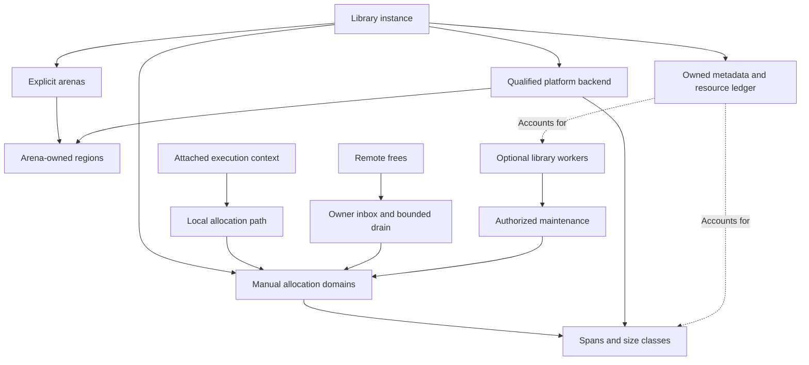

<!--
SPDX-FileCopyrightText: 2026 Rafael V. Volkmer <rafael.v.volkmer@gmail.com>
SPDX-License-Identifier: GPL-3.0-only
-->

# libmemalloc: Implementation of manual core and arenas

Use this document to implement and review the manual core, arenas and platform ports. Start with the
boundaries, select a control from the index and follow its requirements to the test catalog.

The planned core has no libc dependency. It owns bootstrap, base types, byte primitives, atomics and
synchronization, with optional workers and a Linux clone/futex protocol. Regions, metadata, execution
contexts and workers remain distinct resources with explicit ownership and accounting.

**Evidence boundary:** This is a proposed product specification. Allocator correctness, portability, Rust
integration, fuzzing and stress campaigns remain unqualified. Repository checks cover documents and
automation fixtures; they do not establish product acceptance or evidence for another specification.

<details>
<summary><strong>On this page</strong></summary>

- [Authority and requirements](#governance)
- [Boundaries, authority and initial cut](#boundaries)
- [Core ownership overview](#core-ownership-overview)
- [Controls by responsibility](#inherited-controls)
- [LMA-CORE-001: Architecture, objectives and boundaries of the areas](#lma-core-001)
- [LMA-CORE-002: Body, configuration and backend interface](#lma-core-002)
- [LMA-CORE-003: Public allocation contract, zero size and realloc](#lma-core-003)
- [LMA-CORE-004: Size classes and span geometry](#lma-core-004)
- [LMA-CORE-005: Metadata, address map and domain validation](#lma-core-005)
- [LMA-CORE-006: Span's exclusive state machine and ownership](#lma-core-006)
- [LMA-CORE-007: Minimum local path and maintenance cadence](#lma-core-007)
- [LMA-CORE-008: Remote message release with immediate publication](#lma-core-008)
- [LMA-CORE-009: Explicit lots and recoverable memory priority](#lma-core-009)
- [LMA-CORE-010: Thread output, orphan adoption and descriptor withdrawal](#lma-core-010)
- [LMA-CORE-011: Partitioned deposits and reuse between contexts](#lma-core-011)
- [LMA-CORE-012: Extensions, large allocations and coalescence](#lma-core-012)
- [LMA-CORE-013: Virtual backend, disposal and provenance of zero memory](#lma-core-013)
- [LMA-CORE-014: Huge pages conscious positioning](#lma-core-014)
- [LMA-CORE-015: optional CPU backend, affinity and NUMA](#lma-core-015)
- [LMA-CORE-016: Coordinated withholding budget](#lma-core-016)
- [LMA-CORE-017: Allocation time and location grouping](#lma-core-017)
- [LMA-CORE-018: Explicit arenas with mass destruction](#lma-core-018)
- [LMA-CORE-019: Metadata policy simulation and controlled activation](#lma-core-019)
- [LMA-CORE-020: Experimental physical compaction with stable addresses](#lma-core-020)
- [LMA-CORE-021: OOM, memory pressure, progress and closure](#lma-core-021)
- [LMA-CORE-022: Telemetry, metrics and observable accounting](#lma-core-022)
- [LMA-CORE-023: Lifecycle, admission, quiescence and context affinity](#lma-core-023)
- [LMA-CORE-024: Storage C, effective type, provenance and buffer backend](#lma-core-024)
- [LMA-CORE-025: Exact resource quota, soft retention and external pressure](#lma-core-025)
- [LMA-CORE-026: Bootstrap, internal metadata and backend transactions under OOM](#lma-core-026)
- [LMA-CORE-027: Matrix of effects, re-entry, blockades and GC assistance authorized](#lma-core-027)
- [LMA-CORE-028: Requested size, informed deallocation, aligned realloc and lots](#lma-core-028)
- [LMA-CORE-029: Retrieval-oriented remote drainage with fair service](#lma-core-029)
- [LMA-CORE-030: Dense admission and drainage spans without manual movement](#lma-core-030)
- [LMA-CORE-031: Pre-reserved profile and limited work for embedded systems](#lma-core-031)
- [LMA-CORE-032: Time allocation plans provided by the compiler](#lma-core-032)
- [LMA-CORE-033: Accounting without overlapping and retention diagnosis](#lma-core-033)
- [Detailed implementation contracts](#implementation-contracts)
- [LMA-CORE-034: Composition, ports and authority over regions](#lma-core-034)
- [LMA-CORE-035: Quiescent admission and closure: M0 protocol](#lma-core-035)
- [LMA-CORE-036: Inbox MPSC with lock: full reference algorithm](#lma-core-036)
- [LMA-CORE-037: Geometry generated, representation and cost of M0](#lma-core-037)
- [LMA-CORE-038: Resource reserve and backend commit under failure](#lma-core-038)
- [LMA-CORE-039: API, effects and transactional preservation of outputs](#lma-core-039)
- [LMA-CORE-040: Offline profiles for policies: different contract from PGO](#lma-core-040)
- [LMA-CORE-041: Pre-reserved storage and profile](#lma-core-041)
- [Additional product contracts](#additional-contracts)
- [LMA-CORE-042: Core without libc and bootstrap entirely belonging to the library](#lma-core-042)
- [LMA-CORE-043: Types, errors and primitive bytes belonging to the project](#lma-core-043)
- [LMA-CORE-044: Owned atomic storage and compiler/ISA semantics](#lma-core-044)
- [LMA-CORE-045: Own thread runtime and distinction between contexts and workers](#lma-core-045)
- [LMA-CORE-046: Linux syscall-only: clone3/clone, trampoline, TLS and join](#lma-core-046)
- [LMA-CORE-047: Mutex and its own condition: parking protocol](#lma-core-047)
- [LMA-CORE-048: Cost of metadata, stacks and hidden calls as product contract](#lma-core-048)
- [LMA-CORE-049: Pressure-aware page release with bounded hysteresis](#lma-core-049)
- [LMA-CORE-050: Ownership-separated cache layout and transfer cost](#lma-core-050)
- [LMA-CORE-051: Two-level extent indexing in a fixed resource profile](#lma-core-051)
- [Examples and compilation context](#examples)
- [Pending qualification](#pending-qualification)
- [References](#references)
- [Additional references and limitations](#additional-references)

</details>

---

<a id="governance"></a>

## Authority and requirements

Apply the [source-attribution rule](README.md#source-attribution): link primary references in each control
that introduces an external technique, including new experiments, and identify LMA-specific adaptations.

**Product:** libmemalloc. **Status:** proposed implementation, not an implemented library or evidence of
better performance than another allocator.

The [local C standard](../standards/c/c-code-standard.md),
[module architecture](../standards/c/c-module-architecture.md), and
[pitfall guide](../standards/c/c-common-pitfalls.md) govern C development. Product constraints in these
specifications refine the permitted implementation. Apply C and platform semantics first, then approved
product constraints and local policy. Conflicts require an explicit decision; a policy exception cannot make
undefined behavior defined.

MUST and MUST NOT express requirements; MAY grants conditional permission. A control's classification does not
by itself measure failure severity. Keep stable control, requirement, invariant, and test identifiers when
editing. References explain a technique; they do not prove this composition or its results. BASE does not mean
implemented, and EXPERIMENTAL does not establish novelty. The H-01 through H-14 hypotheses remain experiments,
not results.

Public names use `LMA_lowerCamelCase`, private names use `lma_lowerCamelCase`, owned types use `lma_*_t`, and
structure tags use the `Lma` prefix and UpperCamelCase. Use Allman compound statements, eight-column
indentation, and 80-column C lines. The result variable is `ret`, declarations occur at the permitted scope
entry, and normal return follows `function_output`. Explicit null pointers follow the local typed-null rule.
Public C headers do not add explicit `extern` or embedded C++ bridges. API descriptions abbreviate local
`LMA_E*` error codes; adapters translate foreign codes without depending on foreign errno numbers.

The local simple-branch rule in CSTYLE-022 and the grouping rules in CSTYLE-279 and CSTYLE-280 apply to these
examples. One-line simple `if` bodies omit braces; loops and compound branch bodies retain them.

The companion schemas, migration records, and validation reports mentioned by the original package are not
present here. They are not current execution evidence. The [CI
reference](../reference/automation.md#ci-control-map) states
the actual check coverage. Product capabilities remain unqualified until their required evidence exists;
missing or conflicting evidence blocks the capability.

---

<a id="boundaries"></a>

## Boundaries, authority and initial cut

The core has manual mechanisms and regions; the GC has authority over managed objects. Security defines the
profile and responses to threats, not a second ledger; tests define evidence, not another free behavior;
compilation defines how to produce/qualify artifacts, not the life of the object.

M0: fixed classes generated, request/alignment in side metadata, inbox with mutex per span, stable descriptors
with limit, external quiescence in destroy, ports without recursion, GC/interposition/adaptation absent. M1
measures manual optimizations, H-11/H-12 and presets. Mesh, per-CPU and RT profile remain qualified subsequent
capabilities.

| Resource or state | Writer | Readers/protection |
| ------------------------------------ | ------------------- | ------------------------------------------------ |
| Cursor, local free list, outstanding | Sole owner | Owner only; no unsynchronized remote reads. |
| Inbox head/tail | Producers/consumer | Span Mutex in reference M0. |
| Detached chain | Authorized consumer | Lifetime included in handoff and outstanding. |
| Geometry and identity | Initializer | Immutable after synchronized publication. |
| Ledger/quota ticket | Resource service | Lock/exact protocol; never approximate snapshot. |
| Telemetry | Publisher | Snapshot synchronized with validity/scope. |

An empty region is only removed when the relevant returns have been incorporated, there is no authorized
producer/user still accessing payload and the map/descriptor follows its protocol. A zero balance alone is
not sufficient.

### Related documents

[Optional collector implementation and integration with runtimes](libmemalloc-gc-implementation-SDD.md) ·
[Security, threats and protection mechanisms](libmemalloc-security-SDD.md) ·
[Tests, verification, experiments and evidence](libmemalloc-tests-SDD.md) ·
[Compilation, modules, ABI, PGO and delivery](libmemalloc-compilation-SDD.md)

---

<a id="core-ownership-overview"></a>

## Core ownership overview

The diagram separates instance resources, allocation domains, execution contexts, and optional workers. It
describes the proposed architecture, not implemented code.



---

<a id="inherited-controls"></a>

## Controls by responsibility

The controls below define proposed mechanisms. The example appendix provides implementation context without
establishing a stable ABI or product qualification.

---

<a id="lma-core-001"></a>

## LMA-CORE-001: Architecture, objectives and boundaries of the areas

**M0:** REQUIRED. **G0:** REQUIRED.

**Phase:** P0. **Nature:** BASE. **Status:** PROPOSED.

### Theoretical reference and application

[Mimalloc: Free List Sharding in
Action](https://www.microsoft.com/en-us/research/publication/mimalloc-free-list-sharding-in-action/):
Locality and separation from frequent work.

[Beyond malloc efficiency to fleet efficiency: a hugepage-aware memory
allocator](https://www.usenix.org/conference/osdi21/presentation/hunter):
Evaluate the effect on the whole application.

[Memory Pool System: arenas](https://memory-pool-system.readthedocs.io/en/latest/topic/arena.html): Management
bodies with explicit boundaries.

### Decision and operation

The libmemalloc will be a language-independent C library, with manual core, arenas and a selectable GC module.
The memory backend can be shared, but the authority to recover an object will be unique and defined in the
creation of the domain. Manual, arena, stable GC and moving GC will not be interchangeable modes of the same
pointer.

The objective is to shift the boundary between throughput, latency and retained memory. A promise of universal
dominance or numerical goals from the previous illustration is not established. The experimental components
should be able to be removed without rewriting the manual path.

### Verifiable requirements

<a id="lma-core-001-r01"></a> **LMA-CORE-001-R01.** MUST keep GC out of the link dependency of the manual
core.

<a id="lma-core-001-r02"></a> **LMA-CORE-001-R02.** MUST maintain unchangeable domain contracts as long as
there are allocations.

<a id="lma-core-001-r03"></a> **LMA-CORE-001-R03.** MUST compare manual API and cooperative API in separate
campaigns.

### Invariants

<a id="lma-core-001-i01"></a> **LMA-CORE-001-I01.** Each object has exactly one recovery authority.

<a id="lma-core-001-i02"></a> **LMA-CORE-001-I02.** A policy can choose positioning; it can never infer
destruction authorization from a forecast.

### Risks, limits and fallback

Backend sharing can cause cache and band interference. Absence of GC calls in manual path does not mean null
physical interference.

### Checking and linking to the catalogue

[LMA-TEST-CASE-0001](libmemalloc-tests-SDD.md#lma-test-case-0001),
[LMA-TEST-CASE-0002](libmemalloc-tests-SDD.md#lma-test-case-0002),
[LMA-TEST-CASE-0003](libmemalloc-tests-SDD.md#lma-test-case-0003). All cases remain planned for the product.

---

<a id="lma-core-002"></a>

## LMA-CORE-002: Body, configuration and backend interface

**M0:** REQUIRED. **G0:** REQUIRED.

**Phase:** P0. **Nature:** BASE. **Status:** PROPOSED.

The core consumes its own backend, synchronization, and diagnostic ports; the provider is only known by the
adapter/composition. Evolutionary configuration passes the opaque construction. A V1 port DTO is a fixed size
contract, selected by specific binding function, not a structure whose prefix can be read by cast from smaller
storage.

### Theoretical reference and application

[Memory Pool System: arenas](https://memory-pool-system.readthedocs.io/en/latest/topic/arena.html):
Encapsulation of the manager's state.

[TCMalloc design](https://google.github.io/tcmalloc/design.html): Separation between front end and memory
supply.

### Decision and operation

The main API will receive an instance and, on the optimized path, a local thread context. Structural settings
will be frozen in creation. Retention policy can change by publishing a new version without reinterpreting
existing blocks.

The backend will offer reserve, materialization, discard, release and query capabilities. Your callbacks
cannot recursively call the public API of the same instance. Configuration and callbacks table will be copied
or will have a contractually longer life span than the instance.

Initial destruction requires that the integrator has prevented new entries and closed competing operations. An
internal counter does not protect the first acquisition from an already invalid address. Attach/detach
maintain long-lasting permissions not to require a global counter per local hit.
[LMA-CORE-023](libmemalloc-core-implementation-SDD.md#lma-core-023) defines the life cycle;
[LMA-CORE-026](libmemalloc-core-implementation-SDD.md#lma-core-026) sets bootstrap and reservations.

### Verifiable requirements

<a id="lma-core-002-r01"></a> **LMA-CORE-002-R01.** MUST use opaque construction for evolutionary ABI objects;
fixed-size V1 ports/DTs have their own binding and layout. Reading a prefix does not allow accessing smaller
struct storage as if it were larger.

<a id="lma-core-002-r02"></a> **LMA-CORE-002-R02.** Under external quiescence that prevents new calls, MUST
fail destruction with `LMA_EBUSY` as long as there are linked contexts, objects or services. An attempt to
enter by a pointer whose instance has already been destroyed violates the contract and has no guaranteed
diagnosis. [LMA-CORE-023](libmemalloc-core-implementation-SDD.md#lma-core-023).

<a id="lma-core-002-r03"></a> **LMA-CORE-002-R03.** MUST maintain bootstrap and metadata without recursion
through intrusive malloc.

### Invariants

<a id="lma-core-002-i01"></a> **LMA-CORE-002-I01.** One instance does not interpret descriptors from another.

<a id="lma-core-002-i02"></a> **LMA-CORE-002-I02.** Backend and associated context callbacks remain valid
during all pending operations.

### Risks, limits and fallback

The global malloc adapter will be optional. Libraries integrated by instance should not depend on it.

### Checking and linking to the catalogue

[LMA-TEST-CASE-0007](libmemalloc-tests-SDD.md#lma-test-case-0007),
[LMA-TEST-CASE-0008](libmemalloc-tests-SDD.md#lma-test-case-0008),
[LMA-TEST-CASE-0009](libmemalloc-tests-SDD.md#lma-test-case-0009). All cases remain planned for the product.

---

<a id="lma-core-003"></a>

## LMA-CORE-003: Public allocation contract, zero size and realloc

**M0:** REQUIRED. **G0:** REQUIRED.

**Phase:** P0. **Nature:** BASE. **Status:** PROPOSED.

Fallible operations use `int`, zero in success and own negative codes `LMA_E*`; do not use `errno` Global.
They maintain original semantics of zero size, preservation of the previous block and separate output in
realloc. The null exit manual contract in failure is not transferred to the destination already protected from
a GC operation.

### Theoretical reference and application

[Programming languages: C, Committee Draft N1570](https://www.open-std.org/jtc1/sc22/wg14/www/docs/n1570.pdf):
§7.22.3: contract of operations and preservation in failure.

[Memory Pool System: allocation](https://memory-pool-system.readthedocs.io/en/latest/topic/allocation.html):
Interfaces with context and explicit results.

### Decision and operation

The API itself will return int and write addresses in void **. In allocation failure, the output will be NULL;
realloc will preserve the input block and leave the NULL output. The user will pass a temporary \* void
variable without converting T** in void \*\*.

Own decision: allocate size zero returns LMA*OK and NULL; realloc(`ptr`, 0) releases `ptr` and returns
`LMA_OK`/NULL. These contracts belong to the LMA API*\*. A separate libc adapter should implement the
documented conventions of the target ABI, including err when applicable. For `LMA_allocAligned`, accept
non-multiple alignment sizes and treat the rounding internally; do not call it libc's `aligned_alloc`
contract.

Common realloc semantics will preserve the contracted alignment in the previous allocation; this requires
recovering this alignment on the path of liberation/growth or explicitly restricting the profile.
[LMA-CORE-028](libmemalloc-core-implementation-SDD.md#lma-core-028) specifies the aligned variant, the
required size information and batch semantics. The rounded class space is not automatically part of the object
accessible to the caller.

### Verifiable requirements

<a id="lma-core-003-r01"></a> **LMA-CORE-003-R01.** MUST preserve min(`old_size`, `new_size`) in successful
realloc and the entire previous block in failure.

<a id="lma-core-003-r02"></a> **LMA-CORE-003-R02.** MUST provide fundamental alignment in the common alloc and
validate supported explicit alignment.

<a id="lma-core-003-r03"></a> **LMA-CORE-003-R03.** MUST detect overflow before calculating count×size or
size+padding; free(NULL) is no-op.

### Invariants

<a id="lma-core-003-i01"></a> **LMA-CORE-003-I01.** Simultaneously alive blocks do not overlap.

<a id="lma-core-003-i02"></a> **LMA-CORE-003-I02.** No arithmetic error turns a large order into a successful
small allocation.

### Risks, limits and fallback

Invalid pointer remains a breach of contract; diagnostic mode will seek to detect it without promising
universal detection. Realloc does not authorize the application to maintain old aliases after success.

### Checking and linking to the catalogue

[LMA-TEST-CASE-0010](libmemalloc-tests-SDD.md#lma-test-case-0010),
[LMA-TEST-CASE-0011](libmemalloc-tests-SDD.md#lma-test-case-0011),
[LMA-TEST-CASE-0012](libmemalloc-tests-SDD.md#lma-test-case-0012). All cases remain planned for the product.

---

<a id="lma-core-004"></a>

## LMA-CORE-004: Size classes and span geometry

**M0:** REQUIRED. **G0:** REQUIRED.

**Phase:** P0. **Nature:** BASE. **Status:** PROPOSED.

### Theoretical reference and application

[Mimalloc: Free List Sharding in
Action](https://www.microsoft.com/en-us/research/publication/mimalloc-free-list-sharding-in-action/):
Local partitioning of small objects.

[Fast, Multicore-Scalable, Low-Fragmentation Memory Allocation through Large Virtual Memory and Global Data
Structures](https://arxiv.org/abs/1503.09006v2):
Separation between virtual geometry and occupation.

[TCMalloc design](https://google.github.io/tcmalloc/design.html): Mapping of applications for classes.

### Decision and operation

Start with immutable classes and a direct table for small sizes. Cuts 32 KiB/2 MiB and candidate spans of 16,
64 or 256 KiB are parameters of experimentation, not normative constants. The selection needs to consider
alignment, minimum capacity, unused tail and metadata.

A class will never change its meaning as long as its spans exist. Future variants can choose new regions with
another version of geometry. Release lookup will use registered geometry, not current policy.

### Verifiable requirements

<a id="lma-core-004-r01"></a> **LMA-CORE-004-R01.** MUST generate tables and tests from a single description
of geometry.

<a id="lma-core-004-r02"></a> **LMA-CORE-004-R02.** MUST forward incompatible alignments and large objects to
the extension path.

<a id="lma-core-004-r03"></a> **LMA-CORE-004-R03.** MUST account separately for class and tail rounding of
span.

<a id="lma-core-004-r04"></a> **LMA-CORE-004-R04.** MUST ensure space and alignment to intrusive links in the
smallest class that uses them, or choose alternative representation.

### Invariants

<a id="lma-core-004-i01"></a> **LMA-CORE-004-I01.** `block_size` \>= `requested_size` and the class sequence
is monotonic.

<a id="lma-core-004-i02"></a> **LMA-CORE-004-I02.** capacity×`block_size` + `offset_payload` \<= `span_size`,
without overflow.

### Risks, limits and fallback

Excessive classes expand metadata and partially occupied spans; scarce classes increase internal waste.

### Checking and linking to the catalogue

[LMA-TEST-CASE-0013](libmemalloc-tests-SDD.md#lma-test-case-0013),
[LMA-TEST-CASE-0014](libmemalloc-tests-SDD.md#lma-test-case-0014),
[LMA-TEST-CASE-0015](libmemalloc-tests-SDD.md#lma-test-case-0015). All cases remain planned for the product.

---

<a id="lma-core-005"></a>

## LMA-CORE-005: Metadata, address map and domain validation

**M0:** REQUIRED. **G0:** REQUIRED.

**Phase:** P0. **Nature:** BASE. **Status:** PROPOSED.

### Theoretical reference and application

[Fast, Multicore-Scalable, Low-Fragmentation Memory Allocation through Large Virtual Memory and Global Data
Structures](https://arxiv.org/abs/1503.09006v2):
Efficient mapping for managed regions.

[StarMalloc: A Formally Verified, Concurrent, Performant, and Security-Oriented Memory
Allocator](https://arxiv.org/abs/2403.09435):
Separating verifiable metadata and abstractions.

[Hazard pointers: Safe memory reclamation for lock-free
objects](https://research.ibm.com/publications/hazard-pointers-safe-memory-reclamation-for-lock-free-objects):
Lifetime of descriptors accessed concurrently.

### Decision and operation

Use a hierarchical map of pages for external descriptors. The descriptor will identify instance, domain,
geometry, state and generation. Virtual aligned regions can accelerate lookup in a specific backend, but will
not be the premise of every platform.

The first version will keep published descriptors and we from the map stable until the quiescent destruction
of the instance. This simplifies the correction, but retains metadata: the cost and limit of descriptors will
be explicit. Early recovery will require reader protection and own proof. It will never be done only because a
generation has changed.

Stable storage does not require synchronizing changeable fields during descriptor recycling. The budget
includes the number of retained descriptors and the historical coverage of the map, not just live payload.
When the limit is reached, to fail explicitly is the baseline;
[LMA-CORE-026](libmemalloc-core-implementation-SDD.md#lma-core-026) and
[LMA-CORE-033](libmemalloc-core-implementation-SDD.md#lma-core-033) make this cost observable. Early
reclamation remains a protocol change.

### Verifiable requirements

<a id="lma-core-005-r01"></a> **LMA-CORE-005-R01.** MUST validate belonging before interpreting memory as a
descriptor.

<a id="lma-core-005-r02"></a> **LMA-CORE-005-R02.** MUST publish fully initialized descriptors and invalidate
mappings under defined protocol.

<a id="lma-core-005-r03"></a> **LMA-CORE-005-R03.** MUST separate remote writing fields from the owner's
exclusive hot fields.

### Invariants

<a id="lma-core-005-i01"></a> **LMA-CORE-005-I01.** Valid Lookup never returns metadata whose life span is
over.

<a id="lma-core-005-i02"></a> **LMA-CORE-005-I02.** Map, generation and geometry agree before reusing an
address to another span.

### Risks, limits and fallback

Stable descriptors do not make data from eternal objects. Metadata retention needs budgeting and can limit
extreme loads before a safe recovery version.

### Checking and linking to the catalogue

[LMA-TEST-CASE-0016](libmemalloc-tests-SDD.md#lma-test-case-0016),
[LMA-TEST-CASE-0017](libmemalloc-tests-SDD.md#lma-test-case-0017),
[LMA-TEST-CASE-0018](libmemalloc-tests-SDD.md#lma-test-case-0018). All cases remain planned for the product.

---

<a id="lma-core-006"></a>

## LMA-CORE-006: Span's exclusive state machine and ownership

**M0:** REQUIRED. **G0:** REQUIRED.

**Phase:** P0. **Nature:** BASE. **Status:** PROPOSED.

### Theoretical reference and application

[Mimalloc: Free List Sharding in
Action](https://www.microsoft.com/en-us/research/publication/mimalloc-free-list-sharding-in-action/):
Local State per allocation unit.

[Hoard: A Scalable Memory Allocator for Multithreaded Applications](https://emeryberger.github.io/Hoard/):
Transfer and reuse of units between heaps.

### Decision and operation

Each span will have a single owner authorized to change local lists and accounts. Other agents will publish
returns without changing that state. The atomic state will be different from private counters; remote
observability will use published snapshots.

For a span, outstanding will be the number of fewer returns already incorporated. Includes still live objects
in the application and returns not yet incorporated. Before returning a new object, increase local accounting.
Do not mix this correction counter with occupancy estimates.

### Verifiable requirements

<a id="lma-core-006-r01"></a> **LMA-CORE-006-R01.** MUST model ACTIVE, HANDOFF, ORPHAN, EMPTY and RETIRED with
explicit transitions.

<a id="lma-core-006-r02"></a> **LMA-CORE-006-R02.** MUST require outstanding=0. drainage completed and absence
of protected users before withdrawal.

<a id="lma-core-006-r03"></a> **LMA-CORE-006-R03.** MUST NOT allow the theft of span ACTIVE by timeout.

### Invariants

<a id="lma-core-006-i01"></a> **LMA-CORE-006-I01.** At most an owner modifies the local state at any time.

<a id="lma-core-006-i02"></a> **LMA-CORE-006-I02.** outstanding is never negative and a return reduces the
counter once.

### Risks, limits and fallback

The outstanding test==0 is a necessary condition, not complete unmap authorization; maps, messages and
references to the descriptor also participate.

### Checking and linking to the catalogue

[LMA-TEST-CASE-0019](libmemalloc-tests-SDD.md#lma-test-case-0019),
[LMA-TEST-CASE-0020](libmemalloc-tests-SDD.md#lma-test-case-0020),
[LMA-TEST-CASE-0021](libmemalloc-tests-SDD.md#lma-test-case-0021). All cases remain planned for the product.

---

<a id="lma-core-007"></a>

## LMA-CORE-007: Minimum local path and maintenance cadence

**M0:** REQUIRED. **G0:** REQUIRED.

**Phase:** P0. **Nature:** BASE. **Status:** PROPOSED.

### Theoretical reference and application

[Mimalloc: Free List Sharding in
Action](https://www.microsoft.com/en-us/research/publication/mimalloc-free-list-sharding-in-action/):
Local fast path and temporal cadence.

### Decision and operation

local malloc will try the list of recycled blocks or a never issued space cursor. Do not initialize the entire
free list of a new span just to enable future allocations. local free will return the block and update only
the authorized state.

The structural goal is to avoid atomic RMW, syscall, clock and heavy telemetry in the local hit. This is a
design requirement to check in the generated code, not promise of nanoseconds. Maintenance will occur in
refills, quotas of operations and cooperative calls; it needs budget to not concentrate an entire queue on an
allocation.

Maintenance budget limits each passage, but does not guarantee fair service of all spans.
[LMA-CORE-029](libmemalloc-core-implementation-SDD.md#lma-core-029) adds a fair scaling experiment without
modifying ownership. [LMA-CORE-028](libmemalloc-core-implementation-SDD.md#lma-core-028) it deals with the
cost of obtaining the requested size, which should not enter the fast path by a promise of telemetry without
defined representation.

### Verifiable requirements

<a id="lma-core-007-r01"></a> **LMA-CORE-007-R01.** MUST delete complex adaptive decisions and callbacks from
the local hit.

<a id="lma-core-007-r02"></a> **LMA-CORE-007-R02.** MUST account for an issue before publishing the address to
the caller.

<a id="lma-core-007-r03"></a> **LMA-CORE-007-R03.** MUST limit the maintenance work by passing and record
pending.

### Invariants

<a id="lma-core-007-i01"></a> **LMA-CORE-007-I01.** A block removed from the free structure is no longer
available before return.

<a id="lma-core-007-i02"></a> **LMA-CORE-007-I02.** Only proven free blocks can store intrusive links.

### Risks, limits and fallback

The intrusive list is metadata within memory previously delivered to the user. Therefore the fast mode will
not be described as entirely out-of-band.

### Checking and linking to the catalogue

[LMA-TEST-CASE-0022](libmemalloc-tests-SDD.md#lma-test-case-0022),
[LMA-TEST-CASE-0023](libmemalloc-tests-SDD.md#lma-test-case-0023),
[LMA-TEST-CASE-0024](libmemalloc-tests-SDD.md#lma-test-case-0024). All cases remain planned for the product.

---

<a id="lma-core-008"></a>

## LMA-CORE-008: Remote message release with immediate publication

**M0:** REQUIRED. **G0:** REQUIRED.

**Phase:** P0. **Nature:** BASE. **Status:** PROPOSED.

### Theoretical reference and application

[snmalloc: Message passing based allocator](https://github.com/microsoft/snmalloc): Return objects to the
originator by message.

[Hazard pointers: Safe memory reclamation for lock-free
objects](https://research.ibm.com/publications/hazard-pointers-safe-memory-reclamation-for-lock-free-objects):
Distinguishing safe memory recovery publication.

### Decision and operation

Each span will have an MPSC inbox: multiple producers, a consumer. The first fix backend can use lock by
inbox; the CAS backend will only replace it after linearization test and life time. The default remote release
will publish your message before returning: do not hide objects indefinitely in a TLS buffer.

A successful publication will be the producer's last access to the intrusive links that the consumer can
recycle. The full chain release/acquire ratio needs to be demonstrated. If an algorithm reads observed head
links, it should also protect those nodes, not just the span descriptor. Do not provide an incomplete Treiber
stack as ready solution.

### Verifiable requirements

<a id="lma-core-008-r01"></a> **LMA-CORE-008-R01.** MUST identify the point of linearization and the premises
of each implementation of the inbox.

<a id="lma-core-008-r02"></a> **LMA-CORE-008-R02.** MUST use only messages already published in the drainage
accounting.

<a id="lma-core-008-r03"></a> **LMA-CORE-008-R03.** MUST have sync fallback when the platform does not offer
the required contract.

<a id="lma-core-008-r04"></a> **LMA-CORE-008-R04.** MUST publish releases without relying on new fallible
allocation of messages; define intrusive storage or sufficient reserve.

### Invariants

<a id="lma-core-008-i01"></a> **LMA-CORE-008-I01.** No consumer recycles a node yet accessible by a producer
in accordance with the protocol.

<a id="lma-core-008-i02"></a> **LMA-CORE-008-I02.** Each valid free causes exactly one incorporation into the
current owner or successor.

### Risks, limits and fallback

CAS does not imply absence of ABA or wait-freedom. Correction depends on the chosen algorithm; memory orders
will not be weakened just because x86 has passed tests.

### Checking and linking to the catalogue

[LMA-TEST-CASE-0025](libmemalloc-tests-SDD.md#lma-test-case-0025),
[LMA-TEST-CASE-0026](libmemalloc-tests-SDD.md#lma-test-case-0026),
[LMA-TEST-CASE-0027](libmemalloc-tests-SDD.md#lma-test-case-0027). All cases remain planned for the product.

---

<a id="lma-core-009"></a>

## LMA-CORE-009: Explicit lots and recoverable memory priority

**M0:** DEFERRED. **G0:** DEFERRED.

**Phase:** P1. **Nature:** EXPERIMENTAL. **Status:** PROPOSED.

### Theoretical reference and application

[snmalloc: Message passing based allocator](https://github.com/microsoft/snmalloc): Amortization of remote
releases.

[Beyond malloc efficiency to fleet efficiency: a hugepage-aware memory
allocator](https://www.usenix.org/conference/osdi21/presentation/hunter):
Value of memory recovery for application.

**Evidence limit:** the combination specified in `H-01` it is a hypothesis of libmemalloc. The references
support the stated foundations, do not prove its gain or its implementation.

### Decision and operation

Offer `free_batch` with span grouping and full string publishing. Batch will be consumed during call and all
work published before return. Entry array cannot reside on one of the blocks that will be released; each
non-zero pointer appears only once. Diagnostic mode will check duplicates before release.

Hypothesis H-01: among ready batches, prioritize those whose incorporation can empty spans and reduce
retention. Occupancy estimates serve exclusively for ordering.The number of successful publications tends to
follow the number of different spans, not only the number of objects; retractions and grouping cost continue
to exist.

Recovery priority can postpone lots of low score indefinitely. The original hypothesis H-01 remains comparable
in isolation; H-11, in [LMA-CORE-029](libmemalloc-core-implementation-SDD.md#lma-core-029), compares the
priority with a fair portion of service and explains its premises of progress.

### Verifiable requirements

<a id="lma-core-009-r01"></a> **LMA-CORE-009-R01.** MUST impose scratch limits and use Chunk processing when
needed.

<a id="lma-core-009-r02"></a> **LMA-CORE-009-R02.** MUST avoid recursive allocation to build a batch of
releases.

<a id="lma-core-009-r03"></a> **LMA-CORE-009-R03.** MUST measure bytes of pending objects and potentially
blocked spans capacity separately.

### Invariants

<a id="lma-core-009-i01"></a> **LMA-CORE-009-I01.** Publishing a batch transfers possession of all its nodes
exactly once.

<a id="lma-core-009-i02"></a> **LMA-CORE-009-I02.** Estimation of recoverability never changes the empty span
condition.

### Risks, limits and fallback

The cost of grouping can overcome the atomic economy. Do not maintain implicit batching when returning common
free without another SDD of progress and retention.

### Checking and linking to the catalogue

[LMA-TEST-CASE-0028](libmemalloc-tests-SDD.md#lma-test-case-0028),
[LMA-TEST-CASE-0029](libmemalloc-tests-SDD.md#lma-test-case-0029),
[LMA-TEST-CASE-0030](libmemalloc-tests-SDD.md#lma-test-case-0030). All cases remain planned for the product.

---

<a id="lma-core-010"></a>

## LMA-CORE-010: Thread output, orphan adoption and descriptor withdrawal

**M0:** REQUIRED. **G0:** REQUIRED.

**Phase:** P0. **Nature:** BASE. **Status:** PROPOSED.

### Theoretical reference and application

[snmalloc: Message passing based allocator](https://github.com/microsoft/snmalloc): Returns to allocations
from another owner.

[Hazard pointers: Safe memory reclamation for lock-free
objects](https://research.ibm.com/publications/hazard-pointers-safe-memory-reclamation-for-lock-free-objects):
Safe recovery of competing structures.

### Decision and operation

The inbox belongs to the span, not to the stack or TLS of the thread. Detach will occur out of local operation
and publish HANDOFF before releasing the ownership. The context drains its state, transfers the span to ORPHAN
and does not access it again as owner. A successor will acquire ownership via exclusive transition.

Stable descriptors until destruction are the initial policy of
[LMA-CORE-005](libmemalloc-core-implementation-SDD.md#lma-core-005). A future optimization may use Hazard
pointers or another technique with proof and budget, but it will not mix mechanisms without defining which
references each protects. Abrupt closure in the middle of the API does not have guaranteed support:
maintaining retained memory is preferable to assuming nonexistent quiescence.

### Verifiable requirements

<a id="lma-core-010-r01"></a> **LMA-CORE-010-R01.** MUST keep the inbox valid during handoff and adoption.

<a id="lma-core-010-r02"></a> **LMA-CORE-010-R02.** MUST complete detach only after abandoning all local
permissions.

<a id="lma-core-010-r03"></a> **LMA-CORE-010-R03.** MUST return EBUSY in the destroyer check as long as there
is context recorded; the very so-called destroyer remains subject to the external quiescence of
[LMA-CORE-023](libmemalloc-core-implementation-SDD.md#lma-core-023). This condition does not promise to make
it safe to compete with a new unprotected entry.

### Invariants

<a id="lma-core-010-i01"></a> **LMA-CORE-010-I01.** Adoption never happens before the full publication of the
previous owner's state.

<a id="lma-core-010-i02"></a> **LMA-CORE-010-I02.** RETIRED cannot move to ACTIVE without a new generation and
coherent reshaping.

### Risks, limits and fallback

A generation detects some obsolete references, but does not prevent access to memory already destroyed. Stable
metadata policy has measurable retention cost.

### Checking and linking to the catalogue

[LMA-TEST-CASE-0031](libmemalloc-tests-SDD.md#lma-test-case-0031),
[LMA-TEST-CASE-0032](libmemalloc-tests-SDD.md#lma-test-case-0032),
[LMA-TEST-CASE-0033](libmemalloc-tests-SDD.md#lma-test-case-0033). All cases remain planned for the product.

---

<a id="lma-core-011"></a>

## LMA-CORE-011: Partitioned deposits and reuse between contexts

**M0:** DEFERRED. **G0:** DEFERRED.

**Phase:** P1. **Nature:** BASE. **Status:** PROPOSED.

### Theoretical reference and application

[Hoard: A Scalable Memory Allocator for Multithreaded Applications](https://emeryberger.github.io/Hoard/):
Reuse between heaps and growth control.

[Fast, Multicore-Scalable, Low-Fragmentation Memory Allocation through Large Virtual Memory and Global Data
Structures](https://arxiv.org/abs/1503.09006v2):
Shared recovery structures.

### Decision and operation

Deposits will keep empty spans and, when the transfer is legal, orphaned partial spans. Partition by logical
node and hard; do not put all classes and all threads in a global queue. Local selection will try to reuse
existing capacity before requesting additional memory.

The deposit will not recover lists from an ACTIVE span. For empty spans, the class change will only occur
after removal of the previous geometry and reboot. In the initial backend, locks per hard drive are
acceptable: the cold path must be correct and measured before receiving lock-free structures.

[Bonwick and Adams, Magazines and Vmem (2001)](https://www.usenix.org/legacy/event/usenix01/full_papers/bonwick/bonwick_html/)
motivate an alternative with a loaded and previous cache to avoid repeated depot access at a refill boundary.
The LMA experiment uses bounded arrays of eligible empty-span descriptors per owned context and class;
it does not cache remote frees privately or assume that a context stays on one CPU. Transfer authority is
exclusive, and a span in either array is unavailable to the depot until the transfer commits.

Name `refill_cache_slots` and `refill_cache_classes`; reserve both arrays before activation and debit every
cached span against instance retention credits. On pressure or detach, return both arrays through the same
ownership protocol. There is no magazine allocation from a free path. Compare one-cache, paired-cache and
no-cache variants at boundary oscillations and thread churn, counting transfers and retained capacity.
[LMA-TEST-CASE-0688](libmemalloc-tests-SDD.md#lma-test-case-0688) remains a planned P1 comparison.

### Verifiable requirements

<a id="lma-core-011-r01"></a> **LMA-CORE-011-R01.** MUST separate physical availability, ownership status and
size rating.

<a id="lma-core-011-r02"></a> **LMA-CORE-011-R02.** MUST apply retention limits per instance and quotas for
local deposits.

<a id="lma-core-011-r03"></a> **LMA-CORE-011-R03.** MUST register transfers and requests to the backend for
policy comparison.

### Invariants

<a id="lma-core-011-i01"></a> **LMA-CORE-011-I01.** A span listed in the deposit is not simultaneously
available in local cache.

<a id="lma-core-011-i02"></a> **LMA-CORE-011-I02.** Change of geometry requires absence of objects and returns
from the previous generation.

### Risks, limits and fallback

Local quotas do not prove a universal limit of RSS. Fragmentation caused by live objects and metadata can
still prevent recovery.

### Checking and linking to the catalogue

[LMA-TEST-CASE-0034](libmemalloc-tests-SDD.md#lma-test-case-0034),
[LMA-TEST-CASE-0035](libmemalloc-tests-SDD.md#lma-test-case-0035),
[LMA-TEST-CASE-0036](libmemalloc-tests-SDD.md#lma-test-case-0036). All cases remain planned for the product.

---

<a id="lma-core-012"></a>

## LMA-CORE-012: Extensions, large allocations and coalescence

**M0:** REQUIRED. **G0:** REQUIRED.

**Phase:** P0. **Nature:** BASE. **Status:** PROPOSED.

### Theoretical reference and application

[TCMalloc design](https://google.github.io/tcmalloc/design.html): Backend of larger pages and requests.

[mmap(2)](https://man7.org/linux/man-pages/man2/mmap.2.html): Contract of the regions obtained from the
system.

### Decision and operation

Objects outside the small classes will use extensions, described as ranges belonging to the same original
mapping. The first index will be a structure ordered by address for coalescence and by size for selection,
with lock per deposit. Its cost will be expressed according to the number of intervals; it will not be
announced O(1).

High alignment may require overbooking, prefix and suffix. These fragments will only be returned as
granularity of the backend. Realloc will try legal adjacent growth, but copying to new extent is fallback.
Reduction does not allow returning pages shared with other objects.

### Verifiable requirements

<a id="lma-core-012-r01"></a> **LMA-CORE-012-R01.** MUST check overflow of size+alignment and all extreme
intervals.

<a id="lma-core-012-r02"></a> **LMA-CORE-012-R02.** MUST coalesce only contiguous extensions with provenance
and compatible attributes.

<a id="lma-core-012-r03"></a> **LMA-CORE-012-R03.** MUST maintain a metadata reserve that allows you to
represent splits without recursion.

### Invariants

<a id="lma-core-012-i01"></a> **LMA-CORE-012-I01.** Free and busy extensions form a partition without
overlapping of the administered regions.

<a id="lma-core-012-i02"></a> **LMA-CORE-012-I02.** Split or index failure does not lose the original extent.

### Risks, limits and fallback

A hierarchical bitmap scheme can replace the index with size after evaluation, but finite amount of levels
does not eliminate synchronization costs.

### Checking and linking to the catalogue

[LMA-TEST-CASE-0037](libmemalloc-tests-SDD.md#lma-test-case-0037),
[LMA-TEST-CASE-0038](libmemalloc-tests-SDD.md#lma-test-case-0038),
[LMA-TEST-CASE-0039](libmemalloc-tests-SDD.md#lma-test-case-0039). All cases remain planned for the product.

---

<a id="lma-core-013"></a>

## LMA-CORE-013: Virtual backend, disposal and provenance of zero memory

**M0:** REQUIRED. **G0:** REQUIRED.

**Phase:** P0. **Nature:** BASE. **Status:** PROPOSED.

### Theoretical reference and application

[mmap(2)](https://man7.org/linux/man-pages/man2/mmap.2.html): Reserves and mappings.

[madvise(2)](https://man7.org/linux/man-pages/man2/madvise.2.html): Discard and behavior of pages after
operation.

### Decision and operation

Separate reserved virtual, materialized pages, estimated resident memory and pages eligible for disposal. The
backend will return explicit evidence of zero known after an operation; absence of evidence implies unknown
zero.

calloc can avoid memset only in proven zeroed bytes and not yet modified by links or metadata. Discarding
pages containing intrusive links can destroy the free structure: before discarding, rebuilding the state into
external metadata or converting the page into virgin space administered by cursor. Pages with live objects
never enter this path.

### Verifiable requirements

<a id="lma-core-013-r01"></a> **LMA-CORE-013-R01.** MUST deal with reserve, commit, purge and release faults
without corrupting accounting.

<a id="lma-core-013-r02"></a> **LMA-CORE-013-R02.** MUST record the granularity of each operation and preserve
partially alive pages.

<a id="lma-core-013-r03"></a> **LMA-CORE-013-R03.** MUST invalidate `zero_known` when any relevant byte is
written.

### Invariants

<a id="lma-core-013-i01"></a> **LMA-CORE-013-I01.** Known Zero is owned by a break and its history, not just a
new span.

<a id="lma-core-013-i02"></a> **LMA-CORE-013-I02.** No free list node will be read after its contents have
been discarded without reconstruction.

### Risks, limits and fallback

`MADV_DONTNEED` and other operations will not be treated as portable equivalents. RSS is system observation,
not an exact heap counter.

### Checking and linking to the catalogue

[LMA-TEST-CASE-0040](libmemalloc-tests-SDD.md#lma-test-case-0040),
[LMA-TEST-CASE-0041](libmemalloc-tests-SDD.md#lma-test-case-0041),
[LMA-TEST-CASE-0042](libmemalloc-tests-SDD.md#lma-test-case-0042). All cases remain planned for the product.

---

<a id="lma-core-014"></a>

## LMA-CORE-014: Huge pages conscious positioning

**M0:** DEFERRED. **G0:** DEFERRED.

**Phase:** P1. **Nature:** BASE. **Status:** PROPOSED.

### Theoretical reference and application

[Beyond malloc efficiency to fleet efficiency: a hugepage-aware memory
allocator](https://www.usenix.org/conference/osdi21/presentation/hunter):
Impact of placement on application.

[Temeraire: Hugepage-Aware Allocator](https://google.github.io/tcmalloc/temeraire.html): Store useful regions
and large free ranges.

### Decision and operation

Group compatible extensions in regions applying for huge pages, preserving intervals that can still meet large
requests. The policy should choose between recovering smaller pages immediately and maintaining potential
coverage of large pages.

Huge pages will be a capability and a policy, never a correction requirement. Distinguish aligned reservation,
request to kernel and effectively observed coverage. Do not assume that an aligned region already has large
page backing. Rather recover a totally empty region; under pressure, allow documented partial disposal.

### Verifiable requirements

<a id="lma-core-014-r01"></a> **LMA-CORE-014-R01.** MUST offer enable/disable and fallback for common pages.

<a id="lma-core-014-r02"></a> **LMA-CORE-014-R02.** MUST evaluate total time, page failures, observed coverage
and retained memory.

<a id="lma-core-014-r03"></a> **LMA-CORE-014-R03.** MUST make the decision compatible with the budget of the
instance, without absolute priority the huge pages.

### Invariants

<a id="lma-core-014-i01"></a> **LMA-CORE-014-I01.** The large page policy does not change the validity or
duration of objects.

<a id="lma-core-014-i02"></a> **LMA-CORE-014-I02.** No discard includes page that still contains live payload.

### Risks, limits and fallback

Preserving large backing can increase idle memory. The effect on the application needs to overcome the cost of
retention and maintenance.

### Checking and linking to the catalogue

[LMA-TEST-CASE-0043](libmemalloc-tests-SDD.md#lma-test-case-0043),
[LMA-TEST-CASE-0044](libmemalloc-tests-SDD.md#lma-test-case-0044),
[LMA-TEST-CASE-0045](libmemalloc-tests-SDD.md#lma-test-case-0045). All cases remain planned for the product.

---

<a id="lma-core-015"></a>

## LMA-CORE-015: optional CPU backend, affinity and NUMA

**M0:** DEFERRED. **G0:** DEFERRED.

**Phase:** P1. **Nature:** BASE. **Status:** PROPOSED.

### Theoretical reference and application

[NUMA Memory Policy](https://www.kernel.org/doc/html/latest/admin-guide/mm/numa_memory_policy.html): NUMA
policies and migration of pages.

[TCMalloc design](https://google.github.io/tcmalloc/design.html): CPU Cache and its execution dependencies.

### Decision and operation

Start with thread contexts and NUMA node deposits. The choice favors the predicted allocation node, not the
last release node. Destination hints can guide new allocations, but never move manual pointers. Policy change
will not be presented as automatic migration of existing pages.

A CPU front-end will be a separate platform experiment: CPU identification does not guarantee permanence in
it. The protocol must support preemption and migration by appropriate mechanism, such as rseq on a platform
that offers it, or equivalent synchronization. It will not be a requirement of the portable C core.

### Verifiable requirements

<a id="lma-core-015-r01"></a> **LMA-CORE-015-R01.** MUST work with a single logical node when NUMA is not
available.

<a id="lma-core-015-r02"></a> **LMA-CORE-015-R02.** MUST respect masks and restrictions provided by the
backend.

<a id="lma-core-015-r03"></a> **LMA-CORE-015-R03.** MUST separate the cache evidence by thread from that of
CPU cache.

### Invariants

<a id="lma-core-015-i01"></a> **LMA-CORE-015-I01.** Affinity is a placement preference, not ownership
authority.

<a id="lma-core-015-i02"></a> **LMA-CORE-015-I02.** A thread does not access CPU status without migration
protection during operation.

### Risks, limits and fallback

The advantages depend on topology and real access pattern. Observe where an object has been released does not
identify where the next user will access it.

### Checking and linking to the catalogue

[LMA-TEST-CASE-0046](libmemalloc-tests-SDD.md#lma-test-case-0046),
[LMA-TEST-CASE-0047](libmemalloc-tests-SDD.md#lma-test-case-0047),
[LMA-TEST-CASE-0048](libmemalloc-tests-SDD.md#lma-test-case-0048). All cases remain planned for the product.

---

<a id="lma-core-016"></a>

## LMA-CORE-016: Coordinated withholding budget

**M0:** DEFERRED. **G0:** DEFERRED.

**Phase:** P1. **Nature:** EXPERIMENTAL. **Status:** PROPOSED.

### Theoretical reference and application

[Hoard: A Scalable Memory Allocator for Multithreaded Applications](https://emeryberger.github.io/Hoard/):
Controlling growth caused by local heaps.

[Beyond malloc efficiency to fleet efficiency: a hugepage-aware memory
allocator](https://www.usenix.org/conference/osdi21/presentation/hunter):
Consider memory and application together.

**Evidence limit:** the combination specified in `H-02` it is a hypothesis of libmemalloc. The references
support the stated foundations, do not prove its gain or its implementation.

### Decision and operation

Hypothesis H-02: Control retention manageable by a single budget distributed in credits, instead of allowing
each cache, deposit and page policy to retain independently your maximum reserve. Credits will be transferred
in refills and maintenance, not by global increment in each malloc.

Published snapshots will be the controller's input. Private counters will not be read concurrently as if they
were atomic. The budget will consider caches, empty spans, scratch, experimental metadata and evacuation
reserves when there is GC. Fragmented capacity around live objects will be observed but not fake recoverable.

The adaptive budget does not replace an exact transactional quota.
[LMA-CORE-025](libmemalloc-core-implementation-SDD.md#lma-core-025) separates the limit of the chosen
resource, transit credits, observed system pressure and manageable retention. P1 policy uses the static
mechanism of P0, not the reverse.

Use [Hoard's heap-growth problem](https://emeryberger.github.io/Hoard/) to challenge the credit design:
hold useful live demand fixed while increasing idle or churned contexts. Publish a derived upper envelope
for policy-controlled reusable capacity from context, depot and in-flight credit limits, without counting
the same transfer twice. Report capacity anchored by live objects and bounded historical metadata separately;
they are not reclaimable cache credits. A context-count experiment must expose retained memory after detach,
not only peak throughput while every context is active.

### Verifiable requirements

<a id="lma-core-016-r01"></a> **LMA-CORE-016-R01.** MUST limit credits granted and register transitional
excesses defined by the protocol.

<a id="lma-core-016-r02"></a> **LMA-CORE-016-R02.** MUST coordinate GC reserves without requiring link to GC
in manual build.

<a id="lma-core-016-r03"></a> **LMA-CORE-016-R03.** MUST have a static fallback policy and the possibility of
shutting down the controller.

### Invariants

<a id="lma-core-016-i01"></a> **LMA-CORE-016-I01.** Pressure estimates do not alter ownership counters or
reachability.

<a id="lma-core-016-i02"></a> **LMA-CORE-016-I02.** There is no double concession of the same credit to
different subsystems.

### Risks, limits and fallback

Soft limit is not a guaranteed RSS ceiling. A hard limit of bytes requested from the backend requires exact
credit booking and can cause allocation failure.

### Checking and linking to the catalogue

[LMA-TEST-CASE-0049](libmemalloc-tests-SDD.md#lma-test-case-0049),
[LMA-TEST-CASE-0050](libmemalloc-tests-SDD.md#lma-test-case-0050),
[LMA-TEST-CASE-0051](libmemalloc-tests-SDD.md#lma-test-case-0051). All cases remain planned for the product.

---

<a id="lma-core-017"></a>

## LMA-CORE-017: Allocation time and location grouping

**M0:** DEFERRED. **G0:** DEFERRED.

**Phase:** P1. **Nature:** EXPERIMENTAL. **Status:** PROPOSED.

### Theoretical reference and application

[Glossary: generation and generational garbage
collection](https://memory-pool-system.readthedocs.io/en/latest/glossary/g.html#term-generational-garbage-collection):
Grouping long-term expectations without presuming death.

[Mimalloc: Free List Sharding in
Action](https://www.microsoft.com/en-us/research/publication/mimalloc-free-list-sharding-in-action/):
Keep expensive decisions out of the frequent way.

**Evidence limit:** the combination specified in `H-03` it is a hypothesis of libmemalloc. The references
support the stated foundations, do not prove its gain or its implementation.

### Decision and operation

Hypothesis H-03: Separating new allocations into few groups: unknown, probably short and probably long: when
the sample indicates reduced mixing in spans. An optional `allocation_site` will be a stable identifier
provided by the caller; do not capture stack trace by allocation.

The manual domain will continue to require free. The GC will continue to require evidence of reachability.
Limiting groups by class and by instance; insufficient volume falls within the common group. Policy changes
only affect new allocations. Partial survival samples are censored observations, not death proofs.

### Verifiable requirements

<a id="lma-core-017-r01"></a> **LMA-CORE-017-R01.** MUST maintain low cardinality and sites metadata budget.

<a id="lma-core-017-r02"></a> **LMA-CORE-017-R02.** MUST activate and disable clustering with hysteresis.

<a id="lma-core-017-r03"></a> **LMA-CORE-017-R03.** MUST NOT change the release contract according to the
forecast.

### Invariants

<a id="lma-core-017-i01"></a> **LMA-CORE-017-I01.** Every block is interpreted by the class and domain in
which it was created.

<a id="lma-core-017-i02"></a> **LMA-CORE-017-I02.** A short expected object remains valid as long as your
contract requires.

### Risks, limits and fallback

Wrong predictions can increase fragmentation. The technique is only active if the net gain justifies its
metadata and additional regions.

### Checking and linking to the catalogue

[LMA-TEST-CASE-0052](libmemalloc-tests-SDD.md#lma-test-case-0052),
[LMA-TEST-CASE-0053](libmemalloc-tests-SDD.md#lma-test-case-0053),
[LMA-TEST-CASE-0054](libmemalloc-tests-SDD.md#lma-test-case-0054). All cases remain planned for the product.

---

<a id="lma-core-018"></a>

## LMA-CORE-018: Explicit arenas with mass destruction

**M0:** OPTIONAL. **G0:** OPTIONAL.

**Phase:** P0. **Nature:** BASE. **Status:** PROPOSED.

### Theoretical reference and application

[Programming languages: C, Committee Draft N1570](https://www.open-std.org/jtc1/sc22/wg14/www/docs/n1570.pdf):
Duration and validity of objects.

[Memory Pool System: allocation](https://memory-pool-system.readthedocs.io/en/latest/topic/allocation.html):
Allocation by cursor and allocation points.

### Decision and operation

The explicit arena will be a monotonic domain with segments and cursor. Reset or destroy invalidates all
objects belonging to the arena, under the caller's obligation not to maintain future uses. This arena is not
the comprehensive instance called arena in MPS.

Do not offer free individual as if it regained capacity from a monotonic arena. Marks and rewind can be added
with LIFO discipline, generation and absence of escaped references. Logical destruction can be cheap, but
returning S segments to the backend can cost O(S); do not announce complete physical disposal O(1).

### Verifiable requirements

<a id="lma-core-018-r01"></a> **LMA-CORE-018-R01.** MUST respect alignment and check overflow on cursor.

<a id="lma-core-018-r02"></a> **LMA-CORE-018-R02.** MUST require exclusivity for reset/destroy or explicit
closing protocol.

<a id="lma-core-018-r03"></a> **LMA-CORE-018-R03.** MUST separate logical reset, retention for reuse and
backend release.

### Invariants

<a id="lma-core-018-i01"></a> **LMA-CORE-018-I01.** No postmark object remains valid after successful rewind.

<a id="lma-core-018-i02"></a> **LMA-CORE-018-I02.** The segments of an arena are not simultaneously owned by
another domain.

### Risks, limits and fallback

Explicit Arena does not provide temporal security to arbitrary C code. Rescue Cohorts are another contract,
specified in [LMA-GC-012](libmemalloc-gc-implementation-SDD.md#lma-gc-012).

### Checking and linking to the catalogue

[LMA-TEST-CASE-0055](libmemalloc-tests-SDD.md#lma-test-case-0055),
[LMA-TEST-CASE-0056](libmemalloc-tests-SDD.md#lma-test-case-0056),
[LMA-TEST-CASE-0057](libmemalloc-tests-SDD.md#lma-test-case-0057). All cases remain planned for the product.

---

<a id="lma-core-019"></a>

## LMA-CORE-019: Metadata policy simulation and controlled activation

**M0:** DEFERRED. **G0:** DEFERRED.

**Phase:** P4. **Nature:** EXPERIMENTAL. **Status:** PROPOSED.

### Theoretical reference and application

[Abstract interpretation (Cousot and Cousot, 1977)](https://www.di.ens.fr/~cousot/COUSOTpapers/POPL77.shtml):
Approximate models must explain what they represent.

[Google Benchmark user guide](https://google.github.io/benchmark/user_guide.html): Real measurement to decide
between alternatives.

**Evidence limit:** the combination specified in `H-09` it is a hypothesis of libmemalloc. The references
support the stated foundations, do not prove its gain or its implementation.

### Decision and operation

Hypothesis H-09: follow few candidate policies using simulated occupancy samples and metadata, rather than
continually altering the actual organization of the heap. The simulator estimates observed capacity and
survival; it does not faithfully predict cache, contention, staggering or future accesses.

A candidate will only be applied to a limited fraction of new regions after overcoming static policy in
controlled evaluation. Maintain version, budget, hysteresis and return to default. Never reinterpret geometry
of live regions. Samples of unexamined objects are unknown; do not turn them into evidence of death. Costs of
the simulator itself enter the metrics.

### Verifiable requirements

<a id="lma-core-019-r01"></a> **LMA-CORE-019-R01.** MUST limit memory, CPU and number of running candidates.

<a id="lma-core-019-r02"></a> **LMA-CORE-019-R02.** MUST separate estimate, real observation and complete
collection event.

<a id="lma-core-019-r03"></a> **LMA-CORE-019-R03.** MUST deactivate candidates with regression and preserve
contracts from regions already created.

### Invariants

<a id="lma-core-019-i01"></a> **LMA-CORE-019-I01.** An estimated policy never authorizes recovery of an
object.

<a id="lma-core-019-i02"></a> **LMA-CORE-019-I02.** The simulated state is not a source of truth for ownership
or reachability.

### Risks, limits and fallback

The simulation can make mistakes precisely in the dominant effects. It selects experiences; it does not
replace benchmarks or evidence of superiority.

### Checking and linking to the catalogue

[LMA-TEST-CASE-0103](libmemalloc-tests-SDD.md#lma-test-case-0103),
[LMA-TEST-CASE-0104](libmemalloc-tests-SDD.md#lma-test-case-0104),
[LMA-TEST-CASE-0105](libmemalloc-tests-SDD.md#lma-test-case-0105). All cases remain planned for the product.

---

<a id="lma-core-020"></a>

## LMA-CORE-020: Experimental physical compaction with stable addresses

**M0:** DEFERRED. **G0:** DEFERRED.

**Phase:** P5. **Nature:** EXPERIMENTAL. **Status:** PROPOSED.

### Theoretical reference and application

[Mesh: Compacting Memory Management for C/C++ Applications](https://arxiv.org/abs/1902.04738v2): Mesh: sharing
physical memory between compatible virtual regions.

[mmap(2)](https://man7.org/linux/man-pages/man2/mmap.2.html): Backend mapping restrictions and semantics.

**Evidence limit:** the combination specified in `H-10` it is a hypothesis of libmemalloc. The references
support the stated foundations, do not prove its gain or its implementation.

### Decision and operation

Hypothesis H-10: to investigate an adaptation of physical compaction of the Mesh type to selected stable
domains. Unlike evacuation GC, the technique preserves virtual addresses of objects and reorganizes physical
support. Its viability depends on the platform and compatible occupancy maps.

The implementation requires controlling written during critical copy/repair steps and using the union of the
occupations of the regions that come to share physical support. A later allocation cannot reuse a physical
slot occupied by another alias. Forming, undoing and discarding groups requires own protocol. Do not include
this mechanism in the initial core nor assume automatic compatibility with huge pages, FFI loans or device
memory.

### Verifiable requirements

<a id="lma-core-020-r01"></a> **LMA-CORE-020-R01.** MUST validate occupational complementarity and alignment
before forming a group.

<a id="lma-core-020-r02"></a> **LMA-CORE-020-R02.** MUST coordinate mutators and ensure that aliases do not
create overlap between live objects.

<a id="lma-core-020-r03"></a> **LMA-CORE-020-R03.** MUST maintain conventional fallback and experimental
capacity disabled by default.

### Invariants

<a id="lma-core-020-i01"></a> **LMA-CORE-020-I01.** Two distinct live objects never simultaneously occupy the
same physical bytes shared.

<a id="lma-core-020-i02"></a> **LMA-CORE-020-I02.** Remapping preserves observable content and address of each
object under the authorized contract.

### Risks, limits and fallback

The publication of Mesh supports the technical possibility, not the correction of this adaptation. Absence of
safe primitives in the backend results in ENOTSUP.

### Checking and linking to the catalogue

[LMA-TEST-CASE-0106](libmemalloc-tests-SDD.md#lma-test-case-0106),
[LMA-TEST-CASE-0107](libmemalloc-tests-SDD.md#lma-test-case-0107),
[LMA-TEST-CASE-0108](libmemalloc-tests-SDD.md#lma-test-case-0108). All cases remain planned for the product.

---

<a id="lma-core-021"></a>

## LMA-CORE-021: OOM, memory pressure, progress and closure

**M0:** REQUIRED. **G0:** REQUIRED.

**Phase:** P0. **Nature:** BASE. **Status:** PROPOSED.

### Theoretical reference and application

[Programming languages: C, Committee Draft N1570](https://www.open-std.org/jtc1/sc22/wg14/www/docs/n1570.pdf):
Preserving objects and failure results.

[Memory Pool System: arenas](https://memory-pool-system.readthedocs.io/en/latest/topic/arena.html): Limits of
an instance and interaction with external resources.

[mmap(2)](https://man7.org/linux/man-pages/man2/mmap.2.html): Backend operations may fail.

### Decision and operation

The mandatory contract of failure belongs to P0 and works with static quotas, without
[LMA-CORE-016](libmemalloc-core-implementation-SDD.md#lma-core-016). Adaptive pressure integration continues
in P1. Set a limited recovery order: incorporate returns, reuse permitted reserves, discard recoverable pages
and request optional GC service only when connected and authorized by context. The core calls a registered
service interface; never depends on GC symbols when it is absent.

Maintaining reserve of emergency metadata to complete already committed operations, accounted for in the
budget. Every destructive step needs commitment point and failure strategy. Limited work in quantity does not
constitute a real-time deadline: operating system, locks and non-cooperative threads may delay. Delayed
threads never allow to ignore roots or lend ownership by timeout.

The optional GC service cannot be invoked just because it has been registered: operation and context need to
allow its effects. Under an external lock that another thread needs to reach the safepoint, assistance can
deadlock. Manual baseline does not start GC; enabling it requires the explicit contract of
[LMA-CORE-027](libmemalloc-core-implementation-SDD.md#lma-core-027).

### Verifiable requirements

<a id="lma-core-021-r01"></a> **LMA-CORE-021-R01.** MUST limit attempts to recover and return ENOMEM, EAGAIN
or EBUSY according to contract.

<a id="lma-core-021-r02"></a> **LMA-CORE-021-R02.** MUST preserve existing blocks in growth failure,
incomplete collection or uncommitted evacuation.

<a id="lma-core-021-r03"></a> **LMA-CORE-021-R03.** MUST document signal, cancel and fork; the initial API is
not async-signal-safe.

### Invariants

<a id="lma-core-021-i01"></a> **LMA-CORE-021-I01.** OOM does not allow to run sweep with incomplete tag set.

<a id="lma-core-021-i02"></a> **LMA-CORE-021-I02.** No thread or service accesses an instance after successful
destruction.

### Risks, limits and fallback

After multithread process fork, use before exec will not be supported until there is specific validated
protocol. Safe retention may be preferable to incorrect recovery.

### Checking and linking to the catalogue

[LMA-TEST-CASE-0112](libmemalloc-tests-SDD.md#lma-test-case-0112),
[LMA-TEST-CASE-0113](libmemalloc-tests-SDD.md#lma-test-case-0113),
[LMA-TEST-CASE-0114](libmemalloc-tests-SDD.md#lma-test-case-0114). All cases remain planned for the product.

---

<a id="lma-core-022"></a>

## LMA-CORE-022: Telemetry, metrics and observable accounting

**M0:** DEFERRED. **G0:** DEFERRED.

**Phase:** P1. **Nature:** BASE. **Status:** PROPOSED.

Evolution of a public object requires opaque construction. Export to a fixed DTO is versioned by type/entry;
it will not be done by cast from a smaller structure to a larger one.

### Theoretical reference and application

[Beyond malloc efficiency to fleet efficiency: a hugepage-aware memory
allocator](https://www.usenix.org/conference/osdi21/presentation/hunter):
Measure physical memory and result of application, in addition to internal cost.

[Google Benchmark user guide](https://google.github.io/benchmark/user_guide.html): Instrumentation and
observability need experimental control.

### Decision and operation

Display published snapshots with validity fields and scope. Unique thread counters will not be read
simultaneously by another thread without synchronization. Publish immutable copies or atomic aggregates; do
not use a sequence that continues containing data races in ordinary C fields.

Distinguishing bytes requested live, class capacity for live objects, virtual space, materialized support
according to backend, observed RSS, free caches, metadata, loans and queues. Bytes of remote objects and
potentially blocked spans capacity are distinct metrics. For GC, separate waiting for safepoints, pause,
tracking, copying and finalizers. Metric not available is marked unavailable, not reported as zero.

`requested_live_bytes` is only exact when there is an exact font of the size requested by object as per
[LMA-CORE-028](libmemalloc-core-implementation-SDD.md#lma-core-028). In the absence of it, mark the field
unavailable; report occupied capacity in another field. evolutionary snapshots use opaque objects; DTOs V1
have fixed type/size and a proper export input, beyond the time and validity, without interpreting a smaller
buffer as a larger structure. [LMA-CORE-033](libmemalloc-core-implementation-SDD.md#lma-core-033) defines
accounting identities and causes of retention.

### Verifiable requirements

<a id="lma-core-022-r01"></a> **LMA-CORE-022-R01.** MUST include scope, timing/time and validity in snapshot.

<a id="lma-core-022-r02"></a> **LMA-CORE-022-R02.** MUST keep clock sampling and aggregation out of the
minimal local path.

<a id="lma-core-022-r03"></a> **LMA-CORE-022-R03.** MUST account for maintenance, GC metadata and policy
simulation.

### Invariants

<a id="lma-core-022-i01"></a> **LMA-CORE-022-I01.** A sum does not mix overlapping quantities as if they were
independent additional memory.

<a id="lma-core-022-i02"></a> **LMA-CORE-022-I02.** Telemetry reading does not cause non-atomic concurrent
access to a changeable state.

### Risks, limits and fallback

RSS has scope and noise of the system; it should not be confused with bytes requested or fully assigned to the
allocator without control.

### Checking and linking to the catalogue

[LMA-TEST-CASE-0121](libmemalloc-tests-SDD.md#lma-test-case-0121),
[LMA-TEST-CASE-0122](libmemalloc-tests-SDD.md#lma-test-case-0122),
[LMA-TEST-CASE-0123](libmemalloc-tests-SDD.md#lma-test-case-0123). All cases remain planned for the product.

---

<a id="lma-core-023"></a>

## LMA-CORE-023: Lifecycle, admission, quiescence and context affinity

**M0:** REQUIRED. **G0:** REQUIRED.

**Phase:** P0. **Nature:** BASE. **Status:** PROPOSED.

### Theoretical reference and application

[Programming languages: C, Committee Draft N1570](https://www.open-std.org/jtc1/sc22/wg14/www/docs/n1570.pdf)
·
[Hazard pointers: Safe memory reclamation for lock-free
objects](https://research.ibm.com/publications/hazard-pointers-safe-memory-reclamation-for-lock-free-objects)

Programming languages: C, Committee Draft N1570 substantiates duration and synchronization; Hazard pointers:
Safe memory claim for lock-free objects distinguishes maintaining a reference to recovering the structure that
contains it. The life cycle below is a decision of its own, the implementation of which requires verification.

### Decision and operation

On the baseline, `LMA_destroy` requires external deletion of new entries and termination of ongoing
operations. The existence of objects, recorded contexts or services prevents destruction and produces EBUSY.
It is not promised to detect the thread that arrives using an address already destroyed: reading or increasing
an accountant within the instance does not solve this first acquisition.

The context returned by attach belongs to a system thread at a time, cannot be used recursively or
concurrently and keeps the instance alive until detach. Sharing a thread between fibers does not allow you to
operate simultaneously on the same context or transfer it by scheduler change. In the first version, finishing
an operation and getting a thread context destination is the path supported; explicit transfer is pending from
own protocol.

A closing extension may have RUNNING → CLOSING → QUIESCENT → DESTROYED, but the call that starts closing also
needs a valid reference. CLOSING refuses new allocations and tackles; it still allows free, drainage, root
release and detach of users already admitted. The initial version may dispense with this extension and require
entirely external quiescence. Do not place a global RMW per malloc to compensate for an indefinite life cycle
contract.

Free from another thread requires a valid context of the same instance. The global adapter can maintain
internal context; the API per instance does not promise free without attach. Arbitrarily ending a thread
within the library remains out of contract.

### Verifiable requirements

<a id="lma-core-023-r01"></a> **LMA-CORE-023-R01.** MUST specify the external protection required before the
first reading of an instance or context pointer.

<a id="lma-core-023-r02"></a> **LMA-CORE-023-R02.** MUST maintain context permissions until you have completed
detach and pending publications.

<a id="lma-core-023-r03"></a> **LMA-CORE-023-R03.** MUST differentiate refusal of new allocations from the
authorization to complete releases and cleanup.

<a id="lma-core-023-r04"></a> **LMA-CORE-023-R04.** MUST declare affinity, prohibition of reentry and behavior
of fibers and cancellation.

### Invariants

<a id="lma-core-023-i01"></a> **LMA-CORE-023-I01.** No admitted operation accesses an instance after the end
of its duration.

<a id="lma-core-023-i02"></a> **LMA-CORE-023-I02.** No local context has two competing executioners.

### Risks, limits and fallback

A designed state machine does not prove atomic admission. Baseline with external quiescence is preferable to a
promise of concurrent destruction not demonstrated. Diagnosis of post-destroy use is not universal.

### Checking and linking to the catalogue

[LMA-TEST-CASE-0136](libmemalloc-tests-SDD.md#lma-test-case-0136),
[LMA-TEST-CASE-0137](libmemalloc-tests-SDD.md#lma-test-case-0137),
[LMA-TEST-CASE-0138](libmemalloc-tests-SDD.md#lma-test-case-0138). All cases remain planned for the product.

---

<a id="lma-core-024"></a>

## LMA-CORE-024: Storage C, effective type, provenance and buffer backend

**M0:** REQUIRED. **G0:** REQUIRED.

**Phase:** P0. **Nature:** BASE. **Status:** PROPOSED.

### Theoretical reference and application

[Programming languages: C, Committee Draft N1570](https://www.open-std.org/jtc1/sc22/wg14/www/docs/n1570.pdf)
· [Common Attributes: GCC](https://gcc.gnu.org/onlinedocs/gcc/Common-Attributes.html)

Programming languages: C, Committee Draft N1570, §6.5 and note 87, distinguishes objects of a declared type of
storage allocated without a declared type. Common Attributes: GCC describes compiler attributes for functions
that return pointers; such attributes are not automatically applicable to an API that returns status.

### Decision and operation

Alignment is necessary, but not enough to assert that any byte region implements malloc in the abstract model
of C. `_Alignas(max_align_t) unsigned char buffer[N]` remains an object with declared type. `T *` does not
demonstrate that all typed usage on this storage is allowed. Copy bytes does not delete its declared type
retroactively.

Each backend profile must declare its storage base: region provided by implementation with appropriate
semantics; memory allocated without declared type and qualified partitioning; pool of typed objects; or
documented extension of the compiler/platform. For declared type buffers, a strictly delimited alternative is
to operate as storage of representations by copies of bytes, not to announce a universal heap of arbitrary
objects. Freestanding compatibility requires own review.

The origin of the region and the way to derive subintervals remain known. Do not sort independent C object
pointers with relational comparison as if they all belonged to the same array. The whole address map is a
qualified ABI mechanism, does not prove portability for all C implementation. Intrusive metadata require size,
alignment and beginning of use compatible with its type.

Snippets preserve C17 and explain its assumptions using the public draft C11; final editing differences and
extensions must integrate the qualification. A status+void function\*\* does not receive `alloc_size` return
by analogy. An optional wrapper that returns pointer can have correct attributes, without assigning realloc
the non-alienating allocation property of an ever new object.

### Verifiable requirements

<a id="lma-core-024-r01"></a> **LMA-CORE-024-R01.** MUST register the typed storage and access model accepted
by each backend.

<a id="lma-core-024-r02"></a> **LMA-CORE-024-R02.** MUST test alignment, limits and optimization with the
assumptions of aliasing enabled.

<a id="lma-core-024-r03"></a> **LMA-CORE-024-R03.** MUST NOT display a cast or memset as universal creation of
typed objects in declared byte array.

<a id="lma-core-024-r04"></a> **LMA-CORE-024-R04.** MUST restrict compiler attributes to signatures and
properties that effectively satisfy them.

### Invariants

<a id="lma-core-024-i01"></a> **LMA-CORE-024-I01.** Every operation on storage belongs to an explicitly
qualified C/platform model.

<a id="lma-core-024-i02"></a> **LMA-CORE-024-I02.** A representation transformation does not extend the valid
region or eliminate its type requirements.

### Risks, limits and fallback

Details of provenance and OS interfaces may require extensions beyond abstract C. Do not offer a mode called “
Strictly Portable C” without a full justification. This SDD does not state that every common array backend is
invalid in every implementation; requires delimiting the contract that makes it valid.

### Checking and linking to the catalogue

[LMA-TEST-CASE-0139](libmemalloc-tests-SDD.md#lma-test-case-0139),
[LMA-TEST-CASE-0140](libmemalloc-tests-SDD.md#lma-test-case-0140),
[LMA-TEST-CASE-0141](libmemalloc-tests-SDD.md#lma-test-case-0141). All cases remain planned for the product.

---

<a id="lma-core-025"></a>

## LMA-CORE-025: Exact resource quota, soft retention and external pressure

**M0:** REQUIRED. **G0:** REQUIRED.

**Phase:** P0. **Nature:** BASE. **Status:** PROPOSED.

### Theoretical reference and application

[mmap(2)](https://man7.org/linux/man-pages/man2/mmap.2.html) ·
[Control Group v2](https://www.kernel.org/doc/html/latest/admin-guide/cgroup-v2.html) ·
[PSI: Pressure Stall Information](https://www.kernel.org/doc/html/latest/accounting/psi.html)

mmap(2) supports fallible backend operations. Control Group v2 differentiates memory control from an
accounting cgroup from a library. PSI: Pressure Stall Information provides time signals under pressure, not an
immediately allocable byte measure.

### Decision and operation

Choose explicitly the resource of each quota: virtual reserve bytes, committed capacity according to the
backend or other accounting resource. Do not call this guaranteed RSS ceiling quota. Application memory, other
libraries, shared pages and kernel decisions do not become controllable by libmemalloc just because there is
an internal limit.

Before an operation that can grow the resource, book a ticket for your worst additional case, including
metadata outside the already charged regions. In success, convert the reserve into the effective charge; in
failure, return the ticket after reconciling partial effects. Discard deferred does not generate credit before
the evidence set in the backend. Sculpted metadata from an already charged region are not added a second time
to the same quota.

For a coherent R resource and logical instant, keep `charged_R + reserved_in_flight_R <= limit_R`. Decrease
the limit below the current usage returns EBUSY in the initial contract without pretending instant compliance.
[LMA-CORE-016](libmemalloc-core-implementation-SDD.md#lma-core-016) requests adjustments and receives its
results, but does not change the accounting identity.

In optional Linux integration, collect cgroup and PSI signals out of fast path and register scope, validity
and delay. `memory.high` may induce throttling; this is not synonymous with an immediate failure of
`LMA_alloc`. External signals guide policy; the decision to satisfy a request remains subject to backend
contracts and internal quotas.

### Verifiable requirements

<a id="lma-core-025-r01"></a> **LMA-CORE-025-R01.** MUST define the unit, scope and moment of collection of
each limited resource.

<a id="lma-core-025-r02"></a> **LMA-CORE-025-R02.** MUST obtain credit before the growth effect and reconcile
partial failures.

<a id="lma-core-025-r03"></a> **LMA-CORE-025-R03.** MUST NOT compute the same backing twice or mix VSS, RSS
and logical capacity in a quota sum.

<a id="lma-core-025-r04"></a> **LMA-CORE-025-R04.** MUST maintain optional external pressure, sampled and
unable to change ownership or liveness.

### Invariants

<a id="lma-core-025-i01"></a> **LMA-CORE-025-I01.** Charged and reservations in transit are disjointed for the
same resource.

<a id="lma-core-025-i02"></a> **LMA-CORE-025-I02.** The quota chosen is not exceeded by duplicate concession
or growth without ticket.

### Risks, limits and fallback

The pessimistic reserve may refuse requests that would fit after another operation has ended. This is an
explicit exchange for a verifiable internal limit. A backend unable to quantify your resource does not
announce this exact quota mode.

### Checking and linking to the catalogue

[LMA-TEST-CASE-0142](libmemalloc-tests-SDD.md#lma-test-case-0142),
[LMA-TEST-CASE-0143](libmemalloc-tests-SDD.md#lma-test-case-0143),
[LMA-TEST-CASE-0144](libmemalloc-tests-SDD.md#lma-test-case-0144). All cases remain planned for the product.

---

<a id="lma-core-026"></a>

## LMA-CORE-026: Bootstrap, internal metadata and backend transactions under OOM

**M0:** REQUIRED. **G0:** REQUIRED.

**Phase:** P0. **Nature:** BASE. **Status:** PROPOSED.

### Theoretical reference and application

[Programming languages: C, Committee Draft N1570](https://www.open-std.org/jtc1/sc22/wg14/www/docs/n1570.pdf)
· [mmap(2)](https://man7.org/linux/man-pages/man2/mmap.2.html)

Failure preservation is anchored in the allocation and backend contracts of Programming languages: C,
Committee Draft N1570 and mmap(2). The transactional organization of metadata is a proposal for libmemalloc
engineering.

### Decision and operation

The allocator needs memory to describe memory. Separate a preestablished bootstrap root, internal pools of
nodes and normal payload requests. During interposition, bootstrap cannot return to malloc or produce log that
depends on it. The initial origin will be a qualified buffer or primitive backend operation prior to instance
publication.

For each operation, set PREPARE, COMMIT and CLEANUP. PREPARE reserves all the representations necessary for
splits, maps and messages. COMMIT is the point after which the public effect is visible and cannot be
undone. CLEANUP returns reserves and reconciles resources; an OS release failure keeps the charge and reports
the retained feature. Do not promise rollback of a partial remap without primitives that support it.

Valid Free does not depend on allocating a new fallible message: it uses already available or intrusive
storage. The emergency reserve covers the completion of committed operations, not an unlimited attempt to
satisfy new allocations. Its size and capacity hypothesis need demonstration; an arbitrary number of bytes is
not proof.

With stable descriptors, demand includes the history of the heap. Separately accounting number of descriptors,
map pages, active and retired contexts. When a new generation cannot be represented within the quota, return
fails preserving the previous state. Recover descriptors by epochs or Hazards remains opt-in after the
corresponding proof.

### Verifiable requirements

<a id="lma-core-026-r01"></a> **LMA-CORE-026-R01.** MUST map the points of failure and commitment of each
destructive operation.

<a id="lma-core-026-r02"></a> **LMA-CORE-026-R02.** MUST ensure storage to complete a valid release without
recursive acquisition of fallible metadata.

<a id="lma-core-026-r03"></a> **LMA-CORE-026-R03.** MUST measure bootstrap, reserves, retired nodes and
historical growth regardless of live payload.

<a id="lma-core-026-r04"></a> **LMA-CORE-026-R04.** MUST document the result of partial backend effects;
rollback is only announced when executable.

### Invariants

<a id="lma-core-026-i01"></a> **LMA-CORE-026-I01.** A PREPARE failure does not publish a state that depends on
resources not yet reserved.

<a id="lma-core-026-i02"></a> **LMA-CORE-026-I02.** The emergency reserve is not simultaneously promised to
two committed operations.

### Risks, limits and fallback

A large reserve avoids some failures and also consumes memory. The implementation should associate the need to
structural invariants; allowing not limited growth only displaces the problem. The pseudocode requires
specific treatment of each failure, it is not a generic ready transaction.

### Checking and linking to the catalogue

[LMA-TEST-CASE-0145](libmemalloc-tests-SDD.md#lma-test-case-0145),
[LMA-TEST-CASE-0146](libmemalloc-tests-SDD.md#lma-test-case-0146),
[LMA-TEST-CASE-0147](libmemalloc-tests-SDD.md#lma-test-case-0147). All cases remain planned for the product.

---

<a id="lma-core-027"></a>

## LMA-CORE-027: Matrix of effects, re-entry, blockades and GC assistance authorized

**M0:** REQUIRED. **G0:** REQUIRED.

**Phase:** P0. **Nature:** BASE. **Status:** PROPOSED.

### Theoretical reference and application

[Programming languages: C, Committee Draft N1570](https://www.open-std.org/jtc1/sc22/wg14/www/docs/n1570.pdf)
· [Memory Pool System: roots](https://memory-pool-system.readthedocs.io/en/latest/topic/root.html) ·
[Garbage Collection with LLVM](https://llvm.org/docs/GarbageCollection.html)

Memory Pool System: roots and Garbage Collection with LLVM motivate explicit contracts of safe points and
roots. The effect matrix is its own proposal to prevent an apparently manual operation from acquiring
unauthorized collective effects.

### Decision and operation

Sort each API by possible effects, not only by return: acquire memory; acquire locks; execute backend; achieve
safepoint; start GC; move objects; perform external callback; consume ownership. Declaring the classification
of the worst allowed path of operation. A hit without lock does not make the full function non-blocking.

Manual baseline: alloc can use backend and lock in slow path, but does not start GC. Free can publish message
and use inbox synchronization, but does not acquire message by fallible allocation or execute finalizer. GC
operations that can collect need to find published roots; internal scanners and callbacks have stronger
restrictions. Finalizers dispatch is an explicitly distinct call.

The record of a recovery service is not enough consent to call it under any application lock. Consider A
holding an external mutex and allocating; A requests collection and waiting B; B needs that same mutex to
reach the safe state. The result can be a waiting cycle. GC assistance in the slow path manual is disabled by
default and can only exist through integration that declares the safe context and lock restrictions.

Loan loops guarantee life/address, not a region universally without safepoints. Each API should say whether it
accepts collection with active loan and how the collector respects it. Failure by lack of resources is
preferable to omit roots or keep the program in unlimited attempt. Annotation macros do not prove these
effects; they serve to review and generated code verifiers.

### Verifiable requirements

<a id="lma-core-027-r01"></a> **LMA-CORE-027-R01.** MUST publish the maximum effects of each function and the
applicable lock/callback discipline.

<a id="lma-core-027-r02"></a> **LMA-CORE-027-R02.** MUST NOT activate manual GC assistance by simple presence
of a module or callback.

<a id="lma-core-027-r03"></a> **LMA-CORE-027-R03.** MUST prohibit acquisition of the application locks by the
coordinator while waiting for threads that may depend on them.

<a id="lma-core-027-r04"></a> **LMA-CORE-027-R04.** MUST maintain defined error codes and output states when
an operation cannot use the recovery mechanism in that context.

### Invariants

<a id="lma-core-027-i01"></a> **LMA-CORE-027-I01.** A context without safepoint authorization does not
silently enter collective collection.

<a id="lma-core-027-i02"></a> **LMA-CORE-027-I02.** No external callback is called under internal locks
incompatible with their permitted effects.

### Risks, limits and fallback

The library does not identify all external locks that the caller maintains. Part of the contract is
integration obligation. Diagnosis and static analysis can check subsets; do not announce universal deadlock
prevention.

### Checking and linking to the catalogue

[LMA-TEST-CASE-0148](libmemalloc-tests-SDD.md#lma-test-case-0148),
[LMA-TEST-CASE-0149](libmemalloc-tests-SDD.md#lma-test-case-0149),
[LMA-TEST-CASE-0150](libmemalloc-tests-SDD.md#lma-test-case-0150). All cases remain planned for the product.

---

<a id="lma-core-028"></a>

## LMA-CORE-028: Requested size, informed deallocation, aligned realloc and lots

**M0:** REQUIRED. **G0:** REQUIRED.

**Phase:** P0. **Nature:** BASE. **Status:** PROPOSED.

The correction baseline preserves requested size and object alignment in side metadata with explicit limits;
compact representation without size is a future variant that cannot announce the same exact metric. This
allows a realloc with limited copying bytes by the actual request, avoiding copying potentially uninitialized
slashes. Cost is measured before promoting the performance variant.

### Theoretical reference and application

[Programming languages: C, Committee Draft N1570](https://www.open-std.org/jtc1/sc22/wg14/www/docs/n1570.pdf)
· [TCMalloc design](https://google.github.io/tcmalloc/design.html) ·
[manual jemalloc](https://jemalloc.net/jemalloc.3.html) ·
[Common Attributes: GCC](https://gcc.gnu.org/onlinedocs/gcc/Common-Attributes.html)

TCMalloc design and manual jemalloc show APIs in which size information participates in release paths. Their
contracts differ and are not copied implicitly. Common Attributes: GCC supports the need for consistent
compiler notes with signature and accessible limit.

### Decision and operation

The class informs slot capability, not the original request. To report exact `requested_live_bytes` and
subtract it in common free, the library needs to store or receive the correct information. The review requires
to choose by profile: requested size stored in metadata; hired caller information; or unavailable/insured
metric. The busy capacity counter can be exact without the original request, but receives another name. An
estimate never occupies an exact advertised field.

The variant `LMA_freeSized` requires the size of the last successful request that established the object, not
an arbitrary value of the same class. An alignment variant also receives the contracted alignment. These
arguments do not replace the domain map, owner validation or remote free rules. When there is no independent
source, the quick profile does not promise to detect false caller information. The libc adapter and its
language version have separate rules.

The common realloc preserves the previous contracted alignment, the value of which must be recoverable.
`LMA_reallocAligned` can request another supported alignment; in success preserves min(`old_size`, new),
invalidates the previous object and satisfies the new alignment, even when the numerical address does not
change. Failure the old object remains intact and the output is NULL. The rounded size does not automatically
grant access beyond the new request.

For batch allocation, the first contract will be explicitly partial: a prefix `completed` is produced; the
remaining slots are NULL; the caller has the prefix even in the error return. The all-or-notching
transactional alternative would be another function and would need its own rollback. The output array cannot
be in storage that the operation can invalidate. `Free_batch` preserves the existing restrictions on
duplicates and aliases.

### Verifiable requirements

<a id="lma-core-028-r01"></a> **LMA-CORE-028-R01.** MUST declare the source of truth and the cost of metadata
of all metrics of exact requested size.

<a id="lma-core-028-r02"></a> **LMA-CORE-028-R02.** MUST distinguish the size contract from the usable size of
external comparators.

<a id="lma-core-028-r03"></a> **LMA-CORE-028-R03.** MUST preserve the previous alignment in the common realloc
or explicitly reject the profile that cannot meet this requirement.

<a id="lma-core-028-r04"></a> **LMA-CORE-028-R04.** MUST specify ownership and content of all outputs of a
batch operation after partial failure.

### Invariants

<a id="lma-core-028-i01"></a> **LMA-CORE-028-I01.** No exact order counter is updated from rounded capacity
without additional valid information.

<a id="lma-core-028-i02"></a> **LMA-CORE-028-I02.** Realloc failure does not transfer or destroy the
possession of the entry object.

### Risks, limits and fallback

Additional metadata can eliminate the desired gain from the fast path. The informed API is opt-in and does not
justify using a fake size. For profiles without the cost of the exact measurement, explicit unavailability is
preferable to a misleading number.

### Checking and linking to the catalogue

[LMA-TEST-CASE-0151](libmemalloc-tests-SDD.md#lma-test-case-0151),
[LMA-TEST-CASE-0152](libmemalloc-tests-SDD.md#lma-test-case-0152),
[LMA-TEST-CASE-0153](libmemalloc-tests-SDD.md#lma-test-case-0153). All cases remain planned for the product.

---

<a id="lma-core-029"></a>

## LMA-CORE-029: Retrieval-oriented remote drainage with fair service

**M0:** DEFERRED. **G0:** DEFERRED.

**Phase:** P1. **Nature:** EXPERIMENTAL. **Status:** PROPOSED.

### Theoretical reference and application

[snmalloc: Message passing based allocator](https://github.com/microsoft/snmalloc) ·
[Hoard: A Scalable Memory Allocator for Multithreaded Applications](https://emeryberger.github.io/Hoard/)

The snmalloc: Message passing based allocator and Hoard: A Scalable Memory Allocator for Multithreaded
Applications substantiate remote communication and growth control. The combination of recovery score with fair
service constitutes H-11; this concrete policy is not attributed to sources.

### Decision and operation

H-01 can prioritize the batch that seems to empty more memory, but does not ensure that a less attractive
batch is attended. **H-11:** divide the logical budget of maintenance into a portion by estimated utility and
a mandatory portion of fair service. The second uses order FIFO, persistent round-robin or deficit with
limited cost per visit. Do not measure a clock in all malloc: use times of maintenance and budget of us.

The eligible unit is a span that the executioner can legally drain; never steal ACTIVE from another owner. A
span with many nodes receives slices, not the whole queue at once. Keeping persistent cursor prevents
restarting always on the first candidate. New candidates enter after already waiting on the fair installment.
The scheduler does not change the outstanding nor uses occupancy estimate as an empty confirmation.

Under a finite set of eligible N, fair service of at least q separate spans by passage and continued execution
of the owner, the round-robin offers a visit in maximum ceil(N/q) passages to this stable set. This is a
conditional model of opportunity of service, no full drainage time, wait-freedom nor guarantee in
milliseconds. Owner's suspension or unlimited expansion of demand invalidates a derived time limit without
further assumptions.

Compare pure FIFO, pure priority, pure justice and combination. Measure pending bytes, blocked capacity, age
at times and bytes recovered by work. The hypothesis is rejected when the cost of the scheduler exceeds the
economy or fair portion degrades throughput/tail without useful recovery.

### Verifiable requirements

<a id="lma-core-029-r01"></a> **LMA-CORE-029-R01.** MUST reserve service that new high-scoring arrivals cannot
cancel.

<a id="lma-core-029-r02"></a> **LMA-CORE-029-R02.** The position of attendance between passages and limiting
work per visit MUST persist.

<a id="lma-core-029-r03"></a> **LMA-CORE-029-R03.** MUST NOT drain local state of unauthorized owner to
satisfy a promise of progress.

<a id="lma-core-029-r04"></a> **LMA-CORE-029-R04.** The premises under which a service limit is calculated
MUST be recorded.

### Invariants

<a id="lma-core-029-i01"></a> **LMA-CORE-029-I01.** Score and age of service do not change the actual
condition of emptiness or authority over the span.

<a id="lma-core-029-i02"></a> **LMA-CORE-029-I02.** The fair share cannot be consumed indefinitely by the same
entry while other eligible ones wait.

### Risks, limits and fallback

Justice can sacrifice immediate recovery. The score may be wrong. Fallback is FIFO/round-robin simple, keeping
all pending work accounted for and immediate publication of the common free.

### Checking and linking to the catalogue

[LMA-TEST-CASE-0154](libmemalloc-tests-SDD.md#lma-test-case-0154),
[LMA-TEST-CASE-0155](libmemalloc-tests-SDD.md#lma-test-case-0155),
[LMA-TEST-CASE-0156](libmemalloc-tests-SDD.md#lma-test-case-0156). All cases remain planned for the product.

---

<a id="lma-core-030"></a>

## LMA-CORE-030: Dense admission and drainage spans without manual movement

**M0:** DEFERRED. **G0:** DEFERRED.

**Phase:** P1. **Nature:** EXPERIMENTAL. **Status:** PROPOSED.

### Theoretical reference and application

[Mimalloc: Free List Sharding in
Action](https://www.microsoft.com/en-us/research/publication/mimalloc-free-list-sharding-in-action/)
· [Hoard: A Scalable Memory Allocator for Multithreaded Applications](https://emeryberger.github.io/Hoard/) ·
[Beyond malloc efficiency to fleet efficiency: a hugepage-aware memory
allocator](https://www.usenix.org/conference/osdi21/presentation/hunter)

The sources support the importance of occupation, reuse and placement effect on the application. **H-12** it
is a proposed policy to choose destinations for new allocations, not a claimed invention nor a compression of
manual pointers.

### Decision and operation

Choose from compatible spans under legal ownership, busiest destinations that still have space, and
temporarily suspend new emissions in some sparse spans. These spans continue to receive frees and can empty by
the actual release of their objects. `DRAIN_ONLY` is orthogonal to ACTIVE/ORPHAN: does not imply absence of
owner, void or authorization to remap.

Limit the set of candidates to few local occupancy buckets, updated when there are relevant transitions,
instead of sorting all the heap by malloc. Configure hysteresis for `DRAIN_ONLY` input/output and do not
separate more spans than the budget allows. In hit, use target already selected; choose another in
refill/maintenance. Partially live pages are only discarded as per the budget protocol.
[LMA-CORE-013](libmemalloc-core-implementation-SDD.md#lma-core-013).

Policy needs to be reversible. When booking another span worsens consumption, reopening a compatible candidate
can be better than insisting on drainage. A single long-lived object can anchor each frozen span: in this
case, blocking allocations only creates other partial spans. Detecting this lack of progress by observation
and deactivating the policy, never by presumed destruction of survivors.

The comparison includes the basic path, H-03 of groups per duration, simple packing and H-12 with/without
hysteresis. Measure empty spans, additional amount of partial spans, refills, application location and
retention after the burst. Do not call the evacuation mechanism: it does not copy a single live manual object.

### Verifiable requirements

<a id="lma-core-030-r01"></a> **LMA-CORE-030-R01.** MUST separate state of admission from ownership status and
void condition.

<a id="lma-core-030-r02"></a> **LMA-CORE-030-R02.** MUST apply expensive decisions only to refill/maintenance
and limit local candidates.

<a id="lma-core-030-r03"></a> **LMA-CORE-030-R03.** MUST allow safe return to the common mode when drainage
does not progress or cause pressure.

<a id="lma-core-030-r04"></a> **LMA-CORE-030-R04.** MUST NOT move or invalidate manual object to meet a
density target.

### Invariants

<a id="lma-core-030-i01"></a> **LMA-CORE-030-I01.** Every previously issued object remains valid until its
release/realloc is authorized.

<a id="lma-core-030-i02"></a> **LMA-CORE-030-I02.** Reopening a span only changes future emissions, not the
meaning of their geometry.

### Risks, limits and fallback

Favoring density can damage locality and increasing metadata contention. A benefit depends on the release
pattern; there is no promise to compact an arbitrary manual heap. Fallback: static span selection.

### Checking and linking to the catalogue

[LMA-TEST-CASE-0157](libmemalloc-tests-SDD.md#lma-test-case-0157),
[LMA-TEST-CASE-0158](libmemalloc-tests-SDD.md#lma-test-case-0158),
[LMA-TEST-CASE-0159](libmemalloc-tests-SDD.md#lma-test-case-0159). All cases remain planned for the product.

---

<a id="lma-core-031"></a>

## LMA-CORE-031: Pre-reserved profile and limited work for embedded systems

**M0:** DEFERRED. **G0:** DEFERRED.

**Phase:** P1. **Nature:** BASE. **Status:** PROPOSED.

### Theoretical reference and application

[TLSF reference implementation by Matthew Conte](https://github.com/mattconte/tlsf) ·
[Memory Heaps: Zephyr](https://docs.zephyrproject.org/latest/kernel/memory_management/heap.html)

The academic basis is [Masmano et al., Implementation of a constant-time dynamic storage allocator](https://doi.org/10.1002/spe.858).
The concrete bounded-index proposal and its independent boundary tests are in [LMA-CORE-051](#lma-core-051).

TLSF reference implementation by Matthew Conte offers a TLSF implementation for comparing structures with
limited algorithmic cost; Memory Heaps: Zephyr distinguishes heap management from kernel integration.
Algorithmic constancy does not demonstrate complete path WCET.

### Decision and operation

Set a separate profile that receives qualified storage, sufficient metadata and size limits, alignment,
classes and number of operations. After initialization, it does not perform syscalls, metadata growth,
collection or external callback. Synchronization comes from unique or integrator-specific primitive execution.
The first release can be single-thread, leaving the concurrent profile for own validation.

Compare a static pool/slab geometry, arena and TLSF according to the need for variable sizes and individual
release. The algorithm name does not suffice: calloc continues to cost zero bytes not known as zero; realloc
with copy depends on size; scan lists, CAS relays and wait for lock also enter budget. A bitmap with limited
levels needs instructions or cost-qualified fallbacks on target.

Distinguishing three statements: logical core steps limit; measured limit under specified environment;
worst-case execution time proof on target. Cache, bus, interruptions, preemption, MPU and external
synchronization can change latency. Do not announce real-time hard just because the backend does not use the
OS. Use on ISR needs own contract and is not enabled by default.

The lack of space returns ENOMEM without attempting unlimited maintenance. For DMA or memory regions with
special properties, the integrator selects the compatible pool; this SDD does not transform general purpose
memory into device memory. The cost of bytes per block and padding must enter the design before qualification.

### Verifiable requirements

<a id="lma-core-031-r01"></a> **LMA-CORE-031-R01.** MUST declare static storage limits, order size, metadata
and synchronization.

<a id="lma-core-031-r02"></a> **LMA-CORE-031-R02.** MUST NOT acquire new system features after booting the
pre-reserved profile.

<a id="lma-core-031-r03"></a> **LMA-CORE-031-R03.** MUST separate algorithm cost, cost proportional to bytes
and external interference.

<a id="lma-core-031-r04"></a> **LMA-CORE-031-R04.** MUST reject concurrent use/ISR that does not have a
qualified protocol.

### Invariants

<a id="lma-core-031-i01"></a> **LMA-CORE-031-I01.** A capacity failure does not trigger hidden growth outside
the pool.

<a id="lma-core-031-i02"></a> **LMA-CORE-031-I02.** No limited advertised path contains no contractual limit
or missed external wait.

### Risks, limits and fallback

TLSF and a slab configuration solve different problems; no comparator automatically wins for all distribution.
Embedded support can start simpler than hosted and remains subject to the C storage contract of the
[LMA-CORE-024](libmemalloc-core-implementation-SDD.md#lma-core-024).

### Checking and linking to the catalogue

[LMA-TEST-CASE-0166](libmemalloc-tests-SDD.md#lma-test-case-0166),
[LMA-TEST-CASE-0167](libmemalloc-tests-SDD.md#lma-test-case-0167),
[LMA-TEST-CASE-0168](libmemalloc-tests-SDD.md#lma-test-case-0168). All cases remain planned for the product.

---

<a id="lma-core-032"></a>

## LMA-CORE-032: Time allocation plans provided by the compiler

**M0:** DEFERRED. **G0:** DEFERRED.

**Phase:** P4. **Nature:** EXPERIMENTAL. **Status:** PROPOSED.

### Theoretical reference and application

[Memory Allocation for Constant-Bounded Programs](https://arxiv.org/abs/2608.14471v1) ·
[STAlloc: Enhancing Memory Efficiency in Large-Scale Model Training with Spatio-Temporal
Planning](https://arxiv.org/abs/2507.16274v2)

Memory Allocation for Constant-Bounded Programs studies programs with specific static limits; STAlloc:
Enhancing Memory Efficiency in Large-Scale Model Training with Spatio-Temporal Planning studies
spatial/temporal planning in model training. These assumptions are not valid for arbitrary C. H-14
investigates a restricted plane interface without inheriting evidence or gains from these works.

### Decision and operation

A compiler can know sizes, alignments, duration and concurrency of a subset of allocations. **H-14:** provide
a verifiable plan of offsets and reuse for this subset, avoiding rebuilding the same decision for each
execution. The recovery authority remains that of the explicit domain of arena/manual and the authorized
closure of the life of objects; the plan is a storage policy, not an independent fifth collector.

Each plan activation has its own identity, layout version, validated parameters, backing and completion state.
Recursion, parallel tasks, and overlapping invocations use distinct activations, except deletion proof.
Conditionals can select branch plans; parameters outside the limits use fallback before publishing objects.
Escapes are segregated from creation or prolong activation. Do not then move a manual object that has already
escaped only to make it fit in the plane.

Two objects can share bytes only when their valid durations do not overlap, including all aliases and external
uses. For `L_i` and `S_i` time intervals: `L_i ∩ L_j != empty => S_i ∩ S_j == empty`. The end is a contractual
event or program proof, not an estimate of duration or wall clock. Asynchronous operations end for this
purpose only after the completion required by [LMA-GC-019](libmemalloc-gc-implementation-SDD.md#lma-gc-019).

Start with simple schemes: static offsets by arena and packing by known intervals. Validate alignment, sum
without overflow, total space and conflicts before activation. Compare with an arena that receives the same
information; separate planning time, verification cost and cost per activation. Optimality of a specialized
algorithm or compaction allowed in a publication is not transferred to stable pointers and general
concurrency.

### Verifiable requirements

<a id="lma-core-032-r01"></a> **LMA-CORE-032-R01.** MUST record the static assumptions and validate every
dynamic parameter before using the plane.

<a id="lma-core-032-r02"></a> **LMA-CORE-032-R02.** MUST prohibit spatial overlap between objects with
temporally overlapping valid uses.

<a id="lma-core-032-r03"></a> **LMA-CORE-032-R03.** MUST treat escape, reentry, exceptions and asynchronous
conclusion before reuse.

<a id="lma-core-032-r04"></a> **LMA-CORE-032-R04.** MUST compare with baselines that receive equivalent
information and include planning/verification cost.

### Invariants

<a id="lma-core-032-i01"></a> **LMA-CORE-032-I01.** No interval is reused while some object that occupies it
still has authorized use.

<a id="lma-core-032-i02"></a> **LMA-CORE-032-I02.** An activation does not reuse storage of another
simultaneously valid activation.

### Risks, limits and fallback

The plan can produce little gain on an arena and increase the compiler's work. The work of 2026 is treated as
research with restricted domain, not confirmation of feasibility for every program. Integration with Frost
remains proposed, without claim of compiler already implemented.

### Checking and linking to the catalogue

[LMA-TEST-CASE-0178](libmemalloc-tests-SDD.md#lma-test-case-0178),
[LMA-TEST-CASE-0179](libmemalloc-tests-SDD.md#lma-test-case-0179),
[LMA-TEST-CASE-0180](libmemalloc-tests-SDD.md#lma-test-case-0180). All cases remain planned for the product.

---

<a id="lma-core-033"></a>

## LMA-CORE-033: Accounting without overlapping and retention diagnosis

**M0:** DEFERRED. **G0:** DEFERRED.

**Phase:** P1. **Nature:** BASE. **Status:** PROPOSED.

### Theoretical reference and application

[Beyond malloc efficiency to fleet efficiency: a hugepage-aware memory
allocator](https://www.usenix.org/conference/osdi21/presentation/hunter)
· [mmap(2)](https://man7.org/linux/man-pages/man2/mmap.2.html) ·
[Control Group v2](https://www.kernel.org/doc/html/latest/admin-guide/cgroup-v2.html) ·
[Nofl: A Precise Immix](https://arxiv.org/abs/2503.16971v1)

Backend/measure references support the distinction between logical and physical memory. Nofl: Precise Immix is
an example of research that makes recovery granularity relevant. The identities and metrics below are typical
models of libmemalloc.

[Wilson et al., Dynamic Storage Allocation: A Survey and Critical Review (1995)](https://www.cs.hmc.edu/~oneill/gc-library/Wilson-Alloc-Survey-1995.pdf)
and [Johnstone and Wilson, The Memory Fragmentation Problem: Solved? (1998)](https://doi.org/10.1145/286860.286864)
motivate separating policy, mechanism overhead and workload structure. Their empirical results are not a
worst-case guarantee for LMA. Preserve lifetime/size correlations when investigating this ledger; report
rounding, headers, free extents and backing in their own categories.

### Decision and operation

Keep ledgers separated by resource. Within a set of regions with the same accounting and without physical
aliases, the logical capacity can be partitioned into live requested payload, live rounding, reusable free
slots, free slots awaiting incorporation, internal metadata and geometry losses. Categories need to be
excluded. Metadata on another mapping enter the corresponding ledger; reserved but non-materialized memory is
not added as if it were RSS.

Missing exact order information, collapsing request+rounding in occupied capacity and marking the unavailable
subcategories. Distinguishing exact snapshots obtained by quiescence of eventually consistent aggregations.
Each field has scope, time and mode of measurement; do not require a sum of snapshots from different times to
satisfy an instant identity. Map growth and stable descriptors remains observable even with almost zero
payload.

In addition to “when retained”, answer “why”: live object anchoring span, pending remote free, owner making no
progress, reserve/quarantine, GC loan, external lease, backing not yet discarded or retired metadata. One page
may have several impediments; for a disjoint sum use documented canonical assignment, keeping the complete
list of causes in another view.

Proposed remote amplification: capacity of spans exclusively blocked by pending returns divided by the bytes
of these objects, when numerator and denominator are defined and not null. Pin amplification: additional
capacity proven not recoverable by the pin divided by the borrowed payload. Do not compute an exact causal
number from mere region size; without counterfactual available, report limit/estimate. Meshing requires
deduplication of physical backing between aliases, as per
[LMA-CORE-020](libmemalloc-core-implementation-SDD.md#lma-core-020).

### Verifiable requirements

<a id="lma-core-033-r01"></a> **LMA-CORE-033-R01.** MUST maintain disjoint partitions by resource and document
unavailable categories.

<a id="lma-core-033-r02"></a> **LMA-CORE-033-R02.** MUST distinguish instantaneous/quiescent counters from any
consistent aggregates.

<a id="lma-core-033-r03"></a> **LMA-CORE-033-R03.** MUST expose causes of retention without adding overlapping
counts as independent bytes.

<a id="lma-core-033-r04"></a> **LMA-CORE-033-R04.** MUST identify scope and premises of all amplification or
causal assignment.

### Invariants

<a id="lma-core-033-i01"></a> **LMA-CORE-033-I01.** A sum identity is only asserted about the same resource
and the same coherent state.

<a id="lma-core-033-i02"></a> **LMA-CORE-033-I02.** Lack of evidence of recovery is not reported as an already
released memory.

### Risks, limits and fallback

Complete causal diagnosis can be expensive or impossible without stopping mutators. The minimum mode delivers
honestly identified thicker categories. Process RSS continues an external observation, not the automatic sum
of all ledger fields.

### Checking and linking to the catalogue

[LMA-TEST-CASE-0181](libmemalloc-tests-SDD.md#lma-test-case-0181),
[LMA-TEST-CASE-0182](libmemalloc-tests-SDD.md#lma-test-case-0182),
[LMA-TEST-CASE-0183](libmemalloc-tests-SDD.md#lma-test-case-0183). All cases remain planned for the product.

---

<a id="implementation-contracts"></a>

## Detailed implementation contracts

The following contracts are normative for the proposed implementation. Product qualification remains pending.

---

<a id="lma-core-034"></a>

## LMA-CORE-034: Composition, ports and authority over regions

**Status:** PROPOSED.

**M0:** REQUIRED. **G0:** REQUIRED.

**Classification:** CORRECTNESS / ARCHITECTURE / ANALYZABILITY. **Obligation:** design requirements.
**Nature:** BASE. **Phase:** P0.

**Related standards and scenarios:** [CMOD-002](../standards/c/c-module-architecture.md#cmod-002) ·
[CMOD-003](../standards/c/c-module-architecture.md#cmod-003) ·
[CMOD-020](../standards/c/c-module-architecture.md#cmod-020) ·
[CMOD-021](../standards/c/c-module-architecture.md#cmod-021) ·
[CMOD-028](../standards/c/c-module-architecture.md#cmod-028) ·
[CMOD-050](../standards/c/c-module-architecture.md#cmod-050).

### Grounds for and limit of evidence

The front-end/refill/backend decomposition of [TCMalloc](https://google.github.io/tcmalloc/design.html) It is
a reference of separation of work. The composition rules are policy of the coil, not a property of that
allocator. The decision below introduces compilation isolation without claiming memory isolation between
native modules.

### Decision, protocol and failure scenario

The module `core` has classes, spans, inboxes, extensions, address→region and resource ledger. The backend is
a provider that implements a port belonging to the core. No backend knows the representation of span; receives
requests for intervals and returns results with explicit effects. Synchronization and diagnosis are explicitly
approved ports or foundations.

The arena and the GC are consumers of ports of their own regions. The adaptor of each consumer knows only
their public APIs and those of the core. For GC, a region concession has managed domain, opaque identity,
extension, alignment and obligation to return. It is not a disguised manual allocation: `LMA_free` does not
accept its interior objects. GC manages its slots and identities within the concession; core does not read GC
reference fields. An alternative simple backend can satisfy the same port in the harness.

The callback tables are validated and copied in binding before first use. The opaque context belongs to the
provider and lives until all calls and concessions are over. Purchasing region may fail; return consumes the
concession only when the result documents this effect. The cost of the indirection occurs in the region
reflection/devolution. LTO can optimize a fixed composition, but does not change the ownership of the
contracts.

Proposed closing order: prevent new application entries; terminate external operations and uses; close
GC/Arena and return concessions; disconnect adapters; disconnect contexts and destroy core; destroy providers.
`EBUSY` preserves the still existing instance. Abrupt cancellation does not replace any of these steps.

### Verifiable requirements

<a id="lma-core-034-r01"></a> **LMA-CORE-034-R01.** The inclusion graph and symbols MUST allow compiling core,
arena and GC without private or public headers/symbols of their peers.

<a id="lma-core-034-r02"></a> **LMA-CORE-034-R02.** Every concession MUST have owner, domain, limits,
identifier and a single return event; interior objects MUST NOT be accepted as concessions.

<a id="lma-core-034-r03"></a> **LMA-CORE-034-R03.** Binding MUST reject mandatory callback absent before
making the instance usable; there is no silent fallback for global malloc.

<a id="lma-core-034-r04"></a> **LMA-CORE-034-R04.** The composition MUST keep adapter and provider context
alive until the end of calls and concessions.

### Invariants

<a id="lma-core-034-i01"></a> **LMA-CORE-034-I01.** The core does not interpret a GC root; the GC does not
modify the private inbox or ledger of the core.

<a id="lma-core-034-i02"></a> **LMA-CORE-034-I02.** The same concession is not reusable at the same time by
two consumers.

### Verification and residual risk

[LMA-TEST-CASE-0193](libmemalloc-tests-SDD.md#lma-test-case-0193),
[LMA-TEST-CASE-0194](libmemalloc-tests-SDD.md#lma-test-case-0194).

The results remain planned for the implementation of the product. Capacity is only promoted after checking
these requirements in the corresponding profile; bibliographic reference or auxiliary example does not replace
this evidence.

---

<a id="lma-core-035"></a>

## LMA-CORE-035: Quiescent admission and closure: M0 protocol

**Status:** PROPOSED.

**M0:** REQUIRED. **G0:** REQUIRED.

**Classification:** CORRECTNESS / ARCHITECTURE / ANALYZABILITY. **Obligation:** design requirements.
**Nature:** BASE. **Phase:** P0.

**Related standards and scenarios:** [CSTYLE-174](../standards/c/c-code-standard.md#cstyle-174) ·
[CSTYLE-176](../standards/c/c-code-standard.md#cstyle-176) ·
[CMOD-024](../standards/c/c-module-architecture.md#cmod-024) ·
[CPIT-163](../standards/c/c-common-pitfalls.md#cpit-163).

### Grounds for and limit of evidence

[Hazard pointers](https://research.ibm.com/publications/hazard-pointers-safe-memory-reclamation-for-lock-free-objects)
show why publishing references and recovering their storage are different problems. M0 does not adopt this
algorithm: eliminates the first acquisition race requiring an external frontier of life.

### Decision, protocol and failure scenario

The application retains a proprietary instance reference and prevents new calls before starting `LMA_destroy`.
Another thread is not allowed to attempt to start a call with a raw pointer while the destroyer terminates the
life of the instance. An accountant within the instance is only consulted after that life is already
protected.

Each context is attached to an executor thread at a time. Baseline does not support simultaneous invocations
in the same context, re-entry by callback or implicit context migration with coroutine. Explicit migration
only occurs after quiescence, link update and publication of spans that will not follow the context. The
context pointer should not reside in destroyed TLS before detach.

The instance status is `CREATED → RUNNING → QUIESCENT → DESTROYED`. The passage to QUIESCENT is an obligation
of composition, not a timeout inference. The destroyer validates that there are no contexts, concessions,
objects or linked services. If there are resources left, it returns error without ending life. After success,
no field, including an accountant or flag, can be consulted.

A Future `close` competitor must have a source of acquisition whose life exceeds the instance, an input gate
and an operation protected reference. It must block new allocations while allowing free, root withdrawal and
detach. This protocol is another capability and is not simulated with a flag in the already destructible
object.

### Verifiable requirements

<a id="lma-core-035-r01"></a> **LMA-CORE-035-R01.** M0 MUST document external quiescence as precondition of
destruction and MUST NOT claim safe concurrent destruction.

<a id="lma-core-035-r02"></a> **LMA-CORE-035-R02.** A context MUST have at most one owning executor;
transfer requires absence of ongoing calls.

<a id="lma-core-035-r03"></a> **LMA-CORE-035-R03.** Destroy failure MUST preserve resources and allow
performing the operations that are missing to close.

<a id="lma-core-035-r04"></a> **LMA-CORE-035-R04.** The record of effects MUST declare the absence of support
for asynchronous cancellation, signal and child post-fork multithread without protocol itself.

### Invariants

<a id="lma-core-035-i01"></a> **LMA-CORE-035-I01.** The authorization to touch the instance precedes any
reading of your counters.

<a id="lma-core-035-i02"></a> **LMA-CORE-035-I02.** EBUSY does not transform a live object into a partially
destroyed object.

### Verification and residual risk

[LMA-TEST-CASE-0195](libmemalloc-tests-SDD.md#lma-test-case-0195),
[LMA-TEST-CASE-0196](libmemalloc-tests-SDD.md#lma-test-case-0196).

The results remain planned for the implementation of the product. Capacity is only promoted after checking
these requirements in the corresponding profile; bibliographic reference or auxiliary example does not replace
this evidence.

---

<a id="lma-core-036"></a>

## LMA-CORE-036: Inbox MPSC with lock: full reference algorithm

**Status:** PROPOSED.

**M0:** REQUIRED. **G0:** REQUIRED.

**Classification:** CORRECTNESS / ARCHITECTURE / ANALYZABILITY. **Obligation:** design requirements.
**Nature:** BASE. **Phase:** P0.

**Related standards and scenarios:** [CSTYLE-092](../standards/c/c-code-standard.md#cstyle-092) ·
[CSTYLE-094](../standards/c/c-code-standard.md#cstyle-094) ·
[CSTYLE-174](../standards/c/c-code-standard.md#cstyle-174) ·
[CMOD-092](../standards/c/c-module-architecture.md#cmod-092) ·
[CPIT-078](../standards/c/c-common-pitfalls.md#cpit-078).

### Grounds for and limit of evidence

Returning messages is motivated by [snmalloc](https://github.com/microsoft/snmalloc). The locked list
protected by lock described here is a reference decision of libmemalloc; the proof of another protocol is not
transferred or stated lock-freedom.

### Decision, protocol and failure scenario

The inbox keeps head/tail and a mutex per span. Its nodes are either in the already released block or in
pre-reserved external slots in the hardened profile. Before publishing, the producer has only its node. The
unique consumer is the authorized span owner.

**Publication.** The producer validates domain/slot under the applicable profile, prepares the node and
acquires the mutex. Chains it in the tail, updates head when the queue is empty and publishes the new tail.
The linearization point of the remote free is the connection of the node under the mutex. Mutex release
publishes the scripts. After that, the producer does not read/write the node or its payload. For queue with a
single node, the two pointers become coherent before the unlock.

**Drainage with limit.** Under the mutex, the owner removes maximum budget from us, hits head/tail and turns
the prefix into a private chain. It is allowed to cross only this limited prefix under lock. Outside the lock,
validates each node according to the profile, reconciles status and reduces outstanding exactly once per
built-in return. Only then slots enter the reusable local list. Removing the head from the inbox is not enough
to declare the available objects.

**Handoff.** Owner closes its local operation, processes your private chain or publishes it in a protected
handoff field and transfers the full state to ORPHAN under the life cycle lock. Producers continue using the
stable inbox. A successor acquires exclusive before processing inherited lists/counters. There is no
concurrent temporary consumer with the old owner.

**Locks.** M0 prohibits holding the mutex of the inbox when calling backend, external diagnosis or policy.
Remove work and release before updating deposits prevents lock cycles. The map lock protects
lookup/publication only during the query; no descriptor address leaves without its stable life assured. The
order of two locks of the same family uses a stable integer identifier, never relational comparison of
independent object pointers.

The CAS counterparty will only be promoted with definition of the nodes that each producer can read,
linearization point, reuse protection and progress. Replacing mutex with CAS in head without these obligations
is a different implementation not yet approved.

### Verifiable requirements

<a id="lma-core-036-r01"></a> **LMA-CORE-036-R01.** The common remote free MUST publish before returning and
MUST NOT depend on fallible allocation of a node.

<a id="lma-core-036-r02"></a> **LMA-CORE-036-R02.** The publication MUST be the last access of the producer to
the node transferred; the consumer only reuses it after incorporation.

<a id="lma-core-036-r03"></a> **LMA-CORE-036-R03.** The drainage MUST limit nodes removed by passage and
preserve the rest of the queue with coherent head/tail.

<a id="lma-core-036-r04"></a> **LMA-CORE-036-R04.** The handoff MUST also transfer already detached work
from the inbox, not just the shared pointers.

<a id="lma-core-036-r05"></a> **LMA-CORE-036-R05.** The CAS backend MUST maintain the lock variant as an
independent functional reference.

### Invariants

<a id="lma-core-036-i01"></a> **LMA-CORE-036-I01.** Every slot emitted is alive, pending or embedded; never in
two of these classes at the same time.

<a id="lma-core-036-i02"></a> **LMA-CORE-036-I02.** Outstanding includes the detached but not yet
incorporated private chain.

<a id="lma-core-036-i03"></a> **LMA-CORE-036-I03.** Only an owner modifies local lists, including during
detail.

### Verification and residual risk

[LMA-TEST-CASE-0197](libmemalloc-tests-SDD.md#lma-test-case-0197),
[LMA-TEST-CASE-0198](libmemalloc-tests-SDD.md#lma-test-case-0198),
[LMA-TEST-CASE-0199](libmemalloc-tests-SDD.md#lma-test-case-0199).

Mutex can block and the scheduler can suspend participants. Budget on us is no time guarantee; the system is
not announced wait-free.

---

<a id="lma-core-037"></a>

## LMA-CORE-037: Geometry generated, representation and cost of M0

**Status:** PROPOSED.

**M0:** REQUIRED. **G0:** REQUIRED.

**Classification:** CORRECTNESS / ARCHITECTURE / ANALYZABILITY. **Obligation:** design requirements.
**Nature:** BASE. **Phase:** P0.

**Related standards and scenarios:** [CSTYLE-035](../standards/c/c-code-standard.md#cstyle-035) ·
[CSTYLE-098](../standards/c/c-code-standard.md#cstyle-098) ·
[CSTYLE-102](../standards/c/c-code-standard.md#cstyle-102) ·
[CSTYLE-156](../standards/c/c-code-standard.md#cstyle-156) ·
[CMOD-124](../standards/c/c-module-architecture.md#cmod-124).

### Grounds for and limit of evidence

The [mimalloc](https://www.microsoft.com/en-us/research/publication/mimalloc-free-list-sharding-in-action/)
motivates lists per local unit and maintenance out of frequent hit. Concrete geometry and ledger by object to
follow are implementation choices still subject to ablation.

### Decision, protocol and failure scenario

A generating description contains classes, supported alignments and span size per class. The generator
calculates payload capacity, payload offset and tail using integers with explicit limits and emits more
boundary tests tables. The artifact records hash from the scheme, generator and platform profile. There is no
change in the meaning of a class as long as its spans are alive.

M0 saves the exact order and alignment by slot issued in side metadata. The allocation bitmap does not
represent reachability; the GC has its own maps when present. The protection profile can add return
status/quarantine, but its memory and RMW are charged. A minimum class with intrusive link must satisfy the
size and alignment of the link representation; if it does not satisfy, it uses external metadata or rejects
geometry.

The descriptor divides unchanging, owner-only and shared fields. Immutable: instance identity, base/extension,
geometry version and class. Owner-only: cursor, freelist, outstanding, private chain and current destination.
Shared: handoff state, inbox, generation identifier and snapshots published by protocol. There is no common
remote counter reader only to improve statistics.

The map uses address keys only in the backend that qualifies the conversion address→integer. In the buffer
backend, belonging must be resolved by ranges with valid provenance without subtracting/comparing arbitrary
pointers as if they were from the same array. Map descriptors/nodes are not recovered during the instance in
M0; their cost depends on the history of regions and is limited.

Before the first benchmark, fill a real table in bytes with context, span, slot, map node, reserve, locks and
alignments. Do not choose 64 bytes as universal cache line or add padding without measurement. A variant that
removes exact size again defines the available metrics and the realloc contract; it is not just a telemetry
flag.

### Verifiable requirements

<a id="lma-core-037-r01"></a> **LMA-CORE-037-R01.** Tables MUST be generated from a single source and checked
against a rounding and alignment oracle.

<a id="lma-core-037-r02"></a> **LMA-CORE-037-R02.** M0 MUST keep exact request and previous alignment; costs
and limits of this metadata are part of the budget.

<a id="lma-core-037-r03"></a> **LMA-CORE-037-R03.** Lookup MUST validate belonging before interpreting
metadata or payload fields as links.

<a id="lma-core-037-r04"></a> **LMA-CORE-037-R04.** Each field MUST have explicit concurrency class and
lifetime; observability MUST NOT create data race.

<a id="lma-core-037-r05"></a> **LMA-CORE-037-R05.** The limit of historical metadata MUST produce controlled
failure, not unaccounted for growth.

### Invariants

<a id="lma-core-037-i01"></a> **LMA-CORE-037-I01.** capacity × `block_size` + `offset_payload` does not exceed
the span extent.

<a id="lma-core-037-i02"></a> **LMA-CORE-037-I02.** An object is interpreted by the geometry of creation, not
by the latest policy.

### Verification and residual risk

[LMA-TEST-CASE-0200](libmemalloc-tests-SDD.md#lma-test-case-0200),
[LMA-TEST-CASE-0201](libmemalloc-tests-SDD.md#lma-test-case-0201),
[LMA-TEST-CASE-0202](libmemalloc-tests-SDD.md#lma-test-case-0202).

The results remain planned for the implementation of the product. Capacity is only promoted after checking
these requirements in the corresponding profile; bibliographic reference or auxiliary example does not replace
this evidence.

---

<a id="lma-core-038"></a>

## LMA-CORE-038: Resource reserve and backend commit under failure

**Status:** PROPOSED.

**M0:** REQUIRED. **G0:** REQUIRED.

**Classification:** CORRECTNESS / ARCHITECTURE / ANALYZABILITY. **Obligation:** design requirements.
**Nature:** BASE. **Phase:** P0.

**Related standards and scenarios:** [CSTYLE-079](../standards/c/c-code-standard.md#cstyle-079) ·
[CSTYLE-102](../standards/c/c-code-standard.md#cstyle-102) ·
[CSTYLE-113](../standards/c/c-code-standard.md#cstyle-113) ·
[CMOD-090](../standards/c/c-module-architecture.md#cmod-090) ·
[CMOD-101](../standards/c/c-module-architecture.md#cmod-101).

### Grounds for and limit of evidence

The operations of [mmap](https://man7.org/linux/man-pages/man2/mmap.2.html) and
[madvise](https://man7.org/linux/man-pages/man2/madvise.2.html) They have different booking, protection and
disposal contracts. The ledger transaction below is a project proposal and not an implicit guarantee of these
syscalls.

### Decision, protocol and failure scenario

Choose the ceiling feature: reserved virtual bytes, bytes charged/materialized by the backend or other
declared capacity. RSS is external observation, not the balance of that ceiling. For limit Q, use C and
reservations P, admit d only under coordination that preserves C + P + d ≤ Q. The check uses safe subtractions
and the reservation takes place before the backend effect.

The ticket runs through PREPARED, RESERVED, `EFFECTS_KNOWN` and COMMITTED/CANCELLED. PREPARED includes
sufficient descriptors for the worst split allowed. After booking credit, execute the backend without global
counting lock. The result specifies effectively purchased, discarded or released intervals; an error flag does
not imply no effects. Converting booking to charge only for existing purposes. Rollback that fails leaves the
remaining represented, charged and recoverable by further maintenance.

Never depend on the malloc brought in to represent bootstrap, free message, allocation error or rollback. The
first block of metadata comes from a bootstrap port with independent provenance. Your finite reserve includes
completion of committed operations. If you miss a reservation before the commit, cancel before publishing the
object. Do not withdraw the reservation from a job that is already required to finish.

For calloc, known zero has exact extension and history: a link writing breaks the property of those bytes.
Partial discard only confirms returned intervals. Do not consult content from a page after purging if
the list contained therein has not been replaced. No realloc commit, the new region and valid copy exist
before removing the old one; previous failure preserves previous request, alignment, and bytes.

### Verifiable requirements

<a id="lma-core-038-r01"></a> **LMA-CORE-038-R01.** All growth subject to quota MUST reserve credit before
calling the backend.

<a id="lma-core-038-r02"></a> **LMA-CORE-038-R02.** The result of port MUST represent partial effects and the
granularity of intervals; rollback failure MUST NOT delete charges.

<a id="lma-core-038-r03"></a> **LMA-CORE-038-R03.** The conclusion reserve MUST be finite, accounted for and
sufficient for the path already committed.

<a id="lma-core-038-r04"></a> **LMA-CORE-038-R04.** No valid free MUST fail due to the need to create a new
message or basic release representation.

<a id="lma-core-038-r05"></a> **LMA-CORE-038-R05.** Zero known MUST be invalidated by writing and restricted
to the proven intervals.

### Invariants

<a id="lma-core-038-i01"></a> **LMA-CORE-038-I01.** Use charged more outstanding reserves never exceeds the
contracted ceiling.

<a id="lma-core-038-i02"></a> **LMA-CORE-038-I02.** Every real region surviving a failure has corresponding
descriptor/provenance and collection.

### Verification and residual risk

[LMA-TEST-CASE-0203](libmemalloc-tests-SDD.md#lma-test-case-0203),
[LMA-TEST-CASE-0204](libmemalloc-tests-SDD.md#lma-test-case-0204),
[LMA-TEST-CASE-0205](libmemalloc-tests-SDD.md#lma-test-case-0205).

The results remain planned for the implementation of the product. Capacity is only promoted after checking
these requirements in the corresponding profile; bibliographic reference or auxiliary example does not replace
this evidence.

---

<a id="lma-core-039"></a>

## LMA-CORE-039: API, effects and transactional preservation of outputs

**Status:** PROPOSED.

**M0:** REQUIRED. **G0:** REQUIRED.

**Classification:** CORRECTNESS / ARCHITECTURE / ANALYZABILITY. **Obligation:** design requirements.
**Nature:** BASE. **Phase:** P0.

**Related standards and scenarios:** [CSTYLE-058](../standards/c/c-code-standard.md#cstyle-058) ·
[CSTYLE-063](../standards/c/c-code-standard.md#cstyle-063) ·
[CSTYLE-064](../standards/c/c-code-standard.md#cstyle-064) ·
[CSTYLE-080](../standards/c/c-code-standard.md#cstyle-080) ·
[CSTYLE-117](../standards/c/c-code-standard.md#cstyle-117) ·
[CMOD-110](../standards/c/c-module-architecture.md#cmod-110).

### Grounds for and limit of evidence

The interfaces of [jemalloc](https://jemalloc.net/jemalloc.3.html) distinguish families from allocation and
deallocation informed. libmemalloc maintains its own semantics; do not assume that sized free accepts the same
range of values from another library.

### Decision, protocol and failure scenario

The output of a new allocation is `void **` valid and separated from any object that can be released. Validate
this address before writing NULL. After that, any allocation failure leaves the output null. The API does not
examine the previous value of a pure output. The caller uses a variable `void *` and makes explicit conversion
to the appropriate type; convert `T **` for `void **` It's still forbidden.

In realloc, input and logical output are distinct variables. Zero request releases a valid block and returns
success/null. Failure to order non-zero fully preserves the input and leaves the output null. Success
preserves min(`Request_old`, `request_new`) bytes, including when maintaining the same address; old aliases
need to follow the life contract of the operation. Previous extended alignment is preserved. Do not read
uninitialized slash to fulfill the copy.

Sized free requires the exact order previously contracted, not a class guess. The diagnostic profile compares
with side metadata before changing status. This parameter does not allow releasing a wrong family. In batch,
the array remains valid until the call is finished and is not contained in released blocks. Duplicates are
rejected before any mutation in the mode that promises detection; for insufficient scratch, processing only
operations with declared partial semantics, do not announce batch atomicity that does not exist.

**Effects M0.** alloc/realloc can get region, block in refill and run limited maintenance, but never start GC.
free can block in remote inbox; do not allocate or call GC. `collectLocal` can block and discard pages without
safepoint GC. arena reset requires end of all uses, including external operations; disable logical address and
return N segments are separate costs. GC APIs have their own matrix.

Reentry into a backend callback in the same instance is violation; external logging happens outside of locks.
`ENOMEM`, `EAGAIN`, `EBUSY`, `EINVAL` and `ENOTSUP` are not interchangeable: the API informs if repeat is
allowed and if there was partial effect.

### Verifiable requirements

<a id="lma-core-039-r01"></a> **LMA-CORE-039-R01.** Each public API MUST declare ownership, nullability,
size/unit, alignment, failure output, effects, blocking and safepoints.

<a id="lma-core-039-r02"></a> **LMA-CORE-039-R02.** Realloc MUST preserve alignment and the bytes actually
requested; in failure, it does not change the life of the input.

<a id="lma-core-039-r03"></a> **LMA-CORE-039-R03.** Lots MUST declare atomicity or partial progress with
index/counting; no partially completed operation can be repeated as if it were new.

<a id="lma-core-039-r04"></a> **LMA-CORE-039-R04.** The M0 matrix MUST exclude automatic collection in the
manual path, including in the treatment of OOM.

### Invariants

<a id="lma-core-039-i01"></a> **LMA-CORE-039-I01.** A failure result does not expose a partially published
object as a successful allocation.

<a id="lma-core-039-i02"></a> **LMA-CORE-039-I02.** Exit points do not reside in storage invalidated by the
call itself.

### Verification and residual risk

[LMA-TEST-CASE-0206](libmemalloc-tests-SDD.md#lma-test-case-0206),
[LMA-TEST-CASE-0207](libmemalloc-tests-SDD.md#lma-test-case-0207).

The results remain planned for the implementation of the product. Capacity is only promoted after checking
these requirements in the corresponding profile; bibliographic reference or auxiliary example does not replace
this evidence.

---

<a id="lma-core-040"></a>

## LMA-CORE-040: Offline profiles for policies: different contract from PGO

**Status:** PROPOSED.

**M0:** DEFERRED. **G0:** DEFERRED.

**Classification:** CORRECTNESS / ARCHITECTURE / ANALYZABILITY. **Obligation:** design requirements.
**Nature:** EXPERIMENTAL. **Phase:** P1.

**Related standards and scenarios:** [CPERF-039](../standards/c/c-code-standard.md#cperf-039) ·
[CSTYLE-113](../standards/c/c-code-standard.md#cstyle-113) ·
[CSTYLE-150](../standards/c/c-code-standard.md#cstyle-150) ·
[CMOD-103](../standards/c/c-module-architecture.md#cmod-103) ·
[CMOD-120](../standards/c/c-module-architecture.md#cmod-120).

### Grounds for and limit of evidence

[MemProf](https://llvm.org/docs/MemProf.html) offers memory information different from the execution frequency
of the code. H-03/H-09/H-11/H-12/H-14 continue project hypotheses; no integration with LMA is obtained
automatically by enabling the LLVM flag.

### Decision, protocol and failure scenario

Set three independent axes: code execution frequency, frequency of access to data and duration of the object.
A policy preset can use order/alignment distributions, distance between emission and incorporation, proportion
of remote frees, censored survival and burst behavior. No sample proves end of life.

The training records stable site identifiers produced by the integrator, without stack trace or raw address
per allocation in the hit. Limit cardinality and cost. The exported format has version, units, origin, schema
hash/execution and count of observations. Offline adjustment explores few pre-declared geometry candidates for
new instances, retention, maintenance order and grouping. Validation and reserved test do not return to the
adjustment after the candidate is chosen.

The final preset is a data configuration, not executable code. In creating, validating limits and
compatibility with build/ABI/security profile. A preset of a different geometry does not reinterpret live
spans. An unknown or incompatible profile is rejected or replaced by baseline only when this choice is
explicitly registered and does not reduce required protection.

H-11 reserves a fair portion of service regardless of score. H-12 chooses destinations outside the hit and can
reopen sparse spans if freezing worsens pressure. H-03 limits groups to avoid multiplying partially full
spans. The preset does not become ownership authority nor changes the empty criterion. Online adaptation only
enters when winning the fixed preset including its CPU cost, metadata and oscillation.

The compiler's PGO is controlled in the compilation SDD: it optimizes the existing code. The preset here
chooses data/politics. The factorial experiment separates both; combining both and assigning all gain to PGO
would be incorrect.

### Verifiable requirements

<a id="lma-core-040-r01"></a> **LMA-CORE-040-R01.** Policy profiles MUST separate duration, access to data and
code frequency and record censored observations.

<a id="lma-core-040-r02"></a> **LMA-CORE-040-R02.** Preset MUST be validated before activation and MUST NOT
change representation or authority of live regions.

<a id="lma-core-040-r03"></a> **LMA-CORE-040-R03.** Profile collection MUST have CPU limit, memory and
cardinality; absent sites use the common group.

<a id="lma-core-040-r04"></a> **LMA-CORE-040-R04.** The evaluation MUST ablate PGO and preset separately and
preserve set of test not used in the adjustment.

<a id="lma-core-040-r05"></a> **LMA-CORE-040-R05.** Online adaptation MUST maintain static fallback and
justify its additional cost in adverse load.

### Invariants

<a id="lma-core-040-i01"></a> **LMA-CORE-040-I01.** Forecast never authorizes free, sweep, unpin, root
disposal or owner transfer.

<a id="lma-core-040-i02"></a> **LMA-CORE-040-I02.** Policy update affects only the objects/regions expressly
covered by its version.

### Verification and residual risk

[LMA-TEST-CASE-0208](libmemalloc-tests-SDD.md#lma-test-case-0208),
[LMA-TEST-CASE-0209](libmemalloc-tests-SDD.md#lma-test-case-0209),
[LMA-TEST-CASE-0210](libmemalloc-tests-SDD.md#lma-test-case-0210).

The results remain planned for the implementation of the product. Capacity is only promoted after checking
these requirements in the corresponding profile; bibliographic reference or auxiliary example does not replace
this evidence.

---

<a id="lma-core-041"></a>

## LMA-CORE-041: Pre-reserved storage and profile

**Status:** PROPOSED.

**M0:** REQUIRED. **G0:** REQUIRED.

**Classification:** CORRECTNESS / ARCHITECTURE / ANALYZABILITY. **Obligation:** design requirements.
**Nature:** BASE. **Phase:** P1.

**Related standards and scenarios:** [CSTYLE-156](../standards/c/c-code-standard.md#cstyle-156) ·
[CSTYLE-164](../standards/c/c-code-standard.md#cstyle-164) ·
[CSTYLE-178](../standards/c/c-code-standard.md#cstyle-178) ·
[CMOD-098](../standards/c/c-module-architecture.md#cmod-098) ·
[CMOD-117](../standards/c/c-module-architecture.md#cmod-117) ·
[CPIT-041](../standards/c/c-common-pitfalls.md#cpit-041).

### Grounds for and limit of evidence

[TLSF](https://github.com/mattconte/tlsf) and
[Zephyr heap](https://docs.zephyrproject.org/latest/kernel/memory_management/heap.html) are comparators for
restricted profiles. Limited selection time is not the full call time; the proposed qualification includes
waiting, copying, zeroing and interference.

### Decision, protocol and failure scenario

An aligned buffer does not automatically become generic storage equivalent to malloc. The profile declares the
origin and model of objects: undeclared storage provided by the qualified backend, typed pools, access as byte
representation or specific documented extension of the compiler/platform. Do not display cast and alignment as
effective type proof.

In the pre-reserved profile, book payload, metadata, queues, locks and scratch before RUNNING. Then critical
operations do not make growth syscalls, page faults caused by untouched memory or hidden allocation in
callbacks. When capacity runs out, error preserves state. The solution can accept fragmentation and failures
before consuming all bytes; it is not an infallible allocator.

Publish a work limit per API: lookup/table, maximum number of nodes, maximum fragments, maximum copy/cleaning
size, locks and priority protocol. `realloc` copying n bytes and `calloc` that zeroes n bytes remain dependent
on n. ISR is a separate capacity, disabled on the baseline; SOT/MCU or absence of OS does not automatically
make mutex or atomics suitable.

Device memory, DMA and MMIO is not common payload. A hardware adapter has attributes, cache coherence, and
external access completion. The end of a call C does not prove that the device has ended. The arena reset or
time plan reuse awaits the contracted completion event.

### Verifiable requirements

<a id="lma-core-041-r01"></a> **LMA-CORE-041-R01.** Each backend MUST declare valid source, effective type,
alignment and storage operations provided.

<a id="lma-core-041-r02"></a> **LMA-CORE-041-R02.** The pre-reserved profile MUST fail without hidden growth
after RUNNING and include metadata/scratch on the ceiling.

<a id="lma-core-041-r03"></a> **LMA-CORE-041-R03.** A temporal claim MUST include work proportional to bytes,
blockages and scheduler conditions.

<a id="lma-core-041-r04"></a> **LMA-CORE-041-R04.** DMA/MMIO/ISR MUST remain unavailable until there is a
specific port and evidence.

### Invariants

<a id="lma-core-041-i01"></a> **LMA-CORE-041-I01.** Insufficient capacity is not allowed to reuse storage
still in use.

<a id="lma-core-041-i02"></a> **LMA-CORE-041-I02.** No expected end replaces the actual end-of-use
asynchronous event.

### Verification and residual risk

[LMA-TEST-CASE-0211](libmemalloc-tests-SDD.md#lma-test-case-0211),
[LMA-TEST-CASE-0212](libmemalloc-tests-SDD.md#lma-test-case-0212).

The results remain planned for the implementation of the product. Capacity is only promoted after checking
these requirements in the corresponding profile; bibliographic reference or auxiliary example does not replace
this evidence.

---

<a id="additional-contracts"></a>

## Additional product contracts

---

<a id="lma-core-042"></a>

## LMA-CORE-042: Core without libc and bootstrap entirely belonging to the library

**Phase:** P0. **Status:** PROPOSED.

**M0:** REQUIRED. **G0:** REQUIRED.

**Class:** CORRECTNESS / ARCHITECTURE. **Status:** PROPOSAL; evidence of pending product.

### Grounds, application and limits

[GCC: hosted/freestanding environments](https://gcc.gnu.org/onlinedocs/gcc/Standards.html) ·
[GCC: \_\_atomic builtins](https://gcc.gnu.org/onlinedocs/gcc/_005f_005fatomic-Builtins.html)

### Decision, protocol and failure scenarios

The restriction of this specification is **zero allocation by another family and zero call to the default
library in the production core**. This does not mean zero internal bytes. Descriptors, map, worker piles,
tracking stacks, root records and buffers are project resources, with explicit ability, owner and collection.
The manual API never calls its own public symbol brought in to build the metadata on which that call depends.

There are two products: `reserved_only` receives all storage before RUNNING; `owned_growth` grows by
concessions from backend regions syscall-only, including metadata, without resorting to malloc/new/alloc from
third parties. Bootstrap receives a qualified control block or gets an initial region by a platform routine
without dependence on the heap; the selection and alignment of this region are registered. An emergency
reserve only concludes already committed effects, does not hide unlimited quota.

Do not include stdlib.h, string.h, stdio.h, errno.h, stdatomic.h, threads.h, pthread.h, stdint.h or stddef.h
in the core; types and limits come from a profile header belonging to the project. No local header redefines
reserved names from the C library. The integration code can refer to UAPI/SDK headers allowed, but their
inclusion does not make them dependent on core headers. Bytes memory, copy, comparison, zero and alignment
calculation use audited own foundations.

The resource limit remains verifiable during OOM: free/return ticket cannot require new fallible metadata.
Context growth or GC record may fail before publishing ownership. No OS mode receives memory without inventing
equivalence between declared byte array and generic C storage. Effective type/proven control 024 hypotheses
remain necessary.

### Verifiable requirements

<a id="lma-core-042-r01"></a> **LMA-CORE-042-R01.** PROHIBITS external allocators, standard library functions
and equivalent transitive dependencies in the production core/GC.

<a id="lma-core-042-r02"></a> **LMA-CORE-042-R02.** MUST declare, by internal resource class, LMA supplier,
limit, accounting and failure path before publishing the resource.

<a id="lma-core-042-r03"></a> **LMA-CORE-042-R03.** MUST offer `reserved_only` and `owned_growth` as separate
products; the first does not grow after RUNNING.

<a id="lma-core-042-r04"></a> **LMA-CORE-042-R04.** MUST preserve free, region return and loan closure without
new fallible allocation.

<a id="lma-core-042-r05"></a> **LMA-CORE-042-R05.** MUST audit both include as well as symbols and calls
generated by the compiler; absence of malloc in the source is insufficient.

### Invariants

<a id="lma-core-042-i01"></a> **LMA-CORE-042-I01.** No bootstrap recursion → Public API → bootstrap.

<a id="lma-core-042-i02"></a> **LMA-CORE-042-I02.** Every byte of metadata, stack or reserve belongs to a
ledger and is not confused with live payload.

### Evidence verification and status

[LMA-TEST-CASE-0385](libmemalloc-tests-SDD.md#lma-test-case-0385),
[LMA-TEST-CASE-0386](libmemalloc-tests-SDD.md#lma-test-case-0386),
[LMA-TEST-CASE-0387](libmemalloc-tests-SDD.md#lma-test-case-0387),
[LMA-TEST-CASE-0388](libmemalloc-tests-SDD.md#lma-test-case-0388),
[LMA-TEST-CASE-0389](libmemalloc-tests-SDD.md#lma-test-case-0389),
[LMA-TEST-CASE-0390](libmemalloc-tests-SDD.md#lma-test-case-0390),
[LMA-TEST-CASE-0391](libmemalloc-tests-SDD.md#lma-test-case-0391),
[LMA-TEST-CASE-0392](libmemalloc-tests-SDD.md#lma-test-case-0392),
[LMA-TEST-CASE-0393](libmemalloc-tests-SDD.md#lma-test-case-0393),
[LMA-TEST-CASE-0394](libmemalloc-tests-SDD.md#lma-test-case-0394),
[LMA-TEST-CASE-0395](libmemalloc-tests-SDD.md#lma-test-case-0395),
[LMA-TEST-CASE-0396](libmemalloc-tests-SDD.md#lma-test-case-0396),
[LMA-TEST-CASE-0409](libmemalloc-tests-SDD.md#lma-test-case-0409),
[LMA-TEST-CASE-0410](libmemalloc-tests-SDD.md#lma-test-case-0410),
[LMA-TEST-CASE-0411](libmemalloc-tests-SDD.md#lma-test-case-0411),
[LMA-TEST-CASE-0412](libmemalloc-tests-SDD.md#lma-test-case-0412),
[LMA-TEST-CASE-0413](libmemalloc-tests-SDD.md#lma-test-case-0413),
[LMA-TEST-CASE-0414](libmemalloc-tests-SDD.md#lma-test-case-0414),
[LMA-TEST-CASE-0415](libmemalloc-tests-SDD.md#lma-test-case-0415),
[LMA-TEST-CASE-0519](libmemalloc-tests-SDD.md#lma-test-case-0519),
[LMA-TEST-CASE-0520](libmemalloc-tests-SDD.md#lma-test-case-0520),
[LMA-TEST-CASE-0521](libmemalloc-tests-SDD.md#lma-test-case-0521),
[LMA-TEST-CASE-0522](libmemalloc-tests-SDD.md#lma-test-case-0522),
[LMA-TEST-CASE-0523](libmemalloc-tests-SDD.md#lma-test-case-0523),
[LMA-TEST-CASE-0524](libmemalloc-tests-SDD.md#lma-test-case-0524),
[LMA-TEST-CASE-0525](libmemalloc-tests-SDD.md#lma-test-case-0525)

Control planning link; implementation should associate each requirement with the assertions that verify it.
Cases are PLANNED. Absence of support or instrument is recorded as a gap, never converted into PASS.

---

<a id="lma-core-043"></a>

## LMA-CORE-043: Types, errors and primitive bytes belonging to the project

**Phase:** P0. **Status:** PROPOSED.

**M0:** REQUIRED. **G0:** REQUIRED.

**Class:** CORRECTNESS / ARCHITECTURE. **Status:** PROPOSAL; evidence of pending product.

### Grounds, application and limits

[GCC: C/C++ dialect options](https://gcc.gnu.org/onlinedocs/gcc/C-Dialect-Options.html) ·
[Rust: ABI](https://doc.rust-lang.org/reference/abi.html)

### Decision, protocol and failure scenarios

The leaf `lma_base_types.h` defines `lma_size_t` compatible with the builder's type of sizeof/ABI,
`lma_ptrdiff_t` when necessary and qualified width integers. Prefer verified generation to infer LP64 by the
operating system. The instance does not offer common ABI between ILP32 and LP64; evidence serialization uses
explicit width/format integers rather than structure dumps.

The error channel is int: `LMA_OK`=0 and negative constants `LMA_EINVAL`, `LMA_EOVERFLOW`, `LMA_ENOMEM`,
`LMA_EBUSY`, `LMA_ENOTSUP`, `LMA_EAGAIN`, `LMA_ECORRUPT`, `LMA_EIO`, with versioned extensions for
interruption, timeout, and permission failures. Kernel error numbers stay at the boundary. A raw Linux
operation that returns a negative error code must not be treated as a valid pointer: the adapter first
classifies the result according to the ABI, then publishes an address. Reject unknown flags, sizes, and
offsets.

Byte routines do not receive object semantics: copying a mutex, atomic storage, owner or handle with lifetime
is not allowed just because a copy function exists. Copying payload bytes from a realloc respects min(old
request, new request) and provenance. Zero counting does not form invalid pointer or call an external routine.
Sensitive wipe implementations require post-LTO verification; volatile does not alone provide a
synchronization protocol.

Public change from `size_t` to `lma_size_t` is a declaration review; binary equivalence must be checked by
target, not assumed. C++ and Rust consume the ABI by their own bridges; no private atomic representation is
exported.

### Verifiable requirements

<a id="lma-core-043-r01"></a> **LMA-CORE-043-R01.** MUST generate and verify width, signal, alignment and
representation of profile types without standard headers in the core.

<a id="lma-core-043-r02"></a> **LMA-CORE-043-R02.** MUST map kernel errors for LMA domain by operation,
preserving the raw cause only in controlled diagnosis.

<a id="lma-core-043-r03"></a> **LMA-CORE-043-R03.** MUST NOT export implicit global/thread-local error as your
own API channel.

<a id="lma-core-043-r04"></a> **LMA-CORE-043-R04.** MUST implement early bytes with overlap contracts, zeros
and size and compare with independent oracles.

<a id="lma-core-043-r05"></a> **LMA-CORE-043-R05.** MUST reject ABI types or representation of unqualified
return instead of truncating addresses.

### Invariants

<a id="lma-core-043-i01"></a> **LMA-CORE-043-I01.** The same LMA code has the same contractual meaning in all
backends.

<a id="lma-core-043-i02"></a> **LMA-CORE-043-I02.** A byte routine does not transfer ownership or recreate
sync objects.

### Evidence verification and status

[LMA-TEST-CASE-0361](libmemalloc-tests-SDD.md#lma-test-case-0361),
[LMA-TEST-CASE-0362](libmemalloc-tests-SDD.md#lma-test-case-0362),
[LMA-TEST-CASE-0363](libmemalloc-tests-SDD.md#lma-test-case-0363),
[LMA-TEST-CASE-0364](libmemalloc-tests-SDD.md#lma-test-case-0364),
[LMA-TEST-CASE-0365](libmemalloc-tests-SDD.md#lma-test-case-0365),
[LMA-TEST-CASE-0366](libmemalloc-tests-SDD.md#lma-test-case-0366),
[LMA-TEST-CASE-0397](libmemalloc-tests-SDD.md#lma-test-case-0397),
[LMA-TEST-CASE-0398](libmemalloc-tests-SDD.md#lma-test-case-0398),
[LMA-TEST-CASE-0399](libmemalloc-tests-SDD.md#lma-test-case-0399),
[LMA-TEST-CASE-0400](libmemalloc-tests-SDD.md#lma-test-case-0400),
[LMA-TEST-CASE-0401](libmemalloc-tests-SDD.md#lma-test-case-0401),
[LMA-TEST-CASE-0402](libmemalloc-tests-SDD.md#lma-test-case-0402),
[LMA-TEST-CASE-0403](libmemalloc-tests-SDD.md#lma-test-case-0403),
[LMA-TEST-CASE-0404](libmemalloc-tests-SDD.md#lma-test-case-0404),
[LMA-TEST-CASE-0405](libmemalloc-tests-SDD.md#lma-test-case-0405),
[LMA-TEST-CASE-0406](libmemalloc-tests-SDD.md#lma-test-case-0406),
[LMA-TEST-CASE-0407](libmemalloc-tests-SDD.md#lma-test-case-0407),
[LMA-TEST-CASE-0408](libmemalloc-tests-SDD.md#lma-test-case-0408),
[LMA-TEST-CASE-0519](libmemalloc-tests-SDD.md#lma-test-case-0519),
[LMA-TEST-CASE-0520](libmemalloc-tests-SDD.md#lma-test-case-0520),
[LMA-TEST-CASE-0521](libmemalloc-tests-SDD.md#lma-test-case-0521),
[LMA-TEST-CASE-0522](libmemalloc-tests-SDD.md#lma-test-case-0522),
[LMA-TEST-CASE-0523](libmemalloc-tests-SDD.md#lma-test-case-0523),
[LMA-TEST-CASE-0524](libmemalloc-tests-SDD.md#lma-test-case-0524),
[LMA-TEST-CASE-0525](libmemalloc-tests-SDD.md#lma-test-case-0525)

Control planning link; implementation should associate each requirement with the assertions that verify it.
Cases are PLANNED. Absence of support or instrument is recorded as a gap, never converted into PASS.

---

<a id="lma-core-044"></a>

## LMA-CORE-044: Owned atomic storage and compiler/ISA semantics

**Phase:** P0. **Status:** PROPOSED.

**M0:** REQUIRED. **G0:** REQUIRED.

**Class:** CORRECTNESS / ARCHITECTURE. **Status:** PROPOSAL; evidence of pending product.

### Grounds, application and limits

[GCC: \_\_atomic builtins](https://gcc.gnu.org/onlinedocs/gcc/_005f_005fatomic-Builtins.html) ·
[Clang: ThreadSanitizer](https://clang.llvm.org/docs/ThreadSanitizer.html) ·
[GCC: ARM options](https://gcc.gnu.org/onlinedocs/gcc/ARM-Options.html) ·
[GCC: RISC-V options](https://gcc.gnu.org/onlinedocs/gcc/RISC-V-Options.html)

### Decision, protocol and failure scenarios

The project has private types `lma_atomic_u32_t`, `lma_atomic_word_t` and protocols that use them. No typedef
is aliases of \_Atomic, `atomic_uint`, std::atomic or pthread type. The layout only exists in the atomicity
module, aligned and initialized as the backend; consumers see operations, not a field that they can access
ordinarily.

The primary implementation uses intrinsics recognized by the compiler with concurrent semantics documented,
such as the \_\_atomic family of the GCC/Clang, behind its own boundary. The language/compiler continues to
define what an execution C can do: writing a structure called atomic does not create atomicity. In C99,
concurrency is qualified implementation extension, not property of ISO C99. Assembly requires clobbers
contract, compiler barriers, width, alignment and order ISA; a memory clobber is not automatically a hardware
fence.

Set load/store/exchange/CAS strong/CAS weak/fetch-add/fence operations with permitted orders. Load does not
receive release; store does not receive acquire; CAS failure cannot use release/`acq_rel` and must comply with
compiler restrictions in relation to success. CAS weak may fail spuriously. Every loop documents progress,
possibility of preemption and limit/backoff. `memory_order_consume` is not displayed in the baseline. Seq-cst
has a global contracted order; it is not reduced to acquire/release by local optimization.

Qualify lock-free by **width, alignment, target and options**. If the lowering emits libatomic, \_\_sync
helper or routine not belonging to the project, the strict artifact fails. The fallback itself can use
supported width lock; if it doesn't even exist, the profile is unique/single-thread or ENOTSUP. In bare metal,
masking interruptions only covers the declared core/level, not SMP. Compare bit to bit the abstract model with
litmus ISA without pretending that the model test automatically proves assembly.

### Verifiable requirements

<a id="lma-core-044-r01"></a> **LMA-CORE-044-R01.** MUST maintain types of private atomics, accesses
exclusively by foundation and no inheritance of atomic types of external runtime.

<a id="lma-core-044-r02"></a> **LMA-CORE-044-R02.** MUST specify the permitted orders and linearization points
of all the operations exposed.

<a id="lma-core-044-r03"></a> **LMA-CORE-044-R03.** MUST qualify the concurrency extensions in each dialect,
including C99, and prohibit common competing accesses to the same storage.

<a id="lma-core-044-r04"></a> **LMA-CORE-044-R04.** MUST reject unauthorized external lowering and register
real lock-free capabilities by width/alignment.

<a id="lma-core-044-r05"></a> **LMA-CORE-044-R05.** MUST test publication litmus, RMW, CAS, fences and
overflow, comparing model and implementation in weak targets.

<a id="lma-core-044-r06"></a> **LMA-CORE-044-R06.** MUST NOT use volatile, naturally aligned word or favorable
result in x86 as a substitute for the protocol.

### Invariants

<a id="lma-core-044-i01"></a> **LMA-CORE-044-I01.** An atomic storage is not copied, moved or de-initialized
as long as there are authorized competing accesses.

<a id="lma-core-044-i02"></a> **LMA-CORE-044-I02.** The same abstract operation preserves semantics in all
backends, even though progress is different.

### Evidence verification and status

[LMA-TEST-CASE-0429](libmemalloc-tests-SDD.md#lma-test-case-0429),
[LMA-TEST-CASE-0430](libmemalloc-tests-SDD.md#lma-test-case-0430),
[LMA-TEST-CASE-0431](libmemalloc-tests-SDD.md#lma-test-case-0431),
[LMA-TEST-CASE-0432](libmemalloc-tests-SDD.md#lma-test-case-0432),
[LMA-TEST-CASE-0433](libmemalloc-tests-SDD.md#lma-test-case-0433),
[LMA-TEST-CASE-0434](libmemalloc-tests-SDD.md#lma-test-case-0434),
[LMA-TEST-CASE-0435](libmemalloc-tests-SDD.md#lma-test-case-0435),
[LMA-TEST-CASE-0436](libmemalloc-tests-SDD.md#lma-test-case-0436),
[LMA-TEST-CASE-0437](libmemalloc-tests-SDD.md#lma-test-case-0437),
[LMA-TEST-CASE-0438](libmemalloc-tests-SDD.md#lma-test-case-0438),
[LMA-TEST-CASE-0439](libmemalloc-tests-SDD.md#lma-test-case-0439),
[LMA-TEST-CASE-0440](libmemalloc-tests-SDD.md#lma-test-case-0440),
[LMA-TEST-CASE-0441](libmemalloc-tests-SDD.md#lma-test-case-0441),
[LMA-TEST-CASE-0442](libmemalloc-tests-SDD.md#lma-test-case-0442),
[LMA-TEST-CASE-0443](libmemalloc-tests-SDD.md#lma-test-case-0443),
[LMA-TEST-CASE-0444](libmemalloc-tests-SDD.md#lma-test-case-0444),
[LMA-TEST-CASE-0460](libmemalloc-tests-SDD.md#lma-test-case-0460),
[LMA-TEST-CASE-0461](libmemalloc-tests-SDD.md#lma-test-case-0461),
[LMA-TEST-CASE-0462](libmemalloc-tests-SDD.md#lma-test-case-0462),
[LMA-TEST-CASE-0463](libmemalloc-tests-SDD.md#lma-test-case-0463),
[LMA-TEST-CASE-0464](libmemalloc-tests-SDD.md#lma-test-case-0464),
[LMA-TEST-CASE-0465](libmemalloc-tests-SDD.md#lma-test-case-0465),
[LMA-TEST-CASE-0466](libmemalloc-tests-SDD.md#lma-test-case-0466),
[LMA-TEST-CASE-0475](libmemalloc-tests-SDD.md#lma-test-case-0475),
[LMA-TEST-CASE-0476](libmemalloc-tests-SDD.md#lma-test-case-0476),
[LMA-TEST-CASE-0477](libmemalloc-tests-SDD.md#lma-test-case-0477),
[LMA-TEST-CASE-0478](libmemalloc-tests-SDD.md#lma-test-case-0478),
[LMA-TEST-CASE-0479](libmemalloc-tests-SDD.md#lma-test-case-0479),
[LMA-TEST-CASE-0480](libmemalloc-tests-SDD.md#lma-test-case-0480),
[LMA-TEST-CASE-0481](libmemalloc-tests-SDD.md#lma-test-case-0481),
[LMA-TEST-CASE-0482](libmemalloc-tests-SDD.md#lma-test-case-0482),
[LMA-TEST-CASE-0483](libmemalloc-tests-SDD.md#lma-test-case-0483),
[LMA-TEST-CASE-0484](libmemalloc-tests-SDD.md#lma-test-case-0484),
[LMA-TEST-CASE-0485](libmemalloc-tests-SDD.md#lma-test-case-0485),
[LMA-TEST-CASE-0486](libmemalloc-tests-SDD.md#lma-test-case-0486),
[LMA-TEST-CASE-0487](libmemalloc-tests-SDD.md#lma-test-case-0487),
[LMA-TEST-CASE-0488](libmemalloc-tests-SDD.md#lma-test-case-0488)

Control planning link; implementation should associate each requirement with the assertions that verify it.
Cases are PLANNED. Absence of support or instrument is recorded as a gap, never converted into PASS.

---

<a id="lma-core-045"></a>

## LMA-CORE-045: Own thread runtime and distinction between contexts and workers

**Phase:** P0. **Status:** PROPOSED.

**M0:** OPTIONAL. **G0:** OPTIONAL.

**Class:** CORRECTNESS / ARCHITECTURE. **Status:** PROPOSAL; evidence of pending product.

### Grounds, application and limits

[Linux: clone/clone3](https://man7.org/linux/man-pages/man2/clone.2.html) ·
[Microsoft: Calling Internal APIs](https://learn.microsoft.com/en-us/windows/win32/devnotes/calling-internal-apis)
· [NetBSD: \_`lwp_create`(2)](https://man.netbsd.org/_lwp_create.2)

### Decision, protocol and failure scenarios

Separate three entities: allocation context of an external thread; worker created by runtime LMA; mutator
registered in a GC coordinator. Attach does not create kernel thread. Create worker does not automatically
record application roots. No local path creates threads implicitly. The manual library can operate only with
contexts provided by callers; maintenance/GC workers are opt-in capability.

Runtime LMA is responsible for creating/start/join, stacks, guards, records, logical name, status and cleanup.
Preemptive scheduling continues to be kernel; the project does not promise to replace OS scheduler. Do not use
`pthread_create`, `thrd_create`, std::thread or `std::thread::spawn` to implement the strict product. Backend
translates contracts for qualified syscalls; on platforms without sufficient primers, the ability to create
workers is blocked, preserving only the products supported.

States: ALLOCATED → PREPARED → STARTING → RUNNING → EXITING → EXITED → REAPED; failures before STARTING can
undo resources; after kernel creation succeeds, it is necessary to reconcile the child, not pretend simple
rollback. Handle is opaque and retained by protocol. An elected joiner observes termination before releasing
stack, TLS itself and records; rival raw pointer destroyer continues demanding external retention.

Staging from the beginning keeps the child in a gate until full publication of configuration. All stacks and
controls use own accounted regions. Kernel stacks threads do not become moveable by the GC. Asynchronous
cancellation does not integrate the baseline; cooperative stop does not destroy active context by timeout.
External thread can use its original runtime; LMA does not reconfigure FS/GS/TLS from that thread to
manufacture a local record.

### Verifiable requirements

<a id="lma-core-045-r01"></a> **LMA-CORE-045-R01.** MUST maintain distinct APIs and identities for allocator
context, kernel worker and GC mutator.

<a id="lma-core-045-r02"></a> **LMA-CORE-045-R02.** MUST NOT create worker or allocate stack implicitly in the
hot path.

<a id="lma-core-045-r03"></a> **LMA-CORE-045-R03.** MUST have create/join/cleanup and storage without invoking
external library thread APIs.

<a id="lma-core-045-r04"></a> **LMA-CORE-045-R04.** MUST treat the partial success of child rearing as a
transaction that requires reconciliation.

<a id="lma-core-045-r05"></a> **LMA-CORE-045-R05.** MUST retain stack, output word and records until kernel
confirmation and deletion of joiners/readers.

<a id="lma-core-045-r06"></a> **LMA-CORE-045-R06.** MUST return unavailable capacity when the backend does not
qualify creation/join instead of replacing it with pthread.

### Invariants

<a id="lma-core-045-i01"></a> **LMA-CORE-045-I01.** A worker still running never gets his stack released.

<a id="lma-core-045-i02"></a> **LMA-CORE-045-I02.** Attach of an external thread does not change your TLS or
automatically grants GC authority.

### Evidence verification and status

[LMA-TEST-CASE-0416](libmemalloc-tests-SDD.md#lma-test-case-0416),
[LMA-TEST-CASE-0417](libmemalloc-tests-SDD.md#lma-test-case-0417),
[LMA-TEST-CASE-0418](libmemalloc-tests-SDD.md#lma-test-case-0418),
[LMA-TEST-CASE-0419](libmemalloc-tests-SDD.md#lma-test-case-0419),
[LMA-TEST-CASE-0420](libmemalloc-tests-SDD.md#lma-test-case-0420),
[LMA-TEST-CASE-0421](libmemalloc-tests-SDD.md#lma-test-case-0421),
[LMA-TEST-CASE-0422](libmemalloc-tests-SDD.md#lma-test-case-0422),
[LMA-TEST-CASE-0423](libmemalloc-tests-SDD.md#lma-test-case-0423),
[LMA-TEST-CASE-0424](libmemalloc-tests-SDD.md#lma-test-case-0424),
[LMA-TEST-CASE-0425](libmemalloc-tests-SDD.md#lma-test-case-0425),
[LMA-TEST-CASE-0426](libmemalloc-tests-SDD.md#lma-test-case-0426),
[LMA-TEST-CASE-0427](libmemalloc-tests-SDD.md#lma-test-case-0427),
[LMA-TEST-CASE-0428](libmemalloc-tests-SDD.md#lma-test-case-0428),
[LMA-TEST-CASE-0429](libmemalloc-tests-SDD.md#lma-test-case-0429),
[LMA-TEST-CASE-0430](libmemalloc-tests-SDD.md#lma-test-case-0430),
[LMA-TEST-CASE-0431](libmemalloc-tests-SDD.md#lma-test-case-0431),
[LMA-TEST-CASE-0432](libmemalloc-tests-SDD.md#lma-test-case-0432),
[LMA-TEST-CASE-0433](libmemalloc-tests-SDD.md#lma-test-case-0433),
[LMA-TEST-CASE-0434](libmemalloc-tests-SDD.md#lma-test-case-0434),
[LMA-TEST-CASE-0435](libmemalloc-tests-SDD.md#lma-test-case-0435),
[LMA-TEST-CASE-0436](libmemalloc-tests-SDD.md#lma-test-case-0436),
[LMA-TEST-CASE-0437](libmemalloc-tests-SDD.md#lma-test-case-0437),
[LMA-TEST-CASE-0438](libmemalloc-tests-SDD.md#lma-test-case-0438),
[LMA-TEST-CASE-0439](libmemalloc-tests-SDD.md#lma-test-case-0439),
[LMA-TEST-CASE-0440](libmemalloc-tests-SDD.md#lma-test-case-0440),
[LMA-TEST-CASE-0441](libmemalloc-tests-SDD.md#lma-test-case-0441),
[LMA-TEST-CASE-0442](libmemalloc-tests-SDD.md#lma-test-case-0442),
[LMA-TEST-CASE-0443](libmemalloc-tests-SDD.md#lma-test-case-0443),
[LMA-TEST-CASE-0444](libmemalloc-tests-SDD.md#lma-test-case-0444),
[LMA-TEST-CASE-0445](libmemalloc-tests-SDD.md#lma-test-case-0445),
[LMA-TEST-CASE-0446](libmemalloc-tests-SDD.md#lma-test-case-0446),
[LMA-TEST-CASE-0447](libmemalloc-tests-SDD.md#lma-test-case-0447),
[LMA-TEST-CASE-0448](libmemalloc-tests-SDD.md#lma-test-case-0448),
[LMA-TEST-CASE-0449](libmemalloc-tests-SDD.md#lma-test-case-0449),
[LMA-TEST-CASE-0450](libmemalloc-tests-SDD.md#lma-test-case-0450),
[LMA-TEST-CASE-0451](libmemalloc-tests-SDD.md#lma-test-case-0451)

Control planning link; implementation should associate each requirement with the assertions that verify it.
Cases are PLANNED. Absence of support or instrument is recorded as a gap, never converted into PASS.

---

<a id="lma-core-046"></a>

## LMA-CORE-046: Linux syscall-only: clone3/clone, trampoline, TLS and join

**Phase:** P0. **Status:** PROPOSED.

**M0:** OPTIONAL. **G0:** OPTIONAL.

**Class:** CORRECTNESS / ARCHITECTURE. **Status:** PROPOSAL; evidence of pending product.

### Grounds, application and limits

[Linux: clone/clone3](https://man7.org/linux/man-pages/man2/clone.2.html) ·
[Linux: futex](https://man7.org/linux/man-pages/man2/futex.2.html)

### Decision, protocol and failure scenarios

The kernel entry routine is assembly belonging to the backend, with ABI by architecture; it is not libc
syscall() function. Fixing UAPI numbers/structures by ABI, including the size of `clone_args`, recognized
flags and return. Using clone3 when proven available; clone fallback requires equivalence of requested
features. ENOSYS may authorize documented fallback; EPERM by sandbox does not allow bypassing execution
policy.

Book stack and control in advance, including guard pages when available and early touch of the appropriate
profile. A dedicated child trampoline establishes the call ABI, stack alignment, argument and output path; do
not continue a common C function after arbitrarily exchanging your stack. `CLONE_VM`/`CLONE_THREAD` and other
flags are selected according to the relationship between them. The manifest records file sharing, fs, signals
and identity instead of copying an example mask without revision.

Do not use an improvised TLS structure as if it were glibc TCB, musl or Rust std. The baseline of internal
workers only executes code belonging to runtime and callbacks that declare this environment restricted;
explicit context prevents external TLS dependency. Static/dynamic TLS and loaded modules, compiler canaries,
unwinding, libc error, third party malloc and tools require separate integrations. `CLONE_SETTLS` is only
enabled with correct profile layout. By integrating hosted applications, never overwrite the TLS from the
caller thread.

Join uses kernel end signaling and storage whose life exceeds that of the child; the word used by
`CLONE_CHILD_CLEARTID` remains valid until the corresponding writing/clear and wake. The reap also awaits
handle readers. The child publishes final status before thread exit and does not execute `exit_group`.
Creation failure releases unpublished bookings; joiner canceling does not release the stack. External status,
tool preserved signals and memory are considered before admitting the backend as usable.

### Verifiable requirements

<a id="lma-core-046-r01"></a> **LMA-CORE-046-R01.** MUST implement trampoline and syscall ABI for architecture
without libc wrapper or C return through switched stack.

<a id="lma-core-046-r02"></a> **LMA-CORE-046-R02.** MUST define flags, returns, clone3 detection and fallback
without weakening the contract or sandbox.

<a id="lma-core-046-r03"></a> **LMA-CORE-046-R03.** MUST have TLS/canary/runtime contract and prohibit
unqualified callbacks in raw workers.

<a id="lma-core-046-r04"></a> **LMA-CORE-046-R04.** MUST use termination and lifetime confirmation of the word
`child_tid` before reap/unmap.

<a id="lma-core-046-r05"></a> **LMA-CORE-046-R05.** MUST NOT confuse thread exit with process `exit_group`.

<a id="lma-core-046-r06"></a> **LMA-CORE-046-R06.** MUST inject failures at all reservation, publishing, creation,
startup, join and release points.

### Invariants

<a id="lma-core-046-i01"></a> **LMA-CORE-046-I01.** No late kernel writing reaches already reused control.

<a id="lma-core-046-i02"></a> **LMA-CORE-046-I02.** The child only observes published configuration and
executes in qualified stack/ABI.

### Evidence verification and status

[LMA-TEST-CASE-0385](libmemalloc-tests-SDD.md#lma-test-case-0385),
[LMA-TEST-CASE-0386](libmemalloc-tests-SDD.md#lma-test-case-0386),
[LMA-TEST-CASE-0387](libmemalloc-tests-SDD.md#lma-test-case-0387),
[LMA-TEST-CASE-0388](libmemalloc-tests-SDD.md#lma-test-case-0388),
[LMA-TEST-CASE-0389](libmemalloc-tests-SDD.md#lma-test-case-0389),
[LMA-TEST-CASE-0390](libmemalloc-tests-SDD.md#lma-test-case-0390),
[LMA-TEST-CASE-0391](libmemalloc-tests-SDD.md#lma-test-case-0391),
[LMA-TEST-CASE-0392](libmemalloc-tests-SDD.md#lma-test-case-0392),
[LMA-TEST-CASE-0393](libmemalloc-tests-SDD.md#lma-test-case-0393),
[LMA-TEST-CASE-0394](libmemalloc-tests-SDD.md#lma-test-case-0394),
[LMA-TEST-CASE-0395](libmemalloc-tests-SDD.md#lma-test-case-0395),
[LMA-TEST-CASE-0396](libmemalloc-tests-SDD.md#lma-test-case-0396),
[LMA-TEST-CASE-0429](libmemalloc-tests-SDD.md#lma-test-case-0429),
[LMA-TEST-CASE-0430](libmemalloc-tests-SDD.md#lma-test-case-0430),
[LMA-TEST-CASE-0431](libmemalloc-tests-SDD.md#lma-test-case-0431),
[LMA-TEST-CASE-0432](libmemalloc-tests-SDD.md#lma-test-case-0432),
[LMA-TEST-CASE-0433](libmemalloc-tests-SDD.md#lma-test-case-0433),
[LMA-TEST-CASE-0434](libmemalloc-tests-SDD.md#lma-test-case-0434),
[LMA-TEST-CASE-0435](libmemalloc-tests-SDD.md#lma-test-case-0435),
[LMA-TEST-CASE-0436](libmemalloc-tests-SDD.md#lma-test-case-0436),
[LMA-TEST-CASE-0437](libmemalloc-tests-SDD.md#lma-test-case-0437),
[LMA-TEST-CASE-0438](libmemalloc-tests-SDD.md#lma-test-case-0438),
[LMA-TEST-CASE-0439](libmemalloc-tests-SDD.md#lma-test-case-0439),
[LMA-TEST-CASE-0440](libmemalloc-tests-SDD.md#lma-test-case-0440),
[LMA-TEST-CASE-0441](libmemalloc-tests-SDD.md#lma-test-case-0441),
[LMA-TEST-CASE-0442](libmemalloc-tests-SDD.md#lma-test-case-0442),
[LMA-TEST-CASE-0443](libmemalloc-tests-SDD.md#lma-test-case-0443),
[LMA-TEST-CASE-0444](libmemalloc-tests-SDD.md#lma-test-case-0444),
[LMA-TEST-CASE-0445](libmemalloc-tests-SDD.md#lma-test-case-0445),
[LMA-TEST-CASE-0446](libmemalloc-tests-SDD.md#lma-test-case-0446),
[LMA-TEST-CASE-0447](libmemalloc-tests-SDD.md#lma-test-case-0447),
[LMA-TEST-CASE-0448](libmemalloc-tests-SDD.md#lma-test-case-0448),
[LMA-TEST-CASE-0449](libmemalloc-tests-SDD.md#lma-test-case-0449),
[LMA-TEST-CASE-0450](libmemalloc-tests-SDD.md#lma-test-case-0450),
[LMA-TEST-CASE-0451](libmemalloc-tests-SDD.md#lma-test-case-0451)

Control planning link; implementation should associate each requirement with the assertions that verify it.
Cases are PLANNED. Absence of support or instrument is recorded as a gap, never converted into PASS.

---

<a id="lma-core-047"></a>

## LMA-CORE-047: Mutex and its own condition: parking protocol

**Phase:** P0. **Status:** PROPOSED.

**M0:** REQUIRED. **G0:** REQUIRED.

**Class:** CORRECTNESS / ARCHITECTURE. **Status:** PROPOSAL; evidence of pending product.

### Grounds, application and limits

[Linux: futex](https://man7.org/linux/man-pages/man2/futex.2.html) ·
[OpenBSD: futex(2)](https://man.openbsd.org/futex.2) ·
[DragonFly BSD: umtx(2)](https://man.dragonflybsd.org/?command=umtx&section=2)

### Decision, protocol and failure scenarios

Futex is a waiting mechanism, not a ready mutex. Baseline uses its own lined 32-bit word and logic states
UNLOCKED, LOCKED and CONTENDED. Unbounded acquisition uses atomic operation with acquire semantics; release
publishes release. The slow path revalidates the state before waiting with `expected_value`. The wait return,
even successful, always leads to a new attempt at acquisition. EINTR, EAGAIN and spurious wake do not give
ownership.

The concrete protocol must demonstrate the absence of loss wake between marking contention, testing the word
and parking; releasing with waiters cannot depend on a counter observed without synchronization. Condition
notifications are sequences/times distinct from the mutex; condition is reevaluated under lock. Wait has
monotonic timeframe, verified unit conversions and interruption policy, not unlimited hidden retractions.
Futex wake does not itself do the acquire of the protected data.

Do not move/destroy locks with waiters or pending operations. Order of locks has fixed graph and test
interfaces. Fairness and priority are separate properties: simple mutex does not promise inherited priority
nor absence of starvation. PI futex is another backend, with its own semantics. Owner death robust is off the
baseline until there is recovery of the protected structure; treating timeout as ownership theft is
prohibited. Spin before park is limited and measured with preemption, SMT, CPU quotas and suspended owner.

### Verifiable requirements

<a id="lma-core-047-r01"></a> **LMA-CORE-047-R01.** MUST model and test loss wake, spurious wake, EINTR,
EAGAIN and timeout/release race.

<a id="lma-core-047-r02"></a> **LMA-CORE-047-R02.** MUST obtain ownership only by valid atomic transition;
wake is not lock concession.

<a id="lma-core-047-r03"></a> **LMA-CORE-047-R03.** MUST set clock, conversions and spin/retries limits and
expose waiting time separated from critical section time.

<a id="lma-core-047-r04"></a> **LMA-CORE-047-R04.** MUST prevent destruction or movement of standby storage
still referenced.

<a id="lma-core-047-r05"></a> **LMA-CORE-047-R05.** MUST separate common, PI and robust backend; no fallback
silently changes guarantees of priority or recovery.

### Invariants

<a id="lma-core-047-i01"></a> **LMA-CORE-047-I01.** At most one holder executes the protected section.

<a id="lma-core-047-i02"></a> **LMA-CORE-047-I02.** Contended state cannot miss the need for wake of a legally
parked waiter.

### Evidence verification and status

[LMA-TEST-CASE-0416](libmemalloc-tests-SDD.md#lma-test-case-0416),
[LMA-TEST-CASE-0417](libmemalloc-tests-SDD.md#lma-test-case-0417),
[LMA-TEST-CASE-0418](libmemalloc-tests-SDD.md#lma-test-case-0418),
[LMA-TEST-CASE-0419](libmemalloc-tests-SDD.md#lma-test-case-0419),
[LMA-TEST-CASE-0420](libmemalloc-tests-SDD.md#lma-test-case-0420),
[LMA-TEST-CASE-0421](libmemalloc-tests-SDD.md#lma-test-case-0421),
[LMA-TEST-CASE-0422](libmemalloc-tests-SDD.md#lma-test-case-0422),
[LMA-TEST-CASE-0423](libmemalloc-tests-SDD.md#lma-test-case-0423),
[LMA-TEST-CASE-0424](libmemalloc-tests-SDD.md#lma-test-case-0424),
[LMA-TEST-CASE-0425](libmemalloc-tests-SDD.md#lma-test-case-0425),
[LMA-TEST-CASE-0426](libmemalloc-tests-SDD.md#lma-test-case-0426),
[LMA-TEST-CASE-0427](libmemalloc-tests-SDD.md#lma-test-case-0427),
[LMA-TEST-CASE-0428](libmemalloc-tests-SDD.md#lma-test-case-0428),
[LMA-TEST-CASE-0429](libmemalloc-tests-SDD.md#lma-test-case-0429),
[LMA-TEST-CASE-0430](libmemalloc-tests-SDD.md#lma-test-case-0430),
[LMA-TEST-CASE-0431](libmemalloc-tests-SDD.md#lma-test-case-0431),
[LMA-TEST-CASE-0432](libmemalloc-tests-SDD.md#lma-test-case-0432),
[LMA-TEST-CASE-0433](libmemalloc-tests-SDD.md#lma-test-case-0433),
[LMA-TEST-CASE-0434](libmemalloc-tests-SDD.md#lma-test-case-0434),
[LMA-TEST-CASE-0435](libmemalloc-tests-SDD.md#lma-test-case-0435),
[LMA-TEST-CASE-0436](libmemalloc-tests-SDD.md#lma-test-case-0436),
[LMA-TEST-CASE-0437](libmemalloc-tests-SDD.md#lma-test-case-0437),
[LMA-TEST-CASE-0438](libmemalloc-tests-SDD.md#lma-test-case-0438),
[LMA-TEST-CASE-0439](libmemalloc-tests-SDD.md#lma-test-case-0439),
[LMA-TEST-CASE-0440](libmemalloc-tests-SDD.md#lma-test-case-0440),
[LMA-TEST-CASE-0441](libmemalloc-tests-SDD.md#lma-test-case-0441),
[LMA-TEST-CASE-0442](libmemalloc-tests-SDD.md#lma-test-case-0442),
[LMA-TEST-CASE-0443](libmemalloc-tests-SDD.md#lma-test-case-0443),
[LMA-TEST-CASE-0444](libmemalloc-tests-SDD.md#lma-test-case-0444)

Control planning link; implementation should associate each requirement with the assertions that verify it.
Cases are PLANNED. Absence of support or instrument is recorded as a gap, never converted into PASS.

---

<a id="lma-core-048"></a>

## LMA-CORE-048: Cost of metadata, stacks and hidden calls as product contract

**Phase:** P0. **Status:** PROPOSED.

**M0:** REQUIRED. **G0:** REQUIRED.

**Class:** CORRECTNESS / ARCHITECTURE. **Status:** PROPOSAL; evidence of pending product.

### Grounds, application and limits

[GCC: hosted/freestanding environments](https://gcc.gnu.org/onlinedocs/gcc/Standards.html) ·
[GCC: AArch64 options](https://gcc.gnu.org/onlinedocs/gcc/AArch64-Options.html) ·
[Valgrind: Memcheck and memory pools](https://valgrind.org/docs/manual/mc-manual.html)

### Decision, protocol and failure scenarios

Publish a budget by context, span, slot, extent, root and worker. Measure fixed bytes, by object and
historical high-sea; stable descriptors can grow with churn even when payload returns to zero. The ledger
distinguishes virtual regions, compromise, observable RSS and logical memory: none of them is estimated simply
subtracting RSS payload.

A minimum display without CRT should connect core and backends with empty or strictly specified symbols
allowlist. Check objects before LTO, binary after LTO and PGO variant. Wide entire division, aggregate copy,
atomics outline, buffer stack, dynamic TLS and coverage can introduce helpers. Prohibiting external runtime in
production does not allow silently removing mandatory hardening; implementing own primer or declaring blocked
profile.

Alternative test providers stay out of core: the same region protocol accepts a false provider in the harness,
but the distributed artifact raw-only connects only the corresponding backend. The test measures number of
calls to the provider and syscall instructions on the hot path, not only looks for the malloc text in sources.
Distinguishing the non-allocation of the allocations core made by the testing program, compiler or operating
system.

### Verifiable requirements

<a id="lma-core-048-r01"></a> **LMA-CORE-048-R01.** MUST include all own resources in snapshots and report
historical metadata limits.

<a id="lma-core-048-r02"></a> **LMA-CORE-048-R02.** MUST inspect imports, undefined symbols, relocations and
assembly on each distributed optimization profile.

<a id="lma-core-048-r03"></a> **LMA-CORE-048-R03.** MUST demonstrate absence of syscalls and growth in the
announced local hit, including off instrumentation paths.

<a id="lma-core-048-r04"></a> **LMA-CORE-048-R04.** MUST identify separately tool dependencies and production;
detector does not become runtime distributed by accident.

### Invariants

<a id="lma-core-048-i01"></a> **LMA-CORE-048-I01.** Disconnecting instrumentation does not modify lifetime
contracts.

<a id="lma-core-048-i02"></a> **LMA-CORE-048-I02.** Accounting never hides stacks of workers as memory of the
harness.

### Evidence verification and status

[LMA-TEST-CASE-0409](libmemalloc-tests-SDD.md#lma-test-case-0409),
[LMA-TEST-CASE-0410](libmemalloc-tests-SDD.md#lma-test-case-0410),
[LMA-TEST-CASE-0411](libmemalloc-tests-SDD.md#lma-test-case-0411),
[LMA-TEST-CASE-0412](libmemalloc-tests-SDD.md#lma-test-case-0412),
[LMA-TEST-CASE-0413](libmemalloc-tests-SDD.md#lma-test-case-0413),
[LMA-TEST-CASE-0414](libmemalloc-tests-SDD.md#lma-test-case-0414),
[LMA-TEST-CASE-0415](libmemalloc-tests-SDD.md#lma-test-case-0415),
[LMA-TEST-CASE-0445](libmemalloc-tests-SDD.md#lma-test-case-0445),
[LMA-TEST-CASE-0446](libmemalloc-tests-SDD.md#lma-test-case-0446),
[LMA-TEST-CASE-0447](libmemalloc-tests-SDD.md#lma-test-case-0447),
[LMA-TEST-CASE-0448](libmemalloc-tests-SDD.md#lma-test-case-0448),
[LMA-TEST-CASE-0449](libmemalloc-tests-SDD.md#lma-test-case-0449),
[LMA-TEST-CASE-0450](libmemalloc-tests-SDD.md#lma-test-case-0450),
[LMA-TEST-CASE-0451](libmemalloc-tests-SDD.md#lma-test-case-0451),
[LMA-TEST-CASE-0460](libmemalloc-tests-SDD.md#lma-test-case-0460),
[LMA-TEST-CASE-0461](libmemalloc-tests-SDD.md#lma-test-case-0461),
[LMA-TEST-CASE-0462](libmemalloc-tests-SDD.md#lma-test-case-0462),
[LMA-TEST-CASE-0463](libmemalloc-tests-SDD.md#lma-test-case-0463),
[LMA-TEST-CASE-0464](libmemalloc-tests-SDD.md#lma-test-case-0464),
[LMA-TEST-CASE-0465](libmemalloc-tests-SDD.md#lma-test-case-0465),
[LMA-TEST-CASE-0466](libmemalloc-tests-SDD.md#lma-test-case-0466)

Control planning link; implementation should associate each requirement with the assertions that verify it.
Cases are PLANNED. Absence of support or instrument is recorded as a gap, never converted into PASS.

---

<a id="lma-core-049"></a>

## LMA-CORE-049: Pressure-aware page release with bounded hysteresis

**M0:** DEFERRED. **G0:** DEFERRED.

**Phase:** P1. **Nature:** EXPERIMENTAL. **Status:** PROPOSED.

### Grounds, application and limits

[Temeraire](https://google.github.io/tcmalloc/temeraire.html) motivates placement that preserves useful free
ranges. [Adaptive hugepage subrelease](https://storage.googleapis.com/gweb-research2023-media/pubtools/6213.pdf)
motivates testing recent demand before breaking backing. The controller below is an LMA proposal; neither
source establishes its stability or benefit. It refines [LMA-CORE-014](#lma-core-014) and the retention ledger,
without changing the M0 fixed policy or authorizing object movement.

### Decision and operation

Maintenance chooses among KEEP, RELEASE_EMPTY and SUBRELEASE_FREE_PAGES. Only wholly free base pages with
exclusive backend authority are eligible. A page containing live payload, intrusive links, metadata or pending
remote work remains ineligible. Reserve a candidate against reuse under the existing ownership protocol,
release internal locks before the backend call, then commit the reported outcome before permitting reuse.
If the backend can partially succeed, record each affected range; ambiguous zero provenance becomes UNKNOWN.
No release result creates unmapping credit for a reservation that still exists.

The backend distinguishes immediate discard from lazy reclaim advice. In particular,
[Linux madvise](https://man7.org/linux/man-pages/man2/madvise.2.html) has operation-specific contents and
reclamation semantics. Accepted lazy advice is not observed RSS relief or known-zero storage. Report advised,
discarded and unmapped bytes separately, using the already qualified syscall boundary rather than a libc call.

The versioned policy contains `demand_window_ticks`, `retained_free_limit_bytes`, `idle_release_ticks`,
`pressure_enter_bytes`, `pressure_exit_bytes`, `max_candidates_per_tick` and `max_release_bytes_per_tick`.
Validate units, integer overflow, page-compatible nonzero work limits and pressure exit below entry before
activation. Demand samples count unique backed pages containing live payload or protocol-owned data,
excluding policy-retained free pages. Keep a fixed-size rolling peak; recent spare demand is that peak minus
current demand, saturated at zero. Normal mode retains only the smaller of this spare demand and the
configured free-byte limit;
idle expiry makes free pages eligible even when the old peak was high. Pressure mode overrides this retention
target, first releasing empty regions, then eligible pages in already fragmented huge regions. Hard resource
limits remain authoritative in both modes; the controller cannot promise success when only live pages remain.

Use bounded occupancy buckets and a persistent cursor, with stable region IDs as tie breakers. An epoch
consumes at most the configured candidate and byte budgets; it never scans the whole heap on a local hit.
Caller-driven maintenance remains available without a worker. Pressure inputs are explicit snapshots through
the platform port, with freshness and sequence information; stale samples select the documented fixed policy.
The pressure value is a nonnegative reclaim request in bytes for this instance; the port records how it
derives that request from external limits or signals. It is not an exact ownership or quota counter.
Replay fixes the initial policy, ordered events and snapshots, not kernel scheduling or physical placement.

Compare fixed retention, immediate release and this controller through burst/idle/reburst and sustained
pressure. Report application throughput, tail latency, refaults, release/recommit bytes, observed hugepage
coverage and memory over time. A decrease in retained bytes that merely transfers excessive cost to later
faults is not an unconditional improvement. Freeze constants before holdout evaluation.

### Verifiable requirements

<a id="lma-core-049-r01"></a> **LMA-CORE-049-R01.** Release MUST exclude live or protocol-owned pages and
reconcile successful, failed and partial backend effects before making a candidate reusable.

<a id="lma-core-049-r02"></a> **LMA-CORE-049-R02.** The controller MUST validate its named budgets, bound
each maintenance tick and produce the same decisions for the same ordered policy inputs.

<a id="lma-core-049-r03"></a> **LMA-CORE-049-R03.** Pressure and idle expiry MUST override normal retention
without exceeding hard quotas; stale inputs MUST select the declared fixed fallback.

<a id="lma-core-049-r04"></a> **LMA-CORE-049-R04.** Promotion MUST compare fixed and immediate-release
baselines, including refault cost, hugepage coverage, memory and application tail latency.

### Invariants

<a id="lma-core-049-i01"></a> **LMA-CORE-049-I01.** Policy estimates never authorize discarding a live byte.

<a id="lma-core-049-i02"></a> **LMA-CORE-049-I02.** Discarded backing and released virtual address space are
different ledger events.

### Verification and fallback

[LMA-TEST-CASE-0660](libmemalloc-tests-SDD.md#lma-test-case-0660),
[LMA-TEST-CASE-0661](libmemalloc-tests-SDD.md#lma-test-case-0661) and
[LMA-TEST-CASE-0662](libmemalloc-tests-SDD.md#lma-test-case-0662) remain PLANNED. Unsupported discard uses
the qualified fixed backend policy. A failed optimization campaign keeps this controller disabled.

---

<a id="lma-core-050"></a>

## LMA-CORE-050: Ownership-separated cache layout and transfer cost

**M0:** DEFERRED. **G0:** DEFERRED.

**Phase:** P1. **Nature:** EXPERIMENTAL. **Status:** PROPOSED.

### Grounds, application and limits

[snmalloc](https://github.com/microsoft/snmalloc) motivates returning remote frees to the originating
allocator. The LMA experiment measures cache ownership while retaining the
[M0 mutex inbox](#lma-core-036); it does not inherit snmalloc's lock-free algorithm or performance results.

[Hoard](https://emeryberger.github.io/Hoard/) is the additional basis for testing allocator-induced false
sharing and memory growth. The exact compact/split layouts below are LMA experiments, not layouts copied
from the cited allocators.

### Decision and operation

Compare compact descriptors with a generated layout separating owner-written cursor/local lists from the
producer-written inbox and rarely changed geometry. Qualified target geometry defines the alignment constant;
there is no universal cache-line size. Layout generation reports padding, descriptor reserve and map overhead
before allocation begins. A split layout keeps the same bounded, stable descriptor lifetime.

The owner consumes its detached chain outside the inbox lock. Producers publish before returning from ordinary
free; this experiment introduces no producer-private cache that could strand objects on thread exit. Owner
handoff still accounts for detached work. Avoid a shared hot counter for statistics: aggregate bounded context
snapshots through the existing synchronization protocol. Sampling telemetry must not race on ordinary fields.

Measure cache-to-cache traffic where supported, lock wait, remote completion, owner progress, metadata bytes,
and application latency. Distinguish descriptor false sharing from adjacent payload objects written by
different threads. An optional isolation class for explicitly requested payload separation is a separate
geometry/profile, preserving exact requested size and charging all padding; it is not enabled for every small
allocation. Per-CPU caches, NUMA migration and a CAS inbox remain separate experiments.

### Verifiable requirements

<a id="lma-core-050-r01"></a> **LMA-CORE-050-R01.** Layout selection MUST retain ownership and publication
semantics while accounting for all alignment, padding and stable metadata costs.

<a id="lma-core-050-r02"></a> **LMA-CORE-050-R02.** Remote free MUST remain published on return and handoff
MUST include detached work; telemetry MUST NOT add unsynchronized reads or hidden shared hot counters.

<a id="lma-core-050-r03"></a> **LMA-CORE-050-R03.** Qualification MUST compare compact and separated layouts
on local, fan-in, thread-exit and oversubscribed workloads under equal resource budgets.

<a id="lma-core-050-r04"></a> **LMA-CORE-050-R04.** Payload isolation MUST be explicitly selected and tested
separately from descriptor layout, preserving request semantics and reporting its memory amplification.

### Invariants

<a id="lma-core-050-i01"></a> **LMA-CORE-050-I01.** Padding creates no additional owner or lifetime authority.

<a id="lma-core-050-i02"></a> **LMA-CORE-050-I02.** A performance result includes the memory used to obtain it.

### Verification and fallback

[LMA-TEST-CASE-0663](libmemalloc-tests-SDD.md#lma-test-case-0663),
[LMA-TEST-CASE-0664](libmemalloc-tests-SDD.md#lma-test-case-0664) and
[LMA-TEST-CASE-0665](libmemalloc-tests-SDD.md#lma-test-case-0665) remain PLANNED. Keep the compact layout
when the application gain does not satisfy the declared memory and regression budgets.

---

<a id="lma-core-051"></a>

## LMA-CORE-051: Two-level extent indexing in a fixed resource profile

**M0:** DEFERRED. **G0:** DEFERRED.

**Phase:** P1. **Nature:** BASE. **Status:** PROPOSED.

### Grounds, application and limits

Masmano et al., [Implementation of a constant-time dynamic storage allocator (2008)](https://doi.org/10.1002/spe.858),
describe TLSF's two-level segregated lists and bitmap search. The
[Matthew Conte implementation](https://github.com/mattconte/tlsf) provides concrete code for comparison.
This control proposes an LMA extent index for the [reserved profile](#lma-core-031), not importing that
implementation or its timing claims. It does not replace M0's generated small-object classes.

### Decision and operation

Generate first-level size ranges and second-level subdivisions from named `extent_min_bytes`,
`extent_max_bytes`, `extent_second_level_bits` and the qualified bitmap word width. Validate geometry and
shift ranges at initialization. The complete list-head table, bitmaps and extent descriptors fit the reserved
metadata budget. Stored free extents map down to their containing bin; search requests round up to a bin whose
lower bound can satisfy the checked request. Verify both mappings independently at every boundary.

Select a nonempty bin through bounded bitmap operations; maintain validated previous/next descriptor links
for constant-step removal. Validate zero operands before bit scans. Split only when the remainder can
represent a usable free extent with its metadata. Coalesce at most the immediate left and right compatible
free neighbors, removing them from their old bins before inserting the merged descriptor. Neighbors come
from the qualified region map, never from subtracting arbitrary pointers or trusting client-writable
boundary tags. Pool identity, attributes and backing authority restrict coalescence even for numerically
adjacent addresses.

Maintain external physical-neighbor links transactionally through split/merge. The address lookup has a
qualified fixed-depth bound and counts toward management work; substituting a tree or scan cannot preserve
the same constant-step claim without a new bound. Keep the exhaustive region scan in the test oracle only.

Metadata reservation precedes a split and visible state change. Failure leaves the old allocation and extent
index intact. The first profile has one serialized owner; concurrent access and ISR use require separate
qualification. No fallback linear search is hidden behind an O(1) label. An aligned request either uses a
qualified bounded placement calculation, including prefix and suffix reservations, or returns an explicit
unsupported/failure outcome. The incomplete good-fit search can reject a request that a slower exact-fit
search would satisfy; record that distinction without calling it physical exhaustion.

Measure management steps separately from zeroing, realloc copying, lock waits, cache misses and backing work.
Compare fixed slabs, this index and a simple exhaustive extent oracle on identical fixed regions. Freeze the
class geometry before holdout measurements. Selection favors a justified latency/fragmentation compromise;
there is no hard real-time claim until the entire target path has a separate timing argument.

### Verifiable requirements

<a id="lma-core-051-r01"></a> **LMA-CORE-051-R01.** The extent index MUST validate generated bin mappings,
bitmap operations and all reserved metadata limits before activation.

<a id="lma-core-051-r02"></a> **LMA-CORE-051-R02.** Split and coalescence MUST preserve provenance,
non-overlap and index consistency, with metadata failure leaving prior state intact.

<a id="lma-core-051-r03"></a> **LMA-CORE-051-R03.** The qualified profile MUST bound management steps and
distinguish search-policy rejection, unsupported alignment and actual resource exhaustion.

<a id="lma-core-051-r04"></a> **LMA-CORE-051-R04.** Evaluation MUST separate byte-proportional work and
external waits from index cost and compare latency and fragmentation against simpler fixed-region baselines.

### Invariants

<a id="lma-core-051-i01"></a> **LMA-CORE-051-I01.** A free extent belongs to exactly one bin and its bin bit
agrees with the list's emptiness at each published state.

<a id="lma-core-051-i02"></a> **LMA-CORE-051-I02.** An index optimization does not authorize hidden growth or
coalescence through live storage.

### Verification and fallback

[LMA-TEST-CASE-0678](libmemalloc-tests-SDD.md#lma-test-case-0678),
[LMA-TEST-CASE-0679](libmemalloc-tests-SDD.md#lma-test-case-0679) and
[LMA-TEST-CASE-0680](libmemalloc-tests-SDD.md#lma-test-case-0680) remain PLANNED. Keep the simpler fixed
profile when target bit operations, metadata cost or fragmentation do not meet the registered campaign.

---

<a id="examples"></a>

## Examples and compilation context

These entire files are examples of contracts and of **two arithmetic helpers**, no implementations of
allocator, GC, threads, futex or atomics. Each block C is identical to the relative file specified. They use
their own types and none includes default. The adaptive type is intentionally restricted to compilers that
provide the tested tokens; this does not qualify all compilers of the matrix.

The headers follow the leaf contracts and can be checked individually. `LMA_NULL` is the project constant,
used with corresponding cast, without redefining `NULL` standard memory/atomics identifiers mentioned in prose
describe boundaries or prohibitions, not dependency authorization. `main` is hosted for local execution; the
two auxiliary objects also go through freestanding compilation and symbol inspection. A hosted link of the
harness does not demonstrate a production executable without CRT.

### `lma_compiler_types.h`

The complete example is embedded below as `lma_compiler_types.h`.

```c
#if !defined(LMA_COMPILER_TYPES_H)
  #define LMA_COMPILER_TYPES_H

  /* Compiler-owned tokens are confined to this qualified boundary adapter. */
  #if !defined(__SIZE_TYPE__) || !defined(__UINT32_TYPE__)
    #error "This example needs a qualified GCC/Clang type adapter"
  #endif

  #if !defined(__CHAR_BIT__)
    #error "The byte width must be provided by the compiler profile"
  #elif __CHAR_BIT__ != 8
    #error "This example profile requires eight-bit bytes"
  #endif

typedef __SIZE_TYPE__   lma_size_t;
typedef __UINT32_TYPE__ lma_u32_t;

#endif /* LMA_COMPILER_TYPES_H */
```

### `lma_base_types.h`

The complete example is embedded below as `lma_base_types.h`.

```c
#if !defined(LMA_BASE_TYPES_H)
  #define LMA_BASE_TYPES_H

  #include "lma_compiler_types.h"

  #define LMA_NULL     ((int)(0))
  #define LMA_SIZE_MAX ((lma_size_t)(~(lma_size_t)0u))

#endif /* LMA_BASE_TYPES_H */
```

### `lma_core_types.h`

The complete example is embedded below as `lma_core_types.h`.

```c
#if !defined(LMA_CORE_TYPES_H)
  #define LMA_CORE_TYPES_H

typedef struct LmaAllocator lma_allocator_t;
typedef struct LmaThread    lma_thread_t;
typedef struct LmaConfig    lma_config_t;

#endif /* LMA_CORE_TYPES_H */
```

### `lma_alloc.h`

The complete example is embedded below as `lma_alloc.h`.

```c
#if !defined(LMA_ALLOC_H)
  #define LMA_ALLOC_H

  #include "lma_base_types.h"
  #include "lma_core_types.h"

/**
 * Create an instance from a validated, finalized configuration.
 * out_allocator addresses writable output storage; failure sets it LMA_NULL.
 * The provider context must outlive the instance and pending operations.
 * May acquire backend resources; returns a project-local status.
 */
int LMA_create(const lma_config_t *config, lma_allocator_t **out_allocator);

/**
 * End an externally quiescent instance lifetime on success.
 * No new entry or concurrent operation is permitted during this call.
 * Outstanding objects, contexts, or grants yield LMA_EBUSY.
 * Failure preserves the instance; success invalidates all its aliases.
 */
int LMA_destroy(lma_allocator_t *allocator);

/**
 * Attach one externally retained context to the calling thread.
 * The instance must be live; output is LMA_NULL on failure.
 * May allocate metadata; no GC is started by this operation.
 */
int LMA_threadAttach(lma_allocator_t *allocator, lma_thread_t **out_thread);

/**
 * End a context after all its active operations have completed.
 * Transfers its owned spans through the handoff protocol.
 * On success the context pointer is no longer usable.
 */
int LMA_threadDetach(lma_thread_t *thread);

/**
 * Allocate bytes in a live, exclusively used thread context.
 * out_address addresses a separate writable void pointer object.
 * Size zero succeeds with LMA_NULL; failure also sets output to LMA_NULL.
 * Fundamental alignment is guaranteed; refill may block but never run GC.
 */
int LMA_alloc(lma_thread_t *thread, lma_size_t size_bytes, void **out_address);

/**
 * Preserve the old allocation on failure and set separate output to LMA_NULL.
 * Success preserves the minimum requested byte count and old alignment.
 * A zero request frees a valid old allocation and succeeds with LMA_NULL.
 * old_address and output storage must satisfy the non-overlap contract.
 */
int LMA_realloc(lma_thread_t *thread, void *old_address,
                lma_size_t new_size_bytes, void **out_address);

/**
 * Release a live allocation from this family; LMA_NULL is a no-op.
 * The context is live and exclusively used by the calling thread.
 * May block for remote publication, but does not allocate or start GC.
 * Invalid pointers violate the contract; detection is profile-specific.
 */
void LMA_free(lma_thread_t *thread, void *address);

#endif /* LMA_ALLOC_H */
```

### `lma_checked.h`

The complete example is embedded below as `lma_checked.h`.

```c
#if !defined(LMA_CHECKED_H)
  #define LMA_CHECKED_H

  #include "lma_base_types.h"

/**
 * Multiply two byte-count factors without unsigned wrap.
 * out_bytes must address one writable lma_size_t object, or be LMA_NULL.
 * A non-LMA_NULL output is set to zero before checking the factors.
 * No allocation, callbacks, shared state, or ownership transfer occurs.
 * Return LMA_OK, LMA_EINVAL, or LMA_EOVERFLOW from lma_status.h.
 */
int LMA_checkedMultiply(lma_size_t item_count, lma_size_t item_size_bytes,
                        lma_size_t *out_bytes);

/**
 * Validate an interval within a capacity, without forming a pointer.
 * All inputs are byte counts; an empty interval at the end is valid.
 * No allocation, callbacks, shared state, or ownership transfer occurs.
 * Return LMA_OK or LMA_EINVAL from lma_status.h.
 */
int LMA_checkedRange(lma_size_t offset_bytes, lma_size_t length_bytes,
                     lma_size_t capacity_bytes);

#endif /* LMA_CHECKED_H */
```

### `lma_size.c`

The complete example is embedded below as `lma_size.c`.

```c
#include "lma_checked.h"
#include "lma_status.h"

int LMA_checkedMultiply(lma_size_t item_count, lma_size_t item_size_bytes,
                        lma_size_t *out_bytes)
{
        int ret = LMA_OK;

        if (out_bytes == (lma_size_t *)(LMA_NULL))
        {
                ret = LMA_EINVAL;
                goto function_output;
        }

        *out_bytes = 0u;
        if ((item_size_bytes != 0u) &&
            (item_count > (LMA_SIZE_MAX / item_size_bytes)))
        {
                ret = LMA_EOVERFLOW;
                goto function_output;
        }

        *out_bytes = item_count * item_size_bytes;

function_output:
        return ret;
}
```

### `lma_range.c`

The complete example is embedded below as `lma_range.c`.

```c
#include "lma_checked.h"
#include "lma_status.h"

int LMA_checkedRange(lma_size_t offset_bytes, lma_size_t length_bytes,
                     lma_size_t capacity_bytes)
{
        int ret = LMA_OK;

        if (offset_bytes > capacity_bytes)
        {
                ret = LMA_EINVAL;
                goto function_output;
        }

        if (length_bytes > (capacity_bytes - offset_bytes))
        {
                ret = LMA_EINVAL;
                goto function_output;
        }

function_output:
        return ret;
}
```

### `lma_runtime.h`

The complete example is embedded below as `lma_runtime.h`.

```c
#if !defined(LMA_RUNTIME_H)
  #define LMA_RUNTIME_H

typedef struct LmaWorker       lma_worker_t;
typedef struct LmaWorkerConfig lma_worker_config_t;

/**
 * Create an owned worker using a finalized, qualified runtime configuration.
 * out_worker addresses valid output storage; failure before publication is
 * empty. Partial kernel creation is reconciled before returning failure.
 * Stack, TLS, entry contract and region quota are owned by the runtime.
 */
int LMA_workerCreate(const lma_worker_config_t *config,
                     lma_worker_t             **out_worker);

/**
 * Join an externally retained worker. One joiner owns final reaping.
 * The worker remains valid on a recoverable failure. Success invalidates
 * the handle only after users and late kernel writes have completed.
 * Calling from the same worker is rejected; this operation can block.
 */
int LMA_workerJoin(lma_worker_t *worker);

#endif /* LMA_RUNTIME_H */
```

---

<a id="pending-qualification"></a>

## Pending qualification

Performance geometry, a CAS backend, early descriptor reclamation, MemProf integration, platform profiles, and
quantitative latency limits require implementation and evidence. The simple initial design is the reference
path, not a claim of optimal performance. Review changes to these contracts before changing code or ABI.

---

<a id="references"></a>

## References

These references describe mechanisms and tool contracts. They do not establish product qualification.

- [Programming languages: C, Committee Draft N1570](https://www.open-std.org/jtc1/sc22/wg14/www/docs/n1570.pdf).
  Supports the principle cited in the control, not LMA correctness or results.
- [Mimalloc: Free List Sharding in Action](https://www.microsoft.com/en-us/research/publication/mimalloc-free-list-sharding-in-action/).
  Supports the principle cited in the control, not LMA correctness or results.
- [snmalloc: Message passing based allocator](https://github.com/microsoft/snmalloc). Supports the principle
  cited in the control, not LMA correctness or results.
- [Hoard: A Scalable Memory Allocator for Multithreaded Applications](https://emeryberger.github.io/Hoard/).
  Supports the principle cited in the control, not LMA correctness or results.
- [Fast, Multicore-Scalable, Low-Fragmentation Memory Allocation through Large Virtual Memory and Global Data Structures](https://arxiv.org/abs/1503.09006v2).
  Supports the principle cited in the control, not LMA correctness or results.
- [TCMalloc design](https://google.github.io/tcmalloc/design.html). Supports the principle cited in the
  control, not LMA correctness or results.
- [Beyond malloc efficiency to fleet efficiency: a hugepage-aware memory allocator](https://www.usenix.org/conference/osdi21/presentation/hunter).
  Supports the principle cited in the control, not LMA correctness or results.
- [Temeraire: Hugepage-Aware Allocator](https://google.github.io/tcmalloc/temeraire.html). Sustains the
  principle cited in the control, not LMA correctness or results.
- [Mesh: Compacting Memory Management for C/C++ Applications](https://arxiv.org/abs/1902.04738v2). Sustains
  the principle cited in the control, not LMA correctness or results.
- [Hazard pointers: Safe memory reclamation for lock-free objects](https://research.ibm.com/publications/hazard-pointers-safe-memory-reclamation-for-lock-free-objects).
  Supports the principle cited in the control, not LMA correctness or results.
- [Roots](https://memory-pool-system.readthedocs.io/en/latest/topic/root.html). Supports the principle cited
  in the control, not LMA correctness or results.
- [Garbage Collection with LLVM](https://llvm.org/docs/GarbageCollection.html). Supports the principle cited
  in the control, not LMA correctness or results.
- [Allocation](https://memory-pool-system.readthedocs.io/en/latest/topic/allocation.html). Sustains the
  principle cited in the control, not LMA correctness or results.
- [Arenas](https://memory-pool-system.readthedocs.io/en/latest/topic/arena.html). Supports the principle cited
  in the control, not LMA correctness or results.
- [Glossary: generation and generational garbage collection](https://memory-pool-system.readthedocs.io/en/latest/glossary/g.html#term-generational-garbage-collection).
  Supports the principle cited in the control, not LMA correctness or results.
- [Abstract interpretation (Cousot and Cousot, 1977)](https://www.di.ens.fr/~cousot/COUSOTpapers/POPL77.shtml).
  Supports the principle cited in the control, not LMA correctness or results.
- [StarMalloc: A Formally Verified, Concurrent, Performant, and Security-Oriented Memory Allocator](https://arxiv.org/abs/2403.09435).
  Supports the principle cited in the control, not LMA correctness or results.
- [NUMA Memory Policy](https://www.kernel.org/doc/html/latest/admin-guide/mm/numa_memory_policy.html).
  Supports the principle cited in the control, not LMA correctness or results.
- [mmap(2)](https://man7.org/linux/man-pages/man2/mmap.2.html). Supports the principle cited in the control,
  not LMA correctness or results.
- [madvise(2)](https://man7.org/linux/man-pages/man2/madvise.2.html). Supports the principle cited in the
  control, not LMA correctness or results.
- [User Guide](https://google.github.io/benchmark/user_guide.html). Supports the principle cited in the
  control, not LMA correctness or results.
- [manual jemalloc](https://jemalloc.net/jemalloc.3.html). Supports the principle cited in the control, not
  correction or LMA results.
- [Common Attributes: GCC](https://gcc.gnu.org/onlinedocs/gcc/Common-Attributes.html). Supports the principle
  cited in the control, not LMA correctness or results.
- [Control Group v2](https://www.kernel.org/doc/html/latest/admin-guide/cgroup-v2.html). Sustains the
  principle cited in the control, not LMA correctness or results.
- [PSI: Pressure Stall Information](https://www.kernel.org/doc/html/latest/accounting/psi.html). Sustains the
  principle cited in the control, not LMA correctness or results.
- [TLSF: Matthew Conte reference implementation](https://github.com/mattconte/tlsf). Supports the principle
  cited in the control, not LMA correctness or results.
- [Memory Heaps: Zephyr](https://docs.zephyrproject.org/latest/kernel/memory_management/heap.html). Sustains
  the principle cited in the control, not LMA correctness or results.
- [Memory Allocation for Constant-Bounded Programs](https://arxiv.org/abs/2608.14471v1). Sustains the
  principle cited in the control, not LMA correctness or results.
- [STAlloc: Enhancing Memory Efficiency in Large-Scale Model Training with Spatio-Temporal Planning](https://arxiv.org/abs/2507.16274v2).
  Supports the principle cited in the control, not LMA correctness or results.
- [Nofl: A Precise Immix](https://arxiv.org/abs/2503.16971v1). Supports the principle cited in the control,
  not LMA correctness or results.

- [Allocation/policies](https://llvm.org/docs/MemProf.html). Application and limit are described next to the
  control.
- [TCMalloc design](https://google.github.io/tcmalloc/design.html). Application and limit are described next
  to the control.
- [Remote frees: snmalloc](https://github.com/microsoft/snmalloc). Application and limit are described next to
  the control.
- [mmap](https://man7.org/linux/man-pages/man2/mmap.2.html). Application and limit are described next to the
  control.

**Product status:** implementation, concurrency qualification, proofs, and benchmarks remain pending.

---

<a id="additional-references"></a>

## Additional references and limitations

These references describe mechanisms and tool contracts. They do not establish product qualification.

[GCC: hosted/freestanding environments](https://gcc.gnu.org/onlinedocs/gcc/Standards.html). Freestanding mode
does not alone constitute proof of library or runtime independence.

[GCC: \_\_atomic builtins](https://gcc.gnu.org/onlinedocs/gcc/_005f_005fatomic-Builtins.html). Compiler
extension semantics. Non-lock-free operations can produce external calls; require lowering audit.

[GCC: C/C++ dialect options](https://gcc.gnu.org/onlinedocs/gcc/C-Dialect-Options.html). Manual consulted in
2026-09-21; includes experimental c++29/c++2d. Current documentation flags do not prove support of the
installed compiler.

[Rust: ABI](https://doc.rust-lang.org/reference/abi.html). Border C is qualified by target; the default Rust
layout is not stable ABI C.

[Clang: ThreadSanitizer](https://clang.llvm.org/docs/ThreadSanitizer.html). Data race detector with runtime
and limited platforms; assembly and own threads require separate observability campaign.

[GCC: ARM options](https://gcc.gnu.org/onlinedocs/gcc/ARM-Options.html). ISA, ARM/Thumb and soft/hard float
are profile choices; Armv6-A/Armv6-M are not interchangeable.

[GCC: RISC-V options](https://gcc.gnu.org/onlinedocs/gcc/RISC-V-Options.html). Register march, mabi,
extensions and profile memory model.

[Linux: clone/clone3](https://man7.org/linux/man-pages/man2/clone.2.html). Kernel interface and distinction
between libc wrapper and crude syscall. TLS, flags and stacks continue implementation responsibilities.

[Microsoft: Calling Internal APIs](https://learn.microsoft.com/en-us/windows/win32/devnotes/calling-internal-apis).
Microsoft documents that internal interfaces can change. It does not substantiate promise of stable Windows
syscall numbers.

[NetBSD: \_`lwp_create`(2)](https://man.netbsd.org/_lwp_create.2). Initial context and LWP lifecycle. The page
describes libc wrapper; syscall-only implementation needs to qualify crude ABI separately.

[Linux: futex](https://man7.org/linux/man-pages/man2/futex.2.html). Expects conditioned to value and wake; the
mutex state machine and word lifetime are not provided by futex.

[OpenBSD: futex(2)](https://man.openbsd.org/futex.2). Own contract; do not copy ABI/flags Linux just because
the name matches.

[DragonFly BSD: umtx(2)](https://man.dragonflybsd.org/?command=umtx&section=2). Primitives of waiting/waking.
It does not equal futex Linux.

[GCC: AArch64 options](https://gcc.gnu.org/onlinedocs/gcc/AArch64-Options.html). ISA base/extensions, tuning
and atomics outline. The availability of a flag does not prove LMA backend.

[Valgrind: Memcheck and memory pools](https://valgrind.org/docs/manual/mc-manual.html). Client requests
describe logical allocations of a proper allocator; measure separately from the native binary.

<!-- EOF -->

