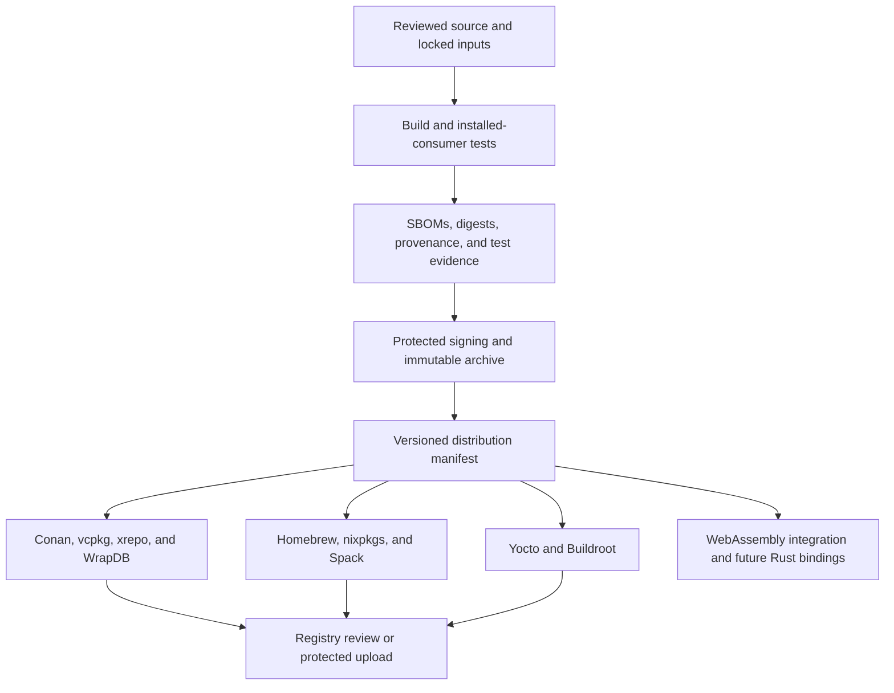

<!--
SPDX-FileCopyrightText: 2026 Rafael V. Volkmer <rafael.v.volkmer@gmail.com>
SPDX-License-Identifier: GPL-3.0-only
-->

# libmemalloc distribution and packaging design

Use this proposed contract to review installation, package identity and release acceptance.
The current distribution fixture does not establish allocator support.

<details>
<summary><strong>On this page</strong></summary>

- [Status and scope](#status-and-scope)
- [Installation contract](#installation-contract)
- [Variants and activation](#variants-and-activation)
- [Immutable release and publication](#immutable-release-and-publication)
- [Registry adoption plan](#registry-adoption-plan)
- [Embedded systems](#embedded-systems)
- [WebAssembly and Rust](#webassembly-and-rust)
- [Acceptance tests](#acceptance-tests)
- [Cache and credential boundaries](#cache-and-credential-boundaries)

</details>

---

<a id="status-and-scope"></a>
<a id="lma-dist-001"></a>

## LMA-DIST-001: Status and scope

**Phase:** P0. **Status:** PROPOSED.

**M0:** REQUIRED. **G0:** REQUIRED.

This SDD specifies the production distribution contract and the order of registry adoption. The current C
library is a release-pipeline fixture, not an allocator implementation. Its Conan package uses the name
`libmemalloc-mock`. No registry entry or production support claim follows from the fixture tests.

Apply the [source-attribution rule](README.md#source-attribution) when referring to upstream mechanisms,
academic artifacts or repository integrations. Their links identify origins, not qualification of LMA packages.

Package maintainers must use one upstream implementation and one installation contract. Packaging adapters may
translate options and platform paths; they must not carry a different allocator implementation. Keep
repository orchestration in Lua. The native Conan recipe is the approved packaging exception; the
[automation architecture](../reference/automation.md#guides) separately scopes locked analysis
adapters. Spack's native Python recipe needs a separate exception before implementation.

### Requirements

<a id="lma-dist-001-r01"></a> **LMA-DIST-001-R01.** MUST label fixture artifacts as mock and MUST NOT infer
production allocator support from fixture tests.

<a id="lma-dist-001-r02"></a> **LMA-DIST-001-R02.** MUST preserve one upstream implementation and installation
contract across adapters; repository automation remains Lua except for explicitly approved native recipes.

**Planned verification:** [LMA-TEST-CASE-0651](libmemalloc-tests-SDD.md#lma-test-case-0651).

---

<a id="installation-contract"></a>
<a id="lma-dist-002"></a>

## LMA-DIST-002: Installation contract

**Phase:** P0. **Status:** PROPOSED.

**M0:** REQUIRED. **G0:** REQUIRED.

Support direct compiler/linker use, pkg-config, and a relocatable CMake package. Consumers must not need a
particular package manager.

```cmake
find_package(libmemalloc CONFIG REQUIRED)
target_link_libraries(my_application PRIVATE LMA::memalloc)
```

The example is the proposed production interface. Use the same namespace in the fixture installation test,
while labeling its metadata as a mock.

| Installed content                           | Destination relative to the prefix             |
| ------------------------------------------- | ---------------------------------------------- |
| Public headers                              | `include/libmemalloc/`                         |
| Static/shared libraries                     | Platform `libdir`; DLL runtime files in `bin/` |
| CMake config, version, and exported targets | `libdir/cmake/libmemalloc/`                    |
| pkg-config metadata                         | `libdir/pkgconfig/libmemalloc.pc`              |
| License and notices                         | `share/licenses/libmemalloc/`                  |
| Version, features, and release identity     | `share/libmemalloc/`                           |

Use
[CMake export and installation mechanisms](https://cmake.org/cmake/help/latest/guide/importing-exporting/index.html)
and GNUInstallDirs rather than hard-coded host paths. Support a staging prefix and `DESTDIR`; avoid absolute
build-tree paths in installed metadata. Record required system libraries in exported targets and
`Libs.private` as applicable. Define SONAME and ABI compatibility policy before the first production release.

### Requirements

<a id="lma-dist-002-r01"></a> **LMA-DIST-002-R01.** MUST provide standalone headers, direct linking,
relocatable CMake exports and pkg-config metadata with the same public usage requirements.

<a id="lma-dist-002-r02"></a> **LMA-DIST-002-R02.** MUST support staging and DESTDIR without recording
source/build-tree paths in installed metadata.

<a id="lma-dist-002-r03"></a> **LMA-DIST-002-R03.** MUST propagate shared-library import definitions and
required system libraries through both CMake and pkg-config consumers.

<a id="lma-dist-002-r04"></a> **LMA-DIST-002-R04.** MUST define the production ABI and SONAME compatibility
policy before publishing a production release.

**Planned verification:** [LMA-TEST-CASE-0652](libmemalloc-tests-SDD.md#lma-test-case-0652).

---

<a id="variants-and-activation"></a>
<a id="lma-dist-003"></a>

## LMA-DIST-003: Variants and activation

**Phase:** P0. **Status:** PROPOSED.

**M0:** REQUIRED. **G0:** REQUIRED.

Describe each supported tuple: architecture, operating system, compiler and version, C runtime, ABI, build
type, linking mode, and enabled features. Separate host tools from target artifacts during cross-compilation.
Reject unsupported tuples rather than selecting a nearby binary.

Disable experimental garbage collection by default. Install the core without replacing process or system
`malloc`. Keep interposition in a separate opt-in component; do not edit loader configuration or set a global
preload variable. Package installation must not execute an allocator activation script.

Experimental page policies, descriptor layouts, guarded sampling and MTE are separately identified variants.
The manifest records requested and effective protections, geometry/policy digests, mandatory runtime probes,
resource limits and the exact qualification evidence. An untagged fallback cannot satisfy a tagged package
request. Diagnostic replay entropy is never a production default. Missing native evidence leaves the variant
experimental, and deferred features cannot appear under an M0/G0 identity.

An installed consumer verifies capability negotiation against the manifest, including refusal of an absent
mandatory protection. Repackaging a configuration does not inherit another configuration's security or speed
claim. [LMA-TEST-CASE-0677](libmemalloc-tests-SDD.md#lma-test-case-0677) covers these planned rejection paths.

Reference mechanisms are documented by [GWP-ASan](https://llvm.org/docs/GwpAsan.html),
[Linux MTE](https://www.kernel.org/doc/html/latest/arch/arm64/memory-tagging-extension.html) and the
[NanoTag research artifact](https://github.com/ice-rlab/NanoTag). Their integration methods are not install
instructions for LMA: do not inherit preload activation or debugger/runtime dependencies accidentally.
The manifest distinguishes runtime protection, in-house diagnostics and compiler-instrumented consumers.
It records upstream paper/repository links plus the exact reviewed revision for any reused implementation,
its license and provenance. A bibliographic citation alone does not grant permission to copy code or certify
compatibility. [LMA-TEST-CASE-0690](libmemalloc-tests-SDD.md#lma-test-case-0690) checks artifact separation.

### Requirements

<a id="lma-dist-003-r01"></a> **LMA-DIST-003-R01.** MUST record the complete target tuple and reject
unsupported variants without silent substitution.

<a id="lma-dist-003-r02"></a> **LMA-DIST-003-R02.** MUST keep GC disabled by default and interposition in a
separate explicitly selected component.

<a id="lma-dist-003-r03"></a> **LMA-DIST-003-R03.** MUST NOT activate allocator replacement or alter global
loader configuration during package installation.

**Planned verification:** [LMA-TEST-CASE-0653](libmemalloc-tests-SDD.md#lma-test-case-0653).

---

<a id="immutable-release-and-publication"></a>
<a id="lma-dist-004"></a>

## LMA-DIST-004: Immutable release and publication

**Phase:** P0. **Status:** PROPOSED.

**M0:** REQUIRED. **G0:** REQUIRED.



All adapters consume the same immutable source archive or a qualified binary from that release. Record the
full archive digest, upstream release identity, recipe digest, target tuple, and signing-verification result.
Short build IDs are labels; use full digests for verification. Verify authenticity before generating recipes.
A tag alone is not an immutable content identity.

After a release, create candidate metadata, run each adapter's install test, and preserve a publication
receipt. Upload to owned remotes only after approval. For community registries, prepare a reviewed
contribution; an upstream release does not authorize an automatic merge into another project's registry. Retry
publication idempotently; never overwrite an existing version with other bytes. Record withdrawals and
security fixes as new metadata or new releases.

### Requirements

<a id="lma-dist-004-r01"></a> **LMA-DIST-004-R01.** MUST verify immutable source/binary digests and signing
identity before generating publication metadata.

<a id="lma-dist-004-r02"></a> **LMA-DIST-004-R02.** MUST retain recipe digest, target tuple and publication
receipt for each adapter.

<a id="lma-dist-004-r03"></a> **LMA-DIST-004-R03.** MUST require the declared protected publication
authorization and reject overwriting an existing version with different bytes.

**Planned verification:** [LMA-TEST-CASE-0654](libmemalloc-tests-SDD.md#lma-test-case-0654).

---

<a id="registry-adoption-plan"></a>
<a id="lma-dist-005"></a>

## LMA-DIST-005: Registry adoption plan

**Phase:** P1. **Status:** PROPOSED.

**M0:** DEFERRED. **G0:** DEFERRED.

| Channel                                                                                                            | Adapter and promotion path                                          | Required qualification                                          |
| ------------------------------------------------------------------------------------------------------------------ | ------------------------------------------------------------------- | --------------------------------------------------------------- |
| [Conan](https://docs.conan.io/2/tutorial/creating_packages/other_types_of_packages/package_prebuilt_binaries.html) | Native recipe; protected remote upload; separate ConanCenter review | Static/shared installed consumers and package revisions         |
| [vcpkg](https://learn.microsoft.com/en-us/vcpkg/get_started/get-started-packaging)                                 | Overlay first, then registry contribution                           | Triplets, CMake exports, static/shared selection, source digest |
| [Xmake xrepo](https://xmake.io/guide/package-management/using-official-packages.html)                              | Lua package recipe and reviewed xmake-repo contribution             | Install consumer, option mapping, supported platforms           |
| [Meson WrapDB](https://mesonbuild.com/Wrap-dependency-system-manual.html)                                          | Wrap and build integration, followed by WrapDB review               | Download hash, dependency name, installed consumer              |
| [Homebrew](https://docs.brew.sh/Formula-Cookbook)                                                                  | Tap/formula first; core submission only if eligible                 | Formula audit, test block, macOS/Linux qualification            |
| [Nix and nixpkgs](https://nixos.org/manual/nixpkgs/stable/)                                                        | Derivation then nixpkgs contribution                                | Fixed-output source hash, sandbox build, install checks         |
| [Spack](https://spack.readthedocs.io/en/latest/packaging_guide_creation.html)                                      | Native recipe after Python exception approval                       | Compiler variants, dependency concretization, installed test    |
| [Yocto/OpenEmbedded](https://docs.yoctoproject.org/dev-manual/new-recipe.html)                                     | Layer recipe before general desktop packaging                       | Cross-build, license checksum, sysroot and package split        |
| [Buildroot](https://buildroot.org/downloads/manual/manual.html)                                                    | External-tree package, then upstream review                         | Toolchain constraints, staging install, target image test       |

These are planned registration channels, not claims of existing published packages. Preserve each registry's
native recipe language; do not generate a second build implementation. Snap is lower priority than Yocto and
Buildroot and has no initial library-distribution commitment.

### Requirements

<a id="lma-dist-005-r01"></a> **LMA-DIST-005-R01.** MUST qualify each registry adapter through its installed
consumer and native option mapping before requesting promotion.

<a id="lma-dist-005-r02"></a> **LMA-DIST-005-R02.** MUST distinguish candidate registry metadata from accepted
or published packages and preserve native recipe languages.

**Planned verification:** [LMA-TEST-CASE-0655](libmemalloc-tests-SDD.md#lma-test-case-0655).

---

<a id="embedded-systems"></a>
<a id="lma-dist-006"></a>

## LMA-DIST-006: Embedded systems

**Phase:** P1. **Status:** PROPOSED.

**M0:** DEFERRED. **G0:** DEFERRED.

For Yocto, record source and license checksums, inherit the appropriate CMake integration, and separate
runtime, development, and static-library packages. Respect the target sysroot and compiler supplied by
BitBake. Keep network access in declared fetch steps. Test in an emulator or on a named target and retain the
image configuration with the results.

For Buildroot, declare architecture, runtime, threading, and shared-library constraints. Install development
files into staging and runtime files into the target only when selected. Record license files and hashes. Use
an external tree for initial qualification; do not install host-built libraries into the target image. Keep GC
and interposition disabled unless the image opts in.

### Requirements

<a id="lma-dist-006-r01"></a> **LMA-DIST-006-R01.** MUST use the target toolchain/sysroot and retain
source/license checksums and image configuration for Yocto and Buildroot.

<a id="lma-dist-006-r02"></a> **LMA-DIST-006-R02.** MUST separate host tools, staging development files and
selected target runtime files; network access belongs only to declared fetch steps.

**Planned verification:** [LMA-TEST-CASE-0656](libmemalloc-tests-SDD.md#lma-test-case-0656).

---

<a id="webassembly-and-rust"></a>
<a id="lma-dist-007"></a>

## LMA-DIST-007: WebAssembly and Rust

**Phase:** P3. **Status:** PROPOSED.

**M0:** DEFERRED. **G0:** DEFERRED.

Implement and test WebAssembly integration before seeking a registry entry. Choose the target ABI, memory
model, supported allocation API, and WASI/host imports. Test linear-memory limits and ownership across host
calls. Native pointer and operating-system assumptions require explicit adapters.

Evaluate the [Wasmer Registry](https://docs.wasmer.io/registry/) after the module and bindings contract works
with the intended consumers. A native C archive cannot stand in for a qualified WebAssembly package.

Future Rust support should separate raw FFI from safe wrappers. Before publishing to crates.io, choose linking
policy, ABI bindings, license metadata, and a `links` identity. Follow the
[Cargo build-script contract](https://doc.rust-lang.org/cargo/reference/build-scripts.html). Avoid network
fetches in build scripts; make system-library and bundled-source selection explicit. Test the Rust allocator
lifetime and failure contracts before exposing a global allocator. Do not publish placeholder crate names.

### Requirements

<a id="lma-dist-007-r01"></a> **LMA-DIST-007-R01.** MUST qualify the WebAssembly ABI, memory model, imports
and ownership contract before registry publication.

<a id="lma-dist-007-r02"></a> **LMA-DIST-007-R02.** MUST qualify Rust FFI, linking identity, lifetime and
failure semantics before exposing a safe or global allocator wrapper; build scripts must not fetch from the
network.

**Planned verification:** [LMA-TEST-CASE-0657](libmemalloc-tests-SDD.md#lma-test-case-0657).

---

<a id="acceptance-tests"></a>
<a id="lma-dist-008"></a>

## LMA-DIST-008: Acceptance tests

**Phase:** P0. **Status:** PROPOSED.

**M0:** REQUIRED. **G0:** REQUIRED.

Build, install into `.cache/tests/install/<tuple>/`, move that prefix, and compile a consumer outside the
source and build trees. Exercise CMake, pkg-config, and direct linker use. Run native consumers; cross-target
consumers need a qualified emulator or hardware job. A skipped execution is not a passing runtime test.

Check header completeness, relocation, debug/release isolation, static/shared dependencies, GC defaults, and
absence of activation side effects. Compare the installed version and library digest with the distribution
manifest. Keep consumer logs, exit codes, tool identities, and package receipts as evidence.

### Requirements

<a id="lma-dist-008-r01"></a> **LMA-DIST-008-R01.** MUST test installed consumers outside the source/build
trees after relocating the installation prefix.

<a id="lma-dist-008-r02"></a> **LMA-DIST-008-R02.** MUST distinguish compile-only, emulated and native
evidence, and MUST NOT count skipped execution as a runtime pass.

<a id="lma-dist-008-r03"></a> **LMA-DIST-008-R03.** MUST reconcile installed version, features and library
digest with the distribution manifest and retain consumer logs and tool identities.

**Planned verification:** [LMA-TEST-CASE-0658](libmemalloc-tests-SDD.md#lma-test-case-0658).

---

<a id="cache-and-credential-boundaries"></a>
<a id="lma-dist-009"></a>

## LMA-DIST-009: Cache and credential boundaries

**Phase:** P0. **Status:** PROPOSED.

**M0:** REQUIRED. **G0:** REQUIRED.

Use root `.cache/build/`, `.cache/tools/`, `.cache/tests/`, `.cache/logs/`, `.cache/ci/`, and `.cache/cd/` for
disposable state. Keep sealed release files and their signed evidence under `release/`; they are distribution
artifacts, not caches. Do not use restored executable caches as a trust root.

Store remote credentials in protected GitHub environments. Prefer scoped, short-lived credentials and OIDC
where supported. Keep public endpoints and project identifiers in variables. Never cache signing secrets or
publish a whole cache directory as a release artifact.

### Requirements

<a id="lma-dist-009-r01"></a> **LMA-DIST-009-R01.** MUST keep disposable cache state separate from sealed
release artifacts and MUST NOT use restored executables as the release trust root.

<a id="lma-dist-009-r02"></a> **LMA-DIST-009-R02.** MUST keep publication/signing credentials in the declared
protected boundary and exclude secrets from caches and public artifacts.

**Planned verification:** [LMA-TEST-CASE-0659](libmemalloc-tests-SDD.md#lma-test-case-0659).

<!-- EOF -->

