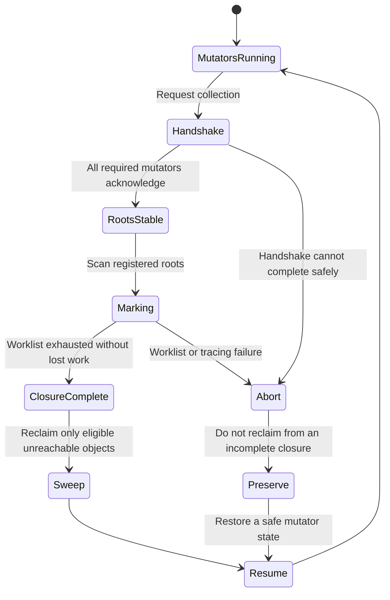

<!--
SPDX-FileCopyrightText: 2026 Rafael V. Volkmer <rafael.v.volkmer@gmail.com>
SPDX-License-Identifier: GPL-3.0-only
-->

# libmemalloc: Optional collector implementation and integration with runtimes

Use this document to implement and review the optional collector and integration contracts. Start with the
boundaries, select a control from the index and follow its requirements to the test catalog.

Worklists, roots, slots, safepoints and workers use the owned runtime and atomic primitives. Resource
exhaustion, partial worker creation or a missing mutator must never permit incomplete tracing to proceed
to reclamation. The contracts define reservations, failure handling and the required collection boundary.

**Evidence boundary:** This is a proposed product specification. Allocator correctness, portability, Rust
integration, fuzzing and stress campaigns remain unqualified. Repository checks cover documents and
automation fixtures; they do not establish product acceptance or evidence for another specification.

<details>
<summary><strong>On this page</strong></summary>

- [Authority and requirements](#governance)
- [Boundaries, authority and initial cut](#boundaries)
- [Initial collector state transitions](#gc-collection-overview)
- [Controls by responsibility](#inherited-controls)
- [LMA-GC-001: Optional GC module and managed domains](#lma-gc-001)
- [LMA-GC-002: Type descriptors and safe publication of objects](#lma-gc-002)
- [LMA-GC-003: Registered roots, threads and safepoints](#lma-gc-003)
- [LMA-GC-004: Handles, identity and mobility loans](#lma-gc-004)
- [LMA-GC-005: Initial precise collector: stop-the-world mark-and-sweep](#lma-gc-005)
- [LMA-GC-006: Nursery, promotion and generational collection](#lma-gc-006)
- [LMA-GC-007: Incrementality, barriers and concurrent reading valid in C](#lma-gc-007)
- [LMA-GC-008: Selective evacuation and net gain planning](#lma-gc-008)
- [LMA-GC-009: Conservative compatibility as an isolated module](#lma-gc-009)
- [LMA-GC-010: References between areas and FFI boundaries](#lma-gc-010)
- [LMA-GC-011: Weak references, ephemerons and completion](#lma-gc-011)
- [LMA-GC-012: Cohorts with rescue of surviving subgraph](#lma-gc-012)
- [LMA-GC-013: Islands with boundary and refinement certificates](#lma-gc-013)
- [LMA-GC-014: Structural transactions to amortize internal barriers](#lma-gc-014)
- [LMA-GC-015: Payload separate topology and specialized scanners](#lma-gc-015)
- [LMA-GC-016: Integration with compilers, languages and runtimes](#lma-gc-016)
- [LMA-GC-017: Identity by coordinator, protected access and child loans](#lma-gc-017)
- [LMA-GC-018: Rhythm of collection, security space and maintenance debt](#lma-gc-018)
- [LMA-GC-019: Asynchronous FFI, external loans and device memory](#lma-gc-019)
- [Detailed implementation contracts](#implementation-contracts)
- [LMA-GC-020: G0: precise usable domain without moving](#lma-gc-020)
- [LMA-GC-021: Handshake, safepoints and mutator states](#lma-gc-021)
- [LMA-GC-022: Protection of references, namespaces and borrowing](#lma-gc-022)
- [LMA-GC-023: Tracing and sweep: complete closure before reclamation](#lma-gc-023)
- [LMA-GC-024: Barriers, incrementality and concurrency in the C model](#lma-gc-024)
- [LMA-GC-025: Evacuation, external loans and promotion failures](#lma-gc-025)
- [LMA-GC-026: Weak references, ephemerons and completion: order of phases](#lma-gc-026)
- [LMA-GC-027: Cohorts, islands and plans: abstraction obligations](#lma-gc-027)
- [Additional product contracts](#additional-contracts)
- [LMA-GC-028: GC without external allocator: worklists, barriers and reserves](#lma-gc-028)
- [LMA-GC-029: Handshake on own runtime and external mutators](#lma-gc-029)
- [LMA-GC-030: Concurrent slots with owned representation](#lma-gc-030)
- [LMA-GC-031: C/Rust parity and corpus of graphs independent of addresses](#lma-gc-031)
- [Examples and compilation context](#examples)
- [Pending qualification](#pending-qualification)
- [References](#references)
- [Additional references and limitations](#additional-references)

</details>

---

<a id="governance"></a>

## Authority and requirements

Apply the [source-attribution rule](README.md#source-attribution): link primary references in each control
that introduces an external technique, including new experiments, and identify LMA-specific adaptations.

**Product:** libmemalloc. **Status:** proposed implementation, not an implemented library or evidence of
better performance than another allocator.

The [local C standard](../standards/c/c-code-standard.md),
[module architecture](../standards/c/c-module-architecture.md), and
[pitfall guide](../standards/c/c-common-pitfalls.md) govern C development. Product constraints in these
specifications refine the permitted implementation. Apply C and platform semantics first, then approved
product constraints and local policy. Conflicts require an explicit decision; a policy exception cannot make
undefined behavior defined.

MUST and MUST NOT express requirements; MAY grants conditional permission. A control's classification does not
by itself measure failure severity. Keep stable control, requirement, invariant, and test identifiers when
editing. References explain a technique; they do not prove this composition or its results. BASE does not mean
implemented, and EXPERIMENTAL does not establish novelty. The H-01 through H-14 hypotheses remain experiments,
not results.

Public names use `LMA_lowerCamelCase`, private names use `lma_lowerCamelCase`, owned types use `lma_*_t`, and
structure tags use the `Lma` prefix and UpperCamelCase. Use Allman compound statements, eight-column
indentation, and 80-column C lines. The result variable is `ret`, declarations occur at the permitted scope
entry, and normal return follows `function_output`. Explicit null pointers follow the local typed-null rule.
Public C headers do not add explicit `extern` or embedded C++ bridges. API descriptions abbreviate local
`LMA_E*` error codes; adapters translate foreign codes without depending on foreign errno numbers.

The local simple-branch rule in CSTYLE-022 and the grouping rules in CSTYLE-279 and CSTYLE-280 apply to these
examples. One-line simple `if` bodies omit braces; loops and compound branch bodies retain them.

The companion schemas, migration records, and validation reports mentioned by the original package are not
present here. They are not current execution evidence. The [CI
reference](../reference/automation.md#ci-control-map) states
the actual check coverage. Product capabilities remain unqualified until their required evidence exists;
missing or conflicting evidence blocks the capability.

---

<a id="boundaries"></a>

## Boundaries, authority and initial cut

G0: precise, stop-the-world and nonmoving, with root, accessors, borrows, types and functional OOM. G1:
generations/movement/incrementality only after their gates. Experimental features remain isolated; they are
not manual mode link requirements.

| Operation G0            | Input/output protection                                               | Safepoint                         | Failure/lock                                                         |
| ----------------------- | --------------------------------------------------------------------- | --------------------------------- | -------------------------------------------------------------------- |
| NewInto                 | Type, thread and root of same coordinator; scanned object before exit | May                               | It can allocate/block; it preserves root destination.                |
| RootCopyInto / LoadInto | Target protected during transfer                                      | No                                | You can acquire lock; fail before changing destination.              |
| Store                   | Owner/target protected; field registered                              | No                                | Validate before writing; barrier of future modes has its own effect. |
| BorrowBegin             | Root preserved during booking; ticket+pin before address              | May, before exposing the address  | Valid zero outputs failed; you can allocate ticket/block.            |
| BorrowEnd               | Ticket still alive; end of all accesses                               | No                                | No new fallible allocation; you can acquire mobility lock.           |
| Collect                 | Registered Thread and context that can cooperate                      | Yes                               | No sweep without all required acknowledgements.                      |

Pins provide neither payload mutual exclusion nor transitive protection. Safe FFI must declare the absence of
concurrent writes to fields examined by the GC. Future modes do not silently alter this matrix.

### Related documents

[Implementation of the manual core and arenas](libmemalloc-core-implementation-SDD.md) ·
[Security, threats and protection mechanisms](libmemalloc-security-SDD.md) ·
[Tests, verification, experiments and evidence](libmemalloc-tests-SDD.md) ·
[Compilation, modules, ABI, PGO and delivery](libmemalloc-compilation-SDD.md)

---

<a id="gc-collection-overview"></a>

## Initial collector state transitions

The initial exact, nonmoving collector must complete the reachable-object closure before reclaiming memory.
Failure handling preserves reachable objects and restores a state from which mutators can safely resume.



---

<a id="inherited-controls"></a>

## Controls by responsibility

The controls below define proposed mechanisms. The example appendix provides implementation context without
establishing a stable ABI or product qualification.

---

<a id="lma-gc-001"></a>

## LMA-GC-001: Optional GC module and managed domains

**M0:** DEFERRED. **G0:** REQUIRED.

**Phase:** P2. **Nature:** BASE. **Status:** PROPOSED.

GC does not include headers or reference core symbols. It uses its region storage port, implemented by an
external adapter that can use the core. Previous GC→core dependence is now a semantic dependency on
supply/composition, not a direct dependency between peer modules. The port is called in acquisition/revolution
of regions, not in the hit of each managed object.

### Theoretical reference and application

[Memory Pool System: arenas](https://memory-pool-system.readthedocs.io/en/latest/topic/arena.html): Boundaries
between bodies and pools.

[Garbage Collection with LLVM](https://llvm.org/docs/GarbageCollection.html): Need for cooperation
runtime/compiler.

### Decision and operation

The manual build will not contain tracer, barriers, handle table or branch `gc_enabled` in the local hit. The
GC module will create stable or moving domains over your region port, connected to a provider per adapter. The
first version will admit one GC coordinator per instance, tracking all its precise domains; several
independent coordinators stay out of the initial contract.

Stable GC avoids movement, but still requires correct roots and descriptors. Moving GC also requires
relocatable identity and loans. Manual memory will not be collected because it is in the same process. There
will be no automatic exchange of libc malloc for managed objects.

In the illustrative API, `LMA_gcCreate` creates the coordinator only once. The mode parameter defines its
default policy; the coordinator can have additional stable pools, even when the default is moveable. Creating
a domain does not mean creating another coordinator. The pool configuration contract will be frozen before the
P2 implementation.

### Verifiable requirements

<a id="lma-gc-001-r01"></a> **LMA-GC-001-R01.** MUST select domain in creation and keep GC metadata out of
manual spans.

<a id="lma-gc-001-r02"></a> **LMA-GC-001-R02.** MUST allow compile core, arena, GC and adapters alone.
Consumers know their ports; the composition connects the providers without direct dependence on peer.

<a id="lma-gc-001-r03"></a> **LMA-GC-001-R03.** MUST reject unavailable mode with `LMA_ENOTSUP`, without
semantic fallback silent.

### Invariants

<a id="lma-gc-001-i01"></a> **LMA-GC-001-I01.** Moving only happens in the area that allows it.

<a id="lma-gc-001-i02"></a> **LMA-GC-001-I02.** Address stability does not replace root registration.

### Risks, limits and fallback

GC continues to share band and backend when it is present. Module option does not guarantee domain performance
isolation.

### Checking and linking to the catalogue

[LMA-TEST-CASE-0058](libmemalloc-tests-SDD.md#lma-test-case-0058),
[LMA-TEST-CASE-0059](libmemalloc-tests-SDD.md#lma-test-case-0059),
[LMA-TEST-CASE-0060](libmemalloc-tests-SDD.md#lma-test-case-0060). All cases remain planned for the product.

---

<a id="lma-gc-002"></a>

## LMA-GC-002: Type descriptors and safe publication of objects

**M0:** DEFERRED. **G0:** REQUIRED.

**Phase:** P2. **Nature:** BASE. **Status:** PROPOSED.

### Theoretical reference and application

[Memory Pool System: scanning](https://memory-pool-system.readthedocs.io/en/latest/topic/scanning.html):
Formats that allow scanning correct.

[Memory Pool System: allocation](https://memory-pool-system.readthedocs.io/en/latest/topic/allocation.html):
Separate booking and initialization of publication.

### Decision and operation

Each managed type will declare size, alignment and reference fields. Arrays and unions will need valid
length/tag and defined scanner; scan callback cannot allocate, block indefinitely or modify the graph. The
initial version can accept only fixed types and reject the others.

`LMA_gcNewInto` will allocate an initially scannable object and publish it in a root already registered as
part of the same protocol. Reference slots begin semantically null; zero bytes will not be used as universal
zero C pointer proof. Integer handles will have null value explicitly defined as zero. Payload without
references may remain uninitialized until the caller fills it out.

The basic operations of protected reading and updating of references belong to P2, even if incremental
barriers remain in P3. The common format of the field, its initialization and access to the child need to obey
[LMA-GC-017](libmemalloc-gc-implementation-SDD.md#lma-gc-017). Atomic or address-dependent types require
explicit relocation policy; generic memcpy is not a universal contract to move any type.

### Verifiable requirements

<a id="lma-gc-002-r01"></a> **LMA-GC-002-R01.** MUST validate offsets, alignments and field boundaries before
registering the type.

<a id="lma-gc-002-r02"></a> **LMA-GC-002-R02.** MUST distinguish common `lma_gc_ref_t` fields from atomically
declared slots.

<a id="lma-gc-002-r03"></a> **LMA-GC-002-R03.** MUST keep the descriptors valid as long as your objects exist
and preserve the destination root in failure.

### Invariants

<a id="lma-gc-002-i01"></a> **LMA-GC-002-I01.** Every published object is scanned by the associated
descriptor.

<a id="lma-gc-002-i02"></a> **LMA-GC-002-I02.** No partially initialized reference enters the graph visible to
the collector.

### Risks, limits and fallback

Precise descriptors cannot be inferred from any struct C without metadata. The application must use setters or
code generated compatible with the barriers.

### Checking and linking to the catalogue

[LMA-TEST-CASE-0061](libmemalloc-tests-SDD.md#lma-test-case-0061),
[LMA-TEST-CASE-0062](libmemalloc-tests-SDD.md#lma-test-case-0062),
[LMA-TEST-CASE-0063](libmemalloc-tests-SDD.md#lma-test-case-0063). All cases remain planned for the product.

---

<a id="lma-gc-003"></a>

## LMA-GC-003: Registered roots, threads and safepoints

**M0:** DEFERRED. **G0:** REQUIRED.

**Phase:** P2. **Nature:** BASE. **Status:** PROPOSED.

### Theoretical reference and application

[Memory Pool System: roots](https://memory-pool-system.readthedocs.io/en/latest/topic/root.html): Record of
external roots.

[Garbage Collection with LLVM](https://llvm.org/docs/GarbageCollection.html): Safe points and location of
references.

### Decision and operation

Roots will be opaque runtime records. Copy `lma_gc_ref_t` to a common variable does not create root. The
caller will keep at least one registered root or strong path for every object that you can still use.
Variables in unregistered registrars and interior pointers will not be discovered by divination.

Each thread that accesses the GC will need attach/detach and secure points. When requesting paused collection,
the coordinator will wait to confirm the domain threads, without keeping locks they need to reach the
safepoint. Threads locked in external code should publish secure status before entering the lock. Absence of
confirmation prevents collection; timeout does not authorize ignoring a root.

`root_get` does not prolong the life of the result. To transfer protection, prefer `root_copy_into`, which
reads the source still registered and updates the destination in the same protocol. `root_set` requires the
value to be null or remain protected during the operation; it does not resurrect an obsolete identity. A
shared root requires synced access by runtime.

The entire value of a handle is local to the coordinator. In `root_set`, the caller must prove that the
identity belongs to the same coordinator and remains protected; without additional namespace in value, two
coordinators can produce equal bits and not every mixture is detectable. Operations between opaque roots
validate the origin and destination coordinators, according to
[LMA-GC-017](libmemalloc-gc-implementation-SDD.md#lma-gc-017).

### Verifiable requirements

<a id="lma-gc-003-r01"></a> **LMA-GC-003-R01.** MUST document which APIs can collect and which do not contain
safepoint.

<a id="lma-gc-003-r02"></a> **LMA-GC-003-R02.** MUST maintain logical atomicity by inserting, updating, and
removing roots.

<a id="lma-gc-003-r03"></a> **LMA-GC-003-R03.** MUST require explicit unwind of records in longjmp,
cancellation or exception of other language.

### Invariants

<a id="lma-gc-003-i01"></a> **LMA-GC-003-I01.** Every thread considered quiescent published all the references
required by the contract.

<a id="lma-gc-003-i02"></a> **LMA-GC-003-I02.** Unregistering a root eliminates only that protection, does not
necessarily destroy the object.

### Risks, limits and fallback

Root failure in C is integration error. Safepoints are not a maximum pause guarantee if the application does
not cooperate.

### Checking and linking to the catalogue

[LMA-TEST-CASE-0064](libmemalloc-tests-SDD.md#lma-test-case-0064),
[LMA-TEST-CASE-0065](libmemalloc-tests-SDD.md#lma-test-case-0065),
[LMA-TEST-CASE-0066](libmemalloc-tests-SDD.md#lma-test-case-0066). All cases remain planned for the product.

---

<a id="lma-gc-004"></a>

## LMA-GC-004: Handles, identity and mobility loans

**M0:** DEFERRED. **G0:** REQUIRED.

**Phase:** P2. **Nature:** BASE. **Status:** PROPOSED.

In the 64-bit identity profile, 32-bit index and 32-bit generation are proposed, both non-zero for a valid
handle. Zero index and total zero value are reserved; the table has resource limit less than or equal to the
representative domain. Generation does not wrap; the slot is retired. Identity only has meaning within its
coordinator and is not an authenticated token.

### Theoretical reference and application

[Memory Pool System: roots](https://memory-pool-system.readthedocs.io/en/latest/topic/root.html): Protection
of liveness by roots.

[Hazard pointers: Safe memory reclamation for lock-free
objects](https://research.ibm.com/publications/hazard-pointers-safe-memory-reclamation-for-lock-free-objects):
Protect readers before recovering or reusing data.

### Decision and operation

Handles will distinguish identity and address. The initial profile will use a 64-bit value with
index/generation defined by the ABI of runtime, not arbitrarily compressed pointer. Zero is null. When
exhausting a generation, retire the slot instead of allowing wrap and false validation. The identity table
does not keep all objects alive: the reachability bits are separated.

A loan purchased from a root will protect liveness and stability of the object, and can cover a region for
amortization. The initial version will use protocol with mobility lock and ticket registration before
delivering the address. Collector and mutator will participate in the same protocol. Optimization by epoch
requires new model; observing `pin_count`==0 alone is insufficient.

The loan of an object does not automatically fix the address of all objects referenced by it. To access a
moveable child, obtain its reference at a protected root and acquire another loan, or use a region loan whose
hedged set is explicitly defined. Fixed address for the GC also does not equal physical pinning for DMA; see
[LMA-GC-017](libmemalloc-gc-implementation-SDD.md#lma-gc-017) and
[LMA-GC-019](libmemalloc-gc-implementation-SDD.md#lma-gc-019).

### Verifiable requirements

<a id="lma-gc-004-r01"></a> **LMA-GC-004-R01.** MUST keep the object alive and not move it until the end of
the loan.

<a id="lma-gc-004-r02"></a> **LMA-GC-004-R02.** MUST invalidate the use of the temporary pointer when closing
the loan.

<a id="lma-gc-004-r03"></a> **LMA-GC-004-R03.** MUST reject movement of address dependent types such as
mutexes and non-relocatable internal references.

### Invariants

<a id="lma-gc-004-i01"></a> **LMA-GC-004-I01.** No old address is delivered while the location change is being
published.

<a id="lma-gc-004-i02"></a> **LMA-GC-004-I02.** Obsolete Handle does not begin to identify another object
after reuse of slot.

### Risks, limits and fallback

Loan does not offer exclusion over payload. The application still needs to sync its own accesses. Loans per
region can fix more memory than necessary.

### Checking and linking to the catalogue

[LMA-TEST-CASE-0067](libmemalloc-tests-SDD.md#lma-test-case-0067),
[LMA-TEST-CASE-0068](libmemalloc-tests-SDD.md#lma-test-case-0068),
[LMA-TEST-CASE-0069](libmemalloc-tests-SDD.md#lma-test-case-0069). All cases remain planned for the product.

---

<a id="lma-gc-005"></a>

## LMA-GC-005: Initial precise collector: stop-the-world mark-and-sweep

**M0:** DEFERRED. **G0:** REQUIRED.

**Phase:** P2. **Nature:** BASE. **Status:** PROPOSED.

### Theoretical reference and application

[On-the-fly garbage collection: an exercise in
cooperation](https://www.cs.utexas.edu/~EWD/transcriptions/EWD05xx/EWD520.html):
Tracking from the roots and preservation of the reachable objects.

[Memory Pool System: scanning](https://memory-pool-system.readthedocs.io/en/latest/topic/scanning.html):
Scanning references by format.

### Decision and operation

First implement a paused, unmoved collector with explicit worklist and mark bitmap. After complete handshake,
enumerate roots, traverse strong references and recover only unmarked objects in the selected domain.
Achievable cycles are preserved; pathless cycles from the roots can be recovered.

The handles table serves to locate and validate identities, but is not treated as a set of roots. Loan objects
and completion records also enter the protection set according to your contract. Do not use recursion in the C
stack for arbitrarily deep graphs. Mark bits and free/occupied are distinct states.

### Verifiable requirements

<a id="lma-gc-005-r01"></a> **LMA-GC-005-R01.** MUST reserve worklist/scratch or have full fallback before any
sweep.

<a id="lma-gc-005-r02"></a> **LMA-GC-005-R02.** MUST abort reclamation when a failure prevents complete tracing.

<a id="lma-gc-005-r03"></a> **LMA-GC-005-R03.** MUST keep graph-oracle checker in the testing harness.

### Invariants

<a id="lma-gc-005-i01"></a> **LMA-GC-005-I01.** Every object reachable by recorded strong references remains
allocated.

<a id="lma-gc-005-i02"></a> **LMA-GC-005-I02.** Sweep only occurs after a complete marking closure for the
collection generation.

### Risks, limits and fallback

Pause grows with the effective work of heap and roots. The first collector does not claim low latency by
construction.

### Checking and linking to the catalogue

[LMA-TEST-CASE-0070](libmemalloc-tests-SDD.md#lma-test-case-0070),
[LMA-TEST-CASE-0071](libmemalloc-tests-SDD.md#lma-test-case-0071),
[LMA-TEST-CASE-0072](libmemalloc-tests-SDD.md#lma-test-case-0072). All cases remain planned for the product.

---

<a id="lma-gc-006"></a>

## LMA-GC-006: Nursery, promotion and generational collection

**M0:** DEFERRED. **G0:** DEFERRED.

**Phase:** P3. **Nature:** BASE. **Status:** PROPOSED.

### Theoretical reference and application

[Glossary: generation and generational garbage
collection](https://memory-pool-system.readthedocs.io/en/latest/glossary/g.html#term-generational-garbage-collection):
Generations and remembered sets.

[A Nonrecursive List Compacting
Algorithm](https://people.cs.umass.edu/~emery/classes/cmpsci691s-fall2004/papers/p677-cheney.pdf):
Copying and tracking of survivors.

### Decision and operation

The moving domain can use nursery by context, allocated by cursor. Survivor objects will be copied to survival
regions or promoted. Large, non-relocatable objects or for long loans may be born in appropriate stable
storage.

Every old reference→young needs to be found in the minor collection. The initial mechanism will be card table
or remembered set updated by the store API, including for references in stable managed domains. External roots
are examined. Smaller collection does not decide full liveness of the old heap: an object retained by an old
man already dead may survive until larger collection.

### Verifiable requirements

<a id="lma-gc-006-r01"></a> **LMA-GC-006-R01.** MUST register intergenerational stores before a minor
collection can omit them.

<a id="lma-gc-006-r02"></a> **LMA-GC-006-R02.** MUST ensure sufficient destination or safe fallback before
evacuating.

<a id="lma-gc-006-r03"></a> **LMA-GC-006-R03.** MUST maintain identity and preserve fields according to the
descriptor during promotion.

### Invariants

<a id="lma-gc-006-i01"></a> **LMA-GC-006-I01.** Every accessible young man from outside the Nursery is at a
root or on the remembered set covered by the cycle.

<a id="lma-gc-006-i02"></a> **LMA-GC-006-I02.** Promotion failure does not leave handles pointing to discarded
memory.

### Risks, limits and fallback

Generational hypothesis can fail in workload. Nursery and copies need to be disabled without breaking the API.

### Checking and linking to the catalogue

[LMA-TEST-CASE-0073](libmemalloc-tests-SDD.md#lma-test-case-0073),
[LMA-TEST-CASE-0074](libmemalloc-tests-SDD.md#lma-test-case-0074),
[LMA-TEST-CASE-0075](libmemalloc-tests-SDD.md#lma-test-case-0075). All cases remain planned for the product.

---

<a id="lma-gc-007"></a>

## LMA-GC-007: Incrementality, barriers and concurrent reading valid in C

**M0:** DEFERRED. **G0:** DEFERRED.

**Phase:** P3. **Nature:** BASE. **Status:** PROPOSED.

Protected load/store operations exist in G0; this control describes only incremental/generational/competitive
barrier extensions. Common and atomic slot descriptors remain distinct. A paused slice does not allow common
concurrent access in the next slice.

### Theoretical reference and application

[On-the-fly garbage collection: an exercise in
cooperation](https://www.cs.utexas.edu/~EWD/transcriptions/EWD05xx/EWD520.html):
Invariants in the face of graph mutations.

[Garbage Collection with LLVM](https://llvm.org/docs/GarbageCollection.html): Barriers between compiler and
collector.

[GenMC: A model checker for weak memory models](https://plv.mpi-sws.org/genmc/): Analysis under poor memory.

### Decision and operation

The first incremental extension will perform marking slices with paused mutators during each slice, using
barriers between them. Define a specific discipline: for example, insertion that protects the new target: and
demonstrate its closing before the sweep. Do not mix snapshot-at-the-beginning rules with incremental-update
without further proof.

Marking concurrent is another step. The scanner cannot read a non-atomic C field while the mutator
writes it. Types enabled by concurrent scanning need to declare real atomic slots, or publish immutable
snapshots. Convert by cast a common field into concurrent storage does not retroactively create the contract
of the own atomic foundation (LMA-CORE-044). Common types keep scanning paused. Application data operations
continue subject to their own synchronization.

The statements of store/`load_into` below are shared with the P2 functional contract of
[LMA-GC-017](libmemalloc-gc-implementation-SDD.md#lma-gc-017). In this phase P3 are added barriers,
incremental disciplines and atomic variants; P2 does not depend on an incremental collector to access
references correctly. [LMA-CORE-027](libmemalloc-core-implementation-SDD.md#lma-core-027) Discriminates
safepoints and locks.

### Verifiable requirements

<a id="lma-gc-007-r01"></a> **LMA-GC-007-R01.** MUST specify the store barrier, boot, root and promotion for
each mode.

<a id="lma-gc-007-r02"></a> **LMA-GC-007-R02.** MUST process all outstanding buffers and execute remark before
sweep.

<a id="lma-gc-007-r03"></a> **LMA-GC-007-R03.** MUST declare whether it supports lock-free atomics on target
and use fallback when it does not support.

<a id="lma-gc-007-r04"></a> **LMA-GC-007-R04.** MUST acquire protection from the target of a load before
publishing it in the destination; stores and loads validate compatible type, field and coordinator.

### Invariants

<a id="lma-gc-007-i01"></a> **LMA-GC-007-I01.** A new strong edge does not allow a live target to remain
eligible for the default sweep.

<a id="lma-gc-007-i02"></a> **LMA-GC-007-I02.** Scanner and mutator never produce data race over reference
slots.

### Risks, limits and fallback

Incremental does not mean competitor; competitor does not mean without pauses. Paused mode remains mandatory
fallback.

### Checking and linking to the catalogue

[LMA-TEST-CASE-0076](libmemalloc-tests-SDD.md#lma-test-case-0076),
[LMA-TEST-CASE-0077](libmemalloc-tests-SDD.md#lma-test-case-0077),
[LMA-TEST-CASE-0078](libmemalloc-tests-SDD.md#lma-test-case-0078). All cases remain planned for the product.

---

<a id="lma-gc-008"></a>

## LMA-GC-008: Selective evacuation and net gain planning

**M0:** DEFERRED. **G0:** DEFERRED.

**Phase:** P3. **Nature:** EXPERIMENTAL. **Status:** PROPOSED.

### Theoretical reference and application

[A Nonrecursive List Compacting
Algorithm](https://people.cs.umass.edu/~emery/classes/cmpsci691s-fall2004/papers/p677-cheney.pdf):
Preserving by copy of survivors.

[Beyond malloc efficiency to fleet efficiency: a hugepage-aware memory
allocator](https://www.usenix.org/conference/osdi21/presentation/hunter):
Purpose of application and physical memory.

**Evidence limit:** the combination specified in `H-04` is a hypothesis of libmemalloc. The references
support the stated foundations, do not prove its gain or its implementation.

### Decision and operation

Hypothesis H-04: prioritize recovery by net amount of resource returned by cost of execution, coordinating
remote drainage, collection and evacuation. For candidate to estimate
G(a)=`origin_recoverable`−`destination_additional`−`metadata_additional`. Evaluate separately physical gain,
release of contiguous extent and quota relief; do not add incompatible quantities.

Before moving, confirm liveness, absence of incompatible loans, relocatable type and destination capacity. The
initial version will move in paused phase. Book destinations and plan before posting; if preparation fails,
keep backgrounds. Update handles without changing identity and only then remove old pages. The drive does not
apply to manual malloc.

### Verifiable requirements

<a id="lma-gc-008-r01"></a> **LMA-GC-008-R01.** MUST impose pause budget, band, scratch and temporary space.

<a id="lma-gc-008-r02"></a> **LMA-GC-008-R02.** MUST prefer executable actions and validate the gain after
execution.

<a id="lma-gc-008-r03"></a> **LMA-GC-008-R03.** MUST offer simple comparison policy without adaptive
controller.

### Invariants

<a id="lma-gc-008-i01"></a> **LMA-GC-008-I01.** An origin is not recovered as long as there is an observable
address valid for it.

<a id="lma-gc-008-i02"></a> **LMA-GC-008-I02.** Gain estimate does not replace liveness confirmation and
mobility.

### Risks, limits and fallback

Estimated RSS gain is not kernel guarantee. Movement may worsen locality or press caches; measure total time.

### Checking and linking to the catalogue

[LMA-TEST-CASE-0079](libmemalloc-tests-SDD.md#lma-test-case-0079),
[LMA-TEST-CASE-0080](libmemalloc-tests-SDD.md#lma-test-case-0080),
[LMA-TEST-CASE-0081](libmemalloc-tests-SDD.md#lma-test-case-0081). All cases remain planned for the product.

---

<a id="lma-gc-009"></a>

## LMA-GC-009: Conservative compatibility as an isolated module

**M0:** DEFERRED. **G0:** DEFERRED.

**Phase:** P5. **Nature:** EXPERIMENTAL. **Status:** PROPOSED.

### Theoretical reference and application

[Issues in conservative garbage collection](https://hboehm.info/gc/issues.html): Limitations and requirements
of conservative roots.

**Evidence limit:** this compatibility module is experimental and does not receive a separate quantitative
hypothesis H in this specification.

### Decision and operation

A conservative adapter can meet C integrations that do not provide all descriptors and roots. It will only use
stable storage for objects potentially identified by ambiguous words. The platform will need to specify
stacks, registers, static regions, threads and interior pointers.

Do not promise support for cryptographic hidden pointers, arbitrary representations or references kept on
unregistered devices. False positives can retain objects. Mixing with moving domains will only be permitted by
explicitly recorded root/handles bridges; do not scan the entire heap and assume movement security.

### Verifiable requirements

<a id="lma-gc-009-r01"></a> **LMA-GC-009-R01.** MUST remain disabled by default and declare supported platform
matrix.

<a id="lma-gc-009-r02"></a> **LMA-GC-009-R02.** MUST separate precision, retention and compatibility results
from precise GC results.

<a id="lma-gc-009-r03"></a> **LMA-GC-009-R03.** MUST refuse interop moveable without explicit protocol.

### Invariants

<a id="lma-gc-009-i01"></a> **LMA-GC-009-I01.** A conservative candidate never authorizes movement of a raw
address.

<a id="lma-gc-009-i02"></a> **LMA-GC-009-I02.** The premises for root identification are documented by ABI,
not assumed universal.

### Risks, limits and fallback

Conservative does not mean without contract. This module is not a prerequisite of the manual library or the
precise GC.

### Checking and linking to the catalogue

[LMA-TEST-CASE-0082](libmemalloc-tests-SDD.md#lma-test-case-0082),
[LMA-TEST-CASE-0083](libmemalloc-tests-SDD.md#lma-test-case-0083),
[LMA-TEST-CASE-0084](libmemalloc-tests-SDD.md#lma-test-case-0084). All cases remain planned for the product.

---

<a id="lma-gc-010"></a>

## LMA-GC-010: References between areas and FFI boundaries

**M0:** DEFERRED. **G0:** REQUIRED.

**Phase:** P2. **Nature:** BASE. **Status:** PROPOSED.

### Theoretical reference and application

[Memory Pool System: roots](https://memory-pool-system.readthedocs.io/en/latest/topic/root.html): Roots fora
do heap tracked.

[Memory Pool System: arenas](https://memory-pool-system.readthedocs.io/en/latest/topic/arena.html): References
between instances are not automatically traced.

### Decision and operation

Manual→GC will require an external root with longer life span than manual use. GC→manual will be an opaque
pointer without implicit ownership transfer; whoever releases manual memory must demonstrate absence of later
uses. Arena→GC requires removing its roots before destroying the arena; GC→arena requires contract to prevent
premature reset.

A C library that stores undetermined GC pointers will receive stable domain objects and an explicit protection
root. For moving objects, only handles or loans whose end is known. Among independent GC coordinators, strong
bridges can retain cycles: the first version rejects this graph or requires explicit management by the
integrator, without claiming distributed collection.

An asynchronous retention by FFI ends by evidence of consumer completion, not by the return of the function
that started the operation. [LMA-GC-019](libmemalloc-gc-implementation-SDD.md#lma-gc-019) separates GC loan,
liveness root, device mapping and ownership of payload accesses.

### Verifiable requirements

<a id="lma-gc-010-r01"></a> **LMA-GC-010-R01.** MUST define who creates and removes each strong bridge.

<a id="lma-gc-010-r02"></a> **LMA-GC-010-R02.** MUST differentiate stable address from liveness protection.

<a id="lma-gc-010-r03"></a> **LMA-GC-010-R03.** MUST block destroy/reset when traceable protocol indicates
outstanding loans or bridges.

### Invariants

<a id="lma-gc-010-i01"></a> **LMA-GC-010-I01.** An untraceable reference is not treated as proof that fate is
dead.

<a id="lma-gc-010-i02"></a> **LMA-GC-010-I02.** No FFI call keeps moving pointer beyond the authorized loan.

### Risks, limits and fallback

The library cannot prove absence of arbitrary aliases saved by external code. Contracts violated by the
integrator may continue to produce UAF.

### Checking and linking to the catalogue

[LMA-TEST-CASE-0085](libmemalloc-tests-SDD.md#lma-test-case-0085),
[LMA-TEST-CASE-0086](libmemalloc-tests-SDD.md#lma-test-case-0086),
[LMA-TEST-CASE-0087](libmemalloc-tests-SDD.md#lma-test-case-0087). All cases remain planned for the product.

---

<a id="lma-gc-011"></a>

## LMA-GC-011: Weak references, ephemerons and completion

**M0:** DEFERRED. **G0:** DEFERRED.

**Phase:** P3. **Nature:** BASE. **Status:** PROPOSED.

### Theoretical reference and application

[Memory Pool System: weak references](https://memory-pool-system.readthedocs.io/en/latest/topic/weak.html):
Semantics of weak references.

[Memory Pool System: finalization](https://memory-pool-system.readthedocs.io/en/latest/topic/finalization.html):
Completion and external resources.

### Decision and operation

Weak reference does not keep the target alive. The weak promotion→strong will be a logical atomic operation
with the collection decision: consult the handle and create root after, without protection, it is prohibited.
Process weak references after the corresponding strong closing.

The initial version of finalizers will be an explicit queue, outside the locks and critical pause. Lined
objects and their required data remain protected until execution. Ban resurrection in the initial contract and
execute at most once; callbacks may fail, and the dispatcher needs error policy. External features require
explicit close-up. Ephemerons will have their own fixed point phase before the release of weak; until
implemented and validated, the capacity returns ENOTSUP.

The detection of finalizable objects will follow this order: calculate common strong reachability, form the
set of candidates, protect candidates and their necessary closing and only then allow for a sweep. Do not
remove the protection of a candidate before the post-callback disposal policy. The processing of weak
references will have defined order in relation to these phases.

### Verifiable requirements

<a id="lma-gc-011-r01"></a> **LMA-GC-011-R01.** MUST test the race between weak promotion and sweep.

<a id="lma-gc-011-r02"></a> **LMA-GC-011-R02.** MUST prevent re-entry into callback collection while critical
structures are blocked.

<a id="lma-gc-011-r03"></a> **LMA-GC-011-R03.** MUST declare completion order, lack of assurance of readiness
and error behavior.

### Invariants

<a id="lma-gc-011-i01"></a> **LMA-GC-011-I01.** A successful promotion produces a valid root before the target
can be recovered.

<a id="lma-gc-011-i02"></a> **LMA-GC-011-I02.** Finalizable object is not recovered while authorized callback
can still access it.

### Risks, limits and fallback

Finalizers can extend retention and generate difficult dependencies. They are not a mechanism for closing
locks, files, or devices within a given timeframe.

### Checking and linking to the catalogue

[LMA-TEST-CASE-0088](libmemalloc-tests-SDD.md#lma-test-case-0088),
[LMA-TEST-CASE-0089](libmemalloc-tests-SDD.md#lma-test-case-0089),
[LMA-TEST-CASE-0090](libmemalloc-tests-SDD.md#lma-test-case-0090). All cases remain planned for the product.

---

<a id="lma-gc-012"></a>

## LMA-GC-012: Cohorts with rescue of surviving subgraph

**M0:** DEFERRED. **G0:** DEFERRED.

**Phase:** P4. **Nature:** EXPERIMENTAL. **Status:** PROPOSED.

### Theoretical reference and application

[A Nonrecursive List Compacting
Algorithm](https://people.cs.umass.edu/~emery/classes/cmpsci691s-fall2004/papers/p677-cheney.pdf):
Copy the transitive closing of references.

[Glossary: generation and generational garbage
collection](https://memory-pool-system.readthedocs.io/en/latest/glossary/g.html#term-generational-garbage-collection):
Group objects and promote survivors.

[Memory Pool System: roots](https://memory-pool-system.readthedocs.io/en/latest/topic/root.html): External
references such as tracking entries.

**Evidence limit:** the combination specified in `H-05` it is a hypothesis of libmemalloc. The references
support the stated foundations, do not prove its gain or its implementation.

### Decision and operation

Hypothesis H-05: group allocations of a cohort activity and, at closing, preserve only one subgraph reached by
its registered external inputs. Exporting an object requires also preserving the internal objects it achieves,
including cycles. A complete remembered set will accompany stores from the outside into and roots of the
cohort.

Entries can be a super-approach and retain more objects; they can never omit a valid entry. Close under
handshake or exclusivity that prevents new unregistered entries. Book destinations before publishing movement.
In lack of space, maintain the cohort and return EAGAIN/ENOMEM according to the step, instead of discarding
survivors. Fixed objects can prevent physical closure or require legal detachment of segments.

### Verifiable requirements

<a id="lma-gc-012-r01"></a> **LMA-GC-012-R01.** MUST trace the closing of the entries, not just copy the
objects directly exported.

<a id="lma-gc-012-r02"></a> **LMA-GC-012-R02.** MUST separate explicit arena from managed cohort and maintain
distinct APIs.

<a id="lma-gc-012-r03"></a> **LMA-GC-012-R03.** MUST measure survivor fraction, input cost and copy cost.

### Invariants

<a id="lma-gc-012-i01"></a> **LMA-GC-012-I01.** No valid external reference ends up pointing to a discarded
region.

<a id="lma-gc-012-i02"></a> **LMA-GC-012-I02.** Closing failure preserves all objects required by the previous
contract.

### Risks, limits and fallback

The more objects escape, the lower the advantage and the higher the cost of copying. The technique does not
assume that an activity determines the real life time.

### Checking and linking to the catalogue

[LMA-TEST-CASE-0091](libmemalloc-tests-SDD.md#lma-test-case-0091),
[LMA-TEST-CASE-0092](libmemalloc-tests-SDD.md#lma-test-case-0092),
[LMA-TEST-CASE-0093](libmemalloc-tests-SDD.md#lma-test-case-0093). All cases remain planned for the product.

---

<a id="lma-gc-013"></a>

## LMA-GC-013: Islands with boundary and refinement certificates

**M0:** DEFERRED. **G0:** DEFERRED.

**Phase:** P4. **Nature:** EXPERIMENTAL. **Status:** PROPOSED.

### Theoretical reference and application

[Abstract interpretation (Cousot and Cousot, 1977)](https://www.di.ens.fr/~cousot/COUSOTpapers/POPL77.shtml):
Sound overapproximation of a concrete structure.

[On-the-fly garbage collection: an exercise in
cooperation](https://www.cs.utexas.edu/~EWD/transcriptions/EWD05xx/EWD520.html):
Reachability by graph; basis for the model derived in Appendix C.

**Evidence limit:** the combination specified in `H-06` it is a hypothesis of libmemalloc. The references
support the stated foundations, do not prove its gain or its implementation.

### Decision and operation

Hypothesis H-06: condense relatively stable groups of objects on islands, with a set of external edges and
structural version. The collector travels through the graph of islands and preserves fully the reachable
islands. Reevaluates reachability in each cycle; the certificate holds topology, not the past fact of an
object being alive.

The summary needs to include any relevant real edge; extra edges are allowed and cause retention. Border
change invalidates or expands the summary before omitting protection. As long as the certificate is invalid,
use object scanning or more conservative protection with full boundary. Refining divides islands to reduce
additional retention, but requires logical atomic publication of the new mapping and its edges.

### Verifiable requirements

<a id="lma-gc-013-r01"></a> **LMA-GC-013-R01.** MUST keep `Reach_real` contained in the set preserved by
abstraction.

<a id="lma-gc-013-r02"></a> **LMA-GC-013-R02.** MUST collect island cycles by tracing, and not depend only on
counting references.

<a id="lma-gc-013-r03"></a> **LMA-GC-013-R03.** MUST account for bytes retained by granularity and cost of
reconstruction of the certificate.

### Invariants

<a id="lma-gc-013-i01"></a> **LMA-GC-013-I01.** A summary never omits a real strong edge in the state it
represents.

<a id="lma-gc-013-i02"></a> **LMA-GC-013-I02.** An object root always corresponds to a root of the current
island of that object.

### Risks, limits and fallback

The abstract proof does not prove the concurrent protocol. No test count mentioned in previous conversation is
incorporated as evidence executed from this project.

### Checking and linking to the catalogue

[LMA-TEST-CASE-0094](libmemalloc-tests-SDD.md#lma-test-case-0094),
[LMA-TEST-CASE-0095](libmemalloc-tests-SDD.md#lma-test-case-0095),
[LMA-TEST-CASE-0096](libmemalloc-tests-SDD.md#lma-test-case-0096). All cases remain planned for the product.

---

<a id="lma-gc-014"></a>

## LMA-GC-014: Structural transactions to amortize internal barriers

**M0:** DEFERRED. **G0:** DEFERRED.

**Phase:** P4. **Nature:** EXPERIMENTAL. **Status:** PROPOSED.

### Theoretical reference and application

[On-the-fly garbage collection: an exercise in
cooperation](https://www.cs.utexas.edu/~EWD/transcriptions/EWD05xx/EWD520.html):
Cooperation and preservation in the light of changes in the graph.

[Abstract interpretation (Cousot and Cousot, 1977)](https://www.di.ens.fr/~cousot/COUSOTpapers/POPL77.shtml):
Conservative summary during state transformation.

**Evidence limit:** the combination specified in `H-07` it is a hypothesis of libmemalloc. The references
support the stated foundations, do not prove its gain or its implementation.

### Decision and operation

Hypothesis H-07: suspend the validity of an island certificate before first writing and allow many internal
changes under exclusivity. The scanner does not read payload simultaneously. Preserve the island and the old
boundary for the current cycle; new external targets enter by protected imports before writing.

The commit will rebuild the boundary, publish the version and save old versions until the end of the
corresponding readers. It is not enough to mark dirt at the end. The first version will not promise semantic
payload rollback: in error, the transaction ends in a conservative state that remains traceable. If
reconstruction fails, maintain protection and signal fail, without releasing data. Do not allow callback to
exit via longjmp without cleanup.

### Verifiable requirements

<a id="lma-gc-014-r01"></a> **LMA-GC-014-R01.** MUST obtain exclusivity and publish invalidity before internal
changes.

<a id="lma-gc-014-r02"></a> **LMA-GC-014-R02.** MUST register external imports, even when internal barriers
are eliminated.

<a id="lma-gc-014-r03"></a> **LMA-GC-014-R03.** MUST limit duration and retained memory, without using timeout
as authorization to collect.

### Invariants

<a id="lma-gc-014-i01"></a> **LMA-GC-014-I01.** No new frontier makes a strong target invisible to the
collector.

<a id="lma-gc-014-i02"></a> **LMA-GC-014-I02.** Scanner never reads common fields while the transaction
changes them.

### Risks, limits and fallback

Rebuilding a large island to change a field can be worse than common barriers. Transaction is a specialized
option, not mandatory mode.

### Checking and linking to the catalogue

[LMA-TEST-CASE-0097](libmemalloc-tests-SDD.md#lma-test-case-0097),
[LMA-TEST-CASE-0098](libmemalloc-tests-SDD.md#lma-test-case-0098),
[LMA-TEST-CASE-0099](libmemalloc-tests-SDD.md#lma-test-case-0099). All cases remain planned for the product.

---

<a id="lma-gc-015"></a>

## LMA-GC-015: Payload separate topology and specialized scanners

**M0:** DEFERRED. **G0:** DEFERRED.

**Phase:** P4. **Nature:** EXPERIMENTAL. **Status:** PROPOSED.

### Theoretical reference and application

[Memory Pool System: scanning](https://memory-pool-system.readthedocs.io/en/latest/topic/scanning.html):
Format-oriented scanning.

[Garbage Collection with LLVM](https://llvm.org/docs/GarbageCollection.html): Cooperation with code generated
by the compiler.

**Evidence limit:** the combination specified in `H-08` it is a hypothesis of libmemalloc. The references
support the stated foundations, do not prove its gain or its implementation.

### Decision and operation

Hypothesis H-08: for types that opt for generated representation, store references in one region of topology
and non-reference data in another. The GC examines topology without going through the entire payload.
Application access uses generated accessors and a coherent descriptor.

Do not silently transform an existing C structure: sizeof, offsetof, ABI, aliasing and FFI expectations remain
contracts. Common C types maintain common layout. Duplicate references as mirror also requires transactional
update and budget, so it is not the first design. Expert scanners will be generated from a single description
and compared with a generic-oracle scanner.

### Verifiable requirements

<a id="lma-gc-015-r01"></a> **LMA-GC-015-R01.** MUST require opt-in representation and generate accessors and
scanners of the same scheme.

<a id="lma-gc-015-r02"></a> **LMA-GC-015-R02.** MUST maintain identity correspondence between topology and
payload.

<a id="lma-gc-015-r03"></a> **LMA-GC-015-R03.** MUST measure total time and cost of normal access, not just GC
time.

### Invariants

<a id="lma-gc-015-i01"></a> **LMA-GC-015-I01.** Every strong field of the type is represented exactly
according to the descriptor.

<a id="lma-gc-015-i02"></a> **LMA-GC-015-I02.** Changing representation does not invalidate published ABI
without explicit version change.

### Risks, limits and fallback

Separating fields may worsen application location. A favorable result only in the collector does not justify
the technique.

### Checking and linking to the catalogue

[LMA-TEST-CASE-0100](libmemalloc-tests-SDD.md#lma-test-case-0100),
[LMA-TEST-CASE-0101](libmemalloc-tests-SDD.md#lma-test-case-0101),
[LMA-TEST-CASE-0102](libmemalloc-tests-SDD.md#lma-test-case-0102). All cases remain planned for the product.

---

<a id="lma-gc-016"></a>

## LMA-GC-016: Integration with compilers, languages and runtimes

**M0:** DEFERRED. **G0:** DEFERRED.

**Phase:** P3. **Nature:** BASE. **Status:** PROPOSED.

PGO and MemProf do not automatically recognize the API compiler `int` with output in `void **`. Integration
requires lowering/validated adapter; roots cannot be removed because a profile did not observe collection.

### Theoretical reference and application

[Garbage Collection with LLVM](https://llvm.org/docs/GarbageCollection.html): GC interface with code
generation.

[Memory Pool System: roots](https://memory-pool-system.readthedocs.io/en/latest/topic/root.html): Record and
duration of roots.

[Memory Pool System: scanning](https://memory-pool-system.readthedocs.io/en/latest/topic/scanning.html):
Precise descriptions of the shape of objects.

Primary references for the named tools and comparator contracts:
[LLVM MemProf](https://llvm.org/docs/MemProf.html).
These sources define the referenced interfaces; the LMA comparison and qualification remain proposed.

### Decision and operation

Set an independent language integration ABI, with type descriptors, root registration, instrumented stores,
safe points and ranges without movement. The compiler chooses domain by contract; it does not transform all
allocation into GC or eliminate manual memory management by default.

Stack maps can replace part of the explicit record only after validating the compiler's concrete protocol and
its optimizations. Inlining, eliminating variables, exceptions and unwind need to preserve roots until the
last semantic use. FFI distinguishes borrowed temporary hands from stable addresses. A future Frost
integration can use this ABI; compatibility with your current compiler is not stated.

A time plane generated by the compiler is an additional and restricted integration:
[LMA-CORE-032](libmemalloc-core-implementation-SDD.md#lma-core-032) defines premises, validation and fallback.
It does not authorize reuse storage when there is still a usable alias, asynchronous access or concurrent
activation. It does not announce implemented compatibility with Frost.

### Verifiable requirements

<a id="lma-gc-016-r01"></a> **LMA-GC-016-R01.** MUST generate scanner, layout and instrumentation of stores
from coherent descriptions.

<a id="lma-gc-016-r02"></a> **LMA-GC-016-R02.** MUST keep an object alive and a valid address on external
calls according to the call contract.

<a id="lma-gc-016-r03"></a> **LMA-GC-016-R03.** MUST test optimized code, unwind and calls that can start
collecting.

### Invariants

<a id="lma-gc-016-i01"></a> **LMA-GC-016-I01.** An even semantically usable reference does not disappear from
the set of roots by incorrect optimization.

<a id="lma-gc-016-i02"></a> **LMA-GC-016-I02.** Temporary pointer does not escape his loan for longer storage.

### Risks, limits and fallback

The ABI is a proposal for integration. Without validated cooperation, use explicit roots and do not announce
transparent support to the compiler.

### Checking and linking to the catalogue

[LMA-TEST-CASE-0127](libmemalloc-tests-SDD.md#lma-test-case-0127),
[LMA-TEST-CASE-0128](libmemalloc-tests-SDD.md#lma-test-case-0128),
[LMA-TEST-CASE-0129](libmemalloc-tests-SDD.md#lma-test-case-0129). All cases remain planned for the product.

---

<a id="lma-gc-017"></a>

## LMA-GC-017: Identity by coordinator, protected access and child loans

**M0:** DEFERRED. **G0:** REQUIRED.

**Phase:** P2. **Nature:** BASE. **Status:** PROPOSED.

`LMA_gcLoadInto`, `LMA_gcStore` and copy of roots make the protection transfer during an operation admitted by
the coordinator. Roots of different objects cannot be mixed between coordinators. The address protection
obtained in the father is not inherited transitively by the child.

### Theoretical reference and application

[Memory Pool System: roots](https://memory-pool-system.readthedocs.io/en/latest/topic/root.html) ·
[Memory Pool System: scanning](https://memory-pool-system.readthedocs.io/en/latest/topic/scanning.html) ·
[Garbage Collection with LLVM](https://llvm.org/docs/GarbageCollection.html)

The Memory Pool System: roots a Garbage Collection with LLVM support roots, formats and integration
runtime/compiler. This SDD closes API contracts initially; it does not depend on incremental implementation of
[LMA-GC-007](libmemalloc-gc-implementation-SDD.md#lma-gc-007).

### Decision and operation

`lma_gc_ref_t` is a local identity to a coordinator. The abstract pair is (coordinator, value); the 64-bit
integer isolated is not a global identifier. Index/generation prevents improper reuse within namespace
according to its protocol, but do not automatically distinguish equal integers produced by different
coordinators. Raw values only enter `root_set` under the correct origin and protection precondition; the
diagnostic profile does not promise to detect all mixing cases. The preferred API operates between opaque
roots, which carry the coordinator.

P2 already needs `LMA_gcStore` and `LMA_gcLoadInto`. Store receives protected owner, described field and
protected target or NULL. Load transfers the protection to the destination before the operation finishes,
preserving the failed destination. In paused mode, the protocol prevents a safepoint between reading the
target and registering it; shared roots and competing accesses obey runtime locks and the integrator data
contract. Incremental barriers and atomic slots enter only in P3.

Loaning the parent object fixes your address, not the transitory address of each child. To access a child:
keep the parent protected, execute `load_into` to the child's root and acquire loan from the child. A region
loan can cover several objects, but you need to declare which and how membership remains coherent. Copy a
handle for common variable does not extend any of these protections.

The baseline of moving types is restricted to declared relocatable representations. Mutexes, self-referring
structures by raw pointers, atomic slots or external resources need specific treatment; do not assume that
copying bytes correctly publishes any type. The stability of an object does not dispense root of liveness.

### Verifiable requirements

<a id="lma-gc-017-r01"></a> **LMA-GC-017-R01.** MUST validate compatibility of coordinators in operations
between opaque records and declare limits of validation of raw handles.

<a id="lma-gc-017-r02"></a> **LMA-GC-017-R02.** MUST provide secure access to fields in the first release P2,
without relying on incremental collection.

<a id="lma-gc-017-r03"></a> **LMA-GC-017-R03.** MUST protect the target before publishing it at the
destination root and preserve it entirely in failure.

<a id="lma-gc-017-r04"></a> **LMA-GC-017-R04.** MUST distinguish individual loan, region and transitive
property of life, without implicit pinning of the whole graph.

### Invariants

<a id="lma-gc-017-i01"></a> **LMA-GC-017-I01.** No `load_into` result is displayed in a window without
necessary protection.

<a id="lma-gc-017-i02"></a> **LMA-GC-017-I02.** Stability of a father's address is not treated as stability of
his son's address.

### Risks, limits and fallback

GC protection does not correct application payload data races. Compact handle saves space and requires
namespace discipline. A globally identified alternative would change ABI and cost; it is not introduced
silently in this specification.

### Checking and linking to the catalogue

[LMA-TEST-CASE-0160](libmemalloc-tests-SDD.md#lma-test-case-0160),
[LMA-TEST-CASE-0161](libmemalloc-tests-SDD.md#lma-test-case-0161),
[LMA-TEST-CASE-0162](libmemalloc-tests-SDD.md#lma-test-case-0162). All cases remain planned for the product.

---

<a id="lma-gc-018"></a>

## LMA-GC-018: Rhythm of collection, security space and maintenance debt

**M0:** DEFERRED. **G0:** DEFERRED.

**Phase:** P3. **Nature:** EXPERIMENTAL. **Status:** PROPOSED.

### Theoretical reference and application

[Beyond malloc efficiency to fleet efficiency: a hugepage-aware memory
allocator](https://www.usenix.org/conference/osdi21/presentation/hunter)
· [A Guide to the Go Garbage Collector](https://go.dev/doc/gc-guide)

A Guide to the Go Garbage Collector discusses the exchange between CPU, GC frequency and soft limit, including
risk of thrashing. Beyond malloc efficiency to fleet efficiency: a hugepage-aware memory allocator motivates
measuring the result of the application. H-13 proposes a specific coordination for libmemalloc, without
transplanting constants or guarantees from another runtime.

### Decision and operation

**H-13:** attach the time to start work GC to resource clearance, outstanding debt and executable
actions. Differentiating live memory, observed survival, marking work, evacuation destination, slots awaiting
sweep and pages that could not yet be returned.

As a planning model, if a is resource consumption rate and r is effective recovery rate in the same resource,
a local approach is `H(t+T) ≈ H(t) + (r-a)T`. Rates vary, r can be zero before marking closure and operation
may require simultaneous origin and destination. Use margin, adverse scenario and scratch/destination reserve;
do not treat the equation as reliable prediction of RSS or warranty against OOM.

The pacer requests slices or assistance at points authorized by the effect matrix. It does not place clock,
complex estimation or mandatory GC in the manual hit. If all candidates are fixed, if the roots do not reach
the safepoint or if the live set exceeds the quota, repeat collection does not manufacture memory. Limit
attempts/CPU according to contract and return fails when the request cannot be satisfied.

The minimum comparison uses fixed occupancy threshold and static quotas, with the same total reserve. Ablate
estimator, margin and coordination with remote drainage. Measuring useless collection work, waiting for
safepoints, delay of assistance imposed on the mutator, temporary peak and useful time. Gain in the average
pause alone does not compensate for worsening of the application tail.

### Verifiable requirements

<a id="lma-gc-018-r01"></a> **LMA-GC-018-R01.** MUST separate consumption, confirmed reclamation and work still
without recoverable result.

<a id="lma-gc-018-r02"></a> **LMA-GC-018-R02.** MUST reserve necessary temporary space before compromising
movement.

<a id="lma-gc-018-r03"></a> **LMA-GC-018-R03.** MUST limit assistance and attempts when structural restriction
prevents progress.

<a id="lma-gc-018-r04"></a> **LMA-GC-018-R04.** MUST record estimates and your errors without using them as a
collection authority.

### Invariants

<a id="lma-gc-018-i01"></a> **LMA-GC-018-I01.** The clearance forecast does not allow you to overtake an exact
quota or ignore a root.

<a id="lma-gc-018-i02"></a> **LMA-GC-018-I02.** Work debt deferred remains in the accounts until execution or
justifiable disposal.

### Risks, limits and fallback

Coordination can increase complexity without gaining memory. Static mode remains available. An exact internal
limit requires refusal of allocation in some situations; a soft limit can be exceeded according to your own
contract. Do not confuse the two to announce a better result.

### Checking and linking to the catalogue

[LMA-TEST-CASE-0163](libmemalloc-tests-SDD.md#lma-test-case-0163),
[LMA-TEST-CASE-0164](libmemalloc-tests-SDD.md#lma-test-case-0164),
[LMA-TEST-CASE-0165](libmemalloc-tests-SDD.md#lma-test-case-0165). All cases remain planned for the product.

---

<a id="lma-gc-019"></a>

## LMA-GC-019: Asynchronous FFI, external loans and device memory

**M0:** DEFERRED. **G0:** DEFERRED.

**Phase:** P3. **Nature:** BASE. **Status:** PROPOSED.

### Theoretical reference and application

[Dynamic DMA mapping Guide](https://www.kernel.org/doc/html/latest/core-api/dma-api-howto.html) ·
[CUDA Runtime API: Stream Ordered Memory
Allocator](https://docs.nvidia.com/cuda/cuda-runtime-api/cuda_runtime_api/group__CUDART__MEMORY__POOLS.html)

Dynamic DMA mapping Guide is documentation of Linux kernel drivers, not a library userspace API. CUDA Runtime
API: Stream Ordered Memory Allocator is an example of memory cycle conditioned to the execution order on a
device runtime. Sources show distinct integration boundaries.

### Decision and operation

Separate four properties often called pin: live object in the GC; virtual address that does not change;
physical backing/map valid for a device; and termination of asynchronous usage. None implies all others. An
LMA loan ticket maintains the declared GC properties, but does not configure IOMMU, synchronize caches or
identifies a bus address.

For an external operation that can maintain a pointer, create the root/loan or stable possession before
submission; in success, transfer to the operation record; in failure before submission, undo the preparation.
Registration is only released when the provider confirms completion or cancellation effectively completed.
Requesting cancellation is not proof that the device has stopped. Unwind and shut down need to respect pending
records.

The device adapter provides mapping/sync/completion callbacks appropriate to the environment. Userspace uses
its authorized driver/runtime; core does not call internal kernel functions. A stable memory may require
copying for an appropriate buffer. The copy has cost and changes performance policy; it is not hidden as
zero-copy transparent support.

The payload read/write ownership also needs protocol. A root prevents collection, but does not authorize CPU
and device to write without synchronization. Arena resets, cohort close-up and destroy consult registered
external tickets; non-registered external aliases remain the responsibility of the integrator. Support for
interprocess or persistent shared memory is not inferred from this contract.

### Verifiable requirements

<a id="lma-gc-019-r01"></a> **LMA-GC-019-R01.** MUST distinguish liveness, virtual stability, device mapping
and asynchronous conclusion.

<a id="lma-gc-019-r02"></a> **LMA-GC-019-R02.** MUST maintain protection until the end evidence provided by
the provider, including after cancellation requested.

<a id="lma-gc-019-r03"></a> **LMA-GC-019-R03.** MUST block reclamation of regions with outstanding registered
external uses.

<a id="lma-gc-019-r04"></a> **LMA-GC-019-R04.** MUST explain payload synchronization and copy cost when there
is no compatible direct access.

### Invariants

<a id="lma-gc-019-i01"></a> **LMA-GC-019-I01.** Return of the submission function does not equal to the end of
use by the external consumer.

<a id="lma-gc-019-i02"></a> **LMA-GC-019-I02.** A region is not recovered while the authorized provider can
still access it.

### Risks, limits and fallback

There is no universal DMA pinning implementable only with a portable C function. The module is an integration
contract; the absence of qualified provider results in ENOTSUP or explicit use of intermediate stable buffer.

### Checking and linking to the catalogue

[LMA-TEST-CASE-0169](libmemalloc-tests-SDD.md#lma-test-case-0169),
[LMA-TEST-CASE-0170](libmemalloc-tests-SDD.md#lma-test-case-0170),
[LMA-TEST-CASE-0171](libmemalloc-tests-SDD.md#lma-test-case-0171). All cases remain planned for the product.

---

<a id="implementation-contracts"></a>

## Detailed implementation contracts

The following contracts are normative for the proposed implementation. Product qualification remains pending.

---

<a id="lma-gc-020"></a>

## LMA-GC-020: G0: precise usable domain without moving

**Status:** PROPOSED.

**M0:** DEFERRED. **G0:** REQUIRED.

**Classification:** CORRECTNESS / ARCHITECTURE / ANALYZABILITY. **Obligation:** design requirements.
**Nature:** BASE. **Phase:** P2.

**Related standards and scenarios:** [CMOD-020](../standards/c/c-module-architecture.md#cmod-020) ·
[CMOD-024](../standards/c/c-module-architecture.md#cmod-024) ·
[CMOD-110](../standards/c/c-module-architecture.md#cmod-110) ·
[CSTYLE-117](../standards/c/c-code-standard.md#cstyle-117) ·
[CSTYLE-174](../standards/c/c-code-standard.md#cstyle-174).

### Grounds for and limit of evidence

The [MPS](https://memory-pool-system.readthedocs.io/en/latest/topic/root.html) requires reporting external
references to start tracing. This base motivates the explicit root contract; the opaque objects and the G0
protocol below are libmemalloc choices, not a copy of the MPS API.

### Decision, protocol and failure scenario

G0 is a precise, paused and non-movable collector. It has a coordinator, register of mutators, fixed type
descriptors, roots, table of identities, loans and bitmap marking. It does not offer generations, finalizers,
weak, ephemerons or conservative scanning as silent fallback. Absent resources return ENOTSUP or stay outside
the headers of that product, according to the capacity contract.

Storage comes from a port that grants regions. The GC does not call `LMA_alloc` by object does not even
include core headers. GC metadata belong to the GC and are not mixed to the manual state. A region received
has a longer life than all objects and services that refer to it. Even without movement, the collection ends
the life of inaccessible objects: address stability does not replace root.

The new allocation uses an already registered destination root. Validate coordinator/type/destination; reserve
identity and storage slot; semantically initialize references; make the object scannable; then publish the
identity in the destination within the admitted operation. In any previous failure, save the previous root
value. The object cannot be viewed by a scanner with incomplete descriptor.

The type record is copied/retained with defined life and validated before using offsets. G0 starts with fixed
size reference fields in aligned offsets, without arbitrary user callback for each object. Arrays/variants
enter by specifically qualified types; a corrupt length does not allow to go outside the object. Each identity
resolves for exactly one object of a coordinator.

Non-reference Payload is accessible by loan. Managed references only change by descriptor-compatible
accessors. GC does not infer hidden references in integers, files, unregistered registers or external
libraries. Integration is explicit and testable, not a transparent arbitrary C collector.

### Verifiable requirements

<a id="lma-gc-020-r01"></a> **LMA-GC-020-R01.** G0 MUST function with roots, accessors and loans before
enabling any moveable or incremental mode.

<a id="lma-gc-020-r02"></a> **LMA-GC-020-R02.** Managed allocation MUST publish a scannable object in a valid
root as one protocol and preserve the destination on failure.

<a id="lma-gc-020-r03"></a> **LMA-GC-020-R03.** The type MUST validate all supported fields, limits, variants
and metadata lifetime before the first object.

<a id="lma-gc-020-r04"></a> **LMA-GC-020-R04.** The GC MUST maintain build isolation of your provider and not
interpret manual blocks as roots.

### Invariants

<a id="lma-gc-020-i01"></a> **LMA-GC-020-I01.** Every published identity solves for its coordinator's
scannable object.

<a id="lma-gc-020-i02"></a> **LMA-GC-020-I02.** Only registered references and explicitly hired protections
enter into the reach decision.

### Verification and residual risk

[LMA-TEST-CASE-0213](libmemalloc-tests-SDD.md#lma-test-case-0213),
[LMA-TEST-CASE-0214](libmemalloc-tests-SDD.md#lma-test-case-0214),
[LMA-TEST-CASE-0215](libmemalloc-tests-SDD.md#lma-test-case-0215).

The results remain planned for the implementation of the product. Capacity is only promoted after checking
these requirements in the corresponding profile; bibliographic reference or auxiliary example does not replace
this evidence.

---

<a id="lma-gc-021"></a>

## LMA-GC-021: Handshake, safepoints and mutator states

**Status:** PROPOSED.

**M0:** DEFERRED. **G0:** REQUIRED.

**Classification:** CORRECTNESS / ARCHITECTURE / ANALYZABILITY. **Obligation:** design requirements.
**Nature:** BASE. **Phase:** P2.

**Related standards and scenarios:** [CSTYLE-090](../standards/c/c-code-standard.md#cstyle-090) ·
[CSTYLE-092](../standards/c/c-code-standard.md#cstyle-092) ·
[CSTYLE-174](../standards/c/c-code-standard.md#cstyle-174) ·
[CMOD-105](../standards/c/c-module-architecture.md#cmod-105) ·
[CPIT-071](../standards/c/c-common-pitfalls.md#cpit-071).

### Grounds for and limit of evidence

[LLVM Statepoints](https://llvm.org/docs/Statepoints.html) is reference for the contract between compiler,
live references and relocation. G0 uses explicit roots; the proposed handshake does not assume that LLVM
already produces adequate maps for the LMA API.

### Decision, protocol and failure scenario

Each mutator has RUNNING, PARKED(epoch), `FOREIGN_SAFE` and DETACHED states. The coordinator requests a time
and awaits all relevant mutators out of operation uninterruptible, with their published references.
Confirmation uses synchronization that establishes happens-before between mutator writings and collector
readings; a variable `volatile` It's not enough.

When arriving at the safepoint, the mutator publishes its roots and confirms the time under the registration
protocol, failing to modify common slots until release. Spurious wakeup requires retesting the predicate
epoch/liberation. The coordinator does not hold locks that the mutator needs to publish roots, close operation
or release loan. The wait and pause of tracing are different metrics.

Attach during pause request occurs under the registration gate: the new thread is blocked or entered already
registered at the time, never escapes the count. Detach publishes its last transfers and removes all local
roots/loans before leaving the set. Timeout produces delayed collection or preserving error; it does not allow
to ignore the delayed thread.

`FOREIGN_SAFE` means that thread does not read/write managed graph and that any reference required for return
is published. Being locked in a syscall is not enough. FFI with borrowed payload address can only continue
during pause if your contract keeps stable and unwritten fields that the collector reads and does not allow
moving the region in use. Otherwise, FFI must cooperate with the pause.

The mutator can maintain a loan through a safepoint only when the accesses cease as the season and the ticket
remains protected. Pinning blocks movement, does not exclude the handshake mutator or makes common fields safe
for simultaneous scanning.

### Verifiable requirements

<a id="lma-gc-021-r01"></a> **LMA-GC-021-R01.** A collection MUST receive synchronized confirmation of all
relevant mutators before reading common slots.

<a id="lma-gc-021-r02"></a> **LMA-GC-021-R02.** Attach, detach and FFI entry/exit MUST participate in the
same time and registration protocol.

<a id="lma-gc-021-r03"></a> **LMA-GC-021-R03.** The coordinator MUST NOT wait for mutators holding necessary
locks to them.

<a id="lma-gc-021-r04"></a> **LMA-GC-021-R04.** Absence of confirmation MUST prevent reclamation/movement of this
cycle; timeout does not remove roots.

<a id="lma-gc-021-r05"></a> **LMA-GC-021-R05.** The effect matrix MUST identify APIs with safepoint and
operations that cannot be interrupted in the middle.

### Invariants

<a id="lma-gc-021-i01"></a> **LMA-GC-021-I01.** A PARKED mutator does not modify common fields examined by the
collector.

<a id="lma-gc-021-i02"></a> **LMA-GC-021-I02.** No thread appears quiescent before publication of all required
protections.

### Verification and residual risk

[LMA-TEST-CASE-0216](libmemalloc-tests-SDD.md#lma-test-case-0216),
[LMA-TEST-CASE-0217](libmemalloc-tests-SDD.md#lma-test-case-0217),
[LMA-TEST-CASE-0218](libmemalloc-tests-SDD.md#lma-test-case-0218).

The results remain planned for the implementation of the product. Capacity is only promoted after checking
these requirements in the corresponding profile; bibliographic reference or auxiliary example does not replace
this evidence.

---

<a id="lma-gc-022"></a>

## LMA-GC-022: Protection of references, namespaces and borrowing

**Status:** PROPOSED.

**M0:** DEFERRED. **G0:** REQUIRED.

**Classification:** CORRECTNESS / ARCHITECTURE / ANALYZABILITY. **Obligation:** design requirements.
**Nature:** BASE. **Phase:** P2.

**Related standards and scenarios:** [CSTYLE-082](../standards/c/c-code-standard.md#cstyle-082) ·
[CSTYLE-123](../standards/c/c-code-standard.md#cstyle-123) ·
[CSTYLE-174](../standards/c/c-code-standard.md#cstyle-174) ·
[CMOD-008](../standards/c/c-module-architecture.md#cmod-008) ·
[CPIT-031](../standards/c/c-common-pitfalls.md#cpit-031) ·
[CPIT-032](../standards/c/c-common-pitfalls.md#cpit-032).

### Grounds for and limit of evidence

Roots of [MPS](https://memory-pool-system.readthedocs.io/en/latest/topic/root.html) and the recovery problem
discussed in
[Hazard pointers](https://research.ibm.com/publications/hazard-pointers-safe-memory-reclamation-for-lock-free-objects)
they motivate the separation identity/address/protection. None of these references proves the ticket mechanism
proposed here.

### Decision, protocol and failure scenario

The G0 compact identity has 32/32 bit index/generation in the qualified profile. The pair only identifies
object within the coordinator. Two instances can generate the same bits; an opaque root contains source and
allows to verify compatibility. A raw integer does not load global authentication or namespace. Retired slot
generation exhaustion, subject to the identity budget.

Copy a root reads the still protected origin and modifies the destination under the same GC admission.
LoadInto keeps the owner protected, validates field by type, reads the identity and acquires target protection
before publishing it in the destination. If an operation can reach safepoint, keeps the protection during that
interval. Do not deliver unprotected identity to then call `rootSet`.

BorrowBegin validates root/origin and reserves a ticket before delivering the address. Under deletion with
selection/movement publication, resolves the current location, records life protection and pin and only then
writes the output. The ticket holds location version and proprietary reference to the coordinator. BorrowEnd
removes the ticket only when the caller has finished all accesses. Tickets are not copied by bytes as if they
were trivial resources.

Each destination root belongs to the correct coordinator. Father's loan protects the father; a handle in the
father can refer to a moving child. To read the child, LoadInto produces a root and another BrownBegin
protects your address. A region loan is an explicit ability whose list of covered objects is defined, not
implicit transitive pinning.

The managed API never uses stable addresses to infer life. FFI that retains address has root and
loan/stability contracted until real completion. The application remains responsible for deletion on payload;
two simultaneous loans do not make two common correct writings.

### Verifiable requirements

<a id="lma-gc-022-r01"></a> **LMA-GC-022-R01.** Root/load transfers MUST protect the target before exposing
the result to a point you can collect.

<a id="lma-gc-022-r02"></a> **LMA-GC-022-R02.** BorrowBegin MUST register life and pin in the same protocol
that excludes movement before returning address.

<a id="lma-gc-022-r03"></a> **LMA-GC-022-R03.** Roots and tickets from different coordinators MUST be
rejected; raw values have explicit origin precondition.

<a id="lma-gc-022-r04"></a> **LMA-GC-022-R04.** Generations MUST NOT make wrap that validates old identity;
retirement integrates the limits.

<a id="lma-gc-022-r05"></a> **LMA-GC-022-R05.** Loan MUST NOT be described as mutex or as transitional
protection of children.

### Invariants

<a id="lma-gc-022-i01"></a> **LMA-GC-022-I01.** No obsolete address is delivered during new location
publication.

<a id="lma-gc-022-i02"></a> **LMA-GC-022-I02.** All acquired protection has a corresponding withdrawal on all
supported outputs/unwinds.

### Verification and residual risk

[LMA-TEST-CASE-0219](libmemalloc-tests-SDD.md#lma-test-case-0219),
[LMA-TEST-CASE-0220](libmemalloc-tests-SDD.md#lma-test-case-0220),
[LMA-TEST-CASE-0221](libmemalloc-tests-SDD.md#lma-test-case-0221).

The results remain planned for the implementation of the product. Capacity is only promoted after checking
these requirements in the corresponding profile; bibliographic reference or auxiliary example does not replace
this evidence.

---

<a id="lma-gc-023"></a>

## LMA-GC-023: Tracing and sweep: complete closure before reclamation

**Status:** PROPOSED.

**M0:** DEFERRED. **G0:** REQUIRED.

**Classification:** CORRECTNESS / ARCHITECTURE / ANALYZABILITY. **Obligation:** design requirements.
**Nature:** BASE. **Phase:** P2.

**Related standards and scenarios:** [CSTYLE-102](../standards/c/c-code-standard.md#cstyle-102) ·
[CSTYLE-148](../standards/c/c-code-standard.md#cstyle-148) ·
[CMOD-101](../standards/c/c-module-architecture.md#cmod-101) ·
[CMOD-112](../standards/c/c-module-architecture.md#cmod-112).

### Grounds for and limit of evidence

The manuscript [EWD 520](https://www.cs.utexas.edu/~EWD/transcriptions/EWD05xx/EWD520.html) formalizes
cooperation and tracing invariants. The worklist protocol and below fails is project decision, without
transferring to the LMA code an article proof.

### Decision, protocol and failure scenario

With stopped mutators, start a marking epoch distinct from the free/occupied state. Enumerate strong roots and
valid tickets; mark each object once and insert pending work. Examine strong fields defined by the descriptor.
Do not use C recursion proportional to graph depth.

The worklist reserve is validated before the cycle or the collector has a complete and documented fallback,
such as repeatedly going through a pending work bitmap without losing entries. Fallback must distinguish
marked and not yet examined; only marking without saving/refining the job produces loss of edges. If it is not
possible to complete, invalidate the recovery cycle and retain objects. Partial markings do not become death
proof.

After there is no outstanding object left, confirm mark-up and the stop time. Only then does the sweep visit
unmarked eligible objects. The removal of identity happens in order that prevents new valid resolution before
making available the bytes. Descriptors and tickets still available have their own lifetime. The sweep does
not reuse the address of an opaque root or record still in use.

A minor collection uses roots and all the old entries→young. It can conserve young objects achieved by old
objects already dead; this excess is safe retention, not equivalence error with complete collection. The
oracle compares inclusion of the living and allowed recovery, does not require equality of all garbage to each
minor collection.

Before deepening islands, compare G0 geometry with a mark-region/fine recovery alternative.
[Nofl](https://arxiv.org/abs/2503.16971) and [LXR](https://arxiv.org/abs/2210.17175) they are research
alternatives, not product dependencies. do not simultaneously change geometry and graph algorithm to then
assign all gain to the islands.

The [Boehm GC algorithm overview](https://www.hboehm.info/gc/gcdescr.html) illustrates mark bits in block
headers and explicit marking work. It is a representation reference: its conservative roots, lazy sweep and
system allocation choices are not adopted by G0. The exact summary and epoch rules below are LMA proposals.

An implementation may accelerate the same G0 sweep with word-level operations on separate allocated, marked
and pending bitmaps. After complete closure, `dead = allocated AND NOT marked`, masked to valid slots in the
last word. Iterate set bits only; never call a bit-scan primitive on zero unless its defined contract permits
it. A summary bitmap can skip empty words only if updates preserve exactness; it is an index, not an
independent liveness authority. Keep a scalar full-scan reference in the harness and compare the reclaimed
logical IDs on sparse, dense and boundary-sized spans. These are representations of the same stop-the-world
algorithm, not permission for lazy or concurrent sweep.

If epoch marks replace clearing, define wrap handling before enabling the representation: at a quiescent
cycle boundary clear the complete mark/summary state before reusing an epoch value. A small-width test profile
forces wrap and aborted cycles. Never reuse partial marks from an aborted trace as a complete closure. Charge
bitmap, summary and reset work to the GC budget, measuring entire pauses and total collection CPU rather than
only the optimized scan. Retain ordinary bitmaps if the extra representation does not improve the declared
workloads. [LMA-TEST-CASE-0675](libmemalloc-tests-SDD.md#lma-test-case-0675) specifies the planned comparison.

For a later geometry experiment, compare [Immix (2008)](https://doi.org/10.1145/1375581.1375586) with
[Nofl (2025)](https://arxiv.org/abs/2503.16971v1). Block/line reuse and optional movement are separate axes.
First hold tracing, roots and movement fixed while measuring usable holes, allocation stalls, line/bitmap
metadata and whole-application cost. A line containing any live object cannot be reused as entirely free.
Opportunistic copying from the original Immix design remains outside G0 and needs the existing evacuation
and loan contracts; a citation does not authorize moving a manual pointer. Retain this as a deferred
geometry comparison rather than making a second collector mandatory for G0 acceptance.

### Verifiable requirements

<a id="lma-gc-023-r01"></a> **LMA-GC-023-R01.** Sweep MUST require complete closure of tracing at the
corresponding time and MUST NOT use partial marks as evidence of death.

<a id="lma-gc-023-r02"></a> **LMA-GC-023-R02.** Worklist MUST have full backup or fallback; marking OOM
preserves objects.

<a id="lma-gc-023-r03"></a> **LMA-GC-023-R03.** The scanner MUST validate type/limits and have controllable
work/stack for deep graphs.

<a id="lma-gc-023-r04"></a> **LMA-GC-023-R04.** Harness MUST keep oracle of independent reach, including extra
loan roots and optional steps.

<a id="lma-gc-023-r05"></a> **LMA-GC-023-R05.** Partial collection comparisons MUST accept only safe
additional retention, never loss of live object.

### Invariants

<a id="lma-gc-023-i01"></a> **LMA-GC-023-I01.** Reach (strong roots and protections) is contained in preserved
objects.

<a id="lma-gc-023-i02"></a> **LMA-GC-023-I02.** Object marked but not examined remains represented as pending
work.

### Verification and residual risk

[LMA-TEST-CASE-0222](libmemalloc-tests-SDD.md#lma-test-case-0222),
[LMA-TEST-CASE-0223](libmemalloc-tests-SDD.md#lma-test-case-0223),
[LMA-TEST-CASE-0224](libmemalloc-tests-SDD.md#lma-test-case-0224).

The results remain planned for the implementation of the product. Capacity is only promoted after checking
these requirements in the corresponding profile; bibliographic reference or auxiliary example does not replace
this evidence.

---

<a id="lma-gc-024"></a>

## LMA-GC-024: Barriers, incrementality and concurrency in the C model

**Status:** PROPOSED.

**M0:** DEFERRED. **G0:** DEFERRED.

**Classification:** CORRECTNESS / ARCHITECTURE / ANALYZABILITY. **Obligation:** design requirements.
**Nature:** BASE. **Phase:** P3.

**Related standards and scenarios:** [CSTYLE-092](../standards/c/c-code-standard.md#cstyle-092) ·
[CSTYLE-094](../standards/c/c-code-standard.md#cstyle-094) ·
[CSTYLE-099](../standards/c/c-code-standard.md#cstyle-099) ·
[CMOD-092](../standards/c/c-module-architecture.md#cmod-092) ·
[CPIT-069](../standards/c/c-common-pitfalls.md#cpit-069) ·
[CPIT-074](../standards/c/c-common-pitfalls.md#cpit-074).

### Grounds for and limit of evidence

[EWD 520](https://www.cs.utexas.edu/~EWD/transcriptions/EWD05xx/EWD520.html) it supports invariants in the
face of mutations. [GenMC](https://plv.mpi-sws.org/genmc/) It is a tool to examine competing models. No
results are assumed only by using atomics.

### Decision, protocol and failure scenario

The first incremental extension makes slices with paused mutators and uses among them a unique discipline of
insertion: the publication of edge by owner already examined makes the target discoverable again before it can
be omitted from closing. Roots, stores, publication of object and promotion obey the same discipline. New
objects have defined color policy; they do not inherit a color by chance from the reused memory.

The barrier has reserved storage or an action that makes the work complete before confirming the store. If the
buffer cannot receive an input, the implementation returns error before changing the field, executes
authorized service or gives up the cycle and retains; does not store and forgets the obligation. The interface
informs if it can safepoint. Do not start handshake while holding incompatible external lock.

When closing, processing published buffers, reviewing roots and remarking under stop. Only then allow for
speed. Mixing SATB and incremental-update requires specification/proofing itself; do not choose part of each
algorithm by similarity of name.

Really concurrent scanning requires that the slot be an atomic object since its creation or part of an
immutable snapshot with lifetime. Cast does not retrospectively create the storage of its own atomic
foundation; use qualified representation since creation. Even with atomic loads, it is still necessary a
protocol for color, publication, target protection and markup termination. Types with common fields keep
scanning paused. Atomic slots and internal mechanisms stay outside the common public ABI.

The generational barrier records old→young from all tracked domains, including stable regions. Card table is a
super approximation: it may have extra positives, never missing entries. Clear cards and competing stores need
an order that does not lose the new brand.

### Verifiable requirements

<a id="lma-gc-024-r01"></a> **LMA-GC-024-R01.** Each mode MUST define a single barrier discipline, color of
new objects and closing point.

<a id="lma-gc-024-r02"></a> **LMA-GC-024-R02.** Overflow buffer MUST be resolved without losing work; no
confirmed edge becomes invisible.

<a id="lma-gc-024-r03"></a> **LMA-GC-024-R03.** Concurrent scanning MUST access only atomic slots or
qualified immutable snapshots.

<a id="lma-gc-024-r04"></a> **LMA-GC-024-R04.** The cleaning of remembered sets MUST preserve simultaneous
stores and cover all relevant domains.

<a id="lma-gc-024-r05"></a> **LMA-GC-024-R05.** Change of `memory_order` MUST invalidate the previous evidence
and require further verification.

### Invariants

<a id="lma-gc-024-i01"></a> **LMA-GC-024-I01.** A new strong edge does not create a live, omitted path from
the authorized closure.

<a id="lma-gc-024-i02"></a> **LMA-GC-024-I02.** Scanner and mutator do not have common competing conflicting
access to a slot.

### Verification and residual risk

[LMA-TEST-CASE-0225](libmemalloc-tests-SDD.md#lma-test-case-0225),
[LMA-TEST-CASE-0226](libmemalloc-tests-SDD.md#lma-test-case-0226),
[LMA-TEST-CASE-0227](libmemalloc-tests-SDD.md#lma-test-case-0227).

The results remain planned for the implementation of the product. Capacity is only promoted after checking
these requirements in the corresponding profile; bibliographic reference or auxiliary example does not replace
this evidence.

---

<a id="lma-gc-025"></a>

## LMA-GC-025: Evacuation, external loans and promotion failures

**Status:** PROPOSED.

**M0:** DEFERRED. **G0:** DEFERRED.

**Classification:** CORRECTNESS / ARCHITECTURE / ANALYZABILITY. **Obligation:** design requirements.
**Nature:** BASE. **Phase:** P3.

**Related standards and scenarios:** [CSTYLE-152](../standards/c/c-code-standard.md#cstyle-152) ·
[CSTYLE-174](../standards/c/c-code-standard.md#cstyle-174) ·
[CMOD-008](../standards/c/c-module-architecture.md#cmod-008) ·
[CMOD-125](../standards/c/c-module-architecture.md#cmod-125) ·
[CPIT-136](../standards/c/c-common-pitfalls.md#cpit-136).

### Grounds for and limit of evidence

[MPS scanning](https://memory-pool-system.readthedocs.io/en/latest/topic/scanning.html) and the tradition of
copy collection motivates the preservation of references during storage change. libmemalloc proposes paused
publication of location, without assuming that every object C is relocatable.

### Decision, protocol and failure scenario

Classify types as relocatable by contract. Mutexes, unrewritten interior addresses, physical identity features
and objects that an FFI keeps by address do not automatically enter the evacuation. Copy bytes from a
semantically uncopyable resource is not valid relocation.

The plan selects regions by net gain from a chosen resource, never adding observed RSS and virtual capacity as
if they were equal. Confirm liveness, pins, backend attributes and additional space. Reserve all destinations
and metadata needed for the set that will have indivisible commit. The preparation may fail by preserving
origins. The commit phase does not call the user's fallible callback; copy/rebuilds according to type,
publishes new locations and only then removes the origins without authorized observers.

Initial movement is paused. Exclusion with BorrowBegin prevents delivering old address in the commit range. A
long borrow can prevent evacuation and produce retention/ENOMEM; does not expire by clock. The parent's
pinning plan does not presume to fix the subgraph.

Asynchronous FFI records operation token and keeps root/address protected until the actual completion or
cancellation event confirmed by the device/provider. The requested cancellation notification is not end-access
confirmation. The adaptive hardware controls cache/coherence, compatible regions and required fences. Device
memory is not accepted in common scanner.

Pacing uses slack, pending work and observed survival only to propose service. A 100% survival nursery
requires a conservative promotion reserve or fallback before moving. Without progress pressure by live
pins/roots is not resolved by repeating GC indefinitely; the cycle produces diagnosis and controlled failure.

### Verifiable requirements

<a id="lma-gc-025-r01"></a> **LMA-GC-025-R01.** Only types with qualified relocation contract MUST be moved.

<a id="lma-gc-025-r02"></a> **LMA-GC-025-R02.** Evacuation MUST prepare destinations before publishing
locations and preserving origins when preparation fails.

<a id="lma-gc-025-r03"></a> **LMA-GC-025-R03.** External loans MUST last until the actual completion of use,
including in asynchronous cancellation.

<a id="lma-gc-025-r04"></a> **LMA-GC-025-R04.** Pacing MUST distinguish a lack of recoverable memory from a
lack of work of GC; attempts are limited.

<a id="lma-gc-025-r05"></a> **LMA-GC-025-R05.** The first implementation MUST move under pause and not inherit
concurrent motion claim.

### Invariants

<a id="lma-gc-025-i01"></a> **LMA-GC-025-I01.** No origin is returned while your address can still be
legitimately used.

<a id="lma-gc-025-i02"></a> **LMA-GC-025-I02.** Survivor identity and semantic content are preserved in the
commit.

### Verification and residual risk

[LMA-TEST-CASE-0228](libmemalloc-tests-SDD.md#lma-test-case-0228),
[LMA-TEST-CASE-0229](libmemalloc-tests-SDD.md#lma-test-case-0229),
[LMA-TEST-CASE-0230](libmemalloc-tests-SDD.md#lma-test-case-0230).

The results remain planned for the implementation of the product. Capacity is only promoted after checking
these requirements in the corresponding profile; bibliographic reference or auxiliary example does not replace
this evidence.

---

<a id="lma-gc-026"></a>

## LMA-GC-026: Weak references, ephemerons and completion: order of phases

**Status:** PROPOSED.

**M0:** DEFERRED. **G0:** DEFERRED.

**Classification:** CORRECTNESS / ARCHITECTURE / ANALYZABILITY. **Obligation:** design requirements.
**Nature:** BASE. **Phase:** P3.

**Related standards and scenarios:** [CSTYLE-071](../standards/c/c-code-standard.md#cstyle-071) ·
[CSTYLE-147](../standards/c/c-code-standard.md#cstyle-147) ·
[CMOD-024](../standards/c/c-module-architecture.md#cmod-024) ·
[CMOD-025](../standards/c/c-module-architecture.md#cmod-025) ·
[CPIT-079](../standards/c/c-common-pitfalls.md#cpit-079).

### Grounds for and limit of evidence

[Weak](https://memory-pool-system.readthedocs.io/en/latest/topic/weak.html) and
[completion](https://memory-pool-system.readthedocs.io/en/latest/topic/finalization.html) in the MPS clarifies
that these relationships do not equate to common strong roots. The order below is an explicit decision to
verify before enabling these capabilities.

### Decision, protocol and failure scenario

To initially calculate the common strong reachability and fixed point of the ephemerons. For an ephemeron,
maintaining its value depends on the live key according to the chosen semantics; the pair itself cannot make
its key alive just by circularity. Re-examine affected pairs until there are no new brands. Insufficient work
limit postpones recovery, does not discard unvisited pairs.

Promote a weak reference makes identity validation and installation of the destination root under the protocol
that excludes the recovery decision. `get` followed by `rootSet` If the target has already been decided dead,
the promotion fails/nils without preserving an obsolete identity.

After the strong/ephemeron closure, select finalizable candidates not yet finished. Protect candidates and the
closing required for callbacks. The proposal chooses to clean weak on the basis of common range, before
temporary end protection; this rule prevents the finalizer queue from presenting itself as ordinary strong
life. The order is part of the API and needs to be kept in the oracle.

The dispatcher executes callbacks out of structure locks and out of critical pause. Each candidate has been
ENQUEUED, RUNNING and FINISHED with protection until the authorized end. External features are explicitly
closed; readiness for completion is not guaranteed. The initial contract prohibits resurrection: accessors
reject exporting identity FINALIZING by a new strong persistent root/edge. The special dispatcher ticket is
internal and does not allow to retain pointer after callback.

Finalizer can request allocation only in the allowed context, with recoverable failure and protection of its
objects. Reentry into collection during critical phases is refused. Callback failures/abortions do not
prematurely release the object; error policy defines retention and later discard. Until this mechanism is
implemented, the capacity is ENOTSUP, not a queue without semantics.

### Verifiable requirements

<a id="lma-gc-026-r01"></a> **LMA-GC-026-R01.** Weaknesses and ephemerons MUST have semantics and order of
explicit phases in the oracle and API.

<a id="lma-gc-026-r02"></a> **LMA-GC-026-R02.** Weak promotion MUST acquire root before allowing concurrent
recovery of the target.

<a id="lma-gc-026-r03"></a> **LMA-GC-026-R03.** Finalization MUST keep candidate and necessary references
alive until the end of authorized callback.

<a id="lma-gc-026-r04"></a> **LMA-GC-026-R04.** The resurrection-free mode MUST refuse new persistent
protections of FINALIZING candidates by managed APIs.

<a id="lma-gc-026-r05"></a> **LMA-GC-026-R05.** Callbacks MUST NOT run under internal tracing/sweep locks or
receive non-existent readiness assurance.

### Invariants

<a id="lma-gc-026-i01"></a> **LMA-GC-026-I01.** Authorized Callback never observes his already recovered
candidate.

<a id="lma-gc-026-i02"></a> **LMA-GC-026-I02.** A weak successful promotion produces a strong root valid in
the same protocol.

### Verification and residual risk

[LMA-TEST-CASE-0231](libmemalloc-tests-SDD.md#lma-test-case-0231),
[LMA-TEST-CASE-0232](libmemalloc-tests-SDD.md#lma-test-case-0232),
[LMA-TEST-CASE-0233](libmemalloc-tests-SDD.md#lma-test-case-0233).

The results remain planned for the implementation of the product. Capacity is only promoted after checking
these requirements in the corresponding profile; bibliographic reference or auxiliary example does not replace
this evidence.

---

<a id="lma-gc-027"></a>

## LMA-GC-027: Cohorts, islands and plans: abstraction obligations

**Status:** PROPOSED.

**M0:** DEFERRED. **G0:** DEFERRED.

**Classification:** CORRECTNESS / ARCHITECTURE / ANALYZABILITY. **Obligation:** design requirements.
**Nature:** EXPERIMENTAL. **Phase:** P4.

**Related standards and scenarios:** [CSTYLE-082](../standards/c/c-code-standard.md#cstyle-082) ·
[CSTYLE-123](../standards/c/c-code-standard.md#cstyle-123) ·
[CMOD-103](../standards/c/c-module-architecture.md#cmod-103) ·
[CMOD-112](../standards/c/c-module-architecture.md#cmod-112).

### Grounds for and limit of evidence

The [abstract interpretation of Cousot and Cousot](https://www.di.ens.fr/~cousot/COUSOTpapers/POPL77.shtml)
The application to islands is a derivation of the LMA study. There is no claim of novelty or automatic
transfer of proof to concurrent update.

### Decision, protocol and failure scenario

For partition q of objects on islands, the abstract graph contains every strong edge that crosses islands and
all images of the roots. Therefore, each concrete path induces an abstract path, and concrete Reach is
contained in the union of the reachable islands. Inclusion may be strict: dead object next to live object is
retained. This is the measured exchange, not magically disposed of by certificate.

The boundary of a cohort contains all internal root and every edge target that comes from outside. At closing,
preserve the transitive range of these inputs within the cohort, including cycles. Copying only directly
exported objects is insufficient. Closing prevents new unregistered entries and reserves destinations before
the commit. If memory is missing or there are incompatible pins, keep the cohort.

An island certificate holds structural version and complete boundary; it does not guard that an island was
alive in the past cycle. Before the first mutation that changes the boundary, enlarge/invalidate the abstract
under protocol. While invalid, scanner returns to objects or uses a full conservative boundary. Refine
publishes partition and edges together, preserving versions that readers still use.

A structural transaction obtains exclusivity and invalidates the certificate before writing. External imports
are protected before entering the payload. Commit rebuilds the boundary; in failure, maintains a traceable
conservative state. Semantic application data rollback is not promised. Separate topology requires type/ABI
opt-in and scanner/accessors of the same scheme.

A time plan provided by the compiler only reuses bytes when the authorized usage intervals do not overlap.
Reentry, recursion, parallel tasks, escapes and asynchronous events create distinct activations/lives. Compare
with arena and planning on another backend with the same information; do not assign to the allocator the gain
of inside information.

### Verifiable requirements

<a id="lma-gc-027-r01"></a> **LMA-GC-027-R01.** Summaries MUST overcome all relevant edges/roots in a coherent
state.

<a id="lma-gc-027-r02"></a> **LMA-GC-027-R02.** Mutations MUST protect the new boundary before allowing the
old version to be used to omit scanning.

<a id="lma-gc-027-r03"></a> **LMA-GC-027-R03.** Closing/refine/commit failure MUST keep the set secure, even
with additional retention.

<a id="lma-gc-027-r04"></a> **LMA-GC-027-R04.** Each hypothesis MUST register cost of metadata, update, copy
and normal access, in addition to the avoided tracing.

<a id="lma-gc-027-r05"></a> **LMA-GC-027-R05.** Lifetime plan MUST separate concurrent activations and include real
external completion at the end of life.

### Invariants

<a id="lma-gc-027-i01"></a> **LMA-GC-027-I01.** Concrete Reach is contained in the set preserved by the
current abstraction.

<a id="lma-gc-027-i02"></a> **LMA-GC-027-I02.** No duration forecast replaces manual authority or GC range.

### Verification and residual risk

[LMA-TEST-CASE-0234](libmemalloc-tests-SDD.md#lma-test-case-0234),
[LMA-TEST-CASE-0235](libmemalloc-tests-SDD.md#lma-test-case-0235),
[LMA-TEST-CASE-0236](libmemalloc-tests-SDD.md#lma-test-case-0236).

The results remain planned for the implementation of the product. Capacity is only promoted after checking
these requirements in the corresponding profile; bibliographic reference or auxiliary example does not replace
this evidence.

---

<a id="additional-contracts"></a>

## Additional product contracts

---

<a id="lma-gc-028"></a>

## LMA-GC-028: GC without external allocator: worklists, barriers and reserves

**Phase:** P2. **Status:** PROPOSED.

**M0:** DEFERRED. **G0:** REQUIRED.

**Class:** CORRECTNESS / ARCHITECTURE. **Status:** PROPOSAL; evidence of pending product.

### Grounds, application and limits

[Simulation of High-Performance Memory Allocators: arXiv:2406.15776v1](https://arxiv.org/html/2406.15776v1) ·
[Rust: GlobalAlloc](https://doc.rust-lang.org/core/alloc/trait.GlobalAlloc.html)

### Decision, protocol and failure scenarios

The GC remains optional and separate from the core by port/adaptor of regions. All managed structures, roots,
tickets, remembered sets, worklists, identity tables and scratch come from LMA regions or from provided
reservations. Do not use malloc, libc containers or external heat Rust to run tracing or deal with OOM.

Before starting a sweep, ensure sufficient worklist or complete and proven fallback algorithm. Scratch
exhaustion during tracing interrupts recovery, preserving achievable and maintaining restartable cycle state.
A full barrier buffer needs a path that preserves the edge before admitting the mutation: authorized
collection slice, guaranteed reserve or rejection before writing; do not discard input to maintain
performance.

Evacuation reserves belong to the same exact quota, but have their own category to avoid double charge.
Destination, identity metadata and root update are prepared before leaving origins. Cell C does not
recursively store arbitrary depth graphs. Campaign compares deep graph, extreme width, 100% survival and long
pins under small quotas.

### Verifiable requirements

<a id="lma-gc-028-r01"></a> **LMA-GC-028-R01.** MUST obtain all storage GC port of LMA regions/explicit
reserve, without external allocator.

<a id="lma-gc-028-r02"></a> **LMA-GC-028-R02.** MUST preserve complete tracing and barriers under lack of
space; edge omission is never fallback.

<a id="lma-gc-028-r03"></a> **LMA-GC-028-R03.** MUST separate quota from destinations, metadata, queues and
worker stacks without double counting.

<a id="lma-gc-028-r04"></a> **LMA-GC-028-R04.** MUST limit the use of stack by iterative algorithm and check
worse profile case.

### Invariants

<a id="lma-gc-028-i01"></a> **LMA-GC-028-I01.** Metadata OOM does not convert achievable object into garbage.

<a id="lma-gc-028-i02"></a> **LMA-GC-028-I02.** A cycle does not recover before completing all the protections
required.

### Evidence verification and status

[LMA-TEST-CASE-0385](libmemalloc-tests-SDD.md#lma-test-case-0385),
[LMA-TEST-CASE-0386](libmemalloc-tests-SDD.md#lma-test-case-0386),
[LMA-TEST-CASE-0387](libmemalloc-tests-SDD.md#lma-test-case-0387),
[LMA-TEST-CASE-0388](libmemalloc-tests-SDD.md#lma-test-case-0388),
[LMA-TEST-CASE-0389](libmemalloc-tests-SDD.md#lma-test-case-0389),
[LMA-TEST-CASE-0390](libmemalloc-tests-SDD.md#lma-test-case-0390),
[LMA-TEST-CASE-0391](libmemalloc-tests-SDD.md#lma-test-case-0391),
[LMA-TEST-CASE-0392](libmemalloc-tests-SDD.md#lma-test-case-0392),
[LMA-TEST-CASE-0393](libmemalloc-tests-SDD.md#lma-test-case-0393),
[LMA-TEST-CASE-0394](libmemalloc-tests-SDD.md#lma-test-case-0394),
[LMA-TEST-CASE-0395](libmemalloc-tests-SDD.md#lma-test-case-0395),
[LMA-TEST-CASE-0396](libmemalloc-tests-SDD.md#lma-test-case-0396),
[LMA-TEST-CASE-0526](libmemalloc-tests-SDD.md#lma-test-case-0526),
[LMA-TEST-CASE-0527](libmemalloc-tests-SDD.md#lma-test-case-0527),
[LMA-TEST-CASE-0528](libmemalloc-tests-SDD.md#lma-test-case-0528),
[LMA-TEST-CASE-0529](libmemalloc-tests-SDD.md#lma-test-case-0529),
[LMA-TEST-CASE-0530](libmemalloc-tests-SDD.md#lma-test-case-0530),
[LMA-TEST-CASE-0531](libmemalloc-tests-SDD.md#lma-test-case-0531),
[LMA-TEST-CASE-0532](libmemalloc-tests-SDD.md#lma-test-case-0532),
[LMA-TEST-CASE-0533](libmemalloc-tests-SDD.md#lma-test-case-0533),
[LMA-TEST-CASE-0534](libmemalloc-tests-SDD.md#lma-test-case-0534),
[LMA-TEST-CASE-0535](libmemalloc-tests-SDD.md#lma-test-case-0535),
[LMA-TEST-CASE-0536](libmemalloc-tests-SDD.md#lma-test-case-0536),
[LMA-TEST-CASE-0537](libmemalloc-tests-SDD.md#lma-test-case-0537),
[LMA-TEST-CASE-0538](libmemalloc-tests-SDD.md#lma-test-case-0538),
[LMA-TEST-CASE-0539](libmemalloc-tests-SDD.md#lma-test-case-0539),
[LMA-TEST-CASE-0540](libmemalloc-tests-SDD.md#lma-test-case-0540),
[LMA-TEST-CASE-0541](libmemalloc-tests-SDD.md#lma-test-case-0541)

Control planning link; implementation should associate each requirement with the assertions that verify it.
Cases are PLANNED. Absence of support or instrument is recorded as a gap, never converted into PASS.

---

<a id="lma-gc-029"></a>

## LMA-GC-029: Handshake on own runtime and external mutators

**Phase:** P2. **Status:** PROPOSED.

**M0:** DEFERRED. **G0:** REQUIRED.

**Class:** CORRECTNESS / ARCHITECTURE. **Status:** PROPOSAL; evidence of pending product.

### Grounds, application and limits

[Linux: clone/clone3](https://man7.org/linux/man-pages/man2/clone.2.html) ·
[Linux: futex](https://man7.org/linux/man-pages/man2/futex.2.html) ·
[Clang: ThreadSanitizer](https://clang.llvm.org/docs/ThreadSanitizer.html)

### Decision, protocol and failure scenarios

Workers GC can be created by runtime LMA syscall-only, but external mutators continue to register explicitly.
The ability to enumerate kernel tasks does not find roots in registers. The coordinator freezes the
participating set or uses admission protocol that incorporates new records safely.

Time request is published by the own atomic foundation. The mutator confirms PARKED only after publishing
roots and leaving critical region that the scanner can read. Handshake wait uses own park/wake primitives and
never holds lock the mutator needs to park. `FOREIGN_SAFE` does not just mean to be locked in a syscall. The
protocol considers FFI with pins and bytes still used by device/third.

Futex returns and deadlines do not authorize to ignore participant. When a mutator does not arrive, collection
is postponed or failed with observable state. Do not suspend threads by signal and scan any stack as an
automatic substitute of the precise protocol. Raw worker does not call hosted finisher without adaptive
setting the required runtime; prefer explicit dispatcher in the application thread.

### Verifiable requirements

<a id="lma-gc-029-r01"></a> **LMA-GC-029-R01.** MUST identify separately registered external workers and
mutators.

<a id="lma-gc-029-r02"></a> **LMA-GC-029-R02.** MUST publish roots before confirmation of safepoint by
qualified competitor foundation.

<a id="lma-gc-029-r03"></a> **LMA-GC-029-R03.** MUST NOT deduce timeout quiescence, kernel status or signal
delivery.

<a id="lma-gc-029-r04"></a> **LMA-GC-029-R04.** MUST dispatch finalizers/FFI only in execution environment
compatible with your contracts.

### Invariants

<a id="lma-gc-029-i01"></a> **LMA-GC-029-I01.** Every participant considered stopped published the necessary
set of roots.

<a id="lma-gc-029-i02"></a> **LMA-GC-029-I02.** A worker or wake failure does not remove roots from the
protected set.

### Evidence verification and status

[LMA-TEST-CASE-0429](libmemalloc-tests-SDD.md#lma-test-case-0429),
[LMA-TEST-CASE-0430](libmemalloc-tests-SDD.md#lma-test-case-0430),
[LMA-TEST-CASE-0431](libmemalloc-tests-SDD.md#lma-test-case-0431),
[LMA-TEST-CASE-0432](libmemalloc-tests-SDD.md#lma-test-case-0432),
[LMA-TEST-CASE-0433](libmemalloc-tests-SDD.md#lma-test-case-0433),
[LMA-TEST-CASE-0434](libmemalloc-tests-SDD.md#lma-test-case-0434),
[LMA-TEST-CASE-0435](libmemalloc-tests-SDD.md#lma-test-case-0435),
[LMA-TEST-CASE-0436](libmemalloc-tests-SDD.md#lma-test-case-0436),
[LMA-TEST-CASE-0437](libmemalloc-tests-SDD.md#lma-test-case-0437),
[LMA-TEST-CASE-0438](libmemalloc-tests-SDD.md#lma-test-case-0438),
[LMA-TEST-CASE-0439](libmemalloc-tests-SDD.md#lma-test-case-0439),
[LMA-TEST-CASE-0440](libmemalloc-tests-SDD.md#lma-test-case-0440),
[LMA-TEST-CASE-0441](libmemalloc-tests-SDD.md#lma-test-case-0441),
[LMA-TEST-CASE-0442](libmemalloc-tests-SDD.md#lma-test-case-0442),
[LMA-TEST-CASE-0443](libmemalloc-tests-SDD.md#lma-test-case-0443),
[LMA-TEST-CASE-0444](libmemalloc-tests-SDD.md#lma-test-case-0444),
[LMA-TEST-CASE-0526](libmemalloc-tests-SDD.md#lma-test-case-0526),
[LMA-TEST-CASE-0527](libmemalloc-tests-SDD.md#lma-test-case-0527),
[LMA-TEST-CASE-0528](libmemalloc-tests-SDD.md#lma-test-case-0528),
[LMA-TEST-CASE-0529](libmemalloc-tests-SDD.md#lma-test-case-0529),
[LMA-TEST-CASE-0530](libmemalloc-tests-SDD.md#lma-test-case-0530),
[LMA-TEST-CASE-0531](libmemalloc-tests-SDD.md#lma-test-case-0531),
[LMA-TEST-CASE-0532](libmemalloc-tests-SDD.md#lma-test-case-0532),
[LMA-TEST-CASE-0533](libmemalloc-tests-SDD.md#lma-test-case-0533),
[LMA-TEST-CASE-0534](libmemalloc-tests-SDD.md#lma-test-case-0534),
[LMA-TEST-CASE-0535](libmemalloc-tests-SDD.md#lma-test-case-0535),
[LMA-TEST-CASE-0536](libmemalloc-tests-SDD.md#lma-test-case-0536),
[LMA-TEST-CASE-0537](libmemalloc-tests-SDD.md#lma-test-case-0537),
[LMA-TEST-CASE-0538](libmemalloc-tests-SDD.md#lma-test-case-0538),
[LMA-TEST-CASE-0539](libmemalloc-tests-SDD.md#lma-test-case-0539),
[LMA-TEST-CASE-0540](libmemalloc-tests-SDD.md#lma-test-case-0540),
[LMA-TEST-CASE-0541](libmemalloc-tests-SDD.md#lma-test-case-0541)

Control planning link; implementation should associate each requirement with the assertions that verify it.
Cases are PLANNED. Absence of support or instrument is recorded as a gap, never converted into PASS.

---

<a id="lma-gc-030"></a>

## LMA-GC-030: Concurrent slots with owned representation

**Phase:** P3. **Status:** PROPOSED.

**M0:** DEFERRED. **G0:** DEFERRED.

**Class:** CORRECTNESS / ARCHITECTURE. **Status:** PROPOSAL; evidence of pending product.

### Grounds, application and limits

[GCC: \_\_atomic builtins](https://gcc.gnu.org/onlinedocs/gcc/_005f_005fatomic-Builtins.html) ·
[Clang: ThreadSanitizer](https://clang.llvm.org/docs/ThreadSanitizer.html)

### Decision, protocol and failure scenarios

The review replaces the previous requirement to use the type C \_Atomic by the requirement of **atomic storage
itself since creation, accessed with semantics recognized by the compiler**. This does not relax the
prohibition of date races. Common fields are read only with deletion or pause; casts do not transform an
existing field into concurrent slot.

Type of reference, identity width, alignment and access function are part of the qualified descriptor. The
barrier invokes load/store/CAS of the foundation itself; the collector and the mutator do not use common
access in parallel. An atomic reading does not alone protect the target lifetime: `loadInto` keeps acquiring
protection before publishing at the destination root. Bitmaps and remembered sets need ownership by word or
own operations, including when distinct bits share a word.

Validation maintains reference memory models and backend litmus. Miri or TSan do not know an assembly routine
does not equal the missing race. Detection integration is explicitly marked, and paused mode remains available
when competing capacity is not qualified.

### Verifiable requirements

<a id="lma-gc-030-r01"></a> **LMA-GC-030-R01.** MUST declare storage, accessors and own alignment in the
creation of concurrent slots.

<a id="lma-gc-030-r02"></a> **LMA-GC-030-R02.** MUST NOT allow mixing of concurrent non-atomic and atomic
accesses to the same object.

<a id="lma-gc-030-r03"></a> **LMA-GC-030-R03.** MUST preserve the target protection protocol regardless of the
atomicity of the read value.

<a id="lma-gc-030-r04"></a> **LMA-GC-030-R04.** MUST block concurrent scanning in configurations without
evidence of atomic foundation.

### Invariants

<a id="lma-gc-030-i01"></a> **LMA-GC-030-I01.** Scanner and mutator do not produce data race in slots or in
bitmap shared words.

<a id="lma-gc-030-i02"></a> **LMA-GC-030-I02.** Atomicity of identity is not confused with object retention.

### Evidence verification and status

[LMA-TEST-CASE-0429](libmemalloc-tests-SDD.md#lma-test-case-0429),
[LMA-TEST-CASE-0430](libmemalloc-tests-SDD.md#lma-test-case-0430),
[LMA-TEST-CASE-0431](libmemalloc-tests-SDD.md#lma-test-case-0431),
[LMA-TEST-CASE-0432](libmemalloc-tests-SDD.md#lma-test-case-0432),
[LMA-TEST-CASE-0433](libmemalloc-tests-SDD.md#lma-test-case-0433),
[LMA-TEST-CASE-0434](libmemalloc-tests-SDD.md#lma-test-case-0434),
[LMA-TEST-CASE-0435](libmemalloc-tests-SDD.md#lma-test-case-0435),
[LMA-TEST-CASE-0436](libmemalloc-tests-SDD.md#lma-test-case-0436),
[LMA-TEST-CASE-0437](libmemalloc-tests-SDD.md#lma-test-case-0437),
[LMA-TEST-CASE-0438](libmemalloc-tests-SDD.md#lma-test-case-0438),
[LMA-TEST-CASE-0439](libmemalloc-tests-SDD.md#lma-test-case-0439),
[LMA-TEST-CASE-0440](libmemalloc-tests-SDD.md#lma-test-case-0440),
[LMA-TEST-CASE-0441](libmemalloc-tests-SDD.md#lma-test-case-0441),
[LMA-TEST-CASE-0442](libmemalloc-tests-SDD.md#lma-test-case-0442),
[LMA-TEST-CASE-0443](libmemalloc-tests-SDD.md#lma-test-case-0443),
[LMA-TEST-CASE-0444](libmemalloc-tests-SDD.md#lma-test-case-0444),
[LMA-TEST-CASE-0475](libmemalloc-tests-SDD.md#lma-test-case-0475),
[LMA-TEST-CASE-0476](libmemalloc-tests-SDD.md#lma-test-case-0476),
[LMA-TEST-CASE-0477](libmemalloc-tests-SDD.md#lma-test-case-0477),
[LMA-TEST-CASE-0478](libmemalloc-tests-SDD.md#lma-test-case-0478),
[LMA-TEST-CASE-0479](libmemalloc-tests-SDD.md#lma-test-case-0479),
[LMA-TEST-CASE-0480](libmemalloc-tests-SDD.md#lma-test-case-0480),
[LMA-TEST-CASE-0481](libmemalloc-tests-SDD.md#lma-test-case-0481),
[LMA-TEST-CASE-0482](libmemalloc-tests-SDD.md#lma-test-case-0482),
[LMA-TEST-CASE-0483](libmemalloc-tests-SDD.md#lma-test-case-0483),
[LMA-TEST-CASE-0484](libmemalloc-tests-SDD.md#lma-test-case-0484),
[LMA-TEST-CASE-0485](libmemalloc-tests-SDD.md#lma-test-case-0485),
[LMA-TEST-CASE-0486](libmemalloc-tests-SDD.md#lma-test-case-0486),
[LMA-TEST-CASE-0487](libmemalloc-tests-SDD.md#lma-test-case-0487),
[LMA-TEST-CASE-0488](libmemalloc-tests-SDD.md#lma-test-case-0488),
[LMA-TEST-CASE-0526](libmemalloc-tests-SDD.md#lma-test-case-0526),
[LMA-TEST-CASE-0527](libmemalloc-tests-SDD.md#lma-test-case-0527),
[LMA-TEST-CASE-0528](libmemalloc-tests-SDD.md#lma-test-case-0528),
[LMA-TEST-CASE-0529](libmemalloc-tests-SDD.md#lma-test-case-0529),
[LMA-TEST-CASE-0530](libmemalloc-tests-SDD.md#lma-test-case-0530),
[LMA-TEST-CASE-0531](libmemalloc-tests-SDD.md#lma-test-case-0531),
[LMA-TEST-CASE-0532](libmemalloc-tests-SDD.md#lma-test-case-0532),
[LMA-TEST-CASE-0533](libmemalloc-tests-SDD.md#lma-test-case-0533),
[LMA-TEST-CASE-0534](libmemalloc-tests-SDD.md#lma-test-case-0534),
[LMA-TEST-CASE-0535](libmemalloc-tests-SDD.md#lma-test-case-0535),
[LMA-TEST-CASE-0536](libmemalloc-tests-SDD.md#lma-test-case-0536),
[LMA-TEST-CASE-0537](libmemalloc-tests-SDD.md#lma-test-case-0537),
[LMA-TEST-CASE-0538](libmemalloc-tests-SDD.md#lma-test-case-0538),
[LMA-TEST-CASE-0539](libmemalloc-tests-SDD.md#lma-test-case-0539),
[LMA-TEST-CASE-0540](libmemalloc-tests-SDD.md#lma-test-case-0540),
[LMA-TEST-CASE-0541](libmemalloc-tests-SDD.md#lma-test-case-0541)

Control planning link; implementation should associate each requirement with the assertions that verify it.
Cases are PLANNED. Absence of support or instrument is recorded as a gap, never converted into PASS.

---

<a id="lma-gc-031"></a>

## LMA-GC-031: C/Rust parity and corpus of graphs independent of addresses

**Phase:** P4. **Status:** PROPOSED.

**M0:** DEFERRED. **G0:** DEFERRED.

**Class:** CORRECTNESS / ARCHITECTURE. **Status:** PROPOSAL; evidence of pending product.

### Grounds, application and limits

[Rust: GlobalAlloc](https://doc.rust-lang.org/core/alloc/trait.GlobalAlloc.html) ·
[Rust: ABI](https://doc.rust-lang.org/reference/abi.html)

### Decision, protocol and failure scenarios

The future Rust implementation receives the same operating IDs, abstract states and reachability oracle, but
has its own internal layout. The boundary uses explicit ABI C/serialization; do not share Rust structures
without compatible repr or convert internal C layouts by cast. Compare logical identity, protection and
content, not absolute addresses or identical amount of collections.

In the product without std, Rust can use the language and its intrinsic core, but not std/alloc as a hidden
memory supplier. The atomics/threads own foundation maintains the contract by backend; using a project-owned
shim C is an identified composition, not evidence of full implementation Rust. A Rust-native backend of
assembly/intrinsics requires its own qualification. Panic/unwind does not cross the C boundary; expected
failures are codes.

Managed traces contain new, rootCreate/rootCopy/release, store/`loadInto`, boldBegin/end, weak promotion,
collect, foreignBegin/end and close cohort when capacity exists. The reducer preserves dependencies and
lifetime; removing an operation that was the only root does not transform the remaining counterexample into a
valid execution automatically. An independent oracle reconstructs reachability before accepting divergence as
a bug.

### Verifiable requirements

<a id="lma-gc-031-r01"></a> **LMA-GC-031-R01.** MUST reuse graph traces/oracles for C and Rust without relying
on internal layout/address.

<a id="lma-gc-031-r02"></a> **LMA-GC-031-R02.** MUST separate Rust-native backend and composition with C
foundation in evidence and benchmark.

<a id="lma-gc-031-r03"></a> **LMA-GC-031-R03.** MUST prevent unwind through ABI and hidden external allocation
in the Rust strict version.

<a id="lma-gc-031-r04"></a> **LMA-GC-031-R04.** MUST reduce counterexamples while maintaining causality and
protective preconditions.

### Invariants

<a id="lma-gc-031-i01"></a> **LMA-GC-031-I01.** Even corpus means the same semantics of operations and
resources, not even addresses.

<a id="lma-gc-031-i02"></a> **LMA-GC-031-I02.** No FFI error allows violating protection already acquired.

### Evidence verification and status

[LMA-TEST-CASE-0313](libmemalloc-tests-SDD.md#lma-test-case-0313),
[LMA-TEST-CASE-0314](libmemalloc-tests-SDD.md#lma-test-case-0314),
[LMA-TEST-CASE-0315](libmemalloc-tests-SDD.md#lma-test-case-0315),
[LMA-TEST-CASE-0316](libmemalloc-tests-SDD.md#lma-test-case-0316),
[LMA-TEST-CASE-0317](libmemalloc-tests-SDD.md#lma-test-case-0317),
[LMA-TEST-CASE-0318](libmemalloc-tests-SDD.md#lma-test-case-0318),
[LMA-TEST-CASE-0319](libmemalloc-tests-SDD.md#lma-test-case-0319),
[LMA-TEST-CASE-0320](libmemalloc-tests-SDD.md#lma-test-case-0320),
[LMA-TEST-CASE-0497](libmemalloc-tests-SDD.md#lma-test-case-0497),
[LMA-TEST-CASE-0498](libmemalloc-tests-SDD.md#lma-test-case-0498),
[LMA-TEST-CASE-0499](libmemalloc-tests-SDD.md#lma-test-case-0499),
[LMA-TEST-CASE-0500](libmemalloc-tests-SDD.md#lma-test-case-0500),
[LMA-TEST-CASE-0501](libmemalloc-tests-SDD.md#lma-test-case-0501),
[LMA-TEST-CASE-0502](libmemalloc-tests-SDD.md#lma-test-case-0502),
[LMA-TEST-CASE-0526](libmemalloc-tests-SDD.md#lma-test-case-0526),
[LMA-TEST-CASE-0527](libmemalloc-tests-SDD.md#lma-test-case-0527),
[LMA-TEST-CASE-0528](libmemalloc-tests-SDD.md#lma-test-case-0528),
[LMA-TEST-CASE-0529](libmemalloc-tests-SDD.md#lma-test-case-0529),
[LMA-TEST-CASE-0530](libmemalloc-tests-SDD.md#lma-test-case-0530),
[LMA-TEST-CASE-0531](libmemalloc-tests-SDD.md#lma-test-case-0531),
[LMA-TEST-CASE-0532](libmemalloc-tests-SDD.md#lma-test-case-0532),
[LMA-TEST-CASE-0533](libmemalloc-tests-SDD.md#lma-test-case-0533),
[LMA-TEST-CASE-0534](libmemalloc-tests-SDD.md#lma-test-case-0534),
[LMA-TEST-CASE-0535](libmemalloc-tests-SDD.md#lma-test-case-0535),
[LMA-TEST-CASE-0536](libmemalloc-tests-SDD.md#lma-test-case-0536),
[LMA-TEST-CASE-0537](libmemalloc-tests-SDD.md#lma-test-case-0537),
[LMA-TEST-CASE-0538](libmemalloc-tests-SDD.md#lma-test-case-0538),
[LMA-TEST-CASE-0539](libmemalloc-tests-SDD.md#lma-test-case-0539),
[LMA-TEST-CASE-0540](libmemalloc-tests-SDD.md#lma-test-case-0540),
[LMA-TEST-CASE-0541](libmemalloc-tests-SDD.md#lma-test-case-0541)

Control planning link; implementation should associate each requirement with the assertions that verify it.
Cases are PLANNED. Absence of support or instrument is recorded as a gap, never converted into PASS.

---

<a id="examples"></a>

## Examples and compilation context

These entire files are examples of contracts and of **two arithmetic helpers**, no implementations of
allocator, GC, threads, futex or atomics. Each block C is identical to the relative file specified. They use
their own types and none includes default. The adaptive type is intentionally restricted to compilers that
provide the tested tokens; this does not qualify all compilers of the matrix.

The headers follow the leaf contracts and can be checked individually. `LMA_NULL` is the project constant,
used with corresponding cast, without redefining `NULL` standard memory/atomics identifiers mentioned in prose
describe boundaries or prohibitions, not dependency authorization. `main` is hosted for local execution; the
two auxiliary objects also go through freestanding compilation and symbol inspection. A hosted link of the
harness does not demonstrate a production executable without CRT.

### `lma_gc_types.h`

The complete example is embedded below as `lma_gc_types.h`.

```c
#if !defined(LMA_GC_TYPES_H)
  #define LMA_GC_TYPES_H

typedef struct LmaGc       lma_gc_t;
typedef struct LmaGcThread lma_gc_thread_t;
typedef struct LmaGcType   lma_gc_type_t;
typedef struct LmaGcRoot   lma_gc_root_t;
typedef struct LmaGcBorrow lma_gc_borrow_t;

#endif /* LMA_GC_TYPES_H */
```

### `lma_gc.h`

The complete example is embedded below as `lma_gc.h`.

```c
#if !defined(LMA_GC_H)
  #define LMA_GC_H

  #include "lma_base_types.h"
  #include "lma_gc_types.h"

/**
 * Allocate a scannable object into an already registered root.
 * Thread, type, and destination belong to the same live coordinator.
 * May allocate, block, and reach a safepoint.
 * Failure preserves the destination root and its previous protection.
 */
int LMA_gcNewInto(lma_gc_thread_t *thread, const lma_gc_type_t *type,
                  lma_gc_root_t *destination);

/**
 * Transfer strong protection between compatible registered roots.
 * Source remains protected throughout this operation.
 * G0 has no safepoint here; root synchronization may block.
 * Failure preserves destination. The source and destination may coincide.
 */
int LMA_gcRootCopyInto(const lma_gc_root_t *source, lma_gc_root_t *destination);

/**
 * Read a declared reference field and protect its target in destination.
 * Owner and destination belong to the same live coordinator.
 * Offset is in bytes and must name a registered reference field.
 * G0 has no safepoint here; failure preserves destination.
 */
int LMA_gcLoadInto(const lma_gc_root_t *owner, lma_size_t field_offset_bytes,
                   lma_gc_root_t *destination);

/**
 * Store a protected target, or a null reference when target is LMA_NULL.
 * Owner and non-LMA_NULL target must remain registered and compatible.
 * G0 has no safepoint; later modes use their declared barrier contract.
 * Failure occurs before field mutation. Payload is not generally locked.
 */
int LMA_gcStore(const lma_gc_root_t *owner, lma_size_t field_offset_bytes,
                const lma_gc_root_t *target);

/**
 * Protect one object's lifetime and address before publishing outputs.
 * Root is live and registered. Both outputs are separate writable objects.
 * Failure nulls both outputs; ticket storage may need allocation.
 * May block or reach a safepoint before exposing the address.
 * Does not provide payload exclusion or transitive child pinning.
 */
int LMA_gcBorrowBegin(const lma_gc_root_t *root, lma_gc_borrow_t **out_borrow,
                      void **out_address);

/**
 * End one valid ticket after every authorized address use has finished.
 * LMA_NULL is a no-op. No safepoint or fallible allocation occurs in G0.
 * The operation may acquire the mobility lock.
 * A non-LMA_NULL ticket and its borrowed address must not be used afterward.
 */
void LMA_gcBorrowEnd(lma_gc_borrow_t *borrow);

#endif /* LMA_GC_H */
```

---

<a id="pending-qualification"></a>

## Pending qualification

Performance geometry, a CAS backend, early descriptor reclamation, MemProf integration, platform profiles, and
quantitative latency limits require implementation and evidence. The simple initial design is the reference
path, not a claim of optimal performance. Review changes to these contracts before changing code or ABI.

---

<a id="references"></a>

## References

These references describe mechanisms and tool contracts. They do not establish product qualification.

- [Beyond malloc efficiency to fleet efficiency: a hugepage-aware memory allocator](https://www.usenix.org/conference/osdi21/presentation/hunter).
  Supports the principle cited in the control, not LMA correctness or results.
- [Hazard pointers: Safe memory reclamation for lock-free objects](https://research.ibm.com/publications/hazard-pointers-safe-memory-reclamation-for-lock-free-objects).
  Supports the principle cited in the control, not LMA correctness or results.
- [On-the-fly garbage collection: an exercise in cooperation](https://www.cs.utexas.edu/~EWD/transcriptions/EWD05xx/EWD520.html).
  Supports the principle cited in the control, not LMA correctness or results.
- [A Nonrecursive List Compacting Algorithm](https://people.cs.umass.edu/~emery/classes/cmpsci691s-fall2004/papers/p677-cheney.pdf).
  Supports the principle cited in the control, not LMA correctness or results.
- [Roots](https://memory-pool-system.readthedocs.io/en/latest/topic/root.html). Supports the principle cited
  in the control, not LMA correctness or results.
- [Scanning](https://memory-pool-system.readthedocs.io/en/latest/topic/scanning.html). Supports the principle
  cited in the control, not LMA correctness or results.
- [Garbage Collection with LLVM](https://llvm.org/docs/GarbageCollection.html). Supports the principle cited
  in the control, not LMA correctness or results.
- [Allocation](https://memory-pool-system.readthedocs.io/en/latest/topic/allocation.html). Sustains the
  principle cited in the control, not LMA correctness or results.
- [Arenas](https://memory-pool-system.readthedocs.io/en/latest/topic/arena.html). Supports the principle cited
  in the control, not LMA correctness or results.
- [Issues in conservative garbage collection](https://hboehm.info/gc/issues.html). Supports the principle
  cited in the control, not LMA correctness or results.
- [Finalization](https://memory-pool-system.readthedocs.io/en/latest/topic/finalization.html). Sustains the
  principle cited in the control, not LMA correctness or results.
- [Weak references](https://memory-pool-system.readthedocs.io/en/latest/topic/weak.html). Sustains the
  principle cited in the control, not LMA correctness or results.
- [Glossary: generation and generational garbage collection](https://memory-pool-system.readthedocs.io/en/latest/glossary/g.html#term-generational-garbage-collection).
  Supports the principle cited in the control, not LMA correctness or results.
- [Abstract interpretation (Cousot and Cousot, 1977)](https://www.di.ens.fr/~cousot/COUSOTpapers/POPL77.shtml).
  Supports the principle cited in the control, not LMA correctness or results.
- [GenMC: A model checker for weak memory models](https://plv.mpi-sws.org/genmc/). Supports the principle
  cited in the control, not LMA correctness or results.
- [Dynamic DMA mapping Guide](https://www.kernel.org/doc/html/latest/core-api/dma-api-howto.html). Sustains
  the principle cited in the control, not LMA correctness or results.
- [CUDA Runtime API: Stream Ordered Memory Allocator](https://docs.nvidia.com/cuda/cuda-runtime-api/cuda_runtime_api/group__CUDART__MEMORY__POOLS.html).
  Supports the principle cited in the control, not LMA correctness or results.
- [A Guide to the Go Garbage Collector](https://go.dev/doc/gc-guide). Supports the principle cited in the
  control, not LMA correctness or results.

- [LLVM Statepoints](https://llvm.org/docs/Statepoints.html). Application and limit are described next to the
  control.
- [MPS Roots](https://memory-pool-system.readthedocs.io/en/latest/topic/root.html). Application and limit are
  described next to the control.
- [MPS Scanning](https://memory-pool-system.readthedocs.io/en/latest/topic/scanning.html). Application and
  limit are described next to the control.
- [MPS Weak references](https://memory-pool-system.readthedocs.io/en/latest/topic/weak.html). Application and
  limit are described next to the control.
- [MPS Finishing](https://memory-pool-system.readthedocs.io/en/latest/topic/finalization.html). Application
  and limit are described next to the control.

**Product status:** implementation, concurrency qualification, proofs, and benchmarks remain pending.

---

<a id="additional-references"></a>

## Additional references and limitations

These references describe mechanisms and tool contracts. They do not establish product qualification.

[Simulation of High-Performance Memory Allocators: arXiv:2406.15776v1](https://arxiv.org/html/2406.15776v1).
User-provided article; simulation and exploration of mechanisms/policies. Simulation does not replace real
hardware, scaling and contention.

[Rust: GlobalAlloc](https://doc.rust-lang.org/core/alloc/trait.GlobalAlloc.html). Allocation contract Rust;
Zero size Layout should not be blindly passed on to the alloc method, and unwind is not allowed in the
contract.

[Linux: clone/clone3](https://man7.org/linux/man-pages/man2/clone.2.html). Kernel interface and distinction
between libc wrapper and crude syscall. TLS, flags and stacks continue implementation responsibilities.

[Linux: futex](https://man7.org/linux/man-pages/man2/futex.2.html). Expects conditioned to value and wake; the
mutex state machine and word lifetime are not provided by futex.

[Clang: ThreadSanitizer](https://clang.llvm.org/docs/ThreadSanitizer.html). Data race detector with runtime
and limited platforms; assembly and own threads require separate observability campaign.

[GCC: \_\_atomic builtins](https://gcc.gnu.org/onlinedocs/gcc/_005f_005fatomic-Builtins.html). Compiler
extension semantics. Non-lock-free operations can produce external calls; require lowering audit.

[Rust: ABI](https://doc.rust-lang.org/reference/abi.html). Border C is qualified by target; the default Rust
layout is not stable ABI C.

<!-- EOF -->

