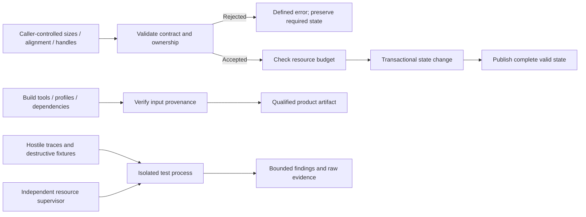

<!--
SPDX-FileCopyrightText: 2026 Rafael V. Volkmer <rafael.v.volkmer@gmail.com>
SPDX-License-Identifier: GPL-3.0-only
-->

# libmemalloc: Security, threats and protection mechanisms

Use this document to build the threat model and review applicable protection controls. Start with the
boundaries, select a control from the index and follow its requirements to the test catalog.

The threat model covers syscalls, stacks, TLS, thread joins, atomics, hostile inputs, resource exhaustion
and instrumentation gaps. Destructive tests run in isolated processes; isolation does not make undefined
C behavior valid or establish that a detector observes every violation.

**Evidence boundary:** This is a proposed product specification. Allocator correctness, portability, Rust
integration, fuzzing and stress campaigns remain unqualified. Repository checks cover documents and
automation fixtures; they do not establish product acceptance or evidence for another specification.

<details>
<summary><strong>On this page</strong></summary>

- [Authority and requirements](#governance)
- [Boundaries, authority and initial cut](#boundaries)
- [Security boundaries and evidence](#security-boundary-overview)
- [Controls by responsibility](#inherited-controls)
- [LMA-SEC-001: Hardening, diagnosis and integration with sanitizers](#lma-sec-001)
- [LMA-SEC-002: Threat model, metadata corruption and detector range](#lma-sec-002)
- [Detailed implementation contracts](#implementation-contracts)
- [LMA-SEC-003: Assets, attackers and trust boundaries](#lma-sec-003)
- [LMA-SEC-004: Sizes, offsets, representation and validation before mutation](#lma-sec-004)
- [LMA-SEC-005: Use after release, double free and domain mixing](#lma-sec-005)
- [LMA-SEC-006: Metadata protection and mitigation scope](#lma-sec-006)
- [LMA-SEC-007: Availability, quotas and cost induced by the opponent](#lma-sec-007)
- [LMA-SEC-008: Sensitive data, erasure and diagnostics](#lma-sec-008)
- [LMA-SEC-009: Entropy, configuration and downgrade](#lma-sec-009)
- [LMA-SEC-010: Build, PGO, dependencies and release integrity](#lma-sec-010)
- [LMA-SEC-011: Sanitizers, intentional failures and demonstrable coverage](#lma-sec-011)
- [CWE Applicability Matrix → Control → Verification](#sdd-section-17)
- [Additional product contracts](#additional-contracts)
- [LMA-SEC-012: Attack surface of the syscall-only boundary](#lma-sec-012)
- [LMA-SEC-013: Protection of owned stacks, TLS, joins and atomics](#lma-sec-013)
- [LMA-SEC-014: Destructive testing, OOM and hostile corpus in isolation](#lma-sec-014)
- [LMA-SEC-015: Observability matrix and test-only dependencies](#lma-sec-015)
- [LMA-SEC-016: Bounded sampled guards and diagnostic coverage](#lma-sec-016)
- [LMA-SEC-017: AArch64 memory tagging as an explicit platform profile](#lma-sec-017)
- [LMA-SEC-018: Reuse-attempt detection and bounded randomized quarantine](#lma-sec-018)
- [LMA-SEC-019: Experimental short-granule tripwires for MTE diagnostics](#lma-sec-019)
- [Examples and compilation context](#examples)
- [Pending qualification](#pending-qualification)
- [References](#references)
- [Additional references and limitations](#additional-references)

</details>

---

<a id="governance"></a>

## Authority and requirements

Apply the [source-attribution rule](README.md#source-attribution): link primary references in each control
that introduces an external technique, including new experiments, and identify LMA-specific adaptations.

**Product:** libmemalloc. **Status:** proposed implementation, not an implemented library or evidence of
better performance than another allocator.

The [local C standard](../standards/c/c-code-standard.md),
[module architecture](../standards/c/c-module-architecture.md), and
[pitfall guide](../standards/c/c-common-pitfalls.md) govern C development. Product constraints in these
specifications refine the permitted implementation. Apply C and platform semantics first, then approved
product constraints and local policy. Conflicts require an explicit decision; a policy exception cannot make
undefined behavior defined.

MUST and MUST NOT express requirements; MAY grants conditional permission. A control's classification does not
by itself measure failure severity. Keep stable control, requirement, invariant, and test identifiers when
editing. References explain a technique; they do not prove this composition or its results. BASE does not mean
implemented, and EXPERIMENTAL does not establish novelty. The H-01 through H-14 hypotheses remain experiments,
not results.

Public names use `LMA_lowerCamelCase`, private names use `lma_lowerCamelCase`, owned types use `lma_*_t`, and
structure tags use the `Lma` prefix and UpperCamelCase. Use Allman compound statements, eight-column
indentation, and 80-column C lines. The result variable is `ret`, declarations occur at the permitted scope
entry, and normal return follows `function_output`. Explicit null pointers follow the local typed-null rule.
Public C headers do not add explicit `extern` or embedded C++ bridges. API descriptions abbreviate local
`LMA_E*` error codes; adapters translate foreign codes without depending on foreign errno numbers.

The local simple-branch rule in CSTYLE-022 and the grouping rules in CSTYLE-279 and CSTYLE-280 apply to these
examples. One-line simple `if` bodies omit braces; loops and compound branch bodies retain them.

The companion schemas, migration records, and validation reports mentioned by the original package are not
present here. They are not current execution evidence. The [CI
reference](../reference/automation.md#ci-control-map) states
the actual check coverage. Product capabilities remain unqualified until their required evidence exists;
missing or conflicting evidence blocks the capability.

---

<a id="boundaries"></a>

## Boundaries, authority and initial cut

This document owns the threat model, protection requirements and mitigation limitations. Algorithms of
allocation/GC remain defined in their SDDs; the detection campaign and toolchain configuration are consumed by
testing/compilation.

| Proposed profile | Always present controls                                                   | Additional controls and cost                                                                               |
| ---------------- | ------------------------------------------------------------------------- | ---------------------------------------------------------------------------------------------------------- |
| Performance      | Valid arithmetic, ownership, correct publications, OOM, contracted quotas | It can maintain intrusive links; it does not promise complete detection of corruption.                     |
| Hardened         | All correction requirements                                               | Slot status, extra validation, metadata isolation/guards/quarantine according to capacity; measured cost.  |
| Diagnosis        | Entry and correctness contracts                                           | Integration with detectors and enhanced visibility controlled; it is not release benchmark.                |
| Sensitive        | explicitly qualified profile                                              | Delete, copy protection and restricted logs; do not automatically cover swap, dumps or a compromised host. |

An option that costs RMW in the hardened profile cannot be presented as manual path without RMW. Lack of
mandatory mechanism rejects the profile without silent downgrade.

### Related documents

[Implementation of the manual core and arenas](libmemalloc-core-implementation-SDD.md) ·
[Optional collector implementation and integration with runtimes](libmemalloc-gc-implementation-SDD.md) ·
[Tests, verification, experiments and evidence](libmemalloc-tests-SDD.md) ·
[Compilation, modules, ABI, PGO and delivery](libmemalloc-compilation-SDD.md)

---

<a id="security-boundary-overview"></a>

## Security boundaries and evidence

Input checks must precede mutation. Build trust and hostile-test containment have separate boundaries from the
allocator's runtime contract.



---

<a id="inherited-controls"></a>

## Controls by responsibility

The controls below define proposed mechanisms. The example appendix provides implementation context without
establishing a stable ABI or product qualification.

---

<a id="lma-sec-001"></a>

## LMA-SEC-001: Hardening, diagnosis and integration with sanitizers

**M0:** OPTIONAL. **G0:** OPTIONAL.

**Phase:** P1. **Nature:** BASE. **Status:** PROPOSED.

Negative tests distributed in this package use rejected inputs and defined models; they do not perform invalid
UAF, double free or C-date race to then expect the behavior to be specified. Detector tests that deliberately
exceed ISO C are tool isolated fixtures, with declared instrumentation contract and without being presented as
compliant C examples.

### Theoretical reference and application

[StarMalloc: A Formally Verified, Concurrent, Performant, and Security-Oriented Memory
Allocator](https://arxiv.org/abs/2403.09435):
Separate security mechanisms from formally verified properties.

[snmalloc: Message passing based allocator](https://github.com/microsoft/snmalloc): Remote return must remain
correct under protective modes.

[ANSI/ISO C Specification Language (ACSL)](https://www.frama-c.com/html/acsl.html): Explicit contracts for
validation and invariants.

### Decision and operation

Offer selected performance, protection and diagnostic profiles in domain creation. Quarantine, additional
validation, poisoning and external metadata may have different costs. Structural profile changes will not be
made by reinterpreting live objects. Guard pages will be selective, not presumed by object.

List links within released blocks continue to be metadata accessible to improper writing in the profile that
uses them. Link encoding does not equal cryptographic security or complete detection of use-after-free.
Sanitizer integrations need to describe logical allocation, release and internal areas used by the allocator
itself; its implementation will be validated by positive and negative tests.

[LMA-SEC-002](libmemalloc-security-SDD.md#lma-sec-002) defines the threat model and instrumentation limits. A
negative test only counts as evidence of detection if it effectively triggers the expected detector.
Unprotected regions for intrusive links and interactions with other allocators need specific cases.

### Verifiable requirements

<a id="lma-sec-001-r01"></a> **LMA-SEC-001-R01.** MUST measure overhead of each profile and compare equivalent
settings.

<a id="lma-sec-001-r02"></a> **LMA-SEC-001-R02.** MUST avoid recursive allocation and external callbacks
within critical diagnostic locks.

<a id="lma-sec-001-r03"></a> **LMA-SEC-001-R03.** MUST distinguish detected error, probabilistic mitigation
and demonstrated property.

### Invariants

<a id="lma-sec-001-i01"></a> **LMA-SEC-001-I01.** Protection mechanisms do not allow the use of invalid
pointers.

<a id="lma-sec-001-i02"></a> **LMA-SEC-001-I02.** Changing telemetry does not modify the contracted
representation of existing objects.

### Risks, limits and fallback

No profile turns arbitrary C into memory-safe language. Instrumented tests do not replace proof of concurrent
protocol.

### Checking and linking to the catalogue

[LMA-TEST-CASE-0109](libmemalloc-tests-SDD.md#lma-test-case-0109),
[LMA-TEST-CASE-0110](libmemalloc-tests-SDD.md#lma-test-case-0110),
[LMA-TEST-CASE-0111](libmemalloc-tests-SDD.md#lma-test-case-0111). All cases remain planned for the product.

---

<a id="lma-sec-002"></a>

## LMA-SEC-002: Threat model, metadata corruption and detector range

**M0:** OPTIONAL. **G0:** OPTIONAL.

**Phase:** P1. **Nature:** BASE. **Status:** PROPOSED.

CWE/OWASP references are taxonomy and threat orientation. They do not constitute certification, nor do they
impose HTTP authentication on a without network access library. The range of each mitigation and each detector
needs to be declared by profile.

### Theoretical reference and application

[StarMalloc: A Formally Verified, Concurrent, Performant, and Security-Oriented Memory
Allocator](https://arxiv.org/abs/2403.09435)
· [Scudo Hardened Allocator](https://llvm.org/docs/ScudoHardenedAllocator.html) ·
[AddressSanitizer public interface:
`asan_interface`.h](https://github.com/llvm/llvm-project/blob/main/compiler-rt/include/sanitizer/asan_interface.h)
· [SeMalloc: Semantics-Informed Memory Allocator](https://arxiv.org/abs/2402.03373v2)

Scudo Hardened Allocator provides an example of hardening; AddressSanitizer public interface:
`asan_interface`.h exposes poisoning instrumentation; StarMalloc: A Formally Verified, Concurrent, Performant,
and Security-Oriented Memory Allocator separates verified properties from the rest of the system. SeMalloc:
Semantics-Informed Memory Allocator explores semantics of allocation for security. None of them automatically
makes libmemalloc memory-safe.

### Decision and operation

Set the opponent of each profile: accidental boundary error, UAF, double-free, misinformed size, adjacent
corruption or arbitrary writing. Declaring which regions the opponent can reach and what secret/entropy
remains available. Guard pages and metadata isolation cover different threats of link code/decode. Platform
capabilities may reinforce a profile but are not hidden requirement of portable core.

A domain allocation or validation bitmap can detect some invalid operations. Faced with corruption detected in
a structure that controls write addresses, the hardened mode prefers closed failure and non-recursive
diagnosis; do not continue using untrusted links. Error calls have restricted effects and do not receive
unnecessary addresses that increase exposure.

When using ASan or equivalent, describing the logical limits of each object and the state after free. The
allocator itself may need to access bytes of intrusive links in released object. Unpoisoning these bytes for
maintenance creates a window/region that should not be sold as covered by complete detection. Alternatives:
structure outside payload, internal access instrumented under specific protocol or complementary detector;
each alternative requires testing.

Quarantine changes time of reuse, retention and probability of observation; it is not proof of absence of UAF.
Separation by site/type also has cost and does not replace ownership. Compare hardening with equivalent
profiles of competitors and include deliberately hostile loads, as well as overhead in valid cases.

### Verifiable requirements

<a id="lma-sec-002-r01"></a> **LMA-SEC-002-R01.** MUST publish covered, uncovered threats and environmental
assumptions for each profile.

<a id="lma-sec-002-r02"></a> **LMA-SEC-002-R02.** MUST define the reaction to corruption before continuing a
destructive operation.

<a id="lma-sec-002-r03"></a> **LMA-SEC-002-R03.** MUST validate detector with positive and negative tests,
including bytes used for intrusive links.

<a id="lma-sec-002-r04"></a> **LMA-SEC-002-R04.** MUST account for memory and quarantine latency, guards,
bitmaps and semantic segregation.

### Invariants

<a id="lma-sec-002-i01"></a> **LMA-SEC-002-I01.** Probabilistic mitigation is never labeled as universal
detection or functional proof.

<a id="lma-sec-002-i02"></a> **LMA-SEC-002-I02.** The diagnosis does not introduce recursive allocation or use
already invalidated metadata as authority.

### Risks, limits and fallback

A process with arbitrary writing can compromise more than the allocator. This SDD does not assign
cryptographic security to link encoding nor inherits StarMalloc evidence. A configuration that eliminates test
failure by chance does not count as validated detector.

### Checking and linking to the catalogue

[LMA-TEST-CASE-0175](libmemalloc-tests-SDD.md#lma-test-case-0175),
[LMA-TEST-CASE-0176](libmemalloc-tests-SDD.md#lma-test-case-0176),
[LMA-TEST-CASE-0177](libmemalloc-tests-SDD.md#lma-test-case-0177). All cases remain planned for the product.

---

<a id="implementation-contracts"></a>

## Detailed implementation contracts

The following contracts are normative for the proposed implementation. Product qualification remains pending.

---

<a id="lma-sec-003"></a>

## LMA-SEC-003: Assets, attackers and trust boundaries

**Status:** PROPOSED.

**M0:** REQUIRED. **G0:** REQUIRED.

**Classification:** SECURITY. **Obligation:** design requirements. **Nature:** BASE. **Phase:** P0.

**Related standards and scenarios:** [CMOD-082](../standards/c/c-module-architecture.md#cmod-082) ·
[CMOD-085](../standards/c/c-module-architecture.md#cmod-085) ·
[CMOD-086](../standards/c/c-module-architecture.md#cmod-086) ·
[CSTYLE-059](../standards/c/c-code-standard.md#cstyle-059).

### Grounds for and limit of evidence

The
[OWASP orientation of three modeling](https://cheatsheetseries.owasp.org/cheatsheets/Threat_Modeling_Cheat_Sheet.html)
provides a method of identifying assets and boundaries. CWE classifies weaknesses, does not certify the
product. In this document, OWASP is the reference interpreted from “OSAP” in the request.

### Decision, protocol and failure scenario

The availability assessment also considers [CWE-401](https://cwe.mitre.org/data/definitions/401.html): keeping
reusable caches within the contract is not by itself losing memory ownership; the oracle needs to distinguish
these situations.

Assets: integrity of regions/identities, sensitive payload confidentiality, budget limited availability,
ownership correction, release artifacts and evidence. Inputs: sizes/alignments, application content, type
descriptors, ports/configuration, profile data, backend events and tool results.

Threat A: Remote caller influences sizes and sequences by an application that uses the library. The allocator
needs to reject overflow and respect quotas, but does not authenticate the remote user. Threat B: Application
bug provides invalid pointer or writes after release. Hardened profile tries to detect declared classes before
interpreting metadata; does not convert arbitrary C into memory-safe. Threat C: Limited payload
corruption/links in the profile hardware model. External metadata mechanisms, status and validation reduce
exploitation without ensuring arbitrary writing protection throughout the process. Threat D: Attacker controls
PR, dependency, PGO file or tool path in the pipeline.

Native ports are code capabilities: a function injected into the same process can execute arbitrary
instructions with process permissions. Binding validates form, lifetime, and contract; does not make a
malicious provider safe. A requirement of isolation between tenants/provers requires additional process,
hardware, or effective protection, not only callbacks.

They stay out of the direct scope: Web authentication, SQL, XSS, CSRF, TLS of service and business
authorization, because the library does not implement these services. These controls belong to the integrator
when they exist. Do not apply OWASP Top 10 as a decorative list of compliance to a heap.

Each threat has a scenario, proprietary component, preconditions, preventive control/detector, test and
residual risk. Every new backend, moving domain, plugin, ISA or profile opens revision of this model.
Libmemalloc does not assume that the compromised host/compiler is a reliable base and simultaneously promises
to resist it without an external trust root.

### Verifiable requirements

<a id="lma-sec-003-r01"></a> **LMA-SEC-003-R01.** The product MUST publish assets, boundaries, capabilities of
the opponent and exclusions by profile.

<a id="lma-sec-003-r02"></a> **LMA-SEC-003-R02.** Each protection requirement MUST declare whether it
prevents, detects or only hinders a failure class.

<a id="lma-sec-003-r03"></a> **LMA-SEC-003-R03.** Ports and modules in the same process MUST NOT be described
as sandbox or authenticated boundary.

<a id="lma-sec-003-r04"></a> **LMA-SEC-003-R04.** CWE and OWASP MUST be used with concrete applicability,
without claiming universal certification or coverage.

### Invariants

<a id="lma-sec-003-i01"></a> **LMA-SEC-003-I01.** The scope of the security claim does not exceed the
published threat model.

<a id="lma-sec-003-i02"></a> **LMA-SEC-003-I02.** The composition does not give a callback greater confidence
than that granted to its provider.

### Verification and residual risk

[LMA-TEST-CASE-0237](libmemalloc-tests-SDD.md#lma-test-case-0237),
[LMA-TEST-CASE-0238](libmemalloc-tests-SDD.md#lma-test-case-0238).

The results remain planned for the implementation of the product. Capacity is only promoted after checking
these requirements in the corresponding profile; bibliographic reference or auxiliary example does not replace
this evidence.

---

<a id="lma-sec-004"></a>

## LMA-SEC-004: Sizes, offsets, representation and validation before mutation

**Status:** PROPOSED.

**M0:** REQUIRED. **G0:** REQUIRED.

**Classification:** SECURITY. **Obligation:** design requirements. **Nature:** BASE. **Phase:** P0.

**Related standards and scenarios:** [CSTYLE-059](../standards/c/c-code-standard.md#cstyle-059) ·
[CSTYLE-060](../standards/c/c-code-standard.md#cstyle-060) ·
[CSTYLE-079](../standards/c/c-code-standard.md#cstyle-079) ·
[CSTYLE-102](../standards/c/c-code-standard.md#cstyle-102) ·
[CSTYLE-125](../standards/c/c-code-standard.md#cstyle-125) ·
[CMOD-090](../standards/c/c-module-architecture.md#cmod-090).

### Grounds for and limit of evidence

[CWE-190](https://cwe.mitre.org/data/definitions/190.html) and
[CWE-131](https://cwe.mitre.org/data/definitions/131.html) connect incorrect arithmetic calculation to smaller
buffers than necessary. [CWE-125](https://cwe.mitre.org/data/definitions/125.html) describes reading out of
bounds. The controls below are specific LMA obligations.
[CWE-122](https://cwe.mitre.org/data/definitions/122.html) it deals with overflow in heap buffers; the
allocator must limit its own writings, but does not automatically intercept all application writing through a
raw pointer.

### Decision, protocol and failure scenario

Numerical inputs are checked before multiplying count×size, adding header/padding, rounding alignment, forming
address or converting to narrow index. For an interval, validate offset ≤ capacity and length ≤
capacity−offset, instead of testing offset+length after possible wrap. For multiplication, treat zero and
validate against `SIZE_MAX` before product.

Alignment needs to be supported by the backend, compatible with the representation and served for every block.
A bit mask only replaces split/rounding when the power property of two has been validated. Convert external
descriptors in a byte-safe way; structure C, enum or bit-field is not portable serialized format. The source
memory has qualified alignment and effective type.

The output is not read before your contract requires initial value. Rejection preserves the status before
counting, connecting us or publishing root. A NULL check does not demonstrate arbitrary pointer
ability/lifetime. Scanner offsets are validated against type size, field width, alignment and amount of
fields; an enum tag does not validate the domain itself.

Tainted sizes have recoverable failure, not a wrapper that terminates the entire process by simple ENOMEM.
Real corruption of critical structures is another situation, with declared fail-stop policy; do not confuse
legitimate pressure with corruption. Do not create `assume`, `unreachable` or branch hint that treats an input
not validated as impossible.

### Verifiable requirements

<a id="lma-sec-004-r01"></a> **LMA-SEC-004-R01.** Every input derivative calculation MUST be verified before
performing the potentially invalid operation.

<a id="lma-sec-004-r02"></a> **LMA-SEC-004-R02.** Type/preset descriptors MUST be validated before indexing,
converting or changing state.

<a id="lma-sec-004-r03"></a> **LMA-SEC-004-R03.** Untrusted boundary size/quota failures MUST be recoverable
and preserve existing data.

<a id="lma-sec-004-r04"></a> **LMA-SEC-004-R04.** Compiler assumptions MUST NOT replace necessary validations
in runtime.

### Invariants

<a id="lma-sec-004-i01"></a> **LMA-SEC-004-I01.** A large entry cannot become a small order successful by
wrap.

<a id="lma-sec-004-i02"></a> **LMA-SEC-004-I02.** No derived address is formed before knowing the valid limits
of its origin.

### Verification and residual risk

[LMA-TEST-CASE-0239](libmemalloc-tests-SDD.md#lma-test-case-0239),
[LMA-TEST-CASE-0240](libmemalloc-tests-SDD.md#lma-test-case-0240).

The results remain planned for the implementation of the product. Capacity is only promoted after checking
these requirements in the corresponding profile; bibliographic reference or auxiliary example does not replace
this evidence.

---

<a id="lma-sec-005"></a>

## LMA-SEC-005: Use after release, double free and domain mixing

**Status:** PROPOSED.

**M0:** OPTIONAL. **G0:** OPTIONAL.

**Classification:** SECURITY. **Obligation:** design requirements. **Nature:** BASE. **Phase:** P1.

**Related standards and scenarios:** [CSTYLE-082](../standards/c/c-code-standard.md#cstyle-082) ·
[CSTYLE-118](../standards/c/c-code-standard.md#cstyle-118) ·
[CSTYLE-174](../standards/c/c-code-standard.md#cstyle-174) ·
[CPIT-002](../standards/c/c-common-pitfalls.md#cpit-002) ·
[CPIT-003](../standards/c/c-common-pitfalls.md#cpit-003) ·
[CPIT-007](../standards/c/c-common-pitfalls.md#cpit-007).

### Grounds for and limit of evidence

[CWE-416](https://cwe.mitre.org/data/definitions/416.html),
[CWE-415](https://cwe.mitre.org/data/definitions/415.html) and the page
[Using freed memory from OWASP](https://owasp.org/www-community/vulnerabilities/Using_freed_memory) The
proposal reduces opportunities for reuse/corruption, but does not promise to detect any old aliases.

### Decision, protocol and failure scenario

In the hardened profile, separating status metadata from the slot from the payload previously controlled by
the application. The LIVE→`REMOTE_PENDING` or LIVE→FREE/QUARANTINED transition has its own synchronization
when it can be observed by other participants. Only the winner of an accepted return can change accounting.
This check adds RMW/cost and is not assigned to the minimum path without RMW of the performance profile.

Before using the block as a node, locate the region by the ownership map, validate domain, slot limit,
alignment, generation and state according to the profile capacity. Do not interpret bytes preceding an
arbitrary pointer as header to find out if the pointer belongs to the heap. Already corrupted metadata require
detection/fail-stop before chaining a destination.

A quarantine postpones reuse by budget of bytes and inputs; under pressure it can reduce time coverage, but
never release live object. The duration is no guarantee that all invalid aliases have disappeared. After
reuse, a raw pointer with the same address can be indistinguishable from a current pointer without additional
information; document this limitation.

GC validates handle origin and generation, but a root-free copied handle may become obsolete. BorrowEnd
terminates protection and all subsequent use of the address violates contract. The core does not accept free
GC slot manual; arena does not accept individual free as if it were manual heat.

The compliant tests use model identities/offsets and validation APIs that reject input before dangerous
accesses. Fixtures that deliberately use expired pointers to test ASan are detector-specific and are not
C-reference executables defined.

### Verifiable requirements

<a id="lma-sec-005-r01"></a> **LMA-SEC-005-R01.** The hardened profile MUST specify slot status and single
return transition at the corresponding cost.

<a id="lma-sec-005-r02"></a> **LMA-SEC-005-R02.** Validation MUST precede intrusive interpretation of payload
as a metadata.

<a id="lma-sec-005-r03"></a> **LMA-SEC-005-R03.** Quarantine MUST be bounded; publish its temporal coverage
and limitations.

<a id="lma-sec-005-r04"></a> **LMA-SEC-005-R04.** The library MUST NOT promise to detect all use of raw
pointer after reuse of the same address.

<a id="lma-sec-005-r05"></a> **LMA-SEC-005-R05.** Manual, arena and managed objects MUST maintain separate
families and authorities.

### Invariants

<a id="lma-sec-005-i01"></a> **LMA-SEC-005-I01.** An accepted return reduces accounting only once.

<a id="lma-sec-005-i02"></a> **LMA-SEC-005-I02.** Quarantine does not alter the validity of a live object.

### Verification and residual risk

[LMA-TEST-CASE-0241](libmemalloc-tests-SDD.md#lma-test-case-0241),
[LMA-TEST-CASE-0242](libmemalloc-tests-SDD.md#lma-test-case-0242),
[LMA-TEST-CASE-0243](libmemalloc-tests-SDD.md#lma-test-case-0243).

The results remain planned for the implementation of the product. Capacity is only promoted after checking
these requirements in the corresponding profile; bibliographic reference or auxiliary example does not replace
this evidence.

---

<a id="lma-sec-006"></a>

## LMA-SEC-006: Metadata protection and mitigation scope

**Status:** PROPOSED.

**M0:** OPTIONAL. **G0:** OPTIONAL.

**Classification:** SECURITY. **Obligation:** design requirements. **Nature:** BASE. **Phase:** P1.

**Related standards and scenarios:** [CMOD-096](../standards/c/c-module-architecture.md#cmod-096) ·
[CSTYLE-156](../standards/c/c-code-standard.md#cstyle-156) ·
[CPIT-021](../standards/c/c-common-pitfalls.md#cpit-021) ·
[CPIT-078](../standards/c/c-common-pitfalls.md#cpit-078).

### Grounds for and limit of evidence

[Scudo](https://llvm.org/docs/ScudoHardenedAllocator.html) exemplifies integrity and mitigation mechanisms;
[StarMalloc](https://arxiv.org/abs/2403.09435) Its mechanisms and evidence are not guarantees of the proposed
implementation here.

### Decision, protocol and failure scenario

The performance baseline can store links in free slots. Therefore, it will not be described as “totally
external metadata”. The hardened profile prefers state and external links or validated indexes; independent
metadata also have cost and can be targets if the opponent already has arbitrary writing across space.

When consuming an index/link, validating region, limit, alignment and state before forming a usable address. A
link scheme encoded with cookie makes it difficult for certain corruptions, but it is not cryptographic
authentication. Do not invent encryption, MAC or PRNG for the heap. The specification needs to state which
bytes influence the verification and what happens when the value is invalid; hash without secret does not
resist by definition the intentional rewrite of both fields.

Guard pages are selective and depend on granularity/capacity of the backend. They do not detect any small
excess that remains on the same page. Redzones and canaries are only examined at declared points. Poisoning
can detect writing in some modes; it does not prevent arbitrary access in uninstrumented build.

Metadata protection does not depend on reading addresses that have already been unmapped. Descriptors kept
stable in M0 simplify lifetime, but their storage needs quota. Tags/generations do not make a reference to the
valid descriptor after it is destroyed. Any early recovery has its own reader model.

When detecting irreversible corruption, do not try to “follow the next node” or continue sweep to save memory.
Issue limited diagnosis according to context and execute qualified fail-stop policy, or return corruption only
when there has been no mutation and the contract allows to preserve integrity.

### Verifiable requirements

<a id="lma-sec-006-r01"></a> **LMA-SEC-006-R01.** Each profile MUST list intrusive and external metadata
without claiming protection beyond real representation.

<a id="lma-sec-006-r02"></a> **LMA-SEC-006-R02.** Decoding/validation of links MUST occur before any
dereference of destination.

<a id="lma-sec-006-r03"></a> **LMA-SEC-006-R03.** Canaries, guards and cookies MUST declare checkpoints,
coverage and limitations.

<a id="lma-sec-006-r04"></a> **LMA-SEC-006-R04.** Corruption detected MUST NOT be used as a basis for
continuing alteration of structures without proven recovery protocol.

### Invariants

<a id="lma-sec-006-i01"></a> **LMA-SEC-006-I01.** No invalid link detected is followed before the failure
decision.

<a id="lma-sec-006-i02"></a> **LMA-SEC-006-I02.** Metadata life is protected regardless of its
generation/cookie.

### Verification and residual risk

[LMA-TEST-CASE-0244](libmemalloc-tests-SDD.md#lma-test-case-0244),
[LMA-TEST-CASE-0245](libmemalloc-tests-SDD.md#lma-test-case-0245),
[LMA-TEST-CASE-0246](libmemalloc-tests-SDD.md#lma-test-case-0246).

The results remain planned for the implementation of the product. Capacity is only promoted after checking
these requirements in the corresponding profile; bibliographic reference or auxiliary example does not replace
this evidence.

---

<a id="lma-sec-007"></a>

## LMA-SEC-007: Availability, quotas and cost induced by the opponent

**Status:** PROPOSED.

**M0:** REQUIRED. **G0:** REQUIRED.

**Classification:** SECURITY. **Obligation:** design requirements. **Nature:** BASE. **Phase:** P0.

**Related standards and scenarios:** [CSTYLE-113](../standards/c/c-code-standard.md#cstyle-113) ·
[CSTYLE-154](../standards/c/c-code-standard.md#cstyle-154) ·
[CMOD-118](../standards/c/c-module-architecture.md#cmod-118) ·
[CPIT-115](../standards/c/c-common-pitfalls.md#cpit-115).

### Grounds for and limit of evidence

[CWE-770](https://cwe.mitre.org/data/definitions/770.html) Here the risk includes not only payload, but
metadata, queues, pins, roots, finalizers and maintenance work.

### Decision, protocol and failure scenario

The resource limit needs to include metadata and reservations for committed operations, not only bytes
requested by the user. Many small orders can exhaust descriptors; many profile sites can exhaust cardinality;
many borrows can block recovery; many weak/finalizable references can produce extra work. Each class has quota
and iteration/retry limit.

Use exact admission tickets for a ceiling, and estimates only for soft policy. Return credit only when the
corresponding feature has been released. Fair drainage policy prevents small entries from being
forgotten indefinitely on arrivals with better score, on the stated progress assumptions. It does not
guarantee deadline when the owner is suspended.

OOM in tracing never allows partial sweep. Lack of destination never allows to discard survivors. A pressed
system can return ENOMEM even having unrecoverable retained memory. Report causes: live roots, pins, owner
making no progress, partially live region, quarantine and historical metadata. Do not try to solve them all by
repeated collections.

The network/application layer may need throttling per user; the LMA instance knows only the domains/quotas
provided by the integrator. If tenants share an instance without independent quotas, the allocator does not
automatically create availability isolation.

### Verifiable requirements

<a id="lma-sec-007-r01"></a> **LMA-SEC-007-R01.** Quotas MUST cover metadata, queues, root/tickets, relevant
profiles and reservations beyond payload.

<a id="lma-sec-007-r02"></a> **LMA-SEC-007-R02.** Attempts to recover and work by call MUST be limited and
observable.

<a id="lma-sec-007-r03"></a> **LMA-SEC-007-R03.** Pressure failure MUST preserve live objects and distinguish
resource unavailable from corruption.

<a id="lma-sec-007-r04"></a> **LMA-SEC-007-R04.** The lack of isolation between tenants who share instance
MUST be explicit in integration.

### Invariants

<a id="lma-sec-007-i01"></a> **LMA-SEC-007-I01.** Estimates do not grant accurate credit or eliminate life
protections.

<a id="lma-sec-007-i02"></a> **LMA-SEC-007-I02.** Safe retention is not converted into unsafe recovery to meet
a roof.

### Verification and residual risk

[LMA-TEST-CASE-0247](libmemalloc-tests-SDD.md#lma-test-case-0247),
[LMA-TEST-CASE-0248](libmemalloc-tests-SDD.md#lma-test-case-0248).

The results remain planned for the implementation of the product. Capacity is only promoted after checking
these requirements in the corresponding profile; bibliographic reference or auxiliary example does not replace
this evidence.

---

<a id="lma-sec-008"></a>

## LMA-SEC-008: Sensitive data, erasure and diagnostics

**Status:** PROPOSED.

**M0:** OPTIONAL. **G0:** OPTIONAL.

**Classification:** SECURITY. **Obligation:** design requirements. **Nature:** BASE. **Phase:** P1.

**Related standards and scenarios:** [CSTYLE-067](../standards/c/c-code-standard.md#cstyle-067) ·
[CMOD-091](../standards/c/c-module-architecture.md#cmod-091) ·
[CMOD-096](../standards/c/c-module-architecture.md#cmod-096) ·
[CPIT-097](../standards/c/c-common-pitfalls.md#cpit-097) ·
[CPIT-098](../standards/c/c-common-pitfalls.md#cpit-098).

### Grounds for and limit of evidence

[CWE-244](https://cwe.mitre.org/data/definitions/244.html) addresses waste in the heap,
[CWE-14](https://cwe.mitre.org/data/definitions/14.html) the removal of cleaning by the compiler and
[CWE-532](https://cwe.mitre.org/data/definitions/532.html) A common malloc is not, on its own, secret storage.

### Decision, protocol and failure scenario

Sensitive domain is opt-in with specific contract. The integrator declares which intervals need cleaning and
your life. The operation uses a primitive non-eliminable erasure provided by the qualified backend; in C23,
the availability/semantic of `memset_explicit` should be checked in runtime, not only presumed by language
flag. In compatible profile, use approved adaptive with explicit warranty, never a common memset advertised as
safe.

Before copying by realloc or moving sensitive object, consider temporary duplicates: origins and destinations
need the same policy and error discards are also cleaned. Store keys/cookies from the allocator itself in a
state that is not serialized in snapshots. Erasing an interval does not eliminate copies in caches, registers,
swaps, core dumps or files; each additional protection belongs to a platform capability and threat model.

Production logs do not include payload, secrets or full addresses by default. Use event identifier, domain,
size range, state and cause categorized. Diagnostic profiles with addresses require controlled
access/retention. Do not treat stable address hash as universal anonymization.

The diagnostic port gets typed and limited registration, run out of locks when possible. Under corruption/OOM,
use preallocated path or discard diagnostic with counter; do not recur in the allocator to explain that the
allocator failed. External text is not format string, file name or executable code.

### Verifiable requirements

<a id="lma-sec-008-r01"></a> **LMA-SEC-008-R01.** Sensitive domain MUST qualify a primitive erasure and treat
temporary/rollback copies.

<a id="lma-sec-008-r02"></a> **LMA-SEC-008-R02.** The product MUST NOT promise absence of waste outside the
controlled ranges/capacity.

<a id="lma-sec-008-r03"></a> **LMA-SEC-008-R03.** Logs and profiles MUST delete payload and sensitive
addresses by default and set retention/access.

<a id="lma-sec-008-r04"></a> **LMA-SEC-008-R04.** Diagnosis MUST be limited and not depend on recursive
allocation in the path of failure.

### Invariants

<a id="lma-sec-008-i01"></a> **LMA-SEC-008-I01.** Delete does not occur before the end of legitimate use.

<a id="lma-sec-008-i02"></a> **LMA-SEC-008-I02.** A logging failure does not change the security decision or
release a protected object.

### Verification and residual risk

[LMA-TEST-CASE-0249](libmemalloc-tests-SDD.md#lma-test-case-0249),
[LMA-TEST-CASE-0250](libmemalloc-tests-SDD.md#lma-test-case-0250).

The results remain planned for the implementation of the product. Capacity is only promoted after checking
these requirements in the corresponding profile; bibliographic reference or auxiliary example does not replace
this evidence.

---

<a id="lma-sec-009"></a>

## LMA-SEC-009: Entropy, configuration and downgrade

**Status:** PROPOSED.

**M0:** OPTIONAL. **G0:** OPTIONAL.

**Classification:** SECURITY. **Obligation:** design requirements. **Nature:** BASE. **Phase:** P1.

**Related standards and scenarios:** [CSTYLE-059](../standards/c/c-code-standard.md#cstyle-059) ·
[CSTYLE-114](../standards/c/c-code-standard.md#cstyle-114) ·
[CMOD-083](../standards/c/c-module-architecture.md#cmod-083) ·
[CMOD-096](../standards/c/c-module-architecture.md#cmod-096) ·
[CPIT-100](../standards/c/c-common-pitfalls.md#cpit-100).

### Grounds for and limit of evidence

[CWE-338](https://cwe.mitre.org/data/definitions/338.html) The LMA contract distinguishes layout randomization
from a cryptographic warranty and requires qualified source when protection cookies depend on
unpredictability.

### Decision, protocol and failure scenario

The entropy port belongs to the security owner; declares requested amount, partial return, failure and lock.
The integrator cannot replace for time, address, counter or rand without formally changing capacity.
Determinism is allowed in the test profile for reproduction, but not in release that announces
unpredictability.

If there is no required entropy, creation of the ordered profile fails or maintains only an explicitly
different configuration that has not been requested as mandatory. Do not fall silently into the performance
profile. Restart after fork/cloning is only supported when the process and the life of the allocator have
protocol; post-fork multithread baseline remains restricted.

Structural options are immutable while objects live. Environment variables do not disable guards/validators of
an instance whose configuration came from reliable policy. A preset parser rejects relevant unknown keys,
negative limits, overflow, incompatible dependencies and flags that point to arbitrary function/library.

Register profile identification, effective capabilities and boot failures without revealing secrets/cookies. A
“secure=true” parameter is not evidence; tests check which mechanisms were executed.

### Verifiable requirements

<a id="lma-sec-009-r01"></a> **LMA-SEC-009-R01.** Entropy for safety mitigation MUST come from qualified port
and have partial failures/returns treated.

<a id="lma-sec-009-r02"></a> **LMA-SEC-009-R02.** The deterministic test build MUST be distinguishable from
release and prohibited in the unpredictability profile.

<a id="lma-sec-009-r03"></a> **LMA-SEC-009-R03.** Required security feature failure MUST NOT cause silent
downgrade.

<a id="lma-sec-009-r04"></a> **LMA-SEC-009-R04.** Structural options MUST be fixed before live objects and
load verifiable profile identification.

### Invariants

<a id="lma-sec-009-i01"></a> **LMA-SEC-009-I01.** An announced profile does not silently omit a mandatory
mechanism.

<a id="lma-sec-009-i02"></a> **LMA-SEC-009-I02.** Protection secrets do not appear in the configuration log.

### Verification and residual risk

[LMA-TEST-CASE-0251](libmemalloc-tests-SDD.md#lma-test-case-0251),
[LMA-TEST-CASE-0252](libmemalloc-tests-SDD.md#lma-test-case-0252).

The results remain planned for the implementation of the product. Capacity is only promoted after checking
these requirements in the corresponding profile; bibliographic reference or auxiliary example does not replace
this evidence.

---

<a id="lma-sec-010"></a>

## LMA-SEC-010: Build, PGO, dependencies and release integrity

**Status:** PROPOSED.

**M0:** REQUIRED. **G0:** REQUIRED.

**Classification:** SECURITY. **Obligation:** design requirements. **Nature:** BASE. **Phase:** P0.

**Related standards and scenarios:** [CMOD-084](../standards/c/c-module-architecture.md#cmod-084) ·
[CMOD-086](../standards/c/c-module-architecture.md#cmod-086) ·
[CMOD-103](../standards/c/c-module-architecture.md#cmod-103) ·
[CMOD-106](../standards/c/c-module-architecture.md#cmod-106) ·
[CSTYLE-115](../standards/c/c-code-standard.md#cstyle-115).

### Grounds for and limit of evidence

The guidelines of [CI/CD](https://cheatsheetseries.owasp.org/cheatsheets/CI_CD_Security_Cheat_Sheet.html) and
[OWASP supply chain](https://cheatsheetseries.owasp.org/cheatsheets/Software_Supply_Chain_Security_Cheat_Sheet.html)
they support the protection of inputs and artifacts.
[CWE-829](https://cwe.mitre.org/data/definitions/829.html) and
[CWE-427](https://cwe.mitre.org/data/definitions/427.html) help to classify inclusion/untrusted paths.

Primary references for the named tools and comparator contracts:
[LLVM MemProf](https://llvm.org/docs/MemProf.html).
These sources define the referenced interfaces; the LMA comparison and qualification remain proposed.

### Decision, protocol and failure scenario

Compiler, linker, generators, profile tools, instrumentation libraries, scripts and caches influence the
product. Register hashes/versions, origin and permissions. Untrusted PR does not get publishing credentials or
write in the cache/profile used as a reliable release entry. An artifact signature only attests to the signed
material within the trust chain; does not prove no bug.

PGO/MemProf profiles and presets are compilation entries that deserve provenance. The profile parser performs
in isolated/limited environment without signature secret. A profile file coming from external user or
benchmark is not automatically promoted. The manifest connects source, toolchain, options, workload, profile
and binary result. Deprecated or incompatible profile is rejected/reclassified in new campaign, not accepted
after suppressing global warning.

Do not insert build flags coming from text without validation into shell commands. Use controlled tool
paths/dependencies and avoid searching for paths saved by attacker. Interposition is only enabled in the
application by explicit choice; do not download or load plugin into `LMA_create`.

Test dependencies remain outside the product. Maintaining license inventory and algorithm assignment; citing a
paper does not authorize copying incompatible license code. Coil patterns are linked to the consulted commit
and identified as a source of policy; the product license needs its own revised decision.

Publish checksums, build metadata, API/export list and evidence matching the commit. Removing debug symbols
from distributed binary is a distribution option with separate symbols; it is not a barrier against memory
exploration.

### Verifiable requirements

<a id="lma-sec-010-r01"></a> **LMA-SEC-010-R01.** Every build entry, including PGO profile, MUST have
origin/version/hash and trusted boundary registered.

<a id="lma-sec-010-r02"></a> **LMA-SEC-010-R02.** Untrustworthy executions MUST NOT feed reliable caches,
profiles, or release artifacts without a revised promotion.

<a id="lma-sec-010-r03"></a> **LMA-SEC-010-R03.** The loader/adapter MUST use controlled paths and do not
introduce interposition or plugins implicitly.

<a id="lma-sec-010-r04"></a> **LMA-SEC-010-R04.** Delivery MUST maintain inventory of dependencies, licenses,
exports and evidence by commit.

### Invariants

<a id="lma-sec-010-i01"></a> **LMA-SEC-010-I01.** The profile used in a release corresponds to the
signed/identified manifest of that release.

<a id="lma-sec-010-i02"></a> **LMA-SEC-010-I02.** Delivery credentials do not enter into execution of tool
controlled by unreliable source.

### Verification and residual risk

[LMA-TEST-CASE-0253](libmemalloc-tests-SDD.md#lma-test-case-0253),
[LMA-TEST-CASE-0254](libmemalloc-tests-SDD.md#lma-test-case-0254),
[LMA-TEST-CASE-0255](libmemalloc-tests-SDD.md#lma-test-case-0255).

The results remain planned for the implementation of the product. Capacity is only promoted after checking
these requirements in the corresponding profile; bibliographic reference or auxiliary example does not replace
this evidence.

---

<a id="lma-sec-011"></a>

## LMA-SEC-011: Sanitizers, intentional failures and demonstrable coverage

**Status:** PROPOSED.

**M0:** REQUIRED. **G0:** REQUIRED.

**Classification:** SECURITY. **Obligation:** design requirements. **Nature:** BASE. **Phase:** P0.

**Related standards and scenarios:** [CMOD-093](../standards/c/c-module-architecture.md#cmod-093) ·
[CMOD-102](../standards/c/c-module-architecture.md#cmod-102) ·
[CMOD-113](../standards/c/c-module-architecture.md#cmod-113) ·
[CSTYLE-099](../standards/c/c-code-standard.md#cstyle-099).

### Grounds for and limit of evidence

[ASan](https://clang.llvm.org/docs/AddressSanitizer.html),
[TSan](https://clang.llvm.org/docs/ThreadSanitizer.html) and
[UBSan](https://clang.llvm.org/docs/UndefinedBehaviorSanitizer.html) suballocation requires integrating its
logical events; a large mmap alone does not describe to the detector the limits of each object.

### Decision, protocol and failure scenario

Set a matrix by profile: logical allocation/dislocation, redzones, intrusive metadata, zeroing, quarantine,
external regions and uninstrumented libraries. The detector adapter has the annotations. Removing poisoning
temporarily to read a link creates a distinct window/covering that needs to be published; prefer external
metadata in the profile used to check payload.

A positive test proves that valid operations do not trigger the check. A negative contract test delivers
invalid sizes/offsets/IDs to a boundary that rejects them before UB. A specific detector test can perform
deliberately invalid access according to its instrumented environment, but is isolated, identified, does not
enter into compliant C examples and is not defined behavior proof.

The suite needs to prove that the mechanism was connected: an executable that never calls the candidate
backend does not validate this backend. Instrumentation changes allocator layout, contention, and behavior;
production benchmarks use final binary without undeclared collection costs. ASan+UBSan and TSan are separate
campaigns; unsupported options fail to configure.

Suppressing a sanitizer region requires justification, deviation identifier, scope and alternative test. Wide
suppression to make the allocator “pass” is not evidence. Finite domain tests or linters will not be labeled
as complete allocator proof.

### Verifiable requirements

<a id="lma-sec-011-r01"></a> **LMA-SEC-011-R01.** Each detector MUST have integration and coverage declared
for internal suballocations and metadata.

<a id="lma-sec-011-r02"></a> **LMA-SEC-011-R02.** The suite MUST prove activation of the mechanism/backend and
distinguish defined contract rejection from tool-specific UB.

<a id="lma-sec-011-r03"></a> **LMA-SEC-011-R03.** Suppressions MUST be local, traceable and accompanied by
alternative verification.

<a id="lma-sec-011-r04"></a> **LMA-SEC-011-R04.** No instrumented binary performance MUST be used as a release
performance without declaring the cost.

### Invariants

<a id="lma-sec-011-i01"></a> **LMA-SEC-011-I01.** Absence of notice only sustains the coverage and execution
effectively observed.

<a id="lma-sec-011-i02"></a> **LMA-SEC-011-I02.** A negative test presented as C as it does not perform
deliberate UB.

### Verification and residual risk

[LMA-TEST-CASE-0256](libmemalloc-tests-SDD.md#lma-test-case-0256),
[LMA-TEST-CASE-0257](libmemalloc-tests-SDD.md#lma-test-case-0257).

The results remain planned for the implementation of the product. Capacity is only promoted after checking
these requirements in the corresponding profile; bibliographic reference or auxiliary example does not replace
this evidence.

---

<a id="sdd-section-17"></a>

## CWE Applicability Matrix → Control → Verification

CWE describes weakness; the correspondence below is applicability analysis LMA. It does not imply that a
vulnerability already exists in the product or that the control eliminates the entire class.

| Primary reference                                          | Scenario LMA                                           | Owner Control               | Expected evidence / limit                                                             |
| ---------------------------------------------------------- | ------------------------------------------------------ | --------------------------- | ------------------------------------------------------------------------------------- |
| [CWE-122](https://cwe.mitre.org/data/definitions/122.html) | Writing beyond the limits of an allocation in the heap | [LMA-SEC-006](#lma-sec-006) | Validate own copies; Selective guards do not prevent all overflow of the application. |
| [CWE-401](https://cwe.mitre.org/data/definitions/401.html) | Memory without release at the end of effective use     | [LMA-SEC-007](#lma-sec-007) | Ownership oracle and closing; separate leak from intentionally accounted retention.   |
| [CWE-190](https://cwe.mitre.org/data/definitions/190.html) | Overflow in multiplication/sum/rounding                | [LMA-SEC-004](#lma-sec-004) | Rejection before calculation; helpers and boundaries `SIZE_MAX`.                      |
| [CWE-131](https://cwe.mitre.org/data/definitions/131.html) | Buffer less than requested by incorrect calculation    | [LMA-SEC-004](#lma-sec-004) | Size/alignment, headers and padding in the oracle.                                    |
| [CWE-125](https://cwe.mitre.org/data/definitions/125.html) | Reading beyond object/scanner/link                     | [LMA-SEC-004](#lma-sec-004) | Limits before address, validated field description.                                   |
| [CWE-415](https://cwe.mitre.org/data/definitions/415.html) | Duplicate Return                                       | [LMA-SEC-005](#lma-sec-005) | Single state of return; do not promise to detect every raw pointer.                   |
| [CWE-416](https://cwe.mitre.org/data/definitions/416.html) | Reference after the end of life                        | [LMA-SEC-005](#lma-sec-005) | Ownership/roots/tickets, limited quarantine and detector.                             |
| [CWE-843](https://cwe.mitre.org/data/definitions/843.html) | Type of region/object incompatible                     | [LMA-SEC-006](#lma-sec-006) | Domain, type and origin before interpreting.                                          |
| [CWE-457](https://cwe.mitre.org/data/definitions/457.html) | Fields/references not initialized                      | [LMA-SEC-004](#lma-sec-004) | Scannable publication; semantic initialization, not just memset.                      |
| [CWE-362](https://cwe.mitre.org/data/definitions/362.html) | Shared accesses without protocol                       | [LMA-SEC-005](#lma-sec-005) | Locks/atomics/lifetime specified and competing model.                                 |
| [CWE-770](https://cwe.mitre.org/data/definitions/770.html) | Resources without limit                                | [LMA-SEC-007](#lma-sec-007) | Payload quota, metadata, roots, profiles and work.                                    |
| [CWE-244](https://cwe.mitre.org/data/definitions/244.html) | Sensitive residue in the heap                          | [LMA-SEC-008](#lma-sec-008) | Port of qualified deletion and processing of copies.                                  |
| [CWE-14](https://cwe.mitre.org/data/definitions/14.html)   | Cleaning eliminated by optimizer                       | [LMA-SEC-008](#lma-sec-008) | Primitive guaranteed in the profile and inspection of the artifact.                   |
| [CWE-532](https://cwe.mitre.org/data/definitions/532.html) | Log sensitive secret/address                           | [LMA-SEC-008](#lma-sec-008) | Limited DTO, no payload logs by default.                                              |
| [CWE-338](https://cwe.mitre.org/data/definitions/338.html) | PRNG inadequate for protection                         | [LMA-SEC-009](#lma-sec-009) | Qualified entropy source, no silent fallback.                                         |
| [CWE-829](https://cwe.mitre.org/data/definitions/829.html) | Untrusted source code/tool                             | [LMA-SEC-010](#lma-sec-010) | Provenance and isolation of build/credentials.                                        |
| [CWE-427](https://cwe.mitre.org/data/definitions/427.html) | Library/tool search in unsafe path                     | [LMA-SEC-010](#lma-sec-010) | Controlled Paths and separate loading.                                                |

---

<a id="additional-contracts"></a>

## Additional product contracts

---

<a id="lma-sec-012"></a>

## LMA-SEC-012: Attack surface of the syscall-only boundary

**Phase:** P0. **Status:** PROPOSED.

**M0:** REQUIRED. **G0:** REQUIRED.

**Class:** CORRECTNESS / ARCHITECTURE. **Status:** PROPOSAL; evidence of pending product.

### Grounds, application and limits

[Linux: clone/clone3](https://man7.org/linux/man-pages/man2/clone.2.html) ·
[Microsoft: Calling Internal APIs](https://learn.microsoft.com/en-us/windows/win32/devnotes/calling-internal-apis)
·
[Apple: syscall(2), historical
file](https://developer.apple.com/library/archive/documentation/System/Conceptual/ManPages_iPhoneOS/man2/syscall.2.html)

### Decision, protocol and failure scenarios

Removing libc/pthread reduces certain dependencies, but transfers validation from ABI, TLS, waits and lifetime
to the library. It is not a proof of lower effective surface or superior security. The Threat Model includes
unexpected returns, permissions, sandboxes, unknown flags, unavailable syscall, corruption of thread records,
and incorrect backend selection.

Each syscall has allowlist per operation and ABI, size/flag validation, return parser and retrieve budget.
Runtime does not try to escape from seccomp, entitlement or host policy when it receives prohibition.
Windows/Apple crus profiles do not use heuristic search for syscall numbers, patching or unqualified private
calls to fake portability. OS-library bridge dependencies are an architectural alternative identified, not
enabled by the strict product without approval.

Boundary tests inject faults by controlled provider and also confirm the actual artifact under sandbox. Logs
hide unnecessary addresses and content; syscall arguments, strokes and dumps may contain sensitive data.
Diagnose failure should not return to the corrupted heap to produce an elaborate message.

### Verifiable requirements

<a id="lma-sec-012-r01"></a> **LMA-SEC-012-R01.** MUST version operations/ABI allowlist and validate returns
before converting them to valid resources.

<a id="lma-sec-012-r02"></a> **LMA-SEC-012-R02.** MUST NOT circumvent host policy denial as compatibility
fallback.

<a id="lma-sec-012-r03"></a> **LMA-SEC-012-R03.** MUST register threat differences between crude backend, OS
bridge and test provider.

<a id="lma-sec-012-r04"></a> **LMA-SEC-012-R04.** MUST maintain limited diagnostic failure and no recursion in
the allocator.

### Invariants

<a id="lma-sec-012-i01"></a> **LMA-SEC-012-I01.** A kernel error never becomes a published pointer.

<a id="lma-sec-012-i02"></a> **LMA-SEC-012-I02.** The strict mode does not silently load an external runtime.

### Evidence verification and status

[LMA-TEST-CASE-0385](libmemalloc-tests-SDD.md#lma-test-case-0385),
[LMA-TEST-CASE-0386](libmemalloc-tests-SDD.md#lma-test-case-0386),
[LMA-TEST-CASE-0387](libmemalloc-tests-SDD.md#lma-test-case-0387),
[LMA-TEST-CASE-0388](libmemalloc-tests-SDD.md#lma-test-case-0388),
[LMA-TEST-CASE-0389](libmemalloc-tests-SDD.md#lma-test-case-0389),
[LMA-TEST-CASE-0390](libmemalloc-tests-SDD.md#lma-test-case-0390),
[LMA-TEST-CASE-0391](libmemalloc-tests-SDD.md#lma-test-case-0391),
[LMA-TEST-CASE-0392](libmemalloc-tests-SDD.md#lma-test-case-0392),
[LMA-TEST-CASE-0393](libmemalloc-tests-SDD.md#lma-test-case-0393),
[LMA-TEST-CASE-0394](libmemalloc-tests-SDD.md#lma-test-case-0394),
[LMA-TEST-CASE-0395](libmemalloc-tests-SDD.md#lma-test-case-0395),
[LMA-TEST-CASE-0396](libmemalloc-tests-SDD.md#lma-test-case-0396),
[LMA-TEST-CASE-0503](libmemalloc-tests-SDD.md#lma-test-case-0503),
[LMA-TEST-CASE-0504](libmemalloc-tests-SDD.md#lma-test-case-0504),
[LMA-TEST-CASE-0505](libmemalloc-tests-SDD.md#lma-test-case-0505),
[LMA-TEST-CASE-0506](libmemalloc-tests-SDD.md#lma-test-case-0506),
[LMA-TEST-CASE-0507](libmemalloc-tests-SDD.md#lma-test-case-0507),
[LMA-TEST-CASE-0508](libmemalloc-tests-SDD.md#lma-test-case-0508),
[LMA-TEST-CASE-0509](libmemalloc-tests-SDD.md#lma-test-case-0509),
[LMA-TEST-CASE-0510](libmemalloc-tests-SDD.md#lma-test-case-0510),
[LMA-TEST-CASE-0519](libmemalloc-tests-SDD.md#lma-test-case-0519),
[LMA-TEST-CASE-0520](libmemalloc-tests-SDD.md#lma-test-case-0520),
[LMA-TEST-CASE-0521](libmemalloc-tests-SDD.md#lma-test-case-0521),
[LMA-TEST-CASE-0522](libmemalloc-tests-SDD.md#lma-test-case-0522),
[LMA-TEST-CASE-0523](libmemalloc-tests-SDD.md#lma-test-case-0523),
[LMA-TEST-CASE-0524](libmemalloc-tests-SDD.md#lma-test-case-0524),
[LMA-TEST-CASE-0525](libmemalloc-tests-SDD.md#lma-test-case-0525)

Control planning link; implementation should associate each requirement with the assertions that verify it.
Cases are PLANNED. Absence of support or instrument is recorded as a gap, never converted into PASS.

---

<a id="lma-sec-013"></a>

## LMA-SEC-013: Protection of owned stacks, TLS, joins and atomics

**Phase:** P0. **Status:** PROPOSED.

**M0:** OPTIONAL. **G0:** OPTIONAL.

**Class:** CORRECTNESS / ARCHITECTURE. **Status:** PROPOSAL; evidence of pending product.

### Grounds, application and limits

[Linux: clone/clone3](https://man7.org/linux/man-pages/man2/clone.2.html) ·
[GCC: \_\_atomic builtins](https://gcc.gnu.org/onlinedocs/gcc/_005f_005fatomic-Builtins.html) ·
[Clang: ThreadSanitizer](https://clang.llvm.org/docs/ThreadSanitizer.html)

### Decision, protocol and failure scenarios

Worker stacks have limits and guards where the backend allows; the kernel does not make a small stack
automatically secure. Canaries, probes, shadow stack, CET/BTI/PAC when applicable and TLS required are
qualified together with compiler flags. Do not remove a control required to get link without runtime.

The critical scenario of reap is a delayed writing of the child/kernel in `child_tid` or registration after
reuse. The test injects child retention, multiple joiners, timeout and joiner failure; output confirmation is
required before dislocating the storage. Asynchronous cancellation and owner death require separate treatment;
reset lock does not automatically recover the heat it protected.

Atomic storage itself needs field isolation and width/alignment validation. Flag corruption does not allow
arbitrary transition. Release/acquire omission can create partially visible objects, even without null
pointer. Memory order revisions invalidate related evidence.

### Verifiable requirements

<a id="lma-sec-013-r01"></a> **LMA-SEC-013-R01.** MUST qualify stack/TLS protections with raw runtime and
block flags without runtime support.

<a id="lma-sec-013-r02"></a> **LMA-SEC-013-R02.** MUST test UAF thread control and late kernel write by
appropriate model/fixture.

<a id="lma-sec-013-r03"></a> **LMA-SEC-013-R03.** MUST specify owner death treatment without turning timeout
into possession.

<a id="lma-sec-013-r04"></a> **LMA-SEC-013-R04.** MUST include assembly/intrinsic changes and memory orders in
the security gate.

### Invariants

<a id="lma-sec-013-i01"></a> **LMA-SEC-013-I01.** Recovery of a stack requires actual termination and end of
observers.

<a id="lma-sec-013-i02"></a> **LMA-SEC-013-I02.** A corruption mitigation does not replace the correct
competitor semantics.

### Evidence verification and status

[LMA-TEST-CASE-0429](libmemalloc-tests-SDD.md#lma-test-case-0429),
[LMA-TEST-CASE-0430](libmemalloc-tests-SDD.md#lma-test-case-0430),
[LMA-TEST-CASE-0431](libmemalloc-tests-SDD.md#lma-test-case-0431),
[LMA-TEST-CASE-0432](libmemalloc-tests-SDD.md#lma-test-case-0432),
[LMA-TEST-CASE-0433](libmemalloc-tests-SDD.md#lma-test-case-0433),
[LMA-TEST-CASE-0434](libmemalloc-tests-SDD.md#lma-test-case-0434),
[LMA-TEST-CASE-0435](libmemalloc-tests-SDD.md#lma-test-case-0435),
[LMA-TEST-CASE-0436](libmemalloc-tests-SDD.md#lma-test-case-0436),
[LMA-TEST-CASE-0437](libmemalloc-tests-SDD.md#lma-test-case-0437),
[LMA-TEST-CASE-0438](libmemalloc-tests-SDD.md#lma-test-case-0438),
[LMA-TEST-CASE-0439](libmemalloc-tests-SDD.md#lma-test-case-0439),
[LMA-TEST-CASE-0440](libmemalloc-tests-SDD.md#lma-test-case-0440),
[LMA-TEST-CASE-0441](libmemalloc-tests-SDD.md#lma-test-case-0441),
[LMA-TEST-CASE-0442](libmemalloc-tests-SDD.md#lma-test-case-0442),
[LMA-TEST-CASE-0443](libmemalloc-tests-SDD.md#lma-test-case-0443),
[LMA-TEST-CASE-0444](libmemalloc-tests-SDD.md#lma-test-case-0444),
[LMA-TEST-CASE-0445](libmemalloc-tests-SDD.md#lma-test-case-0445),
[LMA-TEST-CASE-0446](libmemalloc-tests-SDD.md#lma-test-case-0446),
[LMA-TEST-CASE-0447](libmemalloc-tests-SDD.md#lma-test-case-0447),
[LMA-TEST-CASE-0448](libmemalloc-tests-SDD.md#lma-test-case-0448),
[LMA-TEST-CASE-0449](libmemalloc-tests-SDD.md#lma-test-case-0449),
[LMA-TEST-CASE-0450](libmemalloc-tests-SDD.md#lma-test-case-0450),
[LMA-TEST-CASE-0451](libmemalloc-tests-SDD.md#lma-test-case-0451),
[LMA-TEST-CASE-0503](libmemalloc-tests-SDD.md#lma-test-case-0503),
[LMA-TEST-CASE-0504](libmemalloc-tests-SDD.md#lma-test-case-0504),
[LMA-TEST-CASE-0505](libmemalloc-tests-SDD.md#lma-test-case-0505),
[LMA-TEST-CASE-0506](libmemalloc-tests-SDD.md#lma-test-case-0506),
[LMA-TEST-CASE-0507](libmemalloc-tests-SDD.md#lma-test-case-0507),
[LMA-TEST-CASE-0508](libmemalloc-tests-SDD.md#lma-test-case-0508),
[LMA-TEST-CASE-0509](libmemalloc-tests-SDD.md#lma-test-case-0509),
[LMA-TEST-CASE-0510](libmemalloc-tests-SDD.md#lma-test-case-0510)

Control planning link; implementation should associate each requirement with the assertions that verify it.
Cases are PLANNED. Absence of support or instrument is recorded as a gap, never converted into PASS.

---

<a id="lma-sec-014"></a>

## LMA-SEC-014: Destructive testing, OOM and hostile corpus in isolation

**Phase:** P0. **Status:** PROPOSED.

**M0:** REQUIRED. **G0:** REQUIRED.

**Class:** CORRECTNESS / ARCHITECTURE. **Status:** PROPOSAL; evidence of pending product.

### Grounds, application and limits

[Linux: cgroup v2](https://kernel.org/doc/html/latest/admin-guide/cgroup-v2.html) ·
[AFL++: Fuzzing in Depth](https://aflplus.plus/docs/fuzzing_in_depth/) ·
[Clang: AddressSanitizer](https://clang.llvm.org/docs/AddressSanitizer.html)

### Decision, protocol and failure scenarios

Massive campaigns never automatically use almost all RAM from the host. They use VM/cgroup/job own limit,
process budget/CPU/disk and supervisor reserve. The requirement of almost all memory is applied to **share of
disposable environment**, The supervisor lives outside the domain that will be exhausted.

Separate OOM injected with deterministic return, real refusal of map/commit and death by OOM killer. Only the
first two allow requiring normal failure treatment by the allocator. The dead process cannot perform cleanup
or return NULL; the evidence must say `RESOURCE_KILL`, with host events, without registering OOM API PASS.

Fixtures of UAF/OOB/double free test detectors in separate subprocesses. They do not run C defined or
benchmarked and are not examples C to copy. The matrix records expected detector, fault signature and negative
control valid. Corpus and build plans are unreliable inputs: parsers have size/recursion limits, paths do not
escape root, commands do not pass shell and artifacts are identified by hash.

### Verifiable requirements

<a id="lma-sec-014-r01"></a> **LMA-SEC-014-R01.** MUST impose isolation and explicit limits before performing
destructive pressure, mutation or fixtures.

<a id="lma-sec-014-r02"></a> **LMA-SEC-014-R02.** MUST distinguish ENOMEM return, timeout, resource
unavailable, kill and corruption crash.

<a id="lma-sec-014-r03"></a> **LMA-SEC-014-R03.** MUST maintain corpus, minimizers, manifests and logs under
entry and budget validation.

<a id="lma-sec-014-r04"></a> **LMA-SEC-014-R04.** MUST NOT execute arbitrary payload as instructions or use
the `allocator_id` field as shell command.

### Invariants

<a id="lma-sec-014-i01"></a> **LMA-SEC-014-I01.** A workload does not exhaust the supervisor's resources that
should gather his evidence.

<a id="lma-sec-014-i02"></a> **LMA-SEC-014-I02.** Expected failure is only accepted when it corresponds to the
pre-registered detector/signature.

### Evidence verification and status

[LMA-TEST-CASE-0347](libmemalloc-tests-SDD.md#lma-test-case-0347),
[LMA-TEST-CASE-0348](libmemalloc-tests-SDD.md#lma-test-case-0348),
[LMA-TEST-CASE-0349](libmemalloc-tests-SDD.md#lma-test-case-0349),
[LMA-TEST-CASE-0350](libmemalloc-tests-SDD.md#lma-test-case-0350),
[LMA-TEST-CASE-0351](libmemalloc-tests-SDD.md#lma-test-case-0351),
[LMA-TEST-CASE-0352](libmemalloc-tests-SDD.md#lma-test-case-0352),
[LMA-TEST-CASE-0353](libmemalloc-tests-SDD.md#lma-test-case-0353),
[LMA-TEST-CASE-0354](libmemalloc-tests-SDD.md#lma-test-case-0354),
[LMA-TEST-CASE-0355](libmemalloc-tests-SDD.md#lma-test-case-0355),
[LMA-TEST-CASE-0356](libmemalloc-tests-SDD.md#lma-test-case-0356),
[LMA-TEST-CASE-0357](libmemalloc-tests-SDD.md#lma-test-case-0357),
[LMA-TEST-CASE-0358](libmemalloc-tests-SDD.md#lma-test-case-0358),
[LMA-TEST-CASE-0359](libmemalloc-tests-SDD.md#lma-test-case-0359),
[LMA-TEST-CASE-0360](libmemalloc-tests-SDD.md#lma-test-case-0360),
[LMA-TEST-CASE-0385](libmemalloc-tests-SDD.md#lma-test-case-0385),
[LMA-TEST-CASE-0386](libmemalloc-tests-SDD.md#lma-test-case-0386),
[LMA-TEST-CASE-0387](libmemalloc-tests-SDD.md#lma-test-case-0387),
[LMA-TEST-CASE-0388](libmemalloc-tests-SDD.md#lma-test-case-0388),
[LMA-TEST-CASE-0389](libmemalloc-tests-SDD.md#lma-test-case-0389),
[LMA-TEST-CASE-0390](libmemalloc-tests-SDD.md#lma-test-case-0390),
[LMA-TEST-CASE-0391](libmemalloc-tests-SDD.md#lma-test-case-0391),
[LMA-TEST-CASE-0392](libmemalloc-tests-SDD.md#lma-test-case-0392),
[LMA-TEST-CASE-0393](libmemalloc-tests-SDD.md#lma-test-case-0393),
[LMA-TEST-CASE-0394](libmemalloc-tests-SDD.md#lma-test-case-0394),
[LMA-TEST-CASE-0395](libmemalloc-tests-SDD.md#lma-test-case-0395),
[LMA-TEST-CASE-0396](libmemalloc-tests-SDD.md#lma-test-case-0396),
[LMA-TEST-CASE-0503](libmemalloc-tests-SDD.md#lma-test-case-0503),
[LMA-TEST-CASE-0504](libmemalloc-tests-SDD.md#lma-test-case-0504),
[LMA-TEST-CASE-0505](libmemalloc-tests-SDD.md#lma-test-case-0505),
[LMA-TEST-CASE-0506](libmemalloc-tests-SDD.md#lma-test-case-0506),
[LMA-TEST-CASE-0507](libmemalloc-tests-SDD.md#lma-test-case-0507),
[LMA-TEST-CASE-0508](libmemalloc-tests-SDD.md#lma-test-case-0508),
[LMA-TEST-CASE-0509](libmemalloc-tests-SDD.md#lma-test-case-0509),
[LMA-TEST-CASE-0510](libmemalloc-tests-SDD.md#lma-test-case-0510),
[LMA-TEST-CASE-0511](libmemalloc-tests-SDD.md#lma-test-case-0511),
[LMA-TEST-CASE-0512](libmemalloc-tests-SDD.md#lma-test-case-0512),
[LMA-TEST-CASE-0513](libmemalloc-tests-SDD.md#lma-test-case-0513),
[LMA-TEST-CASE-0514](libmemalloc-tests-SDD.md#lma-test-case-0514),
[LMA-TEST-CASE-0515](libmemalloc-tests-SDD.md#lma-test-case-0515),
[LMA-TEST-CASE-0516](libmemalloc-tests-SDD.md#lma-test-case-0516),
[LMA-TEST-CASE-0517](libmemalloc-tests-SDD.md#lma-test-case-0517),
[LMA-TEST-CASE-0518](libmemalloc-tests-SDD.md#lma-test-case-0518)

Control planning link; implementation should associate each requirement with the assertions that verify it.
Cases are PLANNED. Absence of support or instrument is recorded as a gap, never converted into PASS.

---

<a id="lma-sec-015"></a>

## LMA-SEC-015: Observability matrix and test-only dependencies

**Phase:** P0. **Status:** PROPOSED.

**M0:** REQUIRED. **G0:** REQUIRED.

**Class:** CORRECTNESS / ARCHITECTURE. **Status:** PROPOSAL; evidence of pending product.

### Grounds, application and limits

[Valgrind: Memcheck and memory pools](https://valgrind.org/docs/manual/mc-manual.html) ·
[AFL++: libdislocator](https://github.com/AFLplusplus/AFLplusplus/tree/stable/utils/libdislocator) ·
[Clang: ThreadSanitizer](https://clang.llvm.org/docs/ThreadSanitizer.html) ·
[Clang: MemorySanitizer](https://clang.llvm.org/docs/MemorySanitizer.html)

### Decision, protocol and failure scenarios

Sanitizers, coverage, fuzzing and Valgrind have different requirements. Strict production does not depend on
runtime ASan/TSan/MSan, libFuzzer, test framework, libgcov or LLVM profile runtime. These components may
compose **separate verification artifacts**, with own identity and allowlist; the raw-only target is not
renamed to hide the difference.

Valgrind notes of memory pool are the optional exception of included already requested; the macro client
request is not a production allocator. ASan does not automatically know the limits of each slot obtained by
raw mmap. TSan may not observe threads and own synchronization. MSan requires modeling the bytes initialized
by syscalls. Each detector has sensitivity test and false positive; if you do not observe the real backend,
the combination is UNSUPPORTED/INCONCLUSIVE, not green.

Libdislocator replaces the malloc family and is useful to validate application/harness or as diagnostic
comparator. Do not put it on the LMA test and assign to the LMA the detection made by another heap. The given
term “Muted” remains registered as unidentified; Mull is the mutation testing tool explicitly selected in this
proposal, without stating equivalence of names.

### Verifiable requirements

<a id="lma-sec-015-r01"></a> **LMA-SEC-015-R01.** MUST separate production dependencies and verification
artifacts, including instrumentation inserted by the compiler.

<a id="lma-sec-015-r02"></a> **LMA-SEC-015-R02.** MUST confirm that each detector sees the actual target
allocations/synchronizations.

<a id="lma-sec-015-r03"></a> **LMA-SEC-015-R03.** MUST NOT assign the LMA results obtained by replacing your
heap with libdislocator or sanitizer allocator.

<a id="lma-sec-015-r04"></a> **LMA-SEC-015-R04.** MUST fail to qualify when mandatory detector is not
operational in the announced backend.

### Invariants

<a id="lma-sec-015-i01"></a> **LMA-SEC-015-I01.** An integration that does not detect the positive fixture
cannot declare the suite clean.

<a id="lma-sec-015-i02"></a> **LMA-SEC-015-I02.** Production semantics remains identified when the tool
requires distinct bridge.

### Evidence verification and status

[LMA-TEST-CASE-0475](libmemalloc-tests-SDD.md#lma-test-case-0475),
[LMA-TEST-CASE-0476](libmemalloc-tests-SDD.md#lma-test-case-0476),
[LMA-TEST-CASE-0477](libmemalloc-tests-SDD.md#lma-test-case-0477),
[LMA-TEST-CASE-0478](libmemalloc-tests-SDD.md#lma-test-case-0478),
[LMA-TEST-CASE-0479](libmemalloc-tests-SDD.md#lma-test-case-0479),
[LMA-TEST-CASE-0480](libmemalloc-tests-SDD.md#lma-test-case-0480),
[LMA-TEST-CASE-0481](libmemalloc-tests-SDD.md#lma-test-case-0481),
[LMA-TEST-CASE-0482](libmemalloc-tests-SDD.md#lma-test-case-0482),
[LMA-TEST-CASE-0483](libmemalloc-tests-SDD.md#lma-test-case-0483),
[LMA-TEST-CASE-0484](libmemalloc-tests-SDD.md#lma-test-case-0484),
[LMA-TEST-CASE-0485](libmemalloc-tests-SDD.md#lma-test-case-0485),
[LMA-TEST-CASE-0486](libmemalloc-tests-SDD.md#lma-test-case-0486),
[LMA-TEST-CASE-0487](libmemalloc-tests-SDD.md#lma-test-case-0487),
[LMA-TEST-CASE-0488](libmemalloc-tests-SDD.md#lma-test-case-0488),
[LMA-TEST-CASE-0489](libmemalloc-tests-SDD.md#lma-test-case-0489),
[LMA-TEST-CASE-0490](libmemalloc-tests-SDD.md#lma-test-case-0490),
[LMA-TEST-CASE-0491](libmemalloc-tests-SDD.md#lma-test-case-0491),
[LMA-TEST-CASE-0492: Ledger without a debit](libmemalloc-tests-SDD.md#lma-test-case-0492),
[LMA-TEST-CASE-0493](libmemalloc-tests-SDD.md#lma-test-case-0493),
[LMA-TEST-CASE-0494](libmemalloc-tests-SDD.md#lma-test-case-0494),
[LMA-TEST-CASE-0495](libmemalloc-tests-SDD.md#lma-test-case-0495),
[LMA-TEST-CASE-0496](libmemalloc-tests-SDD.md#lma-test-case-0496),
[LMA-TEST-CASE-0519](libmemalloc-tests-SDD.md#lma-test-case-0519),
[LMA-TEST-CASE-0520](libmemalloc-tests-SDD.md#lma-test-case-0520),
[LMA-TEST-CASE-0521](libmemalloc-tests-SDD.md#lma-test-case-0521),
[LMA-TEST-CASE-0522](libmemalloc-tests-SDD.md#lma-test-case-0522),
[LMA-TEST-CASE-0523](libmemalloc-tests-SDD.md#lma-test-case-0523),
[LMA-TEST-CASE-0524](libmemalloc-tests-SDD.md#lma-test-case-0524),
[LMA-TEST-CASE-0525](libmemalloc-tests-SDD.md#lma-test-case-0525)

Control planning link; implementation should associate each requirement with the assertions that verify it.
Cases are PLANNED. Absence of support or instrument is recorded as a gap, never converted into PASS.

---

<a id="lma-sec-016"></a>

## LMA-SEC-016: Bounded sampled guards and diagnostic coverage

**M0:** DEFERRED. **G0:** DEFERRED.

**Phase:** P1. **Nature:** BASE. **Status:** PROPOSED.

### Grounds, application and limits

[GWP-ASan](https://llvm.org/docs/GwpAsan.html) motivates sampling selected allocations into guarded storage.
This is a proposed project-owned facility through qualified memory ports, not an implicit dependency on the
LLVM runtime. Sampling detects only exercised accesses covered by the selected protected layout.

### Decision and operation

Reserve a bounded guarded pool and external slot records at instance creation. Its policy declares
`guard_pool_slots`, `guard_pool_virtual_bytes`, `guard_pool_backed_bytes`, `guard_sample_interval`,
`guard_reuse_delay_events`, `guard_record_bytes` and `guard_mapping_limit`. Validate combined byte and mapping
budgets before activation. Count backend mapping/protection splits as well as pool slots. Choose
eligible allocations with a qualified randomized schedule; a fixed schedule/seed is allowed only in an
explicit diagnostic replay profile, never as a production entropy substitute.

Alternate left and right placement subject to requested alignment. Guard pages catch accesses crossing their
boundary; alignment slack and sub-page overflows can remain accessible. Record actual placement and slack.
Metadata retains requested size, alignment, logical allocation ID and bounded provenance. Free dispatch uses
the validated address map and slot state before touching payload. After free, revoke access before the slot
enters delayed reuse. Keep metadata alive until all permitted lookups and destruction work have quiesced.

Pool exhaustion skips a sample and routes the allocation through the ordinary qualified path; count eligible,
selected, guarded, skipped and reused events separately. This fallback is allowed only for the declared
best-effort diagnostic capability. A profile promising mandatory guards rejects an unmet allocation instead.
Neither path borrows unaccounted memory or changes calloc/realloc semantics. A moving realloc allocates first,
copies only the preserved requested prefix, then releases the old object; failure preserves the old object.

Fault handling produces a bounded record without heap allocation, symbolization, user callbacks or allocator
locks. A supervisor symbolizes offline and checks the expected address class and fault kind; an arbitrary
crash is not a detector success. Protection failures keep a slot unavailable or fail closed according to the
declared profile. Sensitive profiles redact provenance. No forced signal handler installation in a host is
allowed without an explicit integration contract.

### Verifiable requirements

<a id="lma-sec-016-r01"></a> **LMA-SEC-016-R01.** Guard sampling MUST enforce pool, metadata and reuse
budgets and report effective coverage, including skipped samples and accessible alignment slack.

<a id="lma-sec-016-r02"></a> **LMA-SEC-016-R02.** Guarded allocation, dispatch, realloc and free MUST preserve
the ordinary API and lifetime contracts, including protection failure and exhaustion paths.

<a id="lma-sec-016-r03"></a> **LMA-SEC-016-R03.** Detector qualification MUST force covered faults and valid
controls in isolated processes and require bounded, non-recursive fault reporting.

<a id="lma-sec-016-r04"></a> **LMA-SEC-016-R04.** Reproducible diagnostic sampling MUST remain distinct from
production entropy, and guarded sampling MUST NOT be advertised as universal memory safety.

### Invariants

<a id="lma-sec-016-i01"></a> **LMA-SEC-016-I01.** Exhausting diagnostic capacity does not exceed the resource
ledger or silently weaken a mandatory protection.

<a id="lma-sec-016-i02"></a> **LMA-SEC-016-I02.** A fault report never requires trusting released payload.

### Verification and residual risk

[LMA-TEST-CASE-0666](libmemalloc-tests-SDD.md#lma-test-case-0666),
[LMA-TEST-CASE-0667](libmemalloc-tests-SDD.md#lma-test-case-0667) and
[LMA-TEST-CASE-0668](libmemalloc-tests-SDD.md#lma-test-case-0668) remain PLANNED. Deliberate invalid accesses
are platform detector fixtures, not defined ISO C programs. Small pools and early reuse reduce temporal
coverage; publish measured overhead and observed coverage separately.

---

<a id="lma-sec-017"></a>

## LMA-SEC-017: AArch64 memory tagging as an explicit platform profile

**M0:** DEFERRED. **G0:** DEFERRED.

**Phase:** P2. **Nature:** BASE. **Status:** PROPOSED.

### Grounds, application and limits

[Linux MTE](https://www.kernel.org/doc/html/latest/arch/arm64/memory-tagging-extension.html) defines capability
discovery, tagged mappings and per-thread fault modes. It provides four-bit tags per sixteen-byte granule;
these are qualified architecture constants, not tunable security strength. Matching tags and accesses within
a granule can evade detection. Asynchronous faults need not identify the offending access.

### Decision and operation

Keep untagged and tagged artifacts/configurations distinct. Activation checks CPU capability, kernel mapping
support, compiler lowering, pointer ABI and each participating thread's effective fault mode. Synchronous mode
is required for a profile claiming a fault before the mismatched access completes; asynchronous/asymmetric
modes carry weaker, separately tested claims. External mutators must opt into the thread contract; registering
one thread does not configure every thread in the process. No silent downgrade to unchecked memory is allowed.

Tag granules may not be shared by independently live allocations with different tags. Initialize allocation
tags before publishing an object; on qualified release, retag before reuse and reject the immediate prior tag
when the configured palette permits. This reduces some reuse collisions without eliminating future ones.
Metadata ownership, generation and domain validation remain necessary. A deterministic tag provider belongs
only to fault tests; production uses the entropy contract of [LMA-SEC-009](#lma-sec-009).

The tagged remote path claims the slot exactly once with the qualified slot-state protocol, retags its
granules to a reserved free tag excluded from returned live tags, writes any intrusive link using that
internal tag, then publishes the node under the inbox mutex. The consumer validates external slot state and
uses the internal tag while draining; it selects and installs the new live tag before publishing reuse.
The free tag and permitted live palette are named profile values checked before activation. Retagging work
and slot-state synchronization are charged to this profile; it makes no no-RMW or constant-time free claim.
Deliberate concurrent client access after release remains an isolated invalid-use detector fixture.

Keep the caller's logical tag available for validation. Untag only at explicit qualified boundaries, such as
address-map indexing or syscalls that require it; do not turn normalization into acceptance of a stale pointer.
Allocator accesses to released payload use the internal tag/state protocol, including intrusive remote links.
Check tags before dereferencing those links. Realloc preserves the old allocation on failure; successful
retagging updates the returned pointer and all internal records consistently. A tag never grants authority to
access a descriptor whose lifetime has ended.

Discard/recommit must reinitialize tags under exclusive authority before publishing affected slots; data-zero
and tag-initialization facts are tracked separately. Qualify GC roots, handles, loans, scanners and FFI with
tagged pointers before enabling the managed variant. Unsupported integrations fail capability negotiation.
No portable C, non-AArch64 or hardware-independent temporal safety claim follows from this profile.

### Verifiable requirements

<a id="lma-sec-017-r01"></a> **LMA-SEC-017-R01.** Activation MUST validate hardware, mapping, ABI and
per-thread fault mode, rejecting unmet mandatory capabilities without silent downgrade.

<a id="lma-sec-017-r02"></a> **LMA-SEC-017-R02.** Allocation, free, remote links, realloc and recommit MUST
preserve tag initialization, validation and ownership ordering before payload access or publication.

<a id="lma-sec-017-r03"></a> **LMA-SEC-017-R03.** Qualification MUST distinguish synchronous fault precision,
asynchronous reporting, same-granule gaps and tag-reuse collisions on the selected native target.

<a id="lma-sec-017-r04"></a> **LMA-SEC-017-R04.** Tagged GC and FFI integration MUST preserve logical tags and
lifetime protection or explicitly reject the unsupported composition.

### Invariants

<a id="lma-sec-017-i01"></a> **LMA-SEC-017-I01.** Stripping a pointer tag does not validate the allocation.

<a id="lma-sec-017-i02"></a> **LMA-SEC-017-I02.** Finite tags do not establish unique allocation identity.

### Verification and residual risk

[LMA-TEST-CASE-0669](libmemalloc-tests-SDD.md#lma-test-case-0669),
[LMA-TEST-CASE-0670](libmemalloc-tests-SDD.md#lma-test-case-0670) and
[LMA-TEST-CASE-0671](libmemalloc-tests-SDD.md#lma-test-case-0671) remain PLANNED. Hardware absence blocks
native qualification; emulation can test interfaces but cannot establish native fault behavior or overhead.

---

<a id="lma-sec-018"></a>

## LMA-SEC-018: Reuse-attempt detection and bounded randomized quarantine

**M0:** DEFERRED. **G0:** DEFERRED.

**Phase:** P1. **Nature:** EXPERIMENTAL. **Status:** PROPOSED.

### Grounds, application and limits

[S2malloc (2024), version 2](https://arxiv.org/abs/2402.01894v2) investigates free-block canaries, random
in-block offsets and layout randomization against repeated UAF attempts.
[hardened_malloc](https://github.com/GrapheneOS/hardened_malloc) documents delayed/randomized reuse and
write-after-free checking. [SeMalloc (2024)](https://arxiv.org/abs/2402.03373v2) studies semantic segregation.
The LMA protocol below is a separate proposal; these mechanisms do not establish safety for arbitrary raw
pointers or transfer the papers' detection probabilities to LMA.

### Decision and operation

After the single accepted free transition, keep the slot unavailable to clients and retain external state.
Erase sensitive payload under the selected profile, install detector bytes, then enqueue a bounded quarantine
record. The record identifies slot, generation, actual client offset, requested size, checked byte ranges and
the qualified detector scheme. Verify detector bytes before clearing or overwriting them on reuse; otherwise
the allocator would erase its own evidence. Intrusive links and other legitimate allocator writes have
explicit disjoint ranges or use external metadata. The modified slot is not known-zero for future calloc.

The policy names `quarantine_bytes`, `quarantine_entries`, `minimum_reuse_events`,
`quarantine_check_bytes_per_tick` and `reuse_randomization_mode`. A mandatory minimum reuse distance never
shrinks silently under pressure: reject allocation if the bounded pool cannot satisfy both requirements.
Best-effort quarantine may evict earlier, but reports the achieved reuse-distance distribution and reductions.
An event distance is not elapsed time and does not prove the disappearance of stale aliases.

Validate nonzero check-work limits, byte/entry units and arithmetic before activation. Event-counter rollover
has a quiescent reset or an explicit exhausted-state result; modular wrap must not make a young quarantine
record appear old enough for reuse. Test that transition with a deliberately reduced counter width.

Optional randomized client offsets reserve padding inside a slot while preserving requested alignment.
The external record, not an arithmetic guess from the pointer, identifies the exact returned start. Validate
the complete span/slot/offset/size relationship before access or free. Account for lost capacity and offset
metadata. Realloc uses the old requested extent, and failed realloc leaves its offset and contents unchanged.
An incompatible offset, tag or guard geometry rejects the combination before activation.

Use only the qualified entropy/provider contract, with replay randomness confined to diagnostic artifacts.
If semantic segregation is selected, bound the number of domains and record source/type-ID provenance;
untrusted hints cannot create unlimited pools or grant ownership. Wrong hints may affect placement, never
validity. Compare delayed reuse, detector bytes, offsets and segregation independently before combining them.

The attacker model includes repeated attempts, allocation spraying, known sizes and optional disclosure of
layout information. Record attempts before detection and undetected trials, including corruption that misses
all checked bytes. Do not extrapolate independent-trial probability when attempts share state or observations.
Detection occurs at declared checkpoints; it neither blocks every write nor detects every read-after-free.

### Verifiable requirements

<a id="lma-sec-018-r01"></a> **LMA-SEC-018-R01.** Reuse checks MUST precede evidence-erasing writes and
separate detector bytes from legitimate allocator modifications and calloc zero provenance.

<a id="lma-sec-018-r02"></a> **LMA-SEC-018-R02.** Quarantine MUST enforce named byte, entry and check-work
budgets, preserving mandatory reuse distance or reporting explicit allocation failure.

<a id="lma-sec-018-r03"></a> **LMA-SEC-018-R03.** Offset and semantic segregation variants MUST preserve
alignment, exact pointer validation, realloc failure atomicity and bounded metadata with qualified entropy.

<a id="lma-sec-018-r04"></a> **LMA-SEC-018-R04.** Security evaluation MUST include repeated and adaptive
attempts, missed byte ranges and achieved reuse distance, without claiming universal detection.

### Invariants

<a id="lma-sec-018-i01"></a> **LMA-SEC-018-I01.** Client-controlled bytes never provide authoritative slot
identity or a safe destination for a metadata write.

<a id="lma-sec-018-i02"></a> **LMA-SEC-018-I02.** Missing a checkpoint or exhausting quarantine cannot count
as successful UAF detection.

### Verification and fallback

[LMA-TEST-CASE-0681](libmemalloc-tests-SDD.md#lma-test-case-0681),
[LMA-TEST-CASE-0682](libmemalloc-tests-SDD.md#lma-test-case-0682) and
[LMA-TEST-CASE-0683](libmemalloc-tests-SDD.md#lma-test-case-0683) remain PLANNED. Use supervised detector
fixtures for invalid accesses. Keep the existing hardened profile when the additional protection does not
justify its measured space, work and complexity costs.

---

<a id="lma-sec-019"></a>

## LMA-SEC-019: Experimental short-granule tripwires for MTE diagnostics

**M0:** DEFERRED. **G0:** DEFERRED.

**Phase:** P3. **Nature:** EXPERIMENTAL. **Status:** PROPOSED.

### Grounds, application and limits

[NanoTag, version 3 (2026)](https://arxiv.org/abs/2509.22027v3) and its
[research implementation](https://github.com/ice-rlab/NanoTag) use sampled tripwires and software checks to
investigate byte-granular overflow detection in short MTE granules. This refines the diagnostic question left
by [LMA-SEC-017](#lma-sec-017). The article's Scudo-based implementation and measured coverage are not an LMA
backend or an unconditional security guarantee.

### Decision and operation

Keep this in an explicitly selected in-house diagnostic artifact. A short granule contains both requested
payload and trailing padding. A sampled tripwire intentionally gives such a granule a mismatched tag so that
a synchronous fault can trigger a software bounds check. A valid access can therefore fault too; fault count
alone is not a count of detected defects. Aligned sizes with no short granule use the ordinary MTE path.

The proposed first LMA experiment supports one mutator and an enumerated set of replayable load/store
instructions. An independent decoder derives the entire accessed byte range from fault context and checks
it against external requested-size metadata with overflow-safe arithmetic. Unsupported instructions,
asynchronous faults, nested faults and an unrecognized context stop the diagnostic run with an explicit
unsupported/failure result; they never disable checking and silently continue.

Resuming a valid instruction requires a qualified bounded replay protocol that restores the tripwire before
further client execution. Validate side effects, fault recurrence and cleanup. No allocation, allocator lock,
unbounded symbolization or unapproved modification of executable memory occurs in the handler. Extension to
multiple mutators needs an explicit protocol for concurrent access while a tripwire is temporarily removed;
the single-mutator result cannot qualify that extension.

Name `tripwire_sample_interval`, `tripwire_access_limit`, `tripwire_record_bytes` and the supported decoder
version in the artifact. If a hot tripwire is retired to cap overhead, record the lost coverage and restore
normal MTE tagging; it cannot remain counted as active byte-level protection. Refresh per-allocation state on
reuse. Compare ordinary synchronous MTE, sampled guards and the tripwire variant on the same fault corpus
and valid applications, including fuzzing throughput, handler cost and false positives.

### Verifiable requirements

<a id="lma-sec-019-r01"></a> **LMA-SEC-019-R01.** Tripwire qualification MUST distinguish valid short-granule
accesses, covered byte overflows and ordinary MTE faults using the complete accessed range.

<a id="lma-sec-019-r02"></a> **LMA-SEC-019-R02.** Fault replay MUST have bounded effects and restore its
protection state, rejecting unsupported instructions, fault modes and mutator configurations explicitly.

<a id="lma-sec-019-r03"></a> **LMA-SEC-019-R03.** Sampling and tripwire retirement MUST report effective
coverage and resource cost, resetting per-allocation state on reuse.

<a id="lma-sec-019-r04"></a> **LMA-SEC-019-R04.** The variant MUST remain a separately qualified diagnostic
artifact and compare detection, false positives and total execution cost with simpler detectors.

### Invariants

<a id="lma-sec-019-i01"></a> **LMA-SEC-019-I01.** An intentional tag mismatch is not by itself proof of a bug.

<a id="lma-sec-019-i02"></a> **LMA-SEC-019-I02.** Retired tripwires and unsupported instructions never count
as observed byte-granular protection.

### Verification and fallback

[LMA-TEST-CASE-0684](libmemalloc-tests-SDD.md#lma-test-case-0684),
[LMA-TEST-CASE-0685](libmemalloc-tests-SDD.md#lma-test-case-0685) and
[LMA-TEST-CASE-0686](libmemalloc-tests-SDD.md#lma-test-case-0686) remain PLANNED. The default remains the
qualified ordinary detector; inability to implement safe replay blocks this experiment instead of weakening
the established fault policy.

---

<a id="examples"></a>

## Examples and compilation context

These entire files are examples of contracts and of **two arithmetic helpers**, no implementations of
allocator, GC, threads, futex or atomics. Each block C is identical to the relative file specified. They use
their own types and none includes default. The adaptive type is intentionally restricted to compilers that
provide the tested tokens; this does not qualify all compilers of the matrix.

The headers follow the leaf contracts and can be checked individually. `LMA_NULL` is the project constant,
used with corresponding cast, without redefining `NULL` standard memory/atomics identifiers mentioned in prose
describe boundaries or prohibitions, not dependency authorization. `main` is hosted for local execution; the
two auxiliary objects also go through freestanding compilation and symbol inspection. A hosted link of the
harness does not demonstrate a production executable without CRT.

### `lma_status.h`

The complete example is embedded below as `lma_status.h`.

```c
#if !defined(LMA_STATUS_H)
  #define LMA_STATUS_H

  /* Project-local values; these are not platform errno numbers. */
  #define LMA_OK        ((int)(0))
  #define LMA_EINVAL    ((int)(-1))
  #define LMA_EOVERFLOW ((int)(-2))
  #define LMA_ENOMEM    ((int)(-3))
  #define LMA_EBUSY     ((int)(-4))
  #define LMA_ENOTSUP   ((int)(-5))
  #define LMA_EAGAIN    ((int)(-6))
  #define LMA_ECORRUPT  ((int)(-7))
  #define LMA_EIO       ((int)(-8))

  #define LMA_EINTR     ((int)(-9))
  #define LMA_ETIMEDOUT ((int)(-10))
  #define LMA_EPERM     ((int)(-11))

#endif /* LMA_STATUS_H */
```

---

<a id="pending-qualification"></a>

## Pending qualification

Performance geometry, a CAS backend, early descriptor reclamation, MemProf integration, platform profiles, and
quantitative latency limits require implementation and evidence. The simple initial design is the reference
path, not a claim of optimal performance. Review changes to these contracts before changing code or ABI.

---

<a id="references"></a>

## References

These references describe mechanisms and tool contracts. They do not establish product qualification.

- [snmalloc: Message passing based allocator](https://github.com/microsoft/snmalloc). Supports the principle
  cited in the control, not LMA correctness or results.
- [StarMalloc: A Formally Verified, Concurrent, Performant, and Security-Oriented Memory Allocator](https://arxiv.org/abs/2403.09435).
  Supports the principle cited in the control, not LMA correctness or results.
- [ANSI/ISO C Specification Language (ACSL)](https://www.frama-c.com/html/acsl.html). Supports the principle
  cited in the control, not LMA correctness or results.
- [Scudo Hardened Allocator](https://llvm.org/docs/ScudoHardenedAllocator.html). Supports the principle cited
  in the control, not LMA correctness or results.
- [AddressSanitizer public interface: `asan_interface`.h](https://github.com/llvm/llvm-project/blob/main/compiler-rt/include/sanitizer/asan_interface.h).
  Supports the principle cited in the control, not LMA correctness or results.
- [SeMalloc: Semantics-Informed Memory Allocator](https://arxiv.org/abs/2402.03373v2). Supports the principle
  cited in the control, not LMA correctness or results.

- [OWASP Threat Modeling](https://cheatsheetseries.owasp.org/cheatsheets/Threat_Modeling_Cheat_Sheet.html).
  Application and limit are described next to the control.
- [OWASP C toolchain hardening](https://cheatsheetseries.owasp.org/cheatsheets/C-Based_Toolchain_Hardening_Cheat_Sheet.html).
  Application and limit are described next to the control.
- [OWASP CI/CD](https://cheatsheetseries.owasp.org/cheatsheets/CI_CD_Security_Cheat_Sheet.html). Application
  and limit are described next to the control.
- [OWASP supply chain](https://cheatsheetseries.owasp.org/cheatsheets/Software_Supply_Chain_Security_Cheat_Sheet.html).
  Application and limit are described next to the control.

**Product status:** implementation, concurrency qualification, proofs, and benchmarks remain pending.

---

<a id="additional-references"></a>

## Additional references and limitations

These references describe mechanisms and tool contracts. They do not establish product qualification.

[Linux: clone/clone3](https://man7.org/linux/man-pages/man2/clone.2.html). Kernel interface and distinction
between libc wrapper and crude syscall. TLS, flags and stacks continue implementation responsibilities.

[Microsoft: Calling Internal APIs](https://learn.microsoft.com/en-us/windows/win32/devnotes/calling-internal-apis).
Microsoft documents that internal interfaces can change. It does not substantiate promise of stable Windows
syscall numbers.

[Apple: syscall(2), historical
file](https://developer.apple.com/library/archive/documentation/System/Conceptual/ManPages_iPhoneOS/man2/syscall.2.html).
Filed manual of indirect interface; does not qualify modern rough ABI, current iOS, TLS or store distribution.

[GCC: \_\_atomic builtins](https://gcc.gnu.org/onlinedocs/gcc/_005f_005fatomic-Builtins.html). Compiler
extension semantics. Non-lock-free operations can produce external calls; require lowering audit.

[Clang: ThreadSanitizer](https://clang.llvm.org/docs/ThreadSanitizer.html). Data race detector with runtime
and limited platforms; assembly and own threads require separate observability campaign.

[Linux: cgroup v2](https://kernel.org/doc/html/latest/admin-guide/cgroup-v2.html). Limits, pressure and OOM
events; a kernel dead process did not return an allocator error.

[AFL++: Fuzzing in Depth](https://aflplus.plus/docs/fuzzing_in_depth/). Corpus, strategies and modes of
execution; instrumental environments and budget are part of the campaign.

[Clang: AddressSanitizer](https://clang.llvm.org/docs/AddressSanitizer.html). Instrumentation and runtime; own
suballocations require logical delimitation of valid accesses and detector tests.

[Valgrind: Memcheck and memory pools](https://valgrind.org/docs/manual/mc-manual.html). Client requests
describe logical allocations of a proper allocator; measure separately from the native binary.

[AFL++: libdislocator](https://github.com/AFLplusplus/AFLplusplus/tree/stable/utils/libdislocator). Heap
replacement library to detect problems in applications. Replace malloc with it does not automatically test the
LMA heap.

[Clang: MemorySanitizer](https://clang.llvm.org/docs/MemorySanitizer.html). Tracking uninitialized values;
uninstrumented external code and raw syscalls require shadow state integration.

<!-- EOF -->

