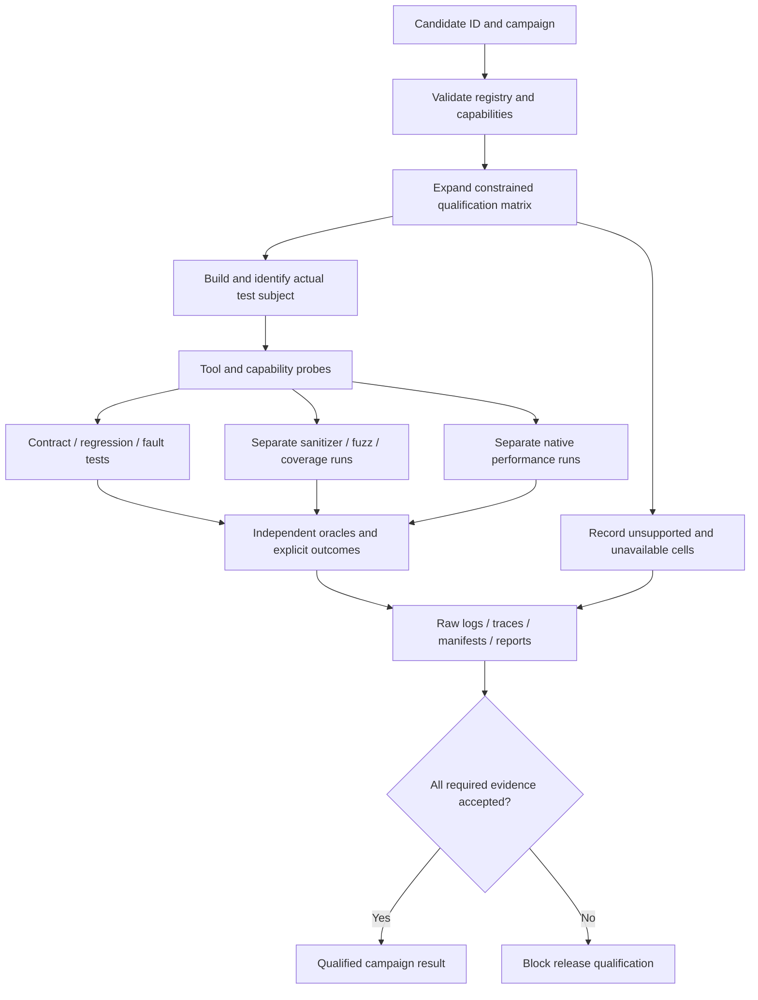

<!--
SPDX-FileCopyrightText: 2026 Rafael V. Volkmer <rafael.v.volkmer@gmail.com>
SPDX-License-Identifier: GPL-3.0-only
-->

# libmemalloc: Tests, Verification, Experiments and Evidence

Use this document to design and track reproducible checks, oracles, and experiments. Start with the
boundaries, select a control from the index and follow its requirements to the test catalog.

The laboratory plan covers registered allocators, separately qualified language adapters, contract reviews
and installed consumers. It defines oracles, latency distributions, coverage, fuzzing, stress, mutation,
typing, E2E, replay and evidence. Dynamic and static binding callbacks have separate contracts. The
published inventory in `tools/specs/ids.lua` and the document checker provide current counts; counts do
not indicate product execution.

**Evidence boundary:** This is a proposed product specification. Allocator correctness, portability, Rust
integration, fuzzing and stress campaigns remain unqualified. Repository checks cover documents and
automation fixtures; they do not establish product acceptance or evidence for another specification.

<details>
<summary><strong>On this page</strong></summary>

- [Authority and requirements](#governance)
- [Boundaries, authority and initial cut](#boundaries)
- [Test selection and evidence flow](#test-evidence-overview)
- [Controls by responsibility](#inherited-controls)
- [LMA-TEST-001: Verification of contracts, concurrency and graph properties](#lma-test-001)
- [LMA-TEST-002: Benchmarks, ablations and criteria to accept hypotheses](#lma-test-002)
- [LMA-TEST-003: Evaluation by budget, competing features and total cost](#lma-test-003)
- [LMA-TEST-004: Test obligations, counter-examples and small executable models](#lma-test-004)
- [Detailed implementation contracts](#implementation-contracts)
- [LMA-TEST-005: Evidence by requirement and limits of each method](#lma-test-005)
- [LMA-TEST-006: Functional properties, valid operations and manual oracle](#lma-test-006)
- [LMA-TEST-007: Deterministic failures and partial effects](#lma-test-007)
- [LMA-TEST-008: Interleavings, weak memory, and concurrent lifetimes](#lma-test-008)
- [LMA-TEST-009: GC oracles, abstractions and optional capabilities](#lma-test-009)
- [LMA-TEST-010: Benchmark per budget, applications and uncertainty](#lma-test-010)
- [LMA-TEST-011: PGO and presets: training, holdout and factorial evaluation](#lma-test-011)
- [LMA-TEST-012: Code gates, modules, documentation and release](#lma-test-012)
- [Additional product contracts](#additional-contracts)
- [LMA-TEST-013: Single orchestrator, registration of candidates and full planning](#lma-test-013)
- [LMA-TEST-014: Simple adapter and static connection without indirection by operation](#lma-test-014)
- [LMA-TEST-015: Portable trace, independent oracle and causal reduction](#lma-test-015)
- [LMA-TEST-016: Payloads: content, zero known and realloc preservation](#lma-test-016)
- [LMA-TEST-017: P50/P90/P95/P99 by path, size and execution condition](#lma-test-017)
- [LMA-TEST-018: 100% coverage: denominators, variants and obligations](#lma-test-018)
- [LMA-TEST-019: Structured sequence fuzzing, payloads and failures](#lma-test-019)
- [LMA-TEST-020: Nightly fuzzing, soak and campaign cadence](#lma-test-020)
- [LMA-TEST-021: Unit and boundary component tests](#lma-test-021)
- [LMA-TEST-022: Seesaw and adverse lifetime patterns](#lma-test-022)
- [LMA-TEST-023: Fragmentation, coalescence and oracle of adjacency](#lma-test-023)
- [LMA-TEST-024: OOM, massive allocations and transactional preservation](#lma-test-024)
- [LMA-TEST-025: Alignment, size zero, null pointers and ABI boundaries](#lma-test-025)
- [LMA-TEST-026: Metadata overhead and memory reconciliation](#lma-test-026)
- [LMA-TEST-027: Heavy concurrency: contention, cross-free and ownership](#lma-test-027)
- [LMA-TEST-028: Own Threads/atomics: kernel and litmus observation](#lma-test-028)
- [LMA-TEST-029: Stack stress and depth limits](#lma-test-029)
- [LMA-TEST-030: CPU and microarchitecture stress](#lma-test-030)
- [LMA-TEST-031: Stress of instructions, lowering and ISA paths](#lma-test-031)
- [LMA-TEST-032: E2E applications, integration and APIs of other languages](#lma-test-032)
- [LMA-TEST-033: Valgrind, sanitizers and sensitivity fixtures](#lma-test-033)
- [LMA-TEST-034: Mutation testing and negative control of the suite itself](#lma-test-034)
- [LMA-TEST-035: C/rust differential/other: semantics and comparability limits](#lma-test-035)
- [LMA-TEST-036: Safety, fault injection and invalid contracts](#lma-test-036)
- [LMA-TEST-037: Evidence, folders, privacy and playback](#lma-test-037)
- [LMA-TEST-038: Execution matrix and portability gates](#lma-test-038)
- [LMA-TEST-039: Adverse GC and non-stop costs](#lma-test-039)
- [LMA-TEST-040: Promotion experiments with explicit loss budgets](#lma-test-040)
- [Verification taxonomy and composable case attributes](#verification-taxonomy)
- [LMA-TEST-041: Public typing, compilation stages and diagnostic oracles](#lma-test-041)
- [LMA-TEST-042: Suite isolation, expected termination and intermittent outcomes](#lma-test-042)
- [LMA-TEST-043: Classification, selection and evidence accounting](#lma-test-043)
- [Proposed case registry and selection schema](#case-registry-schema)
- [Operating pipeline of the allocator laboratory](#operational-pipeline)
- [Central catalogue of planned cases](#case-catalog)
- [Detailed test procedures and oracles](#additional-case-catalog)
- [Examples and compilation context](#examples)
- [Planned contract reviews](#contract-review-cases)
- [Planned distribution cases](#distribution-cases)
- [Planned allocator improvement cases](#planned-allocator-improvement-cases)
- [Planned literature-derived experiments](#planned-literature-derived-experiments)
- [Planned verification taxonomy cases](#planned-verification-taxonomy-cases)
- [Pending qualification](#pending-qualification)
- [References](#references)
- [Additional references and limitations](#additional-references)

</details>

---

<a id="governance"></a>

## Authority and requirements

Apply the [source-attribution rule](README.md#source-attribution): link primary references in each control
that introduces an external technique, including new experiments, and identify LMA-specific adaptations.

**Product:** libmemalloc. **Status:** proposed implementation, not an implemented library or evidence of
better performance than another allocator.

The [local C standard](../standards/c/c-code-standard.md),
[module architecture](../standards/c/c-module-architecture.md), and
[pitfall guide](../standards/c/c-common-pitfalls.md) govern C development. Product constraints in these
specifications refine the permitted implementation. Apply C and platform semantics first, then approved
product constraints and local policy. Conflicts require an explicit decision; a policy exception cannot make
undefined behavior defined.

MUST and MUST NOT express requirements; MAY grants conditional permission. A control's classification does not
by itself measure failure severity. Keep stable control, requirement, invariant, and test identifiers when
editing. References explain a technique; they do not prove this composition or its results. BASE does not mean
implemented, and EXPERIMENTAL does not establish novelty. The H-01 through H-14 hypotheses remain experiments,
not results.

Public names use `LMA_lowerCamelCase`, private names use `lma_lowerCamelCase`, owned types use `lma_*_t`, and
structure tags use the `Lma` prefix and UpperCamelCase. Use Allman compound statements, eight-column
indentation, and 80-column C lines. The result variable is `ret`, declarations occur at the permitted scope
entry, and normal return follows `function_output`. Explicit null pointers follow the local typed-null rule.
Public C headers do not add explicit `extern` or embedded C++ bridges. API descriptions abbreviate local
`LMA_E*` error codes; adapters translate foreign codes without depending on foreign errno numbers.

The local simple-branch rule in CSTYLE-022 and the grouping rules in CSTYLE-279 and CSTYLE-280 apply to these
examples. One-line simple `if` bodies omit braces; loops and compound branch bodies retain them.

The companion schemas, migration records, and validation reports mentioned by the original package are not
present here. They are not current execution evidence. The [CI
reference](../reference/automation.md#ci-control-map) states
the actual check coverage. Product capabilities remain unqualified until their required evidence exists;
missing or conflicting evidence blocks the capability.

---

<a id="boundaries"></a>

## Boundaries, authority and initial cut

This document defines plans, oracles, and gates. All catalogued verification cases remain PLANNED. The current CI
validates documentation and C-guide examples, not the product campaigns described here.

| Level                 | Entry                            | Result you can sustain                                               |
| --------------------- | -------------------------------- | -------------------------------------------------------------------- |
| Check documental      | Markdown, IDs, links, matrix     | Editorial consistency in the checked clipping.                       |
| Build examples        | Headers and two helpers          | Acceptance of syntax/types in that compiler/profile.                 |
| Example tests         | Arithmetic and limited intervals | Result of the cases listed; there is no product heap in the harness. |
| Product contracts     | Future implementation + oracles  | Properties observed in executions.                                   |
| Competing model/proof | Model/tool/assumptions           | Result within the stated scope and analyzed correspondence.          |
| Benchmark             | Final binary + workloads         | Performance/memory ratio under these conditions.                     |

Test codes are `LMA-TEST-CASE-*`; do not indicate execution. A single case can check several requirements
with explicit links and a distinct assertion or obligation for each claimed clause.

### Related documents

[Implementation of the manual core and arenas](libmemalloc-core-implementation-SDD.md) ·
[Optional collector implementation and integration with runtimes](libmemalloc-gc-implementation-SDD.md) ·
[Security, threats and protection mechanisms](libmemalloc-security-SDD.md) ·
[Compilation, modules, ABI, PGO and delivery](libmemalloc-compilation-SDD.md)

---

<a id="test-evidence-overview"></a>

## Test selection and evidence flow

The proposed laboratory resolves registered candidates and applicable capabilities before execution. Planned,
unavailable, or unsupported work must remain visible rather than becoming a passing result.



---

<a id="inherited-controls"></a>

## Controls by responsibility

The controls below define proposed mechanisms. The example appendix provides implementation context without
establishing a stable ABI or product qualification.

---

<a id="lma-test-001"></a>

## LMA-TEST-001: Verification of contracts, concurrency and graph properties

**M0:** REQUIRED. **G0:** REQUIRED.

**Phase:** P0. **Nature:** BASE. **Status:** PROPOSED.

The plan distinguishes generation from valid operations, rejection tests under contract and instrumentation
specific fixtures. A test that performs UB is not converted into C evidence defined only because it runs in
child process. The old tests are relocated to the catalogue of this file with individual provenance.

### Theoretical reference and application

[GenMC: A model checker for weak memory models](https://plv.mpi-sws.org/genmc/): Exploitation of competing
executions under memory models.

[ANSI/ISO C Specification Language (ACSL)](https://www.frama-c.com/html/acsl.html): Pre-conditions and
functional invariants in C.

[StarMalloc: A Formally Verified, Concurrent, Performant, and Security-Oriented Memory
Allocator](https://arxiv.org/abs/2403.09435):
Verifiable decomposition of a real allocator.

### Decision and operation

Keep small models of inbox protocols, owner swapping, loans, roots and certificate publishing. Each operation
will have explicit linearization point or other observability contract. First check a simple variant with
locks, then any optimized atomic variant.

Contracts of arithmetic, classes, limits and no overlap will be candidates for ACSL/Frama-C. Competing C
models will be candidates for GenMC with hypotheses and limits recorded. Random graph tests with oracle of
range complement, but do not replace, the proofs. The static proof of Appendix C islands does not demonstrate
the code or concurrent interaction.

### Verifiable requirements

<a id="lma-test-001-r01"></a> **LMA-TEST-001-R01.** MUST version model, tool, options, limits and result of
each check.

<a id="lma-test-001-r02"></a> **LMA-TEST-001-R02.** MUST bind requirements/invariants to testing and testing
obligations.

<a id="lma-test-001-r03"></a> **LMA-TEST-001-R03.** MUST distinguish review, test, limited model checking and
mathematical/mechanized proof.

### Invariants

<a id="lma-test-001-i01"></a> **LMA-TEST-001-I01.** A correction claim does not exceed the set of verified
assumptions and behaviors.

<a id="lma-test-001-i02"></a> **LMA-TEST-001-I02.** Change of `memory_order` or recovery of descriptor
invalidates the affected evidence until further analysis.

### Risks, limits and fallback

The mentioned tools are methodological references. This document does not report execution of GenMC, Frama-C
or libmemalloc benchmarks.

### Checking and linking to the catalogue

[LMA-TEST-CASE-0118](libmemalloc-tests-SDD.md#lma-test-case-0118),
[LMA-TEST-CASE-0119](libmemalloc-tests-SDD.md#lma-test-case-0119),
[LMA-TEST-CASE-0120](libmemalloc-tests-SDD.md#lma-test-case-0120). All cases remain planned for the product.

---

<a id="lma-test-002"></a>

## LMA-TEST-002: Benchmarks, ablations and criteria to accept hypotheses

**M0:** DEFERRED. **G0:** DEFERRED.

**Phase:** P1. **Nature:** BASE. **Status:** PROPOSED.

### Theoretical reference and application

[Google Benchmark user guide](https://google.github.io/benchmark/user_guide.html): Repetitions, heating and
work elimination prevention.

[Beyond malloc efficiency to fleet efficiency: a hugepage-aware memory
allocator](https://www.usenix.org/conference/osdi21/presentation/hunter):
Compare full effect on the application.

[TCMalloc design](https://google.github.io/tcmalloc/design.html): Comparer with multiple paths and cache
policies.

Primary references for the named tools and comparator contracts:
[mimalloc](https://github.com/microsoft/mimalloc) ·
[snmalloc](https://github.com/microsoft/snmalloc) ·
[jemalloc manual](https://jemalloc.net/jemalloc.3.html).
These sources define the referenced interfaces; the LMA comparison and qualification remain proposed.

### Decision and operation

Compare the manual mode with mimalloc, snmalloc, TCMalloc, jemalloc and the system allocator, fixing
versions/commits at the time of the experiment. Do not use old version results as proof against current
versions. Cooperative comparisons and GC will have separate groups with equivalent contracts and identical
useful work.

Run local traffic, producer-consumer, fan-in, bursts, idle, mixing of durations, large alignments, NUMA and
complete applications. Play content and make results observable. Specify whether an operation means alloc,
free or even. Include heating, cold tests, randomized order, independent repetitions, CPU/NUMA/huge pages
configuration and security profiles. Report distributions and uncertainty, not only the best time.

[LMA-TEST-003](libmemalloc-tests-SDD.md#lma-test-003) expands the campaign with boundaries under equivalent
quotas, number of threads/contexts, cost of observability, partial replay and adverse retention
tests.Historical documents explain principles; the campaign must fix current implementations, including later
changes of comparators.

### Verifiable requirements

<a id="lma-test-002-r01"></a> **LMA-TEST-002-R01.** MUST measure application time, throughput, tails,
peak/stable memory state and maintenance cost.

<a id="lma-test-002-r02"></a> **LMA-TEST-002-R02.** MUST perform ablations by mechanism, adverse loads and
validation set not used for adjustment.

<a id="lma-test-002-r03"></a> **LMA-TEST-002-R03.** MUST register conditions of rejection before choosing the
favorable loads to the hypothesis.

### Invariants

<a id="lma-test-002-i01"></a> **LMA-TEST-002-I01.** The comparison no longer grants memory, less protection or
more information without stating the difference.

<a id="lma-test-002-i02"></a> **LMA-TEST-002-I02.** Cost of drainage/drainage delayed does not disappear from
the measurement horizon.

### Risks, limits and fallback

There is no universal goal of nanoseconds, Mops/s or fragmentation. Big gain in one load only authorizes a
statement about corresponding conditions.

### Checking and linking to the catalogue

[LMA-TEST-CASE-0124](libmemalloc-tests-SDD.md#lma-test-case-0124),
[LMA-TEST-CASE-0125](libmemalloc-tests-SDD.md#lma-test-case-0125),
[LMA-TEST-CASE-0126](libmemalloc-tests-SDD.md#lma-test-case-0126). All cases remain planned for the product.

---

<a id="lma-test-003"></a>

## LMA-TEST-003: Evaluation by budget, competing features and total cost

**M0:** DEFERRED. **G0:** DEFERRED.

**Phase:** P1. **Nature:** BASE. **Status:** PROPOSED.

### Theoretical reference and application

[Beyond malloc efficiency to fleet efficiency: a hugepage-aware memory
allocator](https://www.usenix.org/conference/osdi21/presentation/hunter)
· [Google Benchmark user guide](https://google.github.io/benchmark/user_guide.html) ·
[mimalloc documentation](https://github.com/microsoft/mimalloc) ·
[SpeedMalloc: Improving Multi-threaded Applications via a Lightweight Core for Memory
Allocation](https://arxiv.org/abs/2508.20253v1)
· [Distilling the Real Cost of Production Garbage Collectors](https://arxiv.org/abs/2112.07880v2)

Google Benchmark user guide supports harness care; Beyond malloc efficiency to fleet efficiency: a
hugepage-aware memory allocator prioritizes effect on application; Distilling the Real Cost of Production
Garbage Collectors proposes a methodology for not hiding GC cost in available resources. SpeedMalloc:
Improving Multi-threaded Applications via Lightweight Core for Memory Allocation uses special architectural
features, which need to be explained in a comparison.

### Decision and operation

Compare settings on a time–memory–tail boundary under the same useful work, protection, and resource limit.
Run both recommended project settings and a campaign equalized by quota; report both, without converting
unfavorable adjustment to concurrent algorithm defect. Version/commit, backend, flags, CPU, compiler and
profile need to follow each point.

Alloc/free traces capture observed sizes and lengths, but a serial replay does not reproduce contention,
partial order between threads or payload accesses. Record logical identifiers, publication and consumption
dependencies, and synchronization points. Do not use addresses of a previous execution as a new identity contract.
Complement replay with
full application and synthetic loads; allocator decisions can change cache and schedule, making trace an
incomplete counterfactual.

Measure phases: cold start, heating, stable state, burst, idle and closing. Include all authorized maintenance
within the horizon; do not charge drainage of one candidate and leave the other with the queue for later. For
open services, do not omit requests during pauses and then calculate tail only of completed ones; register
arrivals, queue, refusals and censorship. Randomized order, independent repetitions and uncertainty accompany
the effect, not only the best number.

Variate the threads/colors and contexts/threads ratio, retention after churn, fan-in, almost full memory,
super-aligned objects, sparse spans, long pins and workload that invalidates predictions. Trace costs,
symbols, measurement and sampling are measured separately. Candidates with extra core, auxiliary hardware or
compiler information belong to comparisons with these declared resources, not to a drop-in win without cost.

### Verifiable requirements

<a id="lma-test-003-r01"></a> **LMA-TEST-003-R01.** MUST report curves by budget and application metrics,
instead of a universal ranking.

<a id="lma-test-003-r02"></a> **LMA-TEST-003-R02.** MUST preserve or explain partial order loss and payload
behavior on replay.

<a id="lma-test-003-r03"></a> **LMA-TEST-003-R03.** MUST include arrivals, queues, delayed work, failures and
instrumentation costs in the scope of the campaign.

<a id="lma-test-003-r04"></a> **LMA-TEST-003-R04.** MUST pre-register adjustment loads, validation, regression
criteria and additional resources granted.

### Invariants

<a id="lma-test-003-i01"></a> **LMA-TEST-003-I01.** An advantage cannot result from omitting equivalent work
from just one candidate.

<a id="lma-test-003-i02"></a> **LMA-TEST-003-I02.** A confidence interval does not eliminate systematic bias
from different contracts or resources.

### Risks, limits and fallback

No single benchmark represents all applications. The results of the didactic models of this package are not
libmemalloc measurements. Recommendations on comparator versions should be updated at the beginning of each
execution, not inferred from the year of their articles.

### Checking and linking to the catalogue

[LMA-TEST-CASE-0184](libmemalloc-tests-SDD.md#lma-test-case-0184),
[LMA-TEST-CASE-0185](libmemalloc-tests-SDD.md#lma-test-case-0185),
[LMA-TEST-CASE-0186](libmemalloc-tests-SDD.md#lma-test-case-0186). All cases remain planned for the product.

---

<a id="lma-test-004"></a>

## LMA-TEST-004: Test obligations, counter-examples and small executable models

**M0:** REQUIRED. **G0:** REQUIRED.

**Phase:** P0. **Nature:** BASE. **Status:** PROPOSED.

### Theoretical reference and application

[Programming languages: C, Committee Draft N1570](https://www.open-std.org/jtc1/sc22/wg14/www/docs/n1570.pdf)
·
[Hazard pointers: Safe memory reclamation for lock-free
objects](https://research.ibm.com/publications/hazard-pointers-safe-memory-reclamation-for-lock-free-objects)
·
[StarMalloc: A Formally Verified, Concurrent, Performant, and Security-Oriented Memory
Allocator](https://arxiv.org/abs/2403.09435)
· [GenMC: A model checker for weak memory models](https://plv.mpi-sws.org/genmc/) ·
[ANSI/ISO C Specification Language (ACSL)](https://www.frama-c.com/html/acsl.html)

The original sources of memory, recovery and verification models support the methods. Reduced models serve to
separate obligations; no tool automatically transfers the correction from model to product.

### Decision and operation

Organize the chain of evidence: natural contract → model of states/resources → simple implementation →
optimized refinement → validation campaign. Before seeking performance, write the counterexample that a rule
intends to prevent. Examples: entry during destruction without reference; credit granted twice; obsolete
generation numerically equal; consumer reusing node as producer touches it; borrowed father and moved child;
time interval reused before external completion.

For the arithmetic core, specify overflow preconditions, alignment, partition and rollback. For concurrency,
document linearization, publication, lifetime, memory orders, set of readers and quiescence point. An x86 test
does not implicitly validate AArch64. A row model with abstract atomic steps does not prove the choice of
`memory_order` in C.

Python didactic models can demonstrate identities, produce counterexamples and thoroughly verify explicit
finite domains. They are distinct artifacts of GenMC, ACSL and mechanized proof. The small accompanying models
of this specification check only policies/arithmetic under sequential steps; they do not implement malloc, do
not model cache and do not measure system performance.

Versing the model, its limits, the target implementation when it exists, the results and the covered
obligation. By changing the inbox algorithm, slot type, descriptor recovery or barrier, invalidating the
dependent evidence. Requiring negative tests that achieve the error; an assert never triggered on an
unexercised path does not constitute coverage.

### Verifiable requirements

<a id="lma-test-004-r01"></a> **LMA-TEST-004-R01.** MUST maintain a counter-example or adverse scenario for
each non-trivial safety obligation.

<a id="lma-test-004-r02"></a> **LMA-TEST-004-R02.** MUST record the limits and the refinement relationship
between model and code before claiming transfer of result.

<a id="lma-test-004-r03"></a> **LMA-TEST-004-R03.** MUST separate editorial checks, didactic models,
product tests and evidence in different evidence states.

<a id="lma-test-004-r04"></a> **LMA-TEST-004-R04.** MUST invalidate evidence after change of protocol or
relevant premise.

### Invariants

<a id="lma-test-004-i01"></a> **LMA-TEST-004-I01.** The force of the claim does not exceed the behavior
effectively covered by the artifact.

<a id="lma-test-004-i02"></a> **LMA-TEST-004-I02.** The absence of failure in samples is not described as
universal proof of absence of the defect.

### Risks, limits and fallback

Full model checking of a reduced model remains reduced. The package of this specification delivers study and
verifiable examples of reasoning, not a formally verified allocator.

### Checking and linking to the catalogue

[LMA-TEST-CASE-0187](libmemalloc-tests-SDD.md#lma-test-case-0187),
[LMA-TEST-CASE-0188](libmemalloc-tests-SDD.md#lma-test-case-0188),
[LMA-TEST-CASE-0189](libmemalloc-tests-SDD.md#lma-test-case-0189). All cases remain planned for the product.

---

<a id="implementation-contracts"></a>

## Detailed implementation contracts

The following contracts are normative for the proposed implementation. Product qualification remains pending.

---

<a id="lma-test-005"></a>

## LMA-TEST-005: Evidence by requirement and limits of each method

**Status:** PROPOSED.

**M0:** REQUIRED. **G0:** REQUIRED.

**Classification:** CORRECTNESS / ARCHITECTURE / ANALYZABILITY. **Obligation:** design requirements.
**Nature:** BASE. **Phase:** P0.

**Related standards and scenarios:** [CMOD-097](../standards/c/c-module-architecture.md#cmod-097) ·
[CMOD-102](../standards/c/c-module-architecture.md#cmod-102) ·
[CMOD-115](../standards/c/c-module-architecture.md#cmod-115) ·
[CSTYLE-099](../standards/c/c-code-standard.md#cstyle-099).

### Grounds for and limit of evidence

[ACSL/Frama-C](https://www.frama-c.com/html/acsl.html) describes functional contracts;
[GenMC](https://plv.mpi-sws.org/genmc/) these are complementary methods with different assumptions and scopes,
not interchangeable correction stamps.

### Decision, protocol and failure scenario

Each evidence contains requirement/invariant, implementation commit, model/harness hash, tool/version/options,
target, profile C, limits, seed/corpus, command, stdout/stderr, result and revision. A compilation records
only what it compiled; a test records executions; a limited model checker records states/interleavings within
the model; a proof records the hypotheses and correspondence with the code.

Allowed states: PLANNED, `IMPLEMENTED_NOT_EXECUTED`, `EXECUTED_PASSED`, `EXECUTED_FAILED`,
`NOT_APPLICABLE_JUSTIFIED`, and BLOCKED. Do not use a single “done” state for specification and
implementation. A requirement without evidence remains pending. An unavailable tool does not produce PASS, and
a disabled variant does not count as tested.

Each requirement must have a linked verification, and each verification must state its oracle. The control in
the responsible specification defines the contract. Review semantic changes explicitly; renumbering
identifiers does not justify changing behavior.

Models need correspondence with fields/transitions of the product. Prove abstract quota balance does not prove
atomics of the ledger; prove Reach on static graph does not prove concurrent update of certificates; prove
arithmetic does not validate the backend. explicitly identify this gap, create the next test/proof and do not
extend the claim.

### Verifiable requirements

<a id="lma-test-005-r01"></a> **LMA-TEST-005-R01.** Each requirement/invariant MUST point to verification with
oracle and explicit state.

<a id="lma-test-005-r02"></a> **LMA-TEST-005-R02.** Records MUST contain source, tool, profile, limits,
artifacts and reproducible result.

<a id="lma-test-005-r03"></a> **LMA-TEST-005-R03.** Change of protocol, compiler/ABI or `memory_order` MUST
reopen the affected evidence.

<a id="lma-test-005-r04"></a> **LMA-TEST-005-R04.** Reports MUST NOT confuse sample tests with allocator
implementation tests.

### Invariants

<a id="lma-test-005-i01"></a> **LMA-TEST-005-I01.** Allegation published does not exceed the associated
premises/evidence.

<a id="lma-test-005-i02"></a> **LMA-TEST-005-I02.** Failure, blocking or non-execution is never automatically
converted into approval.

### Verification and residual risk

[LMA-TEST-CASE-0258](libmemalloc-tests-SDD.md#lma-test-case-0258),
[LMA-TEST-CASE-0259](libmemalloc-tests-SDD.md#lma-test-case-0259).

The results remain planned for the implementation of the product. Capacity is only promoted after checking
these requirements in the corresponding profile; bibliographic reference or auxiliary example does not replace
this evidence.

---

<a id="lma-test-006"></a>

## LMA-TEST-006: Functional properties, valid operations and manual oracle

**Status:** PROPOSED.

**M0:** REQUIRED. **G0:** REQUIRED.

**Classification:** CORRECTNESS / ARCHITECTURE / ANALYZABILITY. **Obligation:** design requirements.
**Nature:** BASE. **Phase:** P0.

**Related standards and scenarios:** [CMOD-054](../standards/c/c-module-architecture.md#cmod-054) ·
[CMOD-055](../standards/c/c-module-architecture.md#cmod-055) ·
[CMOD-112](../standards/c/c-module-architecture.md#cmod-112) ·
[CSTYLE-063](../standards/c/c-code-standard.md#cstyle-063) ·
[CSTYLE-117](../standards/c/c-code-standard.md#cstyle-117).

### Grounds for and limit of evidence

The principle of independent oracle is required by the Coil.
[Google Benchmark](https://google.github.io/benchmark/user_guide.html) helps to separate observable work from
a call eliminated by the compiler; in this control, the priority is functional result before timing.

### Decision, protocol and failure scenario

The generator maintains an object model by IDs, request, alignment, expected content, family, owner and life.
It only generates valid operations in the functional suite; for diagnostic violation it uses the
validation/model API, without running UB by chance. Store the seed and minimize the sequence that failed
keeping life dependencies.

Check minimum size, alignment, no overlap of valid ranges, conservation of bytes ordered in realloc, null
output in manual error, GC destination preserved in error and zero free no effect. Use zero, one, class
limits, `SIZE_MAX` and near overflow requests. For oracle indexes/addresses, use offsets from known regions;
do not relationally compare C pointers without common provenance.

In the mock backend, maintain a partition of free and occupied intervals and their attributes. Check every
acquisition, split, merge, purge, and release against this model. Prefixes and suffixes from extended
alignment retain their origin. Verify that purge neither clears a partially live region nor leaves an
intrusive link accessible after discard.

Arenas are evaluated by logical generations: reset invalidates all old IDs and requires end of uses.
Marks/rewind, when enabled, follow LIFO discipline and no escape. The tests do not try to “see if the old
pointer still works” after reset as proof of correction.

The optimized candidate and reference receive the same stream of valid operations, but do not need to return
the same address. Compare the observable properties allowed by the API, not layout details that the contract
does not freeze.

### Verifiable requirements

<a id="lma-test-006-r01"></a> **LMA-TEST-006-R01.** The functional suite MUST generate only valid operations
or rejections defined by the contract.

<a id="lma-test-006-r02"></a> **LMA-TEST-006-R02.** The oracle MUST be independent of the tables or algorithms of
the candidate, except for the entry of expressly shared geometry.

<a id="lma-test-006-r03"></a> **LMA-TEST-006-R03.** Each arithmetic/geometric boundary MUST include adjacent
cases and failure preservation verification.

<a id="lma-test-006-r04"></a> **LMA-TEST-006-R04.** A differential comparison MUST NOT require identical
addresses when the API allows different layouts.

### Invariants

<a id="lma-test-006-i01"></a> **LMA-TEST-006-I01.** Living objects of the model correspond to non-overlapping
storage from the correct family.

<a id="lma-test-006-i02"></a> **LMA-TEST-006-I02.** No test interprets accidental success of obsolete access
as temporal security.

### Verification and residual risk

[LMA-TEST-CASE-0260](libmemalloc-tests-SDD.md#lma-test-case-0260),
[LMA-TEST-CASE-0261](libmemalloc-tests-SDD.md#lma-test-case-0261).

The results remain planned for the implementation of the product. Capacity is only promoted after checking
these requirements in the corresponding profile; bibliographic reference or auxiliary example does not replace
this evidence.

---

<a id="lma-test-007"></a>

## LMA-TEST-007: Deterministic failures and partial effects

**Status:** PROPOSED.

**M0:** REQUIRED. **G0:** REQUIRED.

**Classification:** CORRECTNESS / ARCHITECTURE / ANALYZABILITY. **Obligation:** design requirements.
**Nature:** BASE. **Phase:** P0.

**Related standards and scenarios:** [CMOD-101](../standards/c/c-module-architecture.md#cmod-101) ·
[CMOD-118](../standards/c/c-module-architecture.md#cmod-118) ·
[CSTYLE-066](../standards/c/c-code-standard.md#cstyle-066) ·
[CPIT-156](../standards/c/c-common-pitfalls.md#cpit-156).

### Grounds for and limit of evidence

The fault injection requirement comes from the coil architecture. Backend semantics is taken from the primary
APIs of [mmap](https://man7.org/linux/man-pages/man2/mmap.2.html) and
[madvise](https://man7.org/linux/man-pages/man2/madvise.2.html), but the fake backend should make reproducible
effects that the OS does not offer under command.

### Decision, protocol and failure scenario

Each fault point has semantic identifier: before booking quota, after reservation, after partial effect,
before publishing map, after split, before object commit and during rollback. “Fail the umpteenth allocation”
is an auxiliary technique, not a stable identifier after refactoring.

The false backend specifies result and effect independently: error without effect; total success; partial
error; partial rollback; cleaning that fails. The oracle holds the features that exist. The
implementation must keep everything represented/covered until release confirmed. It is not enough to verify
that the call has returned ENOMEM.

Enumerate create, attach, refill, aligned realloc windows, new root, type, `newInto`, worklist, promotion,
cohort closure and preset generation. For each, observe output, previous content, publication, counters,
locks, queue and possibility of cleanup/retry. The primary error is not overwritten by a secondary diagnostic
failure.

Test OOM during the error report itself, without recursion; in tracing, check that there was no partial sweep;
in evacuation, which origins were not removed; in destroyer, which EBUSY preserved usable object for cleanup.
Repeat the sequence after removing the injection to detect resources lost by a previous attempt.

### Verifiable requirements

<a id="lma-test-007-r01"></a> **LMA-TEST-007-R01.** Every fallible stage of a enabled resource MUST have
deterministic injection before/after its relevant effects.

<a id="lma-test-007-r02"></a> **LMA-TEST-007-R02.** The oracle MUST observe effects and resources, not just
the return code.

<a id="lma-test-007-r03"></a> **LMA-TEST-007-R03.** Rollback failed MUST be tested as real state still
represented and charged.

<a id="lma-test-007-r04"></a> **LMA-TEST-007-R04.** The tests MUST verify recovery/repetition allowed after
failure, preserving the primary error.

### Invariants

<a id="lma-test-007-i01"></a> **LMA-TEST-007-I01.** No real feature disappears from the ledger because of the
error return.

<a id="lma-test-007-i02"></a> **LMA-TEST-007-I02.** An incomplete collection does not recover objects.

### Verification and residual risk

[LMA-TEST-CASE-0262](libmemalloc-tests-SDD.md#lma-test-case-0262),
[LMA-TEST-CASE-0263](libmemalloc-tests-SDD.md#lma-test-case-0263).

The results remain planned for the implementation of the product. Capacity is only promoted after checking
these requirements in the corresponding profile; bibliographic reference or auxiliary example does not replace
this evidence.

---

<a id="lma-test-008"></a>

## LMA-TEST-008: Interleavings, weak memory, and concurrent lifetimes

**Status:** PROPOSED.

**M0:** REQUIRED. **G0:** REQUIRED.

**Classification:** CORRECTNESS / ARCHITECTURE / ANALYZABILITY. **Obligation:** design requirements.
**Nature:** BASE. **Phase:** P0.

**Related standards and scenarios:** [CSTYLE-092](../standards/c/c-code-standard.md#cstyle-092) ·
[CSTYLE-174](../standards/c/c-code-standard.md#cstyle-174) ·
[CMOD-105](../standards/c/c-module-architecture.md#cmod-105) ·
[CMOD-112](../standards/c/c-module-architecture.md#cmod-112) ·
[CPIT-074](../standards/c/c-common-pitfalls.md#cpit-074).

### Grounds for and limit of evidence

[GenMC](https://plv.mpi-sws.org/genmc/) enables the exploration of competing C programme models;
[TSan](https://clang.llvm.org/docs/ThreadSanitizer.html) observes racing in instrumented executions. No x86
test isolated proof portability for weak memory.

### Decision, protocol and failure scenario

Keep reduced templates separate for inbox, handoff, quota, root/load, borrow/movement, handshake and
certificate update. Declare number of threads, we, reduced generations, memory orders and fairness
assumptions. Reduce a generation to test wrap changes the model domain, not product configuration.

Controlled pause points precede and succeed linearization, unlock, descriptor publication, chain withdrawal,
and location commit. Two producers and one consumer are minimal for inbox; the model includes fast reuse of
nodes and owner exchange. A successful serial execution does not qualify concurrent implementation.

The lock reference defines observables, not a global order that the optimized version is required to repeat
for simultaneous operations. Verify linearizability or other explicitly chosen contract, respecting the actual
precedence of operations. Candidate CAS needs to protect all nodes that its producers read, not just the head.

The matrix includes x86-64 and AArch64 natives when qualified; emulation is separate evidence. contention,
prolonged suspension, churn threads, fan-in and NUMA are integration scenarios. Lack of progress under
suspension can be allowed safe behavior; the report distinguishes security from conditional liveness.

Do not insert sleeps as the only way to “force” running. Use test barriers at scheduling points and register
the sequence. TSan does not see uninstrumented code accesses, assembly or primitives not automatically
modeled; limits follow the report.

### Verifiable requirements

<a id="lma-test-008-r01"></a> **LMA-TEST-008-R01.** Concurrent protocols MUST have model with stated limits,
publishing points and liveness conditions.

<a id="lma-test-008-r02"></a> **LMA-TEST-008-R02.** Tests MUST include reuse, suspension and transfer of
owner, not just common simultaneous traffic.

<a id="lma-test-008-r03"></a> **LMA-TEST-008-R03.** Any claim of progress MUST register scheduling assumptions
and authorized participants.

<a id="lma-test-008-r04"></a> **LMA-TEST-008-R04.** An atomics optimization MUST be validated in addition to
the strong memory architecture used in development.

### Invariants

<a id="lma-test-008-i01"></a> **LMA-TEST-008-I01.** State publication is not treated as termination of the old
readers.

<a id="lma-test-008-i02"></a> **LMA-TEST-008-I02.** The safety proof is not presented as a guarantee of
latency or wait-freedom.

### Verification and residual risk

[LMA-TEST-CASE-0264](libmemalloc-tests-SDD.md#lma-test-case-0264),
[LMA-TEST-CASE-0265](libmemalloc-tests-SDD.md#lma-test-case-0265),
[LMA-TEST-CASE-0266](libmemalloc-tests-SDD.md#lma-test-case-0266).

The results remain planned for the implementation of the product. Capacity is only promoted after checking
these requirements in the corresponding profile; bibliographic reference or auxiliary example does not replace
this evidence.

---

<a id="lma-test-009"></a>

## LMA-TEST-009: GC oracles, abstractions and optional capabilities

**Status:** PROPOSED.

**M0:** DEFERRED. **G0:** REQUIRED.

**Classification:** CORRECTNESS / ARCHITECTURE / ANALYZABILITY. **Obligation:** design requirements.
**Nature:** BASE. **Phase:** P2.

**Related standards and scenarios:** [CMOD-112](../standards/c/c-module-architecture.md#cmod-112) ·
[CMOD-113](../standards/c/c-module-architecture.md#cmod-113) ·
[CSTYLE-123](../standards/c/c-code-standard.md#cstyle-123) ·
[CPIT-031](../standards/c/c-common-pitfalls.md#cpit-031).

### Grounds for and limit of evidence

The definitions of [Roots](https://memory-pool-system.readthedocs.io/en/latest/topic/root.html) and
[weak](https://memory-pool-system.readthedocs.io/en/latest/topic/weak.html) help separate relationships from
the graph. The oracle of the project needs to implement the LMA semantics, not assume that all libraries
choose the same order of completion.

### Decision, protocol and failure scenario

Represent objects by indices, strong/weak fields, ephemerons, roots, pins, domain and state of completion. The
oracle uses structures and separate trajectory of the collector. G0 requires exact preservation of the
required strongly reachable objects and allows expressly contracted retentions; partial/island collections can
preserve supersets. No modality allows to lose mandatory object.

Force collection attempt in each API documented as safepoint and in each backup/publication window. Test last
local reference without root as integration error in the model, not as execution C that should “function”.
Check protection transfer, crossnamespace and use of unpinned child.

In mobility, compare semantic bytes, identities, alignments and tips of all edges after commit. Do not require
equal address; require stability for pinned or non-relocatable objects. With 100% survival or destination OOM,
no origin can be improperly removed.

For cohorts, include internal cycle achieved by indirect export. For islands, list extra/lacking partitions
and boundaries: extras only retain; a missing edge needs to invalidate the candidate. Transactions should be
tested before first writing, during import and in reconstruction failure. Ephemerons and finalizers have phase
oracles, not only strong DFS.

Every capacity still unavailable has ENOTSUP test/no symbol according to profile. Enable flag without
implementing mechanism is not approved partial support.

### Verifiable requirements

<a id="lma-test-009-r01"></a> **LMA-TEST-009-R01.** The oracle GC MUST cover each authorized
reference/protection and the order of phases LMA.

<a id="lma-test-009-r02"></a> **LMA-TEST-009-R02.** Every safepoint announced MUST be a potential point of
collection in the harness.

<a id="lma-test-009-r03"></a> **LMA-TEST-009-R03.** Movement MUST be verified by identity/content/roots and
stability of exceptions, not only by memory reduction.

<a id="lma-test-009-r04"></a> **LMA-TEST-009-R04.** Hypothesis of abstraction MUST demonstrate the inclusion
of Reach and measure extra retention.

<a id="lma-test-009-r05"></a> **LMA-TEST-009-R05.** Absent capabilities MUST explicitly fail according to the
build/API contract.

### Invariants

<a id="lma-test-009-i01"></a> **LMA-TEST-009-I01.** No object required by the oracle is recovered.

<a id="lma-test-009-i02"></a> **LMA-TEST-009-I02.** Incomplete boundary does not receive valid certificate
status.

### Verification and residual risk

[LMA-TEST-CASE-0267](libmemalloc-tests-SDD.md#lma-test-case-0267),
[LMA-TEST-CASE-0268](libmemalloc-tests-SDD.md#lma-test-case-0268),
[LMA-TEST-CASE-0269](libmemalloc-tests-SDD.md#lma-test-case-0269).

The results remain planned for the implementation of the product. Capacity is only promoted after checking
these requirements in the corresponding profile; bibliographic reference or auxiliary example does not replace
this evidence.

---

<a id="lma-test-010"></a>

## LMA-TEST-010: Benchmark per budget, applications and uncertainty

**Status:** PROPOSED.

**M0:** DEFERRED. **G0:** DEFERRED.

**Classification:** CORRECTNESS / ARCHITECTURE / ANALYZABILITY. **Obligation:** design requirements.
**Nature:** BASE. **Phase:** P1.

**Related standards and scenarios:** [CPERF-039](../standards/c/c-code-standard.md#cperf-039) ·
[CPERF-040](../standards/c/c-code-standard.md#cperf-040) ·
[CPERF-041](../standards/c/c-code-standard.md#cperf-041) ·
[CMOD-122](../standards/c/c-module-architecture.md#cmod-122).

### Grounds for and limit of evidence

[Temeraire](https://www.usenix.org/conference/osdi21/presentation/hunter) motivates to measure the placement
effect on the application. [Google Benchmark](https://google.github.io/benchmark/user_guide.html) document
measurement mechanisms.The statistical design below is proposed of the project, not experimental result.

Primary references for the named tools and comparator contracts:
[mimalloc](https://github.com/microsoft/mimalloc) ·
[snmalloc](https://github.com/microsoft/snmalloc) ·
[TCMalloc design](https://google.github.io/tcmalloc/design.html) ·
[jemalloc manual](https://jemalloc.net/jemalloc.3.html).
These sources define the referenced interfaces; the LMA comparison and qualification remain proposed.

### Decision, protocol and failure scenario

Compare manual mode with fixed versions/commits of mimalloc, snmalloc, TCMalloc, Jemalloc and system when
conditions permit. The date of this specification does not forever fix the latest competitor. Registering
hardening, purge, large pages, caches, available memory, ISA, toolchain, affinity and process limits.
Additional compiler/runtime information requires separate campaign and equivalent comparator.

Minimum families: local traffic, producer-consumer, fan-in, churn, burst+idle, mixing of durations, large
objects/overalignment, metadata limit, high survival/pins and complete application. Touching content and
making work observable; inspecting code generated to detect deletion. An empty alloc/free loop does not
automatically represent application work.

Measure total time, throughput, p50/p90/p95/p99 with appropriate sample size, maintenance cost, logical memory
and observed RSS, temporary peak, page failures and hardware metrics when available. Do not add overlapping
memory categories. Separate cold/heated execution and include delayed recovery within a stated horizon, with
idle when pertinent.

Randomize/alternate order of candidates in blocks, repeat in independent processes and register environment.
Millions of operations of the same execution are not millions of independent repetitions. Report distributions
and uncertainty intervals; not only choose the best time. Service latency should avoid omitting requests
during manager pauses; register arrival model and queues.

Before the results, define budget and regression tolerance by scenario. A goal of gain or limit of p99 is an
approved entry of the experiment, not a universal number manufactured by SDD. Accepting a hypothesis only when
maintaining correction, it is up to the budget and its benefit exceeds cost/variation in the set reserved.
Publish unfavorable results and ablations.

### Verifiable requirements

<a id="lma-test-010-r01"></a> **LMA-TEST-010-R01.** Benchmarks MUST set versions, conditions, budget,
available information and protection profile for each comparator.

<a id="lma-test-010-r02"></a> **LMA-TEST-010-R02.** The horizon MUST include work postponed and measure the
application beyond the alloc/free isolated.

<a id="lma-test-010-r03"></a> **LMA-TEST-010-R03.** The experiment MUST have independent repetitions,
controlled order and report of uncertainty.

<a id="lma-test-010-r04"></a> **LMA-TEST-010-R04.** Acceptance/rejection criteria MUST be registered before
choosing favorable results.

<a id="lma-test-010-r05"></a> **LMA-TEST-010-R05.** Comparisons MUST separate manual, GC and co-operation with
compiler.

### Invariants

<a id="lma-test-010-i01"></a> **LMA-TEST-010-I01.** A gain is not attributed to the allocator when it results
from undeclared uneven memory/information/protection.

<a id="lma-test-010-i02"></a> **LMA-TEST-010-I02.** Work moved after measurement does not disappear from the
total cost.

### Verification and residual risk

[LMA-TEST-CASE-0270](libmemalloc-tests-SDD.md#lma-test-case-0270),
[LMA-TEST-CASE-0271](libmemalloc-tests-SDD.md#lma-test-case-0271),
[LMA-TEST-CASE-0272](libmemalloc-tests-SDD.md#lma-test-case-0272).

The results remain planned for the implementation of the product. Capacity is only promoted after checking
these requirements in the corresponding profile; bibliographic reference or auxiliary example does not replace
this evidence.

---

<a id="lma-test-011"></a>

## LMA-TEST-011: PGO and presets: training, holdout and factorial evaluation

**Status:** PROPOSED.

**M0:** DEFERRED. **G0:** DEFERRED.

**Classification:** CORRECTNESS / ARCHITECTURE / ANALYZABILITY. **Obligation:** design requirements.
**Nature:** BASE. **Phase:** P1.

**Related standards and scenarios:** [CPERF-031](../standards/c/c-code-standard.md#cperf-031) ·
[CPERF-039](../standards/c/c-code-standard.md#cperf-039) ·
[CMOD-106](../standards/c/c-module-architecture.md#cmod-106) ·
[CMOD-122](../standards/c/c-module-architecture.md#cmod-122).

### Grounds for and limit of evidence

[Clang PGO](https://clang.llvm.org/docs/UsersManual.html#profile-guided-optimization),
[ThinLTO](https://clang.llvm.org/docs/ThinLTO.html) and [MemProf](https://llvm.org/docs/MemProf.html) The LMA
experiment should isolate optimized code, memory information and selected policy.

Primary references for the named tools and comparator contracts:
[mimalloc](https://github.com/microsoft/mimalloc).
These sources define the referenced interfaces; the LMA comparison and qualification remain proposed.

### Decision, protocol and failure scenario

Partition loads per family before adjusting: training, validation and reserved test. Do not only separate
seeds from the same pattern and call it generalization. Use local/remote traffic, bursts and thread closure;
rare failures are exercised for correction even when they should not dominate the frequency profile.

Each allocator collects its own profile on equivalent loads. Do not use a mimalloc profdata file to
libmemalloc or grant PGO only to the candidate. Merge weights are registered. The final benchmark is
recompiled binary wheel for profile use, not the instrumented executable.

Minimum matrix per candidate: without LTO/no PGO; LTO without PGO; LTO with PGO. When offline preset is
implemented, cross baseline/preset with the chosen build modalities. Preserve application build in the core
campaign; a joint optimization campaign application+allocator is declared separately.

Check missing profiles, obsolete and with low remote traffic. Gate records coverage/consumer diagnostics; does
not delete mismatch for binary manufacturing “PGO”. Test also adverse profile data: site duration inversion,
change in sizes, fan-in and tight limit. Generic profile and specialist are different products.

For collection costs, instrumentation with atomic counters avoids certain counting losses, but disturbs
concurrency. Sampling can be compared separately. Compilation gain does not imply automatic class choice; this
is the policy preset and precise ablation itself.

### Verifiable requirements

<a id="lma-test-011-r01"></a> **LMA-TEST-011-R01.** Training, validation and reserved test MUST be separated
and their weights/corpora recorded before adjustment.

<a id="lma-test-011-r02"></a> **LMA-TEST-011-R02.** Comparators MUST receive equivalent LTO/PGO opportunities,
each with its own profile.

<a id="lma-test-011-r03"></a> **LMA-TEST-011-R03.** The final performance MUST be measured in the profile-use binary,
separating collection cost.

<a id="lma-test-011-r04"></a> **LMA-TEST-011-R04.** Profile Mismatches MUST prevent silent promotion; the
campaign records explicit acceptance/rejection.

<a id="lma-test-011-r05"></a> **LMA-TEST-011-R05.** PGO, offline preset and online adaptation MUST be
distinguished in the results.

### Invariants

<a id="lma-test-011-i01"></a> **LMA-TEST-011-I01.** Reserved test does not feedback the choice after promotion
without starting a new campaign.

<a id="lma-test-011-i02"></a> **LMA-TEST-011-I02.** The code profile does not allow semantic changes of the
manager.

### Verification and residual risk

[LMA-TEST-CASE-0273](libmemalloc-tests-SDD.md#lma-test-case-0273),
[LMA-TEST-CASE-0274](libmemalloc-tests-SDD.md#lma-test-case-0274),
[LMA-TEST-CASE-0275](libmemalloc-tests-SDD.md#lma-test-case-0275).

The results remain planned for the implementation of the product. Capacity is only promoted after checking
these requirements in the corresponding profile; bibliographic reference or auxiliary example does not replace
this evidence.

---

<a id="lma-test-012"></a>

## LMA-TEST-012: Code gates, modules, documentation and release

**Status:** PROPOSED.

**M0:** REQUIRED. **G0:** REQUIRED.

**Classification:** CORRECTNESS / ARCHITECTURE / ANALYZABILITY. **Obligation:** design requirements.
**Nature:** BASE. **Phase:** P0.

**Related standards and scenarios:** [CMOD-058](../standards/c/c-module-architecture.md#cmod-058) ·
[CMOD-060](../standards/c/c-module-architecture.md#cmod-060) ·
[CMOD-062](../standards/c/c-module-architecture.md#cmod-062) ·
[CMOD-109](../standards/c/c-module-architecture.md#cmod-109) ·
[CMOD-115](../standards/c/c-module-architecture.md#cmod-115) ·
[CMOD-116](../standards/c/c-module-architecture.md#cmod-116).

### Grounds for and limit of evidence

The three coil documents are the normative source for style, architecture and prevention; verifiers implement
clippings of this policy. Compiling or satisfying regexes does not demonstrate the entire set of rules.

### Decision, protocol and failure scenario

Documentary Gate: exact names of the five valid internal artifacts, anchors/links, unique IDs, requirements
with owner and related cases, explicit source/proposal boundaries. C-sections have file/context, include and
profile; they are not pseudocode C that omits validation/cleanup. All are extracted and compiled; only helper
examples are executed in this package.

Source Gate: format compatible with policy, naming analysis, statements, SSE, banned APIs, isolated headers
and warns. Suppressions have deviation record and do not redefine the norm. Human semantic checks analyze
lifetime, callback, aliasing and lock order that regex does not prove.

Module Gate: compile without peer headers; inspect including, undefined symbols and exports; validate native
objects and LTO modes separately; confirm that manual core does not contain GC/interposition symbols; test who
implements each port. The final application may connect modules via adapters, but this should not mask undue
dependence on the unit.

Release Gate: Only capabilities with commit evidence are announced. Generated files reproduce scheme;
license/origin and hardening are reviewed; symbols/ABI have diff; platform matrix is real, not intention list.
Experimental remains OFF if the experiment has not been accepted.

The current delivery contains SDDs and auxiliary examples, not the full implementation of the core/GC. The
report of this package informs which local checks have been performed and does not promote them to product
testing.

### Verifiable requirements

<a id="lma-test-012-r01"></a> **LMA-TEST-012-R01.** All excerpts C distributed in SDDs MUST have context and
be extractable for verification.

<a id="lma-test-012-r02"></a> **LMA-TEST-012-R02.** The gate MUST differentiate mechanical check, semantic
review, compilation and execution.

<a id="lma-test-012-r03"></a> **LMA-TEST-012-R03.** Each module MUST be tested in isolation of headers/symbols
before final composition.

<a id="lma-test-012-r04"></a> **LMA-TEST-012-R04.** Release MUST announce only capabilities effectively
implemented and validated for your commit/profile.

### Invariants

<a id="lma-test-012-i01"></a> **LMA-TEST-012-I01.** No undue dependence on peer is hidden only by the order of
the final link.

<a id="lma-test-012-i02"></a> **LMA-TEST-012-I02.** Editorial approval does not change the
implementation/benchmark status of the product.

### Verification and residual risk

[LMA-TEST-CASE-0276](libmemalloc-tests-SDD.md#lma-test-case-0276),
[LMA-TEST-CASE-0277](libmemalloc-tests-SDD.md#lma-test-case-0277).

The results remain planned for the implementation of the product. Capacity is only promoted after checking
these requirements in the corresponding profile; bibliographic reference or auxiliary example does not replace
this evidence.

---

<a id="additional-contracts"></a>

## Additional product contracts

---

<a id="lma-test-013"></a>

## LMA-TEST-013: Single orchestrator, registration of candidates and full planning

**Phase:** P0. **Status:** PROPOSED.

**M0:** REQUIRED. **G0:** REQUIRED.

**Class:** CORRECTNESS / ARCHITECTURE. **Status:** PROPOSAL; evidence of pending product.

### Grounds, application and limits

[How would you unittest a memory allocator?: Stack
Overflow](https://stackoverflow.com/questions/119414/how-would-you-unittest-a-memory-allocator)
· [Simulation of High-Performance Memory Allocators: arXiv:2406.15776v1](https://arxiv.org/html/2406.15776v1)

### Decision, protocol and failure scenarios

The proposed system is called `lma-lab`. A versioned local record associates `allocator_id` with build recipe,
adapter, semantics, capabilities, source code/commit and artifacts. Selection of a candidate is sufficient to
build a **full plan**. “Running everything” means trying every applicable campaign cell, with reason for each
impossibility; it does not mean running invalid combinations or hiding unsupported tests.

Flow: Validate request → resolve declared and probed capabilities → build job DAG → reserve sandbox/limits →
compile and audit dependencies → perform contract tests → detector tests → stress/fuzz/models → benchmarks in
separate binary → aggregate evidence → produce report and exit code. One cell failures do not erase the
others; independent jobs remain within budget. A mandatory release gate cannot be satisfied by SKIP.

Individual States: PLANNED, RUNNING, PASS, FAIL, `EXPECTED_DETECTION`, UNSUPPORTED, `NOT_IMPLEMENTED`,
BLOCKED, TIMEOUT, `RESOURCE_KILL` and `INFRA_ERROR`. Composite state distinguishes approval of contract,
coverage, toolchain and performance. XFAIL needs issue, scope and validity; it is not PASS. Attempt that does
not start due to lack of toolchain does not count as run test.

The manifest selects C or Rust and adapter competing by the same logical identifier. The pipeline does not
depend on LMA internals to operate the allocation subset of another candidate. Optional functions have
capabilities; calloc emulation or `aligned_alloc` is labeled and does not go through native implementation.
`all-applicable` expands dependencies, the mode `release` reprobates lack of promised capacity and mode `plan`
It just generates the plan.

### Verifiable requirements

<a id="lma-test-013-r01"></a> **LMA-TEST-013-R01.** MUST offer `allocator_id` selection without editing the
tests and generate deterministic plan with all applicable cells.

<a id="lma-test-013-r02"></a> **LMA-TEST-013-R02.** MUST probe capabilities without converting unavailability
into approval.

<a id="lma-test-013-r03"></a> **LMA-TEST-013-R03.** MUST persist plan, commands, final status and cause of
unexecuted jobs.

<a id="lma-test-013-r04"></a> **LMA-TEST-013-R04.** MUST distinguish generated plan from executed campaign and
fail release with mandatory requirement without evidence.

<a id="lma-test-013-r05"></a> **LMA-TEST-013-R05.** MUST reuse the same infrastructure for candidates C, Rust
and external.

### Invariants

<a id="lma-test-013-i01"></a> **LMA-TEST-013-I01.** An unexecuted job never gets PASS status.

<a id="lma-test-013-i02"></a> **LMA-TEST-013-I02.** No candidate receives optional semantics manufactured by
the unmarked harness.

### Evidence verification and status

[LMA-TEST-CASE-0301](libmemalloc-tests-SDD.md#lma-test-case-0301),
[LMA-TEST-CASE-0302](libmemalloc-tests-SDD.md#lma-test-case-0302),
[LMA-TEST-CASE-0303](libmemalloc-tests-SDD.md#lma-test-case-0303),
[LMA-TEST-CASE-0304](libmemalloc-tests-SDD.md#lma-test-case-0304),
[LMA-TEST-CASE-0305](libmemalloc-tests-SDD.md#lma-test-case-0305),
[LMA-TEST-CASE-0306](libmemalloc-tests-SDD.md#lma-test-case-0306)

Control planning link; implementation should associate each requirement with the assertions that verify it.
Cases are PLANNED. Absence of support or instrument is recorded as a gap, never converted into PASS.

---

<a id="lma-test-014"></a>

## LMA-TEST-014: Simple adapter and static connection without indirection by operation

**Phase:** P0. **Status:** PROPOSED.

**M0:** REQUIRED. **G0:** REQUIRED.

**Class:** CORRECTNESS / ARCHITECTURE. **Status:** PROPOSAL; evidence of pending product.

### Grounds, application and limits

[How would you unittest a memory allocator?: Stack
Overflow](https://stackoverflow.com/questions/119414/how-would-you-unittest-a-memory-allocator)
· [GCC: C/C++ dialect options](https://gcc.gnu.org/onlinedocs/gcc/C-Dialect-Options.html)

### Decision, protocol and failure scenarios

Minimum integration is an immutable table of callbacks with context, alloc and free. Realloc, zero-fill,
extended alignment, statistics, fault injection, GC, region and threads are extensions. The standard contract
returns status and address separately, saves native error as optional information and describes zero-size
behavior. A conventional malloc API is translated into the adapter; a unique callback for all operations is
possible in the control protocol, but adds dispatch and is not the interface of the minimum benchmark.

There are two executioners of the same trait: `dynamic_callback` for functionality/pluggability and
`static_direct` for allocator cost measurements. In the second, the generator instantiates the same driver for
a candidate, connects a suitable adapter to the target symbol and eliminates the selection by operation. The
test module remains compilable with port mock; the static composition does not create inclusions of internal
pears. LTO devirtualization is an alternative verified, not assumed.

The abstraction gate compares disassembly/relocations with direct reference driver: no indirect call,
`allocator_id` lookup, capability branch or unnecessary conversion can remain in the timed region. The report
shows the residual difference; if the cost has not been eliminated, use the label `overhead_observed` and not
“zero cost”. FFI C↔rust preserves real call cost and does not promise inlining between toolchains. Dynamic
functions may cost very little, but this is not yet zero proven.

manifest and binding resolve before the loop; trace buffers, RNG, histogram and logs are pre-served by the
harness outside the DUT. Do not automatically subtract the median of an empty adapter from each percentile:
subtraction can distort distribution. Post empty reference, complete measurement and timing method.

### Verifiable requirements

<a id="lma-test-014-r01"></a> **LMA-TEST-014-R01.** MUST allow minimum alloc/free adapter and extensions
versioned with declared semantics.

<a id="lma-test-014-r02"></a> **LMA-TEST-014-R02.** MUST make available dynamic and static runners of the same trace.

<a id="lma-test-014-r03"></a> **LMA-TEST-014-R03.** MUST prove absence of the selection in the binary of the
mode advertised without overhead of dispatch.

<a id="lma-test-014-r04"></a> **LMA-TEST-014-R04.** MUST NOT state zero cost for dynamic callback, bridge FFI
or unverified devirtualization.

<a id="lma-test-014-r05"></a> **LMA-TEST-014-R05.** MUST keep harness allocations out of measured heap and
control the code used as reference.

### Invariants

<a id="lma-test-014-i01"></a> **LMA-TEST-014-I01.** Same trace produces the same sequence of requests in both
ways.

<a id="lma-test-014-i02"></a> **LMA-TEST-014-I02.** The adapter does not convert the candidate's failure to
apparent success.

### Evidence verification and status

[LMA-TEST-CASE-0307](libmemalloc-tests-SDD.md#lma-test-case-0307),
[LMA-TEST-CASE-0308](libmemalloc-tests-SDD.md#lma-test-case-0308),
[LMA-TEST-CASE-0309](libmemalloc-tests-SDD.md#lma-test-case-0309),
[LMA-TEST-CASE-0310](libmemalloc-tests-SDD.md#lma-test-case-0310),
[LMA-TEST-CASE-0311](libmemalloc-tests-SDD.md#lma-test-case-0311),
[LMA-TEST-CASE-0312](libmemalloc-tests-SDD.md#lma-test-case-0312)

Control planning link; implementation should associate each requirement with the assertions that verify it.
Cases are PLANNED. Absence of support or instrument is recorded as a gap, never converted into PASS.

---

<a id="lma-test-015"></a>

## LMA-TEST-015: Portable trace, independent oracle and causal reduction

**Phase:** P0. **Status:** PROPOSED.

**M0:** REQUIRED. **G0:** REQUIRED.

**Class:** CORRECTNESS / ARCHITECTURE. **Status:** PROPOSAL; evidence of pending product.

### Grounds, application and limits

[Allocator Testing: Lukas Atkinson (2024)](https://lukasatkinson.de/2024/allocator-testing/) ·
[Simulation of High-Performance Memory Allocators: arXiv:2406.15776v1](https://arxiv.org/html/2406.15776v1) ·
[Rust: ABI](https://doc.rust-lang.org/reference/abi.html)

### Decision, protocol and failure scenarios

The format `LMA-TRACE/1` uses serialized objects/threads and integers IDs with defined width/endian, never
process addresses. Operations include alloc, `allocZeroed`, realloc, free, write, verify, transfer, barrier,
attach, detail, collect, root and borrow as capacity. Each record has index, logical thread, dependencies,
size/alignment and payload seed; the PRNG version and corpus are frozen.

The functional generator maintains a table of live objects: family, logical owner, request, alignment,
generation and expected pattern. Only generates valid free once, does not write beyond the request and does
not use aliases prior to successful realloc. Check invariants before destroying the information. Comparison of
ranges uses qualified address backend or false provider offsets; sort arbitrary hands with relational
comparison C is not portable oracle.

Playable interleavings have happens-before relationships and yield points. A RNG seed alone does not reproduce
the kernel scheduler; record controlled scheduler decisions and the story observed separately. Real
application traits may preserve the partial order, but replay does not recreate cache, faults or business
time. Do not announce performance equivalence just by reproducing the sequence.

The reducer minimizes operations, bytes, sizes, threads and delays while preserving dependencies and failure
signature. Each reduced candidate is revalidated by the model; keep original, minimized and script. Changing a
valid trace for an invalid execution should change the test category, not produce a false allocator bug.

### Verifiable requirements

<a id="lma-test-015-r01"></a> **LMA-TEST-015-R01.** MUST version trace and PRNG and use address/implementation
independent logical IDs.

<a id="lma-test-015-r02"></a> **LMA-TEST-015-R02.** MUST use separate oracle from the DUT code and preserve
your metadata until the last check.

<a id="lma-test-015-r03"></a> **LMA-TEST-015-R03.** MUST register partial order and schedule decisions when
claiming concurrent reproduction.

<a id="lma-test-015-r04"></a> **LMA-TEST-015-R04.** MUST validate preconditions after each reduction of a
counterexample.

<a id="lma-test-015-r05"></a> **LMA-TEST-015-R05.** MUST NOT compare absolute addresses or OOM in the same
operation as a universal obligation between distinct algorithms.

### Invariants

<a id="lma-test-015-i01"></a> **LMA-TEST-015-I01.** No generator error is imputed to the DUT without trace
validation.

<a id="lma-test-015-i02"></a> **LMA-TEST-015-I02.** Every object transfer has a definite publication and
receiver.

### Evidence verification and status

[LMA-TEST-CASE-0313](libmemalloc-tests-SDD.md#lma-test-case-0313),
[LMA-TEST-CASE-0314](libmemalloc-tests-SDD.md#lma-test-case-0314),
[LMA-TEST-CASE-0315](libmemalloc-tests-SDD.md#lma-test-case-0315),
[LMA-TEST-CASE-0316](libmemalloc-tests-SDD.md#lma-test-case-0316),
[LMA-TEST-CASE-0317](libmemalloc-tests-SDD.md#lma-test-case-0317),
[LMA-TEST-CASE-0318](libmemalloc-tests-SDD.md#lma-test-case-0318),
[LMA-TEST-CASE-0319](libmemalloc-tests-SDD.md#lma-test-case-0319),
[LMA-TEST-CASE-0320](libmemalloc-tests-SDD.md#lma-test-case-0320)

Control planning link; implementation should associate each requirement with the assertions that verify it.
Cases are PLANNED. Absence of support or instrument is recorded as a gap, never converted into PASS.

---

<a id="lma-test-016"></a>

## LMA-TEST-016: Payloads: content, zero known and realloc preservation

**Phase:** P0. **Status:** PROPOSED.

**M0:** REQUIRED. **G0:** REQUIRED.

**Class:** CORRECTNESS / ARCHITECTURE. **Status:** PROPOSAL; evidence of pending product.

### Grounds, application and limits

[Allocator Testing: Lukas Atkinson (2024)](https://lukasatkinson.de/2024/allocator-testing/) ·
[Clang: AddressSanitizer](https://clang.llvm.org/docs/AddressSanitizer.html) ·
[Clang: MemorySanitizer](https://clang.llvm.org/docs/MemorySanitizer.html)

### Decision, protocol and failure scenarios

The battery varies bytes 0x00, 0xFF, 0x55/0xAA, walking bits, counter, index/generation and deterministic PRNG
per object/offset. The proposal uses logical ID instead of address so that C and Rust receive identical bytes.
The checker consults the specification of the pattern and not a copy that may have been corrupted by the same
write. Accelerated samples and complete verification are identified modes; do not declare full content
coverage from samples.

Check at the time before free/realloc, after assigning neighbors, after synchronized transfer, after
purge/refill and at the end of the campaign. In realloc, check min(`old_requested`,`new_requested`), integral
preservation of the old object in failure and rederivation of successful aliases. New Bytes beyond preserved
content are read only after initialization; malloc does not promise zeros. calloc is tested after reuse,
purge, intrusive links and guaranteed zero-free backend.

Payload Fuzzing **valid** modifies only bytes belonging to the object. Metadata corruption, UAF and redzones
are distinct matching campaigns, with detector fixtures. Check padding that has never been promised to the
user is not valid functional test. Hashes reduce volume of evidence, but in divergence save the first
difference and minimum sanitized payload, respecting limits and privacy.

### Verifiable requirements

<a id="lma-test-016-r01"></a> **LMA-TEST-016-R01.** MUST combine deterministic patterns and seeds without
reading bytes not initialized.

<a id="lma-test-016-r02"></a> **LMA-TEST-016-R02.** MUST check requested limits and content preserved in
success/realloc failure.

<a id="lma-test-016-r03"></a> **LMA-TEST-016-R03.** MUST exercise calloc with provenance of zero lost and
backend that never guarantees zero.

<a id="lma-test-016-r04"></a> **LMA-TEST-016-R04.** MUST separate valid payload mutation and deliberate
metadata corruption.

### Invariants

<a id="lma-test-016-i01"></a> **LMA-TEST-016-I01.** The check doesn't create OOB to try to find OOB from the
allocator.

<a id="lma-test-016-i02"></a> **LMA-TEST-016-I02.** A reused allocation does not inherit promise of zero
without contract.

### Evidence verification and status

[LMA-TEST-CASE-0321](libmemalloc-tests-SDD.md#lma-test-case-0321),
[LMA-TEST-CASE-0322](libmemalloc-tests-SDD.md#lma-test-case-0322),
[LMA-TEST-CASE-0323](libmemalloc-tests-SDD.md#lma-test-case-0323),
[LMA-TEST-CASE-0324](libmemalloc-tests-SDD.md#lma-test-case-0324),
[LMA-TEST-CASE-0325](libmemalloc-tests-SDD.md#lma-test-case-0325),
[LMA-TEST-CASE-0326](libmemalloc-tests-SDD.md#lma-test-case-0326),
[LMA-TEST-CASE-0327](libmemalloc-tests-SDD.md#lma-test-case-0327),
[LMA-TEST-CASE-0328](libmemalloc-tests-SDD.md#lma-test-case-0328)

Control planning link; implementation should associate each requirement with the assertions that verify it.
Cases are PLANNED. Absence of support or instrument is recorded as a gap, never converted into PASS.

---

<a id="lma-test-017"></a>

## LMA-TEST-017: P50/P90/P95/P99 by path, size and execution condition

**Phase:** P1. **Status:** PROPOSED.

**M0:** DEFERRED. **G0:** DEFERRED.

**Class:** CORRECTNESS / ARCHITECTURE. **Status:** PROPOSAL; evidence of pending product.

### Grounds, application and limits

[How to test different memory allocators: r/cpp
discussion](https://www.reddit.com/r/cpp/comments/az44i6/how_to_test_different_memory_allocators/)
· [Simulation of High-Performance Memory Allocators: arXiv:2406.15776v1](https://arxiv.org/html/2406.15776v1)
· [HdrHistogram: project](https://hdrhistogram.github.io/HdrHistogram/)

### Decision, protocol and failure scenarios

They are mandatory **P50, P90, P95 and P99**, counting, minimum, maximum, average, units and appropriate
interval/uncertainty throughout measurable critical path: alloc local, free local/remote, refill,
large/aligned, calloc, realloc in-place/copy/failure, batch, drainage, transfer/orphan, locks, VM,
create/join, safepoint, collection and operations of root/borrows. P99.9 is additional when the volume
supports; it does not replace the four requests.

Separate call service latency, latency since scheduled arrival, wait in queue/lock and deferred recovery
completion. Time each call or sample individual calls in a registered way. Split batch time by N produces
average per operation, never a distribution of individual percentiles. The aggregate result maintains observed
weights; campaigns that force cold path/OOM publish separate conditional distributions. Do not use the
predominant success to hide failure tail.

Definition of empirical quantile: after ordering N valid samples, Q(p)=x[ceil(pN)] with one-based indexing.
Record histogram resolution and error, overflow/underflow counters, and discarded samples. Proposed reporting
gate: for each P99 cell, N≥100000 and at least five independent repetitions; this provides about one thousand
observations above the percentile, **It's not a trust theorem.**. Lower volume is `INSUFFICIENT_SAMPLES`.
Intervals by binomial ranks require premises of independence; in self-correlated series, use
repetitions/blocks and report sensitivity.

Use qualified monotonic clock, calibrated cost/resolution, CPU/timer access allowed, migrations and context
annotated. Never remove “outliers” retrospectively. Timeouts and kills are separate censorship/failure, do not
disappear from the completion denominator. In open load, register arrival planned not to omit wait during
blockages (coordinated omission); corrected/modified latency and observed are separated. Perf/PMU, histograms
and logs do not enter the hot loop without overhead measured. Percentiles are neither WCET nor real-time
guarantees.

### Verifiable requirements

<a id="lma-test-017-r01"></a> **LMA-TEST-017-R01.** MUST publish P50/P90/P95/P99 by operation and critical
path with population, N, unit, method and repetition.

<a id="lma-test-017-r02"></a> **LMA-TEST-017-R02.** MUST separate individual calls, batch averages, service,
wait and deferred work.

<a id="lma-test-017-r03"></a> **LMA-TEST-017-R03.** MUST control clock resolution/overhead and histograms and
record insufficient samples.

<a id="lma-test-017-r04"></a> **LMA-TEST-017-R04.** MUST NOT delete timeouts, OOM or interruptions to improve
tails; report censorship and failures.

<a id="lma-test-017-r05"></a> **LMA-TEST-017-R05.** MUST separate real weighted distribution of cold path and
failure conditional campaigns.

<a id="lma-test-017-r06"></a> **LMA-TEST-017-R06.** MUST evaluate coordinated omission in open loads and not
announce percentile as deterministic limit.

### Invariants

<a id="lma-test-017-i01"></a> **LMA-TEST-017-I01.** No P99 results from calling average batch individual
sample.

<a id="lma-test-017-i02"></a> **LMA-TEST-017-I02.** The delayed maintenance cost remains on the measurement
horizon.

### Evidence verification and status

[LMA-TEST-CASE-0329](libmemalloc-tests-SDD.md#lma-test-case-0329),
[LMA-TEST-CASE-0330](libmemalloc-tests-SDD.md#lma-test-case-0330),
[LMA-TEST-CASE-0331](libmemalloc-tests-SDD.md#lma-test-case-0331),
[LMA-TEST-CASE-0332](libmemalloc-tests-SDD.md#lma-test-case-0332),
[LMA-TEST-CASE-0333](libmemalloc-tests-SDD.md#lma-test-case-0333),
[LMA-TEST-CASE-0334](libmemalloc-tests-SDD.md#lma-test-case-0334),
[LMA-TEST-CASE-0335](libmemalloc-tests-SDD.md#lma-test-case-0335),
[LMA-TEST-CASE-0336](libmemalloc-tests-SDD.md#lma-test-case-0336),
[LMA-TEST-CASE-0337](libmemalloc-tests-SDD.md#lma-test-case-0337),
[LMA-TEST-CASE-0338](libmemalloc-tests-SDD.md#lma-test-case-0338)

Control planning link; implementation should associate each requirement with the assertions that verify it.
Cases are PLANNED. Absence of support or instrument is recorded as a gap, never converted into PASS.

---

<a id="lma-test-018"></a>

## LMA-TEST-018: 100% coverage: denominators, variants and obligations

**Phase:** P0. **Status:** PROPOSED.

**M0:** REQUIRED. **G0:** REQUIRED.

**Class:** CORRECTNESS / ARCHITECTURE. **Status:** PROPOSAL; evidence of pending product.

### Grounds, application and limits

[Clang: Source-based Code Coverage](https://clang.llvm.org/docs/SourceBasedCodeCoverage.html) ·
[Mull: documentation](https://mull.readthedocs.io/en/latest/)

### Decision, protocol and failure scenarios

The release goal is **100% tracked requirements and 100% lines, functions and results of applicable own code
executable branches** in each qualified product. Also report regions, conditions/decisions and MC/DC in
arithmetic controls, validation and critical state machines when the frontend supports it. MC/DC is an
additional target of the defined cutout, not claim to test all combinations of the program.

Publish raw denominator by file/configuration and denominator applicable after analysis. Unable to achieve
code requires demonstration and independent revision; do not delete an error branch just to increase the
percentage. Removing dead code is a product change subject to revision. Exclusions have rule, justification,
responsible and expiration. While there is deletion or gap, do not announce “100% of the total code”; report
raw and adjusted and require explicit deviation to release. Gate default is block below target, do not
automatically download the target.

Do not add percentages or merge object data with incompatible flags/layout. Use identified merge of executions
from **whether or not instrumented binary**; unique backend regions require their own campaigns. Assembly
code, intrinsic, syscalls and generated receive cover at the level of instruction/branch or test/disassembly
obligations; do not silently disappear from the denominator. Interplay coverage between settings uses
independent matrix, including fallback paths and ISA selected.

Coverage belongs to the DUT; withdrawing harmony, tool runtimes and comparators from this denominator, but
measuring cover of them in a separate line when relevant. For candidates without sources, internal coverage is
UNAVAILABLE; a generic functional suite still runs, but does not issue 100% certificate. Correlation with
mutation score and fault-site cover avoids confusing execution of lines with asserts capable of detecting
defects. Neither 100% lines/blanks nor millions of entries prove absence of UAF/race in all executions.

### Verifiable requirements

<a id="lma-test-018-r01"></a> **LMA-TEST-018-R01.** MUST maintain target 100% and report
numerators/denominators of requirements, lines, functions and branches per product.

<a id="lma-test-018-r02"></a> **LMA-TEST-018-R02.** MUST maintain raw and adjusted coverage with justified
exclusions without presenting by each other.

<a id="lma-test-018-r03"></a> **LMA-TEST-018-R03.** MUST measure MC/DC in the supported critical cutout and
record tool/backend gaps.

<a id="lma-test-018-r04"></a> **LMA-TEST-018-R04.** MUST control binary identity and prevent incompatible
coverage merge.

<a id="lma-test-018-r05"></a> **LMA-TEST-018-R05.** MUST include assembly, generated and fallbacks in
obligation registration when the tool does not measure them.

<a id="lma-test-018-r06"></a> **LMA-TEST-018-R06.** MUST block automatic release approval when the mandatory
target is not met or the evidence is missing.

### Invariants

<a id="lma-test-018-i01"></a> **LMA-TEST-018-I01.** Test coverage is not proof of correction.

<a id="lma-test-018-i02"></a> **LMA-TEST-018-I02.** Exclude code changes the denominator in a visible and
revising manner.

### Evidence verification and status

[LMA-TEST-CASE-0339](libmemalloc-tests-SDD.md#lma-test-case-0339),
[LMA-TEST-CASE-0340](libmemalloc-tests-SDD.md#lma-test-case-0340),
[LMA-TEST-CASE-0341](libmemalloc-tests-SDD.md#lma-test-case-0341),
[LMA-TEST-CASE-0342](libmemalloc-tests-SDD.md#lma-test-case-0342),
[LMA-TEST-CASE-0343](libmemalloc-tests-SDD.md#lma-test-case-0343),
[LMA-TEST-CASE-0344](libmemalloc-tests-SDD.md#lma-test-case-0344),
[LMA-TEST-CASE-0345](libmemalloc-tests-SDD.md#lma-test-case-0345),
[LMA-TEST-CASE-0346](libmemalloc-tests-SDD.md#lma-test-case-0346)

Control planning link; implementation should associate each requirement with the assertions that verify it.
Cases are PLANNED. Absence of support or instrument is recorded as a gap, never converted into PASS.

---

<a id="lma-test-019"></a>

## LMA-TEST-019: Structured sequence fuzzing, payloads and failures

**Phase:** P0. **Status:** PROPOSED.

**M0:** REQUIRED. **G0:** REQUIRED.

**Class:** CORRECTNESS / ARCHITECTURE. **Status:** PROPOSAL; evidence of pending product.

### Grounds, application and limits

[AFL++: Fuzzing in Depth](https://aflplus.plus/docs/fuzzing_in_depth/) ·
[LLVM: libFuzzer](https://llvm.org/docs/LibFuzzer.html) ·
[Allocator Testing: Lukas Atkinson (2024)](https://lukasatkinson.de/2024/allocator-testing/)

### Decision, protocol and failure scenarios

There are independent targets: trace/manifest parser; valid manual sequence; alloc/realloc/aligned/zero
combinations; live content; context/worker lifecycle; concurrent schedule; supply failure sequence; graph/GC;
and rejection/detection fixtures. The mutator maintains grammar and preconditions for the functional target.
Parser targets accept arbitrary bytes, but never convert them directly into pointers or instructions.

Run libFuzzer and AFL++ as supported combinations. The first is suitable for the persistent process
only when complete reset of the harness and DUT is demonstrated. Corpus with pending threads or singleton
state requires disposable subprocess/worker; do not load contamination from one input to another without
defining it as part of the case. Forkserver, preload and sanitizer interceptor capabilities can change which
allocator performs: the backend probe is mandatory.

Entrance encodes object/size limits, valid operations, payload seed and fault schedule. The budget limits
total bytes, time, depth, threads and artifact size. Fixed Seed allows generator replay, and controlled
interleaving has its own sequence. Search guide coverage, but oracles include content, no overlap, alignment,
quotas, ownership and closure.

Every crash/hang is deduplicated by signature with `build_id`, not just unstable address. Preserve original,
minimized, full log, backtrace and expectation. Sanitizer can abort correctly in a fixture of violation; the
same abort on functional target is FAIL. Minimized regressions are incorporated into the PR smoke and the
corpus of each compatible implementation.

### Verifiable requirements

<a id="lma-test-019-r01"></a> **LMA-TEST-019-R01.** MUST have separate targets for parser, valid operations,
payload, concurrency, faults and GC.

<a id="lma-test-019-r02"></a> **LMA-TEST-019-R02.** MUST maintain grammar, limits and model status in
functional fuzzing.

<a id="lma-test-019-r03"></a> **LMA-TEST-019-R03.** MUST prove reset before using persistent execution and
verify real heap identity.

<a id="lma-test-019-r04"></a> **LMA-TEST-019-R04.** MUST deduplicate, minimize and reproduce flaws with seed,
corpus, build and schedule.

<a id="lma-test-019-r05"></a> **LMA-TEST-019-R05.** MUST perform regressions on C and Rust when the
contractual capabilities coincide.

### Invariants

<a id="lma-test-019-i01"></a> **LMA-TEST-019-I01.** An input does not introduce arbitrary external pointers to
the functional target.

<a id="lma-test-019-i02"></a> **LMA-TEST-019-I02.** Detection expected in a fixture does not contaminate the
valid operations bug count.

### Evidence verification and status

[LMA-TEST-CASE-0347](libmemalloc-tests-SDD.md#lma-test-case-0347),
[LMA-TEST-CASE-0348](libmemalloc-tests-SDD.md#lma-test-case-0348),
[LMA-TEST-CASE-0349](libmemalloc-tests-SDD.md#lma-test-case-0349),
[LMA-TEST-CASE-0350](libmemalloc-tests-SDD.md#lma-test-case-0350),
[LMA-TEST-CASE-0351](libmemalloc-tests-SDD.md#lma-test-case-0351),
[LMA-TEST-CASE-0352](libmemalloc-tests-SDD.md#lma-test-case-0352),
[LMA-TEST-CASE-0353](libmemalloc-tests-SDD.md#lma-test-case-0353),
[LMA-TEST-CASE-0354](libmemalloc-tests-SDD.md#lma-test-case-0354),
[LMA-TEST-CASE-0355](libmemalloc-tests-SDD.md#lma-test-case-0355)

Control planning link; implementation should associate each requirement with the assertions that verify it.
Cases are PLANNED. Absence of support or instrument is recorded as a gap, never converted into PASS.

---

<a id="lma-test-020"></a>

## LMA-TEST-020: Nightly fuzzing, soak and campaign cadence

**Phase:** P1. **Status:** PROPOSED.

**M0:** OPTIONAL. **G0:** OPTIONAL.

**Class:** CORRECTNESS / ARCHITECTURE. **Status:** PROPOSAL; evidence of pending product.

### Grounds, application and limits

[AFL++: Fuzzing in Depth](https://aflplus.plus/docs/fuzzing_in_depth/) ·
[LLVM: libFuzzer](https://llvm.org/docs/LibFuzzer.html)

### Decision, protocol and failure scenarios

PR performs deterministic smoke, unitary, fault essential sites, reduced corpus and ABI/includes. Nightly
performs fuzzing Shards, long sequences, schedule variations, fragmentation, memory usage after idle and
rollback. Weekly performs long churn campaign, mutation, full cover and ISA/emulated families. Release
requires all declared products, native evidence of concurrency and controlled benchmarks separated from the
shared CI.

Duration parameters are budget policy, no promise of discovery: initial configuration suggested PR 60 s by
fuzz target, nightly 4 h per hard, weekly 24 h in dedicated runner, with configurable limits and reason for
truncation. Policy includes known regressions across run and alternate corpus/hardware without losing
reproducibility. Do not automatically run almost total pressure on a multi-tenant runner.

Corpus promotion requires clean replay, license/provenance, cleaning sensitive data and deduplication. Corpus
and target dictionaries are versioned, with shared subset C/Rust and justified divergences. Infrastructure
error is repeated limitedly and remains visible; relays do not turn flaky green without diagnosis. Pipeline
scheduling is specified, not an automation already created in this delivery.

### Verifiable requirements

<a id="lma-test-020-r01"></a> **LMA-TEST-020-R01.** MUST set PR budgets/cadences, nightly, weekly and release
by test family.

<a id="lma-test-020-r02"></a> **LMA-TEST-020-R02.** MUST keep regression corpus and exploratory corpus
separately versioned.

<a id="lma-test-020-r03"></a> **LMA-TEST-020-R03.** MUST record effective use of time, memory, and early
termination at a hard limit.

<a id="lma-test-020-r04"></a> **LMA-TEST-020-R04.** MUST NOT hide flakiness or `INFRA_ERROR` by unlimited
retractions.

### Invariants

<a id="lma-test-020-i01"></a> **LMA-TEST-020-I01.** Nightly produces evidence by execution, not just a
frequency stamp.

<a id="lma-test-020-i02"></a> **LMA-TEST-020-I02.** Every regression promoted has replay and provenance.

### Evidence verification and status

[LMA-TEST-CASE-0356](libmemalloc-tests-SDD.md#lma-test-case-0356),
[LMA-TEST-CASE-0357](libmemalloc-tests-SDD.md#lma-test-case-0357),
[LMA-TEST-CASE-0358](libmemalloc-tests-SDD.md#lma-test-case-0358),
[LMA-TEST-CASE-0359](libmemalloc-tests-SDD.md#lma-test-case-0359),
[LMA-TEST-CASE-0360](libmemalloc-tests-SDD.md#lma-test-case-0360)

Control planning link; implementation should associate each requirement with the assertions that verify it.
Cases are PLANNED. Absence of support or instrument is recorded as a gap, never converted into PASS.

---

<a id="lma-test-021"></a>

## LMA-TEST-021: Unit and boundary component tests

**Phase:** P0. **Status:** PROPOSED.

**M0:** REQUIRED. **G0:** REQUIRED.

**Class:** CORRECTNESS / ARCHITECTURE. **Status:** PROPOSAL; evidence of pending product.

### Grounds, application and limits

[How would you unittest a memory allocator?: Stack
Overflow](https://stackoverflow.com/questions/119414/how-would-you-unittest-a-memory-allocator)
· [Allocator Testing: Lukas Atkinson (2024)](https://lukasatkinson.de/2024/allocator-testing/)

### Decision, protocol and failure scenarios

Test arithmetic, size classes, offsets, intervals, split/merge, page maps, span states, inboxes, ledgers,
bitmaps, root queues, histograms, parsers, evidence formatters, and byte primitives. Each unit has
Arrange/Act/Assert and an oracle that does not reuse the DUT’s optimized formula. Boundary cases include 0, 1,
limit−1, limit, and limit+1 where representable, plus the profile’s extreme values.

Mocks belong to the consumed port and simulate real partial effects. A reserve mock always returning perfect
memory does not check rollback; vary legal alignment, unknown zero, quota, error, delay and partial return
when allowed. Private tests stay inside the module without exporting static functions to the product. Public
tests include only public headers and validate lifecycle, error and outputs.

The core is tested without GC and without OS by providing false qualified regions. The actual backend is
tested separately. Do not require specific internal freelist behavior of another allocator in a generic test;
internal invariants belong to the white-box suites with explicit capability.

### Verifiable requirements

<a id="lma-test-021-r01"></a> **LMA-TEST-021-R01.** MUST cover primitives and components with boundary cases
and independent oracles.

<a id="lma-test-021-r02"></a> **LMA-TEST-021-R02.** MUST inject faults and partial effects by ports instead of
relying only on real OOM.

<a id="lma-test-021-r03"></a> **LMA-TEST-021-R03.** MUST preserve isolation of private modules and functions
during testing.

<a id="lma-test-021-r04"></a> **LMA-TEST-021-R04.** MUST separate public contracts and specific invariants
from implementation.

### Invariants

<a id="lma-test-021-i01"></a> **LMA-TEST-021-I01.** The mock does not make it impossible for the test to fail.

<a id="lma-test-021-i02"></a> **LMA-TEST-021-I02.** An internal detail does not become an undue requirement of
all candidates.

### Evidence verification and status

[LMA-TEST-CASE-0361](libmemalloc-tests-SDD.md#lma-test-case-0361),
[LMA-TEST-CASE-0362](libmemalloc-tests-SDD.md#lma-test-case-0362),
[LMA-TEST-CASE-0363](libmemalloc-tests-SDD.md#lma-test-case-0363),
[LMA-TEST-CASE-0364](libmemalloc-tests-SDD.md#lma-test-case-0364),
[LMA-TEST-CASE-0365](libmemalloc-tests-SDD.md#lma-test-case-0365),
[LMA-TEST-CASE-0366](libmemalloc-tests-SDD.md#lma-test-case-0366)

Control planning link; implementation should associate each requirement with the assertions that verify it.
Cases are PLANNED. Absence of support or instrument is recorded as a gap, never converted into PASS.

---

<a id="lma-test-022"></a>

## LMA-TEST-022: Seesaw and adverse lifetime patterns

**Phase:** P1. **Status:** PROPOSED.

**M0:** DEFERRED. **G0:** DEFERRED.

**Class:** CORRECTNESS / ARCHITECTURE. **Status:** PROPOSAL; evidence of pending product.

### Grounds, application and limits

[Allocator Testing: Lukas Atkinson (2024)](https://lukasatkinson.de/2024/allocator-testing/) ·
[How to test different memory allocators: r/cpp
discussion](https://www.reddit.com/r/cpp/comments/az44i6/how_to_test_different_memory_allocators/)

### Decision, protocol and failure scenarios

The seesaw family performs many small allocations followed by release LIFO, FIFO and reproducible random
permutation. Parameterize population, distribution of sizes, class boundaries, rounds, intercalation and
retention of survivors. Each round checks all payloads before release and after new adjacent allocations
observable.

Add increasing/decreasing peaks, triangular waves, small/large alternation, phase only alloc → phase only free
→ idle, permanent survival by span, short flow mixed with long and class reuse with distinct alignment. The
equal orders correspond to the same identity of objects, not necessarily address order; the allocator can
organize different. Measure peak, post-idle, remote backlog, historical metadata growth and P50–P99 per phase.

The correction test requires data preservation and ability under the contract, not immediate drop of RSS after
free. instance destruction and backend release have their own expectations; the effect of kernel on RSS is
identified. H-12 policy should show safe withdrawal before permanent survivors.

### Verifiable requirements

<a id="lma-test-022-r01"></a> **LMA-TEST-022-R01.** MUST execute seesaw LIFO/FIFO/random for small classes,
boundaries and scalable populations.

<a id="lma-test-022-r02"></a> **LMA-TEST-022-R02.** MUST include long survivors, waves and class alternation
to reveal historical retention.

<a id="lma-test-022-r03"></a> **LMA-TEST-022-R03.** MUST check content between phases and measure recovery
after defined idle horizon.

<a id="lma-test-022-r04"></a> **LMA-TEST-022-R04.** MUST NOT confuse allocation order with address adjacency.

### Invariants

<a id="lma-test-022-i01"></a> **LMA-TEST-022-I01.** No phase reuses object still alive.

<a id="lma-test-022-i02"></a> **LMA-TEST-022-I02.** Retained memory is measured with cause and horizon, not
automatically called leak.

### Evidence verification and status

[LMA-TEST-CASE-0367](libmemalloc-tests-SDD.md#lma-test-case-0367),
[LMA-TEST-CASE-0368](libmemalloc-tests-SDD.md#lma-test-case-0368),
[LMA-TEST-CASE-0369](libmemalloc-tests-SDD.md#lma-test-case-0369),
[LMA-TEST-CASE-0370: Interleaved seesaw workload](libmemalloc-tests-SDD.md#lma-test-case-0370),
[LMA-TEST-CASE-0371](libmemalloc-tests-SDD.md#lma-test-case-0371),
[LMA-TEST-CASE-0372](libmemalloc-tests-SDD.md#lma-test-case-0372),
[LMA-TEST-CASE-0373](libmemalloc-tests-SDD.md#lma-test-case-0373),
[LMA-TEST-CASE-0374](libmemalloc-tests-SDD.md#lma-test-case-0374),
[LMA-TEST-CASE-0375](libmemalloc-tests-SDD.md#lma-test-case-0375)

Control planning link; implementation should associate each requirement with the assertions that verify it.
Cases are PLANNED. Absence of support or instrument is recorded as a gap, never converted into PASS.

---

<a id="lma-test-023"></a>

## LMA-TEST-023: Fragmentation, coalescence and oracle of adjacency

**Phase:** P0. **Status:** PROPOSED.

**M0:** REQUIRED. **G0:** REQUIRED.

**Class:** CORRECTNESS / ARCHITECTURE. **Status:** PROPOSAL; evidence of pending product.

### Grounds, application and limits

[Simulation of High-Performance Memory Allocators: arXiv:2406.15776v1](https://arxiv.org/html/2406.15776v1)

[Wilson et al., Dynamic Storage Allocation: A Survey and Critical Review (1995)](https://www.cs.hmc.edu/~oneill/gc-library/Wilson-Alloc-Survey-1995.pdf)
and [Johnstone and Wilson, The Memory Fragmentation Problem: Solved? (1998)](https://doi.org/10.1145/286860.286864)
provide the classical basis for distinguishing allocation policy from implementation overhead. The following
correlated-workload extension is an LMA test design, not a reproduction of their reported measurements.

### Decision, protocol and failure scenarios

The requested case of releasing odd indexes is maintained as **fragmentation with interspersed survivors**. If
there is a live block between two gaps, the allocator cannot coalesce them through this block. Moreover, the
request index does not prove physical/virtual adjacency. A large block may fail legitimately when there is no
contiguous extent compatible and the provider is limited.

The positive control uses deterministic provider of a single region divided into known extensions: occupy
A/B/C/D, release B and C, require merge if this capacity is declared and request size that only B+C meets.
Negative control conserves C alive or uses `mapping_id`/attributes incompatible; merge is prohibited. Disable
backend growth so that obtaining a new region does not mask the lack of coalescence.

Separate internal rounding, span tails, reusable gaps, larger contiguous extent and physical fragmentation.
Small slots of the same class may not turn into large extent until span empty; this is not a universal defect.
Measure `F_total`, `F_largest` and ratio 1−`F_largest`/`F_total` only in the set of comparable extensions and
with `F_total`\>0. For total zero, the ratio is unavailable. Counterexamples include checkerboard, non-brother
buddy, different attributes, incompatible hugepage, pin/DMA and split aligned.

Add phase-correlated size/lifetime traces, one-survivor-per-span patterns, producer/consumer imbalance and
requests just above class boundaries. Compare each trace with a shuffled control preserving marginal size
counts and total operations; label the changed lifetime/order correlations explicitly. A generator records
its version, seed and causal constraints, and reduction preserves valid object lifetimes.

Measure live requested bytes, occupied capacity, policy-retained bytes and backing at the same timestamps.
Report both time-aligned ratios and separately labeled peak-to-peak ratios; they answer different questions.
Zero live bytes make amplification ratios unavailable, while absolute retention remains measurable. Do not
subtract peak live bytes from peak RSS and call the result fragmentation. A bounded pool may legitimately
fail when live objects separate free extents; the oracle tests capability and placement, not success at any
cost. [LMA-TEST-CASE-0687](libmemalloc-tests-SDD.md#lma-test-case-0687) defines the added planned scenario.

### Verifiable requirements

<a id="lma-test-023-r01"></a> **LMA-TEST-023-R01.** MUST preserve the scenario of odd indices without
requiring merge through live objects.

<a id="lma-test-023-r02"></a> **LMA-TEST-023-R02.** MUST have positive control of compatible and negative
adjacent extensions of provenance/attributes.

<a id="lma-test-023-r03"></a> **LMA-TEST-023-R03.** MUST prevent the growth of the provider in the functional
proof of coalescence.

<a id="lma-test-023-r04"></a> **LMA-TEST-023-R04.** MUST separate fragmentation from slots, extensions,
physical support and internal waste.

<a id="lma-test-023-r05"></a> **LMA-TEST-023-R05.** MUST use capability `coalesce_extents` for specific
requirements, without imposing them on the entire allocator family.

### Invariants

<a id="lma-test-023-i01"></a> **LMA-TEST-023-I01.** Merge never crosses live bytes or incompatible provenance.

<a id="lma-test-023-i02"></a> **LMA-TEST-023-I02.** A new OS region does not prove that the old gaps were
merged.

### Evidence verification and status

[LMA-TEST-CASE-0376](libmemalloc-tests-SDD.md#lma-test-case-0376),
[LMA-TEST-CASE-0377](libmemalloc-tests-SDD.md#lma-test-case-0377),
[LMA-TEST-CASE-0378](libmemalloc-tests-SDD.md#lma-test-case-0378),
[LMA-TEST-CASE-0379](libmemalloc-tests-SDD.md#lma-test-case-0379),
[LMA-TEST-CASE-0380](libmemalloc-tests-SDD.md#lma-test-case-0380),
[LMA-TEST-CASE-0381](libmemalloc-tests-SDD.md#lma-test-case-0381),
[LMA-TEST-CASE-0382](libmemalloc-tests-SDD.md#lma-test-case-0382),
[LMA-TEST-CASE-0383](libmemalloc-tests-SDD.md#lma-test-case-0383),
[LMA-TEST-CASE-0384](libmemalloc-tests-SDD.md#lma-test-case-0384)

Control planning link; implementation should associate each requirement with the assertions that verify it.
Cases are PLANNED. Absence of support or instrument is recorded as a gap, never converted into PASS.

---

<a id="lma-test-024"></a>

## LMA-TEST-024: OOM, massive allocations and transactional preservation

**Phase:** P0. **Status:** PROPOSED.

**M0:** REQUIRED. **G0:** REQUIRED.

**Class:** CORRECTNESS / ARCHITECTURE. **Status:** PROPOSAL; evidence of pending product.

### Grounds, application and limits

[Linux: cgroup v2](https://kernel.org/doc/html/latest/admin-guide/cgroup-v2.html) ·
[Allocator Testing: Lukas Atkinson (2024)](https://lukasatkinson.de/2024/allocator-testing/)

### Decision, protocol and failure scenarios

deterministic campaign runs through every fault site: bootstrap, page map, descriptor, split, reserve/commit,
context, worker stack, root, worklist, barrier, destination of movement, snapshots and writing of evidence.
Inject fail-on-N, persistent failure, intermittent, partial quota and cleanup error. Check ownership,
counters, old allocation and outputs after each step.

The actual pressure battery uses disposable VM/cgroup/job with defined quota, external supervisor and time
limits. Approaching the quota scaled mode by playing pages to distinguish virtual memory reserve effectively
used. Harness memory is also budgeted but reported separately. Do not assume that allocating almost all
virtual memory produces ENOMEM before OOM kill; overcommit and kernel policies affect observation.

For LMA API, alloc failure produces `LMA_ENOMEM` and null output; SIZE overflow produces its defined error
without truncating. Realloc fault preserves all old bytes. For adaptive libc, comparing your own error
contract. The campaign does not wait NULL for zero size in every candidate: zero size may have different
semantics. After failure, releasing valid resources should not require new fallible features.

OOM kill, timeout, crash and provider error are different results. The test that aims to test response ENOMEM
uses fault injection or reserve limit that returns error, does not just try to overturn the process.

### Verifiable requirements

<a id="lma-test-024-r01"></a> **LMA-TEST-024-R01.** MUST inject OOM in each acquisition with state
preservation and primary error.

<a id="lma-test-024-r02"></a> **LMA-TEST-024-R02.** MUST test real pressure only in isolated quota and
separate reserve, touch and compromise.

<a id="lma-test-024-r03"></a> **LMA-TEST-024-R03.** MUST check outputs and previous content on
alloc/realloc/GC failures.

<a id="lma-test-024-r04"></a> **LMA-TEST-024-R04.** MUST distinguish OOM from metadata, payload, kernel, quota
and harness features.

<a id="lma-test-024-r05"></a> **LMA-TEST-024-R05.** MUST NOT consider death by OOM killer as the correct
return of NULL.

### Invariants

<a id="lma-test-024-i01"></a> **LMA-TEST-024-I01.** Failure does not produce small allocation due to overflow.

<a id="lma-test-024-i02"></a> **LMA-TEST-024-I02.** Free of valid objects remains possible under OOM according
to the contract.

### Evidence verification and status

[LMA-TEST-CASE-0385](libmemalloc-tests-SDD.md#lma-test-case-0385),
[LMA-TEST-CASE-0386](libmemalloc-tests-SDD.md#lma-test-case-0386),
[LMA-TEST-CASE-0387](libmemalloc-tests-SDD.md#lma-test-case-0387),
[LMA-TEST-CASE-0388](libmemalloc-tests-SDD.md#lma-test-case-0388),
[LMA-TEST-CASE-0389](libmemalloc-tests-SDD.md#lma-test-case-0389),
[LMA-TEST-CASE-0390](libmemalloc-tests-SDD.md#lma-test-case-0390),
[LMA-TEST-CASE-0391](libmemalloc-tests-SDD.md#lma-test-case-0391),
[LMA-TEST-CASE-0392](libmemalloc-tests-SDD.md#lma-test-case-0392),
[LMA-TEST-CASE-0393](libmemalloc-tests-SDD.md#lma-test-case-0393),
[LMA-TEST-CASE-0394](libmemalloc-tests-SDD.md#lma-test-case-0394),
[LMA-TEST-CASE-0395](libmemalloc-tests-SDD.md#lma-test-case-0395),
[LMA-TEST-CASE-0396](libmemalloc-tests-SDD.md#lma-test-case-0396)

Control planning link; implementation should associate each requirement with the assertions that verify it.
Cases are PLANNED. Absence of support or instrument is recorded as a gap, never converted into PASS.

---

<a id="lma-test-025"></a>

## LMA-TEST-025: Alignment, size zero, null pointers and ABI boundaries

**Phase:** P0. **Status:** PROPOSED.

**M0:** REQUIRED. **G0:** REQUIRED.

**Class:** CORRECTNESS / ARCHITECTURE. **Status:** PROPOSAL; evidence of pending product.

### Grounds, application and limits

[GCC: C/C++ dialect options](https://gcc.gnu.org/onlinedocs/gcc/C-Dialect-Options.html) ·
[Rust: GlobalAlloc](https://doc.rust-lang.org/core/alloc/trait.GlobalAlloc.html)

### Decision, protocol and failure scenarios

Check fundamental alignment according to profile, do not fix universally 8 or 16 bytes. For extended
alignments, vary power supported up to the limit and test non-multiple Alignment requests according to the LMA
API; adapters `aligned_alloc`/`posix_memalign` have own contracts. Use offset/qualified base to validate
divisibility without depending on post-op conversion→integer in an ABI that does not allow it.

Mandatory cases: alloc(0); calloc with one or both factors zero; multiplication overflow; free(NULL);
realloc(NULL,n); realloc(p,0) own; realloc(NULL,0); null output; invalid output only in appropriate fixture;
null or other family context; zero alignment, no power, greater than supported; maximum size; n−1/n/n+1 class,
page, extent and object limit. C23 does not make realloc(p,0) of libc safe by analogy with the API itself;
separate semantics.

Do not invent arbitrary address pointers in functional tests. Handles validation uses safe model IDs;
invalidated pointer, interior, one-past, stack or other family enters the contract/detector breach set. Null
allocation can mean successful zero request or failure: status and context need to distinguish the two.

### Verifiable requirements

<a id="lma-test-025-r01"></a> **LMA-TEST-025-R01.** MUST qualify ABI alignment and test all supported
alignment classes.

<a id="lma-test-025-r02"></a> **LMA-TEST-025-R02.** MUST exercise the NULL/zero/overflow matrix without mixing
own API contracts, libc, C++ and Rust.

<a id="lma-test-025-r03"></a> **LMA-TEST-025-R03.** MUST validate the preservation of alignment in realloc
according to the published contract.

<a id="lma-test-025-r04"></a> **LMA-TEST-025-R04.** MUST keep invalid pointers out of the defined functional
domain.

### Invariants

<a id="lma-test-025-i01"></a> **LMA-TEST-025-I01.** Status and output distinguish valid zero size from OOM.

<a id="lma-test-025-i02"></a> **LMA-TEST-025-I02.** Alignment is not inferred from the order size.

### Evidence verification and status

[LMA-TEST-CASE-0397](libmemalloc-tests-SDD.md#lma-test-case-0397),
[LMA-TEST-CASE-0398](libmemalloc-tests-SDD.md#lma-test-case-0398),
[LMA-TEST-CASE-0399](libmemalloc-tests-SDD.md#lma-test-case-0399),
[LMA-TEST-CASE-0400](libmemalloc-tests-SDD.md#lma-test-case-0400),
[LMA-TEST-CASE-0401](libmemalloc-tests-SDD.md#lma-test-case-0401),
[LMA-TEST-CASE-0402](libmemalloc-tests-SDD.md#lma-test-case-0402),
[LMA-TEST-CASE-0403](libmemalloc-tests-SDD.md#lma-test-case-0403),
[LMA-TEST-CASE-0404](libmemalloc-tests-SDD.md#lma-test-case-0404),
[LMA-TEST-CASE-0405](libmemalloc-tests-SDD.md#lma-test-case-0405),
[LMA-TEST-CASE-0406](libmemalloc-tests-SDD.md#lma-test-case-0406),
[LMA-TEST-CASE-0407](libmemalloc-tests-SDD.md#lma-test-case-0407),
[LMA-TEST-CASE-0408](libmemalloc-tests-SDD.md#lma-test-case-0408)

Control planning link; implementation should associate each requirement with the assertions that verify it.
Cases are PLANNED. Absence of support or instrument is recorded as a gap, never converted into PASS.

---

<a id="lma-test-026"></a>

## LMA-TEST-026: Metadata overhead and memory reconciliation

**Phase:** P0. **Status:** PROPOSED.

**M0:** REQUIRED. **G0:** REQUIRED.

**Class:** CORRECTNESS / ARCHITECTURE. **Status:** PROPOSAL; evidence of pending product.

### Grounds, application and limits

[Simulation of High-Performance Memory Allocators: arXiv:2406.15776v1](https://arxiv.org/html/2406.15776v1) ·
[Linux: cgroup v2](https://kernel.org/doc/html/latest/admin-guide/cgroup-v2.html)

### Decision, protocol and failure scenarios

White-box snapshot offers bytes per map, descriptors, slots, quotas, roots, barriers, workers, stacks, TLS
itself, internal histogram, and reservations. Publish fixed overhead by instance/context, marginal by object,
high-season and post-idle/destroy state. Reasons for `requested_live_bytes` are undefined when this is zero;
use absolute bytes.

Black-box observation uses mappings/commit/RSS/PSS when available and does not call the exact metadata
RSS−payload difference. Shared pages, process stack, loader and tools change RSS. Within a logical region,
check that live payload, rounding, embedded free, pending free, metadata and tail partitions are no double
count.

Campaigns include many 1 byte requests, many empty contexts, mapping churn, huge alignments, exhausted table
generation in the model, caches and long pins. Meta is not overhead zero: it is declared cost, budgeted and
without silent growth beyond the contract.

### Verifiable requirements

<a id="lma-test-026-r01"></a> **LMA-TEST-026-R01.** MUST publish absolute and relative overhead with valid
denominators and scope.

<a id="lma-test-026-r02"></a> **LMA-TEST-026-R02.** MUST measure historical retention of descriptors under
churn and threads without payload.

<a id="lma-test-026-r03"></a> **LMA-TEST-026-R03.** MUST reconcile logical ledger with oracle and maintain
separate physical observations.

<a id="lma-test-026-r04"></a> **LMA-TEST-026-R04.** MUST return UNAVAILABLE for internal candidate metrics
without support, instead of inventing zeros.

### Invariants

<a id="lma-test-026-i01"></a> **LMA-TEST-026-I01.** The same reserve is not accounted for twice.

<a id="lma-test-026-i02"></a> **LMA-TEST-026-I02.** Harness memory is not attributed to allocator by
uncontrolled difference.

### Evidence verification and status

[LMA-TEST-CASE-0409](libmemalloc-tests-SDD.md#lma-test-case-0409),
[LMA-TEST-CASE-0410](libmemalloc-tests-SDD.md#lma-test-case-0410),
[LMA-TEST-CASE-0411](libmemalloc-tests-SDD.md#lma-test-case-0411),
[LMA-TEST-CASE-0412](libmemalloc-tests-SDD.md#lma-test-case-0412),
[LMA-TEST-CASE-0413](libmemalloc-tests-SDD.md#lma-test-case-0413),
[LMA-TEST-CASE-0414](libmemalloc-tests-SDD.md#lma-test-case-0414),
[LMA-TEST-CASE-0415](libmemalloc-tests-SDD.md#lma-test-case-0415)

Control planning link; implementation should associate each requirement with the assertions that verify it.
Cases are PLANNED. Absence of support or instrument is recorded as a gap, never converted into PASS.

---

<a id="lma-test-027"></a>

## LMA-TEST-027: Heavy concurrency: contention, cross-free and ownership

**Phase:** P0. **Status:** PROPOSED.

**M0:** REQUIRED. **G0:** REQUIRED.

**Class:** CORRECTNESS / ARCHITECTURE. **Status:** PROPOSAL; evidence of pending product.

### Grounds, application and limits

[How to test different memory allocators: r/cpp
discussion](https://www.reddit.com/r/cpp/comments/az44i6/how_to_test_different_memory_allocators/)
· [GCC: \_\_atomic builtins](https://gcc.gnu.org/onlinedocs/gcc/_005f_005fatomic-Builtins.html) ·
[Clang: ThreadSanitizer](https://clang.llvm.org/docs/ThreadSanitizer.html)

### Decision, protocol and failure scenarios

Run SPSC, MPSC, SPMC and MPMC; fan-in/fan-out; thread that allocates and another that releases; multiple
families/instances; reuse after immediate publication; batches by one or many spans; thousands of
attach/detach according to limit; migration, SMT, NUMA, preempted owner and processes with reduced CPU quota.
Each transfer uses correct channel with happens-before; harness does not introduce its own payload race.

Native stress and controlled scheduler are complementary. The first explores real hardware/kernel; the second
force critical points of publication, drain, handoff, adoption and reuse. History log has invocation/response
and IDs; a linearizability verifier is applied to the model whose contract requires it. Very large stories are
reduced/segmented with explicit assumptions; checker timeout is inconclusive.

Locks register wait, hold, spins, sleeps, wakes and fairness observable. External watchdog capture
stacks/state before closing hang. Suspend owner does not authorize another to steal ACTIVE. Compare reference
lock and optimized without removing reference. Deadlocks, livelocks, starvation and simple throughput bass are
distinct ratings; a timeout is evidence of lack of progress in that budget, does not automatically prove
deadlock.

### Verifiable requirements

<a id="lma-test-027-r01"></a> **LMA-TEST-027-R01.** MUST test cross allocation, producer/consumer topologies
and intensive concurrent lifecycle.

<a id="lma-test-027-r02"></a> **LMA-TEST-027-R02.** MUST prove synchronization of the harness itself before
assigning a race to the DUT.

<a id="lma-test-027-r03"></a> **LMA-TEST-027-R03.** MUST combine controlled schedules, histories and native
stress.

<a id="lma-test-027-r04"></a> **LMA-TEST-027-R04.** MUST capture state in hangs and distinguish deadlock,
livelock, starvation and delay.

<a id="lma-test-027-r05"></a> **LMA-TEST-027-R05.** MUST test weak memories and not use success in x86 as
universal qualification.

### Invariants

<a id="lma-test-027-i01"></a> **LMA-TEST-027-I01.** Each valid free is incorporated exactly once.

<a id="lma-test-027-i02"></a> **LMA-TEST-027-I02.** Progress observation does not change owner's authority.

### Evidence verification and status

[LMA-TEST-CASE-0416](libmemalloc-tests-SDD.md#lma-test-case-0416),
[LMA-TEST-CASE-0417](libmemalloc-tests-SDD.md#lma-test-case-0417),
[LMA-TEST-CASE-0418](libmemalloc-tests-SDD.md#lma-test-case-0418),
[LMA-TEST-CASE-0419](libmemalloc-tests-SDD.md#lma-test-case-0419),
[LMA-TEST-CASE-0420](libmemalloc-tests-SDD.md#lma-test-case-0420),
[LMA-TEST-CASE-0421](libmemalloc-tests-SDD.md#lma-test-case-0421),
[LMA-TEST-CASE-0422](libmemalloc-tests-SDD.md#lma-test-case-0422),
[LMA-TEST-CASE-0423](libmemalloc-tests-SDD.md#lma-test-case-0423),
[LMA-TEST-CASE-0424](libmemalloc-tests-SDD.md#lma-test-case-0424),
[LMA-TEST-CASE-0425](libmemalloc-tests-SDD.md#lma-test-case-0425),
[LMA-TEST-CASE-0426](libmemalloc-tests-SDD.md#lma-test-case-0426),
[LMA-TEST-CASE-0427](libmemalloc-tests-SDD.md#lma-test-case-0427),
[LMA-TEST-CASE-0428](libmemalloc-tests-SDD.md#lma-test-case-0428)

Control planning link; implementation should associate each requirement with the assertions that verify it.
Cases are PLANNED. Absence of support or instrument is recorded as a gap, never converted into PASS.

---

<a id="lma-test-028"></a>

## LMA-TEST-028: Own Threads/atomics: kernel and litmus observation

**Phase:** P0. **Status:** PROPOSED.

**M0:** OPTIONAL. **G0:** OPTIONAL.

**Class:** CORRECTNESS / ARCHITECTURE. **Status:** PROPOSAL; evidence of pending product.

### Grounds, application and limits

[Linux: clone/clone3](https://man7.org/linux/man-pages/man2/clone.2.html) ·
[Linux: futex](https://man7.org/linux/man-pages/man2/futex.2.html) ·
[GCC: \_\_atomic builtins](https://gcc.gnu.org/onlinedocs/gcc/_005f_005fatomic-Builtins.html) ·
[Clang: ThreadSanitizer](https://clang.llvm.org/docs/ThreadSanitizer.html)

### Decision, protocol and failure scenarios

Test create/join against an independent runtime harmony, not only against workers created by the DUT itself.
Exercise clone3 absent, permission error, rejected arguments, son ending before the father completes
publication, start gate, late `child_tid`, join cancelled, join duplicate, stack guard and exit without
killing the process. The origin of each thread is recorded: LMA raw, external runtime or simulated scheduler.

For futex, force sleep/wake inverted, mismatch of expected value, EINTR, concurrent timeout, wake without
waiter, multiple waiters and improper reuse of address in model. For atomicity, use message passing, store
buffering, load buffering, IRIW when appropriate, CAS succeeds/failure, weak spurious, RMW and seq-cst. The
result allowed depends on the chosen orders; do not mark all old reading as defect.

Compare reference implementation with builtins and each own/assembly backend by model and litmus. Tools that
intercept pthread but do not raw clone need validated verification adapter or support. The alternative
campaign does not replace the backend raw test: it produces evidence from another layer and its matching is a
separate obligation.

### Verifiable requirements

<a id="lma-test-028-r01"></a> **LMA-TEST-028-R01.** MUST cover start/exit/join and late kernel writing with
controlled suspension.

<a id="lma-test-028-r02"></a> **LMA-TEST-028-R02.** MUST exercise futex errors and returns without confusing
wake with acquisition.

<a id="lma-test-028-r03"></a> **LMA-TEST-028-R03.** MUST set allowed results of litmus by order of memory and
target.

<a id="lma-test-028-r04"></a> **LMA-TEST-028-R04.** MUST inform which threads, syscalls and atomics the tool
effectively observed.

<a id="lma-test-028-r05"></a> **LMA-TEST-028-R05.** MUST test library within hosted application without
overwriting external TLS.

### Invariants

<a id="lma-test-028-i01"></a> **LMA-TEST-028-I01.** A tool annotation is not used to hide a race from the
algorithm.

<a id="lma-test-028-i02"></a> **LMA-TEST-028-I02.** The raw and verification variants have different
identities.

### Evidence verification and status

[LMA-TEST-CASE-0429](libmemalloc-tests-SDD.md#lma-test-case-0429),
[LMA-TEST-CASE-0430](libmemalloc-tests-SDD.md#lma-test-case-0430),
[LMA-TEST-CASE-0431](libmemalloc-tests-SDD.md#lma-test-case-0431),
[LMA-TEST-CASE-0432](libmemalloc-tests-SDD.md#lma-test-case-0432),
[LMA-TEST-CASE-0433](libmemalloc-tests-SDD.md#lma-test-case-0433),
[LMA-TEST-CASE-0434](libmemalloc-tests-SDD.md#lma-test-case-0434),
[LMA-TEST-CASE-0435](libmemalloc-tests-SDD.md#lma-test-case-0435),
[LMA-TEST-CASE-0436](libmemalloc-tests-SDD.md#lma-test-case-0436),
[LMA-TEST-CASE-0437](libmemalloc-tests-SDD.md#lma-test-case-0437),
[LMA-TEST-CASE-0438](libmemalloc-tests-SDD.md#lma-test-case-0438),
[LMA-TEST-CASE-0439](libmemalloc-tests-SDD.md#lma-test-case-0439),
[LMA-TEST-CASE-0440](libmemalloc-tests-SDD.md#lma-test-case-0440),
[LMA-TEST-CASE-0441](libmemalloc-tests-SDD.md#lma-test-case-0441),
[LMA-TEST-CASE-0442](libmemalloc-tests-SDD.md#lma-test-case-0442),
[LMA-TEST-CASE-0443](libmemalloc-tests-SDD.md#lma-test-case-0443),
[LMA-TEST-CASE-0444](libmemalloc-tests-SDD.md#lma-test-case-0444)

Control planning link; implementation should associate each requirement with the assertions that verify it.
Cases are PLANNED. Absence of support or instrument is recorded as a gap, never converted into PASS.

---

<a id="lma-test-029"></a>

## LMA-TEST-029: Stack stress and depth limits

**Phase:** P0. **Status:** PROPOSED.

**M0:** REQUIRED. **G0:** REQUIRED.

**Class:** CORRECTNESS / ARCHITECTURE. **Status:** PROPOSAL; evidence of pending product.

### Grounds, application and limits

[Clang: AddressSanitizer](https://clang.llvm.org/docs/AddressSanitizer.html) ·
[Linux: clone/clone3](https://man7.org/linux/man-pages/man2/clone.2.html)

### Decision, protocol and failure scenarios

Set stack budgets for API, callbacks, worker bootstrap, signal handler allowed and tracing. Measure stack-use
emitted by compiler, high-water running and reserved size/guard. Repeat O0/O2/O3/LTO/PGO because inlining,
vector spoils and probes can change consumption. Recursion of the generator cannot artificially limit graph
depth: generate deep graphs with own harness worklist.

Test stacks close to the minimum contracted, large but valid caller frames, deep iterative chain of enabled
callbacks, GC saturation worklist and worker with few remaining bytes. A deliberate stack overflow test is
fixture isolated with expected signal/diagnosis; no target is defined execution of the allocator surviving the
caller stack corruption.

Switch stacks and DMA belong to the bare-metal profile and are only tested where implemented. Do not assert
async-signal-safety from not locking on an occasional call. Segmented stacks, Rust panic, C++ unwind and stack
protector require own profiles; core baseline does not use VLA/alloca/arbitrary recursion.

### Verifiable requirements

<a id="lma-test-029-r01"></a> **LMA-TEST-029-R01.** MUST measure static and dynamic stack by profile and
optimization.

<a id="lma-test-029-r02"></a> **LMA-TEST-029-R02.** MUST test deep graphs/protocols without limited DUT
recursion.

<a id="lma-test-029-r03"></a> **LMA-TEST-029-R03.** MUST separate valid stack limit and deliberate overflow
fixture.

<a id="lma-test-029-r04"></a> **LMA-TEST-029-R04.** MUST register worker stacks, guard and high use in memory
ledger.

### Invariants

<a id="lma-test-029-i01"></a> **LMA-TEST-029-I01.** A worklist failure does not overflow silently for C
recursion.

<a id="lma-test-029-i02"></a> **LMA-TEST-029-I02.** No functional testing continues after corrupting your own
stack.

### Evidence verification and status

[LMA-TEST-CASE-0445](libmemalloc-tests-SDD.md#lma-test-case-0445),
[LMA-TEST-CASE-0446](libmemalloc-tests-SDD.md#lma-test-case-0446),
[LMA-TEST-CASE-0447](libmemalloc-tests-SDD.md#lma-test-case-0447),
[LMA-TEST-CASE-0448](libmemalloc-tests-SDD.md#lma-test-case-0448),
[LMA-TEST-CASE-0449](libmemalloc-tests-SDD.md#lma-test-case-0449),
[LMA-TEST-CASE-0450](libmemalloc-tests-SDD.md#lma-test-case-0450),
[LMA-TEST-CASE-0451](libmemalloc-tests-SDD.md#lma-test-case-0451)

Control planning link; implementation should associate each requirement with the assertions that verify it.
Cases are PLANNED. Absence of support or instrument is recorded as a gap, never converted into PASS.

---

<a id="lma-test-030"></a>

## LMA-TEST-030: CPU and microarchitecture stress

**Phase:** P1. **Status:** PROPOSED.

**M0:** DEFERRED. **G0:** DEFERRED.

**Class:** CORRECTNESS / ARCHITECTURE. **Status:** PROPOSAL; evidence of pending product.

### Grounds, application and limits

[GCC: ARM options](https://gcc.gnu.org/onlinedocs/gcc/ARM-Options.html) ·
[GCC: AArch64 options](https://gcc.gnu.org/onlinedocs/gcc/AArch64-Options.html) ·
[GCC: x86 options](https://gcc.gnu.org/onlinedocs/gcc/x86-Options.html) ·
[GCC: RISC-V options](https://gcc.gnu.org/onlinedocs/gcc/RISC-V-Options.html)

### Decision, protocol and failure scenarios

The interference matrix includes CPU saturation, active SMT sibling, oversubscription, CPU share,
fixed/dynamic frequency, heating, remote NUMA, bandwidth streaming, thrash cache, branch-heavy workloads and
lock holder preemption. The interference load belongs to boundary-controlled processes and does not perform
indiscriminate instructions in the host.

Measuring cycles/instructions when the PMU is available, IPC, stalls, cache/TLB misses, faults, context
switches, migrations, retractions and syscalls cost. Multiplexing, unsupported event and counter without
permission are recorded; unavailable data are not zero. Emulator measurement is functional test, not native
latency proxy. Do not compare CPUs by cycles without registering meter frequency and source.

False sharing experiments vary placement from hot fields and contexts, keeping even work. Vector experiences
copies vary size/alignment and cache reuse, without converting extra band to uncharged benefit. Oracle
continues to confer data and progress; CPU stress does not replace functional coverage.

### Verifiable requirements

<a id="lma-test-030-r01"></a> **LMA-TEST-030-R01.** MUST vary CPU/SMT/NUMA interference and register topology,
affinity and quota.

<a id="lma-test-030-r02"></a> **LMA-TEST-030-R02.** MUST validate availability and scope of PMU events and
separate native/emulated.

<a id="lma-test-030-r03"></a> **LMA-TEST-030-R03.** MUST keep useful work and oracles of content under stress.

<a id="lma-test-030-r04"></a> **LMA-TEST-030-R04.** MUST separate throughput optimization and
tail/energy/retention regression.

### Invariants

<a id="lma-test-030-i01"></a> **LMA-TEST-030-I01.** An unsupported event never goes as zero in the report.

<a id="lma-test-030-i02"></a> **LMA-TEST-030-I02.** Stress does not remove the need for harness
synchronization.

### Evidence verification and status

[LMA-TEST-CASE-0452](libmemalloc-tests-SDD.md#lma-test-case-0452),
[LMA-TEST-CASE-0453](libmemalloc-tests-SDD.md#lma-test-case-0453),
[LMA-TEST-CASE-0454](libmemalloc-tests-SDD.md#lma-test-case-0454),
[LMA-TEST-CASE-0455](libmemalloc-tests-SDD.md#lma-test-case-0455),
[LMA-TEST-CASE-0456](libmemalloc-tests-SDD.md#lma-test-case-0456),
[LMA-TEST-CASE-0457](libmemalloc-tests-SDD.md#lma-test-case-0457),
[LMA-TEST-CASE-0458](libmemalloc-tests-SDD.md#lma-test-case-0458),
[LMA-TEST-CASE-0459](libmemalloc-tests-SDD.md#lma-test-case-0459)

Control planning link; implementation should associate each requirement with the assertions that verify it.
Cases are PLANNED. Absence of support or instrument is recorded as a gap, never converted into PASS.

---

<a id="lma-test-031"></a>

## LMA-TEST-031: Stress of instructions, lowering and ISA paths

**Phase:** P0. **Status:** PROPOSED.

**M0:** DEFERRED. **G0:** DEFERRED.

**Class:** CORRECTNESS / ARCHITECTURE. **Status:** PROPOSAL; evidence of pending product.

### Grounds, application and limits

[GCC: AArch64 options](https://gcc.gnu.org/onlinedocs/gcc/AArch64-Options.html) ·
[GCC: x86 options](https://gcc.gnu.org/onlinedocs/gcc/x86-Options.html) ·
[GCC: RISC-V options](https://gcc.gnu.org/onlinedocs/gcc/RISC-V-Options.html) ·
[GCC: LoongArch options](https://gcc.gnu.org/onlinedocs/gcc/LoongArch-Options.html) ·
[GCC: RS/6000 and PowerPC options](https://gcc.gnu.org/onlinedocs/gcc/RS_002f6000-and-PowerPC-Options.html) ·
[GCC: \_\_atomic builtins](https://gcc.gnu.org/onlinedocs/gcc/_005f_005fatomic-Builtins.html)

### Decision, protocol and failure scenarios

“Instruction stress” is defined here as three suites: intensively exercise primers of bytes/atomics by size
and alignment; audit generated lowering; and force legal dispatch between ISA variants. It is neither fuzzing
arbitrary options nor execution of privileged instructions.

Test operations on line/page cache limits, load/stores allowed misaligned in the profile, bytes ending next to
the guard page, CAS of qualified widths and retry loops. The copy primitive can never read beyond the request
just because SIMD is faster. Dispatch checks feature bits and OS support extended when needed; v3/v4
instructions cannot leak to baseline x86-64, nor LSE for an AArch64 profile without corresponding contract.

Audit hidden calls to me*, \_\_atomic*,**sync\*, **aarch64*,\_\_aeabi*, wide divisions, stack checking, TLS
and sanitizer runtime. Own symbols that implement ABI helpers have origin, contract and test; flags that only
avoid calling a helper do not replace semantic analysis. llvm-mca/exegesis or equivalent tool are modeling
support when available, not allocator benchmark in application.

### Verifiable requirements

<a id="lma-test-031-r01"></a> **LMA-TEST-031-R01.** MUST exercise bytes/pages limits and atomics in each
qualified ISA variant.

<a id="lma-test-031-r02"></a> **LMA-TEST-031-R02.** MUST demonstrate the route of dispatch executed and
absence of instructions above the baseline in common code.

<a id="lma-test-031-r03"></a> **LMA-TEST-031-R03.** MUST audit helpers and imports after optimization, LTO and
PGO.

<a id="lma-test-031-r04"></a> **LMA-TEST-031-R04.** MUST NOT perform random options or instructions not
supported as a functional test.

### Invariants

<a id="lma-test-031-i01"></a> **LMA-TEST-031-I01.** An optimized vector does not access bytes outside the
contract.

<a id="lma-test-031-i02"></a> **LMA-TEST-031-I02.** The CPU configuration determines instructions allowed
before execution.

### Evidence verification and status

[LMA-TEST-CASE-0460](libmemalloc-tests-SDD.md#lma-test-case-0460),
[LMA-TEST-CASE-0461](libmemalloc-tests-SDD.md#lma-test-case-0461),
[LMA-TEST-CASE-0462](libmemalloc-tests-SDD.md#lma-test-case-0462),
[LMA-TEST-CASE-0463](libmemalloc-tests-SDD.md#lma-test-case-0463),
[LMA-TEST-CASE-0464](libmemalloc-tests-SDD.md#lma-test-case-0464),
[LMA-TEST-CASE-0465](libmemalloc-tests-SDD.md#lma-test-case-0465),
[LMA-TEST-CASE-0466](libmemalloc-tests-SDD.md#lma-test-case-0466)

Control planning link; implementation should associate each requirement with the assertions that verify it.
Cases are PLANNED. Absence of support or instrument is recorded as a gap, never converted into PASS.

---

<a id="lma-test-032"></a>

## LMA-TEST-032: E2E applications, integration and APIs of other languages

**Phase:** P0. **Status:** PROPOSED.

**M0:** REQUIRED. **G0:** REQUIRED.

**Class:** CORRECTNESS / ARCHITECTURE. **Status:** PROPOSAL; evidence of pending product.

### Grounds, application and limits

[Zig: language reference and interoperability C](https://ziglang.org/documentation/master/) ·
[Rust: GlobalAlloc](https://doc.rust-lang.org/core/alloc/trait.GlobalAlloc.html) ·
[Rust: ABI](https://doc.rust-lang.org/reference/abi.html)

### Decision, protocol and failure scenarios

Execute complete programs that build/disassemble graphs, parse documents, process producer-consumer queues,
compile workloads and operate mixed-life caches. Fix input, expected output, commit and resources. When
exchanging allocator, observe business result, total time, peak/steady/idle memory and all threads, not just
an accountant within alloc.

ELF/loader, DLL/import, static libraries, C++ allocator/pmr, Zig C import and Rust ABI have separate jobs. An
app can use libc/std regardless of core strict; this does not release transitive libc dependency on core. Raw
workers only run supported callback; hosted applications can provide external threads for user operations.

GC E2E includes simulated IU/runtime with root and FFI, but does not assume integration already implemented
with Frost. Compare the same wrapper over C and Rust. `new/delete` or GlobalAlloc follow native conventions of
zero size, alignment and exception; the standard semantics of the harness does not modify the API under test.
Experimental C++29 success is labeled by compiler and snapshot.

### Verifiable requirements

<a id="lma-test-032-r01"></a> **LMA-TEST-032-R01.** MUST check useful output and complete lifecycle in E2E, as
well as time and memory.

<a id="lma-test-032-r02"></a> **LMA-TEST-032-R02.** MUST separate interposition, use by instance and bridge of
languages.

<a id="lma-test-032-r03"></a> **LMA-TEST-032-R03.** MUST register application dependencies separately from
core dependencies.

<a id="lma-test-032-r04"></a> **LMA-TEST-032-R04.** MUST test native contract of each adapter, including zero
size and error/unwind.

### Invariants

<a id="lma-test-032-i01"></a> **LMA-TEST-032-I01.** An E2E benchmark does not silently replace the heap with
another provider.

<a id="lma-test-032-i02"></a> **LMA-TEST-032-I02.** Consumer language does not redefine internal library
semantics.

### Evidence verification and status

[LMA-TEST-CASE-0467](libmemalloc-tests-SDD.md#lma-test-case-0467),
[LMA-TEST-CASE-0468](libmemalloc-tests-SDD.md#lma-test-case-0468),
[LMA-TEST-CASE-0469](libmemalloc-tests-SDD.md#lma-test-case-0469),
[LMA-TEST-CASE-0470](libmemalloc-tests-SDD.md#lma-test-case-0470),
[LMA-TEST-CASE-0471](libmemalloc-tests-SDD.md#lma-test-case-0471),
[LMA-TEST-CASE-0472](libmemalloc-tests-SDD.md#lma-test-case-0472),
[LMA-TEST-CASE-0473](libmemalloc-tests-SDD.md#lma-test-case-0473),
[LMA-TEST-CASE-0474](libmemalloc-tests-SDD.md#lma-test-case-0474)

Control planning link; implementation should associate each requirement with the assertions that verify it.
Cases are PLANNED. Absence of support or instrument is recorded as a gap, never converted into PASS.

---

<a id="lma-test-033"></a>

## LMA-TEST-033: Valgrind, sanitizers and sensitivity fixtures

**Phase:** P0. **Status:** PROPOSED.

**M0:** REQUIRED. **G0:** REQUIRED.

**Class:** CORRECTNESS / ARCHITECTURE. **Status:** PROPOSAL; evidence of pending product.

### Grounds, application and limits

[Valgrind: Memcheck and memory pools](https://valgrind.org/docs/manual/mc-manual.html) ·
[Clang: AddressSanitizer](https://clang.llvm.org/docs/AddressSanitizer.html) ·
[Clang: MemorySanitizer](https://clang.llvm.org/docs/MemorySanitizer.html) ·
[Clang: UBSan](https://clang.llvm.org/docs/UndefinedBehaviorSanitizer.html) ·
[Clang: HWASan design](https://clang.llvm.org/docs/HardwareAssistedAddressSanitizerDesign.html) ·
[Clang: ThreadSanitizer](https://clang.llvm.org/docs/ThreadSanitizer.html)

### Decision, protocol and failure scenarios

Minimum matrix: Memcheck (access/definedness/pools); Helgrind/DRD when runtime/synchronization is observed;
ASan+UBSan in combination supported; separate TSan; MSan in compatible instrumented closing; HWASan/MTE in
appropriate target; leak checker with recorded logical allocations. Do not execute all sanitizers in the same
binary or assume that Valgrind over ASan is valid configuration. Test tool compatibility matrix before
campaign.

The mmap of a span does not inform the detector where the slots end. The integration emits alloc/free/resize
events and redzones according to the detector. Intrusive metadata may require allowed internal access without
leaving entire payload invisible to the UAF; specifically test the link and adjacent bytes. Separate reading
of legitimate non-initialized bytes from internal reading exposed to the application; model zeros returned by
kernel and invalidate shadow after reuse.

Fixtures cover UAF read/write, OOB right/left, double-free, invalid free, arena generation expired, realloc
stale alias, read-uninitialized, leads, races and stack-use-after-return where supported. They are negative
detection objectives, not defined C examples. Each has valid positive control and detector/signature required.
If the instrument replaced malloc, prove by backend counter/symbol/trace which implementation has provided
each block.

In the raw-thread variant, lack of tool runtime support produces BLOCKED/UNSUPPORTED. A tool-compatible
reference backend can check the algorithm, but it is not raw trampoline/TLS proof. The complete qualification
combines this evidence with real backend tests and matching validation.

### Verifiable requirements

<a id="lma-test-033-r01"></a> **LMA-TEST-033-R01.** MUST have tool combinations matrix with versions,
capabilities and sensitivity tests.

<a id="lma-test-033-r02"></a> **LMA-TEST-033-R02.** MUST record logical sub-allocations and verify visibility
of intrusive metadata.

<a id="lma-test-033-r03"></a> **LMA-TEST-033-R03.** MUST isolate deliberately invalid fixtures and require
corresponding detection signature.

<a id="lma-test-033-r04"></a> **LMA-TEST-033-R04.** MUST prove the identity of the allocator and not count
execution of the sanitizer's heap as LMA execution.

<a id="lma-test-033-r05"></a> **LMA-TEST-033-R05.** MUST explicitly mark limitations of own atomics/threads in
the tools.

### Invariants

<a id="lma-test-033-i01"></a> **LMA-TEST-033-I01.** Silent detector in front of its mandatory fixture
invalidates the clean campaign.

<a id="lma-test-033-i02"></a> **LMA-TEST-033-I02.** No instrument report replaces the C memory contract.

### Evidence verification and status

[LMA-TEST-CASE-0475](libmemalloc-tests-SDD.md#lma-test-case-0475),
[LMA-TEST-CASE-0476](libmemalloc-tests-SDD.md#lma-test-case-0476),
[LMA-TEST-CASE-0477](libmemalloc-tests-SDD.md#lma-test-case-0477),
[LMA-TEST-CASE-0478](libmemalloc-tests-SDD.md#lma-test-case-0478),
[LMA-TEST-CASE-0479](libmemalloc-tests-SDD.md#lma-test-case-0479),
[LMA-TEST-CASE-0480](libmemalloc-tests-SDD.md#lma-test-case-0480),
[LMA-TEST-CASE-0481](libmemalloc-tests-SDD.md#lma-test-case-0481),
[LMA-TEST-CASE-0482](libmemalloc-tests-SDD.md#lma-test-case-0482),
[LMA-TEST-CASE-0483](libmemalloc-tests-SDD.md#lma-test-case-0483),
[LMA-TEST-CASE-0484](libmemalloc-tests-SDD.md#lma-test-case-0484),
[LMA-TEST-CASE-0485](libmemalloc-tests-SDD.md#lma-test-case-0485),
[LMA-TEST-CASE-0486](libmemalloc-tests-SDD.md#lma-test-case-0486),
[LMA-TEST-CASE-0487](libmemalloc-tests-SDD.md#lma-test-case-0487),
[LMA-TEST-CASE-0488](libmemalloc-tests-SDD.md#lma-test-case-0488)

Control planning link; implementation should associate each requirement with the assertions that verify it.
Cases are PLANNED. Absence of support or instrument is recorded as a gap, never converted into PASS.

---

<a id="lma-test-034"></a>

## LMA-TEST-034: Mutation testing and negative control of the suite itself

**Phase:** P0. **Status:** PROPOSED.

**M0:** REQUIRED. **G0:** REQUIRED.

**Class:** CORRECTNESS / ARCHITECTURE. **Status:** PROPOSAL; evidence of pending product.

### Grounds, application and limits

[Mull: documentation](https://mull.readthedocs.io/en/latest/) ·
[Mull it over: arXiv:1908.01540](https://arxiv.org/abs/1908.01540) ·
[AFL++: libdislocator](https://github.com/AFLplusplus/AFLplusplus/tree/stable/utils/libdislocator)

### Decision, protocol and failure scenarios

Register “Muted” as a given term without confirmed technical identity. This revision selects **Mull** for
mutation testing when the version/toolchain is compatible; the libdislocator component of AFL++ is another
mechanism, not synonymous with mutation or internal validation of LMA.

Proposed mutations: remove overflow check, exchange inclusive limit, round wrong alignment, omit realloc
preservation, do not charge metadata, lose barrier event, reverse ownership status and reduce a model memory
order. Competition changes are not always automatically supported by the tool; manual model fixtures are
identified as such. Never send mutant to production.

Mutation score uses non-equivalent valid mutants in the denominator, with classified, timeouts,
non-compilable, inconclusive and equivalent under review. Do not declare equivalent survivor due to absence of
failure. The target for critical catalogue of sown defects is 100% detection; the exploratory score has its
own value and limitation. Repeating with purpose disabled oracle proves that the gate identifies weak test.

A libdislocator campaign validates application/harness with substitute allocator. The report separates this
execution from the DUT tests. Similarly, run a deliberately incorrect reference allocator tests if the harness
recognizes overlap, corrupted bytes and leak; the defect never appears in C code of the product.

### Verifiable requirements

<a id="lma-test-034-r01"></a> **LMA-TEST-034-R01.** MUST maintain a catalogue of sown defects and require
detection of non-equivalent critical defects.

<a id="lma-test-034-r02"></a> **LMA-TEST-034-R02.** MUST distinguish automatic mutation, altered model and
negative control from harness.

<a id="lma-test-034-r03"></a> **LMA-TEST-034-R03.** MUST publish denominator and classification of mutants
without hiding survivors.

<a id="lma-test-034-r04"></a> **LMA-TEST-034-R04.** MUST separate substitute libdislocator from any claim on
the LMA heap.

### Invariants

<a id="lma-test-034-i01"></a> **LMA-TEST-034-I01.** A mutant failure does not validate the original
implementation without performing the tests on it.

<a id="lma-test-034-i02"></a> **LMA-TEST-034-I02.** Inconclusive mutant is not counted dead.

### Evidence verification and status

[LMA-TEST-CASE-0489](libmemalloc-tests-SDD.md#lma-test-case-0489),
[LMA-TEST-CASE-0490](libmemalloc-tests-SDD.md#lma-test-case-0490),
[LMA-TEST-CASE-0491](libmemalloc-tests-SDD.md#lma-test-case-0491),
[LMA-TEST-CASE-0492: Ledger without a debit](libmemalloc-tests-SDD.md#lma-test-case-0492),
[LMA-TEST-CASE-0493](libmemalloc-tests-SDD.md#lma-test-case-0493),
[LMA-TEST-CASE-0494](libmemalloc-tests-SDD.md#lma-test-case-0494),
[LMA-TEST-CASE-0495](libmemalloc-tests-SDD.md#lma-test-case-0495),
[LMA-TEST-CASE-0496](libmemalloc-tests-SDD.md#lma-test-case-0496)

Control planning link; implementation should associate each requirement with the assertions that verify it.
Cases are PLANNED. Absence of support or instrument is recorded as a gap, never converted into PASS.

---

<a id="lma-test-035"></a>

## LMA-TEST-035: C/rust differential/other: semantics and comparability limits

**Phase:** P1. **Status:** PROPOSED.

**M0:** DEFERRED. **G0:** DEFERRED.

**Class:** CORRECTNESS / ARCHITECTURE. **Status:** PROPOSAL; evidence of pending product.

### Grounds, application and limits

[Rust: GlobalAlloc](https://doc.rust-lang.org/core/alloc/trait.GlobalAlloc.html) ·
[Rust: ABI](https://doc.rust-lang.org/reference/abi.html) ·
[Simulation of High-Performance Memory Allocators: arXiv:2406.15776v1](https://arxiv.org/html/2406.15776v1)

Primary references for the named tools and comparator contracts:
[mimalloc](https://github.com/microsoft/mimalloc) ·
[snmalloc](https://github.com/microsoft/snmalloc) ·
[TCMalloc design](https://google.github.io/tcmalloc/design.html) ·
[jemalloc manual](https://jemalloc.net/jemalloc.3.html) ·
[TLSF reference code](https://github.com/mattconte/tlsf).
These sources define the referenced interfaces; the LMA comparison and qualification remain proposed.

### Decision, protocol and failure scenarios

The shared set verifies public invariants: size/alignment, preservation, non-overlay, ownership, defined
error, leak upon closing and progress under premises. It does not require address, size-class, internal
counter or even exact request of the first OOM equal between algorithms. Physical metrics and overhead are
results, not equality of oracle.

The strong comparison C versus Rust uses the same API LMA, region contract, seed and schedule controlled.
Comparison with mimalloc/jemalloc/snmalloc/TCMalloc/libc/TLSF uses the subset with equivalent capabilities. If
only alloc/free exist, calloc/realloc natives are UNSUPPORTED; an emulated implementation stays in a separate
campaign, with cost of emulation included.

The suite consists of manual, arena and GC allocators in different groups. Arena reset does not equal many
frees if there are survivors; a cooperative API that receives lives/plan is compared with equivalent wrapper
over other backends. Rust `no_std` can have its own backend and hosted tests; do not use the absence of std in
release to dispense test tools. Separate C/rust binaries reduce heap mix and facilitate capturing crash from
one without losing the other.

### Verifiable requirements

<a id="lma-test-035-r01"></a> **LMA-TEST-035-R01.** MUST use explicit matrix of equivalence of
operations/capabilities.

<a id="lma-test-035-r02"></a> **LMA-TEST-035-R02.** MUST share corpus and oracles for C/Rust, keeping
differences of native error translated explicitly.

<a id="lma-test-035-r03"></a> **LMA-TEST-035-R03.** MUST NOT require the same addresses, physical retention or
OOM point of different algorithms.

<a id="lma-test-035-r04"></a> **LMA-TEST-035-R04.** MUST compare cooperative APIs with equivalent information
and declare emulation.

### Invariants

<a id="lma-test-035-i01"></a> **LMA-TEST-035-I01.** Every comparison identifies the resource, protection and
information granted to each candidate.

<a id="lma-test-035-i02"></a> **LMA-TEST-035-I02.** Translation of the API does not silently change the set of
tested operations.

### Evidence verification and status

[LMA-TEST-CASE-0497](libmemalloc-tests-SDD.md#lma-test-case-0497),
[LMA-TEST-CASE-0498](libmemalloc-tests-SDD.md#lma-test-case-0498),
[LMA-TEST-CASE-0499](libmemalloc-tests-SDD.md#lma-test-case-0499),
[LMA-TEST-CASE-0500](libmemalloc-tests-SDD.md#lma-test-case-0500),
[LMA-TEST-CASE-0501](libmemalloc-tests-SDD.md#lma-test-case-0501),
[LMA-TEST-CASE-0502](libmemalloc-tests-SDD.md#lma-test-case-0502)

Control planning link; implementation should associate each requirement with the assertions that verify it.
Cases are PLANNED. Absence of support or instrument is recorded as a gap, never converted into PASS.

---

<a id="lma-test-036"></a>

## LMA-TEST-036: Safety, fault injection and invalid contracts

**Phase:** P0. **Status:** PROPOSED.

**M0:** REQUIRED. **G0:** REQUIRED.

**Class:** CORRECTNESS / ARCHITECTURE. **Status:** PROPOSAL; evidence of pending product.

### Grounds, application and limits

[Clang: AddressSanitizer](https://clang.llvm.org/docs/AddressSanitizer.html) ·
[Linux: cgroup v2](https://kernel.org/doc/html/latest/admin-guide/cgroup-v2.html)

### Decision, protocol and failure scenarios

Zoom in cases of null input, expired handles, incorrect family, integer wrap, corrupt count, impossible
branch, invalid index, reserved flags, configure during activity and destruction while there are loans. When
API allows defined rejection, check code and no mutation. When input is arbitrary pointer, do not claim safe
universal rejection in common C.

The fault injection campaign has stable site identifier and occurrence number per thread; include cleanup
failure, full log, lack of entropy, unavailable clock, nonzero pages, unavailable syscalls and denial of
permission. Primary error is not overwritten by secondary failure; relevant cleanup failures remain in the
evidence.

Monitor CPU, metadata space, backlog and loops under adverse data. Timeout should lead supervisor to capture
evidence outside the target heat. Security tests pass only when the required control exists in that build;
disable quarantine cannot leave detector expectation intact and turn false result.

### Verifiable requirements

<a id="lma-test-036-r01"></a> **LMA-TEST-036-R01.** MUST map rejection tests and fixtures to the effective
safety profile.

<a id="lma-test-036-r02"></a> **LMA-TEST-036-R02.** MUST include cleanup/diagnosis/entropy/clock failures and
preserve primary error.

<a id="lma-test-036-r03"></a> **LMA-TEST-036-R03.** MUST cover adverse CPU consumption, memory, backlog and
time.

<a id="lma-test-036-r04"></a> **LMA-TEST-036-R04.** MUST maintain stable identification of fault sites and
review when they change.

### Invariants

<a id="lma-test-036-i01"></a> **LMA-TEST-036-I01.** A non-diagnosable violation universally does not receive a
promise of universal rejection.

<a id="lma-test-036-i02"></a> **LMA-TEST-036-I02.** Report failure does not delete test result.

### Evidence verification and status

[LMA-TEST-CASE-0503](libmemalloc-tests-SDD.md#lma-test-case-0503),
[LMA-TEST-CASE-0504](libmemalloc-tests-SDD.md#lma-test-case-0504),
[LMA-TEST-CASE-0505](libmemalloc-tests-SDD.md#lma-test-case-0505),
[LMA-TEST-CASE-0506](libmemalloc-tests-SDD.md#lma-test-case-0506),
[LMA-TEST-CASE-0507](libmemalloc-tests-SDD.md#lma-test-case-0507),
[LMA-TEST-CASE-0508](libmemalloc-tests-SDD.md#lma-test-case-0508),
[LMA-TEST-CASE-0509](libmemalloc-tests-SDD.md#lma-test-case-0509),
[LMA-TEST-CASE-0510](libmemalloc-tests-SDD.md#lma-test-case-0510)

Control planning link; implementation should associate each requirement with the assertions that verify it.
Cases are PLANNED. Absence of support or instrument is recorded as a gap, never converted into PASS.

---

<a id="lma-test-037"></a>

## LMA-TEST-037: Evidence, folders, privacy and playback

**Phase:** P0. **Status:** PROPOSED.

**M0:** REQUIRED. **G0:** REQUIRED.

**Class:** CORRECTNESS / ARCHITECTURE. **Status:** PROPOSAL; evidence of pending product.

### Grounds, application and limits

[AFL++: Fuzzing in Depth](https://aflplus.plus/docs/fuzzing_in_depth/) ·
[LLVM: libFuzzer](https://llvm.org/docs/LibFuzzer.html) ·
[Clang: Source-based Code Coverage](https://clang.llvm.org/docs/SourceBasedCodeCoverage.html)

### Decision, protocol and failure scenarios

Each campaign produces unique root identified by UTC, `campaign_id` and short hash, without overwriting
previous executions. The root manifest contains the requested selection, resolved plan, toolchains,
SO/CPU/microcode, limits, clocks, commits, flags, corpus hashes, PRNG, binding mode and feature set. Use UTC
timestamps and scheduling zone explicitly.

The tree contains `plan/`, `inputs/`, `build/<target>/<compiler>/<profile>/`,
`runs/<suite>/<case>/<seed>/<repeat>/`, `coverage/`, `fuzz/`, `mutation/`, `bench/`, `models/`, `traces/`,
`reports/` and `integrity/`. Each run saves argv, allowed environment, stdout/stderr, JSON status, raw
measurements, snapshots, backtrace and replay. For large binaries, store hashes and content-addressed
reference with verifiable retention; cut log has truncation indicator.

Reports include navigable HTML, Markdown, machine JSON and JUnit XML. The lack of one of these representations
does not authorize inventing result in the other. Files are written temporarily and renamed after closing;
runner crash preserves journal and causes INCOMPLETE. Signatures/hashes protect integrity under declared
model, do not prove test correction. Payload/tracks data are synthetic by default; real inputs pass secret
control and retention.

`replay` uses only validated manifests, argued commands, paths within the sandbox and fixed artifacts. Do not
arbitrarily download/execute an allocator URL sent in the selection field. The new candidate registration is a
revised registry change.

### Verifiable requirements

<a id="lma-test-037-r01"></a> **LMA-TEST-037-R01.** MUST produce unchanging tree per campaign with logs, raw
data, versions, limits and result per job.

<a id="lma-test-037-r02"></a> **LMA-TEST-037-R02.** MUST allow replay from manifests/hashes and record
truncation or missing artifact.

<a id="lma-test-037-r03"></a> **LMA-TEST-037-R03.** MUST offer human/machine reports and distinguish
INCOMPLETE from PASS.

<a id="lma-test-037-r04"></a> **LMA-TEST-037-R04.** MUST validate path/argv and protect secrets and integrity
of artifacts.

<a id="lma-test-037-r05"></a> **LMA-TEST-037-R05.** MUST retain the provenance of the candidate and the tools
without relying on unresolved latest.

### Invariants

<a id="lma-test-037-i01"></a> **LMA-TEST-037-I01.** An aggregated report is derivable from preserved
individual results.

<a id="lma-test-037-i02"></a> **LMA-TEST-037-I02.** Re-execution does not modify the original evidence.

### Evidence verification and status

[LMA-TEST-CASE-0511](libmemalloc-tests-SDD.md#lma-test-case-0511),
[LMA-TEST-CASE-0512](libmemalloc-tests-SDD.md#lma-test-case-0512),
[LMA-TEST-CASE-0513](libmemalloc-tests-SDD.md#lma-test-case-0513),
[LMA-TEST-CASE-0514](libmemalloc-tests-SDD.md#lma-test-case-0514),
[LMA-TEST-CASE-0515](libmemalloc-tests-SDD.md#lma-test-case-0515),
[LMA-TEST-CASE-0516](libmemalloc-tests-SDD.md#lma-test-case-0516),
[LMA-TEST-CASE-0517](libmemalloc-tests-SDD.md#lma-test-case-0517),
[LMA-TEST-CASE-0518](libmemalloc-tests-SDD.md#lma-test-case-0518)

Control planning link; implementation should associate each requirement with the assertions that verify it.
Cases are PLANNED. Absence of support or instrument is recorded as a gap, never converted into PASS.

---

<a id="lma-test-038"></a>

## LMA-TEST-038: Execution matrix and portability gates

**Phase:** P0. **Status:** PROPOSED.

**M0:** REQUIRED. **G0:** REQUIRED.

**Implemented fixture evidence:** the [Actions qualification graph](../runbooks/qualification.md) checks
mock semantic traces, native GCC/Clang producer-consumer pairs, optimization profiles, sanitizer detection
controls and independent reconstruction. The compatibility matrix adds the declared OS, architecture, dialect
and MSVC flag cells. Allocator histories, failure injection, concurrency and performance qualification remain
planned.

**Class:** CORRECTNESS / ARCHITECTURE. **Status:** PROPOSAL; evidence of pending product.

### Grounds, application and limits

[GCC: C/C++ dialect options](https://gcc.gnu.org/onlinedocs/gcc/C-Dialect-Options.html) ·
[Clang: C Standards Support](https://clang.llvm.org/c_status.html) ·
[Clang: C++ standards support](https://clang.llvm.org/cxx_status.html) ·
[Zig: language reference and interoperability C](https://ziglang.org/documentation/master/) ·
[WebAssembly: Execution of
instructions/memory.grow](https://webassembly.github.io/spec/core/exec/instructions.html#exec-memory-grow)

### Decision, protocol and failure scenarios

Each cell is a tuple of implementation, version, compiler, dialect, triple target, ISA, endian, OS/ABI,
backend, GC configuration, matching, binding, instrumentation and execution environment. Do not form
indiscriminate Cartesian product: constraints eliminate only impossible combinations, with persistent motif.
All the settings announced as supported have their own mandatory jobs.

Cross-compile proves acceptance/link, emulation proves the emulated functional clipping and native hardware
proves behavior in that system. None of these replaces the other. C99 can perform subset with own atomics
qualified by extension; C++ is consumer of ABI, not requirement to compile source C as C++. Zig cc/c++ and
wasm are different toolchain/target profiles, not new C languages.

Execution Rust reuses applicable suites with the same trace semantics and budgets. Shooting unknown job does
not return SUCCESS; returns UNRESOLVED. Future targets C++29/next, experimental tools and raw Windows/Apple do
not receive stable label before qualification. The compilation matrix is read from the same source used in the
test report.

### Verifiable requirements

<a id="lma-test-038-r01"></a> **LMA-TEST-038-R01.** MUST define explicit constraints and record every refused,
unavailable or unqualified cell.

<a id="lma-test-038-r02"></a> **LMA-TEST-038-R02.** MUST separate compile/link, emulation, native execution
and native benchmark.

<a id="lma-test-038-r03"></a> **LMA-TEST-038-R03.** MUST execute each release configuration effectively
announced.

<a id="lma-test-038-r04"></a> **LMA-TEST-038-R04.** MUST maintain single matrix consumed by tests and
compilation.

### Invariants

<a id="lma-test-038-i01"></a> **LMA-TEST-038-I01.** Announced support implies evidence of that configuration,
not of another similar one.

<a id="lma-test-038-i02"></a> **LMA-TEST-038-I02.** A future dimension remains experimental even when its
parser accepts the flag.

### Evidence verification and status

[LMA-TEST-CASE-0519](libmemalloc-tests-SDD.md#lma-test-case-0519),
[LMA-TEST-CASE-0520](libmemalloc-tests-SDD.md#lma-test-case-0520),
[LMA-TEST-CASE-0521](libmemalloc-tests-SDD.md#lma-test-case-0521),
[LMA-TEST-CASE-0522](libmemalloc-tests-SDD.md#lma-test-case-0522),
[LMA-TEST-CASE-0523](libmemalloc-tests-SDD.md#lma-test-case-0523),
[LMA-TEST-CASE-0524](libmemalloc-tests-SDD.md#lma-test-case-0524),
[LMA-TEST-CASE-0525](libmemalloc-tests-SDD.md#lma-test-case-0525)

Control planning link; implementation should associate each requirement with the assertions that verify it.
Cases are PLANNED. Absence of support or instrument is recorded as a gap, never converted into PASS.

---

<a id="lma-test-039"></a>

## LMA-TEST-039: Adverse GC and non-stop costs

**Phase:** P2. **Status:** PROPOSED.

**M0:** DEFERRED. **G0:** REQUIRED.

**Class:** CORRECTNESS / ARCHITECTURE. **Status:** PROPOSAL; evidence of pending product.

### Grounds, application and limits

[Simulation of High-Performance Memory Allocators: arXiv:2406.15776v1](https://arxiv.org/html/2406.15776v1) ·
[Rust: GlobalAlloc](https://doc.rust-lang.org/core/alloc/trait.GlobalAlloc.html) ·
[Rust: ABI](https://doc.rust-lang.org/reference/abi.html)

### Decision, protocol and failure scenarios

Exercise trees, DAGs, cycles, deep chains, dense graphs, zero/almost zero/100% survival, old references→young,
mutation during marking, concurrent weak promotion, fixed point ephemerons and allowed callbacks. Use logical
IDs and oracle independent of strong reachability, pins, end protection and conservative retention allowed.

Inject faults of roots, barrier buffers, worklists and promotion; try to close cohort with new inputs;
invalidate island certificate before mutation; maintain external pin and device in-flight; use delayed clocks
without converting timeout to death. Measure waiting time for safepoints, pause, concurrent CPU, barriers,
bytes moved and target space, as well as percentiles of mutator operation. End of break is not end of total
cost of GC.

In optional modules of another candidate without GC, mark these UNSUPPORTED cases with absent capability. For
Rust/C LMA, the obligation is for the chosen GC product; disabling the functionality does not satisfy the
release tests that announces it. Omitted root tests belong to invalid integration and do not prove that the GC
can discover hidden references of arbitrary C.

### Verifiable requirements

<a id="lma-test-039-r01"></a> **LMA-TEST-039-R01.** MUST compare each reclamation decision with the graph oracle
and additional protections.

<a id="lma-test-039-r02"></a> **LMA-TEST-039-R02.** MUST test OOM and pins throughout the tracing/movement
phase without losing reachable objects.

<a id="lma-test-039-r03"></a> **LMA-TEST-039-R03.** MUST measure CPU/barriers/space/wait beyond pause and
publish percentiles of the mutator.

<a id="lma-test-039-r04"></a> **LMA-TEST-039-R04.** MUST preserve semantics of optional capacity and reject
expectations of transparent outside the contract GC.

### Invariants

<a id="lma-test-039-i01"></a> **LMA-TEST-039-I01.** No attainable or borrowed object is recovered by
performance policy.

<a id="lma-test-039-i02"></a> **LMA-TEST-039-I02.** Cost out of pause does not disappear from comparison.

### Evidence verification and status

[LMA-TEST-CASE-0526](libmemalloc-tests-SDD.md#lma-test-case-0526),
[LMA-TEST-CASE-0527](libmemalloc-tests-SDD.md#lma-test-case-0527),
[LMA-TEST-CASE-0528](libmemalloc-tests-SDD.md#lma-test-case-0528),
[LMA-TEST-CASE-0529](libmemalloc-tests-SDD.md#lma-test-case-0529),
[LMA-TEST-CASE-0530](libmemalloc-tests-SDD.md#lma-test-case-0530),
[LMA-TEST-CASE-0531](libmemalloc-tests-SDD.md#lma-test-case-0531),
[LMA-TEST-CASE-0532](libmemalloc-tests-SDD.md#lma-test-case-0532),
[LMA-TEST-CASE-0533](libmemalloc-tests-SDD.md#lma-test-case-0533),
[LMA-TEST-CASE-0534](libmemalloc-tests-SDD.md#lma-test-case-0534),
[LMA-TEST-CASE-0535](libmemalloc-tests-SDD.md#lma-test-case-0535),
[LMA-TEST-CASE-0536](libmemalloc-tests-SDD.md#lma-test-case-0536),
[LMA-TEST-CASE-0537](libmemalloc-tests-SDD.md#lma-test-case-0537),
[LMA-TEST-CASE-0538](libmemalloc-tests-SDD.md#lma-test-case-0538),
[LMA-TEST-CASE-0539](libmemalloc-tests-SDD.md#lma-test-case-0539),
[LMA-TEST-CASE-0540](libmemalloc-tests-SDD.md#lma-test-case-0540),
[LMA-TEST-CASE-0541](libmemalloc-tests-SDD.md#lma-test-case-0541)

Control planning link; implementation should associate each requirement with the assertions that verify it.
Cases are PLANNED. Absence of support or instrument is recorded as a gap, never converted into PASS.

---

<a id="lma-test-040"></a>

## LMA-TEST-040: Promotion experiments with explicit loss budgets

**M0:** DEFERRED. **G0:** DEFERRED.

**Phase:** P1. **Nature:** BASE. **Status:** PROPOSED.

### Grounds, application and limits

[Temeraire](https://google.github.io/tcmalloc/temeraire.html) motivates measuring the application beyond
allocator calls. [StarMalloc](https://arxiv.org/abs/2403.09435) motivates a separate proof boundary. The LMA
promotion gate below is a project decision; research results do not qualify this implementation.

### Decision and operation

Before implementing an optimization, register its reference configuration, proposed mechanism, target loads,
threat profile, resource envelope and rejection criteria. The M0 reference remains available as the oracle for
valid API behavior, with an independent abstract allocation model checking both candidates. Freeze toolchain,
source, policy and corpus digests before the holdout run. Training and tuning results cannot fill holdout rows.

Define named limits for application regression, tail latency, retained memory, metadata amplification,
maintenance CPU and diagnostic coverage loss. Numeric values belong to a reviewed campaign configuration with
units and rationale; missing limits block promotion rather than selecting convenient thresholds afterward.
Correctness, hard quotas and mandatory protections have no tradeable regression allowance. A faster but less
protected profile is a separate comparison, never a drop-in win over the hardened reference.

Use paired independent process runs with recorded randomized candidate order and an explicit repetition and
stopping plan. Retain failures and timeouts. Report effect intervals and sample counts, including the
estimation method and uncertainty for tail quantiles. If an interval crosses the declared regression limit,
the result is inconclusive for promotion. Do not use the minimum run, pool unrelated machines, or silently
drop an adverse workload to obtain acceptance. Predeclare primary outcomes and treatment of multiple tests.

Evaluate one mechanism at a time before selected interactions: page retention with guards/quarantine, layout
with remote drainage, MTE with discard/recommit, and each with PGO. Charge the combined retention and CPU to
the same ledger. Record unavailable hardware counters as unavailable, not zero. Application memory traffic,
arrival/queue behavior and cleanup stay in scope; a serial alloc/free trace alone cannot qualify locality.

For each optimized protocol, retain a refinement map to abstract ownership/resource transitions and the
tested implementation locations. Model counterexamples include duplicate credits, premature reuse, lost
remote work and incomplete GC tracing. Models specify thread/object bounds, memory model, fairness assumptions
and compiler/assembly exclusions. Arithmetic proof obligations cover size classes, address-map bounds and
rollback. Native stress complements these artifacts; it is not a proof. Changing a relevant layout, protocol,
compiler lowering or protection setting invalidates the affected evidence and the promotion decision.

### Verifiable requirements

<a id="lma-test-040-r01"></a> **LMA-TEST-040-R01.** Promotion MUST use a frozen campaign with explicit loss
budgets, independent holdout inputs and no relaxation of correctness or mandatory protection.

<a id="lma-test-040-r02"></a> **LMA-TEST-040-R02.** Results MUST retain all planned runs, uncertainty and
failure outcomes; inconclusive bounds MUST NOT qualify a claimed improvement.

<a id="lma-test-040-r03"></a> **LMA-TEST-040-R03.** Qualification MUST include single-mechanism ablations and
declared interaction tests with total memory, CPU, latency and effective protection costs.

<a id="lma-test-040-r04"></a> **LMA-TEST-040-R04.** Optimized protocols MUST retain bounded-model assumptions,
implementation refinement links and negative controls, invalidating evidence when those premises change.

### Invariants

<a id="lma-test-040-i01"></a> **LMA-TEST-040-I01.** A performance gain cannot compensate for a correctness
failure or unmet mandatory protection.

<a id="lma-test-040-i02"></a> **LMA-TEST-040-I02.** A promoted configuration is specific to its workload and
qualified tuple, not a universal best allocator.

### Verification and fallback

[LMA-TEST-CASE-0672](libmemalloc-tests-SDD.md#lma-test-case-0672),
[LMA-TEST-CASE-0673](libmemalloc-tests-SDD.md#lma-test-case-0673) and
[LMA-TEST-CASE-0674](libmemalloc-tests-SDD.md#lma-test-case-0674) remain PLANNED. Rejected or inconclusive
candidates remain experimental and default off. Preserve their results to guide the next design revision.

---

<a id="verification-taxonomy"></a>

## Verification taxonomy and composable case attributes

This vocabulary organizes the laboratory; it does not require a CI job for every row. A case can be
integration + stateful + fault-injection + regression, run under instrumentation and contribute to several
coverage reports. Its oracle, configuration and evidence determine the claim, not the number of labels.
The following allocator examples and assignment of responsibilities are LMA design decisions.

### 1. Scope, behavior and contracts

| Attribute | Meaning and allocator application | Responsible control |
| --- | --- | --- |
| `unit` | Isolate a behavior, such as class rounding, with controlled dependencies. | [021](#lma-test-021) |
| `integration` | Exercise interactions between classes, metadata, arenas and memory backend. | [006](#lma-test-006) |
| `system` | Check the complete selected product against functional and resource requirements. | [001](#lma-test-001) |
| `e2e` | Install, compile, link and run an external consumer through public entry points. | [032](#lma-test-032) |
| `acceptance` | Supply the evidence required to accept a delivery or advertised capability. | [012](#lma-test-012) |
| `api-contract` | Check pre/postconditions, ownership, alignment, errors and side effects. | [006](#lma-test-006), [025](#lma-test-025) |
| `lifecycle` | Check initialization, use, shutdown, destruction and permitted reinitialization. | [027](#lma-test-027) |

### 2. Change verification and investigation

| Attribute | Meaning and allocator application | Responsible control |
| --- | --- | --- |
| `smoke` | Small prerequisite set: initialize, allocate, write, verify and free. | [013](#lma-test-013) |
| `confirmation` | Reproduce a specific defect, then verify the correction against its oracle. | [015](#lma-test-015) |
| `regression` | Preserve previously required behavior, including unrelated allocation paths. | [012](#lma-test-012) |
| `exploratory` | Record hypotheses and adapt cases as observations expose new risks. | [005](#lma-test-005) |
| `characterization` | Record observed behavior to support investigation/refactoring; observation does not define the contract. | [043](#lma-test-043) |

Exploration retains inputs and observations. A finding becomes a regression case only after defining a
reviewed oracle; a characterization snapshot cannot legitimize undefined behavior or an existing defect.

### 3. Typing, compilation, headers and diagnostics

[Clang diagnostic verification](https://clang.llvm.org/docs/InternalsManual.html) and
[GCC test directives](https://gcc.gnu.org/onlinedocs/gccint/Directives.html) distinguish diagnostic checks
and compilation stages. [GoogleTest](https://google.github.io/googletest/advanced.html) distinguishes
typed from type-parameterized suites. These are method references, not required product dependencies.

| Attribute | Meaning and allocator application | Responsible control |
| --- | --- | --- |
| `typing` | Umbrella for contracts actually expressed in public parameter, return and callback types. | [041](#lma-test-041) |
| `typed` | Reuse test logic over a type list known when the suite is defined. | [041](#lma-test-041) |
| `type-parameterized` | Define generic test logic first and instantiate it later for registered types/adapters. | [041](#lma-test-041) |
| `compile-pass` | Valid consumer examples compile in the declared language and diagnostics profile. | [041](#lma-test-041) |
| `compile-fail` | Invalid examples are rejected for the intended reason at the intended stage. | [041](#lma-test-041) |
| `type-assertion` | Verify the intended type relation explicitly, rather than accepting any assignable expression. | [041](#lma-test-041) |
| `assignability` | Check permitted and forbidden assignments/arguments without casts that hide the distinction. | [041](#lma-test-041) |
| `type-inference` | Check inferred types where the selected language/API has a relevant inference contract. | [041](#lma-test-041) |
| `generic-selection` | Check selected generic associations or overloads for each supported type combination. | [041](#lma-test-041) |
| `static-assert` | Check compile-time sizes, alignments and constant relationships for the selected ABI. | [041](#lma-test-041) |
| `diagnostic` | Match expected errors, warnings and notes, including location and unexpected messages. | [041](#lma-test-041) |
| `header-inclusion` | Include each public header alone, repeatedly and in supported orders without hidden prerequisites. | [041](#lma-test-041) |
| `link` | Resolve the promised public symbols in an external consumer; compilation alone is insufficient. | [041](#lma-test-041) |
| `documentation-example` | Compile published examples and execute those whose output/behavior is specified. | [041](#lma-test-041) |

Typed suites can execute runtime tests; they are not synonymous with type-system tests. A C type relation
may be compatibility rather than nominal identity; aliases are not necessarily distinct types. An API
using untyped storage cannot make ownership or use-after-free errors compile-time detectable by a label.

### 4. Input selection, generators and sequences

[NIST SP 800-142, Practical Combinatorial Testing (2010)](https://www.nist.gov/publications/practical-combinatorial-testing)
provides the interaction-testing basis. LMA records constraints and actual covered valid tuples; pairwise
coverage does not establish coverage of all higher-order interactions or operation histories.

| Attribute | Meaning and allocator application | Responsible control |
| --- | --- | --- |
| `equivalence-partition` | Sample classes with a common expected behavior, such as allocations within one size class. | [021](#lma-test-021) |
| `boundary-value` | Check minimum, maximum and representable adjacent values without overflowing the generator. | [021](#lma-test-021) |
| `decision-table` | Enumerate conditions and expected outcomes, such as growth permission × available capacity. | [024](#lma-test-024) |
| `state-transition` | Exercise permitted/rejected operations and resulting states in the lifecycle model. | [006](#lma-test-006) |
| `property-based` | Generate cases for invariants such as alignment, content preservation and live-block non-overlap. | [006](#lma-test-006) |
| `model-based` | Compare the implementation with a simpler, independent allocation/ownership model. | [015](#lma-test-015) |
| `stateful` | Exercise histories such as allocate, write, realloc, verify and free. | [015](#lma-test-015) |
| `differential` | Compare defined outcomes and integrity between candidates; absolute addresses need not match. | [035](#lma-test-035) |
| `metamorphic` | Check a declared relation after an input transformation, with explicit preconditions and resource limits. | [006](#lma-test-006) |
| `combinatorial` | Cover constrained pairs or t-way combinations of configuration factors, recording strength and gaps. | [038](#lma-test-038) |
| `fuzz` | Mutate inputs/sequences while checking explicit properties, models and crashes; retain minimized failures. | [019](#lma-test-019) |

For example, renaming logical allocation IDs preserves an abstract trace result. Reordering arbitrary frees
or doubling sizes has no universal invariant: fragmentation and resource limits can change the result.

### 5. Robustness, faults and recovery

| Attribute | Meaning and allocator application | Responsible control |
| --- | --- | --- |
| `negative` | Check specified rejection/error behavior for inputs outside the successful-operation domain. | [036](#lma-test-036) |
| `fault-injection` | Fail a registered backend call or checkpoint deterministically and record its ordinal. | [007](#lma-test-007) |
| `resource-exhaustion` | Exhaust arena capacity, metadata, pages or another declared resource budget. | [024](#lma-test-024) |
| `error-path` | Check failure propagation, accounting and cleanup at each selected error point. | [007](#lma-test-007) |
| `failure-atomicity` | Verify that failed operations preserve the contractual prior state, including live realloc payloads. | [016](#lma-test-016) |
| `recovery` | Restore a temporary resource and verify subsequent valid work and resource conservation. | [024](#lma-test-024) |
| `hardening` | Check only declared defenses against misuse, such as metadata corruption or double-free diagnostics. | [036](#lma-test-036) |
| `death-exit` | Check expected process termination and its cause in isolation; an arbitrary crash is insufficient. | [042](#lma-test-042) |

Separate valid traces, specified error inputs and deliberate contract violations. Fatal-defense campaigns
require the selected protection capability; raw double-free is not a valid allocation history. Expected
termination follows the isolated-test principle illustrated by
[GoogleTest death tests](https://google.github.io/googletest/advanced.html#death-tests).

### 6. Concurrency and synchronization

| Attribute | Meaning and allocator application | Responsible control |
| --- | --- | --- |
| `data-race` | Detect unsynchronized conflicting accesses using a qualified detector and sensitivity controls. | [008](#lma-test-008), [033](#lma-test-033) |
| `interleaving` | Pause/resume registered checkpoints and explore/replay selected operation schedules. | [008](#lma-test-008) |
| `memory-model` | Check publication, atomic operations and synchronization under the declared memory model. | [028](#lma-test-028) |
| `linearizability` | Where promised, check histories against sequential semantics respecting real-time precedence. | [008](#lma-test-008) |
| `progress` | Investigate deadlock, livelock and starvation under declared fairness and scheduling assumptions. | [027](#lma-test-027) |
| `reentrancy` | Exercise nested calls/callbacks only in contexts where reentry is supported or rejection specified. | [001](#lma-test-001) |
| `concurrent-reclamation` | Check lifetime/reuse of descriptors and other structures still observable by another thread. | [008](#lma-test-008) |

Required scenarios include cross-thread free, owner-thread exit with pending work, and maintenance racing
with allocations. Many threads and a timeout alone neither explore all schedules nor prove progress.

### 7. Performance, load, duration and resources

| Attribute | Meaning and allocator application | Responsible control |
| --- | --- | --- |
| `load` | Exercise the stated normal arrival and allocation/lifetime distribution. | [010](#lma-test-010) |
| `stress` | Operate near/above usual demand and inspect defined behavior at limits. | [020](#lma-test-020) |
| `spike` | Apply abrupt bursts and measure drainage, retained capacity and recovery. | [022](#lma-test-022) |
| `soak` | Run a declared long-duration campaign to expose cumulative leaks, drift and degradation. | [020](#lma-test-020) |
| `capacity` | Increase demand according to a recorded plan to locate a capacity/breakpoint. | [024](#lma-test-024) |
| `microbenchmark` | Measure individual operations on common and rare paths. | [010](#lma-test-010) |
| `application-benchmark` | Measure useful application work with representative complete workloads. | [010](#lma-test-010) |
| `performance-regression` | Compare against a frozen reference with uncertainty and predefined loss budgets. | [040](#lma-test-040) |
| `scalability` | Vary threads, cores, arenas and pressure while retaining workload and placement details. | [027](#lma-test-027) |
| `fragmentation` | Measure reuse and stranded capacity under size/lifetime patterns and coalescence constraints. | [023](#lma-test-023) |
| `resource-usage` | Reconcile live, reserved, retained and metadata memory, stack and maintenance work. | [026](#lma-test-026), [029](#lma-test-029) |
| `latency-distribution` | Report P50/P90/P95/P99 with counts and uncertainty by operation, size and contention. | [017](#lma-test-017) |
| `temporal-bound` | Separately investigate a claimed worst-case bound and its platform/scheduler assumptions. | [003](#lma-test-003) |

P99 is not a worst-case guarantee. Timeouts are campaign limits, not execution-time bounds. M0/G0 do not
claim real-time guarantees; a temporal-bound activity applies only to a separately declared requirement.

### 8. Portability, compatibility, build and delivery

[Reproducible Builds definitions](https://reproducible-builds.org/docs/definition/) concern artifact identity
under specified inputs/environment. LMA separately records execution replay and interface compatibility.

| Attribute | Meaning and allocator application | Responsible control |
| --- | --- | --- |
| `portability` | Run the contract on each advertised OS, ISA, data model and dialect tuple. | [038](#lma-test-038) |
| `cross-toolchain-differential` | Compare defined results of the same trace across qualified compiler builds. | [035](#lma-test-035) |
| `optimization-invariance` | Preserve the contract across supported optimization levels, LTO and profiles. | [038](#lma-test-038) |
| `api-compatibility` | Build promised consumer source against the current public interface. | [041](#lma-test-041) |
| `abi-compatibility` | Check binary interface commitments with baseline consumers and export/layout evidence. | [025](#lma-test-025) |
| `producer-consumer-interoperability` | Link/run library and consumer made by different compatible toolchains. | [032](#lma-test-032) |
| `packaging-installation` | Install into a clean relocated prefix and build an external consumer without source-tree paths. | [032](#lma-test-032) |
| `build-reproducibility` | Independently reconstruct identical artifacts from the declared inputs/environment. | [038](#lma-test-038) |
| `execution-replay` | Repeat controlled inputs/schedules and compare contracted observations, not raw addresses/timings. | [037](#lma-test-037) |

Neither a matching artifact hash nor matching execution output establishes API/ABI compatibility by itself.
Native execution, emulation and cross-compilation without execution remain distinguishable evidence.

### 9. Suite and detector quality

[GoogleTest repeat/shuffle mechanisms](https://google.github.io/googletest/advanced.html) motivate exercising
order and repetition; LMA additionally requires explicit seeds, attempt records and failure retention.
[Mull](https://mull.readthedocs.io/en/latest/) is a reference for mutation tooling, not an assurance result.

| Attribute | Meaning and allocator application | Responsible control |
| --- | --- | --- |
| `mutation` | Check whether controlled implementation defects are killed; retain survivors and excluded/equivalent mutants. | [034](#lma-test-034) |
| `detector-control` | Pair deliberately defective fixtures with valid controls to qualify detector sensitivity. | [033](#lma-test-033) |
| `order-independence` | Compare isolated, canonical and recorded permuted orders to expose leaked test state. | [042](#lma-test-042) |
| `repeatability` | Repeat with controlled conditions and retain intermittent outcomes and order/schedule identities. | [042](#lma-test-042) |

### 10. Analysis, instrumentation and formal verification

[KLEE](https://klee-se.org/), [CBMC](https://www.cprover.org/cbmc/) and
[Frama-C WP](https://www.frama-c.com/fc-plugins/wp.html) illustrate symbolic, bounded and deductive methods.
They establish no proof for LMA until a supported tool, model and implementation mapping are qualified.
[AddressSanitizer](https://clang.llvm.org/docs/AddressSanitizer.html) and
[ThreadSanitizer](https://clang.llvm.org/docs/ThreadSanitizer.html) document the respective instrumentation
and runtime constraints; native allocator visibility still needs separate controls.

| Method attribute | Activity and required scope | Responsible control |
| --- | --- | --- |
| `static-analysis` | Analyze code without executing concrete cases; record rule set, configuration and unresolved findings. | [012](#lma-test-012) |
| `instrumented-dynamic` | Run cases with instrumentation, such as ASan/TSan, and separately qualify visibility limitations. | [033](#lma-test-033) |
| `symbolic-execution` | Explore constrained paths; record explored/unexplored paths, environment models and concretized witnesses. | [004](#lma-test-004) |
| `model-checking` | Verify properties of a transition/concurrency model under explicit state and fairness assumptions. | [004](#lma-test-004) |
| `bounded-model-checking` | Check within explicit loop, thread and heap bounds; retain unwinding/completeness obligations. | [004](#lma-test-004) |
| `deductive-verification` | Discharge obligations from contracts/invariants; retain assumptions and unproved obligations. | [004](#lma-test-004) |

A tool timeout, unsupported construct or unknown solver result is not a proof. A verified bounded model is
not an unbounded implementation theorem. Instrumented dynamic analysis executes tests; other methods need
not be executable test cases. These activity distinctions survive aggregation into the release report.

### 11. Coverage metrics

[Clang source-based coverage](https://clang.llvm.org/docs/SourceBasedCodeCoverage.html) defines distinct
structural measures. LMA adds requirement/model traceability; these denominators are not interchangeable.

| Metric attribute | Numerator, denominator and limitation | Responsible control |
| --- | --- | --- |
| `function` | Executed functions / in-scope functions, with the tool's instantiation rule recorded. | [018](#lma-test-018) |
| `line` | Covered executable lines / in-scope executable lines. | [018](#lma-test-018) |
| `region` | Covered code regions / in-scope regions; one line may contain several regions. | [018](#lma-test-018) |
| `branch` | Covered branch outcomes / in-scope outcomes according to the selected tool model. | [018](#lma-test-018) |
| `mcdc` | Conditions with evidence of independent decision influence / eligible in-scope conditions, with tool variant. | [018](#lma-test-018) |
| `requirement` | Clauses with sufficient valid evidence / applicable clauses; planned links are reported separately. | [005](#lma-test-005), [043](#lma-test-043) |
| `state-transition` | Covered modeled states and transitions / in-scope states and transitions, as separate ratios. | [004](#lma-test-004) |

Coverage is a measure attached to scoped evidence, not a test level. Report raw and adjusted denominators,
exclusions, tool/version and artifact/model identity. A claimed 100% always names its metric and scope;
it does not measure all possible inputs, histories or the ability to detect bugs. Mutation and detector
controls measure different aspects of suite quality and remain separate from structural coverage.

---

<a id="lma-test-041"></a>

## LMA-TEST-041: Public typing, compilation stages and diagnostic oracles

**M0:** REQUIRED. **G0:** REQUIRED.

**Phase:** P0. **Nature:** BASE. **Status:** PROPOSED.

### Grounds, application and limits

[Clang diagnostic verification](https://clang.llvm.org/docs/InternalsManual.html) checks expected and
unexpected diagnostics; [GCC directives](https://gcc.gnu.org/onlinedocs/gccint/Directives.html) separate
compile, assemble, link and run actions. [C draft N1570](https://www.open-std.org/jtc1/sc22/wg14/www/docs/n1570.pdf)
documents C11 constraints and generic selection; later dialects require their own qualified language profile.
The following fixture design and acceptance obligations are LMA proposals.

For separately advertised adapters, [trybuild](https://docs.rs/trybuild/latest/trybuild/) provides a Rust
diagnostic-testing reference; [tsd](https://github.com/tsdjs/tsd) distinguishes type equality from
assignability; [GoogleTest](https://google.github.io/googletest/advanced.html) distinguishes typed from
type-parameterized execution. [rustdoc](https://doc.rust-lang.org/rustdoc/write-documentation/documentation-tests.html)
illustrates testing published snippets. These references neither require those frameworks nor introduce
Rust, C++ or TypeScript product support into M0/G0. Repository harness implementation remains Lua.

### Decision and operation

Register fixtures by public declaration/requirement, selected compiler version, target, dialect, feature
macros, diagnostics flags and action. Use the installed public API, independent expected signatures and
approved ABI constants. Do not derive both actual and expected types from the same header declaration.
Test callback signatures, return/argument types, meaningful qualifiers and supported generic dispatch.
Use qualified `_Generic`/static assertion facilities in C; distinguish compatible types, permissible
conversions and exact type relations available in other languages. Do not add wrappers solely to create
an inference or overload obligation absent from the public API.

A negative compilation fixture has a neighboring positive control and a single intended violation.
First prove compiler availability and fixture dependencies; then run in a fresh output directory. Match
severity, selected diagnostic identity/text and source location, allowing only reviewed toolchain-specific
normalization and expected accompanying notes. Unexpected diagnostics, missing headers, linker errors,
signals and timeouts cannot satisfy rejection. Pin locale and compiler profile; updating snapshots needs
review rather than automatic acceptance of changed stderr.

Record the raw compiler outcome separately from the diagnostic verifier outcome: a verifier can exit
successfully when it correctly observes a compiler error. A C diagnostic need not reject translation;
compile-fail therefore names flags/profile that require failure, while warning-only checks remain diagnostic
tests. No negative fixture is executed as a program. If compilation fails, dependent linking/execution is
blocked; previously generated objects or JavaScript cannot provide replacement evidence.

Public headers are checked alone, twice and in relevant supported inclusion orders, without private headers
or forced includes masking prerequisites. Compile separate translation units, link actual public calls and
run selected operations from an installed, relocated package. Honor the existing C-header policy: no
implicit embedded C++ bridge is added. Documentation examples retain source location/content digest and
explicit compile-only, link or run expectation; fragments record their wrapper and scaffolding separately.

### Verifiable requirements

<a id="lma-test-041-r01"></a> **LMA-TEST-041-R01.** Public type fixtures MUST check independently specified
type relations and supported generic behavior in a named compiler, language, ABI and diagnostics profile.

<a id="lma-test-041-r02"></a> **LMA-TEST-041-R02.** Compile-fail acceptance MUST require the intended
diagnostic and rejection stage, a working positive control and no unrelated diagnostic or infrastructure failure.

<a id="lma-test-041-r03"></a> **LMA-TEST-041-R03.** Header, compile, link and run outcomes MUST remain
separate; failed prerequisites MUST block dependent actions and prevent reuse of stale artifacts.

<a id="lma-test-041-r04"></a> **LMA-TEST-041-R04.** Published consumer examples MUST have source-linked
compile/link/run expectations and independent output or behavioral oracles where execution is required.

<a id="lma-test-041-r05"></a> **LMA-TEST-041-R05.** Typing, typed and type-parameterized fixtures MUST
record distinct purposes and instantiated types; absent optional adapters MUST NOT imply product support.

<a id="lma-test-041-r06"></a> **LMA-TEST-041-R06.** Diagnostic evidence MUST retain raw compiler and
verifier outcomes, expected/actual messages and reviewed normalization tied to the exact toolchain profile.

### Invariants

<a id="lma-test-041-i01"></a> **LMA-TEST-041-I01.** An unrelated compilation failure never proves the
intended type restriction, and a passing type fixture never proves runtime ownership safety.

<a id="lma-test-041-i02"></a> **LMA-TEST-041-I02.** Missing mandatory C evidence blocks acceptance;
optional-language absence is an explicit applicability decision, not an executed pass.

### Verification and evidence

[Cases 0691 through 0696](#planned-verification-taxonomy-cases) cover these six requirements. Apply the
[build matrix](libmemalloc-compilation-SDD.md#lma-build-024) and installed-consumer contracts already required
by the cut. All cases remain PLANNED; no compiler fixture or language adapter is delivered by this SDD.

---

<a id="lma-test-042"></a>

## LMA-TEST-042: Suite isolation, expected termination and intermittent outcomes

**M0:** REQUIRED. **G0:** REQUIRED.

**Phase:** P0. **Nature:** BASE. **Status:** PROPOSED.

### Grounds, application and limits

[GoogleTest advanced guidance](https://google.github.io/googletest/advanced.html) documents isolated death
tests, repetition and shuffled order. LMA adopts the testing objectives, with its own explicit scheduling,
attempt accounting and supervisor contract; it does not require GoogleTest or guarantee native replay from
a seed alone. Existing [detector controls](#lma-test-033) and [mutation](#lma-test-034) remain distinct gates.

### Decision and operation

Exercise cases independently, in canonical order and in reproducible permutations with recorded seeds and
actual expanded order. Isolate temporary paths, environment, resources and fixture heaps. Compare contractual
observations, not timing, process IDs or addresses. Distinguish deliberate stateful steps inside one case
from accidental state dependencies between cases. Check cleanup after PASS, FAIL, timeout and termination.

Each run has a supervisor outside the DUT, named time/resource limits and process-tree cleanup. Deliberate
fatal-defense fixtures record a pre-trigger marker, expected termination mechanism and specific diagnostic
or independently checked fault origin. Pair them with a valid control. Wrong signals, startup failures,
unrelated aborts and supervisor timeouts are separate failures, never successful death tests. An expected
child termination is a passing test only after the parent verifies the oracle and collects required evidence.

Define repetition counts, order plans and stop rules before execution in the campaign configuration. Retain
every attempt, seed, order, schedule/checkpoint trace and result. A retry that passes does not erase an earlier
failure. Intermittence is a report annotation with unresolved status, not a new way to pass the release gate.
Any quarantine has an owner, defect link, reviewed expiry and scope; it cannot waive mandatory cut evidence.
Record infrastructure failures separately without blaming the allocator or counting the attempt as a pass.

### Verifiable requirements

<a id="lma-test-042-r01"></a> **LMA-TEST-042-R01.** Suite qualification MUST compare isolated, canonical
and recorded permuted execution, verifying cleanup and distinguishing case histories from leaked shared state.

<a id="lma-test-042-r02"></a> **LMA-TEST-042-R02.** Death/exit tests MUST verify the intended trigger and
termination mechanism in a supervised process, with a valid control and bounded process-tree cleanup.

<a id="lma-test-042-r03"></a> **LMA-TEST-042-R03.** Repetition and retries MUST retain every attempt and
use predefined limits; an intermittent failure MUST remain unresolved until its acceptance obligation is met.

<a id="lma-test-042-r04"></a> **LMA-TEST-042-R04.** Runner controls MUST detect wrong exits, hangs, lost
logs and failed prerequisites, recording blocked dependents while allowing independent cases to finish.

<a id="lma-test-042-r05"></a> **LMA-TEST-042-R05.** Detector and mutation campaigns MUST retain valid
controls, detection/killing outcomes and explicit unsupported, equivalent or excluded cases with denominators.

### Invariants

<a id="lma-test-042-i01"></a> **LMA-TEST-042-I01.** No retry, shuffle, quarantine or expected-death label
turns a missing or incorrect oracle into acceptance evidence.

<a id="lma-test-042-i02"></a> **LMA-TEST-042-I02.** A seed identifies generated choices, not a guarantee
of identical OS scheduling or a proof of absence of intermittence.

### Verification and evidence

[Cases 0697 through 0701](#planned-verification-taxonomy-cases) specify harness defects and valid controls.
The repository's existing Lua suite supervisor is separate from this proposed product laboratory; its checks
cannot qualify allocator test isolation, native detectors or product termination mechanisms.

---

<a id="lma-test-043"></a>

## LMA-TEST-043: Classification, selection and evidence accounting

**M0:** REQUIRED. **G0:** REQUIRED.

**Phase:** P0. **Nature:** BASE. **Status:** PROPOSED.

### Grounds, application and limits

[NIST combinatorial testing](https://www.nist.gov/publications/practical-combinatorial-testing) motivates
recording valid interaction coverage; [Clang coverage](https://clang.llvm.org/docs/SourceBasedCodeCoverage.html)
motivates distinct structural metrics. The taxonomy and registry schema below are LMA proposals. Neither
document mandates the following CI layout or proves the eventual registry implementation.

### Decision and operation

Bind every selected case/activity to a versioned registry entry before executing a product campaign.
The existing `Family` field is a legacy grouping, not sufficient applicability or evidence metadata.
Existing `Verification: SCENARIO/REVIEW` describes the planned record, not its analysis method or CI job.
Preserve published case IDs and add reviewed metadata when registering implementations; do not infer
fulfilled coverage or acceptance from headings, labels or a planned requirement link.

<a id="case-registry-schema"></a>

### Proposed case registry and selection schema

| Field | Required meaning |
| --- | --- |
| `identity` | Case/activity ID, revision, source digest and owner; defect/source links where applicable. |
| `requirements` | Specific clauses, oracle IDs and assertions/obligations that supply evidence. |
| `scope`, `purpose`, `techniques` | Composable attributes from groups 1–9; multiple values are allowed. |
| `methods` | Concrete execution, contract review or qualified analysis/formal methods from group 10. |
| `stages` | Explicit compile, diagnostic-check, link, run, analyze or proof actions and dependency edges. |
| `input_domain` | Valid operations, specified errors or deliberate contract violations; never an implicit mixture. |
| `applicability` | Cut membership, capabilities and constrained compiler/ABI/feature tuples with reasons for exclusions. |
| `campaign` | Selection policy, required/optional role, limits, repetition/stopping plan and instrumentation identity. |
| `replay` | Generator/corpus identity, input seed, actual order, trace and controlled schedule where available. |
| `oracle` | Expected observations/diagnostics, model assumptions, allowed normalization and failure attribution. |
| `evidence` | Attempt ID, status, elapsed time, raw exit/signal, logs, artifact digests and prerequisite outcomes. |
| `coverage` | Optional metric attachments: numerator, denominator, scope, exclusions and tool/model/binary identity. |

For example, a failed-realloc integration case has purpose `regression`, techniques `stateful`,
`fault-injection` and `failure-atomicity`, input domain `specified-errors`, and an oracle preserving the old
payload and ledger. Its instrumented execution can attach branch coverage without becoming a different
functional test merely because it has several labels. A native performance repetition is a distinct variant.

Resolve labels to eligible case/activity IDs, intersect with constrained capabilities and expand actual
variants. Deduplicate by case revision, artifact/tuple, fixture/input, instrumentation, seed/schedule and
repetition identity; merge selection reasons. Preserve requested repetitions, adapter type instantiations
and instrumented/native variants. Sort the plan canonically before applying a recorded permutation.
Missing metadata, conflicting oracles, unknown labels or invalid dependencies are planning errors.

Attach compile, link and run results to their dependency graph. An invalid prerequisite produces a blocked
dependent result with the causal ID; it never executes a stale artifact. Record unavailable optional work
with an explicit reason, and block missing mandatory evidence. Schedule CI jobs by capability, isolation,
cost and artifact needs, rather than creating one job per taxonomy row. Existing PR/nightly/release cadence
continues to determine how much of the qualified plan runs.

Keep document-link allocation separate from executed requirement coverage. One run may support several
clauses only if each has a linked assertion/obligation and a sufficient oracle. Count each clause once in
the requirement denominator, preserving unmet clauses and scoped N/A decisions. Characterization records
have no normative oracle until reviewed. Formal evidence retains theorem/property, assumptions, bounds,
tool outcome and implementation mapping; coverage retains its own metric-specific denominator.

### Verifiable requirements

<a id="lma-test-043-r01"></a> **LMA-TEST-043-R01.** Product campaign entries MUST register composable
attributes, methods, requirements, applicability, oracle and evidence metadata without requiring a job per label.

<a id="lma-test-043-r02"></a> **LMA-TEST-043-R02.** Selection MUST deduplicate identical run identities,
retain distinct variants/repetitions and reject incomplete or contradictory registry entries before execution.

<a id="lma-test-043-r03"></a> **LMA-TEST-043-R03.** Requirement evidence MUST link each claimed clause to
an adequate assertion or obligation; planned links and characterization observations MUST NOT count as execution.

<a id="lma-test-043-r04"></a> **LMA-TEST-043-R04.** Coverage and formal results MUST retain separate
scopes, denominators or assumptions/bounds; unsupported, unknown and incomplete outcomes MUST remain explicit gaps.

<a id="lma-test-043-r05"></a> **LMA-TEST-043-R05.** Campaign selection MUST preserve input-domain and
capability distinctions, prerequisite outcomes and explicit reasons for blocked or inapplicable work.

### Invariants

<a id="lma-test-043-i01"></a> **LMA-TEST-043-I01.** Additional labels do not create additional evidence,
and a coverage percentage never substitutes for an unverified requirement or proof obligation.

<a id="lma-test-043-i02"></a> **LMA-TEST-043-I02.** Classification does not expand M0/G0 into absent
languages, optional mechanisms, all formal methods or real-time guarantees.

### Verification and implementation boundary

[Cases 0702 through 0706](#planned-verification-taxonomy-cases) qualify the proposed registry and reporting
behavior. The current document checker checks IDs, clauses, links and case structure; it does not implement
this registry, validate these new metadata fields or execute the product selection pipeline. Registration
and registry-schema validation remain implementation obligations before product campaign acceptance.

---

<a id="operational-pipeline"></a>

## Operating pipeline of the allocator laboratory

The following interface is a proposed product contract, not an executable delivered here. Its future
repository-owned implementation must use Lua. No companion planner is present, and none of the planned product
cases has been executed by this documentation change.

```text
lma-lab test --allocator libmemalloc-c --campaign all-applicable
lma-lab test --allocator libmemalloc-rust --campaign nightly
lma-lab test --allocator mimalloc --campaign release
lma-lab replay --run <run-id> --case <case-id> --trace <minimized-trace>
```

### Selection, expansion and execution

Selection Solves One **Registered ID**, never a shell command received in the name field. The record indicates
checkout/commit, build recipe, adapter, API family, zero semantics, alignment, concurrency, native
realloc/calloc, observability and limits. Planning generates a DAG: resolve sources → validate manifest →
compile/prove DUT selection → probes → functional → failure/stress → instrumented tools → native benchmark →
add → sign evidence index. Sanitizer jobs, fuzzing, cover and benchmark use different processes/binaries.
`all-applicable` selects everything that applies to the tuple; absent capabilities continue in the report as
gaps or Reasoned N/A. An absent mandatory capacity makes the release campaign fail.

Recipes call executables by argument vector, work directory, and allowlist environment. The supervisor imposes
CPU, memory, duration, processes, disk, corpus size, and log. It does not depend on the health of the DUT to
end the group of processes, recover logs, or register a timeout. Comparators may need libc and runtime
themselves; this does not make them dependencies of the LMA product nor allows them to mask these dependencies
in the report.

The minimum adapter has two typed callbacks: allocate and release. The extension of
calloc/realloc/size/statistics/fault-injection is explicit. Implement artificial realloc with alloc+copy+free
measures the emulated adapter, not the native operation; the report separates this case. The cost of
normalizing contracts is not automatically subtracted from the measured time. For benchmarks, the binder
solves the provider no build and produces direct calls; the gate inspects the loop and relocations after LTO.
A residual indirect call invalidates the claim of zero indirection, but not the functional use of the adapter.

### Structure of evidence by execution

```text
runs/<UTC-date>/<candidate>/<commit>/<target>/<profile>/<run-id>/
├── manifest.json  identity, limits, state, and hashes
├── plan.json  resolved DAG, cases, and capabilities
├── source/  commits, patches, licenses, source hashes
├── environment/  CPU, kernel, microcode, NUMA, clocks, quotas
├── toolchain/  versions, probes, flags, and include graph
├── build/  stdout, stderr, link maps, symbols, assembly
├── tests/
│   └── <case-id>/  parameters, result, logs, oracle, trace
├── stress/
│   └── <family>/  time series and watchdog events
├── fuzz/
│   └── <engine>/
│       └── <shard>/  corpus, dictionary, crashes, hangs, seeds
├── minimized/
│   └── <finding-id>/  original trace, reduced trace, reproductions
├── sanitizers/
│   └── <tool>/  positive/negative probes and reports
├── coverage/
│   └── <variant>/  raw profiles, denominators, HTML, JSON
├── mutation/  mutants, results, survivors, reviews
├── performance/
│   └── <cell>/  samples, histograms, quantiles, PMU, censoring
├── memory/  ledger, RSS/PSS, stack, reserves, snapshots
├── replay/  recipe, argv, environment, versions
├── summary/  JSON, JUnit, Markdown/HTML, coverage gaps
└── integrity/  SHA256SUMS and evidence index
```

A completed case receives PASS/FAIL; execution situations include TIMEOUT, CRASH, `OOM_KILLED`, `INFRA_ERROR`,
`INSUFFICIENT_SAMPLES`, `BLOCKED_UNQUALIFIED`, `SKIP_UNSUPPORTED` and `NOT_APPLICABLE`. PLANNED is not PASS.
The result records the expected condition: a death test may end with a specific signal and be positive, but an
arbitrary crash does not satisfy the oracle. The output codes and hashes of the artifacts are associated with
the result. Crashes and corpus may contain sensitive data; apply retention, redaction and restricted access.
Reproducibility does not authorize publishing secrets.

### Agenda and budget for implementation

| Campaign | Minimum selection                                                                                               | Limits and evidence                                                                                  |
| -------- | --------------------------------------------------------------------------------------------------------------- | ---------------------------------------------------------------------------------------------------- |
| PR       | unitary, contracts, minimized regressions, probes, cross-free smoke, C99/11/17/23 selected                      | Configured short budget; no long campaign is declared finished by running only the smoke.            |
| Nightly  | sequence fuzz/payload/faults; rotating seeds and regressions; concurrency; percentiles; variant cover           | Time, CPU and memory limits fixed in the manifest. Reaching a budget does not exhaust all behaviors. |
| Weekly   | soak, metadata churn, stack, contention, PMU, mutation and enlarged matrix                                      | Recovery after peak/idle included in the horizon; hardware and emulation separate.                   |
| Release  | frozen corpus + holdout, all mandatory capabilities, native gates, ABI, dependence audit, coverage100, evidence | Unavailable jobs keep the gate pending; nothing is promoted by default.                              |

Nightly is a pipeline definition, not a scheduled task in this chat. The future scheduler must persist the
corpus and prevent unreliable executions from overwriting approved baselines.

### Trace V1 and replay C/Rust

The envelope stores schema, seed/PRNG, concurrent model, quota, candidate/profile and operations. Events have
stable number, logical thread, logical object/generation, opcode, size/alignment and dependencies
`happens-after`. Native addresses are not serialized as identity. Payload is represented by seed/default and
digest, with byte-byte comparison in small cases. Trace records real attempts/failures and not just successful
allocations.

Minimum events: ATTACH, DETACH, ALLOC, CALLOC, REALLOC, WRITE, `READ_CHECK`, FREE, `FREE_BATCH`, CHECKPOINT,
BARRIER, `YIELD_HINT`, MAINTAIN and SNAPSHOT; GC extensions use ROOT/STORE/LOAD/BORROW/COLLECT/WEAK/PUBLISH as
capabilities. Decoder validates limits before forming pointers. Reject unknown opcode, sequence without
Ownership, lack of dependence on handoff, overflow or trace above budget. Invalid parser fuzz and invalid
client fuzz are distinct campaigns from valid operations generator. Causal reduction preserves boot, root and
order that made bug observable.

Accompanying schemas are envelope/registration contracts; semantic trace validation, executor DAG and real
adapters should still be implemented. The planner demonstrates selection and creation of folders, does not
execute the heap state machine.

### Targets and quantitative reports

Each cell publishes P50/P90/P95/P99, sample size, resolution, quantile method, errors/timeout and cold/hot
condition. Each quantile is calculated from individual latencies or explicitly described sample, not from
batch averages. Report service time and response time when queued. The sample rule and the proposed
repetitions in LMA-TEST-017 are engineering gates, not a universal statistical precision test. For differences
between candidates, record uncertainty interval and independent experimental units.

Coverage100 means separate goals of lines/regions/functions/executable whites of the code itself by
configuration, in addition to planned requirements/invariants; MC/DC for critical decisions when the
instrument allows. Crude denominators, approved exclusions, unexercised code and capabilities without
instrument remain visible. Coverage of arbitrary paths and all interleavings is not promised. A target that
does not reach the goal is blocked or requires formal scope review, never renames 97% to 100%.

For overhead: bytes of metadata/stack/reserve by instance, context, span and slot; metadata/payload ratio with
undefined live denominator zero marked, not zero; peak, stable state and historical churn. Separate logical
backup capacity and RSS/PSS, with ledger of disjoint categories. Do not count a shared physical reserve twice.

---

<a id="case-catalog"></a>

## Central catalogue of planned cases

Each case names its verification method and the individual requirements exercised by its acceptance oracle.
A link covers the stated assertion, not every clause of a requirement. Additional contract-review cases cover
clauses that need design or artifact inspection; they do not substitute for runtime tests. All cases remain
PLANNED until a matching implementation and retained evidence exist.

For each case, preserve `input.json` (source and binary digests, tuple, capability selection, seed, bounds and
fault site), `observations.json` (the events, bytes, sets or artifacts compared by the oracle), and `result.json`
(case ID, requirement assertions, method, outcome and evidence digests). These are planned artifact contracts,
not files claimed to exist. A missing implementation is NOT_IMPLEMENTED; a missing prerequisite is BLOCKED.
Neither outcome is PASS. Contract reviews retain source/design locations and a verdict for every listed clause.
Invalid-pointer scenarios use a defined ID/state model or an isolated detector fixture; they are not presented
as defined C execution. Models record exploration bounds; benchmarks freeze workloads and rejection criteria.

---

<a id="lma-test-case-0001"></a>

### LMA-TEST-CASE-0001

**Verification:** SCENARIO.

**Requirements:**
[LMA-CORE-001-R01](libmemalloc-core-implementation-SDD.md#lma-core-001-r01)

**Status:** PLANNED. **Control:** [LMA-CORE-001](libmemalloc-core-implementation-SDD.md#lma-core-001).

**Precondition/capacity:** Select the control's declared feature and qualified profile; record resource limits
and the backend or model used. A disabled capability is not a passing test.

**Procedure:** Run manual program without linking any GC symbol.

**Acceptance oracle:** The manual consumer links and runs with the GC target absent; its undefined-symbol list
contains no GC entry point.

**Evidence:** Retain the case input, oracle observations and per-requirement result using the catalog artifact
contract. Include the raw state or artifact used to decide each assertion.

---

<a id="lma-test-case-0002"></a>

### LMA-TEST-CASE-0002

**Verification:** SCENARIO.

**Requirements:**
[LMA-SEC-005-R05](libmemalloc-security-SDD.md#lma-sec-005-r05)

**Status:** PLANNED. **Control:** [LMA-CORE-001](libmemalloc-core-implementation-SDD.md#lma-core-001).

**Precondition/capacity:** Select the control's declared feature and qualified profile; record resource limits
and the backend or model used. A disabled capability is not a passing test.

**Procedure:** Reject free manual managed object in the diagnostic profile.

**Acceptance oracle:** The diagnostic ownership check rejects the managed allocation before any manual
free-list or managed-root mutation.

**Evidence:** Retain the case input, oracle observations and per-requirement result using the catalog artifact
contract. Include the raw state or artifact used to decide each assertion.

---

<a id="lma-test-case-0003"></a>

### LMA-TEST-CASE-0003

**Verification:** SCENARIO.

**Requirements:**
[LMA-CORE-001-R02](libmemalloc-core-implementation-SDD.md#lma-core-001-r02)

**Status:** PLANNED. **Control:** [LMA-CORE-001](libmemalloc-core-implementation-SDD.md#lma-core-001).

**Precondition/capacity:** Select the control's declared feature and qualified profile; record resource limits
and the backend or model used. A disabled capability is not a passing test.

**Procedure:** Demonstrate domain preservation by changing a policy.

**Acceptance oracle:** Changing an allowed policy leaves each live allocation's domain and release authority
unchanged; an incompatible change is rejected.

**Evidence:** Retain the case input, oracle observations and per-requirement result using the catalog artifact
contract. Include the raw state or artifact used to decide each assertion.

---

<a id="lma-test-case-0004"></a>

### LMA-TEST-CASE-0004

**Verification:** SCENARIO.

**Requirements:**
[LMA-BUILD-007-R02](libmemalloc-compilation-SDD.md#lma-build-007-r02)

**Status:** PLANNED. **Control:** [LMA-BUILD-001](libmemalloc-compilation-SDD.md#lma-build-001).

**Precondition/capacity:** Select the control's declared feature and qualified profile; record resource limits
and the backend or model used. A disabled capability is not a passing test.

**Procedure:** Compile with GCC and Clang in C17, rigorous warnings and optimization.

**Acceptance oracle:** Both selected C17 compatibility builds finish without diagnostics under
warnings-as-errors; the recorded dialect is C17, not C23.

**Evidence:** Retain the case input, oracle observations and per-requirement result using the catalog artifact
contract. Include the raw state or artifact used to decide each assertion.

---

<a id="lma-test-case-0005"></a>

### LMA-TEST-CASE-0005

**Verification:** SCENARIO.

**Requirements:**
[LMA-TEST-038-R02](libmemalloc-tests-SDD.md#lma-test-038-r02)

**Status:** PLANNED. **Control:** [LMA-BUILD-001](libmemalloc-compilation-SDD.md#lma-build-001).

**Precondition/capacity:** Select the control's declared feature and qualified profile; record resource limits
and the backend or model used. A disabled capability is not a passing test.

**Procedure:** Run native matrix x86-64/Aarch64; treat emulation as distinct evidence.

**Acceptance oracle:** Native results identify the physical architecture and runner; emulated results have a
separate execution class and cannot satisfy native qualification.

**Evidence:** Retain the case input, oracle observations and per-requirement result using the catalog artifact
contract. Include the raw state or artifact used to decide each assertion.

---

<a id="lma-test-case-0006"></a>

### LMA-TEST-CASE-0006

**Verification:** SCENARIO.

**Requirements:**
[LMA-CORE-013-R01](libmemalloc-core-implementation-SDD.md#lma-core-013-r01)

**Status:** PLANNED. **Control:** [LMA-BUILD-001](libmemalloc-compilation-SDD.md#lma-build-001).

**Precondition/capacity:** Select the control's declared feature and qualified profile; record resource limits
and the backend or model used. A disabled capability is not a passing test.

**Procedure:** Exercise buffer backend with reduced capabilities and injected failures.

**Acceptance oracle:** Unsupported backend operations return the declared capability error; injected failures
preserve the interval ledger and existing payloads.

**Evidence:** Retain the case input, oracle observations and per-requirement result using the catalog artifact
contract. Include the raw state or artifact used to decide each assertion.

---

<a id="lma-test-case-0007"></a>

### LMA-TEST-CASE-0007

**Verification:** SCENARIO.

**Requirements:**
[LMA-CORE-034-R02](libmemalloc-core-implementation-SDD.md#lma-core-034-r02)

**Status:** PLANNED. **Control:** [LMA-CORE-002](libmemalloc-core-implementation-SDD.md#lma-core-002).

**Precondition/capacity:** Select the control's declared feature and qualified profile; record resource limits
and the backend or model used. A disabled capability is not a passing test.

**Procedure:** Create two instances with distinct backends and detect ownership mix.

**Acceptance oracle:** Each allocation retains its creating instance ID; cross-instance release is rejected in
the diagnostic fixture without changing either ledger.

**Evidence:** Retain the case input, oracle observations and per-requirement result using the catalog artifact
contract. Include the raw state or artifact used to decide each assertion.

---

<a id="lma-test-case-0008"></a>

### LMA-TEST-CASE-0008

**Verification:** SCENARIO.

**Requirements:**
[LMA-CORE-002-R03](libmemalloc-core-implementation-SDD.md#lma-core-002-r03)

**Status:** PLANNED. **Control:** [LMA-CORE-002](libmemalloc-core-implementation-SDD.md#lma-core-002).

**Precondition/capacity:** Select the control's declared feature and qualified profile; record resource limits
and the backend or model used. A disabled capability is not a passing test.

**Procedure:** Inject failure at each bootstrap step and check rollback.

**Acceptance oracle:** After every failed bootstrap step, the live-resource ledger equals its entry snapshot
and no allocation re-enters the instance being created.

**Evidence:** Retain the case input, oracle observations and per-requirement result using the catalog artifact
contract. Include the raw state or artifact used to decide each assertion.

---

<a id="lma-test-case-0009"></a>

### LMA-TEST-CASE-0009

**Verification:** SCENARIO.

**Requirements:**
[LMA-CORE-002-R02](libmemalloc-core-implementation-SDD.md#lma-core-002-r02)

**Status:** PLANNED. **Control:** [LMA-CORE-002](libmemalloc-core-implementation-SDD.md#lma-core-002).

**Precondition/capacity:** Select the control's declared feature and qualified profile; record resource limits
and the backend or model used. A disabled capability is not a passing test.

**Procedure:** Try to destroy with thread, object and collector still registered.

**Acceptance oracle:** Each active context, object or collector independently causes EBUSY under external
quiescence; successful destruction occurs only after all are released.

**Evidence:** Retain the case input, oracle observations and per-requirement result using the catalog artifact
contract. Include the raw state or artifact used to decide each assertion.

---

<a id="lma-test-case-0010"></a>

### LMA-TEST-CASE-0010

**Verification:** SCENARIO.

**Requirements:**
[LMA-CORE-003-R02](libmemalloc-core-implementation-SDD.md#lma-core-003-r02)
[LMA-CORE-003-R03](libmemalloc-core-implementation-SDD.md#lma-core-003-r03)

**Status:** PLANNED. **Control:** [LMA-CORE-003](libmemalloc-core-implementation-SDD.md#lma-core-003).

**Precondition/capacity:** Select the control's declared feature and qualified profile; record resource limits
and the backend or model used. A disabled capability is not a passing test.

**Procedure:** Test `SIZE_MAX`, multiplication, alignment, zero size and class boundaries.

**Acceptance oracle:** Overflow and unsupported alignment fail before mutation; successful results satisfy
requested alignment, and zero-size behavior matches the selected API contract.

**Evidence:** Retain the case input, oracle observations and per-requirement result using the catalog artifact
contract. Include the raw state or artifact used to decide each assertion.

---

<a id="lma-test-case-0011"></a>

### LMA-TEST-CASE-0011

**Verification:** SCENARIO.

**Requirements:**
[LMA-CORE-003-R01](libmemalloc-core-implementation-SDD.md#lma-core-003-r01)

**Status:** PLANNED. **Control:** [LMA-CORE-003](libmemalloc-core-implementation-SDD.md#lma-core-003).

**Precondition/capacity:** Select the control's declared feature and qualified profile; record resource limits
and the backend or model used. A disabled capability is not a passing test.

**Procedure:** Check content after growth, reduction and realloc failure.

**Acceptance oracle:** Successful realloc preserves exactly the required prefix; failed nonzero realloc leaves
the old allocation and all its bytes valid.

**Evidence:** Retain the case input, oracle observations and per-requirement result using the catalog artifact
contract. Include the raw state or artifact used to decide each assertion.

---

<a id="lma-test-case-0012"></a>

### LMA-TEST-CASE-0012

**Verification:** SCENARIO.

**Requirements:**
[LMA-BUILD-005-R01](libmemalloc-compilation-SDD.md#lma-build-005-r01)

**Status:** PLANNED. **Control:** [LMA-CORE-003](libmemalloc-core-implementation-SDD.md#lma-core-003).

**Precondition/capacity:** Select the control's declared feature and qualified profile; record resource limits
and the backend or model used. A disabled capability is not a passing test.

**Procedure:** Test libc adapter compliance separately from the API itself.

**Acceptance oracle:** The adapter's zero-size, alignment, errno and allocation/release behavior matches its
declared libc ABI; adapter symbols remain outside the manual API target.

**Evidence:** Retain the case input, oracle observations and per-requirement result using the catalog artifact
contract. Include the raw state or artifact used to decide each assertion.

---

<a id="lma-test-case-0013"></a>

### LMA-TEST-CASE-0013

**Verification:** SCENARIO.

**Requirements:**
[LMA-CORE-004-R01](libmemalloc-core-implementation-SDD.md#lma-core-004-r01)

**Status:** PLANNED. **Control:** [LMA-CORE-004](libmemalloc-core-implementation-SDD.md#lma-core-004).

**Precondition/capacity:** Select the control's declared feature and qualified profile; record resource limits
and the backend or model used. A disabled capability is not a passing test.

**Procedure:** Exhaust all requests in the range covered by the tables.

**Acceptance oracle:** For every supported request, generated lookup selects a class with sufficient capacity
and alignment; no out-of-range table index is read.

**Evidence:** Retain the case input, oracle observations and per-requirement result using the catalog artifact
contract. Include the raw state or artifact used to decide each assertion.

---

<a id="lma-test-case-0014"></a>

### LMA-TEST-CASE-0014

**Verification:** SCENARIO.

**Requirements:**
[LMA-CORE-004-R01](libmemalloc-core-implementation-SDD.md#lma-core-004-r01)
[LMA-CORE-004-R02](libmemalloc-core-implementation-SDD.md#lma-core-004-r02)

**Status:** PLANNED. **Control:** [LMA-CORE-004](libmemalloc-core-implementation-SDD.md#lma-core-004).

**Precondition/capacity:** Select the control's declared feature and qualified profile; record resource limits
and the backend or model used. A disabled capability is not a passing test.

**Procedure:** Exercise each boundary with n-1, n and n+1.

**Acceptance oracle:** At every threshold, requests immediately below, at and above it select the
independently calculated class or extent path.

**Evidence:** Retain the case input, oracle observations and per-requirement result using the catalog artifact
contract. Include the raw state or artifact used to decide each assertion.

---

<a id="lma-test-case-0015"></a>

### LMA-TEST-CASE-0015

**Verification:** SCENARIO.

**Requirements:**
[LMA-CORE-004-R03](libmemalloc-core-implementation-SDD.md#lma-core-004-r03)

**Status:** PLANNED. **Control:** [LMA-CORE-004](libmemalloc-core-implementation-SDD.md#lma-core-004).

**Precondition/capacity:** Select the control's declared feature and qualified profile; record resource limits
and the backend or model used. A disabled capability is not a passing test.

**Procedure:** Compare application geometries without altering other mechanisms in the experiment.

**Acceptance oracle:** Geometry comparisons hold all other mechanisms fixed and report requested bytes, class
slack and span-tail slack separately.

**Evidence:** Retain the case input, oracle observations and per-requirement result using the catalog artifact
contract. Include the raw state or artifact used to decide each assertion.

---

<a id="lma-test-case-0016"></a>

### LMA-TEST-CASE-0016

**Verification:** SCENARIO.

**Requirements:**
[LMA-CORE-005-R02](libmemalloc-core-implementation-SDD.md#lma-core-005-r02)

**Status:** PLANNED. **Control:** [LMA-CORE-005](libmemalloc-core-implementation-SDD.md#lma-core-005).

**Precondition/capacity:** Select the control's declared feature and qualified profile; record resource limits
and the backend or model used. A disabled capability is not a passing test.

**Procedure:** Force simultaneous address reuse and lookup.

**Acceptance oracle:** Lookup never observes an uninitialized or retired descriptor; a reused address is
associated only with its current protected generation.

**Evidence:** Retain the case input, oracle observations and per-requirement result using the catalog artifact
contract. Include the raw state or artifact used to decide each assertion.

---

<a id="lma-test-case-0017"></a>

### LMA-TEST-CASE-0017

**Verification:** SCENARIO.

**Requirements:**
[LMA-CORE-005-R01](libmemalloc-core-implementation-SDD.md#lma-core-005-r01)

**Status:** PLANNED. **Control:** [LMA-CORE-005](libmemalloc-core-implementation-SDD.md#lma-core-005).

**Precondition/capacity:** Select the control's declared feature and qualified profile; record resource limits
and the backend or model used. A disabled capability is not a passing test.

**Procedure:** Test misaligned spans, mapping limits and external addresses.

**Acceptance oracle:** Membership checks reject external or misaligned addresses before descriptor
interpretation and accept the exact first and last valid slots.

**Evidence:** Retain the case input, oracle observations and per-requirement result using the catalog artifact
contract. Include the raw state or artifact used to decide each assertion.

---

<a id="lma-test-case-0018"></a>

### LMA-TEST-CASE-0018

**Verification:** SCENARIO.

**Requirements:**
[LMA-CORE-037-R05](libmemalloc-core-implementation-SDD.md#lma-core-037-r05)

**Status:** PLANNED. **Control:** [LMA-CORE-005](libmemalloc-core-implementation-SDD.md#lma-core-005).

**Precondition/capacity:** Select the control's declared feature and qualified profile; record resource limits
and the backend or model used. A disabled capability is not a passing test.

**Procedure:** Measure map/descriptor memory under repeated creation and destruction.

**Acceptance oracle:** Descriptor and map bytes reconcile with the resource ledger at every cycle; reaching
the declared metadata ceiling fails without losing existing mappings.

**Evidence:** Retain the case input, oracle observations and per-requirement result using the catalog artifact
contract. Include the raw state or artifact used to decide each assertion.

---

<a id="lma-test-case-0019"></a>

### LMA-TEST-CASE-0019

**Verification:** SCENARIO.

**Requirements:**
[LMA-CORE-006-R01](libmemalloc-core-implementation-SDD.md#lma-core-006-r01)

**Status:** PLANNED. **Control:** [LMA-CORE-006](libmemalloc-core-implementation-SDD.md#lma-core-006).

**Precondition/capacity:** Select the control's declared feature and qualified profile; record resource limits
and the backend or model used. A disabled capability is not a passing test.

**Procedure:** Explore all legal transitions and reject missing model transitions.

**Acceptance oracle:** The explored state graph contains only declared edges; removing a required edge or
adding an illegal transition is detected by the model oracle.

**Evidence:** Retain the case input, oracle observations and per-requirement result using the catalog artifact
contract. Include the raw state or artifact used to decide each assertion.

---

<a id="lma-test-case-0020"></a>

### LMA-TEST-CASE-0020

**Verification:** SCENARIO.

**Requirements:**
[LMA-CORE-006-R02](libmemalloc-core-implementation-SDD.md#lma-core-006-r02)

**Status:** PLANNED. **Control:** [LMA-CORE-006](libmemalloc-core-implementation-SDD.md#lma-core-006).

**Precondition/capacity:** Select the control's declared feature and qualified profile; record resource limits
and the backend or model used. A disabled capability is not a passing test.

**Procedure:** Compare accounting with an oracle of blocks in random tests.

**Acceptance oracle:** For every generated operation, live, pending and reusable block counts equal the
independent block ledger without double counting.

**Evidence:** Retain the case input, oracle observations and per-requirement result using the catalog artifact
contract. Include the raw state or artifact used to decide each assertion.

---

<a id="lma-test-case-0021"></a>

### LMA-TEST-CASE-0021

**Verification:** SCENARIO.

**Requirements:**
[LMA-CORE-006-R03](libmemalloc-core-implementation-SDD.md#lma-core-006-r03)

**Status:** PLANNED. **Control:** [LMA-CORE-006](libmemalloc-core-implementation-SDD.md#lma-core-006).

**Precondition/capacity:** Select the control's declared feature and qualified profile; record resource limits
and the backend or model used. A disabled capability is not a passing test.

**Procedure:** Suspend owner and prove that no service will change it.

**Acceptance oracle:** A suspended ACTIVE owner retains exclusive authority; elapsed time alone never
authorizes adoption or mutation by another context.

**Evidence:** Retain the case input, oracle observations and per-requirement result using the catalog artifact
contract. Include the raw state or artifact used to decide each assertion.

---

<a id="lma-test-case-0022"></a>

### LMA-TEST-CASE-0022

**Verification:** SCENARIO.

**Requirements:**
[LMA-CORE-007-R01](libmemalloc-core-implementation-SDD.md#lma-core-007-r01)

**Status:** PLANNED. **Control:** [LMA-CORE-007](libmemalloc-core-implementation-SDD.md#lma-core-007).

**Precondition/capacity:** Select the control's declared feature and qualified profile; record resource limits
and the backend or model used. A disabled capability is not a passing test.

**Procedure:** Inspect local hits assembly on the chosen compilers and targets.

**Acceptance oracle:** The local-hit call graph contains no adaptive policy, callback or backend call, and its
emitted instructions match the selected target contract.

**Evidence:** Retain the case input, oracle observations and per-requirement result using the catalog artifact
contract. Include the raw state or artifact used to decide each assertion.

---

<a id="lma-test-case-0023"></a>

### LMA-TEST-CASE-0023

**Verification:** SCENARIO.

**Requirements:**
[LMA-CORE-007-R02](libmemalloc-core-implementation-SDD.md#lma-core-007-r02)

**Status:** PLANNED. **Control:** [LMA-CORE-007](libmemalloc-core-implementation-SDD.md#lma-core-007).

**Precondition/capacity:** Select the control's declared feature and qualified profile; record resource limits
and the backend or model used. A disabled capability is not a passing test.

**Procedure:** Test alternation cursor/list, exhaustion and reinsertion.

**Acceptance oracle:** Every slot is issued once before release, and cursor/list transitions, exhaustion and
refill preserve the exact outstanding count.

**Evidence:** Retain the case input, oracle observations and per-requirement result using the catalog artifact
contract. Include the raw state or artifact used to decide each assertion.

---

<a id="lma-test-case-0024"></a>

### LMA-TEST-CASE-0024

**Verification:** SCENARIO.

**Requirements:**
[LMA-CORE-007-R03](libmemalloc-core-implementation-SDD.md#lma-core-007-r03)

**Status:** PLANNED. **Control:** [LMA-CORE-007](libmemalloc-core-implementation-SDD.md#lma-core-007).

**Precondition/capacity:** Select the control's declared feature and qualified profile; record resource limits
and the backend or model used. A disabled capability is not a passing test.

**Procedure:** Measure hit, refill and maintenance separately, including tail percentiles.

**Acceptance oracle:** Samples are partitioned into hit, refill and maintenance paths; each distribution
includes sample count and tail values rather than a combined mean.

**Evidence:** Retain the case input, oracle observations and per-requirement result using the catalog artifact
contract. Include the raw state or artifact used to decide each assertion.

---

<a id="lma-test-case-0025"></a>

### LMA-TEST-CASE-0025

**Verification:** SCENARIO.

**Requirements:**
[LMA-CORE-008-R01](libmemalloc-core-implementation-SDD.md#lma-core-008-r01)
[LMA-CORE-008-R02](libmemalloc-core-implementation-SDD.md#lma-core-008-r02)

**Status:** PLANNED. **Control:** [LMA-CORE-008](libmemalloc-core-implementation-SDD.md#lma-core-008).

**Precondition/capacity:** Select the control's declared feature and qualified profile; record resource limits
and the backend or model used. A disabled capability is not a passing test.

**Procedure:** Model two producers, consumer and immediate reuse of nodes.

**Acceptance oracle:** Every published node is consumed exactly once; immediate node reuse cannot make the
consumer follow a stale link in the reduced model.

**Evidence:** Retain the case input, oracle observations and per-requirement result using the catalog artifact
contract. Include the raw state or artifact used to decide each assertion.

---

<a id="lma-test-case-0026"></a>

### LMA-TEST-CASE-0026

**Verification:** SCENARIO.

**Requirements:**
[LMA-CORE-008-R02](libmemalloc-core-implementation-SDD.md#lma-core-008-r02)

**Status:** PLANNED. **Control:** [LMA-CORE-008](libmemalloc-core-implementation-SDD.md#lma-core-008).

**Precondition/capacity:** Select the control's declared feature and qualified profile; record resource limits
and the backend or model used. A disabled capability is not a passing test.

**Procedure:** Suspend producer before and after publishing; test owner output.

**Acceptance oracle:** Before publication the owner cannot consume the node; after publication the producer
makes no further node access, including during owner detach.

**Evidence:** Retain the case input, oracle observations and per-requirement result using the catalog artifact
contract. Include the raw state or artifact used to decide each assertion.

---

<a id="lma-test-case-0027"></a>

### LMA-TEST-CASE-0027

**Verification:** SCENARIO.

**Requirements:**
[LMA-CORE-008-R01](libmemalloc-core-implementation-SDD.md#lma-core-008-r01)

**Status:** PLANNED. **Control:** [LMA-CORE-008](libmemalloc-core-implementation-SDD.md#lma-core-008).

**Precondition/capacity:** Select the control's declared feature and qualified profile; record resource limits
and the backend or model used. A disabled capability is not a passing test.

**Procedure:** Compare lock by inbox and CAS by throughput, retracts and tail.

**Acceptance oracle:** Both inbox implementations process the same free multiset; throughput, retries,
retained bytes and tail latency are reported under equal budgets.

**Evidence:** Retain the case input, oracle observations and per-requirement result using the catalog artifact
contract. Include the raw state or artifact used to decide each assertion.

---

<a id="lma-test-case-0028"></a>

### LMA-TEST-CASE-0028

**Verification:** SCENARIO.

**Requirements:**
[LMA-CORE-009-R01](libmemalloc-core-implementation-SDD.md#lma-core-009-r01)

**Status:** PLANNED. **Control:** [LMA-CORE-009](libmemalloc-core-implementation-SDD.md#lma-core-009).

**Precondition/capacity:** Select the control's declared feature and qualified profile; record resource limits
and the backend or model used. A disabled capability is not a passing test.

**Procedure:** Compare lots with 1, few and many distinct spans.

**Acceptance oracle:** Grouping by span preserves the input free multiset for all batch sizes and
respects the fixed scratch limit.

**Evidence:** Retain the case input, oracle observations and per-requirement result using the catalog artifact
contract. Include the raw state or artifact used to decide each assertion.

---

<a id="lma-test-case-0029"></a>

### LMA-TEST-CASE-0029

**Verification:** SCENARIO.

**Requirements:**
[LMA-CORE-009-R03](libmemalloc-core-implementation-SDD.md#lma-core-009-r03)

**Status:** PLANNED. **Control:** [LMA-CORE-009](libmemalloc-core-implementation-SDD.md#lma-core-009).

**Precondition/capacity:** Select the control's declared feature and qualified profile; record resource limits
and the backend or model used. A disabled capability is not a passing test.

**Procedure:** Test the case where each free is the last of a different span.

**Acceptance oracle:** Every last-object release makes its span eligible only after outstanding reaches zero
and all pending messages are reconciled.

**Evidence:** Retain the case input, oracle observations and per-requirement result using the catalog artifact
contract. Include the raw state or artifact used to decide each assertion.

---

<a id="lma-test-case-0030"></a>

### LMA-TEST-CASE-0030

**Verification:** SCENARIO.

**Requirements:**
[LMA-CORE-009-R03](libmemalloc-core-implementation-SDD.md#lma-core-009-r03)

**Status:** PLANNED. **Control:** [LMA-CORE-009](libmemalloc-core-implementation-SDD.md#lma-core-009).

**Precondition/capacity:** Select the control's declared feature and qualified profile; record resource limits
and the backend or model used. A disabled capability is not a passing test.

**Procedure:** Ablate priority, grouping and batch size separately.

**Acceptance oracle:** Each ablation changes one mechanism and records latency, pending-object bytes and
blocked-span capacity under identical quotas.

**Evidence:** Retain the case input, oracle observations and per-requirement result using the catalog artifact
contract. Include the raw state or artifact used to decide each assertion.

---

<a id="lma-test-case-0031"></a>

### LMA-TEST-CASE-0031

**Verification:** SCENARIO.

**Requirements:**
[LMA-CORE-010-R01](libmemalloc-core-implementation-SDD.md#lma-core-010-r01)
[LMA-CORE-010-R02](libmemalloc-core-implementation-SDD.md#lma-core-010-r02)

**Status:** PLANNED. **Control:** [LMA-CORE-010](libmemalloc-core-implementation-SDD.md#lma-core-010).

**Precondition/capacity:** Select the control's declared feature and qualified profile; record resource limits
and the backend or model used. A disabled capability is not a passing test.

**Procedure:** Post frees before, during and after the detach.

**Acceptance oracle:** Frees racing detach are assigned to exactly one owner or successor; none are lost
between published and private chains.

**Evidence:** Retain the case input, oracle observations and per-requirement result using the catalog artifact
contract. Include the raw state or artifact used to decide each assertion.

---

<a id="lma-test-case-0032"></a>

### LMA-TEST-CASE-0032

**Verification:** SCENARIO.

**Requirements:**
[LMA-CORE-005-R02](libmemalloc-core-implementation-SDD.md#lma-core-005-r02)

**Status:** PLANNED. **Control:** [LMA-CORE-010](libmemalloc-core-implementation-SDD.md#lma-core-010).

**Precondition/capacity:** Select the control's declared feature and qualified profile; record resource limits
and the backend or model used. A disabled capability is not a passing test.

**Procedure:** Reuse thread identifiers with distinct generations.

**Acceptance oracle:** A recycled thread ID cannot acquire authority over the previous generation's spans or
pending messages.

**Evidence:** Retain the case input, oracle observations and per-requirement result using the catalog artifact
contract. Include the raw state or artifact used to decide each assertion.

---

<a id="lma-test-case-0033"></a>

### LMA-TEST-CASE-0033

**Verification:** SCENARIO.

**Requirements:**
[LMA-CORE-010-R03](libmemalloc-core-implementation-SDD.md#lma-core-010-r03)

**Status:** PLANNED. **Control:** [LMA-CORE-010](libmemalloc-core-implementation-SDD.md#lma-core-010).

**Precondition/capacity:** Select the control's declared feature and qualified profile; record resource limits
and the backend or model used. A disabled capability is not a passing test.

**Procedure:** Simulate cancellation and no progress; confirm safe retention.

**Acceptance oracle:** Lack of participant progress retains protected resources; the test reports the progress
limit without claiming successful reclamation.

**Evidence:** Retain the case input, oracle observations and per-requirement result using the catalog artifact
contract. Include the raw state or artifact used to decide each assertion.

---

<a id="lma-test-case-0034"></a>

### LMA-TEST-CASE-0034

**Verification:** SCENARIO.

**Requirements:**
[LMA-CORE-011-R02](libmemalloc-core-implementation-SDD.md#lma-core-011-r02)

**Status:** PLANNED. **Control:** [LMA-CORE-011](libmemalloc-core-implementation-SDD.md#lma-core-011).

**Precondition/capacity:** Select the control's declared feature and qualified profile; record resource limits
and the backend or model used. A disabled capability is not a passing test.

**Procedure:** Test oscillation between many producers and one consumer.

**Acceptance oracle:** Fan-in and fan-out transitions conserve outstanding objects and keep depot retention
within the declared budget.

**Evidence:** Retain the case input, oracle observations and per-requirement result using the catalog artifact
contract. Include the raw state or artifact used to decide each assertion.

---

<a id="lma-test-case-0035"></a>

### LMA-TEST-CASE-0035

**Verification:** SCENARIO.

**Requirements:**
[LMA-CORE-011-R02](libmemalloc-core-implementation-SDD.md#lma-core-011-r02)

**Status:** PLANNED. **Control:** [LMA-CORE-011](libmemalloc-core-implementation-SDD.md#lma-core-011).

**Precondition/capacity:** Select the control's declared feature and qualified profile; record resource limits
and the backend or model used. A disabled capability is not a passing test.

**Procedure:** Repeatedly create and close threads without unlimited growth of retained payload.

**Acceptance oracle:** After each quiescent thread cycle, retained payload remains within the configured depot
bound rather than growing with historical thread count.

**Evidence:** Retain the case input, oracle observations and per-requirement result using the catalog artifact
contract. Include the raw state or artifact used to decide each assertion.

---

<a id="lma-test-case-0036"></a>

### LMA-TEST-CASE-0036

**Verification:** SCENARIO.

**Requirements:**
[LMA-CORE-011-R03](libmemalloc-core-implementation-SDD.md#lma-core-011-r03)

**Status:** PLANNED. **Control:** [LMA-CORE-011](libmemalloc-core-implementation-SDD.md#lma-core-011).

**Precondition/capacity:** Select the control's declared feature and qualified profile; record resource limits
and the backend or model used. A disabled capability is not a passing test.

**Procedure:** Compare number of shards, lock cost and idle memory.

**Acceptance oracle:** Shard-count experiments report lock contention and idle capacity separately while
processing the same operation trace.

**Evidence:** Retain the case input, oracle observations and per-requirement result using the catalog artifact
contract. Include the raw state or artifact used to decide each assertion.

---

<a id="lma-test-case-0037"></a>

### LMA-TEST-CASE-0037

**Verification:** SCENARIO.

**Requirements:**
[LMA-CORE-012-R02](libmemalloc-core-implementation-SDD.md#lma-core-012-r02)

**Status:** PLANNED. **Control:** [LMA-CORE-012](libmemalloc-core-implementation-SDD.md#lma-core-012).

**Precondition/capacity:** Select the control's declared feature and qualified profile; record resource limits
and the backend or model used. A disabled capability is not a passing test.

**Procedure:** Generate random splits and merges and compare it to an oracle map.

**Acceptance oracle:** After every split or merge, free and allocated intervals form the same disjoint
partition as the independent interval map.

**Evidence:** Retain the case input, oracle observations and per-requirement result using the catalog artifact
contract. Include the raw state or artifact used to decide each assertion.

---

<a id="lma-test-case-0038"></a>

### LMA-TEST-CASE-0038

**Verification:** SCENARIO.

**Requirements:**
[LMA-CORE-012-R01](libmemalloc-core-implementation-SDD.md#lma-core-012-r01)

**Status:** PLANNED. **Control:** [LMA-CORE-012](libmemalloc-core-implementation-SDD.md#lma-core-012).

**Precondition/capacity:** Select the control's declared feature and qualified profile; record resource limits
and the backend or model used. A disabled capability is not a passing test.

**Procedure:** Test larger alignments than the page and large orders close to the limit.

**Acceptance oracle:** Large and over-aligned requests either return a correctly aligned non-overlapping
interval or fail before integer overflow or ledger mutation.

**Evidence:** Retain the case input, oracle observations and per-requirement result using the catalog artifact
contract. Include the raw state or artifact used to decide each assertion.

---

<a id="lma-test-case-0039"></a>

### LMA-TEST-CASE-0039

**Verification:** SCENARIO.

**Requirements:**
[LMA-CORE-012-R03](libmemalloc-core-implementation-SDD.md#lma-core-012-r03)

**Status:** PLANNED. **Control:** [LMA-CORE-012](libmemalloc-core-implementation-SDD.md#lma-core-012).

**Precondition/capacity:** Select the control's declared feature and qualified profile; record resource limits
and the backend or model used. A disabled capability is not a passing test.

**Procedure:** Inject metadata failure in each split/coalescence.

**Acceptance oracle:** Failure during split or coalescence leaves every interval accounted for once; reserved
metadata is released or retained under a documented ticket.

**Evidence:** Retain the case input, oracle observations and per-requirement result using the catalog artifact
contract. Include the raw state or artifact used to decide each assertion.

---

<a id="lma-test-case-0040"></a>

### LMA-TEST-CASE-0040

**Verification:** SCENARIO.

**Requirements:**
[LMA-CORE-013-R01](libmemalloc-core-implementation-SDD.md#lma-core-013-r01)
[LMA-CORE-013-R03](libmemalloc-core-implementation-SDD.md#lma-core-013-r03)

**Status:** PLANNED. **Control:** [LMA-CORE-013](libmemalloc-core-implementation-SDD.md#lma-core-013).

**Precondition/capacity:** Select the control's declared feature and qualified profile; record resource limits
and the backend or model used. A disabled capability is not a passing test.

**Procedure:** Fill in, release, discard and relocate by checking content and lists.

**Acceptance oracle:** Reissued storage has the documented zero/content state; discard never destroys live
payload or leaves free-list links in discarded memory.

**Evidence:** Retain the case input, oracle observations and per-requirement result using the catalog artifact
contract. Include the raw state or artifact used to decide each assertion.

---

<a id="lma-test-case-0041"></a>

### LMA-TEST-CASE-0041

**Verification:** SCENARIO.

**Requirements:**
[LMA-CORE-013-R02](libmemalloc-core-implementation-SDD.md#lma-core-013-r02)

**Status:** PLANNED. **Control:** [LMA-CORE-013](libmemalloc-core-implementation-SDD.md#lma-core-013).

**Precondition/capacity:** Select the control's declared feature and qualified profile; record resource limits
and the backend or model used. A disabled capability is not a passing test.

**Procedure:** Test partially busy pages and spans with intrusive links.

**Acceptance oracle:** Pages containing live objects or required intrusive links are excluded from discard
unless those links are safely represented elsewhere.

**Evidence:** Retain the case input, oracle observations and per-requirement result using the catalog artifact
contract. Include the raw state or artifact used to decide each assertion.

---

<a id="lma-test-case-0042"></a>

### LMA-TEST-CASE-0042

**Verification:** SCENARIO.

**Requirements:**
[LMA-CORE-013-R01](libmemalloc-core-implementation-SDD.md#lma-core-013-r01)
[LMA-CORE-013-R03](libmemalloc-core-implementation-SDD.md#lma-core-013-r03)

**Status:** PLANNED. **Control:** [LMA-CORE-013](libmemalloc-core-implementation-SDD.md#lma-core-013).

**Precondition/capacity:** Select the control's declared feature and qualified profile; record resource limits
and the backend or model used. A disabled capability is not a passing test.

**Procedure:** Run fake backend that never guarantees zero and another that fails to discard.

**Acceptance oracle:** A failed discard preserves ownership; calloc explicitly clears dirty storage when the
backend does not guarantee zero.

**Evidence:** Retain the case input, oracle observations and per-requirement result using the catalog artifact
contract. Include the raw state or artifact used to decide each assertion.

---

<a id="lma-test-case-0043"></a>

### LMA-TEST-CASE-0043

**Verification:** SCENARIO.

**Requirements:**
[LMA-CORE-014-R01](libmemalloc-core-implementation-SDD.md#lma-core-014-r01)
[LMA-CORE-014-R02](libmemalloc-core-implementation-SDD.md#lma-core-014-r02)

**Status:** PLANNED. **Control:** [LMA-CORE-014](libmemalloc-core-implementation-SDD.md#lma-core-014).

**Precondition/capacity:** Select the control's declared feature and qualified profile; record resource limits
and the backend or model used. A disabled capability is not a passing test.

**Procedure:** Compare large pages turned off and preferred with the same workload.

**Acceptance oracle:** Huge-page preference preserves allocation semantics and reports actual page backing,
RSS and latency for the same workload.

**Evidence:** Retain the case input, oracle observations and per-requirement result using the catalog artifact
contract. Include the raw state or artifact used to decide each assertion.

---

<a id="lma-test-case-0044"></a>

### LMA-TEST-CASE-0044

**Verification:** SCENARIO.

**Requirements:**
[LMA-CORE-014-R02](libmemalloc-core-implementation-SDD.md#lma-core-014-r02)
[LMA-CORE-014-R03](libmemalloc-core-implementation-SDD.md#lma-core-014-r03)

**Status:** PLANNED. **Control:** [LMA-CORE-014](libmemalloc-core-implementation-SDD.md#lma-core-014).

**Precondition/capacity:** Select the control's declared feature and qualified profile; record resource limits
and the backend or model used. A disabled capability is not a passing test.

**Procedure:** Rapid testing, persistent fragmentation, and memory pressure.

**Acceptance oracle:** Under fragmentation and pressure, retained capacity and fallback outcomes remain
accounted for and no live mapping is discarded.

**Evidence:** Retain the case input, oracle observations and per-requirement result using the catalog artifact
contract. Include the raw state or artifact used to decide each assertion.

---

<a id="lma-test-case-0045"></a>

### LMA-TEST-CASE-0045

**Verification:** SCENARIO.

**Requirements:**
[LMA-CORE-014-R01](libmemalloc-core-implementation-SDD.md#lma-core-014-r01)

**Status:** PLANNED. **Control:** [LMA-CORE-014](libmemalloc-core-implementation-SDD.md#lma-core-014).

**Precondition/capacity:** Select the control's declared feature and qualified profile; record resource limits
and the backend or model used. A disabled capability is not a passing test.

**Procedure:** Check fallback when the system ignores or refuses the request.

**Acceptance oracle:** An ignored or rejected huge-page request uses the documented ordinary-page fallback or
reports the explicit required-capability error.

**Evidence:** Retain the case input, oracle observations and per-requirement result using the catalog artifact
contract. Include the raw state or artifact used to decide each assertion.

---

<a id="lma-test-case-0046"></a>

### LMA-TEST-CASE-0046

**Verification:** SCENARIO.

**Requirements:**
[LMA-CORE-015-R02](libmemalloc-core-implementation-SDD.md#lma-core-015-r02)

**Status:** PLANNED. **Control:** [LMA-CORE-015](libmemalloc-core-implementation-SDD.md#lma-core-015).

**Precondition/capacity:** Select the control's declared feature and qualified profile; record resource limits
and the backend or model used. A disabled capability is not a passing test.

**Procedure:** Test producer and consumer on the same and different NUMA nodes.

**Acceptance oracle:** Same-node and cross-node producer/consumer runs preserve ownership while reporting
placement and remote-access costs separately.

**Evidence:** Retain the case input, oracle observations and per-requirement result using the catalog artifact
contract. Include the raw state or artifact used to decide each assertion.

---

<a id="lma-test-case-0047"></a>

### LMA-TEST-CASE-0047

**Verification:** SCENARIO.

**Requirements:**
[LMA-CORE-015-R03](libmemalloc-core-implementation-SDD.md#lma-core-015-r03)

**Status:** PLANNED. **Control:** [LMA-CORE-015](libmemalloc-core-implementation-SDD.md#lma-core-015).

**Precondition/capacity:** Select the control's declared feature and qualified profile; record resource limits
and the backend or model used. A disabled capability is not a passing test.

**Procedure:** Force migration and preemption on front end by experimental CPU.

**Acceptance oracle:** Migration or preemption cannot cause two executors to mutate the same per-CPU state
without the qualified exclusion protocol of the backend.

**Evidence:** Retain the case input, oracle observations and per-requirement result using the catalog artifact
contract. Include the raw state or artifact used to decide each assertion.

---

<a id="lma-test-case-0048"></a>

### LMA-TEST-CASE-0048

**Verification:** SCENARIO.

**Requirements:**
[LMA-CORE-015-R02](libmemalloc-core-implementation-SDD.md#lma-core-015-r02)

**Status:** PLANNED. **Control:** [LMA-CORE-015](libmemalloc-core-implementation-SDD.md#lma-core-015).

**Precondition/capacity:** Select the control's declared feature and qualified profile; record resource limits
and the backend or model used. A disabled capability is not a passing test.

**Procedure:** Compare first touch and explicit migration as distinct settings.

**Acceptance oracle:** First-touch and explicit migration results retain distinct configuration identities and
include migration cost and actual placement.

**Evidence:** Retain the case input, oracle observations and per-requirement result using the catalog artifact
contract. Include the raw state or artifact used to decide each assertion.

---

<a id="lma-test-case-0049"></a>

### LMA-TEST-CASE-0049

**Verification:** SCENARIO.

**Requirements:**
[LMA-CORE-016-R01](libmemalloc-core-implementation-SDD.md#lma-core-016-r01)

**Status:** PLANNED. **Control:** [LMA-CORE-016](libmemalloc-core-implementation-SDD.md#lma-core-016).

**Precondition/capacity:** Select the control's declared feature and qualified profile; record resource limits
and the backend or model used. A disabled capability is not a passing test.

**Procedure:** Oscillate load and check convergence without cumulative growth.

**Acceptance oracle:** After each load phase, credits and retained capacity converge within the configured
bounds without accumulating historical excess.

**Evidence:** Retain the case input, oracle observations and per-requirement result using the catalog artifact
contract. Include the raw state or artifact used to decide each assertion.

---

<a id="lma-test-case-0050"></a>

### LMA-TEST-CASE-0050

**Verification:** SCENARIO.

**Requirements:**
[LMA-CORE-016-R03](libmemalloc-core-implementation-SDD.md#lma-core-016-r03)

**Status:** PLANNED. **Control:** [LMA-CORE-016](libmemalloc-core-implementation-SDD.md#lma-core-016).

**Precondition/capacity:** Select the control's declared feature and qualified profile; record resource limits
and the backend or model used. A disabled capability is not a passing test.

**Procedure:** Compare coordinated controller with equivalent static quotas.

**Acceptance oracle:** Adaptive and static controllers receive identical work and total quotas; comparisons
include maintenance cost and retained memory.

**Evidence:** Retain the case input, oracle observations and per-requirement result using the catalog artifact
contract. Include the raw state or artifact used to decide each assertion.

---

<a id="lma-test-case-0051"></a>

### LMA-TEST-CASE-0051

**Verification:** SCENARIO.

**Requirements:**
[LMA-CORE-016-R01](libmemalloc-core-implementation-SDD.md#lma-core-016-r01)

**Status:** PLANNED. **Control:** [LMA-CORE-016](libmemalloc-core-implementation-SDD.md#lma-core-016).

**Precondition/capacity:** Select the control's declared feature and qualified profile; record resource limits
and the backend or model used. A disabled capability is not a passing test.

**Procedure:** Suspend contexts with credits and account for the resulting excess limit.

**Acceptance oracle:** Credits held by suspended contexts remain charged and the reported excess equals the
declared bounded allowance.

**Evidence:** Retain the case input, oracle observations and per-requirement result using the catalog artifact
contract. Include the raw state or artifact used to decide each assertion.

---

<a id="lma-test-case-0052"></a>

### LMA-TEST-CASE-0052

**Verification:** SCENARIO.

**Requirements:**
[LMA-CORE-017-R03](libmemalloc-core-implementation-SDD.md#lma-core-017-r03)

**Status:** PLANNED. **Control:** [LMA-CORE-017](libmemalloc-core-implementation-SDD.md#lma-core-017).

**Precondition/capacity:** Select the control's declared feature and qualified profile; record resource limits
and the backend or model used. A disabled capability is not a passing test.

**Procedure:** Use correct, inverted, and uncorrelated loads.

**Acceptance oracle:** Accurate, inverted and uncorrelated lifetime hints preserve semantics; regressions and
fallback are reported for the latter two workloads.

**Evidence:** Retain the case input, oracle observations and per-requirement result using the catalog artifact
contract. Include the raw state or artifact used to decide each assertion.

---

<a id="lma-test-case-0053"></a>

### LMA-TEST-CASE-0053

**Verification:** SCENARIO.

**Requirements:**
[LMA-CORE-017-R01](libmemalloc-core-implementation-SDD.md#lma-core-017-r01)

**Status:** PLANNED. **Control:** [LMA-CORE-017](libmemalloc-core-implementation-SDD.md#lma-core-017).

**Precondition/capacity:** Select the control's declared feature and qualified profile; record resource limits
and the backend or model used. A disabled capability is not a passing test.

**Procedure:** Measure new partial spans created by separation.

**Acceptance oracle:** Lifetime separation reports the added count and capacity of partially occupied spans
instead of attributing all retention to payload.

**Evidence:** Retain the case input, oracle observations and per-requirement result using the catalog artifact
contract. Include the raw state or artifact used to decide each assertion.

---

<a id="lma-test-case-0054"></a>

### LMA-TEST-CASE-0054

**Verification:** SCENARIO.

**Requirements:**
[LMA-CORE-017-R01](libmemalloc-core-implementation-SDD.md#lma-core-017-r01)

**Status:** PLANNED. **Control:** [LMA-CORE-017](libmemalloc-core-implementation-SDD.md#lma-core-017).

**Precondition/capacity:** Select the control's declared feature and qualified profile; record resource limits
and the backend or model used. A disabled capability is not a passing test.

**Procedure:** Test site-ID saturation and fallback for common group.

**Acceptance oracle:** Site-ID saturation routes further allocations to the declared common group without ID
aliasing or unbounded metadata growth.

**Evidence:** Retain the case input, oracle observations and per-requirement result using the catalog artifact
contract. Include the raw state or artifact used to decide each assertion.

---

<a id="lma-test-case-0055"></a>

### LMA-TEST-CASE-0055

**Verification:** SCENARIO.

**Requirements:**
[LMA-CORE-018-R01](libmemalloc-core-implementation-SDD.md#lma-core-018-r01)

**Status:** PLANNED. **Control:** [LMA-CORE-018](libmemalloc-core-implementation-SDD.md#lma-core-018).

**Precondition/capacity:** Select the control's declared feature and qualified profile; record resource limits
and the backend or model used. A disabled capability is not a passing test.

**Procedure:** Test segment boundaries, alignment and rollback in refill.

**Acceptance oracle:** Arena refill respects segment alignment and boundaries; failure leaves the previous
cursor, segment chain and live allocations unchanged.

**Evidence:** Retain the case input, oracle observations and per-requirement result using the catalog artifact
contract. Include the raw state or artifact used to decide each assertion.

---

<a id="lma-test-case-0056"></a>

### LMA-TEST-CASE-0056

**Verification:** SCENARIO.

**Requirements:**
[LMA-CORE-018-R02](libmemalloc-core-implementation-SDD.md#lma-core-018-r02)

**Status:** PLANNED. **Control:** [LMA-CORE-018](libmemalloc-core-implementation-SDD.md#lma-core-018).

**Precondition/capacity:** Select the control's declared feature and qualified profile; record resource limits
and the backend or model used. A disabled capability is not a passing test.

**Procedure:** Poisoning old generation in diagnostic mode and detecting accesses in instrumented tests.

**Acceptance oracle:** The instrumented stale-generation fixture triggers the intended detector; valid
accesses in the current generation remain accepted.

**Evidence:** Retain the case input, oracle observations and per-requirement result using the catalog artifact
contract. Include the raw state or artifact used to decide each assertion.

---

<a id="lma-test-case-0057"></a>

### LMA-TEST-CASE-0057

**Verification:** SCENARIO.

**Requirements:**
[LMA-CORE-018-R03](libmemalloc-core-implementation-SDD.md#lma-core-018-r03)

**Status:** PLANNED. **Control:** [LMA-CORE-018](libmemalloc-core-implementation-SDD.md#lma-core-018).

**Precondition/capacity:** Select the control's declared feature and qualified profile; record resource limits
and the backend or model used. A disabled capability is not a passing test.

**Procedure:** Measure separately retained reset and destroy with physical return.

**Acceptance oracle:** Retained reset and physical destruction report separate retained and returned byte
totals, each reconciled with the backend ledger.

**Evidence:** Retain the case input, oracle observations and per-requirement result using the catalog artifact
contract. Include the raw state or artifact used to decide each assertion.

---

<a id="lma-test-case-0058"></a>

### LMA-TEST-CASE-0058

**Verification:** SCENARIO.

**Requirements:**
[LMA-GC-001-R02](libmemalloc-gc-implementation-SDD.md#lma-gc-001-r02)

**Status:** PLANNED. **Control:** [LMA-GC-001](libmemalloc-gc-implementation-SDD.md#lma-gc-001).

**Precondition/capacity:** Select the control's declared feature and qualified profile; record resource limits
and the backend or model used. A disabled capability is not a passing test.

**Procedure:** Compare symbols and link references between manual build and GC build.

**Acceptance oracle:** The manual artifact has no GC dependency; enabling the collector adds only its declared
symbols and ports.

**Evidence:** Retain the case input, oracle observations and per-requirement result using the catalog artifact
contract. Include the raw state or artifact used to decide each assertion.

---

<a id="lma-test-case-0059"></a>

### LMA-TEST-CASE-0059

**Verification:** SCENARIO.

**Requirements:**
[LMA-GC-001-R01](libmemalloc-gc-implementation-SDD.md#lma-gc-001-r01)

**Status:** PLANNED. **Control:** [LMA-GC-001](libmemalloc-gc-implementation-SDD.md#lma-gc-001).

**Precondition/capacity:** Select the control's declared feature and qualified profile; record resource limits
and the backend or model used. A disabled capability is not a passing test.

**Procedure:** Create stable and moveable domains and prove their different rules.

**Acceptance oracle:** Stable domains never move objects; movable domains expose addresses only through their
declared protection protocol.

**Evidence:** Retain the case input, oracle observations and per-requirement result using the catalog artifact
contract. Include the raw state or artifact used to decide each assertion.

---

<a id="lma-test-case-0060"></a>

### LMA-TEST-CASE-0060

**Verification:** SCENARIO.

**Requirements:**
[LMA-GC-001-R03](libmemalloc-gc-implementation-SDD.md#lma-gc-001-r03)

**Status:** PLANNED. **Control:** [LMA-GC-001](libmemalloc-gc-implementation-SDD.md#lma-gc-001).

**Precondition/capacity:** Select the control's declared feature and qualified profile; record resource limits
and the backend or model used. A disabled capability is not a passing test.

**Procedure:** Reject a second coordinator or settings not yet supported.

**Acceptance oracle:** A second coordinator or unsupported configuration is rejected before object creation
and leaves the original coordinator usable.

**Evidence:** Retain the case input, oracle observations and per-requirement result using the catalog artifact
contract. Include the raw state or artifact used to decide each assertion.

---

<a id="lma-test-case-0061"></a>

### LMA-TEST-CASE-0061

**Verification:** SCENARIO.

**Requirements:**
[LMA-GC-002-R03](libmemalloc-gc-implementation-SDD.md#lma-gc-002-r03)

**Status:** PLANNED. **Control:** [LMA-GC-002](libmemalloc-gc-implementation-SDD.md#lma-gc-002).

**Precondition/capacity:** Select the control's declared feature and qualified profile; record resource limits
and the backend or model used. A disabled capability is not a passing test.

**Procedure:** Inject collection between booking, initialization and publication.

**Acceptance oracle:** Every possible collection point observes either no new object or a fully initialized,
rooted object; failed publication preserves the destination root.

**Evidence:** Retain the case input, oracle observations and per-requirement result using the catalog artifact
contract. Include the raw state or artifact used to decide each assertion.

---

<a id="lma-test-case-0062"></a>

### LMA-TEST-CASE-0062

**Verification:** SCENARIO.

**Requirements:**
[LMA-GC-002-R01](libmemalloc-gc-implementation-SDD.md#lma-gc-002-r01)

**Status:** PLANNED. **Control:** [LMA-GC-002](libmemalloc-gc-implementation-SDD.md#lma-gc-002).

**Precondition/capacity:** Select the control's declared feature and qualified profile; record resource limits
and the backend or model used. A disabled capability is not a passing test.

**Procedure:** Reject descriptors with invalid offsets or variants without scanner.

**Acceptance oracle:** Out-of-bounds reference offsets and unsupported scanner variants are rejected before
any payload read.

**Evidence:** Retain the case input, oracle observations and per-requirement result using the catalog artifact
contract. Include the raw state or artifact used to decide each assertion.

---

<a id="lma-test-case-0063"></a>

### LMA-TEST-CASE-0063

**Verification:** SCENARIO.

**Requirements:**
[LMA-GC-020-R02](libmemalloc-gc-implementation-SDD.md#lma-gc-020-r02)

**Status:** PLANNED. **Control:** [LMA-GC-002](libmemalloc-gc-implementation-SDD.md#lma-gc-002).

**Precondition/capacity:** Select the control's declared feature and qualified profile; record resource limits
and the backend or model used. A disabled capability is not a passing test.

**Procedure:** Test reference boot with backend that returns nonzero bytes.

**Acceptance oracle:** All reference fields begin in the declared null state even when newly reserved bytes
are nonzero.

**Evidence:** Retain the case input, oracle observations and per-requirement result using the catalog artifact
contract. Include the raw state or artifact used to decide each assertion.

---

<a id="lma-test-case-0064"></a>

### LMA-TEST-CASE-0064

**Verification:** SCENARIO.

**Requirements:**
[LMA-GC-003-R01](libmemalloc-gc-implementation-SDD.md#lma-gc-003-r01)

**Status:** PLANNED. **Control:** [LMA-GC-003](libmemalloc-gc-implementation-SDD.md#lma-gc-003).

**Precondition/capacity:** Select the control's declared feature and qualified profile; record resource limits
and the backend or model used. A disabled capability is not a passing test.

**Procedure:** Force collection on all APIs authorized to collect.

**Acceptance oracle:** Objects reachable through registered roots survive collection at every permitted
safepoint and retain their payload and identity.

**Evidence:** Retain the case input, oracle observations and per-requirement result using the catalog artifact
contract. Include the raw state or artifact used to decide each assertion.

---

<a id="lma-test-case-0065"></a>

### LMA-TEST-CASE-0065

**Verification:** SCENARIO.

**Requirements:**
[LMA-GC-003-R02](libmemalloc-gc-implementation-SDD.md#lma-gc-003-r02)

**Status:** PLANNED. **Control:** [LMA-GC-003](libmemalloc-gc-implementation-SDD.md#lma-gc-003).

**Precondition/capacity:** Select the control's declared feature and qualified profile; record resource limits
and the backend or model used. A disabled capability is not a passing test.

**Procedure:** Test root only on local variable, root removed and thread missing as diagnosable violations.

**Acceptance oracle:** The diagnostic fixture identifies missing registration or removed roots within its
declared detection limits; undefined C execution is never used as a validity proof.

**Evidence:** Retain the case input, oracle observations and per-requirement result using the catalog artifact
contract. Include the raw state or artifact used to decide each assertion.

---

<a id="lma-test-case-0066"></a>

### LMA-TEST-CASE-0066

**Verification:** SCENARIO.

**Requirements:**
[LMA-GC-021-R04](libmemalloc-gc-implementation-SDD.md#lma-gc-021-r04)

**Status:** PLANNED. **Control:** [LMA-GC-003](libmemalloc-gc-implementation-SDD.md#lma-gc-003).

**Precondition/capacity:** Select the control's declared feature and qualified profile; record resource limits
and the backend or model used. A disabled capability is not a passing test.

**Procedure:** Suspend a thread before handshake and check safe failure/progress without undue collection.

**Acceptance oracle:** A missing handshake acknowledgement prevents reclamation; timeout follows the declared
abort or wait policy while preserving reachable objects.

**Evidence:** Retain the case input, oracle observations and per-requirement result using the catalog artifact
contract. Include the raw state or artifact used to decide each assertion.

---

<a id="lma-test-case-0067"></a>

### LMA-TEST-CASE-0067

**Verification:** SCENARIO.

**Requirements:**
[LMA-GC-004-R01](libmemalloc-gc-implementation-SDD.md#lma-gc-004-r01)

**Status:** PLANNED. **Control:** [LMA-GC-004](libmemalloc-gc-implementation-SDD.md#lma-gc-004).

**Precondition/capacity:** Select the control's declared feature and qualified profile; record resource limits
and the backend or model used. A disabled capability is not a passing test.

**Procedure:** Intercalate ticket acquisition, evacuation selection and new address publication.

**Acceptance oracle:** Borrow acquisition and evacuation selection have one consistent order: either the loan
protects the old address or acquisition uses the published new address.

**Evidence:** Retain the case input, oracle observations and per-requirement result using the catalog artifact
contract. Include the raw state or artifact used to decide each assertion.

---

<a id="lma-test-case-0068"></a>

### LMA-TEST-CASE-0068

**Verification:** SCENARIO.

**Requirements:**
[LMA-GC-022-R04](libmemalloc-gc-implementation-SDD.md#lma-gc-022-r04)

**Status:** PLANNED. **Control:** [LMA-GC-004](libmemalloc-gc-implementation-SDD.md#lma-gc-004).

**Precondition/capacity:** Select the control's declared feature and qualified profile; record resource limits
and the backend or model used. A disabled capability is not a passing test.

**Procedure:** Test generation wrap with reduced counter in the model.

**Acceptance oracle:** Generation wrap follows the model's exhaustion policy; an old handle never becomes
valid merely because counter bits repeat.

**Evidence:** Retain the case input, oracle observations and per-requirement result using the catalog artifact
contract. Include the raw state or artifact used to decide each assertion.

---

<a id="lma-test-case-0069"></a>

### LMA-TEST-CASE-0069

**Verification:** SCENARIO.

**Requirements:**
[LMA-GC-004-R01](libmemalloc-gc-implementation-SDD.md#lma-gc-004-r01)

**Status:** PLANNED. **Control:** [LMA-GC-004](libmemalloc-gc-implementation-SDD.md#lma-gc-004).

**Precondition/capacity:** Select the control's declared feature and qualified profile; record resource limits
and the backend or model used. A disabled capability is not a passing test.

**Procedure:** Maintain long loan and prove retention/refusal of movement rather than corruption.

**Acceptance oracle:** An active loan prevents movement or causes the documented refusal; its address and
payload remain valid until release.

**Evidence:** Retain the case input, oracle observations and per-requirement result using the catalog artifact
contract. Include the raw state or artifact used to decide each assertion.

---

<a id="lma-test-case-0070"></a>

### LMA-TEST-CASE-0070

**Verification:** SCENARIO.

**Requirements:**
[LMA-GC-005-R03](libmemalloc-gc-implementation-SDD.md#lma-gc-005-r03)

**Status:** PLANNED. **Control:** [LMA-GC-005](libmemalloc-gc-implementation-SDD.md#lma-gc-005).

**Precondition/capacity:** Select the control's declared feature and qualified profile; record resource limits
and the backend or model used. A disabled capability is not a passing test.

**Procedure:** Compare trees, DAGs, cycles and dense graphs against an oracle.

**Acceptance oracle:** The survivor set contains exactly the independently reachable objects for precise full
collection, including cycles and shared graph segments.

**Evidence:** Retain the case input, oracle observations and per-requirement result using the catalog artifact
contract. Include the raw state or artifact used to decide each assertion.

---

<a id="lma-test-case-0071"></a>

### LMA-TEST-CASE-0071

**Verification:** SCENARIO.

**Requirements:**
[LMA-GC-005-R01](libmemalloc-gc-implementation-SDD.md#lma-gc-005-r01)
[LMA-GC-005-R02](libmemalloc-gc-implementation-SDD.md#lma-gc-005-r02)

**Status:** PLANNED. **Control:** [LMA-GC-005](libmemalloc-gc-implementation-SDD.md#lma-gc-005).

**Precondition/capacity:** Select the control's declared feature and qualified profile; record resource limits
and the backend or model used. A disabled capability is not a passing test.

**Procedure:** Test worklist failure without releasing any reachable objects.

**Acceptance oracle:** Worklist exhaustion either completes through a proved fallback or aborts reclamation;
every independently reachable object remains live.

**Evidence:** Retain the case input, oracle observations and per-requirement result using the catalog artifact
contract. Include the raw state or artifact used to decide each assertion.

---

<a id="lma-test-case-0072"></a>

### LMA-TEST-CASE-0072

**Verification:** SCENARIO.

**Requirements:**
[LMA-GC-005-R03](libmemalloc-gc-implementation-SDD.md#lma-gc-005-r03)

**Status:** PLANNED. **Control:** [LMA-GC-005](libmemalloc-gc-implementation-SDD.md#lma-gc-005).

**Precondition/capacity:** Select the control's declared feature and qualified profile; record resource limits
and the backend or model used. A disabled capability is not a passing test.

**Procedure:** Force consecutive collections with changes in roots between cycles.

**Acceptance oracle:** Each cycle uses its own root snapshot and marking epoch; objects newly rooted survive
and unreachable objects become reclaimable after the proper cycle.

**Evidence:** Retain the case input, oracle observations and per-requirement result using the catalog artifact
contract. Include the raw state or artifact used to decide each assertion.

---

<a id="lma-test-case-0073"></a>

### LMA-TEST-CASE-0073

**Verification:** SCENARIO.

**Requirements:**
[LMA-GC-006-R01](libmemalloc-gc-implementation-SDD.md#lma-gc-006-r01)

**Status:** PLANNED. **Control:** [LMA-GC-006](libmemalloc-gc-implementation-SDD.md#lma-gc-006).

**Precondition/capacity:** Select the control's declared feature and qualified profile; record resource limits
and the backend or model used. A disabled capability is not a passing test.

**Procedure:** Generate old stores→young, young→old and cycles between generations.

**Acceptance oracle:** The minor collector preserves every young object reachable from roots or recorded
old-to-young edges; remembered-set updates are not lost.

**Evidence:** Retain the case input, oracle observations and per-requirement result using the catalog artifact
contract. Include the raw state or artifact used to decide each assertion.

---

<a id="lma-test-case-0074"></a>

### LMA-TEST-CASE-0074

**Verification:** SCENARIO.

**Requirements:**
[LMA-GC-006-R02](libmemalloc-gc-implementation-SDD.md#lma-gc-006-r02)
[LMA-GC-006-R03](libmemalloc-gc-implementation-SDD.md#lma-gc-006-r03)

**Status:** PLANNED. **Control:** [LMA-GC-006](libmemalloc-gc-implementation-SDD.md#lma-gc-006).

**Precondition/capacity:** Select the control's declared feature and qualified profile; record resource limits
and the backend or model used. A disabled capability is not a passing test.

**Procedure:** Keep almost all young objects alive to test the worst case of promotion.

**Acceptance oracle:** Promotion failure at full nursery survival preserves all object identities, references
and payloads without partial evacuation publication.

**Evidence:** Retain the case input, oracle observations and per-requirement result using the catalog artifact
contract. Include the raw state or artifact used to decide each assertion.

---

<a id="lma-test-case-0075"></a>

### LMA-TEST-CASE-0075

**Verification:** SCENARIO.

**Requirements:**
[LMA-GC-006-R01](libmemalloc-gc-implementation-SDD.md#lma-gc-006-r01)

**Status:** PLANNED. **Control:** [LMA-GC-006](libmemalloc-gc-implementation-SDD.md#lma-gc-006).

**Precondition/capacity:** Select the control's declared feature and qualified profile; record resource limits
and the backend or model used. A disabled capability is not a passing test.

**Procedure:** Compare minor collection with complete collection in the oracle, accepting only safe additional
retention.

**Acceptance oracle:** The minor survivor set includes all objects required by the full oracle; additional
retention is measured and never classified as premature reclamation.

**Evidence:** Retain the case input, oracle observations and per-requirement result using the catalog artifact
contract. Include the raw state or artifact used to decide each assertion.

---

<a id="lma-test-case-0076"></a>

### LMA-TEST-CASE-0076

**Verification:** SCENARIO.

**Requirements:**
[LMA-GC-007-R01](libmemalloc-gc-implementation-SDD.md#lma-gc-007-r01)
[LMA-GC-007-R04](libmemalloc-gc-implementation-SDD.md#lma-gc-007-r04)

**Status:** PLANNED. **Control:** [LMA-GC-007](libmemalloc-gc-implementation-SDD.md#lma-gc-007).

**Precondition/capacity:** Select the control's declared feature and qualified profile; record resource limits
and the backend or model used. A disabled capability is not a passing test.

**Procedure:** Model the race in which a reference changes from one object already examined to another.

**Acceptance oracle:** The barrier model retains the target of every reference transition required by the
chosen snapshot or incremental invariant.

**Evidence:** Retain the case input, oracle observations and per-requirement result using the catalog artifact
contract. Include the raw state or artifact used to decide each assertion.

---

<a id="lma-test-case-0077"></a>

### LMA-TEST-CASE-0077

**Verification:** SCENARIO.

**Requirements:**
[LMA-GC-007-R02](libmemalloc-gc-implementation-SDD.md#lma-gc-007-r02)

**Status:** PLANNED. **Control:** [LMA-GC-007](libmemalloc-gc-implementation-SDD.md#lma-gc-007).

**Precondition/capacity:** Select the control's declared feature and qualified profile; record resource limits
and the backend or model used. A disabled capability is not a passing test.

**Procedure:** Test mutation during each phase and exhaustion of barrier buffers.

**Acceptance oracle:** Barrier-buffer exhaustion invokes the declared flush or safe paused fallback; mutation
cannot silently drop an edge.

**Evidence:** Retain the case input, oracle observations and per-requirement result using the catalog artifact
contract. Include the raw state or artifact used to decide each assertion.

---

<a id="lma-test-case-0078"></a>

### LMA-TEST-CASE-0078

**Verification:** SCENARIO.

**Requirements:**
[LMA-GC-007-R03](libmemalloc-gc-implementation-SDD.md#lma-gc-007-r03)
[LMA-GC-007-R04](libmemalloc-gc-implementation-SDD.md#lma-gc-007-r04)

**Status:** PLANNED. **Control:** [LMA-GC-007](libmemalloc-gc-implementation-SDD.md#lma-gc-007).

**Precondition/capacity:** Select the control's declared feature and qualified profile; record resource limits
and the backend or model used. A disabled capability is not a passing test.

**Procedure:** Run TSan in a compatible harness and GenMC in reduced protocols.

**Acceptance oracle:** The valid concurrent harness has no reported data race, and the bounded weak-memory
model rejects the known broken ordering variant.

**Evidence:** Retain the case input, oracle observations and per-requirement result using the catalog artifact
contract. Include the raw state or artifact used to decide each assertion.

---

<a id="lma-test-case-0079"></a>

### LMA-TEST-CASE-0079

**Verification:** SCENARIO.

**Requirements:**
[LMA-GC-008-R02](libmemalloc-gc-implementation-SDD.md#lma-gc-008-r02)

**Status:** PLANNED. **Control:** [LMA-GC-008](libmemalloc-gc-implementation-SDD.md#lma-gc-008).

**Precondition/capacity:** Select the control's declared feature and qualified profile; record resource limits
and the backend or model used. A disabled capability is not a passing test.

**Procedure:** Test candidates with positive, zero and negative gains.

**Acceptance oracle:** Evacuation chooses only candidates with positive declared net benefit after destination
and metadata costs; zero/negative candidates are rejected.

**Evidence:** Retain the case input, oracle observations and per-requirement result using the catalog artifact
contract. Include the raw state or artifact used to decide each assertion.

---

<a id="lma-test-case-0080"></a>

### LMA-TEST-CASE-0080

**Verification:** SCENARIO.

**Requirements:**
[LMA-GC-025-R02](libmemalloc-gc-implementation-SDD.md#lma-gc-025-r02)

**Status:** PLANNED. **Control:** [LMA-GC-008](libmemalloc-gc-implementation-SDD.md#lma-gc-008).

**Precondition/capacity:** Select the control's declared feature and qualified profile; record resource limits
and the backend or model used. A disabled capability is not a passing test.

**Procedure:** Force failure before publication and check full preservation of origins.

**Acceptance oracle:** A pre-publication evacuation failure leaves all original addresses and references valid
and releases or accounts for every destination reservation.

**Evidence:** Retain the case input, oracle observations and per-requirement result using the catalog artifact
contract. Include the raw state or artifact used to decide each assertion.

---

<a id="lma-test-case-0081"></a>

### LMA-TEST-CASE-0081

**Verification:** SCENARIO.

**Requirements:**
[LMA-GC-008-R03](libmemalloc-gc-implementation-SDD.md#lma-gc-008-r03)

**Status:** PLANNED. **Control:** [LMA-GC-008](libmemalloc-gc-implementation-SDD.md#lma-gc-008).

**Precondition/capacity:** Select the control's declared feature and qualified profile; record resource limits
and the backend or model used. A disabled capability is not a passing test.

**Procedure:** Compare simple occupancy selection with net gain selection.

**Acceptance oracle:** Selection policies use equal work and memory budgets and report actual reclaimed bytes
after all copy and bookkeeping costs.

**Evidence:** Retain the case input, oracle observations and per-requirement result using the catalog artifact
contract. Include the raw state or artifact used to decide each assertion.

---

<a id="lma-test-case-0082"></a>

### LMA-TEST-CASE-0082

**Verification:** SCENARIO.

**Requirements:**
[LMA-GC-009-R02](libmemalloc-gc-implementation-SDD.md#lma-gc-009-r02)

**Status:** PLANNED. **Control:** [LMA-GC-009](libmemalloc-gc-implementation-SDD.md#lma-gc-009).

**Precondition/capacity:** Select the control's declared feature and qualified profile; record resource limits
and the backend or model used. A disabled capability is not a passing test.

**Procedure:** Test addresses-like integers and measure additional retention.

**Acceptance oracle:** Address-like integers may increase retention but never justify reclaiming a truly
reachable object; the excess is quantified.

**Evidence:** Retain the case input, oracle observations and per-requirement result using the catalog artifact
contract. Include the raw state or artifact used to decide each assertion.

---

<a id="lma-test-case-0083"></a>

### LMA-TEST-CASE-0083

**Verification:** SCENARIO.

**Requirements:**
[LMA-GC-009-R01](libmemalloc-gc-implementation-SDD.md#lma-gc-009-r01)

**Status:** PLANNED. **Control:** [LMA-GC-009](libmemalloc-gc-implementation-SDD.md#lma-gc-009).

**Precondition/capacity:** Select the control's declared feature and qualified profile; record resource limits
and the backend or model used. A disabled capability is not a passing test.

**Procedure:** Test interior pointers and root in threads according to the chosen ABI.

**Acceptance oracle:** Interior-pointer and thread-root treatment matches the qualified ABI's explicit
conservative rules and records their retention consequences.

**Evidence:** Retain the case input, oracle observations and per-requirement result using the catalog artifact
contract. Include the raw state or artifact used to decide each assertion.

---

<a id="lma-test-case-0084"></a>

### LMA-TEST-CASE-0084

**Verification:** SCENARIO.

**Requirements:**
[LMA-GC-009-R01](libmemalloc-gc-implementation-SDD.md#lma-gc-009-r01)
[LMA-GC-009-R03](libmemalloc-gc-implementation-SDD.md#lma-gc-009-r03)

**Status:** PLANNED. **Control:** [LMA-GC-009](libmemalloc-gc-implementation-SDD.md#lma-gc-009).

**Precondition/capacity:** Select the control's declared feature and qualified profile; record resource limits
and the backend or model used. A disabled capability is not a passing test.

**Procedure:** Run documented incompatibilities suite and ensure diagnosis when possible.

**Acceptance oracle:** Documented unsupported conservative configurations are rejected or explicitly labeled
unsupported; absence of a diagnostic is not evidence of compatibility.

**Evidence:** Retain the case input, oracle observations and per-requirement result using the catalog artifact
contract. Include the raw state or artifact used to decide each assertion.

---

<a id="lma-test-case-0085"></a>

### LMA-TEST-CASE-0085

**Verification:** SCENARIO.

**Requirements:**
[LMA-GC-010-R01](libmemalloc-gc-implementation-SDD.md#lma-gc-010-r01)
[LMA-GC-010-R03](libmemalloc-gc-implementation-SDD.md#lma-gc-010-r03)

**Status:** PLANNED. **Control:** [LMA-GC-010](libmemalloc-gc-implementation-SDD.md#lma-gc-010).

**Precondition/capacity:** Select the control's declared feature and qualified profile; record resource limits
and the backend or model used. A disabled capability is not a passing test.

**Procedure:** Build manual→GC→manual and arena→GC with closure in different orders.

**Acceptance oracle:** Cross-domain references preserve the documented ownership edges; closing a provider
with active dependents fails without invalidating them.

**Evidence:** Retain the case input, oracle observations and per-requirement result using the catalog artifact
contract. Include the raw state or artifact used to decide each assertion.

---

<a id="lma-test-case-0086"></a>

### LMA-TEST-CASE-0086

**Verification:** SCENARIO.

**Requirements:**
[LMA-GC-010-R02](libmemalloc-gc-implementation-SDD.md#lma-gc-010-r02)

**Status:** PLANNED. **Control:** [LMA-GC-010](libmemalloc-gc-implementation-SDD.md#lma-gc-010).

**Precondition/capacity:** Select the control's declared feature and qualified profile; record resource limits
and the backend or model used. A disabled capability is not a passing test.

**Procedure:** FFI testing that retains address and prevents moving use without contract.

**Acceptance oracle:** An FFI-retained address remains protected for the entire declared retention interval,
and unsupported movement is refused.

**Evidence:** Retain the case input, oracle observations and per-requirement result using the catalog artifact
contract. Include the raw state or artifact used to decide each assertion.

---

<a id="lma-test-case-0087"></a>

### LMA-TEST-CASE-0087

**Verification:** SCENARIO.

**Requirements:**
[LMA-GC-010-R03](libmemalloc-gc-implementation-SDD.md#lma-gc-010-r03)

**Status:** PLANNED. **Control:** [LMA-GC-010](libmemalloc-gc-implementation-SDD.md#lma-gc-010).

**Precondition/capacity:** Select the control's declared feature and qualified profile; record resource limits
and the backend or model used. A disabled capability is not a passing test.

**Procedure:** Test cycles between instances and prove the documented rejection or retention behavior.

**Acceptance oracle:** Cross-instance cycles produce the documented rejection or retained closure; no instance
frees an object still protected by another instance.

**Evidence:** Retain the case input, oracle observations and per-requirement result using the catalog artifact
contract. Include the raw state or artifact used to decide each assertion.

---

<a id="lma-test-case-0088"></a>

### LMA-TEST-CASE-0088

**Verification:** SCENARIO.

**Requirements:**
[LMA-GC-011-R01](libmemalloc-gc-implementation-SDD.md#lma-gc-011-r01)

**Status:** PLANNED. **Control:** [LMA-GC-011](libmemalloc-gc-implementation-SDD.md#lma-gc-011).

**Precondition/capacity:** Select the control's declared feature and qualified profile; record resource limits
and the backend or model used. A disabled capability is not a passing test.

**Procedure:** Toggle weak promotion, root removal and collection.

**Acceptance oracle:** Weak promotion returns a protected live root or failure; no unprotected identity
escapes a race with collection.

**Evidence:** Retain the case input, oracle observations and per-requirement result using the catalog artifact
contract. Include the raw state or artifact used to decide each assertion.

---

<a id="lma-test-case-0089"></a>

### LMA-TEST-CASE-0089

**Verification:** SCENARIO.

**Requirements:**
[LMA-GC-011-R02](libmemalloc-gc-implementation-SDD.md#lma-gc-011-r02)
[LMA-GC-011-R03](libmemalloc-gc-implementation-SDD.md#lma-gc-011-r03)

**Status:** PLANNED. **Control:** [LMA-GC-011](libmemalloc-gc-implementation-SDD.md#lma-gc-011).

**Precondition/capacity:** Select the control's declared feature and qualified profile; record resource limits
and the backend or model used. A disabled capability is not a passing test.

**Procedure:** Test finalizer that allocates, returns error or tries to re-entry prohibited.

**Acceptance oracle:** Finalizer errors and forbidden reentry follow the declared callback policy without
duplicate invocation or loss of retained candidate state.

**Evidence:** Retain the case input, oracle observations and per-requirement result using the catalog artifact
contract. Include the raw state or artifact used to decide each assertion.

---

<a id="lma-test-case-0090"></a>

### LMA-TEST-CASE-0090

**Verification:** SCENARIO.

**Requirements:**
[LMA-GC-026-R01](libmemalloc-gc-implementation-SDD.md#lma-gc-026-r01)

**Status:** PLANNED. **Control:** [LMA-GC-011](libmemalloc-gc-implementation-SDD.md#lma-gc-011).

**Precondition/capacity:** Select the control's declared feature and qualified profile; record resource limits
and the backend or model used. A disabled capability is not a passing test.

**Procedure:** Use ephemeron cycles in the oracle before enabling functionality.

**Acceptance oracle:** Ephemeron processing reaches the independent fixed point; a key without a strong root is not kept
alive only by its own value cycle.

**Evidence:** Retain the case input, oracle observations and per-requirement result using the catalog artifact
contract. Include the raw state or artifact used to decide each assertion.

---

<a id="lma-test-case-0091"></a>

### LMA-TEST-CASE-0091

**Verification:** SCENARIO.

**Requirements:**
[LMA-GC-012-R01](libmemalloc-gc-implementation-SDD.md#lma-gc-012-r01)
[LMA-GC-012-R03](libmemalloc-gc-implementation-SDD.md#lma-gc-012-r03)

**Status:** PLANNED. **Control:** [LMA-GC-012](libmemalloc-gc-implementation-SDD.md#lma-gc-012).

**Precondition/capacity:** Select the control's declared feature and qualified profile; record resource limits
and the backend or model used. A disabled capability is not a passing test.

**Procedure:** Test 0%, almost 0% and 100% survival with cyclic graphs.

**Acceptance oracle:** Cohort closure preserves exactly the required reachable closure at each survival ratio
and reports any allowed over-retention.

**Evidence:** Retain the case input, oracle observations and per-requirement result using the catalog artifact
contract. Include the raw state or artifact used to decide each assertion.

---

<a id="lma-test-case-0092"></a>

### LMA-TEST-CASE-0092

**Verification:** SCENARIO.

**Requirements:**
[LMA-GC-012-R01](libmemalloc-gc-implementation-SDD.md#lma-gc-012-r01)

**Status:** PLANNED. **Control:** [LMA-GC-012](libmemalloc-gc-implementation-SDD.md#lma-gc-012).

**Precondition/capacity:** Select the control's declared feature and qualified profile; record resource limits
and the backend or model used. A disabled capability is not a passing test.

**Procedure:** Create external reference during closing attempt.

**Acceptance oracle:** An external reference racing closure is either admitted into the preserved closure or
rejected before the target becomes reclaimable.

**Evidence:** Retain the case input, oracle observations and per-requirement result using the catalog artifact
contract. Include the raw state or artifact used to decide each assertion.

---

<a id="lma-test-case-0093"></a>

### LMA-TEST-CASE-0093

**Verification:** SCENARIO.

**Requirements:**
[LMA-GC-025-R02](libmemalloc-gc-implementation-SDD.md#lma-gc-025-r02)

**Status:** PLANNED. **Control:** [LMA-GC-012](libmemalloc-gc-implementation-SDD.md#lma-gc-012).

**Precondition/capacity:** Select the control's declared feature and qualified profile; record resource limits
and the backend or model used. A disabled capability is not a passing test.

**Procedure:** Inject OOM and active loans and check full preservation.

**Acceptance oracle:** OOM or an active loan prevents destructive cohort commit; the pre-close graph and every
outstanding loan remain valid.

**Evidence:** Retain the case input, oracle observations and per-requirement result using the catalog artifact
contract. Include the raw state or artifact used to decide each assertion.

---

<a id="lma-test-case-0094"></a>

### LMA-TEST-CASE-0094

**Verification:** SCENARIO.

**Requirements:**
[LMA-GC-013-R01](libmemalloc-gc-implementation-SDD.md#lma-gc-013-r01)
[LMA-GC-013-R02](libmemalloc-gc-implementation-SDD.md#lma-gc-013-r02)

**Status:** PLANNED. **Control:** [LMA-GC-013](libmemalloc-gc-implementation-SDD.md#lma-gc-013).

**Precondition/capacity:** Select the control's declared feature and qualified profile; record resource limits
and the backend or model used. A disabled capability is not a passing test.

**Procedure:** Enumerate small graphs and compare with tracing by object.

**Acceptance oracle:** For every enumerated graph, island survivors include the object-level reachable set;
excess retained objects are separately counted.

**Evidence:** Retain the case input, oracle observations and per-requirement result using the catalog artifact
contract. Include the raw state or artifact used to decide each assertion.

---

<a id="lma-test-case-0095"></a>

### LMA-TEST-CASE-0095

**Verification:** SCENARIO.

**Requirements:**
[LMA-GC-013-R01](libmemalloc-gc-implementation-SDD.md#lma-gc-013-r01)

**Status:** PLANNED. **Control:** [LMA-GC-013](libmemalloc-gc-implementation-SDD.md#lma-gc-013).

**Precondition/capacity:** Select the control's declared feature and qualified profile; record resource limits
and the backend or model used. A disabled capability is not a passing test.

**Procedure:** Mutate boundaries, unite/divide islands and exchange roots during permitted protocol.

**Acceptance oracle:** Boundary mutations update or invalidate certificates before reuse; no stale partition
certificate omits a reachable object.

**Evidence:** Retain the case input, oracle observations and per-requirement result using the catalog artifact
contract. Include the raw state or artifact used to decide each assertion.

---

<a id="lma-test-case-0096"></a>

### LMA-TEST-CASE-0096

**Verification:** SCENARIO.

**Requirements:**
[LMA-GC-013-R03](libmemalloc-gc-implementation-SDD.md#lma-gc-013-r03)

**Status:** PLANNED. **Control:** [LMA-GC-013](libmemalloc-gc-implementation-SDD.md#lma-gc-013).

**Precondition/capacity:** Select the control's declared feature and qualified profile; record resource limits
and the backend or model used. A disabled capability is not a passing test.

**Procedure:** Measure tracing avoided per additional retained byte.

**Acceptance oracle:** Reported tracing savings include the extra bytes retained by the island abstraction and
the cost of maintaining certificates.

**Evidence:** Retain the case input, oracle observations and per-requirement result using the catalog artifact
contract. Include the raw state or artifact used to decide each assertion.

---

<a id="lma-test-case-0097"></a>

### LMA-TEST-CASE-0097

**Verification:** SCENARIO.

**Requirements:**
[LMA-GC-014-R01](libmemalloc-gc-implementation-SDD.md#lma-gc-014-r01)

**Status:** PLANNED. **Control:** [LMA-GC-014](libmemalloc-gc-implementation-SDD.md#lma-gc-014).

**Precondition/capacity:** Select the control's declared feature and qualified profile; record resource limits
and the backend or model used. A disabled capability is not a passing test.

**Procedure:** Execute transactions with few and many internal changes.

**Acceptance oracle:** Structural transactions preserve graph reachability and report internal changes
separately from boundary/barrier work.

**Evidence:** Retain the case input, oracle observations and per-requirement result using the catalog artifact
contract. Include the raw state or artifact used to decide each assertion.

---

<a id="lma-test-case-0098"></a>

### LMA-TEST-CASE-0098

**Verification:** SCENARIO.

**Requirements:**
[LMA-GC-014-R01](libmemalloc-gc-implementation-SDD.md#lma-gc-014-r01)
[LMA-GC-014-R03](libmemalloc-gc-implementation-SDD.md#lma-gc-014-r03)

**Status:** PLANNED. **Control:** [LMA-GC-014](libmemalloc-gc-implementation-SDD.md#lma-gc-014).

**Precondition/capacity:** Select the control's declared feature and qualified profile; record resource limits
and the backend or model used. A disabled capability is not a passing test.

**Procedure:** Fail reconstruction and test preemptive exit protected.

**Acceptance oracle:** Failed reconstruction or protected early exit retains the previous valid boundary
information until a complete replacement is committed.

**Evidence:** Retain the case input, oracle observations and per-requirement result using the catalog artifact
contract. Include the raw state or artifact used to decide each assertion.

---

<a id="lma-test-case-0099"></a>

### LMA-TEST-CASE-0099

**Verification:** SCENARIO.

**Requirements:**
[LMA-GC-014-R02](libmemalloc-gc-implementation-SDD.md#lma-gc-014-r02)

**Status:** PLANNED. **Control:** [LMA-GC-014](libmemalloc-gc-implementation-SDD.md#lma-gc-014).

**Precondition/capacity:** Select the control's declared feature and qualified profile; record resource limits
and the backend or model used. A disabled capability is not a passing test.

**Procedure:** Try external writing without import in the instrumented tests.

**Acceptance oracle:** The instrumented fixture detects an external write without the required import before
accepting the affected certificate.

**Evidence:** Retain the case input, oracle observations and per-requirement result using the catalog artifact
contract. Include the raw state or artifact used to decide each assertion.

---

<a id="lma-test-case-0100"></a>

### LMA-TEST-CASE-0100

**Verification:** SCENARIO.

**Requirements:**
[LMA-GC-015-R01](libmemalloc-gc-implementation-SDD.md#lma-gc-015-r01)
[LMA-GC-015-R02](libmemalloc-gc-implementation-SDD.md#lma-gc-015-r02)

**Status:** PLANNED. **Control:** [LMA-GC-015](libmemalloc-gc-implementation-SDD.md#lma-gc-015).

**Precondition/capacity:** Select the control's declared feature and qualified profile; record resource limits
and the backend or model used. A disabled capability is not a passing test.

**Procedure:** Compare specialized and generic scanners in the same graph.

**Acceptance oracle:** Specialized and generic scanners enumerate the same reference edges for every supported
descriptor and graph.

**Evidence:** Retain the case input, oracle observations and per-requirement result using the catalog artifact
contract. Include the raw state or artifact used to decide each assertion.

---

<a id="lma-test-case-0101"></a>

### LMA-TEST-CASE-0101

**Verification:** SCENARIO.

**Requirements:**
[LMA-GC-015-R01](libmemalloc-gc-implementation-SDD.md#lma-gc-015-r01)

**Status:** PLANNED. **Control:** [LMA-GC-015](libmemalloc-gc-implementation-SDD.md#lma-gc-015).

**Precondition/capacity:** Select the control's declared feature and qualified profile; record resource limits
and the backend or model used. A disabled capability is not a passing test.

**Procedure:** Test FFI and prevent exposure as conventional struct when layout diverges.

**Acceptance oracle:** A transformed payload layout is not exposed as an incompatible conventional FFI struct;
bindings reject the mismatched layout.

**Evidence:** Retain the case input, oracle observations and per-requirement result using the catalog artifact
contract. Include the raw state or artifact used to decide each assertion.

---

<a id="lma-test-case-0102"></a>

### LMA-TEST-CASE-0102

**Verification:** SCENARIO.

**Requirements:**
[LMA-GC-015-R03](libmemalloc-gc-implementation-SDD.md#lma-gc-015-r03)

**Status:** PLANNED. **Control:** [LMA-GC-015](libmemalloc-gc-implementation-SDD.md#lma-gc-015).

**Precondition/capacity:** Select the control's declared feature and qualified profile; record resource limits
and the backend or model used. A disabled capability is not a passing test.

**Procedure:** Evaluate intensive access to payload versus intensive collection.

**Acceptance oracle:** Payload-heavy and collection-heavy workloads report both access cost and scan cost with
the same graph and layout identity.

**Evidence:** Retain the case input, oracle observations and per-requirement result using the catalog artifact
contract. Include the raw state or artifact used to decide each assertion.

---

<a id="lma-test-case-0103"></a>

### LMA-TEST-CASE-0103

**Verification:** SCENARIO.

**Requirements:**
[LMA-CORE-019-R03](libmemalloc-core-implementation-SDD.md#lma-core-019-r03)

**Status:** PLANNED. **Control:** [LMA-CORE-019](libmemalloc-core-implementation-SDD.md#lma-core-019).

**Precondition/capacity:** Select the control's declared feature and qualified profile; record resource limits
and the backend or model used. A disabled capability is not a passing test.

**Procedure:** Compare static and adaptive policies to unused loads for adjustment.

**Acceptance oracle:** Adaptive-policy evaluation uses untouched holdout loads and reports both improvements
and regressions against the frozen static baseline.

**Evidence:** Retain the case input, oracle observations and per-requirement result using the catalog artifact
contract. Include the raw state or artifact used to decide each assertion.

---

<a id="lma-test-case-0104"></a>

### LMA-TEST-CASE-0104

**Verification:** SCENARIO.

**Requirements:**
[LMA-CORE-019-R01](libmemalloc-core-implementation-SDD.md#lma-core-019-r01)
[LMA-CORE-019-R03](libmemalloc-core-implementation-SDD.md#lma-core-019-r03)

**Status:** PLANNED. **Control:** [LMA-CORE-019](libmemalloc-core-implementation-SDD.md#lma-core-019).

**Precondition/capacity:** Select the control's declared feature and qualified profile; record resource limits
and the backend or model used. A disabled capability is not a passing test.

**Procedure:** Toggle load phases and check for uncontrolled oscillation.

**Acceptance oracle:** Phase changes do not cause unbounded quota oscillation; policy transitions and retained
bytes remain within the declared controller limits.

**Evidence:** Retain the case input, oracle observations and per-requirement result using the catalog artifact
contract. Include the raw state or artifact used to decide each assertion.

---

<a id="lma-test-case-0105"></a>

### LMA-TEST-CASE-0105

**Verification:** SCENARIO.

**Requirements:**
[LMA-CORE-019-R03](libmemalloc-core-implementation-SDD.md#lma-core-019-r03)

**Status:** PLANNED. **Control:** [LMA-CORE-019](libmemalloc-core-implementation-SDD.md#lma-core-019).

**Precondition/capacity:** Select the control's declared feature and qualified profile; record resource limits
and the backend or model used. A disabled capability is not a passing test.

**Procedure:** Disable simulator during execution and confirm integrity of all regions.

**Acceptance oracle:** Disabling simulation changes only policy selection; all live regions retain their
ownership, mappings and release path.

**Evidence:** Retain the case input, oracle observations and per-requirement result using the catalog artifact
contract. Include the raw state or artifact used to decide each assertion.

---

<a id="lma-test-case-0106"></a>

### LMA-TEST-CASE-0106

**Verification:** SCENARIO.

**Requirements:**
[LMA-CORE-020-R01](libmemalloc-core-implementation-SDD.md#lma-core-020-r01)

**Status:** PLANNED. **Control:** [LMA-CORE-020](libmemalloc-core-implementation-SDD.md#lma-core-020).

**Precondition/capacity:** Select the control's declared feature and qualified profile; record resource limits
and the backend or model used. A disabled capability is not a passing test.

**Procedure:** Test each occupation pattern, including regions without complementarity.

**Acceptance oracle:** Physical compaction accepts only compatible occupancy patterns; non-complementary
regions remain separate with stable addresses.

**Evidence:** Retain the case input, oracle observations and per-requirement result using the catalog artifact
contract. Include the raw state or artifact used to decide each assertion.

---

<a id="lma-test-case-0107"></a>

### LMA-TEST-CASE-0107

**Verification:** SCENARIO.

**Requirements:**
[LMA-CORE-020-R02](libmemalloc-core-implementation-SDD.md#lma-core-020-r02)

**Status:** PLANNED. **Control:** [LMA-CORE-020](libmemalloc-core-implementation-SDD.md#lma-core-020).

**Precondition/capacity:** Select the control's declared feature and qualified profile; record resource limits
and the backend or model used. A disabled capability is not a passing test.

**Procedure:** Inject failures before and during the backend transaction with explicit recovery strategy.

**Acceptance oracle:** Each backend failure reaches a documented recoverable transaction state with every
original mapping and physical page accounted for.

**Evidence:** Retain the case input, oracle observations and per-requirement result using the catalog artifact
contract. Include the raw state or artifact used to decide each assertion.

---

<a id="lma-test-case-0108"></a>

### LMA-TEST-CASE-0108

**Verification:** SCENARIO.

**Requirements:**
[LMA-CORE-020-R03](libmemalloc-core-implementation-SDD.md#lma-core-020-r03)

**Status:** PLANNED. **Control:** [LMA-CORE-020](libmemalloc-core-implementation-SDD.md#lma-core-020).

**Precondition/capacity:** Select the control's declared feature and qualified profile; record resource limits
and the backend or model used. A disabled capability is not a passing test.

**Procedure:** Measure RSS, TLB, maintenance cost and interaction with huge pages.

**Acceptance oracle:** Compaction results include RSS, TLB effects, maintenance time and huge-page
interaction; unchanged virtual addresses alone do not establish benefit.

**Evidence:** Retain the case input, oracle observations and per-requirement result using the catalog artifact
contract. Include the raw state or artifact used to decide each assertion.

---

<a id="lma-test-case-0109"></a>

### LMA-TEST-CASE-0109

**Verification:** SCENARIO.

**Requirements:**
[LMA-SEC-001-R03](libmemalloc-security-SDD.md#lma-sec-001-r03)

**Status:** PLANNED. **Control:** [LMA-SEC-001](libmemalloc-security-SDD.md#lma-sec-001).

**Precondition/capacity:** Select the control's declared feature and qualified profile; record resource limits
and the backend or model used. A disabled capability is not a passing test.

**Procedure:** Inject double free, violated limits and link corruption in isolated processes.

**Acceptance oracle:** Each isolated corruption fixture produces its declared detector outcome; valid control
programs complete without that diagnosis.

**Evidence:** Retain the case input, oracle observations and per-requirement result using the catalog artifact
contract. Include the raw state or artifact used to decide each assertion.

---

<a id="lma-test-case-0110"></a>

### LMA-TEST-CASE-0110

**Verification:** SCENARIO.

**Requirements:**
[LMA-SEC-011-R02](libmemalloc-security-SDD.md#lma-sec-011-r02)

**Status:** PLANNED. **Control:** [LMA-SEC-001](libmemalloc-security-SDD.md#lma-sec-001).

**Precondition/capacity:** Select the control's declared feature and qualified profile; record resource limits
and the backend or model used. A disabled capability is not a passing test.

**Procedure:** Confirm that invalid test accesses are observable in the integrated sanitizer.

**Acceptance oracle:** Each intended invalid access is observable to the selected sanitizer adapter, and
disabling the relevant annotation loses the expected detection.

**Evidence:** Retain the case input, oracle observations and per-requirement result using the catalog artifact
contract. Include the raw state or artifact used to decide each assertion.

---

<a id="lma-test-case-0111"></a>

### LMA-TEST-CASE-0111

**Verification:** SCENARIO.

**Requirements:**
[LMA-SEC-001-R02](libmemalloc-security-SDD.md#lma-sec-001-r02)

**Status:** PLANNED. **Control:** [LMA-SEC-001](libmemalloc-security-SDD.md#lma-sec-001).

**Precondition/capacity:** Select the control's declared feature and qualified profile; record resource limits
and the backend or model used. A disabled capability is not a passing test.

**Procedure:** Check logs under OOM without unnecessary address recursion or disclosure.

**Acceptance oracle:** OOM diagnostics remain bounded, preserve the primary error and neither enter allocation
recursively nor disclose addresses outside the log policy.

**Evidence:** Retain the case input, oracle observations and per-requirement result using the catalog artifact
contract. Include the raw state or artifact used to decide each assertion.

---

<a id="lma-test-case-0112"></a>

### LMA-TEST-CASE-0112

**Verification:** SCENARIO.

**Requirements:**
[LMA-CORE-021-R02](libmemalloc-core-implementation-SDD.md#lma-core-021-r02)

**Status:** PLANNED. **Control:** [LMA-CORE-021](libmemalloc-core-implementation-SDD.md#lma-core-021).

**Precondition/capacity:** Select the control's declared feature and qualified profile; record resource limits
and the backend or model used. A disabled capability is not a passing test.

**Procedure:** Inject failure in each page reserve, metadata and motion destinations.

**Acceptance oracle:** Every failed reserve or destination allocation preserves pre-existing objects and
reconciles all pending resource charges.

**Evidence:** Retain the case input, oracle observations and per-requirement result using the catalog artifact
contract. Include the raw state or artifact used to decide each assertion.

---

<a id="lma-test-case-0113"></a>

### LMA-TEST-CASE-0113

**Verification:** SCENARIO.

**Requirements:**
[LMA-CORE-021-R02](libmemalloc-core-implementation-SDD.md#lma-core-021-r02)

**Status:** PLANNED. **Control:** [LMA-CORE-021](libmemalloc-core-implementation-SDD.md#lma-core-021).

**Precondition/capacity:** Select the control's declared feature and qualified profile; record resource limits
and the backend or model used. A disabled capability is not a passing test.

**Procedure:** Suspend thread with root or active loan and check safe failure.

**Acceptance oracle:** A suspended root or loan holder blocks unsafe reclamation; timeout cannot convert
retained ownership into permission to free.

**Evidence:** Retain the case input, oracle observations and per-requirement result using the catalog artifact
contract. Include the raw state or artifact used to decide each assertion.

---

<a id="lma-test-case-0114"></a>

### LMA-TEST-CASE-0114

**Verification:** SCENARIO.

**Requirements:**
[LMA-CORE-002-R02](libmemalloc-core-implementation-SDD.md#lma-core-002-r02)

**Status:** PLANNED. **Control:** [LMA-CORE-021](libmemalloc-core-implementation-SDD.md#lma-core-021).

**Precondition/capacity:** Select the control's declared feature and qualified profile; record resource limits
and the backend or model used. A disabled capability is not a passing test.

**Procedure:** Exercise repeated creation/destruct and shutdown with pending finalizers.

**Acceptance oracle:** Repeated lifecycle operations release all eligible resources, while pending finalizers
cause the documented retained or busy state.

**Evidence:** Retain the case input, oracle observations and per-requirement result using the catalog artifact
contract. Include the raw state or artifact used to decide each assertion.

---

<a id="lma-test-case-0115"></a>

### LMA-TEST-CASE-0115

**Verification:** SCENARIO.

**Requirements:**
[LMA-BUILD-002-R01](libmemalloc-compilation-SDD.md#lma-build-002-r01)

**Status:** PLANNED. **Control:** [LMA-BUILD-002](libmemalloc-compilation-SDD.md#lma-build-002).

**Precondition/capacity:** Select the control's declared feature and qualified profile; record resource limits
and the backend or model used. A disabled capability is not a passing test.

**Procedure:** Inspect symbols and dependencies of a minimal manual application.

**Acceptance oracle:** The minimal manual consumer's dependency closure contains only the approved product and
platform ports.

**Evidence:** Retain the case input, oracle observations and per-requirement result using the catalog artifact
contract. Include the raw state or artifact used to decide each assertion.

---

<a id="lma-test-case-0116"></a>

### LMA-TEST-CASE-0116

**Verification:** SCENARIO.

**Requirements:**
[LMA-BUILD-002-R01](libmemalloc-compilation-SDD.md#lma-build-002-r01)
[LMA-BUILD-002-R02](libmemalloc-compilation-SDD.md#lma-build-002-r02)

**Status:** PLANNED. **Control:** [LMA-BUILD-002](libmemalloc-compilation-SDD.md#lma-build-002).

**Precondition/capacity:** Select the control's declared feature and qualified profile; record resource limits
and the backend or model used. A disabled capability is not a passing test.

**Procedure:** Run configuration matrix supported with GC ON/OFF.

**Acceptance oracle:** Every supported GC-on/off tuple builds with its declared feature set; unsupported
combinations fail configuration explicitly.

**Evidence:** Retain the case input, oracle observations and per-requirement result using the catalog artifact
contract. Include the raw state or artifact used to decide each assertion.

---

<a id="lma-test-case-0117"></a>

### LMA-TEST-CASE-0117

**Verification:** SCENARIO.

**Requirements:**
[LMA-SEC-010-R04](libmemalloc-security-SDD.md#lma-sec-010-r04)

**Status:** PLANNED. **Control:** [LMA-BUILD-002](libmemalloc-compilation-SDD.md#lma-build-002).

**Precondition/capacity:** Select the control's declared feature and qualified profile; record resource limits
and the backend or model used. A disabled capability is not a passing test.

**Procedure:** Check that benchmarking libraries did not become product dependency.

**Acceptance oracle:** Product link maps and installed metadata contain no benchmark-only libraries or
symbols.

**Evidence:** Retain the case input, oracle observations and per-requirement result using the catalog artifact
contract. Include the raw state or artifact used to decide each assertion.

---

<a id="lma-test-case-0118"></a>

### LMA-TEST-CASE-0118

**Verification:** SCENARIO.

**Requirements:**
[LMA-TEST-001-R02](libmemalloc-tests-SDD.md#lma-test-001-r02)

**Status:** PLANNED. **Control:** [LMA-TEST-001](libmemalloc-tests-SDD.md#lma-test-001).

**Precondition/capacity:** Select the control's declared feature and qualified profile; record resource limits
and the backend or model used. A disabled capability is not a passing test.

**Procedure:** Explore interrupted producer before/after publication and rapidly recycling consumer.

**Acceptance oracle:** The inbox model incorporates each published free exactly once across producer
interruption and consumer reuse.

**Evidence:** Retain the case input, oracle observations and per-requirement result using the catalog artifact
contract. Include the raw state or artifact used to decide each assertion.

---

<a id="lma-test-case-0119"></a>

### LMA-TEST-CASE-0119

**Verification:** SCENARIO.

**Requirements:**
[LMA-TEST-001-R02](libmemalloc-tests-SDD.md#lma-test-001-r02)

**Status:** PLANNED. **Control:** [LMA-TEST-001](libmemalloc-tests-SDD.md#lma-test-001).

**Precondition/capacity:** Select the control's declared feature and qualified profile; record resource limits
and the backend or model used. A disabled capability is not a passing test.

**Procedure:** Explore concurrent loan entry with region selection to move.

**Acceptance oracle:** The loan/evacuation model never permits simultaneous unprotected access and movement of
the same object.

**Evidence:** Retain the case input, oracle observations and per-requirement result using the catalog artifact
contract. Include the raw state or artifact used to decide each assertion.

---

<a id="lma-test-case-0120"></a>

### LMA-TEST-CASE-0120

**Verification:** SCENARIO.

**Requirements:**
[LMA-TEST-001-R02](libmemalloc-tests-SDD.md#lma-test-001-r02)

**Status:** PLANNED. **Control:** [LMA-TEST-001](libmemalloc-tests-SDD.md#lma-test-001).

**Precondition/capacity:** Select the control's declared feature and qualified profile; record resource limits
and the backend or model used. A disabled capability is not a passing test.

**Procedure:** Compare tracing of objects, generations, cohorts and islands with the same oracle.

**Acceptance oracle:** All collection modes preserve the object oracle's reachable set; abstraction-specific
over-retention is recorded separately.

**Evidence:** Retain the case input, oracle observations and per-requirement result using the catalog artifact
contract. Include the raw state or artifact used to decide each assertion.

---

<a id="lma-test-case-0121"></a>

### LMA-TEST-CASE-0121

**Verification:** SCENARIO.

**Requirements:**
[LMA-CORE-033-R01](libmemalloc-core-implementation-SDD.md#lma-core-033-r01)

**Status:** PLANNED. **Control:** [LMA-CORE-022](libmemalloc-core-implementation-SDD.md#lma-core-022).

**Precondition/capacity:** Select the control's declared feature and qualified profile; record resource limits
and the backend or model used. A disabled capability is not a passing test.

**Procedure:** Confront counters with oracle of allocations and batch release.

**Acceptance oracle:** Allocation and batch-release counters equal the independent operation ledger at each
quiescent checkpoint.

**Evidence:** Retain the case input, oracle observations and per-requirement result using the catalog artifact
contract. Include the raw state or artifact used to decide each assertion.

---

<a id="lma-test-case-0122"></a>

### LMA-TEST-CASE-0122

**Verification:** SCENARIO.

**Requirements:**
[LMA-CORE-022-R01](libmemalloc-core-implementation-SDD.md#lma-core-022-r01)

**Status:** PLANNED. **Control:** [LMA-CORE-022](libmemalloc-core-implementation-SDD.md#lma-core-022).

**Precondition/capacity:** Select the control's declared feature and qualified profile; record resource limits
and the backend or model used. A disabled capability is not a passing test.

**Procedure:** Collect snapshots under concurrent traffic and check absence of data races.

**Acceptance oracle:** Concurrent snapshots use the documented consistency protocol and exhibit no data race;
approximate fields are labeled with their bounds.

**Evidence:** Retain the case input, oracle observations and per-requirement result using the catalog artifact
contract. Include the raw state or artifact used to decide each assertion.

---

<a id="lma-test-case-0123"></a>

### LMA-TEST-CASE-0123

**Verification:** SCENARIO.

**Requirements:**
[LMA-CORE-022-R02](libmemalloc-core-implementation-SDD.md#lma-core-022-r02)

**Status:** PLANNED. **Control:** [LMA-CORE-022](libmemalloc-core-implementation-SDD.md#lma-core-022).

**Precondition/capacity:** Select the control's declared feature and qualified profile; record resource limits
and the backend or model used. A disabled capability is not a passing test.

**Procedure:** Measure the overhead of telemetry and sampling itself.

**Acceptance oracle:** Telemetry-on/off runs report instrumentation overhead under the same workload and do
not mix sampled and exact counters.

**Evidence:** Retain the case input, oracle observations and per-requirement result using the catalog artifact
contract. Include the raw state or artifact used to decide each assertion.

---

<a id="lma-test-case-0124"></a>

### LMA-TEST-CASE-0124

**Verification:** SCENARIO.

**Requirements:**
[LMA-TEST-002-R02](libmemalloc-tests-SDD.md#lma-test-002-r02)

**Status:** PLANNED. **Control:** [LMA-TEST-002](libmemalloc-tests-SDD.md#lma-test-002).

**Precondition/capacity:** Select the control's declared feature and qualified profile; record resource limits
and the backend or model used. A disabled capability is not a passing test.

**Procedure:** Remove each mechanism from the full version and repeat the same scenarios.

**Acceptance oracle:** Every ablation retains the same workload and budget and reports the removed mechanism's
effect with uncertainty and raw samples.

**Evidence:** Retain the case input, oracle observations and per-requirement result using the catalog artifact
contract. Include the raw state or artifact used to decide each assertion.

---

<a id="lma-test-case-0125"></a>

### LMA-TEST-CASE-0125

**Verification:** SCENARIO.

**Requirements:**
[LMA-TEST-002-R02](libmemalloc-tests-SDD.md#lma-test-002-r02)
[LMA-TEST-002-R03](libmemalloc-tests-SDD.md#lma-test-002-r03)

**Status:** PLANNED. **Control:** [LMA-TEST-002](libmemalloc-tests-SDD.md#lma-test-002).

**Precondition/capacity:** Select the control's declared feature and qualified profile; record resource limits
and the backend or model used. A disabled capability is not a passing test.

**Procedure:** Run 100% cohort escape, very connected islands and long loans.

**Acceptance oracle:** Adverse cohort, island and loan workloads preserve correctness while exposing their
retention and maintenance penalties.

**Evidence:** Retain the case input, oracle observations and per-requirement result using the catalog artifact
contract. Include the raw state or artifact used to decide each assertion.

---

<a id="lma-test-case-0126"></a>

### LMA-TEST-CASE-0126

**Verification:** SCENARIO.

**Requirements:**
[LMA-TEST-002-R01](libmemalloc-tests-SDD.md#lma-test-002-r01)

**Status:** PLANNED. **Control:** [LMA-TEST-002](libmemalloc-tests-SDD.md#lma-test-002).

**Precondition/capacity:** Select the control's declared feature and qualified profile; record resource limits
and the backend or model used. A disabled capability is not a passing test.

**Procedure:** Inspect harness compilation to ensure that work has not been eliminated.

**Acceptance oracle:** The harness performs the intended payload work; retained outputs or inspected optimized
code demonstrate that the workload was not eliminated.

**Evidence:** Retain the case input, oracle observations and per-requirement result using the catalog artifact
contract. Include the raw state or artifact used to decide each assertion.

---

<a id="lma-test-case-0127"></a>

### LMA-TEST-CASE-0127

**Verification:** SCENARIO.

**Requirements:**
[LMA-GC-016-R03](libmemalloc-gc-implementation-SDD.md#lma-gc-016-r03)

**Status:** PLANNED. **Control:** [LMA-GC-016](libmemalloc-gc-implementation-SDD.md#lma-gc-016).

**Precondition/capacity:** Select the control's declared feature and qualified profile; record resource limits
and the backend or model used. A disabled capability is not a passing test.

**Procedure:** Compare execution with and without program optimization with last local reference.

**Acceptance oracle:** Runs with and without optimization preserve explicitly rooted objects; a compiler-local
value alone is never treated as an implicit precise root.

**Evidence:** Retain the case input, oracle observations and per-requirement result using the catalog artifact
contract. Include the raw state or artifact used to decide each assertion.

---

<a id="lma-test-case-0128"></a>

### LMA-TEST-CASE-0128

**Verification:** SCENARIO.

**Requirements:**
[LMA-GC-016-R03](libmemalloc-gc-implementation-SDD.md#lma-gc-016-r03)

**Status:** PLANNED. **Control:** [LMA-GC-016](libmemalloc-gc-implementation-SDD.md#lma-gc-016).

**Precondition/capacity:** Select the control's declared feature and qualified profile; record resource limits
and the backend or model used. A disabled capability is not a passing test.

**Procedure:** Force collection in every operation documented as safepoint.

**Acceptance oracle:** Every declared safepoint preserves registered roots and observes the published mutator
protocol; undeclared APIs do not collect.

**Evidence:** Retain the case input, oracle observations and per-requirement result using the catalog artifact
contract. Include the raw state or artifact used to decide each assertion.

---

<a id="lma-test-case-0129"></a>

### LMA-TEST-CASE-0129

**Verification:** SCENARIO.

**Requirements:**
[LMA-GC-016-R02](libmemalloc-gc-implementation-SDD.md#lma-gc-016-r02)

**Status:** PLANNED. **Control:** [LMA-GC-016](libmemalloc-gc-implementation-SDD.md#lma-gc-016).

**Precondition/capacity:** Select the control's declared feature and qualified profile; record resource limits
and the backend or model used. A disabled capability is not a passing test.

**Procedure:** FFI testing that preserves address and requires compatible domain/root.

**Acceptance oracle:** FFI-retained addresses remain in a compatible stable or loan-protected domain until the
documented external release.

**Evidence:** Retain the case input, oracle observations and per-requirement result using the catalog artifact
contract. Include the raw state or artifact used to decide each assertion.

---

<a id="lma-test-case-0130"></a>

### LMA-TEST-CASE-0130

**Verification:** SCENARIO.

**Requirements:**
[LMA-BUILD-003-R01](libmemalloc-compilation-SDD.md#lma-build-003-r01)

**Status:** PLANNED. **Control:** [LMA-BUILD-003](libmemalloc-compilation-SDD.md#lma-build-003).

**Precondition/capacity:** Select the control's declared feature and qualified profile; record resource limits
and the backend or model used. A disabled capability is not a passing test.

**Procedure:** Audit if every enabled resource has evidence corresponding to the commit delivered.

**Acceptance oracle:** Every enabled release capability resolves to evidence with the delivered source and
configuration identity; missing or stale evidence blocks promotion.

**Evidence:** Retain the case input, oracle observations and per-requirement result using the catalog artifact
contract. Include the raw state or artifact used to decide each assertion.

---

<a id="lma-test-case-0131"></a>

### LMA-TEST-CASE-0131

**Verification:** SCENARIO.

**Requirements:**
[LMA-BUILD-003-R01](libmemalloc-compilation-SDD.md#lma-build-003-r01)

**Status:** PLANNED. **Control:** [LMA-BUILD-003](libmemalloc-compilation-SDD.md#lma-build-003).

**Precondition/capacity:** Select the control's declared feature and qualified profile; record resource limits
and the backend or model used. A disabled capability is not a passing test.

**Procedure:** Rebuild results from manifest and versioned commands.

**Acceptance oracle:** Replaying the recorded commands and locked inputs reconstructs the declared artifacts
and reproduces the recorded gate outcomes.

**Evidence:** Retain the case input, oracle observations and per-requirement result using the catalog artifact
contract. Include the raw state or artifact used to decide each assertion.

---

<a id="lma-test-case-0132"></a>

### LMA-TEST-CASE-0132

**Verification:** SCENARIO.

**Requirements:**
[LMA-BUILD-003-R02](libmemalloc-compilation-SDD.md#lma-build-003-r02)

**Status:** PLANNED. **Control:** [LMA-BUILD-003](libmemalloc-compilation-SDD.md#lma-build-003).

**Precondition/capacity:** Select the control's declared feature and qualified profile; record resource limits
and the backend or model used. A disabled capability is not a passing test.

**Procedure:** Check which experimental settings remain opt-in when your gates have not been reached.

**Acceptance oracle:** An experimental feature without its acceptance evidence remains disabled by default and
cannot appear as qualified support.

**Evidence:** Retain the case input, oracle observations and per-requirement result using the catalog artifact
contract. Include the raw state or artifact used to decide each assertion.

---

<a id="lma-test-case-0133"></a>

### LMA-TEST-CASE-0133

**Verification:** SCENARIO.

**Requirements:**
[LMA-BUILD-004-R01](libmemalloc-compilation-SDD.md#lma-build-004-r01)

**Status:** PLANNED. **Control:** [LMA-BUILD-004](libmemalloc-compilation-SDD.md#lma-build-004).

**Precondition/capacity:** Select the control's declared feature and qualified profile; record resource limits
and the backend or model used. A disabled capability is not a passing test.

**Procedure:** Audit exported symbols and prevent accidental collisions between own namespace and libc
interposition.

**Acceptance oracle:** The export list contains only the declared LMA namespace; libc interposition symbols
occur solely in the separate opt-in adapter.

**Evidence:** Retain the case input, oracle observations and per-requirement result using the catalog artifact
contract. Include the raw state or artifact used to decide each assertion.

---

<a id="lma-test-case-0134"></a>

### LMA-TEST-CASE-0134

**Verification:** SCENARIO.

**Requirements:**
[LMA-BUILD-004-R02](libmemalloc-compilation-SDD.md#lma-build-004-r02)
[LMA-BUILD-004-R03](libmemalloc-compilation-SDD.md#lma-build-004-r03)

**Status:** PLANNED. **Control:** [LMA-BUILD-004](libmemalloc-compilation-SDD.md#lma-build-004).

**Precondition/capacity:** Select the control's declared feature and qualified profile; record resource limits
and the backend or model used. A disabled capability is not a passing test.

**Procedure:** Compare dependencies and size of structures in manual builds, arena, GC and laboratory.

**Acceptance oracle:** Each modular build has the declared dependencies and layout sizes, with GC and
laboratory state absent from the manual-only product.

**Evidence:** Retain the case input, oracle observations and per-requirement result using the catalog artifact
contract. Include the raw state or artifact used to decide each assertion.

---

<a id="lma-test-case-0135"></a>

### LMA-TEST-CASE-0135

**Verification:** SCENARIO.

**Requirements:**
[LMA-GC-001-R03](libmemalloc-gc-implementation-SDD.md#lma-gc-001-r03)

**Status:** PLANNED. **Control:** [LMA-BUILD-004](libmemalloc-compilation-SDD.md#lma-build-004).

**Precondition/capacity:** Select the control's declared feature and qualified profile; record resource limits
and the backend or model used. A disabled capability is not a passing test.

**Procedure:** Reject unsupported combinations without reinterpreting options or objects.

**Acceptance oracle:** Unsupported feature combinations fail before artifact publication, without silently
changing option meanings or allocation domains.

**Evidence:** Retain the case input, oracle observations and per-requirement result using the catalog artifact
contract. Include the raw state or artifact used to decide each assertion.

---

<a id="lma-test-case-0136"></a>

### LMA-TEST-CASE-0136

**Verification:** SCENARIO.

**Requirements:**
[LMA-CORE-023-R01](libmemalloc-core-implementation-SDD.md#lma-core-023-r01)

**Status:** PLANNED. **Control:** [LMA-CORE-023](libmemalloc-core-implementation-SDD.md#lma-core-023).

**Precondition/capacity:** Select the control's declared feature and qualified profile; record resource limits
and the backend or model used. A disabled capability is not a passing test.

**Procedure:** Model simultaneous entry with closure and demonstrate why the case without protected reference
is invalid.

**Acceptance oracle:** First acquisition requires a still-live protected source; removing that source prevents
entry before any access to the retired instance.

**Evidence:** Retain the case input, oracle observations and per-requirement result using the catalog artifact
contract. Include the raw state or artifact used to decide each assertion.

---

<a id="lma-test-case-0137"></a>

### LMA-TEST-CASE-0137

**Verification:** SCENARIO.

**Requirements:**
[LMA-CORE-023-R02](libmemalloc-core-implementation-SDD.md#lma-core-023-r02)

**Status:** PLANNED. **Control:** [LMA-CORE-023](libmemalloc-core-implementation-SDD.md#lma-core-023).

**Precondition/capacity:** Select the control's declared feature and qualified profile; record resource limits
and the backend or model used. A disabled capability is not a passing test.

**Procedure:** Keep remote objects and context recorded during destroy attempt; observe EBUSY.

**Acceptance oracle:** Destroy returns EBUSY while remote objects or registered contexts remain, preserving
the entire instance and its resources.

**Evidence:** Retain the case input, oracle observations and per-requirement result using the catalog artifact
contract. Include the raw state or artifact used to decide each assertion.

---

<a id="lma-test-case-0138"></a>

### LMA-TEST-CASE-0138

**Verification:** SCENARIO.

**Requirements:**
[LMA-CORE-023-R04](libmemalloc-core-implementation-SDD.md#lma-core-023-r04)

**Status:** PLANNED. **Control:** [LMA-CORE-023](libmemalloc-core-implementation-SDD.md#lma-core-023).

**Precondition/capacity:** Select the control's declared feature and qualified profile; record resource limits
and the backend or model used. A disabled capability is not a passing test.

**Procedure:** Exercise ordered output, fibers, callback reentry and cancellation within permitted limits.

**Acceptance oracle:** Allowed detach, fiber and callback sequences preserve single-executor ownership;
disallowed reentry or cancellation is refused by the stated contract.

**Evidence:** Retain the case input, oracle observations and per-requirement result using the catalog artifact
contract. Include the raw state or artifact used to decide each assertion.

---

<a id="lma-test-case-0139"></a>

### LMA-TEST-CASE-0139

**Verification:** SCENARIO.

**Requirements:**
[LMA-CORE-024-R01](libmemalloc-core-implementation-SDD.md#lma-core-024-r01)
[LMA-CORE-024-R02](libmemalloc-core-implementation-SDD.md#lma-core-024-r02)

**Status:** PLANNED. **Control:** [LMA-CORE-024](libmemalloc-core-implementation-SDD.md#lma-core-024).

**Precondition/capacity:** Select the control's declared feature and qualified profile; record resource limits
and the backend or model used. A disabled capability is not a passing test.

**Procedure:** Compile object and aliasing cases with optimization and LTO in qualified profiles; record that
absence of failure does not prove compliance.

**Acceptance oracle:** Each storage/aliasing case records its language justification and qualified flags;
optimized execution is supplementary evidence, not a proof of defined behavior.

**Evidence:** Retain the case input, oracle observations and per-requirement result using the catalog artifact
contract. Include the raw state or artifact used to decide each assertion.

---

<a id="lma-test-case-0140"></a>

### LMA-TEST-CASE-0140

**Verification:** SCENARIO.

**Requirements:**
[LMA-CORE-024-R01](libmemalloc-core-implementation-SDD.md#lma-core-024-r01)
[LMA-CORE-024-R03](libmemalloc-core-implementation-SDD.md#lma-core-024-r03)

**Status:** PLANNED. **Control:** [LMA-CORE-024](libmemalloc-core-implementation-SDD.md#lma-core-024).

**Precondition/capacity:** Select the control's declared feature and qualified profile; record resource limits
and the backend or model used. A disabled capability is not a passing test.

**Procedure:** Exercise typed pools, copies of representations and rejection of unsupported accesses.

**Acceptance oracle:** Typed access and representation copies follow the declared storage model; unsupported
type-punning is excluded or diagnosed by the fixture.

**Evidence:** Retain the case input, oracle observations and per-requirement result using the catalog artifact
contract. Include the raw state or artifact used to decide each assertion.

---

<a id="lma-test-case-0141"></a>

### LMA-TEST-CASE-0141

**Verification:** SCENARIO.

**Requirements:**
[LMA-CORE-024-R04](libmemalloc-core-implementation-SDD.md#lma-core-024-r04)

**Status:** PLANNED. **Control:** [LMA-CORE-024](libmemalloc-core-implementation-SDD.md#lma-core-024).

**Precondition/capacity:** Select the control's declared feature and qualified profile; record resource limits
and the backend or model used. A disabled capability is not a passing test.

**Procedure:** Audit attributes, whole addresses and arithmetic between distinct regions.

**Acceptance oracle:** The review rejects unjustified aliasing attributes and cross-region pointer arithmetic;
integer-address conversions require the qualified platform contract.

**Evidence:** Retain the case input, oracle observations and per-requirement result using the catalog artifact
contract. Include the raw state or artifact used to decide each assertion.

---

<a id="lma-test-case-0142"></a>

### LMA-TEST-CASE-0142

**Verification:** SCENARIO.

**Requirements:**
[LMA-CORE-025-R01](libmemalloc-core-implementation-SDD.md#lma-core-025-r01)
[LMA-CORE-025-R02](libmemalloc-core-implementation-SDD.md#lma-core-025-r02)

**Status:** PLANNED. **Control:** [LMA-CORE-025](libmemalloc-core-implementation-SDD.md#lma-core-025).

**Precondition/capacity:** Select the control's declared feature and qualified profile; record resource limits
and the backend or model used. A disabled capability is not a passing test.

**Procedure:** Intercalate competing requests close to the limit and compare tickets with an exact oracle.

**Acceptance oracle:** Concurrent successful admissions never exceed the exact quota and each reservation
ticket is charged once.

**Evidence:** Retain the case input, oracle observations and per-requirement result using the catalog artifact
contract. Include the raw state or artifact used to decide each assertion.

---

<a id="lma-test-case-0143"></a>

### LMA-TEST-CASE-0143

**Verification:** SCENARIO.

**Requirements:**
[LMA-CORE-025-R02](libmemalloc-core-implementation-SDD.md#lma-core-025-r02)

**Status:** PLANNED. **Control:** [LMA-CORE-025](libmemalloc-core-implementation-SDD.md#lma-core-025).

**Precondition/capacity:** Select the control's declared feature and qualified profile; record resource limits
and the backend or model used. A disabled capability is not a passing test.

**Procedure:** Fail before and after each backend operation and check for reconciliation of charges.

**Acceptance oracle:** Before/after-backend failures reconcile actual mappings with tickets; no mapping is
uncharged and no released resource remains charged twice.

**Evidence:** Retain the case input, oracle observations and per-requirement result using the catalog artifact
contract. Include the raw state or artifact used to decide each assertion.

---

<a id="lma-test-case-0144"></a>

### LMA-TEST-CASE-0144

**Verification:** SCENARIO.

**Requirements:**
[LMA-CORE-025-R04](libmemalloc-core-implementation-SDD.md#lma-core-025-r04)

**Status:** PLANNED. **Control:** [LMA-CORE-025](libmemalloc-core-implementation-SDD.md#lma-core-025).

**Precondition/capacity:** Select the control's declared feature and qualified profile; record resource limits
and the backend or model used. A disabled capability is not a passing test.

**Procedure:** Simulate reduced external limits and pressure without confusing observation with RSS warranty.

**Acceptance oracle:** External pressure is recorded as an observation; the allocator neither promises RSS
from internal counters nor exceeds its own exact quota.

**Evidence:** Retain the case input, oracle observations and per-requirement result using the catalog artifact
contract. Include the raw state or artifact used to decide each assertion.

---

<a id="lma-test-case-0145"></a>

### LMA-TEST-CASE-0145

**Verification:** SCENARIO.

**Requirements:**
[LMA-CORE-026-R01](libmemalloc-core-implementation-SDD.md#lma-core-026-r01)
[LMA-CORE-026-R04](libmemalloc-core-implementation-SDD.md#lma-core-026-r04)

**Status:** PLANNED. **Control:** [LMA-CORE-026](libmemalloc-core-implementation-SDD.md#lma-core-026).

**Precondition/capacity:** Select the control's declared feature and qualified profile; record resource limits
and the backend or model used. A disabled capability is not a passing test.

**Procedure:** Inject k-th failure in all metadata allocations and backend operations.

**Acceptance oracle:** Every injected failure preserves existing payloads and leaves the metadata/backend
ledger with no lost or duplicate ownership.

**Evidence:** Retain the case input, oracle observations and per-requirement result using the catalog artifact
contract. Include the raw state or artifact used to decide each assertion.

---

<a id="lma-test-case-0146"></a>

### LMA-TEST-CASE-0146

**Verification:** SCENARIO.

**Requirements:**
[LMA-CORE-026-R03](libmemalloc-core-implementation-SDD.md#lma-core-026-r03)

**Status:** PLANNED. **Control:** [LMA-CORE-026](libmemalloc-core-implementation-SDD.md#lma-core-026).

**Precondition/capacity:** Select the control's declared feature and qualified profile; record resource limits
and the backend or model used. A disabled capability is not a passing test.

**Procedure:** Run churn of regions, generations and threads until reaching the metadata limit with little
payload alive.

**Acceptance oracle:** Descriptor, generation and thread history reaches a documented ceiling and then fails
safely even when few payload objects remain live.

**Evidence:** Retain the case input, oracle observations and per-requirement result using the catalog artifact
contract. Include the raw state or artifact used to decide each assertion.

---

<a id="lma-test-case-0147"></a>

### LMA-TEST-CASE-0147

**Verification:** SCENARIO.

**Requirements:**
[LMA-CORE-026-R02](libmemalloc-core-implementation-SDD.md#lma-core-026-r02)

**Status:** PLANNED. **Control:** [LMA-CORE-026](libmemalloc-core-implementation-SDD.md#lma-core-026).

**Precondition/capacity:** Select the control's declared feature and qualified profile; record resource limits
and the backend or model used. A disabled capability is not a passing test.

**Procedure:** Detect recursion by logs, locks, initializers and interposition during bootstrap and OOM.

**Acceptance oracle:** Bootstrap and OOM paths contain no recursive allocator entry through logging, locks,
initializers or interposition.

**Evidence:** Retain the case input, oracle observations and per-requirement result using the catalog artifact
contract. Include the raw state or artifact used to decide each assertion.

---

<a id="lma-test-case-0148"></a>

### LMA-TEST-CASE-0148

**Verification:** SCENARIO.

**Requirements:**
[LMA-CORE-039-R04](libmemalloc-core-implementation-SDD.md#lma-core-039-r04)

**Status:** PLANNED. **Control:** [LMA-CORE-027](libmemalloc-core-implementation-SDD.md#lma-core-027).

**Precondition/capacity:** Select the control's declared feature and qualified profile; record resource limits
and the backend or model used. A disabled capability is not a passing test.

**Procedure:** Construct the waiting cycle between external mutex, slow path and safepoint; confirm refusal of
unauthorized assistance.

**Acceptance oracle:** A core slow path does not initiate unauthorized GC assistance; the modeled
external-lock cycle is rejected or avoided by the explicit effect contract.

**Evidence:** Retain the case input, oracle observations and per-requirement result using the catalog artifact
contract. Include the raw state or artifact used to decide each assertion.

---

<a id="lma-test-case-0149"></a>

### LMA-TEST-CASE-0149

**Verification:** SCENARIO.

**Requirements:**
[LMA-CORE-027-R01](libmemalloc-core-implementation-SDD.md#lma-core-027-r01)

**Status:** PLANNED. **Control:** [LMA-CORE-027](libmemalloc-core-implementation-SDD.md#lma-core-027).

**Precondition/capacity:** Select the control's declared feature and qualified profile; record resource limits
and the backend or model used. A disabled capability is not a passing test.

**Procedure:** Instrument callbacks and locks to detect forbidden reentry.

**Acceptance oracle:** Callbacks and lock instrumentation detect every forbidden reentry before accepting the
operation's result.

**Evidence:** Retain the case input, oracle observations and per-requirement result using the catalog artifact
contract. Include the raw state or artifact used to decide each assertion.

---

<a id="lma-test-case-0150"></a>

### LMA-TEST-CASE-0150

**Verification:** SCENARIO.

**Requirements:**
[LMA-CORE-027-R01](libmemalloc-core-implementation-SDD.md#lma-core-027-r01)

**Status:** PLANNED. **Control:** [LMA-CORE-027](libmemalloc-core-implementation-SDD.md#lma-core-027).

**Precondition/capacity:** Select the control's declared feature and qualified profile; record resource limits
and the backend or model used. A disabled capability is not a passing test.

**Procedure:** Force each slow path and compare the observed effects with the public statement.

**Acceptance oracle:** Observed blocking, backend calls, allocation and safepoint effects are a subset of the
public API's declared effects for each slow path.

**Evidence:** Retain the case input, oracle observations and per-requirement result using the catalog artifact
contract. Include the raw state or artifact used to decide each assertion.

---

<a id="lma-test-case-0151"></a>

### LMA-TEST-CASE-0151

**Verification:** SCENARIO.

**Requirements:**
[LMA-CORE-028-R01](libmemalloc-core-implementation-SDD.md#lma-core-028-r01)
[LMA-CORE-028-R02](libmemalloc-core-implementation-SDD.md#lma-core-028-r02)

**Status:** PLANNED. **Control:** [LMA-CORE-028](libmemalloc-core-implementation-SDD.md#lma-core-028).

**Precondition/capacity:** Select the control's declared feature and qualified profile; record resource limits
and the backend or model used. A disabled capability is not a passing test.

**Procedure:** Use separate applications in the same class and demonstrate the difference between exact
request and capacity.

**Acceptance oracle:** Distinct requested sizes in one class remain distinguishable; reported capacity is
never substituted for exact requested size in preservation checks.

**Evidence:** Retain the case input, oracle observations and per-requirement result using the catalog artifact
contract. Include the raw state or artifact used to decide each assertion.

---

<a id="lma-test-case-0152"></a>

### LMA-TEST-CASE-0152

**Verification:** SCENARIO.

**Requirements:**
[LMA-CORE-028-R03](libmemalloc-core-implementation-SDD.md#lma-core-028-r03)

**Status:** PLANNED. **Control:** [LMA-CORE-028](libmemalloc-core-implementation-SDD.md#lma-core-028).

**Precondition/capacity:** Select the control's declared feature and qualified profile; record resource limits
and the backend or model used. A disabled capability is not a passing test.

**Procedure:** Over-aligned realloc testing, alignment change and failure in each step with old aliases
withdrawn in success.

**Acceptance oracle:** Successful aligned realloc preserves required bytes and alignment and invalidates old
aliases; failure preserves the old allocation and clears the separate output.

**Evidence:** Retain the case input, oracle observations and per-requirement result using the catalog artifact
contract. Include the raw state or artifact used to decide each assertion.

---

<a id="lma-test-case-0153"></a>

### LMA-TEST-CASE-0153

**Verification:** SCENARIO.

**Requirements:**
[LMA-CORE-028-R04](libmemalloc-core-implementation-SDD.md#lma-core-028-r04)

**Status:** PLANNED. **Control:** [LMA-CORE-028](libmemalloc-core-implementation-SDD.md#lma-core-028).

**Precondition/capacity:** Select the control's declared feature and qualified profile; record resource limits
and the backend or model used. A disabled capability is not a passing test.

**Procedure:** Failure in the first, middle and last batch item and check all exits and responsibilities.

**Acceptance oracle:** Batch failure reports the exact completed prefix or documented atomic failure, with
ownership of every input and output unambiguous.

**Evidence:** Retain the case input, oracle observations and per-requirement result using the catalog artifact
contract. Include the raw state or artifact used to decide each assertion.

---

<a id="lma-test-case-0154"></a>

### LMA-TEST-CASE-0154

**Verification:** SCENARIO.

**Requirements:**
[LMA-CORE-029-R01](libmemalloc-core-implementation-SDD.md#lma-core-029-r01)
[LMA-CORE-029-R02](libmemalloc-core-implementation-SDD.md#lma-core-029-r02)

**Status:** PLANNED. **Control:** [LMA-CORE-029](libmemalloc-core-implementation-SDD.md#lma-core-029).

**Precondition/capacity:** Select the control's declared feature and qualified profile; record resource limits
and the backend or model used. A disabled capability is not a passing test.

**Procedure:** Inject continuous flow of candidates with high score while an old candidate awaits.

**Acceptance oracle:** An old eligible candidate receives service within the stated scheduling bound despite
continuous higher-scored arrivals.

**Evidence:** Retain the case input, oracle observations and per-requirement result using the catalog artifact
contract. Include the raw state or artifact used to decide each assertion.

---

<a id="lma-test-case-0155"></a>

### LMA-TEST-CASE-0155

**Verification:** SCENARIO.

**Requirements:**
[LMA-CORE-029-R03](libmemalloc-core-implementation-SDD.md#lma-core-029-r03)
[LMA-CORE-029-R04](libmemalloc-core-implementation-SDD.md#lma-core-029-r04)

**Status:** PLANNED. **Control:** [LMA-CORE-029](libmemalloc-core-implementation-SDD.md#lma-core-029).

**Precondition/capacity:** Select the control's declared feature and qualified profile; record resource limits
and the backend or model used. A disabled capability is not a passing test.

**Procedure:** Suspend the owner and check for safe retention without alleging deadline compliance.

**Acceptance oracle:** Suspending the owner retains protected spans; the result explicitly excludes deadlines
that depend on owner progress.

**Evidence:** Retain the case input, oracle observations and per-requirement result using the catalog artifact
contract. Include the raw state or artifact used to decide each assertion.

---

<a id="lma-test-case-0156"></a>

### LMA-TEST-CASE-0156

**Verification:** SCENARIO.

**Requirements:**
[LMA-CORE-029-R04](libmemalloc-core-implementation-SDD.md#lma-core-029-r04)

**Status:** PLANNED. **Control:** [LMA-CORE-029](libmemalloc-core-implementation-SDD.md#lma-core-029).

**Precondition/capacity:** Select the control's declared feature and qualified profile; record resource limits
and the backend or model used. A disabled capability is not a passing test.

**Procedure:** Compare the four policies with the same working and memory limits.

**Acceptance oracle:** All four drainage policies process identical frees under identical budgets and report
total work, retention and latency.

**Evidence:** Retain the case input, oracle observations and per-requirement result using the catalog artifact
contract. Include the raw state or artifact used to decide each assertion.

---

<a id="lma-test-case-0157"></a>

### LMA-TEST-CASE-0157

**Verification:** SCENARIO.

**Requirements:**
[LMA-CORE-030-R01](libmemalloc-core-implementation-SDD.md#lma-core-030-r01)
[LMA-CORE-030-R03](libmemalloc-core-implementation-SDD.md#lma-core-030-r03)

**Status:** PLANNED. **Control:** [LMA-CORE-030](libmemalloc-core-implementation-SDD.md#lma-core-030).

**Precondition/capacity:** Select the control's declared feature and qualified profile; record resource limits
and the backend or model used. A disabled capability is not a passing test.

**Procedure:** Build spans with a permanent survivor and prove that the mechanism is reversible.

**Acceptance oracle:** A permanent survivor prevents whole-span reclamation but does not trap the span
permanently in a non-reversible admission state.

**Evidence:** Retain the case input, oracle observations and per-requirement result using the catalog artifact
contract. Include the raw state or artifact used to decide each assertion.

---

<a id="lma-test-case-0158"></a>

### LMA-TEST-CASE-0158

**Verification:** SCENARIO.

**Requirements:**
[LMA-CORE-030-R01](libmemalloc-core-implementation-SDD.md#lma-core-030-r01)

**Status:** PLANNED. **Control:** [LMA-CORE-030](libmemalloc-core-implementation-SDD.md#lma-core-030).

**Precondition/capacity:** Select the control's declared feature and qualified profile; record resource limits
and the backend or model used. A disabled capability is not a passing test.

**Procedure:** Mix remote free, orphans and new emissions while changing the admission policy.

**Acceptance oracle:** Changing admission policy preserves every remote free and orphan handoff, and issues no
slot already outstanding.

**Evidence:** Retain the case input, oracle observations and per-requirement result using the catalog artifact
contract. Include the raw state or artifact used to decide each assertion.

---

<a id="lma-test-case-0159"></a>

### LMA-TEST-CASE-0159

**Verification:** SCENARIO.

**Requirements:**
[LMA-CORE-030-R02](libmemalloc-core-implementation-SDD.md#lma-core-030-r02)

**Status:** PLANNED. **Control:** [LMA-CORE-030](libmemalloc-core-implementation-SDD.md#lma-core-030).

**Precondition/capacity:** Select the control's declared feature and qualified profile; record resource limits
and the backend or model used. A disabled capability is not a passing test.

**Procedure:** Ablate scoring, buckets and hysteresis under the same quota and measure total cost of the
application.

**Acceptance oracle:** Scoring, bucket and hysteresis ablations hold quotas fixed and include application time
and all maintenance work.

**Evidence:** Retain the case input, oracle observations and per-requirement result using the catalog artifact
contract. Include the raw state or artifact used to decide each assertion.

---

<a id="lma-test-case-0160"></a>

### LMA-TEST-CASE-0160

**Verification:** SCENARIO.

**Requirements:**
[LMA-GC-017-R01](libmemalloc-gc-implementation-SDD.md#lma-gc-017-r01)

**Status:** PLANNED. **Control:** [LMA-GC-017](libmemalloc-gc-implementation-SDD.md#lma-gc-017).

**Precondition/capacity:** Select the control's declared feature and qualified profile; record resource limits
and the backend or model used. A disabled capability is not a passing test.

**Procedure:** Generate two coordinators with numerically equal handles and test the declared validation
boundaries.

**Acceptance oracle:** Coordinator identity participates in handle validation; identical numeric handle bits
from another coordinator cannot authorize access.

**Evidence:** Retain the case input, oracle observations and per-requirement result using the catalog artifact
contract. Include the raw state or artifact used to decide each assertion.

---

<a id="lma-test-case-0161"></a>

### LMA-TEST-CASE-0161

**Verification:** SCENARIO.

**Requirements:**
[LMA-GC-017-R02](libmemalloc-gc-implementation-SDD.md#lma-gc-017-r02)
[LMA-GC-017-R03](libmemalloc-gc-implementation-SDD.md#lma-gc-017-r03)

**Status:** PLANNED. **Control:** [LMA-GC-017](libmemalloc-gc-implementation-SDD.md#lma-gc-017).

**Precondition/capacity:** Select the control's declared feature and qualified profile; record resource limits
and the backend or model used. A disabled capability is not a passing test.

**Procedure:** Force collection at each permitted load/store limit and compare protection with the oracle.

**Acceptance oracle:** Reference access at every allowed safepoint yields a protected object in the oracle or
an explicit failure, never a reclaimable target.

**Evidence:** Retain the case input, oracle observations and per-requirement result using the catalog artifact
contract. Include the raw state or artifact used to decide each assertion.

---

<a id="lma-test-case-0162"></a>

### LMA-TEST-CASE-0162

**Verification:** SCENARIO.

**Requirements:**
[LMA-GC-017-R04](libmemalloc-gc-implementation-SDD.md#lma-gc-017-r04)

**Status:** PLANNED. **Control:** [LMA-GC-017](libmemalloc-gc-implementation-SDD.md#lma-gc-017).

**Precondition/capacity:** Select the control's declared feature and qualified profile; record resource limits
and the backend or model used. A disabled capability is not a passing test.

**Procedure:** Lend only the father, try to move the child and test the correct separate loan protocol.

**Acceptance oracle:** A loan on the parent does not protect the child; accessing a movable child requires its
own root or loan.

**Evidence:** Retain the case input, oracle observations and per-requirement result using the catalog artifact
contract. Include the raw state or artifact used to decide each assertion.

---

<a id="lma-test-case-0163"></a>

### LMA-TEST-CASE-0163

**Verification:** SCENARIO.

**Requirements:**
[LMA-GC-018-R03](libmemalloc-gc-implementation-SDD.md#lma-gc-018-r03)

**Status:** PLANNED. **Control:** [LMA-GC-018](libmemalloc-gc-implementation-SDD.md#lma-gc-018).

**Precondition/capacity:** Select the control's declared feature and qualified profile; record resource limits
and the backend or model used. A disabled capability is not a passing test.

**Procedure:** Up the live set to exceed the quota and check failure without unlimited collection cycle.

**Acceptance oracle:** When the live set exceeds quota, allocation terminates with the declared failure after
a bounded number of collection attempts.

**Evidence:** Retain the case input, oracle observations and per-requirement result using the catalog artifact
contract. Include the raw state or artifact used to decide each assertion.

---

<a id="lma-test-case-0164"></a>

### LMA-TEST-CASE-0164

**Verification:** SCENARIO.

**Requirements:**
[LMA-GC-018-R04](libmemalloc-gc-implementation-SDD.md#lma-gc-018-r04)

**Status:** PLANNED. **Control:** [LMA-GC-018](libmemalloc-gc-implementation-SDD.md#lma-gc-018).

**Precondition/capacity:** Select the control's declared feature and qualified profile; record resource limits
and the backend or model used. A disabled capability is not a passing test.

**Procedure:** Maintain long roots and loans while the estimator predicts incorrect recovery.

**Acceptance oracle:** Incorrect reclamation estimates cannot release rooted or loaned objects; retained bytes
remain charged until protection ends.

**Evidence:** Retain the case input, oracle observations and per-requirement result using the catalog artifact
contract. Include the raw state or artifact used to decide each assertion.

---

<a id="lma-test-case-0165"></a>

### LMA-TEST-CASE-0165

**Verification:** SCENARIO.

**Requirements:**
[LMA-TEST-010-R01](libmemalloc-tests-SDD.md#lma-test-010-r01)

**Status:** PLANNED. **Control:** [LMA-GC-018](libmemalloc-gc-implementation-SDD.md#lma-gc-018).

**Precondition/capacity:** Select the control's declared feature and qualified profile; record resource limits
and the backend or model used. A disabled capability is not a passing test.

**Procedure:** Compare pacer and fixed threshold on reserved loads not used for adjustment.

**Acceptance oracle:** Pacer and fixed-threshold comparisons use frozen holdouts and report pause, throughput,
retained bytes and failed admissions.

**Evidence:** Retain the case input, oracle observations and per-requirement result using the catalog artifact
contract. Include the raw state or artifact used to decide each assertion.

---

<a id="lma-test-case-0166"></a>

### LMA-TEST-CASE-0166

**Verification:** SCENARIO.

**Requirements:**
[LMA-CORE-031-R01](libmemalloc-core-implementation-SDD.md#lma-core-031-r01)

**Status:** PLANNED. **Control:** [LMA-CORE-031](libmemalloc-core-implementation-SDD.md#lma-core-031).

**Precondition/capacity:** Select the control's declared feature and qualified profile; record resource limits
and the backend or model used. A disabled capability is not a passing test.

**Procedure:** Exhaust the capacity with all combination of qualified limits and test faults without effect in
the rest of the pool.

**Acceptance oracle:** Pool exhaustion under every qualified limit leaves unrelated allocations unchanged and
produces the declared capacity error.

**Evidence:** Retain the case input, oracle observations and per-requirement result using the catalog artifact
contract. Include the raw state or artifact used to decide each assertion.

---

<a id="lma-test-case-0167"></a>

### LMA-TEST-CASE-0167

**Verification:** SCENARIO.

**Requirements:**
[LMA-CORE-031-R03](libmemalloc-core-implementation-SDD.md#lma-core-031-r03)

**Status:** PLANNED. **Control:** [LMA-CORE-031](libmemalloc-core-implementation-SDD.md#lma-core-031).

**Precondition/capacity:** Select the control's declared feature and qualified profile; record resource limits
and the backend or model used. A disabled capability is not a passing test.

**Procedure:** Measure alloc, free, calloc and realloc separately by size and cache status.

**Acceptance oracle:** Alloc, free, calloc and realloc costs are partitioned by size and cache state,
including copy and zeroing work.

**Evidence:** Retain the case input, oracle observations and per-requirement result using the catalog artifact
contract. Include the raw state or artifact used to decide each assertion.

---

<a id="lma-test-case-0168"></a>

### LMA-TEST-CASE-0168

**Verification:** SCENARIO.

**Requirements:**
[LMA-CORE-031-R02](libmemalloc-core-implementation-SDD.md#lma-core-031-r02)

**Status:** PLANNED. **Control:** [LMA-CORE-031](libmemalloc-core-implementation-SDD.md#lma-core-031).

**Precondition/capacity:** Select the control's declared feature and qualified profile; record resource limits
and the backend or model used. A disabled capability is not a passing test.

**Procedure:** Verify absence of syscalls, growth, GC and callbacks in the linked profile code.

**Acceptance oracle:** The reserved profile's reachable code contains no post-start growth, syscall, GC or
callback path prohibited by that profile.

**Evidence:** Retain the case input, oracle observations and per-requirement result using the catalog artifact
contract. Include the raw state or artifact used to decide each assertion.

---

<a id="lma-test-case-0169"></a>

### LMA-TEST-CASE-0169

**Verification:** SCENARIO.

**Requirements:**
[LMA-GC-019-R01](libmemalloc-gc-implementation-SDD.md#lma-gc-019-r01)
[LMA-GC-019-R02](libmemalloc-gc-implementation-SDD.md#lma-gc-019-r02)

**Status:** PLANNED. **Control:** [LMA-GC-019](libmemalloc-gc-implementation-SDD.md#lma-gc-019).

**Precondition/capacity:** Select the control's declared feature and qualified profile; record resource limits
and the backend or model used. A disabled capability is not a passing test.

**Procedure:** Simulate late completion, failure submission and cancellation that still leaves operation in
progress.

**Acceptance oracle:** An asynchronous ticket remains live until actual completion, including failed
submission or cancellation that leaves work in flight.

**Evidence:** Retain the case input, oracle observations and per-requirement result using the catalog artifact
contract. Include the raw state or artifact used to decide each assertion.

---

<a id="lma-test-case-0170"></a>

### LMA-TEST-CASE-0170

**Verification:** SCENARIO.

**Requirements:**
[LMA-GC-019-R03](libmemalloc-gc-implementation-SDD.md#lma-gc-019-r03)

**Status:** PLANNED. **Control:** [LMA-GC-019](libmemalloc-gc-implementation-SDD.md#lma-gc-019).

**Precondition/capacity:** Select the control's declared feature and qualified profile; record resource limits
and the backend or model used. A disabled capability is not a passing test.

**Procedure:** Try reset, cohort closure and destroy with outstanding tickets.

**Acceptance oracle:** Reset, cohort close and destroy refuse to invalidate storage protected by an
outstanding device ticket.

**Evidence:** Retain the case input, oracle observations and per-requirement result using the catalog artifact
contract. Include the raw state or artifact used to decide each assertion.

---

<a id="lma-test-case-0171"></a>

### LMA-TEST-CASE-0171

**Verification:** SCENARIO.

**Requirements:**
[LMA-GC-019-R04](libmemalloc-gc-implementation-SDD.md#lma-gc-019-r04)

**Status:** PLANNED. **Control:** [LMA-GC-019](libmemalloc-gc-implementation-SDD.md#lma-gc-019).

**Precondition/capacity:** Select the control's declared feature and qualified profile; record resource limits
and the backend or model used. A disabled capability is not a passing test.

**Procedure:** Check the mapping and synchronization flow with a false backend before any real device.

**Acceptance oracle:** The fake device backend observes the declared map, synchronization and unmap order
before any physical-device qualification is claimed.

**Evidence:** Retain the case input, oracle observations and per-requirement result using the catalog artifact
contract. Include the raw state or artifact used to decide each assertion.

---

<a id="lma-test-case-0172"></a>

### LMA-TEST-CASE-0172

**Verification:** SCENARIO.

**Requirements:**
[LMA-BUILD-005-R02](libmemalloc-compilation-SDD.md#lma-build-005-r02)

**Status:** PLANNED. **Control:** [LMA-BUILD-005](libmemalloc-compilation-SDD.md#lma-build-005).

**Precondition/capacity:** Select the control's declared feature and qualified profile; record resource limits
and the backend or model used. A disabled capability is not a passing test.

**Procedure:** Run initializers, library loading and unloading, and thread exit under interposition.

**Acceptance oracle:** Interposition bootstrap, loading, unloading and thread-exit paths complete without
recursive allocation or mismatched release authority.

**Evidence:** Retain the case input, oracle observations and per-requirement result using the catalog artifact
contract. Include the raw state or artifact used to decide each assertion.

---

<a id="lma-test-case-0173"></a>

### LMA-TEST-CASE-0173

**Verification:** SCENARIO.

**Requirements:**
[LMA-BUILD-005-R01](libmemalloc-compilation-SDD.md#lma-build-005-r01)
[LMA-BUILD-005-R03](libmemalloc-compilation-SDD.md#lma-build-005-r03)

**Status:** PLANNED. **Control:** [LMA-BUILD-005](libmemalloc-compilation-SDD.md#lma-build-005).

**Precondition/capacity:** Select the control's declared feature and qualified profile; record resource limits
and the backend or model used. A disabled capability is not a passing test.

**Procedure:** Test alignment, size zero, error where required and allocation/liberation pairs in different
modules.

**Acceptance oracle:** Cross-module allocation/release pairs honor the selected ABI's alignment, zero-size and
errno rules.

**Evidence:** Retain the case input, oracle observations and per-requirement result using the catalog artifact
contract. Include the raw state or artifact used to decide each assertion.

---

<a id="lma-test-case-0174"></a>

### LMA-TEST-CASE-0174

**Verification:** SCENARIO.

**Requirements:**
[LMA-BUILD-005-R04](libmemalloc-compilation-SDD.md#lma-build-005-r04)

**Status:** PLANNED. **Control:** [LMA-BUILD-005](libmemalloc-compilation-SDD.md#lma-build-005).

**Precondition/capacity:** Select the control's declared feature and qualified profile; record resource limits
and the backend or model used. A disabled capability is not a passing test.

**Procedure:** Test instrumented combinations and documented fork/signal paths in isolated processes.

**Acceptance oracle:** Only documented instrumentation and process-boundary combinations run as supported;
fork/signal violations remain isolated detector fixtures.

**Evidence:** Retain the case input, oracle observations and per-requirement result using the catalog artifact
contract. Include the raw state or artifact used to decide each assertion.

---

<a id="lma-test-case-0175"></a>

### LMA-TEST-CASE-0175

**Verification:** SCENARIO.

**Requirements:**
[LMA-SEC-002-R02](libmemalloc-security-SDD.md#lma-sec-002-r02)

**Status:** PLANNED. **Control:** [LMA-SEC-002](libmemalloc-security-SDD.md#lma-sec-002).

**Precondition/capacity:** Select the control's declared feature and qualified profile; record resource limits
and the backend or model used. A disabled capability is not a passing test.

**Procedure:** Inject corruptions into each structure and observe the defined reaction without reaching other
processes.

**Acceptance oracle:** Each corrupted structure triggers its specified containment response within the child
process, preserving the supervisor and other cases.

**Evidence:** Retain the case input, oracle observations and per-requirement result using the catalog artifact
contract. Include the raw state or artifact used to decide each assertion.

---

<a id="lma-test-case-0176"></a>

### LMA-TEST-CASE-0176

**Verification:** SCENARIO.

**Requirements:**
[LMA-SEC-002-R03](libmemalloc-security-SDD.md#lma-sec-002-r03)

**Status:** PLANNED. **Control:** [LMA-SEC-002](libmemalloc-security-SDD.md#lma-sec-002).

**Precondition/capacity:** Select the control's declared feature and qualified profile; record resource limits
and the backend or model used. A disabled capability is not a passing test.

**Procedure:** Build UAF outside and within the link area, before/after drainage, and measure effective
coverage.

**Acceptance oracle:** Detection results distinguish payload and intrusive-link areas and pre/post-drain
timing, explicitly recording uncovered UAF windows.

**Evidence:** Retain the case input, oracle observations and per-requirement result using the catalog artifact
contract. Include the raw state or artifact used to decide each assertion.

---

<a id="lma-test-case-0177"></a>

### LMA-TEST-CASE-0177

**Verification:** SCENARIO.

**Requirements:**
[LMA-SEC-002-R04](libmemalloc-security-SDD.md#lma-sec-002-r04)

**Status:** PLANNED. **Control:** [LMA-SEC-002](libmemalloc-security-SDD.md#lma-sec-002).

**Precondition/capacity:** Select the control's declared feature and qualified profile; record resource limits
and the backend or model used. A disabled capability is not a passing test.

**Procedure:** Compare separate metadata, quarantine and ablation validations under equal quotas.

**Acceptance oracle:** Mitigation comparisons use equal quotas and report both detected corruption classes and
memory/CPU overhead.

**Evidence:** Retain the case input, oracle observations and per-requirement result using the catalog artifact
contract. Include the raw state or artifact used to decide each assertion.

---

<a id="lma-test-case-0178"></a>

### LMA-TEST-CASE-0178

**Verification:** SCENARIO.

**Requirements:**
[LMA-CORE-032-R01](libmemalloc-core-implementation-SDD.md#lma-core-032-r01)
[LMA-CORE-032-R02](libmemalloc-core-implementation-SDD.md#lma-core-032-r02)

**Status:** PLANNED. **Control:** [LMA-CORE-032](libmemalloc-core-implementation-SDD.md#lma-core-032).

**Precondition/capacity:** Select the control's declared feature and qualified profile; record resource limits
and the backend or model used. A disabled capability is not a passing test.

**Procedure:** Enumerate small planes with overlapping intervals and detect invalid layouts per oracle.

**Acceptance oracle:** The layout oracle rejects overlapping live intervals and accepts only plans whose
lifetime-disjoint allocations may share storage.

**Evidence:** Retain the case input, oracle observations and per-requirement result using the catalog artifact
contract. Include the raw state or artifact used to decide each assertion.

---

<a id="lma-test-case-0179"></a>

### LMA-TEST-CASE-0179

**Verification:** SCENARIO.

**Requirements:**
[LMA-CORE-032-R03](libmemalloc-core-implementation-SDD.md#lma-core-032-r03)

**Status:** PLANNED. **Control:** [LMA-CORE-032](libmemalloc-core-implementation-SDD.md#lma-core-032).

**Precondition/capacity:** Select the control's declared feature and qualified profile; record resource limits
and the backend or model used. A disabled capability is not a passing test.

**Procedure:** Run recursive activations, alternative branches, exceptions and competing tasks.

**Acceptance oracle:** Recursive, branch and concurrent activations receive non-conflicting storage for
overlapping lifetimes.

**Evidence:** Retain the case input, oracle observations and per-requirement result using the catalog artifact
contract. Include the raw state or artifact used to decide each assertion.

---

<a id="lma-test-case-0180"></a>

### LMA-TEST-CASE-0180

**Verification:** SCENARIO.

**Requirements:**
[LMA-CORE-032-R03](libmemalloc-core-implementation-SDD.md#lma-core-032-r03)

**Status:** PLANNED. **Control:** [LMA-CORE-032](libmemalloc-core-implementation-SDD.md#lma-core-032).

**Precondition/capacity:** Select the control's declared feature and qualified profile; record resource limits
and the backend or model used. A disabled capability is not a passing test.

**Procedure:** Insert exhaust and late external completion; check fallback or extension, never premature
reuse.

**Acceptance oracle:** Capacity exhaustion or late external completion selects the declared fallback or
extension; protected storage is never reused early.

**Evidence:** Retain the case input, oracle observations and per-requirement result using the catalog artifact
contract. Include the raw state or artifact used to decide each assertion.

---

<a id="lma-test-case-0181"></a>

### LMA-TEST-CASE-0181

**Verification:** SCENARIO.

**Requirements:**
[LMA-CORE-033-R01](libmemalloc-core-implementation-SDD.md#lma-core-033-r01)
[LMA-CORE-033-R02](libmemalloc-core-implementation-SDD.md#lma-core-033-r02)

**Status:** PLANNED. **Control:** [LMA-CORE-033](libmemalloc-core-implementation-SDD.md#lma-core-033).

**Precondition/capacity:** Select the control's declared feature and qualified profile; record resource limits
and the backend or model used. A disabled capability is not a passing test.

**Procedure:** Confront each partition with a sequential byte oracle and quiescent snapshots.

**Acceptance oracle:** At quiescence, every capacity partition equals the sequential byte ledger and the
partitions sum to the total without overlap.

**Evidence:** Retain the case input, oracle observations and per-requirement result using the catalog artifact
contract. Include the raw state or artifact used to decide each assertion.

---

<a id="lma-test-case-0182"></a>

### LMA-TEST-CASE-0182

**Verification:** SCENARIO.

**Requirements:**
[LMA-CORE-033-R03](libmemalloc-core-implementation-SDD.md#lma-core-033-r03)

**Status:** PLANNED. **Control:** [LMA-CORE-033](libmemalloc-core-implementation-SDD.md#lma-core-033).

**Precondition/capacity:** Select the control's declared feature and qualified profile; record resource limits
and the backend or model used. A disabled capability is not a passing test.

**Procedure:** Create multiple causes for the same region and verify that the sum does not duplicate capacity.

**Acceptance oracle:** Multiple retention causes may annotate one region but contribute its capacity only once
to the total.

**Evidence:** Retain the case input, oracle observations and per-requirement result using the catalog artifact
contract. Include the raw state or artifact used to decide each assertion.

---

<a id="lma-test-case-0183"></a>

### LMA-TEST-CASE-0183

**Verification:** SCENARIO.

**Requirements:**
[LMA-CORE-026-R03](libmemalloc-core-implementation-SDD.md#lma-core-026-r03)

**Status:** PLANNED. **Control:** [LMA-CORE-033](libmemalloc-core-implementation-SDD.md#lma-core-033).

**Precondition/capacity:** Select the control's declared feature and qualified profile; record resource limits
and the backend or model used. A disabled capability is not a passing test.

**Procedure:** Run long allocation/free/churn sequences to reveal historical metadata retention.

**Acceptance oracle:** Long churn reports historical descriptor retention separately from live payload and
enforces the declared metadata ceiling.

**Evidence:** Retain the case input, oracle observations and per-requirement result using the catalog artifact
contract. Include the raw state or artifact used to decide each assertion.

---

<a id="lma-test-case-0184"></a>

### LMA-TEST-CASE-0184

**Verification:** SCENARIO.

**Requirements:**
[LMA-TEST-003-R02](libmemalloc-tests-SDD.md#lma-test-003-r02)

**Status:** PLANNED. **Control:** [LMA-TEST-003](libmemalloc-tests-SDD.md#lma-test-003).

**Precondition/capacity:** Select the control's declared feature and qualified profile; record resource limits
and the backend or model used. A disabled capability is not a passing test.

**Procedure:** Compare serial replay, concurrent replay, and application to identify effects that trace has
lost.

**Acceptance oracle:** Serial replay, concurrent replay and application results identify lost timing or causal
effects instead of claiming trace equivalence automatically.

**Evidence:** Retain the case input, oracle observations and per-requirement result using the catalog artifact
contract. Include the raw state or artifact used to decide each assertion.

---

<a id="lma-test-case-0185"></a>

### LMA-TEST-CASE-0185

**Verification:** SCENARIO.

**Requirements:**
[LMA-TEST-003-R03](libmemalloc-tests-SDD.md#lma-test-003-r03)

**Status:** PLANNED. **Control:** [LMA-TEST-003](libmemalloc-tests-SDD.md#lma-test-003).

**Precondition/capacity:** Select the control's declared feature and qualified profile; record resource limits
and the backend or model used. A disabled capability is not a passing test.

**Procedure:** Run A/B with on/off instrumentation and account for maintenance work.

**Acceptance oracle:** Instrumentation-on/off comparison includes background and maintenance work in the total
cost.

**Evidence:** Retain the case input, oracle observations and per-requirement result using the catalog artifact
contract. Include the raw state or artifact used to decide each assertion.

---

<a id="lma-test-case-0186"></a>

### LMA-TEST-CASE-0186

**Verification:** SCENARIO.

**Requirements:**
[LMA-TEST-003-R04](libmemalloc-tests-SDD.md#lma-test-003-r04)

**Status:** PLANNED. **Control:** [LMA-TEST-003](libmemalloc-tests-SDD.md#lma-test-003).

**Precondition/capacity:** Select the control's declared feature and qualified profile; record resource limits
and the backend or model used. A disabled capability is not a passing test.

**Procedure:** Redo the campaign in different order and with adverse loads outside the adjustment set.

**Acceptance oracle:** Reordered campaigns retain all raw samples and report adverse holdout results without
retuning or discarding regressions.

**Evidence:** Retain the case input, oracle observations and per-requirement result using the catalog artifact
contract. Include the raw state or artifact used to decide each assertion.

---

<a id="lma-test-case-0187"></a>

### LMA-TEST-CASE-0187

**Verification:** SCENARIO.

**Requirements:**
[LMA-TEST-004-R01](libmemalloc-tests-SDD.md#lma-test-004-r01)

**Status:** PLANNED. **Control:** [LMA-TEST-004](libmemalloc-tests-SDD.md#lma-test-004).

**Precondition/capacity:** Select the control's declared feature and qualified profile; record resource limits
and the backend or model used. A disabled capability is not a passing test.

**Procedure:** Run models with true properties and deliberately broken versions that produce testimonies.

**Acceptance oracle:** The valid model satisfies its bounded properties and each deliberately broken variant
yields a reproducible counterexample.

**Evidence:** Retain the case input, oracle observations and per-requirement result using the catalog artifact
contract. Include the raw state or artifact used to decide each assertion.

---

<a id="lma-test-case-0188"></a>

### LMA-TEST-CASE-0188

**Verification:** SCENARIO.

**Requirements:**
[LMA-TEST-004-R02](libmemalloc-tests-SDD.md#lma-test-004-r02)

**Status:** PLANNED. **Control:** [LMA-TEST-004](libmemalloc-tests-SDD.md#lma-test-004).

**Precondition/capacity:** Select the control's declared feature and qualified profile; record resource limits
and the backend or model used. A disabled capability is not a passing test.

**Procedure:** Audit that each result identifies tool, input, limits and run date/version.

**Acceptance oracle:** Every result records tool version, input digest, model bounds, date and execution
limits; missing provenance prevents acceptance.

**Evidence:** Retain the case input, oracle observations and per-requirement result using the catalog artifact
contract. Include the raw state or artifact used to decide each assertion.

---

<a id="lma-test-case-0189"></a>

### LMA-TEST-CASE-0189

**Verification:** SCENARIO.

**Requirements:**
[LMA-TEST-004-R04](libmemalloc-tests-SDD.md#lma-test-004-r04)

**Status:** PLANNED. **Control:** [LMA-TEST-004](libmemalloc-tests-SDD.md#lma-test-004).

**Precondition/capacity:** Select the control's declared feature and qualified profile; record resource limits
and the backend or model used. A disabled capability is not a passing test.

**Procedure:** Modify a premise and verify that the release gate does not accept ancient evidence as current.

**Acceptance oracle:** Changing a proof premise changes evidence identity and blocks reuse of the previous
result for release.

**Evidence:** Retain the case input, oracle observations and per-requirement result using the catalog artifact
contract. Include the raw state or artifact used to decide each assertion.

---

<a id="lma-test-case-0190"></a>

### LMA-TEST-CASE-0190

**Verification:** SCENARIO.

**Requirements:**
[LMA-BUILD-006-R02](libmemalloc-compilation-SDD.md#lma-build-006-r02)

**Status:** PLANNED. **Control:** [LMA-BUILD-006](libmemalloc-compilation-SDD.md#lma-build-006).

**Precondition/capacity:** Select the control's declared feature and qualified profile; record resource limits
and the backend or model used. A disabled capability is not a passing test.

**Procedure:** Rebuild capacity cutting from build and check for no unexpected dependencies.

**Acceptance oracle:** The selected capability cut has exactly its declared link dependencies and no symbols
from disabled modules.

**Evidence:** Retain the case input, oracle observations and per-requirement result using the catalog artifact
contract. Include the raw state or artifact used to decide each assertion.

---

<a id="lma-test-case-0191"></a>

### LMA-TEST-CASE-0191

**Verification:** SCENARIO.

**Requirements:**
[LMA-BUILD-006-R01](libmemalloc-compilation-SDD.md#lma-build-006-r01)
[LMA-BUILD-006-R04](libmemalloc-compilation-SDD.md#lma-build-006-r04)

**Status:** PLANNED. **Control:** [LMA-BUILD-006](libmemalloc-compilation-SDD.md#lma-build-006).

**Precondition/capacity:** Select the control's declared feature and qualified profile; record resource limits
and the backend or model used. A disabled capability is not a passing test.

**Procedure:** Periodically review the literature and the comparators without promoting novelties by
popularity.

**Acceptance oracle:** The comparator review records inclusion criteria and reproducible relevance;
publication date or popularity alone cannot promote a feature.

**Evidence:** Retain the case input, oracle observations and per-requirement result using the catalog artifact
contract. Include the raw state or artifact used to decide each assertion.

---

<a id="lma-test-case-0192"></a>

### LMA-TEST-CASE-0192

**Verification:** SCENARIO.

**Requirements:**
[LMA-BUILD-006-R03](libmemalloc-compilation-SDD.md#lma-build-006-r03)

**Status:** PLANNED. **Control:** [LMA-BUILD-006](libmemalloc-compilation-SDD.md#lma-build-006).

**Precondition/capacity:** Select the control's declared feature and qualified profile; record resource limits
and the backend or model used. A disabled capability is not a passing test.

**Procedure:** Try to refute the benefit of each hypothesis with the pre-registered adverse load.

**Acceptance oracle:** Each hypothesis is evaluated against its pre-registered adverse load and rejection
threshold, retaining evidence that contradicts the claimed benefit.

**Evidence:** Retain the case input, oracle observations and per-requirement result using the catalog artifact
contract. Include the raw state or artifact used to decide each assertion.

---

<a id="lma-test-case-0193"></a>

### LMA-TEST-CASE-0193

**Verification:** SCENARIO.

**Requirements:**
[LMA-CORE-034-R01](libmemalloc-core-implementation-SDD.md#lma-core-034-r01)

**Status:** PLANNED. **Control:** [LMA-CORE-034](libmemalloc-core-implementation-SDD.md#lma-core-034).

**Precondition/capacity:** Select the control's declared feature and qualified profile; record resource limits
and the backend or model used. A disabled capability is not a passing test.

**Procedure:** Build each module without the provider's include path and inspect undefined symbols; the
expected result is only dependency on approved leaf interfaces/ports.

**Acceptance oracle:** Each module compiles without peer include paths and has undefined references only to
its approved composition ports.

**Evidence:** Retain the case input, oracle observations and per-requirement result using the catalog artifact
contract. Include the raw state or artifact used to decide each assertion.

---

<a id="lma-test-case-0194"></a>

### LMA-TEST-CASE-0194

**Verification:** SCENARIO.

**Requirements:**
[LMA-CORE-034-R02](libmemalloc-core-implementation-SDD.md#lma-core-034-r02)
[LMA-CORE-034-R04](libmemalloc-core-implementation-SDD.md#lma-core-034-r04)

**Status:** PLANNED. **Control:** [LMA-CORE-034](libmemalloc-core-implementation-SDD.md#lma-core-034).

**Precondition/capacity:** Select the control's declared feature and qualified profile; record resource limits
and the backend or model used. A disabled capability is not a passing test.

**Procedure:** Keep an active concession and try to close the provider; expect contractual block/EBUSY without
releasing the region.

**Acceptance oracle:** Closing a provider with an active region concession returns EBUSY or the declared
refusal without releasing that region.

**Evidence:** Retain the case input, oracle observations and per-requirement result using the catalog artifact
contract. Include the raw state or artifact used to decide each assertion.

---

<a id="lma-test-case-0195"></a>

### LMA-TEST-CASE-0195

**Verification:** SCENARIO.

**Requirements:**
[LMA-CORE-035-R01](libmemalloc-core-implementation-SDD.md#lma-core-035-r01)

**Status:** PLANNED. **Control:** [LMA-CORE-035](libmemalloc-core-implementation-SDD.md#lma-core-035).

**Precondition/capacity:** Select the control's declared feature and qualified profile; record resource limits
and the backend or model used. A disabled capability is not a passing test.

**Procedure:** Life model: try first acquisition after removal from external source; expect rejection at still
living source, never access to retired instance.

**Acceptance oracle:** After external source removal, first acquisition is rejected at that live source and
makes zero accesses to retired instance storage.

**Evidence:** Retain the case input, oracle observations and per-requirement result using the catalog artifact
contract. Include the raw state or artifact used to decide each assertion.

---

<a id="lma-test-case-0196"></a>

### LMA-TEST-CASE-0196

**Verification:** SCENARIO.

**Requirements:**
[LMA-CORE-035-R03](libmemalloc-core-implementation-SDD.md#lma-core-035-r03)

**Status:** PLANNED. **Control:** [LMA-CORE-035](libmemalloc-core-implementation-SDD.md#lma-core-035).

**Precondition/capacity:** Select the control's declared feature and qualified profile; record resource limits
and the backend or model used. A disabled capability is not a passing test.

**Procedure:** Exercise create/attach/alloc/free/detach/destroy and all failure of destruction with resource
oracle.

**Acceptance oracle:** The valid lifecycle releases all resources exactly once; every busy destruction attempt
leaves the resource ledger unchanged.

**Evidence:** Retain the case input, oracle observations and per-requirement result using the catalog artifact
contract. Include the raw state or artifact used to decide each assertion.

---

<a id="lma-test-case-0197"></a>

### LMA-TEST-CASE-0197

**Verification:** SCENARIO.

**Requirements:**
[LMA-CORE-036-R01](libmemalloc-core-implementation-SDD.md#lma-core-036-r01)
[LMA-CORE-036-R02](libmemalloc-core-implementation-SDD.md#lma-core-036-r02)

**Status:** PLANNED. **Control:** [LMA-CORE-036](libmemalloc-core-implementation-SDD.md#lma-core-036).

**Precondition/capacity:** Select the control's declared feature and qualified profile; record resource limits
and the backend or model used. A disabled capability is not a passing test.

**Procedure:** Schedule two producers and consumers before/after connection/unlock/output; expect the same
multiset of embedded frees without duplicate.

**Acceptance oracle:** Across all explored schedules, the consumed free multiset equals the published multiset
with no duplicate incorporation.

**Evidence:** Retain the case input, oracle observations and per-requirement result using the catalog artifact
contract. Include the raw state or artifact used to decide each assertion.

---

<a id="lma-test-case-0198"></a>

### LMA-TEST-CASE-0198

**Verification:** SCENARIO.

**Requirements:**
[LMA-CORE-036-R04](libmemalloc-core-implementation-SDD.md#lma-core-036-r04)

**Status:** PLANNED. **Control:** [LMA-CORE-036](libmemalloc-core-implementation-SDD.md#lma-core-036).

**Precondition/capacity:** Select the control's declared feature and qualified profile; record resource limits
and the backend or model used. A disabled capability is not a passing test.

**Procedure:** Abort owner with private chain and start handoff; check that the successor receives all nodes
or the transfer is incomplete in a secure manner.

**Acceptance oracle:** A private drain chain is transferred in full to the successor or retained by a failed
handoff; it never disappears from outstanding accounting.

**Evidence:** Retain the case input, oracle observations and per-requirement result using the catalog artifact
contract. Include the raw state or artifact used to decide each assertion.

---

<a id="lma-test-case-0199"></a>

### LMA-TEST-CASE-0199

**Verification:** SCENARIO.

**Requirements:**
[LMA-CORE-036-R05](libmemalloc-core-implementation-SDD.md#lma-core-036-r05)

**Status:** PLANNED. **Control:** [LMA-CORE-036](libmemalloc-core-implementation-SDD.md#lma-core-036).

**Precondition/capacity:** Select the control's declared feature and qualified profile; record resource limits
and the backend or model used. A disabled capability is not a passing test.

**Procedure:** Measure lock and CAS candidate with the same quotas, useful work and retention, including
retractions and tail.

**Acceptance oracle:** Mutex and CAS candidates preserve identical semantics and report retries, tail latency
and retention under the same work and quotas.

**Evidence:** Retain the case input, oracle observations and per-requirement result using the catalog artifact
contract. Include the raw state or artifact used to decide each assertion.

---

<a id="lma-test-case-0200"></a>

### LMA-TEST-CASE-0200

**Verification:** SCENARIO.

**Requirements:**
[LMA-CORE-037-R01](libmemalloc-core-implementation-SDD.md#lma-core-037-r01)

**Status:** PLANNED. **Control:** [LMA-CORE-037](libmemalloc-core-implementation-SDD.md#lma-core-037).

**Precondition/capacity:** Select the control's declared feature and qualified profile; record resource limits
and the backend or model used. A disabled capability is not a passing test.

**Procedure:** Exhaust small requests and test n−1/n/n+1 in each class, alignment and extent threshold.

**Acceptance oracle:** The independent geometry oracle agrees at every request, class, alignment and extent
boundary; payload fits within its selected capacity.

**Evidence:** Retain the case input, oracle observations and per-requirement result using the catalog artifact
contract. Include the raw state or artifact used to decide each assertion.

---

<a id="lma-test-case-0201"></a>

### LMA-TEST-CASE-0201

**Verification:** SCENARIO.

**Requirements:**
[LMA-CORE-037-R05](libmemalloc-core-implementation-SDD.md#lma-core-037-r05)

**Status:** PLANNED. **Control:** [LMA-CORE-037](libmemalloc-core-implementation-SDD.md#lma-core-037).

**Precondition/capacity:** Select the control's declared feature and qualified profile; record resource limits
and the backend or model used. A disabled capability is not a passing test.

**Procedure:** Create millions of region cycles in the reduced model with few live regions; confirm historical
metadata limit and preserving error.

**Acceptance oracle:** Historical metadata never exceeds its declared ceiling; exhaustion preserves live
region mappings and returns the specified error.

**Evidence:** Retain the case input, oracle observations and per-requirement result using the catalog artifact
contract. Include the raw state or artifact used to decide each assertion.

---

<a id="lma-test-case-0202"></a>

### LMA-TEST-CASE-0202

**Verification:** SCENARIO.

**Requirements:**
[LMA-CORE-037-R02](libmemalloc-core-implementation-SDD.md#lma-core-037-r02)

**Status:** PLANNED. **Control:** [LMA-CORE-037](libmemalloc-core-implementation-SDD.md#lma-core-037).

**Precondition/capacity:** Select the control's declared feature and qualified profile; record resource limits
and the backend or model used. A disabled capability is not a passing test.

**Procedure:** Compare side metadata and compact variant only after explaining API/metric differences.

**Acceptance oracle:** Side-metadata and compact-layout comparisons declare differing API guarantees and
reconcile every metadata byte before reporting savings.

**Evidence:** Retain the case input, oracle observations and per-requirement result using the catalog artifact
contract. Include the raw state or artifact used to decide each assertion.

---

<a id="lma-test-case-0203"></a>

### LMA-TEST-CASE-0203

**Verification:** SCENARIO.

**Requirements:**
[LMA-CORE-038-R02](libmemalloc-core-implementation-SDD.md#lma-core-038-r02)

**Status:** PLANNED. **Control:** [LMA-CORE-038](libmemalloc-core-implementation-SDD.md#lma-core-038).

**Precondition/capacity:** Select the control's declared feature and qualified profile; record resource limits
and the backend or model used. A disabled capability is not a passing test.

**Procedure:** Fail each step before/after partial effects and compare the set of actual intervals with ledger
and tickets.

**Acceptance oracle:** At every injected failure, actual mapped intervals equal the committed ledger plus
explicitly owned pending tickets.

**Evidence:** Retain the case input, oracle observations and per-requirement result using the catalog artifact
contract. Include the raw state or artifact used to decide each assertion.

---

<a id="lma-test-case-0204"></a>

### LMA-TEST-CASE-0204

**Verification:** SCENARIO.

**Requirements:**
[LMA-CORE-038-R01](libmemalloc-core-implementation-SDD.md#lma-core-038-r01)

**Status:** PLANNED. **Control:** [LMA-CORE-038](libmemalloc-core-implementation-SDD.md#lma-core-038).

**Precondition/capacity:** Select the control's declared feature and qualified profile; record resource limits
and the backend or model used. A disabled capability is not a passing test.

**Procedure:** Execute two competing admissions close to the quota; wait at most the accepted sum without
double concession.

**Acceptance oracle:** The sum of simultaneous successful reservations never exceeds quota and no unit of
capacity is granted to both callers.

**Evidence:** Retain the case input, oracle observations and per-requirement result using the catalog artifact
contract. Include the raw state or artifact used to decide each assertion.

---

<a id="lma-test-case-0205"></a>

### LMA-TEST-CASE-0205

**Verification:** SCENARIO.

**Requirements:**
[LMA-CORE-038-R05](libmemalloc-core-implementation-SDD.md#lma-core-038-r05)

**Status:** PLANNED. **Control:** [LMA-CORE-038](libmemalloc-core-implementation-SDD.md#lma-core-038).

**Precondition/capacity:** Select the control's declared feature and qualified profile; record resource limits
and the backend or model used. A disabled capability is not a passing test.

**Procedure:** Return dirty pages, partial purge and old links; calloc should deliver only zeroed bytes.

**Acceptance oracle:** Every successful calloc returns zero in the requested byte range, including dirty,
partially purged and former-link storage.

**Evidence:** Retain the case input, oracle observations and per-requirement result using the catalog artifact
contract. Include the raw state or artifact used to decide each assertion.

---

<a id="lma-test-case-0206"></a>

### LMA-TEST-CASE-0206

**Verification:** SCENARIO.

**Requirements:**
[LMA-CORE-039-R02](libmemalloc-core-implementation-SDD.md#lma-core-039-r02)

**Status:** PLANNED. **Control:** [LMA-CORE-039](libmemalloc-core-implementation-SDD.md#lma-core-039).

**Precondition/capacity:** Select the control's declared feature and qualified profile; record resource limits
and the backend or model used. A disabled capability is not a passing test.

**Procedure:** Use separate output and valid sentries; inject realloc failures and prove unaltered entry and
null output.

**Acceptance oracle:** Failed nonzero realloc preserves the input allocation and sentinels and writes null to
the valid separate output slot.

**Evidence:** Retain the case input, oracle observations and per-requirement result using the catalog artifact
contract. Include the raw state or artifact used to decide each assertion.

---

<a id="lma-test-case-0207"></a>

### LMA-TEST-CASE-0207

**Verification:** SCENARIO.

**Requirements:**
[LMA-CORE-039-R03](libmemalloc-core-implementation-SDD.md#lma-core-039-r03)

**Status:** PLANNED. **Control:** [LMA-CORE-039](libmemalloc-core-implementation-SDD.md#lma-core-039).

**Precondition/capacity:** Select the control's declared feature and qualified profile; record resource limits
and the backend or model used. A disabled capability is not a passing test.

**Procedure:** Generate valid batches with multiple spans, rejectable superimposed arrays in the model and
duplicates by IDs; check for explicitly returned atomicity or prefix.

**Acceptance oracle:** Batch results describe either the exact completed prefix or atomic rejection; duplicate
IDs and invalid overlap are rejected in the defined validation model.

**Evidence:** Retain the case input, oracle observations and per-requirement result using the catalog artifact
contract. Include the raw state or artifact used to decide each assertion.

---

<a id="lma-test-case-0208"></a>

### LMA-TEST-CASE-0208

**Verification:** SCENARIO.

**Requirements:**
[LMA-CORE-040-R05](libmemalloc-core-implementation-SDD.md#lma-core-040-r05)

**Status:** PLANNED. **Control:** [LMA-CORE-040](libmemalloc-core-implementation-SDD.md#lma-core-040).

**Precondition/capacity:** Select the control's declared feature and qualified profile; record resource limits
and the backend or model used. A disabled capability is not a passing test.

**Procedure:** Invert correlation between site and holdout duration; check security, regression metrics and
return to the common preset.

**Acceptance oracle:** Inverted lifetime correlation preserves ownership, reports the regression and triggers
only the documented common-preset fallback.

**Evidence:** Retain the case input, oracle observations and per-requirement result using the catalog artifact
contract. Include the raw state or artifact used to decide each assertion.

---

<a id="lma-test-case-0209"></a>

### LMA-TEST-CASE-0209

**Verification:** SCENARIO.

**Requirements:**
[LMA-CORE-040-R02](libmemalloc-core-implementation-SDD.md#lma-core-040-r02)

**Status:** PLANNED. **Control:** [LMA-CORE-040](libmemalloc-core-implementation-SDD.md#lma-core-040).

**Precondition/capacity:** Select the control's declared feature and qualified profile; record resource limits
and the backend or model used. A disabled capability is not a passing test.

**Procedure:** Try to load preset with incompatible geometry/ABI/quota; expect rejection before the first
mutation.

**Acceptance oracle:** An incompatible geometry, ABI or quota preset is rejected before any live allocator
state changes.

**Evidence:** Retain the case input, oracle observations and per-requirement result using the catalog artifact
contract. Include the raw state or artifact used to decide each assertion.

---

<a id="lma-test-case-0210"></a>

### LMA-TEST-CASE-0210

**Verification:** SCENARIO.

**Requirements:**
[LMA-CORE-040-R04](libmemalloc-core-implementation-SDD.md#lma-core-040-r04)

**Status:** PLANNED. **Control:** [LMA-CORE-040](libmemalloc-core-implementation-SDD.md#lma-core-040).

**Precondition/capacity:** Select the control's declared feature and qualified profile; record resource limits
and the backend or model used. A disabled capability is not a passing test.

**Procedure:** Rotate baseline matrix, PGO, preset and PGO+preset with identical budget.

**Acceptance oracle:** The four PGO/preset combinations use the same work and memory budget and retain
distinct binary and profile identities.

**Evidence:** Retain the case input, oracle observations and per-requirement result using the catalog artifact
contract. Include the raw state or artifact used to decide each assertion.

---

<a id="lma-test-case-0211"></a>

### LMA-TEST-CASE-0211

**Verification:** SCENARIO.

**Requirements:**
[LMA-CORE-041-R02](libmemalloc-core-implementation-SDD.md#lma-core-041-r02)

**Status:** PLANNED. **Control:** [LMA-CORE-041](libmemalloc-core-implementation-SDD.md#lma-core-041).

**Precondition/capacity:** Select the control's declared feature and qualified profile; record resource limits
and the backend or model used. A disabled capability is not a passing test.

**Procedure:** Refuse port growth after start and check all allocation routes, log and error.

**Acceptance oracle:** After RUNNING begins, every reserved-only path, including logging and errors, completes
or fails without invoking a growth port.

**Evidence:** Retain the case input, oracle observations and per-requirement result using the catalog artifact
contract. Include the raw state or artifact used to decide each assertion.

---

<a id="lma-test-case-0212"></a>

### LMA-TEST-CASE-0212

**Verification:** SCENARIO.

**Requirements:**
[LMA-CORE-041-R03](libmemalloc-core-implementation-SDD.md#lma-core-041-r03)

**Status:** PLANNED. **Control:** [LMA-CORE-041](libmemalloc-core-implementation-SDD.md#lma-core-041).

**Precondition/capacity:** Select the control's declared feature and qualified profile; record resource limits
and the backend or model used. A disabled capability is not a passing test.

**Procedure:** Measure stack/copy/wait on qualified target with worse payload case, without inferring WCET
from benchmark hosted.

**Acceptance oracle:** Qualified measurements include worst-case payload copy, stack use and waits; hosted
latency samples are not labeled WCET proof.

**Evidence:** Retain the case input, oracle observations and per-requirement result using the catalog artifact
contract. Include the raw state or artifact used to decide each assertion.

---

<a id="lma-test-case-0213"></a>

### LMA-TEST-CASE-0213

**Verification:** SCENARIO.

**Requirements:**
[LMA-GC-020-R02](libmemalloc-gc-implementation-SDD.md#lma-gc-020-r02)

**Status:** PLANNED. **Control:** [LMA-GC-020](libmemalloc-gc-implementation-SDD.md#lma-gc-020).

**Precondition/capacity:** Select the control's declared feature and qualified profile; record resource limits
and the backend or model used. A disabled capability is not a passing test.

**Procedure:** Inject collection/failure after each `newInto` step; compare root before/after and never expose
partially initialized object.

**Acceptance oracle:** At every `newInto` failure point, the destination root retains its old value; successful
publication exposes only a fully initialized object.

**Evidence:** Retain the case input, oracle observations and per-requirement result using the catalog artifact
contract. Include the raw state or artifact used to decide each assertion.

---

<a id="lma-test-case-0214"></a>

### LMA-TEST-CASE-0214

**Verification:** SCENARIO.

**Requirements:**
[LMA-GC-020-R04](libmemalloc-gc-implementation-SDD.md#lma-gc-020-r04)

**Status:** PLANNED. **Control:** [LMA-GC-020](libmemalloc-gc-implementation-SDD.md#lma-gc-020).

**Precondition/capacity:** Select the control's declared feature and qualified profile; record resource limits
and the backend or model used. A disabled capability is not a passing test.

**Procedure:** Compile GC against false backend without core and perform the same sequence of graphs.

**Acceptance oracle:** The collector runs the same graph corpus against a fake region provider without linking
or including the manual core.

**Evidence:** Retain the case input, oracle observations and per-requirement result using the catalog artifact
contract. Include the raw state or artifact used to decide each assertion.

---

<a id="lma-test-case-0215"></a>

### LMA-TEST-CASE-0215

**Verification:** SCENARIO.

**Requirements:**
[LMA-GC-020-R03](libmemalloc-gc-implementation-SDD.md#lma-gc-020-r03)

**Status:** PLANNED. **Control:** [LMA-GC-020](libmemalloc-gc-implementation-SDD.md#lma-gc-020).

**Precondition/capacity:** Select the control's declared feature and qualified profile; record resource limits
and the backend or model used. A disabled capability is not a passing test.

**Procedure:** Register descriptor with field outside the unsupported object or tag; reject before reading
payload.

**Acceptance oracle:** Invalid descriptor offsets and unsupported tags fail registration before any object
payload is scanned.

**Evidence:** Retain the case input, oracle observations and per-requirement result using the catalog artifact
contract. Include the raw state or artifact used to decide each assertion.

---

<a id="lma-test-case-0216"></a>

### LMA-TEST-CASE-0216

**Verification:** SCENARIO.

**Requirements:**
[LMA-GC-021-R01](libmemalloc-gc-implementation-SDD.md#lma-gc-021-r01)
[LMA-GC-021-R02](libmemalloc-gc-implementation-SDD.md#lma-gc-021-r02)

**Status:** PLANNED. **Control:** [LMA-GC-021](libmemalloc-gc-implementation-SDD.md#lma-gc-021).

**Precondition/capacity:** Select the control's declared feature and qualified profile; record resource limits
and the backend or model used. A disabled capability is not a passing test.

**Procedure:** Schedule attach/detach at each step of the handshake, including an stale epoch acknowledgement;
the collection should not omit mutator.

**Acceptance oracle:** Every admitted mutator acknowledges the current epoch or blocks collection; stale
acknowledgements cannot satisfy the pause barrier.

**Evidence:** Retain the case input, oracle observations and per-requirement result using the catalog artifact
contract. Include the raw state or artifact used to decide each assertion.

---

<a id="lma-test-case-0217"></a>

### LMA-TEST-CASE-0217

**Verification:** SCENARIO.

**Requirements:**
[LMA-GC-021-R03](libmemalloc-gc-implementation-SDD.md#lma-gc-021-r03)
[LMA-GC-021-R04](libmemalloc-gc-implementation-SDD.md#lma-gc-021-r04)

**Status:** PLANNED. **Control:** [LMA-GC-021](libmemalloc-gc-implementation-SDD.md#lma-gc-021).

**Precondition/capacity:** Select the control's declared feature and qualified profile; record resource limits
and the backend or model used. A disabled capability is not a passing test.

**Procedure:** Block a lock mutator of the application and request GC for another; check detection/addition
according to contract and no incorrect release.

**Acceptance oracle:** A blocked mutator prevents unsafe collection; the coordinator does not wait while
holding a lock required for the mutator to acknowledge.

**Evidence:** Retain the case input, oracle observations and per-requirement result using the catalog artifact
contract. Include the raw state or artifact used to decide each assertion.

---

<a id="lma-test-case-0218"></a>

### LMA-TEST-CASE-0218

**Verification:** SCENARIO.

**Requirements:**
[LMA-GC-021-R01](libmemalloc-gc-implementation-SDD.md#lma-gc-021-r01)
[LMA-GC-021-R05](libmemalloc-gc-implementation-SDD.md#lma-gc-021-r05)

**Status:** PLANNED. **Control:** [LMA-GC-021](libmemalloc-gc-implementation-SDD.md#lma-gc-021).

**Precondition/capacity:** Select the control's declared feature and qualified profile; record resource limits
and the backend or model used. A disabled capability is not a passing test.

**Procedure:** Separate waiting time by tracing time safepoints and prove that pin does not ignore handshake.

**Acceptance oracle:** Pause reports separate handshake wait from tracing time, and a pinned object does not
exempt its mutator from acknowledgement.

**Evidence:** Retain the case input, oracle observations and per-requirement result using the catalog artifact
contract. Include the raw state or artifact used to decide each assertion.

---

<a id="lma-test-case-0219"></a>

### LMA-TEST-CASE-0219

**Verification:** SCENARIO.

**Requirements:**
[LMA-GC-022-R01](libmemalloc-gc-implementation-SDD.md#lma-gc-022-r01)
[LMA-GC-022-R02](libmemalloc-gc-implementation-SDD.md#lma-gc-022-r02)

**Status:** PLANNED. **Control:** [LMA-GC-022](libmemalloc-gc-implementation-SDD.md#lma-gc-022).

**Precondition/capacity:** Select the control's declared feature and qualified profile; record resource limits
and the backend or model used. A disabled capability is not a passing test.

**Procedure:** Enumerate interleavings between load, removed from the last root, borrow and movement
selection; never publish recoverable target.

**Acceptance oracle:** Reference load/borrow either returns a protected live target or fails; last-root
removal and movement cannot expose a reclaimable identity.

**Evidence:** Retain the case input, oracle observations and per-requirement result using the catalog artifact
contract. Include the raw state or artifact used to decide each assertion.

---

<a id="lma-test-case-0220"></a>

### LMA-TEST-CASE-0220

**Verification:** SCENARIO.

**Requirements:**
[LMA-GC-022-R03](libmemalloc-gc-implementation-SDD.md#lma-gc-022-r03)

**Status:** PLANNED. **Control:** [LMA-GC-022](libmemalloc-gc-implementation-SDD.md#lma-gc-022).

**Precondition/capacity:** Select the control's declared feature and qualified profile; record resource limits
and the backend or model used. A disabled capability is not a passing test.

**Procedure:** Use two coordinators with identical bits and check cross root rejection.

**Acceptance oracle:** A root from another coordinator is rejected even when its handle bits match a local
handle, with both root tables unchanged.

**Evidence:** Retain the case input, oracle observations and per-requirement result using the catalog artifact
contract. Include the raw state or artifact used to decide each assertion.

---

<a id="lma-test-case-0221"></a>

### LMA-TEST-CASE-0221

**Verification:** SCENARIO.

**Requirements:**
[LMA-GC-022-R05](libmemalloc-gc-implementation-SDD.md#lma-gc-022-r05)

**Status:** PLANNED. **Control:** [LMA-GC-022](libmemalloc-gc-implementation-SDD.md#lma-gc-022).

**Precondition/capacity:** Select the control's declared feature and qualified profile; record resource limits
and the backend or model used. A disabled capability is not a passing test.

**Procedure:** Pin the parent and move the child in the model; access to the child requires root/ticket itself.

**Acceptance oracle:** Pinning the parent leaves the child's mobility independent; the child requires its own
protection before address access.

**Evidence:** Retain the case input, oracle observations and per-requirement result using the catalog artifact
contract. Include the raw state or artifact used to decide each assertion.

---

<a id="lma-test-case-0222"></a>

### LMA-TEST-CASE-0222

**Verification:** SCENARIO.

**Requirements:**
[LMA-GC-023-R03](libmemalloc-gc-implementation-SDD.md#lma-gc-023-r03)
[LMA-GC-023-R04](libmemalloc-gc-implementation-SDD.md#lma-gc-023-r04)

**Status:** PLANNED. **Control:** [LMA-GC-023](libmemalloc-gc-implementation-SDD.md#lma-gc-023).

**Precondition/capacity:** Select the control's declared feature and qualified profile; record resource limits
and the backend or model used. A disabled capability is not a passing test.

**Procedure:** Generate deep trees, DAGs, rootless cycles, rooted cycles and dense graphs; compare
preservation with independent search.

**Acceptance oracle:** Full precise tracing returns the independent reachable set for all graph shapes without
recursion proportional to graph depth.

**Evidence:** Retain the case input, oracle observations and per-requirement result using the catalog artifact
contract. Include the raw state or artifact used to decide each assertion.

---

<a id="lma-test-case-0223"></a>

### LMA-TEST-CASE-0223

**Verification:** SCENARIO.

**Requirements:**
[LMA-GC-023-R01](libmemalloc-gc-implementation-SDD.md#lma-gc-023-r01)
[LMA-GC-023-R02](libmemalloc-gc-implementation-SDD.md#lma-gc-023-r02)

**Status:** PLANNED. **Control:** [LMA-GC-023](libmemalloc-gc-implementation-SDD.md#lma-gc-023).

**Precondition/capacity:** Select the control's declared feature and qualified profile; record resource limits
and the backend or model used. A disabled capability is not a passing test.

**Procedure:** Force lack of worklist after marking a father but before examining a child; no partial sweep
can occur.

**Acceptance oracle:** Worklist exhaustion after marking a parent cannot enable partial sweep; the child
survives through completed fallback tracing or aborted reclamation.

**Evidence:** Retain the case input, oracle observations and per-requirement result using the catalog artifact
contract. Include the raw state or artifact used to decide each assertion.

---

<a id="lma-test-case-0224"></a>

### LMA-TEST-CASE-0224

**Verification:** SCENARIO.

**Requirements:**
[LMA-GC-023-R05](libmemalloc-gc-implementation-SDD.md#lma-gc-023-r05)

**Status:** PLANNED. **Control:** [LMA-GC-023](libmemalloc-gc-implementation-SDD.md#lma-gc-023).

**Precondition/capacity:** Select the control's declared feature and qualified profile; record resource limits
and the backend or model used. A disabled capability is not a passing test.

**Procedure:** Run minor and full collections over the same graph and check the inclusion of the required survivors.

**Acceptance oracle:** Minor and full collections preserve the required oracle survivors; any additional minor
retention is measured explicitly.

**Evidence:** Retain the case input, oracle observations and per-requirement result using the catalog artifact
contract. Include the raw state or artifact used to decide each assertion.

---

<a id="lma-test-case-0225"></a>

### LMA-TEST-CASE-0225

**Verification:** SCENARIO.

**Requirements:**
[LMA-GC-024-R01](libmemalloc-gc-implementation-SDD.md#lma-gc-024-r01)
[LMA-GC-024-R02](libmemalloc-gc-implementation-SDD.md#lma-gc-024-r02)
[LMA-GC-024-R04](libmemalloc-gc-implementation-SDD.md#lma-gc-024-r04)

**Status:** PLANNED. **Control:** [LMA-GC-024](libmemalloc-gc-implementation-SDD.md#lma-gc-024).

**Precondition/capacity:** Select the control's declared feature and qualified profile; record resource limits
and the backend or model used. A disabled capability is not a passing test.

**Procedure:** Model black→white store, full flush, card clear and root update in each interleaving; require
range inclusion.

**Acceptance oracle:** Every black-to-white store, card clear and root update preserves the reachability
inclusion required by the chosen barrier protocol.

**Evidence:** Retain the case input, oracle observations and per-requirement result using the catalog artifact
contract. Include the raw state or artifact used to decide each assertion.

---

<a id="lma-test-case-0226"></a>

### LMA-TEST-CASE-0226

**Verification:** SCENARIO.

**Requirements:**
[LMA-GC-024-R03](libmemalloc-gc-implementation-SDD.md#lma-gc-024-r03)
[LMA-GC-024-R05](libmemalloc-gc-implementation-SDD.md#lma-gc-024-r05)

**Status:** PLANNED. **Control:** [LMA-GC-024](libmemalloc-gc-implementation-SDD.md#lma-gc-024).

**Precondition/capacity:** Select the control's declared feature and qualified profile; record resource limits
and the backend or model used. A disabled capability is not a passing test.

**Procedure:** TSan in instrumented harness and GenMC in the reduced protocol with the memory/limits model
recorded.

**Acceptance oracle:** The valid harness passes TSan and the bounded weak-memory model with recorded limits; a
known ordering mutant produces a counterexample.

**Evidence:** Retain the case input, oracle observations and per-requirement result using the catalog artifact
contract. Include the raw state or artifact used to decide each assertion.

---

<a id="lma-test-case-0227"></a>

### LMA-TEST-CASE-0227

**Verification:** SCENARIO.

**Requirements:**
[LMA-GC-024-R01](libmemalloc-gc-implementation-SDD.md#lma-gc-024-r01)

**Status:** PLANNED. **Control:** [LMA-GC-024](libmemalloc-gc-implementation-SDD.md#lma-gc-024).

**Precondition/capacity:** Select the control's declared feature and qualified profile; record resource limits
and the backend or model used. A disabled capability is not a passing test.

**Procedure:** Test alternation between incremental and paused fallback without reusing incomplete cycle
status.

**Acceptance oracle:** Switching to paused fallback either completes the current valid marking state or
restarts safely; incomplete state is never reused as a completed cycle.

**Evidence:** Retain the case input, oracle observations and per-requirement result using the catalog artifact
contract. Include the raw state or artifact used to decide each assertion.

---

<a id="lma-test-case-0228"></a>

### LMA-TEST-CASE-0228

**Verification:** SCENARIO.

**Requirements:**
[LMA-GC-025-R04](libmemalloc-gc-implementation-SDD.md#lma-gc-025-r04)

**Status:** PLANNED. **Control:** [LMA-GC-025](libmemalloc-gc-implementation-SDD.md#lma-gc-025).

**Precondition/capacity:** Select the control's declared feature and qualified profile; record resource limits
and the backend or model used. A disabled capability is not a passing test.

**Procedure:** Force 100% survival and long pins; observe failure/addition without losing references.

**Acceptance oracle:** Full survival and long pins lead to accounted retention or controlled failure without
losing any reachable reference.

**Evidence:** Retain the case input, oracle observations and per-requirement result using the catalog artifact
contract. Include the raw state or artifact used to decide each assertion.

---

<a id="lma-test-case-0229"></a>

### LMA-TEST-CASE-0229

**Verification:** SCENARIO.

**Requirements:**
[LMA-GC-025-R02](libmemalloc-gc-implementation-SDD.md#lma-gc-025-r02)

**Status:** PLANNED. **Control:** [LMA-GC-025](libmemalloc-gc-implementation-SDD.md#lma-gc-025).

**Precondition/capacity:** Select the control's declared feature and qualified profile; record resource limits
and the backend or model used. A disabled capability is not a passing test.

**Procedure:** Fail each destination reservation and each preparation before commit; all origins remain valid.

**Acceptance oracle:** Failure before evacuation commit preserves all origins and reconciles each destination
reservation without publishing partial forwarding.

**Evidence:** Retain the case input, oracle observations and per-requirement result using the catalog artifact
contract. Include the raw state or artifact used to decide each assertion.

---

<a id="lma-test-case-0230"></a>

### LMA-TEST-CASE-0230

**Verification:** SCENARIO.

**Requirements:**
[LMA-GC-025-R03](libmemalloc-gc-implementation-SDD.md#lma-gc-025-r03)

**Status:** PLANNED. **Control:** [LMA-GC-025](libmemalloc-gc-implementation-SDD.md#lma-gc-025).

**Precondition/capacity:** Select the control's declared feature and qualified profile; record resource limits
and the backend or model used. A disabled capability is not a passing test.

**Procedure:** Complete the FFI function before the device event; reset/evacuation remain blocked by the
ticket.

**Acceptance oracle:** Returning from the FFI call does not release the device ticket; reset and evacuation
remain blocked until the completion event.

**Evidence:** Retain the case input, oracle observations and per-requirement result using the catalog artifact
contract. Include the raw state or artifact used to decide each assertion.

---

<a id="lma-test-case-0231"></a>

### LMA-TEST-CASE-0231

**Verification:** SCENARIO.

**Requirements:**
[LMA-GC-026-R01](libmemalloc-gc-implementation-SDD.md#lma-gc-026-r01)

**Status:** PLANNED. **Control:** [LMA-GC-026](libmemalloc-gc-implementation-SDD.md#lma-gc-026).

**Precondition/capacity:** Select the control's declared feature and qualified profile; record resource limits
and the backend or model used. A disabled capability is not a passing test.

**Procedure:** Build ephemeron cycle and rootless key; the pair should not circularly keep the key alive.

**Acceptance oracle:** An ephemeron value cycle cannot keep an otherwise unreachable key alive; survivors
match the independent ephemeron fixed point.

**Evidence:** Retain the case input, oracle observations and per-requirement result using the catalog artifact
contract. Include the raw state or artifact used to decide each assertion.

---

<a id="lma-test-case-0232"></a>

### LMA-TEST-CASE-0232

**Verification:** SCENARIO.

**Requirements:**
[LMA-GC-026-R02](libmemalloc-gc-implementation-SDD.md#lma-gc-026-r02)

**Status:** PLANNED. **Control:** [LMA-GC-026](libmemalloc-gc-implementation-SDD.md#lma-gc-026).

**Precondition/capacity:** Select the control's declared feature and qualified profile; record resource limits
and the backend or model used. A disabled capability is not a passing test.

**Procedure:** Intercalate weakLockInto with selection for sweep; result is valid root or failure, never
identity without protection.

**Acceptance oracle:** weakLockInto returns a rooted live object or failure when racing sweep; it never
returns an unprotected identity.

**Evidence:** Retain the case input, oracle observations and per-requirement result using the catalog artifact
contract. Include the raw state or artifact used to decide each assertion.

---

<a id="lma-test-case-0233"></a>

### LMA-TEST-CASE-0233

**Verification:** SCENARIO.

**Requirements:**
[LMA-GC-026-R03](libmemalloc-gc-implementation-SDD.md#lma-gc-026-r03)
[LMA-GC-026-R04](libmemalloc-gc-implementation-SDD.md#lma-gc-026-r04)
[LMA-GC-026-R05](libmemalloc-gc-implementation-SDD.md#lma-gc-026-r05)

**Status:** PLANNED. **Control:** [LMA-GC-026](libmemalloc-gc-implementation-SDD.md#lma-gc-026).

**Precondition/capacity:** Select the control's declared feature and qualified profile; record resource limits
and the backend or model used. A disabled capability is not a passing test.

**Procedure:** Try to export candidate by finishing and causing callback failure; check status, retention and
execution at most once.

**Acceptance oracle:** A finalization candidate follows the declared protected states and callback failure
policy, with at most one invocation per authorized finalization event.

**Evidence:** Retain the case input, oracle observations and per-requirement result using the catalog artifact
contract. Include the raw state or artifact used to decide each assertion.

---

<a id="lma-test-case-0234"></a>

### LMA-TEST-CASE-0234

**Verification:** SCENARIO.

**Requirements:**
[LMA-GC-027-R01](libmemalloc-gc-implementation-SDD.md#lma-gc-027-r01)
[LMA-GC-027-R02](libmemalloc-gc-implementation-SDD.md#lma-gc-027-r02)

**Status:** PLANNED. **Control:** [LMA-GC-027](libmemalloc-gc-implementation-SDD.md#lma-gc-027).

**Precondition/capacity:** Select the control's declared feature and qualified profile; record resource limits
and the backend or model used. A disabled capability is not a passing test.

**Procedure:** Enumerate small graphs/partitions, mutate boundaries and compare with range per object;
tolerate only over preservation.

**Acceptance oracle:** Partition survivors contain the object-level reachable set after each boundary
mutation; only explicitly measured over-retention is allowed.

**Evidence:** Retain the case input, oracle observations and per-requirement result using the catalog artifact
contract. Include the raw state or artifact used to decide each assertion.

---

<a id="lma-test-case-0235"></a>

### LMA-TEST-CASE-0235

**Verification:** SCENARIO.

**Requirements:**
[LMA-GC-027-R03](libmemalloc-gc-implementation-SDD.md#lma-gc-027-r03)

**Status:** PLANNED. **Control:** [LMA-GC-027](libmemalloc-gc-implementation-SDD.md#lma-gc-027).

**Precondition/capacity:** Select the control's declared feature and qualified profile; record resource limits
and the backend or model used. A disabled capability is not a passing test.

**Procedure:** Close cohort with exported object pointing to internal cycle; preserve all closure.

**Acceptance oracle:** Closing a cohort preserves the entire reachable internal cycle from an exported object,
not just that object's immediate referents.

**Evidence:** Retain the case input, oracle observations and per-requirement result using the catalog artifact
contract. Include the raw state or artifact used to decide each assertion.

---

<a id="lma-test-case-0236"></a>

### LMA-TEST-CASE-0236

**Verification:** SCENARIO.

**Requirements:**
[LMA-GC-027-R05](libmemalloc-gc-implementation-SDD.md#lma-gc-027-r05)

**Status:** PLANNED. **Control:** [LMA-GC-027](libmemalloc-gc-implementation-SDD.md#lma-gc-027).

**Precondition/capacity:** Select the control's declared feature and qualified profile; record resource limits
and the backend or model used. A disabled capability is not a passing test.

**Procedure:** Overwrite recursive activations and asynchronous operation; detect storage conflict before
activation.

**Acceptance oracle:** Overlapping recursive activations or in-flight external work are rejected before
assigning conflicting storage intervals.

**Evidence:** Retain the case input, oracle observations and per-requirement result using the catalog artifact
contract. Include the raw state or artifact used to decide each assertion.

---

<a id="lma-test-case-0237"></a>

### LMA-TEST-CASE-0237

**Verification:** SCENARIO.

**Requirements:**
[LMA-SEC-003-R01](libmemalloc-security-SDD.md#lma-sec-003-r01)

**Status:** PLANNED. **Control:** [LMA-SEC-003](libmemalloc-security-SDD.md#lma-sec-003).

**Precondition/capacity:** Select the control's declared feature and qualified profile; record resource limits
and the backend or model used. A disabled capability is not a passing test.

**Procedure:** Review flow of each entry until interpretation and mark a validation owner; do not accept entry
without limit or owner.

**Acceptance oracle:** Every external input has a validation owner, representation rule and bound before
interpretation; any missing boundary fails the review.

**Evidence:** Retain the case input, oracle observations and per-requirement result using the catalog artifact
contract. Include the raw state or artifact used to decide each assertion.

---

<a id="lma-test-case-0238"></a>

### LMA-TEST-CASE-0238

**Verification:** SCENARIO.

**Requirements:**
[LMA-CORE-034-R03](libmemalloc-core-implementation-SDD.md#lma-core-034-r03)

**Status:** PLANNED. **Control:** [LMA-SEC-003](libmemalloc-security-SDD.md#lma-sec-003).

**Precondition/capacity:** Select the control's declared feature and qualified profile; record resource limits
and the backend or model used. A disabled capability is not a passing test.

**Procedure:** Try to use an incompatible test provider and prove binding failure before start.

**Acceptance oracle:** An incompatible provider fails binding before RUNNING and receives no operational
callback.

**Evidence:** Retain the case input, oracle observations and per-requirement result using the catalog artifact
contract. Include the raw state or artifact used to decide each assertion.

---

<a id="lma-test-case-0239"></a>

### LMA-TEST-CASE-0239

**Verification:** SCENARIO.

**Requirements:**
[LMA-SEC-004-R01](libmemalloc-security-SDD.md#lma-sec-004-r01)
[LMA-SEC-004-R03](libmemalloc-security-SDD.md#lma-sec-004-r03)

**Status:** PLANNED. **Control:** [LMA-SEC-004](libmemalloc-security-SDD.md#lma-sec-004).

**Precondition/capacity:** Select the control's declared feature and qualified profile; record resource limits
and the backend or model used. A disabled capability is not a passing test.

**Procedure:** Run `SIZE_MAX`, zero, class boundaries, invalid alignments, offset at end and excess length;
validate error and state intact.

**Acceptance oracle:** Invalid size, alignment, offset and length combinations fail before state mutation;
valid exact-boundary requests remain accepted.

**Evidence:** Retain the case input, oracle observations and per-requirement result using the catalog artifact
contract. Include the raw state or artifact used to decide each assertion.

---

<a id="lma-test-case-0240"></a>

### LMA-TEST-CASE-0240

**Verification:** SCENARIO.

**Requirements:**
[LMA-SEC-004-R02](libmemalloc-security-SDD.md#lma-sec-004-r02)

**Status:** PLANNED. **Control:** [LMA-SEC-004](libmemalloc-security-SDD.md#lma-sec-004).

**Precondition/capacity:** Select the control's declared feature and qualified profile; record resource limits
and the backend or model used. A disabled capability is not a passing test.

**Procedure:** Mutate entire fields of a descriptor provided to the test parser and check rejection before
scanning.

**Acceptance oracle:** Descriptor-field mutations outside the declared format are rejected before scanner
dispatch or payload access.

**Evidence:** Retain the case input, oracle observations and per-requirement result using the catalog artifact
contract. Include the raw state or artifact used to decide each assertion.

---

<a id="lma-test-case-0241"></a>

### LMA-TEST-CASE-0241

**Verification:** SCENARIO.

**Requirements:**
[LMA-SEC-005-R01](libmemalloc-security-SDD.md#lma-sec-005-r01)

**Status:** PLANNED. **Control:** [LMA-SEC-005](libmemalloc-security-SDD.md#lma-sec-005).

**Precondition/capacity:** Select the control's declared feature and qualified profile; record resource limits
and the backend or model used. A disabled capability is not a passing test.

**Procedure:** Inject repeated IDs into the state-allocation model and expect a single transition and
duplicate report.

**Acceptance oracle:** A repeated allocation ID causes at most one release transition and produces the
declared duplicate diagnostic in the defined state model.

**Evidence:** Retain the case input, oracle observations and per-requirement result using the catalog artifact
contract. Include the raw state or artifact used to decide each assertion.

---

<a id="lma-test-case-0242"></a>

### LMA-TEST-CASE-0242

**Verification:** SCENARIO.

**Requirements:**
[LMA-SEC-005-R02](libmemalloc-security-SDD.md#lma-sec-005-r02)
[LMA-SEC-005-R05](libmemalloc-security-SDD.md#lma-sec-005-r05)

**Status:** PLANNED. **Control:** [LMA-SEC-005](libmemalloc-security-SDD.md#lma-sec-005).

**Precondition/capacity:** Select the control's declared feature and qualified profile; record resource limits
and the backend or model used. A disabled capability is not a passing test.

**Procedure:** Swap domain/generation from a valid identifier; rejection cannot play payload or change lists.

**Acceptance oracle:** A wrong domain or generation is rejected before payload interpretation or list
mutation.

**Evidence:** Retain the case input, oracle observations and per-requirement result using the catalog artifact
contract. Include the raw state or artifact used to decide each assertion.

---

<a id="lma-test-case-0243"></a>

### LMA-TEST-CASE-0243

**Verification:** SCENARIO.

**Requirements:**
[LMA-SEC-005-R03](libmemalloc-security-SDD.md#lma-sec-005-r03)
[LMA-SEC-005-R04](libmemalloc-security-SDD.md#lma-sec-005-r04)

**Status:** PLANNED. **Control:** [LMA-SEC-005](libmemalloc-security-SDD.md#lma-sec-005).

**Precondition/capacity:** Select the control's declared feature and qualified profile; record resource limits
and the backend or model used. A disabled capability is not a passing test.

**Procedure:** Test quarantine window exhausted and explicitly record what the detector ceases to cover.

**Acceptance oracle:** After quarantine exhaustion, the report states which reuse windows are no longer
detectable and never counts them as protected.

**Evidence:** Retain the case input, oracle observations and per-requirement result using the catalog artifact
contract. Include the raw state or artifact used to decide each assertion.

---

<a id="lma-test-case-0244"></a>

### LMA-TEST-CASE-0244

**Verification:** SCENARIO.

**Requirements:**
[LMA-SEC-006-R02](libmemalloc-security-SDD.md#lma-sec-006-r02)
[LMA-SEC-006-R04](libmemalloc-security-SDD.md#lma-sec-006-r04)

**Status:** PLANNED. **Control:** [LMA-SEC-006](libmemalloc-security-SDD.md#lma-sec-006).

**Precondition/capacity:** Select the control's declared feature and qualified profile; record resource limits
and the backend or model used. A disabled capability is not a passing test.

**Procedure:** Use test port injection in live metadata and observe rejection before a derivative access.

**Acceptance oracle:** Corrupted metadata injected through the live test port is rejected before any derived
pointer is dereferenced.

**Evidence:** Retain the case input, oracle observations and per-requirement result using the catalog artifact
contract. Include the raw state or artifact used to decide each assertion.

---

<a id="lma-test-case-0245"></a>

### LMA-TEST-CASE-0245

**Verification:** SCENARIO.

**Requirements:**
[LMA-SEC-006-R03](libmemalloc-security-SDD.md#lma-sec-006-r03)

**Status:** PLANNED. **Control:** [LMA-SEC-006](libmemalloc-security-SDD.md#lma-sec-006).

**Precondition/capacity:** Select the control's declared feature and qualified profile; record resource limits
and the backend or model used. A disabled capability is not a passing test.

**Procedure:** Compare guards/redzones/cookies separately with declared coverage and memory/CPU cost.

**Acceptance oracle:** Each guard, redzone and cookie variant records its specific detected cases and
byte/time overhead without implying complete memory safety.

**Evidence:** Retain the case input, oracle observations and per-requirement result using the catalog artifact
contract. Include the raw state or artifact used to decide each assertion.

---

<a id="lma-test-case-0246"></a>

### LMA-TEST-CASE-0246

**Verification:** SCENARIO.

**Requirements:**
[LMA-SEC-008-R04](libmemalloc-security-SDD.md#lma-sec-008-r04)

**Status:** PLANNED. **Control:** [LMA-SEC-006](libmemalloc-security-SDD.md#lma-sec-006).

**Precondition/capacity:** Select the control's declared feature and qualified profile; record resource limits
and the backend or model used. A disabled capability is not a passing test.

**Procedure:** Inject corruption during diagnosis under OOM and prove absence of recursive allocation.

**Acceptance oracle:** Corruption diagnostics under OOM use bounded reserved resources and do not re-enter
allocation.

**Evidence:** Retain the case input, oracle observations and per-requirement result using the catalog artifact
contract. Include the raw state or artifact used to decide each assertion.

---

<a id="lma-test-case-0247"></a>

### LMA-TEST-CASE-0247

**Verification:** SCENARIO.

**Requirements:**
[LMA-SEC-007-R01](libmemalloc-security-SDD.md#lma-sec-007-r01)
[LMA-SEC-007-R03](libmemalloc-security-SDD.md#lma-sec-007-r03)

**Status:** PLANNED. **Control:** [LMA-SEC-007](libmemalloc-security-SDD.md#lma-sec-007).

**Precondition/capacity:** Select the control's declared feature and qualified profile; record resource limits
and the backend or model used. A disabled capability is not a passing test.

**Procedure:** Saturate separately descriptors, roots, borrows, sites and queues; expect controlled failure
with cause and integrity.

**Acceptance oracle:** Each saturated metadata resource produces its own controlled failure while preserving
all previously admitted resources and payloads.

**Evidence:** Retain the case input, oracle observations and per-requirement result using the catalog artifact
contract. Include the raw state or artifact used to decide each assertion.

---

<a id="lma-test-case-0248"></a>

### LMA-TEST-CASE-0248

**Verification:** SCENARIO.

**Requirements:**
[LMA-SEC-007-R02](libmemalloc-security-SDD.md#lma-sec-007-r02)

**Status:** PLANNED. **Control:** [LMA-SEC-007](libmemalloc-security-SDD.md#lma-sec-007).

**Precondition/capacity:** Select the control's declared feature and qualified profile; record resource limits
and the backend or model used. A disabled capability is not a passing test.

**Procedure:** Maintain high survival/pins and repeat allocation; number of GC attempts should remain limited.

**Acceptance oracle:** Repeated allocation with high survival or active pins performs at most the configured
collection retries before failing.

**Evidence:** Retain the case input, oracle observations and per-requirement result using the catalog artifact
contract. Include the raw state or artifact used to decide each assertion.

---

<a id="lma-test-case-0249"></a>

### LMA-TEST-CASE-0249

**Verification:** SCENARIO.

**Requirements:**
[LMA-SEC-008-R01](libmemalloc-security-SDD.md#lma-sec-008-r01)

**Status:** PLANNED. **Control:** [LMA-SEC-008](libmemalloc-security-SDD.md#lma-sec-008).

**Precondition/capacity:** Select the control's declared feature and qualified profile; record resource limits
and the backend or model used. A disabled capability is not a passing test.

**Procedure:** Inspect optimized primitive cleaning code on supported profile and test intervals after return
before controlled reuse.

**Acceptance oracle:** The qualified erasure primitive remains present after optimization and clears the
specified live interval before controlled reuse.

**Evidence:** Retain the case input, oracle observations and per-requirement result using the catalog artifact
contract. Include the raw state or artifact used to decide each assertion.

---

<a id="lma-test-case-0250"></a>

### LMA-TEST-CASE-0250

**Verification:** SCENARIO.

**Requirements:**
[LMA-SEC-008-R04](libmemalloc-security-SDD.md#lma-sec-008-r04)

**Status:** PLANNED. **Control:** [LMA-SEC-008](libmemalloc-security-SDD.md#lma-sec-008).

**Precondition/capacity:** Select the control's declared feature and qualified profile; record resource limits
and the backend or model used. A disabled capability is not a passing test.

**Procedure:** Force log port error that refuses message; operation preserves primary error and does not
allocate recursively.

**Acceptance oracle:** A rejecting log port preserves the operation's primary error and triggers no recursive
allocation or unbounded retry.

**Evidence:** Retain the case input, oracle observations and per-requirement result using the catalog artifact
contract. Include the raw state or artifact used to decide each assertion.

---

<a id="lma-test-case-0251"></a>

### LMA-TEST-CASE-0251

**Verification:** SCENARIO.

**Requirements:**
[LMA-SEC-009-R01](libmemalloc-security-SDD.md#lma-sec-009-r01)
[LMA-SEC-009-R03](libmemalloc-security-SDD.md#lma-sec-009-r03)

**Status:** PLANNED. **Control:** [LMA-SEC-009](libmemalloc-security-SDD.md#lma-sec-009).

**Precondition/capacity:** Select the control's declared feature and qualified profile; record resource limits
and the backend or model used. A disabled capability is not a passing test.

**Procedure:** Inject partial entropy source, absent and failure; check creation failure without exposure of
weakened instance.

**Acceptance oracle:** Absent, partial or failed required entropy aborts instance creation; no weakly
initialized instance becomes visible.

**Evidence:** Retain the case input, oracle observations and per-requirement result using the catalog artifact
contract. Include the raw state or artifact used to decide each assertion.

---

<a id="lma-test-case-0252"></a>

### LMA-TEST-CASE-0252

**Verification:** SCENARIO.

**Requirements:**
[LMA-SEC-009-R03](libmemalloc-security-SDD.md#lma-sec-009-r03)
[LMA-SEC-009-R04](libmemalloc-security-SDD.md#lma-sec-009-r04)

**Status:** PLANNED. **Control:** [LMA-SEC-009](libmemalloc-security-SDD.md#lma-sec-009).

**Precondition/capacity:** Select the control's declared feature and qualified profile; record resource limits
and the backend or model used. A disabled capability is not a passing test.

**Procedure:** Try to disable unreliable environment/preset protection and confirm reliable configuration
precedence.

**Acceptance oracle:** Untrusted environment or preset input cannot disable protection required by the trusted
configuration.

**Evidence:** Retain the case input, oracle observations and per-requirement result using the catalog artifact
contract. Include the raw state or artifact used to decide each assertion.

---

<a id="lma-test-case-0253"></a>

### LMA-TEST-CASE-0253

**Verification:** SCENARIO.

**Requirements:**
[LMA-SEC-010-R02](libmemalloc-security-SDD.md#lma-sec-010-r02)

**Status:** PLANNED. **Control:** [LMA-SEC-010](libmemalloc-security-SDD.md#lma-sec-010).

**Precondition/capacity:** Select the control's declared feature and qualified profile; record resource limits
and the backend or model used. A disabled capability is not a passing test.

**Procedure:** Try to promote PR profile/cached object for release; gate must refuse by provenance.

**Acceptance oracle:** Release promotion rejects PR artifacts or untrusted cached executables whose provenance
does not satisfy the protected release policy.

**Evidence:** Retain the case input, oracle observations and per-requirement result using the catalog artifact
contract. Include the raw state or artifact used to decide each assertion.

---

<a id="lma-test-case-0254"></a>

### LMA-TEST-CASE-0254

**Verification:** SCENARIO.

**Requirements:**
[LMA-SEC-010-R01](libmemalloc-security-SDD.md#lma-sec-010-r01)

**Status:** PLANNED. **Control:** [LMA-SEC-010](libmemalloc-security-SDD.md#lma-sec-010).

**Precondition/capacity:** Select the control's declared feature and qualified profile; record resource limits
and the backend or model used. A disabled capability is not a passing test.

**Procedure:** Change tool/profile hash while keeping name; check manifest and evidence invalidation.

**Acceptance oracle:** Changing a tool or profile digest invalidates associated artifacts and evidence even if
its human-readable name is unchanged.

**Evidence:** Retain the case input, oracle observations and per-requirement result using the catalog artifact
contract. Include the raw state or artifact used to decide each assertion.

---

<a id="lma-test-case-0255"></a>

### LMA-TEST-CASE-0255

**Verification:** SCENARIO.

**Requirements:**
[LMA-SEC-010-R04](libmemalloc-security-SDD.md#lma-sec-010-r04)

**Status:** PLANNED. **Control:** [LMA-SEC-010](libmemalloc-security-SDD.md#lma-sec-010).

**Precondition/capacity:** Select the control's declared feature and qualified profile; record resource limits
and the backend or model used. A disabled capability is not a passing test.

**Procedure:** Inspect product dependencies and confirm absence of fuzz/benchmark tools.

**Acceptance oracle:** The installed product dependency closure excludes fuzzing, sanitizer harness and
benchmark-only tools.

**Evidence:** Retain the case input, oracle observations and per-requirement result using the catalog artifact
contract. Include the raw state or artifact used to decide each assertion.

---

<a id="lma-test-case-0256"></a>

### LMA-TEST-CASE-0256

**Verification:** SCENARIO.

**Requirements:**
[LMA-SEC-011-R01](libmemalloc-security-SDD.md#lma-sec-011-r01)
[LMA-SEC-011-R02](libmemalloc-security-SDD.md#lma-sec-011-r02)

**Status:** PLANNED. **Control:** [LMA-SEC-011](libmemalloc-security-SDD.md#lma-sec-011).

**Precondition/capacity:** Select the control's declared feature and qualified profile; record resource limits
and the backend or model used. A disabled capability is not a passing test.

**Procedure:** Validate the adapter with valid operations and poisoning query in still live addresses, in
addition to separate detector fixtures.

**Acceptance oracle:** Valid adapter operations preserve payloads; poison-state queries match intended live
ranges and isolated detector fixtures produce expected diagnostics.

**Evidence:** Retain the case input, oracle observations and per-requirement result using the catalog artifact
contract. Include the raw state or artifact used to decide each assertion.

---

<a id="lma-test-case-0257"></a>

### LMA-TEST-CASE-0257

**Verification:** SCENARIO.

**Requirements:**
[LMA-SEC-011-R02](libmemalloc-security-SDD.md#lma-sec-011-r02)

**Status:** PLANNED. **Control:** [LMA-SEC-011](libmemalloc-security-SDD.md#lma-sec-011).

**Precondition/capacity:** Select the control's declared feature and qualified profile; record resource limits
and the backend or model used. A disabled capability is not a passing test.

**Procedure:** Intentionally disable annotation in a harness mutant and require that the gate detects the loss
of coverage.

**Acceptance oracle:** Disabling an annotation causes the sensitivity gate to fail rather than silently report
a passing detector campaign.

**Evidence:** Retain the case input, oracle observations and per-requirement result using the catalog artifact
contract. Include the raw state or artifact used to decide each assertion.

---

<a id="lma-test-case-0258"></a>

### LMA-TEST-CASE-0258

**Verification:** SCENARIO.

**Requirements:**
[LMA-TEST-005-R01](libmemalloc-tests-SDD.md#lma-test-005-r01)

**Status:** PLANNED. **Control:** [LMA-TEST-005](libmemalloc-tests-SDD.md#lma-test-005).

**Precondition/capacity:** Select the control's declared feature and qualified profile; record resource limits
and the backend or model used. A disabled capability is not a passing test.

**Procedure:** Remove evidence from an enabled requirement and require release gate failure.

**Acceptance oracle:** Deleting evidence for an enabled requirement causes the release gate to fail with that
requirement ID identified.

**Evidence:** Retain the case input, oracle observations and per-requirement result using the catalog artifact
contract. Include the raw state or artifact used to decide each assertion.

---

<a id="lma-test-case-0259"></a>

### LMA-TEST-CASE-0259

**Verification:** SCENARIO.

**Requirements:**
[LMA-TEST-005-R03](libmemalloc-tests-SDD.md#lma-test-005-r03)

**Status:** PLANNED. **Control:** [LMA-TEST-005](libmemalloc-tests-SDD.md#lma-test-005).

**Precondition/capacity:** Select the control's declared feature and qualified profile; record resource limits
and the backend or model used. A disabled capability is not a passing test.

**Procedure:** Swap model hash or `memory_order` and confirm invalidation of the previous result.

**Acceptance oracle:** Changing a model digest or memory-order premise invalidates the old result and requires
a new qualified run.

**Evidence:** Retain the case input, oracle observations and per-requirement result using the catalog artifact
contract. Include the raw state or artifact used to decide each assertion.

---

<a id="lma-test-case-0260"></a>

### LMA-TEST-CASE-0260

**Verification:** SCENARIO.

**Requirements:**
[LMA-TEST-006-R01](libmemalloc-tests-SDD.md#lma-test-006-r01)
[LMA-TEST-006-R02](libmemalloc-tests-SDD.md#lma-test-006-r02)
[LMA-TEST-006-R03](libmemalloc-tests-SDD.md#lma-test-006-r03)

**Status:** PLANNED. **Control:** [LMA-TEST-006](libmemalloc-tests-SDD.md#lma-test-006).

**Precondition/capacity:** Select the control's declared feature and qualified profile; record resource limits
and the backend or model used. A disabled capability is not a passing test.

**Procedure:** Rotate sequences generated with registered seeds and a mutant that removes overflow checking;
the oracle must reject the mutant.

**Acceptance oracle:** Seeded valid sequences agree with the independent arithmetic oracle, and the
missing-overflow-check mutant is rejected.

**Evidence:** Retain the case input, oracle observations and per-requirement result using the catalog artifact
contract. Include the raw state or artifact used to decide each assertion.

---

<a id="lma-test-case-0261"></a>

### LMA-TEST-CASE-0261

**Verification:** SCENARIO.

**Requirements:**
[LMA-TEST-006-R02](libmemalloc-tests-SDD.md#lma-test-006-r02)

**Status:** PLANNED. **Control:** [LMA-TEST-006](libmemalloc-tests-SDD.md#lma-test-006).

**Precondition/capacity:** Select the control's declared feature and qualified profile; record resource limits
and the backend or model used. A disabled capability is not a passing test.

**Procedure:** Confront the interval ledger after each split/merge/purge operation, not only at closure.

**Acceptance oracle:** After each split, merge and purge, the observed interval partition equals the oracle
ledger, including intermediate ownership.

**Evidence:** Retain the case input, oracle observations and per-requirement result using the catalog artifact
contract. Include the raw state or artifact used to decide each assertion.

---

<a id="lma-test-case-0262"></a>

### LMA-TEST-CASE-0262

**Verification:** SCENARIO.

**Requirements:**
[LMA-TEST-007-R01](libmemalloc-tests-SDD.md#lma-test-007-r01)
[LMA-TEST-007-R02](libmemalloc-tests-SDD.md#lma-test-007-r02)
[LMA-TEST-007-R03](libmemalloc-tests-SDD.md#lma-test-007-r03)

**Status:** PLANNED. **Control:** [LMA-TEST-007](libmemalloc-tests-SDD.md#lma-test-007).

**Precondition/capacity:** Select the control's declared feature and qualified profile; record resource limits
and the backend or model used. A disabled capability is not a passing test.

**Procedure:** Enumerate failure points of an operation and require final ledger without loss/double
possession for each point.

**Acceptance oracle:** Every enumerated failure point ends with each resource owned exactly once or released,
with no lost interval or duplicate charge.

**Evidence:** Retain the case input, oracle observations and per-requirement result using the catalog artifact
contract. Include the raw state or artifact used to decide each assertion.

---

<a id="lma-test-case-0263"></a>

### LMA-TEST-CASE-0263

**Verification:** SCENARIO.

**Requirements:**
[LMA-TEST-007-R04](libmemalloc-tests-SDD.md#lma-test-007-r04)

**Status:** PLANNED. **Control:** [LMA-TEST-007](libmemalloc-tests-SDD.md#lma-test-007).

**Precondition/capacity:** Select the control's declared feature and qualified profile; record resource limits
and the backend or model used. A disabled capability is not a passing test.

**Procedure:** Cause secondary log/rollback failure and validate the primary cause and the remaining resource.

**Acceptance oracle:** A secondary logging or rollback error does not replace the primary cause; remaining
resources retain explicit owners.

**Evidence:** Retain the case input, oracle observations and per-requirement result using the catalog artifact
contract. Include the raw state or artifact used to decide each assertion.

---

<a id="lma-test-case-0264"></a>

### LMA-TEST-CASE-0264

**Verification:** SCENARIO.

**Requirements:**
[LMA-TEST-008-R01](libmemalloc-tests-SDD.md#lma-test-008-r01)
[LMA-TEST-008-R02](libmemalloc-tests-SDD.md#lma-test-008-r02)

**Status:** PLANNED. **Control:** [LMA-TEST-008](libmemalloc-tests-SDD.md#lma-test-008).

**Precondition/capacity:** Select the control's declared feature and qualified profile; record resource limits
and the backend or model used. A disabled capability is not a passing test.

**Procedure:** Explore inbox with two producers, owner and successor; require exactly a valid free
incorporation.

**Acceptance oracle:** Each published remote free is incorporated exactly once across owner and successor
schedules, including interrupted handoff.

**Evidence:** Retain the case input, oracle observations and per-requirement result using the catalog artifact
contract. Include the raw state or artifact used to decide each assertion.

---

<a id="lma-test-case-0265"></a>

### LMA-TEST-CASE-0265

**Verification:** SCENARIO.

**Requirements:**
[LMA-TEST-008-R03](libmemalloc-tests-SDD.md#lma-test-008-r03)

**Status:** PLANNED. **Control:** [LMA-TEST-008](libmemalloc-tests-SDD.md#lma-test-008).

**Precondition/capacity:** Select the control's declared feature and qualified profile; record resource limits
and the backend or model used. A disabled capability is not a passing test.

**Procedure:** Suspend protected participant and confirm safe retention, no theft by timeout.

**Acceptance oracle:** A suspended protected participant retains its resources; timeout alone never permits
theft or retirement.

**Evidence:** Retain the case input, oracle observations and per-requirement result using the catalog artifact
contract. Include the raw state or artifact used to decide each assertion.

---

<a id="lma-test-case-0266"></a>

### LMA-TEST-CASE-0266

**Verification:** SCENARIO.

**Requirements:**
[LMA-TEST-008-R04](libmemalloc-tests-SDD.md#lma-test-008-r04)

**Status:** PLANNED. **Control:** [LMA-TEST-008](libmemalloc-tests-SDD.md#lma-test-008).

**Precondition/capacity:** Select the control's declared feature and qualified profile; record resource limits
and the backend or model used. A disabled capability is not a passing test.

**Procedure:** Swap release/acquire for relaxed in a reduced mutant and require the relevant test/model to
capture the loss of premise.

**Acceptance oracle:** The weakened release/acquire mutant produces the expected counterexample or detector
failure under the stated model bounds.

**Evidence:** Retain the case input, oracle observations and per-requirement result using the catalog artifact
contract. Include the raw state or artifact used to decide each assertion.

---

<a id="lma-test-case-0267"></a>

### LMA-TEST-CASE-0267

**Verification:** SCENARIO.

**Requirements:**
[LMA-TEST-009-R01](libmemalloc-tests-SDD.md#lma-test-009-r01)
[LMA-TEST-009-R04](libmemalloc-tests-SDD.md#lma-test-009-r04)

**Status:** PLANNED. **Control:** [LMA-TEST-009](libmemalloc-tests-SDD.md#lma-test-009).

**Precondition/capacity:** Select the control's declared feature and qualified profile; record resource limits
and the backend or model used. A disabled capability is not a passing test.

**Procedure:** Generate small graphs, partitions and each possible root; compare the preserved set in all
enabled modalities.

**Acceptance oracle:** For every graph and root choice, each enabled collection mode preserves the oracle's
reachable set and records allowed over-retention.

**Evidence:** Retain the case input, oracle observations and per-requirement result using the catalog artifact
contract. Include the raw state or artifact used to decide each assertion.

---

<a id="lma-test-case-0268"></a>

### LMA-TEST-CASE-0268

**Verification:** SCENARIO.

**Requirements:**
[LMA-TEST-009-R04](libmemalloc-tests-SDD.md#lma-test-009-r04)

**Status:** PLANNED. **Control:** [LMA-TEST-009](libmemalloc-tests-SDD.md#lma-test-009).

**Precondition/capacity:** Select the control's declared feature and qualified profile; record resource limits
and the backend or model used. A disabled capability is not a passing test.

**Procedure:** Mutant omitting an external cohort/island edge should be rejected by the oracle.

**Acceptance oracle:** Removing a required cohort or island boundary edge causes the reachability oracle to
reject the mutant.

**Evidence:** Retain the case input, oracle observations and per-requirement result using the catalog artifact
contract. Include the raw state or artifact used to decide each assertion.

---

<a id="lma-test-case-0269"></a>

### LMA-TEST-CASE-0269

**Verification:** SCENARIO.

**Requirements:**
[LMA-TEST-009-R01](libmemalloc-tests-SDD.md#lma-test-009-r01)

**Status:** PLANNED. **Control:** [LMA-TEST-009](libmemalloc-tests-SDD.md#lma-test-009).

**Precondition/capacity:** Select the control's declared feature and qualified profile; record resource limits
and the backend or model used. A disabled capability is not a passing test.

**Procedure:** Test weak for finalizable candidate before/after temporary protection and validate the
published order.

**Acceptance oracle:** Weak promotion before and after finalizer protection follows the specified phase order
and never resurrects an unprotected identity.

**Evidence:** Retain the case input, oracle observations and per-requirement result using the catalog artifact
contract. Include the raw state or artifact used to decide each assertion.

---

<a id="lma-test-case-0270"></a>

### LMA-TEST-CASE-0270

**Verification:** SCENARIO.

**Requirements:**
[LMA-TEST-010-R03](libmemalloc-tests-SDD.md#lma-test-010-r03)

**Status:** PLANNED. **Control:** [LMA-TEST-010](libmemalloc-tests-SDD.md#lma-test-010).

**Precondition/capacity:** Select the control's declared feature and qualified profile; record resource limits
and the backend or model used. A disabled capability is not a passing test.

**Procedure:** Repeat a campaign with reverse order and check stability of the effect range while maintaining
raw data.

**Acceptance oracle:** Reversed execution order retains raw observations and reports effect intervals; an
order-sensitive conclusion is flagged rather than hidden.

**Evidence:** Retain the case input, oracle observations and per-requirement result using the catalog artifact
contract. Include the raw state or artifact used to decide each assertion.

---

<a id="lma-test-case-0271"></a>

### LMA-TEST-CASE-0271

**Verification:** SCENARIO.

**Requirements:**
[LMA-TEST-010-R02](libmemalloc-tests-SDD.md#lma-test-010-r02)

**Status:** PLANNED. **Control:** [LMA-TEST-010](libmemalloc-tests-SDD.md#lma-test-010).

**Precondition/capacity:** Select the control's declared feature and qualified profile; record resource limits
and the backend or model used. A disabled capability is not a passing test.

**Procedure:** Extend the idle window and show how much of the recovery had been postponed.

**Acceptance oracle:** Extending idle time accounts for deferred reclamation separately from work completed
during the measured active interval.

**Evidence:** Retain the case input, oracle observations and per-requirement result using the catalog artifact
contract. Include the raw state or artifact used to decide each assertion.

---

<a id="lma-test-case-0272"></a>

### LMA-TEST-CASE-0272

**Verification:** SCENARIO.

**Requirements:**
[LMA-TEST-010-R01](libmemalloc-tests-SDD.md#lma-test-010-r01)
[LMA-TEST-010-R04](libmemalloc-tests-SDD.md#lma-test-010-r04)

**Status:** PLANNED. **Control:** [LMA-TEST-010](libmemalloc-tests-SDD.md#lma-test-010).

**Precondition/capacity:** Select the control's declared feature and qualified profile; record resource limits
and the backend or model used. A disabled capability is not a passing test.

**Procedure:** Remove each policy and compare with the same budget in adverse loads.

**Acceptance oracle:** Each policy ablation uses identical quotas and adverse loads and reports all
application and maintenance work.

**Evidence:** Retain the case input, oracle observations and per-requirement result using the catalog artifact
contract. Include the raw state or artifact used to decide each assertion.

---

<a id="lma-test-case-0273"></a>

### LMA-TEST-CASE-0273

**Verification:** SCENARIO.

**Requirements:**
[LMA-TEST-011-R01](libmemalloc-tests-SDD.md#lma-test-011-r01)

**Status:** PLANNED. **Control:** [LMA-TEST-011](libmemalloc-tests-SDD.md#lma-test-011).

**Precondition/capacity:** Select the control's declared feature and qualified profile; record resource limits
and the backend or model used. A disabled capability is not a passing test.

**Procedure:** Train in local loads and validate in fan-in; report regression without selecting another
holdout retrospectively.

**Acceptance oracle:** Fan-in holdout regressions remain in the published result; the holdout is not changed
after observing the outcome.

**Evidence:** Retain the case input, oracle observations and per-requirement result using the catalog artifact
contract. Include the raw state or artifact used to decide each assertion.

---

<a id="lma-test-case-0274"></a>

### LMA-TEST-CASE-0274

**Verification:** SCENARIO.

**Requirements:**
[LMA-TEST-011-R02](libmemalloc-tests-SDD.md#lma-test-011-r02)

**Status:** PLANNED. **Control:** [LMA-TEST-011](libmemalloc-tests-SDD.md#lma-test-011).

**Precondition/capacity:** Select the control's declared feature and qualified profile; record resource limits
and the backend or model used. A disabled capability is not a passing test.

**Procedure:** Rotate the symmetric matrix of the two allocators with the same work and memory; maintain the
profiles and hashes of each.

**Acceptance oracle:** Both allocators receive symmetric workloads, budgets and tuning opportunities, with
separate exact profile and binary hashes.

**Evidence:** Retain the case input, oracle observations and per-requirement result using the catalog artifact
contract. Include the raw state or artifact used to decide each assertion.

---

<a id="lma-test-case-0275"></a>

### LMA-TEST-CASE-0275

**Verification:** SCENARIO.

**Requirements:**
[LMA-TEST-011-R04](libmemalloc-tests-SDD.md#lma-test-011-r04)

**Status:** PLANNED. **Control:** [LMA-TEST-011](libmemalloc-tests-SDD.md#lma-test-011).

**Precondition/capacity:** Select the control's declared feature and qualified profile; record resource limits
and the backend or model used. A disabled capability is not a passing test.

**Procedure:** Display incompatible profile to pipeline and require gate failure or execution explicitly
without PGO.

**Acceptance oracle:** An incompatible PGO profile is rejected or explicitly produces a separately identified
non-PGO binary; silent fallback is forbidden.

**Evidence:** Retain the case input, oracle observations and per-requirement result using the catalog artifact
contract. Include the raw state or artifact used to decide each assertion.

---

<a id="lma-test-case-0276"></a>

### LMA-TEST-CASE-0276

**Verification:** SCENARIO.

**Requirements:**
[LMA-TEST-012-R02](libmemalloc-tests-SDD.md#lma-test-012-r02)

**Status:** PLANNED. **Control:** [LMA-TEST-012](libmemalloc-tests-SDD.md#lma-test-012).

**Precondition/capacity:** Select the control's declared feature and qualified profile; record resource limits
and the backend or model used. A disabled capability is not a passing test.

**Procedure:** Remove your own include, create improper export and break an anchor on package mutants; wait
for detection by the corresponding gates.

**Acceptance oracle:** Missing headers, undeclared exports and broken documentation anchors each fail their
corresponding package gate.

**Evidence:** Retain the case input, oracle observations and per-requirement result using the catalog artifact
contract. Include the raw state or artifact used to decide each assertion.

---

<a id="lma-test-case-0277"></a>

### LMA-TEST-CASE-0277

**Verification:** SCENARIO.

**Requirements:**
[LMA-TEST-012-R03](libmemalloc-tests-SDD.md#lma-test-012-r03)

**Status:** PLANNED. **Control:** [LMA-TEST-012](libmemalloc-tests-SDD.md#lma-test-012).

**Precondition/capacity:** Select the control's declared feature and qualified profile; record resource limits
and the backend or model used. A disabled capability is not a passing test.

**Procedure:** Disconnect GC and interposition and inspect manual artifacts; no symbol of these capabilities
shall be required.

**Acceptance oracle:** The manual-only artifacts link and run with no required GC or interposition symbols.

**Evidence:** Retain the case input, oracle observations and per-requirement result using the catalog artifact
contract. Include the raw state or artifact used to decide each assertion.

---

<a id="lma-test-case-0278"></a>

### LMA-TEST-CASE-0278

**Verification:** SCENARIO.

**Requirements:**
[LMA-BUILD-007-R01](libmemalloc-compilation-SDD.md#lma-build-007-r01)

**Status:** PLANNED. **Control:** [LMA-BUILD-007](libmemalloc-compilation-SDD.md#lma-build-007).

**Precondition/capacity:** Select the control's declared feature and qualified profile; record resource limits
and the backend or model used. A disabled capability is not a passing test.

**Procedure:** Configure incompatible combination and confirm error before producing artifact advertised as
supported.

**Acceptance oracle:** Unsupported language/platform/feature combinations fail configuration before producing
an artifact labeled supported.

**Evidence:** Retain the case input, oracle observations and per-requirement result using the catalog artifact
contract. Include the raw state or artifact used to decide each assertion.

---

<a id="lma-test-case-0279"></a>

### LMA-TEST-CASE-0279

**Verification:** SCENARIO.

**Requirements:**
[LMA-BUILD-007-R02](libmemalloc-compilation-SDD.md#lma-build-007-r02)
[LMA-BUILD-007-R03](libmemalloc-compilation-SDD.md#lma-build-007-r03)

**Status:** PLANNED. **Control:** [LMA-BUILD-007](libmemalloc-compilation-SDD.md#lma-build-007).

**Precondition/capacity:** Select the control's declared feature and qualified profile; record resource limits
and the backend or model used. A disabled capability is not a passing test.

**Procedure:** Compile headers in declared profile and in minimal consumer; register macro language and real
widths.

**Acceptance oracle:** Every public header compiles alone in the selected language profile; actual type widths
and language-version macros match the recorded ABI.

**Evidence:** Retain the case input, oracle observations and per-requirement result using the catalog artifact
contract. Include the raw state or artifact used to decide each assertion.

---

<a id="lma-test-case-0280"></a>

### LMA-TEST-CASE-0280

**Verification:** SCENARIO.

**Requirements:**
[LMA-BUILD-008-R02](libmemalloc-compilation-SDD.md#lma-build-008-r02)
[LMA-BUILD-008-R05](libmemalloc-compilation-SDD.md#lma-build-008-r05)

**Status:** PLANNED. **Control:** [LMA-BUILD-008](libmemalloc-compilation-SDD.md#lma-build-008).

**Precondition/capacity:** Select the control's declared feature and qualified profile; record resource limits
and the backend or model used. A disabled capability is not a passing test.

**Procedure:** Produce each modality and inspect formats, undefined symbols, exports and functional result.

**Acceptance oracle:** Each object, archive and shared artifact has the declared format, export set and
dependency closure and passes its applicable consumer test.

**Evidence:** Retain the case input, oracle observations and per-requirement result using the catalog artifact
contract. Include the raw state or artifact used to decide each assertion.

---

<a id="lma-test-case-0281"></a>

### LMA-TEST-CASE-0281

**Verification:** SCENARIO.

**Requirements:**
[LMA-BUILD-008-R01](libmemalloc-compilation-SDD.md#lma-build-008-r01)

**Status:** PLANNED. **Control:** [LMA-BUILD-008](libmemalloc-compilation-SDD.md#lma-build-008).

**Precondition/capacity:** Select the control's declared feature and qualified profile; record resource limits
and the backend or model used. A disabled capability is not a passing test.

**Procedure:** Take include path and target from the provider during consumer compilation; it must remain
valid against port.

**Acceptance oracle:** A consumer compiles against the declared port interface with the provider's include
path and build target removed.

**Evidence:** Retain the case input, oracle observations and per-requirement result using the catalog artifact
contract. Include the raw state or artifact used to decide each assertion.

---

<a id="lma-test-case-0282"></a>

### LMA-TEST-CASE-0282

**Verification:** SCENARIO.

**Requirements:**
[LMA-BUILD-008-R01](libmemalloc-compilation-SDD.md#lma-build-008-r01)
[LMA-BUILD-008-R03](libmemalloc-compilation-SDD.md#lma-build-008-r03)

**Status:** PLANNED. **Control:** [LMA-BUILD-008](libmemalloc-compilation-SDD.md#lma-build-008).

**Precondition/capacity:** Select the control's declared feature and qualified profile; record resource limits
and the backend or model used. A disabled capability is not a passing test.

**Procedure:** Introduce a direct reference to the peer symbol and require failure before the final link.

**Acceptance oracle:** Introducing a direct peer-symbol dependency fails the module-boundary gate before the
final consumer link.

**Evidence:** Retain the case input, oracle observations and per-requirement result using the catalog artifact
contract. Include the raw state or artifact used to decide each assertion.

---

<a id="lma-test-case-0283"></a>

### LMA-TEST-CASE-0283

**Verification:** SCENARIO.

**Requirements:**
[LMA-BUILD-009-R01](libmemalloc-compilation-SDD.md#lma-build-009-r01)
[LMA-BUILD-009-R02](libmemalloc-compilation-SDD.md#lma-build-009-r02)

**Status:** PLANNED. **Control:** [LMA-BUILD-009](libmemalloc-compilation-SDD.md#lma-build-009).

**Precondition/capacity:** Select the control's declared feature and qualified profile; record resource limits
and the backend or model used. A disabled capability is not a passing test.

**Procedure:** Minimum consumer C includes each header isolated; confers absence of undue aggregator and
unexpected symbols.

**Acceptance oracle:** Each public header compiles in isolation without an unintended aggregate include and
exposes only its declared symbols.

**Evidence:** Retain the case input, oracle observations and per-requirement result using the catalog artifact
contract. Include the raw state or artifact used to decide each assertion.

---

<a id="lma-test-case-0284"></a>

### LMA-TEST-CASE-0284

**Verification:** SCENARIO.

**Requirements:**
[LMA-BUILD-009-R04](libmemalloc-compilation-SDD.md#lma-build-009-r04)

**Status:** PLANNED. **Control:** [LMA-BUILD-009](libmemalloc-compilation-SDD.md#lma-build-009).

**Precondition/capacity:** Select the control's declared feature and qualified profile; record resource limits
and the backend or model used. A disabled capability is not a passing test.

**Procedure:** Compare ABI/export list between versions and reject unresolved decision-free break.

**Acceptance oracle:** An ABI or export incompatibility blocks promotion until the explicit versioning
decision and consumer implications are recorded.

**Evidence:** Retain the case input, oracle observations and per-requirement result using the catalog artifact
contract. Include the raw state or artifact used to decide each assertion.

---

<a id="lma-test-case-0285"></a>

### LMA-TEST-CASE-0285

**Verification:** SCENARIO.

**Requirements:**
[LMA-BUILD-009-R03](libmemalloc-compilation-SDD.md#lma-build-009-r03)

**Status:** PLANNED. **Control:** [LMA-BUILD-009](libmemalloc-compilation-SDD.md#lma-build-009).

**Precondition/capacity:** Select the control's declared feature and qualified profile; record resource limits
and the backend or model used. A disabled capability is not a passing test.

**Procedure:** Inspect IR of an attribute candidate wrapper and test aliases/zero/failure.

**Acceptance oracle:** Candidate attributes preserve declared alias, zero-size and failure semantics;
optimized IR does not acquire an unjustified noalias assumption.

**Evidence:** Retain the case input, oracle observations and per-requirement result using the catalog artifact
contract. Include the raw state or artifact used to decide each assertion.

---

<a id="lma-test-case-0286"></a>

### LMA-TEST-CASE-0286

**Verification:** SCENARIO.

**Requirements:**
[LMA-BUILD-010-R01](libmemalloc-compilation-SDD.md#lma-build-010-r01)
[LMA-BUILD-010-R02](libmemalloc-compilation-SDD.md#lma-build-010-r02)

**Status:** PLANNED. **Control:** [LMA-BUILD-010](libmemalloc-compilation-SDD.md#lma-build-010).

**Precondition/capacity:** Select the control's declared feature and qualified profile; record resource limits
and the backend or model used. A disabled capability is not a passing test.

**Procedure:** Run generation/merge/use pipeline and check for no profile writing in the final binary.

**Acceptance oracle:** The final PGO-use binary has no profile-generation write path and records the exact
merged training profile digest.

**Evidence:** Retain the case input, oracle observations and per-requirement result using the catalog artifact
contract. Include the raw state or artifact used to decide each assertion.

---

<a id="lma-test-case-0287"></a>

### LMA-TEST-CASE-0287

**Verification:** SCENARIO.

**Requirements:**
[LMA-BUILD-010-R02](libmemalloc-compilation-SDD.md#lma-build-010-r02)

**Status:** PLANNED. **Control:** [LMA-BUILD-010](libmemalloc-compilation-SDD.md#lma-build-010).

**Precondition/capacity:** Select the control's declared feature and qualified profile; record resource limits
and the backend or model used. A disabled capability is not a passing test.

**Procedure:** Display incompatible source/compiler profile and require gate diagnosis/rejection.

**Acceptance oracle:** A source or compiler mismatch causes PGO profile rejection with an actionable
incompatibility result.

**Evidence:** Retain the case input, oracle observations and per-requirement result using the catalog artifact
contract. Include the raw state or artifact used to decide each assertion.

---

<a id="lma-test-case-0288"></a>

### LMA-TEST-CASE-0288

**Verification:** SCENARIO.

**Requirements:**
[LMA-TEST-011-R03](libmemalloc-tests-SDD.md#lma-test-011-r03)

**Status:** PLANNED. **Control:** [LMA-BUILD-010](libmemalloc-compilation-SDD.md#lma-build-010).

**Precondition/capacity:** Select the control's declared feature and qualified profile; record resource limits
and the backend or model used. A disabled capability is not a passing test.

**Procedure:** Compare single/atomic generation and record collection cost separately from optimized result.

**Acceptance oracle:** Single and atomic profile-generation runs report collection overhead separately;
optimized performance uses only the matching use binaries.

**Evidence:** Retain the case input, oracle observations and per-requirement result using the catalog artifact
contract. Include the raw state or artifact used to decide each assertion.

---

<a id="lma-test-case-0289"></a>

### LMA-TEST-CASE-0289

**Verification:** SCENARIO.

**Requirements:**
[LMA-BUILD-011-R01](libmemalloc-compilation-SDD.md#lma-build-011-r01)
[LMA-BUILD-011-R04](libmemalloc-compilation-SDD.md#lma-build-011-r04)

**Status:** PLANNED. **Control:** [LMA-BUILD-011](libmemalloc-compilation-SDD.md#lma-build-011).

**Precondition/capacity:** Select the control's declared feature and qualified profile; record resource limits
and the backend or model used. A disabled capability is not a passing test.

**Procedure:** Construct static IR and DSO native and confirm in IR/assembly which calls could be optimized.

**Acceptance oracle:** IR and assembly identify the actual optimized calls for static and DSO builds; merely
enabling LTO is insufficient evidence.

**Evidence:** Retain the case input, oracle observations and per-requirement result using the catalog artifact
contract. Include the raw state or artifact used to decide each assertion.

---

<a id="lma-test-case-0290"></a>

### LMA-TEST-CASE-0290

**Verification:** SCENARIO.

**Requirements:**
[LMA-BUILD-011-R01](libmemalloc-compilation-SDD.md#lma-build-011-r01)

**Status:** PLANNED. **Control:** [LMA-BUILD-011](libmemalloc-compilation-SDD.md#lma-build-011).

**Precondition/capacity:** Select the control's declared feature and qualified profile; record resource limits
and the backend or model used. A disabled capability is not a passing test.

**Procedure:** Repeat with empty cache and compare artifacts/evidences with qualified cache mode.

**Acceptance oracle:** Cold-cache and qualified-cache builds retain the same declared artifact identity or
document permitted differences under the reproducibility profile.

**Evidence:** Retain the case input, oracle observations and per-requirement result using the catalog artifact
contract. Include the raw state or artifact used to decide each assertion.

---

<a id="lma-test-case-0291"></a>

### LMA-TEST-CASE-0291

**Verification:** SCENARIO.

**Requirements:**
[LMA-BUILD-011-R03](libmemalloc-compilation-SDD.md#lma-build-011-r03)

**Status:** PLANNED. **Control:** [LMA-BUILD-011](libmemalloc-compilation-SDD.md#lma-build-011).

**Precondition/capacity:** Select the control's declared feature and qualified profile; record resource limits
and the backend or model used. A disabled capability is not a passing test.

**Procedure:** Ablate hints and inlining directed on unused loads in the profile.

**Acceptance oracle:** Hint and inlining ablations use untouched holdouts and retain regressions alongside
gains.

**Evidence:** Retain the case input, oracle observations and per-requirement result using the catalog artifact
contract. Include the raw state or artifact used to decide each assertion.

---

<a id="lma-test-case-0292"></a>

### LMA-TEST-CASE-0292

**Verification:** SCENARIO.

**Requirements:**
[LMA-BUILD-012-R01](libmemalloc-compilation-SDD.md#lma-build-012-r01)

**Status:** PLANNED. **Control:** [LMA-BUILD-012](libmemalloc-compilation-SDD.md#lma-build-012).

**Precondition/capacity:** Select the control's declared feature and qualified profile; record resource limits
and the backend or model used. A disabled capability is not a passing test.

**Procedure:** Compile a consumer with wrapper and confirm which calls the pass identified; do not infer
support for the absence of error.

**Acceptance oracle:** The pass report identifies the intended wrapper allocation calls and their site IDs; an
empty report fails the support claim.

**Evidence:** Retain the case input, oracle observations and per-requirement result using the catalog artifact
contract. Include the raw state or artifact used to decide each assertion.

---

<a id="lma-test-case-0293"></a>

### LMA-TEST-CASE-0293

**Verification:** SCENARIO.

**Requirements:**
[LMA-BUILD-012-R02](libmemalloc-compilation-SDD.md#lma-build-012-r02)
[LMA-BUILD-012-R03](libmemalloc-compilation-SDD.md#lma-build-012-r03)

**Status:** PLANNED. **Control:** [LMA-BUILD-012](libmemalloc-compilation-SDD.md#lma-build-012).

**Precondition/capacity:** Select the control's declared feature and qualified profile; record resource limits
and the backend or model used. A disabled capability is not a passing test.

**Procedure:** Generate presets with incompatible data or saturated site IDs; validate common
rejection/fallback.

**Acceptance oracle:** Incompatible preset data is rejected and saturated site IDs use the declared common
fallback without collisions.

**Evidence:** Retain the case input, oracle observations and per-requirement result using the catalog artifact
contract. Include the raw state or artifact used to decide each assertion.

---

<a id="lma-test-case-0294"></a>

### LMA-TEST-CASE-0294

**Verification:** SCENARIO.

**Requirements:**
[LMA-BUILD-012-R04](libmemalloc-compilation-SDD.md#lma-build-012-r04)

**Status:** PLANNED. **Control:** [LMA-BUILD-012](libmemalloc-compilation-SDD.md#lma-build-012).

**Precondition/capacity:** Select the control's declared feature and qualified profile; record resource limits
and the backend or model used. A disabled capability is not a passing test.

**Procedure:** Compare the same time plan over two region providers with equivalent information.

**Acceptance oracle:** Equivalent region-provider information produces semantically equivalent allocation
plans and lifetime decisions, independent of provider identity.

**Evidence:** Retain the case input, oracle observations and per-requirement result using the catalog artifact
contract. Include the raw state or artifact used to decide each assertion.

---

<a id="lma-test-case-0295"></a>

### LMA-TEST-CASE-0295

**Verification:** SCENARIO.

**Requirements:**
[LMA-BUILD-013-R02](libmemalloc-compilation-SDD.md#lma-build-013-r02)

**Status:** PLANNED. **Control:** [LMA-BUILD-013](libmemalloc-compilation-SDD.md#lma-build-013).

**Precondition/capacity:** Select the control's declared feature and qualified profile; record resource limits
and the backend or model used. A disabled capability is not a passing test.

**Procedure:** Inspect ELF/export list and check each mechanism of the profile; insert flag ignored as mutant
and require failure.

**Acceptance oracle:** Each claimed hardening mechanism is visible in the artifact; a silently ignored
required flag causes the gate to fail.

**Evidence:** Retain the case input, oracle observations and per-requirement result using the catalog artifact
contract. Include the raw state or artifact used to decide each assertion.

---

<a id="lma-test-case-0296"></a>

### LMA-TEST-CASE-0296

**Verification:** SCENARIO.

**Requirements:**
[LMA-BUILD-013-R04](libmemalloc-compilation-SDD.md#lma-build-013-r04)

**Status:** PLANNED. **Control:** [LMA-BUILD-013](libmemalloc-compilation-SDD.md#lma-build-013).

**Precondition/capacity:** Select the control's declared feature and qualified profile; record resource limits
and the backend or model used. A disabled capability is not a passing test.

**Procedure:** Run input rejections with NDEBUG and confirm that they remain present.

**Acceptance oracle:** Input validation remains effective with NDEBUG and rejects the same invalid inputs
before mutation.

**Evidence:** Retain the case input, oracle observations and per-requirement result using the catalog artifact
contract. Include the raw state or artifact used to decide each assertion.

---

<a id="lma-test-case-0297"></a>

### LMA-TEST-CASE-0297

**Verification:** SCENARIO.

**Requirements:**
[LMA-BUILD-013-R01](libmemalloc-compilation-SDD.md#lma-build-013-r01)

**Status:** PLANNED. **Control:** [LMA-BUILD-013](libmemalloc-compilation-SDD.md#lma-build-013).

**Precondition/capacity:** Select the control's declared feature and qualified profile; record resource limits
and the backend or model used. A disabled capability is not a passing test.

**Procedure:** Rotate ASan/UBSan and TSan into separate products, recording instrumentation limits.

**Acceptance oracle:** ASan/UBSan and TSan run as separately identified builds with their own results and
stated observability limits.

**Evidence:** Retain the case input, oracle observations and per-requirement result using the catalog artifact
contract. Include the raw state or artifact used to decide each assertion.

---

<a id="lma-test-case-0298"></a>

### LMA-TEST-CASE-0298

**Verification:** SCENARIO.

**Requirements:**
[LMA-BUILD-014-R01](libmemalloc-compilation-SDD.md#lma-build-014-r01)
[LMA-BUILD-014-R03](libmemalloc-compilation-SDD.md#lma-build-014-r03)

**Status:** PLANNED. **Control:** [LMA-BUILD-014](libmemalloc-compilation-SDD.md#lma-build-014).

**Precondition/capacity:** Select the control's declared feature and qualified profile; record resource limits
and the backend or model used. A disabled capability is not a passing test.

**Procedure:** Rebuild in two clean directories with the same frozen profile and compare the artifacts
predicted by the profile.

**Acceptance oracle:** The two clean builds produce byte-identical artifacts for every path declared
reproducible by the frozen profile, with differences reported explicitly.

**Evidence:** Retain the case input, oracle observations and per-requirement result using the catalog artifact
contract. Include the raw state or artifact used to decide each assertion.

---

<a id="lma-test-case-0299"></a>

### LMA-TEST-CASE-0299

**Verification:** SCENARIO.

**Requirements:**
[LMA-BUILD-014-R01](libmemalloc-compilation-SDD.md#lma-build-014-r01)

**Status:** PLANNED. **Control:** [LMA-BUILD-014](libmemalloc-compilation-SDD.md#lma-build-014).

**Precondition/capacity:** Select the control's declared feature and qualified profile; record resource limits
and the backend or model used. A disabled capability is not a passing test.

**Procedure:** Swap a byte of the profdata/preset and require change of identity and invalidation of evidence.

**Acceptance oracle:** Changing one byte of profile or preset input changes its full identity and prevents
reuse of evidence for the original input.

**Evidence:** Retain the case input, oracle observations and per-requirement result using the catalog artifact
contract. Include the raw state or artifact used to decide each assertion.

---

<a id="lma-test-case-0300"></a>

### LMA-TEST-CASE-0300

**Verification:** SCENARIO.

**Requirements:**
[LMA-BUILD-014-R04](libmemalloc-compilation-SDD.md#lma-build-014-r04)

**Status:** PLANNED. **Control:** [LMA-BUILD-014](libmemalloc-compilation-SDD.md#lma-build-014).

**Precondition/capacity:** Select the control's declared feature and qualified profile; record resource limits
and the backend or model used. A disabled capability is not a passing test.

**Procedure:** Audit what published results point to hashes of measured binaries.

**Acceptance oracle:** Every published measurement resolves to the exact measured binary, source, tool and
profile digests; unresolved references block publication.

**Evidence:** Retain the case input, oracle observations and per-requirement result using the catalog artifact
contract. Include the raw state or artifact used to decide each assertion.

---

<a id="additional-case-catalog"></a>

## Detailed test procedures and oracles

The 241 cases below complement the previous 300. Families define preconditions, metrics and limits; each
execution materializes parameters, seed, version, budget and evidence. Identifiers do not mean tests
performed.

---

<a id="lma-test-case-0301"></a>

### LMA-TEST-CASE-0301: Minimum registration

**Verification:** SCENARIO.

**Requirements:**
[LMA-TEST-013-R01](libmemalloc-tests-SDD.md#lma-test-013-r01)
[LMA-TEST-013-R02](libmemalloc-tests-SDD.md#lma-test-013-r02)

**Control:** [LMA-TEST-013](libmemalloc-tests-SDD.md#lma-test-013). **Family:** `orchestration`. **Minimum
cadence:** `PR`. **Status:** PLANNED.

**Precondition/capacity:** `allocator_registry`; select only operations covered by the manifest and context
defined in the family.

**Procedure:** Register candidate with alloc/free and absent capabilities; generate all-applicable.

**Oracle and accept:** Runs basic subset; GC/realloc absent natives did not see PASS or invisible emulation.

**Evidence:** `plan.json`, `job-results.json`, `argv.json`. Lack of required artifact blocks approval.

---

<a id="lma-test-case-0302"></a>

### LMA-TEST-CASE-0302: Unknown ID

**Verification:** SCENARIO.

**Requirements:**
[LMA-TEST-013-R01](libmemalloc-tests-SDD.md#lma-test-013-r01)

**Control:** [LMA-TEST-013](libmemalloc-tests-SDD.md#lma-test-013). **Family:** `orchestration`. **Minimum
cadence:** `PR`. **Status:** PLANNED.

**Precondition/capacity:** `allocator_registry`; select only operations covered by the manifest and context
defined in the family.

**Procedure:** Select `allocator_id` that does not exist in the registry.

**Oracle and accept:** Rejection before running command or creating candidate process.

**Evidence:** `plan.json`, `job-results.json`, `argv.json`. Lack of required artifact blocks approval.

---

<a id="lma-test-case-0303"></a>

### LMA-TEST-CASE-0303: Matrix incomplete

**Verification:** SCENARIO.

**Requirements:**
[LMA-TEST-013-R02](libmemalloc-tests-SDD.md#lma-test-013-r02)
[LMA-TEST-013-R04](libmemalloc-tests-SDD.md#lma-test-013-r04)

**Control:** [LMA-TEST-013](libmemalloc-tests-SDD.md#lma-test-013). **Family:** `orchestration`. **Minimum
cadence:** `PR`. **Status:** PLANNED.

**Precondition/capacity:** `allocator_registry`; select only operations covered by the manifest and context
defined in the family.

**Procedure:** Remove toolchain from a mandatory release cell.

**Oracle and accept:** BLOCKED and gate failed, with motive and other independent jobs preserved.

**Evidence:** `plan.json`, `job-results.json`, `argv.json`. Lack of required artifact blocks approval.

---

<a id="lma-test-case-0304"></a>

### LMA-TEST-CASE-0304: Resumption of supervisor

**Verification:** SCENARIO.

**Requirements:**
[LMA-TEST-013-R03](libmemalloc-tests-SDD.md#lma-test-013-r03)
[LMA-TEST-013-R04](libmemalloc-tests-SDD.md#lma-test-013-r04)

**Control:** [LMA-TEST-013](libmemalloc-tests-SDD.md#lma-test-013). **Family:** `orchestration`. **Minimum
cadence:** `PR`. **Status:** PLANNED.

**Precondition/capacity:** `allocator_registry`; select only operations covered by the manifest and context
defined in the family.

**Procedure:** Interrupt result writing and reread journal in another process.

**Oracle and accept:** Incomplete execution is not PASS; already completed files keep hashes.

**Evidence:** `plan.json`, `job-results.json`, `argv.json`. Lack of required artifact blocks approval.

---

<a id="lma-test-case-0305"></a>

### LMA-TEST-CASE-0305: Capability lying

**Verification:** SCENARIO.

**Requirements:**
[LMA-TEST-013-R02](libmemalloc-tests-SDD.md#lma-test-013-r02)

**Control:** [LMA-TEST-013](libmemalloc-tests-SDD.md#lma-test-013). **Family:** `orchestration`. **Minimum
cadence:** `PR`. **Status:** PLANNED.

**Precondition/capacity:** `allocator_registry`; select only operations covered by the manifest and context
defined in the family.

**Procedure:** Adapter announces alignment/statistics but the probe contradicts.

**Oracle and accept:** Adaptive rating fails before assigning tests to the allocator.

**Evidence:** `plan.json`, `job-results.json`, `argv.json`. Lack of required artifact blocks approval.

---

<a id="lma-test-case-0306"></a>

### LMA-TEST-CASE-0306: Runner without resources

**Verification:** SCENARIO.

**Requirements:**
[LMA-TEST-013-R02](libmemalloc-tests-SDD.md#lma-test-013-r02)
[LMA-TEST-013-R04](libmemalloc-tests-SDD.md#lma-test-013-r04)

**Control:** [LMA-TEST-013](libmemalloc-tests-SDD.md#lma-test-013). **Family:** `orchestration`. **Minimum
cadence:** `PR`. **Status:** PLANNED.

**Precondition/capacity:** `allocator_registry`; select only operations covered by the manifest and context
defined in the family.

**Procedure:** Do not provide native runner requested and keep emulator available.

**Oracle and accept:** `EMULATED_VERIFIED` does not fill `NATIVE_QUALIFIED`.

**Evidence:** `plan.json`, `job-results.json`, `argv.json`. Lack of required artifact blocks approval.

---

<a id="lma-test-case-0307"></a>

### LMA-TEST-CASE-0307: Parity of executors

**Verification:** SCENARIO.

**Requirements:**
[LMA-TEST-014-R02](libmemalloc-tests-SDD.md#lma-test-014-r02)

**Control:** [LMA-TEST-014](libmemalloc-tests-SDD.md#lma-test-014). **Family:** `binding`. **Minimum
cadence:** `PR`. **Status:** PLANNED.

**Precondition/capacity:** `alloc, free`; select only operations covered by the manifest and context defined
in the family.

**Procedure:** Play fixed trace in dynamic callback and static binding.

**Oracle and accept:** Same requests, preconditions, standard errors and content checks.

**Evidence:** `direct.s`, `dynamic.s`, `callgraph.json`, `backend-proof.json`. Lack of required artifact
blocks approval.

---

<a id="lma-test-case-0308"></a>

### LMA-TEST-CASE-0308: Residual Indirection

**Verification:** SCENARIO.

**Requirements:**
[LMA-TEST-014-R03](libmemalloc-tests-SDD.md#lma-test-014-r03)

**Control:** [LMA-TEST-014](libmemalloc-tests-SDD.md#lma-test-014). **Family:** `binding`. **Minimum
cadence:** `PR`. **Status:** PLANNED.

**Precondition/capacity:** `alloc, free`; select only operations covered by the manifest and context defined
in the family.

**Procedure:** Compile adaptive with intentionally prevented devirtualization.

**Oracle and accept:** Gate detects indirect call and prohibits zero-dispatch label.

**Evidence:** `direct.s`, `dynamic.s`, `callgraph.json`, `backend-proof.json`. Lack of required artifact
blocks approval.

---

<a id="lma-test-case-0309"></a>

### LMA-TEST-CASE-0309: Way called

**Verification:** SCENARIO.

**Requirements:**
[LMA-TEST-014-R05](libmemalloc-tests-SDD.md#lma-test-014-r05)

**Control:** [LMA-TEST-014](libmemalloc-tests-SDD.md#lma-test-014). **Family:** `binding`. **Minimum
cadence:** `PR`. **Status:** PLANNED.

**Precondition/capacity:** `alloc, free`; select only operations covered by the manifest and context defined
in the family.

**Procedure:** Instrument backend marker only in diagnostic build.

**Oracle and accept:** Identity observed corresponds to the selected candidate; counter does not remain in the
benchmark.

**Evidence:** `direct.s`, `dynamic.s`, `callgraph.json`, `backend-proof.json`. Lack of required artifact
blocks approval.

---

<a id="lma-test-case-0310"></a>

### LMA-TEST-CASE-0310: FFI C/Rust

**Verification:** SCENARIO.

**Requirements:**
[LMA-TEST-014-R04](libmemalloc-tests-SDD.md#lma-test-014-r04)

**Control:** [LMA-TEST-014](libmemalloc-tests-SDD.md#lma-test-014). **Family:** `binding`. **Minimum
cadence:** `PR`. **Status:** PLANNED.

**Precondition/capacity:** `alloc, free`; select only operations covered by the manifest and context defined
in the family.

**Procedure:** Connect C consumer to future Rust library and inspect call.

**Oracle and accept:** Valid ABI and residual cost recorded; absence of inlining is not hidden.

**Evidence:** `direct.s`, `dynamic.s`, `callgraph.json`, `backend-proof.json`. Lack of required artifact
blocks approval.

---

<a id="lma-test-case-0311"></a>

### LMA-TEST-CASE-0311: Capability no loop

**Verification:** SCENARIO.

**Requirements:**
[LMA-TEST-014-R03](libmemalloc-tests-SDD.md#lma-test-014-r03)

**Control:** [LMA-TEST-014](libmemalloc-tests-SDD.md#lma-test-014). **Family:** `binding`. **Minimum
cadence:** `PR`. **Status:** PLANNED.

**Precondition/capacity:** `alloc, free`; select only operations covered by the manifest and context defined
in the family.

**Procedure:** Generate candidate that consults the table each alloc.

**Oracle and accept:** Audit fails `static_direct` even if microbenchmark seems fast.

**Evidence:** `direct.s`, `dynamic.s`, `callgraph.json`, `backend-proof.json`. Lack of required artifact
blocks approval.

---

<a id="lma-test-case-0312"></a>

### LMA-TEST-CASE-0312: Control empty

**Verification:** SCENARIO.

**Requirements:**
[LMA-TEST-014-R04](libmemalloc-tests-SDD.md#lma-test-014-r04)
[LMA-TEST-014-R05](libmemalloc-tests-SDD.md#lma-test-014-r05)

**Control:** [LMA-TEST-014](libmemalloc-tests-SDD.md#lma-test-014). **Family:** `binding`. **Minimum
cadence:** `PR`. **Status:** PLANNED.

**Precondition/capacity:** `alloc, free`; select only operations covered by the manifest and context defined
in the family.

**Procedure:** Measure driver without work and real driver in different campaigns.

**Oracle and accept:** Overhead published without subtracting quantiles in an unjustified manner.

**Evidence:** `direct.s`, `dynamic.s`, `callgraph.json`, `backend-proof.json`. Lack of required artifact
blocks approval.

---

<a id="lma-test-case-0313"></a>

### LMA-TEST-CASE-0313: Replay cross-platform

**Verification:** SCENARIO.

**Requirements:**
[LMA-TEST-015-R01](libmemalloc-tests-SDD.md#lma-test-015-r01)

**Control:** [LMA-TEST-015](libmemalloc-tests-SDD.md#lma-test-015). **Family:** `trace`. **Minimum cadence:**
`PR`. **Status:** PLANNED.

**Precondition/capacity:** `alloc, free`; select only operations covered by the manifest and context defined
in the family.

**Procedure:** Decode the same trace little-endian in host LE and BE qualified.

**Oracle and accept:** IDs, sizes and identical dependencies, no native pointers dump.

**Evidence:** `trace.lmat`, `model.json`, `schedule.json`, `replay.json`. Lack of required artifact blocks
approval.

---

<a id="lma-test-case-0314"></a>

### LMA-TEST-CASE-0314: PRNG fixed

**Verification:** SCENARIO.

**Requirements:**
[LMA-TEST-015-R01](libmemalloc-tests-SDD.md#lma-test-015-r01)

**Control:** [LMA-TEST-015](libmemalloc-tests-SDD.md#lma-test-015). **Family:** `trace`. **Minimum cadence:**
`PR`. **Status:** PLANNED.

**Precondition/capacity:** `alloc, free`; select only operations covered by the manifest and context defined
in the family.

**Procedure:** Generate the sequence twice with seed and equal version.

**Oracle and accept:** Even trace hash; change version of PRNG changes its identity explicitly.

**Evidence:** `trace.lmat`, `model.json`, `schedule.json`, `replay.json`. Lack of required artifact blocks
approval.

---

<a id="lma-test-case-0315"></a>

### LMA-TEST-CASE-0315: Transfer without publication

**Verification:** SCENARIO.

**Requirements:**
[LMA-TEST-015-R03](libmemalloc-tests-SDD.md#lma-test-015-r03)

**Control:** [LMA-TEST-015](libmemalloc-tests-SDD.md#lma-test-015). **Family:** `trace`. **Minimum cadence:**
`PR`. **Status:** PLANNED.

**Precondition/capacity:** `alloc, free`; select only operations covered by the manifest and context defined
in the family.

**Procedure:** Provide trace that crosses threads without happens-before.

**Oracle and accept:** Trace validator rejects; entry does not become allocator failure.

**Evidence:** `trace.lmat`, `model.json`, `schedule.json`, `replay.json`. Lack of required artifact blocks
approval.

---

<a id="lma-test-case-0316"></a>

### LMA-TEST-CASE-0316: Lifetime reduction

**Verification:** SCENARIO.

**Requirements:**
[LMA-TEST-015-R04](libmemalloc-tests-SDD.md#lma-test-015-r04)

**Control:** [LMA-TEST-015](libmemalloc-tests-SDD.md#lma-test-015). **Family:** `trace`. **Minimum cadence:**
`PR`. **Status:** PLANNED.

**Precondition/capacity:** `alloc, free`; select only operations covered by the manifest and context defined
in the family.

**Procedure:** Remove alloc or last protection required during minimization.

**Oracle and accept:** Reducer rejects invalid counterexample and conserves original trace.

**Evidence:** `trace.lmat`, `model.json`, `schedule.json`, `replay.json`. Lack of required artifact blocks
approval.

---

<a id="lma-test-case-0317"></a>

### LMA-TEST-CASE-0317: Truncated Parser

**Verification:** SCENARIO.

**Requirements:**
[LMA-SEC-004-R02](libmemalloc-security-SDD.md#lma-sec-004-r02)

**Control:** [LMA-TEST-015](libmemalloc-tests-SDD.md#lma-test-015). **Family:** `trace`. **Minimum cadence:**
`PR`. **Status:** PLANNED.

**Precondition/capacity:** `alloc, free`; select only operations covered by the manifest and context defined
in the family.

**Procedure:** Cut each header field and variable record.

**Oracle and accept:** Limited error without reading out of buffer or unbudgeted allocation.

**Evidence:** `trace.lmat`, `model.json`, `schedule.json`, `replay.json`. Lack of required artifact blocks
approval.

---

<a id="lma-test-case-0318"></a>

### LMA-TEST-CASE-0318: Hostile length

**Verification:** SCENARIO.

**Requirements:**
[LMA-SEC-004-R01](libmemalloc-security-SDD.md#lma-sec-004-r01)

**Control:** [LMA-TEST-015](libmemalloc-tests-SDD.md#lma-test-015). **Family:** `trace`. **Minimum cadence:**
`PR`. **Status:** PLANNED.

**Precondition/capacity:** `alloc, free`; select only operations covered by the manifest and context defined
in the family.

**Procedure:** Encoding maximum counts/offsets and sums exceeding the limit.

**Oracle and accept:** Rejection before booking storage or forming pointer.

**Evidence:** `trace.lmat`, `model.json`, `schedule.json`, `replay.json`. Lack of required artifact blocks
approval.

---

<a id="lma-test-case-0319"></a>

### LMA-TEST-CASE-0319: Independent Oracle

**Verification:** SCENARIO.

**Requirements:**
[LMA-TEST-015-R02](libmemalloc-tests-SDD.md#lma-test-015-r02)

**Control:** [LMA-TEST-015](libmemalloc-tests-SDD.md#lma-test-015). **Family:** `trace`. **Minimum cadence:**
`PR`. **Status:** PLANNED.

**Precondition/capacity:** `alloc, free`; select only operations covered by the manifest and context defined
in the family.

**Procedure:** To sow logical overlap in a fake model candidate.

**Oracle and accept:** Oracle detects conflicting interval without using the internal index of the DUT.

**Evidence:** `trace.lmat`, `model.json`, `schedule.json`, `replay.json`. Lack of required artifact blocks
approval.

---

<a id="lma-test-case-0320"></a>

### LMA-TEST-CASE-0320: Unrepeatable schedule

**Verification:** SCENARIO.

**Requirements:**
[LMA-TEST-015-R03](libmemalloc-tests-SDD.md#lma-test-015-r03)

**Control:** [LMA-TEST-015](libmemalloc-tests-SDD.md#lma-test-015). **Family:** `trace`. **Minimum cadence:**
`PR`. **Status:** PLANNED.

**Precondition/capacity:** `alloc, free`; select only operations covered by the manifest and context defined
in the family.

**Procedure:** Rerun seed without controlled scheduler and compare histories.

**Oracle and accept:** Report does not declare reproduction of interleaving only by equal seed.

**Evidence:** `trace.lmat`, `model.json`, `schedule.json`, `replay.json`. Lack of required artifact blocks
approval.

---

<a id="lma-test-case-0321"></a>

### LMA-TEST-CASE-0321: Bit Standards

**Verification:** SCENARIO.

**Requirements:**
[LMA-TEST-016-R01](libmemalloc-tests-SDD.md#lma-test-016-r01)

**Control:** [LMA-TEST-016](libmemalloc-tests-SDD.md#lma-test-016). **Family:** `payload`. **Minimum
cadence:** `PR`. **Status:** PLANNED.

**Precondition/capacity:** `alloc, free`; select only operations covered by the manifest and context defined
in the family.

**Procedure:** Switch 00/FF/55/AA and walking bits in boundary sizes.

**Oracle and accept:** All the bytes requested maintain the pattern until authorized mutation.

**Evidence:** `payload-diff.json`, `trace.lmat`, `seed.json`. Lack of required artifact blocks approval.

---

<a id="lma-test-case-0322"></a>

### LMA-TEST-CASE-0322: Identity and generation

**Verification:** SCENARIO.

**Requirements:**
[LMA-TEST-016-R01](libmemalloc-tests-SDD.md#lma-test-016-r01)

**Control:** [LMA-TEST-016](libmemalloc-tests-SDD.md#lma-test-016). **Family:** `payload`. **Minimum
cadence:** `PR`. **Status:** PLANNED.

**Precondition/capacity:** `alloc, free`; select only operations covered by the manifest and context defined
in the family.

**Procedure:** Reuse logic slot with new generation and new offset default.

**Oracle and accept:** Previous generation content is not accepted as current.

**Evidence:** `payload-diff.json`, `trace.lmat`, `seed.json`. Lack of required artifact blocks approval.

---

<a id="lma-test-case-0323"></a>

### LMA-TEST-CASE-0323: Active neighbors

**Verification:** SCENARIO.

**Requirements:**
[LMA-TEST-016-R02](libmemalloc-tests-SDD.md#lma-test-016-r02)

**Control:** [LMA-TEST-016](libmemalloc-tests-SDD.md#lma-test-016). **Family:** `payload`. **Minimum
cadence:** `PR`. **Status:** PLANNED.

**Precondition/capacity:** `alloc, free`; select only operations covered by the manifest and context defined
in the family.

**Procedure:** Write all bytes of object A and check B before/after new allocations.

**Oracle and accept:** No writing in A affects B alive.

**Evidence:** `payload-diff.json`, `trace.lmat`, `seed.json`. Lack of required artifact blocks approval.

---

<a id="lma-test-case-0324"></a>

### LMA-TEST-CASE-0324: Realloc growth

**Verification:** SCENARIO.

**Requirements:**
[LMA-TEST-016-R02](libmemalloc-tests-SDD.md#lma-test-016-r02)

**Control:** [LMA-TEST-016](libmemalloc-tests-SDD.md#lma-test-016). **Family:** `payload`. **Minimum
cadence:** `PR`. **Status:** PLANNED.

**Precondition/capacity:** `alloc, free`; select only operations covered by the manifest and context defined
in the family.

**Procedure:** Grow object initialized with sentries and then fill in the new suffix.

**Oracle and accept:** Prefix min(old, new) preserved and unread suffix before initialization.

**Evidence:** `payload-diff.json`, `trace.lmat`, `seed.json`. Lack of required artifact blocks approval.

---

<a id="lma-test-case-0325"></a>

### LMA-TEST-CASE-0325: Realloc failed

**Verification:** SCENARIO.

**Requirements:**
[LMA-TEST-016-R02](libmemalloc-tests-SDD.md#lma-test-016-r02)

**Control:** [LMA-TEST-016](libmemalloc-tests-SDD.md#lma-test-016). **Family:** `payload`. **Minimum
cadence:** `PR`. **Status:** PLANNED.

**Precondition/capacity:** `alloc, free`; select only operations covered by the manifest and context defined
in the family.

**Procedure:** Failed replacement reserve and check all old payload.

**Oracle and accept:** Previous address remains usable, bytes intact and output of null result.

**Evidence:** `payload-diff.json`, `trace.lmat`, `seed.json`. Lack of required artifact blocks approval.

---

<a id="lma-test-case-0326"></a>

### LMA-TEST-CASE-0326: Realloc reduction

**Verification:** SCENARIO.

**Requirements:**
[LMA-TEST-016-R02](libmemalloc-tests-SDD.md#lma-test-016-r02)

**Control:** [LMA-TEST-016](libmemalloc-tests-SDD.md#lma-test-016). **Family:** `payload`. **Minimum
cadence:** `PR`. **Status:** PLANNED.

**Precondition/capacity:** `alloc, free`; select only operations covered by the manifest and context defined
in the family.

**Procedure:** Reduce and check only the promised domain in the new allocation.

**Oracle and accept:** Correct prefixed content; previous aliases are not used.

**Evidence:** `payload-diff.json`, `trace.lmat`, `seed.json`. Lack of required artifact blocks approval.

---

<a id="lma-test-case-0327"></a>

### LMA-TEST-CASE-0327: Purge com freelist

**Verification:** SCENARIO.

**Requirements:**
[LMA-TEST-016-R03](libmemalloc-tests-SDD.md#lma-test-016-r03)

**Control:** [LMA-TEST-016](libmemalloc-tests-SDD.md#lma-test-016). **Family:** `payload`. **Minimum
cadence:** `PR`. **Status:** PLANNED.

**Precondition/capacity:** `alloc, free`; select only operations covered by the manifest and context defined
in the family.

**Procedure:** Release/purge/reissue slots with intrusive links.

**Oracle and accept:** Structure is reconstructed correctly and calloc does not expose old links.

**Evidence:** `payload-diff.json`, `trace.lmat`, `seed.json`. Lack of required artifact blocks approval.

---

<a id="lma-test-case-0328"></a>

### LMA-TEST-CASE-0328: Full verification

**Verification:** SCENARIO.

**Requirements:**
[LMA-TEST-016-R01](libmemalloc-tests-SDD.md#lma-test-016-r01)
[LMA-TEST-016-R02](libmemalloc-tests-SDD.md#lma-test-016-r02)

**Control:** [LMA-TEST-016](libmemalloc-tests-SDD.md#lma-test-016). **Family:** `payload`. **Minimum
cadence:** `PR`. **Status:** PLANNED.

**Precondition/capacity:** `alloc, free`; select only operations covered by the manifest and context defined
in the family.

**Procedure:** Compare sampled mode with full scanner in small corpus.

**Oracle and accept:** Divergence outside the sample is found by the complete and labels differ.

**Evidence:** `payload-diff.json`, `trace.lmat`, `seed.json`. Lack of required artifact blocks approval.

---

<a id="lma-test-case-0329"></a>

### LMA-TEST-CASE-0329: Quantiles per rank

**Verification:** SCENARIO.

**Requirements:**
[LMA-TEST-017-R01](libmemalloc-tests-SDD.md#lma-test-017-r01)

**Control:** [LMA-TEST-017](libmemalloc-tests-SDD.md#lma-test-017). **Family:** `latency`. **Minimum
cadence:** `nightly`. **Status:** PLANNED.

**Precondition/capacity:** `latency_clock`; select only operations covered by the manifest and context defined
in the family.

**Procedure:** Feed known small samples including draws.

**Oracle and accept:** P50/P90/P95/P99 coincide with ceil(pN) and specified indexation.

**Evidence:** `samples.bin`, `histogram.json`, `quantiles.json`, `censoring.json`. Lack of required artifact
blocks approval.

---

<a id="lma-test-case-0330"></a>

### LMA-TEST-CASE-0330: Call flow

**Verification:** SCENARIO.

**Requirements:**
[LMA-TEST-017-R02](libmemalloc-tests-SDD.md#lma-test-017-r02)

**Control:** [LMA-TEST-017](libmemalloc-tests-SDD.md#lma-test-017). **Family:** `latency`. **Minimum
cadence:** `nightly`. **Status:** PLANNED.

**Precondition/capacity:** `latency_clock`; select only operations covered by the manifest and context defined
in the family.

**Procedure:** Insert known delay in few individual calls.

**Oracle and accept:** Percentile per operation reflects the tail; batch average is in separate metric.

**Evidence:** `samples.bin`, `histogram.json`, `quantiles.json`, `censoring.json`. Lack of required artifact
blocks approval.

---

<a id="lma-test-case-0331"></a>

### LMA-TEST-CASE-0331: Hot and cold separated

**Verification:** SCENARIO.

**Requirements:**
[LMA-TEST-017-R05](libmemalloc-tests-SDD.md#lma-test-017-r05)

**Control:** [LMA-TEST-017](libmemalloc-tests-SDD.md#lma-test-017). **Family:** `latency`. **Minimum
cadence:** `nightly`. **Status:** PLANNED.

**Precondition/capacity:** `latency_clock`; select only operations covered by the manifest and context defined
in the family.

**Procedure:** Force local hit and refill into a controlled mix.

**Oracle and accept:** Report includes weighted distribution and identified conditional distributions.

**Evidence:** `samples.bin`, `histogram.json`, `quantiles.json`, `censoring.json`. Lack of required artifact
blocks approval.

---

<a id="lma-test-case-0332"></a>

### LMA-TEST-CASE-0332: Volume insufficient

**Verification:** SCENARIO.

**Requirements:**
[LMA-TEST-017-R03](libmemalloc-tests-SDD.md#lma-test-017-r03)

**Control:** [LMA-TEST-017](libmemalloc-tests-SDD.md#lma-test-017). **Family:** `latency`. **Minimum
cadence:** `nightly`. **Status:** PLANNED.

**Precondition/capacity:** `latency_clock`; select only operations covered by the manifest and context defined
in the family.

**Procedure:** Deliver few samples to P99 release cell.

**Oracle and accept:** `INSUFFICIENT_SAMPLES`, without approval of statistical gate.

**Evidence:** `samples.bin`, `histogram.json`, `quantiles.json`, `censoring.json`. Lack of required artifact
blocks approval.

---

<a id="lma-test-case-0333"></a>

### LMA-TEST-CASE-0333: Histogram overflow

**Verification:** SCENARIO.

**Requirements:**
[LMA-TEST-017-R03](libmemalloc-tests-SDD.md#lma-test-017-r03)

**Control:** [LMA-TEST-017](libmemalloc-tests-SDD.md#lma-test-017). **Family:** `latency`. **Minimum
cadence:** `nightly`. **Status:** PLANNED.

**Precondition/capacity:** `latency_clock`; select only operations covered by the manifest and context defined
in the family.

**Procedure:** Generate value beyond the biggest bucket and counter excess in the model.

**Oracle and accept:** Overflow is signaled, not truncated or counted in smaller bucket.

**Evidence:** `samples.bin`, `histogram.json`, `quantiles.json`, `censoring.json`. Lack of required artifact
blocks approval.

---

<a id="lma-test-case-0334"></a>

### LMA-TEST-CASE-0334: Timeout censored

**Verification:** SCENARIO.

**Requirements:**
[LMA-TEST-017-R04](libmemalloc-tests-SDD.md#lma-test-017-r04)

**Control:** [LMA-TEST-017](libmemalloc-tests-SDD.md#lma-test-017). **Family:** `latency`. **Minimum
cadence:** `nightly`. **Status:** PLANNED.

**Precondition/capacity:** `latency_clock`; select only operations covered by the manifest and context defined
in the family.

**Procedure:** Lock down owner beyond budget in part of operations.

**Oracle and accept:** Failures/timeout remain in the completion denominator and do not artificially improve
percentiles.

**Evidence:** `samples.bin`, `histogram.json`, `quantiles.json`, `censoring.json`. Lack of required artifact
blocks approval.

---

<a id="lma-test-case-0335"></a>

### LMA-TEST-CASE-0335: Open load

**Verification:** SCENARIO.

**Requirements:**
[LMA-TEST-017-R06](libmemalloc-tests-SDD.md#lma-test-017-r06)

**Control:** [LMA-TEST-017](libmemalloc-tests-SDD.md#lma-test-017). **Family:** `latency`. **Minimum
cadence:** `nightly`. **Status:** PLANNED.

**Precondition/capacity:** `latency_clock`; select only operations covered by the manifest and context defined
in the family.

**Procedure:** Schedule arrivals during blocking and maintain arrival timestamps.

**Oracle and accept:** Latency since arrival includes waiting; service is published separately.

**Evidence:** `samples.bin`, `histogram.json`, `quantiles.json`, `censoring.json`. Lack of required artifact
blocks approval.

---

<a id="lma-test-case-0336"></a>

### LMA-TEST-CASE-0336: Clock cost

**Verification:** SCENARIO.

**Requirements:**
[LMA-TEST-017-R03](libmemalloc-tests-SDD.md#lma-test-017-r03)

**Control:** [LMA-TEST-017](libmemalloc-tests-SDD.md#lma-test-017). **Family:** `latency`. **Minimum
cadence:** `nightly`. **Status:** PLANNED.

**Precondition/capacity:** `latency_clock`; select only operations covered by the manifest and context defined
in the family.

**Procedure:** Run empty read pairs and short operation with low resolution clock.

**Oracle and accept:** Limitation of resolution/overhead appears in the result.

**Evidence:** `samples.bin`, `histogram.json`, `quantiles.json`, `censoring.json`. Lack of required artifact
blocks approval.

---

<a id="lma-test-case-0337"></a>

### LMA-TEST-CASE-0337: Repeats and drift

**Verification:** SCENARIO.

**Requirements:**
[LMA-TEST-017-R01](libmemalloc-tests-SDD.md#lma-test-017-r01)

**Control:** [LMA-TEST-017](libmemalloc-tests-SDD.md#lma-test-017). **Family:** `latency`. **Minimum
cadence:** `nightly`. **Status:** PLANNED.

**Precondition/capacity:** `latency_clock`; select only operations covered by the manifest and context defined
in the family.

**Procedure:** Toggle order of candidates with variable thermal phase/frequency.

**Oracle and accept:** Data by repetition and condition preserved; do not select just better run.

**Evidence:** `samples.bin`, `histogram.json`, `quantiles.json`, `censoring.json`. Lack of required artifact
blocks approval.

---

<a id="lma-test-case-0338"></a>

### LMA-TEST-CASE-0338: Deferred work

**Verification:** SCENARIO.

**Requirements:**
[LMA-TEST-017-R02](libmemalloc-tests-SDD.md#lma-test-017-r02)

**Control:** [LMA-TEST-017](libmemalloc-tests-SDD.md#lma-test-017). **Family:** `latency`. **Minimum
cadence:** `nightly`. **Status:** PLANNED.

**Precondition/capacity:** `latency_clock`; select only operations covered by the manifest and context defined
in the family.

**Procedure:** Finish alloc/free and then drain backlog during idle window.

**Oracle and accept:** Maintenance time/CPU appears in the total horizon.

**Evidence:** `samples.bin`, `histogram.json`, `quantiles.json`, `censoring.json`. Lack of required artifact
blocks approval.

---

<a id="lma-test-case-0339"></a>

### LMA-TEST-CASE-0339: Lines not visited

**Verification:** SCENARIO.

**Requirements:**
[LMA-TEST-018-R01](libmemalloc-tests-SDD.md#lma-test-018-r01)
[LMA-TEST-018-R06](libmemalloc-tests-SDD.md#lma-test-018-r06)

**Control:** [LMA-TEST-018](libmemalloc-tests-SDD.md#lma-test-018). **Family:** `coverage`. **Minimum
cadence:** `release`. **Status:** PLANNED.

**Precondition/capacity:** `source_available`; select only operations covered by the manifest and context
defined in the family.

**Procedure:** Introduce achievable error branch without test case.

**Oracle and accept:** 100% Gate flunks and points file/line/branch.

**Evidence:** `coverage/raw.json`, `coverage/applicable.json`, `exclusions.json`, `mcdc.json`. Lack of
required artifact blocks approval.

---

<a id="lma-test-case-0340"></a>

### LMA-TEST-CASE-0340: Branch without an assertion

**Verification:** SCENARIO.

**Requirements:**
[LMA-TEST-018-R01](libmemalloc-tests-SDD.md#lma-test-018-r01)

**Control:** [LMA-TEST-018](libmemalloc-tests-SDD.md#lma-test-018). **Family:** `coverage`. **Minimum
cadence:** `release`. **Status:** PLANNED.

**Precondition/capacity:** `source_available`; select only operations covered by the manifest and context
defined in the family.

**Procedure:** Run both sides but remove test check; run mutant.

**Oracle and accept:** Coverage can be 100%; mutation reveals weakness and there is no claim of proof.

**Evidence:** `coverage/raw.json`, `coverage/applicable.json`, `exclusions.json`, `mcdc.json`. Lack of
required artifact blocks approval.

---

<a id="lma-test-case-0341"></a>

### LMA-TEST-CASE-0341: Unreviewed exclusion

**Verification:** SCENARIO.

**Requirements:**
[LMA-TEST-018-R02](libmemalloc-tests-SDD.md#lma-test-018-r02)

**Control:** [LMA-TEST-018](libmemalloc-tests-SDD.md#lma-test-018). **Family:** `coverage`. **Minimum
cadence:** `release`. **Status:** PLANNED.

**Precondition/capacity:** `source_available`; select only operations covered by the manifest and context
defined in the family.

**Procedure:** Omit branch by ignore regex without registration.

**Oracle and accept:** Gate rejects exclusion and maintains raw denominator.

**Evidence:** `coverage/raw.json`, `coverage/applicable.json`, `exclusions.json`, `mcdc.json`. Lack of
required artifact blocks approval.

---

<a id="lma-test-case-0342"></a>

### LMA-TEST-CASE-0342: Incompatible Merge

**Verification:** SCENARIO.

**Requirements:**
[LMA-TEST-018-R04](libmemalloc-tests-SDD.md#lma-test-018-r04)

**Control:** [LMA-TEST-018](libmemalloc-tests-SDD.md#lma-test-018). **Family:** `coverage`. **Minimum
cadence:** `release`. **Status:** PLANNED.

**Precondition/capacity:** `source_available`; select only operations covered by the manifest and context
defined in the family.

**Procedure:** Mix profraw with different layouts/configurations.

**Oracle and accept:** Aggregation rejected with divergent fingerprints.

**Evidence:** `coverage/raw.json`, `coverage/applicable.json`, `exclusions.json`, `mcdc.json`. Lack of
required artifact blocks approval.

---

<a id="lma-test-case-0343"></a>

### LMA-TEST-CASE-0343: Backend not executed

**Verification:** SCENARIO.

**Requirements:**
[LMA-TEST-018-R06](libmemalloc-tests-SDD.md#lma-test-018-r06)

**Control:** [LMA-TEST-018](libmemalloc-tests-SDD.md#lma-test-018). **Family:** `coverage`. **Minimum
cadence:** `release`. **Status:** PLANNED.

**Precondition/capacity:** `source_available`; select only operations covered by the manifest and context
defined in the family.

**Procedure:** Run only x86 while ARM is announced in release.

**Oracle and accept:** Coverage ARM remains absent, without inheriting percentage x86.

**Evidence:** `coverage/raw.json`, `coverage/applicable.json`, `exclusions.json`, `mcdc.json`. Lack of
required artifact blocks approval.

---

<a id="lma-test-case-0344"></a>

### LMA-TEST-CASE-0344: Critical MC/DC

**Verification:** SCENARIO.

**Requirements:**
[LMA-TEST-018-R03](libmemalloc-tests-SDD.md#lma-test-018-r03)

**Control:** [LMA-TEST-018](libmemalloc-tests-SDD.md#lma-test-018). **Family:** `coverage`. **Minimum
cadence:** `release`. **Status:** PLANNED.

**Precondition/capacity:** `source_available`; select only operations covered by the manifest and context
defined in the family.

**Procedure:** Vary overflow/admission independent conditions in supported configuration.

**Oracle and accept:** Pairs that demonstrate independent influence are registered or explicit gap.

**Evidence:** `coverage/raw.json`, `coverage/applicable.json`, `exclusions.json`, `mcdc.json`. Lack of
required artifact blocks approval.

---

<a id="lma-test-case-0345"></a>

### LMA-TEST-CASE-0345: Invisible Assembly

**Verification:** SCENARIO.

**Requirements:**
[LMA-TEST-018-R05](libmemalloc-tests-SDD.md#lma-test-018-r05)

**Control:** [LMA-TEST-018](libmemalloc-tests-SDD.md#lma-test-018). **Family:** `coverage`. **Minimum
cadence:** `release`. **Status:** PLANNED.

**Precondition/capacity:** `source_available`; select only operations covered by the manifest and context
defined in the family.

**Procedure:** Place assembly operation without source cover.

**Oracle and accept:** ISA/disassembly obligation registration remains open; it does not disappear from scope.

**Evidence:** `coverage/raw.json`, `coverage/applicable.json`, `exclusions.json`, `mcdc.json`. Lack of
required artifact blocks approval.

---

<a id="lma-test-case-0346"></a>

### LMA-TEST-CASE-0346: No candidate source

**Verification:** SCENARIO.

**Requirements:**
[LMA-TEST-018-R01](libmemalloc-tests-SDD.md#lma-test-018-r01)

**Control:** [LMA-TEST-018](libmemalloc-tests-SDD.md#lma-test-018). **Family:** `coverage`. **Minimum
cadence:** `release`. **Status:** PLANNED.

**Precondition/capacity:** `source_available`; select only operations covered by the manifest and context
defined in the family.

**Procedure:** Rotate external binary with valid adapter.

**Oracle and accept:** Public tests are possible, internal coverage is UNAVAILABLE.

**Evidence:** `coverage/raw.json`, `coverage/applicable.json`, `exclusions.json`, `mcdc.json`. Lack of
required artifact blocks approval.

---

<a id="lma-test-case-0347"></a>

### LMA-TEST-CASE-0347: Valid sequences

**Verification:** SCENARIO.

**Requirements:**
[LMA-TEST-019-R02](libmemalloc-tests-SDD.md#lma-test-019-r02)

**Control:** [LMA-TEST-019](libmemalloc-tests-SDD.md#lma-test-019). **Family:** `fuzz`. **Minimum cadence:**
`nightly`. **Status:** PLANNED.

**Precondition/capacity:** `alloc, free`; select only operations covered by the manifest and context defined
in the family.

**Procedure:** Mutate alloc/free/realloc under live object model.

**Oracle and accept:** No corruption, overlap or violation of the model in the DUT.

**Evidence:** `corpus/`, `findings/`, `coverage-curve.json`, `replay.json`. Lack of required artifact blocks
approval.

---

<a id="lma-test-case-0348"></a>

### LMA-TEST-CASE-0348: Random Payload

**Verification:** SCENARIO.

**Requirements:**
[LMA-TEST-019-R01](libmemalloc-tests-SDD.md#lma-test-019-r01)

**Control:** [LMA-TEST-019](libmemalloc-tests-SDD.md#lma-test-019). **Family:** `fuzz`. **Minimum cadence:**
`nightly`. **Status:** PLANNED.

**Precondition/capacity:** `alloc, free`; select only operations covered by the manifest and context defined
in the family.

**Procedure:** Mutate bytes within the request with independent expected pattern.

**Oracle and accept:** Subsequent content agrees with the oracle, without reading uninitialized bytes.

**Evidence:** `corpus/`, `findings/`, `coverage-curve.json`, `replay.json`. Lack of required artifact blocks
approval.

---

<a id="lma-test-case-0349"></a>

### LMA-TEST-CASE-0349: Sequence failures

**Verification:** SCENARIO.

**Requirements:**
[LMA-TEST-019-R01](libmemalloc-tests-SDD.md#lma-test-019-r01)

**Control:** [LMA-TEST-019](libmemalloc-tests-SDD.md#lma-test-019). **Family:** `fuzz`. **Minimum cadence:**
`nightly`. **Status:** PLANNED.

**Precondition/capacity:** `alloc, free`; select only operations covered by the manifest and context defined
in the family.

**Procedure:** Mutate fault site and occurrence with the operations.

**Oracle and accept:** Error preserves previous objects and releases remain correct.

**Evidence:** `corpus/`, `findings/`, `coverage-curve.json`, `replay.json`. Lack of required artifact blocks
approval.

---

<a id="lma-test-case-0350"></a>

### LMA-TEST-CASE-0350: Schedule fuzz

**Verification:** SCENARIO.

**Requirements:**
[LMA-TEST-019-R01](libmemalloc-tests-SDD.md#lma-test-019-r01)

**Control:** [LMA-TEST-019](libmemalloc-tests-SDD.md#lma-test-019). **Family:** `fuzz`. **Minimum cadence:**
`nightly`. **Status:** PLANNED.

**Precondition/capacity:** `alloc, free`; select only operations covered by the manifest and context defined
in the family.

**Procedure:** Mutate yields/dependencies maintaining legal transfers.

**Oracle and accept:** Lifetime/linearization preserved under permitted stories.

**Evidence:** `corpus/`, `findings/`, `coverage-curve.json`, `replay.json`. Lack of required artifact blocks
approval.

---

<a id="lma-test-case-0351"></a>

### LMA-TEST-CASE-0351: Reset persistent

**Verification:** SCENARIO.

**Requirements:**
[LMA-TEST-019-R03](libmemalloc-tests-SDD.md#lma-test-019-r03)

**Control:** [LMA-TEST-019](libmemalloc-tests-SDD.md#lma-test-019). **Family:** `fuzz`. **Minimum cadence:**
`nightly`. **Status:** PLANNED.

**Precondition/capacity:** `alloc, free`; select only operations covered by the manifest and context defined
in the family.

**Procedure:** Run input A, reset and input B versus B isolated.

**Oracle and accept:** No undeclared residual state; if reset there is no use subprocess.

**Evidence:** `corpus/`, `findings/`, `coverage-curve.json`, `replay.json`. Lack of required artifact blocks
approval.

---

<a id="lma-test-case-0352"></a>

### LMA-TEST-CASE-0352: Thread pending on reset

**Verification:** SCENARIO.

**Requirements:**
[LMA-TEST-019-R03](libmemalloc-tests-SDD.md#lma-test-019-r03)

**Control:** [LMA-TEST-019](libmemalloc-tests-SDD.md#lma-test-019). **Family:** `fuzz`. **Minimum cadence:**
`nightly`. **Status:** PLANNED.

**Precondition/capacity:** `alloc, free`; select only operations covered by the manifest and context defined
in the family.

**Procedure:** Force active worker/loan upon completion of entry.

**Oracle and accept:** Reset doesn't destroy a live state or continue to contaminate next entry.

**Evidence:** `corpus/`, `findings/`, `coverage-curve.json`, `replay.json`. Lack of required artifact blocks
approval.

---

<a id="lma-test-case-0353"></a>

### LMA-TEST-CASE-0353: Identity under instrumentation

**Verification:** SCENARIO.

**Requirements:**
[LMA-TEST-019-R03](libmemalloc-tests-SDD.md#lma-test-019-r03)

**Control:** [LMA-TEST-019](libmemalloc-tests-SDD.md#lma-test-019). **Family:** `fuzz`. **Minimum cadence:**
`nightly`. **Status:** PLANNED.

**Precondition/capacity:** `alloc, free`; select only operations covered by the manifest and context defined
in the family.

**Procedure:** Rotate AFL/libFuzzer with interceptors and heap probe.

**Oracle and accept:** Candidate executed identified before accepting finding.

**Evidence:** `corpus/`, `findings/`, `coverage-curve.json`, `replay.json`. Lack of required artifact blocks
approval.

---

<a id="lma-test-case-0354"></a>

### LMA-TEST-CASE-0354: Crash minimization

**Verification:** SCENARIO.

**Requirements:**
[LMA-TEST-019-R04](libmemalloc-tests-SDD.md#lma-test-019-r04)

**Control:** [LMA-TEST-019](libmemalloc-tests-SDD.md#lma-test-019). **Family:** `fuzz`. **Minimum cadence:**
`nightly`. **Status:** PLANNED.

**Precondition/capacity:** `alloc, free`; select only operations covered by the manifest and context defined
in the family.

**Procedure:** Reduce a sown defect and re-execute in new process.

**Oracle and accept:** Same defect signature with valid trace and preserved hashes.

**Evidence:** `corpus/`, `findings/`, `coverage-curve.json`, `replay.json`. Lack of required artifact blocks
approval.

---

<a id="lma-test-case-0355"></a>

### LMA-TEST-CASE-0355: Corpus without secret

**Verification:** SCENARIO.

**Requirements:**
[LMA-TEST-037-R04](libmemalloc-tests-SDD.md#lma-test-037-r04)

**Control:** [LMA-TEST-019](libmemalloc-tests-SDD.md#lma-test-019). **Family:** `fuzz`. **Minimum cadence:**
`nightly`. **Status:** PLANNED.

**Precondition/capacity:** `alloc, free`; select only operations covered by the manifest and context defined
in the family.

**Procedure:** Introduce synthetic entry with secret marker for intake policy.

**Oracle and accept:** Automatic publication blocked or sanitized with registration, without exposing raw
corpus.

**Evidence:** `corpus/`, `findings/`, `coverage-curve.json`, `replay.json`. Lack of required artifact blocks
approval.

---

<a id="lma-test-case-0356"></a>

### LMA-TEST-CASE-0356: Playable Shards

**Verification:** SCENARIO.

**Requirements:**
[LMA-TEST-020-R01](libmemalloc-tests-SDD.md#lma-test-020-r01)
[LMA-TEST-020-R02](libmemalloc-tests-SDD.md#lma-test-020-r02)

**Control:** [LMA-TEST-020](libmemalloc-tests-SDD.md#lma-test-020). **Family:** `nightly`. **Minimum
cadence:** `nightly`. **Status:** PLANNED.

**Precondition/capacity:** `allocator_registry`; select only operations covered by the manifest and context
defined in the family.

**Procedure:** Split corpus by hash and seed into multiple jobs.

**Oracle and accept:** Stable partition and each assigned entry without silent omission.

**Evidence:** `shards.json`, `budgets.json`, `corpus-manifest.json`, `flakiness.json`. Lack of required
artifact blocks approval.

---

<a id="lma-test-case-0357"></a>

### LMA-TEST-CASE-0357: Budget terminated

**Verification:** SCENARIO.

**Requirements:**
[LMA-TEST-020-R03](libmemalloc-tests-SDD.md#lma-test-020-r03)

**Control:** [LMA-TEST-020](libmemalloc-tests-SDD.md#lma-test-020). **Family:** `nightly`. **Minimum
cadence:** `nightly`. **Status:** PLANNED.

**Precondition/capacity:** `allocator_registry`; select only operations covered by the manifest and context
defined in the family.

**Procedure:** Interrupt hard when reaching pre-declared limit.

**Oracle and accept:** Status and effective resources persisted; truncated execution identified.

**Evidence:** `shards.json`, `budgets.json`, `corpus-manifest.json`, `flakiness.json`. Lack of required
artifact blocks approval.

---

<a id="lma-test-case-0358"></a>

### LMA-TEST-CASE-0358: Promoted return

**Verification:** SCENARIO.

**Requirements:**
[LMA-TEST-020-R02](libmemalloc-tests-SDD.md#lma-test-020-r02)

**Control:** [LMA-TEST-020](libmemalloc-tests-SDD.md#lma-test-020). **Family:** `nightly`. **Minimum
cadence:** `nightly`. **Status:** PLANNED.

**Precondition/capacity:** `allocator_registry`; select only operations covered by the manifest and context
defined in the family.

**Procedure:** Add minimal trace and run compatible PR/nightly C and Rust.

**Oracle and accept:** Same case present in the campaigns and result separated by implementation.

**Evidence:** `shards.json`, `budgets.json`, `corpus-manifest.json`, `flakiness.json`. Lack of required
artifact blocks approval.

---

<a id="lma-test-case-0359"></a>

### LMA-TEST-CASE-0359: Flaky preserved

**Verification:** SCENARIO.

**Requirements:**
[LMA-TEST-020-R04](libmemalloc-tests-SDD.md#lma-test-020-r04)

**Control:** [LMA-TEST-020](libmemalloc-tests-SDD.md#lma-test-020). **Family:** `nightly`. **Minimum
cadence:** `nightly`. **Status:** PLANNED.

**Precondition/capacity:** `allocator_registry`; select only operations covered by the manifest and context
defined in the family.

**Procedure:** Sowing schedule-dependent failure in some repetitions.

**Oracle and accept:** Report holds previous failures and does not convert last retry into full approval.

**Evidence:** `shards.json`, `budgets.json`, `corpus-manifest.json`, `flakiness.json`. Lack of required
artifact blocks approval.

---

<a id="lma-test-case-0360"></a>

### LMA-TEST-CASE-0360: Corrupt Corpus

**Verification:** SCENARIO.

**Requirements:**
[LMA-TEST-037-R02](libmemalloc-tests-SDD.md#lma-test-037-r02)

**Control:** [LMA-TEST-020](libmemalloc-tests-SDD.md#lma-test-020). **Family:** `nightly`. **Minimum
cadence:** `nightly`. **Status:** PLANNED.

**Precondition/capacity:** `allocator_registry`; select only operations covered by the manifest and context
defined in the family.

**Procedure:** Change bytes after signed/hashed manifest.

**Oracle and accept:** Validation detects divergence before the worker.

**Evidence:** `shards.json`, `budgets.json`, `corpus-manifest.json`, `flakiness.json`. Lack of required
artifact blocks approval.

---

<a id="lma-test-case-0361"></a>

### LMA-TEST-CASE-0361: Multiplication and sum

**Verification:** SCENARIO.

**Requirements:**
[LMA-TEST-021-R01](libmemalloc-tests-SDD.md#lma-test-021-r01)

**Control:** [LMA-TEST-021](libmemalloc-tests-SDD.md#lma-test-021). **Family:** `unit`. **Minimum cadence:**
`PR`. **Status:** PLANNED.

**Precondition/capacity:** `whitebox`; select only operations covered by the manifest and context defined in
the family.

**Procedure:** Enumerate small domains and test maximum levels of type.

**Oracle and accept:** Result and status agree with independent arithmetic without overflow of the oracle.

**Evidence:** `unit.xml`, `fault-sites.json`, `oracle.json`. Lack of required artifact blocks approval.

---

<a id="lma-test-case-0362"></a>

### LMA-TEST-CASE-0362: Classes n±1

**Verification:** SCENARIO.

**Requirements:**
[LMA-TEST-021-R01](libmemalloc-tests-SDD.md#lma-test-021-r01)

**Control:** [LMA-TEST-021](libmemalloc-tests-SDD.md#lma-test-021). **Family:** `unit`. **Minimum cadence:**
`PR`. **Status:** PLANNED.

**Precondition/capacity:** `whitebox`; select only operations covered by the manifest and context defined in
the family.

**Procedure:** Test all class/page/extent boundaries and representative neighbors.

**Oracle and accept:** Class includes request/alignment and monotonicity preserved.

**Evidence:** `unit.xml`, `fault-sites.json`, `oracle.json`. Lack of required artifact blocks approval.

---

<a id="lma-test-case-0363"></a>

### LMA-TEST-CASE-0363: Partition of extensions

**Verification:** SCENARIO.

**Requirements:**
[LMA-TEST-021-R01](libmemalloc-tests-SDD.md#lma-test-021-r01)

**Control:** [LMA-TEST-021](libmemalloc-tests-SDD.md#lma-test-021). **Family:** `unit`. **Minimum cadence:**
`PR`. **Status:** PLANNED.

**Precondition/capacity:** `whitebox`; select only operations covered by the manifest and context defined in
the family.

**Procedure:** Generate splits/merges and confront reference bitmap.

**Oracle and accept:** Live/free breaks cover the managed region.

**Evidence:** `unit.xml`, `fault-sites.json`, `oracle.json`. Lack of required artifact blocks approval.

---

<a id="lma-test-case-0364"></a>

### LMA-TEST-CASE-0364: Span states

**Verification:** SCENARIO.

**Requirements:**
[LMA-TEST-021-R01](libmemalloc-tests-SDD.md#lma-test-021-r01)

**Control:** [LMA-TEST-021](libmemalloc-tests-SDD.md#lma-test-021). **Family:** `unit`. **Minimum cadence:**
`PR`. **Status:** PLANNED.

**Precondition/capacity:** `whitebox`; select only operations covered by the manifest and context defined in
the family.

**Procedure:** Enumerate legal transitions and reject other events.

**Oracle and accept:** A unique and outstanding one-stop shopper consistent in each state.

**Evidence:** `unit.xml`, `fault-sites.json`, `oracle.json`. Lack of required artifact blocks approval.

---

<a id="lma-test-case-0365"></a>

### LMA-TEST-CASE-0365: Fault site complete

**Verification:** SCENARIO.

**Requirements:**
[LMA-TEST-021-R02](libmemalloc-tests-SDD.md#lma-test-021-r02)

**Control:** [LMA-TEST-021](libmemalloc-tests-SDD.md#lma-test-021). **Family:** `unit`. **Minimum cadence:**
`PR`. **Status:** PLANNED.

**Precondition/capacity:** `whitebox`; select only operations covered by the manifest and context defined in
the family.

**Procedure:** Fail each acquisition once and fail secondary cleanup.

**Oracle and accept:** Primary preserved error and partially reconciled effect.

**Evidence:** `unit.xml`, `fault-sites.json`, `oracle.json`. Lack of required artifact blocks approval.

---

<a id="lma-test-case-0366"></a>

### LMA-TEST-CASE-0366: Header isolation

**Verification:** SCENARIO.

**Requirements:**
[LMA-TEST-021-R03](libmemalloc-tests-SDD.md#lma-test-021-r03)

**Control:** [LMA-TEST-021](libmemalloc-tests-SDD.md#lma-test-021). **Family:** `unit`. **Minimum cadence:**
`PR`. **Status:** PLANNED.

**Precondition/capacity:** `whitebox`; select only operations covered by the manifest and context defined in
the family.

**Procedure:** Build module without headers/peer objects.

**Oracle and accept:** Only leaf/port contracts allowed; private symbol not exported for testing.

**Evidence:** `unit.xml`, `fault-sites.json`, `oracle.json`. Lack of required artifact blocks approval.

---

<a id="lma-test-case-0367"></a>

### LMA-TEST-CASE-0367: Seesaw LIFO

**Verification:** SCENARIO.

**Requirements:**
[LMA-TEST-022-R01](libmemalloc-tests-SDD.md#lma-test-022-r01)

**Control:** [LMA-TEST-022](libmemalloc-tests-SDD.md#lma-test-022). **Family:** `seesaw`. **Minimum cadence:**
`nightly`. **Status:** PLANNED.

**Precondition/capacity:** `alloc, free`; select only operations covered by the manifest and context defined
in the family.

**Procedure:** Allocate small N and release in reverse order in many rounds.

**Oracle and accept:** Payloads intact and final ledger compatible with declared caches/reserves.

**Evidence:** `trace.lmat`, `phase-stats.json`, `payload-check.json`. Lack of required artifact blocks
approval.

---

<a id="lma-test-case-0368"></a>

### LMA-TEST-CASE-0368: Seesaw FIFO

**Verification:** SCENARIO.

**Requirements:**
[LMA-TEST-022-R01](libmemalloc-tests-SDD.md#lma-test-022-r01)

**Control:** [LMA-TEST-022](libmemalloc-tests-SDD.md#lma-test-022). **Family:** `seesaw`. **Minimum cadence:**
`nightly`. **Status:** PLANNED.

**Precondition/capacity:** `alloc, free`; select only operations covered by the manifest and context defined
in the family.

**Procedure:** Repeat the population releasing in the order of issue.

**Oracle and accept:** Same functional invariants, phase metrics available.

**Evidence:** `trace.lmat`, `phase-stats.json`, `payload-check.json`. Lack of required artifact blocks
approval.

---

<a id="lma-test-case-0369"></a>

### LMA-TEST-CASE-0369: Seesaw random

**Verification:** SCENARIO.

**Requirements:**
[LMA-TEST-022-R01](libmemalloc-tests-SDD.md#lma-test-022-r01)

**Control:** [LMA-TEST-022](libmemalloc-tests-SDD.md#lma-test-022). **Family:** `seesaw`. **Minimum cadence:**
`nightly`. **Status:** PLANNED.

**Precondition/capacity:** `alloc, free`; select only operations covered by the manifest and context defined
in the family.

**Procedure:** Change frees by seed, repeating different sizes.

**Oracle and accept:** Each object released once and trace deterministic replay.

**Evidence:** `trace.lmat`, `phase-stats.json`, `payload-check.json`. Lack of required artifact blocks
approval.

---

<a id="lma-test-case-0370"></a>

### LMA-TEST-CASE-0370: Interleaved seesaw workload

**Verification:** SCENARIO.

**Requirements:**
[LMA-TEST-022-R01](libmemalloc-tests-SDD.md#lma-test-022-r01)
[LMA-TEST-022-R03](libmemalloc-tests-SDD.md#lma-test-022-r03)

**Control:** [LMA-TEST-022](libmemalloc-tests-SDD.md#lma-test-022). **Family:** `seesaw`. **Minimum cadence:**
`nightly`. **Status:** PLANNED.

**Precondition/capacity:** `alloc, free`; select only operations covered by the manifest and context defined
in the family.

**Procedure:** Release half and relocate between remaining releases.

**Oracle and accept:** No overlap between survivors and new objects.

**Evidence:** `trace.lmat`, `phase-stats.json`, `payload-check.json`. Lack of required artifact blocks
approval.

---

<a id="lma-test-case-0371"></a>

### LMA-TEST-CASE-0371: Growing wave

**Verification:** SCENARIO.

**Requirements:**
[LMA-TEST-022-R02](libmemalloc-tests-SDD.md#lma-test-022-r02)

**Control:** [LMA-TEST-022](libmemalloc-tests-SDD.md#lma-test-022). **Family:** `seesaw`. **Minimum cadence:**
`nightly`. **Status:** PLANNED.

**Precondition/capacity:** `alloc, free`; select only operations covered by the manifest and context defined
in the family.

**Procedure:** Bend population to quota and reduce to a minimum in cycles.

**Oracle and accept:** Any failure is defined; there is no hidden growth of controls beyond the budget.

**Evidence:** `trace.lmat`, `phase-stats.json`, `payload-check.json`. Lack of required artifact blocks
approval.

---

<a id="lma-test-case-0372"></a>

### LMA-TEST-CASE-0372: Survivor by span

**Verification:** SCENARIO.

**Requirements:**
[LMA-TEST-022-R02](libmemalloc-tests-SDD.md#lma-test-022-r02)

**Control:** [LMA-TEST-022](libmemalloc-tests-SDD.md#lma-test-022). **Family:** `seesaw`. **Minimum cadence:**
`nightly`. **Status:** PLANNED.

**Precondition/capacity:** `alloc, free`; select only operations covered by the manifest and context defined
in the family.

**Procedure:** Preserve a long anchor and repeat short bursts.

**Oracle and accept:** Politics doesn't destroy anchor and `DRAIN_ONLY` can legally give up.

**Evidence:** `trace.lmat`, `phase-stats.json`, `payload-check.json`. Lack of required artifact blocks
approval.

---

<a id="lma-test-case-0373"></a>

### LMA-TEST-CASE-0373: Mixed life

**Verification:** SCENARIO.

**Requirements:**
[LMA-TEST-022-R02](libmemalloc-tests-SDD.md#lma-test-022-r02)

**Control:** [LMA-TEST-022](libmemalloc-tests-SDD.md#lma-test-022). **Family:** `seesaw`. **Minimum cadence:**
`nightly`. **Status:** PLANNED.

**Precondition/capacity:** `alloc, free`; select only operations covered by the manifest and context defined
in the family.

**Procedure:** Mix short/long durations with correct and inverted prediction.

**Oracle and accept:** Grouping does not change free/lifetime; retention and cost compared.

**Evidence:** `trace.lmat`, `phase-stats.json`, `payload-check.json`. Lack of required artifact blocks
approval.

---

<a id="lma-test-case-0374"></a>

### LMA-TEST-CASE-0374: Small/grande

**Verification:** SCENARIO.

**Requirements:**
[LMA-TEST-022-R02](libmemalloc-tests-SDD.md#lma-test-022-r02)

**Control:** [LMA-TEST-022](libmemalloc-tests-SDD.md#lma-test-022). **Family:** `seesaw`. **Minimum cadence:**
`nightly`. **Status:** PLANNED.

**Precondition/capacity:** `alloc, free`; select only operations covered by the manifest and context defined
in the family.

**Procedure:** Toggle many small slots and large extensions.

**Oracle and accept:** Space is rated correctly and no live geometry is reinterpreted.

**Evidence:** `trace.lmat`, `phase-stats.json`, `payload-check.json`. Lack of required artifact blocks
approval.

---

<a id="lma-test-case-0375"></a>

### LMA-TEST-CASE-0375: Idle and return

**Verification:** SCENARIO.

**Requirements:**
[LMA-TEST-022-R03](libmemalloc-tests-SDD.md#lma-test-022-r03)

**Control:** [LMA-TEST-022](libmemalloc-tests-SDD.md#lma-test-022). **Family:** `seesaw`. **Minimum cadence:**
`nightly`. **Status:** PLANNED.

**Precondition/capacity:** `alloc, free`; select only operations covered by the manifest and context defined
in the family.

**Procedure:** Run peak, free, idle and new peak.

**Oracle and accept:** Withdrawal/reuse measured on the full horizon, without calling permitted leak cache.

**Evidence:** `trace.lmat`, `phase-stats.json`, `payload-check.json`. Lack of required artifact blocks
approval.

---

<a id="lma-test-case-0376"></a>

### LMA-TEST-CASE-0376: Odd indices

**Verification:** SCENARIO.

**Requirements:**
[LMA-TEST-023-R01](libmemalloc-tests-SDD.md#lma-test-023-r01)

**Control:** [LMA-TEST-023](libmemalloc-tests-SDD.md#lma-test-023). **Family:** `fragmentation`. **Minimum
cadence:** `nightly`. **Status:** PLANNED.

**Precondition/capacity:** `alloc, free`; select only operations covered by the manifest and context defined
in the family.

**Procedure:** Allocate varied thousands, release odd ones and ask large with fixed quota.

**Oracle and accept:** Survivors intact; failure allowed when there is no legal contiguous extent.

**Evidence:** `extent-map.json`, `fragmentation.json`, `backend-calls.json`. Lack of required artifact blocks
approval.

---

<a id="lma-test-case-0377"></a>

### LMA-TEST-CASE-0377: Positive Merge B+C

**Verification:** SCENARIO.

**Requirements:**
[LMA-TEST-023-R02](libmemalloc-tests-SDD.md#lma-test-023-r02)
[LMA-TEST-023-R03](libmemalloc-tests-SDD.md#lma-test-023-r03)

**Control:** [LMA-TEST-023](libmemalloc-tests-SDD.md#lma-test-023). **Family:** `fragmentation`. **Minimum
cadence:** `nightly`. **Status:** PLANNED.

**Precondition/capacity:** `alloc, free`; select only operations covered by the manifest and context defined
in the family.

**Procedure:** An adjacent unique provider; release B and C and ask size only for the sum.

**Oracle and accept:** When coalescing is capacity, request is served without new region.

**Evidence:** `extent-map.json`, `fragmentation.json`, `backend-calls.json`. Lack of required artifact blocks
approval.

---

<a id="lma-test-case-0378"></a>

### LMA-TEST-CASE-0378: Live negative Merge

**Verification:** SCENARIO.

**Requirements:**
[LMA-TEST-023-R01](libmemalloc-tests-SDD.md#lma-test-023-r01)
[LMA-TEST-023-R02](libmemalloc-tests-SDD.md#lma-test-023-r02)

**Control:** [LMA-TEST-023](libmemalloc-tests-SDD.md#lma-test-023). **Family:** `fragmentation`. **Minimum
cadence:** `nightly`. **Status:** PLANNED.

**Precondition/capacity:** `alloc, free`; select only operations covered by the manifest and context defined
in the family.

**Procedure:** Store occupied C between gaps B and D.

**Oracle and accept:** Don't cross C or promise to merge these spaces.

**Evidence:** `extent-map.json`, `fragmentation.json`, `backend-calls.json`. Lack of required artifact blocks
approval.

---

<a id="lma-test-case-0379"></a>

### LMA-TEST-CASE-0379: Mapping different

**Verification:** SCENARIO.

**Requirements:**
[LMA-TEST-023-R02](libmemalloc-tests-SDD.md#lma-test-023-r02)

**Control:** [LMA-TEST-023](libmemalloc-tests-SDD.md#lma-test-023). **Family:** `fragmentation`. **Minimum
cadence:** `nightly`. **Status:** PLANNED.

**Precondition/capacity:** `alloc, free`; select only operations covered by the manifest and context defined
in the family.

**Procedure:** Create numerically adjacent ranges from incompatible provenances.

**Oracle and accept:** Merge prohibited according to the supplier's contract.

**Evidence:** `extent-map.json`, `fragmentation.json`, `backend-calls.json`. Lack of required artifact blocks
approval.

---

<a id="lma-test-case-0380"></a>

### LMA-TEST-CASE-0380: Incompatible attribute

**Verification:** SCENARIO.

**Requirements:**
[LMA-TEST-023-R02](libmemalloc-tests-SDD.md#lma-test-023-r02)

**Control:** [LMA-TEST-023](libmemalloc-tests-SDD.md#lma-test-023). **Family:** `fragmentation`. **Minimum
cadence:** `nightly`. **Status:** PLANNED.

**Precondition/capacity:** `alloc, free`; select only operations covered by the manifest and context defined
in the family.

**Procedure:** Variety protection/page/zero known in neighbors.

**Oracle and accept:** Combination only occurs with valid and accounted attribute transition.

**Evidence:** `extent-map.json`, `fragmentation.json`, `backend-calls.json`. Lack of required artifact blocks
approval.

---

<a id="lma-test-case-0381"></a>

### LMA-TEST-CASE-0381: Span partially alive

**Verification:** SCENARIO.

**Requirements:**
[LMA-TEST-023-R04](libmemalloc-tests-SDD.md#lma-test-023-r04)

**Control:** [LMA-TEST-023](libmemalloc-tests-SDD.md#lma-test-023). **Family:** `fragmentation`. **Minimum
cadence:** `nightly`. **Status:** PLANNED.

**Precondition/capacity:** `alloc, free`; select only operations covered by the manifest and context defined
in the family.

**Procedure:** Release almost all slots of a class and ask for greater extent.

**Oracle and accept:** No live slot is moved/unvalidated to satisfy the manual request.

**Evidence:** `extent-map.json`, `fragmentation.json`, `backend-calls.json`. Lack of required artifact blocks
approval.

---

<a id="lma-test-case-0382"></a>

### LMA-TEST-CASE-0382: Buddy not brother

**Verification:** SCENARIO.

**Requirements:**
[LMA-TEST-023-R02](libmemalloc-tests-SDD.md#lma-test-023-r02)

**Control:** [LMA-TEST-023](libmemalloc-tests-SDD.md#lma-test-023). **Family:** `fragmentation`. **Minimum
cadence:** `nightly`. **Status:** PLANNED.

**Precondition/capacity:** `alloc, free`; select only operations covered by the manifest and context defined
in the family.

**Procedure:** Release blocks of the same size that are not buddies in the profile.

**Oracle and accept:** Equal-size blocks that are not a compatible buddy pair remain separate in the extent
map; no merged allocation may cross a live or incompatible interval.

**Evidence:** `extent-map.json`, `fragmentation.json`, `backend-calls.json`. Lack of required artifact blocks
approval.

---

<a id="lma-test-case-0383"></a>

### LMA-TEST-CASE-0383: Split aligned

**Verification:** SCENARIO.

**Requirements:**
[LMA-TEST-023-R02](libmemalloc-tests-SDD.md#lma-test-023-r02)

**Control:** [LMA-TEST-023](libmemalloc-tests-SDD.md#lma-test-023). **Family:** `fragmentation`. **Minimum
cadence:** `nightly`. **Status:** PLANNED.

**Precondition/capacity:** `alloc, free`; select only operations covered by the manifest and context defined
in the family.

**Procedure:** Request high alignment creating prefix/suffix and reuse under limits.

**Oracle and accept:** Correct partition and alignment, including after metadata failure.

**Evidence:** `extent-map.json`, `fragmentation.json`, `backend-calls.json`. Lack of required artifact blocks
approval.

---

<a id="lma-test-case-0384"></a>

### LMA-TEST-CASE-0384: Oracle without growth

**Verification:** SCENARIO.

**Requirements:**
[LMA-TEST-023-R03](libmemalloc-tests-SDD.md#lma-test-023-r03)

**Control:** [LMA-TEST-023](libmemalloc-tests-SDD.md#lma-test-023). **Family:** `fragmentation`. **Minimum
cadence:** `nightly`. **Status:** PLANNED.

**Precondition/capacity:** `alloc, free`; select only operations covered by the manifest and context defined
in the family.

**Procedure:** Block all growth calls in the positive test.

**Oracle and accept:** Success proves use of existing capacity and not new mmap.

**Evidence:** `extent-map.json`, `fragmentation.json`, `backend-calls.json`. Lack of required artifact blocks
approval.

---

<a id="lma-test-case-0385"></a>

### LMA-TEST-CASE-0385: Bootstrap OOM

**Verification:** SCENARIO.

**Requirements:**
[LMA-TEST-024-R01](libmemalloc-tests-SDD.md#lma-test-024-r01)

**Control:** [LMA-TEST-024](libmemalloc-tests-SDD.md#lma-test-024). **Family:** `oom`. **Minimum cadence:**
`nightly`. **Status:** PLANNED.

**Precondition/capacity:** `fault_injection`; select only operations covered by the manifest and context
defined in the family.

**Procedure:** Fail the first region and each subsequent initial record.

**Oracle and accept:** Output/own error; no partially published control.

**Evidence:** `fault-log.json`, `ledger-before-after.json`, `host-events.json`. Lack of required artifact
blocks approval.

---

<a id="lma-test-case-0386"></a>

### LMA-TEST-CASE-0386: Metadata OOM

**Verification:** SCENARIO.

**Requirements:**
[LMA-TEST-024-R04](libmemalloc-tests-SDD.md#lma-test-024-r04)

**Control:** [LMA-TEST-024](libmemalloc-tests-SDD.md#lma-test-024). **Family:** `oom`. **Minimum cadence:**
`nightly`. **Status:** PLANNED.

**Precondition/capacity:** `fault_injection`; select only operations covered by the manifest and context
defined in the family.

**Procedure:** Exhaust descriptors/map before payload.

**Oracle and accept:** Failure distinguishes resource and preserves existing objects.

**Evidence:** `fault-log.json`, `ledger-before-after.json`, `host-events.json`. Lack of required artifact
blocks approval.

---

<a id="lma-test-case-0387"></a>

### LMA-TEST-CASE-0387: Split OOM

**Verification:** SCENARIO.

**Requirements:**
[LMA-TEST-024-R01](libmemalloc-tests-SDD.md#lma-test-024-r01)

**Control:** [LMA-TEST-024](libmemalloc-tests-SDD.md#lma-test-024). **Family:** `oom`. **Minimum cadence:**
`nightly`. **Status:** PLANNED.

**Precondition/capacity:** `fault_injection`; select only operations covered by the manifest and context
defined in the family.

**Procedure:** Failed prefix/extent prefix descriptor aligned.

**Oracle and accept:** Original extent remains representative without leak or overlap.

**Evidence:** `fault-log.json`, `ledger-before-after.json`, `host-events.json`. Lack of required artifact
blocks approval.

---

<a id="lma-test-case-0388"></a>

### LMA-TEST-CASE-0388: Realloc OOM

**Verification:** SCENARIO.

**Requirements:**
[LMA-TEST-024-R03](libmemalloc-tests-SDD.md#lma-test-024-r03)

**Control:** [LMA-TEST-024](libmemalloc-tests-SDD.md#lma-test-024). **Family:** `oom`. **Minimum cadence:**
`nightly`. **Status:** PLANNED.

**Precondition/capacity:** `fault_injection`; select only operations covered by the manifest and context
defined in the family.

**Procedure:** Failure to grow after filled old object.

**Oracle and accept:** Old allocation intact and null separate output.

**Evidence:** `fault-log.json`, `ledger-before-after.json`, `host-events.json`. Lack of required artifact
blocks approval.

---

<a id="lma-test-case-0389"></a>

### LMA-TEST-CASE-0389: Commit partial

**Verification:** SCENARIO.

**Requirements:**
[LMA-TEST-024-R01](libmemalloc-tests-SDD.md#lma-test-024-r01)

**Control:** [LMA-TEST-024](libmemalloc-tests-SDD.md#lma-test-024). **Family:** `oom`. **Minimum cadence:**
`nightly`. **Status:** PLANNED.

**Precondition/capacity:** `fault_injection`; select only operations covered by the manifest and context
defined in the family.

**Procedure:** Provider applies allowed part of the effect and returns partial status.

**Oracle and accept:** Ledger snakes real effect; does not restore every ticket as if nothing happened.

**Evidence:** `fault-log.json`, `ledger-before-after.json`, `host-events.json`. Lack of required artifact
blocks approval.

---

<a id="lma-test-case-0390"></a>

### LMA-TEST-CASE-0390: Faulty Purge

**Verification:** SCENARIO.

**Requirements:**
[LMA-TEST-024-R01](libmemalloc-tests-SDD.md#lma-test-024-r01)

**Control:** [LMA-TEST-024](libmemalloc-tests-SDD.md#lma-test-024). **Family:** `oom`. **Minimum cadence:**
`nightly`. **Status:** PLANNED.

**Precondition/capacity:** `fault_injection`; select only operations covered by the manifest and context
defined in the family.

**Procedure:** Refuse disposal after release valid payload.

**Oracle and accept:** Free capacity remains intact and link content is not presumed destroyed/zero.

**Evidence:** `fault-log.json`, `ledger-before-after.json`, `host-events.json`. Lack of required artifact
blocks approval.

---

<a id="lma-test-case-0391"></a>

### LMA-TEST-CASE-0391: Free under OOM

**Verification:** SCENARIO.

**Requirements:**
[LMA-TEST-024-R01](libmemalloc-tests-SDD.md#lma-test-024-r01)

**Control:** [LMA-TEST-024](libmemalloc-tests-SDD.md#lma-test-024). **Family:** `oom`. **Minimum cadence:**
`nightly`. **Status:** PLANNED.

**Precondition/capacity:** `fault_injection`; select only operations covered by the manifest and context
defined in the family.

**Procedure:** Maintain persistent failure of new reserves and release all valid objects.

**Oracle and accept:** Free does not require message/new fallible metadata.

**Evidence:** `fault-log.json`, `ledger-before-after.json`, `host-events.json`. Lack of required artifact
blocks approval.

---

<a id="lma-test-case-0392"></a>

### LMA-TEST-CASE-0392: Worker stack OOM

**Verification:** SCENARIO.

**Requirements:**
[LMA-TEST-024-R04](libmemalloc-tests-SDD.md#lma-test-024-r04)

**Control:** [LMA-TEST-024](libmemalloc-tests-SDD.md#lma-test-024). **Family:** `oom`. **Minimum cadence:**
`nightly`. **Status:** PLANNED.

**Precondition/capacity:** `fault_injection`; select only operations covered by the manifest and context
defined in the family.

**Procedure:** Exhaust quota during stack/TLS reserve control.

**Oracle and accept:** No uncontrollable child is raised and prior resources are released legally.

**Evidence:** `fault-log.json`, `ledger-before-after.json`, `host-events.json`. Lack of required artifact
blocks approval.

---

<a id="lma-test-case-0393"></a>

### LMA-TEST-CASE-0393: Isolated pressure

**Verification:** SCENARIO.

**Requirements:**
[LMA-TEST-024-R02](libmemalloc-tests-SDD.md#lma-test-024-r02)

**Control:** [LMA-TEST-024](libmemalloc-tests-SDD.md#lma-test-024). **Family:** `oom`. **Minimum cadence:**
`nightly`. **Status:** PLANNED.

**Precondition/capacity:** `fault_injection`; select only operations covered by the manifest and context
defined in the family.

**Procedure:** Approach VM/cgroup share with progressive page touch.

**Oracle and accept:** Preserved supervisor host and outcomes classified by return/kill/timeout.

**Evidence:** `fault-log.json`, `ledger-before-after.json`, `host-events.json`. Lack of required artifact
blocks approval.

---

<a id="lma-test-case-0394"></a>

### LMA-TEST-CASE-0394: OOM killer

**Verification:** SCENARIO.

**Requirements:**
[LMA-TEST-024-R05](libmemalloc-tests-SDD.md#lma-test-024-r05)

**Control:** [LMA-TEST-024](libmemalloc-tests-SDD.md#lma-test-024). **Family:** `oom`. **Minimum cadence:**
`nightly`. **Status:** PLANNED.

**Precondition/capacity:** `fault_injection`; select only operations covered by the manifest and context
defined in the family.

**Procedure:** Allow kill only in disposable environment and capture memory.events.

**Oracle and accept:** `RESOURCE_KILL`, never return PASS NULL.

**Evidence:** `fault-log.json`, `ledger-before-after.json`, `host-events.json`. Lack of required artifact
blocks approval.

---

<a id="lma-test-case-0395"></a>

### LMA-TEST-CASE-0395: Log OOM

**Verification:** SCENARIO.

**Requirements:**
[LMA-TEST-024-R04](libmemalloc-tests-SDD.md#lma-test-024-r04)

**Control:** [LMA-TEST-024](libmemalloc-tests-SDD.md#lma-test-024). **Family:** `oom`. **Minimum cadence:**
`nightly`. **Status:** PLANNED.

**Precondition/capacity:** `fault_injection`; select only operations covered by the manifest and context
defined in the family.

**Procedure:** Exhaust worker evidence buffer keeping supervisor active.

**Oracle and accept:** Truncation/gap recorded without recursion in the tested heap.

**Evidence:** `fault-log.json`, `ledger-before-after.json`, `host-events.json`. Lack of required artifact
blocks approval.

---

<a id="lma-test-case-0396"></a>

### LMA-TEST-CASE-0396: GC reserve OOM

**Verification:** SCENARIO.

**Requirements:**
[LMA-TEST-024-R03](libmemalloc-tests-SDD.md#lma-test-024-r03)

**Control:** [LMA-TEST-024](libmemalloc-tests-SDD.md#lma-test-024). **Family:** `oom`. **Minimum cadence:**
`nightly`. **Status:** PLANNED.

**Precondition/capacity:** `fault_injection`; select only operations covered by the manifest and context
defined in the family.

**Procedure:** Fail root/worklist/promote at each safe point.

**Oracle and accept:** No incomplete sweep, no movement without a reserved destination.

**Evidence:** `fault-log.json`, `ledger-before-after.json`, `host-events.json`. Lack of required artifact
blocks approval.

---

<a id="lma-test-case-0397"></a>

### LMA-TEST-CASE-0397: Fundamental alignment

**Verification:** SCENARIO.

**Requirements:**
[LMA-TEST-025-R01](libmemalloc-tests-SDD.md#lma-test-025-r01)

**Control:** [LMA-TEST-025](libmemalloc-tests-SDD.md#lma-test-025). **Family:** `alignment_zero`. **Minimum
cadence:** `PR`. **Status:** PLANNED.

**Precondition/capacity:** `alloc, free`; select only operations covered by the manifest and context defined
in the family.

**Procedure:** Allocate all classes under ABI with known alignment.

**Oracle and accept:** Every base satisfies alignment of the contract, not constant 8/16 universal.

**Evidence:** `abi.json`, `address-check.json`, `results.json`. Lack of required artifact blocks approval.

---

<a id="lma-test-case-0398"></a>

### LMA-TEST-CASE-0398: Extended alignment

**Verification:** SCENARIO.

**Requirements:**
[LMA-TEST-025-R01](libmemalloc-tests-SDD.md#lma-test-025-r01)

**Control:** [LMA-TEST-025](libmemalloc-tests-SDD.md#lma-test-025). **Family:** `alignment_zero`. **Minimum
cadence:** `PR`. **Status:** PLANNED.

**Precondition/capacity:** `alloc, free`; select only operations covered by the manifest and context defined
in the family.

**Procedure:** Sweep supported powers even larger than page.

**Oracle and accept:** Request met on correct basis or expected error prior to mutation.

**Evidence:** `abi.json`, `address-check.json`, `results.json`. Lack of required artifact blocks approval.

---

<a id="lma-test-case-0399"></a>

### LMA-TEST-CASE-0399: Invalid Alignment

**Verification:** SCENARIO.

**Requirements:**
[LMA-TEST-025-R01](libmemalloc-tests-SDD.md#lma-test-025-r01)

**Control:** [LMA-TEST-025](libmemalloc-tests-SDD.md#lma-test-025). **Family:** `alignment_zero`. **Minimum
cadence:** `PR`. **Status:** PLANNED.

**Precondition/capacity:** `alloc, free`; select only operations covered by the manifest and context defined
in the family.

**Procedure:** Request zero, not power and above maximum.

**Oracle and accept:** LMA API rejects according to contract, without rounding overflow.

**Evidence:** `abi.json`, `address-check.json`, `results.json`. Lack of required artifact blocks approval.

---

<a id="lma-test-case-0400"></a>

### LMA-TEST-CASE-0400: Non-multiple size

**Verification:** SCENARIO.

**Requirements:**
[LMA-TEST-025-R01](libmemalloc-tests-SDD.md#lma-test-025-r01)

**Control:** [LMA-TEST-025](libmemalloc-tests-SDD.md#lma-test-025). **Family:** `alignment_zero`. **Minimum
cadence:** `PR`. **Status:** PLANNED.

**Precondition/capacity:** `alloc, free`; select only operations covered by the manifest and context defined
in the family.

**Procedure:** Ask for misaligned size for alignment in an LMA API that admits it.

**Oracle and accept:** Do not impose constraint of `aligned_alloc` libc unduly.

**Evidence:** `abi.json`, `address-check.json`, `results.json`. Lack of required artifact blocks approval.

---

<a id="lma-test-case-0401"></a>

### LMA-TEST-CASE-0401: Alloc zero

**Verification:** SCENARIO.

**Requirements:**
[LMA-TEST-025-R02](libmemalloc-tests-SDD.md#lma-test-025-r02)

**Control:** [LMA-TEST-025](libmemalloc-tests-SDD.md#lma-test-025). **Family:** `alignment_zero`. **Minimum
cadence:** `PR`. **Status:** PLANNED.

**Precondition/capacity:** `alloc, free`; select only operations covered by the manifest and context defined
in the family.

**Procedure:** Allocate zero in the API itself and in each external adapter.

**Oracle and accept:** Native/standardized contract respected and result labeled without false equivalence.

**Evidence:** `abi.json`, `address-check.json`, `results.json`. Lack of required artifact blocks approval.

---

<a id="lma-test-case-0402"></a>

### LMA-TEST-CASE-0402: Calloc zero

**Verification:** SCENARIO.

**Requirements:**
[LMA-TEST-025-R02](libmemalloc-tests-SDD.md#lma-test-025-r02)

**Control:** [LMA-TEST-025](libmemalloc-tests-SDD.md#lma-test-025). **Family:** `alignment_zero`. **Minimum
cadence:** `PR`. **Status:** PLANNED.

**Precondition/capacity:** `alloc, free`; select only operations covered by the manifest and context defined
in the family.

**Procedure:** Combine factors zero and not zero.

**Oracle and accept:** Do not multiply/truncate improperly or play missing storage.

**Evidence:** `abi.json`, `address-check.json`, `results.json`. Lack of required artifact blocks approval.

---

<a id="lma-test-case-0403"></a>

### LMA-TEST-CASE-0403: Calloc overflow

**Verification:** SCENARIO.

**Requirements:**
[LMA-TEST-025-R02](libmemalloc-tests-SDD.md#lma-test-025-r02)

**Control:** [LMA-TEST-025](libmemalloc-tests-SDD.md#lma-test-025). **Family:** `alignment_zero`. **Minimum
cadence:** `PR`. **Status:** PLANNED.

**Precondition/capacity:** `alloc, free`; select only operations covered by the manifest and context defined
in the family.

**Procedure:** Use factors whose product does not fit in `lma_size_t`.

**Oracle and accept:** Overflow error and null output before provider.

**Evidence:** `abi.json`, `address-check.json`, `results.json`. Lack of required artifact blocks approval.

---

<a id="lma-test-case-0404"></a>

### LMA-TEST-CASE-0404: Free null

**Verification:** SCENARIO.

**Requirements:**
[LMA-TEST-025-R02](libmemalloc-tests-SDD.md#lma-test-025-r02)

**Control:** [LMA-TEST-025](libmemalloc-tests-SDD.md#lma-test-025). **Family:** `alignment_zero`. **Minimum
cadence:** `PR`. **Status:** PLANNED.

**Precondition/capacity:** `alloc, free`; select only operations covered by the manifest and context defined
in the family.

**Procedure:** Call free with null address and valid context.

**Oracle and accept:** No-op according to API, no new allocation or corruption.

**Evidence:** `abi.json`, `address-check.json`, `results.json`. Lack of required artifact blocks approval.

---

<a id="lma-test-case-0405"></a>

### LMA-TEST-CASE-0405: Realloc null

**Verification:** SCENARIO.

**Requirements:**
[LMA-TEST-025-R02](libmemalloc-tests-SDD.md#lma-test-025-r02)

**Control:** [LMA-TEST-025](libmemalloc-tests-SDD.md#lma-test-025). **Family:** `alignment_zero`. **Minimum
cadence:** `PR`. **Status:** PLANNED.

**Precondition/capacity:** `alloc, free`; select only operations covered by the manifest and context defined
in the family.

**Procedure:** Call realloc with null address and positive size.

**Oracle and accept:** Newly respected allocation semantics and non-presumed zero content.

**Evidence:** `abi.json`, `address-check.json`, `results.json`. Lack of required artifact blocks approval.

---

<a id="lma-test-case-0406"></a>

### LMA-TEST-CASE-0406: Realloc zero LMA

**Verification:** SCENARIO.

**Requirements:**
[LMA-TEST-025-R02](libmemalloc-tests-SDD.md#lma-test-025-r02)

**Control:** [LMA-TEST-025](libmemalloc-tests-SDD.md#lma-test-025). **Family:** `alignment_zero`. **Minimum
cadence:** `PR`. **Status:** PLANNED.

**Precondition/capacity:** `alloc, free`; select only operations covered by the manifest and context defined
in the family.

**Procedure:** Resize valid object to zero in the API itself.

**Oracle and accept:** Explicit release and null output/success; do not use realloc libc(p,0) in C23.

**Evidence:** `abi.json`, `address-check.json`, `results.json`. Lack of required artifact blocks approval.

---

<a id="lma-test-case-0407"></a>

### LMA-TEST-CASE-0407: Output null

**Verification:** SCENARIO.

**Requirements:**
[LMA-TEST-025-R04](libmemalloc-tests-SDD.md#lma-test-025-r04)

**Control:** [LMA-TEST-025](libmemalloc-tests-SDD.md#lma-test-025). **Family:** `alignment_zero`. **Minimum
cadence:** `PR`. **Status:** PLANNED.

**Precondition/capacity:** `alloc, free`; select only operations covered by the manifest and context defined
in the family.

**Procedure:** Pass absence of output storage in the contract that validates this.

**Oracle and accept:** `LMA_EINVAL` without dereferencing output.

**Evidence:** `abi.json`, `address-check.json`, `results.json`. Lack of required artifact blocks approval.

---

<a id="lma-test-case-0408"></a>

### LMA-TEST-CASE-0408: Representation limit

**Verification:** SCENARIO.

**Requirements:**
[LMA-TEST-025-R02](libmemalloc-tests-SDD.md#lma-test-025-r02)

**Control:** [LMA-TEST-025](libmemalloc-tests-SDD.md#lma-test-025). **Family:** `alignment_zero`. **Minimum
cadence:** `PR`. **Status:** PLANNED.

**Precondition/capacity:** `alloc, free`; select only operations covered by the manifest and context defined
in the family.

**Procedure:** Ask maximum and calculate padding close to maximum.

**Oracle and accept:** No wrap/narrowing, error or correct feature and old state preserved.

**Evidence:** `abi.json`, `address-check.json`, `results.json`. Lack of required artifact blocks approval.

---

<a id="lma-test-case-0409"></a>

### LMA-TEST-CASE-0409: A massive byte

**Verification:** SCENARIO.

**Requirements:**
[LMA-TEST-026-R01](libmemalloc-tests-SDD.md#lma-test-026-r01)

**Control:** [LMA-TEST-026](libmemalloc-tests-SDD.md#lma-test-026). **Family:** `metadata`. **Minimum
cadence:** `nightly`. **Status:** PLANNED.

**Precondition/capacity:** `stats`; select only operations covered by the manifest and context defined in the
family.

**Procedure:** Issue many objects of 1 byte and measure cost per object.

**Oracle and accept:** Slot Bytes, metadata and tail separated with declared denominators.

**Evidence:** `metadata.json`, `mappings.json`, `ledger.json`. Lack of required artifact blocks approval.

---

<a id="lma-test-case-0410"></a>

### LMA-TEST-CASE-0410: Empty context

**Verification:** SCENARIO.

**Requirements:**
[LMA-TEST-026-R02](libmemalloc-tests-SDD.md#lma-test-026-r02)

**Control:** [LMA-TEST-026](libmemalloc-tests-SDD.md#lma-test-026). **Family:** `metadata`. **Minimum
cadence:** `nightly`. **Status:** PLANNED.

**Precondition/capacity:** `stats`; select only operations covered by the manifest and context defined in the
family.

**Procedure:** Create many contexts without payload.

**Oracle and accept:** Cost per context/stack is accounted for and budgeted.

**Evidence:** `metadata.json`, `mappings.json`, `ledger.json`. Lack of required artifact blocks approval.

---

<a id="lma-test-case-0411"></a>

### LMA-TEST-CASE-0411: Map churn

**Verification:** SCENARIO.

**Requirements:**
[LMA-TEST-026-R02](libmemalloc-tests-SDD.md#lma-test-026-r02)

**Control:** [LMA-TEST-026](libmemalloc-tests-SDD.md#lma-test-026). **Family:** `metadata`. **Minimum
cadence:** `nightly`. **Status:** PLANNED.

**Precondition/capacity:** `stats`; select only operations covered by the manifest and context defined in the
family.

**Procedure:** Map/unmap/reuse addresses repeatedly.

**Oracle and accept:** Historical metadata has defined limit and failure before extrapolating it.

**Evidence:** `metadata.json`, `mappings.json`, `ledger.json`. Lack of required artifact blocks approval.

---

<a id="lma-test-case-0412"></a>

### LMA-TEST-CASE-0412: Ledger zero live

**Verification:** SCENARIO.

**Requirements:**
[LMA-TEST-026-R01](libmemalloc-tests-SDD.md#lma-test-026-r01)

**Control:** [LMA-TEST-026](libmemalloc-tests-SDD.md#lma-test-026). **Family:** `metadata`. **Minimum
cadence:** `nightly`. **Status:** PLANNED.

**Precondition/capacity:** `stats`; select only operations covered by the manifest and context defined in the
family.

**Procedure:** Bring `requested_live` to zero with caches still retained.

**Oracle and accept:** Reason over live does not divide by zero; show absolute bytes and cause.

**Evidence:** `metadata.json`, `mappings.json`, `ledger.json`. Lack of required artifact blocks approval.

---

<a id="lma-test-case-0413"></a>

### LMA-TEST-CASE-0413: Double accounting

**Verification:** SCENARIO.

**Requirements:**
[LMA-TEST-026-R03](libmemalloc-tests-SDD.md#lma-test-026-r03)

**Control:** [LMA-TEST-026](libmemalloc-tests-SDD.md#lma-test-026). **Family:** `metadata`. **Minimum
cadence:** `nightly`. **Status:** PLANNED.

**Precondition/capacity:** `stats`; select only operations covered by the manifest and context defined in the
family.

**Procedure:** Reconcile evacuation/worker and core reserves in the same provider.

**Oracle and accept:** Byte/ticket not charged twice.

**Evidence:** `metadata.json`, `mappings.json`, `ledger.json`. Lack of required artifact blocks approval.

---

<a id="lma-test-case-0414"></a>

### LMA-TEST-CASE-0414: Snapshot concurrent

**Verification:** SCENARIO.

**Requirements:**
[LMA-TEST-026-R03](libmemalloc-tests-SDD.md#lma-test-026-r03)

**Control:** [LMA-TEST-026](libmemalloc-tests-SDD.md#lma-test-026). **Family:** `metadata`. **Minimum
cadence:** `nightly`. **Status:** PLANNED.

**Precondition/capacity:** `stats`; select only operations covered by the manifest and context defined in the
family.

**Procedure:** Reading stats while owners mutate their regions.

**Oracle and accept:** No date race and snapshot publishes validity/scope/season.

**Evidence:** `metadata.json`, `mappings.json`, `ledger.json`. Lack of required artifact blocks approval.

---

<a id="lma-test-case-0415"></a>

### LMA-TEST-CASE-0415: Opaque candidate

**Verification:** SCENARIO.

**Requirements:**
[LMA-TEST-026-R04](libmemalloc-tests-SDD.md#lma-test-026-r04)

**Control:** [LMA-TEST-026](libmemalloc-tests-SDD.md#lma-test-026). **Family:** `metadata`. **Minimum
cadence:** `nightly`. **Status:** PLANNED.

**Precondition/capacity:** `stats`; select only operations covered by the manifest and context defined in the
family.

**Procedure:** Ask the allocator for exact metadata without introspection.

**Oracle and accept:** UNAVAILABLE instead of RSS minus payload presented as exact.

**Evidence:** `metadata.json`, `mappings.json`, `ledger.json`. Lack of required artifact blocks approval.

---

<a id="lma-test-case-0416"></a>

### LMA-TEST-CASE-0416: Cross SPSC

**Verification:** SCENARIO.

**Requirements:**
[LMA-TEST-027-R01](libmemalloc-tests-SDD.md#lma-test-027-r01)
[LMA-TEST-027-R02](libmemalloc-tests-SDD.md#lma-test-027-r02)

**Control:** [LMA-TEST-027](libmemalloc-tests-SDD.md#lma-test-027). **Family:** `concurrency`. **Minimum
cadence:** `nightly`. **Status:** PLANNED.

**Precondition/capacity:** `cross_thread_free`; select only operations covered by the manifest and context
defined in the family.

**Procedure:** One thread emits and another receives/releases by synchronized channel.

**Oracle and accept:** Payload preserved and free embedded exactly once.

**Evidence:** `history.jsonl`, `schedule.json`, `waits.json`, `watchdog.json`. Lack of required artifact
blocks approval.

---

<a id="lma-test-case-0417"></a>

### LMA-TEST-CASE-0417: MPSC fan-in

**Verification:** SCENARIO.

**Requirements:**
[LMA-TEST-027-R01](libmemalloc-tests-SDD.md#lma-test-027-r01)

**Control:** [LMA-TEST-027](libmemalloc-tests-SDD.md#lma-test-027). **Family:** `concurrency`. **Minimum
cadence:** `nightly`. **Status:** PLANNED.

**Precondition/capacity:** `cross_thread_free`; select only operations covered by the manifest and context
defined in the family.

**Procedure:** Many producers publish returns to an owner.

**Oracle and accept:** Inbox doesn't lose us or reuse as a producer keeps legal access.

**Evidence:** `history.jsonl`, `schedule.json`, `waits.json`, `watchdog.json`. Lack of required artifact
blocks approval.

---

<a id="lma-test-case-0418"></a>

### LMA-TEST-CASE-0418: SPMC fan-out

**Verification:** SCENARIO.

**Requirements:**
[LMA-TEST-027-R01](libmemalloc-tests-SDD.md#lma-test-027-r01)

**Control:** [LMA-TEST-027](libmemalloc-tests-SDD.md#lma-test-027). **Family:** `concurrency`. **Minimum
cadence:** `nightly`. **Status:** PLANNED.

**Precondition/capacity:** `cross_thread_free`; select only operations covered by the manifest and context
defined in the family.

**Procedure:** One producer distributes objects to several consumers.

**Oracle and accept:** Exclusive transfers and coherent quota/counters.

**Evidence:** `history.jsonl`, `schedule.json`, `waits.json`, `watchdog.json`. Lack of required artifact
blocks approval.

---

<a id="lma-test-case-0419"></a>

### LMA-TEST-CASE-0419: MPMC mixed

**Verification:** SCENARIO.

**Requirements:**
[LMA-TEST-027-R01](libmemalloc-tests-SDD.md#lma-test-027-r01)

**Control:** [LMA-TEST-027](libmemalloc-tests-SDD.md#lma-test-027). **Family:** `concurrency`. **Minimum
cadence:** `nightly`. **Status:** PLANNED.

**Precondition/capacity:** `cross_thread_free`; select only operations covered by the manifest and context
defined in the family.

**Procedure:** N threads allocate and redistribute simultaneously.

**Oracle and accept:** History satisfies contract and absence of corruption.

**Evidence:** `history.jsonl`, `schedule.json`, `waits.json`, `watchdog.json`. Lack of required artifact
blocks approval.

---

<a id="lma-test-case-0420"></a>

### LMA-TEST-CASE-0420: Owner suspended

**Verification:** SCENARIO.

**Requirements:**
[LMA-TEST-027-R03](libmemalloc-tests-SDD.md#lma-test-027-r03)

**Control:** [LMA-TEST-027](libmemalloc-tests-SDD.md#lma-test-027). **Family:** `concurrency`. **Minimum
cadence:** `nightly`. **Status:** PLANNED.

**Precondition/capacity:** `cross_thread_free`; select only operations covered by the manifest and context
defined in the family.

**Procedure:** PAUSE OWNER ACTIVE while remotes keep publishing.

**Oracle and accept:** Secure memory and visible backlog; no timeout theft occurs.

**Evidence:** `history.jsonl`, `schedule.json`, `waits.json`, `watchdog.json`. Lack of required artifact
blocks approval.

---

<a id="lma-test-case-0421"></a>

### LMA-TEST-CASE-0421: Producer before publication

**Verification:** SCENARIO.

**Requirements:**
[LMA-TEST-027-R03](libmemalloc-tests-SDD.md#lma-test-027-r03)

**Control:** [LMA-TEST-027](libmemalloc-tests-SDD.md#lma-test-027). **Family:** `concurrency`. **Minimum
cadence:** `nightly`. **Status:** PLANNED.

**Precondition/capacity:** `cross_thread_free`; select only operations covered by the manifest and context
defined in the family.

**Procedure:** Suspend producer between preparation and publication.

**Oracle and accept:** Consumer doesn't recycle his knot before the actual transfer.

**Evidence:** `history.jsonl`, `schedule.json`, `waits.json`, `watchdog.json`. Lack of required artifact
blocks approval.

---

<a id="lma-test-case-0422"></a>

### LMA-TEST-CASE-0422: Producer after publication

**Verification:** SCENARIO.

**Requirements:**
[LMA-TEST-027-R03](libmemalloc-tests-SDD.md#lma-test-027-r03)

**Control:** [LMA-TEST-027](libmemalloc-tests-SDD.md#lma-test-027). **Family:** `concurrency`. **Minimum
cadence:** `nightly`. **Status:** PLANNED.

**Precondition/capacity:** `cross_thread_free`; select only operations covered by the manifest and context
defined in the family.

**Procedure:** Stop immediately after valid publication.

**Oracle and accept:** Consumer can proceed according to protocol, without dependence on abandoned access.

**Evidence:** `history.jsonl`, `schedule.json`, `waits.json`, `watchdog.json`. Lack of required artifact
blocks approval.

---

<a id="lma-test-case-0423"></a>

### LMA-TEST-CASE-0423: Detach concurrent

**Verification:** SCENARIO.

**Requirements:**
[LMA-TEST-027-R01](libmemalloc-tests-SDD.md#lma-test-027-r01)
[LMA-TEST-027-R03](libmemalloc-tests-SDD.md#lma-test-027-r03)

**Control:** [LMA-TEST-027](libmemalloc-tests-SDD.md#lma-test-027). **Family:** `concurrency`. **Minimum
cadence:** `nightly`. **Status:** PLANNED.

**Precondition/capacity:** `cross_thread_free`; select only operations covered by the manifest and context
defined in the family.

**Procedure:** Intercalate frees with HANDOFF/ORPHAN/adoption.

**Oracle and accept:** A single successor and no double incorporation.

**Evidence:** `history.jsonl`, `schedule.json`, `waits.json`, `watchdog.json`. Lack of required artifact
blocks approval.

---

<a id="lma-test-case-0424"></a>

### LMA-TEST-CASE-0424: Lock contention

**Verification:** SCENARIO.

**Requirements:**
[LMA-TEST-027-R01](libmemalloc-tests-SDD.md#lma-test-027-r01)

**Control:** [LMA-TEST-027](libmemalloc-tests-SDD.md#lma-test-027). **Family:** `concurrency`. **Minimum
cadence:** `nightly`. **Status:** PLANNED.

**Precondition/capacity:** `cross_thread_free`; select only operations covered by the manifest and context
defined in the family.

**Procedure:** Concentrate threads in the same inbox/depot com barriers.

**Oracle and accept:** No exclusion violated; wait/hold/park/retry published.

**Evidence:** `history.jsonl`, `schedule.json`, `waits.json`, `watchdog.json`. Lack of required artifact
blocks approval.

---

<a id="lma-test-case-0425"></a>

### LMA-TEST-CASE-0425: NUMA and migration

**Verification:** SCENARIO.

**Requirements:**
[LMA-TEST-027-R03](libmemalloc-tests-SDD.md#lma-test-027-r03)

**Control:** [LMA-TEST-027](libmemalloc-tests-SDD.md#lma-test-027). **Family:** `concurrency`. **Minimum
cadence:** `nightly`. **Status:** PLANNED.

**Precondition/capacity:** `cross_thread_free`; select only operations covered by the manifest and context
defined in the family.

**Procedure:** Move threads between CPUs/we during load.

**Oracle and accept:** Per-thread/per-CPU state retains its migration protection.

**Evidence:** `history.jsonl`, `schedule.json`, `waits.json`, `watchdog.json`. Lack of required artifact
blocks approval.

---

<a id="lma-test-case-0426"></a>

### LMA-TEST-CASE-0426: Batch multiple spans

**Verification:** SCENARIO.

**Requirements:**
[LMA-TEST-027-R01](libmemalloc-tests-SDD.md#lma-test-027-r01)

**Control:** [LMA-TEST-027](libmemalloc-tests-SDD.md#lma-test-027). **Family:** `concurrency`. **Minimum
cadence:** `nightly`. **Status:** PLANNED.

**Precondition/capacity:** `cross_thread_free`; select only operations covered by the manifest and context
defined in the family.

**Procedure:** Release batch that touches one, few and many spans.

**Oracle and accept:** Publications and grouping work counted without unlimited scratch.

**Evidence:** `history.jsonl`, `schedule.json`, `waits.json`, `watchdog.json`. Lack of required artifact
blocks approval.

---

<a id="lma-test-case-0427"></a>

### LMA-TEST-CASE-0427: Reused ID

**Verification:** SCENARIO.

**Requirements:**
[LMA-TEST-027-R01](libmemalloc-tests-SDD.md#lma-test-027-r01)

**Control:** [LMA-TEST-027](libmemalloc-tests-SDD.md#lma-test-027). **Family:** `concurrency`. **Minimum
cadence:** `nightly`. **Status:** PLANNED.

**Precondition/capacity:** `cross_thread_free`; select only operations covered by the manifest and context
defined in the family.

**Procedure:** Reuse thread numeric ID with new generation.

**Oracle and accept:** Ancient context does not become possessed by the new without protocol.

**Evidence:** `history.jsonl`, `schedule.json`, `waits.json`, `watchdog.json`. Lack of required artifact
blocks approval.

---

<a id="lma-test-case-0428"></a>

### LMA-TEST-CASE-0428: Modeled abrupt end

**Verification:** SCENARIO.

**Requirements:**
[LMA-TEST-027-R04](libmemalloc-tests-SDD.md#lma-test-027-r04)

**Control:** [LMA-TEST-027](libmemalloc-tests-SDD.md#lma-test-027). **Family:** `concurrency`. **Minimum
cadence:** `nightly`. **Status:** PLANNED.

**Precondition/capacity:** `cross_thread_free`; select only operations covered by the manifest and context
defined in the family.

**Procedure:** Suspend worker in the critical section medium in the model.

**Oracle and accept:** Lack of progress does not authorize unsafe payload/descriptor recovery.

**Evidence:** `history.jsonl`, `schedule.json`, `waits.json`, `watchdog.json`. Lack of required artifact
blocks approval.

---

<a id="lma-test-case-0429"></a>

### LMA-TEST-CASE-0429: Clone3 absent

**Verification:** SCENARIO.

**Requirements:**
[LMA-TEST-028-R01](libmemalloc-tests-SDD.md#lma-test-028-r01)

**Control:** [LMA-TEST-028](libmemalloc-tests-SDD.md#lma-test-028). **Family:** `runtime_atomics`. **Minimum
cadence:** `nightly`. **Status:** PLANNED.

**Precondition/capacity:** `runtime_threads`; select only operations covered by the manifest and context
defined in the family.

**Procedure:** Provider informs ENOSYS for clone3.

**Oracle and accept:** Fallback clone only when it preserves all the requested features.

**Evidence:** `kernel-events.json`, `litmus.json`, `join-history.json`, `asm.json`. Lack of required artifact
blocks approval.

---

<a id="lma-test-case-0430"></a>

### LMA-TEST-CASE-0430: Clone forbidden

**Verification:** SCENARIO.

**Requirements:**
[LMA-TEST-028-R01](libmemalloc-tests-SDD.md#lma-test-028-r01)

**Control:** [LMA-TEST-028](libmemalloc-tests-SDD.md#lma-test-028). **Family:** `runtime_atomics`. **Minimum
cadence:** `nightly`. **Status:** PLANNED.

**Precondition/capacity:** `runtime_threads`; select only operations covered by the manifest and context
defined in the family.

**Procedure:** Provider/kernel returns EPERM by sandbox.

**Oracle and accept:** Respected error, no attempt to circumvent policy by alternative call.

**Evidence:** `kernel-events.json`, `litmus.json`, `join-history.json`, `asm.json`. Lack of required artifact
blocks approval.

---

<a id="lma-test-case-0431"></a>

### LMA-TEST-CASE-0431: Failed after booking

**Verification:** SCENARIO.

**Requirements:**
[LMA-TEST-028-R01](libmemalloc-tests-SDD.md#lma-test-028-r01)

**Control:** [LMA-TEST-028](libmemalloc-tests-SDD.md#lma-test-028). **Family:** `runtime_atomics`. **Minimum
cadence:** `nightly`. **Status:** PLANNED.

**Precondition/capacity:** `runtime_threads`; select only operations covered by the manifest and context
defined in the family.

**Procedure:** Reserve stack/control and fail creation.

**Oracle and accept:** Unpublished resources returned without leak.

**Evidence:** `kernel-events.json`, `litmus.json`, `join-history.json`, `asm.json`. Lack of required artifact
blocks approval.

---

<a id="lma-test-case-0432"></a>

### LMA-TEST-CASE-0432: Early Child

**Verification:** SCENARIO.

**Requirements:**
[LMA-TEST-028-R01](libmemalloc-tests-SDD.md#lma-test-028-r01)

**Control:** [LMA-TEST-028](libmemalloc-tests-SDD.md#lma-test-028). **Family:** `runtime_atomics`. **Minimum
cadence:** `nightly`. **Status:** PLANNED.

**Precondition/capacity:** `runtime_threads`; select only operations covered by the manifest and context
defined in the family.

**Procedure:** Execute son before father finishes publishing.

**Oracle and accept:** Start gate prevents partial config reading.

**Evidence:** `kernel-events.json`, `litmus.json`, `join-history.json`, `asm.json`. Lack of required artifact
blocks approval.

---

<a id="lma-test-case-0433"></a>

### LMA-TEST-CASE-0433: TLS external

**Verification:** SCENARIO.

**Requirements:**
[LMA-TEST-028-R05](libmemalloc-tests-SDD.md#lma-test-028-r05)

**Control:** [LMA-TEST-028](libmemalloc-tests-SDD.md#lma-test-028). **Family:** `runtime_atomics`. **Minimum
cadence:** `nightly`. **Status:** PLANNED.

**Precondition/capacity:** `runtime_threads`; select only operations covered by the manifest and context
defined in the family.

**Procedure:** Call LMA in thread created by external runtime and inspect your TLS.

**Oracle and accept:** TLS of the application is not overwritten or assumed as LMA record.

**Evidence:** `kernel-events.json`, `litmus.json`, `join-history.json`, `asm.json`. Lack of required artifact
blocks approval.

---

<a id="lma-test-case-0434"></a>

### LMA-TEST-CASE-0434: Join double

**Verification:** SCENARIO.

**Requirements:**
[LMA-TEST-028-R01](libmemalloc-tests-SDD.md#lma-test-028-r01)

**Control:** [LMA-TEST-028](libmemalloc-tests-SDD.md#lma-test-028). **Family:** `runtime_atomics`. **Minimum
cadence:** `nightly`. **Status:** PLANNED.

**Precondition/capacity:** `runtime_threads`; select only operations covered by the manifest and context
defined in the family.

**Procedure:** Two joiners try to consume the same handle.

**Oracle and accept:** Not more than one reap; second obtains secure contractual status/error.

**Evidence:** `kernel-events.json`, `litmus.json`, `join-history.json`, `asm.json`. Lack of required artifact
blocks approval.

---

<a id="lma-test-case-0435"></a>

### LMA-TEST-CASE-0435: Child tid late

**Verification:** SCENARIO.

**Requirements:**
[LMA-TEST-028-R01](libmemalloc-tests-SDD.md#lma-test-028-r01)

**Control:** [LMA-TEST-028](libmemalloc-tests-SDD.md#lma-test-028). **Family:** `runtime_atomics`. **Minimum
cadence:** `nightly`. **Status:** PLANNED.

**Precondition/capacity:** `runtime_threads`; select only operations covered by the manifest and context
defined in the family.

**Procedure:** Delay end clear/wake in the provider/model.

**Oracle and accept:** Stack/registration are still alive until real confirmation.

**Evidence:** `kernel-events.json`, `litmus.json`, `join-history.json`, `asm.json`. Lack of required artifact
blocks approval.

---

<a id="lma-test-case-0436"></a>

### LMA-TEST-CASE-0436: Exit de thread

**Verification:** SCENARIO.

**Requirements:**
[LMA-TEST-028-R01](libmemalloc-tests-SDD.md#lma-test-028-r01)

**Control:** [LMA-TEST-028](libmemalloc-tests-SDD.md#lma-test-028). **Family:** `runtime_atomics`. **Minimum
cadence:** `nightly`. **Status:** PLANNED.

**Precondition/capacity:** `runtime_threads`; select only operations covered by the manifest and context
defined in the family.

**Procedure:** Finish a worker and keep the others active.

**Oracle and accept:** Process does not end by improper use of `exit_group`.

**Evidence:** `kernel-events.json`, `litmus.json`, `join-history.json`, `asm.json`. Lack of required artifact
blocks approval.

---

<a id="lma-test-case-0437"></a>

### LMA-TEST-CASE-0437: Wake antes de wait

**Verification:** SCENARIO.

**Requirements:**
[LMA-TEST-028-R02](libmemalloc-tests-SDD.md#lma-test-028-r02)

**Control:** [LMA-TEST-028](libmemalloc-tests-SDD.md#lma-test-028). **Family:** `runtime_atomics`. **Minimum
cadence:** `nightly`. **Status:** PLANNED.

**Precondition/capacity:** `runtime_threads`; select only operations covered by the manifest and context
defined in the family.

**Procedure:** Clear between state test and parking attempt.

**Oracle and accept:** Expected-value check prevents lost wakeups.

**Evidence:** `kernel-events.json`, `litmus.json`, `join-history.json`, `asm.json`. Lack of required artifact
blocks approval.

---

<a id="lma-test-case-0438"></a>

### LMA-TEST-CASE-0438: spurious Wake

**Verification:** SCENARIO.

**Requirements:**
[LMA-TEST-028-R02](libmemalloc-tests-SDD.md#lma-test-028-r02)

**Control:** [LMA-TEST-028](libmemalloc-tests-SDD.md#lma-test-028). **Family:** `runtime_atomics`. **Minimum
cadence:** `nightly`. **Status:** PLANNED.

**Precondition/capacity:** `runtime_threads`; select only operations covered by the manifest and context
defined in the family.

**Procedure:** Return from the wait without release of mutex.

**Oracle and accept:** Thread revalidates and does not improperly enter the critical section.

**Evidence:** `kernel-events.json`, `litmus.json`, `join-history.json`, `asm.json`. Lack of required artifact
blocks approval.

---

<a id="lma-test-case-0439"></a>

### LMA-TEST-CASE-0439: EINTR and timeout

**Verification:** SCENARIO.

**Requirements:**
[LMA-TEST-028-R02](libmemalloc-tests-SDD.md#lma-test-028-r02)

**Control:** [LMA-TEST-028](libmemalloc-tests-SDD.md#lma-test-028). **Family:** `runtime_atomics`. **Minimum
cadence:** `nightly`. **Status:** PLANNED.

**Precondition/capacity:** `runtime_threads`; select only operations covered by the manifest and context
defined in the family.

**Procedure:** Interrupt wait and compete timeout with unlock.

**Oracle and accept:** Result/ownership set and no waiter lost.

**Evidence:** `kernel-events.json`, `litmus.json`, `join-history.json`, `asm.json`. Lack of required artifact
blocks approval.

---

<a id="lma-test-case-0440"></a>

### LMA-TEST-CASE-0440: Message passing

**Verification:** SCENARIO.

**Requirements:**
[LMA-TEST-028-R03](libmemalloc-tests-SDD.md#lma-test-028-r03)

**Control:** [LMA-TEST-028](libmemalloc-tests-SDD.md#lma-test-028). **Family:** `runtime_atomics`. **Minimum
cadence:** `nightly`. **Status:** PLANNED.

**Precondition/capacity:** `runtime_threads`; select only operations covered by the manifest and context
defined in the family.

**Procedure:** Publish data via release/acquire in litmus.

**Oracle and accept:** Results comply with the specified publication list.

**Evidence:** `kernel-events.json`, `litmus.json`, `join-history.json`, `asm.json`. Lack of required artifact
blocks approval.

---

<a id="lma-test-case-0441"></a>

### LMA-TEST-CASE-0441: CAS failure order

**Verification:** SCENARIO.

**Requirements:**
[LMA-TEST-028-R03](libmemalloc-tests-SDD.md#lma-test-028-r03)

**Control:** [LMA-TEST-028](libmemalloc-tests-SDD.md#lma-test-028). **Family:** `runtime_atomics`. **Minimum
cadence:** `nightly`. **Status:** PLANNED.

**Precondition/capacity:** `runtime_threads`; select only operations covered by the manifest and context
defined in the family.

**Procedure:** Exercise strong/weak and combinations of permitted/prohibited orders.

**Oracle and accept:** Validation/correct model and spurious failure treated without data loss.

**Evidence:** `kernel-events.json`, `litmus.json`, `join-history.json`, `asm.json`. Lack of required artifact
blocks approval.

---

<a id="lma-test-case-0442"></a>

### LMA-TEST-CASE-0442: Word not lock-free

**Verification:** SCENARIO.

**Requirements:**
[LMA-TEST-028-R03](libmemalloc-tests-SDD.md#lma-test-028-r03)

**Control:** [LMA-TEST-028](libmemalloc-tests-SDD.md#lma-test-028). **Family:** `runtime_atomics`. **Minimum
cadence:** `nightly`. **Status:** PLANNED.

**Precondition/capacity:** `runtime_threads`; select only operations covered by the manifest and context
defined in the family.

**Procedure:** Select width without local lowering supported.

**Oracle and accept:** Fallback itself qualified or blocking, never silent libatomic.

**Evidence:** `kernel-events.json`, `litmus.json`, `join-history.json`, `asm.json`. Lack of required artifact
blocks approval.

---

<a id="lma-test-case-0443"></a>

### LMA-TEST-CASE-0443: Seq-cst

**Verification:** SCENARIO.

**Requirements:**
[LMA-TEST-028-R03](libmemalloc-tests-SDD.md#lma-test-028-r03)

**Control:** [LMA-TEST-028](libmemalloc-tests-SDD.md#lma-test-028). **Family:** `runtime_atomics`. **Minimum
cadence:** `nightly`. **Status:** PLANNED.

**Precondition/capacity:** `runtime_threads`; select only operations covered by the manifest and context
defined in the family.

**Procedure:** Run litmus with observers and RMW in multiple locations.

**Oracle and accept:** Stories respect the chosen seq-cst model, not just local fences.

**Evidence:** `kernel-events.json`, `litmus.json`, `join-history.json`, `asm.json`. Lack of required artifact
blocks approval.

---

<a id="lma-test-case-0444"></a>

### LMA-TEST-CASE-0444: Tool blind

**Verification:** SCENARIO.

**Requirements:**
[LMA-TEST-028-R04](libmemalloc-tests-SDD.md#lma-test-028-r04)

**Control:** [LMA-TEST-028](libmemalloc-tests-SDD.md#lma-test-028). **Family:** `runtime_atomics`. **Minimum
cadence:** `nightly`. **Status:** PLANNED.

**Precondition/capacity:** `runtime_threads`; select only operations covered by the manifest and context
defined in the family.

**Procedure:** Remove sync annotation in test detector variant.

**Oracle and accept:** Probe of sensitivity invalidates the clean campaign instead of generating false trust.

**Evidence:** `kernel-events.json`, `litmus.json`, `join-history.json`, `asm.json`. Lack of required artifact
blocks approval.

---

<a id="lma-test-case-0445"></a>

### LMA-TEST-CASE-0445: Minimum valid Stack

**Verification:** SCENARIO.

**Requirements:**
[LMA-TEST-029-R01](libmemalloc-tests-SDD.md#lma-test-029-r01)

**Control:** [LMA-TEST-029](libmemalloc-tests-SDD.md#lma-test-029). **Family:** `stack`. **Minimum cadence:**
`nightly`. **Status:** PLANNED.

**Precondition/capacity:** `stack_budget`; select only operations covered by the manifest and context defined
in the family.

**Procedure:** Run API with stack next to declared limit.

**Oracle and accept:** It doesn't go over budget or need hidden allocation in the stack.

**Evidence:** `stack-usage/`, `highwater.json`, `guards.json`. Lack of required artifact blocks approval.

---

<a id="lma-test-case-0446"></a>

### LMA-TEST-CASE-0446: Graph deep

**Verification:** SCENARIO.

**Requirements:**
[LMA-TEST-029-R02](libmemalloc-tests-SDD.md#lma-test-029-r02)

**Control:** [LMA-TEST-029](libmemalloc-tests-SDD.md#lma-test-029). **Family:** `stack`. **Minimum cadence:**
`nightly`. **Status:** PLANNED.

**Precondition/capacity:** `stack_budget`; select only operations covered by the manifest and context defined
in the family.

**Procedure:** Generate high depth chain using iterative generator.

**Oracle and accept:** GC travels without recursion C proportional to depth.

**Evidence:** `stack-usage/`, `highwater.json`, `guards.json`. Lack of required artifact blocks approval.

---

<a id="lma-test-case-0447"></a>

### LMA-TEST-CASE-0447: Caller frames

**Verification:** SCENARIO.

**Requirements:**
[LMA-TEST-029-R01](libmemalloc-tests-SDD.md#lma-test-029-r01)

**Control:** [LMA-TEST-029](libmemalloc-tests-SDD.md#lma-test-029). **Family:** `stack`. **Minimum cadence:**
`nightly`. **Status:** PLANNED.

**Precondition/capacity:** `stack_budget`; select only operations covered by the manifest and context defined
in the family.

**Procedure:** Use high stack occupancy caller but within the contract.

**Oracle and accept:** API respects specified margin and does not take infinite stack.

**Evidence:** `stack-usage/`, `highwater.json`, `guards.json`. Lack of required artifact blocks approval.

---

<a id="lma-test-case-0448"></a>

### LMA-TEST-CASE-0448: Inlining/PGO

**Verification:** SCENARIO.

**Requirements:**
[LMA-TEST-029-R01](libmemalloc-tests-SDD.md#lma-test-029-r01)

**Control:** [LMA-TEST-029](libmemalloc-tests-SDD.md#lma-test-029). **Family:** `stack`. **Minimum cadence:**
`nightly`. **Status:** PLANNED.

**Precondition/capacity:** `stack_budget`; select only operations covered by the manifest and context defined
in the family.

**Procedure:** Compile with O0/O2/O3/LTO/PGO and collect stack usage.

**Oracle and accept:** Each variant has its own evidence and growth above the budget fails.

**Evidence:** `stack-usage/`, `highwater.json`, `guards.json`. Lack of required artifact blocks approval.

---

<a id="lma-test-case-0449"></a>

### LMA-TEST-CASE-0449: Guard de worker

**Verification:** SCENARIO.

**Requirements:**
[LMA-TEST-029-R03](libmemalloc-tests-SDD.md#lma-test-029-r03)

**Control:** [LMA-TEST-029](libmemalloc-tests-SDD.md#lma-test-029). **Family:** `stack`. **Minimum cadence:**
`nightly`. **Status:** PLANNED.

**Precondition/capacity:** `stack_budget`; select only operations covered by the manifest and context defined
in the family.

**Procedure:** Pull up valid test region at the stack boundary and test guard in separate fixture.

**Oracle and accept:** Valid use works; deliberate overflow has an expected diagnosis alone.

**Evidence:** `stack-usage/`, `highwater.json`, `guards.json`. Lack of required artifact blocks approval.

---

<a id="lma-test-case-0450"></a>

### LMA-TEST-CASE-0450: Worklist exhausted

**Verification:** SCENARIO.

**Requirements:**
[LMA-TEST-029-R02](libmemalloc-tests-SDD.md#lma-test-029-r02)

**Control:** [LMA-TEST-029](libmemalloc-tests-SDD.md#lma-test-029). **Family:** `stack`. **Minimum cadence:**
`nightly`. **Status:** PLANNED.

**Precondition/capacity:** `stack_budget`; select only operations covered by the manifest and context defined
in the family.

**Procedure:** Exhaust GC worklist with extreme width.

**Oracle and accept:** Complete failure/fallback; does not use emergency recursion without limit.

**Evidence:** `stack-usage/`, `highwater.json`, `guards.json`. Lack of required artifact blocks approval.

---

<a id="lma-test-case-0451"></a>

### LMA-TEST-CASE-0451: Foreign Unwind

**Verification:** SCENARIO.

**Requirements:**
[LMA-TEST-029-R03](libmemalloc-tests-SDD.md#lma-test-029-r03)

**Control:** [LMA-TEST-029](libmemalloc-tests-SDD.md#lma-test-029). **Family:** `stack`. **Minimum cadence:**
`nightly`. **Status:** PLANNED.

**Precondition/capacity:** `stack_budget`; select only operations covered by the manifest and context defined
in the family.

**Procedure:** Simulate exceptional consumer output in the allowed adapter.

**Oracle and accept:** Roots/loans/contexts have cleanup or defined error, without unwind crossing prohibited
ABI.

**Evidence:** `stack-usage/`, `highwater.json`, `guards.json`. Lack of required artifact blocks approval.

---

<a id="lma-test-case-0452"></a>

### LMA-TEST-CASE-0452: saturated CPU

**Verification:** SCENARIO.

**Requirements:**
[LMA-TEST-030-R01](libmemalloc-tests-SDD.md#lma-test-030-r01)

**Control:** [LMA-TEST-030](libmemalloc-tests-SDD.md#lma-test-030). **Family:** `cpu_stress`. **Minimum
cadence:** `weekly`. **Status:** PLANNED.

**Precondition/capacity:** `native_runner`; select only operations covered by the manifest and context defined
in the family.

**Procedure:** Rotate limited interference on reserved campaign CPUs.

**Oracle and accept:** Content and progress preserved; conditional latencies and quota recorded.

**Evidence:** `perf.json`, `cpu.json`, `topology.json`, `latency.json`. Lack of required artifact blocks
approval.

---

<a id="lma-test-case-0453"></a>

### LMA-TEST-CASE-0453: SMT concurrent

**Verification:** SCENARIO.

**Requirements:**
[LMA-TEST-030-R01](libmemalloc-tests-SDD.md#lma-test-030-r01)

**Control:** [LMA-TEST-030](libmemalloc-tests-SDD.md#lma-test-030). **Family:** `cpu_stress`. **Minimum
cadence:** `weekly`. **Status:** PLANNED.

**Precondition/capacity:** `native_runner`; select only operations covered by the manifest and context defined
in the family.

**Procedure:** Execute load on the owner CPU sibling.

**Oracle and accept:** No corruption and spin/park cost measured.

**Evidence:** `perf.json`, `cpu.json`, `topology.json`, `latency.json`. Lack of required artifact blocks
approval.

---

<a id="lma-test-case-0454"></a>

### LMA-TEST-CASE-0454: Oversubscription

**Verification:** SCENARIO.

**Requirements:**
[LMA-TEST-030-R01](libmemalloc-tests-SDD.md#lma-test-030-r01)

**Control:** [LMA-TEST-030](libmemalloc-tests-SDD.md#lma-test-030). **Family:** `cpu_stress`. **Minimum
cadence:** `weekly`. **Status:** PLANNED.

**Precondition/capacity:** `native_runner`; select only operations covered by the manifest and context defined
in the family.

**Procedure:** Use more threads than CPUs and pause lock holder.

**Oracle and accept:** There is no assumption of continuous execution; delays have not seen theft of owner.

**Evidence:** `perf.json`, `cpu.json`, `topology.json`, `latency.json`. Lack of required artifact blocks
approval.

---

<a id="lma-test-case-0455"></a>

### LMA-TEST-CASE-0455: CPU quota

**Verification:** SCENARIO.

**Requirements:**
[LMA-TEST-030-R01](libmemalloc-tests-SDD.md#lma-test-030-r01)

**Control:** [LMA-TEST-030](libmemalloc-tests-SDD.md#lma-test-030). **Family:** `cpu_stress`. **Minimum
cadence:** `weekly`. **Status:** PLANNED.

**Precondition/capacity:** `native_runner`; select only operations covered by the manifest and context defined
in the family.

**Procedure:** Reduce CPU budget on job and maintain arrival rate.

**Oracle and accept:** Backlog and censorship reported; throughput and unmixed latency.

**Evidence:** `perf.json`, `cpu.json`, `topology.json`, `latency.json`. Lack of required artifact blocks
approval.

---

<a id="lma-test-case-0456"></a>

### LMA-TEST-CASE-0456: Bandwidth stress

**Verification:** SCENARIO.

**Requirements:**
[LMA-TEST-030-R03](libmemalloc-tests-SDD.md#lma-test-030-r03)

**Control:** [LMA-TEST-030](libmemalloc-tests-SDD.md#lma-test-030). **Family:** `cpu_stress`. **Minimum
cadence:** `weekly`. **Status:** PLANNED.

**Precondition/capacity:** `native_runner`; select only operations covered by the manifest and context defined
in the family.

**Procedure:** Add memory streaming in controlled process.

**Oracle and accept:** Correct useful result and extra band debited in the scenario.

**Evidence:** `perf.json`, `cpu.json`, `topology.json`, `latency.json`. Lack of required artifact blocks
approval.

---

<a id="lma-test-case-0457"></a>

### LMA-TEST-CASE-0457: Cache/TLB stress

**Verification:** SCENARIO.

**Requirements:**
[LMA-TEST-030-R01](libmemalloc-tests-SDD.md#lma-test-030-r01)

**Control:** [LMA-TEST-030](libmemalloc-tests-SDD.md#lma-test-030). **Family:** `cpu_stress`. **Minimum
cadence:** `weekly`. **Status:** PLANNED.

**Precondition/capacity:** `native_runner`; select only operations covered by the manifest and context defined
in the family.

**Procedure:** Variety working set and size of pages under the same quota.

**Oracle and accept:** Events/latency measured with real support and controlled memory.

**Evidence:** `perf.json`, `cpu.json`, `topology.json`, `latency.json`. Lack of required artifact blocks
approval.

---

<a id="lma-test-case-0458"></a>

### LMA-TEST-CASE-0458: Frequency and temperature

**Verification:** SCENARIO.

**Requirements:**
[LMA-TEST-030-R01](libmemalloc-tests-SDD.md#lma-test-030-r01)

**Control:** [LMA-TEST-030](libmemalloc-tests-SDD.md#lma-test-030). **Family:** `cpu_stress`. **Minimum
cadence:** `weekly`. **Status:** PLANNED.

**Precondition/capacity:** `native_runner`; select only operations covered by the manifest and context defined
in the family.

**Procedure:** Repeat with declared governors/thermal states.

**Oracle and accept:** Conditions recorded, no retrospective selection of best run.

**Evidence:** `perf.json`, `cpu.json`, `topology.json`, `latency.json`. Lack of required artifact blocks
approval.

---

<a id="lma-test-case-0459"></a>

### LMA-TEST-CASE-0459: PMU unavailable

**Verification:** SCENARIO.

**Requirements:**
[LMA-TEST-030-R02](libmemalloc-tests-SDD.md#lma-test-030-r02)

**Control:** [LMA-TEST-030](libmemalloc-tests-SDD.md#lma-test-030). **Family:** `cpu_stress`. **Minimum
cadence:** `weekly`. **Status:** PLANNED.

**Precondition/capacity:** `native_runner`; select only operations covered by the manifest and context defined
in the family.

**Procedure:** Deny access to the performance counter.

**Oracle and accept:** Metric is unavailable, not zero.

**Evidence:** `perf.json`, `cpu.json`, `topology.json`, `latency.json`. Lack of required artifact blocks
approval.

---

<a id="lma-test-case-0460"></a>

### LMA-TEST-CASE-0460: Copy to the guard page

**Verification:** SCENARIO.

**Requirements:**
[LMA-TEST-031-R01](libmemalloc-tests-SDD.md#lma-test-031-r01)

**Control:** [LMA-TEST-031](libmemalloc-tests-SDD.md#lma-test-031). **Family:** `instruction_stress`.
**Minimum cadence:** `weekly`. **Status:** PLANNED.

**Precondition/capacity:** `isa_probe`; select only operations covered by the manifest and context defined in
the family.

**Procedure:** Finish payload just before page inaccessible.

**Oracle and accept:** Routine does not read/vector writer beyond the promised interval.

**Evidence:** `disassembly/`, `dispatch.json`, `import-audit.json`, `byte-oracle.json`. Lack of required
artifact blocks approval.

---

<a id="lma-test-case-0461"></a>

### LMA-TEST-CASE-0461: Alignment de vector

**Verification:** SCENARIO.

**Requirements:**
[LMA-TEST-031-R01](libmemalloc-tests-SDD.md#lma-test-031-r01)

**Control:** [LMA-TEST-031](libmemalloc-tests-SDD.md#lma-test-031). **Family:** `instruction_stress`.
**Minimum cadence:** `weekly`. **Status:** PLANNED.

**Precondition/capacity:** `isa_probe`; select only operations covered by the manifest and context defined in
the family.

**Procedure:** Scan offsets and small/large sizes in SIMD variants.

**Oracle and accept:** Content identical to oracle and no unauthorized access.

**Evidence:** `disassembly/`, `dispatch.json`, `import-audit.json`, `byte-oracle.json`. Lack of required
artifact blocks approval.

---

<a id="lma-test-case-0462"></a>

### LMA-TEST-CASE-0462: minimum ISA

**Verification:** SCENARIO.

**Requirements:**
[LMA-TEST-031-R02](libmemalloc-tests-SDD.md#lma-test-031-r02)

**Control:** [LMA-TEST-031](libmemalloc-tests-SDD.md#lma-test-031). **Family:** `instruction_stress`.
**Minimum cadence:** `weekly`. **Status:** PLANNED.

**Precondition/capacity:** `isa_probe`; select only operations covered by the manifest and context defined in
the family.

**Procedure:** Run CPU/emulator baseline without optional extensions.

**Oracle and accept:** No upper variant instruction is used before dispatch.

**Evidence:** `disassembly/`, `dispatch.json`, `import-audit.json`, `byte-oracle.json`. Lack of required
artifact blocks approval.

---

<a id="lma-test-case-0463"></a>

### LMA-TEST-CASE-0463: Forced Dispatch

**Verification:** SCENARIO.

**Requirements:**
[LMA-TEST-031-R02](libmemalloc-tests-SDD.md#lma-test-031-r02)

**Control:** [LMA-TEST-031](libmemalloc-tests-SDD.md#lma-test-031). **Family:** `instruction_stress`.
**Minimum cadence:** `weekly`. **Status:** PLANNED.

**Precondition/capacity:** `isa_probe`; select only operations covered by the manifest and context defined in
the family.

**Procedure:** Select each backend by validated test engine.

**Oracle and accept:** Marker/callgraph proves real variant and functional equivalence.

**Evidence:** `disassembly/`, `dispatch.json`, `import-audit.json`, `byte-oracle.json`. Lack of required
artifact blocks approval.

---

<a id="lma-test-case-0464"></a>

### LMA-TEST-CASE-0464: Helpers hidden

**Verification:** SCENARIO.

**Requirements:**
[LMA-TEST-031-R03](libmemalloc-tests-SDD.md#lma-test-031-r03)

**Control:** [LMA-TEST-031](libmemalloc-tests-SDD.md#lma-test-031). **Family:** `instruction_stress`.
**Minimum cadence:** `weekly`. **Status:** PLANNED.

**Precondition/capacity:** `isa_probe`; select only operations covered by the manifest and context defined in
the family.

**Procedure:** Compile divisions/copies/atomics with libcalls susceptible options.

**Oracle and accept:** Audit detects any unauthorized external symbol.

**Evidence:** `disassembly/`, `dispatch.json`, `import-audit.json`, `byte-oracle.json`. Lack of required
artifact blocks approval.

---

<a id="lma-test-case-0465"></a>

### LMA-TEST-CASE-0465: Big endian

**Verification:** SCENARIO.

**Requirements:**
[LMA-TEST-031-R01](libmemalloc-tests-SDD.md#lma-test-031-r01)

**Control:** [LMA-TEST-031](libmemalloc-tests-SDD.md#lma-test-031). **Family:** `instruction_stress`.
**Minimum cadence:** `weekly`. **Status:** PLANNED.

**Precondition/capacity:** `isa_probe`; select only operations covered by the manifest and context defined in
the family.

**Procedure:** Repeat bytes/ledger primers serialized on BE target.

**Oracle and accept:** Serialized fields maintain interpretation and bitfield does not leak to ABI.

**Evidence:** `disassembly/`, `dispatch.json`, `import-audit.json`, `byte-oracle.json`. Lack of required
artifact blocks approval.

---

<a id="lma-test-case-0466"></a>

### LMA-TEST-CASE-0466: Atomics limits

**Verification:** SCENARIO.

**Requirements:**
[LMA-TEST-031-R01](libmemalloc-tests-SDD.md#lma-test-031-r01)

**Control:** [LMA-TEST-031](libmemalloc-tests-SDD.md#lma-test-031). **Family:** `instruction_stress`.
**Minimum cadence:** `weekly`. **Status:** PLANNED.

**Precondition/capacity:** `isa_probe`; select only operations covered by the manifest and context defined in
the family.

**Procedure:** Run all supported widths/alignments along legal boundaries.

**Oracle and accept:** No torn reads and no illegal operation for declared capacity.

**Evidence:** `disassembly/`, `dispatch.json`, `import-audit.json`, `byte-oracle.json`. Lack of required
artifact blocks approval.

---

<a id="lma-test-case-0467"></a>

### LMA-TEST-CASE-0467: Graph application

**Verification:** SCENARIO.

**Requirements:**
[LMA-TEST-032-R01](libmemalloc-tests-SDD.md#lma-test-032-r01)

**Control:** [LMA-TEST-032](libmemalloc-tests-SDD.md#lma-test-032). **Family:** `e2e`. **Minimum cadence:**
`release`. **Status:** PLANNED.

**Precondition/capacity:** `alloc, free`; select only operations covered by the manifest and context defined
in the family.

**Procedure:** Build/process/destroy graph com checksum final independent.

**Oracle and accept:** Same useful result with all comparable candidates.

**Evidence:** `application-output/`, `app-metrics.json`, `loaded-images.json`. Lack of required artifact
blocks approval.

---

<a id="lma-test-case-0468"></a>

### LMA-TEST-CASE-0468: Fila real

**Verification:** SCENARIO.

**Requirements:**
[LMA-TEST-032-R01](libmemalloc-tests-SDD.md#lma-test-032-r01)

**Control:** [LMA-TEST-032](libmemalloc-tests-SDD.md#lma-test-032). **Family:** `e2e`. **Minimum cadence:**
`release`. **Status:** PLANNED.

**Precondition/capacity:** `alloc, free`; select only operations covered by the manifest and context defined
in the family.

**Procedure:** Rotate pipeline producer/consumer with payload work and crosslifetime.

**Oracle and accept:** No loss of work, correct ownership and measured total cost.

**Evidence:** `application-output/`, `app-metrics.json`, `loaded-images.json`. Lack of required artifact
blocks approval.

---

<a id="lma-test-case-0469"></a>

### LMA-TEST-CASE-0469: Compiler load

**Verification:** SCENARIO.

**Requirements:**
[LMA-TEST-032-R01](libmemalloc-tests-SDD.md#lma-test-032-r01)

**Control:** [LMA-TEST-032](libmemalloc-tests-SDD.md#lma-test-032). **Family:** `e2e`. **Minimum cadence:**
`release`. **Status:** PLANNED.

**Precondition/capacity:** `alloc, free`; select only operations covered by the manifest and context defined
in the family.

**Procedure:** Process parsing/IR fixed input in full driver.

**Oracle and accept:** Output identical and memory/time with cleanup horizon.

**Evidence:** `application-output/`, `app-metrics.json`, `loaded-images.json`. Lack of required artifact
blocks approval.

---

<a id="lma-test-case-0470"></a>

### LMA-TEST-CASE-0470: Explicit interposition

**Verification:** SCENARIO.

**Requirements:**
[LMA-TEST-032-R02](libmemalloc-tests-SDD.md#lma-test-032-r02)

**Control:** [LMA-TEST-032](libmemalloc-tests-SDD.md#lma-test-032). **Family:** `e2e`. **Minimum cadence:**
`release`. **Status:** PLANNED.

**Precondition/capacity:** `alloc, free`; select only operations covered by the manifest and context defined
in the family.

**Procedure:** Link/preload only in the campaign requesting libc replacement.

**Oracle and accept:** Images/symbols show the correct candidate and other uninterposed campaigns.

**Evidence:** `application-output/`, `app-metrics.json`, `loaded-images.json`. Lack of required artifact
blocks approval.

---

<a id="lma-test-case-0471"></a>

### LMA-TEST-CASE-0471: Consumer C++

**Verification:** SCENARIO.

**Requirements:**
[LMA-TEST-032-R04](libmemalloc-tests-SDD.md#lma-test-032-r04)

**Control:** [LMA-TEST-032](libmemalloc-tests-SDD.md#lma-test-032). **Family:** `e2e`. **Minimum cadence:**
`release`. **Status:** PLANNED.

**Precondition/capacity:** `alloc, free`; select only operations covered by the manifest and context defined
in the family.

**Procedure:** Use ABI bridge and allocator/pmr adapter available.

**Oracle and accept:** Alignment, error and lifecycle according to consumer version.

**Evidence:** `application-output/`, `app-metrics.json`, `loaded-images.json`. Lack of required artifact
blocks approval.

---

<a id="lma-test-case-0472"></a>

### LMA-TEST-CASE-0472: Consumer Zig

**Verification:** SCENARIO.

**Requirements:**
[LMA-TEST-032-R04](libmemalloc-tests-SDD.md#lma-test-032-r04)

**Control:** [LMA-TEST-032](libmemalloc-tests-SDD.md#lma-test-032). **Family:** `e2e`. **Minimum cadence:**
`release`. **Status:** PLANNED.

**Precondition/capacity:** `alloc, free`; select only operations covered by the manifest and context defined
in the family.

**Procedure:** Import header and run alloc/realloc/free by fixed driver.

**Oracle and accept:** ABI and correct types without assuming new semantics C by Zig.

**Evidence:** `application-output/`, `app-metrics.json`, `loaded-images.json`. Lack of required artifact
blocks approval.

---

<a id="lma-test-case-0473"></a>

### LMA-TEST-CASE-0473: Consumer Rust

**Verification:** SCENARIO.

**Requirements:**
[LMA-TEST-032-R04](libmemalloc-tests-SDD.md#lma-test-032-r04)

**Control:** [LMA-TEST-032](libmemalloc-tests-SDD.md#lma-test-032). **Family:** `e2e`. **Minimum cadence:**
`release`. **Status:** PLANNED.

**Precondition/capacity:** `alloc, free`; select only operations covered by the manifest and context defined
in the family.

**Procedure:** Use ABI C and GlobalAlloc adapter in valid non-zero domain.

**Oracle and accept:** Layout and failed respected, without unwind or free between families.

**Evidence:** `application-output/`, `app-metrics.json`, `loaded-images.json`. Lack of required artifact
blocks approval.

---

<a id="lma-test-case-0474"></a>

### LMA-TEST-CASE-0474: GC runtime

**Verification:** SCENARIO.

**Requirements:**
[LMA-TEST-032-R01](libmemalloc-tests-SDD.md#lma-test-032-r01)
[LMA-TEST-032-R02](libmemalloc-tests-SDD.md#lma-test-032-r02)

**Control:** [LMA-TEST-032](libmemalloc-tests-SDD.md#lma-test-032). **Family:** `e2e`. **Minimum cadence:**
`release`. **Status:** PLANNED.

**Precondition/capacity:** `alloc, free`; select only operations covered by the manifest and context defined
in the family.

**Procedure:** Run workload with explicit roots, stores and loans.

**Oracle and accept:** Range oracle and useful result correct in C/rust GC.

**Evidence:** `application-output/`, `app-metrics.json`, `loaded-images.json`. Lack of required artifact
blocks approval.

---

<a id="lma-test-case-0475"></a>

### LMA-TEST-CASE-0475: UAF reading

**Verification:** SCENARIO.

**Requirements:**
[LMA-TEST-033-R03](libmemalloc-tests-SDD.md#lma-test-033-r03)

**Control:** [LMA-TEST-033](libmemalloc-tests-SDD.md#lma-test-033). **Family:** `detectors`. **Minimum
cadence:** `nightly`. **Status:** PLANNED.

**Precondition/capacity:** `detector_fixture`; select only operations covered by the manifest and context
defined in the family.

**Procedure:** An isolated fixture reads released generation with enabled detector.

**Oracle and accept:** Expected UAF signature; is not counted as defined C execution.

**Evidence:** `detector-log/`, `positive-controls.json`, `backend-proof.json`. Lack of required artifact
blocks approval.

---

<a id="lma-test-case-0476"></a>

### LMA-TEST-CASE-0476: Written UAF

**Verification:** SCENARIO.

**Requirements:**
[LMA-TEST-033-R03](libmemalloc-tests-SDD.md#lma-test-033-r03)

**Control:** [LMA-TEST-033](libmemalloc-tests-SDD.md#lma-test-033). **Family:** `detectors`. **Minimum
cadence:** `nightly`. **Status:** PLANNED.

**Precondition/capacity:** `detector_fixture`; select only operations covered by the manifest and context
defined in the family.

**Procedure:** Isolated Fixture modifies payload released and then causes observation.

**Oracle and accept:** Detector/hardening contract denounces as far as its documented range is concerned.

**Evidence:** `detector-log/`, `positive-controls.json`, `backend-proof.json`. Lack of required artifact
blocks approval.

---

<a id="lma-test-case-0477"></a>

### LMA-TEST-CASE-0477: OOB superior

**Verification:** SCENARIO.

**Requirements:**
[LMA-TEST-033-R03](libmemalloc-tests-SDD.md#lma-test-033-r03)

**Control:** [LMA-TEST-033](libmemalloc-tests-SDD.md#lma-test-033). **Family:** `detectors`. **Minimum
cadence:** `nightly`. **Status:** PLANNED.

**Precondition/capacity:** `detector_fixture`; select only operations covered by the manifest and context
defined in the family.

**Procedure:** Fixture accesses redzone immediately after logical request.

**Oracle and accept:** Detection at slot limit, not just at mmap limit.

**Evidence:** `detector-log/`, `positive-controls.json`, `backend-proof.json`. Lack of required artifact
blocks approval.

---

<a id="lma-test-case-0478"></a>

### LMA-TEST-CASE-0478: Bottom OB

**Verification:** SCENARIO.

**Requirements:**
[LMA-TEST-033-R03](libmemalloc-tests-SDD.md#lma-test-033-r03)

**Control:** [LMA-TEST-033](libmemalloc-tests-SDD.md#lma-test-033). **Family:** `detectors`. **Minimum
cadence:** `nightly`. **Status:** PLANNED.

**Precondition/capacity:** `detector_fixture`; select only operations covered by the manifest and context
defined in the family.

**Procedure:** Fixture accesses previous guard in controlled scenario.

**Oracle and accept:** Corresponding detection without assigning the replacement heap.

**Evidence:** `detector-log/`, `positive-controls.json`, `backend-proof.json`. Lack of required artifact
blocks approval.

---

<a id="lma-test-case-0479"></a>

### LMA-TEST-CASE-0479: Double free

**Verification:** SCENARIO.

**Requirements:**
[LMA-TEST-033-R03](libmemalloc-tests-SDD.md#lma-test-033-r03)

**Control:** [LMA-TEST-033](libmemalloc-tests-SDD.md#lma-test-033). **Family:** `detectors`. **Minimum
cadence:** `nightly`. **Status:** PLANNED.

**Precondition/capacity:** `detector_fixture`; select only operations covered by the manifest and context
defined in the family.

**Procedure:** Fixture releases the same object twice.

**Oracle and accept:** Expected profile detection; absence of profile without detector is not guaranteed.

**Evidence:** `detector-log/`, `positive-controls.json`, `backend-proof.json`. Lack of required artifact
blocks approval.

---

<a id="lma-test-case-0480"></a>

### LMA-TEST-CASE-0480: Invalid free

**Verification:** SCENARIO.

**Requirements:**
[LMA-TEST-033-R03](libmemalloc-tests-SDD.md#lma-test-033-r03)

**Control:** [LMA-TEST-033](libmemalloc-tests-SDD.md#lma-test-033). **Family:** `detectors`. **Minimum
cadence:** `nightly`. **Status:** PLANNED.

**Precondition/capacity:** `detector_fixture`; select only operations covered by the manifest and context
defined in the family.

**Procedure:** Indoor Pointer/Family Fixture Wrong in Subprocess.

**Oracle and accept:** Result recorded as detector/contract violated, without promise of universal rejection.

**Evidence:** `detector-log/`, `positive-controls.json`, `backend-proof.json`. Lack of required artifact
blocks approval.

---

<a id="lma-test-case-0481"></a>

### LMA-TEST-CASE-0481: Undefined memory

**Verification:** SCENARIO.

**Requirements:**
[LMA-TEST-033-R03](libmemalloc-tests-SDD.md#lma-test-033-r03)

**Control:** [LMA-TEST-033](libmemalloc-tests-SDD.md#lma-test-033). **Family:** `detectors`. **Minimum
cadence:** `nightly`. **Status:** PLANNED.

**Precondition/capacity:** `detector_fixture`; select only operations covered by the manifest and context
defined in the family.

**Procedure:** MSan/Memcheck observes not started reading in fixture.

**Oracle and accept:** Definedness integration works and valid control does not produce false positive.

**Evidence:** `detector-log/`, `positive-controls.json`, `backend-proof.json`. Lack of required artifact
blocks approval.

---

<a id="lma-test-case-0482"></a>

### LMA-TEST-CASE-0482: Arena expired

**Verification:** SCENARIO.

**Requirements:**
[LMA-TEST-033-R03](libmemalloc-tests-SDD.md#lma-test-033-r03)

**Control:** [LMA-TEST-033](libmemalloc-tests-SDD.md#lma-test-033). **Family:** `detectors`. **Minimum
cadence:** `nightly`. **Status:** PLANNED.

**Precondition/capacity:** `detector_fixture`; select only operations covered by the manifest and context
defined in the family.

**Procedure:** Fixture uses previous generation after reset.

**Oracle and accept:** Poison/generation diagnostic finds access to the qualified profile.

**Evidence:** `detector-log/`, `positive-controls.json`, `backend-proof.json`. Lack of required artifact
blocks approval.

---

<a id="lma-test-case-0483"></a>

### LMA-TEST-CASE-0483: Stale realloc

**Verification:** SCENARIO.

**Requirements:**
[LMA-TEST-033-R03](libmemalloc-tests-SDD.md#lma-test-033-r03)

**Control:** [LMA-TEST-033](libmemalloc-tests-SDD.md#lma-test-033). **Family:** `detectors`. **Minimum
cadence:** `nightly`. **Status:** PLANNED.

**Precondition/capacity:** `detector_fixture`; select only operations covered by the manifest and context
defined in the family.

**Procedure:** Fixture conserves old aliases after successful realloc.

**Oracle and accept:** Detector finds the breach when his ability covers him.

**Evidence:** `detector-log/`, `positive-controls.json`, `backend-proof.json`. Lack of required artifact
blocks approval.

---

<a id="lma-test-case-0484"></a>

### LMA-TEST-CASE-0484: Logical Leak

**Verification:** SCENARIO.

**Requirements:**
[LMA-TEST-033-R02](libmemalloc-tests-SDD.md#lma-test-033-r02)

**Control:** [LMA-TEST-033](libmemalloc-tests-SDD.md#lma-test-033). **Family:** `detectors`. **Minimum
cadence:** `nightly`. **Status:** PLANNED.

**Precondition/capacity:** `detector_fixture`; select only operations covered by the manifest and context
defined in the family.

**Procedure:** Omit free slot inside mapped span.

**Oracle and accept:** Logic allocation record reveals leak even with global mmap still valid.

**Evidence:** `detector-log/`, `positive-controls.json`, `backend-proof.json`. Lack of required artifact
blocks approval.

---

<a id="lma-test-case-0485"></a>

### LMA-TEST-CASE-0485: Metadata intrusive

**Verification:** SCENARIO.

**Requirements:**
[LMA-TEST-033-R02](libmemalloc-tests-SDD.md#lma-test-033-r02)
[LMA-TEST-033-R03](libmemalloc-tests-SDD.md#lma-test-033-r03)

**Control:** [LMA-TEST-033](libmemalloc-tests-SDD.md#lma-test-033). **Family:** `detectors`. **Minimum
cadence:** `nightly`. **Status:** PLANNED.

**Precondition/capacity:** `detector_fixture`; select only operations covered by the manifest and context
defined in the family.

**Procedure:** Corrupt link in fixture preserving the remaining payloads.

**Oracle and accept:** Declared detection range; integration does not unprotect the whole block without
measuring gap.

**Evidence:** `detector-log/`, `positive-controls.json`, `backend-proof.json`. Lack of required artifact
blocks approval.

---

<a id="lma-test-case-0486"></a>

### LMA-TEST-CASE-0486: Bug-free control

**Verification:** SCENARIO.

**Requirements:**
[LMA-TEST-033-R01](libmemalloc-tests-SDD.md#lma-test-033-r01)
[LMA-TEST-033-R04](libmemalloc-tests-SDD.md#lma-test-033-r04)

**Control:** [LMA-TEST-033](libmemalloc-tests-SDD.md#lma-test-033). **Family:** `detectors`. **Minimum
cadence:** `nightly`. **Status:** PLANNED.

**Precondition/capacity:** `detector_fixture`; select only operations covered by the manifest and context
defined in the family.

**Procedure:** Repeat equivalent valid operations on all detectors.

**Oracle and accept:** No false positives; if it occurs, campaign requires triage.

**Evidence:** `detector-log/`, `positive-controls.json`, `backend-proof.json`. Lack of required artifact
blocks approval.

---

<a id="lma-test-case-0487"></a>

### LMA-TEST-CASE-0487: Sown Race

**Verification:** SCENARIO.

**Requirements:**
[LMA-TEST-033-R05](libmemalloc-tests-SDD.md#lma-test-033-r05)

**Control:** [LMA-TEST-033](libmemalloc-tests-SDD.md#lma-test-033). **Family:** `detectors`. **Minimum
cadence:** `nightly`. **Status:** PLANNED.

**Precondition/capacity:** `detector_fixture`; select only operations covered by the manifest and context
defined in the family.

**Procedure:** Remove model/fixture synchronization from the detector.

**Oracle and accept:** TSan/Helgrind compatible accuses; blind backend becomes invalid.

**Evidence:** `detector-log/`, `positive-controls.json`, `backend-proof.json`. Lack of required artifact
blocks approval.

---

<a id="lma-test-case-0488"></a>

### LMA-TEST-CASE-0488: Sanitizers incompatible

**Verification:** SCENARIO.

**Requirements:**
[LMA-TEST-033-R01](libmemalloc-tests-SDD.md#lma-test-033-r01)

**Control:** [LMA-TEST-033](libmemalloc-tests-SDD.md#lma-test-033). **Family:** `detectors`. **Minimum
cadence:** `nightly`. **Status:** PLANNED.

**Precondition/capacity:** `detector_fixture`; select only operations covered by the manifest and context
defined in the family.

**Procedure:** Request unsupported combination of runtimes.

**Oracle and accept:** Planner blocks before producing deceptive result.

**Evidence:** `detector-log/`, `positive-controls.json`, `backend-proof.json`. Lack of required artifact
blocks approval.

---

<a id="lma-test-case-0489"></a>

### LMA-TEST-CASE-0489: Overflow omitted

**Verification:** SCENARIO.

**Requirements:**
[LMA-TEST-034-R01](libmemalloc-tests-SDD.md#lma-test-034-r01)

**Control:** [LMA-TEST-034](libmemalloc-tests-SDD.md#lma-test-034). **Family:** `mutation`. **Minimum
cadence:** `weekly`. **Status:** PLANNED.

**Precondition/capacity:** `source_available`; select only operations covered by the manifest and context
defined in the family.

**Procedure:** Mutant removes check of the size product.

**Oracle and accept:** Border case detects defect.

**Evidence:** `mutants.json`, `survivors.json`, `mutation-score.json`. Lack of required artifact blocks
approval.

---

<a id="lma-test-case-0490"></a>

### LMA-TEST-CASE-0490: Alignment wrong

**Verification:** SCENARIO.

**Requirements:**
[LMA-TEST-034-R01](libmemalloc-tests-SDD.md#lma-test-034-r01)

**Control:** [LMA-TEST-034](libmemalloc-tests-SDD.md#lma-test-034). **Family:** `mutation`. **Minimum
cadence:** `weekly`. **Status:** PLANNED.

**Precondition/capacity:** `source_available`; select only operations covered by the manifest and context
defined in the family.

**Procedure:** Mutant changes mask/alignment rounding.

**Oracle and accept:** Oracle rejects at least one vector and identifies dead mutant.

**Evidence:** `mutants.json`, `survivors.json`, `mutation-score.json`. Lack of required artifact blocks
approval.

---

<a id="lma-test-case-0491"></a>

### LMA-TEST-CASE-0491: Realloc corrupted

**Verification:** SCENARIO.

**Requirements:**
[LMA-TEST-034-R01](libmemalloc-tests-SDD.md#lma-test-034-r01)

**Control:** [LMA-TEST-034](libmemalloc-tests-SDD.md#lma-test-034). **Family:** `mutation`. **Minimum
cadence:** `weekly`. **Status:** PLANNED.

**Precondition/capacity:** `source_available`; select only operations covered by the manifest and context
defined in the family.

**Procedure:** Mutant copies wrong size in growth/reduction.

**Oracle and accept:** Payload check detects difference.

**Evidence:** `mutants.json`, `survivors.json`, `mutation-score.json`. Lack of required artifact blocks
approval.

---

<a id="lma-test-case-0492"></a>

### LMA-TEST-CASE-0492: Ledger without a debit

**Verification:** SCENARIO.

**Requirements:**
[LMA-TEST-034-R01](libmemalloc-tests-SDD.md#lma-test-034-r01)

**Control:** [LMA-TEST-034](libmemalloc-tests-SDD.md#lma-test-034). **Family:** `mutation`. **Minimum
cadence:** `weekly`. **Status:** PLANNED.

**Precondition/capacity:** `source_available`; select only operations covered by the manifest and context
defined in the family.

**Procedure:** Mutant omits collection of metadata or ticket.

**Oracle and accept:** Quota/reconciliation test failed.

**Evidence:** `mutants.json`, `survivors.json`, `mutation-score.json`. Lack of required artifact blocks
approval.

---

<a id="lma-test-case-0493"></a>

### LMA-TEST-CASE-0493: Publication without release

**Verification:** SCENARIO.

**Requirements:**
[LMA-TEST-034-R01](libmemalloc-tests-SDD.md#lma-test-034-r01)
[LMA-TEST-034-R02](libmemalloc-tests-SDD.md#lma-test-034-r02)

**Control:** [LMA-TEST-034](libmemalloc-tests-SDD.md#lma-test-034). **Family:** `mutation`. **Minimum
cadence:** `weekly`. **Status:** PLANNED.

**Precondition/capacity:** `source_available`; select only operations covered by the manifest and context
defined in the family.

**Procedure:** Mutant model weakens required publication.

**Oracle and accept:** Litmus/model checker finds testimony when allowed by mutation, not arbitrary timeout.

**Evidence:** `mutants.json`, `survivors.json`, `mutation-score.json`. Lack of required artifact blocks
approval.

---

<a id="lma-test-case-0494"></a>

### LMA-TEST-CASE-0494: Equivalent mutant

**Verification:** SCENARIO.

**Requirements:**
[LMA-TEST-034-R03](libmemalloc-tests-SDD.md#lma-test-034-r03)

**Control:** [LMA-TEST-034](libmemalloc-tests-SDD.md#lma-test-034). **Family:** `mutation`. **Minimum
cadence:** `weekly`. **Status:** PLANNED.

**Precondition/capacity:** `source_available`; select only operations covered by the manifest and context
defined in the family.

**Procedure:** Submit mutant no effect and evidence of cut-off equivalence.

**Oracle and accept:** Separate revised classification; do not inflate rate with presumed equivalence.

**Evidence:** `mutants.json`, `survivors.json`, `mutation-score.json`. Lack of required artifact blocks
approval.

---

<a id="lma-test-case-0495"></a>

### LMA-TEST-CASE-0495: Test without assert

**Verification:** SCENARIO.

**Requirements:**
[LMA-TEST-034-R02](libmemalloc-tests-SDD.md#lma-test-034-r02)

**Control:** [LMA-TEST-034](libmemalloc-tests-SDD.md#lma-test-034). **Family:** `mutation`. **Minimum
cadence:** `weekly`. **Status:** PLANNED.

**Precondition/capacity:** `source_available`; select only operations covered by the manifest and context
defined in the family.

**Procedure:** Deactivate the oracle of the harness in negative control.

**Oracle and accept:** Suite gate detects surviving mutants and disapproves.

**Evidence:** `mutants.json`, `survivors.json`, `mutation-score.json`. Lack of required artifact blocks
approval.

---

<a id="lma-test-case-0496"></a>

### LMA-TEST-CASE-0496: Separate Libdislocator

**Verification:** SCENARIO.

**Requirements:**
[LMA-TEST-034-R04](libmemalloc-tests-SDD.md#lma-test-034-r04)

**Control:** [LMA-TEST-034](libmemalloc-tests-SDD.md#lma-test-034). **Family:** `mutation`. **Minimum
cadence:** `weekly`. **Status:** PLANNED.

**Precondition/capacity:** `source_available`; select only operations covered by the manifest and context
defined in the family.

**Procedure:** Run application/harness under libdislocator replacement.

**Oracle and accept:** Report appoints substitute and does not credit the result to core LMA.

**Evidence:** `mutants.json`, `survivors.json`, `mutation-score.json`. Lack of required artifact blocks
approval.

---

<a id="lma-test-case-0497"></a>

### LMA-TEST-CASE-0497: C/Rust manual

**Verification:** SCENARIO.

**Requirements:**
[LMA-TEST-035-R02](libmemalloc-tests-SDD.md#lma-test-035-r02)

**Control:** [LMA-TEST-035](libmemalloc-tests-SDD.md#lma-test-035). **Family:** `differential`. **Minimum
cadence:** `nightly`. **Status:** PLANNED.

**Precondition/capacity:** `alloc, free`; select only operations covered by the manifest and context defined
in the family.

**Procedure:** Play public corpus in separate C/Rust cases.

**Oracle and accept:** Equivalent invariants and layout/address differences are not bugs.

**Evidence:** `comparison.json`, `normalized-results.json`, `native-errors.json`. Lack of required artifact
blocks approval.

---

<a id="lma-test-case-0498"></a>

### LMA-TEST-CASE-0498: OOM not identical

**Verification:** SCENARIO.

**Requirements:**
[LMA-TEST-035-R03](libmemalloc-tests-SDD.md#lma-test-035-r03)

**Control:** [LMA-TEST-035](libmemalloc-tests-SDD.md#lma-test-035). **Family:** `differential`. **Minimum
cadence:** `nightly`. **Status:** PLANNED.

**Precondition/capacity:** `alloc, free`; select only operations covered by the manifest and context defined
in the family.

**Procedure:** Apply the same quota to algorithms with distinct overhead.

**Oracle and accept:** First different OOM is metric, not automatic failure of equivalence.

**Evidence:** `comparison.json`, `normalized-results.json`, `native-errors.json`. Lack of required artifact
blocks approval.

---

<a id="lma-test-case-0499"></a>

### LMA-TEST-CASE-0499: Alloc/free only

**Verification:** SCENARIO.

**Requirements:**
[LMA-TEST-035-R01](libmemalloc-tests-SDD.md#lma-test-035-r01)

**Control:** [LMA-TEST-035](libmemalloc-tests-SDD.md#lma-test-035). **Family:** `differential`. **Minimum
cadence:** `nightly`. **Status:** PLANNED.

**Precondition/capacity:** `alloc, free`; select only operations covered by the manifest and context defined
in the family.

**Procedure:** Test candidate without realloc/GC/stats.

**Oracle and accept:** Subassembly wheel and faults become explicit.

**Evidence:** `comparison.json`, `normalized-results.json`, `native-errors.json`. Lack of required artifact
blocks approval.

---

<a id="lma-test-case-0500"></a>

### LMA-TEST-CASE-0500: Emulated operation

**Verification:** SCENARIO.

**Requirements:**
[LMA-TEST-035-R01](libmemalloc-tests-SDD.md#lma-test-035-r01)
[LMA-TEST-035-R04](libmemalloc-tests-SDD.md#lma-test-035-r04)

**Control:** [LMA-TEST-035](libmemalloc-tests-SDD.md#lma-test-035). **Family:** `differential`. **Minimum
cadence:** `nightly`. **Status:** PLANNED.

**Precondition/capacity:** `alloc, free`; select only operations covered by the manifest and context defined
in the family.

**Procedure:** Enable calloc in the adapter by alloc+zero of the harness itself.

**Oracle and accept:** Labeled emulation, cost included and not counted as native calloc.

**Evidence:** `comparison.json`, `normalized-results.json`, `native-errors.json`. Lack of required artifact
blocks approval.

---

<a id="lma-test-case-0501"></a>

### LMA-TEST-CASE-0501: Cooperative Arena

**Verification:** SCENARIO.

**Requirements:**
[LMA-TEST-035-R04](libmemalloc-tests-SDD.md#lma-test-035-r04)

**Control:** [LMA-TEST-035](libmemalloc-tests-SDD.md#lma-test-035). **Family:** `differential`. **Minimum
cadence:** `nightly`. **Status:** PLANNED.

**Precondition/capacity:** `alloc, free`; select only operations covered by the manifest and context defined
in the family.

**Procedure:** Provide same end-of-life information to wrappers about each backend.

**Oracle and accept:** Comparison does not grant extra information only to LMA.

**Evidence:** `comparison.json`, `normalized-results.json`, `native-errors.json`. Lack of required artifact
blocks approval.

---

<a id="lma-test-case-0502"></a>

### LMA-TEST-CASE-0502: Profile hardened

**Verification:** SCENARIO.

**Requirements:**
[LMA-TEST-035-R01](libmemalloc-tests-SDD.md#lma-test-035-r01)

**Control:** [LMA-TEST-035](libmemalloc-tests-SDD.md#lma-test-035). **Family:** `differential`. **Minimum
cadence:** `nightly`. **Status:** PLANNED.

**Precondition/capacity:** `alloc, free`; select only operations covered by the manifest and context defined
in the family.

**Procedure:** Compare candidates with declared equivalent security controls.

**Oracle and accept:** Protection difference becomes explicit before any performance completion.

**Evidence:** `comparison.json`, `normalized-results.json`, `native-errors.json`. Lack of required artifact
blocks approval.

---

<a id="lma-test-case-0503"></a>

### LMA-TEST-CASE-0503: Reserved flags

**Verification:** SCENARIO.

**Requirements:**
[LMA-TEST-036-R01](libmemalloc-tests-SDD.md#lma-test-036-r01)

**Control:** [LMA-TEST-036](libmemalloc-tests-SDD.md#lma-test-036). **Family:** `security_fault`. **Minimum
cadence:** `nightly`. **Status:** PLANNED.

**Precondition/capacity:** `fault_injection`; select only operations covered by the manifest and context
defined in the family.

**Procedure:** Introduce invalid bits in controlled configuration/trace/UAPI.

**Oracle and accept:** Rejection before observable effect.

**Evidence:** `threat-case.json`, `fault-events.json`, `limits.json`. Lack of required artifact blocks
approval.

---

<a id="lma-test-case-0504"></a>

### LMA-TEST-CASE-0504: Cleanup failed

**Verification:** SCENARIO.

**Requirements:**
[LMA-TEST-036-R02](libmemalloc-tests-SDD.md#lma-test-036-r02)

**Control:** [LMA-TEST-036](libmemalloc-tests-SDD.md#lma-test-036). **Family:** `security_fault`. **Minimum
cadence:** `nightly`. **Status:** PLANNED.

**Precondition/capacity:** `fault_injection`; select only operations covered by the manifest and context
defined in the family.

**Procedure:** Main operation failure and secondary release also fails.

**Oracle and accept:** Main error preserved and residual effect recorded.

**Evidence:** `threat-case.json`, `fault-events.json`, `limits.json`. Lack of required artifact blocks
approval.

---

<a id="lma-test-case-0505"></a>

### LMA-TEST-CASE-0505: Entropy absent

**Verification:** SCENARIO.

**Requirements:**
[LMA-TEST-036-R02](libmemalloc-tests-SDD.md#lma-test-036-r02)

**Control:** [LMA-TEST-036](libmemalloc-tests-SDD.md#lma-test-036). **Family:** `security_fault`. **Minimum
cadence:** `nightly`. **Status:** PLANNED.

**Precondition/capacity:** `fault_injection`; select only operations covered by the manifest and context
defined in the family.

**Procedure:** Provider refuses randomness of profile that requires it.

**Oracle and accept:** Profile failure closed, no constant silent seed.

**Evidence:** `threat-case.json`, `fault-events.json`, `limits.json`. Lack of required artifact blocks
approval.

---

<a id="lma-test-case-0506"></a>

### LMA-TEST-CASE-0506: Clock absent

**Verification:** SCENARIO.

**Requirements:**
[LMA-TEST-036-R02](libmemalloc-tests-SDD.md#lma-test-036-r02)

**Control:** [LMA-TEST-036](libmemalloc-tests-SDD.md#lma-test-036). **Family:** `security_fault`. **Minimum
cadence:** `nightly`. **Status:** PLANNED.

**Precondition/capacity:** `fault_injection`; select only operations covered by the manifest and context
defined in the family.

**Procedure:** Deny deadline/measure clock.

**Oracle and accept:** Operation/measure returns unavailable state itself, without false timeout.

**Evidence:** `threat-case.json`, `fault-events.json`, `limits.json`. Lack of required artifact blocks
approval.

---

<a id="lma-test-case-0507"></a>

### LMA-TEST-CASE-0507: Full log

**Verification:** SCENARIO.

**Requirements:**
[LMA-TEST-036-R02](libmemalloc-tests-SDD.md#lma-test-036-r02)
[LMA-TEST-036-R03](libmemalloc-tests-SDD.md#lma-test-036-r03)

**Control:** [LMA-TEST-036](libmemalloc-tests-SDD.md#lma-test-036). **Family:** `security_fault`. **Minimum
cadence:** `nightly`. **Status:** PLANNED.

**Precondition/capacity:** `fault_injection`; select only operations covered by the manifest and context
defined in the family.

**Procedure:** Saturate diagnostic ring under OOM.

**Oracle and accept:** Truncation accounted for, without allocating recursively.

**Evidence:** `threat-case.json`, `fault-events.json`, `limits.json`. Lack of required artifact blocks
approval.

---

<a id="lma-test-case-0508"></a>

### LMA-TEST-CASE-0508: Path traversal

**Verification:** SCENARIO.

**Requirements:**
[LMA-TEST-037-R04](libmemalloc-tests-SDD.md#lma-test-037-r04)

**Control:** [LMA-TEST-036](libmemalloc-tests-SDD.md#lma-test-036). **Family:** `security_fault`. **Minimum
cadence:** `nightly`. **Status:** PLANNED.

**Precondition/capacity:** `fault_injection`; select only operations covered by the manifest and context
defined in the family.

**Procedure:** Artifact field contains way out of the root.

**Oracle and accept:** Validator prevents external creation/reading.

**Evidence:** `threat-case.json`, `fault-events.json`, `limits.json`. Lack of required artifact blocks
approval.

---

<a id="lma-test-case-0509"></a>

### LMA-TEST-CASE-0509: Command injection

**Verification:** SCENARIO.

**Requirements:**
[LMA-TEST-037-R04](libmemalloc-tests-SDD.md#lma-test-037-r04)

**Control:** [LMA-TEST-036](libmemalloc-tests-SDD.md#lma-test-036). **Family:** `security_fault`. **Minimum
cadence:** `nightly`. **Status:** PLANNED.

**Precondition/capacity:** `fault_injection`; select only operations covered by the manifest and context
defined in the family.

**Procedure:** `allocator_id` contains shell metacharacters.

**Oracle and accept:** Not executed; selection only accepts registration ID.

**Evidence:** `threat-case.json`, `fault-events.json`, `limits.json`. Lack of required artifact blocks
approval.

---

<a id="lma-test-case-0510"></a>

### LMA-TEST-CASE-0510: Unknown Replay

**Verification:** SCENARIO.

**Requirements:**
[LMA-TEST-037-R02](libmemalloc-tests-SDD.md#lma-test-037-r02)

**Control:** [LMA-TEST-036](libmemalloc-tests-SDD.md#lma-test-036). **Family:** `security_fault`. **Minimum
cadence:** `nightly`. **Status:** PLANNED.

**Precondition/capacity:** `fault_injection`; select only operations covered by the manifest and context
defined in the family.

**Procedure:** Change binary hash and try fixed replay.

**Oracle and accept:** Divergence of provenance blocks equivalent reproduction.

**Evidence:** `threat-case.json`, `fault-events.json`, `limits.json`. Lack of required artifact blocks
approval.

---

<a id="lma-test-case-0511"></a>

### LMA-TEST-CASE-0511: Full tree

**Verification:** SCENARIO.

**Requirements:**
[LMA-TEST-037-R01](libmemalloc-tests-SDD.md#lma-test-037-r01)
[LMA-TEST-037-R03](libmemalloc-tests-SDD.md#lma-test-037-r03)

**Control:** [LMA-TEST-037](libmemalloc-tests-SDD.md#lma-test-037). **Family:** `evidence`. **Minimum
cadence:** `PR`. **Status:** PLANNED.

**Precondition/capacity:** `allocator_registry`; select only operations covered by the manifest and context
defined in the family.

**Procedure:** Generate short campaign with PASS/FAIL/UNSUPPORTED jobs.

**Oracle and accept:** All results have consistent folder and individual status.

**Evidence:** `integrity/`, `reports/`, `journal.jsonl`. Lack of required artifact blocks approval.

---

<a id="lma-test-case-0512"></a>

### LMA-TEST-CASE-0512: No overwritten

**Verification:** SCENARIO.

**Requirements:**
[LMA-TEST-037-R01](libmemalloc-tests-SDD.md#lma-test-037-r01)

**Control:** [LMA-TEST-037](libmemalloc-tests-SDD.md#lma-test-037). **Family:** `evidence`. **Minimum
cadence:** `PR`. **Status:** PLANNED.

**Precondition/capacity:** `allocator_registry`; select only operations covered by the manifest and context
defined in the family.

**Procedure:** Re-execute existing `campaign_id`.

**Oracle and accept:** New root or rejection; unchanging original artifacts.

**Evidence:** `integrity/`, `reports/`, `journal.jsonl`. Lack of required artifact blocks approval.

---

<a id="lma-test-case-0513"></a>

### LMA-TEST-CASE-0513: JSON and JUnit

**Verification:** SCENARIO.

**Requirements:**
[LMA-TEST-037-R03](libmemalloc-tests-SDD.md#lma-test-037-r03)

**Control:** [LMA-TEST-037](libmemalloc-tests-SDD.md#lma-test-037). **Family:** `evidence`. **Minimum
cadence:** `PR`. **Status:** PLANNED.

**Precondition/capacity:** `allocator_registry`; select only operations covered by the manifest and context
defined in the family.

**Procedure:** Add the same results in two formats.

**Oracle and accept:** Counts/status match and gaps remain visible.

**Evidence:** `integrity/`, `reports/`, `journal.jsonl`. Lack of required artifact blocks approval.

---

<a id="lma-test-case-0514"></a>

### LMA-TEST-CASE-0514: Log truncated

**Verification:** SCENARIO.

**Requirements:**
[LMA-TEST-037-R02](libmemalloc-tests-SDD.md#lma-test-037-r02)

**Control:** [LMA-TEST-037](libmemalloc-tests-SDD.md#lma-test-037). **Family:** `evidence`. **Minimum
cadence:** `PR`. **Status:** PLANNED.

**Precondition/capacity:** `allocator_registry`; select only operations covered by the manifest and context
defined in the family.

**Procedure:** Reach stdout/stderr limit with test worker.

**Oracle and accept:** Store prefix/limit/hash and truncation indicator.

**Evidence:** `integrity/`, `reports/`, `journal.jsonl`. Lack of required artifact blocks approval.

---

<a id="lma-test-case-0515"></a>

### LMA-TEST-CASE-0515: Crash do worker

**Verification:** SCENARIO.

**Requirements:**
[LMA-TEST-037-R03](libmemalloc-tests-SDD.md#lma-test-037-r03)

**Control:** [LMA-TEST-037](libmemalloc-tests-SDD.md#lma-test-037). **Family:** `evidence`. **Minimum
cadence:** `PR`. **Status:** PLANNED.

**Precondition/capacity:** `allocator_registry`; select only operations covered by the manifest and context
defined in the family.

**Procedure:** Finish process during case without hitting normal flush.

**Oracle and accept:** Supervisor preserves the exit reason and incomplete journal.

**Evidence:** `integrity/`, `reports/`, `journal.jsonl`. Lack of required artifact blocks approval.

---

<a id="lma-test-case-0516"></a>

### LMA-TEST-CASE-0516: Hashes

**Verification:** SCENARIO.

**Requirements:**
[LMA-TEST-037-R02](libmemalloc-tests-SDD.md#lma-test-037-r02)

**Control:** [LMA-TEST-037](libmemalloc-tests-SDD.md#lma-test-037). **Family:** `evidence`. **Minimum
cadence:** `PR`. **Status:** PLANNED.

**Precondition/capacity:** `allocator_registry`; select only operations covered by the manifest and context
defined in the family.

**Procedure:** Change an artifact after completion and audit.

**Oracle and accept:** Integrity detects the change.

**Evidence:** `integrity/`, `reports/`, `journal.jsonl`. Lack of required artifact blocks approval.

---

<a id="lma-test-case-0517"></a>

### LMA-TEST-CASE-0517: Minimum Replay

**Verification:** SCENARIO.

**Requirements:**
[LMA-TEST-037-R02](libmemalloc-tests-SDD.md#lma-test-037-r02)

**Control:** [LMA-TEST-037](libmemalloc-tests-SDD.md#lma-test-037). **Family:** `evidence`. **Minimum
cadence:** `PR`. **Status:** PLANNED.

**Precondition/capacity:** `allocator_registry`; select only operations covered by the manifest and context
defined in the family.

**Procedure:** Re-execute counterexample from preserved folder.

**Oracle and accept:** It uses the same inputs/binary/argv and informs differences in environment.

**Evidence:** `integrity/`, `reports/`, `journal.jsonl`. Lack of required artifact blocks approval.

---

<a id="lma-test-case-0518"></a>

### LMA-TEST-CASE-0518: Secrets

**Verification:** SCENARIO.

**Requirements:**
[LMA-TEST-037-R04](libmemalloc-tests-SDD.md#lma-test-037-r04)

**Control:** [LMA-TEST-037](libmemalloc-tests-SDD.md#lma-test-037). **Family:** `evidence`. **Minimum
cadence:** `PR`. **Status:** PLANNED.

**Precondition/capacity:** `allocator_registry`; select only operations covered by the manifest and context
defined in the family.

**Procedure:** Insert environment variable not allowed on runner machine.

**Oracle and accept:** It doesn't leak to manifest or report.

**Evidence:** `integrity/`, `reports/`, `journal.jsonl`. Lack of required artifact blocks approval.

---

<a id="lma-test-case-0519"></a>

### LMA-TEST-CASE-0519: C99/C23

**Verification:** SCENARIO.

**Requirements:**
[LMA-TEST-038-R01](libmemalloc-tests-SDD.md#lma-test-038-r01)

**Control:** [LMA-TEST-038](libmemalloc-tests-SDD.md#lma-test-038). **Family:** `matrix`. **Minimum cadence:**
`release`. **Status:** PLANNED.

**Precondition/capacity:** `matrix_probe`; select only operations covered by the manifest and context defined
in the family.

**Procedure:** Build subassembly and API in accepted C99/11/17/23 modes.

**Oracle and accept:** Record by dialect, declared extensions and no silence about absent mode.

**Evidence:** `matrix-resolved.json`, `probes/`, `gaps.json`. Lack of required artifact blocks approval.

---

<a id="lma-test-case-0520"></a>

### LMA-TEST-CASE-0520: Invalid C++99

**Verification:** SCENARIO.

**Requirements:**
[LMA-TEST-038-R01](libmemalloc-tests-SDD.md#lma-test-038-r01)

**Control:** [LMA-TEST-038](libmemalloc-tests-SDD.md#lma-test-038). **Family:** `matrix`. **Minimum cadence:**
`release`. **Status:** PLANNED.

**Precondition/capacity:** `matrix_probe`; select only operations covered by the manifest and context defined
in the family.

**Procedure:** Request cpp99 when solving manifest.

**Oracle and accept:** Explanatory error and intention mapping for revised C++98/03, not fake flag.

**Evidence:** `matrix-resolved.json`, `probes/`, `gaps.json`. Lack of required artifact blocks approval.

---

<a id="lma-test-case-0521"></a>

### LMA-TEST-CASE-0521: C++29 experimental

**Verification:** SCENARIO.

**Requirements:**
[LMA-TEST-038-R01](libmemalloc-tests-SDD.md#lma-test-038-r01)

**Control:** [LMA-TEST-038](libmemalloc-tests-SDD.md#lma-test-038). **Family:** `matrix`. **Minimum cadence:**
`release`. **Status:** PLANNED.

**Precondition/capacity:** `matrix_probe`; select only operations covered by the manifest and context defined
in the family.

**Procedure:** Scan mode c++29/c++2d in the installed compiler.

**Oracle and accept:** Acceptance is recorded as experimental; absence is not converted to support.

**Evidence:** `matrix-resolved.json`, `probes/`, `gaps.json`. Lack of required artifact blocks approval.

---

<a id="lma-test-case-0522"></a>

### LMA-TEST-CASE-0522: Strict Windows/Apple

**Verification:** SCENARIO.

**Requirements:**
[LMA-TEST-038-R01](libmemalloc-tests-SDD.md#lma-test-038-r01)

**Control:** [LMA-TEST-038](libmemalloc-tests-SDD.md#lma-test-038). **Family:** `matrix`. **Minimum cadence:**
`release`. **Status:** PLANNED.

**Precondition/capacity:** `matrix_probe`; select only operations covered by the manifest and context defined
in the family.

**Procedure:** Request raw-only without ABI/TLS backend qualified.

**Oracle and accept:** `BLOCKED_UNQUALIFIED`, never hidden connection to OS-library bridge.

**Evidence:** `matrix-resolved.json`, `probes/`, `gaps.json`. Lack of required artifact blocks approval.

---

<a id="lma-test-case-0523"></a>

### LMA-TEST-CASE-0523: Wasm without threads

**Verification:** SCENARIO.

**Requirements:**
[LMA-TEST-038-R01](libmemalloc-tests-SDD.md#lma-test-038-r01)

**Control:** [LMA-TEST-038](libmemalloc-tests-SDD.md#lma-test-038). **Family:** `matrix`. **Minimum cadence:**
`release`. **Status:** PLANNED.

**Precondition/capacity:** `matrix_probe`; select only operations covered by the manifest and context defined
in the family.

**Procedure:** Select bare wasm without shared memory and request MPMC.

**Oracle and accept:** Competing jobs blocked, exclusives remain applicable.

**Evidence:** `matrix-resolved.json`, `probes/`, `gaps.json`. Lack of required artifact blocks approval.

---

<a id="lma-test-case-0524"></a>

### LMA-TEST-CASE-0524: ISA impossible

**Verification:** SCENARIO.

**Requirements:**
[LMA-TEST-038-R01](libmemalloc-tests-SDD.md#lma-test-038-r01)

**Control:** [LMA-TEST-038](libmemalloc-tests-SDD.md#lma-test-038). **Family:** `matrix`. **Minimum cadence:**
`release`. **Status:** PLANNED.

**Precondition/capacity:** `matrix_probe`; select only operations covered by the manifest and context defined
in the family.

**Procedure:** Combine ARM-M bare with Linux clone profile without appropriate ABI.

**Oracle and accept:** Constraint rejects combination with persistent motive.

**Evidence:** `matrix-resolved.json`, `probes/`, `gaps.json`. Lack of required artifact blocks approval.

---

<a id="lma-test-case-0525"></a>

### LMA-TEST-CASE-0525: Cross versus native

**Verification:** SCENARIO.

**Requirements:**
[LMA-TEST-038-R02](libmemalloc-tests-SDD.md#lma-test-038-r02)

**Control:** [LMA-TEST-038](libmemalloc-tests-SDD.md#lma-test-038). **Family:** `matrix`. **Minimum cadence:**
`release`. **Status:** PLANNED.

**Precondition/capacity:** `matrix_probe`; select only operations covered by the manifest and context defined
in the family.

**Procedure:** Build foreign target and run only on emulator.

**Oracle and accept:** Emulated label, without percentiles presented as latency of native hardware.

**Evidence:** `matrix-resolved.json`, `probes/`, `gaps.json`. Lack of required artifact blocks approval.

---

<a id="lma-test-case-0526"></a>

### LMA-TEST-CASE-0526: Live/dead cycles

**Verification:** SCENARIO.

**Requirements:**
[LMA-TEST-039-R01](libmemalloc-tests-SDD.md#lma-test-039-r01)

**Control:** [LMA-TEST-039](libmemalloc-tests-SDD.md#lma-test-039). **Family:** `gc`. **Minimum cadence:**
`nightly`. **Status:** PLANNED.

**Precondition/capacity:** `gc_precise`; select only operations covered by the manifest and context defined in
the family.

**Procedure:** Toggle roots in cycles and compare full tracing.

**Oracle and accept:** Preserved reachable objects; recoverable waste according to additional mode and
protection.

**Evidence:** `graph-oracle.json`, `roots.json`, `gc-phases.json`, `latency.json`. Lack of required artifact
blocks approval.

---

<a id="lma-test-case-0527"></a>

### LMA-TEST-CASE-0527: Chain deep

**Verification:** SCENARIO.

**Requirements:**
[LMA-TEST-039-R01](libmemalloc-tests-SDD.md#lma-test-039-r01)

**Control:** [LMA-TEST-039](libmemalloc-tests-SDD.md#lma-test-039). **Family:** `gc`. **Minimum cadence:**
`nightly`. **Status:** PLANNED.

**Precondition/capacity:** `gc_precise`; select only operations covered by the manifest and context defined in
the family.

**Procedure:** Build long graph beyond recursive stack budget.

**Oracle and accept:** Iterative algorithm concludes or fails safely without stack overflow.

**Evidence:** `graph-oracle.json`, `roots.json`, `gc-phases.json`, `latency.json`. Lack of required artifact
blocks approval.

---

<a id="lma-test-case-0528"></a>

### LMA-TEST-CASE-0528: dense graph

**Verification:** SCENARIO.

**Requirements:**
[LMA-TEST-039-R03](libmemalloc-tests-SDD.md#lma-test-039-r03)

**Control:** [LMA-TEST-039](libmemalloc-tests-SDD.md#lma-test-039). **Family:** `gc`. **Minimum cadence:**
`nightly`. **Status:** PLANNED.

**Precondition/capacity:** `gc_precise`; select only operations covered by the manifest and context defined in
the family.

**Procedure:** Keep a lot of edges and vary boundary mutations.

**Oracle and accept:** Real lock is contained in the preserved set.

**Evidence:** `graph-oracle.json`, `roots.json`, `gc-phases.json`, `latency.json`. Lack of required artifact
blocks approval.

---

<a id="lma-test-case-0529"></a>

### LMA-TEST-CASE-0529: Old to young

**Verification:** SCENARIO.

**Requirements:**
[LMA-TEST-039-R01](libmemalloc-tests-SDD.md#lma-test-039-r01)

**Control:** [LMA-TEST-039](libmemalloc-tests-SDD.md#lma-test-039). **Family:** `gc`. **Minimum cadence:**
`nightly`. **Status:** PLANNED.

**Precondition/capacity:** `gc_precise`; select only operations covered by the manifest and context defined in
the family.

**Procedure:** Insert intergenerational reference before minor collection.

**Oracle and accept:** Young man not omitted from the protected set.

**Evidence:** `graph-oracle.json`, `roots.json`, `gc-phases.json`, `latency.json`. Lack of required artifact
blocks approval.

---

<a id="lma-test-case-0530"></a>

### LMA-TEST-CASE-0530: Full barrier

**Verification:** SCENARIO.

**Requirements:**
[LMA-TEST-039-R01](libmemalloc-tests-SDD.md#lma-test-039-r01)

**Control:** [LMA-TEST-039](libmemalloc-tests-SDD.md#lma-test-039). **Family:** `gc`. **Minimum cadence:**
`nightly`. **Status:** PLANNED.

**Precondition/capacity:** `gc_precise`; select only operations covered by the manifest and context defined in
the family.

**Procedure:** Exhaust store buffer before authorized mutation.

**Oracle and accept:** Edge is registered/preserved or written rejected before effect.

**Evidence:** `graph-oracle.json`, `roots.json`, `gc-phases.json`, `latency.json`. Lack of required artifact
blocks approval.

---

<a id="lma-test-case-0531"></a>

### LMA-TEST-CASE-0531: Worklist fails

**Verification:** SCENARIO.

**Requirements:**
[LMA-TEST-039-R02](libmemalloc-tests-SDD.md#lma-test-039-r02)

**Control:** [LMA-TEST-039](libmemalloc-tests-SDD.md#lma-test-039). **Family:** `gc`. **Minimum cadence:**
`nightly`. **Status:** PLANNED.

**Precondition/capacity:** `gc_precise`; select only operations covered by the manifest and context defined in
the family.

**Procedure:** Failure to expand during marking.

**Oracle and accept:** No sweep with incomplete set.

**Evidence:** `graph-oracle.json`, `roots.json`, `gc-phases.json`, `latency.json`. Lack of required artifact
blocks approval.

---

<a id="lma-test-case-0532"></a>

### LMA-TEST-CASE-0532: Failure promotion

**Verification:** SCENARIO.

**Requirements:**
[LMA-TEST-039-R02](libmemalloc-tests-SDD.md#lma-test-039-r02)

**Control:** [LMA-TEST-039](libmemalloc-tests-SDD.md#lma-test-039). **Family:** `gc`. **Minimum cadence:**
`nightly`. **Status:** PLANNED.

**Precondition/capacity:** `gc_precise`; select only operations covered by the manifest and context defined in
the family.

**Procedure:** Almost 100% survivors and insufficient destination.

**Oracle and accept:** Identities/origins preserved without reference to the discarded region.

**Evidence:** `graph-oracle.json`, `roots.json`, `gc-phases.json`, `latency.json`. Lack of required artifact
blocks approval.

---

<a id="lma-test-case-0533"></a>

### LMA-TEST-CASE-0533: Borrow long

**Verification:** SCENARIO.

**Requirements:**
[LMA-TEST-039-R02](libmemalloc-tests-SDD.md#lma-test-039-r02)

**Control:** [LMA-TEST-039](libmemalloc-tests-SDD.md#lma-test-039). **Family:** `gc`. **Minimum cadence:**
`nightly`. **Status:** PLANNED.

**Precondition/capacity:** `gc_precise`; select only operations covered by the manifest and context defined in
the family.

**Procedure:** Keep father and son loan with different rules.

**Oracle and accept:** Fixed Father does not imply hidden transitive pin; each use has its own protection.

**Evidence:** `graph-oracle.json`, `roots.json`, `gc-phases.json`, `latency.json`. Lack of required artifact
blocks approval.

---

<a id="lma-test-case-0534"></a>

### LMA-TEST-CASE-0534: FFI in-flight

**Verification:** SCENARIO.

**Requirements:**
[LMA-TEST-039-R02](libmemalloc-tests-SDD.md#lma-test-039-r02)

**Control:** [LMA-TEST-039](libmemalloc-tests-SDD.md#lma-test-039). **Family:** `gc`. **Minimum cadence:**
`nightly`. **Status:** PLANNED.

**Precondition/capacity:** `gc_precise`; select only operations covered by the manifest and context defined in
the family.

**Procedure:** Simulate external operation still using bytes after initial return.

**Oracle and accept:** Region not moved/reused before actual completion.

**Evidence:** `graph-oracle.json`, `roots.json`, `gc-phases.json`, `latency.json`. Lack of required artifact
blocks approval.

---

<a id="lma-test-case-0535"></a>

### LMA-TEST-CASE-0535: Weak promotion

**Verification:** SCENARIO.

**Requirements:**
[LMA-TEST-039-R01](libmemalloc-tests-SDD.md#lma-test-039-r01)

**Control:** [LMA-TEST-039](libmemalloc-tests-SDD.md#lma-test-039). **Family:** `gc`. **Minimum cadence:**
`nightly`. **Status:** PLANNED.

**Precondition/capacity:** `gc_precise`; select only operations covered by the manifest and context defined in
the family.

**Procedure:** Compete weak promotion with last root collection.

**Oracle and accept:** Success only publishes protected root; failure does not resurrect obsolete handle.

**Evidence:** `graph-oracle.json`, `roots.json`, `gc-phases.json`, `latency.json`. Lack of required artifact
blocks approval.

---

<a id="lma-test-case-0536"></a>

### LMA-TEST-CASE-0536: Ephemeron fixpoint

**Verification:** SCENARIO.

**Requirements:**
[LMA-TEST-039-R01](libmemalloc-tests-SDD.md#lma-test-039-r01)

**Control:** [LMA-TEST-039](libmemalloc-tests-SDD.md#lma-test-039). **Family:** `gc`. **Minimum cadence:**
`nightly`. **Status:** PLANNED.

**Precondition/capacity:** `gc_precise`; select only operations covered by the manifest and context defined in
the family.

**Procedure:** Build chain/cycle of ephemerons and vary strong keys.

**Oracle and accept:** Phase order corresponds to the oracle and no live value is omitted.

**Evidence:** `graph-oracle.json`, `roots.json`, `gc-phases.json`, `latency.json`. Lack of required artifact
blocks approval.

---

<a id="lma-test-case-0537"></a>

### LMA-TEST-CASE-0537: Finisher

**Verification:** SCENARIO.

**Requirements:**
[LMA-TEST-039-R01](libmemalloc-tests-SDD.md#lma-test-039-r01)

**Control:** [LMA-TEST-039](libmemalloc-tests-SDD.md#lma-test-039). **Family:** `gc`. **Minimum cadence:**
`nightly`. **Status:** PLANNED.

**Precondition/capacity:** `gc_precise`; select only operations covered by the manifest and context defined in
the family.

**Procedure:** Line up finalizable with children and run callback allowed.

**Oracle and accept:** Object/close required retained until post-callback policy; once on the baseline.

**Evidence:** `graph-oracle.json`, `roots.json`, `gc-phases.json`, `latency.json`. Lack of required artifact
blocks approval.

---

<a id="lma-test-case-0538"></a>

### LMA-TEST-CASE-0538: Closure cohort

**Verification:** SCENARIO.

**Requirements:**
[LMA-TEST-039-R01](libmemalloc-tests-SDD.md#lma-test-039-r01)

**Control:** [LMA-TEST-039](libmemalloc-tests-SDD.md#lma-test-039). **Family:** `gc`. **Minimum cadence:**
`nightly`. **Status:** PLANNED.

**Precondition/capacity:** `gc_precise`; select only operations covered by the manifest and context defined in
the family.

**Procedure:** Add external entry during close-up attempt.

**Oracle and accept:** Closure blocks/incorporates entrance, never discards survivor.

**Evidence:** `graph-oracle.json`, `roots.json`, `gc-phases.json`, `latency.json`. Lack of required artifact
blocks approval.

---

<a id="lma-test-case-0539"></a>

### LMA-TEST-CASE-0539: Invalid island

**Verification:** SCENARIO.

**Requirements:**
[LMA-TEST-039-R01](libmemalloc-tests-SDD.md#lma-test-039-r01)

**Control:** [LMA-TEST-039](libmemalloc-tests-SDD.md#lma-test-039). **Family:** `gc`. **Minimum cadence:**
`nightly`. **Status:** PLANNED.

**Precondition/capacity:** `gc_precise`; select only operations covered by the manifest and context defined in
the family.

**Procedure:** Change boundary for period without valid certificate.

**Oracle and accept:** Scanner uses correct conservative protection until reconstruction.

**Evidence:** `graph-oracle.json`, `roots.json`, `gc-phases.json`, `latency.json`. Lack of required artifact
blocks approval.

---

<a id="lma-test-case-0540"></a>

### LMA-TEST-CASE-0540: Safepoint late

**Verification:** SCENARIO.

**Requirements:**
[LMA-GC-021-R04](libmemalloc-gc-implementation-SDD.md#lma-gc-021-r04)

**Control:** [LMA-TEST-039](libmemalloc-tests-SDD.md#lma-test-039). **Family:** `gc`. **Minimum cadence:**
`nightly`. **Status:** PLANNED.

**Precondition/capacity:** `gc_precise`; select only operations covered by the manifest and context defined in
the family.

**Procedure:** Suspend mutator before confirming PARKED.

**Oracle and accept:** Timeout postpones/failure collects without ignoring roots.

**Evidence:** `graph-oracle.json`, `roots.json`, `gc-phases.json`, `latency.json`. Lack of required artifact
blocks approval.

---

<a id="lma-test-case-0541"></a>

### LMA-TEST-CASE-0541: Total GC cost

**Verification:** SCENARIO.

**Requirements:**
[LMA-TEST-039-R03](libmemalloc-tests-SDD.md#lma-test-039-r03)

**Control:** [LMA-TEST-039](libmemalloc-tests-SDD.md#lma-test-039). **Family:** `gc`. **Minimum cadence:**
`nightly`. **Status:** PLANNED.

**Precondition/capacity:** `gc_precise`; select only operations covered by the manifest and context defined in
the family.

**Procedure:** Measure periods before/during/after break with workers.

**Oracle and accept:** Competing CPU, barriers and destination memory appear beyond pause.

**Evidence:** `graph-oracle.json`, `roots.json`, `gc-phases.json`, `latency.json`. Lack of required artifact
blocks approval.

---

<a id="examples"></a>

## Examples and compilation context

These entire files are examples of contracts and of **two arithmetic helpers**, no implementations of
allocator, GC, threads, futex or atomics. Each block C is identical to the relative file specified. They use
their own types and none includes default. The adaptive type is intentionally restricted to compilers that
provide the tested tokens; this does not qualify all compilers of the matrix.

The headers follow the leaf contracts and can be checked individually. `LMA_NULL` is the project constant,
used with corresponding cast, without redefining `NULL` standard memory/atomics identifiers mentioned in prose
describe boundaries or prohibitions, not dependency authorization. `main` is hosted for local execution; the
two auxiliary objects also go through freestanding compilation and symbol inspection. A hosted link of the
harness does not demonstrate a production executable without CRT.

### `lma_test_port.h`

The complete example is embedded below as `lma_test_port.h`.

```c
#if !defined(LMA_TEST_PORT_H)
  #define LMA_TEST_PORT_H

  #include "lma_base_types.h"

/**
 * Allocate a positive byte count with a supported nonzero alignment.
 * context and out_address must satisfy the registered provider contract.
 * Failure returns a normalized status and initializes output to LMA_NULL.
 * Zero-size behavior is exercised by a separately declared native extension.
 * No recursive allocation through the tested provider is permitted here.
 */
typedef int (*lma_test_alloc_fn_t)(void *context, lma_size_t size_bytes,
                                   lma_size_t alignment_bytes,
                                   void     **out_address);

/**
 * Release a live base address from this provider, or a declared null no-op.
 * The caller retains context; successful release ends address ownership.
 * This minimal port does not promise to diagnose invalid caller pointers.
 */
typedef void (*lma_test_free_fn_t)(void *context, void *address);

/**
 * Fixed-layout V1 contract. Binding validates both mandatory callbacks.
 * The provider owns context for the complete run and all pending calls.
 * A new extension uses another contract; it is not cast over this object.
 * Field presence does not establish cross-thread or alignment capabilities.
 */
typedef struct LmaTestPortV1
{
        lma_u32_t           abi_version;
        void               *context;
        lma_test_alloc_fn_t allocate;
        lma_test_free_fn_t  deallocate;
} lma_test_port_v1_t;

#endif /* LMA_TEST_PORT_H */
```

### `lma_example_tests.c`

The complete example is embedded below as `lma_example_tests.c`.

```c
#include "lma_checked.h"
#include "lma_status.h"

#define LMA_TEST_FAILURE ((int)(1))

#define LMA_TEST_FACTOR_LIMIT   ((lma_size_t)(32U))
#define LMA_TEST_CAPACITY_LIMIT ((lma_size_t)(16U))
#define LMA_TEST_INTERVAL_LIMIT ((lma_size_t)(20U))

static int lma_testSizeBoundary(void)
{
        int ret    = LMA_OK;
        int status = LMA_OK;

        lma_size_t result_bytes = 1u;

        status = LMA_checkedMultiply(LMA_SIZE_MAX, 2u, &result_bytes);
        if ((status != LMA_EOVERFLOW) || (result_bytes != 0u))
        {
                ret = LMA_ECORRUPT;
                goto function_output;
        }

        status = LMA_checkedMultiply(LMA_SIZE_MAX, 0u, &result_bytes);
        if ((status != LMA_OK) || (result_bytes != 0u))
        {
                ret = LMA_ECORRUPT;
                goto function_output;
        }

        status = LMA_checkedMultiply(1u, 1u, (lma_size_t *)(LMA_NULL));
        if (status != LMA_EINVAL)
        {
                ret = LMA_ECORRUPT;
                goto function_output;
        }

function_output:
        return ret;
}

static int lma_testMultiplyDomain(void)
{
        int ret    = LMA_OK;
        int status = LMA_OK;

        lma_size_t left_idx     = 0u;
        lma_size_t right_idx    = 0u;
        lma_size_t result_bytes = 0u;
        lma_size_t expected     = 0u;

        for (left_idx = 0u; left_idx < LMA_TEST_FACTOR_LIMIT; left_idx++)
        {
                for (right_idx = 0u; right_idx < LMA_TEST_FACTOR_LIMIT;
                     right_idx++)
                {
                        /* Both factors are below 32 in this test domain. */
                        expected = left_idx * right_idx;
                        status   = LMA_checkedMultiply(left_idx, right_idx,
                                                       &result_bytes);
                        if ((status != LMA_OK) || (result_bytes != expected))
                        {
                                ret = LMA_ECORRUPT;
                                goto function_output;
                        }
                }
        }

function_output:
        return ret;
}

static int lma_testRangeBoundary(void)
{
        int ret    = LMA_OK;
        int status = LMA_OK;

        status = LMA_checkedRange(LMA_SIZE_MAX, 0u, LMA_SIZE_MAX);
        if (status != LMA_OK)
        {
                ret = LMA_ECORRUPT;
                goto function_output;
        }

        status = LMA_checkedRange(LMA_SIZE_MAX, 1u, LMA_SIZE_MAX);
        if (status != LMA_EINVAL)
        {
                ret = LMA_ECORRUPT;
                goto function_output;
        }

function_output:
        return ret;
}

static int lma_testRangeDomain(void)
{
        int ret      = LMA_OK;
        int status   = LMA_OK;
        int expected = LMA_OK;

        lma_size_t capacity_bytes = 0u;
        lma_size_t offset_bytes   = 0u;
        lma_size_t length_bytes   = 0u;
        lma_size_t end_bytes      = 0u;

        for (capacity_bytes = 0u; capacity_bytes < LMA_TEST_CAPACITY_LIMIT;
             capacity_bytes++)
        {
                for (offset_bytes = 0u; offset_bytes < LMA_TEST_INTERVAL_LIMIT;
                     offset_bytes++)
                {
                        for (length_bytes = 0u;
                             length_bytes < LMA_TEST_INTERVAL_LIMIT;
                             length_bytes++)
                        {
                                /* Bounded oracle addition cannot wrap. */
                                end_bytes = offset_bytes + length_bytes;
                                expected  = LMA_OK;
                                if (end_bytes > capacity_bytes)
                                {
                                        expected = LMA_EINVAL;
                                }

                                status = LMA_checkedRange(offset_bytes,
                                                          length_bytes,
                                                          capacity_bytes);
                                if (status != expected)
                                {
                                        ret = LMA_ECORRUPT;
                                        goto function_output;
                                }
                        }
                }
        }

function_output:
        return ret;
}

int main(void)
{
        int ret = LMA_OK;

        ret = lma_testSizeBoundary();
        if (ret != LMA_OK)
        {
                ret = LMA_TEST_FAILURE;
                goto function_output;
        }

        ret = lma_testMultiplyDomain();
        if (ret != LMA_OK)
        {
                ret = LMA_TEST_FAILURE;
                goto function_output;
        }

        ret = lma_testRangeBoundary();
        if (ret != LMA_OK)
        {
                ret = LMA_TEST_FAILURE;
                goto function_output;
        }

        ret = lma_testRangeDomain();
        if (ret != LMA_OK)
        {
                ret = LMA_TEST_FAILURE;
                goto function_output;
        }

function_output:
        return ret;
}
```

---

<a id="contract-review-cases"></a>

## Planned contract reviews

These cases allocate the remaining requirement clauses to explicit reviews. They provide planning traceability;
passing the document checker does not execute or approve any of them.

<a id="lma-test-case-0542"></a>

### LMA-TEST-CASE-0542: Contract review for LMA-BUILD-001

**Status:** PLANNED. **Control:** [LMA-BUILD-001](libmemalloc-compilation-SDD.md#lma-build-001).

**Verification:** REVIEW.

**Requirements:**
[LMA-BUILD-001-R01](libmemalloc-compilation-SDD.md#lma-build-001-r01)
[LMA-BUILD-001-R02](libmemalloc-compilation-SDD.md#lma-build-001-r02)
[LMA-BUILD-001-R03](libmemalloc-compilation-SDD.md#lma-build-001-r03)

**Precondition/capacity:** A versioned design and candidate implementation for C dialect, portability and
platform profiles. Missing implementation blocks product acceptance; document-only review remains a separate
result.

**Procedure:** Inspect the design, API declarations and reachable implementation paths for each clause below.
Record the source locations, selected capability, failure path and a counterexample that would violate each
clause. Cross-check the applicable scenario results; an unevaluated clause cannot pass the review.

**Acceptance oracle:** Each following clause has a supported verdict and a matching source/artifact reference.
A missing reference, contradictory path or unmet clause fails this review. Runtime claims require scenario evidence.

- `LMA-BUILD-001-R01`: MUST consult page/capacity sizes and register the C23 profile or compatibility explicitly
  selected, without assuming page of 4 KiB or 64 bytes line cache.
- `LMA-BUILD-001-R02`: MUST check overflow, alignment and availability of the integer types used in each
  profile.
- `LMA-BUILD-001-R03`: MUST NOT use 128-bit or intrinsic non-portable atomics without specific backend and test.

**Evidence:** Retain the selected source/configuration digests, per-clause review findings, referenced
scenario results and counterexample analysis in the case observations and result. Record REVIEW as the method;
never count this result as native execution, a benchmark or a proof.

---

<a id="lma-test-case-0543"></a>

### LMA-TEST-CASE-0543: Contract review for LMA-BUILD-002

**Status:** PLANNED. **Control:** [LMA-BUILD-002](libmemalloc-compilation-SDD.md#lma-build-002).

**Verification:** REVIEW.

**Requirements:**
[LMA-BUILD-002-R03](libmemalloc-compilation-SDD.md#lma-build-002-r03)

**Precondition/capacity:** A versioned design and candidate implementation for modular build, code
organization and ABI stability. Missing implementation blocks product acceptance; document-only review remains
a separate result.

**Procedure:** Inspect the design, API declarations and reachable implementation paths for each clause below.
Record the source locations, selected capability, failure path and a counterexample that would violate each
clause. Cross-check the applicable scenario results; an unevaluated clause cannot pass the review.

**Acceptance oracle:** Each following clause has a supported verdict and a matching source/artifact reference.
A missing reference, contradictory path or unmet clause fails this review. Runtime claims require scenario evidence.

- `LMA-BUILD-002-R03`: MUST separate product license, dependency licenses and algorithm assignment.

**Evidence:** Retain the selected source/configuration digests, per-clause review findings, referenced
scenario results and counterexample analysis in the case observations and result. Record REVIEW as the method;
never count this result as native execution, a benchmark or a proof.

---

<a id="lma-test-case-0544"></a>

### LMA-TEST-CASE-0544: Contract review for LMA-BUILD-003

**Status:** PLANNED. **Control:** [LMA-BUILD-003](libmemalloc-compilation-SDD.md#lma-build-003).

**Verification:** REVIEW.

**Requirements:**
[LMA-BUILD-003-R03](libmemalloc-compilation-SDD.md#lma-build-003-r03)

**Precondition/capacity:** A versioned design and candidate implementation for roadmap, acceptance gates and
decisions still open. Missing implementation blocks product acceptance; document-only review remains a
separate result.

**Procedure:** Inspect the design, API declarations and reachable implementation paths for each clause below.
Record the source locations, selected capability, failure path and a counterexample that would violate each
clause. Cross-check the applicable scenario results; an unevaluated clause cannot pass the review.

**Acceptance oracle:** Each following clause has a supported verdict and a matching source/artifact reference.
A missing reference, contradictory path or unmet clause fails this review. Runtime claims require scenario evidence.

- `LMA-BUILD-003-R03`: MUST document divergent decisions in revision of SDD and not only in code.

**Evidence:** Retain the selected source/configuration digests, per-clause review findings, referenced
scenario results and counterexample analysis in the case observations and result. Record REVIEW as the method;
never count this result as native execution, a benchmark or a proof.

---

<a id="lma-test-case-0545"></a>

### LMA-TEST-CASE-0545: Contract review for LMA-BUILD-004

**Status:** PLANNED. **Control:** [LMA-BUILD-004](libmemalloc-compilation-SDD.md#lma-build-004).

**Verification:** REVIEW.

**Requirements:**
[LMA-BUILD-004-R04](libmemalloc-compilation-SDD.md#lma-build-004-r04)

**Precondition/capacity:** A versioned design and candidate implementation for lma_ namespace, product
profiles, and complexity budget. Missing implementation blocks product acceptance; document-only review
remains a separate result.

**Procedure:** Inspect the design, API declarations and reachable implementation paths for each clause below.
Record the source locations, selected capability, failure path and a counterexample that would violate each
clause. Cross-check the applicable scenario results; an unevaluated clause cannot pass the review.

**Acceptance oracle:** Each following clause has a supported verdict and a matching source/artifact reference.
A missing reference, contradictory path or unmet clause fails this review. Runtime claims require scenario evidence.

- `LMA-BUILD-004-R04`: MUST maintain a minimum static reference configuration, without adaptive control or GC.

**Evidence:** Retain the selected source/configuration digests, per-clause review findings, referenced
scenario results and counterexample analysis in the case observations and result. Record REVIEW as the method;
never count this result as native execution, a benchmark or a proof.

---

<a id="lma-test-case-0546"></a>

### LMA-TEST-CASE-0546: Contract review for LMA-BUILD-007

**Status:** PLANNED. **Control:** [LMA-BUILD-007](libmemalloc-compilation-SDD.md#lma-build-007).

**Verification:** REVIEW.

**Requirements:**
[LMA-BUILD-007-R04](libmemalloc-compilation-SDD.md#lma-build-007-r04)

**Precondition/capacity:** A versioned design and candidate implementation for dialect, platform and product
configuration. Missing implementation blocks product acceptance; document-only review remains a separate
result.

**Procedure:** Inspect the design, API declarations and reachable implementation paths for each clause below.
Record the source locations, selected capability, failure path and a counterexample that would violate each
clause. Cross-check the applicable scenario results; an unevaluated clause cannot pass the review.

**Acceptance oracle:** Each following clause has a supported verdict and a matching source/artifact reference.
A missing reference, contradictory path or unmet clause fails this review. Runtime claims require scenario evidence.

- `LMA-BUILD-007-R04`: The C API MUST use the project naming convention preserving LMA\_ in public and constant symbols.

**Evidence:** Retain the selected source/configuration digests, per-clause review findings, referenced
scenario results and counterexample analysis in the case observations and result. Record REVIEW as the method;
never count this result as native execution, a benchmark or a proof.

---

<a id="lma-test-case-0547"></a>

### LMA-TEST-CASE-0547: Contract review for LMA-BUILD-008

**Status:** PLANNED. **Control:** [LMA-BUILD-008](libmemalloc-compilation-SDD.md#lma-build-008).

**Verification:** REVIEW.

**Requirements:**
[LMA-BUILD-008-R04](libmemalloc-compilation-SDD.md#lma-build-008-r04)

**Precondition/capacity:** A versioned design and candidate implementation for isolated targets, native
objects and LTO artifacts. Missing implementation blocks product acceptance; document-only review remains a
separate result.

**Procedure:** Inspect the design, API declarations and reachable implementation paths for each clause below.
Record the source locations, selected capability, failure path and a counterexample that would violate each
clause. Cross-check the applicable scenario results; an unevaluated clause cannot pass the review.

**Acceptance oracle:** Each following clause has a supported verdict and a matching source/artifact reference.
A missing reference, contradictory path or unmet clause fails this review. Runtime claims require scenario evidence.

- `LMA-BUILD-008-R04`: Adapters and composition MUST be separate targets and use only public contracts.

**Evidence:** Retain the selected source/configuration digests, per-clause review findings, referenced
scenario results and counterexample analysis in the case observations and result. Record REVIEW as the method;
never count this result as native execution, a benchmark or a proof.

---

<a id="lma-test-case-0548"></a>

### LMA-TEST-CASE-0548: Contract review for LMA-BUILD-010

**Status:** PLANNED. **Control:** [LMA-BUILD-010](libmemalloc-compilation-SDD.md#lma-build-010).

**Verification:** REVIEW.

**Requirements:**
[LMA-BUILD-010-R03](libmemalloc-compilation-SDD.md#lma-build-010-r03)
[LMA-BUILD-010-R04](libmemalloc-compilation-SDD.md#lma-build-010-r04)
[LMA-BUILD-010-R05](libmemalloc-compilation-SDD.md#lma-build-010-r05)

**Precondition/capacity:** A versioned design and candidate implementation for conventional PGO: collection,
merge, use and provenance. Missing implementation blocks product acceptance; document-only review remains a
separate result.

**Procedure:** Inspect the design, API declarations and reachable implementation paths for each clause below.
Record the source locations, selected capability, failure path and a counterexample that would violate each
clause. Cross-check the applicable scenario results; an unevaluated clause cannot pass the review.

**Acceptance oracle:** Each following clause has a supported verdict and a matching source/artifact reference.
A missing reference, contradictory path or unmet clause fails this review. Runtime claims require scenario evidence.

- `LMA-BUILD-010-R03`: Unobserved profile MUST NOT justify removing validation, synchronization or failure path.
- `LMA-BUILD-010-R04`: PGO of allocator brought in MUST qualify recursion and dependencies of runtime before
  qualification.
- `LMA-BUILD-010-R05`: Comparators MUST have their own profile and equivalent training conditions.

**Evidence:** Retain the selected source/configuration digests, per-clause review findings, referenced
scenario results and counterexample analysis in the case observations and result. Record REVIEW as the method;
never count this result as native execution, a benchmark or a proof.

---

<a id="lma-test-case-0549"></a>

### LMA-TEST-CASE-0549: Contract review for LMA-BUILD-011

**Status:** PLANNED. **Control:** [LMA-BUILD-011](libmemalloc-compilation-SDD.md#lma-build-011).

**Verification:** REVIEW.

**Requirements:**
[LMA-BUILD-011-R02](libmemalloc-compilation-SDD.md#lma-build-011-r02)

**Precondition/capacity:** A versioned design and candidate implementation for ThinLTO, specialization and
optimization boundaries. Missing implementation blocks product acceptance; document-only review remains a
separate result.

**Procedure:** Inspect the design, API declarations and reachable implementation paths for each clause below.
Record the source locations, selected capability, failure path and a counterexample that would violate each
clause. Cross-check the applicable scenario results; an unevaluated clause cannot pass the review.

**Acceptance oracle:** Each following clause has a supported verdict and a matching source/artifact reference.
A missing reference, contradictory path or unmet clause fails this review. Runtime claims require scenario evidence.

- `LMA-BUILD-011-R02`: The pipeline MUST maintain a mode without LTO as reference and fallback qualified.

**Evidence:** Retain the selected source/configuration digests, per-clause review findings, referenced
scenario results and counterexample analysis in the case observations and result. Record REVIEW as the method;
never count this result as native execution, a benchmark or a proof.

---

<a id="lma-test-case-0550"></a>

### LMA-TEST-CASE-0550: Contract review for LMA-BUILD-013

**Status:** PLANNED. **Control:** [LMA-BUILD-013](libmemalloc-compilation-SDD.md#lma-build-013).

**Verification:** REVIEW.

**Requirements:**
[LMA-BUILD-013-R03](libmemalloc-compilation-SDD.md#lma-build-013-r03)
[LMA-BUILD-013-R05](libmemalloc-compilation-SDD.md#lma-build-013-r05)

**Precondition/capacity:** A versioned design and candidate implementation for warning, hardening, and
instrumentation profiles. Missing implementation blocks product acceptance; document-only review remains a
separate result.

**Procedure:** Inspect the design, API declarations and reachable implementation paths for each clause below.
Record the source locations, selected capability, failure path and a counterexample that would violate each
clause. Cross-check the applicable scenario results; an unevaluated clause cannot pass the review.

**Acceptance oracle:** Each following clause has a supported verdict and a matching source/artifact reference.
A missing reference, contradictory path or unmet clause fails this review. Runtime claims require scenario evidence.

- `LMA-BUILD-013-R03`: Warnings/sanitizer suppressions MUST have scope and justification versioned.
- `LMA-BUILD-013-R05`: Gates of symbols MUST distinguish allowed runtimes from prohibited peer dependencies.

**Evidence:** Retain the selected source/configuration digests, per-clause review findings, referenced
scenario results and counterexample analysis in the case observations and result. Record REVIEW as the method;
never count this result as native execution, a benchmark or a proof.

---

<a id="lma-test-case-0551"></a>

### LMA-TEST-CASE-0551: Contract review for LMA-BUILD-014

**Status:** PLANNED. **Control:** [LMA-BUILD-014](libmemalloc-compilation-SDD.md#lma-build-014).

**Verification:** REVIEW.

**Requirements:**
[LMA-BUILD-014-R02](libmemalloc-compilation-SDD.md#lma-build-014-r02)

**Precondition/capacity:** A versioned design and candidate implementation for reproduction, frozen profiles
and auditable release. Missing implementation blocks product acceptance; document-only review remains a
separate result.

**Procedure:** Inspect the design, API declarations and reachable implementation paths for each clause below.
Record the source locations, selected capability, failure path and a counterexample that would violate each
clause. Cross-check the applicable scenario results; an unevaluated clause cannot pass the review.

**Acceptance oracle:** Each following clause has a supported verdict and a matching source/artifact reference.
A missing reference, contradictory path or unmet clause fails this review. Runtime claims require scenario evidence.

- `LMA-BUILD-014-R02`: Reproduction of build MUST be distinguished from the variability of training and
  benchmark.

**Evidence:** Retain the selected source/configuration digests, per-clause review findings, referenced
scenario results and counterexample analysis in the case observations and result. Record REVIEW as the method;
never count this result as native execution, a benchmark or a proof.

---

<a id="lma-test-case-0552"></a>

### LMA-TEST-CASE-0552: Contract review for LMA-BUILD-015

**Status:** PLANNED. **Control:** [LMA-BUILD-015](libmemalloc-compilation-SDD.md#lma-build-015).

**Verification:** REVIEW.

**Requirements:**
[LMA-BUILD-015-R01](libmemalloc-compilation-SDD.md#lma-build-015-r01)
[LMA-BUILD-015-R02](libmemalloc-compilation-SDD.md#lma-build-015-r02)
[LMA-BUILD-015-R03](libmemalloc-compilation-SDD.md#lma-build-015-r03)
[LMA-BUILD-015-R04](libmemalloc-compilation-SDD.md#lma-build-015-r04)
[LMA-BUILD-015-R05](libmemalloc-compilation-SDD.md#lma-build-015-r05)

**Precondition/capacity:** A versioned design and candidate implementation for contract of dependencies:
strict core, platform and tools. Missing implementation blocks product acceptance; document-only review
remains a separate result.

**Procedure:** Inspect the design, API declarations and reachable implementation paths for each clause below.
Record the source locations, selected capability, failure path and a counterexample that would violate each
clause. Cross-check the applicable scenario results; an unevaluated clause cannot pass the review.

**Acceptance oracle:** Each following clause has a supported verdict and a matching source/artifact reference.
A missing reference, contradictory path or unmet clause fails this review. Runtime claims require scenario evidence.

- `LMA-BUILD-015-R01`: MUST keep separate allowlists for strict, platform, optional Valgrind and verification.
- `LMA-BUILD-015-R02`: MUST prohibit standard libraries and APIs inherited from atomics/threads in the
  production core.
- `LMA-BUILD-015-R03`: The source and final artifact MUST be checked for dependencies inserted by the compiler.
- `LMA-BUILD-015-R04`: MUST reject unauthorized dependency without automatic safety downgrade.
- `LMA-BUILD-015-R05`: MUST register separately toolchain, application libraries and comparator candidate
  dependencies.

**Evidence:** Retain the selected source/configuration digests, per-clause review findings, referenced
scenario results and counterexample analysis in the case observations and result. Record REVIEW as the method;
never count this result as native execution, a benchmark or a proof.

---

<a id="lma-test-case-0553"></a>

### LMA-TEST-CASE-0553: Contract review for LMA-BUILD-016

**Status:** PLANNED. **Control:** [LMA-BUILD-016](libmemalloc-compilation-SDD.md#lma-build-016).

**Verification:** REVIEW.

**Requirements:**
[LMA-BUILD-016-R01](libmemalloc-compilation-SDD.md#lma-build-016-r01)
[LMA-BUILD-016-R02](libmemalloc-compilation-SDD.md#lma-build-016-r02)
[LMA-BUILD-016-R03](libmemalloc-compilation-SDD.md#lma-build-016-r03)
[LMA-BUILD-016-R04](libmemalloc-compilation-SDD.md#lma-build-016-r04)
[LMA-BUILD-016-R05](libmemalloc-compilation-SDD.md#lma-build-016-r05)

**Precondition/capacity:** A versioned design and candidate implementation for matrix of language and meaning
of conformity. Missing implementation blocks product acceptance; document-only review remains a separate
result.

**Procedure:** Inspect the design, API declarations and reachable implementation paths for each clause below.
Record the source locations, selected capability, failure path and a counterexample that would violate each
clause. Cross-check the applicable scenario results; an unevaluated clause cannot pass the review.

**Acceptance oracle:** Each following clause has a supported verdict and a matching source/artifact reference.
A missing reference, contradictory path or unmet clause fails this review. Runtime claims require scenario evidence.

- `LMA-BUILD-016-R01`: MUST select dialect explicitly and test the products C99, C11, C17/C18 and C23 supported
  by toolchain/target.
- `LMA-BUILD-016-R02`: MUST qualify C++ consumers separately from source C and not invent a C++99 standard.
- `LMA-BUILD-016-R03`: MUST keep C++26/29 and next/rolling modes as experimental until appropriate evidence and
  status.
- `LMA-BUILD-016-R04`: MUST register concurrency extensions, types, ABI and builtins required in each dialect.
- `LMA-BUILD-016-R05`: MUST maintain documentation links of editions and probes, without confusing accepted flag
  with integral compliance.

**Evidence:** Retain the selected source/configuration digests, per-clause review findings, referenced
scenario results and counterexample analysis in the case observations and result. Record REVIEW as the method;
never count this result as native execution, a benchmark or a proof.

---

<a id="lma-test-case-0554"></a>

### LMA-TEST-CASE-0554: Contract review for LMA-BUILD-017

**Status:** PLANNED. **Control:** [LMA-BUILD-017](libmemalloc-compilation-SDD.md#lma-build-017).

**Verification:** REVIEW.

**Requirements:**
[LMA-BUILD-017-R01](libmemalloc-compilation-SDD.md#lma-build-017-r01)
[LMA-BUILD-017-R02](libmemalloc-compilation-SDD.md#lma-build-017-r02)
[LMA-BUILD-017-R03](libmemalloc-compilation-SDD.md#lma-build-017-r03)
[LMA-BUILD-017-R04](libmemalloc-compilation-SDD.md#lma-build-017-r04)
[LMA-BUILD-017-R05](libmemalloc-compilation-SDD.md#lma-build-017-r05)

**Precondition/capacity:** A versioned design and candidate implementation for matrix of compilers, assembler,
linker and feature probes. Missing implementation blocks product acceptance; document-only review remains a
separate result.

**Procedure:** Inspect the design, API declarations and reachable implementation paths for each clause below.
Record the source locations, selected capability, failure path and a counterexample that would violate each
clause. Cross-check the applicable scenario results; an unevaluated clause cannot pass the review.

**Acceptance oracle:** Each following clause has a supported verdict and a matching source/artifact reference.
A missing reference, contradictory path or unmet clause fails this review. Runtime claims require scenario evidence.

- `LMA-BUILD-017-R01`: MUST freeze full toolchain and capabilities by reproducible probes.
- `LMA-BUILD-017-R02`: MUST set lines per compiler and record unsupported combinations without hiding them.
- `LMA-BUILD-017-R03`: MUST reject unknown adaptive and ignored/unavailable options when mandatory.
- `LMA-BUILD-017-R04`: MUST separate warnings from their own code and adaptations of external headers with
  reviewable records.
- `LMA-BUILD-017-R05`: MUST test linker/assembler/ABI and not just compile a translation unit.

**Evidence:** Retain the selected source/configuration digests, per-clause review findings, referenced
scenario results and counterexample analysis in the case observations and result. Record REVIEW as the method;
never count this result as native execution, a benchmark or a proof.

---

<a id="lma-test-case-0555"></a>

### LMA-TEST-CASE-0555: Contract review for LMA-BUILD-018

**Status:** PLANNED. **Control:** [LMA-BUILD-018](libmemalloc-compilation-SDD.md#lma-build-018).

**Verification:** REVIEW.

**Requirements:**
[LMA-BUILD-018-R01](libmemalloc-compilation-SDD.md#lma-build-018-r01)
[LMA-BUILD-018-R02](libmemalloc-compilation-SDD.md#lma-build-018-r02)
[LMA-BUILD-018-R03](libmemalloc-compilation-SDD.md#lma-build-018-r03)
[LMA-BUILD-018-R04](libmemalloc-compilation-SDD.md#lma-build-018-r04)
[LMA-BUILD-018-R05](libmemalloc-compilation-SDD.md#lma-build-018-r05)

**Precondition/capacity:** A versioned design and candidate implementation for system matrix and syscall-only
border. Missing implementation blocks product acceptance; document-only review remains a separate result.

**Procedure:** Inspect the design, API declarations and reachable implementation paths for each clause below.
Record the source locations, selected capability, failure path and a counterexample that would violate each
clause. Cross-check the applicable scenario results; an unevaluated clause cannot pass the review.

**Acceptance oracle:** Each following clause has a supported verdict and a matching source/artifact reference.
A missing reference, contradictory path or unmet clause fails this review. Runtime claims require scenario evidence.

- `LMA-BUILD-018-R01`: MUST keep each system as line with state, ABI, sources and own gates.
- `LMA-BUILD-018-R02`: MUST preserve raw-only in the strict product and block ports whose boundary is not
  qualified.
- `LMA-BUILD-018-R03`: MUST NOT enable OS libraries or thread APIs as silent fallback.
- `LMA-BUILD-018-R04`: MUST distinguish Linux, Android and NixOS from distribution/runtime and not unduly
  duplicate ISA.
- `LMA-BUILD-018-R05`: MUST separate exclusive products, competitors, raw, bare and host-imported with explicit
  capabilities.

**Evidence:** Retain the selected source/configuration digests, per-clause review findings, referenced
scenario results and counterexample analysis in the case observations and result. Record REVIEW as the method;
never count this result as native execution, a benchmark or a proof.

---

<a id="lma-test-case-0556"></a>

### LMA-TEST-CASE-0556: Contract review for LMA-BUILD-019

**Status:** PLANNED. **Control:** [LMA-BUILD-019](libmemalloc-compilation-SDD.md#lma-build-019).

**Verification:** REVIEW.

**Requirements:**
[LMA-BUILD-019-R01](libmemalloc-compilation-SDD.md#lma-build-019-r01)
[LMA-BUILD-019-R02](libmemalloc-compilation-SDD.md#lma-build-019-r02)
[LMA-BUILD-019-R03](libmemalloc-compilation-SDD.md#lma-build-019-r03)
[LMA-BUILD-019-R04](libmemalloc-compilation-SDD.md#lma-build-019-r04)
[LMA-BUILD-019-R05](libmemalloc-compilation-SDD.md#lma-build-019-r05)

**Precondition/capacity:** A versioned design and candidate implementation for ISA, endian, atomics and
dispatch matrix. Missing implementation blocks product acceptance; document-only review remains a separate
result.

**Procedure:** Inspect the design, API declarations and reachable implementation paths for each clause below.
Record the source locations, selected capability, failure path and a counterexample that would violate each
clause. Cross-check the applicable scenario results; an unevaluated clause cannot pass the review.

**Acceptance oracle:** Each following clause has a supported verdict and a matching source/artifact reference.
A missing reference, contradictory path or unmet clause fails this review. Runtime claims require scenario evidence.

- `LMA-BUILD-019-R01`: MUST define ISA/ABI/endian and atomics capabilities per target, not by CISC/RISC
  taxonomy.
- `LMA-BUILD-019-R02`: MUST maintain distributable baseline without instructions from superior variants.
- `LMA-BUILD-019-R03`: MUST validate dispatch, CPU features and OS status required before performing specialized
  paths.
- `LMA-BUILD-019-R04`: MUST separate emulated and native evidence and maintain stack/helpers budgets by
  optimization.
- `LMA-BUILD-019-R05`: MUST reject combinations such as SMP without qualifying atomic prime.

**Evidence:** Retain the selected source/configuration digests, per-clause review findings, referenced
scenario results and counterexample analysis in the case observations and result. Record REVIEW as the method;
never count this result as native execution, a benchmark or a proof.

---

<a id="lma-test-case-0557"></a>

### LMA-TEST-CASE-0557: Contract review for LMA-BUILD-020

**Status:** PLANNED. **Control:** [LMA-BUILD-020](libmemalloc-compilation-SDD.md#lma-build-020).

**Verification:** REVIEW.

**Requirements:**
[LMA-BUILD-020-R01](libmemalloc-compilation-SDD.md#lma-build-020-r01)
[LMA-BUILD-020-R02](libmemalloc-compilation-SDD.md#lma-build-020-r02)
[LMA-BUILD-020-R03](libmemalloc-compilation-SDD.md#lma-build-020-r03)
[LMA-BUILD-020-R04](libmemalloc-compilation-SDD.md#lma-build-020-r04)
[LMA-BUILD-020-R05](libmemalloc-compilation-SDD.md#lma-build-020-r05)

**Precondition/capacity:** A versioned design and candidate implementation for link without CRT, own helpers
and post-optimization inspection. Missing implementation blocks product acceptance; document-only review
remains a separate result.

**Procedure:** Inspect the design, API declarations and reachable implementation paths for each clause below.
Record the source locations, selected capability, failure path and a counterexample that would violate each
clause. Cross-check the applicable scenario results; an unevaluated clause cannot pass the review.

**Acceptance oracle:** Each following clause has a supported verdict and a matching source/artifact reference.
A missing reference, contradictory path or unmet clause fails this review. Runtime claims require scenario evidence.

- `LMA-BUILD-020-R01`: MUST produce minimal artifact without CRT where the profile requires it and audit library
  dependencies separately from those of the app.
- `LMA-BUILD-020-R02`: MUST list and qualify all own helper issued by compilation/link.
- `LMA-BUILD-020-R03`: MUST check entry/trampoline/stack/calling convention in each ABI.
- `LMA-BUILD-020-R04`: MUST repeat import/ISA audit with LTO and PGO and reject hidden dependencies.
- `LMA-BUILD-020-R05`: MUST NOT DISABLE Compulsory Hardening silently to eliminate a runtime symbol.

**Evidence:** Retain the selected source/configuration digests, per-clause review findings, referenced
scenario results and counterexample analysis in the case observations and result. Record REVIEW as the method;
never count this result as native execution, a benchmark or a proof.

---

<a id="lma-test-case-0558"></a>

### LMA-TEST-CASE-0558: Contract review for LMA-BUILD-021

**Status:** PLANNED. **Control:** [LMA-BUILD-021](libmemalloc-compilation-SDD.md#lma-build-021).

**Verification:** REVIEW.

**Requirements:**
[LMA-BUILD-021-R01](libmemalloc-compilation-SDD.md#lma-build-021-r01)
[LMA-BUILD-021-R02](libmemalloc-compilation-SDD.md#lma-build-021-r02)
[LMA-BUILD-021-R03](libmemalloc-compilation-SDD.md#lma-build-021-r03)
[LMA-BUILD-021-R04](libmemalloc-compilation-SDD.md#lma-build-021-r04)

**Precondition/capacity:** A versioned design and candidate implementation for WebAssembly, wasi and linear
memory limits. Missing implementation blocks product acceptance; document-only review remains a separate
result.

**Procedure:** Inspect the design, API declarations and reachable implementation paths for each clause below.
Record the source locations, selected capability, failure path and a counterexample that would violate each
clause. Cross-check the applicable scenario results; an unevaluated clause cannot pass the review.

**Acceptance oracle:** Each following clause has a supported verdict and a matching source/artifact reference.
A missing reference, contradictory path or unmet clause fails this review. Runtime claims require scenario evidence.

- `LMA-BUILD-021-R01`: MUST qualify wasm32/wasm64, engine and feature set separately.
- `LMA-BUILD-021-R02`: MUST translate growth failure and respect limits without assuming physical shrink.
- `LMA-BUILD-021-R03`: MUST separate bare linear memory and imported WASI/host integration.
- `LMA-BUILD-021-R04`: MUST reject concurrent execution without appropriate Atomics/shared-memory/host contract.

**Evidence:** Retain the selected source/configuration digests, per-clause review findings, referenced
scenario results and counterexample analysis in the case observations and result. Record REVIEW as the method;
never count this result as native execution, a benchmark or a proof.

---

<a id="lma-test-case-0559"></a>

### LMA-TEST-CASE-0559: Contract review for LMA-BUILD-022

**Status:** PLANNED. **Control:** [LMA-BUILD-022](libmemalloc-compilation-SDD.md#lma-build-022).

**Verification:** REVIEW.

**Requirements:**
[LMA-BUILD-022-R01](libmemalloc-compilation-SDD.md#lma-build-022-r01)
[LMA-BUILD-022-R02](libmemalloc-compilation-SDD.md#lma-build-022-r02)
[LMA-BUILD-022-R03](libmemalloc-compilation-SDD.md#lma-build-022-r03)
[LMA-BUILD-022-R04](libmemalloc-compilation-SDD.md#lma-build-022-r04)
[LMA-BUILD-022-R05](libmemalloc-compilation-SDD.md#lma-build-022-r05)

**Precondition/capacity:** A versioned design and candidate implementation for Rust in the same repository and
stable test ABI. Missing implementation blocks product acceptance; document-only review remains a separate
result.

**Procedure:** Inspect the design, API declarations and reachable implementation paths for each clause below.
Record the source locations, selected capability, failure path and a counterexample that would violate each
clause. Cross-check the applicable scenario results; an unevaluated clause cannot pass the review.

**Acceptance oracle:** Each following clause has a supported verdict and a matching source/artifact reference.
A missing reference, contradictory path or unmet clause fails this review. Runtime claims require scenario evidence.

- `LMA-BUILD-022-R01`: MUST separate C/Rust sources and share test/corpus contracts without sharing private
  layout.
- `LMA-BUILD-022-R02`: MUST avoid std/alloc as a hidden allocator in the Rust strict and identify own
  foundations used.
- `LMA-BUILD-022-R03`: MUST freeze rustc/edition/target/panic and prevent unwind in the ABI C.
- `LMA-BUILD-022-R04`: MUST qualify any cross LTO and measure FFI/dispatch residual.
- `LMA-BUILD-022-R05`: MUST keep results of separate model tools from native raw execution.

**Evidence:** Retain the selected source/configuration digests, per-clause review findings, referenced
scenario results and counterexample analysis in the case observations and result. Record REVIEW as the method;
never count this result as native execution, a benchmark or a proof.

---

<a id="lma-test-case-0560"></a>

### LMA-TEST-CASE-0560: Contract review for LMA-BUILD-023

**Status:** PLANNED. **Control:** [LMA-BUILD-023](libmemalloc-compilation-SDD.md#lma-build-023).

**Verification:** REVIEW.

**Requirements:**
[LMA-BUILD-023-R01](libmemalloc-compilation-SDD.md#lma-build-023-r01)
[LMA-BUILD-023-R02](libmemalloc-compilation-SDD.md#lma-build-023-r02)
[LMA-BUILD-023-R03](libmemalloc-compilation-SDD.md#lma-build-023-r03)
[LMA-BUILD-023-R04](libmemalloc-compilation-SDD.md#lma-build-023-r04)
[LMA-BUILD-023-R05](libmemalloc-compilation-SDD.md#lma-build-023-r05)

**Precondition/capacity:** A versioned design and candidate implementation for PGO and coverage in product
without standard library. Missing implementation blocks product acceptance; document-only review remains a
separate result.

**Procedure:** Inspect the design, API declarations and reachable implementation paths for each clause below.
Record the source locations, selected capability, failure path and a counterexample that would violate each
clause. Cross-check the applicable scenario results; an unevaluated clause cannot pass the review.

**Acceptance oracle:** Each following clause has a supported verdict and a matching source/artifact reference.
A missing reference, contradictory path or unmet clause fails this review. Runtime claims require scenario evidence.

- `LMA-BUILD-023-R01`: MUST identify instrumentation runtime as an exclusive verification dependency.
- `LMA-BUILD-023-R02`: MUST audit the release profile-use under the same strict dependency restrictions.
- `LMA-BUILD-023-R03`: MUST document hosted, freestanding or sampled match/disturbance training.
- `LMA-BUILD-023-R04`: MUST reject incompatible profiles and identify any rebuild without PGO.
- `LMA-BUILD-023-R05`: MUST keep holdout and equivalent treatment of comparators.

**Evidence:** Retain the selected source/configuration digests, per-clause review findings, referenced
scenario results and counterexample analysis in the case observations and result. Record REVIEW as the method;
never count this result as native execution, a benchmark or a proof.

---

<a id="lma-test-case-0561"></a>

### LMA-TEST-CASE-0561: Contract review for LMA-BUILD-024

**Status:** PLANNED. **Control:** [LMA-BUILD-024](libmemalloc-compilation-SDD.md#lma-build-024).

**Verification:** REVIEW.

**Requirements:**
[LMA-BUILD-024-R01](libmemalloc-compilation-SDD.md#lma-build-024-r01)
[LMA-BUILD-024-R02](libmemalloc-compilation-SDD.md#lma-build-024-r02)
[LMA-BUILD-024-R03](libmemalloc-compilation-SDD.md#lma-build-024-r03)
[LMA-BUILD-024-R04](libmemalloc-compilation-SDD.md#lma-build-024-r04)

**Precondition/capacity:** A versioned design and candidate implementation for single qualification and
publication support matrix. Missing implementation blocks product acceptance; document-only review remains a
separate result.

**Procedure:** Inspect the design, API declarations and reachable implementation paths for each clause below.
Record the source locations, selected capability, failure path and a counterexample that would violate each
clause. Cross-check the applicable scenario results; an unevaluated clause cannot pass the review.

**Acceptance oracle:** Each following clause has a supported verdict and a matching source/artifact reference.
A missing reference, contradictory path or unmet clause fails this review. Runtime claims require scenario evidence.

- `LMA-BUILD-024-R01`: MUST maintain versioned matrix and constraints, consumed by tests and reports.
- `LMA-BUILD-024-R02`: MUST require complete gates before announcing native product support.
- `LMA-BUILD-024-R03`: MUST classify examples, models and product target separately.
- `LMA-BUILD-024-R04`: MUST introduce new compilers/standards/ISAs by revision and qualification, not
  unrestricted wildcard.

**Evidence:** Retain the selected source/configuration digests, per-clause review findings, referenced
scenario results and counterexample analysis in the case observations and result. Record REVIEW as the method;
never count this result as native execution, a benchmark or a proof.

---

<a id="lma-test-case-0562"></a>

### LMA-TEST-CASE-0562: Contract review for LMA-CORE-001

**Status:** PLANNED. **Control:** [LMA-CORE-001](libmemalloc-core-implementation-SDD.md#lma-core-001).

**Verification:** REVIEW.

**Requirements:**
[LMA-CORE-001-R03](libmemalloc-core-implementation-SDD.md#lma-core-001-r03)

**Precondition/capacity:** A versioned design and candidate implementation for architecture, objectives and
boundaries of the areas. Missing implementation blocks product acceptance; document-only review remains a
separate result.

**Procedure:** Inspect the design, API declarations and reachable implementation paths for each clause below.
Record the source locations, selected capability, failure path and a counterexample that would violate each
clause. Cross-check the applicable scenario results; an unevaluated clause cannot pass the review.

**Acceptance oracle:** Each following clause has a supported verdict and a matching source/artifact reference.
A missing reference, contradictory path or unmet clause fails this review. Runtime claims require scenario evidence.

- `LMA-CORE-001-R03`: MUST compare manual API and cooperative API in separate campaigns.

**Evidence:** Retain the selected source/configuration digests, per-clause review findings, referenced
scenario results and counterexample analysis in the case observations and result. Record REVIEW as the method;
never count this result as native execution, a benchmark or a proof.

---

<a id="lma-test-case-0563"></a>

### LMA-TEST-CASE-0563: Contract review for LMA-CORE-002

**Status:** PLANNED. **Control:** [LMA-CORE-002](libmemalloc-core-implementation-SDD.md#lma-core-002).

**Verification:** REVIEW.

**Requirements:**
[LMA-CORE-002-R01](libmemalloc-core-implementation-SDD.md#lma-core-002-r01)

**Precondition/capacity:** A versioned design and candidate implementation for body, configuration and backend
interface. Missing implementation blocks product acceptance; document-only review remains a separate result.

**Procedure:** Inspect the design, API declarations and reachable implementation paths for each clause below.
Record the source locations, selected capability, failure path and a counterexample that would violate each
clause. Cross-check the applicable scenario results; an unevaluated clause cannot pass the review.

**Acceptance oracle:** Each following clause has a supported verdict and a matching source/artifact reference.
A missing reference, contradictory path or unmet clause fails this review. Runtime claims require scenario evidence.

- `LMA-CORE-002-R01`: MUST use opaque construction for evolutionary ABI objects; fixed-size V1 ports/DTs have
  their own binding and layout. Reading a prefix does not allow accessing smaller struct storage as if it were
  larger.

**Evidence:** Retain the selected source/configuration digests, per-clause review findings, referenced
scenario results and counterexample analysis in the case observations and result. Record REVIEW as the method;
never count this result as native execution, a benchmark or a proof.

---

<a id="lma-test-case-0564"></a>

### LMA-TEST-CASE-0564: Contract review for LMA-CORE-004

**Status:** PLANNED. **Control:** [LMA-CORE-004](libmemalloc-core-implementation-SDD.md#lma-core-004).

**Verification:** REVIEW.

**Requirements:**
[LMA-CORE-004-R04](libmemalloc-core-implementation-SDD.md#lma-core-004-r04)

**Precondition/capacity:** A versioned design and candidate implementation for size classes and span geometry.
Missing implementation blocks product acceptance; document-only review remains a separate result.

**Procedure:** Inspect the design, API declarations and reachable implementation paths for each clause below.
Record the source locations, selected capability, failure path and a counterexample that would violate each
clause. Cross-check the applicable scenario results; an unevaluated clause cannot pass the review.

**Acceptance oracle:** Each following clause has a supported verdict and a matching source/artifact reference.
A missing reference, contradictory path or unmet clause fails this review. Runtime claims require scenario evidence.

- `LMA-CORE-004-R04`: MUST ensure space and alignment to intrusive links in the smallest class that uses them,
  or choose alternative representation.

**Evidence:** Retain the selected source/configuration digests, per-clause review findings, referenced
scenario results and counterexample analysis in the case observations and result. Record REVIEW as the method;
never count this result as native execution, a benchmark or a proof.

---

<a id="lma-test-case-0565"></a>

### LMA-TEST-CASE-0565: Contract review for LMA-CORE-005

**Status:** PLANNED. **Control:** [LMA-CORE-005](libmemalloc-core-implementation-SDD.md#lma-core-005).

**Verification:** REVIEW.

**Requirements:**
[LMA-CORE-005-R03](libmemalloc-core-implementation-SDD.md#lma-core-005-r03)

**Precondition/capacity:** A versioned design and candidate implementation for metadata, address map and
domain validation. Missing implementation blocks product acceptance; document-only review remains a separate
result.

**Procedure:** Inspect the design, API declarations and reachable implementation paths for each clause below.
Record the source locations, selected capability, failure path and a counterexample that would violate each
clause. Cross-check the applicable scenario results; an unevaluated clause cannot pass the review.

**Acceptance oracle:** Each following clause has a supported verdict and a matching source/artifact reference.
A missing reference, contradictory path or unmet clause fails this review. Runtime claims require scenario evidence.

- `LMA-CORE-005-R03`: MUST separate remote writing fields from the owner's exclusive hot fields.

**Evidence:** Retain the selected source/configuration digests, per-clause review findings, referenced
scenario results and counterexample analysis in the case observations and result. Record REVIEW as the method;
never count this result as native execution, a benchmark or a proof.

---

<a id="lma-test-case-0566"></a>

### LMA-TEST-CASE-0566: Contract review for LMA-CORE-008

**Status:** PLANNED. **Control:** [LMA-CORE-008](libmemalloc-core-implementation-SDD.md#lma-core-008).

**Verification:** REVIEW.

**Requirements:**
[LMA-CORE-008-R03](libmemalloc-core-implementation-SDD.md#lma-core-008-r03)
[LMA-CORE-008-R04](libmemalloc-core-implementation-SDD.md#lma-core-008-r04)

**Precondition/capacity:** A versioned design and candidate implementation for remote message release with
immediate publication. Missing implementation blocks product acceptance; document-only review remains a
separate result.

**Procedure:** Inspect the design, API declarations and reachable implementation paths for each clause below.
Record the source locations, selected capability, failure path and a counterexample that would violate each
clause. Cross-check the applicable scenario results; an unevaluated clause cannot pass the review.

**Acceptance oracle:** Each following clause has a supported verdict and a matching source/artifact reference.
A missing reference, contradictory path or unmet clause fails this review. Runtime claims require scenario evidence.

- `LMA-CORE-008-R03`: MUST have sync fallback when the platform does not offer the required contract.
- `LMA-CORE-008-R04`: MUST publish releases without relying on new fallible allocation of messages; define
  intrusive storage or sufficient reserve.

**Evidence:** Retain the selected source/configuration digests, per-clause review findings, referenced
scenario results and counterexample analysis in the case observations and result. Record REVIEW as the method;
never count this result as native execution, a benchmark or a proof.

---

<a id="lma-test-case-0567"></a>

### LMA-TEST-CASE-0567: Contract review for LMA-CORE-009

**Status:** PLANNED. **Control:** [LMA-CORE-009](libmemalloc-core-implementation-SDD.md#lma-core-009).

**Verification:** REVIEW.

**Requirements:**
[LMA-CORE-009-R02](libmemalloc-core-implementation-SDD.md#lma-core-009-r02)

**Precondition/capacity:** A versioned design and candidate implementation for explicit lots and recoverable
memory priority. Missing implementation blocks product acceptance; document-only review remains a separate
result.

**Procedure:** Inspect the design, API declarations and reachable implementation paths for each clause below.
Record the source locations, selected capability, failure path and a counterexample that would violate each
clause. Cross-check the applicable scenario results; an unevaluated clause cannot pass the review.

**Acceptance oracle:** Each following clause has a supported verdict and a matching source/artifact reference.
A missing reference, contradictory path or unmet clause fails this review. Runtime claims require scenario evidence.

- `LMA-CORE-009-R02`: MUST avoid recursive allocation to build a batch of releases.

**Evidence:** Retain the selected source/configuration digests, per-clause review findings, referenced
scenario results and counterexample analysis in the case observations and result. Record REVIEW as the method;
never count this result as native execution, a benchmark or a proof.

---

<a id="lma-test-case-0568"></a>

### LMA-TEST-CASE-0568: Contract review for LMA-CORE-011

**Status:** PLANNED. **Control:** [LMA-CORE-011](libmemalloc-core-implementation-SDD.md#lma-core-011).

**Verification:** REVIEW.

**Requirements:**
[LMA-CORE-011-R01](libmemalloc-core-implementation-SDD.md#lma-core-011-r01)

**Precondition/capacity:** A versioned design and candidate implementation for partitioned deposits and reuse
between contexts. Missing implementation blocks product acceptance; document-only review remains a separate
result.

**Procedure:** Inspect the design, API declarations and reachable implementation paths for each clause below.
Record the source locations, selected capability, failure path and a counterexample that would violate each
clause. Cross-check the applicable scenario results; an unevaluated clause cannot pass the review.

**Acceptance oracle:** Each following clause has a supported verdict and a matching source/artifact reference.
A missing reference, contradictory path or unmet clause fails this review. Runtime claims require scenario evidence.

- `LMA-CORE-011-R01`: MUST separate physical availability, ownership status and size rating.

**Evidence:** Retain the selected source/configuration digests, per-clause review findings, referenced
scenario results and counterexample analysis in the case observations and result. Record REVIEW as the method;
never count this result as native execution, a benchmark or a proof.

---

<a id="lma-test-case-0569"></a>

### LMA-TEST-CASE-0569: Contract review for LMA-CORE-015

**Status:** PLANNED. **Control:** [LMA-CORE-015](libmemalloc-core-implementation-SDD.md#lma-core-015).

**Verification:** REVIEW.

**Requirements:**
[LMA-CORE-015-R01](libmemalloc-core-implementation-SDD.md#lma-core-015-r01)

**Precondition/capacity:** A versioned design and candidate implementation for optional CPU backend, affinity
and NUMA. Missing implementation blocks product acceptance; document-only review remains a separate result.

**Procedure:** Inspect the design, API declarations and reachable implementation paths for each clause below.
Record the source locations, selected capability, failure path and a counterexample that would violate each
clause. Cross-check the applicable scenario results; an unevaluated clause cannot pass the review.

**Acceptance oracle:** Each following clause has a supported verdict and a matching source/artifact reference.
A missing reference, contradictory path or unmet clause fails this review. Runtime claims require scenario evidence.

- `LMA-CORE-015-R01`: MUST work with a single logical node when NUMA is not available.

**Evidence:** Retain the selected source/configuration digests, per-clause review findings, referenced
scenario results and counterexample analysis in the case observations and result. Record REVIEW as the method;
never count this result as native execution, a benchmark or a proof.

---

<a id="lma-test-case-0570"></a>

### LMA-TEST-CASE-0570: Contract review for LMA-CORE-016

**Status:** PLANNED. **Control:** [LMA-CORE-016](libmemalloc-core-implementation-SDD.md#lma-core-016).

**Verification:** REVIEW.

**Requirements:**
[LMA-CORE-016-R02](libmemalloc-core-implementation-SDD.md#lma-core-016-r02)

**Precondition/capacity:** A versioned design and candidate implementation for coordinated withholding budget.
Missing implementation blocks product acceptance; document-only review remains a separate result.

**Procedure:** Inspect the design, API declarations and reachable implementation paths for each clause below.
Record the source locations, selected capability, failure path and a counterexample that would violate each
clause. Cross-check the applicable scenario results; an unevaluated clause cannot pass the review.

**Acceptance oracle:** Each following clause has a supported verdict and a matching source/artifact reference.
A missing reference, contradictory path or unmet clause fails this review. Runtime claims require scenario evidence.

- `LMA-CORE-016-R02`: MUST coordinate GC reserves without requiring link to GC in manual build.

**Evidence:** Retain the selected source/configuration digests, per-clause review findings, referenced
scenario results and counterexample analysis in the case observations and result. Record REVIEW as the method;
never count this result as native execution, a benchmark or a proof.

---

<a id="lma-test-case-0571"></a>

### LMA-TEST-CASE-0571: Contract review for LMA-CORE-017

**Status:** PLANNED. **Control:** [LMA-CORE-017](libmemalloc-core-implementation-SDD.md#lma-core-017).

**Verification:** REVIEW.

**Requirements:**
[LMA-CORE-017-R02](libmemalloc-core-implementation-SDD.md#lma-core-017-r02)

**Precondition/capacity:** A versioned design and candidate implementation for allocation time and location
grouping. Missing implementation blocks product acceptance; document-only review remains a separate result.

**Procedure:** Inspect the design, API declarations and reachable implementation paths for each clause below.
Record the source locations, selected capability, failure path and a counterexample that would violate each
clause. Cross-check the applicable scenario results; an unevaluated clause cannot pass the review.

**Acceptance oracle:** Each following clause has a supported verdict and a matching source/artifact reference.
A missing reference, contradictory path or unmet clause fails this review. Runtime claims require scenario evidence.

- `LMA-CORE-017-R02`: MUST activate and disable clustering with hysteresis.

**Evidence:** Retain the selected source/configuration digests, per-clause review findings, referenced
scenario results and counterexample analysis in the case observations and result. Record REVIEW as the method;
never count this result as native execution, a benchmark or a proof.

---

<a id="lma-test-case-0572"></a>

### LMA-TEST-CASE-0572: Contract review for LMA-CORE-019

**Status:** PLANNED. **Control:** [LMA-CORE-019](libmemalloc-core-implementation-SDD.md#lma-core-019).

**Verification:** REVIEW.

**Requirements:**
[LMA-CORE-019-R02](libmemalloc-core-implementation-SDD.md#lma-core-019-r02)

**Precondition/capacity:** A versioned design and candidate implementation for metadata policy simulation and
controlled activation. Missing implementation blocks product acceptance; document-only review remains a
separate result.

**Procedure:** Inspect the design, API declarations and reachable implementation paths for each clause below.
Record the source locations, selected capability, failure path and a counterexample that would violate each
clause. Cross-check the applicable scenario results; an unevaluated clause cannot pass the review.

**Acceptance oracle:** Each following clause has a supported verdict and a matching source/artifact reference.
A missing reference, contradictory path or unmet clause fails this review. Runtime claims require scenario evidence.

- `LMA-CORE-019-R02`: MUST separate estimate, real observation and complete collection event.

**Evidence:** Retain the selected source/configuration digests, per-clause review findings, referenced
scenario results and counterexample analysis in the case observations and result. Record REVIEW as the method;
never count this result as native execution, a benchmark or a proof.

---

<a id="lma-test-case-0573"></a>

### LMA-TEST-CASE-0573: Contract review for LMA-CORE-021

**Status:** PLANNED. **Control:** [LMA-CORE-021](libmemalloc-core-implementation-SDD.md#lma-core-021).

**Verification:** REVIEW.

**Requirements:**
[LMA-CORE-021-R01](libmemalloc-core-implementation-SDD.md#lma-core-021-r01)
[LMA-CORE-021-R03](libmemalloc-core-implementation-SDD.md#lma-core-021-r03)

**Precondition/capacity:** A versioned design and candidate implementation for OOM, memory pressure, progress
and closure. Missing implementation blocks product acceptance; document-only review remains a separate result.

**Procedure:** Inspect the design, API declarations and reachable implementation paths for each clause below.
Record the source locations, selected capability, failure path and a counterexample that would violate each
clause. Cross-check the applicable scenario results; an unevaluated clause cannot pass the review.

**Acceptance oracle:** Each following clause has a supported verdict and a matching source/artifact reference.
A missing reference, contradictory path or unmet clause fails this review. Runtime claims require scenario evidence.

- `LMA-CORE-021-R01`: MUST limit attempts to recover and return ENOMEM, EAGAIN or EBUSY according to contract.
- `LMA-CORE-021-R03`: MUST document signal, cancel and fork; the initial API is not async-signal-safe.

**Evidence:** Retain the selected source/configuration digests, per-clause review findings, referenced
scenario results and counterexample analysis in the case observations and result. Record REVIEW as the method;
never count this result as native execution, a benchmark or a proof.

---

<a id="lma-test-case-0574"></a>

### LMA-TEST-CASE-0574: Contract review for LMA-CORE-022

**Status:** PLANNED. **Control:** [LMA-CORE-022](libmemalloc-core-implementation-SDD.md#lma-core-022).

**Verification:** REVIEW.

**Requirements:**
[LMA-CORE-022-R03](libmemalloc-core-implementation-SDD.md#lma-core-022-r03)

**Precondition/capacity:** A versioned design and candidate implementation for telemetry, metrics and
observable accounting. Missing implementation blocks product acceptance; document-only review remains a
separate result.

**Procedure:** Inspect the design, API declarations and reachable implementation paths for each clause below.
Record the source locations, selected capability, failure path and a counterexample that would violate each
clause. Cross-check the applicable scenario results; an unevaluated clause cannot pass the review.

**Acceptance oracle:** Each following clause has a supported verdict and a matching source/artifact reference.
A missing reference, contradictory path or unmet clause fails this review. Runtime claims require scenario evidence.

- `LMA-CORE-022-R03`: MUST account for maintenance, GC metadata and policy simulation.

**Evidence:** Retain the selected source/configuration digests, per-clause review findings, referenced
scenario results and counterexample analysis in the case observations and result. Record REVIEW as the method;
never count this result as native execution, a benchmark or a proof.

---

<a id="lma-test-case-0575"></a>

### LMA-TEST-CASE-0575: Contract review for LMA-CORE-023

**Status:** PLANNED. **Control:** [LMA-CORE-023](libmemalloc-core-implementation-SDD.md#lma-core-023).

**Verification:** REVIEW.

**Requirements:**
[LMA-CORE-023-R03](libmemalloc-core-implementation-SDD.md#lma-core-023-r03)

**Precondition/capacity:** A versioned design and candidate implementation for lifecycle, admission,
quiescence and context affinity. Missing implementation blocks product acceptance; document-only review
remains a separate result.

**Procedure:** Inspect the design, API declarations and reachable implementation paths for each clause below.
Record the source locations, selected capability, failure path and a counterexample that would violate each
clause. Cross-check the applicable scenario results; an unevaluated clause cannot pass the review.

**Acceptance oracle:** Each following clause has a supported verdict and a matching source/artifact reference.
A missing reference, contradictory path or unmet clause fails this review. Runtime claims require scenario evidence.

- `LMA-CORE-023-R03`: MUST differentiate refusal of new allocations from the authorization to complete releases
  and cleanup.

**Evidence:** Retain the selected source/configuration digests, per-clause review findings, referenced
scenario results and counterexample analysis in the case observations and result. Record REVIEW as the method;
never count this result as native execution, a benchmark or a proof.

---

<a id="lma-test-case-0576"></a>

### LMA-TEST-CASE-0576: Contract review for LMA-CORE-025

**Status:** PLANNED. **Control:** [LMA-CORE-025](libmemalloc-core-implementation-SDD.md#lma-core-025).

**Verification:** REVIEW.

**Requirements:**
[LMA-CORE-025-R03](libmemalloc-core-implementation-SDD.md#lma-core-025-r03)

**Precondition/capacity:** A versioned design and candidate implementation for exact resource quota, soft
retention and external pressure. Missing implementation blocks product acceptance; document-only review
remains a separate result.

**Procedure:** Inspect the design, API declarations and reachable implementation paths for each clause below.
Record the source locations, selected capability, failure path and a counterexample that would violate each
clause. Cross-check the applicable scenario results; an unevaluated clause cannot pass the review.

**Acceptance oracle:** Each following clause has a supported verdict and a matching source/artifact reference.
A missing reference, contradictory path or unmet clause fails this review. Runtime claims require scenario evidence.

- `LMA-CORE-025-R03`: MUST NOT compute the same backing twice or mix VSS, RSS and logical capacity in a quota
  sum.

**Evidence:** Retain the selected source/configuration digests, per-clause review findings, referenced
scenario results and counterexample analysis in the case observations and result. Record REVIEW as the method;
never count this result as native execution, a benchmark or a proof.

---

<a id="lma-test-case-0577"></a>

### LMA-TEST-CASE-0577: Contract review for LMA-CORE-027

**Status:** PLANNED. **Control:** [LMA-CORE-027](libmemalloc-core-implementation-SDD.md#lma-core-027).

**Verification:** REVIEW.

**Requirements:**
[LMA-CORE-027-R02](libmemalloc-core-implementation-SDD.md#lma-core-027-r02)
[LMA-CORE-027-R03](libmemalloc-core-implementation-SDD.md#lma-core-027-r03)
[LMA-CORE-027-R04](libmemalloc-core-implementation-SDD.md#lma-core-027-r04)

**Precondition/capacity:** A versioned design and candidate implementation for matrix of effects, re-entry,
blockades and GC assistance authorized. Missing implementation blocks product acceptance; document-only review
remains a separate result.

**Procedure:** Inspect the design, API declarations and reachable implementation paths for each clause below.
Record the source locations, selected capability, failure path and a counterexample that would violate each
clause. Cross-check the applicable scenario results; an unevaluated clause cannot pass the review.

**Acceptance oracle:** Each following clause has a supported verdict and a matching source/artifact reference.
A missing reference, contradictory path or unmet clause fails this review. Runtime claims require scenario evidence.

- `LMA-CORE-027-R02`: MUST NOT activate manual GC assistance by simple presence of a module or callback.
- `LMA-CORE-027-R03`: MUST prohibit acquisition of the application locks by the coordinator while waiting for
  threads that may depend on them.
- `LMA-CORE-027-R04`: MUST maintain defined error codes and output states when an operation cannot use the
  recovery mechanism in that context.

**Evidence:** Retain the selected source/configuration digests, per-clause review findings, referenced
scenario results and counterexample analysis in the case observations and result. Record REVIEW as the method;
never count this result as native execution, a benchmark or a proof.

---

<a id="lma-test-case-0578"></a>

### LMA-TEST-CASE-0578: Contract review for LMA-CORE-030

**Status:** PLANNED. **Control:** [LMA-CORE-030](libmemalloc-core-implementation-SDD.md#lma-core-030).

**Verification:** REVIEW.

**Requirements:**
[LMA-CORE-030-R04](libmemalloc-core-implementation-SDD.md#lma-core-030-r04)

**Precondition/capacity:** A versioned design and candidate implementation for dense admission and drainage
spans without manual movement. Missing implementation blocks product acceptance; document-only review remains
a separate result.

**Procedure:** Inspect the design, API declarations and reachable implementation paths for each clause below.
Record the source locations, selected capability, failure path and a counterexample that would violate each
clause. Cross-check the applicable scenario results; an unevaluated clause cannot pass the review.

**Acceptance oracle:** Each following clause has a supported verdict and a matching source/artifact reference.
A missing reference, contradictory path or unmet clause fails this review. Runtime claims require scenario evidence.

- `LMA-CORE-030-R04`: MUST NOT move or invalidate manual object to meet a density target.

**Evidence:** Retain the selected source/configuration digests, per-clause review findings, referenced
scenario results and counterexample analysis in the case observations and result. Record REVIEW as the method;
never count this result as native execution, a benchmark or a proof.

---

<a id="lma-test-case-0579"></a>

### LMA-TEST-CASE-0579: Contract review for LMA-CORE-031

**Status:** PLANNED. **Control:** [LMA-CORE-031](libmemalloc-core-implementation-SDD.md#lma-core-031).

**Verification:** REVIEW.

**Requirements:**
[LMA-CORE-031-R04](libmemalloc-core-implementation-SDD.md#lma-core-031-r04)

**Precondition/capacity:** A versioned design and candidate implementation for pre-preserved profile and
limited work for embedded systems. Missing implementation blocks product acceptance; document-only review
remains a separate result.

**Procedure:** Inspect the design, API declarations and reachable implementation paths for each clause below.
Record the source locations, selected capability, failure path and a counterexample that would violate each
clause. Cross-check the applicable scenario results; an unevaluated clause cannot pass the review.

**Acceptance oracle:** Each following clause has a supported verdict and a matching source/artifact reference.
A missing reference, contradictory path or unmet clause fails this review. Runtime claims require scenario evidence.

- `LMA-CORE-031-R04`: MUST reject concurrent use/ISR that does not have a qualified protocol.

**Evidence:** Retain the selected source/configuration digests, per-clause review findings, referenced
scenario results and counterexample analysis in the case observations and result. Record REVIEW as the method;
never count this result as native execution, a benchmark or a proof.

---

<a id="lma-test-case-0580"></a>

### LMA-TEST-CASE-0580: Contract review for LMA-CORE-032

**Status:** PLANNED. **Control:** [LMA-CORE-032](libmemalloc-core-implementation-SDD.md#lma-core-032).

**Verification:** REVIEW.

**Requirements:**
[LMA-CORE-032-R04](libmemalloc-core-implementation-SDD.md#lma-core-032-r04)

**Precondition/capacity:** A versioned design and candidate implementation for time allocation plans provided
by the compiler. Missing implementation blocks product acceptance; document-only review remains a separate
result.

**Procedure:** Inspect the design, API declarations and reachable implementation paths for each clause below.
Record the source locations, selected capability, failure path and a counterexample that would violate each
clause. Cross-check the applicable scenario results; an unevaluated clause cannot pass the review.

**Acceptance oracle:** Each following clause has a supported verdict and a matching source/artifact reference.
A missing reference, contradictory path or unmet clause fails this review. Runtime claims require scenario evidence.

- `LMA-CORE-032-R04`: MUST compare with baselines that receive equivalent information and include
  planning/verification cost.

**Evidence:** Retain the selected source/configuration digests, per-clause review findings, referenced
scenario results and counterexample analysis in the case observations and result. Record REVIEW as the method;
never count this result as native execution, a benchmark or a proof.

---

<a id="lma-test-case-0581"></a>

### LMA-TEST-CASE-0581: Contract review for LMA-CORE-033

**Status:** PLANNED. **Control:** [LMA-CORE-033](libmemalloc-core-implementation-SDD.md#lma-core-033).

**Verification:** REVIEW.

**Requirements:**
[LMA-CORE-033-R04](libmemalloc-core-implementation-SDD.md#lma-core-033-r04)

**Precondition/capacity:** A versioned design and candidate implementation for accounting without overlapping
and retention diagnosis. Missing implementation blocks product acceptance; document-only review remains a
separate result.

**Procedure:** Inspect the design, API declarations and reachable implementation paths for each clause below.
Record the source locations, selected capability, failure path and a counterexample that would violate each
clause. Cross-check the applicable scenario results; an unevaluated clause cannot pass the review.

**Acceptance oracle:** Each following clause has a supported verdict and a matching source/artifact reference.
A missing reference, contradictory path or unmet clause fails this review. Runtime claims require scenario evidence.

- `LMA-CORE-033-R04`: MUST identify scope and premises of all amplification or causal assignment.

**Evidence:** Retain the selected source/configuration digests, per-clause review findings, referenced
scenario results and counterexample analysis in the case observations and result. Record REVIEW as the method;
never count this result as native execution, a benchmark or a proof.

---

<a id="lma-test-case-0582"></a>

### LMA-TEST-CASE-0582: Contract review for LMA-CORE-035

**Status:** PLANNED. **Control:** [LMA-CORE-035](libmemalloc-core-implementation-SDD.md#lma-core-035).

**Verification:** REVIEW.

**Requirements:**
[LMA-CORE-035-R02](libmemalloc-core-implementation-SDD.md#lma-core-035-r02)
[LMA-CORE-035-R04](libmemalloc-core-implementation-SDD.md#lma-core-035-r04)

**Precondition/capacity:** A versioned design and candidate implementation for quiescent admission and
closure: m0 protocol. Missing implementation blocks product acceptance; document-only review remains a
separate result.

**Procedure:** Inspect the design, API declarations and reachable implementation paths for each clause below.
Record the source locations, selected capability, failure path and a counterexample that would violate each
clause. Cross-check the applicable scenario results; an unevaluated clause cannot pass the review.

**Acceptance oracle:** Each following clause has a supported verdict and a matching source/artifact reference.
A missing reference, contradictory path or unmet clause fails this review. Runtime claims require scenario evidence.

- `LMA-CORE-035-R02`: A context MUST have at most one owning executor; transfer requires absence of ongoing
  calls.
- `LMA-CORE-035-R04`: The record of effects MUST declare the absence of support for asynchronous cancellation,
  signal and child post-fork multithread without protocol itself.

**Evidence:** Retain the selected source/configuration digests, per-clause review findings, referenced
scenario results and counterexample analysis in the case observations and result. Record REVIEW as the method;
never count this result as native execution, a benchmark or a proof.

---

<a id="lma-test-case-0583"></a>

### LMA-TEST-CASE-0583: Contract review for LMA-CORE-036

**Status:** PLANNED. **Control:** [LMA-CORE-036](libmemalloc-core-implementation-SDD.md#lma-core-036).

**Verification:** REVIEW.

**Requirements:**
[LMA-CORE-036-R03](libmemalloc-core-implementation-SDD.md#lma-core-036-r03)

**Precondition/capacity:** A versioned design and candidate implementation for inbox mpsc with lock: full
reference algorithm. Missing implementation blocks product acceptance; document-only review remains a separate
result.

**Procedure:** Inspect the design, API declarations and reachable implementation paths for each clause below.
Record the source locations, selected capability, failure path and a counterexample that would violate each
clause. Cross-check the applicable scenario results; an unevaluated clause cannot pass the review.

**Acceptance oracle:** Each following clause has a supported verdict and a matching source/artifact reference.
A missing reference, contradictory path or unmet clause fails this review. Runtime claims require scenario evidence.

- `LMA-CORE-036-R03`: The drainage MUST limit nodes removed by passage and preserve the rest of the queue with
  coherent head/tail.

**Evidence:** Retain the selected source/configuration digests, per-clause review findings, referenced
scenario results and counterexample analysis in the case observations and result. Record REVIEW as the method;
never count this result as native execution, a benchmark or a proof.

---

<a id="lma-test-case-0584"></a>

### LMA-TEST-CASE-0584: Contract review for LMA-CORE-037

**Status:** PLANNED. **Control:** [LMA-CORE-037](libmemalloc-core-implementation-SDD.md#lma-core-037).

**Verification:** REVIEW.

**Requirements:**
[LMA-CORE-037-R03](libmemalloc-core-implementation-SDD.md#lma-core-037-r03)
[LMA-CORE-037-R04](libmemalloc-core-implementation-SDD.md#lma-core-037-r04)

**Precondition/capacity:** A versioned design and candidate implementation for geometry generated,
representation and cost of m0. Missing implementation blocks product acceptance; document-only review remains
a separate result.

**Procedure:** Inspect the design, API declarations and reachable implementation paths for each clause below.
Record the source locations, selected capability, failure path and a counterexample that would violate each
clause. Cross-check the applicable scenario results; an unevaluated clause cannot pass the review.

**Acceptance oracle:** Each following clause has a supported verdict and a matching source/artifact reference.
A missing reference, contradictory path or unmet clause fails this review. Runtime claims require scenario evidence.

- `LMA-CORE-037-R03`: Lookup MUST validate belonging before interpreting metadata or payload fields as links.
- `LMA-CORE-037-R04`: Each field MUST have explicit concurrency class and lifetime; observability MUST NOT
  create data race.

**Evidence:** Retain the selected source/configuration digests, per-clause review findings, referenced
scenario results and counterexample analysis in the case observations and result. Record REVIEW as the method;
never count this result as native execution, a benchmark or a proof.

---

<a id="lma-test-case-0585"></a>

### LMA-TEST-CASE-0585: Contract review for LMA-CORE-038

**Status:** PLANNED. **Control:** [LMA-CORE-038](libmemalloc-core-implementation-SDD.md#lma-core-038).

**Verification:** REVIEW.

**Requirements:**
[LMA-CORE-038-R03](libmemalloc-core-implementation-SDD.md#lma-core-038-r03)
[LMA-CORE-038-R04](libmemalloc-core-implementation-SDD.md#lma-core-038-r04)

**Precondition/capacity:** A versioned design and candidate implementation for resource reserve and backend
commit under failure. Missing implementation blocks product acceptance; document-only review remains a
separate result.

**Procedure:** Inspect the design, API declarations and reachable implementation paths for each clause below.
Record the source locations, selected capability, failure path and a counterexample that would violate each
clause. Cross-check the applicable scenario results; an unevaluated clause cannot pass the review.

**Acceptance oracle:** Each following clause has a supported verdict and a matching source/artifact reference.
A missing reference, contradictory path or unmet clause fails this review. Runtime claims require scenario evidence.

- `LMA-CORE-038-R03`: The conclusion reserve MUST be finite, accounted for and sufficient for the path already
  committed.
- `LMA-CORE-038-R04`: No valid free MUST fail due to the need to create a new message or basic release
  representation.

**Evidence:** Retain the selected source/configuration digests, per-clause review findings, referenced
scenario results and counterexample analysis in the case observations and result. Record REVIEW as the method;
never count this result as native execution, a benchmark or a proof.

---

<a id="lma-test-case-0586"></a>

### LMA-TEST-CASE-0586: Contract review for LMA-CORE-039

**Status:** PLANNED. **Control:** [LMA-CORE-039](libmemalloc-core-implementation-SDD.md#lma-core-039).

**Verification:** REVIEW.

**Requirements:**
[LMA-CORE-039-R01](libmemalloc-core-implementation-SDD.md#lma-core-039-r01)

**Precondition/capacity:** A versioned design and candidate implementation for API, effects and transactional
preservation of outputs. Missing implementation blocks product acceptance; document-only review remains a
separate result.

**Procedure:** Inspect the design, API declarations and reachable implementation paths for each clause below.
Record the source locations, selected capability, failure path and a counterexample that would violate each
clause. Cross-check the applicable scenario results; an unevaluated clause cannot pass the review.

**Acceptance oracle:** Each following clause has a supported verdict and a matching source/artifact reference.
A missing reference, contradictory path or unmet clause fails this review. Runtime claims require scenario evidence.

- `LMA-CORE-039-R01`: Each public API MUST declare ownership, nullability, size/unit, alignment, failure output,
  effects, blocking and safepoints.

**Evidence:** Retain the selected source/configuration digests, per-clause review findings, referenced
scenario results and counterexample analysis in the case observations and result. Record REVIEW as the method;
never count this result as native execution, a benchmark or a proof.

---

<a id="lma-test-case-0587"></a>

### LMA-TEST-CASE-0587: Contract review for LMA-CORE-040

**Status:** PLANNED. **Control:** [LMA-CORE-040](libmemalloc-core-implementation-SDD.md#lma-core-040).

**Verification:** REVIEW.

**Requirements:**
[LMA-CORE-040-R01](libmemalloc-core-implementation-SDD.md#lma-core-040-r01)
[LMA-CORE-040-R03](libmemalloc-core-implementation-SDD.md#lma-core-040-r03)

**Precondition/capacity:** A versioned design and candidate implementation for offline profiles for policies:
different contract from PGO. Missing implementation blocks product acceptance; document-only review remains a
separate result.

**Procedure:** Inspect the design, API declarations and reachable implementation paths for each clause below.
Record the source locations, selected capability, failure path and a counterexample that would violate each
clause. Cross-check the applicable scenario results; an unevaluated clause cannot pass the review.

**Acceptance oracle:** Each following clause has a supported verdict and a matching source/artifact reference.
A missing reference, contradictory path or unmet clause fails this review. Runtime claims require scenario evidence.

- `LMA-CORE-040-R01`: Policy profiles MUST separate duration, access to data and code frequency and record
  censored observations.
- `LMA-CORE-040-R03`: Profile collection MUST have CPU limit, memory and cardinality; absent sites use the
  common group.

**Evidence:** Retain the selected source/configuration digests, per-clause review findings, referenced
scenario results and counterexample analysis in the case observations and result. Record REVIEW as the method;
never count this result as native execution, a benchmark or a proof.

---

<a id="lma-test-case-0588"></a>

### LMA-TEST-CASE-0588: Contract review for LMA-CORE-041

**Status:** PLANNED. **Control:** [LMA-CORE-041](libmemalloc-core-implementation-SDD.md#lma-core-041).

**Verification:** REVIEW.

**Requirements:**
[LMA-CORE-041-R01](libmemalloc-core-implementation-SDD.md#lma-core-041-r01)
[LMA-CORE-041-R04](libmemalloc-core-implementation-SDD.md#lma-core-041-r04)

**Precondition/capacity:** A versioned design and candidate implementation for pre-booked storage and profile.
Missing implementation blocks product acceptance; document-only review remains a separate result.

**Procedure:** Inspect the design, API declarations and reachable implementation paths for each clause below.
Record the source locations, selected capability, failure path and a counterexample that would violate each
clause. Cross-check the applicable scenario results; an unevaluated clause cannot pass the review.

**Acceptance oracle:** Each following clause has a supported verdict and a matching source/artifact reference.
A missing reference, contradictory path or unmet clause fails this review. Runtime claims require scenario evidence.

- `LMA-CORE-041-R01`: Each backend MUST declare valid source, effective type, alignment and storage operations
  provided.
- `LMA-CORE-041-R04`: DMA/MMIO/ISR MUST remain unavailable until there is a specific port and evidence.

**Evidence:** Retain the selected source/configuration digests, per-clause review findings, referenced
scenario results and counterexample analysis in the case observations and result. Record REVIEW as the method;
never count this result as native execution, a benchmark or a proof.

---

<a id="lma-test-case-0589"></a>

### LMA-TEST-CASE-0589: Contract review for LMA-CORE-042

**Status:** PLANNED. **Control:** [LMA-CORE-042](libmemalloc-core-implementation-SDD.md#lma-core-042).

**Verification:** REVIEW.

**Requirements:**
[LMA-CORE-042-R01](libmemalloc-core-implementation-SDD.md#lma-core-042-r01)
[LMA-CORE-042-R02](libmemalloc-core-implementation-SDD.md#lma-core-042-r02)
[LMA-CORE-042-R03](libmemalloc-core-implementation-SDD.md#lma-core-042-r03)
[LMA-CORE-042-R04](libmemalloc-core-implementation-SDD.md#lma-core-042-r04)
[LMA-CORE-042-R05](libmemalloc-core-implementation-SDD.md#lma-core-042-r05)

**Precondition/capacity:** A versioned design and candidate implementation for nucleus without libc and
bootstrap entirely belonging to the library. Missing implementation blocks product acceptance; document-only
review remains a separate result.

**Procedure:** Inspect the design, API declarations and reachable implementation paths for each clause below.
Record the source locations, selected capability, failure path and a counterexample that would violate each
clause. Cross-check the applicable scenario results; an unevaluated clause cannot pass the review.

**Acceptance oracle:** Each following clause has a supported verdict and a matching source/artifact reference.
A missing reference, contradictory path or unmet clause fails this review. Runtime claims require scenario evidence.

- `LMA-CORE-042-R01`: PROHIBITS external allocators, standard library functions and equivalent transitive
  dependencies in the production core/GC.
- `LMA-CORE-042-R02`: MUST declare, by internal resource class, LMA supplier, limit, accounting and failure path
  before publishing the resource.
- `LMA-CORE-042-R03`: MUST offer `reserved_only` and `owned_growth` as separate products; the first does not
  grow after RUNNING.
- `LMA-CORE-042-R04`: MUST preserve free, region return and loan closure without new fallible allocation.
- `LMA-CORE-042-R05`: MUST audit both include as well as symbols and calls generated by the compiler; absence of
  malloc in the source is insufficient.

**Evidence:** Retain the selected source/configuration digests, per-clause review findings, referenced
scenario results and counterexample analysis in the case observations and result. Record REVIEW as the method;
never count this result as native execution, a benchmark or a proof.

---

<a id="lma-test-case-0590"></a>

### LMA-TEST-CASE-0590: Contract review for LMA-CORE-043

**Status:** PLANNED. **Control:** [LMA-CORE-043](libmemalloc-core-implementation-SDD.md#lma-core-043).

**Verification:** REVIEW.

**Requirements:**
[LMA-CORE-043-R01](libmemalloc-core-implementation-SDD.md#lma-core-043-r01)
[LMA-CORE-043-R02](libmemalloc-core-implementation-SDD.md#lma-core-043-r02)
[LMA-CORE-043-R03](libmemalloc-core-implementation-SDD.md#lma-core-043-r03)
[LMA-CORE-043-R04](libmemalloc-core-implementation-SDD.md#lma-core-043-r04)
[LMA-CORE-043-R05](libmemalloc-core-implementation-SDD.md#lma-core-043-r05)

**Precondition/capacity:** A versioned design and candidate implementation for types, errors and primitive
bytes belonging to the project. Missing implementation blocks product acceptance; document-only review remains
a separate result.

**Procedure:** Inspect the design, API declarations and reachable implementation paths for each clause below.
Record the source locations, selected capability, failure path and a counterexample that would violate each
clause. Cross-check the applicable scenario results; an unevaluated clause cannot pass the review.

**Acceptance oracle:** Each following clause has a supported verdict and a matching source/artifact reference.
A missing reference, contradictory path or unmet clause fails this review. Runtime claims require scenario evidence.

- `LMA-CORE-043-R01`: MUST generate and verify width, signal, alignment and representation of profile types
  without standard headers in the core.
- `LMA-CORE-043-R02`: MUST map kernel errors for LMA domain by operation, preserving the raw cause only in
  controlled diagnosis.
- `LMA-CORE-043-R03`: MUST NOT export implicit global/thread-local error as your own API channel.
- `LMA-CORE-043-R04`: MUST implement early bytes with overlap contracts, zeros and size and compare with
  independent oracles.
- `LMA-CORE-043-R05`: MUST reject ABI types or representation of unqualified return instead of truncating
  addresses.

**Evidence:** Retain the selected source/configuration digests, per-clause review findings, referenced
scenario results and counterexample analysis in the case observations and result. Record REVIEW as the method;
never count this result as native execution, a benchmark or a proof.

---

<a id="lma-test-case-0591"></a>

### LMA-TEST-CASE-0591: Contract review for LMA-CORE-044

**Status:** PLANNED. **Control:** [LMA-CORE-044](libmemalloc-core-implementation-SDD.md#lma-core-044).

**Verification:** REVIEW.

**Requirements:**
[LMA-CORE-044-R01](libmemalloc-core-implementation-SDD.md#lma-core-044-r01)
[LMA-CORE-044-R02](libmemalloc-core-implementation-SDD.md#lma-core-044-r02)
[LMA-CORE-044-R03](libmemalloc-core-implementation-SDD.md#lma-core-044-r03)
[LMA-CORE-044-R04](libmemalloc-core-implementation-SDD.md#lma-core-044-r04)
[LMA-CORE-044-R05](libmemalloc-core-implementation-SDD.md#lma-core-044-r05)
[LMA-CORE-044-R06](libmemalloc-core-implementation-SDD.md#lma-core-044-r06)

**Precondition/capacity:** A versioned design and candidate implementation for atomic storage itself and
compiler semantics/ISA. Missing implementation blocks product acceptance; document-only review remains a
separate result.

**Procedure:** Inspect the design, API declarations and reachable implementation paths for each clause below.
Record the source locations, selected capability, failure path and a counterexample that would violate each
clause. Cross-check the applicable scenario results; an unevaluated clause cannot pass the review.

**Acceptance oracle:** Each following clause has a supported verdict and a matching source/artifact reference.
A missing reference, contradictory path or unmet clause fails this review. Runtime claims require scenario evidence.

- `LMA-CORE-044-R01`: MUST maintain types of private atomics, accesses exclusively by foundation and no
  inheritance of atomic types of external runtime.
- `LMA-CORE-044-R02`: MUST specify the permitted orders and linearization points of all the operations exposed.
- `LMA-CORE-044-R03`: MUST qualify the concurrency extensions in each dialect, including C99, and prohibit common
  competing accesses to the same storage.
- `LMA-CORE-044-R04`: MUST reject unauthorized external lowering and register real lock-free capabilities by
  width/alignment.
- `LMA-CORE-044-R05`: MUST test publication litmus, RMW, CAS, fences and overflow, comparing model and
  implementation in weak targets.
- `LMA-CORE-044-R06`: MUST NOT use volatile, naturally aligned word or favorable result in x86 as a substitute
  for the protocol.

**Evidence:** Retain the selected source/configuration digests, per-clause review findings, referenced
scenario results and counterexample analysis in the case observations and result. Record REVIEW as the method;
never count this result as native execution, a benchmark or a proof.

---

<a id="lma-test-case-0592"></a>

### LMA-TEST-CASE-0592: Contract review for LMA-CORE-045

**Status:** PLANNED. **Control:** [LMA-CORE-045](libmemalloc-core-implementation-SDD.md#lma-core-045).

**Verification:** REVIEW.

**Requirements:**
[LMA-CORE-045-R01](libmemalloc-core-implementation-SDD.md#lma-core-045-r01)
[LMA-CORE-045-R02](libmemalloc-core-implementation-SDD.md#lma-core-045-r02)
[LMA-CORE-045-R03](libmemalloc-core-implementation-SDD.md#lma-core-045-r03)
[LMA-CORE-045-R04](libmemalloc-core-implementation-SDD.md#lma-core-045-r04)
[LMA-CORE-045-R05](libmemalloc-core-implementation-SDD.md#lma-core-045-r05)
[LMA-CORE-045-R06](libmemalloc-core-implementation-SDD.md#lma-core-045-r06)

**Precondition/capacity:** A versioned design and candidate implementation for own thread runtime and
distinction between contexts and workers. Missing implementation blocks product acceptance; document-only
review remains a separate result.

**Procedure:** Inspect the design, API declarations and reachable implementation paths for each clause below.
Record the source locations, selected capability, failure path and a counterexample that would violate each
clause. Cross-check the applicable scenario results; an unevaluated clause cannot pass the review.

**Acceptance oracle:** Each following clause has a supported verdict and a matching source/artifact reference.
A missing reference, contradictory path or unmet clause fails this review. Runtime claims require scenario evidence.

- `LMA-CORE-045-R01`: MUST maintain distinct APIs and identities for allocator context, kernel worker and GC
  mutator.
- `LMA-CORE-045-R02`: MUST NOT create worker or allocate stack implicitly in the hot path.
- `LMA-CORE-045-R03`: MUST have create/join/cleanup and storage without invoking external library thread APIs.
- `LMA-CORE-045-R04`: MUST treat the partial success of child rearing as a transaction that requires
  reconciliation.
- `LMA-CORE-045-R05`: MUST retain stack, output word and records until kernel confirmation and deletion of
  joiners/readers.
- `LMA-CORE-045-R06`: MUST return unavailable capacity when the backend does not qualify creation/join instead
  of replacing it with pthread.

**Evidence:** Retain the selected source/configuration digests, per-clause review findings, referenced
scenario results and counterexample analysis in the case observations and result. Record REVIEW as the method;
never count this result as native execution, a benchmark or a proof.

---

<a id="lma-test-case-0593"></a>

### LMA-TEST-CASE-0593: Contract review for LMA-CORE-046

**Status:** PLANNED. **Control:** [LMA-CORE-046](libmemalloc-core-implementation-SDD.md#lma-core-046).

**Verification:** REVIEW.

**Requirements:**
[LMA-CORE-046-R01](libmemalloc-core-implementation-SDD.md#lma-core-046-r01)
[LMA-CORE-046-R02](libmemalloc-core-implementation-SDD.md#lma-core-046-r02)
[LMA-CORE-046-R03](libmemalloc-core-implementation-SDD.md#lma-core-046-r03)
[LMA-CORE-046-R04](libmemalloc-core-implementation-SDD.md#lma-core-046-r04)
[LMA-CORE-046-R05](libmemalloc-core-implementation-SDD.md#lma-core-046-r05)
[LMA-CORE-046-R06](libmemalloc-core-implementation-SDD.md#lma-core-046-r06)

**Precondition/capacity:** A versioned design and candidate implementation for Linux syscall-only:
clone3/clone, trampoline, TLS and join. Missing implementation blocks product acceptance; document-only review
remains a separate result.

**Procedure:** Inspect the design, API declarations and reachable implementation paths for each clause below.
Record the source locations, selected capability, failure path and a counterexample that would violate each
clause. Cross-check the applicable scenario results; an unevaluated clause cannot pass the review.

**Acceptance oracle:** Each following clause has a supported verdict and a matching source/artifact reference.
A missing reference, contradictory path or unmet clause fails this review. Runtime claims require scenario evidence.

- `LMA-CORE-046-R01`: MUST implement trampoline and syscall ABI for architecture without libc wrapper or C
  return through switched stack.
- `LMA-CORE-046-R02`: MUST define flags, returns, clone3 detection and fallback without weakening the contract
  or sandbox.
- `LMA-CORE-046-R03`: MUST have TLS/canary/runtime contract and prohibit unqualified callbacks in raw workers.
- `LMA-CORE-046-R04`: MUST use termination and lifetime confirmation of the word `child_tid` before reap/unmap.
- `LMA-CORE-046-R05`: MUST NOT confuse thread exit with process `exit_group`.
- `LMA-CORE-046-R06`: MUST inject failures at all reservation, publishing, creation, startup, join and release
  points.

**Evidence:** Retain the selected source/configuration digests, per-clause review findings, referenced
scenario results and counterexample analysis in the case observations and result. Record REVIEW as the method;
never count this result as native execution, a benchmark or a proof.

---

<a id="lma-test-case-0594"></a>

### LMA-TEST-CASE-0594: Contract review for LMA-CORE-047

**Status:** PLANNED. **Control:** [LMA-CORE-047](libmemalloc-core-implementation-SDD.md#lma-core-047).

**Verification:** REVIEW.

**Requirements:**
[LMA-CORE-047-R01](libmemalloc-core-implementation-SDD.md#lma-core-047-r01)
[LMA-CORE-047-R02](libmemalloc-core-implementation-SDD.md#lma-core-047-r02)
[LMA-CORE-047-R03](libmemalloc-core-implementation-SDD.md#lma-core-047-r03)
[LMA-CORE-047-R04](libmemalloc-core-implementation-SDD.md#lma-core-047-r04)
[LMA-CORE-047-R05](libmemalloc-core-implementation-SDD.md#lma-core-047-r05)

**Precondition/capacity:** A versioned design and candidate implementation for mutex and its own condition:
parking protocol. Missing implementation blocks product acceptance; document-only review remains a separate
result.

**Procedure:** Inspect the design, API declarations and reachable implementation paths for each clause below.
Record the source locations, selected capability, failure path and a counterexample that would violate each
clause. Cross-check the applicable scenario results; an unevaluated clause cannot pass the review.

**Acceptance oracle:** Each following clause has a supported verdict and a matching source/artifact reference.
A missing reference, contradictory path or unmet clause fails this review. Runtime claims require scenario evidence.

- `LMA-CORE-047-R01`: MUST model and test loss wake, spurious wake, EINTR, EAGAIN and timeout/release race.
- `LMA-CORE-047-R02`: MUST obtain ownership only by valid atomic transition; wake is not lock concession.
- `LMA-CORE-047-R03`: MUST set clock, conversions and spin/retries limits and expose waiting time separated from
  critical section time.
- `LMA-CORE-047-R04`: MUST prevent destruction or movement of standby storage still referenced.
- `LMA-CORE-047-R05`: MUST separate common, PI and robust backend; no fallback silently changes guarantees of
  priority or recovery.

**Evidence:** Retain the selected source/configuration digests, per-clause review findings, referenced
scenario results and counterexample analysis in the case observations and result. Record REVIEW as the method;
never count this result as native execution, a benchmark or a proof.

---

<a id="lma-test-case-0595"></a>

### LMA-TEST-CASE-0595: Contract review for LMA-CORE-048

**Status:** PLANNED. **Control:** [LMA-CORE-048](libmemalloc-core-implementation-SDD.md#lma-core-048).

**Verification:** REVIEW.

**Requirements:**
[LMA-CORE-048-R01](libmemalloc-core-implementation-SDD.md#lma-core-048-r01)
[LMA-CORE-048-R02](libmemalloc-core-implementation-SDD.md#lma-core-048-r02)
[LMA-CORE-048-R03](libmemalloc-core-implementation-SDD.md#lma-core-048-r03)
[LMA-CORE-048-R04](libmemalloc-core-implementation-SDD.md#lma-core-048-r04)

**Precondition/capacity:** A versioned design and candidate implementation for cost of metadata, stacks and
hidden calls as product contract. Missing implementation blocks product acceptance; document-only review
remains a separate result.

**Procedure:** Inspect the design, API declarations and reachable implementation paths for each clause below.
Record the source locations, selected capability, failure path and a counterexample that would violate each
clause. Cross-check the applicable scenario results; an unevaluated clause cannot pass the review.

**Acceptance oracle:** Each following clause has a supported verdict and a matching source/artifact reference.
A missing reference, contradictory path or unmet clause fails this review. Runtime claims require scenario evidence.

- `LMA-CORE-048-R01`: MUST include all own resources in snapshots and report historical metadata limits.
- `LMA-CORE-048-R02`: MUST inspect imports, undefined symbols, relocations and assembly on each distributed
  optimization profile.
- `LMA-CORE-048-R03`: MUST demonstrate absence of syscalls and growth in the announced local hit, including off
  instrumentation paths.
- `LMA-CORE-048-R04`: MUST identify separately tool dependencies and production; detector does not become
  runtime distributed by accident.

**Evidence:** Retain the selected source/configuration digests, per-clause review findings, referenced
scenario results and counterexample analysis in the case observations and result. Record REVIEW as the method;
never count this result as native execution, a benchmark or a proof.

---

<a id="lma-test-case-0596"></a>

### LMA-TEST-CASE-0596: Contract review for LMA-GC-002

**Status:** PLANNED. **Control:** [LMA-GC-002](libmemalloc-gc-implementation-SDD.md#lma-gc-002).

**Verification:** REVIEW.

**Requirements:**
[LMA-GC-002-R02](libmemalloc-gc-implementation-SDD.md#lma-gc-002-r02)

**Precondition/capacity:** A versioned design and candidate implementation for type descriptors and safe
publication of objects. Missing implementation blocks product acceptance; document-only review remains a
separate result.

**Procedure:** Inspect the design, API declarations and reachable implementation paths for each clause below.
Record the source locations, selected capability, failure path and a counterexample that would violate each
clause. Cross-check the applicable scenario results; an unevaluated clause cannot pass the review.

**Acceptance oracle:** Each following clause has a supported verdict and a matching source/artifact reference.
A missing reference, contradictory path or unmet clause fails this review. Runtime claims require scenario evidence.

- `LMA-GC-002-R02`: MUST distinguish common `lma_gc_ref_t` fields from atomically declared slots.

**Evidence:** Retain the selected source/configuration digests, per-clause review findings, referenced
scenario results and counterexample analysis in the case observations and result. Record REVIEW as the method;
never count this result as native execution, a benchmark or a proof.

---

<a id="lma-test-case-0597"></a>

### LMA-TEST-CASE-0597: Contract review for LMA-GC-003

**Status:** PLANNED. **Control:** [LMA-GC-003](libmemalloc-gc-implementation-SDD.md#lma-gc-003).

**Verification:** REVIEW.

**Requirements:**
[LMA-GC-003-R03](libmemalloc-gc-implementation-SDD.md#lma-gc-003-r03)

**Precondition/capacity:** A versioned design and candidate implementation for registered roots, threads and
safepoints. Missing implementation blocks product acceptance; document-only review remains a separate result.

**Procedure:** Inspect the design, API declarations and reachable implementation paths for each clause below.
Record the source locations, selected capability, failure path and a counterexample that would violate each
clause. Cross-check the applicable scenario results; an unevaluated clause cannot pass the review.

**Acceptance oracle:** Each following clause has a supported verdict and a matching source/artifact reference.
A missing reference, contradictory path or unmet clause fails this review. Runtime claims require scenario evidence.

- `LMA-GC-003-R03`: MUST require explicit unwind of records in longjmp, cancellation or exception of other
  language.

**Evidence:** Retain the selected source/configuration digests, per-clause review findings, referenced
scenario results and counterexample analysis in the case observations and result. Record REVIEW as the method;
never count this result as native execution, a benchmark or a proof.

---

<a id="lma-test-case-0598"></a>

### LMA-TEST-CASE-0598: Contract review for LMA-GC-004

**Status:** PLANNED. **Control:** [LMA-GC-004](libmemalloc-gc-implementation-SDD.md#lma-gc-004).

**Verification:** REVIEW.

**Requirements:**
[LMA-GC-004-R02](libmemalloc-gc-implementation-SDD.md#lma-gc-004-r02)
[LMA-GC-004-R03](libmemalloc-gc-implementation-SDD.md#lma-gc-004-r03)

**Precondition/capacity:** A versioned design and candidate implementation for handles, identity and mobility
loans. Missing implementation blocks product acceptance; document-only review remains a separate result.

**Procedure:** Inspect the design, API declarations and reachable implementation paths for each clause below.
Record the source locations, selected capability, failure path and a counterexample that would violate each
clause. Cross-check the applicable scenario results; an unevaluated clause cannot pass the review.

**Acceptance oracle:** Each following clause has a supported verdict and a matching source/artifact reference.
A missing reference, contradictory path or unmet clause fails this review. Runtime claims require scenario evidence.

- `LMA-GC-004-R02`: MUST invalidate the use of the temporary pointer when closing the loan.
- `LMA-GC-004-R03`: MUST reject movement of address dependent types such as mutexes and non-relocatable internal
  references.

**Evidence:** Retain the selected source/configuration digests, per-clause review findings, referenced
scenario results and counterexample analysis in the case observations and result. Record REVIEW as the method;
never count this result as native execution, a benchmark or a proof.

---

<a id="lma-test-case-0599"></a>

### LMA-TEST-CASE-0599: Contract review for LMA-GC-008

**Status:** PLANNED. **Control:** [LMA-GC-008](libmemalloc-gc-implementation-SDD.md#lma-gc-008).

**Verification:** REVIEW.

**Requirements:**
[LMA-GC-008-R01](libmemalloc-gc-implementation-SDD.md#lma-gc-008-r01)

**Precondition/capacity:** A versioned design and candidate implementation for selective evacuation and net
gain planning. Missing implementation blocks product acceptance; document-only review remains a separate
result.

**Procedure:** Inspect the design, API declarations and reachable implementation paths for each clause below.
Record the source locations, selected capability, failure path and a counterexample that would violate each
clause. Cross-check the applicable scenario results; an unevaluated clause cannot pass the review.

**Acceptance oracle:** Each following clause has a supported verdict and a matching source/artifact reference.
A missing reference, contradictory path or unmet clause fails this review. Runtime claims require scenario evidence.

- `LMA-GC-008-R01`: MUST impose pause budget, band, scratch and temporary space.

**Evidence:** Retain the selected source/configuration digests, per-clause review findings, referenced
scenario results and counterexample analysis in the case observations and result. Record REVIEW as the method;
never count this result as native execution, a benchmark or a proof.

---

<a id="lma-test-case-0600"></a>

### LMA-TEST-CASE-0600: Contract review for LMA-GC-012

**Status:** PLANNED. **Control:** [LMA-GC-012](libmemalloc-gc-implementation-SDD.md#lma-gc-012).

**Verification:** REVIEW.

**Requirements:**
[LMA-GC-012-R02](libmemalloc-gc-implementation-SDD.md#lma-gc-012-r02)

**Precondition/capacity:** A versioned design and candidate implementation for cohorts with rescue of
surviving subgraph. Missing implementation blocks product acceptance; document-only review remains a separate
result.

**Procedure:** Inspect the design, API declarations and reachable implementation paths for each clause below.
Record the source locations, selected capability, failure path and a counterexample that would violate each
clause. Cross-check the applicable scenario results; an unevaluated clause cannot pass the review.

**Acceptance oracle:** Each following clause has a supported verdict and a matching source/artifact reference.
A missing reference, contradictory path or unmet clause fails this review. Runtime claims require scenario evidence.

- `LMA-GC-012-R02`: MUST separate explicit arena from managed cohort and maintain distinct APIs.

**Evidence:** Retain the selected source/configuration digests, per-clause review findings, referenced
scenario results and counterexample analysis in the case observations and result. Record REVIEW as the method;
never count this result as native execution, a benchmark or a proof.

---

<a id="lma-test-case-0601"></a>

### LMA-TEST-CASE-0601: Contract review for LMA-GC-016

**Status:** PLANNED. **Control:** [LMA-GC-016](libmemalloc-gc-implementation-SDD.md#lma-gc-016).

**Verification:** REVIEW.

**Requirements:**
[LMA-GC-016-R01](libmemalloc-gc-implementation-SDD.md#lma-gc-016-r01)

**Precondition/capacity:** A versioned design and candidate implementation for integration with compilers,
languages and runtimes. Missing implementation blocks product acceptance; document-only review remains a
separate result.

**Procedure:** Inspect the design, API declarations and reachable implementation paths for each clause below.
Record the source locations, selected capability, failure path and a counterexample that would violate each
clause. Cross-check the applicable scenario results; an unevaluated clause cannot pass the review.

**Acceptance oracle:** Each following clause has a supported verdict and a matching source/artifact reference.
A missing reference, contradictory path or unmet clause fails this review. Runtime claims require scenario evidence.

- `LMA-GC-016-R01`: MUST generate scanner, layout and instrumentation of stores from coherent descriptions.

**Evidence:** Retain the selected source/configuration digests, per-clause review findings, referenced
scenario results and counterexample analysis in the case observations and result. Record REVIEW as the method;
never count this result as native execution, a benchmark or a proof.

---

<a id="lma-test-case-0602"></a>

### LMA-TEST-CASE-0602: Contract review for LMA-GC-018

**Status:** PLANNED. **Control:** [LMA-GC-018](libmemalloc-gc-implementation-SDD.md#lma-gc-018).

**Verification:** REVIEW.

**Requirements:**
[LMA-GC-018-R01](libmemalloc-gc-implementation-SDD.md#lma-gc-018-r01)
[LMA-GC-018-R02](libmemalloc-gc-implementation-SDD.md#lma-gc-018-r02)

**Precondition/capacity:** A versioned design and candidate implementation for rhythm of collection, security
space and maintenance debt. Missing implementation blocks product acceptance; document-only review remains a
separate result.

**Procedure:** Inspect the design, API declarations and reachable implementation paths for each clause below.
Record the source locations, selected capability, failure path and a counterexample that would violate each
clause. Cross-check the applicable scenario results; an unevaluated clause cannot pass the review.

**Acceptance oracle:** Each following clause has a supported verdict and a matching source/artifact reference.
A missing reference, contradictory path or unmet clause fails this review. Runtime claims require scenario evidence.

- `LMA-GC-018-R01`: MUST separate consumption, confirmed reclamation and work still without recoverable result.
- `LMA-GC-018-R02`: MUST reserve necessary temporary space before compromising movement.

**Evidence:** Retain the selected source/configuration digests, per-clause review findings, referenced
scenario results and counterexample analysis in the case observations and result. Record REVIEW as the method;
never count this result as native execution, a benchmark or a proof.

---

<a id="lma-test-case-0603"></a>

### LMA-TEST-CASE-0603: Contract review for LMA-GC-020

**Status:** PLANNED. **Control:** [LMA-GC-020](libmemalloc-gc-implementation-SDD.md#lma-gc-020).

**Verification:** REVIEW.

**Requirements:**
[LMA-GC-020-R01](libmemalloc-gc-implementation-SDD.md#lma-gc-020-r01)

**Precondition/capacity:** A versioned design and candidate implementation for g0: precise usable domain
without moving. Missing implementation blocks product acceptance; document-only review remains a separate
result.

**Procedure:** Inspect the design, API declarations and reachable implementation paths for each clause below.
Record the source locations, selected capability, failure path and a counterexample that would violate each
clause. Cross-check the applicable scenario results; an unevaluated clause cannot pass the review.

**Acceptance oracle:** Each following clause has a supported verdict and a matching source/artifact reference.
A missing reference, contradictory path or unmet clause fails this review. Runtime claims require scenario evidence.

- `LMA-GC-020-R01`: G0 MUST function with roots, accessors and loans before enabling any moveable or incremental
  mode.

**Evidence:** Retain the selected source/configuration digests, per-clause review findings, referenced
scenario results and counterexample analysis in the case observations and result. Record REVIEW as the method;
never count this result as native execution, a benchmark or a proof.

---

<a id="lma-test-case-0604"></a>

### LMA-TEST-CASE-0604: Contract review for LMA-GC-025

**Status:** PLANNED. **Control:** [LMA-GC-025](libmemalloc-gc-implementation-SDD.md#lma-gc-025).

**Verification:** REVIEW.

**Requirements:**
[LMA-GC-025-R01](libmemalloc-gc-implementation-SDD.md#lma-gc-025-r01)
[LMA-GC-025-R05](libmemalloc-gc-implementation-SDD.md#lma-gc-025-r05)

**Precondition/capacity:** A versioned design and candidate implementation for evacuation, external loans and
promotion failures. Missing implementation blocks product acceptance; document-only review remains a separate
result.

**Procedure:** Inspect the design, API declarations and reachable implementation paths for each clause below.
Record the source locations, selected capability, failure path and a counterexample that would violate each
clause. Cross-check the applicable scenario results; an unevaluated clause cannot pass the review.

**Acceptance oracle:** Each following clause has a supported verdict and a matching source/artifact reference.
A missing reference, contradictory path or unmet clause fails this review. Runtime claims require scenario evidence.

- `LMA-GC-025-R01`: Only types with qualified relocation contract MUST be moved.
- `LMA-GC-025-R05`: The first implementation MUST move under pause and not inherit concurrent motion claim.

**Evidence:** Retain the selected source/configuration digests, per-clause review findings, referenced
scenario results and counterexample analysis in the case observations and result. Record REVIEW as the method;
never count this result as native execution, a benchmark or a proof.

---

<a id="lma-test-case-0605"></a>

### LMA-TEST-CASE-0605: Contract review for LMA-GC-027

**Status:** PLANNED. **Control:** [LMA-GC-027](libmemalloc-gc-implementation-SDD.md#lma-gc-027).

**Verification:** REVIEW.

**Requirements:**
[LMA-GC-027-R04](libmemalloc-gc-implementation-SDD.md#lma-gc-027-r04)

**Precondition/capacity:** A versioned design and candidate implementation for cohorts, islands and plans:
abstraction obligations. Missing implementation blocks product acceptance; document-only review remains a
separate result.

**Procedure:** Inspect the design, API declarations and reachable implementation paths for each clause below.
Record the source locations, selected capability, failure path and a counterexample that would violate each
clause. Cross-check the applicable scenario results; an unevaluated clause cannot pass the review.

**Acceptance oracle:** Each following clause has a supported verdict and a matching source/artifact reference.
A missing reference, contradictory path or unmet clause fails this review. Runtime claims require scenario evidence.

- `LMA-GC-027-R04`: Each hypothesis MUST register cost of metadata, update, copy and normal access, in addition
  to the avoided tracing.

**Evidence:** Retain the selected source/configuration digests, per-clause review findings, referenced
scenario results and counterexample analysis in the case observations and result. Record REVIEW as the method;
never count this result as native execution, a benchmark or a proof.

---

<a id="lma-test-case-0606"></a>

### LMA-TEST-CASE-0606: Contract review for LMA-GC-028

**Status:** PLANNED. **Control:** [LMA-GC-028](libmemalloc-gc-implementation-SDD.md#lma-gc-028).

**Verification:** REVIEW.

**Requirements:**
[LMA-GC-028-R01](libmemalloc-gc-implementation-SDD.md#lma-gc-028-r01)
[LMA-GC-028-R02](libmemalloc-gc-implementation-SDD.md#lma-gc-028-r02)
[LMA-GC-028-R03](libmemalloc-gc-implementation-SDD.md#lma-gc-028-r03)
[LMA-GC-028-R04](libmemalloc-gc-implementation-SDD.md#lma-gc-028-r04)

**Precondition/capacity:** A versioned design and candidate implementation for GC without external allocator:
worklists, barriers and reserves. Missing implementation blocks product acceptance; document-only review
remains a separate result.

**Procedure:** Inspect the design, API declarations and reachable implementation paths for each clause below.
Record the source locations, selected capability, failure path and a counterexample that would violate each
clause. Cross-check the applicable scenario results; an unevaluated clause cannot pass the review.

**Acceptance oracle:** Each following clause has a supported verdict and a matching source/artifact reference.
A missing reference, contradictory path or unmet clause fails this review. Runtime claims require scenario evidence.

- `LMA-GC-028-R01`: MUST obtain all storage GC port of LMA regions/explicit reserve, without external allocator.
- `LMA-GC-028-R02`: MUST preserve complete tracing and barriers under lack of space; edge omission is never
  fallback.
- `LMA-GC-028-R03`: MUST separate quota from destinations, metadata, queues and worker stacks without double
  counting.
- `LMA-GC-028-R04`: MUST limit the use of stack by iterative algorithm and check worse profile case.

**Evidence:** Retain the selected source/configuration digests, per-clause review findings, referenced
scenario results and counterexample analysis in the case observations and result. Record REVIEW as the method;
never count this result as native execution, a benchmark or a proof.

---

<a id="lma-test-case-0607"></a>

### LMA-TEST-CASE-0607: Contract review for LMA-GC-029

**Status:** PLANNED. **Control:** [LMA-GC-029](libmemalloc-gc-implementation-SDD.md#lma-gc-029).

**Verification:** REVIEW.

**Requirements:**
[LMA-GC-029-R01](libmemalloc-gc-implementation-SDD.md#lma-gc-029-r01)
[LMA-GC-029-R02](libmemalloc-gc-implementation-SDD.md#lma-gc-029-r02)
[LMA-GC-029-R03](libmemalloc-gc-implementation-SDD.md#lma-gc-029-r03)
[LMA-GC-029-R04](libmemalloc-gc-implementation-SDD.md#lma-gc-029-r04)

**Precondition/capacity:** A versioned design and candidate implementation for handshake on own runtime and
external mutators. Missing implementation blocks product acceptance; document-only review remains a separate
result.

**Procedure:** Inspect the design, API declarations and reachable implementation paths for each clause below.
Record the source locations, selected capability, failure path and a counterexample that would violate each
clause. Cross-check the applicable scenario results; an unevaluated clause cannot pass the review.

**Acceptance oracle:** Each following clause has a supported verdict and a matching source/artifact reference.
A missing reference, contradictory path or unmet clause fails this review. Runtime claims require scenario evidence.

- `LMA-GC-029-R01`: MUST identify separately registered external workers and mutators.
- `LMA-GC-029-R02`: MUST publish roots before confirmation of safepoint by qualified competitor foundation.
- `LMA-GC-029-R03`: MUST NOT deduce timeout quiescence, kernel status or signal delivery.
- `LMA-GC-029-R04`: MUST dispatch finalizers/FFI only in execution environment compatible with your contracts.

**Evidence:** Retain the selected source/configuration digests, per-clause review findings, referenced
scenario results and counterexample analysis in the case observations and result. Record REVIEW as the method;
never count this result as native execution, a benchmark or a proof.

---

<a id="lma-test-case-0608"></a>

### LMA-TEST-CASE-0608: Contract review for LMA-GC-030

**Status:** PLANNED. **Control:** [LMA-GC-030](libmemalloc-gc-implementation-SDD.md#lma-gc-030).

**Verification:** REVIEW.

**Requirements:**
[LMA-GC-030-R01](libmemalloc-gc-implementation-SDD.md#lma-gc-030-r01)
[LMA-GC-030-R02](libmemalloc-gc-implementation-SDD.md#lma-gc-030-r02)
[LMA-GC-030-R03](libmemalloc-gc-implementation-SDD.md#lma-gc-030-r03)
[LMA-GC-030-R04](libmemalloc-gc-implementation-SDD.md#lma-gc-030-r04)

**Precondition/capacity:** A versioned design and candidate implementation for competing slots with own
representation. Missing implementation blocks product acceptance; document-only review remains a separate
result.

**Procedure:** Inspect the design, API declarations and reachable implementation paths for each clause below.
Record the source locations, selected capability, failure path and a counterexample that would violate each
clause. Cross-check the applicable scenario results; an unevaluated clause cannot pass the review.

**Acceptance oracle:** Each following clause has a supported verdict and a matching source/artifact reference.
A missing reference, contradictory path or unmet clause fails this review. Runtime claims require scenario evidence.

- `LMA-GC-030-R01`: MUST declare storage, accessors and own alignment in the creation of concurrent slots.
- `LMA-GC-030-R02`: MUST NOT allow mixing of concurrent non-atomic and atomic accesses to the same object.
- `LMA-GC-030-R03`: MUST preserve the target protection protocol regardless of the atomicity of the read value.
- `LMA-GC-030-R04`: MUST block concurrent scanning in configurations without evidence of atomic foundation.

**Evidence:** Retain the selected source/configuration digests, per-clause review findings, referenced
scenario results and counterexample analysis in the case observations and result. Record REVIEW as the method;
never count this result as native execution, a benchmark or a proof.

---

<a id="lma-test-case-0609"></a>

### LMA-TEST-CASE-0609: Contract review for LMA-GC-031

**Status:** PLANNED. **Control:** [LMA-GC-031](libmemalloc-gc-implementation-SDD.md#lma-gc-031).

**Verification:** REVIEW.

**Requirements:**
[LMA-GC-031-R01](libmemalloc-gc-implementation-SDD.md#lma-gc-031-r01)
[LMA-GC-031-R02](libmemalloc-gc-implementation-SDD.md#lma-gc-031-r02)
[LMA-GC-031-R03](libmemalloc-gc-implementation-SDD.md#lma-gc-031-r03)
[LMA-GC-031-R04](libmemalloc-gc-implementation-SDD.md#lma-gc-031-r04)

**Precondition/capacity:** A versioned design and candidate implementation for C/Rust parity and corpus of
graphs independent of addresses. Missing implementation blocks product acceptance; document-only review
remains a separate result.

**Procedure:** Inspect the design, API declarations and reachable implementation paths for each clause below.
Record the source locations, selected capability, failure path and a counterexample that would violate each
clause. Cross-check the applicable scenario results; an unevaluated clause cannot pass the review.

**Acceptance oracle:** Each following clause has a supported verdict and a matching source/artifact reference.
A missing reference, contradictory path or unmet clause fails this review. Runtime claims require scenario evidence.

- `LMA-GC-031-R01`: MUST reuse graph traces/oracles for C and Rust without relying on internal layout/address.
- `LMA-GC-031-R02`: MUST separate Rust-native backend and composition with C foundation in evidence and
  benchmark.
- `LMA-GC-031-R03`: MUST prevent unwind through ABI and hidden external allocation in the Rust strict version.
- `LMA-GC-031-R04`: MUST reduce counterexamples while maintaining causality and protective preconditions.

**Evidence:** Retain the selected source/configuration digests, per-clause review findings, referenced
scenario results and counterexample analysis in the case observations and result. Record REVIEW as the method;
never count this result as native execution, a benchmark or a proof.

---

<a id="lma-test-case-0610"></a>

### LMA-TEST-CASE-0610: Contract review for LMA-SEC-001

**Status:** PLANNED. **Control:** [LMA-SEC-001](libmemalloc-security-SDD.md#lma-sec-001).

**Verification:** REVIEW.

**Requirements:**
[LMA-SEC-001-R01](libmemalloc-security-SDD.md#lma-sec-001-r01)

**Precondition/capacity:** A versioned design and candidate implementation for hardening, diagnosis and
integration with sanitizers. Missing implementation blocks product acceptance; document-only review remains a
separate result.

**Procedure:** Inspect the design, API declarations and reachable implementation paths for each clause below.
Record the source locations, selected capability, failure path and a counterexample that would violate each
clause. Cross-check the applicable scenario results; an unevaluated clause cannot pass the review.

**Acceptance oracle:** Each following clause has a supported verdict and a matching source/artifact reference.
A missing reference, contradictory path or unmet clause fails this review. Runtime claims require scenario evidence.

- `LMA-SEC-001-R01`: MUST measure overhead of each profile and compare equivalent settings.

**Evidence:** Retain the selected source/configuration digests, per-clause review findings, referenced
scenario results and counterexample analysis in the case observations and result. Record REVIEW as the method;
never count this result as native execution, a benchmark or a proof.

---

<a id="lma-test-case-0611"></a>

### LMA-TEST-CASE-0611: Contract review for LMA-SEC-002

**Status:** PLANNED. **Control:** [LMA-SEC-002](libmemalloc-security-SDD.md#lma-sec-002).

**Verification:** REVIEW.

**Requirements:**
[LMA-SEC-002-R01](libmemalloc-security-SDD.md#lma-sec-002-r01)

**Precondition/capacity:** A versioned design and candidate implementation for threat model, metadata
corruption and detector range. Missing implementation blocks product acceptance; document-only review remains
a separate result.

**Procedure:** Inspect the design, API declarations and reachable implementation paths for each clause below.
Record the source locations, selected capability, failure path and a counterexample that would violate each
clause. Cross-check the applicable scenario results; an unevaluated clause cannot pass the review.

**Acceptance oracle:** Each following clause has a supported verdict and a matching source/artifact reference.
A missing reference, contradictory path or unmet clause fails this review. Runtime claims require scenario evidence.

- `LMA-SEC-002-R01`: MUST publish covered, uncovered threats and environmental assumptions for each profile.

**Evidence:** Retain the selected source/configuration digests, per-clause review findings, referenced
scenario results and counterexample analysis in the case observations and result. Record REVIEW as the method;
never count this result as native execution, a benchmark or a proof.

---

<a id="lma-test-case-0612"></a>

### LMA-TEST-CASE-0612: Contract review for LMA-SEC-003

**Status:** PLANNED. **Control:** [LMA-SEC-003](libmemalloc-security-SDD.md#lma-sec-003).

**Verification:** REVIEW.

**Requirements:**
[LMA-SEC-003-R02](libmemalloc-security-SDD.md#lma-sec-003-r02)
[LMA-SEC-003-R03](libmemalloc-security-SDD.md#lma-sec-003-r03)
[LMA-SEC-003-R04](libmemalloc-security-SDD.md#lma-sec-003-r04)

**Precondition/capacity:** A versioned design and candidate implementation for assets, attackers and trust
boundaries. Missing implementation blocks product acceptance; document-only review remains a separate result.

**Procedure:** Inspect the design, API declarations and reachable implementation paths for each clause below.
Record the source locations, selected capability, failure path and a counterexample that would violate each
clause. Cross-check the applicable scenario results; an unevaluated clause cannot pass the review.

**Acceptance oracle:** Each following clause has a supported verdict and a matching source/artifact reference.
A missing reference, contradictory path or unmet clause fails this review. Runtime claims require scenario evidence.

- `LMA-SEC-003-R02`: Each protection requirement MUST declare whether it prevents, detects or only hinders a
  failure class.
- `LMA-SEC-003-R03`: Ports and modules in the same process MUST NOT be described as sandbox or authenticated
  boundary.
- `LMA-SEC-003-R04`: CWE and OWASP MUST be used with concrete applicability, without claiming universal
  certification or coverage.

**Evidence:** Retain the selected source/configuration digests, per-clause review findings, referenced
scenario results and counterexample analysis in the case observations and result. Record REVIEW as the method;
never count this result as native execution, a benchmark or a proof.

---

<a id="lma-test-case-0613"></a>

### LMA-TEST-CASE-0613: Contract review for LMA-SEC-004

**Status:** PLANNED. **Control:** [LMA-SEC-004](libmemalloc-security-SDD.md#lma-sec-004).

**Verification:** REVIEW.

**Requirements:**
[LMA-SEC-004-R04](libmemalloc-security-SDD.md#lma-sec-004-r04)

**Precondition/capacity:** A versioned design and candidate implementation for sizes, offsets, representation
and validation before mutation. Missing implementation blocks product acceptance; document-only review remains
a separate result.

**Procedure:** Inspect the design, API declarations and reachable implementation paths for each clause below.
Record the source locations, selected capability, failure path and a counterexample that would violate each
clause. Cross-check the applicable scenario results; an unevaluated clause cannot pass the review.

**Acceptance oracle:** Each following clause has a supported verdict and a matching source/artifact reference.
A missing reference, contradictory path or unmet clause fails this review. Runtime claims require scenario evidence.

- `LMA-SEC-004-R04`: Compiler assumptions MUST NOT replace necessary validations in runtime.

**Evidence:** Retain the selected source/configuration digests, per-clause review findings, referenced
scenario results and counterexample analysis in the case observations and result. Record REVIEW as the method;
never count this result as native execution, a benchmark or a proof.

---

<a id="lma-test-case-0614"></a>

### LMA-TEST-CASE-0614: Contract review for LMA-SEC-006

**Status:** PLANNED. **Control:** [LMA-SEC-006](libmemalloc-security-SDD.md#lma-sec-006).

**Verification:** REVIEW.

**Requirements:**
[LMA-SEC-006-R01](libmemalloc-security-SDD.md#lma-sec-006-r01)

**Precondition/capacity:** A versioned design and candidate implementation for metadata protection and
mitigation scope. Missing implementation blocks product acceptance; document-only review remains a separate
result.

**Procedure:** Inspect the design, API declarations and reachable implementation paths for each clause below.
Record the source locations, selected capability, failure path and a counterexample that would violate each
clause. Cross-check the applicable scenario results; an unevaluated clause cannot pass the review.

**Acceptance oracle:** Each following clause has a supported verdict and a matching source/artifact reference.
A missing reference, contradictory path or unmet clause fails this review. Runtime claims require scenario evidence.

- `LMA-SEC-006-R01`: Each profile MUST list intrusive and external metadata without claiming protection beyond
  real representation.

**Evidence:** Retain the selected source/configuration digests, per-clause review findings, referenced
scenario results and counterexample analysis in the case observations and result. Record REVIEW as the method;
never count this result as native execution, a benchmark or a proof.

---

<a id="lma-test-case-0615"></a>

### LMA-TEST-CASE-0615: Contract review for LMA-SEC-007

**Status:** PLANNED. **Control:** [LMA-SEC-007](libmemalloc-security-SDD.md#lma-sec-007).

**Verification:** REVIEW.

**Requirements:**
[LMA-SEC-007-R04](libmemalloc-security-SDD.md#lma-sec-007-r04)

**Precondition/capacity:** A versioned design and candidate implementation for availability, quotas and cost
induced by the opponent. Missing implementation blocks product acceptance; document-only review remains a
separate result.

**Procedure:** Inspect the design, API declarations and reachable implementation paths for each clause below.
Record the source locations, selected capability, failure path and a counterexample that would violate each
clause. Cross-check the applicable scenario results; an unevaluated clause cannot pass the review.

**Acceptance oracle:** Each following clause has a supported verdict and a matching source/artifact reference.
A missing reference, contradictory path or unmet clause fails this review. Runtime claims require scenario evidence.

- `LMA-SEC-007-R04`: The lack of isolation between tenants who share instance MUST be explicit in integration.

**Evidence:** Retain the selected source/configuration digests, per-clause review findings, referenced
scenario results and counterexample analysis in the case observations and result. Record REVIEW as the method;
never count this result as native execution, a benchmark or a proof.

---

<a id="lma-test-case-0616"></a>

### LMA-TEST-CASE-0616: Contract review for LMA-SEC-008

**Status:** PLANNED. **Control:** [LMA-SEC-008](libmemalloc-security-SDD.md#lma-sec-008).

**Verification:** REVIEW.

**Requirements:**
[LMA-SEC-008-R02](libmemalloc-security-SDD.md#lma-sec-008-r02)
[LMA-SEC-008-R03](libmemalloc-security-SDD.md#lma-sec-008-r03)

**Precondition/capacity:** A versioned design and candidate implementation for sensitive data, erasure and
diagnostics. Missing implementation blocks product acceptance; document-only review remains a separate result.

**Procedure:** Inspect the design, API declarations and reachable implementation paths for each clause below.
Record the source locations, selected capability, failure path and a counterexample that would violate each
clause. Cross-check the applicable scenario results; an unevaluated clause cannot pass the review.

**Acceptance oracle:** Each following clause has a supported verdict and a matching source/artifact reference.
A missing reference, contradictory path or unmet clause fails this review. Runtime claims require scenario evidence.

- `LMA-SEC-008-R02`: The product MUST NOT promise absence of waste outside the controlled ranges/capacity.
- `LMA-SEC-008-R03`: Logs and profiles MUST delete payload and sensitive addresses by default and set
  retention/access.

**Evidence:** Retain the selected source/configuration digests, per-clause review findings, referenced
scenario results and counterexample analysis in the case observations and result. Record REVIEW as the method;
never count this result as native execution, a benchmark or a proof.

---

<a id="lma-test-case-0617"></a>

### LMA-TEST-CASE-0617: Contract review for LMA-SEC-009

**Status:** PLANNED. **Control:** [LMA-SEC-009](libmemalloc-security-SDD.md#lma-sec-009).

**Verification:** REVIEW.

**Requirements:**
[LMA-SEC-009-R02](libmemalloc-security-SDD.md#lma-sec-009-r02)

**Precondition/capacity:** A versioned design and candidate implementation for entropy, configuration and
downgrade. Missing implementation blocks product acceptance; document-only review remains a separate result.

**Procedure:** Inspect the design, API declarations and reachable implementation paths for each clause below.
Record the source locations, selected capability, failure path and a counterexample that would violate each
clause. Cross-check the applicable scenario results; an unevaluated clause cannot pass the review.

**Acceptance oracle:** Each following clause has a supported verdict and a matching source/artifact reference.
A missing reference, contradictory path or unmet clause fails this review. Runtime claims require scenario evidence.

- `LMA-SEC-009-R02`: The deterministic test build MUST be distinguishable from release and prohibited in the
  unpredictability profile.

**Evidence:** Retain the selected source/configuration digests, per-clause review findings, referenced
scenario results and counterexample analysis in the case observations and result. Record REVIEW as the method;
never count this result as native execution, a benchmark or a proof.

---

<a id="lma-test-case-0618"></a>

### LMA-TEST-CASE-0618: Contract review for LMA-SEC-010

**Status:** PLANNED. **Control:** [LMA-SEC-010](libmemalloc-security-SDD.md#lma-sec-010).

**Verification:** REVIEW.

**Requirements:**
[LMA-SEC-010-R03](libmemalloc-security-SDD.md#lma-sec-010-r03)

**Precondition/capacity:** A versioned design and candidate implementation for build, PGO, reliances and
release integrity. Missing implementation blocks product acceptance; document-only review remains a separate
result.

**Procedure:** Inspect the design, API declarations and reachable implementation paths for each clause below.
Record the source locations, selected capability, failure path and a counterexample that would violate each
clause. Cross-check the applicable scenario results; an unevaluated clause cannot pass the review.

**Acceptance oracle:** Each following clause has a supported verdict and a matching source/artifact reference.
A missing reference, contradictory path or unmet clause fails this review. Runtime claims require scenario evidence.

- `LMA-SEC-010-R03`: The loader/adapter MUST use controlled paths and do not introduce interposition or plugins
  implicitly.

**Evidence:** Retain the selected source/configuration digests, per-clause review findings, referenced
scenario results and counterexample analysis in the case observations and result. Record REVIEW as the method;
never count this result as native execution, a benchmark or a proof.

---

<a id="lma-test-case-0619"></a>

### LMA-TEST-CASE-0619: Contract review for LMA-SEC-011

**Status:** PLANNED. **Control:** [LMA-SEC-011](libmemalloc-security-SDD.md#lma-sec-011).

**Verification:** REVIEW.

**Requirements:**
[LMA-SEC-011-R03](libmemalloc-security-SDD.md#lma-sec-011-r03)
[LMA-SEC-011-R04](libmemalloc-security-SDD.md#lma-sec-011-r04)

**Precondition/capacity:** A versioned design and candidate implementation for sanitizers, intentional
failures and demonstrable coverage. Missing implementation blocks product acceptance; document-only review
remains a separate result.

**Procedure:** Inspect the design, API declarations and reachable implementation paths for each clause below.
Record the source locations, selected capability, failure path and a counterexample that would violate each
clause. Cross-check the applicable scenario results; an unevaluated clause cannot pass the review.

**Acceptance oracle:** Each following clause has a supported verdict and a matching source/artifact reference.
A missing reference, contradictory path or unmet clause fails this review. Runtime claims require scenario evidence.

- `LMA-SEC-011-R03`: Suppressions MUST be local, traceable and accompanied by alternative verification.
- `LMA-SEC-011-R04`: No instrumented binary performance MUST be used as a release performance without declaring
  the cost.

**Evidence:** Retain the selected source/configuration digests, per-clause review findings, referenced
scenario results and counterexample analysis in the case observations and result. Record REVIEW as the method;
never count this result as native execution, a benchmark or a proof.

---

<a id="lma-test-case-0620"></a>

### LMA-TEST-CASE-0620: Contract review for LMA-SEC-012

**Status:** PLANNED. **Control:** [LMA-SEC-012](libmemalloc-security-SDD.md#lma-sec-012).

**Verification:** REVIEW.

**Requirements:**
[LMA-SEC-012-R01](libmemalloc-security-SDD.md#lma-sec-012-r01)
[LMA-SEC-012-R02](libmemalloc-security-SDD.md#lma-sec-012-r02)
[LMA-SEC-012-R03](libmemalloc-security-SDD.md#lma-sec-012-r03)
[LMA-SEC-012-R04](libmemalloc-security-SDD.md#lma-sec-012-r04)

**Precondition/capacity:** A versioned design and candidate implementation for attack surface of the
syscall-only boundary. Missing implementation blocks product acceptance; document-only review remains a
separate result.

**Procedure:** Inspect the design, API declarations and reachable implementation paths for each clause below.
Record the source locations, selected capability, failure path and a counterexample that would violate each
clause. Cross-check the applicable scenario results; an unevaluated clause cannot pass the review.

**Acceptance oracle:** Each following clause has a supported verdict and a matching source/artifact reference.
A missing reference, contradictory path or unmet clause fails this review. Runtime claims require scenario evidence.

- `LMA-SEC-012-R01`: MUST version operations/ABI allowlist and validate returns before converting them to valid
  resources.
- `LMA-SEC-012-R02`: MUST NOT circumvent host policy denial as compatibility fallback.
- `LMA-SEC-012-R03`: MUST register threat differences between crude backend, OS bridge and test provider.
- `LMA-SEC-012-R04`: MUST maintain limited diagnostic failure and no recursion in the allocator.

**Evidence:** Retain the selected source/configuration digests, per-clause review findings, referenced
scenario results and counterexample analysis in the case observations and result. Record REVIEW as the method;
never count this result as native execution, a benchmark or a proof.

---

<a id="lma-test-case-0621"></a>

### LMA-TEST-CASE-0621: Contract review for LMA-SEC-013

**Status:** PLANNED. **Control:** [LMA-SEC-013](libmemalloc-security-SDD.md#lma-sec-013).

**Verification:** REVIEW.

**Requirements:**
[LMA-SEC-013-R01](libmemalloc-security-SDD.md#lma-sec-013-r01)
[LMA-SEC-013-R02](libmemalloc-security-SDD.md#lma-sec-013-r02)
[LMA-SEC-013-R03](libmemalloc-security-SDD.md#lma-sec-013-r03)
[LMA-SEC-013-R04](libmemalloc-security-SDD.md#lma-sec-013-r04)

**Precondition/capacity:** A versioned design and candidate implementation for protection of personal stacks,
TLS, joins and atomics. Missing implementation blocks product acceptance; document-only review remains a
separate result.

**Procedure:** Inspect the design, API declarations and reachable implementation paths for each clause below.
Record the source locations, selected capability, failure path and a counterexample that would violate each
clause. Cross-check the applicable scenario results; an unevaluated clause cannot pass the review.

**Acceptance oracle:** Each following clause has a supported verdict and a matching source/artifact reference.
A missing reference, contradictory path or unmet clause fails this review. Runtime claims require scenario evidence.

- `LMA-SEC-013-R01`: MUST qualify stack/TLS protections with raw runtime and block flags without runtime
  support.
- `LMA-SEC-013-R02`: MUST test UAF thread control and late kernel write by appropriate model/fixture.
- `LMA-SEC-013-R03`: MUST specify owner death treatment without turning timeout into possession.
- `LMA-SEC-013-R04`: MUST include assembly/intrinsic changes and memory orders in the security gate.

**Evidence:** Retain the selected source/configuration digests, per-clause review findings, referenced
scenario results and counterexample analysis in the case observations and result. Record REVIEW as the method;
never count this result as native execution, a benchmark or a proof.

---

<a id="lma-test-case-0622"></a>

### LMA-TEST-CASE-0622: Contract review for LMA-SEC-014

**Status:** PLANNED. **Control:** [LMA-SEC-014](libmemalloc-security-SDD.md#lma-sec-014).

**Verification:** REVIEW.

**Requirements:**
[LMA-SEC-014-R01](libmemalloc-security-SDD.md#lma-sec-014-r01)
[LMA-SEC-014-R02](libmemalloc-security-SDD.md#lma-sec-014-r02)
[LMA-SEC-014-R03](libmemalloc-security-SDD.md#lma-sec-014-r03)
[LMA-SEC-014-R04](libmemalloc-security-SDD.md#lma-sec-014-r04)

**Precondition/capacity:** A versioned design and candidate implementation for destructive testing, OOM and
hostile corpus in isolation. Missing implementation blocks product acceptance; document-only review remains a
separate result.

**Procedure:** Inspect the design, API declarations and reachable implementation paths for each clause below.
Record the source locations, selected capability, failure path and a counterexample that would violate each
clause. Cross-check the applicable scenario results; an unevaluated clause cannot pass the review.

**Acceptance oracle:** Each following clause has a supported verdict and a matching source/artifact reference.
A missing reference, contradictory path or unmet clause fails this review. Runtime claims require scenario evidence.

- `LMA-SEC-014-R01`: MUST impose isolation and explicit limits before performing destructive pressure, mutation
  or fixtures.
- `LMA-SEC-014-R02`: MUST distinguish ENOMEM return, timeout, resource unavailable, kill and corruption crash.
- `LMA-SEC-014-R03`: MUST maintain corpus, minimizers, manifests and logs under entry and budget validation.
- `LMA-SEC-014-R04`: MUST NOT execute arbitrary payload as instructions or use the `allocator_id` field as shell
  command.

**Evidence:** Retain the selected source/configuration digests, per-clause review findings, referenced
scenario results and counterexample analysis in the case observations and result. Record REVIEW as the method;
never count this result as native execution, a benchmark or a proof.

---

<a id="lma-test-case-0623"></a>

### LMA-TEST-CASE-0623: Contract review for LMA-SEC-015

**Status:** PLANNED. **Control:** [LMA-SEC-015](libmemalloc-security-SDD.md#lma-sec-015).

**Verification:** REVIEW.

**Requirements:**
[LMA-SEC-015-R01](libmemalloc-security-SDD.md#lma-sec-015-r01)
[LMA-SEC-015-R02](libmemalloc-security-SDD.md#lma-sec-015-r02)
[LMA-SEC-015-R03](libmemalloc-security-SDD.md#lma-sec-015-r03)
[LMA-SEC-015-R04](libmemalloc-security-SDD.md#lma-sec-015-r04)

**Precondition/capacity:** A versioned design and candidate implementation for observability matrix and test
dependencies only. Missing implementation blocks product acceptance; document-only review remains a separate
result.

**Procedure:** Inspect the design, API declarations and reachable implementation paths for each clause below.
Record the source locations, selected capability, failure path and a counterexample that would violate each
clause. Cross-check the applicable scenario results; an unevaluated clause cannot pass the review.

**Acceptance oracle:** Each following clause has a supported verdict and a matching source/artifact reference.
A missing reference, contradictory path or unmet clause fails this review. Runtime claims require scenario evidence.

- `LMA-SEC-015-R01`: MUST separate production dependencies and verification artifacts, including instrumentation
  inserted by the compiler.
- `LMA-SEC-015-R02`: MUST confirm that each detector sees the actual target allocations/synchronizations.
- `LMA-SEC-015-R03`: MUST NOT assign the LMA results obtained by replacing your heap with libdislocator or
  sanitizer allocator.
- `LMA-SEC-015-R04`: MUST fail to qualify when mandatory detector is not operational in the announced backend.

**Evidence:** Retain the selected source/configuration digests, per-clause review findings, referenced
scenario results and counterexample analysis in the case observations and result. Record REVIEW as the method;
never count this result as native execution, a benchmark or a proof.

---

<a id="lma-test-case-0624"></a>

### LMA-TEST-CASE-0624: Contract review for LMA-TEST-001

**Status:** PLANNED. **Control:** [LMA-TEST-001](libmemalloc-tests-SDD.md#lma-test-001).

**Verification:** REVIEW.

**Requirements:**
[LMA-TEST-001-R01](libmemalloc-tests-SDD.md#lma-test-001-r01)
[LMA-TEST-001-R03](libmemalloc-tests-SDD.md#lma-test-001-r03)

**Precondition/capacity:** A versioned design and candidate implementation for verification of contracts,
concurrency and graph properties. Missing implementation blocks product acceptance; document-only review
remains a separate result.

**Procedure:** Inspect the design, API declarations and reachable implementation paths for each clause below.
Record the source locations, selected capability, failure path and a counterexample that would violate each
clause. Cross-check the applicable scenario results; an unevaluated clause cannot pass the review.

**Acceptance oracle:** Each following clause has a supported verdict and a matching source/artifact reference.
A missing reference, contradictory path or unmet clause fails this review. Runtime claims require scenario evidence.

- `LMA-TEST-001-R01`: MUST version model, tool, options, limits and result of each check.
- `LMA-TEST-001-R03`: MUST distinguish review, test, limited model checking and mathematical/mechanized proof.

**Evidence:** Retain the selected source/configuration digests, per-clause review findings, referenced
scenario results and counterexample analysis in the case observations and result. Record REVIEW as the method;
never count this result as native execution, a benchmark or a proof.

---

<a id="lma-test-case-0625"></a>

### LMA-TEST-CASE-0625: Contract review for LMA-TEST-003

**Status:** PLANNED. **Control:** [LMA-TEST-003](libmemalloc-tests-SDD.md#lma-test-003).

**Verification:** REVIEW.

**Requirements:**
[LMA-TEST-003-R01](libmemalloc-tests-SDD.md#lma-test-003-r01)

**Precondition/capacity:** A versioned design and candidate implementation for evaluation by budget, competing
features and total cost. Missing implementation blocks product acceptance; document-only review remains a
separate result.

**Procedure:** Inspect the design, API declarations and reachable implementation paths for each clause below.
Record the source locations, selected capability, failure path and a counterexample that would violate each
clause. Cross-check the applicable scenario results; an unevaluated clause cannot pass the review.

**Acceptance oracle:** Each following clause has a supported verdict and a matching source/artifact reference.
A missing reference, contradictory path or unmet clause fails this review. Runtime claims require scenario evidence.

- `LMA-TEST-003-R01`: MUST report curves by budget and application metrics, instead of a universal ranking.

**Evidence:** Retain the selected source/configuration digests, per-clause review findings, referenced
scenario results and counterexample analysis in the case observations and result. Record REVIEW as the method;
never count this result as native execution, a benchmark or a proof.

---

<a id="lma-test-case-0626"></a>

### LMA-TEST-CASE-0626: Contract review for LMA-TEST-004

**Status:** PLANNED. **Control:** [LMA-TEST-004](libmemalloc-tests-SDD.md#lma-test-004).

**Verification:** REVIEW.

**Requirements:**
[LMA-TEST-004-R03](libmemalloc-tests-SDD.md#lma-test-004-r03)

**Precondition/capacity:** A versioned design and candidate implementation for test obligations,
counter-examples and small executable models. Missing implementation blocks product acceptance; document-only
review remains a separate result.

**Procedure:** Inspect the design, API declarations and reachable implementation paths for each clause below.
Record the source locations, selected capability, failure path and a counterexample that would violate each
clause. Cross-check the applicable scenario results; an unevaluated clause cannot pass the review.

**Acceptance oracle:** Each following clause has a supported verdict and a matching source/artifact reference.
A missing reference, contradictory path or unmet clause fails this review. Runtime claims require scenario evidence.

- `LMA-TEST-004-R03`: MUST separate editorial checks, didactic models, product tests and evidence in
  different evidence states.

**Evidence:** Retain the selected source/configuration digests, per-clause review findings, referenced
scenario results and counterexample analysis in the case observations and result. Record REVIEW as the method;
never count this result as native execution, a benchmark or a proof.

---

<a id="lma-test-case-0627"></a>

### LMA-TEST-CASE-0627: Contract review for LMA-TEST-005

**Status:** PLANNED. **Control:** [LMA-TEST-005](libmemalloc-tests-SDD.md#lma-test-005).

**Verification:** REVIEW.

**Requirements:**
[LMA-TEST-005-R02](libmemalloc-tests-SDD.md#lma-test-005-r02)
[LMA-TEST-005-R04](libmemalloc-tests-SDD.md#lma-test-005-r04)

**Precondition/capacity:** A versioned design and candidate implementation for evidence by requirement and
limits of each method. Missing implementation blocks product acceptance; document-only review remains a
separate result.

**Procedure:** Inspect the design, API declarations and reachable implementation paths for each clause below.
Record the source locations, selected capability, failure path and a counterexample that would violate each
clause. Cross-check the applicable scenario results; an unevaluated clause cannot pass the review.

**Acceptance oracle:** Each following clause has a supported verdict and a matching source/artifact reference.
A missing reference, contradictory path or unmet clause fails this review. Runtime claims require scenario evidence.

- `LMA-TEST-005-R02`: Records MUST contain source, tool, profile, limits, artifacts and reproducible result.
- `LMA-TEST-005-R04`: Reports MUST NOT confuse sample tests with allocator implementation tests.

**Evidence:** Retain the selected source/configuration digests, per-clause review findings, referenced
scenario results and counterexample analysis in the case observations and result. Record REVIEW as the method;
never count this result as native execution, a benchmark or a proof.

---

<a id="lma-test-case-0628"></a>

### LMA-TEST-CASE-0628: Contract review for LMA-TEST-006

**Status:** PLANNED. **Control:** [LMA-TEST-006](libmemalloc-tests-SDD.md#lma-test-006).

**Verification:** REVIEW.

**Requirements:**
[LMA-TEST-006-R04](libmemalloc-tests-SDD.md#lma-test-006-r04)

**Precondition/capacity:** A versioned design and candidate implementation for functional properties, valid
operations and manual oracle. Missing implementation blocks product acceptance; document-only review remains a
separate result.

**Procedure:** Inspect the design, API declarations and reachable implementation paths for each clause below.
Record the source locations, selected capability, failure path and a counterexample that would violate each
clause. Cross-check the applicable scenario results; an unevaluated clause cannot pass the review.

**Acceptance oracle:** Each following clause has a supported verdict and a matching source/artifact reference.
A missing reference, contradictory path or unmet clause fails this review. Runtime claims require scenario evidence.

- `LMA-TEST-006-R04`: A differential comparison MUST NOT require identical addresses when the API allows
  different layouts.

**Evidence:** Retain the selected source/configuration digests, per-clause review findings, referenced
scenario results and counterexample analysis in the case observations and result. Record REVIEW as the method;
never count this result as native execution, a benchmark or a proof.

---

<a id="lma-test-case-0629"></a>

### LMA-TEST-CASE-0629: Contract review for LMA-TEST-009

**Status:** PLANNED. **Control:** [LMA-TEST-009](libmemalloc-tests-SDD.md#lma-test-009).

**Verification:** REVIEW.

**Requirements:**
[LMA-TEST-009-R02](libmemalloc-tests-SDD.md#lma-test-009-r02)
[LMA-TEST-009-R03](libmemalloc-tests-SDD.md#lma-test-009-r03)
[LMA-TEST-009-R05](libmemalloc-tests-SDD.md#lma-test-009-r05)

**Precondition/capacity:** A versioned design and candidate implementation for GC oracles, abstractions and
optional capabilities. Missing implementation blocks product acceptance; document-only review remains a
separate result.

**Procedure:** Inspect the design, API declarations and reachable implementation paths for each clause below.
Record the source locations, selected capability, failure path and a counterexample that would violate each
clause. Cross-check the applicable scenario results; an unevaluated clause cannot pass the review.

**Acceptance oracle:** Each following clause has a supported verdict and a matching source/artifact reference.
A missing reference, contradictory path or unmet clause fails this review. Runtime claims require scenario evidence.

- `LMA-TEST-009-R02`: Every safepoint announced MUST be a potential point of collection in the harness.
- `LMA-TEST-009-R03`: Movement MUST be verified by identity/content/roots and stability of exceptions, not only
  by memory reduction.
- `LMA-TEST-009-R05`: Absent capabilities MUST explicitly fail according to the build/API contract.

**Evidence:** Retain the selected source/configuration digests, per-clause review findings, referenced
scenario results and counterexample analysis in the case observations and result. Record REVIEW as the method;
never count this result as native execution, a benchmark or a proof.

---

<a id="lma-test-case-0630"></a>

### LMA-TEST-CASE-0630: Contract review for LMA-TEST-010

**Status:** PLANNED. **Control:** [LMA-TEST-010](libmemalloc-tests-SDD.md#lma-test-010).

**Verification:** REVIEW.

**Requirements:**
[LMA-TEST-010-R05](libmemalloc-tests-SDD.md#lma-test-010-r05)

**Precondition/capacity:** A versioned design and candidate implementation for benchmark per budget,
applications and uncertainty. Missing implementation blocks product acceptance; document-only review remains a
separate result.

**Procedure:** Inspect the design, API declarations and reachable implementation paths for each clause below.
Record the source locations, selected capability, failure path and a counterexample that would violate each
clause. Cross-check the applicable scenario results; an unevaluated clause cannot pass the review.

**Acceptance oracle:** Each following clause has a supported verdict and a matching source/artifact reference.
A missing reference, contradictory path or unmet clause fails this review. Runtime claims require scenario evidence.

- `LMA-TEST-010-R05`: Comparisons MUST separate manual, GC and co-operation with compiler.

**Evidence:** Retain the selected source/configuration digests, per-clause review findings, referenced
scenario results and counterexample analysis in the case observations and result. Record REVIEW as the method;
never count this result as native execution, a benchmark or a proof.

---

<a id="lma-test-case-0631"></a>

### LMA-TEST-CASE-0631: Contract review for LMA-TEST-011

**Status:** PLANNED. **Control:** [LMA-TEST-011](libmemalloc-tests-SDD.md#lma-test-011).

**Verification:** REVIEW.

**Requirements:**
[LMA-TEST-011-R05](libmemalloc-tests-SDD.md#lma-test-011-r05)

**Precondition/capacity:** A versioned design and candidate implementation for PGO and presets: training,
holdout and factorial evaluation. Missing implementation blocks product acceptance; document-only review
remains a separate result.

**Procedure:** Inspect the design, API declarations and reachable implementation paths for each clause below.
Record the source locations, selected capability, failure path and a counterexample that would violate each
clause. Cross-check the applicable scenario results; an unevaluated clause cannot pass the review.

**Acceptance oracle:** Each following clause has a supported verdict and a matching source/artifact reference.
A missing reference, contradictory path or unmet clause fails this review. Runtime claims require scenario evidence.

- `LMA-TEST-011-R05`: PGO, offline preset and online adaptation MUST be distinguished in the results.

**Evidence:** Retain the selected source/configuration digests, per-clause review findings, referenced
scenario results and counterexample analysis in the case observations and result. Record REVIEW as the method;
never count this result as native execution, a benchmark or a proof.

---

<a id="lma-test-case-0632"></a>

### LMA-TEST-CASE-0632: Contract review for LMA-TEST-012

**Status:** PLANNED. **Control:** [LMA-TEST-012](libmemalloc-tests-SDD.md#lma-test-012).

**Verification:** REVIEW.

**Requirements:**
[LMA-TEST-012-R01](libmemalloc-tests-SDD.md#lma-test-012-r01)
[LMA-TEST-012-R04](libmemalloc-tests-SDD.md#lma-test-012-r04)

**Precondition/capacity:** A versioned design and candidate implementation for code gates, modules,
documentation and release. Missing implementation blocks product acceptance; document-only review remains a
separate result.

**Procedure:** Inspect the design, API declarations and reachable implementation paths for each clause below.
Record the source locations, selected capability, failure path and a counterexample that would violate each
clause. Cross-check the applicable scenario results; an unevaluated clause cannot pass the review.

**Acceptance oracle:** Each following clause has a supported verdict and a matching source/artifact reference.
A missing reference, contradictory path or unmet clause fails this review. Runtime claims require scenario evidence.

- `LMA-TEST-012-R01`: All excerpts C distributed in SDDs MUST have context and be extractable for verification.
- `LMA-TEST-012-R04`: Release MUST announce only capabilities effectively implemented and validated for your
  commit/profile.

**Evidence:** Retain the selected source/configuration digests, per-clause review findings, referenced
scenario results and counterexample analysis in the case observations and result. Record REVIEW as the method;
never count this result as native execution, a benchmark or a proof.

---

<a id="lma-test-case-0633"></a>

### LMA-TEST-CASE-0633: Contract review for LMA-TEST-013

**Status:** PLANNED. **Control:** [LMA-TEST-013](libmemalloc-tests-SDD.md#lma-test-013).

**Verification:** REVIEW.

**Requirements:**
[LMA-TEST-013-R05](libmemalloc-tests-SDD.md#lma-test-013-r05)

**Precondition/capacity:** A versioned design and candidate implementation for single orchestrator,
registration of candidates and full planning. Missing implementation blocks product acceptance; document-only
review remains a separate result.

**Procedure:** Inspect the design, API declarations and reachable implementation paths for each clause below.
Record the source locations, selected capability, failure path and a counterexample that would violate each
clause. Cross-check the applicable scenario results; an unevaluated clause cannot pass the review.

**Acceptance oracle:** Each following clause has a supported verdict and a matching source/artifact reference.
A missing reference, contradictory path or unmet clause fails this review. Runtime claims require scenario evidence.

- `LMA-TEST-013-R05`: MUST reuse the same infrastructure for candidates C, Rust and external.

**Evidence:** Retain the selected source/configuration digests, per-clause review findings, referenced
scenario results and counterexample analysis in the case observations and result. Record REVIEW as the method;
never count this result as native execution, a benchmark or a proof.

---

<a id="lma-test-case-0634"></a>

### LMA-TEST-CASE-0634: Contract review for LMA-TEST-014

**Status:** PLANNED. **Control:** [LMA-TEST-014](libmemalloc-tests-SDD.md#lma-test-014).

**Verification:** REVIEW.

**Requirements:**
[LMA-TEST-014-R01](libmemalloc-tests-SDD.md#lma-test-014-r01)

**Precondition/capacity:** A versioned design and candidate implementation for simple adapter and static
connection without indirection by operation. Missing implementation blocks product acceptance; document-only
review remains a separate result.

**Procedure:** Inspect the design, API declarations and reachable implementation paths for each clause below.
Record the source locations, selected capability, failure path and a counterexample that would violate each
clause. Cross-check the applicable scenario results; an unevaluated clause cannot pass the review.

**Acceptance oracle:** Each following clause has a supported verdict and a matching source/artifact reference.
A missing reference, contradictory path or unmet clause fails this review. Runtime claims require scenario evidence.

- `LMA-TEST-014-R01`: MUST allow minimum alloc/free adapter and extensions versioned with declared semantics.

**Evidence:** Retain the selected source/configuration digests, per-clause review findings, referenced
scenario results and counterexample analysis in the case observations and result. Record REVIEW as the method;
never count this result as native execution, a benchmark or a proof.

---

<a id="lma-test-case-0635"></a>

### LMA-TEST-CASE-0635: Contract review for LMA-TEST-015

**Status:** PLANNED. **Control:** [LMA-TEST-015](libmemalloc-tests-SDD.md#lma-test-015).

**Verification:** REVIEW.

**Requirements:**
[LMA-TEST-015-R05](libmemalloc-tests-SDD.md#lma-test-015-r05)

**Precondition/capacity:** A versioned design and candidate implementation for portable trace, independent
oracle and causal reduction. Missing implementation blocks product acceptance; document-only review remains a
separate result.

**Procedure:** Inspect the design, API declarations and reachable implementation paths for each clause below.
Record the source locations, selected capability, failure path and a counterexample that would violate each
clause. Cross-check the applicable scenario results; an unevaluated clause cannot pass the review.

**Acceptance oracle:** Each following clause has a supported verdict and a matching source/artifact reference.
A missing reference, contradictory path or unmet clause fails this review. Runtime claims require scenario evidence.

- `LMA-TEST-015-R05`: MUST NOT compare absolute addresses or OOM in the same operation as a universal obligation
  between distinct algorithms.

**Evidence:** Retain the selected source/configuration digests, per-clause review findings, referenced
scenario results and counterexample analysis in the case observations and result. Record REVIEW as the method;
never count this result as native execution, a benchmark or a proof.

---

<a id="lma-test-case-0636"></a>

### LMA-TEST-CASE-0636: Contract review for LMA-TEST-016

**Status:** PLANNED. **Control:** [LMA-TEST-016](libmemalloc-tests-SDD.md#lma-test-016).

**Verification:** REVIEW.

**Requirements:**
[LMA-TEST-016-R04](libmemalloc-tests-SDD.md#lma-test-016-r04)

**Precondition/capacity:** A versioned design and candidate implementation for payloads: content, zero known
and realloc preservation. Missing implementation blocks product acceptance; document-only review remains a
separate result.

**Procedure:** Inspect the design, API declarations and reachable implementation paths for each clause below.
Record the source locations, selected capability, failure path and a counterexample that would violate each
clause. Cross-check the applicable scenario results; an unevaluated clause cannot pass the review.

**Acceptance oracle:** Each following clause has a supported verdict and a matching source/artifact reference.
A missing reference, contradictory path or unmet clause fails this review. Runtime claims require scenario evidence.

- `LMA-TEST-016-R04`: MUST separate valid payload mutation and deliberate metadata corruption.

**Evidence:** Retain the selected source/configuration digests, per-clause review findings, referenced
scenario results and counterexample analysis in the case observations and result. Record REVIEW as the method;
never count this result as native execution, a benchmark or a proof.

---

<a id="lma-test-case-0637"></a>

### LMA-TEST-CASE-0637: Contract review for LMA-TEST-019

**Status:** PLANNED. **Control:** [LMA-TEST-019](libmemalloc-tests-SDD.md#lma-test-019).

**Verification:** REVIEW.

**Requirements:**
[LMA-TEST-019-R05](libmemalloc-tests-SDD.md#lma-test-019-r05)

**Precondition/capacity:** A versioned design and candidate implementation for structured sequence fuzzing,
payloads and failures. Missing implementation blocks product acceptance; document-only review remains a
separate result.

**Procedure:** Inspect the design, API declarations and reachable implementation paths for each clause below.
Record the source locations, selected capability, failure path and a counterexample that would violate each
clause. Cross-check the applicable scenario results; an unevaluated clause cannot pass the review.

**Acceptance oracle:** Each following clause has a supported verdict and a matching source/artifact reference.
A missing reference, contradictory path or unmet clause fails this review. Runtime claims require scenario evidence.

- `LMA-TEST-019-R05`: MUST perform regressions on C and Rust when the contractual capabilities coincide.

**Evidence:** Retain the selected source/configuration digests, per-clause review findings, referenced
scenario results and counterexample analysis in the case observations and result. Record REVIEW as the method;
never count this result as native execution, a benchmark or a proof.

---

<a id="lma-test-case-0638"></a>

### LMA-TEST-CASE-0638: Contract review for LMA-TEST-021

**Status:** PLANNED. **Control:** [LMA-TEST-021](libmemalloc-tests-SDD.md#lma-test-021).

**Verification:** REVIEW.

**Requirements:**
[LMA-TEST-021-R04](libmemalloc-tests-SDD.md#lma-test-021-r04)

**Precondition/capacity:** A versioned design and candidate implementation for unit and boundary component
tests. Missing implementation blocks product acceptance; document-only review remains a separate
result.

**Procedure:** Inspect the design, API declarations and reachable implementation paths for each clause below.
Record the source locations, selected capability, failure path and a counterexample that would violate each
clause. Cross-check the applicable scenario results; an unevaluated clause cannot pass the review.

**Acceptance oracle:** Each following clause has a supported verdict and a matching source/artifact reference.
A missing reference, contradictory path or unmet clause fails this review. Runtime claims require scenario evidence.

- `LMA-TEST-021-R04`: MUST separate public contracts and specific invariants from implementation.

**Evidence:** Retain the selected source/configuration digests, per-clause review findings, referenced
scenario results and counterexample analysis in the case observations and result. Record REVIEW as the method;
never count this result as native execution, a benchmark or a proof.

---

<a id="lma-test-case-0639"></a>

### LMA-TEST-CASE-0639: Contract review for LMA-TEST-022

**Status:** PLANNED. **Control:** [LMA-TEST-022](libmemalloc-tests-SDD.md#lma-test-022).

**Verification:** REVIEW.

**Requirements:**
[LMA-TEST-022-R04](libmemalloc-tests-SDD.md#lma-test-022-r04)

**Precondition/capacity:** A versioned design and candidate implementation for seesaw and adverse lifetime
patterns. Missing implementation blocks product acceptance; document-only review remains a separate result.

**Procedure:** Inspect the design, API declarations and reachable implementation paths for each clause below.
Record the source locations, selected capability, failure path and a counterexample that would violate each
clause. Cross-check the applicable scenario results; an unevaluated clause cannot pass the review.

**Acceptance oracle:** Each following clause has a supported verdict and a matching source/artifact reference.
A missing reference, contradictory path or unmet clause fails this review. Runtime claims require scenario evidence.

- `LMA-TEST-022-R04`: MUST NOT confuse allocation order with address adjacency.

**Evidence:** Retain the selected source/configuration digests, per-clause review findings, referenced
scenario results and counterexample analysis in the case observations and result. Record REVIEW as the method;
never count this result as native execution, a benchmark or a proof.

---

<a id="lma-test-case-0640"></a>

### LMA-TEST-CASE-0640: Contract review for LMA-TEST-023

**Status:** PLANNED. **Control:** [LMA-TEST-023](libmemalloc-tests-SDD.md#lma-test-023).

**Verification:** REVIEW.

**Requirements:**
[LMA-TEST-023-R05](libmemalloc-tests-SDD.md#lma-test-023-r05)

**Precondition/capacity:** A versioned design and candidate implementation for fragmentation, coalescence and
oracle of adjacency. Missing implementation blocks product acceptance; document-only review remains a separate
result.

**Procedure:** Inspect the design, API declarations and reachable implementation paths for each clause below.
Record the source locations, selected capability, failure path and a counterexample that would violate each
clause. Cross-check the applicable scenario results; an unevaluated clause cannot pass the review.

**Acceptance oracle:** Each following clause has a supported verdict and a matching source/artifact reference.
A missing reference, contradictory path or unmet clause fails this review. Runtime claims require scenario evidence.

- `LMA-TEST-023-R05`: MUST use capability `coalesce_extents` for specific requirements, without imposing them on
  the entire allocator family.

**Evidence:** Retain the selected source/configuration digests, per-clause review findings, referenced
scenario results and counterexample analysis in the case observations and result. Record REVIEW as the method;
never count this result as native execution, a benchmark or a proof.

---

<a id="lma-test-case-0641"></a>

### LMA-TEST-CASE-0641: Contract review for LMA-TEST-025

**Status:** PLANNED. **Control:** [LMA-TEST-025](libmemalloc-tests-SDD.md#lma-test-025).

**Verification:** REVIEW.

**Requirements:**
[LMA-TEST-025-R03](libmemalloc-tests-SDD.md#lma-test-025-r03)

**Precondition/capacity:** A versioned design and candidate implementation for alignment, size zero, null
pointers and ABI boundaries. Missing implementation blocks product acceptance; document-only review remains a
separate result.

**Procedure:** Inspect the design, API declarations and reachable implementation paths for each clause below.
Record the source locations, selected capability, failure path and a counterexample that would violate each
clause. Cross-check the applicable scenario results; an unevaluated clause cannot pass the review.

**Acceptance oracle:** Each following clause has a supported verdict and a matching source/artifact reference.
A missing reference, contradictory path or unmet clause fails this review. Runtime claims require scenario evidence.

- `LMA-TEST-025-R03`: MUST validate the preservation of alignment in realloc according to the published
  contract.

**Evidence:** Retain the selected source/configuration digests, per-clause review findings, referenced
scenario results and counterexample analysis in the case observations and result. Record REVIEW as the method;
never count this result as native execution, a benchmark or a proof.

---

<a id="lma-test-case-0642"></a>

### LMA-TEST-CASE-0642: Contract review for LMA-TEST-027

**Status:** PLANNED. **Control:** [LMA-TEST-027](libmemalloc-tests-SDD.md#lma-test-027).

**Verification:** REVIEW.

**Requirements:**
[LMA-TEST-027-R05](libmemalloc-tests-SDD.md#lma-test-027-r05)

**Precondition/capacity:** A versioned design and candidate implementation for heavy concurrency: contention,
cross-free and ownership. Missing implementation blocks product acceptance; document-only review remains a
separate result.

**Procedure:** Inspect the design, API declarations and reachable implementation paths for each clause below.
Record the source locations, selected capability, failure path and a counterexample that would violate each
clause. Cross-check the applicable scenario results; an unevaluated clause cannot pass the review.

**Acceptance oracle:** Each following clause has a supported verdict and a matching source/artifact reference.
A missing reference, contradictory path or unmet clause fails this review. Runtime claims require scenario evidence.

- `LMA-TEST-027-R05`: MUST test weak memories and not use success in x86 as universal qualification.

**Evidence:** Retain the selected source/configuration digests, per-clause review findings, referenced
scenario results and counterexample analysis in the case observations and result. Record REVIEW as the method;
never count this result as native execution, a benchmark or a proof.

---

<a id="lma-test-case-0643"></a>

### LMA-TEST-CASE-0643: Contract review for LMA-TEST-029

**Status:** PLANNED. **Control:** [LMA-TEST-029](libmemalloc-tests-SDD.md#lma-test-029).

**Verification:** REVIEW.

**Requirements:**
[LMA-TEST-029-R04](libmemalloc-tests-SDD.md#lma-test-029-r04)

**Precondition/capacity:** A versioned design and candidate implementation for stack stress and depth limits.
Missing implementation blocks product acceptance; document-only review remains a separate result.

**Procedure:** Inspect the design, API declarations and reachable implementation paths for each clause below.
Record the source locations, selected capability, failure path and a counterexample that would violate each
clause. Cross-check the applicable scenario results; an unevaluated clause cannot pass the review.

**Acceptance oracle:** Each following clause has a supported verdict and a matching source/artifact reference.
A missing reference, contradictory path or unmet clause fails this review. Runtime claims require scenario evidence.

- `LMA-TEST-029-R04`: MUST register worker stacks, guard and high use in memory ledger.

**Evidence:** Retain the selected source/configuration digests, per-clause review findings, referenced
scenario results and counterexample analysis in the case observations and result. Record REVIEW as the method;
never count this result as native execution, a benchmark or a proof.

---

<a id="lma-test-case-0644"></a>

### LMA-TEST-CASE-0644: Contract review for LMA-TEST-030

**Status:** PLANNED. **Control:** [LMA-TEST-030](libmemalloc-tests-SDD.md#lma-test-030).

**Verification:** REVIEW.

**Requirements:**
[LMA-TEST-030-R04](libmemalloc-tests-SDD.md#lma-test-030-r04)

**Precondition/capacity:** A versioned design and candidate implementation for CPU and microarchitecture
stress. Missing implementation blocks product acceptance; document-only review remains a separate result.

**Procedure:** Inspect the design, API declarations and reachable implementation paths for each clause below.
Record the source locations, selected capability, failure path and a counterexample that would violate each
clause. Cross-check the applicable scenario results; an unevaluated clause cannot pass the review.

**Acceptance oracle:** Each following clause has a supported verdict and a matching source/artifact reference.
A missing reference, contradictory path or unmet clause fails this review. Runtime claims require scenario evidence.

- `LMA-TEST-030-R04`: MUST separate throughput optimization and tail/energy/retention regression.

**Evidence:** Retain the selected source/configuration digests, per-clause review findings, referenced
scenario results and counterexample analysis in the case observations and result. Record REVIEW as the method;
never count this result as native execution, a benchmark or a proof.

---

<a id="lma-test-case-0645"></a>

### LMA-TEST-CASE-0645: Contract review for LMA-TEST-031

**Status:** PLANNED. **Control:** [LMA-TEST-031](libmemalloc-tests-SDD.md#lma-test-031).

**Verification:** REVIEW.

**Requirements:**
[LMA-TEST-031-R04](libmemalloc-tests-SDD.md#lma-test-031-r04)

**Precondition/capacity:** A versioned design and candidate implementation for stress of instructions,
lowering and ISA paths. Missing implementation blocks product acceptance; document-only review remains a
separate result.

**Procedure:** Inspect the design, API declarations and reachable implementation paths for each clause below.
Record the source locations, selected capability, failure path and a counterexample that would violate each
clause. Cross-check the applicable scenario results; an unevaluated clause cannot pass the review.

**Acceptance oracle:** Each following clause has a supported verdict and a matching source/artifact reference.
A missing reference, contradictory path or unmet clause fails this review. Runtime claims require scenario evidence.

- `LMA-TEST-031-R04`: MUST NOT perform random options or instructions not supported as a functional test.

**Evidence:** Retain the selected source/configuration digests, per-clause review findings, referenced
scenario results and counterexample analysis in the case observations and result. Record REVIEW as the method;
never count this result as native execution, a benchmark or a proof.

---

<a id="lma-test-case-0646"></a>

### LMA-TEST-CASE-0646: Contract review for LMA-TEST-032

**Status:** PLANNED. **Control:** [LMA-TEST-032](libmemalloc-tests-SDD.md#lma-test-032).

**Verification:** REVIEW.

**Requirements:**
[LMA-TEST-032-R03](libmemalloc-tests-SDD.md#lma-test-032-r03)

**Precondition/capacity:** A versioned design and candidate implementation for e2e applications, integration
and apis of other languages. Missing implementation blocks product acceptance; document-only review remains a
separate result.

**Procedure:** Inspect the design, API declarations and reachable implementation paths for each clause below.
Record the source locations, selected capability, failure path and a counterexample that would violate each
clause. Cross-check the applicable scenario results; an unevaluated clause cannot pass the review.

**Acceptance oracle:** Each following clause has a supported verdict and a matching source/artifact reference.
A missing reference, contradictory path or unmet clause fails this review. Runtime claims require scenario evidence.

- `LMA-TEST-032-R03`: MUST register application dependencies separately from core dependencies.

**Evidence:** Retain the selected source/configuration digests, per-clause review findings, referenced
scenario results and counterexample analysis in the case observations and result. Record REVIEW as the method;
never count this result as native execution, a benchmark or a proof.

---

<a id="lma-test-case-0647"></a>

### LMA-TEST-CASE-0647: Contract review for LMA-TEST-036

**Status:** PLANNED. **Control:** [LMA-TEST-036](libmemalloc-tests-SDD.md#lma-test-036).

**Verification:** REVIEW.

**Requirements:**
[LMA-TEST-036-R04](libmemalloc-tests-SDD.md#lma-test-036-r04)

**Precondition/capacity:** A versioned design and candidate implementation for safety, fault injection and
invalid contracts. Missing implementation blocks product acceptance; document-only review remains a separate
result.

**Procedure:** Inspect the design, API declarations and reachable implementation paths for each clause below.
Record the source locations, selected capability, failure path and a counterexample that would violate each
clause. Cross-check the applicable scenario results; an unevaluated clause cannot pass the review.

**Acceptance oracle:** Each following clause has a supported verdict and a matching source/artifact reference.
A missing reference, contradictory path or unmet clause fails this review. Runtime claims require scenario evidence.

- `LMA-TEST-036-R04`: MUST maintain stable identification of fault sites and review when they change.

**Evidence:** Retain the selected source/configuration digests, per-clause review findings, referenced
scenario results and counterexample analysis in the case observations and result. Record REVIEW as the method;
never count this result as native execution, a benchmark or a proof.

---

<a id="lma-test-case-0648"></a>

### LMA-TEST-CASE-0648: Contract review for LMA-TEST-037

**Status:** PLANNED. **Control:** [LMA-TEST-037](libmemalloc-tests-SDD.md#lma-test-037).

**Verification:** REVIEW.

**Requirements:**
[LMA-TEST-037-R05](libmemalloc-tests-SDD.md#lma-test-037-r05)

**Precondition/capacity:** A versioned design and candidate implementation for evidence, folders, privacy and
playback. Missing implementation blocks product acceptance; document-only review remains a separate result.

**Procedure:** Inspect the design, API declarations and reachable implementation paths for each clause below.
Record the source locations, selected capability, failure path and a counterexample that would violate each
clause. Cross-check the applicable scenario results; an unevaluated clause cannot pass the review.

**Acceptance oracle:** Each following clause has a supported verdict and a matching source/artifact reference.
A missing reference, contradictory path or unmet clause fails this review. Runtime claims require scenario evidence.

- `LMA-TEST-037-R05`: MUST retain the provenance of the candidate and the tools without relying on unresolved
  latest.

**Evidence:** Retain the selected source/configuration digests, per-clause review findings, referenced
scenario results and counterexample analysis in the case observations and result. Record REVIEW as the method;
never count this result as native execution, a benchmark or a proof.

---

<a id="lma-test-case-0649"></a>

### LMA-TEST-CASE-0649: Contract review for LMA-TEST-038

**Status:** PLANNED. **Control:** [LMA-TEST-038](libmemalloc-tests-SDD.md#lma-test-038).

**Verification:** REVIEW.

**Requirements:**
[LMA-TEST-038-R03](libmemalloc-tests-SDD.md#lma-test-038-r03)
[LMA-TEST-038-R04](libmemalloc-tests-SDD.md#lma-test-038-r04)

**Precondition/capacity:** A versioned design and candidate implementation for execution matrix and
portability gates. Missing implementation blocks product acceptance; document-only review remains a separate
result.

**Procedure:** Inspect the design, API declarations and reachable implementation paths for each clause below.
Record the source locations, selected capability, failure path and a counterexample that would violate each
clause. Cross-check the applicable scenario results; an unevaluated clause cannot pass the review.

**Acceptance oracle:** Each following clause has a supported verdict and a matching source/artifact reference.
A missing reference, contradictory path or unmet clause fails this review. Runtime claims require scenario evidence.

- `LMA-TEST-038-R03`: MUST execute each release configuration effectively announced.
- `LMA-TEST-038-R04`: MUST maintain single matrix consumed by tests and compilation.

**Evidence:** Retain the selected source/configuration digests, per-clause review findings, referenced
scenario results and counterexample analysis in the case observations and result. Record REVIEW as the method;
never count this result as native execution, a benchmark or a proof.

---

<a id="lma-test-case-0650"></a>

### LMA-TEST-CASE-0650: Contract review for LMA-TEST-039

**Status:** PLANNED. **Control:** [LMA-TEST-039](libmemalloc-tests-SDD.md#lma-test-039).

**Verification:** REVIEW.

**Requirements:**
[LMA-TEST-039-R04](libmemalloc-tests-SDD.md#lma-test-039-r04)

**Precondition/capacity:** A versioned design and candidate implementation for adverse GC and non-stop costs.
Missing implementation blocks product acceptance; document-only review remains a separate result.

**Procedure:** Inspect the design, API declarations and reachable implementation paths for each clause below.
Record the source locations, selected capability, failure path and a counterexample that would violate each
clause. Cross-check the applicable scenario results; an unevaluated clause cannot pass the review.

**Acceptance oracle:** Each following clause has a supported verdict and a matching source/artifact reference.
A missing reference, contradictory path or unmet clause fails this review. Runtime claims require scenario evidence.

- `LMA-TEST-039-R04`: MUST preserve semantics of optional capacity and reject expectations of transparent
  outside the contract GC.

**Evidence:** Retain the selected source/configuration digests, per-clause review findings, referenced
scenario results and counterexample analysis in the case observations and result. Record REVIEW as the method;
never count this result as native execution, a benchmark or a proof.

---

<a id="distribution-cases"></a>

## Planned distribution cases

<a id="lma-test-case-0651"></a>

### LMA-TEST-CASE-0651: Status and scope

**Status:** PLANNED. **Control:** [LMA-DIST-001](libmemalloc-distribution-SDD.md#lma-dist-001).

**Verification:** SCENARIO.

**Requirements:**
[LMA-DIST-001-R01](libmemalloc-distribution-SDD.md#lma-dist-001-r01)
[LMA-DIST-001-R02](libmemalloc-distribution-SDD.md#lma-dist-001-r02)

**Precondition/capacity:** The selected distribution variant and its frozen manifest are available. Fixture
execution qualifies packaging mechanics only; product release remains blocked until the actual allocator is
implemented.

**Procedure:** Inspect the installed identity and adapter source manifests for the mock and a proposed
production package.

**Acceptance oracle:** The mock identity remains explicit, and every adapter resolves to the same upstream
digest and option contract; no fixture result authorizes production support.

**Evidence:** Retain installed inventories, manifests, consumer/rejection logs, source and tool digests, and
per-requirement results. Label fixture, native, emulated and review observations separately.

---

<a id="lma-test-case-0652"></a>

### LMA-TEST-CASE-0652: Installation contract

**Status:** PLANNED. **Control:** [LMA-DIST-002](libmemalloc-distribution-SDD.md#lma-dist-002).

**Verification:** SCENARIO.

**Requirements:**
[LMA-DIST-002-R01](libmemalloc-distribution-SDD.md#lma-dist-002-r01)
[LMA-DIST-002-R02](libmemalloc-distribution-SDD.md#lma-dist-002-r02)
[LMA-DIST-002-R03](libmemalloc-distribution-SDD.md#lma-dist-002-r03)
[LMA-DIST-002-R04](libmemalloc-distribution-SDD.md#lma-dist-002-r04)

**Precondition/capacity:** The selected distribution variant and its frozen manifest are available. Fixture
execution qualifies packaging mechanics only; product release remains blocked until the actual allocator is
implemented.

**Procedure:** Build static and shared variants, stage installation, move the prefix and compile CMake,
pkg-config and direct-link consumers outside both source and build trees. Inspect the ABI policy and export
list.

**Acceptance oracle:** All applicable native consumers run from the moved prefix; metadata contains no
original path. Windows shared consumers receive LMA_SHARED_LIBRARY and resolve imports. An absent production
ABI policy blocks production publication.

**Evidence:** Retain installed inventories, manifests, consumer/rejection logs, source and tool digests, and
per-requirement results. Label fixture, native, emulated and review observations separately.

---

<a id="lma-test-case-0653"></a>

### LMA-TEST-CASE-0653: Variants and activation

**Status:** PLANNED. **Control:** [LMA-DIST-003](libmemalloc-distribution-SDD.md#lma-dist-003).

**Verification:** SCENARIO.

**Requirements:**
[LMA-DIST-003-R01](libmemalloc-distribution-SDD.md#lma-dist-003-r01)
[LMA-DIST-003-R02](libmemalloc-distribution-SDD.md#lma-dist-003-r02)
[LMA-DIST-003-R03](libmemalloc-distribution-SDD.md#lma-dist-003-r03)

**Precondition/capacity:** The selected distribution variant and its frozen manifest are available. Fixture
execution qualifies packaging mechanics only; product release remains blocked until the actual allocator is
implemented.

**Procedure:** Configure supported and unsupported tuples, install the default package in an isolated prefix
and compare installed components and loader configuration before and after installation.

**Acceptance oracle:** Unsupported tuples fail configuration; default consumers require neither GC nor
interposition. Loader configuration and global preload settings remain unchanged.

**Evidence:** Retain installed inventories, manifests, consumer/rejection logs, source and tool digests, and
per-requirement results. Label fixture, native, emulated and review observations separately.

---

<a id="lma-test-case-0654"></a>

### LMA-TEST-CASE-0654: Immutable release and publication

**Status:** PLANNED. **Control:** [LMA-DIST-004](libmemalloc-distribution-SDD.md#lma-dist-004).

**Verification:** SCENARIO.

**Requirements:**
[LMA-DIST-004-R01](libmemalloc-distribution-SDD.md#lma-dist-004-r01)
[LMA-DIST-004-R02](libmemalloc-distribution-SDD.md#lma-dist-004-r02)
[LMA-DIST-004-R03](libmemalloc-distribution-SDD.md#lma-dist-004-r03)

**Precondition/capacity:** The selected distribution variant and its frozen manifest are available. Fixture
execution qualifies packaging mechanics only; product release remains blocked until the actual allocator is
implemented.

**Procedure:** In a local publication fixture, corrupt the archive, signer identity and existing-version
digest separately; retry an identical publication and inspect its receipt.

**Acceptance oracle:** Each altered identity is rejected before publication. An identical retry is idempotent
and retains a receipt; a same-version different-content retry fails. No test uploads to an external registry.

**Evidence:** Retain installed inventories, manifests, consumer/rejection logs, source and tool digests, and
per-requirement results. Label fixture, native, emulated and review observations separately.

---

<a id="lma-test-case-0655"></a>

### LMA-TEST-CASE-0655: Registry adoption plan

**Status:** PLANNED. **Control:** [LMA-DIST-005](libmemalloc-distribution-SDD.md#lma-dist-005).

**Verification:** SCENARIO.

**Requirements:**
[LMA-DIST-005-R01](libmemalloc-distribution-SDD.md#lma-dist-005-r01)
[LMA-DIST-005-R02](libmemalloc-distribution-SDD.md#lma-dist-005-r02)

**Precondition/capacity:** The selected distribution variant and its frozen manifest are available. Fixture
execution qualifies packaging mechanics only; product release remains blocked until the actual allocator is
implemented.

**Procedure:** Resolve a candidate adapter from a frozen release manifest, vary its supported options and
inspect its installed consumer results and promotion status.

**Acceptance oracle:** Every advertised option has an applicable passing consumer result; missing results
block promotion and a candidate not yet submitted is never reported as published.

**Evidence:** Retain installed inventories, manifests, consumer/rejection logs, source and tool digests, and
per-requirement results. Label fixture, native, emulated and review observations separately.

---

<a id="lma-test-case-0656"></a>

### LMA-TEST-CASE-0656: Embedded systems

**Status:** PLANNED. **Control:** [LMA-DIST-006](libmemalloc-distribution-SDD.md#lma-dist-006).

**Verification:** SCENARIO.

**Requirements:**
[LMA-DIST-006-R01](libmemalloc-distribution-SDD.md#lma-dist-006-r01)
[LMA-DIST-006-R02](libmemalloc-distribution-SDD.md#lma-dist-006-r02)

**Precondition/capacity:** The selected distribution variant and its frozen manifest are available. Fixture
execution qualifies packaging mechanics only; product release remains blocked until the actual allocator is
implemented.

**Procedure:** Cross-build in the declared Yocto or Buildroot environment, inspect the sysroot and image
manifests, and run a consumer on a named emulator or hardware target.

**Acceptance oracle:** Target artifacts match the target ABI, host libraries do not enter the image, and the
evidence identifies execution class. Undeclared build-time network access or missing checksums fails
qualification.

**Evidence:** Retain installed inventories, manifests, consumer/rejection logs, source and tool digests, and
per-requirement results. Label fixture, native, emulated and review observations separately.

---

<a id="lma-test-case-0657"></a>

### LMA-TEST-CASE-0657: WebAssembly and Rust

**Status:** PLANNED. **Control:** [LMA-DIST-007](libmemalloc-distribution-SDD.md#lma-dist-007).

**Verification:** SCENARIO.

**Requirements:**
[LMA-DIST-007-R01](libmemalloc-distribution-SDD.md#lma-dist-007-r01)
[LMA-DIST-007-R02](libmemalloc-distribution-SDD.md#lma-dist-007-r02)

**Precondition/capacity:** The selected distribution variant and its frozen manifest are available. Fixture
execution qualifies packaging mechanics only; product release remains blocked until the actual allocator is
implemented.

**Procedure:** Inspect the proposed module imports and Rust binding contract, exercise memory-limit and
ownership boundaries, and build the Rust consumer with network access disabled.

**Acceptance oracle:** Only declared imports and linkage are present; boundary failures preserve ownership.
Missing ABI or lifetime evidence blocks publication and no native archive substitutes for a WebAssembly
runtime test.

**Evidence:** Retain installed inventories, manifests, consumer/rejection logs, source and tool digests, and
per-requirement results. Label fixture, native, emulated and review observations separately.

---

<a id="lma-test-case-0658"></a>

### LMA-TEST-CASE-0658: Acceptance tests

**Status:** PLANNED. **Control:** [LMA-DIST-008](libmemalloc-distribution-SDD.md#lma-dist-008).

**Verification:** SCENARIO.

**Requirements:**
[LMA-DIST-008-R01](libmemalloc-distribution-SDD.md#lma-dist-008-r01)
[LMA-DIST-008-R02](libmemalloc-distribution-SDD.md#lma-dist-008-r02)
[LMA-DIST-008-R03](libmemalloc-distribution-SDD.md#lma-dist-008-r03)

**Precondition/capacity:** The selected distribution variant and its frozen manifest are available. Fixture
execution qualifies packaging mechanics only; product release remains blocked until the actual allocator is
implemented.

**Procedure:** Run the installed-consumer matrix, then mutate the installed version, library digest and
execution status independently and evaluate the package acceptance report.

**Acceptance oracle:** Valid relocated consumers match the manifest; each identity mismatch fails acceptance.
A skipped or unavailable runtime blocks its required execution claim.

**Evidence:** Retain installed inventories, manifests, consumer/rejection logs, source and tool digests, and
per-requirement results. Label fixture, native, emulated and review observations separately.

---

<a id="lma-test-case-0659"></a>

### LMA-TEST-CASE-0659: Cache and credential boundaries

**Status:** PLANNED. **Control:** [LMA-DIST-009](libmemalloc-distribution-SDD.md#lma-dist-009).

**Verification:** SCENARIO.

**Requirements:**
[LMA-DIST-009-R01](libmemalloc-distribution-SDD.md#lma-dist-009-r01)
[LMA-DIST-009-R02](libmemalloc-distribution-SDD.md#lma-dist-009-r02)

**Precondition/capacity:** The selected distribution variant and its frozen manifest are available. Fixture
execution qualifies packaging mechanics only; product release remains blocked until the actual allocator is
implemented.

**Procedure:** Review release/cache path selection and credential flow using synthetic secret markers; inspect
candidate archive inventories and a restored-cache provenance rejection fixture.

**Acceptance oracle:** Sealed release artifacts are excluded from disposable cleanup; synthetic secrets never
enter caches or archives, and unverified restored executables cannot authorize release promotion.

**Evidence:** Retain installed inventories, manifests, consumer/rejection logs, source and tool digests, and
per-requirement results. Label fixture, native, emulated and review observations separately.

---

## Planned allocator improvement cases

<a id="lma-test-case-0660"></a>

### LMA-TEST-CASE-0660: Release candidates and partial backend effects

**Status:** PLANNED. **Control:** [LMA-CORE-049](libmemalloc-core-implementation-SDD.md#lma-core-049).

**Verification:** SCENARIO.

**Requirements:**
[LMA-CORE-049-R01](libmemalloc-core-implementation-SDD.md#lma-core-049-r01)

**Precondition/capacity:** A candidate allocator with controllable page maps, remote queues and a
fault-injecting backend.

**Procedure:** Place a live slot, an intrusive free link and pending remote work in different pages. Request
release while pausing reuse, then inject failure before any effect, partial discard and full success. Resume
allocation and calloc from eligible pages.

**Acceptance oracle:** Protected pages never enter the release set. Reuse waits for committed range outcomes,
virtual reservations remain charged until unmap, and calloc bytes are zero even when discard provenance is
unknown.

**Evidence:** Candidate reservations, ordered backend effects, before/after ledgers, payload hashes and
zero-provenance transitions.

---

<a id="lma-test-case-0661"></a>

### LMA-TEST-CASE-0661: Controller replay and pressure transitions

**Status:** PLANNED. **Control:** [LMA-CORE-049](libmemalloc-core-implementation-SDD.md#lma-core-049).

**Verification:** SCENARIO.

**Requirements:**
[LMA-CORE-049-R02](libmemalloc-core-implementation-SDD.md#lma-core-049-r02)
[LMA-CORE-049-R03](libmemalloc-core-implementation-SDD.md#lma-core-049-r03)

**Precondition/capacity:** A policy controller driven by synthetic ordered demand and pressure snapshots with
explicit tick budgets.

**Procedure:** Replay the same sequence twice, covering burst, idle expiry, oscillating pressure, stale samples
and all-live memory. Reject invalid limits and overflowing values. Count candidates and bytes at each tick and
compare decisions by logical region ID.

**Acceptance oracle:** Replays agree exactly on policy decisions; no tick exceeds either work budget. Pressure
enters and exits at the configured thresholds, idle expiry releases eligible retention, stale data selects the
fixed fallback, and all-live memory returns the specified bounded failure.

**Evidence:** Frozen policy, ordered input trace, decisions, invalid-configuration diagnostics and per-tick work
counters.

---

<a id="lma-test-case-0662"></a>

### LMA-TEST-CASE-0662: Refault and hugepage retention tradeoff

**Status:** PLANNED. **Control:** [LMA-CORE-049](libmemalloc-core-implementation-SDD.md#lma-core-049).

**Verification:** SCENARIO.

**Requirements:**
[LMA-CORE-049-R04](libmemalloc-core-implementation-SDD.md#lma-core-049-r04)

**Precondition/capacity:** Native fixed-retention, immediate-release and adaptive candidates with identical
quotas and a preregistered holdout campaign.

**Procedure:** Run payload-touching burst/idle/reburst and pressure workloads, including disabled hugepages.
Measure through refill and cleanup; record application latency, memory, faults, release/recommit and observed
hugepage backing.

**Acceptance oracle:** Every candidate completes the same valid work. Promotion meets the frozen loss budgets
with uncertainty reported; lower idle memory alone cannot qualify a candidate with an excessive refault or tail
regression.

**Evidence:** Raw runs, tuple and policy digests, memory timelines, backing observations, effect intervals and
promotion decision.

---

<a id="lma-test-case-0663"></a>

### LMA-TEST-CASE-0663: Separated descriptor layout preserves transfer semantics

**Status:** PLANNED. **Control:** [LMA-CORE-050](libmemalloc-core-implementation-SDD.md#lma-core-050).

**Verification:** SCENARIO.

**Requirements:**
[LMA-CORE-050-R01](libmemalloc-core-implementation-SDD.md#lma-core-050-r01)
[LMA-CORE-050-R02](libmemalloc-core-implementation-SDD.md#lma-core-050-r02)

**Precondition/capacity:** Compact and separated layouts with the same reference mutex inbox, stable descriptor
limits and controlled interleavings.

**Procedure:** Pause producers before publication, the owner after detachment and the successor during handoff.
Trigger thread exit and metadata exhaustion while enabling telemetry. Run race checks with their
runtime-observation limits recorded.

**Acceptance oracle:** Every returned remote free is published, every detached node has exactly one authorized
consumer, and handoff loses no work. Padding stays in the ledger; exhaustion is controlled and telemetry
introduces no unsynchronized access.

**Evidence:** Layout digests, field ownership map, interleaving trace, allocation-set oracle and metadata
snapshots.

---

<a id="lma-test-case-0664"></a>

### LMA-TEST-CASE-0664: Descriptor layout ablation under contention

**Status:** PLANNED. **Control:** [LMA-CORE-050](libmemalloc-core-implementation-SDD.md#lma-core-050).

**Verification:** SCENARIO.

**Requirements:**
[LMA-CORE-050-R03](libmemalloc-core-implementation-SDD.md#lma-core-050-r03)

**Precondition/capacity:** Native candidates differing only in descriptor layout, with equal quotas and
application work.

**Procedure:** Run local allocation, fan-in, thread churn and oversubscription using paired independent
processes. Record application tails, lock waits, owner progress, metadata and available cache-to-cache counters.

**Acceptance oracle:** All planned runs remain in the report. A layout qualifies only within its declared
memory/regression budgets; unavailable counters are marked unavailable and lower allocator time alone cannot
establish an application gain.

**Evidence:** Per-workload raw measurements, hardware-counter availability, layout sizes and paired effect
estimates.

---

<a id="lma-test-case-0665"></a>

### LMA-TEST-CASE-0665: Payload isolation geometry and cost

**Status:** PLANNED. **Control:** [LMA-CORE-050](libmemalloc-core-implementation-SDD.md#lma-core-050).

**Verification:** SCENARIO.

**Requirements:**
[LMA-CORE-050-R04](libmemalloc-core-implementation-SDD.md#lma-core-050-r04)

**Precondition/capacity:** An explicitly selectable isolation class plus ordinary geometry and
descriptor-layout-only variants.

**Procedure:** Allocate adjacent objects used by independent writers at class and alignment boundaries. Repeat
with payload isolation and with descriptor separation alone; test calloc and failed realloc and account for all
padding.

**Acceptance oracle:** Objects preserve exact requested size, prior alignment and failure atomicity. Isolation
is absent unless selected; payload padding is charged separately, and the report attributes descriptor and
payload effects to separate variants.

**Evidence:** Logical object trace, byte/alignment oracle, geometry tables and per-variant latency and memory
results.

---

<a id="lma-test-case-0666"></a>

### LMA-TEST-CASE-0666: Guarded pool exhaustion and allocator semantics

**Status:** PLANNED. **Control:** [LMA-SEC-016](libmemalloc-security-SDD.md#lma-sec-016).

**Verification:** SCENARIO.

**Requirements:**
[LMA-SEC-016-R01](libmemalloc-security-SDD.md#lma-sec-016-r01)
[LMA-SEC-016-R02](libmemalloc-security-SDD.md#lma-sec-016-r02)

**Precondition/capacity:** A bounded guarded pool with deterministic diagnostic selection, ordinary-path
fallback and injectable mapping/protection failures.

**Procedure:** Fill the pool, exhaust its delayed-reuse queue, request unsupported alignments and inject
protection failures. Exercise calloc, moving realloc and realloc failure across guarded and ordinary paths.
Repeat with guards declared mandatory.

**Acceptance oracle:** Slot, byte and record budgets never exceed their limits. Skipped samples are counted in
best-effort mode; mandatory mode rejects unmet protection. Free uses the correct domain, failed realloc
preserves the original and a protection failure never publishes an unsafe slot.

**Evidence:** Pool state transitions, effective coverage counts, fault-injection points, ledgers and API
byte-preservation assertions.

---

<a id="lma-test-case-0667"></a>

### LMA-TEST-CASE-0667: Guard sensitivity and non-recursive reporting

**Status:** PLANNED. **Control:** [LMA-SEC-016](libmemalloc-security-SDD.md#lma-sec-016).

**Verification:** SCENARIO.

**Requirements:**
[LMA-SEC-016-R03](libmemalloc-security-SDD.md#lma-sec-016-r03)

**Precondition/capacity:** An isolated native worker with forced guarded allocations and an allocation-free
fault recorder supervised externally.

**Procedure:** Force accesses into each guard boundary and a protected freed slot. Run valid accesses in
separate controls and inject an unrelated worker crash. Deny allocations and allocator locks in the reporting
path, then test record truncation.

**Acceptance oracle:** Covered faults produce the expected fault class and bounded record; valid controls
complete. An unrelated crash, timeout or missing report cannot count as detection, and reporting does not
allocate or reenter allocator locks.

**Evidence:** Worker status, expected/observed fault addresses classified by region, bounded records and
reporter allocation/lock counters.

---

<a id="lma-test-case-0668"></a>

### LMA-TEST-CASE-0668: Sampling coverage gaps and entropy separation

**Status:** PLANNED. **Control:** [LMA-SEC-016](libmemalloc-security-SDD.md#lma-sec-016).

**Verification:** SCENARIO.

**Requirements:**
[LMA-SEC-016-R01](libmemalloc-security-SDD.md#lma-sec-016-r01)
[LMA-SEC-016-R04](libmemalloc-security-SDD.md#lma-sec-016-r04)

**Precondition/capacity:** Replay and production configurations with distinct entropy providers and a forced
placement test interface.

**Procedure:** Repeat the same replay seed and exercise selected, skipped and reused slots. Demonstrate
alignment slack in an isolated detector fixture. Attempt to activate production using replay entropy or no
mandatory entropy.

**Acceptance oracle:** Replay decisions reproduce while reporting guard coverage gaps. Production rejects
disallowed entropy; pool selection statistics never label unguarded/slack bytes protected or finite sampling
universally safe.

**Evidence:** Configuration rejection logs, placement/slack records, replay equality and coverage denominators.

---

<a id="lma-test-case-0669"></a>

### LMA-TEST-CASE-0669: MTE capability and thread-mode negotiation

**Status:** PLANNED. **Control:** [LMA-SEC-017](libmemalloc-security-SDD.md#lma-sec-017).

**Verification:** SCENARIO.

**Requirements:**
[LMA-SEC-017-R01](libmemalloc-security-SDD.md#lma-sec-017-r01)
[LMA-SEC-017-R03](libmemalloc-security-SDD.md#lma-sec-017-r03)

**Precondition/capacity:** A native MTE target plus unsupported-capability fixtures; deliberate invalid accesses
run in supervised workers.

**Procedure:** Probe hardware/mapping support, register external threads with matching and mismatched modes,
then force tag mismatches in separately selected synchronous and asynchronous configurations. Include a
valid-access control and an unsupported target.

**Acceptance oracle:** Mandatory capability/mode mismatch is rejected. Synchronous evidence identifies the
faulting access; asynchronous evidence makes no precise-address or before-write claim. Valid controls pass;
absent hardware leaves native qualification blocked.

**Evidence:** CPU/kernel/compiler identity, per-thread effective settings, supervisor fault records and
capability rejection reasons.

---

<a id="lma-test-case-0670"></a>

### LMA-TEST-CASE-0670: Tag lifecycle, reuse and recommit

**Status:** PLANNED. **Control:** [LMA-SEC-017](libmemalloc-security-SDD.md#lma-sec-017).

**Verification:** SCENARIO.

**Requirements:**
[LMA-SEC-017-R02](libmemalloc-security-SDD.md#lma-sec-017-r02)
[LMA-SEC-017-R03](libmemalloc-security-SDD.md#lma-sec-017-r03)

**Precondition/capacity:** A native tagged candidate with a controlled test-only tag palette, remote frees and a
fault-injecting discard backend.

**Procedure:** Exercise local and remote free, intrusive link consumption, moving and failed realloc,
discard/recommit and forced tag reuse. Use supervised mismatched-tag and same-granule accesses, and verify valid
calloc payloads.

**Acceptance oracle:** Internal accesses and publication follow initialized tag/state transitions; failed
realloc preserves the old allocation. Recommit establishes both data and tags. Reused matching tags and
same-granule gaps remain explicitly uncovered, not counted as detector successes.

**Evidence:** Tag/state event trace, fault classifications, payload checks, backend effects and recorded
detection gaps.

---

<a id="lma-test-case-0671"></a>

### LMA-TEST-CASE-0671: Tagged roots, loans and FFI composition

**Status:** PLANNED. **Control:** [LMA-SEC-017](libmemalloc-security-SDD.md#lma-sec-017).

**Verification:** SCENARIO.

**Requirements:**
[LMA-SEC-017-R04](libmemalloc-security-SDD.md#lma-sec-017-r04)

**Precondition/capacity:** A tagged managed candidate with qualified roots/loans/FFI, or a manifest that
explicitly rejects those compositions.

**Procedure:** Move tagged pointers through root registration, protected access, scanners and foreign-call
boundaries while preserving live references. Supply mismatched tags through the diagnostic fixture and request
an unqualified adapter.

**Acceptance oracle:** Live identities retain both protection and logical tags; normalization never authorizes
stale/mismatched inputs. Unsupported compositions fail negotiation before publication. No bridge silently
disables tag checking.

**Evidence:** Root/loan trace, independent reachability results, ABI boundary records and rejected capability
combinations.

---

<a id="lma-test-case-0672"></a>

### LMA-TEST-CASE-0672: Frozen promotion gate and hostile result inputs

**Status:** PLANNED. **Control:** [LMA-TEST-040](libmemalloc-tests-SDD.md#lma-test-040).

**Verification:** SCENARIO.

**Requirements:**
[LMA-TEST-040-R01](libmemalloc-tests-SDD.md#lma-test-040-r01)
[LMA-TEST-040-R02](libmemalloc-tests-SDD.md#lma-test-040-r02)

**Precondition/capacity:** A versioned promotion evaluator with synthetic raw runs and a frozen campaign
containing nonzero units and explicit limits.

**Procedure:** Supply a valid campaign, then omit budgets, overlap tuning and holdout IDs, drop a timeout,
weaken mandatory protection and provide effect intervals crossing a regression limit. Change the candidate
digest after measurement.

**Acceptance oracle:** Only complete matching evidence can qualify. Each mutation rejects promotion or produces
an explicit inconclusive decision; missing failures, weakened protection, post-hoc thresholds and stale
identities never produce a win.

**Evidence:** Campaign and raw-run digests, all injected mutations, evaluation decisions and failure/timeout
inventories.

---

<a id="lma-test-case-0673"></a>

### LMA-TEST-CASE-0673: Optimization interactions share one resource budget

**Status:** PLANNED. **Control:** [LMA-TEST-040](libmemalloc-tests-SDD.md#lma-test-040).

**Verification:** SCENARIO.

**Requirements:**
[LMA-TEST-040-R03](libmemalloc-tests-SDD.md#lma-test-040-r03)

**Precondition/capacity:** Single-feature and combined native variants for page release, guards/quarantine,
layout, tags and PGO as supported.

**Procedure:** Run the registered ablations and supported combinations with equal application work and total
quotas. Include an adversarial pool-exhaustion/pressure workload and a combination whose summed retention
exceeds the budget.

**Acceptance oracle:** Every selected interaction has separate results; over-budget variants fail rather than
borrowing hidden memory. Protection coverage, maintenance CPU and cleanup are included. Unsupported combinations
remain gaps, not measured zero-cost successes.

**Evidence:** Feature matrix, reconciled ledgers, application and detector results, instrumentation costs and
interaction decisions.

---

<a id="lma-test-case-0674"></a>

### LMA-TEST-CASE-0674: Refinement evidence and invalidation negative controls

**Status:** PLANNED. **Control:** [LMA-TEST-040](libmemalloc-tests-SDD.md#lma-test-040).

**Verification:** SCENARIO.

**Requirements:**
[LMA-TEST-040-R04](libmemalloc-tests-SDD.md#lma-test-040-r04)

**Precondition/capacity:** Bounded ownership/resource models plus an implementation-to-model map for each
proposed optimized protocol.

**Procedure:** Model premature reuse, duplicate credit, lost detached work and incomplete tracing by injecting
each defect separately. Record exploration bounds. Mutate the protocol or compiler/assembly premise without
refreshing evidence and request promotion.

**Acceptance oracle:** Each intentional defect yields a counterexample within the declared bounds. Unmapped
implementation steps, unexplored assumptions and stale evidence block the corresponding claim; finite
exploration is never reported as unbounded proof.

**Evidence:** Model/tool digests, bounds and memory model, counterexamples, source refinement map and
invalidation results.

---

<a id="lma-test-case-0675"></a>

### LMA-TEST-CASE-0675: Bitmap sweep refinement and epoch wrap

**Status:** PLANNED. **Control:** [LMA-GC-023](libmemalloc-gc-implementation-SDD.md#lma-gc-023).

**Verification:** SCENARIO.

**Requirements:**
[LMA-GC-023-R01](libmemalloc-gc-implementation-SDD.md#lma-gc-023-r01)
[LMA-GC-023-R02](libmemalloc-gc-implementation-SDD.md#lma-gc-023-r02)
[LMA-GC-023-R03](libmemalloc-gc-implementation-SDD.md#lma-gc-023-r03)
[LMA-GC-023-R04](libmemalloc-gc-implementation-SDD.md#lma-gc-023-r04)

**Precondition/capacity:** A scalar G0 reachability oracle and candidate word/summary/epoch representations with
test-only small epoch width.

**Procedure:** Generate sparse/dense graphs and slot counts around word boundaries, including a zero word and
partial tail. Force epoch wrap, worklist OOM and aborted marking; compare protected and reclaimed logical IDs
after complete cycles.

**Acceptance oracle:** No live/protected ID is reclaimed and no out-of-range bit becomes an object. Aborted
cycles reclaim nothing; wrap resets stale state before reuse. Complete scalar and optimized sweeps agree, while
stack/work and reset/summary costs remain measured.

**Evidence:** Graph corpus, independent reachability sets, bitmap/epoch transitions, injected failures and
complete-pause measurements.

---

<a id="lma-test-case-0676"></a>

### LMA-TEST-CASE-0676: Optional instructions and capability combinations

**Status:** PLANNED. **Control:** [LMA-BUILD-024](libmemalloc-compilation-SDD.md#lma-build-024).

**Verification:** SCENARIO.

**Requirements:**
[LMA-BUILD-024-R01](libmemalloc-compilation-SDD.md#lma-build-024-r01)
[LMA-BUILD-024-R02](libmemalloc-compilation-SDD.md#lma-build-024-r02)
[LMA-BUILD-024-R03](libmemalloc-compilation-SDD.md#lma-build-024-r03)

**Precondition/capacity:** Baseline and experimental product artifacts, frozen qualification manifests and
selectable LTO/PGO builds.

**Procedure:** Inspect symbols/relocations and decoded instructions after optimization. Inject optional MTE
instructions into a baseline path, remove a required native probe, select an incompatible feature combination
and label fixture evidence as product evidence.

**Acceptance oracle:** Baseline artifacts cannot execute optional instructions without qualified dispatch. Each
missing probe, incompatible combination or false product identity blocks qualification; no libc/runtime bridge
appears to satisfy the feature.

**Evidence:** Binary/tool digests, inspection findings, feature matrix and native/fixture/emulated evidence
classifications.

---

<a id="lma-test-case-0677"></a>

### LMA-TEST-CASE-0677: Installed protection identity and downgrade rejection

**Status:** PLANNED. **Control:** [LMA-DIST-003](libmemalloc-distribution-SDD.md#lma-dist-003).

**Verification:** SCENARIO.

**Requirements:**
[LMA-DIST-003-R01](libmemalloc-distribution-SDD.md#lma-dist-003-r01)

**Precondition/capacity:** Relocated installed consumers and manifests for baseline, diagnostic and tagged
variants.

**Procedure:** Request a mandatory tagged variant from an untagged package; alter geometry/policy digests,
substitute a replay entropy provider and label a deferred feature M0. Also run a consumer with matching
identities and capabilities.

**Acceptance oracle:** Valid consumers negotiate the declared variant. Every identity mismatch or protection
downgrade is rejected before instance publication; experimental evidence never becomes native support through
packaging.

**Evidence:** Installed inventory, negotiated capability records, manifests and per-mutation consumer rejection
logs.

---

## Planned literature-derived experiments

<a id="lma-test-case-0678"></a>

### LMA-TEST-CASE-0678: TLSF mapping and bounded search boundaries

**Status:** PLANNED. **Control:** [LMA-CORE-051](libmemalloc-core-implementation-SDD.md#lma-core-051).

**Verification:** SCENARIO.

**Requirements:**
[LMA-CORE-051-R01](libmemalloc-core-implementation-SDD.md#lma-core-051-r01)
[LMA-CORE-051-R03](libmemalloc-core-implementation-SDD.md#lma-core-051-r03)

**Source basis:** [TLSF analysis](https://doi.org/10.1002/spe.858); the procedure and acceptance oracle below
are LMA test proposals.

**Precondition/capacity:** A generated two-level extent index, fixed descriptor reserve and an independent
integer interval oracle.

**Procedure:** Enumerate sizes around every first/second-level boundary and supported alignment, including zero
bitmaps and the maximum representable request. Exhaustively inspect the small test geometry; count management
operations for increasing free-list populations.

**Acceptance oracle:** Mapping never selects an undersized bin, shifts and scans stay defined, and valid
configured step bounds are independent of list length. Unsupported alignments and good-fit misses are
distinguished from no compatible extent; no hidden linear scan or metadata growth occurs.

**Evidence:** Geometry digest, interval-oracle results, operation counts, boundary corpus and classified
rejection records.

---

<a id="lma-test-case-0679"></a>

### LMA-TEST-CASE-0679: Extent split rollback and adjacent-bin consistency

**Status:** PLANNED. **Control:** [LMA-CORE-051](libmemalloc-core-implementation-SDD.md#lma-core-051).

**Verification:** SCENARIO.

**Requirements:**
[LMA-CORE-051-R02](libmemalloc-core-implementation-SDD.md#lma-core-051-r02)

**Source basis:** [TLSF reference implementation](https://github.com/mattconte/tlsf); the procedure and
acceptance oracle below are LMA test proposals.

**Precondition/capacity:** A single fixed region, known adjacent extents, external metadata and injection at
each metadata reservation or index update.

**Procedure:** Split and merge extents across bin boundaries, then inject metadata exhaustion before split
publication. Keep a middle extent live and repeat with adjacent but incompatible region identities. Traverse the
independent interval map after each committed operation.

**Acceptance oracle:** Every free extent appears in exactly one correct bin, occupancy bits agree with lists,
and allocated ranges do not overlap. Failed reservations preserve the prior index; live or incompatible
neighbors never merge.

**Evidence:** Before/after descriptor and bitmap snapshots, injected failure location, interval partition and
byte-preservation assertions.

---

<a id="lma-test-case-0680"></a>

### LMA-TEST-CASE-0680: Index cost versus copying and fragmentation

**Status:** PLANNED. **Control:** [LMA-CORE-051](libmemalloc-core-implementation-SDD.md#lma-core-051).

**Verification:** SCENARIO.

**Requirements:**
[LMA-CORE-051-R04](libmemalloc-core-implementation-SDD.md#lma-core-051-r04)

**Source basis:** [TLSF analysis](https://doi.org/10.1002/spe.858); the procedure and acceptance oracle below
are LMA test proposals.

**Precondition/capacity:** Fixed-slab, TLSF-style and simple extent-oracle candidates under the same reserved
storage and preregistered campaign.

**Procedure:** Run variable sizes, class-boundary requests and realloc/calloc with increasing payload lengths.
Separate management counters from copied/zeroed bytes, synchronization and backend events, retaining valid
allocation failures.

**Acceptance oracle:** Index step measurements cannot be reported as constant-time realloc/calloc or target
WCET. The report includes memory loss and failure rate; a candidate passes promotion only within the declared
total-cost budgets.

**Evidence:** Raw paired runs, operation/byte counters, fragmentation categories, observed waits and campaign
decision.

---

<a id="lma-test-case-0681"></a>

### LMA-TEST-CASE-0681: Reuse checks preserve evidence and calloc zeroing

**Status:** PLANNED. **Control:** [LMA-SEC-018](libmemalloc-security-SDD.md#lma-sec-018).

**Verification:** SCENARIO.

**Requirements:**
[LMA-SEC-018-R01](libmemalloc-security-SDD.md#lma-sec-018-r01)

**Source basis:** [S2malloc v2](https://arxiv.org/abs/2402.01894v2); the procedure and acceptance oracle below
are LMA test proposals.

**Precondition/capacity:** A diagnostic hardened candidate with external slot records, detector checkpoints and
controlled remote frees.

**Procedure:** Free a slot, mutate checked bytes in an isolated invalid-use worker and attempt reuse. Repeat
with no mutation and with legitimate link updates. Inject a variant that clears before checking; exercise calloc
after canary installation.

**Acceptance oracle:** Covered modifications are observed before reuse and the clear-before-check mutation is
rejected. Legitimate metadata updates do not trigger a false alarm, and calloc establishes zero payload despite
detector bytes having invalidated known-zero state.

**Evidence:** Worker outcomes, checkpoint ordering, byte-range maps, negative-control results and calloc payload
hashes.

---

<a id="lma-test-case-0682"></a>

### LMA-TEST-CASE-0682: Quarantine distance and pressure exhaustion

**Status:** PLANNED. **Control:** [LMA-SEC-018](libmemalloc-security-SDD.md#lma-sec-018).

**Verification:** SCENARIO.

**Requirements:**
[LMA-SEC-018-R02](libmemalloc-security-SDD.md#lma-sec-018-r02)
[LMA-SEC-018-R04](libmemalloc-security-SDD.md#lma-sec-018-r04)

**Source basis:** [S2malloc v2](https://arxiv.org/abs/2402.01894v2); the procedure and acceptance oracle below
are LMA test proposals.

**Precondition/capacity:** Mandatory-distance and best-effort quarantine modes with explicit entry, byte and
check-work budgets.

**Procedure:** Fill the queue, apply pressure and repeatedly allocate/free the target class. Run isolated
repeated/spraying attempts, including modifications that avoid every checked byte. Record reuse distance and
work on each maintenance tick. Force event-counter rollover with a reduced-width test profile.

**Acceptance oracle:** Mandatory mode fails allocation before violating its minimum event distance or quota.
Best-effort reductions are reported; missed attempts remain undetected outcomes. Work stays bounded, and
shared-state attempts are not modeled as independent trials without justification.
Counter rollover never makes a young record eligible for premature reuse.

**Evidence:** Policy and replay inputs, achieved-distance distribution, queue/ledger snapshots, missed/detected
attempts and per-tick counters.

---

<a id="lma-test-case-0683"></a>

### LMA-TEST-CASE-0683: Random offsets and semantic-domain bounds

**Status:** PLANNED. **Control:** [LMA-SEC-018](libmemalloc-security-SDD.md#lma-sec-018).

**Verification:** SCENARIO.

**Requirements:**
[LMA-SEC-018-R03](libmemalloc-security-SDD.md#lma-sec-018-r03)

**Source basis:** [SeMalloc v2](https://arxiv.org/abs/2402.03373v2); the procedure and acceptance oracle below
are LMA test proposals.

**Precondition/capacity:** A candidate offset/segregation profile with qualified production entropy and
deterministic test-only inputs.

**Procedure:** Exercise all configured aligned offsets, forged interior starts, failed realloc, a full domain
table and incompatible MTE/guard geometry. Supply identical and conflicting type hints and attempt production
activation with replay entropy.

**Acceptance oracle:** Only the exact recorded allocation start is accepted; alignment and failed-realloc
contents remain intact. Domain exhaustion is bounded, hints never grant ownership, incompatible combinations
fail and replay entropy cannot satisfy production requirements.

**Evidence:** Offset oracle, domain inventory, capability rejections, entropy identity and preserved allocation
records.

---

<a id="lma-test-case-0684"></a>

### LMA-TEST-CASE-0684: Short-granule byte-range classification

**Status:** PLANNED. **Control:** [LMA-SEC-019](libmemalloc-security-SDD.md#lma-sec-019).

**Verification:** SCENARIO.

**Requirements:**
[LMA-SEC-019-R01](libmemalloc-security-SDD.md#lma-sec-019-r01)

**Source basis:** [NanoTag v3](https://arxiv.org/abs/2509.22027v3); the procedure and acceptance oracle below
are LMA test proposals.

**Precondition/capacity:** Native synchronous MTE with a forced tripwire selector, supported decoder and an
independent byte-range oracle.

**Procedure:** For each supported access width, issue valid accesses ending at the requested boundary and
isolated one-byte/cross-boundary overflows. Include accesses crossing granules, sizes aligned to whole granules
and ordinary mismatched-tag pointers.

**Acceptance oracle:** Complete accessed ranges determine validity; valid tripwire faults are not labeled
defects. Covered overflows are detected, whole-granule cases follow normal MTE, and arithmetic overflow or
incomplete decoding fails explicitly.

**Evidence:** Instruction/fault corpus, logical requested extents, independent classification and supervisor
outcomes.

---

<a id="lma-test-case-0685"></a>

### LMA-TEST-CASE-0685: Tripwire replay interruption and unsupported contexts

**Status:** PLANNED. **Control:** [LMA-SEC-019](libmemalloc-security-SDD.md#lma-sec-019).

**Verification:** SCENARIO.

**Requirements:**
[LMA-SEC-019-R02](libmemalloc-security-SDD.md#lma-sec-019-r02)

**Source basis:** [NanoTag artifact](https://github.com/ice-rlab/NanoTag); the procedure and acceptance oracle
below are LMA test proposals.

**Precondition/capacity:** A single-mutator diagnostic artifact with enumerated replayable instructions and
bounded fault records.

**Procedure:** Pause each replay phase, inject a nested fault, unsupported instruction and asynchronous mode,
and request a second mutator. Verify valid instruction side effects and restoration after replay; deny handler
allocation and allocator locks.

**Acceptance oracle:** Valid instructions complete with the specified side effects and restored tripwires.
Unsupported cases stop with classified results; the handler neither deadlocks nor silently removes protection or
repeats non-idempotent effects.

**Evidence:** Replay state trace, fault records, resource counters, side-effect oracle and capability rejection
logs.

---

<a id="lma-test-case-0686"></a>

### LMA-TEST-CASE-0686: Tripwire retirement and diagnostic cost

**Status:** PLANNED. **Control:** [LMA-SEC-019](libmemalloc-security-SDD.md#lma-sec-019).

**Verification:** SCENARIO.

**Requirements:**
[LMA-SEC-019-R03](libmemalloc-security-SDD.md#lma-sec-019-r03)
[LMA-SEC-019-R04](libmemalloc-security-SDD.md#lma-sec-019-r04)

**Source basis:** [NanoTag v3](https://arxiv.org/abs/2509.22027v3); the procedure and acceptance oracle below
are LMA test proposals.

**Precondition/capacity:** Ordinary synchronous MTE, sampled guards and tripwire artifacts sharing a frozen
fault/valid-application corpus.

**Procedure:** Trigger access-limit retirement, reuse retired slots and exhaust diagnostic records. Run the same
valid applications and fault corpus across variants, recording handler time, fuzzing throughput, sampling and
false positives.

**Acceptance oracle:** Retired intervals lose byte-level coverage in the report and regain fresh per-allocation
state only on qualified reuse. Record capacity stays bounded; production identity rejects the diagnostic
variant, and claimed gains include all handler and coverage costs.

**Evidence:** Active/retired coverage intervals, artifact manifests, raw application/fuzzer runs and detector
confusion counts.

---

<a id="lma-test-case-0687"></a>

### LMA-TEST-CASE-0687: Correlated fragmentation and aligned measurement

**Status:** PLANNED. **Control:** [LMA-TEST-023](libmemalloc-tests-SDD.md#lma-test-023).

**Verification:** SCENARIO.

**Requirements:**
[LMA-TEST-023-R01](libmemalloc-tests-SDD.md#lma-test-023-r01)
[LMA-TEST-023-R03](libmemalloc-tests-SDD.md#lma-test-023-r03)
[LMA-TEST-023-R04](libmemalloc-tests-SDD.md#lma-test-023-r04)

**Source basis:** [Wilson et al.
survey](https://www.cs.hmc.edu/~oneill/gc-library/Wilson-Alloc-Survey-1995.pdf); the procedure and acceptance
oracle below are LMA test proposals.

**Precondition/capacity:** A fixed-region provider, independent extent map and causally valid correlated and
shuffled traces with matching size marginals.

**Procedure:** Run phase changes, one-survivor-per-span and class-boundary workloads with backend growth
disabled. Retain live separators between holes. Sample live bytes, occupied capacity and backing together,
including empty-heap intervals.

**Acceptance oracle:** No merge crosses live storage or relies on request index for adjacency. Placement failure
is classified without hidden growth. Time-aligned and peak ratios stay separate, zero denominators are
unavailable, and metadata/alignment overhead is not labeled external fragmentation.

**Evidence:** Generator/seed, causal traces, region maps, timestamped categories and failed-allocation
explanations.

---

<a id="lma-test-case-0688"></a>

### LMA-TEST-CASE-0688: Paired refill caches and context churn

**Status:** PLANNED. **Control:** [LMA-CORE-011](libmemalloc-core-implementation-SDD.md#lma-core-011).

**Verification:** SCENARIO.

**Requirements:**
[LMA-CORE-011-R01](libmemalloc-core-implementation-SDD.md#lma-core-011-r01)
[LMA-CORE-011-R02](libmemalloc-core-implementation-SDD.md#lma-core-011-r02)
[LMA-CORE-011-R03](libmemalloc-core-implementation-SDD.md#lma-core-011-r03)

**Source basis:** [Magazines and
Vmem](https://www.usenix.org/legacy/event/usenix01/full_papers/bonwick/bonwick_html/); the procedure and
acceptance oracle below are LMA test proposals.

**Precondition/capacity:** No-cache, single-cache and paired-cache candidates storing only eligible empty-span
descriptors under one credit ledger.

**Procedure:** Oscillate at refill boundaries, pause transfers and churn idle contexts while useful demand stays
fixed. Apply pressure and detach, exhausting cache metadata in a separate initialization fixture.

**Acceptance oracle:** A span is never simultaneously available in a cache and depot. Both arrays return through
the ownership protocol on detach, transfers do not duplicate credits, and allocation of cache storage never
occurs on free. The comparison reports transfer reduction together with retention and metadata cost.

**Evidence:** Ownership/credit traces, transfer/backend counts, before/after detach ledgers and raw workload
measurements.

---

<a id="lma-test-case-0689"></a>

### LMA-TEST-CASE-0689: Compiler hints versus required protection checks

**Status:** PLANNED. **Control:** [LMA-BUILD-012](libmemalloc-compilation-SDD.md#lma-build-012).

**Verification:** SCENARIO.

**Requirements:**
[LMA-BUILD-012-R01](libmemalloc-compilation-SDD.md#lma-build-012-r01)
[LMA-BUILD-012-R02](libmemalloc-compilation-SDD.md#lma-build-012-r02)
[LMA-BUILD-012-R04](libmemalloc-compilation-SDD.md#lma-build-012-r04)

**Source basis:** [CAMP](https://arxiv.org/abs/2406.02737v1); the procedure and acceptance oracle below are LMA
test proposals.

**Precondition/capacity:** An experimental compiler adapter with an explicit instrumentation manifest and a
baseline using placement hints only.

**Procedure:** Compile valid and deliberate-invalid-access fixtures in isolated workers; remove placement hints,
required bounds checks and escape tracking in separate mutants. Include an uninstrumented FFI library and alter
the toolchain identity.

**Acceptance oracle:** Removing optional placement hints cannot change valid allocation semantics. Missing
required checks, unknown instrumentation closure or stale toolchain evidence blocks the protection claim.
Reports separate allocator, compiler-information and instrumentation costs.

**Evidence:** Compiler/source digests, instrumentation boundary inventory, optimized output, mutation results
and separate cost measurements.

---

<a id="lma-test-case-0690"></a>

### LMA-TEST-CASE-0690: Research artifact provenance and diagnostic separation

**Status:** PLANNED. **Control:** [LMA-DIST-003](libmemalloc-distribution-SDD.md#lma-dist-003).

**Verification:** SCENARIO.

**Requirements:**
[LMA-DIST-003-R01](libmemalloc-distribution-SDD.md#lma-dist-003-r01)
[LMA-DIST-003-R03](libmemalloc-distribution-SDD.md#lma-dist-003-r03)

**Source basis:** [NanoTag artifact](https://github.com/ice-rlab/NanoTag); the procedure and acceptance oracle
below are LMA test proposals.

**Precondition/capacity:** Relocated package manifests for strict runtime, diagnostics and instrumented-consumer
variants with upstream reference records.

**Procedure:** Request a strict package while substituting a diagnostic fault handler, replay entropy or
compiler runtime dependency. Remove a reused-code revision or provenance record and attempt to activate
allocator replacement during installation.

**Acceptance oracle:** Requested/effective identities match only for valid variants; substitutions and missing
provenance block acceptance. Installation never activates replacement, and a research citation cannot replace
exact artifact qualification or reused-code licensing records.

**Evidence:** Installed dependency closure, source/revision references, manifests, installation trace and
rejection logs.

---

<a id="planned-verification-taxonomy-cases"></a>

## Planned verification taxonomy cases

These LMA procedures qualify the proposed test laboratory and its evidence contracts. They are not
executed allocator results. Sources and adoption limits are linked in the owning controls.

---

<a id="lma-test-case-0691"></a>

### LMA-TEST-CASE-0691: Public type relations and generic dispatch

**Status:** PLANNED. **Control:** [LMA-TEST-041](libmemalloc-tests-SDD.md#lma-test-041).

**Verification:** SCENARIO.

**Requirements:**
[LMA-TEST-041-R01](libmemalloc-tests-SDD.md#lma-test-041-r01)

**Proposed attributes:** scope=api-contract;
techniques=typing,type-assertion,assignability,generic-selection,static-assert; stages=compile

**Precondition/capacity:** Installed C headers and an independently reviewed signature/ABI manifest for the
selected dialect. Generic and inference obligations apply only where the API and language expose them.

**Procedure:** Compile valid signatures and permitted conversions, then independently mutate a callback
parameter, return type, meaningful qualifier, expected alignment and supported generic association. Check
forbidden assignments without hiding them behind casts. Include alias-compatible types as a valid control.

**Acceptance oracle:** Valid relations are accepted; every relevant mutation violates its specific oracle.
Mere assignability cannot satisfy an exact-type claim. Aliases follow the selected language relation, and
absent inference/overload features are explicitly inapplicable.

**Evidence:** Expected/actual declaration inventory, source digests, compiler profile, positive and mutated
diagnostic results.

---

<a id="lma-test-case-0692"></a>

### LMA-TEST-CASE-0692: Compile-fail intended cause and neighboring positive control

**Status:** PLANNED. **Control:** [LMA-TEST-041](libmemalloc-tests-SDD.md#lma-test-041).

**Verification:** SCENARIO.

**Requirements:**
[LMA-TEST-041-R02](libmemalloc-tests-SDD.md#lma-test-041-r02)

**Proposed attributes:** scope=api-contract;
techniques=compile-pass,compile-fail,diagnostic,detector-control; stages=compile,diagnostic-check

**Precondition/capacity:** A public interface restriction actually expressed by the selected C profile, a
valid neighboring fixture and an exact diagnostic expectation.

**Procedure:** Run the valid and invalid fixtures. Independently remove a header, insert an unrelated syntax
error, move the expected error to a different statement, disable the rejection flag and make the compiler
wrapper hang or crash. Also remove the intended violation while retaining the old expectation.

**Acceptance oracle:** Only rejection for the registered cause/location qualifies the negative fixture. The
positive control succeeds. Unrelated failures, absent intended errors and timeouts are rejected as evidence;
a profile permitting only a warning cannot satisfy compile-fail.

**Evidence:** Fixture pair, expected and actual diagnostics, normal compiler status, supervisor outcome and
failure attribution.

---

<a id="lma-test-case-0693"></a>

### LMA-TEST-CASE-0693: Header inclusion and stale-artifact dependency blocking

**Status:** PLANNED. **Control:** [LMA-TEST-041](libmemalloc-tests-SDD.md#lma-test-041).

**Verification:** SCENARIO.

**Requirements:**
[LMA-TEST-041-R03](libmemalloc-tests-SDD.md#lma-test-041-r03)

**Proposed attributes:** scope=integration; techniques=header-inclusion,compile-pass,link,fault-injection;
stages=compile,link,run

**Precondition/capacity:** Public headers, separate consumer translation units and a relocated installation
with recorded artifact identities.

**Procedure:** Include headers alone, twice and in supported orders. Compile, link and execute actual public
calls. Seed an output directory with an old successful artifact, then break a required declaration or
dependency in a fresh run. Separately remove a required export after successful compilation.

**Acceptance oracle:** Valid headers need no private/forced include. Fresh successful artifacts reach
dependent stages. A compile failure blocks link/run despite an old binary; missing exports fail the link
stage and block execution. The report retains each causal prerequisite.

**Evidence:** Include-order manifest, installed paths, per-stage logs/results, artifact hashes and blocked
dependency edges.

---

<a id="lma-test-case-0694"></a>

### LMA-TEST-CASE-0694: Published examples remain bound to their source

**Status:** PLANNED. **Control:** [LMA-TEST-041](libmemalloc-tests-SDD.md#lma-test-041).

**Verification:** SCENARIO.

**Requirements:**
[LMA-TEST-041-R04](libmemalloc-tests-SDD.md#lma-test-041-r04)

**Proposed attributes:** scope=e2e; techniques=documentation-example,compile-pass,link,api-compatibility;
stages=compile,link,run

**Precondition/capacity:** An inventory of public documentation snippets with source spans, wrappers and
explicit stage/output expectations.

**Procedure:** Extract the selected snippets, compile and link against installed artifacts, and execute
runnable examples. Change a published symbol name, detach a snippet from its recorded digest and change a
runnable expected result in separate controls.

**Acceptance oracle:** Every selected example has matching source identity and the declared stage evidence.
Changed source invalidates old evidence; stale extraction, missing symbols and wrong output are detected. A
successful compile-only fragment is never counted as an executed consumer.

**Evidence:** Snippet inventory and digests, scaffolding, compiler/linker commands, runtime oracle and
mutation outcomes.

---

<a id="lma-test-case-0695"></a>

### LMA-TEST-CASE-0695: Typing versus typed suite instantiation

**Status:** PLANNED. **Control:** [LMA-TEST-041](libmemalloc-tests-SDD.md#lma-test-041).

**Verification:** SCENARIO.

**Requirements:**
[LMA-TEST-041-R05](libmemalloc-tests-SDD.md#lma-test-041-r05)

**Proposed attributes:** scope=api-contract; techniques=typing,typed,type-parameterized; stages=compile,run

**Precondition/capacity:** Registered public C fixtures and, only when separately selected, an adapter
exposing a typed or type-parameterized suite.

**Procedure:** Plan C-only qualification, then a qualified optional adapter with an explicit type list.
Instantiate a generic suite for another registered type list. Remove an instantiation, substitute a type and
request a mandatory but unavailable adapter.

**Acceptance oracle:** The report separates type relations from executed per-type behavior and lists all
intended instantiations. Missing/substituted types cannot inherit another result. C-only M0 does not require
absent adapters; a separately requested mandatory adapter with missing evidence blocks qualification.

**Evidence:** Applicability records, suite/instantiation identities, compile results and distinct per-type
runtime outcomes.

---

<a id="lma-test-case-0696"></a>

### LMA-TEST-CASE-0696: Diagnostic verifier status and normalization provenance

**Status:** PLANNED. **Control:** [LMA-TEST-041](libmemalloc-tests-SDD.md#lma-test-041).

**Verification:** SCENARIO.

**Requirements:**
[LMA-TEST-041-R06](libmemalloc-tests-SDD.md#lma-test-041-r06)

**Proposed attributes:** scope=integration; purpose=regression; techniques=diagnostic;
stages=compile,diagnostic-check

**Precondition/capacity:** A pinned compiler/locale and reviewed expected errors, warnings and notes with
explicit verifier semantics.

**Procedure:** Verify a correctly rejected fixture whose verifier returns success. Preserve the normal
compiler rejection separately. Introduce an unexpected note, change the compiler profile, broaden a matching
expression to hide a wrong diagnostic and alter only a permitted path prefix.

**Acceptance oracle:** Compiler rejection and verifier success remain distinct fields. Expected permitted
normalization matches, while unexpected messages, stale expectations and overbroad normalization fail
qualification. No automated snapshot update converts changed diagnostics into approved evidence.

**Evidence:** Raw and normalized diagnostics, normalization revision, compiler/verifier argv and statuses,
expectation review.

---

<a id="lma-test-case-0697"></a>

### LMA-TEST-CASE-0697: Isolation and order sensitivity

**Status:** PLANNED. **Control:** [LMA-TEST-042](libmemalloc-tests-SDD.md#lma-test-042).

**Verification:** SCENARIO.

**Requirements:**
[LMA-TEST-042-R01](libmemalloc-tests-SDD.md#lma-test-042-r01)

**Proposed attributes:** scope=integration; techniques=order-independence,stateful,detector-control;
stages=run

**Precondition/capacity:** A runner with isolated fixture resources, a clean case set, and a deliberate
shared-state defect between two independent cases.

**Procedure:** Run clean cases alone, canonically and in recorded permutations. Repeat with the shared-state
defect. Inject failure during teardown and compare live resources. Keep the internal order of a valid
stateful allocation sequence intact.

**Acceptance oracle:** Clean cases preserve their contractual results and release their resources. The
defect is exposed by isolated/order comparisons and attributed to its predecessor/state. A deliberate
history inside one case is not shuffled as if its dependent steps were independent tests.

**Evidence:** Actual order, seeds, case outputs, resource ledgers, cleanup results and minimized interfering
pair.

---

<a id="lma-test-case-0698"></a>

### LMA-TEST-CASE-0698: Expected termination with cause and valid control

**Status:** PLANNED. **Control:** [LMA-TEST-042](libmemalloc-tests-SDD.md#lma-test-042).

**Verification:** SCENARIO.

**Requirements:**
[LMA-TEST-042-R02](libmemalloc-tests-SDD.md#lma-test-042-r02)

**Proposed attributes:** scope=system; techniques=hardening,death-exit,detector-control; stages=run

**Precondition/capacity:** A qualified fatal-defense profile, a worker supervisor and a registered trigger
marker with diagnostic or fault-origin oracle.

**Procedure:** Execute the deliberate violation and a valid control. Replace the violation with an early
startup abort, wrong signal, unrelated fault and timeout in separate workers. Include a surviving descendant
to exercise process-tree cleanup.

**Acceptance oracle:** Only the intended triggered defense satisfies the death oracle. The valid control
completes normally. Wrong cause, signal, missing marker or timeout fails the child expectation; the parent
survives, retains evidence and cleans all workers within the campaign budget.

**Evidence:** Parent/child status, trigger records, fault origin or diagnostic, exit/signal, timeout and
descendant cleanup logs.

---

<a id="lma-test-case-0699"></a>

### LMA-TEST-CASE-0699: Retries cannot conceal intermittent failures

**Status:** PLANNED. **Control:** [LMA-TEST-042](libmemalloc-tests-SDD.md#lma-test-042).

**Verification:** SCENARIO.

**Requirements:**
[LMA-TEST-042-R03](libmemalloc-tests-SDD.md#lma-test-042-r03)

**Proposed attributes:** scope=integration; purpose=regression; techniques=repeatability,detector-control;
stages=run

**Precondition/capacity:** A frozen repetition/stop policy and fixture that deterministically fails on a
registered attempt before succeeding.

**Procedure:** Run the full repetition plan and retry the failed fixture. Repeat with an infrastructure
interruption. Attempt to publish only the final success, change stop criteria afterward, or quarantine a
mandatory case without owner/defect/expiry metadata.

**Acceptance oracle:** All attempts and their causes remain visible; later success does not erase the
original failure. Incomplete repetition and unreviewed quarantine cannot qualify a required clause.
Infrastructure interruption is distinguishable from a product defect and remains missing evidence.

**Evidence:** Predeclared policy, full attempt sequence, seeds/orders, stop decision, defect/quarantine
records and aggregate gate.

---

<a id="lma-test-case-0700"></a>

### LMA-TEST-CASE-0700: Supervisor defects and independent case continuation

**Status:** PLANNED. **Control:** [LMA-TEST-042](libmemalloc-tests-SDD.md#lma-test-042).

**Verification:** SCENARIO.

**Requirements:**
[LMA-TEST-042-R04](libmemalloc-tests-SDD.md#lma-test-042-r04)

**Proposed attributes:** scope=integration; techniques=fault-injection,negative,detector-control;
stages=compile,run

**Precondition/capacity:** A runner dependency graph containing a prerequisite with a dependent case and a
separate independent branch.

**Procedure:** Inject a hang, nonzero exit, corrupt/missing required log and failed compilation separately.
Plant an old output artifact. Observe dependency status and run the independent branch under the same
campaign limits.

**Acceptance oracle:** Each defect is attributed with duration, raw exit/signal or timeout and available
logs. Failed prerequisites block descendants without using stale outputs; independent cases complete.
Missing required evidence prevents acceptance even when the worker exit is zero.

**Evidence:** DAG, per-case timing and status, logs/digests, blocked causal IDs and process cleanup results.

---

<a id="lma-test-case-0701"></a>

### LMA-TEST-CASE-0701: Detector sensitivity and mutation denominator integrity

**Status:** PLANNED. **Control:** [LMA-TEST-042](libmemalloc-tests-SDD.md#lma-test-042).

**Verification:** SCENARIO.

**Requirements:**
[LMA-TEST-042-R05](libmemalloc-tests-SDD.md#lma-test-042-r05)

**Proposed attributes:** scope=integration; techniques=mutation,detector-control;
methods=instrumented-dynamic; stages=run

**Precondition/capacity:** A qualified detector with allocator visibility, paired valid/defective fixtures
and a reviewed mutant inventory.

**Procedure:** Run both controls, disable the detector in a mutant harness, and mutate a checked allocator
invariant. Include a surviving mutant, a reviewed equivalent mutant and an unsupported instrumentation
tuple. Attempt to omit survivors and unsupported rows.

**Acceptance oracle:** Valid controls stay clean and defective controls reach the intended detector.
Disabled sensitivity prevents qualification. Killed, surviving, equivalent, excluded and unsupported counts
remain explicit; no structural coverage percentage replaces the mutation result.

**Evidence:** Detector capability/probes, fixture and mutant identities, raw/adjusted denominators,
exclusions and results.

---

<a id="lma-test-case-0702"></a>

### LMA-TEST-CASE-0702: Composable labels and complete registration

**Status:** PLANNED. **Control:** [LMA-TEST-043](libmemalloc-tests-SDD.md#lma-test-043).

**Verification:** SCENARIO.

**Requirements:**
[LMA-TEST-043-R01](libmemalloc-tests-SDD.md#lma-test-043-r01)

**Proposed attributes:** scope=integration; purpose=regression; techniques=stateful,fault-injection;
stages=analyze

**Precondition/capacity:** The proposed registry schema and a failed-realloc case linked to its
payload-preservation and accounting assertions.

**Procedure:** Register multiple scope/purpose/technique labels for that case, attach instrumented coverage
and retain one functional identity. Remove oracle, applicability, owner and method metadata separately; also
supply an unknown attribute.

**Acceptance oracle:** A fully registered case is selectable by each declared attribute without requiring
separate jobs. Invalid entries fail planning with the missing/conflicting field. Labels and coverage
attachments do not invent additional executed evidence.

**Evidence:** Registry revision, schema diagnostics, selection reasons, case-to-assertion map and expanded
plan.

---

<a id="lma-test-case-0703"></a>

### LMA-TEST-CASE-0703: Selection deduplication preserves legitimate variants

**Status:** PLANNED. **Control:** [LMA-TEST-043](libmemalloc-tests-SDD.md#lma-test-043).

**Verification:** SCENARIO.

**Requirements:**
[LMA-TEST-043-R02](libmemalloc-tests-SDD.md#lma-test-043-r02)

**Proposed attributes:** scope=integration; purpose=regression; techniques=combinatorial; stages=analyze

**Precondition/capacity:** A constrained matrix with overlapping selectors, instrumented/native variants,
typed instances and requested repetitions.

**Procedure:** Select the same case by several labels. Expand supported tuples in different registry
insertion orders. Add distinct seeds, type instantiations, repetitions and conflicting oracle definitions.
Request an invalid factor combination.

**Acceptance oracle:** Identical run identities merge selection reasons exactly once, while legitimate
variants retain separate records. Canonical plans are independent of insertion order. Conflicting
definitions and invalid requested tuples are diagnosed before execution; interaction coverage counts only
valid planned combinations.

**Evidence:** Canonical plan digest, run identities, selector provenance, tuple constraints and
covered/uncovered interaction sets.

---

<a id="lma-test-case-0704"></a>

### LMA-TEST-CASE-0704: Planned links and characterization are not acceptance evidence

**Status:** PLANNED. **Control:** [LMA-TEST-043](libmemalloc-tests-SDD.md#lma-test-043).

**Verification:** SCENARIO.

**Requirements:**
[LMA-TEST-043-R03](libmemalloc-tests-SDD.md#lma-test-043-r03)

**Proposed attributes:** scope=acceptance; purpose=characterization,regression; stages=analyze

**Precondition/capacity:** A requirement ledger with multiple clauses, a planned case, a characterization
snapshot and an executed case with named assertions.

**Procedure:** Map one run to two clauses while providing an assertion for only one. Add duplicate
labels/links and an observed buggy characterization result. Then supply the missing independent oracle and
execution evidence in a separate valid ledger.

**Acceptance oracle:** Only sufficiently evidenced clauses enter the executed-evidence numerator, counted
once. Planned links remain planning allocation, and observed behavior cannot redefine a normative contract.
Missing assertions and violated clauses remain unmet until valid evidence exists.

**Evidence:** Clause denominators, assertion/artifact mapping, separate planned/executed reports and oracle
review records.

---

<a id="lma-test-case-0705"></a>

### LMA-TEST-CASE-0705: Coverage scopes and bounded verification limits

**Status:** PLANNED. **Control:** [LMA-TEST-043](libmemalloc-tests-SDD.md#lma-test-043).

**Verification:** SCENARIO.

**Requirements:**
[LMA-TEST-043-R04](libmemalloc-tests-SDD.md#lma-test-043-r04)

**Proposed attributes:** scope=acceptance; techniques=detector-control; methods=concrete-execution;
stages=analyze

**Precondition/capacity:** Controlled evidence fixtures for structural/model/requirement metrics and
symbolic, bounded, model-checking and deductive outcomes.

**Procedure:** Aggregate fixtures with distinct function/line/region/branch/MC/DC denominators and
state/transition counts. Include proof bounds, unknown/timeout results, unproved obligations and changed
implementation mappings. Substitute an incompatible binary profile and an unstated exclusion.

**Acceptance oracle:** The report preserves every metric scope and formal assumption, never averages them
into one assurance score. Unknowns and incomplete obligations remain gaps. Incompatible profiles/exclusions
are rejected; a bounded result states its bounds and cannot qualify an unbounded claim.

**Evidence:** Metric numerators/denominators, exclusion approvals, model/tool identities, proof obligations,
bounds and invalidation report.

---

<a id="lma-test-case-0706"></a>

### LMA-TEST-CASE-0706: Capability and input-domain selection stays explicit

**Status:** PLANNED. **Control:** [LMA-TEST-043](libmemalloc-tests-SDD.md#lma-test-043).

**Verification:** SCENARIO.

**Requirements:**
[LMA-TEST-043-R05](libmemalloc-tests-SDD.md#lma-test-043-r05)

**Proposed attributes:** scope=acceptance; purpose=regression; techniques=negative,hardening; stages=analyze

**Precondition/capacity:** A registry containing valid traces, specified OOM errors, deliberate double-free
diagnostics and optional-language cases.

**Procedure:** Plan C-only M0 with the selected protection capabilities, then request an absent mandatory
detector. Fail a shared prerequisite while leaving an unrelated branch runnable. Attempt to relabel a
hardening violation as a valid differential trace.

**Acceptance oracle:** Input domains remain separate. Unsupported optional work has a recorded applicability
reason; absent required evidence blocks acceptance. Failed prerequisites block dependents by causal ID
without hiding independent results. Invalid-domain substitution is rejected, not compared as valid allocator
behavior.

**Evidence:** Cut/capability manifest, selection and exclusion reasons, input-domain records, dependency
statuses and release decision.

---

<a id="pending-qualification"></a>

## Pending qualification

Performance geometry, a CAS backend, early descriptor reclamation, MemProf integration, platform profiles, and
quantitative latency limits require implementation and evidence. The simple initial design is the reference
path, not a claim of optimal performance. Review changes to these contracts before changing code or ABI.

---

<a id="references"></a>

## References

These references describe mechanisms and tool contracts. They do not establish product qualification.

- [Programming languages: C, Committee Draft N1570](https://www.open-std.org/jtc1/sc22/wg14/www/docs/n1570.pdf).
  Supports the principle cited in the control, not LMA correctness or results.
- [TCMalloc design](https://google.github.io/tcmalloc/design.html). Supports the principle cited in the
  control, not LMA correctness or results.
- [Beyond malloc efficiency to fleet efficiency: a hugepage-aware memory allocator](https://www.usenix.org/conference/osdi21/presentation/hunter).
  Supports the principle cited in the control, not LMA correctness or results.
- [Hazard pointers: Safe memory reclamation for lock-free objects](https://research.ibm.com/publications/hazard-pointers-safe-memory-reclamation-for-lock-free-objects).
  Supports the principle cited in the control, not LMA correctness or results.
- [StarMalloc: A Formally Verified, Concurrent, Performant, and Security-Oriented Memory Allocator](https://arxiv.org/abs/2403.09435).
  Supports the principle cited in the control, not LMA correctness or results.
- [GenMC: A model checker for weak memory models](https://plv.mpi-sws.org/genmc/). Supports the principle
  cited in the control, not LMA correctness or results.
- [ANSI/ISO C Specification Language (ACSL)](https://www.frama-c.com/html/acsl.html). Supports the principle
  cited in the control, not LMA correctness or results.
- [User Guide](https://google.github.io/benchmark/user_guide.html). Supports the principle cited in the
  control, not LMA correctness or results.
- [mimalloc: current documentation and history of releases](https://github.com/microsoft/mimalloc). Sustains
  the principle cited in the control, not LMA correctness or results.
- [SpeedMalloc: Improving Multi-threaded Applications via a Lightweight Core for Memory Allocation](https://arxiv.org/abs/2508.20253v1).
  Supports the principle cited in the control, not LMA correctness or results.
- [Distilling the Real Cost of Production Garbage Collectors](https://arxiv.org/abs/2112.07880v2). Sustains
  the principle cited in the control, not LMA correctness or results.

- [AddressSanitizer](https://clang.llvm.org/docs/AddressSanitizer.html). Application and limit are described
  next to the control.
- [ThreadSanitizer](https://clang.llvm.org/docs/ThreadSanitizer.html). Application and limit are described
  next to the control.
- [UndefinedBehaviorSanitizer](https://clang.llvm.org/docs/UndefinedBehaviorSanitizer.html). Application and
  limit are described next to the control.
- [libFuzzer](https://llvm.org/docs/LibFuzzer.html). Application and limit are described next to the control.
- [GenMC](https://plv.mpi-sws.org/genmc/). Application and limit are described next to the control.
- [ACSL](https://www.frama-c.com/html/acsl.html). Application and limit are described next to the control.

**Product status:** implementation, concurrency qualification, proofs, and benchmarks remain pending.

---

<a id="additional-references"></a>

## Additional references and limitations

These references describe mechanisms and tool contracts. They do not establish product qualification.

[How would you unittest a memory allocator?: Stack
Overflow](https://stackoverflow.com/questions/119414/how-would-you-unittest-a-memory-allocator).
Community Discussion provided by the user; motivation for Mockable OS boundary. It is not normative
specification of syscalls.

[Simulation of High-Performance Memory Allocators: arXiv:2406.15776v1](https://arxiv.org/html/2406.15776v1).
User-provided article; simulation and exploration of mechanisms/policies. Simulation does not replace real
hardware, scaling and contention.

[GCC: C/C++ dialect options](https://gcc.gnu.org/onlinedocs/gcc/C-Dialect-Options.html). Manual consulted in
2026-09-21; includes experimental c++29/c++2d. Current documentation flags do not prove support of the
installed compiler.

[Allocator Testing: Lukas Atkinson (2024)](https://lukasatkinson.de/2024/allocator-testing/). Author's
technical report, explicitly single-thread; motivation for reproducible sequences and payload verification,
does not prove concurrent.

[Rust: ABI](https://doc.rust-lang.org/reference/abi.html). Border C is qualified by target; the default Rust
layout is not stable ABI C.

[Clang: AddressSanitizer](https://clang.llvm.org/docs/AddressSanitizer.html). Instrumentation and runtime; own
suballocations require logical delimitation of valid accesses and detector tests.

[Clang: MemorySanitizer](https://clang.llvm.org/docs/MemorySanitizer.html). Tracking uninitialized values;
uninstrumented external code and raw syscalls require shadow state integration.

[How to test different memory allocators: r/cpp
discussion](https://www.reddit.com/r/cpp/comments/az44i6/how_to_test_different_memory_allocators/).
Community Discussion provided by the user; inspires diversity of loads and separation throughput/latency.
Reviews and numbers are not evidence of the product.

[HdrHistogram: project](https://hdrhistogram.github.io/HdrHistogram/). Reference for wide range histogram and
controlled accuracy. Harness use is optional and is not chore dependence.

[Clang: Source-based Code Coverage](https://clang.llvm.org/docs/SourceBasedCodeCoverage.html). Metrics of
lines, functions, regions, branches and MC/DC. Coverage of instrumented object does not prove absence of
defects.

[Mull: documentation](https://mull.readthedocs.io/en/latest/). Mutation testing as verification of the suite's
detection capacity; does not replace fuzzing or functional coverage.

[AFL++: Fuzzing in Depth](https://aflplus.plus/docs/fuzzing_in_depth/). Corpus, strategies and modes of
execution; instrumental environments and budget are part of the campaign.

[LLVM: libFuzzer](https://llvm.org/docs/LibFuzzer.html). Covered Fuzzing. Target needs to restart status
between inputs or use explicit isolation.

[Linux: cgroup v2](https://kernel.org/doc/html/latest/admin-guide/cgroup-v2.html). Limits, pressure and OOM
events; a kernel dead process did not return an allocator error.

[Rust: GlobalAlloc](https://doc.rust-lang.org/core/alloc/trait.GlobalAlloc.html). Allocation contract Rust;
Zero size Layout should not be blindly passed on to the alloc method, and unwind is not allowed in the
contract.

[GCC: \_\_atomic builtins](https://gcc.gnu.org/onlinedocs/gcc/_005f_005fatomic-Builtins.html). Compiler
extension semantics. Non-lock-free operations can produce external calls; require lowering audit.

[Clang: ThreadSanitizer](https://clang.llvm.org/docs/ThreadSanitizer.html). Data race detector with runtime
and limited platforms; assembly and own threads require separate observability campaign.

[Linux: clone/clone3](https://man7.org/linux/man-pages/man2/clone.2.html). Kernel interface and distinction
between libc wrapper and crude syscall. TLS, flags and stacks continue implementation responsibilities.

[Linux: futex](https://man7.org/linux/man-pages/man2/futex.2.html). Expects conditioned to value and wake; the
mutex state machine and word lifetime are not provided by futex.

[GCC: ARM options](https://gcc.gnu.org/onlinedocs/gcc/ARM-Options.html). ISA, ARM/Thumb and soft/hard float
are profile choices; Armv6-A/Armv6-M are not interchangeable.

[GCC: AArch64 options](https://gcc.gnu.org/onlinedocs/gcc/AArch64-Options.html). ISA base/extensions, tuning
and atomics outline. The availability of a flag does not prove LMA backend.

[GCC: x86 options](https://gcc.gnu.org/onlinedocs/gcc/x86-Options.html). i386, x86-64 and v2/v3/v4 levels have
different requirements. The path selection needs to consider CPU and state support by OS.

[GCC: RISC-V options](https://gcc.gnu.org/onlinedocs/gcc/RISC-V-Options.html). Register march, mabi,
extensions and profile memory model.

[GCC: LoongArch options](https://gcc.gnu.org/onlinedocs/gcc/LoongArch-Options.html). Register ISA/ABI/endian
and alignment modes; do not infer operations from other families.

[GCC: RS/6000 and PowerPC options](https://gcc.gnu.org/onlinedocs/gcc/RS_002f6000-and-PowerPC-Options.html).
PowerPC/ELF/endianness and tuning require profile; ppc64le is explicit cutout.

[Zig: language reference and interoperability C](https://ziglang.org/documentation/master/). Rolling
documentation. Freeze release, frontend, target, ABI and zig cc/zig c++ commands; no new C standard is created
by the driver.

[Valgrind: Memcheck and memory pools](https://valgrind.org/docs/manual/mc-manual.html). Client requests
describe logical allocations of a proper allocator; measure separately from the native binary.

[Clang: UBSan](https://clang.llvm.org/docs/UndefinedBehaviorSanitizer.html). Selectable checks; unsigned wrap
set may require additional checks different from UB.

[Clang: HWASan design](https://clang.llvm.org/docs/HardwareAssistedAddressSanitizerDesign.html). Tags and
detection limitations; do not promise universal deterministic detection of UAF.

[Mull it over: arXiv:1908.01540](https://arxiv.org/abs/1908.01540). LLVM-based mutation testing article IR;
effective support for languages/targets depends on the current implementation.

[AFL++: libdislocator](https://github.com/AFLplusplus/AFLplusplus/tree/stable/utils/libdislocator). Heap
replacement library to detect problems in applications. Replace malloc with it does not automatically test the
LMA heap.

[Clang: C Standards Support](https://clang.llvm.org/c_status.html). Compiler functionality table; qualify
subset, version and target, not just a flag.

[Clang: C++ standards support](https://clang.llvm.org/cxx_status.html). Language table; does not guarantee
full C++ library or support for all targets.

[WebAssembly: Execution of
instructions/memory.grow](https://webassembly.github.io/spec/core/exec/instructions.html#exec-memory-grow).
Execution specification; linear memory and growth are neither Linux syscalls nor shrink warranty.

<!-- EOF -->

