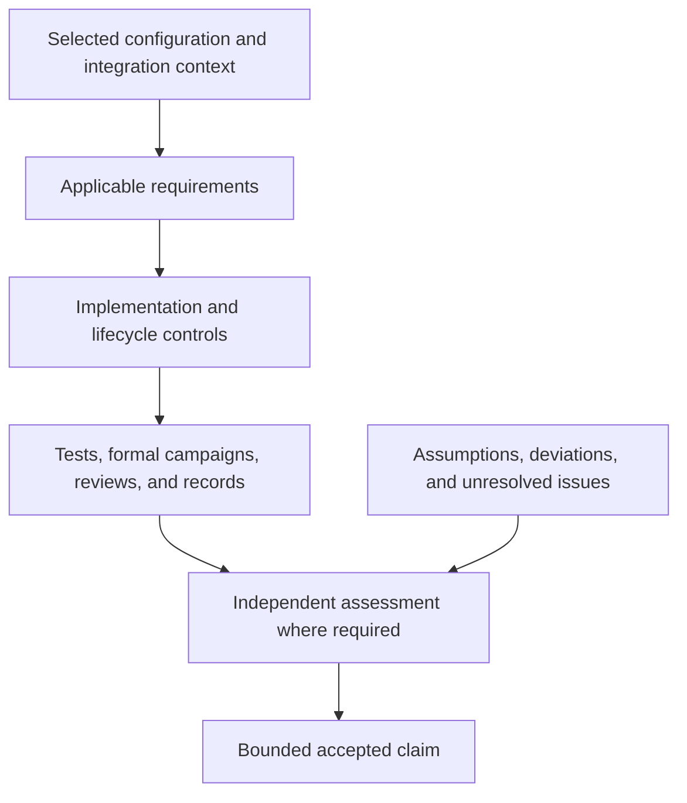

<!--
SPDX-FileCopyrightText: 2026 Rafael V. Volkmer <rafael.v.volkmer@gmail.com>
SPDX-License-Identifier: GPL-3.0-only
-->

# C Compliance and Assurance Standard

Use this standard to plan, develop, verify, release and maintain a configuration of **libmemalloc** that supplies
credible engineering evidence to a regulated or contract-controlled software integration. It covers the common
software lifecycle and the automotive, medical, aviation, defense, maritime, industrial, nuclear, space, mining
and **railway** profiles.

Develop one controlled engineering process. Reuse evidence where its assumptions remain valid. Add the requirements,
methods, independence, documentation and acceptance activities required by each selected sector. Do not treat the
union of standard names as a certification, or the most demanding-looking integrity label as an equivalence rule.

This standard defines proposed project policy. Product conformity remains unassessed.

This document contains original project controls and a public-source applicability catalogue. It does **not**
reproduce the licensed normative texts, complete their clause-level assessment, certify the organization, qualify
an implementation, or approve any product for regulated use. Adoption and evidence acceptance require the records
defined below. No test, proof, audit, independent review or certification of libmemalloc is claimed by this document.

The document license applies to its original text, not to the external standards and publications linked here.
Their respective owners retain their rights. Obtain authorized copies for actual contractual conformity work.

<a id="rule-index"></a>

<details>
<summary><strong>On this page</strong></summary>

- [Scope, precedence and review records](#governance)
- [Assurance model and terminology](#assurance-model)
- [Component configurations and sector profiles](#configuration-profiles)
- [Standards and scheme catalogue](#standards-catalogue)
- [Development workflow and acceptance gates](#workflow)
- [Project controls](#controls)
- [Appendix A. Conceptual crosswalk and evidence reuse](#appendix-a-crosswalk)
- [Appendix B. Railway profile and acceptance boundary](#appendix-b-rail)
- [Appendix C. Controlled record templates](#appendix-c-records)
- [Appendix D. Allocator verification portfolio](#appendix-d-verification)
- [Appendix E. Candidate verification tools and evidence limits](#appendix-e-tools)
- [Appendix F. Proposed repository and evidence organization](#appendix-f-layout)
- [Appendix G. Release package and acceptance record](#appendix-g-release)
- [Appendix H. Adoption milestones](#appendix-h-adoption)
- [Appendix I. Sources and assessment limits](#appendix-i-provenance)
- [Appendix J. Terms and abbreviations](#appendix-j-terms)
- [Links and references](#links-and-references)

<details>
<summary>Standards by domain</summary>

- [Common engineering and assurance](#catalogue-common-engineering-and-assurance)
- [Organization, secure development, language and supply
  chain](#catalogue-organization-secure-development-language-and-supply-chain)
- [Automotive](#catalogue-automotive)
- [Medical devices and healthcare](#catalogue-medical-devices-and-healthcare)
- [Civil aviation and avionics](#catalogue-civil-aviation-and-avionics)
- [Defense and military procurement](#catalogue-defense-and-military-procurement)
- [Maritime, naval and offshore integration](#catalogue-maritime-naval-and-offshore-integration)
- [Industrial automation, machinery and process safety](#catalogue-industrial-automation-machinery-and-process-safety)
- [Nuclear instrumentation and control](#catalogue-nuclear-instrumentation-and-control)
- [Space systems, launch and ground segments](#catalogue-space-systems-launch-and-ground-segments)
- [Mining and earth-moving machinery](#catalogue-mining-and-earth-moving-machinery)
- [Railway, rolling stock, signalling and rail
  infrastructure](#catalogue-railway-rolling-stock-signalling-and-rail-infrastructure)

</details>

<details>
<summary>Governance, applicability and organizational evidence</summary>

- [LMA-COMP-001: Bound every compliance claim](#lma-comp-001)
- [LMA-COMP-002: Freeze standards and transition baselines](#lma-comp-002)
- [LMA-COMP-003: Make applicability a reviewed engineering decision](#lma-comp-003)
- [LMA-COMP-004: Close the normative-reference and contract inventory](#lma-comp-004)
- [LMA-COMP-005: Control tailoring, deviations and exemptions](#lma-comp-005)
- [LMA-COMP-006: Resolve cross-standard conflicts explicitly](#lma-comp-006)
- [LMA-COMP-007: Assign competent and accountable roles](#lma-comp-007)
- [LMA-COMP-008: Demonstrate required independence](#lma-comp-008)
- [LMA-COMP-009: Maintain organizational quality evidence](#lma-comp-009)
- [LMA-COMP-010: Keep TISAX and ISMS scope separate from product claims](#lma-comp-010)
- [LMA-COMP-011: Protect confidential and controlled evidence](#lma-comp-011)
- [LMA-COMP-012: Control suppliers and inherited components](#lma-comp-012)
- [LMA-COMP-013: Preserve document identity and change history](#lma-comp-013)

</details>

<details>
<summary>Requirements, risks and component integration contracts</summary>

- [LMA-COMP-014: Specify verifiable allocation contracts](#lma-comp-014)
- [LMA-COMP-015: Define supplier and integrator responsibilities](#lma-comp-015)
- [LMA-COMP-016: Analyze allocator failures and their system effects](#lma-comp-016)
- [LMA-COMP-017: Model threats and resource-abuse paths](#lma-comp-017)
- [LMA-COMP-018: Review safety and security interactions](#lma-comp-018)
- [LMA-COMP-019: Allocate risk acceptance to the competent authority](#lma-comp-019)
- [LMA-COMP-020: Plan the component reuse or qualification route](#lma-comp-020)

</details>

<details>
<summary>Allocator architecture and implementation boundaries</summary>

- [LMA-COMP-021: Make feature separation real in the build](#lma-comp-021)
- [LMA-COMP-022: Qualify the actual language and platform profile](#lma-comp-022)
- [LMA-COMP-023: Inherit the approved language and module rules](#lma-comp-023)
- [LMA-COMP-024: Preserve ports, adapters and module independence](#lma-comp-024)
- [LMA-COMP-025: Prevent hidden allocator and runtime fallbacks](#lma-comp-025)
- [LMA-COMP-026: Define region and object ownership separately](#lma-comp-026)
- [LMA-COMP-027: Verify size arithmetic before state changes](#lma-comp-027)
- [LMA-COMP-028: Respect alignment, provenance and valid object access](#lma-comp-028)
- [LMA-COMP-029: Make failures transactional to the stated extent](#lma-comp-029)
- [LMA-COMP-030: Specify realloc, zero-size and zero-initialization semantics](#lma-comp-030)
- [LMA-COMP-031: Limit invalid-pointer and misuse-detection claims](#lma-comp-031)
- [LMA-COMP-032: Control initialization and publication](#lma-comp-032)
- [LMA-COMP-033: Require quiescent and ownership-safe shutdown](#lma-comp-033)
- [LMA-COMP-034: Specify concurrency under the actual memory model](#lma-comp-034)
- [LMA-COMP-035: Bound progress rather than merely naming an algorithm](#lma-comp-035)
- [LMA-COMP-036: Declare ISR, signal and reentrancy restrictions](#lma-comp-036)
- [LMA-COMP-037: Separate logical domains from enforced isolation](#lma-comp-037)
- [LMA-COMP-038: Budget all persistent and transient resources](#lma-comp-038)
- [LMA-COMP-039: Enforce the selected dynamic-allocation policy](#lma-comp-039)
- [LMA-COMP-040: Include the whole call in timing contracts](#lma-comp-040)
- [LMA-COMP-041: Specify fragmentation guarantees and their limits](#lma-comp-041)
- [LMA-COMP-042: Keep garbage collection optional and scoped](#lma-comp-042)
- [LMA-COMP-043: Verify collector reachability and mutator contracts](#lma-comp-043)
- [LMA-COMP-044: Control adaptive policies and compiler optimization independently](#lma-comp-044)
- [LMA-COMP-045: Control zeroization, diagnostics and observability](#lma-comp-045)
- [LMA-COMP-046: Make platform-provider behavior explicit](#lma-comp-046)
- [LMA-COMP-047: Qualify language bindings, ABIs and WebAssembly separately](#lma-comp-047)
- [LMA-COMP-048: Record hardware fault and platform assumptions](#lma-comp-048)

</details>

<details>
<summary>Reviews, testing and verification evidence</summary>

- [LMA-COMP-049: Review source changes against their engineering impact](#lma-comp-049)
- [LMA-COMP-050: Maintain an explicit static-analysis enforcement matrix](#lma-comp-050)
- [LMA-COMP-051: Fuzz valid payloads and allocation-state sequences](#lma-comp-051)
- [LMA-COMP-052: Separate change, periodic and release verification gates](#lma-comp-052)
- [LMA-COMP-053: Derive unit tests from observable contracts](#lma-comp-053)
- [LMA-COMP-054: Verify component integration and complete use sequences](#lma-comp-054)
- [LMA-COMP-055: Check allocator invariants over state transitions](#lma-comp-055)
- [LMA-COMP-056: Isolate fault injection from invalid C execution](#lma-comp-056)
- [LMA-COMP-057: Verify concurrency beyond repeated stress runs](#lma-comp-057)
- [LMA-COMP-058: Stress heap, stack, CPU and execution resources separately](#lma-comp-058)
- [LMA-COMP-059: Require complete disposition of requirements coverage](#lma-comp-059)
- [LMA-COMP-060: Select structural coverage by the adopted assurance profile](#lma-comp-060)
- [LMA-COMP-061: State exactly what a formal proof establishes](#lma-comp-061)
- [LMA-COMP-062: Expose model-checking bounds and abstractions](#lma-comp-062)
- [LMA-COMP-063: Retain independent differential and metamorphic checks](#lma-comp-063)
- [LMA-COMP-064: Treat sanitizer instrumentation as a scoped detector](#lma-comp-064)
- [LMA-COMP-065: Justify host-to-target evidence reuse](#lma-comp-065)
- [LMA-COMP-066: Report latency distributions with reproducible measurement contracts](#lma-comp-066)
- [LMA-COMP-067: Justify worst-case timing independently of percentiles](#lma-comp-067)
- [LMA-COMP-068: Validate test oracles against the allocation contract](#lma-comp-068)
- [LMA-COMP-069: Make a failure reproducible without retaining unnecessary secrets](#lma-comp-069)
- [LMA-COMP-070: Close changes with risk-based regression evidence](#lma-comp-070)

</details>

<details>
<summary>Tools, configuration and trusted delivery</summary>

- [LMA-COMP-071: Inventory the complete engineering toolchain](#lma-comp-071)
- [LMA-COMP-072: Determine tool confidence from intended use and credit](#lma-comp-072)
- [LMA-COMP-073: Control the interpretation of automated evidence](#lma-comp-073)
- [LMA-COMP-074: Preserve supply-chain identity and build provenance](#lma-comp-074)
- [LMA-COMP-075: Treat AI assistance as controlled untrusted output](#lma-comp-075)
- [LMA-COMP-076: Freeze reproducible configurations, not just version tags](#lma-comp-076)
- [LMA-COMP-077: Protect CI trust boundaries and release permissions](#lma-comp-077)
- [LMA-COMP-078: Approve releases only against explicit acceptance criteria](#lma-comp-078)
- [LMA-COMP-079: Deliver an evidence package linked to the actual artifact](#lma-comp-079)
- [LMA-COMP-080: Publish a configuration-specific integration and safety manual](#lma-comp-080)
- [LMA-COMP-081: Preserve configuration identity through packaging and bindings](#lma-comp-081)
- [LMA-COMP-082: Operate a vulnerability intake and coordinated response process](#lma-comp-082)
- [LMA-COMP-083: Use corrective and preventive action for systemic causes](#lma-comp-083)
- [LMA-COMP-084: Justify reuse, service history and prior evidence explicitly](#lma-comp-084)
- [LMA-COMP-085: Plan long-term maintenance and obsolescence before delivery](#lma-comp-085)
- [LMA-COMP-086: Audit process effectiveness without gaming metrics](#lma-comp-086)
- [LMA-COMP-087: Use claim wording that matches accepted evidence](#lma-comp-087)

</details>

<details>
<summary>Sector-specific integration profiles</summary>

- [LMA-COMP-088: Allocate automotive safety obligations before claiming suitability](#lma-comp-088)
- [LMA-COMP-089: Keep Automotive SPICE, APQP and TISAX in their proper scopes](#lma-comp-089)
- [LMA-COMP-090: Support the medical manufacturer lifecycle and risk argument](#lma-comp-090)
- [LMA-COMP-091: Plan aviation acceptance and verification credit explicitly](#lma-comp-091)
- [LMA-COMP-092: Derive defense obligations from the actual contract and platform](#lma-comp-092)
- [LMA-COMP-093: Address maritime class and equipment responsibilities](#lma-comp-093)
- [LMA-COMP-094: Select the industrial functional-safety route by application](#lma-comp-094)
- [LMA-COMP-095: Use the nuclear category and acceptance route supplied by the integrator](#lma-comp-095)
- [LMA-COMP-096: Keep ECSS and NASA assurance routes separately traceable](#lma-comp-096)
- [LMA-COMP-097: Distinguish mining machine safety from general industrial use](#lma-comp-097)

</details>

<details>
<summary>Rail-specific acceptance and lifecycle controls</summary>

- [LMA-COMP-098: Establish a rail baseline for the actual railway application](#lma-comp-098)
- [LMA-COMP-099: Allocate RAMS requirements to allocator behavior](#lma-comp-099)
- [LMA-COMP-100: Select rail software methods and tool treatment by allocated integrity](#lma-comp-100)
- [LMA-COMP-101: Contribute a bounded component argument to signalling safety cases](#lma-comp-101)
- [LMA-COMP-102: Treat rail communication buffers as part of the allocated interface](#lma-comp-102)
- [LMA-COMP-103: Integrate rail cybersecurity with safety and maintenance](#lma-comp-103)
- [LMA-COMP-104: Keep railway QMS and IRIS evidence separate from software safety](#lma-comp-104)
- [LMA-COMP-105: Control rail application data, deployment and long-term modifications](#lma-comp-105)

</details>

<details>
<summary>Cross-sector closure and adoption</summary>

- [LMA-COMP-106: Reuse evidence through explicit cross-sector arguments](#lma-comp-106)
- [LMA-COMP-107: Complete jurisdiction, customer and product obligations explicitly](#lma-comp-107)
- [LMA-COMP-108: Adopt capability in stages without weakening the claim boundary](#lma-comp-108)
- [LMA-COMP-109: Validate policy, record schemas and traceability links](#lma-comp-109)
- [LMA-COMP-110: Block unsupported assurance claims rather than invent evidence](#lma-comp-110)

</details>

</details>

---

<a id="governance"></a>

## Scope, precedence and review records

### Document ownership and relationship to the language guides

The writing model follows the project's [C Code Standard][lma-standard], [C Module Architecture][lma-architecture]
and [Common C Pitfalls][lma-pitfalls]: stable identifiers, explicit classifications, scoped obligations, reviewable
requirements, failure reasoning and evidence limits. The [repository EditorConfig][lma-editorconfig] remains the
formatting authority for the destination path.

This document owns **compliance planning, lifecycle evidence, assessment interfaces and release-claim governance**.
The C Code Standard owns language-level implementation policy. C Module Architecture owns module boundaries,
ports, adapters, composition and lifetime contracts. Common C Pitfalls remains an informative failure catalogue.
Do not create competing naming, SESE, pointer, error, atomic or module rules here. Resolve a conflict through an
approved change to the appropriate owner, not by silently weakening either document.

Use `LMA-COMP-NNN` for controls in this document and `LMA-REF-NNN` for catalogue entries. Existing `LMA-CORE-*`,
`LMA-GC-*`, `LMA-TEST-*`, `CSTYLE-*`, `CMOD-*`, `CPIT-*` and `CPERF-*` identifiers retain their existing meanings.
`LMA_` remains the project symbol prefix; this document does not rename public APIs or establish a parallel C ABI.
Do not reintroduce the obsolete `LMM_` / `lmm_` project naming through copied examples.

### Requirement words and classification

**Must**, **must not**, **shall**, **shall not** and imperative statements inside a control express project
requirements once this policy and its applicable profile have been approved. **Should** expresses a review
expectation; a departure requires a recorded rationale. **May** grants permission within the stated scope.
A requirement's class explains its purpose, not its severity or whether an external standard mandates its wording.

The classes are `PROCESS`, `QUALITY`, `ASSURANCE`, `CONFIGURATION`, `SAFETY`, `SECURITY`, `CORRECTNESS`,
`ARCHITECTURE`, `PORTABILITY`, `ANALYZABILITY`, `PERFORMANCE` and `PROJECT_POLICY`. Several classes may apply to
one control. These are project
categories; they are not ASILs, SILs, software safety classes, tool categories or certification levels.

The catalogue and conceptual crosswalk are **informative selection aids**. A control's related sources identify
relevant subject matter. They do not assert that the source contains the control verbatim or establishes exactly
the same obligation. A binding external obligation requires a separately approved record identifying the adopted
edition, clause/objective, applicability, interpretation and evidence.

### Precedence and incompatible obligations

Applicable law, regulatory decisions, contract requirements, the agreed assessment basis, language/platform
semantics and approved project contracts must be reconciled together. An internal reviewer cannot waive law,
change an authority's certification basis or make undefined C behavior defined. A contract does not automatically
supply a technically valid implementation strategy.

Where two baselines conflict, record the conflict, alternatives and competent approval authority. Use a separate
configuration, obtain an accepted permitted deviation, change the design or exclude the unsupported use.
Do not resolve a conflict merely by selecting the numerically higher integrity label. Keep the accepted sector
route intact; a reviewed reuse argument is different from claiming that every standard is interchangeable.

### Deviation and non-applicability records

A deviation record identifies the control and external obligations affected, exact product configuration,
reason, alternatives, risk, compensating controls, evidence, owner, approver, validity limit and review trigger.
The record must distinguish an internal policy exception from a deviation permitted by an external scheme.
A rule that does not permit deviation cannot be bypassed through this project's exception mechanism.

A `NOT_APPLICABLE` disposition requires scope-based reasoning and approval. Missing tooling, insufficient time,
unsupported architecture, absent reviewers or missing licensed text are **gaps**, not non-applicability.
A retirement date or a relevant change automatically triggers reconsideration; an exception never silently
propagates to every future release.

### Examples and record templates

All examples are **illustrative records**, not completed audit evidence, executable CI configuration, verified
implementations or accepted qualification data. `null`, empty evidence sets and `PENDING` deliberately represent
unresolved information. An adopted release must not pass its gates while required fields remain unresolved.
The templates define information to retain; equivalent controlled storage is allowed when traceability,
authorization, immutability and export remain available.

---

<a id="assurance-model"></a>

## Assurance model and terminology



Keep formal campaign inputs under `tests/formal/` and generated analysis results
under `.cache/build/formal/`. Apply the
[C Formal Verification Standard](test/c-tests-formal.md) before assigning proof
credit to a result. Tool execution alone does not establish an accepted claim.

### Five separate objects of evaluation

An organizational QMS or ISMS concerns an organization and its defined scope. A process assessment concerns how
work is performed and managed. Component verification concerns a particular implementation and configuration.
Sector integration concerns the component's contribution to a system. Product approval concerns the complete
product, its intended use and the responsible authority or customer. These are different objects and must not
be represented by a single green compliance badge. See the linked [ISO certification explanation][iso-certification],
[TISAX source][source-tisax] and the relevant sector catalogue records.

A useful evidence boundary is:

```text
intended use + jurisdiction + contract + allocated integrity requirements
                                  |
                                  v
               approved applicability and tailoring baseline
                                  |
                                  v
              common lifecycle + selected sector obligations
                                  |
                                  v
        exact source + configuration + tools + platform + assumptions
                                  |
                                  v
             requirements <-> design <-> implementation
                                  |
                                  v
             verification results + limits + anomaly disposition
                                  |
                                  v
         component evidence package -> integrator -> product acceptance
```

### Integrity and assurance labels are not conversions

Keep ISO 26262 ASILs, IEC 61508 SIL/systematic-capability concepts, railway integrity classifications, aviation
software levels, IEC 62304 software safety classes, nuclear categories, NASA software classes, machinery
performance levels and IEC 62443 security levels in their own context. A table converting ASIL D to DAL A to
SIL 4 to medical Class C would hide different allocation methods, assumptions, objectives and acceptance routes.
Record the actual values assigned by the responsible system process instead.

### What an assurance argument must establish

The project argument is: **the stated implementation, under the stated assumptions, satisfies the stated
requirements to the extent supported by the stated evidence**. This is intentionally narrower than “safe in
all systems.” [ISO/IEC/IEEE 15026-2][source-15026] supplies an assurance-case structure; it does not supply the
missing evidence or determine the truth of a claim.

For an allocator, the argument must distinguish valid-input correctness, behavior under specified failures,
detection of selected misuse, resistance to stated threats and integration-level safety. A mathematical proof
under a single-thread model does not establish concurrent correctness. Host tests do not establish timing on
a microcontroller. Testing one optimized binary does not establish the behavior of a different compiler build.

### Evidence state and claim state

Keep execution outcomes (`PASS`, `FAIL`, `ERROR`, `NOT_RUN`, `BLOCKED`) separate from evidence review states
(`PLANNED`, `PRODUCED`, `REVIEWED`, `ACCEPTED`, `INVALIDATED`). A passing execution may still have an incorrect
oracle, insufficient scope or unacceptable tool assumptions. `ACCEPTED` requires an identified acceptance
scope and approver; it is not inferred from successful CI.

Keep external assessment status separate again. `PROJECT_VERIFIED`, `EXTERNALLY_ASSESSED` and
`PRODUCT_ACCEPTED` are distinct, scoped statements, not automatic successive badges. The initial state of all
product claims in this document is `NOT_ASSESSED`.

---

<a id="configuration-profiles"></a>

## Component configurations and sector profiles

Select two independent dimensions: a **technical configuration** describing the allocator and a **sector profile**
describing its intended assurance context. A sector name is not a compiler option; a compiler option is not a
safety classification.

| Technical profile | Required boundary |
| --- | --- |
| `LMA_PROFILE_RESTRICTED` | Explicit resources, allocation policy, required bounds and minimal features. |
| `LMA_PROFILE_GENERAL` | Documented concurrency, platform adapters and optimizations within their verified scope. |
| `LMA_PROFILE_MANAGED` | Explicit GC/managed-memory features with separate lifecycle and verification obligations. |
| `LMA_PROFILE_EXPERIMENTAL` | Research features and hypotheses, excluded from inherited restricted-profile claims. |

These names are **proposed configuration identifiers**, not a statement that build options already exist.
A project may implement equivalent names through its approved configuration schema. `RESTRICTED` does not mean
certified; it describes the intended evidence boundary.

Select a separate allocation policy: `INITIALIZATION_ONLY`, `FIXED_CAPACITY_RUNTIME`, `BOUNDED_RUNTIME` or
`GENERAL_RUNTIME`. Fixed-capacity pools can still implement dynamic allocation. Do not describe them as
non-dynamic merely because the backing bytes were reserved earlier. The allowed policy must be agreed against
the actual requirements and approved standard baseline.

GC, compaction, adaptive policies, background maintenance, remote frees, callbacks, thread registration,
platform memory acquisition and compiler-generated runtime helpers belong in the feature manifest. An operation
that falls back to GC or another allocator during OOM changes the behavior and evidence boundary. The restricted
manual profile must not gain such behavior silently.

The architecture must preserve the already planned provider/consumer separation: core, arena and optional GC
are composed through defined contracts and adapters, with explicit ownership and lifetimes. This policy does not
turn GC into a mandatory core dependency or replace those SDDs with a monolithic “certified” variant.

---

<a id="standards-catalogue"></a>

## Standards and assessment catalogue

This catalogue covers the central references considered for the requested sectors. It is **not** an exhaustive
list of every applicable law, national adoption, equipment-specific standard, customer requirement or normative
reference incorporated by another document. G0 must close that project-specific inventory.

Each entry supplies a public publisher, standards-body, scheme-owner or government reference. Catalogue metadata
and public scope statements were used to select the references. The full normative texts and their complete
amendment sets were not audited. A link to a series or portal is explicitly a discovery entry, not a completed
edition selection. References with pending edition selection block a conformity claim that depends on them.

Publication, supersession, national adoption, transition deadline and contractual adoption are different facts.
Freeze them separately. Do not infer that a publication's copyright year is its edition year, or that a future
stability date guarantees unchanged technical content. Drafts and future applicability dates are identified below.

<a id="catalogue-common-engineering-and-assurance"></a>

### Common engineering and assurance

---

<a id="lma-ref-001"></a>

#### ISO/IEC/IEEE 12207

**Subject:** Software life cycle processes. **Evaluation scope:** Software lifecycle.

**Edition/status record:** 2026; published. The 2017 edition is a legacy contractual baseline.

**Project applicability:** Use as the common process framework. Identify activities, responsibilities, inputs,
outputs and changes; do not infer a prescribed waterfall model.

**Source:** [ISO/IEC/IEEE 12207 — publisher, scheme or official catalogue record][source-12207].

---

<a id="lma-ref-002"></a>

#### ISO/IEC/IEEE 15288

**Subject:** System life cycle processes. **Evaluation scope:** System integration.

**Edition/status record:** 2023.

**Project applicability:** Obtain allocated system requirements, operational assumptions and integration
responsibilities from the product organization.

**Source:** [ISO/IEC/IEEE 15288 — publisher, scheme or official catalogue record][source-15288].

---

<a id="lma-ref-003"></a>

#### ISO/IEC/IEEE 29148

**Subject:** Requirements engineering. **Evaluation scope:** Requirements.

**Edition/status record:** 2018; the catalogue identifies a successor under development.

**Project applicability:** Specify observable allocation, deallocation, failure, resource and interface
contracts; control derived requirements. A draft successor is not an adopted publication.

**Source:** [ISO/IEC/IEEE 29148 — publisher, scheme or official catalogue record][source-29148].

---

<a id="lma-ref-004"></a>

#### ISO/IEC/IEEE 42010

**Subject:** Architecture description. **Evaluation scope:** Architecture.

**Edition/status record:** 2022.

**Project applicability:** Describe concerns, viewpoints, ownership, configuration and decisions. An
architecture document is not proof of the implementation.

**Source:** [ISO/IEC/IEEE 42010 — publisher, scheme or official catalogue record][source-42010].

---

<a id="lma-ref-005"></a>

#### ISO/IEC/IEEE 15289

**Subject:** Content of life-cycle information items. **Evaluation scope:** Documentation.

**Edition/status record:** 2019.

**Project applicability:** Define required information and its configuration, rather than producing duplicate
files for every standard. Review mappings to newer lifecycle editions.

**Source:** [ISO/IEC/IEEE 15289 — publisher, scheme or official catalogue record][source-15289].

---

<a id="lma-ref-006"></a>

#### IEEE 730

**Subject:** Software Quality Assurance Processes. **Evaluation scope:** Quality assurance.

**Edition/status record:** 2026; published 2026-08-21.

**Project applicability:** Plan assurance activities, findings and closure. The publisher describes alignment
with 12207:2017; adoption alongside 12207:2026 requires a reviewed mapping.

**Source:** [IEEE 730 — publisher, scheme or official catalogue record][source-730].

---

<a id="lma-ref-007"></a>

#### IEEE 1012

**Subject:** System, Software, and Hardware Verification and Validation. **Evaluation scope:** Verification and
validation.

**Edition/status record:** 2024; the linked IEEE supersession record identifies replacement of 1012-2016.

**Project applicability:** Define V&V rigor and independence for the selected integrity context. Obtain the
adopted 2024 text before completing clause-level mapping.

**Source:** [IEEE 1012 — publisher, scheme or official catalogue record][source-1012].

---

<a id="lma-ref-008"></a>

#### IEEE 828

**Subject:** Configuration Management in Systems and Software Engineering. **Evaluation scope:** Legacy
configuration reference.

**Edition/status record:** 2012; IEEE catalogue status: Inactive-Reserved.

**Project applicability:** Retain only where explicitly selected as a legacy/supporting reference. Do not label
it an active current standard or substitute it for sector configuration requirements.

**Source:** [IEEE 828 — publisher, scheme or official catalogue record][source-828].

---

<a id="lma-ref-009"></a>

#### ISO/IEC/IEEE 29119-1

**Subject:** Software testing — General concepts. **Evaluation scope:** Testing concepts.

**Edition/status record:** 2022.

**Project applicability:** Use consistent terminology and distinguish test design, execution, evidence and
acceptance.

**Source:** [ISO/IEC/IEEE 29119-1 — publisher, scheme or official catalogue record][source-29119-1].

---

<a id="lma-ref-010"></a>

#### ISO/IEC/IEEE 29119-2

**Subject:** Software testing — Test processes. **Evaluation scope:** Testing process.

**Edition/status record:** 2021.

**Project applicability:** Plan, monitor and control testing, environments, incidents and completion.

**Source:** [ISO/IEC/IEEE 29119-2 — publisher, scheme or official catalogue record][source-29119-2].

---

<a id="lma-ref-011"></a>

#### ISO/IEC/IEEE 29119-3

**Subject:** Software testing — Test documentation. **Evaluation scope:** Test information.

**Edition/status record:** 2021.

**Project applicability:** Identify plans, specifications, procedures, results and incident records without
equating a template with evidence.

**Source:** [ISO/IEC/IEEE 29119-3 — publisher, scheme or official catalogue record][source-29119-3].

---

<a id="lma-ref-012"></a>

#### ISO/IEC/IEEE 29119-4

**Subject:** Software testing — Test techniques. **Evaluation scope:** Test design.

**Edition/status record:** 2021.

**Project applicability:** Select techniques justified by requirements and risks; add allocator-specific
properties and adversarial sequences as project controls.

**Source:** [ISO/IEC/IEEE 29119-4 — publisher, scheme or official catalogue record][source-29119-4].

---

<a id="lma-ref-013"></a>

#### ISO/IEC/IEEE 16085

**Subject:** Life cycle processes — Risk management. **Evaluation scope:** Engineering risk.

**Edition/status record:** 2021.

**Project applicability:** Track technical, supply, schedule and assurance risks separately from product hazard
acceptance.

**Source:** [ISO/IEC/IEEE 16085 — publisher, scheme or official catalogue record][source-16085].

---

<a id="lma-ref-014"></a>

#### ISO/IEC/IEEE 15939

**Subject:** Measurement process. **Evaluation scope:** Measurement.

**Edition/status record:** 2017.

**Project applicability:** Define metric meaning, measurement method, uncertainty, population and decision
criteria before collecting numbers.

**Source:** [ISO/IEC/IEEE 15939 — publisher, scheme or official catalogue record][source-15939].

---

<a id="lma-ref-015"></a>

#### ISO/IEC 25010

**Subject:** SQuaRE — Product quality model. **Evaluation scope:** Product quality.

**Edition/status record:** 2023.

**Project applicability:** Derive measurable quality requirements. The model is not an allocator certification
scheme.

**Source:** [ISO/IEC 25010 — publisher, scheme or official catalogue record][source-25010].

---

<a id="lma-ref-016"></a>

#### ISO/IEC/IEEE 15026-2

**Subject:** Systems and software assurance — Assurance case. **Evaluation scope:** Assurance argument.

**Edition/status record:** 2022.

**Project applicability:** Organize claims, context, argument and evidence. Argument structure does not itself
establish the truth of a safety or security claim.

**Source:** [ISO/IEC/IEEE 15026-2 — publisher, scheme or official catalogue record][source-15026].

---

<a id="lma-ref-017"></a>

#### IEC 60812

**Subject:** Failure modes and effects analysis (FMEA and FMECA). **Evaluation scope:** Failure analysis.

**Edition/status record:** 2018.

**Project applicability:** Analyze allocator failure modes, effects, detection limits and mitigations. Do not
manufacture software failure probabilities from hardware reliability tables.

**Source:** [IEC 60812 — publisher, scheme or official catalogue record][source-60812].

---

<a id="catalogue-organization-secure-development-language-and-supply-chain"></a>

### Organization, secure development, language and supply chain

---

<a id="lma-ref-018"></a>

#### ISO 9001

**Subject:** Quality management systems — Requirements. **Evaluation scope:** Organization.

**Edition/status record:** 2026 published; migration from an adopted 2015 baseline remains a controlled
decision.

**Project applicability:** Maintain the organizational QMS and transition record. A library repository does not
acquire QMS certification by containing this document.

**Source:** [ISO 9001 — publisher, scheme or official catalogue record][source-9001].

---

<a id="lma-ref-019"></a>

#### ISO/IEC/IEEE 90003

**Subject:** Guidelines for applying ISO 9001:2015 to computer software. **Evaluation scope:** QMS guidance.

**Edition/status record:** 2018; confirmed in 2025.

**Project applicability:** Use software guidance in its stated 2015 context; record the gap analysis when
adopting ISO 9001:2026.

**Source:** [ISO/IEC/IEEE 90003 — publisher, scheme or official catalogue record][source-90003].

---

<a id="lma-ref-020"></a>

#### ISO/IEC 27001

**Subject:** Information security management systems — Requirements. **Evaluation scope:** Organization and
information.

**Edition/status record:** 2022; record applicable amendments in the adopted baseline.

**Project applicability:** Control the ISMS scope, information assets, access, risk treatment and organizational
evidence.

**Source:** [ISO/IEC 27001 — publisher, scheme or official catalogue record][source-27001].

---

<a id="lma-ref-021"></a>

#### ISO/IEC 27002

**Subject:** Information security controls. **Evaluation scope:** Security control guidance.

**Edition/status record:** 2022.

**Project applicability:** Select controls for people, repositories, build environments, information and
suppliers; do not make every control an API feature.

**Source:** [ISO/IEC 27002 — publisher, scheme or official catalogue record][source-27002].

---

<a id="lma-ref-022"></a>

#### TISAX / VDA ISA

**Subject:** Information-security assessment and exchange; ISA assessment catalogue. **Evaluation scope:**
Organization and assessment scope.

**Edition/status record:** ISA 6 for the current assessment-order window; ISA2027 is published and applies to
orders from 2027-01-01.

**Project applicability:** Determine assessment objectives, locations, information types and customer
requirements. A TISAX label is not certification of allocator safety or functional correctness.

**Source:** [TISAX / VDA ISA — publisher, scheme or official catalogue record][source-tisax].

---

<a id="lma-ref-023"></a>

#### IEC 62443-4-1

**Subject:** Secure product development lifecycle requirements. **Evaluation scope:** Industrial product
developer.

**Edition/status record:** 2018.

**Project applicability:** Apply the selected secure-development process to requirements, implementation,
verification, defect handling, patches and retirement.

**Source:** [IEC 62443-4-1 — publisher, scheme or official catalogue record][source-62443-4-1].

---

<a id="lma-ref-024"></a>

#### IEC 62443-4-2

**Subject:** Technical security requirements for IACS components. **Evaluation scope:** Component and
integration.

**Edition/status record:** 2019; publisher copy includes the August 2022 corrigendum.

**Project applicability:** Determine the relevant component category and allocated requirements. Do not assign a
complete component security level to a memory library without an accepted scope.

**Source:** [IEC 62443-4-2 — publisher, scheme or official catalogue record][source-62443-4-2].

---

<a id="lma-ref-025"></a>

#### ISA/IEC 62443 series

**Subject:** Industrial automation and control-system security. **Evaluation scope:** System and organization
interfaces.

**Edition/status record:** Select exact parts and editions, including system risk/design parts when allocated.

**Project applicability:** Use the official series index for 3-2, 3-3 and other selected parts. The developer,
integrator, service provider and asset owner have different obligations.

**Source:** [ISA/IEC 62443 series — publisher, scheme or official catalogue record][source-62443-family].

---

<a id="lma-ref-026"></a>

#### NIST SP 800-218

**Subject:** Secure Software Development Framework (SSDF). **Evaluation scope:** Secure development guidance.

**Edition/status record:** Version 1.1, final publication.

**Project applicability:** Use the selected SSDF practices for development governance, protection, production
and vulnerability response. Record later revisions separately.

**Source:** [NIST SP 800-218 — publisher, scheme or official catalogue record][source-ssdf].

---

<a id="lma-ref-027"></a>

#### ISO/IEC 29147

**Subject:** Vulnerability disclosure. **Evaluation scope:** Security maintenance.

**Edition/status record:** 2018.

**Project applicability:** Define reporting channels, coordination and communication for vulnerabilities.

**Source:** [ISO/IEC 29147 — publisher, scheme or official catalogue record][source-29147].

---

<a id="lma-ref-028"></a>

#### ISO/IEC 30111

**Subject:** Vulnerability handling processes. **Evaluation scope:** Security maintenance.

**Edition/status record:** 2019; successor work is not a published replacement.

**Project applicability:** Control receipt, validation, remediation, verification and closure of vulnerability
reports.

**Source:** [ISO/IEC 30111 — publisher, scheme or official catalogue record][source-30111].

---

<a id="lma-ref-029"></a>

#### ISO/IEC 5962

**Subject:** SPDX Specification V2.2.1. **Evaluation scope:** Software inventory format.

**Edition/status record:** 2021; successor listed as under development.

**Project applicability:** Use an explicitly selected SBOM schema. A newer SPDX schema must not be described as
identical to the ISO 2021 edition without a mapping.

**Source:** [ISO/IEC 5962 — publisher, scheme or official catalogue record][source-spdx].

---

<a id="lma-ref-030"></a>

#### ISO/IEC 9899

**Subject:** Programming languages — C. **Evaluation scope:** Language semantics.

**Edition/status record:** 2024 publication, commonly called C23.

**Project applicability:** Declare dialect, implementation and supported subset. No project rule, test, proof or
waiver makes undefined behavior defined.

**Source:** [ISO/IEC 9899 — publisher, scheme or official catalogue record][source-c23].

---

<a id="lma-ref-031"></a>

#### MISRA C

**Subject:** Guidelines for the use of the C language in critical systems. **Evaluation scope:** Coding
guidance.

**Edition/status record:** MISRA C:2025; verify supported language features and adopted amendments.

**Project applicability:** Build a rule-by-rule applicability and enforcement matrix from authorized text.
Resolve dynamic-allocation restrictions honestly; private allocation functions are not an automatic exemption.

**Source:** [MISRA C — publisher, scheme or official catalogue record][source-misra].

---

<a id="lma-ref-032"></a>

#### MISRA Compliance

**Subject:** Achieving compliance with MISRA coding guidelines. **Evaluation scope:** Compliance methodology.

**Edition/status record:** MISRA Compliance:2020; confirm contractual edition.

**Project applicability:** Maintain rule classification, enforcement, deviations and compliance evidence;
passing an analyzer is not a complete compliance claim.

**Source:** [MISRA Compliance — publisher, scheme or official catalogue record][source-misra-compliance].

---

<a id="lma-ref-033"></a>

#### SEI CERT C Coding Standard

**Subject:** Secure C coding guidance. **Evaluation scope:** Coding and security guidance.

**Edition/status record:** Living guidance; pin a revision or retrieval snapshot.

**Project applicability:** Map applicable memory, integer, pointer and concurrency guidance to project controls;
preserve scope and diagnostic limitations.

**Source:** [SEI CERT C Coding Standard — publisher, scheme or official catalogue record][source-cert].

---

<a id="lma-ref-034"></a>

#### ISO/IEC TS 17961

**Subject:** C secure coding rules. **Evaluation scope:** Language security and diagnostics.

**Edition/status record:** 2013; publisher catalogue records confirmation in 2024.

**Project applicability:** Use as a security-rule reference, not as a formatting guide or proof of complete tool
coverage.

**Source:** [ISO/IEC TS 17961 — publisher, scheme or official catalogue record][source-17961].

---

<a id="catalogue-automotive"></a>

### Automotive

---

<a id="lma-ref-035"></a>

#### ISO 26262 series

**Subject:** Road vehicles — Functional safety. **Evaluation scope:** Automotive safety lifecycle.

**Edition/status record:** 2018 series baseline; select applicable parts, amendments and contract edition.

**Project applicability:** Consider Part 2 management, Part 6 software, Part 8 supporting processes, Part 9
analyses and Part 10 guidance. System, hardware and adaptation parts remain integration-dependent. The linked
Part 8 catalogue also identifies related parts.

**Source:** [ISO 26262 series — publisher, scheme or official catalogue record][source-26262].

---

<a id="lma-ref-036"></a>

#### ISO 26262-6

**Subject:** Product development at the software level. **Evaluation scope:** Automotive software.

**Edition/status record:** 2018.

**Project applicability:** Trace allocated software safety requirements through architecture, implementation,
integration and verification for the accepted component scope.

**Source:** [ISO 26262-6 — publisher, scheme or official catalogue record][source-26262-6].

---

<a id="lma-ref-037"></a>

#### Automotive SPICE

**Subject:** Process Reference Model and Process Assessment Model. **Evaluation scope:** Process assessment.

**Edition/status record:** 4.1, August 2026; older assessment baselines require explicit selection.

**Project applicability:** Use actual process performance and capability evidence. An assessment result is not a
software safety integrity rating.

**Source:** [Automotive SPICE — publisher, scheme or official catalogue record][source-aspice].

---

<a id="lma-ref-038"></a>

#### Automotive SPICE for Cybersecurity

**Subject:** Cybersecurity process assessment extension. **Evaluation scope:** Cybersecurity process assessment.

**Edition/status record:** 2.0, March 2025.

**Project applicability:** Map security processes and work products alongside, not in place of,
functional-safety requirements.

**Source:** [Automotive SPICE for Cybersecurity — publisher, scheme or official catalogue record][source-aspice-cyber].

---

<a id="lma-ref-039"></a>

#### ISO/SAE 21434

**Subject:** Road vehicles — Cybersecurity engineering. **Evaluation scope:** Automotive cybersecurity.

**Edition/status record:** 2021.

**Project applicability:** Exchange assumptions, threats, allocated cybersecurity requirements and vulnerability
information with the integrator.

**Source:** [ISO/SAE 21434 — publisher, scheme or official catalogue record][source-21434].

---

<a id="lma-ref-040"></a>

#### ISO 24089

**Subject:** Road vehicles — Software update engineering. **Evaluation scope:** Update integration.

**Edition/status record:** 2023; select applicable amendments.

**Project applicability:** Specify version compatibility, update and recovery constraints. The allocator need
not implement a vehicle update service.

**Source:** [ISO 24089 — publisher, scheme or official catalogue record][source-24089].

---

<a id="lma-ref-041"></a>

#### ISO 21448

**Subject:** Road vehicles — Safety of the intended functionality. **Evaluation scope:** Conditional
system-level SOTIF.

**Edition/status record:** 2022.

**Project applicability:** Include only where an applicable system analysis allocates relevant requirements to
the library; do not confuse functional insufficiency with every implementation defect.

**Source:** [ISO 21448 — publisher, scheme or official catalogue record][source-21448].

---

<a id="lma-ref-042"></a>

#### AIAG APQP

**Subject:** Advanced Product Quality Planning. **Evaluation scope:** Customer quality planning.

**Edition/status record:** Third edition, 2024.

**Project applicability:** Map software planning, design, release preparation, validation and feedback to agreed
APQP deliverables and gates.

**Source:** [AIAG APQP — publisher, scheme or official catalogue record][source-apqp].

---

<a id="lma-ref-043"></a>

#### AIAG Control Plan

**Subject:** Control Plan manual. **Evaluation scope:** Customer quality planning.

**Edition/status record:** First standalone edition, 2024.

**Project applicability:** Define executable software checks, frequency, ownership, reaction plans and retained
evidence. Do not invent manufacturing measurements for a software-only delivery.

**Source:** [AIAG Control Plan — publisher, scheme or official catalogue record][source-control-plan].

---

<a id="lma-ref-044"></a>

#### AIAG PPAP

**Subject:** Production Part Approval Process. **Evaluation scope:** Conditional supplier approval.

**Edition/status record:** Customer-selected manual edition and submission level.

**Project applicability:** Agree which submission elements apply to a software component and how approval is
recorded. A Git release is not a PPAP approval.

**Source:** [AIAG PPAP — publisher, scheme or official catalogue record][source-ppap].

---

<a id="lma-ref-045"></a>

#### AIAG & VDA FMEA Handbook

**Subject:** Design and process failure analysis. **Evaluation scope:** Automotive quality analysis.

**Edition/status record:** Customer-selected handbook baseline.

**Project applicability:** Maintain design and development-process failure analyses with actions and evidence.
Do not equate a risk-priority metric with safety risk acceptance.

**Source:** [AIAG & VDA FMEA Handbook — publisher, scheme or official catalogue record][source-aiag-fmea].

---

<a id="lma-ref-046"></a>

#### AIAG MSA

**Subject:** Measurement Systems Analysis. **Evaluation scope:** Conditional measurement assurance.

**Edition/status record:** Customer-selected manual baseline.

**Project applicability:** Assess benchmark instrumentation and reproducibility when used for acceptance.
Justify which measurement-system concepts apply to software.

**Source:** [AIAG MSA — publisher, scheme or official catalogue record][source-msa].

---

<a id="lma-ref-047"></a>

#### AIAG SPC / applicable AIAG-VDA SPC manual

**Subject:** Statistical Process Control. **Evaluation scope:** Conditional process monitoring.

**Edition/status record:** Freeze the current customer-approved manual; this document does not assume an
unverified edition.

**Project applicability:** Apply statistics only to defined and meaningful observations. Test-pass rates and
code coverage are not automatically capable manufacturing processes.

**Source:** [AIAG SPC / applicable AIAG-VDA SPC manual — publisher, scheme or official catalogue record][source-spc].

---

<a id="lma-ref-048"></a>

#### IATF 16949 and customer-specific requirements

**Subject:** Automotive quality-management and supply-chain requirements. **Evaluation scope:** Organization and
contract.

**Edition/status record:** Select the IATF standard, Rules, sanctioned interpretations, FAQs and applicable
customer requirements.

**Project applicability:** Confirm organization/site eligibility and delivery scope. Do not assert that a
standalone software library is an IATF-certified site or product.

**Source:** [IATF 16949 and customer-specific requirements — publisher, scheme or official catalogue
record][source-iatf].

---

<a id="catalogue-medical-devices-and-healthcare"></a>

### Medical devices and healthcare

---

<a id="lma-ref-049"></a>

#### IEC 62304

**Subject:** Medical device software — Software life cycle processes. **Evaluation scope:** Medical software
lifecycle.

**Edition/status record:** 2006 + AMD1:2015; consolidated version is linked from the publisher record.

**Project applicability:** Provide software lifecycle evidence, known anomalies and maintenance data.
Medical-device validation and final release remain outside this standard's software-lifecycle scope.

**Source:** [IEC 62304 — publisher, scheme or official catalogue record][source-62304].

---

<a id="lma-ref-050"></a>

#### ISO 14971

**Subject:** Application of risk management to medical devices. **Evaluation scope:** Device risk management.

**Edition/status record:** 2019.

**Project applicability:** Obtain allocated risk controls and evaluate effects of memory failure in the medical
device, rather than assigning clinical risk from the library alone.

**Source:** [ISO 14971 — publisher, scheme or official catalogue record][source-14971].

---

<a id="lma-ref-051"></a>

#### ISO 13485

**Subject:** Medical devices — Quality management systems. **Evaluation scope:** Medical-device organization.

**Edition/status record:** 2016; control applicable amendments and regulatory adoption.

**Project applicability:** Support the manufacturer's quality and supplier controls; separate organizational
certification from component verification.

**Source:** [ISO 13485 — publisher, scheme or official catalogue record][source-13485].

---

<a id="lma-ref-052"></a>

#### IEC 81001-5-1

**Subject:** Health software and health IT systems — Security activities in the product life cycle. **Evaluation
scope:** Health-software cybersecurity.

**Edition/status record:** 2021; include applicable interpretation sheets in the baseline.

**Project applicability:** Provide security requirements, verification, vulnerability handling and lifecycle
interfaces for the selected health-software scope.

**Source:** [IEC 81001-5-1 — publisher, scheme or official catalogue record][source-81001].

---

<a id="lma-ref-053"></a>

#### IEC 82304-1

**Subject:** Health software — General requirements for product safety. **Evaluation scope:** Conditional
health-software product.

**Edition/status record:** 2016.

**Project applicability:** Evaluate applicability at the product boundary; a linked allocator is not
automatically a standalone health-software product.

**Source:** [IEC 82304-1 — publisher, scheme or official catalogue record][source-82304].

---

<a id="lma-ref-054"></a>

#### IEC 62366-1

**Subject:** Application of usability engineering to medical devices. **Evaluation scope:** Conditional device
usability.

**Edition/status record:** 2015 + AMD1:2020.

**Project applicability:** Document allocation of relevant misuse-prevention or diagnostic requirements; do not
create a fictitious clinical usability study for an internal C library.

**Source:** [IEC 62366-1 — publisher, scheme or official catalogue record][source-62366].

---

<a id="lma-ref-055"></a>

#### IEC 60601-1 series and relevant collateral/particular standards

**Subject:** Medical electrical equipment — Basic safety and essential performance. **Evaluation scope:**
Conditional equipment-level requirements.

**Edition/status record:** IEC 60601-1:2005 + AMD1:2012 + AMD2:2020; identify product-specific
collateral/particular standards.

**Project applicability:** Supply software evidence required by the equipment manufacturer. Electrical, EMC and
equipment certification are not established by allocator testing.

**Source:** [IEC 60601-1 series and relevant collateral/particular standards — publisher, scheme or official
catalogue record][source-60601].

---

<a id="lma-ref-056"></a>

#### IEC 80001-1

**Subject:** Risk management for connected health systems and infrastructure. **Evaluation scope:** Conditional
healthcare integration.

**Edition/status record:** 2021.

**Project applicability:** Support infrastructure and integration risk management where the deployed system
falls within scope.

**Source:** [IEC 80001-1 — publisher, scheme or official catalogue record][source-80001].

---

<a id="catalogue-civil-aviation-and-avionics"></a>

### Civil aviation and avionics

---

<a id="lma-ref-057"></a>

#### RTCA DO-178C / EUROCAE ED-12C

**Subject:** Software considerations in airborne systems and equipment certification. **Evaluation scope:**
Airborne software assurance.

**Edition/status record:** DO-178C, 2011; select accepted authority baseline and associated errata.

**Project applicability:** Agree the certification basis, allocated level, component boundary, evidence reuse
and integrator responsibilities. A generic library has no universal airborne approval.

**Source:** [RTCA DO-178C / EUROCAE ED-12C — publisher, scheme or official catalogue record][source-178].

---

<a id="lma-ref-058"></a>

#### RTCA DO-330 / EUROCAE ED-215

**Subject:** Software tool qualification considerations. **Evaluation scope:** Conditional tool qualification.

**Edition/status record:** Contract/authority-adopted edition.

**Project applicability:** Evaluate each tool's intended use, possible errors and verification credit before
deciding qualification activities.

**Source:** [RTCA DO-330 / EUROCAE ED-215 — publisher, scheme or official catalogue record][source-330].

---

<a id="lma-ref-059"></a>

#### RTCA DO-331 / EUROCAE ED-218

**Subject:** Model-based development and verification supplement. **Evaluation scope:** Conditional model-based
methods.

**Edition/status record:** Contract/authority-adopted edition.

**Project applicability:** Apply when model-based development or verification changes the selected assurance
objectives; not mandatory just because a model exists.

**Source:** [RTCA DO-331 / EUROCAE ED-218 — publisher, scheme or official catalogue record][source-331].

---

<a id="lma-ref-060"></a>

#### RTCA DO-332 / EUROCAE ED-217

**Subject:** Object-oriented technology and related techniques supplement. **Evaluation scope:** Conditional
implementation technology.

**Edition/status record:** Contract/authority-adopted edition.

**Project applicability:** Analyze applicable technologies and their assurance impacts; do not assume every
plain-C build requires the entire supplement.

**Source:** [RTCA DO-332 / EUROCAE ED-217 — publisher, scheme or official catalogue record][source-332].

---

<a id="lma-ref-061"></a>

#### RTCA DO-333 / EUROCAE ED-216

**Subject:** Formal methods supplement. **Evaluation scope:** Conditional formal-method credit.

**Edition/status record:** Contract/authority-adopted edition.

**Project applicability:** Record which assurance objectives receive formal-method credit, remaining tests,
proof assumptions and tool implications.

**Source:** [RTCA DO-333 / EUROCAE ED-216 — publisher, scheme or official catalogue record][source-333].

---

<a id="lma-ref-062"></a>

#### RTCA DO-278A

**Subject:** Software integrity assurance for CNS/ATM systems. **Evaluation scope:** Conditional non-airborne
aviation.

**Edition/status record:** Authority-adopted edition.

**Project applicability:** Use the correct ground-based communication/navigation/surveillance and
air-traffic-management route rather than treating all aviation software as airborne DO-178C software.

**Source:** [RTCA DO-278A — publisher, scheme or official catalogue record][source-278].

---

<a id="lma-ref-063"></a>

#### SAE ARP4754B

**Subject:** Development of civil aircraft and systems. **Evaluation scope:** Aircraft/system development.

**Edition/status record:** Revision B.

**Project applicability:** Receive allocated requirements and assumptions and return evidence of satisfaction;
verify the edition accepted by the authority.

**Source:** [SAE ARP4754B — publisher, scheme or official catalogue record][source-4754].

---

<a id="lma-ref-064"></a>

#### SAE ARP4761A

**Subject:** Safety assessment for civil aircraft, systems and equipment. **Evaluation scope:** Aircraft/system
safety assessment.

**Edition/status record:** Revision A.

**Project applicability:** Support the system safety assessment with failure behavior and integration
constraints; do not assign aircraft failure classifications within the allocator alone.

**Source:** [SAE ARP4761A — publisher, scheme or official catalogue record][source-4761].

---

<a id="lma-ref-065"></a>

#### SAE AS9115A

**Subject:** Deliverable software QMS supplement to 9100:2016. **Evaluation scope:** Aerospace/defense supplier
quality.

**Edition/status record:** Revision A, 2017; verify current contractual revision at adoption.

**Project applicability:** Supply project-quality and lifecycle records in the agreed organizational scope.

**Source:** [SAE AS9115A — publisher, scheme or official catalogue record][source-9115].

---

<a id="lma-ref-066"></a>

#### SAE AS9145

**Subject:** Aerospace APQP and PPAP requirements. **Evaluation scope:** Conditional aerospace production
planning.

**Edition/status record:** Adopt the customer-selected revision.

**Project applicability:** Map agreed development and approval deliverables. Automotive APQP artifacts require a
reviewed mapping rather than automatic aerospace acceptance.

**Source:** [SAE AS9145 — publisher, scheme or official catalogue record][source-9145].

---

<a id="lma-ref-067"></a>

#### RTCA DO-254 and DO-297

**Subject:** Airborne electronic hardware and integrated modular avionics interfaces. **Evaluation scope:**
Conditional integration, not allocator coding.

**Edition/status record:** Authority-selected editions, only where the system scope requires them.

**Project applicability:** Document hardware/platform and partitioning assumptions allocated to the library. Do
not claim hardware compliance from software V&V.

**Source:** [RTCA DO-254 and DO-297 — publisher, scheme or official catalogue record][source-aviation-hw].

---

<a id="catalogue-defense-and-military-procurement"></a>

### Defense and military procurement

---

<a id="lma-ref-068"></a>

#### MIL-STD-882E

**Subject:** System Safety. **Evaluation scope:** US defense system safety when invoked.

**Edition/status record:** Revision E, Change 1, 2023-09-27; ASSIST lists it as active.

**Project applicability:** Determine invoked tasks, software contributions to hazards and risk-acceptance
authority. Do not assume every task is mandated by a generic contract reference.

**Source:** [MIL-STD-882E — publisher, scheme or official catalogue record][source-882].

---

<a id="lma-ref-069"></a>

#### AQAP 2110

**Subject:** NATO quality assurance requirements for design, development and production. **Evaluation scope:**
Defense supplier quality.

**Edition/status record:** Contract-selected edition; confirm NATO database status and national reservations.

**Project applicability:** Define QMS and government/customer assurance access as invoked by contract.

**Source:** [AQAP 2110 — publisher, scheme or official catalogue record][source-aqap2110].

---

<a id="lma-ref-070"></a>

#### AQAP 2310

**Subject:** NATO quality requirements for aviation, space and defense suppliers. **Evaluation scope:**
Defense/aerospace supplier quality.

**Edition/status record:** Contract-selected edition; confirm NATO database status and national reservations.

**Project applicability:** Apply the appropriate procurement-quality baseline; it is not interchangeable with
AQAP 2110 in every contract.

**Source:** [AQAP 2310 — publisher, scheme or official catalogue record][source-aqap2310].

---

<a id="lma-ref-071"></a>

#### AQAP 2210

**Subject:** NATO supplementary software quality assurance requirements. **Evaluation scope:** Software-specific
procurement quality.

**Edition/status record:** Contract-selected edition, used with the applicable AQAP 2110 or 2310 baseline.

**Project applicability:** Plan software-quality assurance and deliverable evidence, including supplier and
government assurance interfaces.

**Source:** [AQAP 2210 — publisher, scheme or official catalogue record][source-aqap2210].

---

<a id="lma-ref-072"></a>

#### AQAP 2105

**Subject:** NATO requirements for deliverable quality plans. **Evaluation scope:** Conditional quality-plan
delivery.

**Edition/status record:** Contract-selected edition.

**Project applicability:** Provide the agreed contract quality plan when invoked. Do not assume public-source
development removes procurement obligations.

**Source:** [AQAP 2105 — publisher, scheme or official catalogue record][source-aqap2105].

---

<a id="catalogue-maritime-naval-and-offshore-integration"></a>

### Maritime, naval and offshore integration

---

<a id="lma-ref-073"></a>

#### IACS UR E22

**Subject:** Computer-based systems. **Evaluation scope:** Classed computer-based systems.

**Edition/status record:** Revision 3, Corrigendum 1, September 2025, shown as current in the IACS record.

**Project applicability:** Determine equipment category, software lifecycle evidence, integration tests and
society-specific implementation requirements.

**Source:** [IACS UR E22 — publisher, scheme or official catalogue record][source-e22].

---

<a id="lma-ref-074"></a>

#### IACS UR E26

**Subject:** Cyber resilience of ships. **Evaluation scope:** Ship-level cybersecurity.

**Edition/status record:** Select the current class-applicable revision, implementation date and contract scope
from the IACS register.

**Project applicability:** Allocate ship-level security assumptions and update/incident interfaces; do not
classify a library as an entire ship.

**Source:** [IACS UR E26 — publisher, scheme or official catalogue record][source-e26].

---

<a id="lma-ref-075"></a>

#### IACS UR E27

**Subject:** Cyber resilience of on-board systems and equipment. **Evaluation scope:** Equipment-level
cybersecurity.

**Edition/status record:** Select the current class-applicable revision, implementation date and contract scope
from the IACS register.

**Project applicability:** Supply component evidence and integration guidance to the equipment manufacturer;
determine which capabilities belong outside the allocator.

**Source:** [IACS UR E27 — publisher, scheme or official catalogue record][source-e27].

---

<a id="lma-ref-076"></a>

#### IEC 60092-504

**Subject:** Electrical installations in ships — Automation, control and instrumentation. **Evaluation scope:**
Essential-service equipment integration.

**Edition/status record:** 2026, fifth edition; published 2026-04-17.

**Project applicability:** Trace applicable programmable-equipment requirements to the library and to the
complete equipment verification.

**Source:** [IEC 60092-504 — publisher, scheme or official catalogue record][source-60092].

---

<a id="catalogue-industrial-automation-machinery-and-process-safety"></a>

### Industrial automation, machinery and process safety

---

<a id="lma-ref-077"></a>

#### IEC 61508 series, especially Part 3

**Subject:** Functional safety of E/E/PE safety-related systems — Software requirements. **Evaluation scope:**
Generic functional-safety route.

**Edition/status record:** 2010 series/Part 3 edition 2; record any adopted successor explicitly.

**Project applicability:** Plan software safety lifecycle, systematic capability, techniques, tools and
integration information in the accepted scope. Select related parts rather than assessing Part 3 in isolation.

**Source:** [IEC 61508 series, especially Part 3 — publisher, scheme or official catalogue record][source-61508].

---

<a id="lma-ref-078"></a>

#### IEC 61511 series

**Subject:** Safety instrumented systems for the process industry. **Evaluation scope:** Process-industry system
integration.

**Edition/status record:** Part 1:2016 + AMD1:2017; select remaining relevant parts.

**Project applicability:** Distinguish embedded library development from SIS application programming and
operator obligations.

**Source:** [IEC 61511 series — publisher, scheme or official catalogue record][source-61511].

---

<a id="lma-ref-079"></a>

#### IEC 62061

**Subject:** Safety of machinery — Functional safety of safety-related control systems. **Evaluation scope:**
Machinery control-system route.

**Edition/status record:** 2021 + AMD1:2024 + AMD2:2026.

**Project applicability:** Identify allocated software requirements, required integrity and validation
responsibilities for the selected machine architecture.

**Source:** [IEC 62061 — publisher, scheme or official catalogue record][source-62061].

---

<a id="lma-ref-080"></a>

#### ISO 13849-1 / EN ISO 13849-1

**Subject:** Safety-related parts of control systems — General principles for design. **Evaluation scope:**
Machinery control-system route.

**Edition/status record:** 2023; linked DIN record identifies the ISO and EN editions.

**Project applicability:** Follow the selected category/performance-level design context; do not convert a
library test result directly into a machine performance level.

**Source:** [ISO 13849-1 / EN ISO 13849-1 — publisher, scheme or official catalogue record][source-13849-1].

---

<a id="lma-ref-081"></a>

#### ISO 13849-2

**Subject:** Safety-related parts of control systems — Validation. **Evaluation scope:** Machinery validation.

**Edition/status record:** 2012; revision work does not constitute a published replacement.

**Project applicability:** Provide evidence needed for validation of allocated software behavior and the
integrated safety-related control system.

**Source:** [ISO 13849-2 — publisher, scheme or official catalogue record][source-13849-2].

---

<a id="catalogue-nuclear-instrumentation-and-control"></a>

### Nuclear instrumentation and control

---

<a id="lma-ref-082"></a>

#### IEC 61513

**Subject:** Nuclear power plants — I&C important to safety — General requirements. **Evaluation scope:**
Nuclear overall I&C and system lifecycle.

**Edition/status record:** 2026, third edition; published 2026-06-18.

**Project applicability:** Obtain plant-derived requirements, system architecture and qualification conditions.
Review compatibility of older software-standard editions with the new general standard.

**Source:** [IEC 61513 — publisher, scheme or official catalogue record][source-61513].

---

<a id="lma-ref-083"></a>

#### IEC 60880

**Subject:** Software aspects for computer-based systems performing category A functions. **Evaluation scope:**
Nuclear category A software.

**Edition/status record:** 2006.

**Project applicability:** Provide the selected software development and qualification evidence; dynamic-memory
acceptance remains an explicit architecture and assessment decision.

**Source:** [IEC 60880 — publisher, scheme or official catalogue record][source-60880].

---

<a id="lma-ref-084"></a>

#### IEC 62138

**Subject:** Software aspects for computer-based systems performing category B or C functions. **Evaluation
scope:** Nuclear category B/C software.

**Edition/status record:** 2018.

**Project applicability:** Use the correct category-specific route, with requirements not specific to software
addressed at system level.

**Source:** [IEC 62138 — publisher, scheme or official catalogue record][source-62138].

---

<a id="lma-ref-085"></a>

#### IEC 61226

**Subject:** Categorization of functions and classification of systems. **Evaluation scope:** Nuclear
allocation/classification.

**Edition/status record:** 2020.

**Project applicability:** Obtain the function category and system classification from the plant/system process;
do not invent a conversion from ASIL or rail SIL.

**Source:** [IEC 61226 — publisher, scheme or official catalogue record][source-61226].

---

<a id="lma-ref-086"></a>

#### IEC 62645

**Subject:** Cybersecurity requirements for nuclear I&C systems. **Evaluation scope:** Nuclear cybersecurity.

**Edition/status record:** 2019.

**Project applicability:** Control allocated security requirements, lifecycle interfaces and interactions with
safety architecture.

**Source:** [IEC 62645 — publisher, scheme or official catalogue record][source-62645].

---

<a id="lma-ref-087"></a>

#### IEC 62859

**Subject:** Coordination between safety and cybersecurity. **Evaluation scope:** Nuclear safety/security
interaction.

**Edition/status record:** 2016 + AMD1:2019.

**Project applicability:** Review security updates and controls for adverse effects on deterministic behavior,
recovery and safety functions.

**Source:** [IEC 62859 — publisher, scheme or official catalogue record][source-62859].

---

<a id="catalogue-space-systems-launch-and-ground-segments"></a>

### Space systems, launch and ground segments

---

<a id="lma-ref-088"></a>

#### ECSS-E-ST-40C

**Subject:** Software engineering. **Evaluation scope:** ECSS space software.

**Edition/status record:** Revision 1, 2025-04-30.

**Project applicability:** Apply the approved tailoring to deliverable software and non-deliverable software
affecting quality. Review management and product-assurance interfaces.

**Source:** [ECSS-E-ST-40C — publisher, scheme or official catalogue record][source-ecss-e40].

---

<a id="lma-ref-089"></a>

#### ECSS-Q-ST-80C

**Subject:** Software product assurance. **Evaluation scope:** ECSS software assurance.

**Edition/status record:** Revision 2, 2025-04-30.

**Project applicability:** Maintain software product-assurance plans, evidence and reuse assessment for the
accepted project scope.

**Source:** [ECSS-Q-ST-80C — publisher, scheme or official catalogue record][source-ecss-q80].

---

<a id="lma-ref-090"></a>

#### NASA NPR 7150.2D

**Subject:** NASA Software Engineering Requirements. **Evaluation scope:** NASA project/contract applicability.

**Edition/status record:** Revision D; effective 2022-03-08; the consulted record identifies expiry 2027-03-08.

**Project applicability:** Use the actual software classification, applicability and tailoring process.
Applicability to a supplier is determined through the project/contract.

**Source:** [NASA NPR 7150.2D — publisher, scheme or official catalogue record][source-npr7150].

---

<a id="lma-ref-091"></a>

#### NASA-STD-8739.8B

**Subject:** Software Assurance and Software Safety Standard. **Evaluation scope:** NASA assurance and software
safety.

**Edition/status record:** Revision B, 2022-09-08; listed active.

**Project applicability:** Plan applicable assurance, safety and independent V&V activities without treating all
software as the same NASA class.

**Source:** [NASA-STD-8739.8B — publisher, scheme or official catalogue record][source-nasa8739].

---

<a id="catalogue-mining-and-earth-moving-machinery"></a>

### Mining and earth-moving machinery

---

<a id="lma-ref-092"></a>

#### ISO 19014 series, especially Part 4

**Subject:** Functional safety of earth-moving machinery — Software and data transmission. **Evaluation scope:**
Safety-related machine control.

**Edition/status record:** Part 4:2020 is the consulted published baseline; verify the pending second edition
before adoption.

**Project applicability:** Select the applicable family parts for risk, architecture, environment and integrity
allocation. Part 4 supplies the software/data-transmission interface.

**Source:** [ISO 19014 series, especially Part 4 — publisher, scheme or official catalogue record][source-19014].

---

<a id="lma-ref-093"></a>

#### ISO 17757

**Subject:** Autonomous and semi-autonomous machine system safety. **Evaluation scope:** Conditional autonomous
mining/earth-moving systems.

**Edition/status record:** 2019.

**Project applicability:** Receive requirements for loss of resources, degraded operation and recovery from the
autonomous-machine system analysis.

**Source:** [ISO 17757 — publisher, scheme or official catalogue record][source-17757].

---

<a id="catalogue-railway-rolling-stock-signalling-and-rail-infrastructure"></a>

### Railway, rolling stock, signalling and rail infrastructure

---

<a id="lma-ref-094"></a>

#### EN 50716

**Subject:** Railway applications — Requirements for software development. **Evaluation scope:** Railway
software development.

**Edition/status record:** 2023; identify national adoption and corrigenda separately.

**Project applicability:** Select software scope, integrity allocation, roles, methods and tools with the
integrator. Explicitly assess migration from EN 50128 and EN 50657 baselines.

**Source:** [EN 50716 — publisher, scheme or official catalogue record][source-50716].

---

<a id="lma-ref-095"></a>

#### EN 50126-1

**Subject:** Specification and demonstration of RAMS — Generic RAMS process. **Evaluation scope:** Railway
system RAMS.

**Edition/status record:** 2017 + A1:2024; confirm national consolidated publication.

**Project applicability:** Allocate reliability, availability, maintainability and safety requirements; keep
their evidence distinct.

**Source:** [EN 50126-1 — publisher, scheme or official catalogue record][source-50126-1].

---

<a id="lma-ref-096"></a>

#### EN 50126-2

**Subject:** Specification and demonstration of RAMS — Systems approach to safety. **Evaluation scope:** Railway
system safety.

**Edition/status record:** 2017 + A1:2024.

**Project applicability:** Receive hazard allocations, safety requirements and integration constraints for the
component.

**Source:** [EN 50126-2 — publisher, scheme or official catalogue record][source-50126-2].

---

<a id="lma-ref-097"></a>

#### EN 50129

**Subject:** Safety-related electronic systems for signalling. **Evaluation scope:** Conditional signalling
safety justification.

**Edition/status record:** 2026; the EVS catalogue replaces its 2018/AC:2019 adoption from 2026-06-02. Verify
contract and regulatory transitions separately.

**Project applicability:** Support generic-product/generic-application/specific-application safety arguments
only in the agreed scope; a library is not automatically an approved signalling system.

**Source:** [EN 50129 — publisher, scheme or official catalogue record][source-50129].

---

<a id="lma-ref-098"></a>

#### EN 50159

**Subject:** Safety-related communication in transmission systems. **Evaluation scope:** Conditional
safety-related rail communication.

**Edition/status record:** 2026; national publication dates differ. The NEN catalogue identifies replacement of
its 2010 baseline.

**Project applicability:** Control buffer ownership, corruption propagation, queue limits and timing assumptions
allocated by the communication design; the allocator is not a safety communication protocol.

**Source:** [EN 50159 — publisher, scheme or official catalogue record][source-50159].

---

<a id="lma-ref-099"></a>

#### CLC/TS 50701

**Subject:** Railway applications — Cybersecurity. **Evaluation scope:** Rail cybersecurity lifecycle.

**Edition/status record:** 2023 technical specification.

**Project applicability:** Coordinate security threats, supply-chain controls, maintenance and safety impacts.
It is a technical specification, not an EN with an automatically identical status.

**Source:** [CLC/TS 50701 — publisher, scheme or official catalogue record][source-50701].

---

<a id="lma-ref-100"></a>

#### IEC 62278-1

**Subject:** Railway RAMS — Generic RAMS process. **Evaluation scope:** International railway RAMS route.

**Edition/status record:** 2025.

**Project applicability:** Use the contract-selected IEC route and reviewed mapping to any EN baseline; do not
assume different publication dates imply identical text.

**Source:** [IEC 62278-1 — publisher, scheme or official catalogue record][source-62278-1].

---

<a id="lma-ref-101"></a>

#### IEC 62278-2

**Subject:** Railway RAMS — Systems approach to safety. **Evaluation scope:** International railway safety
route.

**Edition/status record:** 2025.

**Project applicability:** Coordinate the IEC railway-sector framework with IEC 62279 and IEC 62425. Avoid
imposing redundant generic IEC 61508 assessments when the accepted sector route already addresses them.

**Source:** [IEC 62278-2 — publisher, scheme or official catalogue record][source-62278-2].

---

<a id="lma-ref-102"></a>

#### IEC 62279

**Subject:** Software for railway control and protection systems. **Evaluation scope:** International railway
software route.

**Edition/status record:** 2015.

**Project applicability:** Use the selected lifecycle and technical requirements for control/protection
software; explicitly map differences from EN 50716.

**Source:** [IEC 62279 — publisher, scheme or official catalogue record][source-62279].

---

<a id="lma-ref-103"></a>

#### IEC 62425

**Subject:** Safety-related electronic systems for signalling. **Evaluation scope:** International signalling
safety route.

**Edition/status record:** 2025.

**Project applicability:** Supply evidence for the selected signalling safety justification. Functional safety
does not replace cybersecurity assessment.

**Source:** [IEC 62425 — publisher, scheme or official catalogue record][source-62425].

---

<a id="lma-ref-104"></a>

#### IEC 62280

**Subject:** Safety-related communication in transmission systems. **Evaluation scope:** Conditional
international communication route.

**Edition/status record:** 2014.

**Project applicability:** Support the communication safety argument where allocator behavior can affect
buffers, lifetimes, resource availability or latency.

**Source:** [IEC 62280 — publisher, scheme or official catalogue record][source-62280].

---

<a id="lma-ref-105"></a>

#### ISO 22163

**Subject:** Railway quality management system requirements. **Evaluation scope:** Railway supplier
organization.

**Edition/status record:** 2023; account for AMD1:2024 and its adopted national version.

**Project applicability:** Apply railway-specific QMS requirements within the organization's scope; reassess
interfaces when ISO 9001 changes rather than silently replacing its referenced edition.

**Source:** [ISO 22163 — publisher, scheme or official catalogue record][source-22163].

---

<a id="lma-ref-106"></a>

#### IRIS Certification

**Subject:** Railway quality-management assessment/certification scheme. **Evaluation scope:** Railway
organization and assessment.

**Edition/status record:** Use the current scheme and assessment rules required by the customer.

**Project applicability:** Separate IRIS certification, ISO 22163 requirements and product/software safety
evidence.

**Source:** [IRIS Certification — publisher, scheme or official catalogue record][source-iris].

---

<a id="lma-ref-107"></a>

#### EN 50128 and EN 50657

**Subject:** Legacy railway software baselines. **Evaluation scope:** Legacy maintenance and migration.

**Edition/status record:** Retained only for approved contractual/legacy scopes; consult the EN 50716
replacement record and national transition arrangements.

**Project applicability:** Record the exact old edition, amendments, accepted maintenance route and migration
gap assessment; do not claim immediate universal legal replacement.

**Source:** [EN 50128 and EN 50657 — publisher, scheme or official catalogue record][source-rail-legacy].

---

<a id="lma-ref-108"></a>

#### IEC / EN IEC 63452 project

**Subject:** Railway cybersecurity successor work. **Evaluation scope:** Standards watch only.

**Edition/status record:** Draft/watch item in the consulted national catalogue; not a published mandatory
replacement in this policy.

**Project applicability:** Track publication and adoption. Do not assert conformity to a future final edition or
silently replace the adopted CLC/TS 50701 baseline.

**Source:** [IEC / EN IEC 63452 project — publisher, scheme or official catalogue record][source-63452].

---

### Catalogue interpretation and national adoption

An `EN`, `EN ISO`, `EN IEC`, `BS EN`, `DIN EN`, `NF EN`, `UNE-EN` or `ABNT NBR` reference requires its own recorded
identifier, edition and amendment set. Record an official equivalence or adoption relationship; do not infer
identical text from a similar number. A standard's publication or EN adoption does not by itself establish legal
presumption of conformity for every product and jurisdiction.

The ISO 9001:2026, IEEE 730:2026, Automotive SPICE 4.1, IEC 61513:2026, IEC 60092-504:2026, IEC 62061 AMD2:2026
and EN 50129:2026 / EN 50159:2026 references require deliberate transition decisions for older project
baselines. ISA2027 is
published but its assessment-order applicability begins on 2027-01-01. IEEE 828:2012 is retained only as a marked
inactive/legacy reference. These distinctions come from the linked catalogue records, not from an assumption
that “latest” automatically becomes the contract baseline.

---

<a id="workflow"></a>

## Unified development workflow and approval gates

The workflow is iterative. Small changes may pass through all relevant gates in one change set; major changes
may produce several controlled baselines. Work may proceed experimentally before acceptance, but no experiment
inherits release approval. The gate names and record identifiers below are project policy, not quoted sector
standard terminology.

| Gate | Required decision and controlled outputs |
| --- | --- |
| G0 — Applicability | Accept intended use, boundaries, normative baseline, tailoring and responsibilities. |
| G1 — Requirements and risk | Accept contracts, risk allocations, criteria and V&V strategy. |
| G2 — Architecture | Accept design, invariants, resources, interfaces and tool strategy. |
| G3 — Implementation | Accept traceable source, reviews, analysis, unit results and deviations. |
| G4 — Verification | Accept profile results, coverage, proofs, timing and anomaly disposition. |
| G5 — Release | Approve the claim, immutable manifest, evidence package and integration manual. |
| G6 — Maintenance | Control impacts, corrections, regression, disclosure and baseline updates. |

A gate approval identifies the inputs reviewed, approver competence and independence, unresolved items,
conditions and scope. “Approved with conditions” must state which work may continue and which claims or releases
remain prohibited. A new code, tool, ABI, feature, risk or normative-baseline change reopens affected decisions.

### Work item to release

```text
change request
  -> affected requirements / hazards / threats / contracts
  -> impact assessment and verification selection
  -> implementation + review + local evidence
  -> target/configuration evidence and independent activities as required
  -> anomaly disposition and traceability closure
  -> release authorization and signed configuration identity
  -> integrator notification and controlled maintenance
```

The impact assessment must include changes that do not edit C sources: compiler versions, options, PGO data,
linker scripts, generated tables, CMake logic, CI actions, test oracles, platform ports, requirement wording,
proof assumptions, dependency revisions and external standard editions.

### APQP and control-plan integration

For an APQP contract, map planning to G0/G1, design and development to G1–G3, preparation of the repeatable
software-delivery process to G2–G4, validation/approval to G4/G5 and feedback/corrective action to G6.
This is a **proposed software mapping**, not a claim that these gate names appear in the AIAG manuals.
Apply [APQP][source-apqp], [Control Plan][source-control-plan], [PPAP][source-ppap] and, for aerospace contracts,
[AS9145][source-9145] using customer-approved deliverable mappings.

A software control plan identifies the characteristic, test or analysis, limits, configuration, execution
frequency, responsible role, reaction to failure and evidence retained. For example, an arithmetic invariant can
have change-triggered proofs and boundary tests, while a latency requirement has target-specific measurement and
analysis. Repeated observations must not be converted into artificial process-capability numbers.

### Responsibility and independence

Use defined roles for engineering, verification, quality assurance, safety/security analysis, configuration,
release authorization, customer integration and external assessment. One person may hold compatible roles where
the accepted profile permits it. Where independence is required, satisfy the actual separation and authority
requirements; a second account, a bot approval or an AI review is not another independent person.

`CODEOWNERS` can route reviews, but does not by itself establish competence, authorization or independence.
Record actual appointments, training, review participation and decisions. Neither a solo-maintainer project nor
an open-source delivery may claim organizational arrangements that do not exist.

---

<a id="controls"></a>

## Project controls

All controls below have **project-derived wording**. Their applicability conditions are mandatory once the
corresponding profile is adopted. Related-source links support the selection and interpretation work; exact
external clause/objective mappings are separate controlled records.

<a id="controls-governance-applicability-and-organizational-evidence"></a>

### Governance, applicability and organizational evidence

<a id="lma-comp-001"></a>

#### LMA-COMP-001: Bound every compliance claim

**Class:** ASSURANCE / PROCESS. **Obligation:** project requirement.

**Applicability:** All releases and external statements.

Identify the software version, source revision, technical configuration, platform, intended use, applicable
standards, evidence scope, exclusions and accepting party for every claim. Keep organizational certification,
process assessment, component verification and product acceptance separate. The absence of a specific
certification requirement does not authorize an unsupported safety claim.

**Rationale:** A shared project name does not identify the object that was evaluated.

**Required evidence:** Approved claim register; exact claim text; linked assessment or verification records;
documented exclusions.

**Related sources:** [ISO/IEC/IEEE 12207](#lma-ref-001); [ISO/IEC/IEEE 15026-2](#lma-ref-016); [TISAX / VDA
ISA](#lma-ref-022).

---

<a id="lma-comp-002"></a>

#### LMA-COMP-002: Freeze standards and transition baselines

**Class:** CONFIGURATION / ASSURANCE. **Obligation:** project requirement.

**Applicability:** Each selected sector and contract.

Record identifier, part, edition, amendments, corrigenda, language, national adoption, status, source, retrieval
date and adopted copy identity. Record contractual effective dates separately from publication dates. Review new
editions and withdrawn documents for impact; do not replace the baseline automatically because a catalogue
changes.

**Rationale:** Uncontrolled normative changes invalidate the meaning of a completed crosswalk.

**Required evidence:** Standards register; authorized-copy inventory; transition impact and approval; watch-list
dispositions.

**Related sources:** [ISO/IEC/IEEE 12207](#lma-ref-001); [IEEE 730](#lma-ref-006); [IEEE 828](#lma-ref-008); [EN
50716](#lma-ref-094).

---

<a id="lma-comp-003"></a>

#### LMA-COMP-003: Make applicability a reviewed engineering decision

**Class:** PROCESS / ASSURANCE. **Obligation:** project requirement.

**Applicability:** Every candidate requirement.

Classify applicability as APPLICABLE, CONDITIONALLY_APPLICABLE, NOT_APPLICABLE or PENDING. Identify the
responsible organization and affected configurations. Explain conditions and exclusions. Keep unverified text,
missing tools and missing evidence in PENDING or gap records; never convert them into NOT_APPLICABLE solely to
pass a gate.

**Rationale:** Applicability describes scope, not the convenience of satisfying an obligation.

**Required evidence:** Reviewed applicability matrix with rationale, owner, approval and change triggers.

**Related sources:** [ISO/IEC/IEEE 29148](#lma-ref-003); [ISO/IEC/IEEE 16085](#lma-ref-013); [ISO/IEC/IEEE
15289](#lma-ref-005).

---

<a id="lma-comp-004"></a>

#### LMA-COMP-004: Close the normative-reference and contract inventory

**Class:** PROCESS / ASSURANCE. **Obligation:** project requirement.

**Applicability:** Before G0 approval for a conformity claim.

Inspect the adopted documents and contract for incorporated normative references, customer requirements,
national provisions, interpretation sheets and equipment-specific standards. Add the applicable obligations to
the register. Determine whether an incorporated reference is dated or undated and resolve it under the accepted
contract. This catalogue alone must not be treated as the complete inventory.

**Rationale:** A central software standard may depend on other requirements that its public abstract does not
enumerate.

**Required evidence:** Reference-closure review; contract obligations register; unresolved-source log; approved
assessment basis.

**Related sources:** [ISO/IEC/IEEE 12207](#lma-ref-001); [ISO/IEC/IEEE 15288](#lma-ref-002); [ISO 26262
series](#lma-ref-035); [EN 50716](#lma-ref-094).

---

<a id="lma-comp-005"></a>

#### LMA-COMP-005: Control tailoring, deviations and exemptions

**Class:** ASSURANCE / QUALITY. **Obligation:** project requirement.

**Applicability:** Any departure or scoped exclusion.

Identify the exact requirement and the authority permitted to approve a departure. Distinguish project-policy
exceptions from externally permitted deviations. Record alternatives, technical rationale, residual risk,
compensating evidence, limits and expiry or review triggers. Prohibit retroactive blanket waivers and exception
inheritance across unrelated profiles.

**Rationale:** An internal waiver cannot change an external requirement or a language semantic constraint.

**Required evidence:** Approved deviation record; permission basis; affected configurations; compensating
verification and expiry review.

**Related sources:** [MISRA Compliance](#lma-ref-032); [ECSS-E-ST-40C](#lma-ref-088);
[ECSS-Q-ST-80C](#lma-ref-089).

---

<a id="lma-comp-006"></a>

#### LMA-COMP-006: Resolve cross-standard conflicts explicitly

**Class:** ARCHITECTURE / ASSURANCE. **Obligation:** project requirement.

**Applicability:** Combined standards or sector profiles.

Record conflicting allocation policies, independence requirements, tool acceptance routes, lifecycle outputs and
language restrictions. Resolve them by an accepted common implementation, separate configurations, permitted
tailoring or an excluded use. Do not convert between ASIL, SIL, DAL, medical classes, nuclear categories, NASA
classes or security levels through an invented equivalence table.

**Rationale:** Shared engineering concepts do not make acceptance criteria identical.

**Required evidence:** Conflict register; decision record; profile split or accepted crosswalk; integrator
approval.

**Related sources:** [ISO 26262 series](#lma-ref-035); [IEC 61508 series, especially Part 3](#lma-ref-077);
[RTCA DO-178C / EUROCAE ED-12C](#lma-ref-057); [IEC 62304](#lma-ref-049); [IEC 62279](#lma-ref-102).

---

<a id="lma-comp-007"></a>

#### LMA-COMP-007: Assign competent and accountable roles

**Class:** PROCESS / QUALITY. **Obligation:** project requirement.

**Applicability:** Organization and each project.

Identify engineering, verification, quality, safety, security, configuration and release responsibilities.
Record competence criteria, actual appointments and authority to reject work. Establish handovers and substitute
roles. A repository permission or CODEOWNERS entry must not be the sole evidence that a person is competent or
authorized.

**Rationale:** Work-product ownership and assurance authority are different responsibilities.

**Required evidence:** Role matrix; competence and appointment records; review assignments; escalation
procedure.

**Related sources:** [IEEE 730](#lma-ref-006); [IEEE 1012](#lma-ref-007); [ISO 9001](#lma-ref-018).

---

<a id="lma-comp-008"></a>

#### LMA-COMP-008: Demonstrate required independence

**Class:** ASSURANCE / QUALITY. **Obligation:** project requirement.

**Applicability:** Profiles with independence obligations.

Determine the required technical, managerial, organizational or other separation from the adopted baseline.
Assign actual independent participants and preserve their decisions and findings. A bot, second account or AI
model must not be counted as an independent human reviewer. Where separation cannot be provided, record the gap
and block the affected assurance claim.

**Rationale:** Independence is an arrangement of responsibility and judgment, not a count of approvals.

**Required evidence:** Independence plan; conflict-of-interest record; reviewer identity; review findings and
closure.

**Related sources:** [IEEE 1012](#lma-ref-007); [RTCA DO-178C / EUROCAE ED-12C](#lma-ref-057); [IEC
62279](#lma-ref-102); [NASA-STD-8739.8B](#lma-ref-091).

---

<a id="lma-comp-009"></a>

#### LMA-COMP-009: Maintain organizational quality evidence

**Class:** QUALITY / PROCESS. **Obligation:** project requirement.

**Applicability:** Applicable QMS and supplier scopes.

Maintain controlled procedures, management responsibilities, internal audits, corrective actions, competence,
supplier controls and records within the defined QMS scope. Document software-specific adaptation and baseline
transitions. Do not claim ISO 9001, ISO 13485, ISO 22163 or IATF organizational certification on the strength of
this Markdown file.

**Rationale:** An implementation repository covers only part of the organizational evidence.

**Required evidence:** QMS scope; process records; audit results; management decisions; genuine certification
records when applicable.

**Related sources:** [ISO 9001](#lma-ref-018); [ISO/IEC/IEEE 90003](#lma-ref-019); [ISO 13485](#lma-ref-051);
[ISO 22163](#lma-ref-105); [IATF 16949 and customer-specific requirements](#lma-ref-048).

---

<a id="lma-comp-010"></a>

#### LMA-COMP-010: Keep TISAX and ISMS scope separate from product claims

**Class:** SECURITY / PROCESS. **Obligation:** project requirement.

**Applicability:** Organizations handling in-scope customer information.

Define locations, information classes, assets, customer obligations and assessment objectives. Control access,
endpoints, backups, incident handling and supplier access in that scope. Record the ISA version applicable to
the assessment order. Publish TISAX or ISMS claims only in their actual assessed scope and under applicable
sharing rules.

**Rationale:** Information-security assurance does not establish allocator functional correctness or safety
integrity.

**Required evidence:** ISMS scope and risk treatment; assessment scope/version; access reviews; incident and
backup records.

**Related sources:** [ISO/IEC 27001](#lma-ref-020); [ISO/IEC 27002](#lma-ref-021); [TISAX / VDA
ISA](#lma-ref-022).

---

<a id="lma-comp-011"></a>

#### LMA-COMP-011: Protect confidential and controlled evidence

**Class:** SECURITY / CONFIGURATION. **Obligation:** project requirement.

**Applicability:** Public and restricted development information.

Classify source, traces, crash dumps, customer data, proof inputs and reports before storing or sharing them.
Use separate access boundaries for restricted material. Sanitize minimized fuzz cases without losing the failure
mechanism. Do not upload licensed standards, export-controlled data, secrets or customer artifacts to public
repositories or external services without authorization.

**Rationale:** Evidence needed for an audit can contain information unsuitable for public distribution.

**Required evidence:** Information classification; access and sharing approvals; sanitized reproducer record;
retention and disposal rules.

**Related sources:** [ISO/IEC 27001](#lma-ref-020); [ISO/IEC 27002](#lma-ref-021); [AQAP 2110](#lma-ref-069).

---

<a id="lma-comp-012"></a>

#### LMA-COMP-012: Control suppliers and inherited components

**Class:** QUALITY / SECURITY. **Obligation:** project requirement.

**Applicability:** Dependencies, tools, ports and contributed code.

Inventory deliverable, build, test and proof dependencies separately. Record origin, license, version, changes,
known issues and support status. Define supplier responsibilities and available evidence. Treat a
zero-runtime-dependency core as distinct from a dependency-free development process. Contributions must pass the
same applicable acceptance controls as maintainer code.

**Rationale:** Compiler helpers, scripts and evidence tools can affect the product without appearing as a linked
library.

**Required evidence:** Dependency/SBOM records; supplier evaluation; contribution reviews; license and
provenance checks.

**Related sources:** [ISO/IEC/IEEE 12207](#lma-ref-001); [ISO/IEC 5962](#lma-ref-029); [NIST SP
800-218](#lma-ref-026).

---

<a id="lma-comp-013"></a>

#### LMA-COMP-013: Preserve document identity and change history

**Class:** CONFIGURATION / ANALYZABILITY. **Obligation:** project requirement.

**Applicability:** All engineering and compliance information.

Give requirements, controls, risks, tests, proofs, evidence and decisions stable identifiers. Preserve retired
identifiers and supersession links. Record approved revisions and exact source baselines. Keep generated indexes
derived from the authoritative records; do not let generated prose become an unreviewed competing requirement
source.

**Rationale:** Traceability fails when the same identifier silently changes meaning.

**Required evidence:** Identifier registry; revision history; automated reference validation; approved
information-item schema.

**Related sources:** [ISO/IEC/IEEE 15289](#lma-ref-005); [ISO/IEC/IEEE 29148](#lma-ref-003); [ISO/IEC/IEEE
12207](#lma-ref-001).

---

<a id="controls-requirements-risks-and-component-integration-contracts"></a>

### Requirements, risks and component integration contracts

<a id="lma-comp-014"></a>

#### LMA-COMP-014: Specify verifiable allocation contracts

**Class:** CORRECTNESS / ANALYZABILITY. **Obligation:** project requirement.

**Applicability:** Every public operation and observable feature.

Specify preconditions, postconditions, allowed states, ownership, sizes, alignment, failure effects,
concurrency, resources and platform assumptions. Separate required behavior from implementation suggestions.
Give each requirement an acceptance criterion and verification method. Trace derived requirements back to the
design or risk decision that introduced them.

**Rationale:** A function name and a benchmark do not define behavior at boundaries or on failure.

**Required evidence:** Reviewed requirements; API contracts; acceptance criteria; bidirectional trace links.

**Related sources:** [ISO/IEC/IEEE 29148](#lma-ref-003); [ISO/IEC/IEEE 42010](#lma-ref-004).

---

<a id="lma-comp-015"></a>

#### LMA-COMP-015: Define supplier and integrator responsibilities

**Class:** ARCHITECTURE / ASSURANCE. **Obligation:** project requirement.

**Applicability:** Every integration profile.

Document the component boundary, permitted calling contexts, caller obligations, environmental guarantees,
memory provision, synchronization, diagnostics and response to exhaustion. Identify requirements verified by the
library supplier and those requiring system testing. Obtain integrator disposition of assumptions before
claiming suitability for a specific system.

**Rationale:** A component cannot demonstrate conditions that only its host system controls.

**Required evidence:** Interface/control agreement; integration assumptions; acceptance tests and allocation
matrix.

**Related sources:** [ISO/IEC/IEEE 15288](#lma-ref-002); [ISO 26262 series](#lma-ref-035); [IEC 61508 series,
especially Part 3](#lma-ref-077); [IEC 62304](#lma-ref-049).

---

<a id="lma-comp-016"></a>

#### LMA-COMP-016: Analyze allocator failures and their system effects

**Class:** SAFETY / CORRECTNESS. **Obligation:** project requirement.

**Applicability:** Safety-related or fault-sensitive integrations.

Analyze overlap, lost allocations, use-after-release propagation, metadata corruption, exhaustion, excessive
latency, deadlock, initialization failure and unsafe recovery. Distinguish local failures from system hazards
and identify detectable versus undetectable conditions. Derive prevention and containment requirements. Do not
invent software random-failure rates from successful test counts.

**Rationale:** The hazard depends on what the surrounding system does with the memory service.

**Required evidence:** FMEA and other selected analyses; hazard allocations; derived requirements; residual-risk
decisions.

**Related sources:** [IEC 60812](#lma-ref-017); [ISO 14971](#lma-ref-050); [MIL-STD-882E](#lma-ref-068); [EN
50126-2](#lma-ref-096).

---

<a id="lma-comp-017"></a>

#### LMA-COMP-017: Model threats and resource-abuse paths

**Class:** SECURITY / CORRECTNESS. **Obligation:** project requirement.

**Applicability:** Security-relevant configurations.

Identify trust boundaries, attacker-controlled sizes and sequences, integer hazards, resource exhaustion,
information disclosure, metadata exposure and concurrency abuse. Separate hostile but valid API use from
violations of preconditions. Define prevention, detection and containment guarantees only for mechanisms
included in the configuration.

**Rationale:** Memory hardening cannot be claimed solely because ordinary allocation tests pass.

**Required evidence:** Threat model; abuse cases; security requirements; hardening configuration and test
records.

**Related sources:** [NIST SP 800-218](#lma-ref-026); [IEC 62443-4-1](#lma-ref-023); [ISO/SAE
21434](#lma-ref-039); [IEC 81001-5-1](#lma-ref-052).

---

<a id="lma-comp-018"></a>

#### LMA-COMP-018: Review safety and security interactions

**Class:** SAFETY / SECURITY. **Obligation:** project requirement.

**Applicability:** Configurations with both obligations.

Analyze whether authentication, logging, zeroization, hardening, patches, recovery or resource quotas affect
deadlines, availability or safe states. Analyze whether safety recovery exposes secrets or bypasses security
boundaries. Resolve conflicting requirements with the integrator; neither discipline may silently override the
other.

**Rationale:** A security improvement can change timing or failure behavior needed by a safety function.

**Required evidence:** Joint impact analysis; allocated constraints; combined fault/threat tests; approved
tradeoffs.

**Related sources:** [IEC 62859](#lma-ref-087); [ISO/SAE 21434](#lma-ref-039); [CLC/TS 50701](#lma-ref-099).

---

<a id="lma-comp-019"></a>

#### LMA-COMP-019: Allocate risk acceptance to the competent authority

**Class:** SAFETY / ASSURANCE. **Obligation:** project requirement.

**Applicability:** Unresolved risks and deviations.

Record the system context, severity or integrity allocation method, responsible risk owner and authorized
acceptance role. Engineers may recommend mitigations, but must not accept product-level residual risk on behalf
of an unidentified manufacturer or authority. Preserve known limitations even when a release is accepted for a
narrower scope.

**Rationale:** Component maintainers do not automatically own clinical, aircraft, plant or vehicle risk
acceptance.

**Required evidence:** Risk acceptance record; authority basis; restrictions and linked safety/security manual
statements.

**Related sources:** [ISO 14971](#lma-ref-050); [MIL-STD-882E](#lma-ref-068); [SAE ARP4761A](#lma-ref-064); [IEC
61513](#lma-ref-082).

---

<a id="lma-comp-020"></a>

#### LMA-COMP-020: Plan the component reuse or qualification route

**Class:** ASSURANCE / PROCESS. **Obligation:** project requirement.

**Applicability:** Existing, third-party or independently developed software.

Determine the applicable reuse, component qualification, SOUP, pre-existing software or comparable route from
the adopted sector baseline. Record which development evidence is available and which must be recovered or
supplemented. Do not call a component proven in use, qualified or developed as a safety element out of context
without the corresponding accepted scope and evidence.

**Rationale:** Reuse is an assessment activity; a public repository is not a qualification package.

**Required evidence:** Reuse plan; evidence availability assessment; gap closure; accepted assumptions and
anomaly evaluation.

**Related sources:** [ISO 26262 series](#lma-ref-035); [IEC 62304](#lma-ref-049); [RTCA DO-178C / EUROCAE
ED-12C](#lma-ref-057); [ECSS-Q-ST-80C](#lma-ref-089); [EN 50716](#lma-ref-094).

---

<a id="controls-allocator-architecture-and-implementation-boundaries"></a>

### Allocator architecture and implementation boundaries

<a id="lma-comp-021"></a>

#### LMA-COMP-021: Make feature separation real in the build

**Class:** ARCHITECTURE / CONFIGURATION. **Obligation:** project requirement.

**Applicability:** All technical profiles.

Identify included modules, features, providers, generated data and symbols in the build manifest. Prevent
experimental or managed-memory code from entering a restricted configuration through defaults, fallback paths or
transitive dependencies. Verify the selected composition at source, link and binary levels as appropriate.

**Rationale:** A documentation-only profile cannot isolate code that remains linked or reachable.

**Required evidence:** Feature manifest; include/symbol dependency checks; link map; negative configuration
tests.

**Related sources:** [ISO/IEC/IEEE 42010](#lma-ref-004); [ISO 26262-6](#lma-ref-036); [IEC 61508 series,
especially Part 3](#lma-ref-077).

---

<a id="lma-comp-022"></a>

#### LMA-COMP-022: Qualify the actual language and platform profile

**Class:** PORTABILITY / CORRECTNESS. **Obligation:** project requirement.

**Applicability:** Every supported compiler/target combination.

Declare C23 or the explicitly approved compatibility subset, compiler, linker, ABI, integer widths, byte size,
alignment, endianness, extensions and options. Reject unsupported required features. Verify analyzer/prover
support for the selected semantics. A C17 compatibility profile must be explicit and separately evidenced, not a
silent downgrade.

**Rationale:** Identical source text can be interpreted or compiled differently under another implementation
profile.

**Required evidence:** Platform qualification record; feature probes; diagnostic policy; build and verification
matrix.

**Related sources:** [ISO/IEC 9899](#lma-ref-030); [ISO/IEC TS 17961](#lma-ref-034); [MISRA C](#lma-ref-031).

---

<a id="lma-comp-023"></a>

#### LMA-COMP-023: Inherit the approved language and module rules

**Class:** ANALYZABILITY / ARCHITECTURE. **Obligation:** project requirement.

**Applicability:** Source, scripts and generated code under project control.

Apply the approved language guides for naming, formatting, SESE/control flow, error handling, assertions and
atomic abstractions. Use the owning module guide for ports and lifetime composition. Record approved baseline
revisions and deviations. Do not introduce conflicting local coding conventions under the heading of compliance.

**Rationale:** One implementation rule should have one authoritative owner.

**Required evidence:** Pinned guide revisions; code reviews; configured check reports; approved deviations.

**Related sources:** [ISO/IEC 9899](#lma-ref-030); [MISRA Compliance](#lma-ref-032); [IEEE 730](#lma-ref-006).

---

<a id="lma-comp-024"></a>

#### LMA-COMP-024: Preserve ports, adapters and module independence

**Class:** ARCHITECTURE / CORRECTNESS. **Obligation:** project requirement.

**Applicability:** Core, arena, GC and platform compositions.

Keep provider and consumer contracts independent of peer-private structures and peer implementation headers.
Validate mandatory callbacks before publishing an instance. Specify which party owns the callback table and
context and how long they remain valid. Keep adapters alive until outstanding operations and region grants
terminate.

**Rationale:** Composition through an interface does not remove ownership or shutdown obligations.

**Required evidence:** Dependency-graph checks; binding tests; lifecycle contracts; adapter failure and shutdown
tests.

**Related sources:** [ISO/IEC/IEEE 42010](#lma-ref-004); [ISO/IEC/IEEE 29148](#lma-ref-003).

---

<a id="lma-comp-025"></a>

#### LMA-COMP-025: Prevent hidden allocator and runtime fallbacks

**Class:** ARCHITECTURE / CORRECTNESS. **Obligation:** project requirement.

**Applicability:** Core and restricted configurations.

The core must not silently use a global malloc-family allocator, external allocator or unapproved runtime
service. Acquire backing memory only through the approved provider contract. Treat system calls, virtual memory
and hosted runtime facilities as explicit adapter behavior. Verify compiler-emitted helper dependencies in the
final build; do not infer a freestanding result from source includes alone.

**Rationale:** A fallback can invalidate resource bounds, isolation and deployment assumptions precisely on an
error path.

**Required evidence:** Allowed-symbol policy; binary dependency scan; provider failure tests; adapter inventory.

**Related sources:** [ISO/IEC 9899](#lma-ref-030); [IEC 61508 series, especially Part 3](#lma-ref-077); [ISO
26262-6](#lma-ref-036).

---

<a id="lma-comp-026"></a>

#### LMA-COMP-026: Define region and object ownership separately

**Class:** CORRECTNESS / ARCHITECTURE. **Obligation:** project requirement.

**Applicability:** All allocation and region-transfer operations.

Identify each backing-region grant, owner, allocation domain, bounds and unique return event. Distinguish a
region grant from an interior allocated object. Prevent simultaneous reuse by two consumers. Define cross-thread
and cross-module transfer rules and ensure reclamation waits for the required external ownership conditions.

**Rationale:** Confusing the lifetime of a region with the lifetime of an object permits double ownership and
premature reuse.

**Required evidence:** Ownership model; conservation invariants; lifecycle/property tests; grant-return trace
checks.

**Related sources:** [ISO/IEC/IEEE 29148](#lma-ref-003); [ISO/IEC/IEEE 42010](#lma-ref-004); [SEI CERT C Coding
Standard](#lma-ref-033).

---

<a id="lma-comp-027"></a>

#### LMA-COMP-027: Verify size arithmetic before state changes

**Class:** CORRECTNESS / SECURITY. **Obligation:** project requirement.

**Applicability:** Size, alignment and metadata calculations.

Check representability of addition, multiplication, alignment rounding, index conversion and metadata overhead
before using the result or committing state. Reject impossible requests according to the failure contract.
Verify boundary values for the actual integer widths. Do not use a debug assertion as the only runtime
validation of external input.

**Rationale:** A wrapped size can turn a large request into an undersized successful allocation.

**Required evidence:** Arithmetic contracts; boundary tests; static/formal results; unchanged-state checks on
rejection.

**Related sources:** [ISO/IEC 9899](#lma-ref-030); [ISO/IEC TS 17961](#lma-ref-034); [SEI CERT C Coding
Standard](#lma-ref-033).

---

<a id="lma-comp-028"></a>

#### LMA-COMP-028: Respect alignment, provenance and valid object access

**Class:** CORRECTNESS / PORTABILITY. **Obligation:** project requirement.

**Applicability:** Memory layout and pointer operations.

Define supported alignments and verify every returned pointer and metadata access. Avoid invalid pointer
ordering, subtraction, casts, aliasing and object-lifetime assumptions. Any implementation-defined address
technique requires an explicit target contract and verification. Do not describe platform-specific pointer
arithmetic as universally portable C.

**Rationale:** Correct numerical addresses do not alone establish defined access under the selected C semantics.

**Required evidence:** Layout contracts; alignment tests; compiler-profile rationale; analyses and approved
implementation assumptions.

**Related sources:** [ISO/IEC 9899](#lma-ref-030); [ISO/IEC TS 17961](#lma-ref-034); [MISRA C](#lma-ref-031).

---

<a id="lma-comp-029"></a>

#### LMA-COMP-029: Make failures transactional to the stated extent

**Class:** CORRECTNESS / SAFETY. **Obligation:** project requirement.

**Applicability:** All operations with recoverable failure.

Specify what is unchanged, consumed, returned or partially completed on each error. Validate before publishing
success. Preserve ownership when an operation reports a non-consuming failure. Do not write an output into
storage invalidated by the same call. Ensure diagnostics do not require allocation from the failing allocator.

**Rationale:** An error code without state guarantees is insufficient for safe recovery.

**Required evidence:** Failure-state tables; injection tests; allocation ledger checks; output-pointer alias
tests.

**Related sources:** [ISO/IEC/IEEE 29148](#lma-ref-003); [ISO 26262-6](#lma-ref-036); [IEC 61508 series,
especially Part 3](#lma-ref-077).

---

<a id="lma-comp-030"></a>

#### LMA-COMP-030: Specify realloc, zero-size and zero-initialization semantics

**Class:** CORRECTNESS / PORTABILITY. **Obligation:** project requirement.

**Applicability:** APIs or adapters providing these operations.

Define size-zero behavior, failure preservation, copy extent, pointer lifetime and alignment for resize
operations. Define zero-initialization of promised payload bytes without assuming reused regions remain zero.
Check multiplication for array allocation. Distinguish the native API contract from any C-library compatibility
adapter; exclude unsupported semantics explicitly.

**Rationale:** Library naming similarity does not establish standard malloc-family behavior across dialects and
platforms.

**Required evidence:** Contract-specific tests; nonzero backing-memory fixtures; resize success/failure checks;
adapter conformance report.

**Related sources:** [ISO/IEC 9899](#lma-ref-030); [SEI CERT C Coding Standard](#lma-ref-033); [ISO/IEC/IEEE
29148](#lma-ref-003).

---

<a id="lma-comp-031"></a>

#### LMA-COMP-031: Limit invalid-pointer and misuse-detection claims

**Class:** CORRECTNESS / SECURITY. **Obligation:** project requirement.

**Applicability:** Hardening and diagnostics.

State which double frees, foreign pointers, stale handles, corrupted headers and other misuse the configuration
can detect, before what effects, and under which assumptions. Do not read arbitrary memory merely to classify an
invalid pointer. Separate undefined caller behavior from a promised diagnostic interface and from controlled
corruption-injection tests.

**Rationale:** A best-effort detector is not a guarantee of safe handling of every invalid C pointer.

**Required evidence:** Detection coverage and limitations; safe test fixtures; negative tests; documented
residual misuse risks.

**Related sources:** [ISO/IEC 9899](#lma-ref-030); [SEI CERT C Coding Standard](#lma-ref-033); [ISO/IEC TS
17961](#lma-ref-034).

---

<a id="lma-comp-032"></a>

#### LMA-COMP-032: Control initialization and publication

**Class:** CORRECTNESS / ARCHITECTURE. **Obligation:** project requirement.

**Applicability:** Instances, arenas, threads and optional services.

Define legal initialization states, parameter validation, resource acquisition, rollback and publication order.
Prevent operations on a partially initialized instance. Specify idempotence only where implemented. Ensure
initialization-only allocation policies transition through an observable, controlled operational boundary.

**Rationale:** Successful construction must establish every invariant relied upon by later operations.

**Required evidence:** Initialization state machine; partial-failure tests; publication/concurrency tests;
operational-lock tests.

**Related sources:** [ISO/IEC/IEEE 29148](#lma-ref-003); [ISO/IEC/IEEE 42010](#lma-ref-004).

---

<a id="lma-comp-033"></a>

#### LMA-COMP-033: Require quiescent and ownership-safe shutdown

**Class:** CORRECTNESS / ARCHITECTURE. **Obligation:** project requirement.

**Applicability:** Destruction, reset, detach and provider shutdown.

Stop new admissions, complete or reject in-flight work, release external ownership, drain permitted deferred
operations, return grants and then destroy providers in the documented order. A busy result must preserve the
documented live state. Cancellation, thread exit or process shutdown must not be treated as implicit proof of
safe reclamation.

**Rationale:** A destructor can create use-after-free even when every allocation path is locally correct.

**Required evidence:** Shutdown protocol; admission-race tests; delayed free/grant tests; busy-state
preservation checks.

**Related sources:** [ISO/IEC/IEEE 29148](#lma-ref-003); [ISO/IEC/IEEE 42010](#lma-ref-004); [SEI CERT C Coding
Standard](#lma-ref-033).

---

<a id="lma-comp-034"></a>

#### LMA-COMP-034: Specify concurrency under the actual memory model

**Class:** CORRECTNESS / ANALYZABILITY. **Obligation:** project requirement.

**Applicability:** Concurrent profiles.

Define synchronization, atomic operations, memory orders, publication, ABA mitigation, reclamation and
linearization where claimed. Use the approved project atomic abstraction and verify its target implementation.
Separate externally synchronized profiles from internally concurrent ones. Do not infer race freedom, lock
freedom or memory-model correctness from the presence of atomics.

**Rationale:** Atomic instructions alone do not establish a correct ownership and visibility protocol.

**Required evidence:** Concurrency design; happens-before argument; model tests; target-atomic qualification;
race and stress results.

**Related sources:** [ISO/IEC 9899](#lma-ref-030); [SEI CERT C Coding Standard](#lma-ref-033); [IEC 61508
series, especially Part 3](#lma-ref-077).

---

<a id="lma-comp-035"></a>

#### LMA-COMP-035: Bound progress rather than merely naming an algorithm

**Class:** SAFETY / ANALYZABILITY. **Obligation:** project requirement.

**Applicability:** Deadline- or progress-constrained profiles.

Identify loops, retries, scans, CAS failures, maintenance, queue drains, locks and provider operations on each
critical path. State the assumed bound and what enforces it. Distinguish lock-free, wait-free, nonblocking and
bounded response time. Exclude unbounded paths from restricted claims or provide an accepted bounding mechanism.

**Rationale:** Constant-time size-class lookup does not bound the complete allocation operation.

**Required evidence:** Path/resource bound analysis; retry and queue limits; contention evidence; declared
scheduling assumptions.

**Related sources:** [IEC 61508 series, especially Part 3](#lma-ref-077); [ISO 26262-6](#lma-ref-036); [EN
50716](#lma-ref-094).

---

<a id="lma-comp-036"></a>

#### LMA-COMP-036: Declare ISR, signal and reentrancy restrictions

**Class:** SAFETY / ARCHITECTURE. **Obligation:** project requirement.

**Applicability:** Interrupt, signal, callback and reentrant contexts.

Specify whether each operation is allowed from interrupts, asynchronous signals or callbacks and whether nested
entry is supported. Account for interrupted locks, atomic implementation, stack budget and callback recursion.
Prohibit unsupported contexts at the integration boundary; thread safety alone must not be advertised as ISR or
signal safety.

**Rationale:** An interrupted operation may hold state that another entry cannot safely reuse.

**Required evidence:** Calling-context matrix; platform tests; reentrancy tests; integration constraints.

**Related sources:** [ISO/IEC/IEEE 29148](#lma-ref-003); [ISO/IEC 9899](#lma-ref-030); [IEC 61508 series,
especially Part 3](#lma-ref-077).

---

<a id="lma-comp-037"></a>

#### LMA-COMP-037: Separate logical domains from enforced isolation

**Class:** ARCHITECTURE / SAFETY / SECURITY. **Obligation:** project requirement.

**Applicability:** Partitioned or mixed-criticality systems.

Define memory domains, quotas and ownership boundaries and show how interference is prevented or bounded.
Distinguish allocator bookkeeping separation from hardware memory protection, temporal partitioning and fault
containment. Receive MPU/MMU, scheduler and privilege assumptions from the platform. Do not claim freedom from
interference from separate arena names alone.

**Rationale:** A corrupted pointer or shared resource can cross a purely logical partition.

**Required evidence:** Interference analysis; domain tests; protection assumptions; integration-level fault
containment evidence.

**Related sources:** [ISO 26262 series](#lma-ref-035); [RTCA DO-178C / EUROCAE ED-12C](#lma-ref-057); [IEC 61508
series, especially Part 3](#lma-ref-077); [EN 50129](#lma-ref-097).

---

<a id="lma-comp-038"></a>

#### LMA-COMP-038: Budget all persistent and transient resources

**Class:** ANALYZABILITY / SAFETY. **Obligation:** project requirement.

**Applicability:** Every released profile.

Specify payload capacity, metadata, internal waste, per-thread caches, deferred queues, stack depth, temporary
buffers and optional-service overhead. Bound thread/arena counts where needed. Include startup, failure,
maintenance and shutdown paths. Make exhaustion behavior explicit and verify reserved resources remain available
for required recovery actions.

**Rationale:** A payload-only budget hides the resources most likely to fail under stress.

**Required evidence:** Resource model; measured high-water marks; static stack analysis where applicable;
exhaustion tests.

**Related sources:** [ISO/IEC/IEEE 29148](#lma-ref-003); [IEC 61508 series, especially Part 3](#lma-ref-077);
[RTCA DO-178C / EUROCAE ED-12C](#lma-ref-057).

---

<a id="lma-comp-039"></a>

#### LMA-COMP-039: Enforce the selected dynamic-allocation policy

**Class:** SAFETY / ARCHITECTURE. **Obligation:** project requirement.

**Applicability:** Restricted and sector-qualified candidates.

Select initialization-only, fixed-capacity runtime, bounded runtime or general runtime allocation explicitly.
Evaluate the policy against adopted coding and sector requirements. A custom allocator or pre-reserved arena
must not be treated as an automatic exemption from a dynamic-allocation prohibition. Verify operational-phase
restrictions and deviation permissions.

**Rationale:** The safety concern is behavior and resource predictability, not whether the function is named
malloc.

**Required evidence:** Allocation-policy decision; rule applicability; runtime transition checks; permitted
deviation or profile exclusion.

**Related sources:** [MISRA C](#lma-ref-031); [MISRA Compliance](#lma-ref-032); [IEC 61508 series, especially
Part 3](#lma-ref-077); [EN 50716](#lma-ref-094).

---

<a id="lma-comp-040"></a>

#### LMA-COMP-040: Include the whole call in timing contracts

**Class:** ANALYZABILITY / SAFETY. **Obligation:** project requirement.

**Applicability:** Timing requirements and restricted profiles.

Include lock waiting, preemption assumptions, cache/TLB effects, region provision, page faults where possible,
copy/zero work, callbacks, remote queues, maintenance and cleanup in the timing model. State limits on size and
concurrency. A bound for one internal step must not be reported as a bound for the public operation.

**Rationale:** A fast selector can be surrounded by expensive or unbounded work.

**Required evidence:** End-to-end path model; target timing evidence; configuration and environment limits;
excluded-path justification.

**Related sources:** [ISO/IEC/IEEE 15939](#lma-ref-014); [IEC 61508 series, especially Part 3](#lma-ref-077);
[RTCA DO-178C / EUROCAE ED-12C](#lma-ref-057).

---

<a id="lma-comp-041"></a>

#### LMA-COMP-041: Specify fragmentation guarantees and their limits

**Class:** CORRECTNESS / ANALYZABILITY. **Obligation:** project requirement.

**Applicability:** All allocation policies with reuse.

Define the managed region model, alignment overhead, coalescing rules, internal/external fragmentation metrics
and allocation-failure criteria. Test adversarial size/lifetime patterns. Do not require a large allocation to
succeed merely because total free bytes exceed its size; account for contiguity and the actual allocation model.
Do not move live native pointers without an explicit managed contract.

**Rationale:** Total free capacity is not the same as a suitable contiguous free region.

**Required evidence:** Fragmentation model; ledger oracle; LIFO/FIFO/random/alternating-lifetime tests;
documented compaction constraints.

**Related sources:** [ISO/IEC/IEEE 29148](#lma-ref-003); [ISO/IEC/IEEE 29119-4](#lma-ref-012).

---

<a id="lma-comp-042"></a>

#### LMA-COMP-042: Keep garbage collection optional and scoped

**Class:** ARCHITECTURE / ASSURANCE. **Obligation:** project requirement.

**Applicability:** Managed and manual profiles.

Make GC inclusion, initiation and interaction with manual allocation explicit. The restricted manual path must
not start automatic collection on ordinary allocation or OOM unless that behavior is separately specified and
accepted. Preserve the planned independent core/arena/GC contracts. A verified manual core must not confer
verification status on a collector.

**Rationale:** Collection changes timing, reachability, ownership and reclamation assumptions.

**Required evidence:** Feature and call-graph checks; manual-path OOM tests; separate managed-profile argument
and evidence.

**Related sources:** [ISO/IEC/IEEE 42010](#lma-ref-004); [ISO/IEC/IEEE 29148](#lma-ref-003); [IEC 61508 series,
especially Part 3](#lma-ref-077).

---

<a id="lma-comp-043"></a>

#### LMA-COMP-043: Verify collector reachability and mutator contracts

**Class:** CORRECTNESS / ANALYZABILITY. **Obligation:** project requirement.

**Applicability:** Configurations that include a collector.

Specify roots, root registration, object tracing, barriers, safepoints, weak references, finalizers, pinning and
movement where implemented. Verify collector/mutator synchronization, object publication and reclamation safety
under the selected C memory model. Bound pauses and deferred work where required. Exclude mechanisms not
implemented instead of supplying hypothetical evidence.

**Rationale:** Memory must not be reclaimed while a permitted client can still access it.

**Required evidence:** Collector invariants; root/barrier tests; concurrency models; pause/resource analysis;
finalizer failure tests.

**Related sources:** [ISO/IEC 9899](#lma-ref-030); [ISO/IEC/IEEE 29148](#lma-ref-003); [IEEE
1012](#lma-ref-007).

---

<a id="lma-comp-044"></a>

#### LMA-COMP-044: Control adaptive policies and compiler optimization independently

**Class:** CONFIGURATION / ANALYZABILITY. **Obligation:** project requirement.

**Applicability:** PGO, LTO, policy models and experimental heuristics.

Distinguish allocator policy training from compiler PGO. Identify policy artifacts, training data, compiler
profiles, optimizer flags and generated code in the release configuration. Freeze or constrain runtime
adaptation for profiles requiring stable bounds. Reverify changed assumptions and the final binary; an
optimization must not inherit evidence from an incompatible policy or build.

**Rationale:** Performance data and trained artifacts can change behavior without a hand-written source edit.

**Required evidence:** Optimization/policy manifests; change-impact analysis; semantic regression; resource and
timing evidence.

**Related sources:** [ISO/IEC/IEEE 12207](#lma-ref-001); [ISO/IEC/IEEE 42010](#lma-ref-004); [ISO/IEC/IEEE
15939](#lma-ref-014).

---

<a id="lma-comp-045"></a>

#### LMA-COMP-045: Control zeroization, diagnostics and observability

**Class:** SECURITY / CORRECTNESS / ANALYZABILITY. **Obligation:** project requirement.

**Applicability:** Features exposing or clearing memory information.

Specify which bytes are initialized or cleared, when, with what visibility and under which compiler guarantees.
Prevent diagnostics from leaking payloads, addresses or secrets beyond policy. Bound or disable expensive
diagnostics in the selected production profile. Debug and production variants require distinct configuration
records; runtime input validation must not disappear with assertions.

**Rationale:** Instrumentation can change timing, allocation behavior and information exposure.

**Required evidence:** Information-flow review; zeroization tests/inspection; diagnostic resource limits;
debug/release comparison.

**Related sources:** [ISO/IEC TS 17961](#lma-ref-034); [ISO/IEC 27002](#lma-ref-021); [NIST SP
800-218](#lma-ref-026).

---

<a id="lma-comp-046"></a>

#### LMA-COMP-046: Make platform-provider behavior explicit

**Class:** PORTABILITY / ARCHITECTURE. **Obligation:** project requirement.

**Applicability:** Hosted, freestanding and system-call adapters.

Specify region acquisition/return, page commitment, overcommit, decommit, address reservation, protection, NUMA
and failure semantics where relevant. A syscall-only adapter is a selected implementation profile, not a
universal platform requirement. Unsupported facilities must fail configuration or remain excluded, never
silently select another backend.

**Rationale:** Operating-system memory services can violate assumptions about availability and timing.

**Required evidence:** Provider contract; adapter qualification tests; import/symbol inventory;
unsupported-platform negative tests.

**Related sources:** [ISO/IEC/IEEE 29148](#lma-ref-003); [ISO/IEC/IEEE 15288](#lma-ref-002); [ISO/IEC
9899](#lma-ref-030).

---

<a id="lma-comp-047"></a>

#### LMA-COMP-047: Qualify language bindings, ABIs and WebAssembly separately

**Class:** PORTABILITY / CORRECTNESS. **Obligation:** project requirement.

**Applicability:** C/C++, Rust, Zig, FFI and WebAssembly integrations.

Define calling conventions, layout, ownership transfer, allocator pairing, threading, unwind/panic behavior and
lifetime across each boundary. Do not reinterpret layouts without a supported ABI contract. Verify pointer width
and linear-memory growth assumptions for WebAssembly. Equivalent APIs or algorithms in another language require
their own implementation evidence.

**Rationale:** An FFI boundary can invalidate otherwise correct native ownership assumptions.

**Required evidence:** ABI contract; binding tests; cross-language failure cases; exported-symbol checks;
per-target evidence.

**Related sources:** [ISO/IEC/IEEE 29148](#lma-ref-003); [ISO/IEC 9899](#lma-ref-030); [ISO/IEC/IEEE
42010](#lma-ref-004).

---

<a id="lma-comp-048"></a>

#### LMA-COMP-048: Record hardware fault and platform assumptions

**Class:** SAFETY / PORTABILITY. **Obligation:** project requirement.

**Applicability:** Targets subject to fault containment or environmental constraints.

Record compiler/CPU errata, atomic widths, memory barriers, cache coherence, alignment faults and reset behavior
relevant to the component. Identify assumptions about ECC, memory protection, watchdogs and upset detection.
Injection tests may verify specified responses, but must not be advertised as hardware qualification or immunity
to every memory fault.

**Rationale:** Software cannot establish environmental or hardware guarantees merely by assuming them.

**Required evidence:** Platform-assumption register; errata assessment; selected fault-injection evidence;
integrator verification items.

**Related sources:** [ISO/IEC/IEEE 15288](#lma-ref-002); [IEC 61513](#lma-ref-082);
[ECSS-E-ST-40C](#lma-ref-088); [RTCA DO-254 and DO-297](#lma-ref-067).

---

<a id="controls-reviews-testing-and-verification-evidence"></a>

### Reviews, testing and verification evidence

<a id="lma-comp-049"></a>

#### LMA-COMP-049: Review source changes against their engineering impact

**Class:** ANALYZABILITY / CORRECTNESS. **Obligation:** project requirement.

**Applicability:** Every product-affecting change.

Review requirements, architecture, code, tests, proof assumptions, build settings and integration documents
affected by the change. Identify the exact revision and reviewer. Check ownership, error paths, integer
boundaries and concurrency even when formatting checks pass. Author self-checks supplement but do not replace an
independent review required by the adopted profile.

**Rationale:** A passing pipeline does not establish that the intended behavior or the changed specification is
correct.

**Required evidence:** Change-impact record; review comments and resolutions; reviewer authorization; links to
affected requirements and evidence.

**Related sources:** [IEEE 730](#lma-ref-006); [IEEE 1012](#lma-ref-007); [ISO/IEC/IEEE 12207](#lma-ref-001).

---

<a id="lma-comp-050"></a>

#### LMA-COMP-050: Maintain an explicit static-analysis enforcement matrix

**Class:** ANALYZABILITY / SECURITY. **Obligation:** project requirement.

**Applicability:** All supported source and generated-code profiles.

Map coding rules to automated checks, manual review or justified non-applicability. Record tool version,
configuration, compile definitions, headers and supported dialect. Review findings and suppressions; link each
authorized suppression to a deviation. Analyze the intended configurations, including conditional branches
absent from the default build. Do not report tool silence as proof of compliance with every MISRA or CERT rule.

**Rationale:** Static analyzers have language, environment and diagnostic coverage limits.

**Required evidence:** Rule enforcement matrix; analysis logs; finding disposition; suppression register;
configuration coverage.

**Related sources:** [MISRA C](#lma-ref-031); [MISRA Compliance](#lma-ref-032); [SEI CERT C Coding
Standard](#lma-ref-033); [ISO/IEC TS 17961](#lma-ref-034).

---

<a id="lma-comp-051"></a>

#### LMA-COMP-051: Fuzz valid payloads and allocation-state sequences

**Class:** CORRECTNESS / SECURITY. **Obligation:** project requirement.

**Applicability:** Profiles accepting variable requests or allocation sequences.

Exercise request sizes, alignments, operation order, repeated growth/shrink, ownership domains and admitted
interleavings. Mutate only the bytes owned by a live object in valid-input campaigns. Keep metadata corruption
and caller misuse in separately identified hardening campaigns. Preserve a replayable operation trace, seed,
configuration and minimized reproducer. A timeout, harness crash or unsupported instrumentation is not a passing
run.

**Rationale:** Allocator failures frequently depend on a sequence of state transitions rather than one input
value.

**Required evidence:** Corpus policy; harness contracts; seeds and replay traces; campaign budgets; crash
triage; regression cases.

**Related sources:** [ISO/IEC/IEEE 29119-2](#lma-ref-010); [ISO/IEC/IEEE 29119-4](#lma-ref-012); [NIST SP
800-218](#lma-ref-026).

---

<a id="lma-comp-052"></a>

#### LMA-COMP-052: Separate change, periodic and release verification gates

**Class:** ANALYZABILITY / PROJECT_POLICY. **Obligation:** project requirement.

**Applicability:** CI and release orchestration.

Run bounded checks on relevant changes, longer fuzz/stress campaigns on a declared periodic schedule, and
complete profile acceptance before release. Record nightly campaign duration, machine resources, corpus revision
and completed execution, rather than assuming a schedule implies a run. Define which failures block merging,
which block release and who can approve a scoped exception. Quarantined tests remain visible gaps.

**Rationale:** Different execution budgets are useful, but evidence must reflect work completed.

**Required evidence:** Pipeline policy; run records; retry/quarantine rules; release-blocker configuration;
exception approvals.

**Related sources:** [ISO/IEC/IEEE 12207](#lma-ref-001); [IEEE 730](#lma-ref-006); [ISO/IEC/IEEE
29119-2](#lma-ref-010).

---

<a id="lma-comp-053"></a>

#### LMA-COMP-053: Derive unit tests from observable contracts

**Class:** CORRECTNESS / ANALYZABILITY. **Obligation:** project requirement.

**Applicability:** Public operations and internal verification units.

Test success, boundary values, failure and state preservation specified by each requirement. Include
minimum/maximum sizes, arithmetic limits, permitted zero-size behavior, alignment classes and exhausted
resources. Use fixtures that distinguish allocator state from harness state. Review expected results
independently of the implementation when the selected assurance profile requires it.

**Rationale:** Tests that merely reproduce implementation decisions may preserve the same defect.

**Required evidence:** Requirement-to-test links; fixture design; expected results; execution results and
reviewed failure disposition.

**Related sources:** [ISO/IEC/IEEE 29148](#lma-ref-003); [ISO/IEC/IEEE 29119-4](#lma-ref-012); [IEEE
1012](#lma-ref-007).

---

<a id="lma-comp-054"></a>

#### LMA-COMP-054: Verify component integration and complete use sequences

**Class:** CORRECTNESS / ARCHITECTURE. **Obligation:** project requirement.

**Applicability:** Each supported composition.

Test binding, initialization, acquisition, allocation, release, shutdown and provider destruction in valid
order. Exercise missing mandatory callbacks, provider failures, busy shutdown, cross-owner freeing and adapter
translation where supported. End-to-end tests must identify the actual application or representative harness and
cannot establish clinical, aircraft, railway or plant validation by themselves.

**Rationale:** Correct units can still violate lifetime and resource contracts when composed.

**Required evidence:** Integration plan; sequence tests; adapter fault cases; end-to-end scope; target and
configuration manifest.

**Related sources:** [ISO/IEC/IEEE 15288](#lma-ref-002); [ISO/IEC/IEEE 12207](#lma-ref-001); [ISO/IEC/IEEE
29119-2](#lma-ref-010).

---

<a id="lma-comp-055"></a>

#### LMA-COMP-055: Check allocator invariants over state transitions

**Class:** CORRECTNESS / ANALYZABILITY. **Obligation:** project requirement.

**Applicability:** Every allocator implementation.

Specify and verify conservation of managed regions, disjoint live payloads, valid ownership, metadata
consistency and failure atomicity. Account explicitly for alignment, metadata, quarantine and unusable
fragments. A debug invariant checker must obey its own memory and synchronization contract. Cross-check
fast-path state against an independent model where feasible.

**Rationale:** Invariant-based tests detect failures not anticipated by individual examples.

**Required evidence:** Invariant catalogue; reference model; transition properties; invariant-checker
validation; failing traces.

**Related sources:** [ISO/IEC/IEEE 29148](#lma-ref-003); [ISO/IEC/IEEE 42010](#lma-ref-004); [ISO/IEC/IEEE
29119-4](#lma-ref-012).

---

<a id="lma-comp-056"></a>

#### LMA-COMP-056: Isolate fault injection from invalid C execution

**Class:** SAFETY / SECURITY / CORRECTNESS. **Obligation:** project requirement.

**Applicability:** Robustness and hardening verification.

Inject specified provider failures, resource exhaustion, delayed completion and modeled metadata faults through
controlled fixtures. Do not create out-of-bounds access, a data race or an invalid pointer dereference in the
harness and present its behavior as a valid functional test. Tests deliberately invoking a sanitizer or hardware
fault must be isolated, identified and evaluated against that detector contract.

**Rationale:** Undefined behavior in a test cannot establish reliable recovery behavior in the library.

**Required evidence:** Fault model; injection interfaces; detector expectations; isolation mechanism; logs
distinguishing library and harness failures.

**Related sources:** [ISO/IEC 9899](#lma-ref-030); [ISO/IEC/IEEE 29119-4](#lma-ref-012); [IEC
60812](#lma-ref-017); [NIST SP 800-218](#lma-ref-026).

---

<a id="lma-comp-057"></a>

#### LMA-COMP-057: Verify concurrency beyond repeated stress runs

**Class:** CORRECTNESS / ANALYZABILITY. **Obligation:** project requirement.

**Applicability:** Concurrent allocation, reclamation and GC profiles.

Verify publication, synchronization, reclamation, ordering and shutdown properties under the selected language
memory model. Include adverse schedules, owner exit, deferred work and counter/generation wrap. Record whether
each result establishes race detection, bounded-state exploration, linearizability or another precisely defined
property. Repeated execution without a failure does not prove all schedules safe.

**Rationale:** Concurrency defects can be absent from observed schedules and present on another memory model or
topology.

**Required evidence:** Concurrent specification; schedule/model parameters; weak-memory assumptions; stress
traces; unresolved exploration limits.

**Related sources:** [ISO/IEC 9899](#lma-ref-030); [IEEE 1012](#lma-ref-007); [ISO/IEC/IEEE
29119-4](#lma-ref-012).

---

<a id="lma-comp-058"></a>

#### LMA-COMP-058: Stress heap, stack, CPU and execution resources separately

**Class:** SAFETY / PERFORMANCE. **Obligation:** project requirement.

**Applicability:** Supported execution profiles.

Include long-duration allocation/reclamation, near-exhaustion heaps, bounded stack high-water measurement, CPU
contention, instruction/cache pressure and supported thread counts. Define safe test-environment limits and
avoid host damage or uncontrolled resource starvation. Explain how each stress condition relates to a supported
operational assumption; do not claim that generic CPU stress qualifies an instruction set or processor.

**Rationale:** Stress explores robustness under selected loads but does not replace functional requirements or
hardware qualification.

**Required evidence:** Stress profiles; resource limits; environmental telemetry; duration and operation counts;
recovery results.

**Related sources:** [ISO/IEC/IEEE 15939](#lma-ref-014); [ISO/IEC/IEEE 29119-2](#lma-ref-010); [IEC 61508
series, especially Part 3](#lma-ref-077).

---

<a id="lma-comp-059"></a>

#### LMA-COMP-059: Require complete disposition of requirements coverage

**Class:** ANALYZABILITY / SAFETY. **Obligation:** project requirement.

**Applicability:** Every release within an assurance profile.

Every applicable verifiable requirement must link to accepted evidence or an explicit unresolved gap. Report
executed, passed, failed, blocked, not-run and not-applicable results separately. A target of 100 percent
requirements disposition must not be relabeled as 100 percent behavioral correctness. Exclusions require
rationale and approval; deleting a requirement or test to improve a percentage is prohibited.

**Rationale:** A coverage number is meaningful only with a defined denominator and honest result states.

**Required evidence:** Bidirectional traceability report; coverage denominator; exclusion register; outstanding
verification items.

**Related sources:** [ISO/IEC/IEEE 29148](#lma-ref-003); [IEEE 1012](#lma-ref-007); [ISO/IEC/IEEE
29119-3](#lma-ref-011).

---

<a id="lma-comp-060"></a>

#### LMA-COMP-060: Select structural coverage by the adopted assurance profile

**Class:** ANALYZABILITY / SAFETY. **Obligation:** project requirement.

**Applicability:** Software with structural-coverage objectives.

Define statement, branch, decision, condition, MC/DC, data/control coupling or object-code analyses only as
required by the selected objectives and justified project goals. Relate coverage to requirements-based tests and
investigate uncovered code. Distinguish dead code, deactivated features, unreachable code and unexecuted tests
using the applicable definitions. Do not impose or waive MC/DC by translating an unrelated integrity label.

**Rationale:** Structural coverage supplements verification of requirements; it does not prove their adequacy.

**Required evidence:** Coverage plan; tool configuration; results per production configuration; uncovered-code
analysis; approved closure.

**Related sources:** [RTCA DO-178C / EUROCAE ED-12C](#lma-ref-057); [ISO 26262-6](#lma-ref-036); [IEC 61508
series, especially Part 3](#lma-ref-077); [EN 50716](#lma-ref-094); [IEEE 1012](#lma-ref-007).

---

<a id="lma-comp-061"></a>

#### LMA-COMP-061: State exactly what a formal proof establishes

**Class:** ANALYZABILITY / CORRECTNESS. **Obligation:** project requirement.

**Applicability:** Any formal-methods claim.

State the property, formal model, implementation correspondence, memory and arithmetic models, environmental
assumptions, tool versions and unproved obligations. Verify that accepted contracts are established by callers
and that no contradiction makes a proof vacuous. Distinguish proof of a helper, a model, a configuration and the
linked product. Reassess proof validity after relevant source, compiler, annotation or model changes.

**Rationale:** A proof is conditional on its specification, model and assumptions.

**Required evidence:** Proof plan; checked annotations; discharged and pending obligations; assumption review;
reproducible proof logs.

**Related sources:** [RTCA DO-333 / EUROCAE ED-216](#lma-ref-061); [IEEE 1012](#lma-ref-007); [ISO/IEC/IEEE
15026-2](#lma-ref-016); [ISO/IEC 9899](#lma-ref-030).

---

<a id="lma-comp-062"></a>

#### LMA-COMP-062: Expose model-checking bounds and abstractions

**Class:** ANALYZABILITY / CORRECTNESS. **Obligation:** project requirement.

**Applicability:** Bounded model checking and state-space exploration.

Record loop unwinding, object counts, heap sizes, thread counts, context bounds and abstraction choices. Check
assertions concerning unwinding or incomplete exploration where the tool supports them. A bounded result must
identify its bound; it must not be promoted to an unbounded theorem. Explain which production behaviors the
model omits and how those gaps are handled.

**Rationale:** A model can satisfy all checked properties while excluding the failing production behavior.

**Required evidence:** Model sources; bound configuration; completeness checks; abstraction rationale; residual
verification obligations.

**Related sources:** [IEEE 1012](#lma-ref-007); [RTCA DO-333 / EUROCAE ED-216](#lma-ref-061); [ISO/IEC/IEEE
29119-4](#lma-ref-012).

---

<a id="lma-comp-063"></a>

#### LMA-COMP-063: Retain independent differential and metamorphic checks

**Class:** CORRECTNESS / PERFORMANCE. **Obligation:** project requirement.

**Applicability:** Optimized or alternative implementations.

Compare externally specified properties with an independently maintained reference where practical. Do not
require identical addresses, layouts or allocation choices unless promised by the contract. Add metamorphic
properties such as payload preservation, valid ownership and deterministic replay under the declared policy.
Review shared assumptions that could cause reference and candidate to reproduce the same error.

**Rationale:** Differential testing is useful only when its equivalence relation matches the actual interface
contract.

**Required evidence:** Reference version; equivalence rules; comparison harness; counterexamples;
shared-assumption review.

**Related sources:** [ISO/IEC/IEEE 29148](#lma-ref-003); [ISO/IEC/IEEE 29119-4](#lma-ref-012); [ISO/IEC
25010](#lma-ref-015).

---

<a id="lma-comp-064"></a>

#### LMA-COMP-064: Treat sanitizer instrumentation as a scoped detector

**Class:** SECURITY / ANALYZABILITY. **Obligation:** project requirement.

**Applicability:** Host and instrumented target verification.

Select compatible address, undefined-behavior and thread-safety instrumentation for each run. Document
instrumentation blind spots, allocator integration hooks and unsupported custom memory regions. Keep distinct
builds where tools cannot be combined. Record runtime options and symbolization. Do not use an instrumented
benchmark as the production timing result or treat clean sanitizer output as a complete memory-safety proof.

**Rationale:** Instrumentation observes selected executions and changes the program being measured.

**Required evidence:** Instrumented build manifest; detector configuration; integration tests; reports; coverage
and timing limitations.

**Related sources:** [IEEE 1012](#lma-ref-007); [ISO/IEC/IEEE 29119-2](#lma-ref-010); [NIST SP
800-218](#lma-ref-026).

---

<a id="lma-comp-065"></a>

#### LMA-COMP-065: Justify host-to-target evidence reuse

**Class:** PORTABILITY / ANALYZABILITY. **Obligation:** project requirement.

**Applicability:** Every use of host tests for another deployment target.

Identify differences in integer widths, alignment, ABI, endianness, atomics, runtime, compiler and optimization.
Reuse evidence only where these differences do not invalidate it, with explicit justification. Execute
target-required integration, resource and timing checks on the intended target or an accepted representative
environment. Unsupported hardware is a gap, not an inferred pass.

**Rationale:** A host test may miss target-specific behavior or validate a different implementation branch.

**Required evidence:** Host/target equivalence assessment; target test list; actual execution records; simulator
limitations.

**Related sources:** [ISO/IEC 9899](#lma-ref-030); [IEEE 1012](#lma-ref-007); [ISO 26262-6](#lma-ref-036); [EN
50716](#lma-ref-094).

---

<a id="lma-comp-066"></a>

#### LMA-COMP-066: Report latency distributions with reproducible measurement contracts

**Class:** PERFORMANCE / ANALYZABILITY. **Obligation:** project requirement.

**Applicability:** Performance claims and regression gates.

Report P50, P90, P95 and P99 for each identified hot path and critical path, separated by operation,
size/alignment class, success/failure, contention and cache state where relevant. Record sample count,
estimator, warm-up, clocks, CPU placement, frequency/power policy, memory topology and instrumentation. Report
throughput and memory overhead separately. Avoid aggregated percentiles that hide a slow configuration or
coordinated omission.

**Rationale:** A percentile is an empirical distribution statistic, not an upper execution-time guarantee.

**Required evidence:** Benchmark source; environment manifest; raw or reconstructable samples; estimator;
uncertainty and regression thresholds.

**Related sources:** [ISO/IEC/IEEE 15939](#lma-ref-014); [ISO/IEC 25010](#lma-ref-015); [ISO/IEC/IEEE
29119-3](#lma-ref-011).

---

<a id="lma-comp-067"></a>

#### LMA-COMP-067: Justify worst-case timing independently of percentiles

**Class:** SAFETY / PERFORMANCE. **Obligation:** project requirement.

**Applicability:** Hard-real-time and bounded-latency claims.

Bound the complete operation, including synchronization, retries, provider calls, initialization, copy/zero
work, page faults, deferred maintenance and permitted interference. State the request-size and concurrency
limits used by the bound. Distinguish analytical bounds, measurement-based estimates and largest observed
values. Do not call P99, a stress maximum or constant-time class selection a whole-call WCET proof.

**Rationale:** An uncommon unbounded path can violate a deadline despite excellent average performance.

**Required evidence:** Timing model; supported target configuration; path/resource bounds; measurement
corroboration; integration assumptions.

**Related sources:** [IEC 61508 series, especially Part 3](#lma-ref-077); [ISO 26262-6](#lma-ref-036); [RTCA
DO-178C / EUROCAE ED-12C](#lma-ref-057); [EN 50716](#lma-ref-094).

---

<a id="lma-comp-068"></a>

#### LMA-COMP-068: Validate test oracles against the allocation contract

**Class:** CORRECTNESS / ANALYZABILITY. **Obligation:** project requirement.

**Applicability:** All functional and fragmentation tests.

Expect failure when a request cannot be satisfied under the documented contiguity, capacity, policy or alignment
constraints. Freeing alternating objects does not require an allocator to move remaining live objects or combine
separated holes. Compare promised payload bytes only; never inspect uninitialized padding or unowned memory to
discover corruption. Check the test oracle before accepting a reported implementation defect.

**Rationale:** An incorrect oracle creates false defects and can encourage unsafe changes.

**Required evidence:** Oracle review; allocation-model assumptions; positive and negative oracle tests;
minimized failure explanation.

**Related sources:** [ISO/IEC/IEEE 29148](#lma-ref-003); [ISO/IEC/IEEE 29119-4](#lma-ref-012); [ISO/IEC
9899](#lma-ref-030).

---

<a id="lma-comp-069"></a>

#### LMA-COMP-069: Make a failure reproducible without retaining unnecessary secrets

**Class:** ANALYZABILITY / SECURITY. **Obligation:** project requirement.

**Applicability:** Randomized, stress, fuzz and performance campaigns.

Retain the seed, event sequence, build/configuration, environment and first relevant divergence needed for
replay. Bound log volume and sanitize customer payloads under the information policy. Hash-only evidence must
retain a method to recover the meaningful difference when permitted. Investigate nondeterminism instead of
marking a rerun that passes as automatic closure.

**Rationale:** An unreproducible or privacy-violating log cannot reliably support diagnosis or safe sharing.

**Required evidence:** Replay package; sanitized reproducer; retention/access rules; nondeterminism
investigation; regression test.

**Related sources:** [ISO/IEC 27002](#lma-ref-021); [ISO/IEC/IEEE 29119-3](#lma-ref-011); [ISO/IEC
30111](#lma-ref-028).

---

<a id="lma-comp-070"></a>

#### LMA-COMP-070: Close changes with risk-based regression evidence

**Class:** ANALYZABILITY / SAFETY. **Obligation:** project requirement.

**Applicability:** Corrective, preventive, optimization and maintenance changes.

Link each change to affected requirements, hazards, threats, proof assumptions, tests, tools and configurations.
Select regression scope from the impact analysis and record its rationale. Re-run broader checks when isolation
is not justified. Verify the corrective action and check for introduced failures before closure. Preserve
evidence from superseded releases where required by retention and integration contracts.

**Rationale:** Fixing the triggering example does not establish that the defect mechanism or its consequences
are removed.

**Required evidence:** Impact analysis; defect-to-test link; regression plan/results; closure review;
affected-release assessment.

**Related sources:** [ISO/IEC/IEEE 12207](#lma-ref-001); [IEEE 730](#lma-ref-006); [IEEE 1012](#lma-ref-007);
[ISO/IEC 30111](#lma-ref-028).

---

<a id="controls-tools-configuration-and-trusted-delivery"></a>

### Tools, configuration and trusted delivery

<a id="lma-comp-071"></a>

#### LMA-COMP-071: Inventory the complete engineering toolchain

**Class:** ANALYZABILITY / CONFIGURATION. **Obligation:** project requirement.

**Applicability:** Tools that generate, transform, verify or package evidence.

Identify compilers, linkers, libraries, build systems, generators, analyzers, proof engines, test frameworks,
coverage tools, scripts, containers and relevant plugins. Record versions, integrity identifiers, options,
operating environment, intended use and known limitations. Include tools behind services and wrappers. An
unknown tool version or unrecorded transformation makes affected evidence unqualified for acceptance until
resolved.

**Rationale:** Evidence depends on the tools that produced and interpreted it, not only on the source revision.

**Required evidence:** Tool inventory; dependency manifests; configured commands; environment records;
tool-change impact assessments.

**Related sources:** [ISO 26262 series](#lma-ref-035); [RTCA DO-330 / EUROCAE ED-215](#lma-ref-058); [EN
50716](#lma-ref-094); [ISO/IEC/IEEE 12207](#lma-ref-001).

---

<a id="lma-comp-072"></a>

#### LMA-COMP-072: Determine tool confidence from intended use and credit

**Class:** ANALYZABILITY / SAFETY. **Obligation:** project requirement.

**Applicability:** Each tool function used in an assessed lifecycle.

Evaluate whether tool failure can introduce or fail to detect an error and whether its output is independently
checked. Apply the qualification or confidence method required by the adopted sector; record credited
activities, version and operational constraints. Supplier certificates and validation kits are inputs, not
automatic qualification of this use. Do not map tool classes or qualification levels across sectors without an
accepted analysis.

**Rationale:** The same executable may require different assurance when used for advisory diagnostics or to
replace a required activity.

**Required evidence:** Tool-use assessment; qualification/validation plan where required; operational
requirements; results; accepted limitations.

**Related sources:** [RTCA DO-330 / EUROCAE ED-215](#lma-ref-058); [ISO 26262 series](#lma-ref-035); [EN
50716](#lma-ref-094); [IEEE 1012](#lma-ref-007).

---

<a id="lma-comp-073"></a>

#### LMA-COMP-073: Control the interpretation of automated evidence

**Class:** ANALYZABILITY / CONFIGURATION. **Obligation:** project requirement.

**Applicability:** Report parsers, dashboards and quality gates.

Preserve raw results and verify parsers, aggregators, traceability generators and status conversions used for
release decisions. A missing log, timeout, parser error or unsupported configuration must fail closed or be
reported as unresolved, never mapped to PASS. Identify manual decisions separately from computed values.
Validate changes to gate logic with known passing, failing and malformed fixtures.

**Rationale:** A correct test can be rendered meaningless by a report processor that loses or misclassifies its
result.

**Required evidence:** Evidence pipeline tests; raw-to-summary links; gate fixtures; parser versions; human
approval records.

**Related sources:** [IEEE 730](#lma-ref-006); [IEEE 1012](#lma-ref-007); [ISO/IEC/IEEE 29119-3](#lma-ref-011).

---

<a id="lma-comp-074"></a>

#### LMA-COMP-074: Preserve supply-chain identity and build provenance

**Class:** SECURITY / CONFIGURATION. **Obligation:** project requirement.

**Applicability:** External inputs and delivered artifacts.

Pin required build inputs, verify their integrity and record origin, license and modification history. Protect
release-signing material and record who can publish. Preserve provenance from source revision to packaged
artifact and its SBOM. A signature authenticates an artifact under a key policy; it does not establish
correctness, absence of vulnerabilities or sector approval.

**Rationale:** Reproducible engineering evidence must refer to the actual materials delivered.

**Required evidence:** Input manifest; provenance; artifact hashes; SBOM; license inventory; signing and
key-access records.

**Related sources:** [NIST SP 800-218](#lma-ref-026); [ISO/IEC 27002](#lma-ref-021); [ISO/IEC
5962](#lma-ref-029); [IEC 62443-4-1](#lma-ref-023).

---

<a id="lma-comp-075"></a>

#### LMA-COMP-075: Treat AI assistance as controlled untrusted output

**Class:** SECURITY / ANALYZABILITY. **Obligation:** project requirement.

**Applicability:** AI-assisted requirements, code, reviews or evidence.

Apply the same review and verification requirements to AI-generated material as to other externally produced
material. Record provenance and relevant reproducibility limits when AI output affects controlled decisions. Do
not submit licensed standards, confidential customer data or secrets to an unauthorized service. AI text must
not invent test runs, clauses, reviewer approvals or proofs, and must not be counted as required human
independence.

**Rationale:** Generated text can be plausible while technically wrong, unsupported or inconsistent with the
actual baseline.

**Required evidence:** Approved use policy; output review; data-sharing authorization; change record;
verification of accepted artifacts.

**Related sources:** [ISO/IEC 27002](#lma-ref-021); [NIST SP 800-218](#lma-ref-026); [IEEE 730](#lma-ref-006);
[IEEE 1012](#lma-ref-007).

---

<a id="lma-comp-076"></a>

#### LMA-COMP-076: Freeze reproducible configurations, not just version tags

**Class:** CONFIGURATION / PORTABILITY. **Obligation:** project requirement.

**Applicability:** Every release and accepted verification baseline.

Identify source revision, submodules, dependencies, generators, feature flags, language mode, optimization,
linker script, runtime, target and environment. Include PGO data and link-time transformations when used. Define
the reproducibility goal and explain unavoidable nondeterminism. Changing any relevant input requires impact
analysis even when the public API and semantic version remain unchanged.

**Rationale:** A version label alone does not identify the program or the assumptions verified.

**Required evidence:** Configuration manifest; clean-build procedure; reproducibility comparison; baseline
approval; changed-input assessment.

**Related sources:** [ISO/IEC/IEEE 12207](#lma-ref-001); [IEEE 828](#lma-ref-008); [ISO 26262
series](#lma-ref-035); [RTCA DO-178C / EUROCAE ED-12C](#lma-ref-057).

---

<a id="lma-comp-077"></a>

#### LMA-COMP-077: Protect CI trust boundaries and release permissions

**Class:** SECURITY / CONFIGURATION. **Obligation:** project requirement.

**Applicability:** Repository automation and artifact storage.

Separate untrusted pull-request execution from trusted release execution. Restrict credentials, runner
privileges, network access, cache reuse and artifact promotion according to risk. Review pipeline changes as
product-affecting changes. Authenticate promotion inputs and retain audit records. Running a scanner in the same
compromised pipeline does not independently establish artifact integrity.

**Rationale:** Build and verification automation can modify both the product and the evidence used to accept it.

**Required evidence:** CI threat model; access rules; runner/cache policy; promotion checks; pipeline review and
audit logs.

**Related sources:** [NIST SP 800-218](#lma-ref-026); [ISO/IEC 27002](#lma-ref-021); [IEC
62443-4-1](#lma-ref-023).

---

<a id="lma-comp-078"></a>

#### LMA-COMP-078: Approve releases only against explicit acceptance criteria

**Class:** QUALITY / SAFETY / CONFIGURATION. **Obligation:** project requirement.

**Applicability:** Every declared supported release.

Check the selected applicability matrix, traceability, required reviews, verification results, deviations,
anomalies, integration information and exact delivered configuration. Obtain required approvals from authorized
roles. Separate an experimental publication from a release carrying an assurance claim. Unmet non-waivable
obligations, missing required independence and unaccepted safety/security gaps block the affected claim and
release profile.

**Rationale:** A successful build or a calendar milestone cannot substitute for acceptance of required evidence.

**Required evidence:** Release evidence record; blocker report; baseline audit; signed or authenticated approval
record; final claim scope.

**Related sources:** [IEEE 730](#lma-ref-006); [ISO/IEC/IEEE 12207](#lma-ref-001); [ISO/IEC/IEEE
15026-2](#lma-ref-016); [IEEE 1012](#lma-ref-007).

---

<a id="lma-comp-079"></a>

#### LMA-COMP-079: Deliver an evidence package linked to the actual artifact

**Class:** ANALYZABILITY / CONFIGURATION. **Obligation:** project requirement.

**Applicability:** Releases supplied for assessed integration.

Package or securely reference requirements, design, verification plans/results, traceability, tool assessments,
configuration, anomalies, deviations and integration obligations. Link each item by immutable identifier and
integrity value. Identify unavailable proprietary material and an authorized review route. Preserve the
distinction between planned, executed, reviewed and accepted evidence.

**Rationale:** An integrator needs inspectable evidence for the delivered configuration, not a generic assurance
brochure.

**Required evidence:** Evidence index; integrity manifest; access policy; review status; retained raw results;
artifact-to-evidence links.

**Related sources:** [ISO/IEC/IEEE 15289](#lma-ref-005); [ISO/IEC/IEEE 15026-2](#lma-ref-016); [ISO 26262
series](#lma-ref-035); [EN 50716](#lma-ref-094).

---

<a id="lma-comp-080"></a>

#### LMA-COMP-080: Publish a configuration-specific integration and safety manual

**Class:** ARCHITECTURE / SAFETY. **Obligation:** project requirement.

**Applicability:** Each profile offered for critical integration.

State intended and excluded uses, supported platform/configuration, API contracts, capacities, concurrency,
initialization/shutdown, allocation policy, failure behavior and diagnostic limits. State timing and hardware
assumptions and list integration tests that remain the customer's responsibility. Include known anomalies,
required monitors and actions on detected failure without prescribing an unsupported universally safe system
state.

**Rationale:** An allocator cannot decide the safe behavior of every vehicle, patient-facing device or
industrial plant.

**Required evidence:** Reviewed manual; assumption-to-verification mapping; known-anomaly list; customer
acknowledgement where required.

**Related sources:** [ISO/IEC/IEEE 29148](#lma-ref-003); [ISO/IEC/IEEE 15288](#lma-ref-002); [ISO/IEC/IEEE
15026-2](#lma-ref-016).

---

<a id="lma-comp-081"></a>

#### LMA-COMP-081: Preserve configuration identity through packaging and bindings

**Class:** CONFIGURATION / PORTABILITY. **Obligation:** project requirement.

**Applicability:** Package managers, binary distribution and language bindings.

Make package recipes select supported profiles explicitly and preserve licenses, provenance, feature defaults
and evidence references. Test installed artifacts, exported symbols and dependency resolution, not only an
in-tree build. A downstream patch, compiler substitution, default feature change or rebuilt binary must be
identified as a different evidence configuration unless reuse is justified. Registry publication is not
conformity assessment.

**Rationale:** Packaging can change the executable, enabled features and integration assumptions.

**Required evidence:** Recipe revision; package tests; binary/source correspondence; dependency and feature
manifest; downstream-change policy.

**Related sources:** [ISO/IEC/IEEE 12207](#lma-ref-001); [ISO/IEC 5962](#lma-ref-029); [NIST SP
800-218](#lma-ref-026); [ISO/IEC/IEEE 29148](#lma-ref-003).

---

<a id="lma-comp-082"></a>

#### LMA-COMP-082: Operate a vulnerability intake and coordinated response process

**Class:** SECURITY / QUALITY. **Obligation:** project requirement.

**Applicability:** Supported releases and security reports.

Provide a monitored reporting channel, responsible triage role and documented handling process. Assess affected
versions, exploit preconditions, safety interaction and disclosure obligations. Preserve evidence securely;
provide fixes, mitigations and accurate advisory scope. Define response targets and support commitments before
release instead of inventing universal deadlines for every sector.

**Rationale:** A defect in a widely reused allocator can affect many integrations with different exposure and
operational constraints.

**Required evidence:** Intake/triage records; affected-version analysis; remediation verification; advisories;
customer communication.

**Related sources:** [ISO/IEC 29147](#lma-ref-027); [ISO/IEC 30111](#lma-ref-028); [NIST SP
800-218](#lma-ref-026); [IEC 62443-4-1](#lma-ref-023).

---

<a id="lma-comp-083"></a>

#### LMA-COMP-083: Use corrective and preventive action for systemic causes

**Class:** QUALITY / ANALYZABILITY. **Obligation:** project requirement.

**Applicability:** Nonconformities, escaped defects and audit findings.

Investigate technical and process causes, identify affected releases and decide containment, correction and
prevention. Verify that the action is effective and does not merely suppress a finding. Feed recurring failure
mechanisms into coding guidance, tests, architecture and training. Record a rationale when no broader action is
needed.

**Rationale:** Closing a ticket without removing or controlling its cause allows the same failure to recur
elsewhere.

**Required evidence:** Root-cause record; containment; corrective/preventive actions; effectiveness check;
updated controls and training.

**Related sources:** [ISO 9001](#lma-ref-018); [IEEE 730](#lma-ref-006); [ISO/IEC 30111](#lma-ref-028).

---

<a id="lma-comp-084"></a>

#### LMA-COMP-084: Justify reuse, service history and prior evidence explicitly

**Class:** ANALYZABILITY / SAFETY. **Obligation:** project requirement.

**Applicability:** Pre-existing software and previously assessed configurations.

Identify the original configuration, operational environment, usage population, anomalies, changes and relevance
to the new use. Use the adopted sector's permitted reuse, proven-in-use, SOUP, pre-existing-software or
qualification route as applicable. Do not equate download counts, age, absence of reported bugs or another
product's approval with sufficient evidence.

**Rationale:** Past use supports an argument only when exposure and conditions are relevant and documented.

**Required evidence:** Reuse assessment; pedigree; operational data quality; change delta; additional
verification; accepted residual gaps.

**Related sources:** [ISO 26262 series](#lma-ref-035); [IEC 62304](#lma-ref-049); [RTCA DO-178C / EUROCAE
ED-12C](#lma-ref-057); [EN 50716](#lma-ref-094); [IEC 61508 series, especially Part 3](#lma-ref-077).

---

<a id="lma-comp-085"></a>

#### LMA-COMP-085: Plan long-term maintenance and obsolescence before delivery

**Class:** QUALITY / CONFIGURATION. **Obligation:** project requirement.

**Applicability:** Supported product lines and long-lived integrations.

Define support scope, retained toolchains, evidence retention, dependency monitoring, vulnerability handling,
end-of-support notice and migration responsibilities. Preserve a way to reconstruct or inspect delivered
baselines under the agreed retention policy. Assess tool, platform, operating-system and standard obsolescence.
An old release must not silently acquire claims from a later one.

**Rationale:** Railway, nuclear, medical and aerospace integrations can outlive the default maintenance horizon
of their tooling.

**Required evidence:** Support plan; retention policy; rebuild/archive checks; obsolescence register; migration
and notification records.

**Related sources:** [ISO/IEC/IEEE 12207](#lma-ref-001); [ISO/IEC/IEEE 15289](#lma-ref-005); [ISO/IEC
30111](#lma-ref-028); [ISO 22163](#lma-ref-105).

---

<a id="lma-comp-086"></a>

#### LMA-COMP-086: Audit process effectiveness without gaming metrics

**Class:** QUALITY / ANALYZABILITY. **Obligation:** project requirement.

**Applicability:** Periodic process assessment and improvement.

Review whether controls are performed and whether evidence is trustworthy, not just whether templates exist.
Define metrics with denominators, exclusions, collection methods and decision use. Track escaped defects,
unresolved findings, evidence gaps, reproducibility and corrective-action effectiveness. Do not use raw
coverage, commit count or issue closure rate as a standalone safety or competence score.

**Rationale:** A process can produce attractive dashboards while failing to control its important risks.

**Required evidence:** Audit plan/results; metric definitions; sampled evidence; improvement decisions;
corrective-action verification.

**Related sources:** [ISO/IEC/IEEE 15939](#lma-ref-014); [IEEE 730](#lma-ref-006); [ISO 9001](#lma-ref-018);
[Automotive SPICE](#lma-ref-037).

---

<a id="lma-comp-087"></a>

#### LMA-COMP-087: Use claim wording that matches accepted evidence

**Class:** QUALITY / ANALYZABILITY. **Obligation:** project requirement.

**Applicability:** README, releases, websites, certificates and customer statements.

State the standard and edition, assessed scope, configuration, organization or component concerned, evaluation
method, assessor when applicable and limitations. Use “planned,” “developed with reference to,” “assessed
against” and “certified” only for the corresponding documented state. Do not imply that ISO issues certificates
or that this policy itself grants certification. Correct misleading downstream representations when within the
project's control.

**Rationale:** A broad marketing label can cause integrators to rely on properties that were never established.

**Required evidence:** Approved claim text; supporting assessment records; certificate scope/validity where
applicable; public release review.

**Related sources:** [ISO/IEC/IEEE 15026-2](#lma-ref-016); [ISO 9001](#lma-ref-018); [TISAX / VDA
ISA](#lma-ref-022).

---

<a id="controls-sector-specific-integration-profiles"></a>

### Sector-specific integration profiles

<a id="lma-comp-088"></a>

#### LMA-COMP-088: Allocate automotive safety obligations before claiming suitability

**Class:** SAFETY / ARCHITECTURE. **Obligation:** project requirement.

**Applicability:** Automotive safety-related integrations.

Obtain ISO 26262 requirements and assumptions allocated to the component. Identify the selected
development/reuse/qualification route, applicable ASIL-related objectives, software verification and
freedom-from-interference obligations. A Safety Element out of Context approach requires documented assumed
context and integration confirmation; it is not an automatic status for any reusable library. Record tool
confidence and software-component qualification activities where applicable.

**Rationale:** Component properties and application safety requirements must meet at an explicit integration
boundary.

**Required evidence:** Automotive applicability matrix; safety plan; assumptions; verification/qualification
records; integration confirmation items.

**Related sources:** [ISO 26262 series](#lma-ref-035); [ISO 26262-6](#lma-ref-036); [ISO/SAE
21434](#lma-ref-039); [ISO 24089](#lma-ref-040).

---

<a id="lma-comp-089"></a>

#### LMA-COMP-089: Keep Automotive SPICE, APQP and TISAX in their proper scopes

**Class:** QUALITY / SECURITY / ANALYZABILITY. **Obligation:** project requirement.

**Applicability:** Automotive supplier and customer assessments.

Select the agreed Automotive SPICE model/version and process scope; keep capability-assessment results distinct
from product safety. Map APQP, Control Plan, PPAP and other core-tool deliverables to the actual software supply
and customer requirements. Apply TISAX to the agreed organizational information-security scope and effective ISA
edition. Review IATF applicability and eligibility; do not claim a standalone library is IATF-certified.

**Rationale:** Process capability, quality planning, organizational security and functional safety answer
different questions.

**Required evidence:** Customer-specific matrix; process assessment scope; APQP deliverable mapping; ISA
baseline; organizational assessment records.

**Related sources:** [Automotive SPICE](#lma-ref-037); [Automotive SPICE for Cybersecurity](#lma-ref-038); [AIAG
APQP](#lma-ref-042); [AIAG Control Plan](#lma-ref-043); [AIAG PPAP](#lma-ref-044); [IATF 16949 and
customer-specific requirements](#lma-ref-048); [TISAX / VDA ISA](#lma-ref-022).

---

<a id="lma-comp-090"></a>

#### LMA-COMP-090: Support the medical manufacturer lifecycle and risk argument

**Class:** SAFETY / SECURITY / QUALITY. **Obligation:** project requirement.

**Applicability:** Medical device or health-software integrations.

Obtain the medical intended-use context, software safety classification and allocated risk controls. Supply IEC
62304 lifecycle, anomaly and third-party/SOUP information under the agreed route. Coordinate software security
with IEC 81001-5-1 and the manufacturer's ISO 14971 risk process. Apply IEC 82304-1, IEC 60601, usability and
health-network requirements only where their product/integration scope is relevant. Do not claim allocator tests
validate clinical performance or the complete device.

**Rationale:** The same memory failure can have very different consequences in different medical applications.

**Required evidence:** Medical interface agreement; classification and risk allocations; software evidence;
anomaly/SOUP information; integration obligations.

**Related sources:** [IEC 62304](#lma-ref-049); [ISO 14971](#lma-ref-050); [ISO 13485](#lma-ref-051); [IEC
81001-5-1](#lma-ref-052); [IEC 82304-1](#lma-ref-053); [IEC 60601-1 series and relevant collateral/particular
standards](#lma-ref-055); [IEC 62366-1](#lma-ref-054); [IEC 80001-1](#lma-ref-056).

---

<a id="lma-comp-091"></a>

#### LMA-COMP-091: Plan aviation acceptance and verification credit explicitly

**Class:** SAFETY / ANALYZABILITY. **Obligation:** project requirement.

**Applicability:** Airborne or CNS/ATM software integrations.

Identify the applicable DO-178C/ED-12C or DO-278A context, software level, authority/customer acceptance route
and lifecycle data obligations. Select DO-330 tool qualification and DO-331/332/333 supplements only when
relevant to the methods and claimed credit. Address resource/timing analysis, traceability, structural coverage,
independence and object-code concerns as allocated. ARP4754B and ARP4761A remain system-level interfaces, not
interchangeable library certifications.

**Rationale:** Acceptance depends on the system context and on the particular objectives credited to the
component evidence.

**Required evidence:** Aviation development/verification plans; agreed objectives; lifecycle data index;
tool/supplement decisions; integration assumptions.

**Related sources:** [RTCA DO-178C / EUROCAE ED-12C](#lma-ref-057); [RTCA DO-278A](#lma-ref-062); [RTCA DO-330 /
EUROCAE ED-215](#lma-ref-058); [RTCA DO-331 / EUROCAE ED-218](#lma-ref-059); [RTCA DO-332 / EUROCAE
ED-217](#lma-ref-060); [RTCA DO-333 / EUROCAE ED-216](#lma-ref-061); [SAE ARP4754B](#lma-ref-063); [SAE
ARP4761A](#lma-ref-064); [SAE AS9115A](#lma-ref-065); [SAE AS9145](#lma-ref-066).

---

<a id="lma-comp-092"></a>

#### LMA-COMP-092: Derive defense obligations from the actual contract and platform

**Class:** SAFETY / SECURITY / QUALITY. **Obligation:** project requirement.

**Applicability:** Defense supply contracts.

Identify the contracting authority, platform, country, information classification and applicable
safety/quality/security clauses. Map MIL-STD-882 tasks only as invoked and select AQAP requirements, editions,
quality plans and government quality-assurance arrangements as contracted. Add the relevant civil or military
platform requirements without assuming equivalence. Do not claim one generic “military software certification.”

**Rationale:** Defense contracts differ in authority, assurance tasks, information handling and acceptance
conditions.

**Required evidence:** Contract compliance matrix; invoked-task register; quality/safety plans; handling rules;
customer/government acceptance records.

**Related sources:** [MIL-STD-882E](#lma-ref-068); [AQAP 2110](#lma-ref-069); [AQAP 2310](#lma-ref-070); [AQAP
2210](#lma-ref-071); [AQAP 2105](#lma-ref-072); [SAE AS9115A](#lma-ref-065).

---

<a id="lma-comp-093"></a>

#### LMA-COMP-093: Address maritime class and equipment responsibilities

**Class:** SAFETY / SECURITY / ARCHITECTURE. **Obligation:** project requirement.

**Applicability:** Shipboard and maritime equipment integrations.

Determine the applicable classification society, vessel/build contract, equipment category and effective
requirements. Allocate IACS E22 computer-system obligations and E26/E27 cybersecurity requirements between ship,
equipment and software supplier. Support IEC 60092-504 functions and integration evidence as applicable.
Document update, failure, recovery and resource assumptions. A ship-level cyber requirement must not be assigned
to an allocator without a meaningful component allocation.

**Rationale:** Classification and acceptance operate on defined equipment and ship systems, not on a
standard-name bundle.

**Required evidence:** Class-applicability record; equipment interface requirements; lifecycle/test evidence;
security assumptions; accepted integration limits.

**Related sources:** [IACS UR E22](#lma-ref-073); [IACS UR E26](#lma-ref-074); [IACS UR E27](#lma-ref-075); [IEC
60092-504](#lma-ref-076).

---

<a id="lma-comp-094"></a>

#### LMA-COMP-094: Select the industrial functional-safety route by application

**Class:** SAFETY / SECURITY. **Obligation:** project requirement.

**Applicability:** Industrial machinery, process and control applications.

Determine whether IEC 61508, IEC 61511, IEC 62061, ISO 13849 or a combination of allocated requirements applies.
Record safety-function context and software obligations; do not equate SIL, PL or architecture categories. Apply
IEC 62443 lifecycle and component/system requirements according to the actual product type and zones/conduits
allocation. Dynamic-allocation and timing restrictions must be explicit in the integration profile.

**Rationale:** Machinery, process safety and cybersecurity frameworks are related but not interchangeable.

**Required evidence:** Selected route and editions; system allocations; resource/timing contracts;
secure-development evidence; integration test obligations.

**Related sources:** [IEC 61508 series, especially Part 3](#lma-ref-077); [IEC 61511 series](#lma-ref-078); [IEC
62061](#lma-ref-079); [ISO 13849-1 / EN ISO 13849-1](#lma-ref-080); [ISO 13849-2](#lma-ref-081); [ISA/IEC 62443
series](#lma-ref-025); [IEC 62443-4-1](#lma-ref-023); [IEC 62443-4-2](#lma-ref-024).

---

<a id="lma-comp-095"></a>

#### LMA-COMP-095: Use the nuclear category and acceptance route supplied by the integrator

**Class:** SAFETY / SECURITY / QUALITY. **Obligation:** project requirement.

**Applicability:** Nuclear instrumentation and control integrations.

Obtain the function category, system classification, plant context and applicable regulator/customer rules. Map
IEC 61513, IEC 61226 and the relevant IEC 60880 or IEC 62138 software requirements. Coordinate IEC 62645 and IEC
62859 safety/security obligations. Identify restrictions on pre-existing software, dynamic memory, languages,
tools and modification. Do not assume GC or experimental allocation is admissible without accepted evidence and
explicit authorization.

**Rationale:** Nuclear software obligations depend on the classified function and plant acceptance context.

**Required evidence:** Nuclear applicability/classification record; approved methods; safety/security analysis;
verification and independent assessment requirements.

**Related sources:** [IEC 61513](#lma-ref-082); [IEC 61226](#lma-ref-085); [IEC 60880](#lma-ref-083); [IEC
62138](#lma-ref-084); [IEC 62645](#lma-ref-086); [IEC 62859](#lma-ref-087).

---

<a id="lma-comp-096"></a>

#### LMA-COMP-096: Keep ECSS and NASA assurance routes separately traceable

**Class:** SAFETY / QUALITY / ANALYZABILITY. **Obligation:** project requirement.

**Applicability:** Space mission and ground-software integrations.

Identify the program's applicable ECSS and/or NASA requirements, software classification/criticality, tailoring
authority and delivery obligations. Map ECSS-E-ST-40 and ECSS-Q-ST-80, or NPR 7150.2 and NASA-STD-8739.8, as
invoked. Analyze mission resource limits, long-duration operation, resets and platform fault assumptions. Tools
and non-deliverable software that affect assurance require controlled treatment. Do not infer flight acceptance
from a generic host test campaign.

**Rationale:** Space assurance is established for an agreed mission and supply chain, not by merging unrelated
program labels.

**Required evidence:** Program tailoring matrix; classification; development/product-assurance plans; mission
assumptions; lifecycle and integration evidence.

**Related sources:** [ECSS-E-ST-40C](#lma-ref-088); [ECSS-Q-ST-80C](#lma-ref-089); [NASA NPR
7150.2D](#lma-ref-090); [NASA-STD-8739.8B](#lma-ref-091).

---

<a id="lma-comp-097"></a>

#### LMA-COMP-097: Distinguish mining machine safety from general industrial use

**Class:** SAFETY / ARCHITECTURE. **Obligation:** project requirement.

**Applicability:** Earth-moving, mining and autonomous machinery integrations.

Identify the machine, safety function, software allocation and autonomy scope. Evaluate the ISO 19014 family,
especially software/data transmission requirements in part 4, and ISO 17757 where autonomous or semi-autonomous
systems are in scope. Select additional industrial and cybersecurity requirements by application. Freeze the
published/adopted edition; a successor still under development is not automatically the delivery baseline.

**Rationale:** A mining environment alone does not determine a complete software assurance standard set.

**Required evidence:** Machine/function applicability; allocated software requirements; operational assumptions;
evidence matrix; edition-transition assessment.

**Related sources:** [ISO 19014 series, especially Part 4](#lma-ref-092); [ISO 17757](#lma-ref-093); [IEC 61508
series, especially Part 3](#lma-ref-077); [IEC 62061](#lma-ref-079); [ISA/IEC 62443 series](#lma-ref-025).

---

<a id="controls-rail-specific-acceptance-and-lifecycle-controls"></a>

### Rail-specific acceptance and lifecycle controls

<a id="lma-comp-098"></a>

#### LMA-COMP-098: Establish a rail baseline for the actual railway application

**Class:** SAFETY / CONFIGURATION. **Obligation:** project requirement.

**Applicability:** Railway, rolling-stock, signalling and fixed-installation integrations.

Identify railway duty holder, supplier, assessor, application type, jurisdiction and acceptance arrangements.
Select EN 50716 and the relevant EN RAMS/signalling/communication references, or the accepted IEC route. Record
editions and differences explicitly. EN 50128/EN 50657 legacy maintenance, national withdrawal and regulatory
transition require separate decisions; do not silently mix legacy method tables with a newer claim.

**Rationale:** Rail software, system safety, communication and organizational quality are separate parts of the
acceptance basis.

**Required evidence:** Rail compliance plan; configuration and edition register; customer/assessor
responsibilities; legacy migration assessment.

**Related sources:** [EN 50716](#lma-ref-094); [EN 50126-1](#lma-ref-095); [EN 50126-2](#lma-ref-096); [IEC
62278-1](#lma-ref-100); [IEC 62278-2](#lma-ref-101); [IEC 62279](#lma-ref-102); [EN 50128 and EN
50657](#lma-ref-107).

---

<a id="lma-comp-099"></a>

#### LMA-COMP-099: Allocate RAMS requirements to allocator behavior

**Class:** SAFETY / ARCHITECTURE. **Obligation:** project requirement.

**Applicability:** Rail systems with RAMS obligations.

Obtain the hazard and RAMS requirements that depend on memory services. Define response to exhaustion,
corruption detection, prolonged contention, failed startup and incomplete shutdown. Identify effects on
availability and maintainability separately from safety. The railway integrator must determine safe system
reactions; the library must not prescribe unconditional abort, reset or continued operation as universally safe.

**Rationale:** Failing predictably is useful only when the railway system can detect and manage the specified
failure.

**Required evidence:** RAMS allocation; hazard links; degraded-operation contracts; recovery tests; integrator
verification/acceptance items.

**Related sources:** [EN 50126-1](#lma-ref-095); [EN 50126-2](#lma-ref-096); [IEC 62278-1](#lma-ref-100); [IEC
62278-2](#lma-ref-101); [ISO/IEC/IEEE 29148](#lma-ref-003).

---

<a id="lma-comp-100"></a>

#### LMA-COMP-100: Select rail software methods and tool treatment by allocated integrity

**Class:** SAFETY / ANALYZABILITY. **Obligation:** project requirement.

**Applicability:** Rail software developed or reused under EN 50716 or IEC 62279.

Record the allocated software integrity context, lifecycle information, competence/independence, technique
selection, verification and tool treatment required by the chosen edition. Establish a documented
memory-allocation policy, analyzable control flow and resource bounds. Evaluate pre-existing code and excluded
features explicitly. Do not label the general or GC profile rail-qualified because the restricted profile was
reviewed.

**Rationale:** The required rigor follows the accepted railway software allocation and methods, not a generic
“rail-ready” flag.

**Required evidence:** Rail method/technique matrix; approved language/profile constraints; verification
records; tool assessments; reuse justification.

**Related sources:** [EN 50716](#lma-ref-094); [IEC 62279](#lma-ref-102); [IEEE 1012](#lma-ref-007); [MISRA
C](#lma-ref-031).

---

<a id="lma-comp-101"></a>

#### LMA-COMP-101: Contribute a bounded component argument to signalling safety cases

**Class:** SAFETY / ASSURANCE. **Obligation:** project requirement.

**Applicability:** Safety-related electronic railway signalling integrations.

Provide claims, assumptions, evidence, anomalies and limitations needed by the accepted EN 50129 or IEC 62425
safety justification. Distinguish a generic component claim from application-specific acceptance. Identify how
assumptions are discharged in the signalling system and how changes invalidate evidence. Do not assert
compliance with EN 50129 for all rolling-stock or rail software outside its signalling scope.

**Rationale:** A reusable allocator cannot complete the application-specific signalling safety argument on its
own.

**Required evidence:** Component assurance case; assumption/condition-of-use register; integrator closure
records; change-impact and assessment reports.

**Related sources:** [EN 50129](#lma-ref-097); [IEC 62425](#lma-ref-103); [ISO/IEC/IEEE 15026-2](#lma-ref-016).

---

<a id="lma-comp-102"></a>

#### LMA-COMP-102: Treat rail communication buffers as part of the allocated interface

**Class:** SAFETY / SECURITY / ARCHITECTURE. **Obligation:** project requirement.

**Applicability:** Allocator use in safety-related rail communication.

Specify buffer ownership, size validation, lifetime, queue limits, resource exhaustion and latency obligations
received from the communication architecture. Preserve payloads and prevent cross-channel resource interference
within the promised scope. Communication protections such as sequence, freshness, integrity or authentication
belong to their protocol owner unless explicitly implemented here. An allocator is not an EN 50159 or IEC 62280
safety protocol.

**Rationale:** Memory-management errors can undermine a communication safety argument without implementing the
communication mechanism.

**Required evidence:** Communication-interface allocations; buffer/queue contracts; adverse-sequence tests;
resource and timing evidence.

**Related sources:** [EN 50159](#lma-ref-098); [IEC 62280](#lma-ref-104); [ISO/IEC/IEEE 29148](#lma-ref-003).

---

<a id="lma-comp-103"></a>

#### LMA-COMP-103: Integrate rail cybersecurity with safety and maintenance

**Class:** SECURITY / SAFETY. **Obligation:** project requirement.

**Applicability:** Rail profiles with cybersecurity obligations.

Map the adopted CLC/TS 50701 and relevant IEC 62443 requirements to software development, supply chain,
resource-exhaustion resistance, updates and vulnerability response. Reassess safety consequences of security
controls and patches. Track IEC/EN IEC 63452 as a standards-watch item until the actual publication/adoption is
accepted. A draft document must not silently become the release compliance basis.

**Rationale:** A security change can affect memory demand, determinism and failure recovery in an accepted
railway system.

**Required evidence:** Rail security allocation; threat/safety interaction review; secure-update interfaces;
patch impact assessment; standards-watch log.

**Related sources:** [CLC/TS 50701](#lma-ref-099); [ISA/IEC 62443 series](#lma-ref-025); [IEC
62443-4-1](#lma-ref-023); [IEC / EN IEC 63452 project](#lma-ref-108); [ISO/IEC 30111](#lma-ref-028).

---

<a id="lma-comp-104"></a>

#### LMA-COMP-104: Keep railway QMS and IRIS evidence separate from software safety

**Class:** QUALITY / PROCESS. **Obligation:** project requirement.

**Applicability:** Railway supplier qualification and customer contracts.

Evaluate ISO 22163 and IRIS requirements for the actual organization and supply scope. Maintain the requested
project, configuration, supplier, change, risk and quality records. Align their evidence with the engineering
workflow without equating QMS certification with software integrity or signalling acceptance. Record the adopted
ISO 9001 relationship rather than assuming a newer ISO edition automatically changes ISO 22163.

**Rationale:** Organizational quality supports consistent engineering but does not establish every safety
property of a release.

**Required evidence:** Supplier/QMS applicability; organizational assessment scope; project quality records;
customer-specific requirements; certification limits.

**Related sources:** [ISO 22163](#lma-ref-105); [IRIS Certification](#lma-ref-106); [ISO 9001](#lma-ref-018).

---

<a id="lma-comp-105"></a>

#### LMA-COMP-105: Control rail application data, deployment and long-term modifications

**Class:** CONFIGURATION / SAFETY. **Obligation:** project requirement.

**Applicability:** Configured and maintained railway installations.

Identify safety-relevant allocator parameters such as capacities, limits, arena assignment and time budgets as
controlled configuration or application data. Validate their ranges and consistency at the agreed stage. Review
installation-specific changes, backports, toolchain changes and hardware substitutions before accepting
inherited evidence. Coordinate field anomaly notification, rollback and support with the responsible railway
integrator.

**Rationale:** An unchanged source library can behave outside its accepted envelope when application data or the
platform changes.

**Required evidence:** Application-data constraints; deployment manifest; configuration validation; maintenance
impact analysis; field communication records.

**Related sources:** [EN 50716](#lma-ref-094); [EN 50129](#lma-ref-097); [EN 50126-1](#lma-ref-095); [ISO
22163](#lma-ref-105).

---

<a id="controls-cross-sector-closure-and-adoption"></a>

### Cross-sector closure and adoption

<a id="lma-comp-106"></a>

#### LMA-COMP-106: Reuse evidence through explicit cross-sector arguments

**Class:** ASSURANCE / ANALYZABILITY. **Obligation:** project requirement.

**Applicability:** A release offered for more than one sector.

Reuse a requirement, review, test or proof only after checking objective, rigor, independence, tool confidence,
configuration, assumptions and acceptance status against the new profile. Record remaining differences and
supplementary evidence. A conceptual crosswalk is a planning aid, not proof of clause equivalence. Keep separate
claim and acceptance records for each sector even when the underlying artifact is identical.

**Rationale:** Evidence can be reusable without the original certification or acceptance being transferable.

**Required evidence:** Crosswalk; evidence-reuse rationale; gap analysis; supplementary verification; per-sector
approval and claim records.

**Related sources:** [ISO/IEC/IEEE 15026-2](#lma-ref-016); [ISO/IEC/IEEE 12207](#lma-ref-001); [IEEE
1012](#lma-ref-007).

---

<a id="lma-comp-107"></a>

#### LMA-COMP-107: Complete jurisdiction, customer and product obligations explicitly

**Class:** PROCESS / QUALITY. **Obligation:** project requirement.

**Applicability:** Each regulated or contract-controlled delivery.

Identify applicable legislation, national adoptions, authority guidance, customer-specific requirements and
referenced product standards with qualified responsible parties. Record whether each obligation belongs to the
supplier organization, software component, integrator or final product. Expand this catalogue where needed.
Listing an EN, ISO, IEC or industry publication does not by itself establish legal applicability or satisfy
product approval.

**Rationale:** A software reference catalogue cannot determine every obligation without the actual product and
market context.

**Required evidence:** Jurisdiction/contract register; applicable normative-reference closure; allocated
responsibilities; unresolved-obligation list.

**Related sources:** [ISO/IEC/IEEE 15288](#lma-ref-002); [ISO/IEC/IEEE 12207](#lma-ref-001); [ISO/IEC/IEEE
15026-2](#lma-ref-016).

---

<a id="lma-comp-108"></a>

#### LMA-COMP-108: Adopt capability in stages without weakening the claim boundary

**Class:** PROCESS / QUALITY. **Obligation:** project requirement.

**Applicability:** Project implementation of this proposed policy.

Approve a minimal supported configuration and evidence scope first, then add features, platforms and sector
claims only after their additional obligations are met. Keep research and experimental releases explicitly
identified. Use acceptance milestones instead of promising compliance by a date without evidence. A staged
rollout may defer a claim; it must not relabel missing work as completed.

**Rationale:** A small demonstrable scope is more useful to an integrator than a universal unsupported claim.

**Required evidence:** Adoption plan; profile acceptance criteria; gap register; approved scope changes;
separately identified experimental releases.

**Related sources:** [ISO/IEC/IEEE 12207](#lma-ref-001); [IEEE 730](#lma-ref-006); [ISO/IEC/IEEE
15026-2](#lma-ref-016).

---

<a id="lma-comp-109"></a>

#### LMA-COMP-109: Validate policy, record schemas and traceability links

**Class:** ANALYZABILITY / CONFIGURATION. **Obligation:** project requirement.

**Applicability:** Compliance documentation and evidence records.

Check unique IDs, valid anchors, resolved references, schema versions, allowed states, required fields and
consistent configuration identifiers. Review content and interpretations in addition to syntax. Validate
generated reports against source records. Record the exact policy revision adopted; changes to external URLs or
catalogue metadata do not silently revise a normative baseline.

**Rationale:** A machine-readable compliance record is useful only when its meaning and links remain controlled.

**Required evidence:** Schema and link checks; policy review; generator tests; source-to-report correspondence;
adopted-document identity.

**Related sources:** [ISO/IEC/IEEE 15289](#lma-ref-005); [ISO/IEC/IEEE 29119-3](#lma-ref-011); [IEEE
730](#lma-ref-006).

---

<a id="lma-comp-110"></a>

#### LMA-COMP-110: Block unsupported assurance claims rather than invent evidence

**Class:** ASSURANCE / SAFETY / SECURITY. **Obligation:** project requirement.

**Applicability:** All gates and external release statements.

Block an affected assurance claim when required evidence, authoritative applicability, mandatory review,
competent acceptance or reproducible configuration is missing. Report the actual gap and the usable evidence
that remains. Do not fabricate clause references, test results, qualification, signatures, independence or
approval. A general-purpose experimental release may proceed only under a separately approved scope that makes
these limits clear.

**Rationale:** Trustworthy partial evidence is more valuable than an apparently complete but false compliance
package.

**Required evidence:** Open-gap report; release disposition; accurate claim text; authorized scope decision;
retained supporting evidence.

**Related sources:** [ISO/IEC/IEEE 15026-2](#lma-ref-016); [IEEE 730](#lma-ref-006); [IEEE 1012](#lma-ref-007);
[NIST SP 800-218](#lma-ref-026).

---

---

<a id="appendix-a-crosswalk"></a>

## Appendix A. Conceptual crosswalk and evidence reuse

This crosswalk is a **project planning model**, not a clause-equivalence table. The linked catalogue records
identify the relevant source families. Expand each selected family into adopted parts, clauses/objectives and
accepted evidence before making a conformity claim.

| Common concern | Reusable information item |
| --- | --- |
| Intended use and system allocation | Component definition, requirements, interfaces and conditions of use. |
| Development management | Plans, responsibilities, milestones, methods and change controls. |
| Safety and security | Hazard/threat analysis, allocated controls and residual-risk decisions. |
| Requirements and architecture | Verifiable requirements, design decisions and interface contracts. |
| Implementation | Controlled source, coding-rule decisions, build composition and reviews. |
| Verification | Plans, procedures, results, coverage, proofs and documented limitations. |
| Configuration and changes | Exact baselines, change impact, anomaly handling and release identification. |
| Tools and suppliers | Intended-use assessments, qualification where required and supply evidence. |
| Integration | Assumptions, safety manual, application data and customer verification obligations. |
| Maintenance | Vulnerability handling, corrective action, support and retained evidence. |

These concerns recur in [12207][source-12207], [ISO 26262][source-26262], [IEC 62304][source-62304],
[DO-178C][source-178], [IEC 61508][source-61508], [ECSS-E-ST-40][source-ecss-e40] and
[EN 50716][source-50716], but the applicable rigor, terminology and acceptance routes differ.

### Reuse decision example

An arithmetic proof and its associated boundary tests may contribute to several sector packages. Before reuse,
review the property, target integer model, compiled implementation, accepted tool use, verification independence
and required lifecycle context. Reuse the unchanged source evidence when justified; create an additional
sector-specific acceptance record rather than copying the report and pretending it was independently produced.

A successful automotive component assessment does not decide whether a medical manufacturer may use the same
configuration as pre-existing software. A railway safety case does not close an aircraft authority's software
objectives. The receiving integration must accept the evidence and discharge its own obligations.

### Incompatibility examples

**Noncompliant planning fragment — do not use:**

```text
ASIL D = SIL 4 = aviation Level A = medical Class C.
The most demanding label covers all other sectors.
```

**Correct project disposition:** identify each allocation in its own framework, compare the actual objectives
and add the missing activities or restrict the claim. No universal conversion is authorized by this document.

**Noncompliant allocation argument — do not use:**

```text
The application bans dynamic allocation, but LMA_allocate is not named malloc.
Therefore the application may use it during every control cycle.
```

**Correct project disposition:** apply the restriction to the behavior and lifecycle phase it concerns.
Select initialization-only allocation, obtain a permitted accepted deviation, change the design or exclude that
application. A fixed backing arena alone does not make every runtime allocation policy acceptable.

---

<a id="appendix-b-rail"></a>

## Appendix B. Railway profile and acceptance boundary

### Select a route, not a collection of interchangeable labels

For an EN-based railway integration, evaluate [EN 50126-1][source-50126-1] and
[EN 50126-2][source-50126-2] for the system RAMS/safety interface, [EN 50716][source-50716] for the
software route, and [EN 50129][source-50129] when safety-related signalling is in scope. Add
[EN 50159][source-50159] when the allocated use affects safety-related communication.

For an IEC-based contract, evaluate [IEC 62278-1][source-62278-1], [IEC 62278-2][source-62278-2],
[IEC 62279][source-62279], [IEC 62425][source-62425] and [IEC 62280][source-62280] as applicable.
Do not assume that an EN and IEC publication with similar titles have identical text or adoption conditions.
Record the agreed route and any accepted mapping.

Evaluate [CLC/TS 50701][source-50701] and applicable [IEC 62443][source-62443-family] requirements for
cybersecurity. Evaluate [ISO 22163][source-22163] and [IRIS][source-iris] for supplier organizational quality.
These add different evidence; none is a substitute for the software or signalling safety argument.

### Required profile information

The following table defines the project record schema for the selected railway configuration.

| Record | Minimum information |
| --- | --- |
| Application | Rolling stock, signalling, fixed installation or another explicitly defined railway use. |
| Responsibility | Duty holder, integrator, supplier, assessor and acceptance decision roles. |
| Baseline | Adopted EN/IEC editions, amendments, national versions and legacy/migration decisions. |
| Allocation | Software integrity requirements and the originating system safety/RAMS requirements. |
| Memory policy | Initialization-only or approved runtime allocation; capacities and admissible requests. |
| Failure policy | Exhaustion, corruption detection, contention, startup and shutdown behavior. |
| Execution | Target, scheduler/interrupt assumptions, stack and time budgets, provider restrictions. |
| Isolation | Resource budgets, protection assumptions and interference analysis for shared users. |
| Verification | Selected methods, independence, tools, tests/proofs and coverage obligations. |
| Acceptance | Conditions of use, unresolved anomalies and installation-specific verification. |
| Maintenance | Approved updates, backports, incident reporting, support and evidence retention. |

### Example acceptance package

The supplier provides a defined allocator configuration, requirements, architecture, implementation identity,
verification results, tool-use decisions and an integration manual. The railway integrator confirms that the
system uses the approved allocation phase, never exceeds capacity/request limits, handles specified failures,
meets timing assumptions and verifies any assumed partitioning or monitoring.

The assessor reviews the agreed evidence under the selected scope. Acceptance of a signalling subsystem remains
separate from acceptance of the reusable allocator data package. An installation parameter change that doubles
an arena's admitted object count can invalidate a time or resource bound even when no C file changes.

### Important edition handling in this research snapshot

The [EVS EN 50129 record][source-50129] identifies a 2026 edition; its 2018/AC:2019 adoption is a legacy baseline
rather than the newest catalogue edition. The [NEN EN 50159 record][source-50159] also identifies a 2026 edition.
These publication facts do not determine every customer's transition date or regulatory recognition.

[EN 50716][source-50716] is the new-development reference considered in this policy, while EN 50128 and
EN 50657 remain explicit legacy/migration subjects. [IEC/EN IEC 63452][source-63452] is recorded as a draft/watch
item in the consulted catalogue. A future final publication must be assessed before changing an adopted profile.

---

<a id="appendix-c-records"></a>

## Appendix C. Controlled record templates

The following YAML blocks are **schema illustrations**, not existing libmemalloc configuration files or completed
compliance records. The schemas must be implemented and validated before use in a real pipeline. All example
identifiers use the prefix `LMA-EXAMPLE-` to avoid claiming existing SDD requirements or test results.

Every `null`, `PENDING`, empty required evidence set or missing approval is unresolved. Examples intentionally
remain blocked. Quoted date strings avoid unintended YAML date conversion.

### C.1 Standards and applicability record

```yaml
schema_version: "1.0.0"

id: LMA-EXAMPLE-APP-001

record_status: DRAFT

standard:
  designation: EN 50716
  edition: "2023"
  amendments: []
  corrigenda: []
  national_adoption: null
  catalogue_url: https://www.nen.nl/en/nen-en-50716-2023-en-318105
  research_date: "2026-09-21"
  adopted_copy_id: null
  adopted_copy_integrity: null
  publication_status: PUBLISHED
  adoption_status: PENDING

obligation:
  origin: CUSTOMER_CONTRACT
  contract_id: null
  clause_or_objective: null
  full_text_reviewed: false
  component_allocation: null
  applicability: UNRESOLVED
  non_applicability_rationale: null

profile_id: LMA-EXAMPLE-PROFILE-001

project_controls:
  - LMA-COMP-098
  - LMA-COMP-100

evidence_ids: []

owner: null

reviewer: null

approval: PENDING
```

Selecting a title in a catalogue does not populate `clause_or_objective`. Complete that field from the adopted
authorized text and approved interpretation. A missing licensed text must not be marked `NOT_APPLICABLE`.

### C.2 Technical and sector profile

```yaml
schema_version: "1.0.0"

id: LMA-EXAMPLE-PROFILE-001

record_status: DRAFT

technical_profile: LMA_PROFILE_RESTRICTED

sector: RAIL

intended_use: "Allocator component for an integration to be specified"

excluded_uses:
  - "Any use outside the accepted platform and resource envelope"

allocation_policy: INITIALIZATION_ONLY

policy_enforcement:
  phase_transition_interface: null
  forbidden_phase_behavior: null
  verification_evidence: []

features:
  gc: false
  runtime_policy_learning: false
  hidden_external_allocator_fallback: false
  background_threads: false

platform:
  architecture: null
  language_dialect: C23
  approved_compatibility_profile: null
  compiler: null
  linker: null
  runtime: null
  abi: null
  byte_bits: null
  integer_widths: {}
  atomic_capabilities: null
  compile_and_link_flags: []

resources:
  backing_region_bytes: null
  maximum_live_objects: null
  maximum_request_bytes: null
  maximum_alignment_bytes: null
  maximum_threads: null
  stack_bound_bytes: null
  operation_time_bound: null

integrity_allocation:
  scheme: null
  allocated_value: null
  allocating_authority: null
  source_requirement_ids: []

standards_baseline_ids:
  - LMA-EXAMPLE-APP-001

conditions_of_use: []

configuration_integrity: null

approval: PENDING
```

A profile identifier is not a compile-time implementation. A feature set becomes real only when build composition,
symbol inspection, configuration validation and verification demonstrate the intended boundary.

### C.3 Requirement and traceability record

```yaml
schema_version: "1.0.0"

id: LMA-EXAMPLE-REQ-001

record_status: DRAFT

statement: >-
  For a valid request whose required size calculation cannot be represented
  in the selected size type, the allocator rejects the request and leaves
  existing live allocations and allocator invariants unchanged.

origin:
  hazard_id: LMA-EXAMPLE-HAZ-001
  system_requirement_id: null

preconditions:
  - "The instance and any output object satisfy the API lifetime contract."
  - "The request is evaluated under the selected size and alignment model."

acceptance:
  failure_result: "The selected API's documented overflow/failure result"
  state_preservation: "No live object or required allocator invariant changes"
  output_postcondition: null

project_controls:
  - LMA-COMP-027
  - LMA-COMP-029
  - LMA-COMP-053
  - LMA-COMP-061

architecture_ids: []

implementation_locations: []

verification_ids:
  - LMA-EXAMPLE-VERIFY-001

integrator_obligations:
  - "Handle the specified failure result according to system requirements."

review_status: PENDING
```

The example deliberately leaves the API-specific output postcondition unresolved instead of inventing a concrete
libmemalloc function signature or error enum. Resolve it before accepting the requirement.

### C.4 Verification evidence record

```yaml
schema_version: "1.0.0"

id: LMA-EXAMPLE-VERIFY-001

requirement_ids:
  - LMA-EXAMPLE-REQ-001

profile_id: LMA-EXAMPLE-PROFILE-001

method: BOUNDARY_TEST_AND_ARITHMETIC_PROOF

execution_outcome: NOT_RUN

evidence_state: PLANNED

source_revision: null

configuration_integrity: null

toolchain_manifest_id: null

procedure_revision: null

oracle_review_id: null

assumptions:
  - "Selected integer model and valid caller-provided storage"

proof_obligations:
  discharged: null
  pending: null

model_bounds: {}

run:
  id: null
  timestamp: null
  command: null
  environment_id: null
  result_artifact: null
  artifact_integrity: null

review:
  reviewer: null
  required_independence: null
  independence_satisfied: false
  acceptance_scope: null
  decision: PENDING
```

A passing boundary test and a discharged arithmetic lemma are separate pieces of evidence. Neither automatically
establishes correct pointer provenance, caller synchronization, complete-operation timing or product safety.

### C.5 Tool intended-use and qualification record

```yaml
schema_version: "1.0.0"

id: LMA-EXAMPLE-TOOL-001

record_status: DRAFT

tool:
  name: null
  version: null
  executable_integrity: null
  dependencies: []
  operational_environment: null

intended_use:
  function: "Check selected arithmetic properties in the allocator"
  credited_lifecycle_activity: null
  independent_output_check: null
  failure_effect: null

assessment:
  sector_scheme: null
  classification_or_level: null
  qualification_required: null
  rationale: null
  accepted_operational_constraints: []
  known_limitations: []

qualification_evidence_ids: []

change_triggers:
  - TOOL_VERSION
  - MODEL_OR_CONFIGURATION
  - COMPILER_OR_TARGET
  - CLAIMED_VERIFICATION_CREDIT

owner: null

approval: PENDING
```

An open-source tool and a commercial tool follow the same intended-use logic. A tool vendor's kit is not a substitute
for completing this project's use-specific assessment and applicable qualification activities.

### C.6 Deviation record

```yaml
schema_version: "1.0.0"

id: LMA-EXAMPLE-DEV-001

record_status: DRAFT

affected_controls:
  - LMA-COMP-039

affected_external_obligations: []

profile_id: LMA-EXAMPLE-PROFILE-001

requested_exception: "Use bounded runtime allocation in a specified phase"

reason: null

alternatives_considered: []

external_deviation_permitted: null

competent_acceptance_authority: null

risk_assessment_id: null

compensating_controls: []

verification_evidence_ids: []

validity:
  source_revision: null
  configuration_integrity: null
  expiry_or_review_condition: null

owner: null

reviewer: null

approval: PENDING
```

This request does not authorize runtime allocation. When an external obligation does not permit the deviation,
reject the request or change the claimed scope/design; do not change `external_deviation_permitted` to satisfy CI.

### C.7 Release and evidence-package manifest

```yaml
schema_version: "1.0.0"

id: LMA-EXAMPLE-RELEASE-001

product: libmemalloc

version: null

release_state: BLOCKED

source_revision: null

technical_profile_id: LMA-EXAMPLE-PROFILE-001

configuration_integrity: null

platform_manifest_id: null

toolchain_manifest_id: null

normative_baseline_ids:
  - LMA-EXAMPLE-APP-001

build:
  procedure_revision: null
  environment_integrity: null
  inputs_manifest: null
  provenance_artifact: null
  reproducibility_result: NOT_RUN

artifacts: []

sbom:
  format: SPDX
  selected_schema_version: null
  artifact: null
  integrity: null

evidence:
  requirements_baseline: null
  architecture_baseline: null
  traceability_report: null
  verification_index: null
  tool_assessment_index: null
  integration_manual: null
  known_anomalies: null
  accepted_deviations: []

claims:
  - sector: RAIL
    scope: null
    status: NOT_ASSESSED
    accepting_party: null
    acceptance_record: null

open_blockers:
  - "Illustrative manifest: required product evidence is not supplied."

release_authorization:
  owner: null
  independent_approval_where_required: null
  decision: PENDING
```

The [ISO SPDX entry][source-spdx] describes a particular standardized SPDX baseline. Choosing a newer SPDX schema
requires recording that schema and compatible tooling; do not imply that every later schema is the same ISO edition.

### C.8 Example hazard-to-verification reasoning

```yaml
schema_version: "1.0.0"

id: LMA-EXAMPLE-HAZ-001

record_status: DRAFT

failure_mode: "Allocation-size arithmetic wraps before region selection"

local_effect: "An undersized region may be treated as satisfying a larger request"

system_effect: "To be assessed in the integrating product"

severity: null

occurrence_estimate: null

risk_acceptance_criteria: null

controls:
  - "Check arithmetic before committing allocator state"
  - "Preserve allocator invariants on rejected requests"
  - "Specify the caller's failure-handling obligation"

requirement_ids:
  - LMA-EXAMPLE-REQ-001

verification_ids:
  - LMA-EXAMPLE-VERIFY-001

residual_risk_acceptor: null

acceptance: PENDING
```

Do not fabricate a universal probability or severity for this failure. The allocator's local failure mode and the
consequences in an aircraft, braking controller, infusion device or plant protection function are different parts
of the analysis. Use [IEC 60812][source-60812] and the applicable sector risk framework as selected.

---

<a id="appendix-d-verification"></a>

## Appendix D. Allocator verification portfolio

The following portfolio is a **project-selected test and analysis design**. Its inclusion here does not mean any
campaign has run. The adopted profile determines which cases, targets, methods and independence are required.

### Functional and state properties

Check request validation, region boundaries, correct alignment, non-overlapping live payloads, metadata invariants,
resource accounting and specified behavior on exhaustion. Test initialization and shutdown, including partially
failed setup and busy instances. Verify allocation-family matching, arena ownership and provider lifetime.

For reallocation, check content preservation to the extent promised by the API, failure behavior and treatment of
zero size. For zero-initialized allocation, use a provider fixture that does not guarantee clean memory; do not
infer a zeroing guarantee from a previous test receiving fresh operating-system pages.

### Sequence and fragmentation campaigns

Use LIFO, FIFO and randomized release order; sawtooth occupancy; alternating freed/live objects; mixed
size classes; large alignment; repeated grow/shrink; near-capacity bursts; and simultaneous pressure on independent
arenas. Include deterministic seeds and a reference accounting model.

Record total available capacity, usable free capacity, largest satisfiable request under specified alignment,
internal waste and metadata/quarantine overhead where those quantities are well-defined. Do not combine these
into a single undocumented “fragmentation percent.” A legitimate allocation failure with separated free holes is
not a coalescing defect unless the library promised the missing capability.

### Concurrency and lifecycle campaigns

Exercise remote frees, owner shutdown, work queues, contention, delayed providers, interrupted admission and
quiescent teardown under supported contracts. Distinguish linearizability, race freedom, deadlock freedom,
lock-freedom and per-operation bounded completion. Each is a different claim with different proof obligations.

Do not force undefined caller behavior into the normal correctness suite. Keep deliberate misuse and corruption
fixtures in an isolated hardening suite with explicit expected detector/failure behavior.

### GC and managed-memory campaigns

Only enabled GC profiles need collector-specific verification. Check root registration/lifetime, object tracing,
barriers, pending work, reachability, reclamation, safepoints, pinning, finalization and mutator cooperation as
implemented. Define whether objects can move and how references remain valid. Verify pauses and resource
budgets under the promised collector policy. Never transfer these results to a different GC mode without analysis.

The manual restricted profile needs evidence that collector symbols, runtime triggers and hidden OOM recovery
through GC are excluded, not collector correctness evidence for a feature that is absent.

### Coverage and proof closure

Report requirement coverage separately from structural coverage, fault-model coverage, configuration coverage
and explored model states. Pair requirement-based tests with the structural analysis required by the selected
sector. An unreachable branch needs an accepted explanation, not a fabricated passing test.

State proof assumptions and distinguish bounded checking from an unbounded result. Record the verified C subset
and the treatment of external functions. Properties of a simplified algorithm model require a correspondence
argument before being used as evidence for optimized concurrent production code.

### Performance and execution budgets

For each admitted hot/critical path, report P50/P90/P95/P99 together with workload, sample count and measurement
conditions. Separate initialization, steady-state success, exhaustion, refill, remote-free processing, teardown,
GC and other maintenance paths. Preserve raw data or a reproducible equivalent, and define regression thresholds
before comparing candidates.

Record throughput, cycles/instructions where reliably measured, CPU utilization, stack high-water and memory
footprint as different quantities. CPU/instruction stress is an experimental condition, not a hardware compliance
claim. A WCET argument must include the complete operation and supported interference model; it cannot be derived
by renaming the worst sample or a percentile.

---

<a id="appendix-e-tools"></a>

## Appendix E. Candidate verification tools and evidence limits

These are **candidate tools**, not mandatory standards, a declaration of integration, or a prequalified toolchain.
Use the adopted tool-assurance process before claiming credit. Fix versions and check support for the selected
C23 or explicit compatibility subset.

| Candidate | Intended contribution |
| --- | --- |
| [Frama-C Eva][tool-eva] | Value analysis and investigation of selected runtime-error conditions. |
| [Frama-C WP][tool-wp] | Deductive verification of stated ACSL contracts under declared assumptions. |
| [CBMC][tool-cbmc] | Bounded checking of assertions and selected memory/arithmetic properties. |
| [AddressSanitizer][tool-asan] | Detection of selected memory-access/lifetime errors in instrumented executions. |
| [UndefinedBehaviorSanitizer][tool-ubsan] | Runtime checks for selected undefined-behavior classes. |
| [ThreadSanitizer][tool-tsan] | Detection of selected data races in supported instrumented executions. |

Use a compiler/analyzer support matrix. For example, the [CBMC project description][tool-cbmc] lists substantial
C11/C17 support; that does not justify assuming complete C23 semantics. A constrained verification model must be
explicit and must preserve the properties for which evidence is claimed.

A proof tool may help replace or supplement a verification activity only when the adopted framework permits the
claimed credit and the required conditions are met. Tool availability alone does not reduce an external obligation.

---

<a id="appendix-f-layout"></a>

## Appendix F. Proposed repository and evidence organization

This layout is **proposed**, not a report that these paths already exist in libmemalloc. Preserve existing SDDs and
IDs when integrating it. Equivalent ALM/database storage is acceptable when it provides controlled history,
permissions, export, traceability and stable evidence references.

```text
.
├── docs/
│   ├── compliance.md
│   ├── compliance/
│   │   ├── standards-baseline.yml
│   │   ├── applicability.yml
│   │   ├── jurisdiction-and-contracts.yml
│   │   ├── traceability.yml
│   │   ├── claims.yml
│   │   ├── deviations.yml
│   │   └── profiles/
│   │       ├── restricted.yml
│   │       ├── general.yml
│   │       ├── managed.yml
│   │       ├── experimental.yml
│   │       └── sectors/
│   │           ├── automotive.yml
│   │           ├── medical.yml
│   │           ├── aviation.yml
│   │           ├── defense.yml
│   │           ├── maritime.yml
│   │           ├── industrial.yml
│   │           ├── nuclear.yml
│   │           ├── space.yml
│   │           ├── mining.yml
│   │           └── rail.yml
│   ├── plans/
│   │   ├── development.md
│   │   ├── verification-validation.md
│   │   ├── quality-assurance.md
│   │   ├── configuration-management.md
│   │   ├── tool-assurance.md
│   │   ├── security-response.md
│   │   └── maintenance-and-retention.md
│   ├── requirements/
│   │   ├── intended-use.md
│   │   ├── software-requirements.yml
│   │   ├── interface-requirements.yml
│   │   └── conditions-of-use.yml
│   ├── design/
│   │   ├── architecture.md
│   │   ├── allocator-invariants.md
│   │   ├── concurrency-and-lifetime.md
│   │   └── failure-and-resource-model.md
│   ├── safety-security/
│   │   ├── hazard-analysis.yml
│   │   ├── threat-analysis.yml
│   │   ├── fmea.yml
│   │   └── assurance-case.md
│   └── integration/
│       ├── safety-manual.md
│       ├── qualification-guide.md
│       └── known-anomalies.yml
├── schemas/
│   └── compliance/
├── scripts/
│   ├── ci/
│   └── libs/
├── .github/
│   ├── actions/
│   └── workflows/
├── tests/
│   ├── unit/
│   ├── integration/
│   ├── properties/
│   ├── fuzz/
│   ├── hardening/
│   ├── stress/
│   ├── performance/
│   ├── target/
│   └── formal/
│       ├── profiles/
│       ├── common/
│       ├── <module>/
│       │   └── <translation-unit>/
│       └── integration/
│           └── <scenario>/
├── tools/
│   └── frama-c/
├── .cache/
│   └── build/
│       └── formal/
│           └── <profile>/
│               └── <module>/
│                   └── <translation-unit>/
│                       └── <run>/
└── release-evidence/
    └── <version>/
        └── <profile>/
            └── <target>/
```

Use reusable scripts and actions instead of duplicating policy logic in unrelated workflows. Keep authorization
and acceptance decisions in controlled records, not hard-coded assumptions that every green job means “compliant.”
Large logs, corpora and binaries may live in controlled artifact storage; retain immutable identities and access
rules in the evidence index rather than forcing every binary into Git history.

The listed document names are logical information owners. Existing `libmemalloc-core-implementation-SDD.md`,
`libmemalloc-gc-implementation-SDD.md` and `libmemalloc-tests-SDD.md` can remain their authoritative owners;
this layout does not require replacing them or maintaining contradictory copies.

---

<a id="appendix-g-release"></a>

## Appendix G. Release package and acceptance record

### Product identity

Supply the release/version, immutable source revision, selected technical and sector profiles, platform and
feature matrix, toolchain and build flags, dependency/adapter identities, package recipe, artifact integrity and
applicable licenses. Identify each binary separately when compilation or linking differs.

### Engineering and verification evidence

Supply the approved requirements/architecture baseline, conditions of use, hazard/threat allocations, coding-rule
enforcement decisions, review records, test specifications and results, traceability, applicable coverage and
formal-analysis reports, resource/timing evidence, tool-use assessments and qualification evidence where required.

Do not hide blocked or unexecuted tests. A report should make the actual evidence scope and residual limitations
clear without requiring the integrator to infer them from missing files.

### Deviations, anomalies and operational information

Supply accepted deviations with their exact validity scope, known anomalies, affected-version information,
mitigations and integration restrictions. Supply initialization/shutdown instructions, supported allocation policy,
failure-handling contracts, diagnostics, support terms and vulnerability reporting route.

Describe what the integrator must verify: actual resource limits, timing/scheduling assumptions, permitted callers,
platform protection, external monitors and system response to reported failure. Acceptance of a library package
is not acceptance of these installation-specific conditions.

### Approval record

Record the authorized release decision, independent approval where required, exact approved claim text, assessment
scope and external acceptance references when they exist. Do not fill absent external approvals with internal
CI identifiers. A release package may be complete for general use while remaining unsuitable for a particular
critical-sector claim; identify both facts precisely.

---

<a id="appendix-h-adoption"></a>

## Appendix H. Adoption milestones

These are process-adoption milestones, not the implementation phases in the existing SDDs and not a promised
calendar. No certification date follows from this document.

| Milestone | Exit condition |
| --- | --- |
| A0 — Establish scope | Approved ownership, intended use, baseline process and honest gap register. |
| A1 — Demonstrate a small profile | Defined contracts, real build boundaries and accepted core verification. |
| A2 — Control delivery | Reproducible release identity, evidence package, maintenance and security response. |
| A3 — Accept a sector integration | Closed sector matrix, required independence and integrator/assessor agreement. |
| A4 — Expand deliberately | Additional platforms/features/sectors accepted through explicit delta evidence. |

Prioritize the restricted manual configuration and its integration contracts without freezing general-purpose
performance work. Keep research features on a separately stated evidence path. Preserve the same traceability
model across both paths so an experimental feature can later be considered for a stronger profile without
inventing its development history.

For every milestone, report the achieved scope, remaining gaps and excluded claims. Lack of a customer-defined
safety allocation is a reason not to state that particular allocation as achieved, not a reason to stop useful
engineering work on requirements, testing and verification.

---

<a id="appendix-i-provenance"></a>

## Appendix I. Sources and assessment limits

### Relationship to the project guides

Use the local [C Code Standard][lma-standard],
[C Module Architecture][lma-architecture], and [Common C Pitfalls][lma-pitfalls]
as the authoritative language guides. Follow the
[C Formal Verification Standard](test/c-tests-formal.md) for contracts, campaigns,
proof obligations, and generated evidence. Keep adoption and change records in
the repository history and controlled assessment records.

The core, GC, and test SDDs define planned implementation and verification work.
This standard does not report a source audit or completed product verification.

### Public standard records and normative texts

The catalogue uses publisher, standards-body, scheme-owner and official-government records. Some links are a
family catalogue, issuer portal, FAQ or supersession record rather than a direct full-text edition. Such a link
is a discovery/reference source and must be expanded to an exact adopted document for a contractual baseline.
No unofficial PDF mirror is supplied as a normative authority.

Public abstracts and metadata establish useful designation, scope and edition information, but they do not expose
all requirements or normative references. The initial clause-level matrix is therefore deliberately not marked
complete. Authorized full texts, the actual contract and competent review remain necessary for real conformity
assessment. No universal list of legally mandatory documents can be closed without the product and jurisdiction.

External catalogues can change, redirect, require authentication or refuse automated retrieval. This document does
not claim that every external URL passed an automated HTTP check or that a catalogue link provides free access to
the standard. Preserve adopted-copy identity and review records independently of URL availability.

---

<a id="appendix-j-terms"></a>

## Appendix J. Terms and abbreviations

| Term | Meaning in this document |
| --- | --- |
| ABI | Application binary interface. |
| ALM | Application lifecycle management. |
| APQP | Advanced Product Quality Planning. |
| ASIL | Automotive Safety Integrity Level in the ISO 26262 context. |
| CAPA | Corrective and preventive action. |
| CI/CD | Continuous integration and controlled delivery/deployment automation. |
| DAL | Design assurance level terminology; use the precise allocation of the aviation context. |
| FFI | Foreign function interface. |
| FMEA / FMECA | Failure mode and effects analysis / analysis including criticality. |
| GC | Garbage collection. |
| IRIS | International Railway Industry Standard certification scheme. |
| ISA | VDA Information Security Assessment catalogue, when used in the TISAX context. |
| ISMS | Information security management system. |
| LMA | libmemalloc project identifier prefix. |
| LTO / PGO | Link-time optimization / profile-guided optimization. |
| MC/DC | Modified condition/decision coverage. |
| OOM | Out of memory under the applicable resource/allocation contract. |
| PL | Performance level in the applicable machinery safety framework. |
| PPAP | Production Part Approval Process. |
| QMS | Quality management system. |
| RAMS | Reliability, availability, maintainability and safety. |
| SBOM | Software bill of materials. |
| SDD | Software design description/document in the project's documentation system. |
| SEooC | Safety Element out of Context, used only in the applicable ISO 26262 approach. |
| SESE | Single entry, single exit; the project-specific control-flow convention remains in the C guide. |
| SIL | Safety integrity level, interpreted within the selected standard and allocation. |
| SOUP | Software of unknown provenance, used in the applicable medical-software context. |
| SSDF | Secure Software Development Framework. |
| TISAX | Trusted Information Security Assessment Exchange. |
| V&V | Verification and validation, with component/system scope stated explicitly. |
| WCET | Worst-case execution time under a defined target and environmental model. |

---

<a id="links-and-references"></a>

## Links and references

The numbered catalogue identifies the subject, edition/status, scope and intended project use of each standards
reference. The definitions below supply the external destinations. Their presence does not add hidden normative
requirements or authorize redistribution of external documents.

[lma-standard]: c-code-standard.md
[lma-architecture]: c-module-architecture.md
[lma-pitfalls]: c-common-pitfalls.md
[lma-editorconfig]: ../../../.editorconfig
[iso-certification]: https://www.iso.org/certification.html
[tool-eva]: https://www.frama-c.com/fc-plugins/eva.html
[tool-wp]: https://www.frama-c.com/fc-plugins/wp.html
[tool-cbmc]: https://www.cprover.org/cbmc/
[tool-asan]: https://clang.llvm.org/docs/AddressSanitizer.html
[tool-ubsan]: https://clang.llvm.org/docs/UndefinedBehaviorSanitizer.html
[tool-tsan]: https://clang.llvm.org/docs/ThreadSanitizer.html
[source-12207]: https://www.iso.org/standard/90219.html
[source-15288]: https://www.iso.org/standard/81702.html
[source-29148]: https://www.iso.org/standard/72089.html
[source-42010]: https://www.iso.org/standard/74393.html
[source-15289]: https://www.iso.org/standard/74909.html
[source-730]: https://standards.ieee.org/ieee/730/10854/
[source-1012]: https://standards.ieee.org/ieee/1012/7324/
[source-828]: https://standards.ieee.org/ieee/828/5367/
[source-29119-1]: https://www.iso.org/standard/81291.html
[source-29119-2]: https://webstore.iec.ch/en/publication/71833
[source-29119-3]: https://www.iso.org/standard/79429.html
[source-29119-4]: https://www.iso.org/standard/79430.html
[source-16085]: https://www.iso.org/standard/74371.html
[source-15939]: https://www.iso.org/standard/71197.html
[source-25010]: https://www.iso.org/standard/78176.html
[source-15026]: https://standards.ieee.org/ieee/15026-2/10236/
[source-60812]: https://webstore.iec.ch/en/publication/26359
[source-9001]: https://www.iso.org/standard/9001
[source-90003]: https://www.iso.org/standard/74348.html
[source-27001]: https://www.iso.org/standard/27001
[source-27002]: https://www.iso.org/standard/75652.html
[source-tisax]: https://enx.com/en-US/news/isa2027/
[source-62443-4-1]: https://webstore.iec.ch/en/publication/33615
[source-62443-4-2]: https://webstore.iec.ch/en/publication/34421
[source-62443-family]: https://www.isa.org/standards-and-publications/isa-standards/isa-iec-62443-series-of-standards
[source-ssdf]: https://csrc.nist.gov/pubs/sp/800/218/final
[source-29147]: https://www.iso.org/standard/72311.html
[source-30111]: https://www.iso.org/standard/69725.html
[source-spdx]: https://www.iso.org/standard/81870.html
[source-c23]: https://www.iso.org/standard/82075.html
[source-misra]: https://misra.org.uk/faqs/
[source-misra-compliance]: https://misra.org.uk/compliance/
[source-cert]: https://wiki.sei.cmu.edu/confluence/display/c/SEI+CERT+C+Coding+Standard
[source-17961]: https://www.iso.org/standard/61134.html
[source-26262]: https://www.iso.org/standard/68390.html
[source-26262-6]: https://www.iso.org/standard/68388.html
[source-aspice]: https://vda-qmc.de/en/automotive-spice/automotive-spice-veroeffentlichungen/
[source-aspice-cyber]: https://vda-qmc.de/en/automotive-spice/automotive-spice-veroeffentlichungen/
[source-21434]: https://www.iso.org/standard/70918.html
[source-24089]: https://www.iso.org/standard/77796.html
[source-21448]: https://www.iso.org/standard/77490.html
[source-apqp]: https://www.aiag.org/expertise-areas/quality/quality-core-tools
[source-control-plan]: https://www.aiag.org/expertise-areas/quality/quality-core-tools
[source-ppap]: https://www.aiag.org/expertise-areas/quality/quality-core-tools
[source-aiag-fmea]: https://www.aiag.org/expertise-areas/quality/quality-core-tools
[source-msa]: https://www.aiag.org/expertise-areas/quality/quality-core-tools
[source-spc]: https://www.aiag.org/expertise-areas/quality/quality-core-tools
[source-iatf]: https://www.iatfglobaloversight.org/
[source-62304]: https://webstore.iec.ch/en/publication/6792
[source-14971]: https://www.iso.org/standard/72704.html
[source-13485]: https://www.iso.org/standard/59752.html
[source-81001]: https://www.iso.org/standard/76097.html
[source-82304]: https://webstore.iec.ch/en/publication/26120
[source-62366]: https://webstore.iec.ch/en/publication/67220
[source-60601]: https://webstore.iec.ch/en/publication/67497
[source-80001]: https://webstore.iec.ch/en/publication/34263
[source-178]: https://www.rtca.org/do-178/
[source-330]: https://www.rtca.org/do-178/
[source-331]: https://www.rtca.org/do-178/
[source-332]: https://www.rtca.org/do-178/
[source-333]: https://www.rtca.org/do-178/
[source-278]: https://www.rtca.org/do-178/
[source-4754]: https://connect.sae.org/design-safety
[source-4761]: https://connect.sae.org/design-safety
[source-9115]:
  https://saemobilus.sae.org/standards/as9115a-quality-management-systems-requirements-aviation-space-defense-organizations-deliverable-software-supplement-91002016
[source-9145]:
  https://www.sae.org/standards/as9145-aerospace-series-requirements-advanced-product-quality-planning-production-part-approval-process
[source-aviation-hw]: https://www.rtca.org/do-178/
[source-882]: https://quicksearch.dla.mil/qsDocDetails.aspx?ident_number=36027
[source-aqap2110]:
  https://www.bundeswehr.de/en/organization/equipment/contract-award/quality-management/aqap-quality-assurance-requirements-nato
[source-aqap2310]:
  https://www.bundeswehr.de/en/organization/equipment/contract-award/quality-management/aqap-quality-assurance-requirements-nato
[source-aqap2210]:
  https://www.bundeswehr.de/en/organization/equipment/contract-award/quality-management/aqap-quality-assurance-requirements-nato
[source-aqap2105]:
  https://www.bundeswehr.de/en/organization/equipment/contract-award/quality-management/aqap-quality-assurance-requirements-nato
[source-e22]: https://iacs.org.uk/resolutions/unified-requirements/ur-e/ur-e22-rev2-cln-2
[source-e26]: https://iacs.org.uk/resolutions/unified-requirements/ur-e
[source-e27]: https://iacs.org.uk/resolutions/unified-requirements/ur-e
[source-60092]: https://webstore.iec.ch/en/publication/68493
[source-61508]: https://webstore.iec.ch/en/publication/5517
[source-61511]: https://webstore.iec.ch/en/publication/24241
[source-62061]: https://webstore.iec.ch/en/publication/112847
[source-13849-1]: https://www.dinmedia.de/en/standard/din-en-iso-13849-1/367893072
[source-13849-2]: https://www.iso.org/standard/53640.html
[source-61513]: https://webstore.iec.ch/en/publication/76309
[source-60880]: https://webstore.iec.ch/en/publication/3795
[source-62138]: https://webstore.iec.ch/en/publication/30172
[source-61226]: https://webstore.iec.ch/en/publication/26644
[source-62645]: https://webstore.iec.ch/en/publication/32904
[source-62859]: https://webstore.iec.ch/en/publication/65893
[source-ecss-e40]: https://ecss.nl/standard/ecss-e-st-40c-rev-1-software-30-april-2025/
[source-ecss-q80]: https://ecss.nl/standard/ecss-q-st-80c-rev-2-software-product-assurance-30-april-2025/
[source-npr7150]: https://nodis3.gsfc.nasa.gov/displayDir.cfm?Internal_ID=N_PR_7150_002D_&page_name=Preface
[source-nasa8739]: https://standards.nasa.gov/standard/NASA/NASA-STD-87398
[source-19014]: https://www.iso.org/standard/70718.html
[source-17757]: https://www.iso.org/standard/76126.html
[source-50716]: https://www.nen.nl/en/nen-en-50716-2023-en-318105
[source-50126-1]: https://www.evs.ee/en/evs-en-50126-1-2017-a1-2024-consolidated
[source-50126-2]: https://www.evs.ee/en/evs-en-50126-2-2017-a1-2024-consolidated
[source-50129]: https://www.evs.ee/en/evs-en-50129-2026
[source-50159]: https://www.nen.nl/en/nen-en-50159-2026-en-354347
[source-50701]: https://knowledge.bsigroup.com/products/railway-applications-cybersecurity-1
[source-62278-1]: https://webstore.iec.ch/en/publication/68933
[source-62278-2]: https://webstore.iec.ch/en/publication/79793
[source-62279]: https://webstore.iec.ch/en/publication/22781
[source-62425]: https://webstore.iec.ch/en/publication/68909
[source-62280]: https://webstore.iec.ch/en/publication/6749
[source-22163]: https://www.iso.org/standard/79427.html
[source-iris]: https://www.unife.org/activities/iris/
[source-rail-legacy]: https://www.nen.nl/en/nen-en-50716-2023-en-318105
[source-63452]: https://www.dinmedia.de/en/draft-standard/din-en-iec-63452/402233153

<!-- EOF -->

