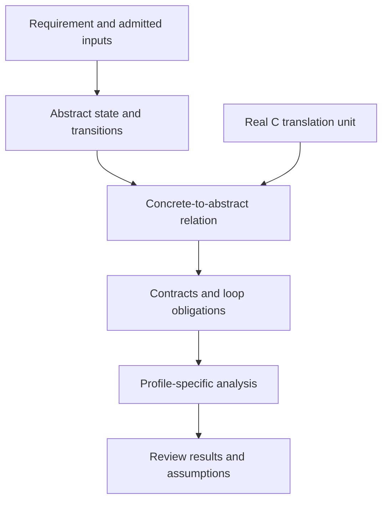
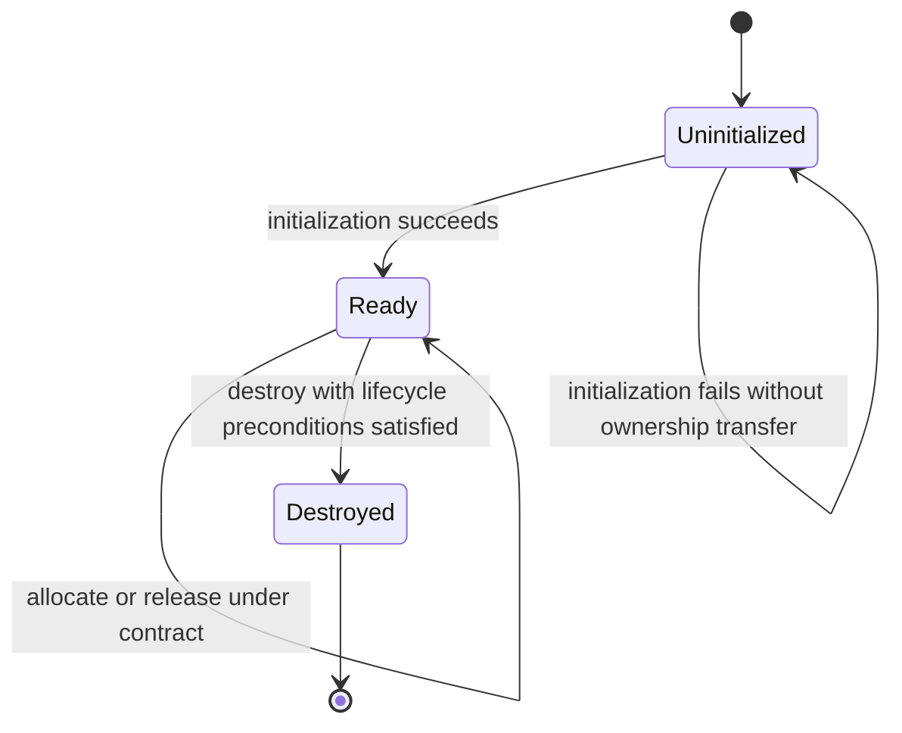
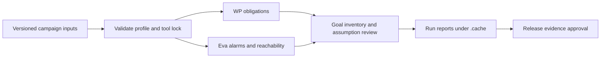

<!--
SPDX-FileCopyrightText: 2026 Rafael V. Volkmer <rafael.v.volkmer@gmail.com>
SPDX-License-Identifier: GPL-3.0-only
-->

# C Formal Verification Standard

Use this standard to specify and review formal verification campaigns for C
translation units. It defines the evidence required for a claim about a concrete
implementation, its admitted inputs, and its analysis model. It does not claim
that the current allocator or its concurrent operations have been verified.

Apply the [C Code Standard](../c-code-standard.md),
[C Module Architecture](../c-module-architecture.md), and
[Common C Pitfalls](../c-common-pitfalls.md) to the implementation under analysis.
Use [C Compliance and Assurance](../c-compliance.md) for assessment boundaries and
release acceptance. Formal verification supplements unit, integration, fuzz, and
target tests; it does not replace those campaigns.

<details>
<summary><strong>On this page</strong></summary>

- [Scope and expected evidence](#scope-and-expected-evidence)
- [Repository organization](#repository-organization)
- [Campaign inputs and profiles](#campaign-inputs-and-profiles)
- [Contracts and real source code](#contracts-and-real-source-code)
- [Flows, machines, and refinement](#flows-machines-and-refinement)
- [Memory and ownership](#memory-and-ownership)
- [Modules and concurrency](#modules-and-concurrency)
- [WP, Eva, and runtime-error obligations](#wp-eva-and-runtime-error-obligations)
- [Execution and acceptance](#execution-and-acceptance)
- [References](#references)

</details>

---

## Scope and expected evidence

---

### CFV-001: State the property and its boundary

**Requirement:** Assign an identifier such as `LMA-FV-0001` to each verification
goal. Record its requirement, functions, source unit, analysis profile, admitted
inputs, assumptions, and acceptance rule in `goals.md` and `assumptions.md`.

A useful goal states that alignment rounding cannot overflow for the input range
admitted by the contract. A goal named only "verify alignment.c" lacks a property
and an acceptance criterion. State safety, functional correctness, termination,
and progress claims as separate obligations.

**Required evidence:** A reviewer must be able to trace a requirement to a
contract, a generated obligation or analysis alarm, and its recorded disposition.
An unresolved obligation, timeout, missing prover, or unsupported feature must
remain visible. None constitutes proof of the property or proof of a defect.

---

## Repository organization

---

### CFV-002: Organize by module and translation unit

Maintain formal inputs in `tests/formal/<module>/<translation-unit>/`. Preserve
relative source subdirectories when names would collide. Group functions from
the same `.c` file; add scenario directories only when a campaign needs them.
The allocator paths below illustrate the convention and do not assert that these
production modules or campaigns already exist.

```text
.
├── tests/
│   └── formal/
│       ├── README.md
│       ├── manifest.yml
│       ├── profiles/
│       │   ├── hosted-lp64.yml
│       │   └── freestanding-ilp32.yml
│       ├── common/
│       │   ├── logic/
│       │   ├── models/
│       │   └── stubs/
│       ├── allocator/
│       │   ├── arena/
│       │   │   ├── contract.acsl
│       │   │   ├── harness.c
│       │   │   ├── goals.md
│       │   │   ├── assumptions.md
│       │   │   ├── wp.options
│       │   │   ├── eva.options
│       │   │   └── proofs/
│       │   │       └── wp/
│       │   └── free_list/
│       ├── base/
│       │   └── alignment/
│       └── integration/
│           └── allocator_lifecycle/
├── tools/
│   └── frama-c/
├── cmake/
│   └── FramaC.cmake
├── docs/
│   └── verification/
├── .github/
│   └── workflows/
│       └── formal.yml
└── .cache/
    └── build/
        └── formal/
            └── <profile>/
                └── <module>/
                    └── <translation-unit>/
                        └── <run>/
                            ├── reports/
                            ├── logs/
                            ├── cache/
                            └── generated/
```

Use `.cache/build/formal/`, not a root `build/formal/`, to comply with the
repository-wide cache policy. Version specifications and proof inputs in Git.
Keep generated reports and disposable sessions outside Git. Preserve approved
release evidence through the release evidence index and `test_logs/` contract.

| Source | Formal campaign |
| --- | --- |
| `source/allocator/src/arena.c` | `tests/formal/allocator/arena/` |
| `source/allocator/src/free_list.c` | `tests/formal/allocator/free_list/` |
| `source/base/src/alignment.c` | `tests/formal/base/alignment/` |
| Multiple units with a lifecycle property | `tests/formal/integration/allocator_lifecycle/` |

These infrastructure paths describe the required layout for future campaigns.
This document does not install Frama-C, create empty proof directories, or enable
a formal Actions job before a qualified executor and real campaign exist.

---

## Campaign inputs and profiles

---

### CFV-003: Make the execution contract explicit

| Input | Required content |
| --- | --- |
| `manifest.yml` | Campaign ID, real sources, contracts, entry points, models, stubs, profile, goals, and expected analyses. |
| `contract.acsl` | Applicable preconditions, postconditions, frame conditions, behaviors, and invariants. |
| `harness.c` | Admissible initial state and calls to the real implementation. |
| `goals.md` | Property identifiers, requirement links, functions, and acceptance criteria. |
| `assumptions.md` | Environment, input restrictions, modeled dependencies, axioms, and exclusions. |
| `wp.options` / `eva.options` | Reviewed argument lists for the selected analysis. |
| `proofs/` | Persistent scripts or sessions required to reproduce nonautomatic proofs. |

Require only applicable inputs. WP may analyze a function contract without a
harness. An Eva campaign must document its entry point and initial state,
including nondeterministic inputs and any harness restrictions.

Treat the manifest and option filenames as project conventions. The future Lua
executor must parse them, validate paths and arguments, and construct explicit
tool invocations. Frama-C does not discover them by these names. Reject arbitrary
shell expressions and paths outside approved input/output roots.

Profiles must state the C dialect, target architecture, data model, integer and
pointer widths, alignment, byte order, defines, include paths, library models,
memory model, tool/prover identities, resource limits, and unsupported constructs.
LP64 and ILP32 names alone do not establish those facts or qualify a target.
Resolve executable versions from `tools/toolchain/lock.toml` when an executor
is introduced; do not maintain a second version authority in profiles.

---

## Contracts and real source code

---

### CFV-004: Keep one authoritative specification

Use external contracts under `tests/formal/` unless the authoritative annotation
already belongs to a public header or implementation. Record that location in the
manifest instead of maintaining a second contract. Inspect which functions and
statements received imported annotations after source edits.

The [ACSL Importer](https://www.frama-c.com/fc-plugins/acsl-importer.html)
supports external specifications and requires an analysis stage after `-then`.
The following commands illustrate invocation order, not a qualified target profile:

```sh
frama-c source/allocator/src/arena.c \
  -acsl-import tests/formal/allocator/arena/contract.acsl -then -wp
frama-c source/allocator/src/arena.c tests/formal/allocator/arena/harness.c \
  -acsl-import tests/formal/allocator/arena/contract.acsl \
  -then -main formal_arena_entry -eva
```

Analyze the production source. Do not maintain a hand-edited `arena_verified.c`
copy. Any necessary transformation must have a reproducible implementation,
recorded limitations, and generated output under the campaign cache directory.
Proving a transformed program requires an argument connecting it to the original.

---

## Flows, machines, and refinement

---

### CFV-005: Define state and transition semantics

For a control-flow model, define a state such as `(pc, locals, heap, environment)`
and a transition relation. Give branches guards, operations state updates, calls
contracts, and returns observable results. State the initial and terminal states.
Distinguish partial correctness from termination; a postcondition alone does not
show that execution reaches a return.

The NORMA register-machine model and monolithic labeled programs provide a way to
study program execution apart from the underlying machine. The theoretical
background includes Diverio and Menezes, *Theory of Computation: Universal Machines
and Computability*, discussed in the
[SiNo research study](https://repositorio.unipampa.edu.br/bitstreams/94f4efff-4052-4a3b-a10f-c6bb705e6071/download).
Use such models for explicit operational semantics, not as the semantics of C.
Natural-number registers omit bounded integer overflow, object lifetime, pointer
provenance, and allocation failure. A refinement argument must account for those
differences before transferring a result to a C implementation.

Here, "monolithic" means a labeled control-flow representation of a program;
it does not require monolithic production architecture. A single-entry,
single-exit style can aid review but does not prove correctness.

Annotate loop entry, preservation, and exit obligations. Supply a well-founded
decreasing measure for termination claims. Define failure edges and resource
cleanup as part of the transition system. Relate concrete state to abstract
state with an explicit abstraction relation; preserve observable results and
permitted traces across the mapping. See
[Reynolds's low-level reasoning material](https://www.cs.cmu.edu/~jcr/cs819-02.html)
for operational semantics, assertions, and transition-diagram reasoning.



---

### CFV-006: Specify lifecycle transitions

Record legal operations, guards, failure behavior, and ownership at each state.
The diagram below is an illustrative allocator lifecycle, not a proof or the
definition of an existing public API. Destruction requires a stated policy for
outstanding allocations; encode that policy in the transition guard.



Write invariants over reachable states. For progress claims, state scheduling and
fairness assumptions and the events that must occur. Use a bounded model check
only for its declared bounds. Lamport's
[Specifying Systems](https://lamport.azurewebsites.net/tla/book-02-08-08.pdf)
provides a foundation for state-based specifications, safety, and liveness.
A diagram assists review; executable specifications and proof obligations supply
the formal argument.

---

## Memory and ownership

---

### CFV-007: Model objects, bounds, and permitted effects

Specify valid readable/writable ranges, initialization, alignment, lifetime,
aliasing, separation, ownership transfer, and permitted writes. State allocation
and deallocation effects, failure atomicity, and cleanup obligations. Treat
mathematical integers and C integers as distinct domains; prove conversion and
arithmetic bounds before using a mathematical result for pointer arithmetic.

For an allocator campaign, include goals for nonoverlapping live allocations,
preservation of unrelated objects, free-list consistency, alignment rounding,
size arithmetic, out-of-memory behavior, and legal release operations. A contract
may exclude an invalid free; record that exclusion rather than claiming runtime
rejection of invalid callers.

[ACSL](https://www.frama-c.com/html/acsl.html) supplies contract and memory
predicates. State the selected WP memory model and its assumptions about casts,
unions, pointer/integer conversions, and allocation primitives. Do not infer
support for a C feature from the fact that the production compiler accepts it.

Use local footprints and separation reasoning to review ownership boundaries.
Reynolds's [Separation Logic](https://www.cs.cmu.edu/~jcr/seplogic.pdf) explains
reasoning about disjoint mutable storage. Its abstract heap model does not by
itself prove an ACSL contract or a concurrent C allocator.

---

## Modules and concurrency

---

### CFV-008: Expose dependencies and trusted assumptions

For modular proofs, prove a callee contract and prove that callers establish its
preconditions. Record the permitted effects at the module boundary. A stub or
assumed dependency contract creates a trusted boundary that needs its own review.
Check mutually dependent assumptions for circular arguments.

Put reusable predicates in `common/logic/`, environment models in `common/models/`,
and shared analysis substitutions in `common/stubs/`. Keep unit-specific models
beside their campaign. Introduce an axiom only with its justification, owner,
consistency argument, and a list of dependent results. Do not add axioms merely to
make a failed obligation disappear.

Concurrent campaigns belong under `integration/<scenario>/` where appropriate.
State the C memory model, atomic operations and ordering, synchronization,
linearization points, reclamation policy, and interference assumptions. Check
ABA, lifetime races, and progress claims with a method that supports those
semantics. Eva's documented sequential scope does not establish correctness for
thread interleavings. Keep sequential and concurrent evidence distinct.

---

## WP, Eva, and runtime-error obligations

---

### CFV-009: Preserve the meaning of each result

| Method | Expected evidence | Boundary |
| --- | --- | --- |
| [WP](https://www.frama-c.com/fc-plugins/wp.html) | Per-goal proof status, prover, model, dependencies, and persistent proof inputs. | A proved contract holds under its hypotheses and supported semantics. |
| [Eva](https://www.frama-c.com/fc-plugins/eva.html) | Initial-state definition, analyzed reachability, alarms, and justified dispositions. | Results depend on the admitted sequential executions and dependency models. |
| [RTE](https://www.frama-c.com/fc-plugins/rte.html) | Inventory of generated runtime-error assertions and downstream verification statuses. | Generating an assertion does not discharge it. |
| Model checking | Transition system, bounds, properties, counterexamples, and model-to-code relation. | Exhaustion of a bounded model is not an unbounded implementation proof. |

Use the upstream [Guide to Software Verification with Frama-C](https://www.frama-c.com/html/publications.html)
and plugin manuals to select supported analyses. Keep WP and Eva reports separate.
Review unreachable goals and inconsistent preconditions to prevent vacuous
success. Test contracts with admissible examples and deliberate mutations where
practical; record expected detection and remaining blind spots.

---

## Execution and acceptance

---

### CFV-010: Reproduce the campaign and fail closed

The Lua executor must resolve the manifest, source inputs, profile, and tool lock;
record effective arguments and input digests; run each analysis with limits; and
parse its structured results. A zero exit status is insufficient proof evidence.
Require the expected goal inventory and separate counts for proved, unresolved,
invalid, unsupported, and timed-out obligations. Preserve raw logs alongside the
normalized report and reject missing or malformed reports.

Changes to source, contracts, models, options, profiles, or proof dependencies
must invalidate affected results. Version persistent proof scripts; classify
disposable prover caches separately. A release reviewer must approve the exact
campaign evidence and its limitations before including it in a release package.



---

## References

- [Frama-C documentation and manuals](https://www.frama-c.com/html/documentation.html)
- [ACSL Importer](https://www.frama-c.com/fc-plugins/acsl-importer.html)
- [ACSL specification language](https://www.frama-c.com/html/acsl.html)
- [Guide to Software Verification with Frama-C and research publications](https://www.frama-c.com/html/publications.html)
- [SiNo: research on teaching the NORMA machine](https://repositorio.unipampa.edu.br/bitstreams/94f4efff-4052-4a3b-a10f-c6bb705e6071/download)
- [Reynolds: reasoning about low-level programming languages](https://www.cs.cmu.edu/~jcr/cs819-02.html)
- [Reynolds: Separation Logic](https://www.cs.cmu.edu/~jcr/seplogic.pdf)
- [Lamport: Specifying Systems](https://lamport.azurewebsites.net/tla/book-02-08-08.pdf)

<!-- EOF -->

