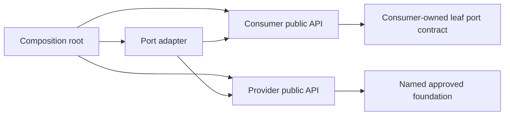
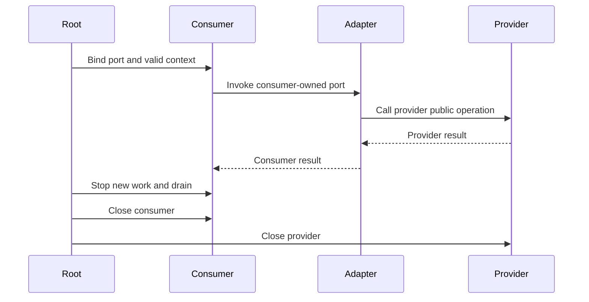

<!--
SPDX-FileCopyrightText: 2026 Rafael V. Volkmer <rafael.v.volkmer@gmail.com>
SPDX-License-Identifier: GPL-3.0-only
-->

# Lua Module Architecture

Use this guide when designing a Lua module, connecting peers, packaging code or reviewing a lifecycle. It
defines who owns state and interfaces, how dependencies cross boundaries and how construction, binding,
errors, shutdown, imports and distribution fit together.

Apply [Lua Code Standard](lua-code-standard.md) for local rules, naming, SESE, resources and deviations. Use
[Common Lua Pitfalls](lua-common-pitfalls.md) for failure scenarios. This guide explains the Lua import model,
module roles and lifecycle contracts used by the project.

The Lua guides define their own conventions, explanations and verification requirements. Read the
[guide index](README.md) for source layout, documentation, runtime optimization and module design.
Distinguish project conventions from language semantics and tool capabilities. Review source and tool
configuration changes against these requirements; documentation alone does not establish conformance.

<a id="rule-index"></a>

<details>
<summary><strong>On this page</strong></summary>

<details>
<summary>Native operation ownership records</summary>

- [LMOD-043: Keep native roots and registrations under one adapter owner](#lmod-043)
- [LMOD-044: Make coroutine termination part of scheduler shutdown](#lmod-044)

</details>

- [Module model and applicability](#module-model)
- [Architecture controls](#architecture-controls)
- [Complete composition fixture](#composition-example)
- [Merge and release review](#merge-review)

<details>
<summary>Module ownership</summary>

- [LMOD-001: Minimize the reachable public surface](#lmod-001)
- [LMOD-002: Assign one owner to implementation and state](#lmod-002)

- [Repository script initialization boundary](#repository-script-initialization-boundary)

</details>

<details>
<summary>Dependencies</summary>

- [LMOD-003: Connect peers through consumer-owned ports](#lmod-003)
- [LMOD-004: Name every direct foundation exception](#lmod-004)
- [LMOD-005: Keep contract modules as leaves](#lmod-005)
- [LMOD-006: Keep imports explicit and ordered](#lmod-006)
- [LMOD-007: Separate public, internal and private Lua boundaries](#lmod-007)
- [LMOD-008: Reject circular module initialization](#lmod-008)

</details>

<details>
<summary>State and lifetime</summary>

- [LMOD-009: Separate module identity from instance state](#lmod-009)
- [LMOD-010: Define DTO aliasing and publication](#lmod-010)
- [LMOD-011: Use opaque contexts without magical isolation claims](#lmod-011)
- [LMOD-017: Make retention and semantic validity explicit](#lmod-017)
- [LMOD-018: Document borrowed and owned resources separately](#lmod-018)

</details>

<details>
<summary>Ports and adapters</summary>

- [LMOD-012: Specify every callback as a public contract](#lmod-012)
- [LMOD-013: Keep semantic translation inside adapters](#lmod-013)
- [LMOD-014: Keep external dependencies with their owner](#lmod-014)
- [LMOD-015: Separate normal statuses and exceptions](#lmod-015)
- [LMOD-016: Forbid callback reentry by default](#lmod-016)

</details>

<details>
<summary>Composition and lifecycle</summary>

- [LMOD-019: Let the composition root bind dependencies](#lmod-019)
- [LMOD-020: Validate construction before publication](#lmod-020)
- [LMOD-021: Use an explicit operational state machine](#lmod-021)
- [LMOD-022: Shut down in dependency order](#lmod-022)
- [LMOD-023: Preserve the primary failure during cleanup](#lmod-023)
- [LMOD-024: Treat finalizers as a fallback](#lmod-024)

</details>

<details>
<summary>Concurrency and execution</summary>

- [LMOD-025: Specify the yield boundary](#lmod-025)
- [LMOD-026: Assign one owner to synchronization](#lmod-026)

</details>

<details>
<summary>Trust boundaries</summary>

- [LMOD-027: Give each external authority a named owner](#lmod-027)
- [LMOD-028: Control loader paths at bootstrap](#lmod-028)
- [LMOD-029: Treat hot reload and plugin unload as special profiles](#lmod-029)
- [LMOD-030: Keep Lua and native contracts separate](#lmod-030)

</details>

<details>
<summary>Build and distribution</summary>

- [LMOD-031: Load and test a module in isolation](#lmod-031)
- [LMOD-032: Own a finite distribution manifest](#lmod-032)
- [LMOD-033: Version the public API and its behavior](#lmod-033)
- [LMOD-034: Pin dependency and build inputs](#lmod-034)
- [LMOD-035: Do not invent ordinary Lua linker guarantees](#lmod-035)

</details>

<details>
<summary>Testing and merge gates</summary>

- [LMOD-036: Test only supported public behavior from consumers](#lmod-036)
- [LMOD-037: Give every port a conformance suite](#lmod-037)
- [LMOD-038: Check dependency and public-surface drift](#lmod-038)
- [LMOD-039: Test lifecycle faults and aliasing](#lmod-039)
- [LMOD-040: Keep CI evidence scoped and reproducible](#lmod-040)

</details>

<details>
<summary>Architecture scope</summary>

- [LMOD-041: Keep entry-point effects at the entry point](#lmod-041)
- [LMOD-042: Place performance choices with their owner](#lmod-042)

</details>

</details>

---

<a id="module-model"></a>

## Module model and applicability

A module owns its implementation, state, inbound public API, outbound port contracts, tests and public
surface. Peers communicate through injected callbacks or adapters. The composition root owns provider
selection, binding and combined lifecycle. Named approved foundations can be direct dependencies; an
arbitrary acyclic dependency does not become a foundation automatically.

| Owner | Permitted knowledge |
| --- | --- |
| Reusable peer | Its API, internals, consumer-owned ports and approved leaf/foundation contracts. |
| Leaf contract | Value shapes, error vocabulary and callback contract; no provider initialization. |
| Adapter | Both public contracts it translates, never peer-private state. |
| Composition root | Public constructors and lifecycle of all instances it binds. |
| Owner-internal test | Its own module internals, without publishing them to consumers. |
| Native adapter | Its Lua boundary and the separately qualified native ABI/implementation. |

A local export table is a Lua interface, not a C linker export map. Lexical locals minimize ordinary
reachability; they do not authenticate callers or create a sandbox against debug or native access. `require`
executes loader code and normally caches its returned module identity. Per-instance state therefore needs
explicit construction. Do not confuse importing a contract with textual C inclusion.

### Source dependency shape

The reusable consumer does not import a provider peer. Its callback contract belongs to the consumer. Only
the adapter and composition root connect public APIs. The diagrams show policy boundaries; they are not
evidence that a graph checker has been added to current CI.



### Runtime call and lifetime

At runtime a consumer operation calls the injected port, the adapter calls the provider public API, and the
result is translated back to the consumer contract. The default callback is synchronous and non-yielding.
The context remains semantically valid through the call. Retention, concurrency or suspension requires a
stronger named contract, not an assumption about a function value.



Construction validates before publication and unwinds completed acquisitions on failure. Shutdown prevents
new work, drains active users, closes the consumer and adapter, then closes the provider. Clearing a field
or `package.loaded` entry does not invalidate all existing callbacks or suspended operations. A busy flag
rejects synchronous reentry; it is not a native-thread mutex.

### Source-to-release stages

Declare the module graph and profile; validate and format source; test isolated modules with mocks; compose
real adapters; install a finite manifest into a clean tree; run public, lifecycle and compatibility tests;
record artifact identities. For native modules, add the C build, ABI, export and hardening evidence required
by the native profile. Pure Lua does not need fabricated object files, include guards, archive link order or
native symbol stripping.

---

<a id="architecture-controls"></a>

## Architecture controls

---

<a id="lmod-001"></a>

### LMOD-001: Minimize the reachable public surface

**Class:** ARCHITECTURE. **Obligation:** project requirement.

Keep the export table local and expose only stable operations and documented constants. Lexical locals
protect ordinary encapsulation; names and annotation privacy do not create a security boundary.

**Rationale:** An exported object graph can reveal state even when the top-level field list is small.

**Verification design:** Enumerate exported keys and recursively review returned references.

**Related controls:** [LSTYLE-007](lua-code-standard.md#lstyle-007),
[LSTYLE-008](lua-code-standard.md#lstyle-008).

**Source context:** [Lua module and runtime semantics][lua55].

#### Local examples

**Contract or layout example (not executable):**

> ```text
> private locals -> selected public operations -> returned local API table
> ```

---

<a id="lmod-002"></a>

### LMOD-002: Assign one owner to implementation and state

**Class:** ARCHITECTURE. **Obligation:** project requirement.

Give each mutable state object one semantic owner and document its borrowers. Keep parser, storage,
transport and orchestration responsibilities distinguishable.

**Rationale:** Multiple owners can mutate the same table without an explicit transition or shutdown
protocol.

**Verification design:** Draw state ownership and trace each mutating operation.

**Related controls:** [LSTYLE-033](lua-code-standard.md#lstyle-033),
[LSTYLE-049](lua-code-standard.md#lstyle-049).

**Source context:** [Lua module and runtime semantics][lua55].

#### Local examples

**Contract or layout example (not executable):**

> ```text
> module owns implementation + state + inbound API + outbound ports + tests
> ```

---

<a id="lmod-003"></a>

### LMOD-003: Connect peers through consumer-owned ports

**Class:** ARCHITECTURE. **Obligation:** project requirement.

A reusable peer must not require or call another peer implementation directly. Define an outbound callback
contract owned by the consumer and bind a provider through an adapter.

**Rationale:** Dependency injection changes binding ownership; it does not remove semantic coupling.

**Verification design:** Inspect source dependencies and run the consumer with only contract fixtures and
mocks.

**Related controls:** [LSTYLE-008](lua-code-standard.md#lstyle-008).

**Related failure scenarios:** [LPIT-044](lua-common-pitfalls.md#lpit-044).

**Source context:** [Lua module and runtime semantics][lua55].

#### Local examples

**Contract or layout example (not executable):**

> ```text
> consumer -> injected sink port -> adapter -> provider public operation
> ```

---

<a id="lmod-004"></a>

### LMOD-004: Name every direct foundation exception

**Class:** ARCHITECTURE. **Obligation:** project requirement.

Permit a direct foundation or platform dependency only through an explicit lower-layer allowance naming its
public interface and transitive dependencies. A dependency being acyclic or named util is not sufficient.

**Rationale:** A generic utility bucket can hide a forbidden peer dependency.

**Verification design:** Review a machine-readable or documented dependency allowlist and test its
enforcement.

**Related controls:** [LSTYLE-070](lua-code-standard.md#lstyle-070).

**Source context:** [Lua module and runtime semantics][lua55].

#### Local examples

**Contract or layout example (not executable):**

> ```text
> buffer -> approved checked_arithmetic foundation; not buffer -> emitter
> ```

---

<a id="lmod-005"></a>

### LMOD-005: Keep contract modules as leaves

**Class:** ARCHITECTURE. **Obligation:** project requirement.

Contract modules define shapes, status vocabulary and port expectations without importing provider
implementations, starting I/O or acquiring resources. An annotation-only contract is documentation, not
runtime validation.

**Rationale:** An importable contract that initializes a provider defeats isolation.

**Verification design:** Load contracts with peer implementations unavailable and inspect effects.

**Related controls:** [LSTYLE-065](lua-code-standard.md#lstyle-065).

**Related failure scenarios:** [LPIT-044](lua-common-pitfalls.md#lpit-044).

**Source context:** [Lua module and runtime semantics][lua55].

#### Local examples

**Contract or layout example (not executable):**

> ```text
> contracts/sink_port.lua -> leaf declarations only
> ```

---

<a id="lmod-006"></a>

### LMOD-006: Keep imports explicit and ordered

**Class:** ARCHITECTURE. **Obligation:** project requirement.

Bind approved imports to locals near the start of the chunk. Group standard-library aliases, named
foundations, owned internals and adapter dependencies consistently. Do not depend on incidental import order
for initialization.

**Rationale:** require executes a loader and its effects; it is not a C textual header inclusion.

**Verification design:** Run alternate supported import orders and inspect initialization dependencies.

**Related controls:** [LSTYLE-013](lua-code-standard.md#lstyle-013),
[LSTYLE-058](lua-code-standard.md#lstyle-058).

**Source context:** [Lua module and runtime semantics][lua55].

#### Local examples

**Contract or layout example (not executable):**

> ```text
> local checked = require("foundation.checked")
> ```

---

<a id="lmod-007"></a>

### LMOD-007: Separate public, internal and private Lua boundaries

**Class:** ARCHITECTURE. **Obligation:** project requirement.

Public files expose supported contracts; internal files are consumed only within the owning module; private
functions remain lexical. A file named internal is a policy boundary, not access control.

**Rationale:** A caller may still reach a file through a permissive package path.

**Verification design:** Check imports and release manifests rather than relying on directory names alone.

**Related controls:** [LSTYLE-007](lua-code-standard.md#lstyle-007),
[LSTYLE-052](lua-code-standard.md#lstyle-052).

**Source context:** [Lua module and runtime semantics][lua55].

#### Local examples

**Contract or layout example (not executable):**

> ```text
> module/init.lua: public API
> module/internal/*.lua: owner-only imports
> local function: lexical implementation
> ```

---

<a id="lmod-008"></a>

### LMOD-008: Reject circular module initialization

**Class:** ARCHITECTURE. **Obligation:** project requirement.

Keep the approved source dependency graph acyclic and do not rely on partially initialized exports. Break
peer cycles through a composition-time binding stage.

**Rationale:** Circular loading and manually prepublished tables make initialization order part of the API.

**Verification design:** Inspect the require graph and test construction without global cache prepopulation.

**Related controls:** [LSTYLE-058](lua-code-standard.md#lstyle-058).

**Source context:** [Lua module and runtime semantics][lua55].

#### Local examples

**Contract or layout example (not executable):**

> ```text
> load independent peers -> create instances -> bind callbacks
> ```

---

<a id="lmod-009"></a>

### LMOD-009: Separate module identity from instance state

**Class:** ARCHITECTURE. **Obligation:** project requirement.

Treat the value cached by require as module-level shared identity. Create per-instance mutable state
explicitly rather than attaching hidden singleton state to that cached value.

**Rationale:** Two callers of require may share the same exported table and its mutable descendants.

**Verification design:** Create two instances with different configurations and interleave their operations.

**Related controls:** [LSTYLE-033](lua-code-standard.md#lstyle-033),
[LSTYLE-056](lua-code-standard.md#lstyle-056).

**Related failure scenarios:** [LPIT-004](lua-common-pitfalls.md#lpit-004),
[LPIT-043](lua-common-pitfalls.md#lpit-043).

**Source context:** [Lua module and runtime semantics][lua55].

#### Local examples

**Contract or layout example (not executable):**

> ```text
> require returns constructors/operations; create returns distinct state
> ```

---

<a id="lmod-010"></a>

### LMOD-010: Define DTO aliasing and publication

**Class:** ARCHITECTURE. **Obligation:** project requirement.

For each boundary value, state whether it is immutable data, a copy, a borrowed reference or a retained
object. Copy relevant configuration fields when later caller mutation must not change behavior.

**Rationale:** Assigning a Lua table to another variable does not copy its contents.

**Verification design:** Mutate caller inputs after construction and retain outputs across subsequent calls.

**Related controls:** [LSTYLE-033](lua-code-standard.md#lstyle-033),
[LSTYLE-034](lua-code-standard.md#lstyle-034).

**Related failure scenarios:** [LPIT-013](lua-common-pitfalls.md#lpit-013),
[LPIT-014](lua-common-pitfalls.md#lpit-014).

**Source context:** [Lua module and runtime semantics][lua55].

#### Local examples

**Contract or layout example (not executable):**

> ```text
> validated input -> owner snapshot -> immutable-by-contract output
> ```

---

<a id="lmod-011"></a>

### LMOD-011: Use opaque contexts without magical isolation claims

**Class:** ARCHITECTURE. **Obligation:** project requirement.

A consumer must pass an injected callback context unchanged and must not inspect provider-private fields. A
closure can capture that context instead when its retention is documented.

**Rationale:** Opacity is a contract within one runtime, not a sandbox or proof against debug/native access.

**Verification design:** Test an alternative provider with a completely different context representation.

**Related controls:** [LSTYLE-052](lua-code-standard.md#lstyle-052),
[LSTYLE-053](lua-code-standard.md#lstyle-053).

**Source context:** [Lua module and runtime semantics][lua55].

#### Local examples

**Contract or layout example (not executable):**

> ```text
> sink_fn(sink_context, payload) -> status
> ```

---

<a id="lmod-012"></a>

### LMOD-012: Specify every callback as a public contract

**Class:** ARCHITECTURE. **Obligation:** project requirement.

Define argument domains, status tuple, ownership, retention, side effects, yield behavior, reentrancy and
failure-state guarantee. Validate callback availability before starting work.

**Rationale:** A function value alone does not communicate any of these obligations.

**Verification design:** Use success, failure, malformed-result and exception-producing mocks.

**Related controls:** [LSTYLE-044](lua-code-standard.md#lstyle-044),
[LSTYLE-065](lua-code-standard.md#lstyle-065).

**Related failure scenarios:** [LPIT-008](lua-common-pitfalls.md#lpit-008).

**Source context:** [Lua module and runtime semantics][lua55].

#### Local examples

**Contract or layout example (not executable):**

> ```text
> SINK_write(context, bytes) -> ret; synchronous, non-yielding, no retention
> ```

---

<a id="lmod-013"></a>

### LMOD-013: Keep semantic translation inside adapters

**Class:** ARCHITECTURE. **Obligation:** project requirement.

An adapter may know both public contracts but neither peer private representation. Translate statuses,
units, byte/text conventions and partial completion explicitly.

**Rationale:** Merely renaming a provider function does not establish matching semantics.

**Verification design:** Test each status and conversion in both contracts, including unknown provider
results.

**Related controls:** [LSTYLE-036](lua-code-standard.md#lstyle-036),
[LSTYLE-043](lua-code-standard.md#lstyle-043).

**Source context:** [Lua module and runtime semantics][lua55].

#### Local examples

**Contract or layout example (not executable):**

> ```text
> provider-specific error -> adapter mapping -> consumer status
> ```

---

<a id="lmod-014"></a>

### LMOD-014: Keep external dependencies with their owner

**Class:** ARCHITECTURE. **Obligation:** project requirement.

Only the approved adapter imports a version-sensitive external package or host API. Core operations receive
a project-owned port unless a named foundation exception applies.

**Rationale:** Otherwise dependency upgrades spread through unrelated modules.

**Verification design:** Search imports, review licenses and rerun adapter conformance tests after upgrades.

**Related controls:** [LSTYLE-062](lua-code-standard.md#lstyle-062),
[LSTYLE-070](lua-code-standard.md#lstyle-070).

**Source context:** [Lua module and runtime semantics][lua55].

#### Local examples

**Contract or layout example (not executable):**

> ```text
> native binding -> native_adapter -> project port -> consumer
> ```

---

<a id="lmod-015"></a>

### LMOD-015: Separate normal statuses and exceptions

**Class:** ARCHITECTURE. **Obligation:** project requirement.

The port defines expected failure statuses. The owning protection boundary handles unexpected Lua exceptions
without confusing pcall success with operation success or stringifying arbitrary error objects.

**Rationale:** Callbacks can raise non-string objects and return invalid tuples.

**Verification design:** Test ret=0, a negative status, malformed status, a thrown string and a thrown
table.

**Related controls:** [LSTYLE-043](lua-code-standard.md#lstyle-043),
[LSTYLE-046](lua-code-standard.md#lstyle-046).

**Source context:** [Lua module and runtime semantics][lua55].

#### Local examples

**Contract or layout example (not executable):**

> ```text
> protected outcome -> validate domain result -> preserve error contract
> ```

---

<a id="lmod-016"></a>

### LMOD-016: Forbid callback reentry by default

**Class:** ARCHITECTURE. **Obligation:** project requirement.

Unless explicitly designed and tested otherwise, a port must not reenter the active consumer. Use an
instance-owned busy state to reject synchronous reentry and reset it on every protected outcome.

**Rationale:** A synchronous busy flag is not an OS-thread lock or a scheduler-wide synchronization
primitive.

**Verification design:** Use a mock that calls back into the consumer and then verify a later normal call
succeeds.

**Related controls:** [LSTYLE-055](lua-code-standard.md#lstyle-055).

**Related failure scenarios:** [LPIT-040](lua-common-pitfalls.md#lpit-040).

**Source context:** [Lua module and runtime semantics][lua55].

#### Local examples

**Contract or layout example (not executable):**

> ```text
> idle -> busy -> protected callback -> idle; reentry while busy -> error
> ```

---

<a id="lmod-017"></a>

### LMOD-017: Make retention and semantic validity explicit

**Class:** ARCHITECTURE. **Obligation:** project requirement.

Retaining a Lua reference keeps an object reachable but does not keep its external resource open. The owner
defines when a context can be used and when references must be released.

**Rationale:** A reachable file wrapper can represent a closed native handle.

**Verification design:** Close the provider while retaining a wrapper and verify use is rejected through the
public contract.

**Related controls:** [LSTYLE-047](lua-code-standard.md#lstyle-047),
[LSTYLE-053](lua-code-standard.md#lstyle-053).

**Related failure scenarios:** [LPIT-042](lua-common-pitfalls.md#lpit-042).

**Source context:** [Lua module and runtime semantics][lua55].

#### Local examples

**Contract or layout example (not executable):**

> ```text
> reachable object != live external resource
> ```

---

<a id="lmod-018"></a>

### LMOD-018: Document borrowed and owned resources separately

**Class:** ARCHITECTURE. **Obligation:** project requirement.

A module closes only resources it owns or has explicitly accepted through ownership transfer. Borrowed
streams, contexts and handles remain the owner responsibility.

**Rationale:** Cleanup that closes a borrowed file can break unrelated callers.

**Verification design:** Use mocks with owner identity and verify close counts and ownership transitions.

**Related controls:** [LSTYLE-047](lua-code-standard.md#lstyle-047).

**Related failure scenarios:** [LPIT-035](lua-common-pitfalls.md#lpit-035).

**Source context:** [Lua module and runtime semantics][lua55].

#### Local examples

**Contract or layout example (not executable):**

> ```text
> borrow -> use within contract -> return; own -> use -> close once
> ```

---

<a id="lmod-019"></a>

### LMOD-019: Let the composition root bind dependencies

**Class:** ARCHITECTURE. **Obligation:** project requirement.

The application root chooses providers, constructs peers, creates adapters and binds ports. Reusable modules
must not locate global services or select peers based on ambient globals.

**Rationale:** A service locator hides dependency and lifecycle ownership.

**Verification design:** Construct the same consumer with production and test providers without editing
consumer code.

**Related controls:** [LSTYLE-008](lua-code-standard.md#lstyle-008).

**Source context:** [Lua module and runtime semantics][lua55].

#### Local examples

**Contract or layout example (not executable):**

> ```text
> root knows public APIs; peers know only owned contracts
> ```

---

<a id="lmod-020"></a>

### LMOD-020: Validate construction before publication

**Class:** ARCHITECTURE. **Obligation:** project requirement.

Validate configuration and required ports before publishing an instance. Define construction failure as no
usable instance and unwind only completed acquisitions.

**Rationale:** Publishing partial state forces every caller to guess which invariants hold.

**Verification design:** Fail each construction stage and verify no partially usable object escapes.

**Related controls:** [LSTYLE-049](lua-code-standard.md#lstyle-049).

**Source context:** [Lua module and runtime semantics][lua55].

#### Local examples

**Contract or layout example (not executable):**

> ```text
> validate -> acquire -> initialize -> publish, or unwind -> nil output
> ```

---

<a id="lmod-021"></a>

### LMOD-021: Use an explicit operational state machine

**Class:** ARCHITECTURE. **Obligation:** project requirement.

Document allowed states and operations: created, configured, active, stopping and closed where needed. Keep
transitions visible rather than inferred from unrelated nil fields.

**Rationale:** A hidden state machine tends to admit use-after-close and partial restart.

**Verification design:** Test allowed and rejected transitions, repeated shutdown and reset semantics.

**Related controls:** [LSTYLE-012](lua-code-standard.md#lstyle-012),
[LSTYLE-049](lua-code-standard.md#lstyle-049).

**Source context:** [Lua module and runtime semantics][lua55].

#### Local examples

**Contract or layout example (not executable):**

> ```text
> ACTIVE -> STOPPING -> QUIESCENT -> CLOSED
> ```

---

<a id="lmod-022"></a>

### LMOD-022: Shut down in dependency order

**Class:** ARCHITECTURE. **Obligation:** project requirement.

Stop accepting new consumer work, drain active calls, destroy the consumer and adapter, then close the
provider. Keep the provider alive until no consumer can invoke it.

**Rationale:** Clearing a callback field alone does not establish that suspended work stopped using it.

**Verification design:** Exercise shutdown with queued, active and suspended work in profiles that support
them.

**Related controls:** [LSTYLE-047](lua-code-standard.md#lstyle-047),
[LSTYLE-054](lua-code-standard.md#lstyle-054).

**Related failure scenarios:** [LPIT-039](lua-common-pitfalls.md#lpit-039),
[LPIT-042](lua-common-pitfalls.md#lpit-042).

**Source context:** [Lua module and runtime semantics][lua55].

#### Local examples

**Contract or layout example (not executable):**

> ```text
> stop entry -> drain -> consumer teardown -> adapter release -> provider close
> ```

---

<a id="lmod-023"></a>

### LMOD-023: Preserve the primary failure during cleanup

**Class:** ARCHITECTURE. **Obligation:** project requirement.

Unwind acquired resources in reverse order. Preserve the original failure; report a cleanup failure as
primary only when no prior failure exists, and retain secondary diagnostics through the approved channel.

**Rationale:** A successful close result must not overwrite a failed operation.

**Verification design:** Inject operation and close failures together and check the chosen status and
release attempts.

**Related controls:** [LSTYLE-046](lua-code-standard.md#lstyle-046),
[LSTYLE-047](lua-code-standard.md#lstyle-047).

**Related failure scenarios:** [LPIT-032](lua-common-pitfalls.md#lpit-032).

**Source context:** [Lua module and runtime semantics][lua55].

#### Local examples

**Contract or layout example (not executable):**

> ```text
> primary failure remains; cleanup continues; secondary failure recorded
> ```

---

<a id="lmod-024"></a>

### LMOD-024: Treat finalizers as a fallback

**Class:** ARCHITECTURE. **Obligation:** project requirement.

Do not use GC finalization as the ordinary completion of file, process, socket or native-object lifetime. A
qualified to-be-closed profile is separate from basic manual resource handling.

**Rationale:** Collection timing and semantic completion are not interchangeable.

**Verification design:** Prove explicit teardown without forcing a collection.

**Related controls:** [LSTYLE-048](lua-code-standard.md#lstyle-048),
[LSTYLE-056](lua-code-standard.md#lstyle-056).

**Related failure scenarios:** [LPIT-036](lua-common-pitfalls.md#lpit-036),
[LPIT-037](lua-common-pitfalls.md#lpit-037).

**Source context:** [Lua module and runtime semantics][lua55].

#### Local examples

**Contract or layout example (not executable):**

> ```text
> explicit close is the lifecycle; finalizer is defensive fallback only
> ```

---

<a id="lmod-025"></a>

### LMOD-025: Specify the yield boundary

**Class:** ARCHITECTURE. **Obligation:** project requirement.

Name operations and ports that may yield. A non-yielding synchronous port is the default for the examples.
Supporting suspension requires explicit cancellation, resume and resource-lifetime contracts.

**Rationale:** pcall protects errors; it does not automatically prohibit yielding in every Lua execution
context.

**Verification design:** Test yield attempts and all supported resume/cancel states under the selected
runtime.

**Related controls:** [LSTYLE-054](lua-code-standard.md#lstyle-054).

**Related failure scenarios:** [LPIT-038](lua-common-pitfalls.md#lpit-038).

**Source context:** [Lua module and runtime semantics][lua55].

#### Local examples

**Contract or layout example (not executable):**

> ```text
> non-yielding port: enforced by its host/adapter contract, not by pcall alone
> ```

---

<a id="lmod-026"></a>

### LMOD-026: Assign one owner to synchronization

**Class:** ARCHITECTURE. **Obligation:** project requirement.

Document the host threading model and how each Lua state and native object is synchronized. Coroutines in
one state do not by themselves establish safe cross-thread access.

**Rationale:** Same-process callbacks do not supply memory isolation or locks.

**Verification design:** Review native synchronization separately and test reentry and teardown
interleavings.

**Related controls:** [LSTYLE-055](lua-code-standard.md#lstyle-055),
[LSTYLE-062](lua-code-standard.md#lstyle-062).

**Related failure scenarios:** [LPIT-041](lua-common-pitfalls.md#lpit-041).

**Source context:** [Lua module and runtime semantics][lua55].

#### Local examples

**Contract or layout example (not executable):**

> ```text
> host lock/ownership protocol -> state access; busy flag -> reentry only
> ```

---

<a id="lmod-027"></a>

### LMOD-027: Give each external authority a named owner

**Class:** ARCHITECTURE. **Obligation:** project requirement.

File access, process execution, networking, plugin loading and security decisions belong to named boundary
adapters. Give consumers only the authority required by their port.

**Rationale:** A generic execute-anything port undermines least authority.

**Verification design:** Review allowed operations and test denied requests without partial side effects.

**Related controls:** [LSTYLE-057](lua-code-standard.md#lstyle-057),
[LSTYLE-059](lua-code-standard.md#lstyle-059), [LSTYLE-060](lua-code-standard.md#lstyle-060).

**Related failure scenarios:** [LPIT-048](lua-common-pitfalls.md#lpit-048),
[LPIT-049](lua-common-pitfalls.md#lpit-049).

**Source context:** [Lua module and runtime semantics][lua55].

#### Local examples

**Contract or layout example (not executable):**

> ```text
> consumer receives write-approved-output, not arbitrary shell execution
> ```

---

<a id="lmod-028"></a>

### LMOD-028: Control loader paths at bootstrap

**Class:** ARCHITECTURE. **Obligation:** project requirement.

The bootstrap owns package paths and trusted explicit loading. Do not let a current directory, environment
variable or caller-supplied module name silently select production code.

**Rationale:** The source identity can otherwise change without a source-code change.

**Verification design:** Test startup from another directory and with hostile ambient search settings.

**Related controls:** [LSTYLE-058](lua-code-standard.md#lstyle-058).

**Related failure scenarios:** [LPIT-046](lua-common-pitfalls.md#lpit-046).

**Source context:** [Lua module and runtime semantics][lua55].

#### Local examples

**Contract or layout example (not executable):**

> ```text
> verified root -> explicit search policy -> load known module set
> ```

---

<a id="lmod-029"></a>

### LMOD-029: Treat hot reload and plugin unload as special profiles

**Class:** ARCHITECTURE. **Obligation:** project requirement.

Do not clear package.loaded or replace live provider functions as an ordinary reset operation. Reload needs
state migration, reference invalidation, quiescence and version compatibility.

**Rationale:** Clearing a cache entry does not revoke existing references or unload all native code.

**Verification design:** Track old instances, callbacks and suspended work through a reviewed reload
protocol.

**Related controls:** [LSTYLE-053](lua-code-standard.md#lstyle-053),
[LSTYLE-058](lua-code-standard.md#lstyle-058).

**Related failure scenarios:** [LPIT-045](lua-common-pitfalls.md#lpit-045).

**Source context:** [Lua module and runtime semantics][lua55].

#### Local examples

**Contract or layout example (not executable):**

> ```text
> quiesce -> migrate/close -> replace -> verify -> resume
> ```

---

<a id="lmod-030"></a>

### LMOD-030: Keep Lua and native contracts separate

**Class:** ARCHITECTURE. **Obligation:** project requirement.

A native adapter owns ABI, pointer lifetime, numeric conversions, encoding, stack discipline and host error
propagation. The Lua contract must not expose raw representation assumptions accidentally.

**Rationale:** C memory-safety and linker requirements cannot be implemented by a Lua naming convention.

**Verification design:** Use native sanitizers and C checks where applicable, plus Lua boundary tests.

**Related controls:** [LSTYLE-062](lua-code-standard.md#lstyle-062),
[LSTYLE-071](lua-code-standard.md#lstyle-071).

**Source context:** [Lua module and runtime semantics][lua55].

#### Local examples

**Contract or layout example (not executable):**

> ```text
> Lua status/value contract <-> verified native ABI wrapper
> ```

---

<a id="lmod-031"></a>

### LMOD-031: Load and test a module in isolation

**Class:** ARCHITECTURE. **Obligation:** project requirement.

A module test environment provides only its declared foundations, contracts and mocks, with peer
implementations unavailable. Syntax checking alone is not an import or dependency-isolation test.

**Rationale:** A complete application path may conceal an accidental peer import.

**Verification design:** Run from a temporary isolated module tree with explicit package paths and
dependency traps.

**Related controls:** [LSTYLE-058](lua-code-standard.md#lstyle-058),
[LSTYLE-068](lua-code-standard.md#lstyle-068).

**Related failure scenarios:** [LPIT-044](lua-common-pitfalls.md#lpit-044).

**Source context:** [Lua module and runtime semantics][lua55].

#### Local examples

**Contract or layout example (not executable):**

> ```text
> declared module set + fixtures -> load -> public contract tests
> ```

---

<a id="lmod-032"></a>

### LMOD-032: Own a finite distribution manifest

**Class:** ARCHITECTURE. **Obligation:** project requirement.

List source modules, contracts, assets, runtime profile and native artifacts for each release. Exclude
test-only authority and internal tools unless explicitly shipped.

**Rationale:** A working developer directory does not define the release surface.

**Verification design:** Install the manifest into a clean tree and run import and public API tests there.

**Related controls:** [LSTYLE-070](lua-code-standard.md#lstyle-070).

**Source context:** [Lua module and runtime semantics][lua55].

#### Local examples

**Contract or layout example (not executable):**

> ```text
> source tree -> reviewed manifest -> clean install -> verification
> ```

---

<a id="lmod-033"></a>

### LMOD-033: Version the public API and its behavior

**Class:** ARCHITECTURE. **Obligation:** project requirement.

Review names, argument domains, tuple arity, error codes, ownership and yield behavior when evolving the
API. Keep compatibility wrappers at the boundary with a removal policy.

**Rationale:** Changing from status-first to value-first is breaking even if the function name stays
unchanged.

**Verification design:** Run old supported callers and contract snapshots against the candidate.

**Related controls:** [LSTYLE-035](lua-code-standard.md#lstyle-035),
[LSTYLE-043](lua-code-standard.md#lstyle-043), [LSTYLE-072](lua-code-standard.md#lstyle-072).

**Source context:** [Lua module and runtime semantics][lua55].

#### Local examples

**Contract or layout example (not executable):**

> ```text
> old API -> owned compatibility adapter -> current operation
> ```

---

<a id="lmod-034"></a>

### LMOD-034: Pin dependency and build inputs

**Class:** ARCHITECTURE. **Obligation:** project requirement.

Use the repository lock for tools and reviewed package identities for application dependencies. Record
native build and platform inputs. Do not fetch dependencies during require.

**Rationale:** Dynamic installation turns import into an unreviewed network and code-execution boundary.

**Verification design:** Verify clean, controlled builds and compare manifests and tool identities.

**Related controls:** [LSTYLE-070](lua-code-standard.md#lstyle-070).

**Source context:** [Lua module and runtime semantics][lua55].

#### Local examples

**Contract or layout example (not executable):**

> ```text
> locked inputs -> controlled build -> recorded artifact identities
> ```

---

<a id="lmod-035"></a>

### LMOD-035: Do not invent ordinary Lua linker guarantees

**Class:** ARCHITECTURE. **Obligation:** project requirement.

Describe source modules, require resolution and reachability for pure Lua. Reserve object-file,
static/shared-library, export-map and symbol-stripping rules for actual native artifacts.

**Rationale:** Bytecode and source distribution do not have the same visibility model as C object linking.

**Verification design:** Review the native release separately whenever it exists.

**Related controls:** [LSTYLE-071](lua-code-standard.md#lstyle-071).

**Source context:** [Lua module and runtime semantics][lua55].

#### Local examples

**Contract or layout example (not executable):**

> ```text
> pure Lua: imports and export tables
> native module: C build and ABI evidence
> ```

---

<a id="lmod-036"></a>

### LMOD-036: Test only supported public behavior from consumers

**Class:** ARCHITECTURE. **Obligation:** project requirement.

Consumer tests use public operations and contract mocks, not debug introspection or exports added solely for
tests. Owner-internal tests may examine internal contracts without making them public.

**Rationale:** Tests coupled to representation obstruct safe refactoring and expose private state.

**Verification design:** Compare the export surface before and after adding tests.

**Related controls:** [LSTYLE-008](lua-code-standard.md#lstyle-008),
[LSTYLE-068](lua-code-standard.md#lstyle-068).

**Source context:** [Lua module and runtime semantics][lua55].

#### Local examples

**Contract or layout example (not executable):**

> ```text
> consumer test -> public operation; owner test -> owner internal contract
> ```

---

<a id="lmod-037"></a>

### LMOD-037: Give every port a conformance suite

**Class:** ARCHITECTURE. **Obligation:** project requirement.

Test the same consumer-owned port contract against mocks and production adapters. Include input limits,
expected failures, invalid results, exceptions and teardown.

**Rationale:** A mock that is easier to satisfy than the real adapter creates false confidence.

**Verification design:** Run contract cases unchanged for each provider implementation.

**Related controls:** [LSTYLE-044](lua-code-standard.md#lstyle-044),
[LSTYLE-068](lua-code-standard.md#lstyle-068).

**Source context:** [Lua module and runtime semantics][lua55].

#### Local examples

**Contract or layout example (not executable):**

> ```text
> one port contract suite -> mock and all production adapters
> ```

---

<a id="lmod-038"></a>

### LMOD-038: Check dependency and public-surface drift

**Class:** ARCHITECTURE. **Obligation:** project requirement.

Review new imports, exports, shared state and authority with each architectural change. Automated
graph/export checks are recommended additions, not checks already implemented by the current Lua runner.

**Rationale:** StyLua and Selene do not enforce this entire architectural policy.

**Verification design:** Keep a review record or a separately implemented checker and identify which ran.

**Related controls:** [LSTYLE-066](lua-code-standard.md#lstyle-066),
[LSTYLE-067](lua-code-standard.md#lstyle-067).

**Source context:** [Lua module and runtime semantics][lua55].

#### Local examples

**Contract or layout example (not executable):**

> ```text
> new require/export/port -> ownership review -> approved graph change
> ```

---

<a id="lmod-039"></a>

### LMOD-039: Test lifecycle faults and aliasing

**Class:** ARCHITECTURE. **Obligation:** project requirement.

Exercise every acquisition failure, repeated close, use-after-close, caller mutation and interleaved
instances. Validate primary-error preservation and absence of published partial state.

**Rationale:** GC may hide leaks in short tests while leaving logical lifetime defects intact.

**Verification design:** Use counters and explicit state assertions rather than relying only on process
memory.

**Related controls:** [LSTYLE-033](lua-code-standard.md#lstyle-033),
[LSTYLE-047](lua-code-standard.md#lstyle-047), [LSTYLE-049](lua-code-standard.md#lstyle-049).

**Source context:** [Lua module and runtime semantics][lua55].

#### Local examples

**Contract or layout example (not executable):**

> ```text
> fault stage -> expected ret -> expected state -> exact close count
> ```

---

<a id="lmod-040"></a>

### LMOD-040: Keep CI evidence scoped and reproducible

**Class:** ARCHITECTURE. **Obligation:** project requirement.

Run the existing canonical checks without weakening configuration. Report separately the parser, dictionary,
Selene, StyLua, LuaLS, documentation, unit, isolation and performance evidence obtained.

**Rationale:** One aggregate green result cannot establish checks that were never invoked.

**Verification design:** Save command, version, input snapshot, exit status and not-run reasons.

**Related controls:** [LSTYLE-064](lua-code-standard.md#lstyle-064),
[LSTYLE-066](lua-code-standard.md#lstyle-066), [LSTYLE-069](lua-code-standard.md#lstyle-069).

**Source context:** [Lua module and runtime semantics][lua55].

#### Local examples

**Contract or layout example (not executable):**

> ```text
> current checker gates != all requirements in this policy
> ```

---

<a id="lmod-041"></a>

### LMOD-041: Keep entry-point effects at the entry point

**Class:** ARCHITECTURE. **Obligation:** project requirement.

A CLI or hook root owns arguments, environment, terminal diagnostics and process exit. A one-file
application may omit artificial multi-module ports when there is no peer boundary, but retains local style,
SESE and resource contracts.

**Rationale:** Architecture must fit the actual boundary rather than manufacture callback indirection
everywhere.

**Verification design:** Inspect which code is reusable and which is entry-point-only; preserve errors
through shutdown.

**Related controls:** [LSTYLE-023](lua-code-standard.md#lstyle-023),
[LSTYLE-061](lua-code-standard.md#lstyle-061).

**Source context:** [Lua module and runtime semantics][lua55].

#### Local examples

**Contract or layout example (not executable):**

> ```text
> entry point -> application operation -> shutdown -> exit code
> ```

---

<a id="lmod-042"></a>

### LMOD-042: Place performance choices with their owner

**Class:** ARCHITECTURE. **Obligation:** project requirement.

Cache invalidation, batching, allocation policy, native specialization and runtime tuning each have a named
owner. Keep such choices out of a portable public contract unless they are genuinely guaranteed.

**Rationale:** Optimization details can otherwise become accidental API requirements.

**Verification design:** Connect every accepted optimization to its LPERF review and boundary tests.

**Related controls:** [LPERF-001](lua-code-standard.md#lperf-001),
[LPERF-016](lua-code-standard.md#lperf-016).

**Source context:** [Lua module and runtime semantics][lua55].

#### Local examples

**Contract or layout example (not executable):**

> ```text
> optimization owner -> evidence -> contract equivalence -> regression policy
> ```

---

<a id="composition-example"></a>

## Appendix A. Complete composition and test fixture

The named files below implement two separate peers, an adapter and a composition/test root. The buffer peer
has no emitter import and the emitter peer has no buffer import. Their state is retained in per-instance
closures. The root is the only place binding both instances. The adapter sees the buffer public API, never
its private piece table.

This is a bounded hosted fixture, not a no-allocation, real-time or thread-safe buffer. It accepts strings
with at most 4,096 total bytes per buffer. Empty appends do not allocate a piece entry; therefore the piece
count cannot grow through repeated empty payloads. Snapshot concatenation may allocate. Provider operations
are not claimed to roll back arbitrary VM allocation failures.

Buffer statuses are 0 success, -1 invalid input, -2 closed and -3 insufficient capacity. Emitter adds -4
busy and -5 callback exception/protocol failure. The sink contract is `sink_fn(sink_context, payload) ->
ret`, with integer statuses -5 through 0. It is synchronous, non-yielding and must not retain the payload or
reenter the consumer unless testing the rejection. These conditions are contractual; `pcall` is not a
yield-prevention or sandbox mechanism.

`BUFFER_create` and `EMITTER_create` return `ret, api_or_nil`. Supported instance operations are prefixed
public names. Close is idempotent after quiescence; future operations reject a closed instance. Emitter
close while busy returns -4. The root closes emitter before buffer. The sample has no plugin reload,
background tasks, native handles, host-thread synchronization or network I/O.

Save each following block using its stated filename in one disposable directory. Run
`composition_regression.lua` with that directory as the working directory and a controlled local module
path. The complete local authoring harness loaded precisely these fixed source files; it did not execute a
full repository build or a separate automated dependency-isolation checker.

### `buffer.lua`

**Complete named source file:**

> ```lua
> -- SPDX-License-Identifier: GPL-3.0-only
> -- Provider peer. State remains inside per-instance closures.
>
> local buffer = {}
> local BUFFER_MAX_CAPACITY_BYTES = 4096
>
> local function BUFFER_create(capacity_bytes)
>    local ret = -1
>    local output = nil
>    local api = {}
>    local pieces = {}
>    local size_bytes = 0
>    local is_closed = false
>
>    local function BUFFER_append(payload)
>       local ret = -1
>       local payload_bytes = 0
>
>       if is_closed then
>          ret = -2
>          goto function_output
>       end
>       if type(payload) ~= "string" then
>          goto function_output
>       end
>
>       payload_bytes = #payload
>       if payload_bytes > capacity_bytes - size_bytes then
>          ret = -3
>          goto function_output
>       end
>       if payload_bytes > 0 then
>          pieces[#pieces + 1] = payload
>          size_bytes = size_bytes + payload_bytes
>       end
>       ret = 0
>
>       ::function_output::
>       return ret
>    end
>
>    local function BUFFER_snapshot()
>       local ret = -2
>       local output = nil
>
>       if not is_closed then
>          output = table.concat(pieces)
>          ret = 0
>       end
>
>       ::function_output::
>       return ret, output
>    end
>
>    local function BUFFER_close()
>       local ret = 0
>
>       is_closed = true
>       pieces = nil
>       size_bytes = 0
>
>       ::function_output::
>       return ret
>    end
>
>    if
>       type(capacity_bytes) ~= "number"
>       or capacity_bytes ~= capacity_bytes
>       or capacity_bytes < 0
>       or capacity_bytes > BUFFER_MAX_CAPACITY_BYTES
>       or capacity_bytes % 1 ~= 0
>    then
>       goto function_output
>    end
>
>    api.BUFFER_append = BUFFER_append
>    api.BUFFER_snapshot = BUFFER_snapshot
>    api.BUFFER_close = BUFFER_close
>    output = api
>    ret = 0
>
>    ::function_output::
>    return ret, output
> end
>
> buffer.BUFFER_create = BUFFER_create
>
> return buffer
> ```

### `emitter.lua`

**Complete named source file:**

> ```lua
> -- SPDX-License-Identifier: GPL-3.0-only
> -- Consumer peer. It does not import or inspect the provider.
>
> local emitter = {}
> local EMITTER_MAX_PAYLOAD_BYTES = 4096
>
> local function EMITTER_create(sink_fn, sink_context)
>    local ret = -1
>    local output = nil
>    local api = {}
>    local is_busy = false
>    local is_closed = false
>
>    local function EMITTER_send(payload)
>       local ret = -1
>       local has_entered = false
>       local has_completed = false
>       local sink_ret = nil
>
>       if is_closed then
>          ret = -2
>          goto function_output
>       end
>       if is_busy then
>          ret = -4
>          goto function_output
>       end
>       if type(payload) ~= "string" or #payload > EMITTER_MAX_PAYLOAD_BYTES then
>          goto function_output
>       end
>
>       is_busy = true
>       has_entered = true
>       has_completed, sink_ret = pcall(sink_fn, sink_context, payload)
>       ret = -5
>       if not has_completed then
>          goto function_output
>       end
>       if
>          type(sink_ret) ~= "number"
>          or sink_ret < -5
>          or sink_ret > 0
>          or sink_ret % 1 ~= 0
>       then
>          goto function_output
>       end
>       ret = sink_ret
>
>       ::function_output::
>       if has_entered then
>          is_busy = false
>       end
>       return ret
>    end
>
>    local function EMITTER_close()
>       local ret = -4
>
>       if not is_busy then
>          is_closed = true
>          sink_fn = nil
>          sink_context = nil
>          ret = 0
>       end
>
>       ::function_output::
>       return ret
>    end
>
>    if type(sink_fn) ~= "function" then
>       goto function_output
>    end
>
>    api.EMITTER_send = EMITTER_send
>    api.EMITTER_close = EMITTER_close
>    output = api
>    ret = 0
>
>    ::function_output::
>    return ret, output
> end
>
> emitter.EMITTER_create = EMITTER_create
>
> return emitter
> ```

### `buffer_sink.lua`

**Complete named source file:**

> ```lua
> -- SPDX-License-Identifier: GPL-3.0-only
> -- Adapter owns the mapping from provider statuses to the sink port.
> -- Its context is a live provider public API, bound by the composition root.
>
> local buffer_sink = {}
>
> local function BUFFER_SINK_write(context, payload)
>    local ret = -5
>    local provider_ret = nil
>
>    provider_ret = context.BUFFER_append(payload)
>    if provider_ret == 0 then
>       ret = 0
>    elseif provider_ret == -1 then
>       ret = -1
>    elseif provider_ret == -2 then
>       ret = -2
>    elseif provider_ret == -3 then
>       ret = -3
>    end
>
>    ::function_output::
>    return ret
> end
>
> buffer_sink.BUFFER_SINK_write = BUFFER_SINK_write
>
> return buffer_sink
> ```

### `composition_regression.lua`

**Complete named source file:**

> ```lua
> -- SPDX-License-Identifier: GPL-3.0-only
> -- Application/test root: the only owner binding both peers and the adapter.
>
> local buffer = require("buffer")
> local emitter = require("emitter")
> local buffer_sink = require("buffer_sink")
>
> local function root_runCase()
>    local ret = -1
>    local provider = nil
>    local consumer = nil
>    local snapshot = nil
>    local operation_ret = nil
>    local cleanup_ret = nil
>
>    ret, provider = buffer.BUFFER_create(4)
>    if ret ~= 0 then
>       goto function_output
>    end
>    ret, consumer =
>       emitter.EMITTER_create(buffer_sink.BUFFER_SINK_write, provider)
>    if ret ~= 0 then
>       goto function_output
>    end
>
>    ret = consumer.EMITTER_send("ab")
>    if ret ~= 0 then
>       goto function_output
>    end
>    operation_ret = consumer.EMITTER_send("cde")
>    assert(operation_ret == -3, "capacity rejection missing")
>    ret, snapshot = provider.BUFFER_snapshot()
>    if ret ~= 0 then
>       goto function_output
>    end
>    assert(snapshot == "ab", "failure published partial output")
>    ret = consumer.EMITTER_send("cd")
>    if ret ~= 0 then
>       goto function_output
>    end
>    ret, snapshot = provider.BUFFER_snapshot()
>    assert(snapshot == "abcd", "wrong composed result")
>
>    ::function_output::
>    if consumer ~= nil then
>       cleanup_ret = consumer.EMITTER_close()
>       if ret == 0 then
>          ret = cleanup_ret
>       end
>    end
>    if provider ~= nil then
>       cleanup_ret = provider.BUFFER_close()
>       if ret == 0 then
>          ret = cleanup_ret
>       end
>    end
>    return ret
> end
>
> local function mock_sink(context, payload)
>    local ret = 0
>    local reentry_ret = nil
>
>    assert(type(payload) == "string", "bad callback payload")
>    assert(not context.should_throw, "injected sink failure")
>    if context.should_reenter then
>       reentry_ret = context.consumer.EMITTER_send("nested")
>       assert(reentry_ret == -4, "reentry was not rejected")
>    end
>
>    ::function_output::
>    return ret
> end
>
> local root_ret = root_runCase()
> local context = { should_throw = true, should_reenter = false }
> local ret, consumer = emitter.EMITTER_create(mock_sink, context)
> local first_ret, first = buffer.BUFFER_create(2)
> local second_ret, second = buffer.BUFFER_create(2)
> local snapshot = nil
> local invalid_ret, invalid = emitter.EMITTER_create(nil, nil)
>
> assert(root_ret == 0, "composed lifecycle failed")
> assert(ret == 0, "consumer construction failed")
> context.consumer = consumer
> ret = consumer.EMITTER_send("x")
> assert(ret == -5, "exception mapping failed")
> context.should_throw = false
> context.should_reenter = true
> ret = consumer.EMITTER_send("x")
> assert(ret == 0, "consumer remained busy after an exception")
> ret = consumer.EMITTER_close()
> assert(ret == 0, "consumer close failed")
> ret = consumer.EMITTER_send("x")
> assert(ret == -2, "closed consumer accepted work")
> assert(first_ret == 0 and second_ret == 0, "provider construction failed")
> ret = first.BUFFER_append("x")
> assert(ret == 0, "first instance append failed")
> ret, snapshot = second.BUFFER_snapshot()
> assert(ret == 0 and snapshot == "", "instance state leaked")
> ret = first.BUFFER_close()
> assert(ret == 0, "first provider close failed")
> ret = second.BUFFER_close()
> assert(ret == 0, "second provider close failed")
> assert(invalid_ret == -1 and invalid == nil, "invalid port was accepted")
> print("composition regression: lifecycle and boundary cases passed")
> ```

---

<a id="merge-review"></a>

## Appendix B. Merge and release review

A review record identifies the module owner, public export set, permitted imports, foundation allowances,
ports and contexts, error/result contracts, retention, yield/reentry rules, lifecycle, authority and tests.
An architectural change updates the relevant record rather than merely adding a new require statement.
Document naming and compatibility migration separately from behavior.

| Evidence | Existing baseline or additional work? |
| --- | --- |
| Syntax, dictionary, Selene, StyLua and LuaLS | Existing canonical runner; run with its locked tools. |
| EditorConfig and Markdown checks | Existing separate documentation/source gates. |
| Complete Markdown example execution | Separate extraction/run; not part of current Lua discovery. |
| SESE, names, peer graph and public exports | Review requirements; dedicated automation needs its own change. |
| Port conformance and lifecycle fault tests | Tests to supply for the module and each adapter. |
| Isolated loading and clean distribution install | Integration evidence to supply for the release. |
| Native ABI/sanitizer/concurrency evidence | Required only where the selected native profile applies. |
| Performance and product-assurance claims | Separate scoped evidence; never inferred from lint success. |

Do not report proposed automation as existing automation. For the delivered documents and examples, the
exact authoring checks and not-run gates are recorded in [the
standard](lua-code-standard.md#repository-checks). Successful host tests do not prove a security sandbox, a
resource bound beyond the stated fixture or conformance of existing repository Lua to the newly proposed
naming and SESE policy.

---

## Native operation ownership records

---

<a id="lmod-043"></a>

### LMOD-043: Keep native roots and registrations under one adapter owner

**Class:** ARCHITECTURE. **Obligation:** project requirement.

Give each pending native operation an adapter-owned record containing its rooted Lua values, native handle,
callback registration and completion state. For PUC-Lua, record registry reference acquisition and release.
For LuaJIT, record backing cdata and explicit callback ownership. Keep runtime-specific details out of
consumer modules; the consumer owns admission and cancellation intent, while the adapter owns native drain.

**Rationale:** Cancelling logical work does not establish that native code stopped using its memory.

**Verification design:** Draw the reference path from each pending native address to its live Lua owner.
Inject registration failure and delayed completion. Confirm shutdown stops admission, drains the provider,
releases registrations and then releases backing values. Collection between those stages must not invalidate use.

**Contract example:** `consumer request -> adapter operation record -> native completion -> release roots`.

**Noncompliant boundary:** A consumer drops a backing table as soon as it sends cancellation to the adapter.

**Related controls and primary sources:** [LSTYLE-073](lua-code-standard.md#lstyle-073),
[LSTYLE-076](lua-code-standard.md#lstyle-076), [LSTYLE-077](lua-code-standard.md#lstyle-077).

---

<a id="lmod-044"></a>

### LMOD-044: Make coroutine termination part of scheduler shutdown

**Class:** ARCHITECTURE. **Obligation:** project requirement.

The scheduler owns workers from creation until their resources are released or an explicit failure is recorded.
Keep work outcome, worker state and cleanup outcome separately observable. On shutdown, reject new work,
request cancellation, close eligible workers and drain any remaining native operations before releasing providers.
Do not let a worker privately terminate or close the current scheduler coroutine without an agreed profile.

**Rationale:** Suspension creates retained state whose lifetime exceeds an ordinary function call.

**Verification design:** Test shutdown before first resume, while suspended, after body failure and after normal
completion. Verify repeated shutdown has the documented effect. Retain a cleanup diagnostic when a close
method fails and keep independent resources owned until their own release attempt completes.

**Contract example:** `stop admission -> settle workers -> drain native work -> release providers`.

**Noncompliant boundary:** The module providing file handles disappears while a suspended worker still owns one.

**Related controls and primary sources:** [LSTYLE-074](lua-code-standard.md#lstyle-074),
[LSTYLE-075](lua-code-standard.md#lstyle-075), [LMOD-023](#lmod-023).

---

<a id="links-and-references"></a>

## Links and references

[lua55]: https://www.lua.org/manual/5.5/manual.html

---

## Repository script initialization boundary

Repository-owned Lua sources put initialization inside a named function. This includes imports, policy
constants, API assembly and command execution. Keep only SPDX metadata, purpose comments, the initialization
function declaration, its returned invocation and the EOF marker at file scope. Define each helper with an
adjacent contract comment and separate changes of context with a blank line.

> ```lua
> --- Construct the public interface within the module's initialization scope.
> local function EXAMPLE_loadModule()
>    local exports = {}
>
>    --- Return the identity used by this example.
>    local function EXAMPLE_name()
>       local ret = "example"
>
>       ::function_output::
>       return ret
>    end
>
>    local ret = exports
>
>    exports.name = EXAMPLE_name
>
>    ::function_output::
>    return ret
> end
>
> return EXAMPLE_loadModule()
> ```

Commands use the same boundary with a main function. Forward chunk arguments only when the existing module
contract uses them. The final invocation is necessary to enter the function; file-scope I/O, imports,
assignments and control flow fail the Lua structure check. The pinned compiler checks syntax and exposes
outer-chunk instructions for inspection without running the source.

<!-- EOF -->

