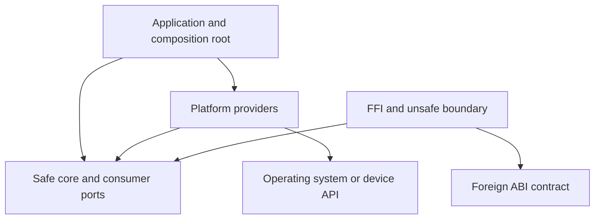
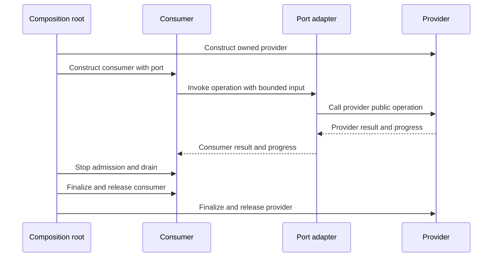

<!--
SPDX-FileCopyrightText: 2026 Rafael V. Volkmer <rafael.v.volkmer@gmail.com>
SPDX-License-Identifier: GPL-3.0-only
-->

# Rust Module Architecture

Use this guide to assign state, interfaces, dependencies, unsafe invariants and release artifacts to owners.
Apply the [code standard](rust-code-standard.md) for implementation, profiles and deviations, and the
[pitfalls catalogue](rust-common-pitfalls.md) for failure-oriented review. The architecture must remain
understandable from these Rust documents.

<a id="rule-index"></a>

<details>
<summary><strong>On this page</strong></summary>

<details>
<summary>Boundary ownership records</summary>

- [RMOD-033: Own the native allocation transfer record](#rmod-033)
- [RMOD-034: Assign notification and payload publication to one protocol](#rmod-034)

</details>

- [Module and crate model](#module-and-crate-model)
- [Runtime port flow](#runtime-callback-flow)
- [Binding lifecycle](#binding-lifecycle)
- [From source to release](#from-source-to-release)
- [Architecture controls](#architecture-controls)
- [Appendix A. Complete composition and build example](#complete-composition-example)
- [Build and release evidence](#build-and-release-evidence)
- [Links and references](#references)

<details>
<summary>Module ownership and visibility</summary>

- [RMOD-001: Choose one owner for each invariant](#rmod-001)
- [RMOD-002: Use the narrowest useful visibility](#rmod-002)
- [RMOD-003: Separate public facade from implementation](#rmod-003)
- [RMOD-004: Keep dependency direction acyclic and owned](#rmod-004)

</details>

<details>
<summary>Ports, composition and contract types</summary>

- [RMOD-005: Give ports to the consumer](#rmod-005)
- [RMOD-006: Let adapters own semantic translation](#rmod-006)
- [RMOD-007: Keep composition and configuration at the root](#rmod-007)
- [RMOD-008: Keep contract types independent of providers](#rmod-008)
- [RMOD-009: Treat trait extension as an API decision](#rmod-009)
- [RMOD-010: Select generics at the boundary that benefits](#rmod-010)

</details>

<details>
<summary>Resources, unsafe and FFI lifecycle</summary>

- [RMOD-011: Transfer resource ownership explicitly](#rmod-011)
- [RMOD-012: Name arena, pool and retained-view lifetimes](#rmod-012)
- [RMOD-013: Isolate unsafe representation and native ABI](#rmod-013)
- [RMOD-014: Version foreign interfaces separately from Rust APIs](#rmod-014)
- [RMOD-015: Make callbacks a retained capability](#rmod-015)

</details>

<details>
<summary>Compilation, platforms and packaging</summary>

- [RMOD-016: Let Cargo describe the build graph](#rmod-016)
- [RMOD-017: Centralize workspace policy without hiding package needs](#rmod-017)
- [RMOD-018: Isolate platform selection](#rmod-018)
- [RMOD-019: Own generated bindings and build scripts](#rmod-019)
- [RMOD-020: Separate compilation, packaging and execution evidence](#rmod-020)

</details>

<details>
<summary>Concurrency, hardware and security ownership</summary>

- [RMOD-021: Give tasks and threads a lifecycle owner](#rmod-021)
- [RMOD-022: Encapsulate synchronization protocols](#rmod-022)
- [RMOD-023: Assign cancellation and backpressure to the operation owner](#rmod-023)
- [RMOD-024: Give hardware policy one owner](#rmod-024)
- [RMOD-025: Assign each trust boundary and secret to an owner](#rmod-025)
- [RMOD-026: Keep critical-profile assurance separate and traceable](#rmod-026)
- [RMOD-027: Treat dependencies and plugins as release inputs](#rmod-027)

</details>

<details>
<summary>Optimization, release and verification</summary>

- [RMOD-028: Give optimized backends a portable contract](#rmod-028)
- [RMOD-029: Own specialization and topology changes](#rmod-029)
- [RMOD-030: Make release compatibility and hardening explicit](#rmod-030)
- [RMOD-031: Test through the boundary being promised](#rmod-031)
- [RMOD-032: Keep architecture and documentation checks honest](#rmod-032)

</details>

</details>

---

## Module and crate model

A module organizes names and privacy inside a crate. A crate is a compilation and dependency unit.
A Cargo package can contain a library and binaries; a workspace coordinates packages, resolution and shared
policy. Separate crates when independent ownership, reuse, platform isolation or dependency control warrants
it. A directory alone does not create a privacy, process or security boundary.

Use this representative structure when those roles exist; a small program does not need empty layers:

```text
workspace/
├── crates/
│   ├── buffer_core/  safe domain types, algorithms, owned state, consumer ports
│   │   └── src/
│   │       ├── lib.rs  selected public exports
│   │       ├── buffer.rs  implementation and private helpers
│   │       └── ports.rs  consumer-owned contracts
│   ├── buffer_platform/  OS implementations of ports
│   │   └── src/
│   │       ├── linux.rs  cfg-gated Linux adapter
│   │       └── windows.rs  cfg-gated Windows adapter
│   ├── buffer_ffi/  C ABI, raw handles, checked conversion, unsafe owner
│   └── buffer_app/  configuration, composition, task supervision and shutdown
└── tests/  external consumers, native ABI and package-install fixtures
```

The application selects implementations and passes them to the core. Platform and FFI adapters translate
at the edge. The core does not import the application or inspect provider-private state. Cross-domain
collaboration uses a consumer-owned trait, callback or message contract. Ordinary implementation modules
inside one owner may call each other directly; do not manufacture trait indirection for every helper.



The arrows show source dependencies. At runtime, a core operation can call an injected provider through its
port. `unsafe` belongs to a reviewed implementation boundary. It grants no permission to weaken privacy,
validation or ownership in other layers. A separate unsafe crate can help review, but its safe constructors
and mutators remain part of the soundness argument.

<a id="runtime-callback-flow"></a>

### Runtime port flow

The root owns provider selection. The consumer invokes its port and receives a result in its own error
vocabulary; the adapter translates provider-specific meaning. The synchronous call below borrows the provider
for the duration of the operation. Retained or asynchronous callbacks need the additional RMOD-015 contract.



<a id="binding-lifecycle"></a>

### Binding lifecycle

Construction acquires resources without publishing an incomplete instance. Binding supplies required ports
and establishes their lifetime. Starting makes the operation available to consumers. Stopping rejects new
work, draining finishes existing users, and finalization reports fallible external completion before owners
are dropped. A single synchronous value may combine these stages; a service must document where they differ.

| Transition | Owner obligation | Failure state to test |
| --- | --- | --- |
| Construct | Retain each acquired owner until construction succeeds. | Partial construction releases acquired resources. |
| Bind | Establish mandatory ports, lifetime and authority. | Invalid binding leaves no published usable instance. |
| Start | Publish readiness after initialization. | Failed startup cannot accept work. |
| Operate | Enforce bounds, ownership and reentry rules. | Error/cancellation leaves the documented state and progress. |
| Stop and drain | Block new admission and retain state for active users. | Late callbacks and blocked workers cannot outlive context. |
| Finalize | Report fallible flush/commit/close before releasing owners. | Preserve primary errors and identify incomplete completion. |
| Drop | Release owned resources without adding hidden caller obligations. | Leaking a value must not allow a safe client to trigger UB. |

<a id="from-source-to-release"></a>

### From source to release

A reviewed source graph becomes a Cargo build graph for a particular compiler, target and feature set.
The linker produces the selected Rust/native artifact. Packaging selects the files and metadata that consumers
receive. Installation and foreign-consumer tests establish that this distribution works outside the workspace.
No earlier stage substitutes for the evidence owned by a later stage.

```text
source + manifest + lock + generated/native inputs
  -> compile with the selected compiler/target/features
  -> link the intended artifact and inspect exports
  -> execute contract, platform and compatibility tests
  -> package a finite reviewed file set
  -> install into a clean consumer environment
  -> retain release identity, provenance and verification results
```

---

## Architecture controls

These are project requirements unless explicitly identified as review choices. Apply the standard's deviation
record and profile selection. Each rule names its practical verification obligation.

---

<a id="rmod-001"></a>

### RMOD-001: Choose one owner for each invariant

**Class:** ARCHITECTURE. **Obligation:** project requirement.

List the types and operations that maintain an invariant, including safe code used by unsafe internals.
Keep them under one review owner. Examples include buffer length/capacity, handle open/closed state and
callback registration/drain state. Do not let peers mutate those fields through convenience exports.

**Rationale:** A single review boundary makes it possible to enumerate all paths that can break an invariant.

**Verification design:** Enumerate construction, mutation, destruction and serialization paths for the invariant.

**Related controls:** [RUST-010](rust-code-standard.md#rust-010), [RUST-018](rust-code-standard.md#rust-018).

#### Local examples

**Layout example (not executable):**

```text
Buffer owner -> private length/capacity -> checked append and clear
```

**Noncompliant boundary (do not copy):**

```text
Peer -> direct mutation of Buffer capacity
```

---

<a id="rmod-002"></a>

### RMOD-002: Use the narrowest useful visibility

**Class:** ARCHITECTURE. **Obligation:** project requirement.

Start private. Use `pub(super)` or `pub(in ...)` when only an enclosing owner needs access, and `pub(crate)`
for a deliberate crate-wide interface. `pub` is a compatibility commitment when reachable through the public
module/export graph. Unit-test access to private items is not a reason to publish them.

**Rationale:** Visibility should match the consumers that need a contract.

**Verification design:** Inspect exports with an external consumer, not only in-crate tests.

**Related controls:** [RUST-013](rust-code-standard.md#rust-013), [RUST-017](rust-code-standard.md#rust-017).

#### Local examples

**Layout example (not executable):**

```text
one module: private
one parent owner: pub(super)
crate contract: pub(crate)
external consumer: pub
```

**Noncompliant boundary (do not copy):**

```text
Make helpers pub so an integration test can inspect them
```

---

<a id="rmod-003"></a>

### RMOD-003: Separate public facade from implementation

**Class:** ARCHITECTURE. **Obligation:** project requirement.

Keep public reexports finite and intentional. Private modules may back a small stable facade. Avoid public
fields or dependency types that expose storage, locks or platform choices without a use case.
Consumers should depend on semantic operations and documented values.

**Rationale:** The facade can remain stable while the owner changes storage and synchronization.

**Verification design:** Compare the facade and generated documentation after implementation changes.

**Related controls:** [RUST-013](rust-code-standard.md#rust-013), [RUST-055](rust-code-standard.md#rust-055).

#### Local examples

**Layout example (not executable):**

```text
lib.rs -> selected pub use -> private implementation
```

**Noncompliant boundary (do not copy):**

```text
lib.rs -> pub use internals::*
```

---

<a id="rmod-004"></a>

### RMOD-004: Keep dependency direction acyclic and owned

**Class:** ARCHITECTURE. **Obligation:** project requirement.

Core/domain crates depend on approved foundational contracts. Infrastructure implements their ports;
application roots select providers. Review both direct and transitive edges, including build/dev dependencies.
A compilation-successful graph can still invert product ownership.

**Rationale:** A provider dependency in the core prevents independent substitution and compilation.

**Verification design:** Inspect `cargo metadata` and `cargo tree` for every supported feature configuration.

**Related controls:** [RUST-053](rust-code-standard.md#rust-053), [RUST-054](rust-code-standard.md#rust-054).

#### Local examples

**Layout example (not executable):**

```text
application -> core
application -> platform
platform -> core port
```

**Noncompliant boundary (do not copy):**

```text
core -> platform -> application -> core
```

---

<a id="rmod-005"></a>

### RMOD-005: Give ports to the consumer

**Class:** ARCHITECTURE. **Obligation:** project requirement.

Define the operations, errors, ownership and progress guarantees the consumer needs. Use a trait for a
cohesive capability, a closure for a small operation or messages when decoupled scheduling is part of the
contract. Do not pass a provider's entire service object merely to access one operation.

**Rationale:** The consumer can test its behavior with only the capability it needs.

**Verification design:** Implement a minimal mock without importing the production provider.

**Related controls:** [RUST-019](rust-code-standard.md#rust-019), [RUST-004](rust-code-standard.md#rust-004).

#### Local examples

**Layout example (not executable):**

```text
consumer owns Sink trait -> provider implements Sink
```

**Noncompliant boundary (do not copy):**

```text
consumer imports provider::InternalWriter and edits its fields
```

---

<a id="rmod-006"></a>

### RMOD-006: Let adapters own semantic translation

**Class:** ARCHITECTURE. **Obligation:** project requirement.

Map native/provider errors, units, encodings, ownership and partial progress to the consumer's contract.
Keep domain policy out of raw FFI translation. An adapter may depend on both public contracts it connects,
but not on either side's private representation.

**Rationale:** Boundary translation belongs where both public meanings can be compared.

**Verification design:** Test every mapping, including unknown provider results and failure after partial progress.
Context: [Microsoft FFI guidance][ms-ffi].

**Related controls:** [RUST-006](rust-code-standard.md#rust-006), [RUST-011](rust-code-standard.md#rust-011).

#### Local examples

**Layout example (not executable):**

```text
native result -> adapter mapping -> consumer Result
```

**Noncompliant boundary (do not copy):**

```text
core guesses native errno and platform integer widths
```

---

<a id="rmod-007"></a>

### RMOD-007: Keep composition and configuration at the root

**Class:** ARCHITECTURE. **Obligation:** project requirement.

The executable or embedding host resolves configuration, selects backends and constructs owners. Reusable
libraries accept explicit capabilities instead of reading hidden environment state or choosing global
providers during import/initialization. A one-file tool may compose directly without extra crates.

**Rationale:** Explicit composition exposes configuration and dependency lifetime to the application owner.

**Verification design:** Construct the same core with two distinct providers in one process.

**Related controls:** [RUST-015](rust-code-standard.md#rust-015), [RUST-044](rust-code-standard.md#rust-044).

#### Local examples

**Layout example (not executable):**

```text
root -> read configuration -> construct providers -> bind consumers
```

**Noncompliant boundary (do not copy):**

```text
library constructor -> read environment -> replace global provider
```

---

<a id="rmod-008"></a>

### RMOD-008: Keep contract types independent of providers

**Class:** ARCHITECTURE. **Obligation:** project requirement.

Place DTOs and port errors beside their owning interface, or in a small contract crate when multiple
independent consumers need them. Do not create a universal “common” crate that accumulates unrelated domains.
Prefer borrowed slices and typed values to opaque unvalidated bags of state.

**Rationale:** A leaf contract can be reused without importing unrelated implementation authority.

**Verification design:** Build the contract/core without production platform dependencies.

**Related controls:** [RUST-013](rust-code-standard.md#rust-013), [RUST-018](rust-code-standard.md#rust-018).

#### Local examples

**Layout example (not executable):**

```text
ports.rs -> request/response types
provider -> ports.rs
```

**Noncompliant boundary (do not copy):**

```text
ports.rs -> initialize filesystem provider at module load
```

---

<a id="rmod-009"></a>

### RMOD-009: Treat trait extension as an API decision

**Class:** ARCHITECTURE. **Obligation:** project requirement.

Seal a trait when only the owner may implement it; leave it open when downstream implementation is intended.
Document obligations and associated-type meaning. A safe trait method cannot require unchecked safety
preconditions from implementors. Public async traits need explicit decisions about returned futures,
`Send` requirements and dynamic-dispatch support.

**Rationale:** Downstream implementors need a stable and enforceable set of obligations.

**Verification design:** Compile representative downstream implementations and incompatible-use fixtures.

**Related controls:** [RUST-018](rust-code-standard.md#rust-018), [RUST-055](rust-code-standard.md#rust-055).

#### Local examples

**Layout example (not executable):**

```text
open trait -> documented safe implementor contract
sealed trait -> owner-controlled implementations
```

**Noncompliant boundary (do not copy):**

```text
safe trait -> hidden promise required by unchecked pointer access
```

---

<a id="rmod-010"></a>

### RMOD-010: Select generics at the boundary that benefits

**Class:** ARCHITECTURE. **Obligation:** project requirement.

Use compile-time substitution for fixed providers and runtime dispatch for dynamic selection. Keep large
implementation bodies out of unnecessary generic expansion when compile time or binary size becomes a
problem. Do not apply one project's preference for concrete parameters to every public library interface.

**Rationale:** Dispatch and generics have different substitution and build-cost tradeoffs.

**Verification design:** Measure representative consumer builds and inspect the trait object's required lifetime.
Context: [rust-analyzer style][ra], [Chromium API design][chromium].

**Related controls:** [RUST-019](rust-code-standard.md#rust-019), [RUST-009](rust-code-standard.md#rust-009).

#### Local examples

**Layout example (not executable):**

```text
public generic adapter -> compact concrete core
```

**Noncompliant boundary (do not copy):**

```text
generic implementation duplicated across every internal call site
```

---

<a id="rmod-011"></a>

### RMOD-011: Transfer resource ownership explicitly

**Class:** ARCHITECTURE. **Obligation:** project requirement.

Move an owner when transferring a resource; borrow when the caller retains responsibility. A resource handle
must identify its valid operations after close or transfer. Return acquired owners only after construction
succeeds. On failure, either retain ownership or document how the error returns it to the caller.

**Rationale:** Success and failure paths must agree about which party destroys a resource.

**Verification design:** Count acquisitions/releases across all constructor and transfer failures.

**Related controls:** [RUST-008](rust-code-standard.md#rust-008), [RUST-026](rust-code-standard.md#rust-026).

#### Local examples

**Layout example (not executable):**

```text
create -> owned handle
borrow -> temporary view
consume -> transferred owner
```

**Noncompliant boundary (do not copy):**

```text
failure -> both caller and callee believe they own destruction
```

---

<a id="rmod-012"></a>

### RMOD-012: Name arena, pool and retained-view lifetimes

**Class:** ARCHITECTURE. **Obligation:** project requirement.

An arena owner controls reset and destruction. Borrowed outputs must not outlive that owner or a reset that
invalidates them. Cross-owner freeing belongs to a synchronization contract. Keeping an address in a cache
requires a retention or generation-validation mechanism; an integer ID alone is not a lifetime proof.

**Rationale:** Reset and reuse can invalidate a retained view without dropping the outer arena object.

**Verification design:** Use compile-fail lifetime tests and generation/reuse regression cases.

**Related controls:** [RUST-008](rust-code-standard.md#rust-008), [RUST-024](rust-code-standard.md#rust-024),
[RUST-028](rust-code-standard.md#rust-028).

#### Local examples

**Layout example (not executable):**

```text
arena borrow -> operation -> end borrow -> reset
```

**Noncompliant boundary (do not copy):**

```text
cache raw view -> reset arena -> reuse cached view
```

---

<a id="rmod-013"></a>

### RMOD-013: Isolate unsafe representation and native ABI

**Class:** ARCHITECTURE. **Obligation:** project requirement.

Keep raw memory, handle reconstruction and native declarations in a named module or crate. Expose safe
operations only after all safety preconditions follow from types, internal invariants or validation.
Preserve a small documented unsafe API when external facts cannot be checked safely.

**Rationale:** An unsafe implementation is sound only when its safe surface preserves the complete invariant.

**Verification design:** Audit all safe entry points, including derives and drop paths, with the unsafe implementation.
Context: [std safety comments][safety].

**Related controls:** [RUST-003](rust-code-standard.md#rust-003), [RUST-010](rust-code-standard.md#rust-010),
[RUST-029](rust-code-standard.md#rust-029).

#### Local examples

**Layout example (not executable):**

```text
checked constructor + private fields + reviewed Drop -> unsafe primitive
```

**Noncompliant boundary (do not copy):**

```text
safe setter changes initialized length without checking storage
```

---

<a id="rmod-014"></a>

### RMOD-014: Version foreign interfaces separately from Rust APIs

**Class:** ARCHITECTURE. **Obligation:** project requirement.

Use explicit calling conventions, ownership functions, symbol names and compatible records. Do not pass Rust
trait objects or containers as a stable ABI. Native errors become declared statuses; opaque handles carry
only the authority promised by their API. Keep symbol namespaces unique and inspect exported symbols.

**Rationale:** A Rust source interface and a foreign binary interface have different compatibility contracts.

**Verification design:** Build real foreign consumers and compare size/alignment/signatures for each supported ABI.

**Related controls:** [RUST-011](rust-code-standard.md#rust-011), [RUST-013](rust-code-standard.md#rust-013),
[RUST-055](rust-code-standard.md#rust-055).

#### Local examples

**Layout example (not executable):**

```text
versioned native handle API -> owned Rust implementation
```

**Noncompliant boundary (do not copy):**

```text
foreign consumer depends on Vec or dyn Trait memory layout
```

---

<a id="rmod-015"></a>

### RMOD-015: Make callbacks a retained capability

**Class:** ARCHITECTURE. **Obligation:** project requirement.

Record the callback ABI, context lifetime, thread, reentry, allowed effects and error/unwind behavior.
Construction validates mandatory callback availability. Teardown disables new entry, unregisters, drains
active callbacks and then releases context and library code. Protect the actual state transition from races.

**Rationale:** Unregistration alone may not finish callbacks already in flight.

**Verification design:** Test late callbacks, reentry, concurrent close and failure during registration.

**Related controls:** [RUST-034](rust-code-standard.md#rust-034), [RUST-035](rust-code-standard.md#rust-035).

#### Local examples

**Layout example (not executable):**

```text
stop entry -> unregister -> drain -> free context -> unload code
```

**Noncompliant boundary (do not copy):**

```text
free context -> unregister callbacks later
```

---

<a id="rmod-016"></a>

### RMOD-016: Let Cargo describe the build graph

**Class:** ARCHITECTURE. **Obligation:** project requirement.

A package owns its source targets and declared dependencies. Cargo invokes rustc and the linker; do not
recreate C translation-unit aggregation as a Rust architecture rule. `rlib` serves Rust linkage; `staticlib`
and `cdylib` serve appropriate native-consumer artifacts. A `dylib` is not a promise of stable Rust ABI.

**Rationale:** Cargo target kinds describe consumer artifacts; source directories do not define linkage.

**Verification design:** Build the intended artifact kinds and consume each through its documented integration path.

**Related controls:** [RUST-011](rust-code-standard.md#rust-011), [RUST-054](rust-code-standard.md#rust-054).

#### Local examples

**Layout example (not executable):**

```text
Rust consumer: rlib
native static consumer: staticlib
native dynamic consumer: cdylib
```

**Noncompliant boundary (do not copy):**

```text
publish a Rust dylib and promise stable compiler-independent ABI
```

---

<a id="rmod-017"></a>

### RMOD-017: Centralize workspace policy without hiding package needs

**Class:** ARCHITECTURE. **Obligation:** project requirement.

Share toolchain, resolver and lint policy where appropriate. Packages opt into workspace inheritance and
state edition, MSRV, features and dependency requirements. Profiles belong at the controlling workspace.
Do not let a dev-dependency or root feature accidentally supply what a published package needs.

**Rationale:** Workspace convenience must not conceal the published package contract.

**Verification design:** Build/package the leaf crate independently from a clean consumer workspace.
Context: [Microsoft project guidance][ms-project].

**Related controls:** [RUST-053](rust-code-standard.md#rust-053), [RUST-055](rust-code-standard.md#rust-055).

#### Local examples

**Layout example (not executable):**

```text
workspace policy -> explicit package inheritance -> clean leaf consumer
```

**Noncompliant boundary (do not copy):**

```text
leaf package builds only when an unrelated sibling enables a feature
```

---

<a id="rmod-018"></a>

### RMOD-018: Isolate platform selection

**Class:** ARCHITECTURE. **Obligation:** project requirement.

One compatibility owner maps target `cfg`, OS facilities and optional native libraries into port providers.
Document unsupported combinations and fail with a useful diagnostic. Features remain additive where possible;
backend exclusivity belongs in a reviewed matrix. Host build scripts and target code run in different contexts.

**Rationale:** The target running the binary can differ from the host running its build script.

**Verification design:** Build each target/feature product and inspect target-specific dependency resolution.

**Related controls:** [RUST-043](rust-code-standard.md#rust-043), [RUST-053](rust-code-standard.md#rust-053).

#### Local examples

**Layout example (not executable):**

```text
target configuration -> compatible provider -> semantic port
```

**Noncompliant boundary (do not copy):**

```text
build host CPU features -> unconditional deployed ISA choice
```

---

<a id="rmod-019"></a>

### RMOD-019: Own generated bindings and build scripts

**Class:** ARCHITECTURE. **Obligation:** project requirement.

Keep binding generation inputs, generator versions, target headers and flags reproducible. Build scripts
must declare relevant rerun inputs and controlled environment dependencies. Review proc macros/build scripts
as executable supply-chain code; credentials must not enter untrusted builds.

**Rationale:** Regeneration needs enough information to recreate the interface for the actual target.

**Verification design:** Regenerate and compare output in a clean environment; inspect native link directives.

**Related controls:** [RUST-052](rust-code-standard.md#rust-052), [RUST-054](rust-code-standard.md#rust-054).

#### Local examples

**Layout example (not executable):**

```text
headers + generator revision + target flags -> bindings -> reviewed diff
```

**Noncompliant boundary (do not copy):**

```text
edit generated bindings by hand and discard the generating inputs
```

---

<a id="rmod-020"></a>

### RMOD-020: Separate compilation, packaging and execution evidence

**Class:** ARCHITECTURE. **Obligation:** project requirement.

A successful `cargo check` does not link or execute the final product. A cross-build does not test runtime
behavior. Check archive/shared-library contents, native link order where applicable, runtime dependencies and
package manifests. A linker map describes placement; an export list defines the allowed external symbols.

**Rationale:** Compilation, linking and deployment reveal different failures.

**Verification design:** Run an installed external consumer and retain artifact identity and loader configuration.

**Related controls:** [RUST-058](rust-code-standard.md#rust-058), [RUST-059](rust-code-standard.md#rust-059).

#### Local examples

**Layout example (not executable):**

```text
cargo check -> build/link artifact -> clean installed consumer -> execution
```

**Noncompliant boundary (do not copy):**

```text
cargo check -> claim native shared-library deployment passed
```

---

<a id="rmod-021"></a>

### RMOD-021: Give tasks and threads a lifecycle owner

**Class:** ARCHITECTURE. **Obligation:** project requirement.

The spawning owner defines start, readiness, stop, drain, join and error collection. Keep the resource owners
alive through worker completion. Do not detach work merely to silence an unused handle. Ensure failures
before readiness do not leave the application waiting forever.

**Rationale:** Shutdown must keep resources alive until dependent execution has ended.

**Verification design:** Inject worker failure during startup, active service and shutdown.

**Related controls:** [RUST-026](rust-code-standard.md#rust-026), [RUST-039](rust-code-standard.md#rust-039).

#### Local examples

**Layout example (not executable):**

```text
request stop -> stop admission -> drain work -> join -> release resources
```

**Noncompliant boundary (do not copy):**

```text
drop resource owner while detached worker continues
```

---

<a id="rmod-022"></a>

### RMOD-022: Encapsulate synchronization protocols

**Class:** ARCHITECTURE. **Obligation:** project requirement.

Expose operations such as publish/acquire or reserve/commit rather than raw atomic fields. Encode lock-state
preconditions with guards where practical. Document lock ordering, retained state and reclamation separately.
Avoid calling arbitrary consumer code under an internal lock.

**Rationale:** Semantic synchronization APIs keep ordering and reclamation obligations under one owner.

**Verification design:** Review the protocol diagram and exercise model/stress tests plus callback reentry.

**Related controls:** [RUST-036](rust-code-standard.md#rust-036), [RUST-040](rust-code-standard.md#rust-040),
[RUST-041](rust-code-standard.md#rust-041).

#### Local examples

**Layout example (not executable):**

```text
publish(value), acquire(), retire() -> private atomic protocol
```

**Noncompliant boundary (do not copy):**

```text
pub atomic_pointer and pub ready_flag updated by peers
```

---

<a id="rmod-023"></a>

### RMOD-023: Assign cancellation and backpressure to the operation owner

**Class:** ARCHITECTURE. **Obligation:** project requirement.

The consumer defines whether cancellation leaves no effect, partial progress or a completed action with a
lost reply. Bound queues and outstanding requests; define shutdown for blocked producers/consumers.
Use idempotency or transactional state when retries follow ambiguous completion.

**Rationale:** Lost replies and partial effects need explicit retry semantics.

**Verification design:** Cancel at each await point and inspect both parties' state, including pending resources.

**Related controls:** [RUST-038](rust-code-standard.md#rust-038), [RUST-039](rust-code-standard.md#rust-039),
[RUST-045](rust-code-standard.md#rust-045).

#### Local examples

**Layout example (not executable):**

```text
bounded request -> accepted -> committed -> acknowledged
cancellation after commit -> query or idempotent retry
```

**Noncompliant boundary (do not copy):**

```text
timeout -> assume nothing happened -> repeat destructive operation
```

---

<a id="rmod-024"></a>

### RMOD-024: Give hardware policy one owner

**Class:** ARCHITECTURE. **Obligation:** project requirement.

MMIO, DMA, interrupts, clocks, affinity, NUMA placement, cache maintenance and page residency belong to
platform/hardware adapters. The safe core receives semantic capabilities and cannot assume a device honors
Rust borrow lifetimes. Interrupt and real-time profiles need bounded work and approved synchronization.

**Rationale:** CPU ownership and device ownership need a platform-defined handoff.

**Verification design:** Match platform assumptions to device documentation and actual-target evidence.

**Related controls:** [RUST-042](rust-code-standard.md#rust-042), [RUST-043](rust-code-standard.md#rust-043).

#### Local examples

**Layout example (not executable):**

```text
CPU writes -> cache maintenance -> device ownership -> completion -> CPU read
```

**Noncompliant boundary (do not copy):**

```text
mutable slice borrow -> assume DMA cannot access the same bytes
```

---

<a id="rmod-025"></a>

### RMOD-025: Assign each trust boundary and secret to an owner

**Class:** ARCHITECTURE. **Obligation:** project requirement.

File, process, network, loader and privileged operations require an authority-bearing adapter. Production
security configuration is a controlled input, not a test default. The secret owner selects comparison,
erasure and diagnostic policy. Libraries report failures through results or injected diagnostics ports.

**Rationale:** Authority cannot be reconstructed from a convenient string or a private module path.

**Verification design:** Trace external input to effects and test unavailable/denied authority with no privileged
mutation.

**Related controls:** [RUST-048](rust-code-standard.md#rust-048), [RUST-049](rust-code-standard.md#rust-049),
[RUST-050](rust-code-standard.md#rust-050).

#### Local examples

**Layout example (not executable):**

```text
authorized capability -> boundary adapter -> permitted effect
```

**Noncompliant boundary (do not copy):**

```text
core receives arbitrary path and treats prefix validation as authority
```

---

<a id="rmod-026"></a>

### RMOD-026: Keep critical-profile assurance separate and traceable

**Class:** ARCHITECTURE. **Obligation:** project requirement.

Select a documented subset, hazards, fault model and tool qualification scope. Record rule adoption maturity
and justified deviations. Verify fault-resistant sequences in the compiled product where required.
A language safety argument does not establish electrical, timing, availability or security requirements.

**Rationale:** A product claim requires traceability to the chosen hazard and fault model.

**Verification design:** Link each product requirement to an owner, implementation boundary and retained evidence.

**Related controls:** [RUST-059](rust-code-standard.md#rust-059), [RUST-060](rust-code-standard.md#rust-060).

#### Local examples

**Layout example (not executable):**

```text
hazard -> requirement -> owned control -> test/proof -> release evidence
```

**Noncompliant boundary (do not copy):**

```text
formatting and lint pass -> certification claim
```

---

<a id="rmod-027"></a>

### RMOD-027: Treat dependencies and plugins as release inputs

**Class:** ARCHITECTURE. **Obligation:** project requirement.

Record source identities, locks, licenses, advisories, native artifacts and provenance. A plugin boundary
needs version negotiation, capability limits and teardown before unload. Strip release artifacts only under
a debug-symbol retention and symbolication policy; stripped names are not a security isolation mechanism.

**Rationale:** A reproducible release must identify all executable and native inputs.

**Verification design:** Install the distribution in a clean environment and test allowed exports and dependencies.

**Related controls:** [RUST-051](rust-code-standard.md#rust-051), [RUST-054](rust-code-standard.md#rust-054).

#### Local examples

**Layout example (not executable):**

```text
reviewed source + locks + native artifacts + licenses -> release manifest
```

**Noncompliant boundary (do not copy):**

```text
plugin path from user input -> unrestricted process loading
```

---

<a id="rmod-028"></a>

### RMOD-028: Give optimized backends a portable contract

**Class:** ARCHITECTURE. **Obligation:** project requirement.

The optimization owner maintains an independent reference, feature detection and backend-specific code.
Keep cache-line padding, vector length and platform layout out of portable public types unless part of an
explicit ABI contract. Tests can force each supported backend and observe selection without exporting private
implementation details to ordinary consumers.

**Rationale:** Equivalent outputs require an oracle independent of backend-specific shortcuts.

**Verification design:** Differential-test inputs, tails, failures and disabled-feature fallback on actual
supported targets.

**Related controls:** [RUST-058](rust-code-standard.md#rust-058), [RUST-059](rust-code-standard.md#rust-059).

#### Local examples

**Layout example (not executable):**

```text
portable oracle <- differential tests -> forced candidate backend
```

**Noncompliant boundary (do not copy):**

```text
candidate compared with another wrapper around the same candidate
```

---

<a id="rmod-029"></a>

### RMOD-029: Own specialization and topology changes

**Class:** ARCHITECTURE. **Obligation:** project requirement.

One owner controls backend selection, generated-code cache keys, affinity and topology policy. Freeze those
choices during use or synchronize replacement and reclamation. Cache invalidation includes semantics and
capabilities, not just input size. Preserve reports under the owner's optimization review record.

**Rationale:** Backend replacement changes both capability assumptions and code lifetime.

**Verification design:** Test configuration changes while users are active and prove which generation/backend executed.

**Related controls:** [RUST-041](rust-code-standard.md#rust-041), [RUST-051](rust-code-standard.md#rust-051).

#### Local examples

**Layout example (not executable):**

```text
publish generation -> acquire retained generation -> drain -> retire
```

**Noncompliant boundary (do not copy):**

```text
replace function pointer -> unload old code with active callers
```

---

<a id="rmod-030"></a>

### RMOD-030: Make release compatibility and hardening explicit

**Class:** ARCHITECTURE. **Obligation:** project requirement.

Define supported Rust API, foreign ABI, MSRV and platform baselines. Apply a named hardening profile suited
to each target, recording linker flags and runtime assumptions. Check public symbols, library versioning,
package contents and consumer compatibility before release. Separate debug information from shipped binaries
without losing the ability to diagnose a matching build.

**Rationale:** Hardening and compatibility apply to shipped artifacts and their actual loaders.

**Verification design:** Compare a prior release and inspect final artifacts, not only intermediate object files.

**Related controls:** [RUST-054](rust-code-standard.md#rust-054), [RUST-055](rust-code-standard.md#rust-055),
[RUST-059](rust-code-standard.md#rust-059).

#### Local examples

**Layout example (not executable):**

```text
release artifact -> symbols + ABI + loader + hardening checks
```

**Noncompliant boundary (do not copy):**

```text
check debug object files and assume the stripped release is equivalent
```

---

<a id="rmod-031"></a>

### RMOD-031: Test through the boundary being promised

**Class:** ARCHITECTURE. **Obligation:** project requirement.

Use in-module tests for owner internals and integration tests for the public API. Test consumer-owned ports
against both mocks and production providers. Compile-fail tests check restrictions; fault tests check state
and cleanup. Keep a clean package-consumer test to expose undeclared dependencies and export mistakes.

**Rationale:** A mock must satisfy the same contract as the production implementation.

**Verification design:** Map each claim to its test type and confirm tests do not require added public debug accessors.

**Related controls:** [RUST-045](rust-code-standard.md#rust-045), [RUST-046](rust-code-standard.md#rust-046),
[RUST-058](rust-code-standard.md#rust-058).

#### Local examples

**Layout example (not executable):**

```text
port conformance suite -> mock and real provider
```

**Noncompliant boundary (do not copy):**

```text
mock returns complete success where production reports partial progress
```

---

<a id="rmod-032"></a>

### RMOD-032: Keep architecture and documentation checks honest

**Class:** ARCHITECTURE. **Obligation:** project requirement.

Record the supported dependency graph, public exports, profiles and release artifacts. The current repository
has no Rust graph checker; a policy paragraph does not install one. Add enforcement as a reviewed change and
retain manual evidence until then. Keep links, rustdoc examples, diagrams and deviations current.

**Rationale:** A written rule does not establish that any tool has enforced it.

**Verification design:** Report exactly which checks ran and which claims still require product or target evidence.

**Related controls:** [RUST-002](rust-code-standard.md#rust-002), [RUST-004](rust-code-standard.md#rust-004),
[RUST-059](rust-code-standard.md#rust-059).

#### Local examples

**Layout example (not executable):**

```text
check inventory -> executed commands -> scoped results -> remaining gaps
```

**Noncompliant boundary (do not copy):**

```text
documentation names a graph checker that CI never invokes
```

---

<a id="complete-composition-example"></a>

## Appendix A. Complete composition and build example

This complete library illustrates a consumer-owned port, injected provider and bounded core. It has no FFI,
background tasks or allocation in the append operation. A provider must write the complete payload on success
and leave its visible content unchanged on error; providers supporting partial writes need a different port.
The `used` count represents accepted bytes, so the emitter updates it only after successful provider completion.

<!-- example-file: composition.rs -->
```rust
/// A sink that accepts a complete payload or leaves its state unchanged.
pub trait Sink {
    type Error;

    /// Sends one bounded payload.
    ///
    /// # Errors
    /// Returns the provider error without publishing a partial payload.
    fn send(&mut self, payload: &[u8]) -> Result<(), Self::Error>;
}

#[derive(Debug, PartialEq, Eq)]
pub enum SendError<E> {
    Limit,
    Provider(E),
}

/// Owns its sink and the accepted-byte budget.
pub struct Emitter<S> {
    sink: S,
    used: usize,
    limit: usize,
}

impl<S: Sink> Emitter<S> {
    #[must_use]
    pub fn new(sink: S, limit: usize) -> Self {
        Self {
            sink,
            used: 0,
            limit,
        }
    }

    /// Sends bytes and commits the budget only after provider success.
    ///
    /// # Errors
    /// Returns `Limit` before calling the provider if the budget is exceeded.
    /// Returns `Provider` if the sink rejects the complete payload.
    pub fn send(&mut self, payload: &[u8]) -> Result<(), SendError<S::Error>> {
        let next = self
            .used
            .checked_add(payload.len())
            .filter(|next| *next <= self.limit)
            .ok_or(SendError::Limit)?;
        self.sink.send(payload).map_err(SendError::Provider)?;
        self.used = next;
        Ok(())
    }

    /// Returns ownership of the provider for explicit finalization.
    pub fn into_sink(self) -> S {
        self.sink
    }
}

#[cfg(test)]
mod tests {
    use super::{Emitter, SendError, Sink};

    struct MemorySink {
        bytes: [u8; 4],
        used: usize,
        reject_once: bool,
    }

    impl Sink for MemorySink {
        type Error = &'static str;

        fn send(&mut self, payload: &[u8]) -> Result<(), Self::Error> {
            if self.reject_once {
                self.reject_once = false;
                return Err("injected rejection");
            }
            let end = self.used.checked_add(payload.len()).ok_or("overflow")?;
            let target = self.bytes.get_mut(self.used..end).ok_or("capacity")?;
            target.copy_from_slice(payload);
            self.used = end;
            Ok(())
        }
    }

    #[test]
    fn failed_provider_preserves_budget_and_success_commits() {
        let sink = MemorySink {
            bytes: [0; 4],
            used: 0,
            reject_once: true,
        };
        let mut emitter = Emitter::new(sink, 4);
        assert_eq!(
            emitter.send(b"ab"),
            Err(SendError::Provider("injected rejection"))
        );
        assert_eq!(emitter.send(b"abcd"), Ok(()));
        assert_eq!(emitter.send(b"x"), Err(SendError::Limit));
        let sink = emitter.into_sink();
        assert_eq!(&sink.bytes[..sink.used], b"abcd");
    }
}

// EOF
```

The test provider changes its fault-injection flag on rejection while preserving visible payload state.
Its fixture is not a full provider conformance suite. A production suite must also test empty input, resource
failure and every promised lifecycle behavior. This example demonstrates the dependency direction within
one file; separate-crate isolation needs the package checks below.

---

## Boundary ownership records

---

<a id="rmod-033"></a>

### RMOD-033: Own the native allocation transfer record

**Class:** ARCHITECTURE. **Obligation:** project requirement.

The adapter that creates a foreign buffer owns its transfer format and matching destruction operation.
Keep mutable pointer/length/capacity fields private to that boundary. Review any public unsafe consumer
as part of the same invariant surface. Do not require a foreign caller to reproduce Rust's allocator layout
from an element count. Prefer an opaque handle plus bounded access and a paired release API when exposing
allocation internals provides no required capability.

**Rationale:** Allocation ownership must survive language, package and shutdown boundaries.

**Verification design:** Build a consumer from shipped headers only. Exercise failed construction, transfer,
return and destruction with separate allocation counters. Review double-release prevention in the safe wrapper;
the raw foreign API must also document caller obligations.

**Contract example:** `native allocation owner -> opaque handle -> same owner's release operation`.

**Noncompliant boundary:** A peer module invents vector capacity or substitutes its own allocator at destruction.

**Related controls and API sources:** [RUST-085](rust-code-standard.md#rust-085),
[RUST-086](rust-code-standard.md#rust-086), [RMOD-013](#rmod-013).

---

<a id="rmod-034"></a>

### RMOD-034: Assign notification and payload publication to one protocol

**Class:** ARCHITECTURE. **Obligation:** project requirement.

The asynchronous adapter owns registration, readiness, payload visibility, cancellation and drain together.
Expose an operation contract to consumers instead of unrelated public flags and callback slots. Document
whether the wait state admits one waiter or multiple waiters and who owns the result after cancellation.
Keep executor-specific registration inside the adapter so the consumer cannot accidentally mix protocols.

**Rationale:** Separately correct atomics and wakers can compose into a lost notification or stale payload read.

**Verification design:** Review a transition table with waiting, ready, cancelled and drained states.
Model the actual implementation's ordering and exercise waker replacement. A single host test trace is not
a liveness proof; retain scheduling/model bounds and explicitly list native callbacks outside the model.

**Contract example:** `operation owner -> readiness + current waiter + result lifetime -> completion or drain`.

**Noncompliant boundary:** One module changes readiness while another independently discards the registered waiter.

**Related controls and API sources:** [RUST-087](rust-code-standard.md#rust-087),
[RUST-088](rust-code-standard.md#rust-088), [RMOD-023](#rmod-023).

---

## Build and release evidence

| Stage | Evidence |
| --- | --- |
| Source | Formatted code, rustdoc, lints, unsafe inventory and deviations. |
| Graph | Supported package/feature edges; core builds without concrete providers. |
| Compile | MSRV and pinned compiler across supported features and target triples. |
| Link | Final crate/native artifacts, export list, runtime libraries and hardening profile. |
| Test | Unit, external consumer, port conformance, fault and concurrency checks. |
| Package | Reviewed `cargo package --list` output and clean package-consumer build. |
| Install | Actual native/Rust consumer using only shipped files and declared dependencies. |
| Release | API/ABI comparison, provenance, source/license inventory and reproducibility evidence. |
| Optimize | Reference equivalence, forced backend coverage and retained measurements. |

For a library, run consumer tests with the public dependency alone so workspace/dev features cannot mask
missing requirements. For foreign artifacts, test the documented compiler/linker invocation and destruction
API. Ship the appropriate sources, headers, libraries, license notices and debug-symbol identity.

---

<a id="references"></a>

## Links and references

Sources share the [standard's revision and adoption policy](rust-code-standard.md#sources-and-revision-policy).
The rules here define project ownership choices; the references supply context rather than automatic adoption
of another project's complete architecture.

[ms-ffi]: https://microsoft.github.io/rust-guidelines/guidelines/ffi/index.html
[ms-project]: https://microsoft.github.io/rust-guidelines/guidelines/project/index.html
[ra]: https://rust-analyzer.github.io/book/contributing/style.html
[chromium]: https://chromium.googlesource.com/chromium/src/+/HEAD/docs/rust/api_design.md
[safety]: https://std-dev-guide.rust-lang.org/policy/safety-comments.html

<!-- EOF -->

